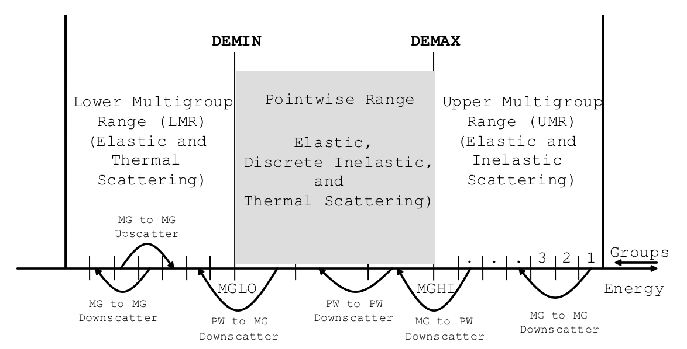
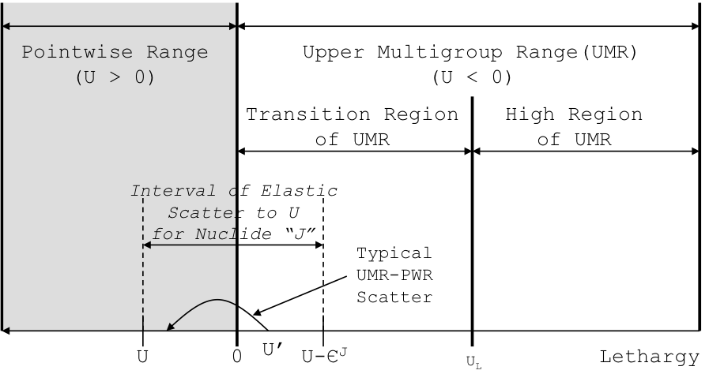
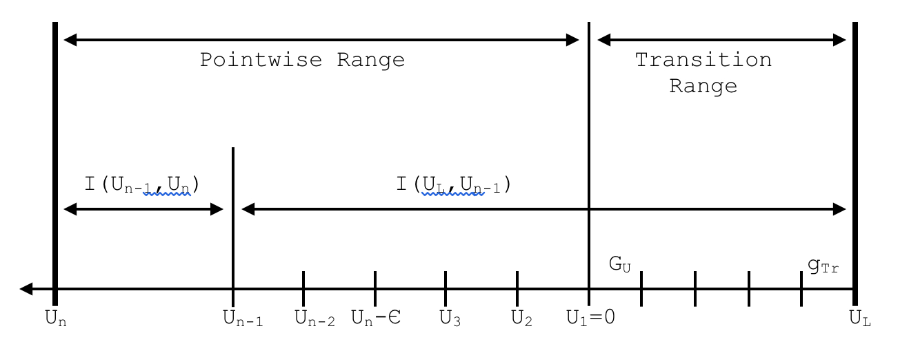

.. _7-4:

CENTRM: A Neutron Transport Code for Computing Continuous-Energy Spectra in General One-Dimensional Geometries and Two-Dimensional Lattice Cells
================================================================================================================================================

*M. L. Williams*

Abstract

CENTRM computes continuous-energy neutron spectra for infinite media,
general one-dimensional (1D) systems, and two-dimensional (2D) unit
cells in a lattice, by solving the Boltzmann transport equation using a
combination of pointwise and multigroup nuclear data. Several
calculational options are available, including a slowing-down
computation for homogeneous infinite media, 1D discrete ordinates in
slab, spherical, or cylindrical geometries; a simplified two-region
solution; and 2D method of characteristics for a unit cell within a
square-pitch lattice. In SCALE, CENTRM is used mainly to calculate
problem-specific fluxes on a fine energy mesh (10,000–70,000 points),
which may be used to generate self-shielded multigroup cross sections
for subsequent radiation transport computations.

ACKNOWLEDGMENTS

Several current and former ORNL staff made valuable contributions to the
CENTRM development. The author acknowledges the contributions of former
ORNL staff members D. F. Hollenbach and N. M. Greene; as well as current
staff member L. M. Petrie. Special thanks go to Kang-Seog Kim who
developed the 2D method of characteristics option for CENTRM. Portions
of the original code development were performed by M. Asgari as partial
fulfillment of his PhD dissertation research at Louisiana State
University (LSU); and Riyanto Raharjo from LSU made significant
programming contributions for the inelastic scattering and thermal
calculations.

.. _7-4-1:

Introduction
------------

CENTRM (**C**\ ontinuous **EN**\ ergy **TR**\ ansport **M**\ odule)
computes “continuous-energy” neutron spectra using various deterministic
approximations to the Boltzmann transport equation. Computational
methods are available for infinite media, general one-dimensional (1-D)
geometries, and two-dimensional (2D) unit cells in a square-pitch
lattice. The purpose of the code is to provide fluxes and flux moments
for applications that require a high resolution of the fine-structure
variation in the neutron energy spectrum. The major function of CENTRM
is to determine problem-specific fluxes for processing multigroup (MG)
data with the XSProc self-shielding module (Introduction in XSProc
chapter), which is executed by all SCALE MG sequences. XSProc calls an
application program interface (API) to perform a CENTRM calculation for
a representative model (e.g., a unit cell in a lattice), and then
utilizes the spectrum as a *problem-dependent* weight function for MG
averaging. The MG data processing is done in XSProc by calling an API
for the PMC code, which uses the CENTRM continuous-energy (CE) flux
spectra and cross-section data to calculate group-averaged
cross sections over some specified energy range. The resulting
application-specific library is used for MG neutron transport
calculations within SCALE sequences. In this approach the CENTRM/PMC
cross-section processing in XSProc becomes an active component in the
overall transport analysis. CENTRM can also be executed as a standalone
code, if the user provides all required input data and nuclear data
libraries; but execution through XSProc is much simpler and less prone
to error.

.. _7-4-1-1:

Description of problem solved
~~~~~~~~~~~~~~~~~~~~~~~~~~~~~

CENTRM uses a combination of MG and pointwise (PW) solution techniques
to solve the neutron transport equation over the energy range ~0 to
20 MeV. The calculated CE spectrum consists of PW values for the flux
per unit lethargy defined on a discrete energy mesh, for which a linear
variation of the flux between energy points is assumed. Depending on the
specified transport approximation, the flux spectrum may vary as a
function of space and direction, in addition to energy. Spherical
harmonic moments of the angular flux, which may be useful in processing
MG matrices for higher order moments of the scattering cross section,
can also be determined as a function of space and energy mesh.

CENTRM solves the fixed-source (inhomogeneous) form of the transport
equation, with a user-specified fixed source term. The input source may
correspond to MG histogram spectra for volumetric or surface sources or
it may be a “fission source” which has a continuous-energy
fission-spectrum distribution (computed internally) appropriate for each
fissionable mixture. Note that eigenvalue calculations are *not*
performed in CENTRM—these must be performed by downstream MG transport
codes that utilize the self-shielded data processed with the CENTRM
spectra.

.. _7-4-1-2:

Nuclear data required for CENTRM
~~~~~~~~~~~~~~~~~~~~~~~~~~~~~~~~

A MG cross section library, a CE cross section library, and a CE thermal
kernel [S(α, β)] library are required for the CENTRM transport
calculation. During XSProc execution for a given unit cell in the CELL
DATA block, the MG library specified in the input is processed by BONAMI
prior to the CENTRM calculation, in order to provide self-shielded data
based on the Bondarenko approximation for the MG component of the CENTRM
solution. The shielded MG cross sections are also used in CENTRM to
correct infinitely dilute CE data in the unresolved resoance range. The
CRAWDAD module is executed by XSProc to generate the CENTRM CE cross
section and thermal kernel libraries, respectively, by concatenating
discrete PW data read from individual files for the nuclides in the unit
cell mixtures. CE resonance profiles are based strictly on
specifications in the nuclear data evaluations; e.g., Reich-Moore
formalism is specified for most materials in ENDF/B-VII. PW
data in the CENTRM library are processed such that values at any energy
can be obtained by linear interpolation within some error tolerance
specified during the library generation (usually ~0.1% or less). CRAWDAD
also interpolates the CE cross section data and the Legendre moments of
the thermal scattering kernels to the appropriate temperatures for the
unit cell mixtures. The format of the CENTRM library is described in
:ref:`7-4-6-1`.

.. _7-4-1-3:

Code assumptions and features
~~~~~~~~~~~~~~~~~~~~~~~~~~~~~

As shown in :numref:`fig7-4-1`, the energy range of interest is divided into
three intervals called the Upper Multigroup Range (UMR), Pointwise Range
(PW), and Lower Multigroup Range (LMR), respectively, which are defined
by input. MG fluxes are computed using standard multigroup techniques
for the UMR and LMR, and these values are then divided by the group
lethargy width to obtain the average flux per lethargy within each
group. This “pseudo-pointwise” flux is assigned to the midpoint lethargy
of the group, so that there is one energy point per group in the UMR and
LMR energy intervals. However, for each group in the PW range there are
generally several, and possibly many, energy points for which CENTRM
computes flux values. In this manner a problem-dependent spectrum is
obtained over the entire energy range.

The default PW range goes from 0.001 eV to 20 keV, but the user can
modify the PW limits. The energy range for the PW transport calculation
is usually chosen to include the interval where the important absorber
nuclides have resolved resonances, while MG calculations are performed
where the cross sections characteristically have a smoother variation or
where shielding effects are less important. In the SCALE libraries the
thermal range is defined to be energies less than 5.0 eV. Above thermal
energies, scattering kinematics are based on the stationary nucleus
model, while molecular motion and possible chemical binding effects are
taken into account for thermal scattering, which can result in an
incease in the neutron incident energy. The CENTRM thermal calculation
uses Legendre coefficients from the CE kernel library that describes
point-to-point energy transfers for incoherent and coherent scattering,
as function of temperature, for all moderators that have thermal
scattering law data provided in ENDF/B. Thermal kernels for all other
materials are generated internally by CENTRM based on the free-gas
model.

.. _fig7-4-1:

  Definition of UMR, PW, and LMR energy ranges.

Several transport computation methods are available for both MG and PW
calculations. These include a space-independent slowing down calculation
for infinite homogeneous media, 1D discrete ordinates or P1 methods for
slab, spherical, and cylindrical geometries, and a 2D method of
chracateristics (MoC) method for lattice unit cells. A simplified
two-region collision-probablity method is also available for ther
pointwise solution. In general the user may specify different transport
methods for the UMR, PW, and LMR, respectively; however, if the 2D MoC
method is specified for any range, it will be used for all.

The CENTRM 1D discrete ordinates calculation option has many of the same
features as the SCALE MG code XSDRNPM. It represents the directional
dependence of the angular flux with an arbitrary symmetric-quadrature
order, and uses Legendre expansions up to P\ :sub:`5` to represent the
scattering source. No restrictions are placed on the material
arrangement or the number of spatial intervals in the calculation, and
general boundary conditions (vacuum, reflected, periodic, albedo) can be
applied on either boundary of the 1D geometry. Lattice cells are
represented in the CENTRM discrete ordinates option by a 1D Wigner-Sitz
cylindrical or spherical model with a white boundary condition on the
outer surface.

Starting with SCALE-6.2, CENTRM also includes a 2D MoC solver for
lattice cell geometries consisting of a cylindrical fuel rod
(fuel/gap/clad) contained within a rectangular moderator region. The MoC
calculation is presently limited to square lattices. The 2D unit cell
uses a reflected boundary condition on the outer square surface, which
provides a more rigorous treatment than the 1D Wigner-Seitz model;
however the MoC option requires a longer execution time than the 1D
discrete ordinates method. The MoC option has been found to improve
results compared to the 1D Wigner-Seitz cell model for many cases, but
in other cases the improvement is marginal.

A variable PW energy mesh is generated internally to accurately
represent the fine-structure flux spectrum for the system of interest.
This gives CENTRM the capability to rigorously account for resonance
interference effects in systems with multiple resonance absorbers.
Because CENTRM calculates the space-dependent PW flux spectrum, the
spatial variation of the self-shielded cross sections within an absorber
body can be obtained. A radial temperature distribution can also be
specified, so that space-dependent Doppler broadening can be treated in
the transport solution. Within the epithermal PW range, the slowing-down
source due to elastic and discrete-level inelastic reactions is computed
with the analytical scatter kernel based upon the neutron kinematic
relations for *s*-wave scattering. Continuum inelastic scatter is
approximated by an analytical evaporation spectrum, assumed isotropic in
the laboratory system. For many thermal reactor and criticality safety
problems, self-shielding of inelastic cross sections has a minor impact,
and by default these options are turned off for faster execution. As
previously discussed, the thermal scatter kernel is based on the ENDF/B
scattering law data for bound moderators, and uses the free-gas model
for other materials.

.. _7-4-2:

Theory and Analytical Models
----------------------------

This section describes the coupled MG and PW techniques used to solve
the neutron transport equation.

.. _7-4-2-1:

Energy/lethargy ranges for MG and PW calculations
~~~~~~~~~~~~~~~~~~~~~~~~~~~~~~~~~~~~~~~~~~~~~~~~~

The combined MG/PW CENTRM calculation is performed over the energy range
spanned by the group structure in the input MG library. The energy
boundaries for the “IGM” neutron groups specified on the MG library
divide the entire energy range into energy intervals. The lowest energy
group contained in the UMR is defined to be “MGHI”; while the highest
energy group in the LMR is designated “MGLO.” The boundary between the
PW and UMR energy intervals is set by the energy value “DEMAX,” while
“DEMIN” is the boundary between the PW and LMR. The default values of
0.001 eV and 20 keV for DEMIN and DEMAX, respectively, can be modified
by user input, but the input values are altered by the code to
correspond to the closest group boundaries. Hence, DEMAX is always equal
to the lower energy boundary of group MGHI and DEMIN the upper energy
boundary of MGLO. The PW calculation is performed in terms of lethargy
(u), rather than energy (E). The origin (u=0) of the lethargy coordinate
corresponds to the energy E=DEMAX, which is the top of the PW range. See
:numref:`fig7-4-2`.

The highest energy group of the thermal range is defined by the
parameter “IFTG,” obtained from the MG library. If DEMIN is less than
the upper energy boundary of IFTG, the PW range extends into thermal. In
this case, scattering in the PW region of the thermal range is based on
the PW scattering kernel data; and the LMR calculation uses 2D transfer
matrices for incoherent and coherent scattering on the MG library.
Coupling between the MG and PW thermal calculations is treated, and
outer iterations are required to address effects of upscattering.

.. _fig7-4-2:

  Definition of *High* and *Transition* regions in upper multigroup region.

With the exception of hydrogen moderation, elastic down-scattering
coupling the UMR and PW ranges, occurs only within a limited sub-range
of the UMR called the “transition region”. The highest energy group in
the transition region is designated “MGTOP.” The precise definition of
the transition region is given in :ref:`7-4-2-6-1`.

Energy boundaries of the group structure on the input MG library
correspond to the IGM+1 values, { G\ :sub:`1`, G\ :sub:`2,` ...
G\ :sub:`g,` G\ :sub:`g+1`, ..., G\ :sub:`IGM+1`}. It is convenient to
designate the number of groups in the UMR, PW, and LMR ranges equal to
NG\ :sub:`U`, NG\ :sub:`P`, and NG\ :sub:`L`, respectively, so that IGM
= NG\ :sub:`U` + NG\ :sub:`P` + NG\ :sub:`L`; or in terms of the
parameters MGHI and MGLO introduced previously:

  NG\ :sub:`U` = MGHI; NG\ :sub:`P` = MGLO − MGHI − 1; NG\ :sub:`L` = IGM
  − MGLO + 1.

The flux per unit lethargy is calculated for a discrete energy (or
lethargy) mesh spanning the MG structure. Groups in the UMR and LMR each
contain a single energy mesh point, while groups in the PW range
generally contain several points. The number of mesh *points* in the
UMR, PW, and LMR is equal respectively to NG\ :sub:`U`, N\ :sub:`P`, and
NG\ :sub:`L`; and the total number of points in the entire energy mesh
is designated as “N\ :sub:`T`,” which is equal to NG\ :sub:`U` +
N\ :sub:`P` + NG\ :sub:`L`. Thus the lethargy (u) mesh consists of the
set of points: {u:sub:`1`,....u\ :sub:`NGU,`
u\ :sub:`NGU+1,`....u\ :sub:`NGU+NP`,
u\ :sub:`NGU+NP+1`,...u\ :sub:`NT`}. Based on the lethargy origin at
E=DEMAX, the lethargy “u\ :sub:`n`\ ” associated with any energy point
“E\ :sub:`n`\ ” is equal to,

  u\ :sub:`n` = ln(DEMAX/E\ :sub:`n`).

Lethargy points are arranged in order of increasing value. The lethargy
origin is at point NG\ :sub:`U`\ +1, the lower energy boundary of group
MGHI; i.e., \ **u**\ :sub:`NGU+1`\ =0. Note that the entire UMR
(E>DEMAX) corresponds to negative lethargy values. Lethargy values for
the first NG\ :sub:`U` and the last NG\ :sub:`L` points in the mesh are
defined to be the midpoint lethargies of groups in the UMR and LMR
ranges, respectively. For example, for the NG\ :sub:`U` groups within
the UMR,

  u\ :sub:`1` = 0.5[ln(DEMAX/G\ :sub:`1`) + ln(DEMAX/G\ :sub:`2`)];

  u\ :sub:`NGU` = 0.5[ln(DEMAX/G\ :sub:`MGHI`) + ln(DEMAX/G\ :sub:`MGHI + 1`)];

and similarly for the NG\ :sub:`L` groups in the LMR,

  u\ :sub:`NGU + NP + 1` = 0.5[ln(DEMAX/G\ :sub:`MGLO`) + ln(DEMAX/G\ :sub:`MGLO + 1`)]

  u\ :sub:`NT` = 0.5[ln(DEMAX/G\ :sub:`IGM`) + ln(DEMAX/G\ :sub:`IGM + 1`)]

The remaining N\ :sub:`P` points in the mesh (i.e., values
u\ :sub:`NGU+1` to u\ :sub:`NGU+NP`) are contained within the
NG\ :sub:`P` groups that span the PW range. By definition the first
point in the PW range is the lower energy boundary of group MGHI. The
other mesh points are computed internally by CENTRM, based on the
behavior of the macroscopic PW total cross sections and other criteria.

The neutron flux, as a function of space and direction, is calculated
for each energy/lethargy point in the mesh by solving the Boltzmann
transport equation. The transport equation at each lethargy point
generally includes a source term representing the production rate due to
elastic and inelastic scatter from other lethargies, which couples the
solutions at different lethargy mesh points. Except in the thermal
range, neutrons can only gain lethargy (lose energy) in a scattering
reaction; thus the PW flux is computed by solving the transport equation
at successive mesh points, sweeping from low to high lethargy values.

.. _7-4-2-2:

The Boltzmann equation for neutron transport
~~~~~~~~~~~~~~~~~~~~~~~~~~~~~~~~~~~~~~~~~~~~

The steady state neutron transport equation shown below represents a
particle balance-per unit phase space, at an arbitrary point ρ in phase
space,

.. math::
  :label: eq7-4-1

  \Omega \cdot \nabla \Psi(\rho)+\sum_{t}(\mathrm{r}, \mathrm{u}) \Psi(\rho)=\int_{0}^{\infty} \int_{0}^{4 \pi} \Sigma\left(\mathrm{u}^{\prime} \rightarrow \mathrm{u} ; \mu_{0}\right) \Psi\left(\mathrm{u}^{\prime}, \Omega^{\prime}\right) \mathrm{d} \mathrm{u}^{\prime}+\mathrm{Q}_{\mathrm{ext}}(\rho)

where:

  ψ(p) = angular flux (per lethargy) at phase space coordinate ρ;

  ρ = (r,u,Ω) = phase space point defined by the six independent
  variables;

  r = (x\ :sub:`1`,x\ :sub:`2`,x\ :sub:`3`) = space coordinates;

  u = ln(E\ :sub:`ref`/E) = lethargy at energy E, relative to an origin
  (u=0) at E\ :sub:`ref`;

  Ω = (μ,ζ) = neutron direction defined by polar cosine μ and azimuthal
  angle ζ;

  Σ\ :sub:`t`\ (r,u) = macroscopic total cross section;

  Σ(u′→u;μ\ :sub:`0`) = double differential scatter cross section;

  μ\ :sub:`0` = cosine of scatter angle, measured in laboratory coordinate
  system;

  Q\ :sub:`ext`\ (ρ) = external source term, including fission source;

The left and right sides of :eq:`eq7-4-1` respectively, are equal to the neutron
loss and production rates, per unit volume-direction-lethargy. In CENTRM
the spatial distribution of the fission source is input as a component
of the external source Q; hence, a fixed source rather than an
eigenvalue calculation is required for the transport solution.

The angular dependence of the double-differential macroscopic scatter
cross section of an arbitrary nuclide “j” is represented by a finite
Legendre expansion of arbitrary order L:

.. math::
  :label: eq7-4-2

  \Sigma^{(\mathrm{j})}\left(\mathrm{u}^{\prime} \rightarrow \mathrm{u} ; \mu_{0}\right)=\sum_{=0}^{\mathrm{L}} \frac{2+1}{2} \Sigma^{(\mathrm{j})}\left(\mathrm{u}^{\prime} \rightarrow \mathrm{u}\right) \quad \mathrm{P}\left(\mu_{0}\right)

where P\ :sub:`ℓ`\ (μ:sub:`0`) = Legendre polynomial evaluated at the
laboratory scattering cosine μ\ :sub:`0`; and

  :math:`\Sigma^{(j)}\left(u^{\prime} \rightarrow u\right)` = cross section moments of nuclide j, defined by the expression

.. math::
  :label: eq7-4-3

  \Sigma^{(j)}\left(u^{\prime} \rightarrow u\right)=\int_{-1}^{1} \Sigma^{(j)}\left(u^{\prime} \rightarrow u ; \mu_{0}\right) P\left(\mu_{0}\right) d \mu_{0}

After substitution of the above Legendre expansions for the scattering
data of each nuclide, and applying the spherical harmonic addition
theorem in the usual manner, the scattering source on the right side of
:eq:`eq7-4-1` becomes :cite:`bell_nuclear_1970`:

.. math::
  :label: eq7-4-4

  \mathrm{S}(\mathrm{r}, \mathrm{u}, \Omega) \equiv \int_{0}^{\infty} \int_{0}^{4 \pi} \Sigma\left(\mathrm{u}^{\prime} \rightarrow \mathrm{u} ; \mu_{0}\right) \Psi\left(\mathrm{u}^{\prime}, \Omega^{\prime}\right) \mathrm{d} \Omega^{\prime} \mathrm{d} \mathrm{u}^{\prime}=\sum_{\mathrm{k}=1}^{\mathrm{LK}} \frac{2+1}{2} \mathrm{Y}_{\mathrm{k}}(\Omega) \mathrm{S}_{\mathrm{k}}(\mathrm{r}, \mathrm{u})

wherein,

  :math:`\mathrm{Y}_{\mathrm{k}}(\Omega)=\mathrm{Y}_{\mathrm{k}}(\mu, \zeta)` = the spherical harmonic function evaluated at direction Ω

  S\ :sub:`k` = spherical harmonic moments of the scatter source, per unit letharagy.

The summation index “ℓk” indicates a double sum over ℓ and k indices; in
the most general case it is defined as:

.. math::

  \sum_{\mathrm{k}=1}^{\mathrm{LK}}=\sum_{=0}^{\mathrm{L}} \sum_{\mathrm{k}=0}

where “L” is the input value for the maximum order of scatter (input
parameter “ISCT”).

Due to symmetry conditions, some of the source moments may be zero. The
parameter LK is defined to be the total number of non-zero moments
(including scalar flux) for the particular geometry of interest, and is
equal to,

    LK = L + 1 for 1D slabs and spheres;

    LK = L*(L+4)/4+1 for 1D cylinders, and

    LK = L*(L+3)/2+1 for 2D MoC cells

More details concerning the 1-D Boltzmann equation can be found in the
XSDRNPM chapter of the SCALE manual.

.. _7-4-2-3:

The S\ :sub:`ℓk` moments in :eq:`eq7-4-4`  correspond to expansion coefficients in
a spherical harmonic expansion of the scatter source. These can be
expressed in terms of the cross section and flux moments by

.. math::
  :label: eq7-4-5

  \mathrm{S}_{\mathrm{k}}(\mathrm{u})=\sum_{\mathrm{j}} \int_{\mathrm{u}^{\prime}} \mathrm{S}_{\mathrm{k}}^{(\mathrm{j})}\left(\mathrm{u}^{\prime} \rightarrow \mathrm{u}\right) \mathrm{d} \mathrm{u}^{\prime}=\sum_{\mathrm{j}} \int_{\mathrm{u}^{\prime}} \Sigma^{(\mathrm{j})}\left(\mathrm{u}^{\prime} \rightarrow \mathrm{u}\right) \Psi_{\mathrm{k}}\left(\mathrm{u}^{\prime}\right) \mathrm{d} \mathrm{u}^{\prime}

where ψ\ :sub:`ℓk`\ (u) = spherical harmonic moments of the angular
flux;

.. math::
  :label: eq7-4-6

  = \int_{0}^{4 \pi} \mathrm{Y}_{\mathrm{k}}(\Omega) \Psi(\Omega) \mathrm{d} \Omega

and S\ :sub:`ℓk`\ :sup:`(j)`\ (u′→u) = moments of the differential
scatter rate from lethargy u′ to u, for nuclide “j”;

.. math::
  :label: eq7-4-7

  = \Sigma^{(\mathrm{j})}\left(\mathrm{u}^{\prime} \rightarrow \mathrm{u}\right) \Psi_{\mathrm{k}}\left(\mathrm{u}^{\prime}\right)

The ψ\ :sub:`ℓk` flux moments are the well known coefficients appearing
in a spherical harmonic expansion of the angular flux. These usually are
the desired output from the transport calculation. In particular, the
ℓ=0, k=0 moment corresponds to the scalar flux [indicated here as
Φ(r,u)],

.. math::
  :label: eq7-4-8

  \Psi_{0,0}(\mathrm{r}, \mathrm{u})=\Phi(\mathrm{r}, \mathrm{u})=\int_{0}^{4 \pi} \Psi(\mathrm{r}, \mathrm{u}, \Omega) d \Omega

In general the epithermal component of the scatter source in :eq:`eq7-4-4` 
contains contributions from both elastic and inelastic scatter
reactions; however, inelastic scatter is only possible above the
threshold energy corresponding to the lowest inelastic level. The
inelastic Q values for most materials are typically above 40 keV;
therefore, elastic scatter is most important for slowing down
calculations in the resolved resonance range of most absorber materials
of interest. For example, the inelastic Q values of :sup:`238`\ U, iron,
and oxygen are approximately 45 keV, 846 keV, and 6 MeV, respectively;
while the upper energy of the :sup:`238`\ U resolved resonance range is
20 keV in ENDF/B-VII. The inelastic thresholds of some fissile materials
like :sup:`235`\ U and :sup:`239`\ Pu are on the order of 10 keV;
however, with the exception of highly enriched fast systems, these
inelastic reactions usually contribute a negligible amount to the
overall scattering source. CENTRM assumes that continuum inelastic
scatter is isotropic in the laboratory system, while discrete level
inelastic scatter is isotropic in the *center of mass* (CM) coordinate
system.

Over a broad energy range, *elastic* scatter from most moderators can
usually be assumed isotropic
(*s*-wave) in the neutron-nucleus CM coordinate system. In the case of
hydrogen, this is true up to approximately 13 MeV; for carbon up to
2 MeV; and for oxygen up to 100 keV. However, it is well known that
isotropic CM scatter does not result in isotropic scattering in the
laboratory system. For *s‑*\ wave elastic scatter the average
scatter-cosine in the laboratory system is given by: :math:`\bar{\mu}_{0}=0.667 / \mathrm{~A};^{3}` where
“A” is the mass number (in neutron mass units) of the scattering
material. This relation indicates that *s*-wave, elastic scattering
from low A materials tends to be more anisotropic in the laboratory,
and that the laboratory scattering distribution approaches isotropic
:math:`\left(\bar{\mu}_{0}=0 ; \theta_{0}=90\right)` as A becomes large. For example, the :math:`\bar{\mu}_{0}`
of hydrogen
is 0.667 (48.2°); while it is about 0.042 (87.6°) for oxygen. Because
*s*\ ‑wave scattering from heavy materials is nearly isotropic in the
laboratory system, the differential scattering cross section (and thus
the scattering source) can usually be expressed accurately by a low
order Legendre expansion. On the other hand light moderators like
hydrogen may require more terms—depending on the flux anisotropy—to
accurately represent the elastic scatter source in the laboratory
system. The default settings in CENTRM are to use P0 (isotropic lab
scatter) for mass numbers greater than A=100, and P1 for lighter
masses.

An analytical expression can be derived for the cross-section moments in
the case of two-body reactions, such as elastic and discrete-level
inelastic scattering from “stationary” nuclei. Stationary here implies
that the effect of nuclear motion on neutron scattering kinematics is
neglected.

.. note:: The stationary nucleus approximation for treating
  scattering kinematics does not imply that the effect of nuclear motion
  on Doppler broadening of resonance cross sections is ignored, since this
  effect is included in the PW cross-section data.

In CENTRM the stationary nucleus approximation is applied above the
thermal cutoff, typically around 3-5 eV, but is not valid for low energy
neutrons. CENTRM has the capability to perform a PW transport
calculation in the thermal energy range using tabulated thermal
scattering law data for bound molecules, combined with the analytical
free-gas kernel for other materials. In this case the cross-section
moments appearing in :eq:`eq7-4-3`  include upscattering effects. The expressions
used in CENTRM to compute the PW scatter source moments in the thermal
range are given in :ref:`7-4-2-6`.

The following two sections discuss the evaluation of the scatter source
moments for epithermal elastic and inelastic reactions, respectively.

.. _7-4-2-3-1:

Epithermal Elastic Scatter
^^^^^^^^^^^^^^^^^^^^^^^^^^

Consider a neutron with energy E′, traveling in a direction Ω′, that
scatters elastically from an arbitrary material “j,” having a
mass A\ :sup:`(j)` in neutron-mass units. Conservation of kinetic energy
and momentum requires that there be a unique relation between the angle
that the neutron scatters (relative to the initial direction) and its
final energy E after the collision. If the nucleus is assumed to be
stationary in the laboratory coordinate system, then the
cosine (μ\ :sub:`0`) of the scatter angle (θ\ :sub:`0`) measured in the
laboratory system, as a function of the initial and final energies, is
found to be

.. math::
  :label: eq7-4-9

  \mu_{0} \equiv \Omega^{\prime} \cdot \Omega=\mathrm{G}^{(\mathrm{j})}\left(\mathrm{E}^{\prime}, \mathrm{E}\right) ,

where the kinematic correlation function G relating E′, E, and
μ\ :sub:`0` for elastic scatter is equal to

.. math::
  :label: eq7-4-10

    \begin{array}{l}
  \mathrm{G}^{(\mathrm{j})}\left(\mathrm{E}^{\prime}, \mathrm{E}\right)=\mathrm{a}_{1}^{(\mathrm{j})} \times\left[\mathrm{E} / \mathrm{E}^{\prime}\right]^{\frac{1}{2}}-\mathrm{a}_{2}^{(\mathrm{j})} \times\left[\mathrm{E}^{\prime} / \mathrm{E}\right]^{\frac{1}{2}} \\
  \text { and } \mathrm{a}_{1}^{(\mathrm{j})}=\left(\mathrm{A}^{(\mathrm{j})}+1\right) / 2 \quad ; \quad \mathrm{a}_{2}^{(\mathrm{j})}=\left(\mathrm{A}^{(\mathrm{j})}-1\right) / 2
  \end{array} .

The final energy E of an elastically scattered neutron is restricted to
the range,

.. math::
  :label: eq7-4-11

  \alpha^{(j)} E^{\prime} \leq E \leq E^{\prime}

where α\ :sup:`(j)` =  maximum fractional energy lost by elastic scatter

.. math::
  :label: eq7-4-12

  = \left[\mathrm{a}_{2}^{(\mathrm{j})} / \mathrm{a}_{1}^{(\mathrm{j})}\right]^{2}

The corresponding range of scattered neutrons in terms of lethargy is equal to

.. math::
  :label: eq7-4-13

  \mathrm{u}^{\prime} \leq \mathrm{u} \leq \mathrm{u}^{\prime}+\varepsilon^{(\mathrm{j})}

where

.. math::
  :label: eq7-4-14

    \begin{aligned}
  \mathrm{u}, \mathrm{u}^{\prime} &=\mathrm{u}(\mathrm{E}), \mathrm{u}^{\prime}\left(\mathrm{E}^{\prime}\right)=\text { lethargies corresponding to } \mathrm{E} \text { and } \mathrm{E}^{\prime}, \text { respectively; and } \\
  \varepsilon^{(\mathrm{j})} &=\text { maximum increase in lethargy, per elastic scatter }=\ln \left[1 / \alpha^{(j)}\right]
  \end{aligned}

The double-differential scatter kernel of nuclide j (per unit lethargy
and solid angle) for *s-*\ wave elastic scatter of neutrons from
stationary nuclei, is equal to

.. math::
  :label: eq7-4-15

    \begin{aligned}
  \Sigma^{(\mathrm{j})}\left(\mathrm{u}^{\prime} \rightarrow \mathrm{u} ; \mu_{0}\right) &=\frac{\mathrm{E} \Sigma^{(\mathrm{i})}\left(\mathrm{u}^{\prime}\right)}{\mathrm{E}^{\prime}\left(1-\alpha^{(\mathrm{j})}\right)} \delta\left[\mu_{0}-\mathrm{G}^{(\mathrm{j})}\left(\mathrm{E}^{\prime}, \mathrm{E}\right)\right], \text { for } \mathrm{u}^{\prime} \leq \mathrm{u} \leq \mathrm{u}^{\prime}+\varepsilon^{(\mathrm{j})} \\
  &=0 \quad \mathrm{u}<\mathrm{u}^{\prime} \text { or } \mathrm{u}>\mathrm{u}^{\prime}+\varepsilon^{(\mathrm{j})}
  \end{aligned}

The presence of the Dirac delta function completely correlates the angle
of scatter and the values of the initial and final energies.
Substituting the double differential cross-section expression from :eq:`eq7-4-15`
into :eq:`eq7-4-3`  gives the single-differential Legendre moments of the
cross section, per final lethargy:

.. math::
  :label: eq7-4-16

    \begin{aligned}
  \Sigma^{(\mathrm{j})}\left(\mathrm{u}^{\prime} \rightarrow \mathrm{u}\right) &=\frac{\mathrm{E} \mathrm{P}\left[\mathrm{G}^{(\mathrm{j})}\right] \Sigma^{(\mathrm{j})}\left(\mathrm{u}^{\prime}\right)}{\mathrm{E}^{\prime}\left(1-\alpha^{(\mathrm{j})}\right)}, \text { for } \mathrm{u}^{\prime} \leq \mathrm{u} \leq \mathrm{u}^{\prime}+\varepsilon^{(\mathrm{j})} \\
  &=0 \quad \mathrm{u}^{\prime} \text { or } \mathrm{u}>\mathrm{u}^{\prime}+\varepsilon^{(\mathrm{j})}
  \end{aligned}

where P\ :sub:`ℓ` = Legendre polynomial evaluated at argument
G\ :sup:`(j)` equal to the scatter cosine.

When the above expressions are used in :eq:`eq7-4-5` , the following is obtained
for the ℓk moment of the epithermal elastic scattering source at
lethargy u:

.. math::
  :label: eq7-4-17

  \mathrm{S}_{\mathrm{k}}^{(\mathrm{j})}(\mathrm{u})=\sum_{\mathrm{j}} \int_{\left.\mathrm{u}-\varepsilon^{(\mathrm{i}}\right)}^{\mathrm{u}} \mathrm{S}_{\mathrm{k}}\left(\mathrm{u}^{\prime} \rightarrow \mathrm{u}\right) \mathrm{du}^{\prime}=\sum_{\mathrm{j}} \int_{\mathrm{u}-\varepsilon^{(j)}}^{\mathrm{u}} \frac{\mathrm{E} \Sigma^{(\mathrm{j})}\left(\mathrm{u}^{\prime}\right) \mathrm{P}\left[\mathrm{G}^{(\mathrm{j})}\right]}{\mathrm{E}^{\prime}\left(1-\alpha^{(\mathrm{j})}\right)} \Psi_{\mathrm{k}}\left(\mathrm{u}^{\prime}\right) \mathrm{du}^{\prime} .

.. _7-4-2-3-2:

Epithermal Inelastic Scatter
^^^^^^^^^^^^^^^^^^^^^^^^^^^^

If the input value of DEMAX is set above the inelastic threshold of some
materials in the problem, then inelastic scattering can occur in the
PW range. The pointwise transport calculation may optionally include
discrete-level and continuum inelastic reactions in computing the
PW scatter source moments. The multigroup calculations always consider
inelastic reactions.

Discrete-level inelastic reactions are two-body interactions, so that
kinematic relations can be derived relating the initial and final
energies and the angle of scatter. It can be shown that the kinematic
correlation function for discrete-level inelastic scatter can be written
in a form identical to that for elastic scatter by redefining the
parameter a\ :sub:`1` in :eq:`eq7-4-10`  to be the energy dependent function :cite:`williams_submoment_2000`,

.. math::
  :label: eq7-4-18

  \mathrm{a}_{1}^{(\mathrm{~m}, \mathrm{j})} = \frac{\left(\mathrm{A}^{(\mathrm{j})}+1\right)}{2}+\frac{\left(-\mathrm{Q}^{(\mathrm{m}, \mathrm{j})}\right) \mathrm{A}^{(\mathrm{j})}}{2 \mathrm{E}}

The parameter Q\ :sup:`(m, j)` is the Q-value for the m\ :sub:`th` level
of nuclide “j”. The Q value is negative for inelastic scattering, while
it is zero for elastic scatter. The threshold energy in the laboratory
coordinate system is proportional to the Q-value of the inelastic level,
and is given by:

.. math::

  \mathrm{E}_{\mathrm{T}}^{(\mathrm{m}, \mathrm{j})}=\frac{\mathrm{A}^{(\mathrm{j})}+1}{\mathrm{~A}^{(\mathrm{j})}} \times\left(-\mathrm{Q}^{(\mathrm{m}, \mathrm{j})}\right)

The range of energies that can contribute to the scatter source at E,
due to inelastic scatter from the m\ :sub:`th` level of nuclide j is
defined to be [E:sub:`L` , E:sub:`H` ], where
E\ :sub:`H` >E:sub:`L` >E:sub:`T` . This energy range has a
corresponding lethargy range of [u:sub:`LO` , u:sub:`HI` ] which is
equal to,

.. math::

  \begin{array}{l}
  \mathrm{u}_{\mathrm{LO}}=\mathrm{u}-\ln \left(\frac{1}{\alpha_{1}^{(\mathrm{j})}\left(\mathrm{E}_{\mathrm{H}}\right)}\right)=\mathrm{u}-\varepsilon_{1}^{(\mathrm{j})} \\
  \mathrm{u}_{\mathrm{HI}}=\mathrm{u}-\ln \left(\frac{1}{\alpha_{2}^{(\mathrm{j})}\left(\mathrm{E}_{\mathrm{L}}\right)}\right)=\mathrm{u}-\varepsilon_{2}^{(\mathrm{j})}
  \end{array}

The energy-dependent alpha parameters in the above expressions are defined as,

.. math::

  \begin{array}{l}
  \alpha_{1}(\mathrm{E})=\left(\frac{\mathrm{A} \Delta^{(\mathrm{m}, \mathrm{j})}(\mathrm{E})-1}{\mathrm{~A}+1}\right)^{2} \\
  \alpha_{2}(\mathrm{E})=\left(\frac{\mathrm{A} \Delta^{(\mathrm{m}, \mathrm{j})}(\mathrm{E})+1}{\mathrm{~A}+1}\right)^{2}
  \end{array}

where

.. math::
  :label: eq7-4-19

  \Delta^{(\mathrm{m}, \mathrm{j})}(\mathrm{E})=\sqrt{1-\frac{\mathrm{E}_{\mathrm{T}}^{(\mathrm{m}, \mathrm{j})}}{\mathrm{E}}}

Modifying the epithermal elastic scatter source in :eq:`eq7-4-17`  to include
discrete-level inelastic scatter gives the following expression

.. math::
  :label: eq7-4-20

  \mathrm{S}_{\mathrm{k}}(\mathrm{u})=\sum_{m, j} \int_{u_{L O}}^{u_{H I}} \frac{\mathrm{E}}{\mathrm{E}^{\prime}} \frac{\Sigma^{(\mathrm{m}, \mathrm{j})}\left(\mathrm{E}^{\prime}\right) \mathrm{P}\left[\mathrm{G}^{(\mathrm{m}, \mathrm{j})}\right]}{\left(1-\alpha^{j}\right) \Delta^{(\mathrm{m}, \mathrm{j})}\left(\mathrm{E}^{\prime}\right)} \Psi_{\mathrm{k}}\left(\mathrm{u}^{\prime}\right) \mathrm{d} u^{\prime}

Detailed expressions for the lethargy limits are given in :cite:`williams_submoment_2000`. Since
Δ\ :sup:`(m,j)` is equal to unity for elastic scatter, the above
equation reduces to :eq:`eq7-4-14` if there is no discrete-level inelastic
contribution.

At high energies, the inelastic levels of the nucleus become a
continuum. In this case CENTRM represents the energy distribution of the
scattered neutrons by an evaporation spectrum with an isotropic angular
distribution in the lab system; thus, only the P\ :sub:`0` moment
appears in the continuum inelastic scattering source. Including
continuum inelastic reactions in the PW calculation usually has a small
impact on the spectrum used for resonance self-shielding, and may
adversely impact the computer memory requirements and execution time.
Therefore, by default, CENTRM does not include continuum inelastic
reactions in the pointwise solution; however, it is always included in
the UMR solution.

.. _7-4-2-3-3:

Thermal Scatter
^^^^^^^^^^^^^^^

Since thermal neutrons have energies comparable to the mean kinetic
energy of molecules in thermal equilibrium, the scattering kernels must
account for molecular motion. The scatter moments include both
downscatter as well as upscatter contributions; hence, the integration
limits appearing in :eq:`eq7-4-17`  must be extended from the lowest to the highest
energy of the thermal range. Furthermore the cross-section moments
correspond to the Legendre expansion coefficients of the thermal scatter
kernel, which has a substantially different form than the epithermal
kernel discussed in the previous two sections. In general the
ℓ\ :sub:`th` Legendre moment of the thermal scattering kernel at
temperature T, describing scattering from E to E′, is given by

.. math::

  \sigma \quad\left(\mathrm{E}^{\prime} \rightarrow \mathrm{E} ; \mathrm{T}\right)=\frac{\sigma_{b}}{T} \sqrt{\frac{\mathrm{E}}{\mathrm{E}^{\prime}}} e^{-\frac{\beta\left(\mathrm{E}^{\prime} \rightarrow \mathrm{E}\right)}{2}} \int \mathrm{P}\left(\mu_{0}\right) \mathrm{S}[\alpha, \beta ; T] \quad d \mu_{0}

where β(E′→E) and α(E′,E,μ\ :sub:`0`) are dimensionless variables
(functions of temperature) defining the energy and momentum exchange,
respectively, of the collision :cite:`bell_nuclear_1970`; σ\ :sub:`b` is the rigidly
bound scatter cross section, which is proportional to the free atom
cross section; and S(α, β; T) describes the temperature-dependent
thermal scattering law.

If atomic bonding effects are neglected, the atoms of a material behave
like a gas in thermal equilibrium at the temperature of the medium. In
this case S(α, β) can be expressed by an analytical function. CENTRM
uses the free gas model for all nuclides except those materials that
have thermal scattering laws available in the ENDF/B nuclear data files.
The ENDF/B scattering law data account for the effects of molecular
bonding and possible polyatomic crystalline structure. While free-gas
kernels are computed internally in CENTRM, the kernel moments describing
bound thermal scatterers are stored in a data file that can be accessed
by CENTRM.

.. _7-4-2-3-4:

Bound thermal kernels
^^^^^^^^^^^^^^^^^^^^^

Thermal scattering from bound atoms is classified either as an
“inelastic reaction,” in which the neutron energy may change, or an
“elastic reaction,” in which the neutron changes direction, but does not
change energy. In ENDF/B the former reactions are treated as incoherent
inelastic scattering with a doubly differential kernel describing the
secondary neutron energy and angle distribution. The latter reactions
are usual treated as coherent elastic scatter characterized by
diffractive interference of the scattered deBroglie waves, although a
few materials are modeled by the incoherent elastic approximation.
Legendre moments for thermal elastic kernels describe the secondary
angular distribution with no energy exchange, at a given neutron energy.
Bound scatter kernels have been processed by the AMPX code system for
most of the ~25 compounds with thermal scatter laws in ENDF/B, and are
stored in individual kinematics files distributed with the SCALE code
system. These include materials such as: H in water, H and C in
polyethylene, H and Zr in ZrH, C in graphite, deuterium in heavy water,
Be metal, Be in BeO, etc. The CRAWDAD module processes scattering kernel
data for individual nuclides into a combined library used in CENTRM, and
also interpolates the kernels to the appropariate temperatures.

The bound scatter kernels are tabulated at different energy points from
the flux solution mesh; therefore it is necessary to map the data onto
the desired energy mesh in the CENTRM calculation. Because thermal
elastic scattering results in no energy loss, the elastic moments only
appear in the within-point term of the scattering source in the CENTRM
thermal calculation. Thus the coherent elastic data is easily
interpolated since it only involves a single energy index and
temperature. However, the incoherent inelastic moments are 2-D arrays in
terms of the initial and final energies, so that a 2-D interpolation
must be done for each temperature. CENTRM uses a simple type of
“unit-base transform” method to interpolate incoherent inelastic kernels
onto the flux solution mesh. The method attempts to preserve the
absolute peak of the secondary energy distribution, at given initial
energy. For water-bound hydrogen and several other moderators, this is
quite adequate, since the kernel generally has only a single maximum.
However, if more than one local extrema is present, such as for
graphite, the other local peaks are not explicitly preserved in the
interpolation method. For this reason it is necessary to include a
fairly dense set of initial energies in the tabulated kernels of
graphite and similar materials, to avoid gross changes in the kernel
shape at adjacent initial energy panels.

.. _7-4-2-3-4-1:

Free gas thermal kernels
........................

CENTRM computes free-gas kernels using the approach proposed by
Robinson :cite:`robinson_notes_1981` as a modification to the original
FLANGE :cite:`honeck_flange-ii_1971` methodology.
Legendre moments of the free-gas scatter kernel per unit lethargy are
expressed as,

.. math::
  :label: eq7-4-21

  \Sigma^{(\mathrm{j})}\left(\mathrm{u}^{\prime} \rightarrow \mathrm{u}\right)=\mathrm{A}^{(\mathrm{j})} \Sigma_{\mathrm{free}}^{(\mathrm{j})} \frac{\mathrm{E}}{\mathrm{E}^{\prime}} \mathrm{e}^{-\beta / 2} \sum_{\mathrm{n}=0} \mathrm{W}_{\mathrm{n}} \mathrm{H}_{\mathrm{n}}\left(\mathrm{E}^{\prime}, \mathrm{E}\right)

where W\ :sub:`ℓn` are constant coefficients associated with the
Legendre polynomial of order ℓ; Σ\ :sub:`free` is the constant free-atom
cross section for the material; and H\ :sub:`n` are the α-moments of the
free-gas scatter law, given as

.. math::

  \mathrm{H}_{\mathrm{n}}\left(\mathrm{E}^{\prime}, \mathrm{E}\right)=\frac{1}{\sqrt{\pi}} \int_{\alpha_{\mathrm{L}}}^{\alpha_{\mathrm{H}}} \alpha^{\mathrm{n}} \times\left(\frac{\mathrm{e}^{-\frac{\alpha^{2}+\beta^{2}}{4 \alpha}}}{2 \sqrt{\alpha}}\right) \mathrm{d} \alpha

The limits on the above integral correspond to:

.. math::

  \alpha_{\mathrm{L}}\left(\mathrm{E}^{\prime}, \mathrm{E}\right)=\alpha\left(\mathrm{E}^{\prime}, \mathrm{E}, \mu_{0}=-1\right) \quad \text { and } \quad \alpha_{\mathrm{H}}\left(\mathrm{E}^{\prime}, \mathrm{E}\right)=\alpha\left(\mathrm{E}^{\prime}, \mathrm{E}, \mu_{0}=1\right) .

The alpha moments for n > 0 can be evaluated very efficiently using a
recursive relation :cite:`williams_submoment_2000`:

.. math::

  \mathrm{H}_{\mathrm{n}}\left(\mathrm{E}^{\prime}, \mathrm{E}\right)=2(2 \mathrm{n}-1) \mathrm{H}_{\mathrm{n}-1}+\beta^{2} \mathrm{H}_{\mathrm{n}-2}-\left[\mathrm{F}_{\mathrm{n}}\left(\sqrt{\alpha_{\mathrm{H}}}, \beta\right)-\mathrm{F}_{\mathrm{n}}\left(\sqrt{\alpha_{\mathrm{L}}}, \beta\right)\right]

where F\ :sub:`n` is the function,

.. math::

  \mathrm{F}_{\mathrm{n}}(\mathrm{t}, \beta)=\frac{\mathrm{t}^{2 \mathrm{n}-1} \mathrm{e}^{-\frac{1}{4}\left(\frac{\beta^{2}}{\mathrm{t}^{2}}+\mathrm{t}^{2}\right)}}{\sqrt{\pi} / 2}

Analytical expressions for the initial two moments,
H\ :sub:`0` and H\ :sub:` −1`, are given in :cite:`robinson_notes_1981`.

The standard free-gas kernel is based on the assumption of a constant
free atom cross section. When averaged over the molecular velocity
distribution, this gives a 1/v variation in the effective free-gas
cross section at low energies. To approximately account for nuclear
structure effects on the energy dependence of the thermal cross section
(e.g., low energy resonances), the free-gas moments are multiplied by
the ratio σ\ :sub:`s`\ (E)/σ\ :sub:`FG`\ (E), where σ\ :sub:`s` is the
Doppler broadened scatter cross section processed from ENDF/B data; and
σ\ :sub:`FG` is the effective free-gas cross section,

.. math::

  \sigma_{\mathrm{FG}}\left(\mathrm{E}^{\prime}\right)=\frac{\sigma_{\mathrm{free}}}{\mathrm{y}^{2}}\left[\left(\mathrm{y}^{2}+1 / 2\right) \operatorname{erf}(\mathrm{y})+\frac{\mathrm{y} \mathrm{e}^{-\mathrm{y}^{2}}}{\sqrt{\pi}}\right]

where :math:`\mathrm{y}^{2}=\mathrm{~A} \frac{\mathrm{E}}{\mathrm{kT}}`.

.. _7-4-2-4:

Sub-moment expansion of the epithermal scattering source
~~~~~~~~~~~~~~~~~~~~~~~~~~~~~~~~~~~~~~~~~~~~~~~~~~~~~~~~

One difficulty in computing the epithermal scatter source moments is
that the Legendre polynomial in the integrand of :eq:`eq7-4-17`  and :eq:`eq7-4-20` is a function
of both the initial and final lethargy (or energy) of the scattered
neutrons, due to the correlation function G\ :sup:`(j)`\ (E,E′). At each
lethargy u this requires that the u′-integral be recomputed over all
lower lethargies, for every nuclide and moment. A more efficient
algorithm would be possible if the differential scattering moments
appearing in the integrand could be factored into a product of a
function of u multiplied by a function of u′ such as

.. math::
  :label: eq7-4-22

  \mathrm{S}_{\mathrm{k}}^{(\mathrm{j})}\left(\mathrm{u}^{\prime} \rightarrow \mathrm{u}\right)=\mathrm{F}^{(\mathrm{j})}\left(\mathrm{u}^{\prime}\right) \quad \mathrm{H}^{(\mathrm{j})}(\mathrm{u})

where F and H are the two factors (to be specified later).

If this is done, the u-function can be factored from the scatter source
integrals, leaving only integrals over the u′-function as shown below:

.. math::

  \mathrm{S}^{(\mathrm{j})}(\mathrm{u})=\int_{\mathrm{u}^{\prime}} \mathrm{S}_{\mathrm{k}}^{(\mathrm{j})}\left(\mathrm{u}^{\prime} \rightarrow \mathrm{u}\right) \mathrm{du}^{\prime}=\mathrm{H}^{(\mathrm{j})}(\mathrm{u}) \int_{\mathrm{u}^{\prime}} \mathrm{F}^{(\mathrm{j})}\left(\mathrm{u}^{\prime}\right) \mathrm{du}^{\prime}

Because the factored integrand does not depend on the variable u, a
running summation over all u′ points can be accumulated and saved as the
calculation sweeps from low to high lethargy. For example, note that the
ℓ = 0 moment in :eq:`eq7-4-17` is already separable into a product of u times u′
because P\ :sub:`0` is equal to one at all values of G. Thus the
isotropic component of the elastic differential scatter rate (per unit
lethargy) from u′ to u is proportional to E/E′, where

.. math::

  \mathrm{E}=\mathrm{E}(\mathrm{u})=\mathrm{E}_{\mathrm{ref}} \mathrm{e}^{-\mathrm{u}}, \quad \text { and } \quad \mathrm{E}^{\prime}=\mathrm{E}^{\prime}\left(\mathrm{u}^{\prime}\right)=\mathrm{E}_{\mathrm{ref}} \mathrm{e}^{-\mathrm{u}^{\prime}}

Therefore, the two separable factors in the lowest moment,
S\ :sup:`(j)`\ :sub:`0.0`\ (u′→u), are identified as,

.. math::

  \begin{array}{l}
  \mathrm{H}(\mathrm{u})=\mathrm{E} /\left(1-\alpha^{(\mathrm{j})}\right), \quad \text { and } \\
  \mathrm{F}\left(\mathrm{u}^{\prime}\right)=\Sigma^{(\mathrm{j})}\left(\mathrm{u}^{\prime}\right) \Psi_{00}\left(\mathrm{u}^{\prime}\right) / \mathrm{E}^{\prime}
  \end{array}

However, the higher order Legendre moments contain the term
P\ :sub:`ℓ`\ (G) in the integrand; and the expression for G(E′,E) is a
difference of two terms that depend on both E and E′. A new method
called a “sub‑moment expansion” has been developed for CENTRM that
allows the Legendre polynomials appearing in the differential scatter
moments to be factored into the desired separable form. Each spherical
harmonic moment of the scattering source appears expanded in a series of
factored “sub‑moments.”

The Legendre polynomial of order ℓ is a polynomial containing terms up
to the ℓ\ :sup:`th` power. Applying the binomial expansion theorem and
some algebraic manipulation, the standard expression for P\ :sub:`ℓ`
evaluated at “G” can be expressed as

.. math::
  :label: eq7-4-23

  \mathrm{P}_{\ell}(\mathrm{G})=\frac{\mathrm{E}^{\prime}}{\mathrm{E}} \times \mathrm{a}_{1}^{\ell} \sum_{\mathrm{K}=-\ell}^{\ell} \tilde{\mathrm{g}}_{\ell, \mathrm{K}}(\mathrm{E}) \quad \mathrm{h}_{\mathrm{K}}(\mathrm{E}) \mathrm{h}_{\mathrm{K}}^{-1}\left(\mathrm{E}^{\prime}\right)

where h\ :sub:`k`\ (E)=E\ :sup:`1+K/2`; and the expansion coefficients
:math:`\tilde{\mathrm{g}}_{\ell, \mathrm{k}}` are equal to,
:math:`\tilde{\mathrm{g}}_{\ell \mathrm{K}}=\frac{\mathrm{g}_{\ell \mathrm{K}}}{N_{\ell} \times \alpha_{1}^{\ell}}`
where the g\ :sub:`ℓ,K` (no tilde)
parameters were defined in :cite:`williams_computation_1995` to be:

.. math::
  :label: eq7-4-24

  \begin{aligned}
  &\mathrm{g}_{, \mathrm{K}}=\frac{\left(1+(-1)^{+\mathrm{K}}\right)}{2} \sum_{K^{\prime}=0}^{\frac{-K}{2}}(-1)^{K^{\prime}} b_{2 K^{\prime}+K},\left(\begin{array}{r}
  2 K^{\prime}+K \\
  K^{\prime}
  \end{array}\right) \quad a_{1}^{K+K^{\prime}} a_{2}^{K^{\prime}} ; \quad \text { for } \quad \mathrm{K} \geq 0\\
  &\text { and }\\
  &=\left(-a_{2} / a_{1}\right)^{|K|} \quad g_{,|K|} \quad ; \quad \text { for } \quad K<0
  \end{aligned}

In :eq:`eq7-4-23`\ –\ :eq:`eq7-4-24`, the constants b\ :sub:`m,ℓ` and N\ :sub:`ℓ` are the standard
Legendre constants and normalization factors, respectively, which are
tabulated in :numref:`tab7-4-1` for orders through P\ :sub:`7`; and :math:`\left(\begin{array}{c}
\mathrm{m} \\
\mathrm{i}
\end{array}\right)=`
the binomial expansion coefficients\ :sup:`(20)` :math:`= \frac{\mathrm{m} !}{(\mathrm{m}-\mathrm{i}) ! \quad \mathrm{i} !}`

.. _tab7-4-1:
.. list-table:: Constants appearing in Legendre polynomials.
  :align: center

  * - .. image:: figs/CENTRM/tab1.svg
        :width: 800

The explicit dependence of the constants a\ :sub:`1` and a\ :sub:`2` on
the nuclide index j [see :eq:`eq7-4-10`] has been suppressed to simplify notation.
For discrete-level inelastic scatter the parameter a\ :sub:`1` is an
energy dependent function given by :eq:`eq7-4-18`, but for elastic scatter this
reduces to the constant in :eq:`eq7-4-10`. Note that the g\ :sub:`ℓ,K` value is zero unless ℓ and K are both
even or both odd, respectively, so that about half the terms appearing
in the summation of :eq:`eq7-4-23` vanish. :numref:`tab7-4-2` through :numref:`tab7-4-4` give values
for the submoment expansion coefficients for
several nuclides.

The sub-moment expansion of the scattering source, including both
elastic and discrete-level inelastic reactions, is obtained by
substituting the expansion of the Legendre polynomial from :eq:`eq7-4-23`  into
:eq:`eq7-4-21`, giving

.. math::
  :label: eq7-4-25

  \mathrm{S}_{\mathrm{k}}(\mathrm{u})=\sum_{m, j} \sum_{K=-} \mathrm{Z}_{, \mathrm{K}}^{(\mathrm{m}, \mathrm{j})}(\mathrm{E}) \mathrm{h}_{\mathrm{K}}(\mathrm{E}) \int_{u_{L O}^{(m, j)}}^{u_{H}^{(m, j)}} \psi_{\mathrm{k}}\left(\mathrm{u}^{\prime}\right) \Sigma^{(\mathrm{m}, \mathrm{j})}\left(\mathrm{E}^{\prime}\right) \frac{\mathrm{h}_{\mathrm{K}}^{-1}\left(\mathrm{E}^{\prime}\right)}{\Delta^{(\mathrm{m}, \mathrm{j})}\left(\mathrm{E}^{\prime}\right)} \mathrm{du}^{\prime}

where :math:`Z_{\ell \mathrm{K}}^{(\mathrm{m}, \mathrm{j})}(E)=a_{1}^{\ell}(E) \frac{\tilde{g}_{\ell, K}^{(m, j)}(E)}{\left(1-\alpha^{(j)}\right)}`.
For elastic scatter, the Z coefficients are independent
of energy.

With this approach the scatter source moments in :eq:`eq7-4-26` have been further
expanded into a summation of “submoments” identified by index K
(although some of these terms are equal to zero, due to the behavior of
the g\ :sub:`ℓ,K `\ coefficients). Each term has the desired factored
form expressed in :eq:`eq7-4-22`; i.e., separable in terms of the variables u and
u′ with

.. math::
  :label: eq7-4-26

  \mathrm{H}_{, \mathrm{K}}^{(\mathrm{j})}(\mathrm{u})=\mathrm{Z}_{, \mathrm{K}}^{(\mathrm{j})}(\mathrm{E}) \mathrm{h}_{\mathrm{K}}(\mathrm{E}), \quad \text { and } \quad \mathrm{F}_{\mathrm{k}, \mathrm{K}}^{(\mathrm{)})}\left(\mathrm{u}^{\prime}\right)=\frac{\mathrm{h}_{\mathrm{K}}^{-1}\left(\mathrm{E}^{\prime}\right) \Psi_{\mathrm{k}}\left(\mathrm{u}^{\prime}\right) \Sigma^{(\mathrm{j})}\left(\mathrm{u}^{\prime}\right)}{\Delta^{(\mathrm{m}, \mathrm{j})}\left(\mathrm{E}^{\prime}\right)}

so that the lk\ :sub:`th` moment of the scatter source can be written
as

.. math::
  :label: eq7-4-27

  \mathrm{S}_{\mathrm{k}}(\mathrm{u})=\sum_{m, j} \sum_{K=-1} \mathrm{H}_{, \mathrm{K}}^{(\mathrm{j})}(\mathrm{u}) \int_{\left.\mathrm{u}_{\mathrm{LO}}^{(\mathrm{m}, \mathrm{j}}\right)}^{\mathrm{u}_{\mathrm{k}, \mathrm{K}}^{(\mathrm{m}, \mathrm{j})}} \mathrm{F}_{\mathrm{k}}^{(\mathrm{j})}\left(\mathrm{u}^{\prime}\right) \mathrm{d} \mathrm{u}^{\prime}

.. _7-4-2-4-1:

Characteristics and Properties of the Sub-Moment Expansion
^^^^^^^^^^^^^^^^^^^^^^^^^^^^^^^^^^^^^^^^^^^^^^^^^^^^^^^^^^

The expansion in :eq:`eq7-4-23` becomes numerically unstable for heavy nuclides
(large A), with high Legendre orders. Using double precision arithmetic,
it was found that the accuracy of the expansion begins to break down for
heavy nuclides (A100) if the order of scatter exceeds P\ :sub:`5`;
although the expansion for lighter nuclides (viz, moderators) is very
accurate even for scattering orders as high as P\ :sub:`7` or more. For
this reason CENTRM has an option to restrict the Legendre expansion to
lower orders for heavy masses, while using the input value of “ISCT” for
lighter nuclides. The restricted Legendre order and mass cut-off value
can be controlled by user input, but the default is P\ :sub:`0` (i.e.,
isotropic lab scattering) for A>100. :numref:`tab7-4-5` shows the maximum error
observed in the series representation of Legendre polynomials up to
P\ :sub:`5`, for selected mass numbers. These values were obtained by
evaluating the series expansion for P\ *ℓ*\ (G(x)) in :eq:`eq7-4-23`, and
comparing to the exact value computed at 11 equally spaced values for
E/E′. The observed error in the P\ :sub:`5` polynomial expansion is < 1%
even for heavy materials such as :sup:`238`\ U, while nuclides whose
mass is < 100 are computed nearly exactly by the expansion.

Although the accuracy of the submoment expansion is good through
P\ :sub:`7` scattering in moderators, Legendre expansions above P3 are
not recommended because the number of terms in the expansion increases
rapidly with increasing scattering order, especially for 2D MoC and 1D
cylindrical systems. The number of spherical harmonic moments appearing
in the scattering source depends on the order (L=ISCAT) of the Legendre
expansion used to represent the differential scatter cross section, as
well as on the type of geometry (slab, spherical, cylindrical, or 2D
MoC) used in the transport calculation. The submoment method further
expands each source moment. :numref:`tab7-4-6` shows the number of moments in
the cross-section expansion, and the number of moments and submoments in
the scatter source expansion, as a function of scatter order and
geometry type. Although the use of cumulative integrals discussed below
allows the sub-moments to be evaluated rapidly, the large number of
terms becomes prohibative for high scattering orders. Fortunately a
P\ :sub:`1` Legendre order is sufficient for most self-shielding
calculations, and orders beyond P\ :sub:`2` should seldom be required
for reactor physics and criticality applications.

.. _tab7-4-2:
.. list-table:: Coefficients in expansion of Pℓ[G(x)]* for hydrogen (A = 1).
  :align: center

  * - .. image:: figs/CENTRM/tab2.svg
        :width: 600

.. _tab7-4-3:
.. list-table:: Coefficients in expansion on Pℓ[G(x)]* for oxygen (A = 16).
  :align: center

  * - .. image:: figs/CENTRM/tab3.svg
        :width: 600

.. _tab7-4-4:
.. list-table:: Coefficients in expansion of Pℓ[G(x)]* for U-238 (A = 236).
  :align: center

  * - .. image:: figs/CENTRM/tab4.svg
        :width: 600

.. _tab7-4-5:
.. list-table:: Fractional error :sup:`(1)` in series expansion [Eq. (F18.2.25)] of Legendre polynomials.
  :align: center

  * - .. image:: figs/CENTRM/tab5.svg
        :width: 600

.. _tab7-4-6:
.. list-table:: Number of moments and submoments as function of scattering order.
  :align: center

  * - .. image:: figs/CENTRM/tab5.svg
        :width: 600

.. _7-4-2-4-2:

Scattering moments expressed with cumulative integral operator
^^^^^^^^^^^^^^^^^^^^^^^^^^^^^^^^^^^^^^^^^^^^^^^^^^^^^^^^^^^^^^

It will be convenient to express the scatter source moments in terms of
an integral operator :math:`\mathbb{C}`, designated here as the “cumulative integral.” The
domain of this operator is the vector space of all integrable lethargy
functions. The operator is defined for an arbitrary domain element
f(u'), at an arbitrary lethargy limit U, to be:

.. math::
  :label: eq7-4-28

  \mathbb{C}(\mathrm{f} ; \mathrm{U})=\int_{\mathrm{u}_{0}}^{\mathrm{U}} \mathrm{f}\left(\mathrm{u}^{\prime}\right) \mathrm{d} \mathrm{u}^{\prime}

where u\ :sub:`0` is an arbitrary reference point. In implementing this
method in CENTRM, it is convenient to set u\ :sub:`0`\ =u\ :sub:`L`;
i.e., the negative lethargy value corresponding to highest energy of the
transition range.

The cumulative integral at some lethargy mesh point u\ :sub:`n` is
related to the value at the previous lethargy mesh point u\ :sub:`n−1`
by the expression

.. math::
  :label: eq7-4-29

  f\left(\text{f} ; \text{u}_{n}\right) = f\left(\text{f} ; \text{u}_{n-1}\right)+\int_{u_{n-1}}^{u_{n}} f\left(u^{\prime}\right) d u^{\prime}

where u\ :sub:`n` > u\ :sub:`n−1`.

Note that only *a single panel of integration* over the interval
[u\ :sub:`n−1`, u\ :sub:`n`] must be performed to update the cumulative
integrals.

The sub-moment expansion of the scatter source in :eq:`eq7-4-25` can be expressed
in terms of the cumulative integral operator as follows:

.. math::
  :label: eq7-4-30

  \mathrm{S}_{\mathrm{k}}^{(\mathrm{j})}(\mathrm{u})=\sum_{j} \sum_{K=-} \mathrm{H}_{, \mathrm{K}}^{(\mathrm{j})}(\mathrm{u}) \times\left[\mathrm{f}\left(\mathrm{F}_{\mathrm{k}, \mathrm{K}}^{(\mathrm{j})} ; u_{H I}^{(m, j)}\right)-\mathrm{f}\left(\mathrm{F}_{\mathrm{k}, \mathrm{K}}^{(\mathrm{j})} ; u_{L O}^{(m, j)}\right)\right]

For elastic scatter the value of :math:`\mathrm{u}_{\mathrm{LO}}^{(\mathrm{m}, \mathrm{j})}` is equal to (u−ε\ :sup:`(j)`),
and :math:`\mathrm{u}_{\mathrm{HI}}^{(\mathrm{m}, \mathrm{j})}` is equal to u.

.. _7-4-2-5:

Multigroup Boltzmann equation
~~~~~~~~~~~~~~~~~~~~~~~~~~~~~

The MG form of the transport equation used in the UMR and LMR is derived
by integrating :eq:`eq7-4-1`  over the energy intervals defined by the group
structure in the MG library. Details concerning the MG transport
equation, including its solution using the discrete ordinates method,
can be found in the SCALE documentation of XSDRNPM. The CENTRM MG
solution is similar to the XSDRNPM method: however; the outer iteration
loop in CENTRM is limited to the thermal groups, since no eigenvalue
calculation is performed in CENTRM. The MG scatter source in the thermal
range has upscatter contributions that depend on group fluxes from lower
energy groups in the LMR, so that outer iterations are performed over
thermal groups in the LMR until the upscatter portion of the MG scatter
source converges.

.. _7-4-2-5-1:

Multigroup data for CENTRM calculation
^^^^^^^^^^^^^^^^^^^^^^^^^^^^^^^^^^^^^^

Group cross-section data for the MG calculations are taken from the
input MG library which should include a combined 2D transfer matrix
representing all pertinent scatter reactions (viz, elastic, inelastic,
coherent and incoherent thermal reactions, n-2n, etc). MG cross sections
also should be problem-dependent values. This is done by processing the
data with BONAMI prior to the CENTRM calculation. BONAMI converts the
problem-independent cross-sections into problem-dependent values by
using the Bondarenko factors on the MG library.

.. _7-4-2-5-2:

Conversion of multigroup fluxes to pseudo-pointwise values
^^^^^^^^^^^^^^^^^^^^^^^^^^^^^^^^^^^^^^^^^^^^^^^^^^^^^^^^^^

The MG flux solution provides the integrated flux over lethargy, for
each group interval. The average flux within a group is assumed to
approximate the value of the flux per unit lethargy at the midpoint
lethargy of the group; thus a set of “pseudo-pointwise” angular fluxes
and moments can be obtained for the NG\ :sub:`U` and NG\ :sub:`L` mesh
points in the UMR and LMR, respectively. For lethargy point u\ :sub:`n`
, corresponding to the midpoint lethargy of group g contained within the
LMR and UMR, a PW flux value is computed from the expression,

.. math::
  :label: eq7-4-31

  \Psi\left(\mathrm{u}_{\mathrm{n}}\right)=\Psi_{\mathrm{g}} / \Delta \mathrm{u}_{\mathrm{g}}

where Δu\ :sub:`g` is the lethargy width of group g. :eq:`eq7-4-31` provides
PW flux values for lethargy mesh points,

.. math::

  \mathrm{u}_{1} \ldots \mathrm{u}_{\mathrm{NGU},} \quad \text { and } \quad \mathrm{u}_{\mathrm{NGU}+\mathrm{NP}+1} \cdots \ldots \mathrm{u}_{\mathrm{NT}}

A linear variation of the flux per unit lethargy is assumed between
lethargy points to obtain a continuous representation in the UMR and
LMR.

.. _7-4-2-6:

The Boltzmann equation within the PW range
~~~~~~~~~~~~~~~~~~~~~~~~~~~~~~~~~~~~~~~~~~

In contrast to the “pseudo-pointwise” fluxes obtained from the MG
transport calculation, a true PW solution is performed for the
N\ :sub:`P` lethargy points between DEMAX and DEMIN. The PW solution is
performed within a loop over energy groups: i.e., for each of the
NG\ :sub:`P` groups in the PW range there is an additional loop over all
lethargy mesh points contained inside the group. This approach
facilitates coupling of the scatter source from the UMR to the PW range
and from the PW and LMR.

Evaluating :eq:`eq7-4-1` at each of the N\ :sub:`P` energy mesh-points in the
PW range gives a system of integro-differential equations that can be
solved to obtain the PW flux moments, per lethargy, for the
N\ :sub:`P` energy mesh points in the range DEMAX to DEMIN—which
correspond to the lethargy points, :math:`\mathrm{U}_{\mathrm{NGU}+1}, \ldots \mathrm{U}_{\mathrm{NGU}+\mathrm{NP}}`.
Again linear variation of
the flux between lethargy points is assumed, to obtain a continuous
spectrum. Substituting :eq:`eq7-4-4` into :eq:`eq7-4-1`, the PW transport equation at mesh
point n is found to be,

.. math::
  :label: eq7-4-32

  \Omega \bullet \nabla \Psi_{\mathrm{n}}(\mathrm{r}, \Omega)+\Sigma_{\mathrm{t}, \mathrm{n}}(\mathrm{r}) \Psi_{\mathrm{n}}(\mathrm{r}, \Omega)=\sum_{\mathrm{k}} \frac{2+1}{2} \mathrm{Y}_{\mathrm{k}}(\Omega) \quad \mathrm{S}_{\mathrm{k}, \mathrm{n}}(\mathrm{r})+\mathrm{Q}_{\mathrm{n}}(\mathrm{r}, \Omega)

for :math:`\mathrm{n}=\left(\mathrm{NG}_{\mathrm{U}}+1\right), \ldots .,\left(\mathrm{NG}_{\mathrm{U}}+\mathrm{N}_{\mathrm{P}}\right)`

where

.. math::

  \begin{aligned}
  \sum_{\mathrm{t}, \mathrm{n}}(\mathbf{r}) &=\sum_{\mathrm{t}}\left(\mathbf{r}, \mathrm{u}_{\mathrm{n}}\right) \\
  \Psi_{\mathrm{n}}(\mathbf{r}, \Omega) &=\Psi\left(\mathbf{r}, \Omega, \mathrm{u}_{\mathrm{n}}\right) \\
  \mathrm{S}_{\mathrm{k}, \mathrm{n}}(\mathbf{r}) &=\mathrm{S}_{\mathrm{k}}\left(\mathbf{r}, \mathrm{u}_{\mathrm{n}}\right)
  \end{aligned}

Aside from the definition of the cross-section data, the above equation
appears identical in form to the MG transport equation, and can be
solved with virtually the same algorithm as the MG solution, once the
scatter source moments are determined. The same computer routines in
CENTRM calculate both the MG and PW fluxes. However, a major conceptual
difference between the PW and MG transport equations is that the PW
equation describes a differential neutron balance per unit lethargy *at
an energy point*, while the MG equation represents an integral balance
over an interval of lethargy points. Although this type of point
solution is not inherently conservative over the intervals defined by
the energy mesh, the particle balance for each interval has been found
to be very good. It should also be noted that exact particle
conservation is not a strict requirement for this type of application
where flux spectra rather than particle balances are primarily of
interest.

In the PW range the scatter source is composed of (a) MG-to-PW scatter
from the UMR and possibly upscatter from the LMR if the PW range extends
into thermal, and (b) PW-to-PW scatter from points in the PW range. The
submoment expansion method described previously is used in CENTRM to
provide an efficient method of evaluating the PW-to-PW downscatter
source for the epithermal range, which includes most of the resolved
resonances.

.. _7-4-2-6-1:

Scattering sources for the PW range
^^^^^^^^^^^^^^^^^^^^^^^^^^^^^^^^^^^

In the case of elastic scatter from nuclide “j,” only the lethargy
interval below u\ :sub:`n` −ε\ :sup:`(j)` can scatter to a lethargy
point u\ :sub:`n` in the PW range. If u\ :sub:`n` −ε\ :sup:`(j)` is
negative, then some portion of the source at u\ :sub:`n` is due to
UMR-to-PW from energies above DEMAX, since zero-lethargy is equal to the
top energy of the PW range. Otherwise, the elastic source is entirely
PW-to-PW.

For any given nuclide j, the lowest lethargy in the UMR range that
contributes to the elastic scatter source in the PW range is equal to
−ε\ :sup:`(j)`. Let “jL” represent the lightest *non-hydrogen* nuclide
(i.e., having the smallest A value greater than unity) in the system.
The associated fractional energy loss for this material is indicated as
α\ :sub:`L`, so that the highest energy neutron in the UMR range that
can scatter into the PW range from an elastic collision with any
non-hydrogenous moderator will have an energy equal to
DEMAX/α\ :sub:`L`. The corresponding lethargy is equal to be the
negative value −ε\ :sup:`(L)`, or −ln(1/α\ :sub:`L`). The value of
−ε\ :sup:`(L)` is actually adjusted in CENTRM to coincide with the
immediately preceding multigroup boundary, which has a lethargy value
designated as u\ :sub:`L`. The interval of negative lethargy in the UMR
between u\ :sub:`L` and 0 has been defined previously to be transition
range, because the elastic slowing-down source from this interval
provides a transition between the UMR and PW solutions, respectively.
The transition range always contains an integer number of groups,
corresponding to MGTOP to MGHI. The total downscatter source from the
UMR to lethargy u\ :sub:`n` is composed of elastic and inelastic
contributions from the transition range between [u\ :sub:`L`,0]; and
contributions from the “\ *high*\ ” energy range from lethargies below
u\ :sub:`L`. The high contribution comes from inelastic and hydrogen
elastic reactions in the energy interval above the transition range.

The downscatter source at u\ :sub:`n` in the PW range can thus be
expressed as the sum of three distinct contributions — S\ :sub:`HI`,
S\ :sub:`Tr`, and S\ :sub:`PW` —, that correspond to scatter from the
high region of the UMR, the transition region of the UMR, and the PW
ranges, respectively. The source moments appearing in :eq:`eq7-4-32`  can thus be
expressed as:

.. math::
  :label: eq7-4-33

    \begin{aligned}
  \mathrm{S}_{\mathrm{k}, \mathrm{n}}(\mathrm{r}) &=\mathrm{S}_{\mathrm{k}, \mathrm{HI}}\left(\mathrm{r}, \mathrm{u}_{\mathrm{n}}\right)+\mathrm{S}_{\mathrm{k}, \mathrm{Tr}}\left(\mathrm{r}, \mathrm{u}_{\mathrm{n}}\right)+\mathrm{S}_{\mathrm{k}, \mathrm{PR}}\left(\mathrm{r}, \mathrm{u}_{\mathrm{n}}\right) \\
  &=\int_{-\infty}^{\mathrm{u}_{\mathrm{L}}} \mathrm{S}_{\mathrm{k}}\left(\mathrm{u}^{\prime} \rightarrow \mathrm{u}\right) \mathrm{d} \mathrm{u}^{\prime}+\int_{\mathrm{u}_{\mathrm{L}}}^{0} \mathrm{S}_{\mathrm{k}}\left(\mathrm{u}^{\prime} \rightarrow \mathrm{u}\right) \mathrm{du}^{\prime}+\int_{0}^{\mathrm{u}_{\mathrm{n}}} \mathrm{S}_{\mathrm{k}}\left(\mathrm{u}^{\prime} \rightarrow \mathrm{u}\right) \mathrm{du}^{\prime}
  \end{aligned}

.. _7-4-2-6-2:

**Downscatter source from** high **region of the UMR to the PW range (SHI)**
^^^^^^^^^^^^^^^^^^^^^^^^^^^^^^^^^^^^^^^^^^^^^^^^^^^^^^^^^^^^^^^^^^^^^^^^^^^^

The high region of the UMR corresponds to groups 1 through MGTOP-1. The
MG-to-PW scattering source (S\ :sub:`HI`) from high energy region
originates in the energy range above DEMAX/α\ :sub:`L`; i.e., lethargies
below u\ :sub:`L` (see :numref:`fig7-4-2`). In this region, inelastic
reactions may scatter neutrons to the PW range; but due to the
definition of u\ :sub:`L`, the only elastic reactions that scatter to
the PW range are due to hydrogen. Therefore in general, the MG matrices
describing scatter from groups in high region to groups in the PW range
correspond to discrete and continuum inelastic reactions, and elastic
scatter from hydrogen. If g′ is an arbitrary group in the UMR range
above the transition interval and g is a fixed group interval in the
PW range, then the rate that neutrons scatter from all groups g′ in the
high region to all energy points in g, for a given direction Ω, is
obtained from the usual expression for MG-to-MG transfers, and is equal
to

.. math::

  \mathrm{S}_{\mathrm{g}}(\mathrm{r}, \Omega)=\sum_{\mathrm{k}} \frac{2+1}{2} \quad \mathrm{Y}_{\mathrm{k}}(\Omega) \mathrm{S}_{\mathrm{k}, \mathrm{g}}

where MGLO > g > MGHI, and the MG source moments are,

.. math::
  :label: eq7-4-34

  \mathrm{S}_{\mathrm{k}, \mathrm{g}}=\sum_{\mathrm{g}^{\prime}=1}^{\text {MGTOP-1 }} \Sigma_{, \mathrm{g}^{\prime} \rightarrow \mathrm{g}} \Psi_{\mathrm{k}, \mathrm{g}^{\prime}}

while :eq:`eq7-4-34` gives the moments of the overall scatter rate from all groups
in the high range into the *entire* PW group g, it is necessary to
determine how the group source should be distributed over the PW energy
mesh contained within the group; i.e., it is desired to extract the PW
source moments, from the group moments by applying some “intra-group”
distribution H\ :sub:`ℓk,g`\ (E) such that,

.. math::
  :label: eq7-4-35

  \mathrm{S}_{\mathrm{k}, \mathrm{HI}}(\mathrm{u})=\mathrm{S}_{\mathrm{k}, \mathrm{g}} \quad \mathrm{H}_{\mathrm{k}, \mathrm{g}}(\mathrm{E}), \quad \text { for } \mathrm{u}(\mathrm{E}) \varepsilon \operatorname{group} \mathrm{g}

The intra-group distribution has units of “per unit lethargy,” and its
integral over the group is normalized to unity. This form of the scatter
source preserves the MG moments S\ :sub:`ℓk,g`, whenever
S\ :sub:`ℓk,HI`\ (u) is integrated over group g, insuring that the
correct number of neutrons (as determined from the UMR calculation) will
always be transferred from the high range into the PW group. Only the
distribution within the group is approximate.

Recall that the scatter source of concern here is due only to elastic
scatter from hydrogen and inelastic scatter from all other materials. In
the case of *s*-wave elastic scatter from hydrogen, the P\ :sub:`0` and
P\ :sub:`1` moments per unit lethargy, respectively, can be rigorously
expressed in the form of :eq:`eq7-4-35` with

.. math::
  :label: eq7-4-36

    \begin{array}{lllll}
  \mathrm{H}_{0} & \propto \mathrm{E} & , & \text { and } & \mathrm{H}_{1} & \propto \mathrm{E}^{3 / 2}
  \end{array}

These expressions can be inferred directly from the moments of the
scatter kernel in :eq:`eq7-4-16` . The higher order scatter moments for hydrogen
have a somewhat more complicated form containing sums of energy
functions; but since these moments are usually less important than the
first two moments, a less rigorous treatment of their intra-group
distribution is used. The intra-group distribution due to inelastic
scatter depends on the Q values for the individual levels, and these are
not available on the multigroup libraries. Fortunately, the scatter
source in the PW range is not very sensitive to the assumed intra-group
distribution for inelastic scatter, as long as the total inelastic
source for the group is computed correctly. As a reasonable trade-off
between rigor and complexity, the high energy component of the UMR-to-PW
scatter source is approximated using H\ :sub:`0` for the intra-group
distribution of all P\ :sub:`0` moments, and H\ :sub:`1` for all higher
order moments. This approximation produces the correct intra-group
variation for the lowest two moments of the hydrogen scatter source, but
the higher order moments of hydrogen and the inelastic scatter source
are not distributed exactly throughout the group. However, the
integrated source moments are correct in all cases. Again, it should be
emphasized that the approximations discussed here only apply to the
UMR-to-PW component designated as S\ :sub:`HI`, which comes from
reactions above the transition range (energies above
E\ :sub:`HI`/α\ :sub:`L`). This is often a small contribution to the
overall PW source term.

.. _7-4-2-6-3:

**Scattering sources from UMR** transition **region and epithermal PW range**
^^^^^^^^^^^^^^^^^^^^^^^^^^^^^^^^^^^^^^^^^^^^^^^^^^^^^^^^^^^^^^^^^^^^^^^^^^^^^

Most coupling between the UMR and the PW range is due usually to elastic
scatter from energies immediately above DEMAX. The contribution to the
PW source due to downscatter source from this transition range has been
designated S\ :sub:`Tr`\ (u:sub:`n`). The other component of the PW
source, S\ :sub:`PW`\ (u\ :sub:`n`), accounts for the scattering source
coming from all lethargies lower than u\ :sub:`n` in the PW range. It is
convenient to combine the two sources together as the PW epithermal
source called “S\ :sub:`Ep`,” which has an lk\ :sub:`th` moment given by
:eq:`eq7-4-22`,

.. math::
  :label: eq7-4-37

    \begin{aligned}
  S_{k, E p} &=\int_{\mathrm{u}_{\mathrm{L}}}^{\mathrm{u}_{\mathrm{n}}} \mathrm{S}_{\mathrm{k}}\left(\mathrm{r}, \mathrm{u}^{\prime} \rightarrow \mathrm{u}\right) \mathrm{du}^{\prime} \\
  &=\sum_{\mathrm{j}} \sum_{\mathrm{K}=-} \mathrm{Z}_{, \mathrm{k}}^{(\mathrm{j})} \mathrm{h}_{\mathrm{K}}(\mathrm{E}) \int_{\mathrm{u}_{\mathrm{n}}-\varepsilon^{(\mathrm{j})}}^{\mathrm{u}_{\mathrm{k}}} \Psi_{\mathrm{k}}\left(\mathrm{u}^{\prime}\right) \Sigma^{(\mathrm{j})}\left(\mathrm{u}^{\prime}\right) \quad \mathrm{h}_{\mathrm{K}}^{-1}\left(\mathrm{E}^{\prime}\right) \mathrm{du}^{\prime}
  \end{aligned}

This is done because CENTRM uses the submoment expansion technique to
compute both the PW-to-PW epithermal source from the PW range as well as
the MG-to-PW source from the transition range of the UMR. Note that
elastic scattering from the transition range only impacts the PW scatter
source at the initial mesh points in the PW range; i.e., those contained
in the interval 0 < u\ :sub:`n` <ε:sup:`(j)`, for nuclide j. Beyond
these mesh points the elastic scatter source is due only to PW-to-PW
scatter, as illustrated in :numref:`fig7-4-2`.

The epithermal elastic source at u\ :sub:`n`, coming from the range
u\ :sub:`L` to u\ :sub:`n`, is expressed as an integral over the
immediately preceding lethargy mesh interval from u\ :sub:`n−1` to
u\ :sub:`n` plus the integral over the remaining lethargy interval, as
illustrated in :numref:`fig7-4-3`. The former integral is designated as
I(u\ :sub:`n−1`,u\ :sub:`n`) and the latter as
I(u\ :sub:`L`,u\ :sub:`n−1`), so that

.. math::

  \mathrm{S}_{\mathrm{k}, \mathrm{E}}\left(\mathrm{u}_{\mathrm{n}}\right)=\mathrm{I}\left(\mathrm{u}_{\mathrm{n}-1}, \mathrm{u}_{\mathrm{n}}\right)+\mathrm{I}\left(\mathrm{u}_{\mathrm{L}}, \mathrm{u}_{\mathrm{n}-1}\right)

.. _fig7-4-3:

  Definition of cumulative integral elements.

The lethargy mesh in CENTRM is constrained such that the maximum
lethargy gain in an elastic reaction (ε\ :sup:`(j)`) is always greater
than the maximum mesh interval size, which insures that
I(u\ :sub:`n−1`,u\ :sub:`n`) always includes the full panel from
u\ :sub:`n−1` to u\ :sub:`n`. In the above and subsequent equations the
explicit dependence of S\ :sub:`Ep` on independent variables other than
lethargy is not shown for notational convenience. The integral
I(u\ :sub:`n−1`,u\ :sub:`n`) is evaluated approximately by applying the
trapezoidal rule, which leads to,

.. math::
  :label: eq7-4-38

  \mathrm{I}\left(\mathrm{u}_{\mathrm{n}}, \mathrm{u}_{\mathrm{n}-1}\right)=\int_{\mathrm{u}_{\mathrm{n}-1}}^{\mathrm{u}_{\mathrm{n}}} \mathrm{S}_{\mathrm{k}}\left(\mathrm{u}^{\prime} \rightarrow \mathrm{u}_{\mathrm{n}}\right) \mathrm{du}^{\prime} \sim \frac{\left[\mathrm{S}_{\mathrm{k}}\left(\mathrm{u}_{\mathrm{n}} \rightarrow \mathrm{u}_{\mathrm{n}}\right)+\mathrm{S}_{\mathrm{k}}\left(\mathrm{u}_{\mathrm{n}-1} \rightarrow \mathrm{u}_{\mathrm{n}}\right)\right]}{2} \times\left(\mathrm{u}_{\mathrm{n}}-\mathrm{u}_{\mathrm{n}-1}\right)

Using the submoment expansion from :eq:`eq7-4-25`, :eq:`eq7-4-38` can be written for elastic scatter as

.. math::
  :label: eq7-4-39

  \mathrm{I}\left(\mathrm{u}_{\mathrm{n}-1}, \mathrm{u}_{\mathrm{n}}\right)=\Sigma_{\mathrm{n} \rightarrow \mathrm{n}} \Psi_{\mathrm{k}, \mathrm{n}}+\sum_{\mathrm{K}} Z_{\mathrm{K}}^{(\mathrm{j})} \mathrm{h}_{\mathrm{K}}\left(\mathrm{E}_{\mathrm{n}}\right) \mathrm{h}_{\mathrm{K}}^{-1}\left(\mathrm{E}_{\mathrm{n}-1}\right) \Sigma^{(\mathrm{j})}\left(\mathrm{u}_{\mathrm{n}-1}\right) \Psi_{\mathrm{k}, \mathrm{n}-1} \frac{\Delta \mathrm{u}_{\mathrm{n}-1}}{2} .

The first term on the right side of :eq:`eq7-4-39` corresponds to the
“within-point” component of elastic scatter from u\ :sub:`n` to
u\ :sub:`n`, which only occurs for straight ahead scatter
(μ\ :sub:`0`\ =1). The within-point cross section is defined as,

.. math::
  :label: eq7-4-40

  \Sigma_{\mathrm{n} \rightarrow \mathrm{n}}=\frac{\Delta \mathrm{u}_{\mathrm{n}-1}}{2} \sum_{\mathrm{j}} \frac{\Sigma_{\mathrm{n}}^{(\mathrm{j})}}{\left(1-\alpha^{(\mathrm{j})}\right)} .

In deriving this term the following relation has been used for each nuclide:

.. math::
  :label: eq7-4-41

  \sum_{\mathrm{K}} \mathrm{Z}_{\mathrm{K}}=\frac{1}{1-\alpha} .

The I(u\ :sub:`L`,u\ :sub:`n−1`) portion of the integral in :eq:`eq7-4-37` is
equal to

.. math::
  :label: eq7-4-42

  \mathrm{I}\left(\mathrm{u}_{\mathrm{L}}, \mathrm{u}_{\mathrm{n}-1}\right)=\sum_{j} \sum_{K=-} \mathrm{Z}_{, \mathrm{K}}^{(\mathrm{j})} \mathrm{h}_{\mathrm{K}}\left(\mathrm{E}_{\mathrm{n}}\right) \int_{\mathrm{U}_{\mathrm{n}}-\varepsilon^{(j)}}^{\mathrm{u}_{\mathrm{n}-1}} \Psi_{\mathrm{k}}\left(\mathrm{u}^{\prime}\right) \Sigma^{(\mathrm{j})}\left(\mathrm{u}^{\prime}\right) \quad \mathrm{h}_{\mathrm{K}}^{-1}\left(\mathrm{E}^{\prime}\right) \mathrm{d} \mathrm{u}^{\prime} .

Note that the lower lethargy limit of the integral is restricted to
u\ :sub:`n` − ε\ :sup:`(j)`, since this is the maximum limit of lethargy
that can scatter to u\ :sub:`n` in an elastic reaction. In terms of the
cumulative integral operator, the integral in :eq:`eq7-4-42`  over the interval
[u\ :sub:`n` − ε\ :sup:`(j)`, u\ :sub:`n−1`] is equal to

.. math::
  :label: eq7-4-43

  \int_{\mathrm{u}_{\mathrm{n}}-\varepsilon(\mathrm{j})}^{\mathrm{u}_{\mathrm{n}}-1} \Psi_{\mathrm{k}}\left(\mathrm{u}^{\prime}\right) \Sigma^{(\mathrm{j})}\left(\mathrm{u}^{\prime}\right) \mathrm{h}_{\mathrm{K}}\left(\mathrm{E}^{\prime}\right)^{-1} \mathrm{du}^{\prime}=\left[\mathrm{f}\left(\mathrm{F}_{\mathrm{k}, \mathrm{K}}^{(\mathrm{j})} ; \mathrm{u}_{\mathrm{n}-1}\right)-\mathrm{f}\left(\mathrm{F}_{\mathrm{k}, \mathrm{K}}^{(\mathrm{j})} ; \mathrm{u}_{\mathrm{n}}-\varepsilon^{(\mathrm{j})}\right)\right]

.. check this one.

where F\ :sub:`ℓk,K` has been defined in :eq:`eq7-4-26`. In order to evaluate :eq:`eq7-4-43` 
it is necessary to determine the cumulative integral values at
u\ :sub:`n−1` and u\ :sub:`n` − ε\ :sup:`(j)`. The lethargy u\ :sub:`n−1`
will always correspond to a mesh point value, but in general
u\ :sub:`n` − ε\ :sup:`(j)` can fall between mesh points. Evaluation of
the cumulative integrals at an arbitrary limit such as
u\ :sub:`n` − ε\ :sup:`(j)` is performed in CENTRM by interpolation of
previously calculated values stored for all the mesh points below
u\ :sub:`n` during the transport calculation at lower lethargies. The
interpolated value of the cumulative integral at
u\ :sub:`n` − ε\ :sup:`(j)` that is subtracted in :eq:`eq7-4-43` is called the
“\ *excess integral*\ ” in CENTRM. At each lethargy point, excess
integrals must be found as a function of space, nuclide, moment, and
submoment. Also note that for some initial mesh points
(i.e., u\ :sub:`n` < ε\ :sup:`(j)`) the value u\ :sub:`n` − ε\ :sup:`(j)` can
be negative, indicating that a portion of the PW scatter source at
u\ :sub:`n` is due to elastic scattering from the negative lethargy
range above DEMAX. This means that cumulative integrals must be known
for mesh intervals in the transition as well as in the PW range. Values
of the cumulative integrals at all points within the transition range
are first computed from the results from the UMR calculation, prior to
the PW transport calculation (but after the UMR calculation). Additional
cumulative integrals are then calculated successively during the
PW transport solution at all mesh points and are stored as the
calculation proceeds from low to high lethargy. Thus in evaluating
S\ :sub:`ℓk,Ep`\ (u\ :sub:`n`), the cumulative integrals at every space
interval already will have been stored at all energy points up to (n−1),
in an array called CUM\ :sup:`(j)`\ :sub:`ℓk,K`, for each nuclide j,
moment ℓk, and submoment K:

.. math::
  :label: eq7-4-44

  \mathrm{CUM}_{\mathrm{k}, \mathrm{K}}^{(\mathrm{j})}=\left\{\mathrm{f}\left(\mathrm{F}_{\mathrm{k}, \mathrm{K}}^{(\mathrm{j})} ; \mathrm{u}_{\mathrm{n}^{\prime}}\right), \quad \mathrm{n}^{\prime}=1, \mathrm{n}-1\right\}

so that the excess integral values can be interpolated from the above
array. The first N\ :sub:`Tr` elements of the array
CUM\ :sup:`(j)`\ :sub:`ℓk,K` correspond to lethargy points in the
transition range, and the remainder are in the PW range, where

  +-----------------------+-----------------------+-----------------------+
  | N\ :sub:`Tr`          | =                     | G\ :sub:`U` −         |
  |                       |                       | g\ :sub:`Tr` + 1;     |
  +=======================+=======================+=======================+
  | g\ :sub:`Tr`          | =                     | MGTOP, the highest    |
  |                       |                       | energy group in the   |
  |                       |                       | transition range;     |
  |                       |                       | (i.e., the group      |
  |                       |                       | whose high energy     |
  |                       |                       | boundary corresponds  |
  |                       |                       | to u\ :sub:`L`);      |
  +-----------------------+-----------------------+-----------------------+
  | G\ :sub:`U`           | =                     | Lowest energy group   |
  |                       |                       | in the transition     |
  |                       |                       | range.                |
  +-----------------------+-----------------------+-----------------------+

Elastic cumulative integrals contained in array
CUM\ :sup:`(j)`\ :sub:`ℓk,K` are calculated at each lethargy point
u\ :sub:`n` with the expression:

.. math::
  :label: eq7-4-45

    \begin{array}{l}
  f\left(\mathrm{F}_{\mathrm{k}, \mathrm{K}}^{(\mathrm{j})} ; \mathrm{u}_{\mathrm{n}}\right)=\mathrm{f}\left(\mathrm{F}_{\mathrm{k}, \mathrm{K}}^{(\mathrm{j})} ; \mathrm{u}_{\mathrm{n}-1}\right)+\int_{\mathrm{u}_{\mathrm{n}-1}}^{\mathrm{u}_{\mathrm{n}}} \mathrm{F}_{\mathrm{k}, \mathrm{K}}^{(\mathrm{j})}\left(\mathrm{u}^{\prime}\right) \mathrm{d} u^{\prime} \\
  =\mathrm{f}\left(\mathrm{F}_{\mathrm{k}, \mathrm{K}}^{(\mathrm{j})} ; \mathrm{u}_{\mathrm{n}-1}\right)+\int_{\mathrm{u}_{\mathrm{n}}-1}^{\mathrm{u}_{\mathrm{n}}} \Psi_{\mathrm{k}}\left(\mathrm{u}^{\prime}\right) \Sigma^{(\mathrm{j})}\left(\mathrm{u}^{\prime}\right) \quad \mathrm{h}_{\mathrm{K}}\left(\mathrm{E}^{\prime}\right)^{-1} \mathrm{du}^{\prime}
  \end{array}

After completing the calculation of PW angular fluxes and moments at
u\ :sub:`n` the integral over the most current lethargy panel
[u\ :sub:`n−1`,u\ :sub:`n`] is evaluated with the trapezoidal
approximation, resulting in an updated cumulative integral array
containing the value at lethargy u\ :sub:`n`:

.. math::
  :label: eq7-4-46

  \mathrm{f}\left(\mathrm{F}_{\mathrm{k}, \mathrm{K}}^{(\mathrm{j})} ; \mathrm{u}_{\mathrm{n}}\right) ; \quad \mathrm{f}\left(\mathrm{F}_{\mathrm{k}, \mathrm{K}}^{(\mathrm{j})} ; \mathrm{u}_{\mathrm{n}-1}\right)+\Delta \mathrm{u}_{\mathrm{n}-1} \frac{\left[\mathrm{h}_{\mathrm{K}}^{-1}\left(\mathrm{E}_{\mathrm{n}-1}\right) \Sigma_{\mathrm{n}-1}^{(\mathrm{j})} \Psi_{\mathrm{k}, \mathrm{n}-1}+\mathrm{h}_{\mathrm{K}}^{-1}\left(\mathrm{E}_{\mathrm{n}}\right) \Sigma_{\mathrm{n}}^{(\mathrm{j})} \Psi_{\mathrm{k}, \mathrm{n}}\right]}{2} ,

where the cumulative integrals at the preceding mesh point are known
from the previous calculation, and the flux moments
Ψ\ :sub:`ℓk`\ (u\ :sub:`n`) are determined from the transport calculation
at the current lethargy point. Only a single panel of integration is
required to update the cumulative integrals, significantly reducing the
amount of computation compared to recomputing the entire summation again
at each new energy point. The integration is performed rapidly with the
trapezoidal approximation, which should be accurate since the energy
mesh is defined to reproduce the macroscopic cross sections linearly
between mesh points. In order to avoid loss of numerical significance,
the set of stored cumulative integrals is periodically “renormalized,”
by translating to a new reference lethargy point (recall that only the
*differences* of cumulative integrals is needed).

Elastic cumulative integrals for the transition range are calculated
with a slightly different expression, using MG flux moments obtained in
the UMR calculation. Because the transition interval is part of the UMR,
it is convenient to evaluate cumulative integrals at lethargy values
corresponding to group boundaries. This requires approximating the
energy distribution of the flux spectrum within each group in the
transition range. To evaluate the cumulative interval in the transition
range of some nuclide j, the scalar flux per energy (at a given space
location) within a transition group is approximated as:
Φ(E) = M\ :sup:`(j)`/E, where M\ :sup:`(j)` is a normalization constant
defined so that the MG outscatter rate (i.e., slowing-down density) from
the group is preserved. It can be shown that this normalization
condition requires that

.. math::
  :label: eq7-4-47

  \mathbf{M}^{(j)}=\frac{\left[\Sigma_{t, g^{\prime}}^{(j)}-\Sigma_{a, g^{\prime}}^{(j)}-\Sigma_{g^{\prime}}^{(j)},\right] \Delta u_{g^{\prime}}}{\xi^{(j)} \Sigma_{s, g^{\prime}}^{(j)}} \times\left[\phi_{g^{\prime}} / \Delta u_{g^{\prime}}\right]

where ξ is the average lethargy gain in an elastic reaction and
Σ\ :sub:`g′g′`, is the within-group MG scatter cross section. Thus the
scalar flux per unit lethargy used to evaluate cumulative integrals of
nuclide j is:

.. math::

  \phi\left(u^{\prime}\right)=M^{(j)} ; \quad \text { for } u^{\prime} \varepsilon g^{\prime}, \text { and } g^{\prime} \varepsilon \text { Transition region of } U M R

Within-group energy spectra for the higher order flux-moments could be
approximated in similar manner by preserving the higher order Legendre
moments of the slowing-down density, but CENTRM simply uses the same
form in :eq:`eq7-4-47` for all flux moments, so that in general the within-group
energy distribution for any ℓk\ :sub:`th` moment in the transition range
is approximated as,

.. math::
  :label: eq7-4-48

  \Psi_{k}\left(u^{\prime}\right)=\frac{\left[\sum_{t, g^{\prime}}^{(j)}-\Sigma_{a, g^{\prime}}^{(j)}-\Sigma_{g^{\prime}}^{(j)}\right] \Delta u_{g^{\prime}}}{\xi^{(j)} \sum_{s, g^{\prime}}^{(j)}} \times\left[\Psi_{k, g^{\prime}} / \Delta u_{g^{\prime}}\right]

for u′εg′, and g′ε transition region of UMR. Therefore the following
integrals can be evaluated:

.. math::
  :label: eq7-4-49

  \int_{\mathrm{ug}^{\prime}}^{\mathrm{u}_{\mathrm{g}^{\prime}+1}} \mathrm{h}_{\mathrm{K}}^{-1}\left(\mathrm{E}^{\prime}\right) \Sigma^{(\mathrm{j})}\left(\mathrm{u}^{\prime}\right) \Psi_{\mathrm{k}}\left(\mathrm{u}^{\prime}\right) \mathrm{du}^{\prime}=\frac{\Sigma_{\mathrm{r}, \mathrm{g}^{\prime}}^{(\mathrm{j})} \Delta \mathrm{u}_{\mathrm{g}^{\prime}}}{\xi^{(\mathrm{j})}} \frac{\Psi_{\mathrm{k}, \mathrm{g}^{\prime}}}{\Delta \mathrm{u}_{\mathrm{g}^{\prime}}} \int_{\mathrm{ug}^{\prime}}^{\mathrm{u}_{\mathrm{g}^{\prime}+1}} \mathrm{h}_{\mathrm{K}}^{-1}\left(\mathrm{E}^{\prime}\right) \mathrm{du}^{\prime} .

Integration of the h\ :sub:`k`\ :sup:`−1` function is performed
analytically to give the cumulative integral at any group boundary
u\ :sub:`g` in the transition range:

.. math::
  :label: eq7-4-50

    \begin{array}{l}
  f\left(\mathrm{F}_{\mathrm{k}, \mathrm{K}}^{(\mathrm{j})} ; \mathrm{u}_{\mathrm{g}}\right) ; \sum_{\mathrm{g}^{\prime}=\mathrm{g}}^{\mathrm{G}_{\mathrm{U}}} \frac{\Sigma_{\mathrm{r}, \mathrm{g}^{\prime}}^{(\mathrm{j})}{\xi^{(\mathrm{j})}} \mathrm{g}_{\mathrm{g}^{\prime}}}{\frac{\Psi_{\mathrm{k}, \mathrm{g}^{\prime}}}{\Delta \mathrm{u}_{\mathrm{g}^{\prime}}} \times\left[\frac{2}{\mathrm{~K}+2}\right]}\left[\mathrm{h}_{\mathrm{K}}^{-1}\left(\mathrm{E}_{\mathrm{g}^{\prime}+1}\right)-\mathrm{h}_{\mathrm{K}}^{-1}\left(\mathrm{E}_{\mathrm{g}^{\prime}}\right)\right] \\
  \mathrm{g}=\mathrm{g}_{\mathrm{Tr}}, \quad \mathrm{g}_{\mathrm{Tr}+1}, \quad \mathrm{G}_{\mathrm{U}}
  \end{array}

:eq:`eq7-4-50` is used to obtain the initial N\ :sub:`Tr` values of the
cumulative integrals, corresponding to the transition range. If the
lower limit of the integral in :eq:`eq7-4-43` is negative, then the cumulative
integral at u\ :sub:`n` − ε\ :sup:`(j)` is interpolated from among the set
of N\ :sub:`Tr` tabulated values generated by :eq:`eq7-4-50`; otherwise it is
interpolated from the values that were computed with :eq:`eq7-4-46`. The following
algorithm is used to interpolate cumulative integrals for negative
lethargy arguments (i.e., in the transition range ):

.. math::
  :label: eq7-4-51

    \begin{array}{l}
  f\left(\mathrm{F}_{\mathrm{k}, \mathrm{K}}^{(\mathrm{j})} ; \mathrm{u}\right)=\mathrm{f}\left(\mathrm{F}_{\mathrm{k}, \mathrm{K}}^{(\mathrm{j})} ; \mathrm{u}_{\mathrm{g}}\right)+\frac{\mathrm{h}_{\mathrm{K}}^{-1}(\mathrm{E})-\mathrm{h}_{\mathrm{K}}^{-1}\left(\mathrm{E}_{\mathrm{g}}\right)}{\mathrm{h}_{\mathrm{K}}^{-1}\left(\mathrm{E}_{\mathrm{g}+1}\right)-\mathrm{h}_{\mathrm{K}}^{-1}\left(\mathrm{E}_{\mathrm{g}}\right)} \\
  \times\left[\mathrm{f}\left(F_{k, K}^{(j)} ; u_{g+1}\right)-\mathrm{f}\left(F_{k, K}^{(j)} ; u_{g}\right)\right]
  \end{array}

.or u(E) ε g; and g ε transition range of UMR.

Because the energy mesh in the PW range is very fine, simple linear
interpolation of the cumulative integrals is used for positive lethargy
arguments.

The complete epithermal elastic scatter source S(r,Ω,u\ :sub:`n`)
appearing in :eq:`eq7-4-32` at any mesh point u\ :sub:`n` corresponds to a
spherical harmonic expansion using the previously derived moments of
S\ :sub:`HI` and S\ :sub:`Ep`. This angular scatter source is equal
to,\

.. math::
  :label: eq7-4-52

    \begin{array}{l}
  \mathrm{S}\left(\mathbf{r}, \Omega, \mathrm{u}_{\mathrm{n}}\right)=\Sigma_{\mathrm{n} \rightarrow \mathrm{n}} \Psi_{\mathrm{n}}(\mathbf{r}, \Omega) \\
  +\sum_{\mathrm{k}} \frac{2+1}{2} \mathrm{Y}_{\mathrm{k}}(\Omega)\left\{\mathrm{H}\left(\mathrm{E}_{\mathrm{n}}\right) \sum_{\mathrm{g}^{\prime}=1}^{\mathrm{g}_{\mathrm{Tr}}-1} \sum_{, \mathrm{g}^{\prime} \rightarrow \mathrm{g}} \psi_{\mathrm{k}, \mathrm{g}^{\prime}}\right. \\
  \left.+\sum_{j} \sum_{\mathrm{K}} Z_{\mathrm{K}}^{(\mathrm{j})} \mathrm{h}_{\mathrm{K}}\left(\mathrm{E}_{\mathrm{n}}\right)\left[0.5 \Delta \mathrm{u}_{\mathrm{n}-1} \mathrm{F}_{\mathrm{k}, \mathrm{K}}^{(\mathrm{j})}\left(\mathrm{u}_{\mathrm{n}-1}\right)+\mathrm{f}\left(\mathrm{F}_{\mathrm{k}, \mathrm{K}}^{(\mathrm{j})} ; \mathrm{u}_{\mathrm{n}-1}\right)-\mathrm{f}\left(\mathrm{F}_{\mathrm{k}, \mathrm{K}}^{(\mathrm{j})} ; \mathrm{u}_{\mathrm{n}}-\varepsilon^{(\mathrm{j})}\right)\right]\right\}
  \end{array}

.. check equation

The above expression was written explicitly for the case of elastic
scatter; however, the discrete level inelastic PW source can be
incorporated with little modification. The only changes are that
additional cumulative integral terms corresponding to each inelastic
level will appear in :eq:`eq7-4-52`; the cumulative integrals for the inelastic
levels must be computed by integrating the more general expression in
:eq:`eq7-4-26`; and the lethargy arguments for the inelastic cumulative integrals
are the generalized lethargy limits u\ :sub:`LO` and u\ :sub:`HI`
defined in :ref:`7-4-2-4` and :cite:`williams_submoment_2000`.

Note that :eq:`eq7-4-52` contains the term Σ\ :sub:`n→n` Ψ\ :sub:`n`\ (r,Ω) which
can be subtracted from both sides of the transport equation in Eq.  to
give a slightly altered form of the PW transport equation that contains
a modified scatter source and a modified total cross section. The
modified source component is identical to the expression in :eq:`eq7-4-52` with
the within-point term Σ\ :sub:`n→n` Ψ\ :sub:`n`\ (r,Ω) removed. The
modified total cross section, represented by :math:`\Sigma_{\mathrm{t}, \mathrm{n}}` has the
appearance of a “transport‑corrected” cross section given below:

.. math::
  :label: eq7-4-53

  \Sigma_{\mathrm{t}, \mathrm{n}}=\Sigma_{\mathrm{t}, \mathrm{n}}-\Sigma_{\mathrm{n} \rightarrow \mathrm{n}}

An interesting and significant consequence of this operation is that the
right side of Eq.  no longer contains the unknown flux
Ψ\ :sub:`n`\ (r,Ω) since the within-point term is eliminated. The
resulting modified transport equation has the same form as a purely
absorbing medium with a known source term; and thus can be solved
without requiring scatter-source iterations in the epithermal range.
However, iterations may still be required for cell cases with two
reflected or albedo boundary conditions.

.. _7-4-2-6-4:

PW thermal scatter source
^^^^^^^^^^^^^^^^^^^^^^^^^

There are significant differences in the CENTRM epithermal and thermal
PW transport solutions. In the epithermal range neutrons can only lose
energy in scattering reactions, so that a single sweep from high to low
energy (i.e., low to high lethargy) is required in the solution. On the
other hand, since low energy neutrons may gain as well as lose energy in
scattering reactions, outer iterations are required to converge the
thermal scattering source. Furthermore, the PW scatter kernels
Σ\ :sub:`ℓ`\ (u′→u) in the epithermal range represent two-body
interactions (such as elastic and discrete-level inelastic reactions)
between a neutron and a stationary nucleus. The simple kinematic
relations for these cases allow the efficient sub-moment expansion
method to be utilized in computing scattering source moments. Thermal
scattering reactions are not two body reactions, but rather represent an
effective average over the molecular velocity distribution; thus, there
is no simple kinematic relationship between neutron energy loss and the
angle of scatter relative to its initial direction. In solving the
transport equation for thermal neutrons, the scatter source at lethargy
u\ :sub:`n` is approximated as a summation over the “N” mesh points in
the thermal range,

.. math::
  :label: eq7-4-54

  \int_{\text {thermal }} \Sigma^{(\mathrm{j})}\left(\mathrm{u}^{\prime} \rightarrow \mathrm{u}_{\mathrm{n}}\right) \Psi_{\mathrm{k}}\left(\mathrm{u}^{\prime}\right) \mathrm{d} \mathrm{u}^{\prime}=\sum_{\mathrm{m}=1}^{\mathrm{N}} \mathrm{W}_{\mathrm{m}} \Sigma^{(j)}\left(\mathrm{u}_{\mathrm{m}} \rightarrow \mathrm{u}_{\mathrm{n}}\right) \Psi_{\mathrm{k}}\left(\mathrm{u}_{\mathrm{m}}\right)

where

  m = 1 is the thermal/epithermal boundary point;

  m = N is the lowest thermal energy point; and

  W\ :sub:`m` are standard quadrature weights for trapezoidal integration
  with N-1 lethargy panels:

.. math::

  \begin{aligned}
  \mathrm{W}_{\mathrm{m}}=& 0.5 \times\left(\Delta \mathrm{u}_{\mathrm{m}}+\Delta \mathrm{u}_{\mathrm{m}+1}\right) \quad ; \quad \text { for } \mathrm{m}=2,3, \ldots \mathrm{N}-1 \\
  & 0.5 \times \Delta \mathrm{u}_{\mathrm{m}} \quad ; \quad \text { for } \mathrm{m}=1 \quad \text { or } \quad \mathrm{N}
  \end{aligned}

Point-to-point cross-section moments in the thermal range are computed
from the free-gas or bound kernels evaluated at the desired initial
(u\ :sub:`m`) and final (u\ :sub:`n`) lethargy mesh points. For a given
outer iteration, the summation in :eq:`eq7-4-54` is evaluated using the most
recently computed flux moments. In many instances the main purpose of
the CENTRM calculation will be to obtain a PW spectrum for resonance
self-shielding calculations. In these cases the thermal flux does not
have to be converged very tightly to obtain a reasonable thermal
spectrum for self-shielding low energy resonances, so that only a few
outer iterations are typically employed.

An additional complication in the thermal calculation is that inner
iterations are necessary to converge the “within-point” (no energy loss)
contribution of the thermal scattering source, due to the presence of
PW flux moments at lethargy point m = n. No inner iterations are
required to converge the within-point elastic scatter term in the
epithermal PW calculation because there can be no change in the neutron
direction if there is no energy loss, unlike the thermal range.

A space-dependent rebalance calculation for the entire thermal energy
band is performed between outer iterations in order to speed up
convergence of the solution. Reaction rates and leakage values appearing
in the thermal-band rebalance equation are obtained by integrating
PW values over the thermal range. Other acceleration techniques, such as
over-relaxation, extrapolation, and renormalization, are also employed.

.. _7-4-2-6-5:

Downscatter source from the epithermal PW range to the LMR
^^^^^^^^^^^^^^^^^^^^^^^^^^^^^^^^^^^^^^^^^^^^^^^^^^^^^^^^^^

MG transport calculations performed in the energy range below DEMIN,
which includes the thermal energy range, are coupled to the epithermal
PW range transport calculations by the slowing down source. The
epithermal PW-to-LMR scatter source represents the contribution to the
multigroup source in some fixed group g contained in the LMR, from
scatter reactions in the epithermal range above DEMIN. The lethargy
value corresponding to the energy DEMIN (i.e., the bottom energy of the
PW range) will be indicated as u\ :sub:`PW`, thus
u\ :sub:`PW` = ln(DEMAX/DEMIN); while the lethargy corresponding to the
thermal energy boundary will be designated as u\ :sub:`TH`. The cut-off
lethargy for the epithermal PW range will correspond to:
u\ :sub:`cut` = min(u\ :sub:`PW`,u\ :sub:`TH`). If there is no PW thermal
calculation in CENTRM, then u\ :sub:`cut` = u\ :sub:`PW`; otherwise,
u\ :sub:`cut` = u:sub:`TH`. For a given nuclide j, the lowest lethargy
in the epithermal PW range from which a neutron can scatter elastically
into the LMR is equal to (u:sub:`cut` − ε\ :sup:`(j)`). If the value of
(u − ε\ :sup:`(j)`) is greater than u\ :sub:`cut`, then an elastic
collision with nuclide j cannot moderate an epithermal neutron from the
PW range to u. Therefore in general for a given material zone, only a
limited number of nuclides (possibly none) and a limited portion of the
epithermal PW energy range may be able to scatter neutrons elastically
to any particular group in the LMR. Utilizing the elastic scatter kernel
and applying a sub-moment expansion to the resulting expression, the
source moment describing scatter from the PW epithermal range to a
lethargy u in the LMR is found to be

.. math::

  \mathrm{S}_{\mathrm{k}}^{(\mathrm{j})}(\mathrm{u})=\sum_{\mathrm{K}} Z_{\mathrm{K}}^{(\mathrm{j})} \quad \mathrm{h}_{\mathrm{K}}(\mathrm{E}) \int_{\mathrm{U}-\varepsilon^{-6}}^{\mathrm{u}_{\mathrm{Cut}}} \mathrm{F}_{\mathrm{k}, \mathrm{K}}^{(\mathrm{j})}\left(\mathrm{u}^{\prime}\right) \mathrm{d} \mathrm{u}^{\prime}

where u in group g; and g ε LMR.

The integral in the above expression can be evaluated from cumulative
integrals stored during the epithermal PW transport calculation. Thus
the source moment per unit lethargy at u in the LMR range, due to
epithermal scattering from nuclide j, can be written as,

.. math::
  :label: eq7-4-55

  \mathrm{S}_{\mathrm{k}}^{(\mathrm{j})}(\mathrm{u})=\sum_{\mathrm{K}} \mathrm{Z}_{\mathrm{K}}^{(\mathrm{j})} \quad \mathrm{h}_{\mathrm{K}}(\mathrm{E}) \quad\left[\mathrm{f}\left(\mathrm{F}_{\mathrm{k}, \mathrm{K}}^{(\mathrm{j})} ; \mathrm{u}_{\mathrm{cut}}\right)-\mathrm{f}\left(\mathrm{F}_{\mathrm{k}, \mathrm{K}}^{(\mathrm{j})} ; \mathrm{u}-\varepsilon^{(\mathrm{j})}\right)\right] ,

for uε group g and u−ε(j) < u\ :sub:`PW`.

The source per unit lethargy in Eq.  is integrated over the “sink group”
g in the LMR to determine the desired MG scatter source moment due to
reactions in the epithermal PW range. The actual integral over group g
is performed numerically by introducing a three-point (two panel)
integration mesh within the group, as follows:

.. math::

  \begin{aligned}
  \mathrm{u}_{\mathrm{I}} &=\text { initial integration point in group } \mathrm{g}=\text { lethargy at top energy of group } \mathrm{g}=\mathrm{u}_{\mathrm{g}} \\
  \mathrm{u}_{\mathrm{F}}^{(\mathrm{j})} &=\text { final integration point in group } \mathrm{g} \\
  &=\operatorname{MIN}\left\{\mathrm{u}_{\mathrm{g}+1} ; \mathrm{u}_{\mathrm{cut}}+\varepsilon^{(j)}\right\}, \quad \text { where } \mathrm{u}_{\mathrm{g}+1}=\text { lethargy at bottom of energy of group } \mathrm{g} \\
  \mathrm{u}_{\mathrm{A}}^{(\mathrm{j})} &=\text { middle integration point in group } \mathrm{g}=0.5\left(\mathrm{u}_{\mathrm{F}}^{(\mathrm{j})}+\mathrm{u}_{\mathrm{I}}\right)
  \end{aligned}

Note that the final and middle points of integration
(i.e., u\ :sub:`F`\ :sup:`(j)` and u:sub:`A`\ :sup:`(j)`) may be nuclide
dependent; and if (u\ :sub:`I` − ε\ :sup:`(j)`) > u\ :sub:`cut`, then
nuclide j does not contribute to the pointwise-to-LMR scatter source in
g. Applying the two-panel Simpson’s approximation for integration over
group g results in

.. math::
  :label: eq7-4-56

  \mathrm{S}_{\mathrm{k}, \mathrm{g}}^{(\mathrm{)}}=\Delta^{(\mathrm{j})} / 3\left[\mathrm{S}_{\mathrm{k}}^{(\mathrm{j})}\left(\mathrm{u}_{\mathrm{I}}\right)+4 \mathrm{S}_{\mathrm{k}}^{(\mathrm{j})}\left(\mathrm{u}_{\mathrm{A}}^{(\mathrm{j})}\right)+\mathrm{S}_{\mathrm{k}}^{(\mathrm{j})}\left(\mathrm{u}_{\mathrm{F}}^{(\mathrm{j})}\right)\right]

where Δ\ :sup:`(j)` = 0.5(u\ :sub:`F`\ :sup:`(j)` − u\ :sub:`I`).

The values for S\ :sub:`ℓk`\ :sup:`(j)`\ (u\ :sub:`I`),
S\ :sub:`ℓk`\ :sup:`(j)`\ (u\ :sub:`A`\ :sup:`(j)`), and
S\ :sub:`ℓk`\ :sup:`(j)`\ (u\ :sub:`F`\ :sup:`(j)`) in :eq:`eq7-4-56` are obtained
by evaluating :eq:`eq7-4-55` at the lethargy values u\ :sub:`I`,
u\ :sub:`A`\ :sup:`(j)`, and u\ :sub:`F`\ :sup:`(j)`, respectively. Use
of more than two panels for the group integration was found to have an
insignificant impact.

The complete epithermal PW-to-LMR source in group g is finally obtained
by summing :eq:`eq7-4-55` over all nuclides and then substituting the spherical
harmonic moments into the Legendre expansion of the MG scatter source,
resulting in

.. math::
  :label: eq7-4-57

  \mathrm{S}_{\mathrm{PW} \rightarrow \mathrm{g}}=\sum_{\mathrm{k}} \frac{2+1}{2} \mathrm{Y}_{\mathrm{k}}(\Omega) \sum_{\mathrm{j}} \Delta^{(\mathrm{j})} / 3\left[\mathrm{S}_{\mathrm{k}}^{(\mathrm{j})}\left(\mathrm{u}_{\mathrm{I}}\right)+4 \mathrm{S}_{\mathrm{k}}^{(\mathrm{j})}\left(\mathrm{u}_{\mathrm{A}}^{(\mathrm{j})}\right)+\mathrm{S}_{\mathrm{k}}^{(\mathrm{j})}\left(\mathrm{u}_{\mathrm{F}}^{(\mathrm{j})}\right)\right]

.. _7-4-2-6-6:

Thermal scatter sources from LMR and PW range
^^^^^^^^^^^^^^^^^^^^^^^^^^^^^^^^^^^^^^^^^^^^^

If the value of DEMIN is specified to be below the thermal energy
boundary, the portion of the PW range between DEMIN and the thermal
cutoff, as well as the entire LMR, will be contained in the thermal
range. In this case thermal neutrons will downscatter from the thermal
PW range to the LMR, and upscatter from the LMR to the thermal PW range.

The latter thermal source (LMR-to-PW) is computed in exactly the same
manner as used to compute the UMR-to-PW source S\ :sub:`HI`, described
in :ref:`7-4-2-6-2`. On the other hand, the scatter source from the
thermal PW to the LMR is computed with a similar approach as given in
the previous section for epithermal PW-to-LMR scatter. In this case :eq:`eq7-4-57` 
is used as before, except the source moments are not obtained from the
submoment expansion in :eq:`eq7-4-55`, but rather by evaluating the PW thermal
scatter expression in :eq:`eq7-4-54`.

In performing the transport calculation for any group g in the LMR
range, the PW-to-MG source component in :eq:`eq7-4-57` is added to the MG-to-MG
scattering into g from all groups in the UMR and LMR ranges,
respectively, to obtain the total scatter source.

.. _7-4-2-7:

Determination of energy mesh for PW flux calculation
~~~~~~~~~~~~~~~~~~~~~~~~~~~~~~~~~~~~~~~~~~~~~~~~~~~~

The energy mesh for the PW flux computation is determined for a specific
problem as follows: (a) for each zone-composition, microscopic
cross-section data are interpolated (if necessary) to the desired
zone-temperature, and a union energy mesh is formed from the energy
meshes of PW total cross sections of all materials in that zone, plus
the MG boundaries; (b) macroscopic total cross sections are computed for
the union meshes in each zone; (c) union meshes for each zone are
thinned (i.e., some energy points eliminated) in a manner that allows
the zone macroscopic cross section to be interpolated linearly, within
some input error tolerance; (d) a union mesh is created from the thinned
energy meshes for each zone thus producing a “global” energy mesh;
(e) the global mesh is checked to insure that it still contains group
boundaries and midpoint-energies of the input MG library, and finally,
(f) still more points may be added to constrain the maximum interval
width between successive lethargy points to be less than some fraction
of the maximum lethargy gained by elastic scatter from a fictitious
nuclide having a mass of approximately 400. The fraction used in
limiting the maximum size of any lethargy interval can be set by the
input value of “FLET,” but is defaulted to a value of 1/3.

The mesh thinning procedure is effective in reducing the number of
energy points in the PW transport calculation, while preserving
essential features of the macroscopic cross-section data that affect the
flux spectrum; viz, the mesh is typically fine in energy regions
corresponding to important resonances, but coarser where there is little
variation in the macroscopic cross-section data. The default thinning
tolerance is 0.1%. A less stringent thinning tolerance may give a large
reduction in computation time, but also can affect the accuracy.

.. _7-4-2-8:

CENTRM cross sections and fixed sources
~~~~~~~~~~~~~~~~~~~~~~~~~~~~~~~~~~~~~~~

.. _7-4-2-8-1:

CENTRM PW cross-section libraries
^^^^^^^^^^^^^^^^^^^^^^^^^^^^^^^^^

SCALE includes CE nuclear data for all materials and all reaction types
available in ENDF/B, processed for several different temperatures. The
CE data, spanning the energy range from 10\ :sup:`-5` eV to 20 MeV, are
stored in separate files for individual nuclides, which can be used for
CENTRM as well as CE Monte Carlo calculations. The CRAWDAD module reads
these files and merges the data to form a single CENTRM formatted
library containing only the particular materials, cross section types,
temperatures, and energy range needed for a given calculation (see
:ref:`8-1-5`). In general the CENTRM library includes CE data for the
unresolved, as well as the resolved, resonance range. Unresolved
resonance data typically have rather smooth variations, but in reality
the cross sections represent average values for very closely spaced
resonances that can not be measured individually.

.. _7-4-2-8-2:

Linearization of MG cross sections and fixed sources
^^^^^^^^^^^^^^^^^^^^^^^^^^^^^^^^^^^^^^^^^^^^^^^^^^^^

Shielded group cross sections from the input MG library are always
required for the UMR and LMR portions of the CENTRM calculation. Two
approaches are available to translate multigroup cross sections into
pseudo-PW data at energy points within a group. The first is a “step”
approximation in which σ(E\ :sub:`n`) = σ\ :sub:`g`, where E\ :sub:`n`
is any energy point contained in group g. This leads to a histogram
representation of σ(E) that is discontinuous at the group boundaries. If
the multigroup data show significant variation between adjacent groups,
then the histogram approach can introduce discontinuities and
oscillations into the pointwise flux. An alternative approach is to
“linearize” the multigroup cross sections, using a linear representation
that preserves the group-average values and is continuous at the group
boundaries. Although the resulting cross section is continuous and does
not cause distortions in the flux spectrum, the data does not
necessarily represent the actual energy variation of the cross section.

Input fixed source terms are treated in a similar manner. The multigroup
spectra that are input by the user may be converted either to a
discontinuous histogram function in lethargy; or may be linearized by
group. In the latter case the resulting groupwise-linear function is
evaluated at the energy mesh points to obtain the pointwise source term.

.. _7-4-3:

Available Methods for Solving Transport Equation
------------------------------------------------

CENTRM offers several calculation options for solving the Boltzmann
equation. Some of these are only available for either the MG or PW
calculations, respectively. In the case of the MG methods, the
calculation procedures are similar to those described in the XSDRNPM
documentation. The following sections briefly describe the PW transport
approximations available in CENTRM.

.. _7-4-3-1:

Discrete ordinates
~~~~~~~~~~~~~~~~~~

The discrete ordinates method can be used for both MG and PW solutions.
The main difference in the solution is the computation of the scattering
sources: the multigroup method uses group-to-group scatter matrices,
while the PW method uses the submoment expansion technique described
earlier. Also, as previously discussed, the pointwise discrete ordinates
equation has the same form as the transport equation for a purely
absorbing medium; so that inner iterations are not required to converge
the pointwise scattering source. The XSDRNPM documentation shows the
finite-difference form of the discrete ordinate equations, and includes
a discussion of S\ :sub:`N` quadratures, the weighted-difference model,
angular streaming coefficients, treatment of boundary conditions, and
other standard procedures used in the CENTRM 1-D discrete ordinates
solution.

.. _7-4-3-2:

Homogenized infinite medium
^^^^^^^^^^^^^^^^^^^^^^^^^^^

A homogenized infinite medium calculation can be performed for either
the MG or the PW energy ranges. This method is essentially a
“zero-dimensional” model that has no spatial or angular variation in the
flux (only energy dependence). The materials contained in all zones are
“smeared” into a single homogenized mixture using volume weighting of
the number densities, and the effective external source is defined to be
the volume-weighted source density. The resulting homogenized
composition is then solved as an infinite medium, so that the PW scalar
flux is equal to,

.. math::
  :label: eq7-4-58

  \Phi\left(u_{n}\right)=\frac{\int \Sigma\left(u^{\prime} \rightarrow u_{n}\right) \Phi\left(u^{\prime}\right) d u^{\prime}+Q_{e x t}(E)}{\Sigma_{t}\left(u_{n}\right)}=\frac{S\left(u_{n}\right)+Q_{e x t}\left(u_{n}\right)}{\Sigma_{t}\left(u_{n}\right)}

where :math:`\Sigma_{\mathrm{t}}, \mathrm{S}, \mathrm{Q}_{\mathrm{ext}},=` homogenized cross section, scatter source, and external
source, respectively.

The total cross section in the PW calculation is reduced by the value of
the “within-point” cross section, as discussed in :ref:`7-4-2-6`. The PW
scattering source is computed from a P\ :sub:`0` submoment expansion
using cumulative integrals, as described in :ref:`7-4-2-4`. The scalar
flux at all space-intervals and the angular flux in all directions are
set to the above value, while higher order flux moments are equal to
zero.

.. _7-4-3-3:

Zonewise infinite medium
~~~~~~~~~~~~~~~~~~~~~~~~

The zonewise infinite medium solution is an option for the both PW and
MG calculations. This method is similar to the homogenized infinite
medium option, except each zone is treated independently as an infinite
medium, so that no spatial homogenization is required; i.e., Eq.  is
solved for each individual zone. The zonewise source corresponds to the
*input* external source within the respective zone.

.. note:: *THERE IS
  NO COUPLING BETWEEN THE CALCULATIONS FOR EACH ZONE.*

Hence, any zones
that do not contain an input external source will have zero fluxes,
since there is no leakage between zones in the zonewise infinite medium
model. To avoid this problem the user must either input a volumetric
source, or specify a fission source and add a minute amount of
fissionable material to generate a fission spectrum source.

.. _7-4-3-4:

Collision probability method
~~~~~~~~~~~~~~~~~~~~~~~~~~~~

A collision probability (CP) solution of the 1-D integral transport
equation is available in CENTRM as an alternative to the pointwise
discrete ordinates approach. This option is only available for the
pointwise solution, and has the following additional restrictions
compared to the pointwise S\ :sub:`N` method:

   (a) only 1-D cylindrical or slab geometry is treated (no spherical
   geometry);

   (b) periodic boundary conditions have not been implemented;

   (c) interior surface sources cannot be treated;

   (d) P\ :sub:`0` scattering (isotropic *laboratory* scatter) is
   assumed; no transport correction is applied to the pointwise
   cross sections in CENTRM.

   (e) due to assumption (d), computation of the angular flux is not
   required in order to obtain the scalar flux; therefore, only the
   P\ :sub:`0` flux moment (scalar flux) of the angular flux is
   calculated.

   (f) PW thermal calculations are not supported for the CP method.

**This method has only had a limited amount of testing, and has not been
validated as extensively as the discrete ordinates and MoC options.**

The PW scattering source for the integral transport equation is similar
to that for the discrete ordinates method, except that only the
P\ :sub:`0` source moment is considered, and the “within point”
correction is not applied to the total cross section for the collision
probability method. Therefore only the spatial and directional treatment
is substantially different in the two transport approaches. In the
collision probability method the total interaction rate within a space
interval is expressed in terms of collision probabilities P\ :sub:`i′→i`
corresponding to the probability that neutrons born uniformly in
volume V\ :sub:`i′`, at lethargy u\ :sub:`n` will collide in interval i
with volume V\ :sub:`i`. The scalar flux in space interval “i,” at
lethargy point u\ :sub:`n` obeys the integral transport equation,

.. math::
  :label: eq7-4-59

  \Sigma_{\mathrm{i}}\left(\mathrm{u}_{\mathrm{n}}\right) \phi_{\mathrm{i}}\left(\mathrm{u}_{\mathrm{n}}\right) \mathrm{V}_{\mathrm{i}}=\sum_{\mathrm{i}^{\prime}} \mathrm{P}_{\mathrm{i}^{\prime} \rightarrow \mathrm{i}}\left(\mathrm{u}_{\mathrm{n}}\right)\left[\Sigma_{\mathrm{i}^{\prime} ; \mathrm{n} \rightarrow \mathrm{n}} \quad \Phi_{\mathrm{i}}\left(\mathrm{u}_{\mathrm{n}}\right)+\mathrm{Q}_{\mathrm{eff}, \mathrm{i}^{\prime}}\left(\mathrm{u}_{\mathrm{n}}\right)\right] \mathrm{V}_{\mathrm{i}^{\prime}}

where

  :math:`\sum_{\mathrm{i}^{\prime}, \mathrm{n} \rightarrow \mathrm{n}}` is the within-point cross section at i′, defined in :eq:`eq7-4-40`; and

  :math:`\mathrm{Q}_{\text {eff }, \mathrm{i}^{\prime}}` is the external source (Q\ :sub:`n`) plus the
  P\ :sub:`0` downscatter source in i′ and at u\ :sub:`n`, which is
  computed in a similar manner as for the discrete ordinates solution.

The boundary condition at the center of a cylinder is assumed to be
reflected; while the outer boundary condition can either be vacuum or
albedo. An albedo boundary condition returns a fraction of the outward
leakage, using a cosine distribution for the return-current. An albedo
of unity corresponds to a “white” boundary condition.

Unlike the integro-differential transport equation used by the discrete
ordinates method, the integral equation at space interval i, contains
the unknown fluxes at *all other* space intervals i′. This requires that
inner iterations be performed for the PW solution using the CP option.

Collision Probabilities (CP) in 1-D cylindrical geometry are computed
using the method developed by Carlvik :cite:`carlvik_method_1964`. The CPs for a vacuum outer
boundary condition are first computed. In this case the probability that
a neutron born in annular interval i with outer radius R\ :sub:`i`, will
have its next collision in annular interval j with outer radius
R\ :sub:`j` , is computed from the expression:

.. math::
  :label: eq7-4-60

  P_{i \rightarrow j}=\delta_{i j} \Sigma_{j} V_{j}+2\left(S_{i-1, j-1}-S_{i-1, j}-S_{i, j-1}-S_{i, j}\right)

where δ\ :sub:`ij` represents the Kronecker delta function and

.. math::
  :label: eq7-4-61

  S_{i j}=\int_{0}^{R_{t}}\left[K i_{3}\left(\tau_{i j}^{+}\right)-K i_{3}\left(\tau_{i j}^{-}\right)\right] d y

In the above expression Ki\ :sub:`3` corresponds to a 3rd order Bickley
function, and :math:`\tau_{i j}^{+} \text {and } \tau_{i j}^{-}` are,

.. math::

  \tau_{i f}^{\pm}=\Sigma \times\left(\sqrt{R_{j}^{2}-y^{2}} \pm \sqrt{R_{i}^{2}-y^{2}}\right)

Integration of the Bickley functions is performed numerically using
Gauss-Jacobi quadrature.

The probability that a neutron born in interval “i” will escape
uncollided from a cell with a vacuum outer boundary is equal to one
minus the probability that it has a collision in any interval of the
cell, so that

.. math::
  :label: eq7-4-62

  P_{e s c, i}=1-\sum_{j} P_{i \rightarrow j}

The “blackness” (Γ\ :sub:`i`) of interval i is defined to be the
probability that neutrons entering the cell with a cosine-current
angular distribution on the surface will collide within interval i. The
total blackness (Γ) is the probability that a neutron entering the outer
boundary will collide anywhere in the cell. The blackness is computed
from the escape probability:

.. math::
  :label: eq7-4-63

  \Gamma_{i}=\frac{4 V_{i} \Sigma_{i}}{S} \times P_{e s c, i} \quad ; \quad \text { and } \quad \Gamma=\sum_{i} \Gamma_{i}

where S is the outer surface area of the cell.

The vacuum CPs can be modified to account for the effect of an albedo
condition on the outer surface. In these cases a fraction of the
neutrons reaching the outer boundary are returned isotropically back
into the cell, and “bounce” back and forth between the two boundaries,
with each traverse reducing the number of uncollided neutrons.
Mathematically this corresponds to a converging geometric series that
accounts for the cumulative effect of the “infinite” number of traverses
through the cell. Evaluating the geometric sum, the collision
probability (P\ :sup:`A`) for an albedo of α can be expressed as

.. math::
  :label: eq7-4-64

  P_{i \rightarrow j}^{A}=P_{i \rightarrow j}+\frac{S}{4 V_{i} \Sigma_{i}} \times \frac{\alpha \Gamma_{i} \Gamma_{j}}{1-\alpha(1-\Gamma)}

In the case of a slab with two vacuum boundaries, the CP’s are expressed
in terms of transmission probabilities T\ :sub:`i→j`, corresponding to
the probability that a neutron born in volume i will reach surface j
without a collision. The transmission probability is equal to,

.. math::
  :label: eq7-4-65

  T_{i \rightarrow j}=\frac{E_{3}\left(\tau_{i j}\right)-E_{3}\left(\tau_{i j}+\tau_{i}\right)}{2 \tau_{i}}

where:

  τ\ :sub:`ij` is the optical distance between surface S\ :sub:`j` and the
  surface volume V\ :sub:`i` that is closest to S\ :sub:`j`;

  τ\ :sub:`i` is the optical thickness of volume V\ :sub:`i`; and

  E\ :sub:`3` is the third order Exponential Function.

In a slab with vacuum boundaries, the CP for a neutron born in
interval i to have its next collision in some interval j bounded by
surfaces S\ :sub:`j` and S\ :sub:`j+1`, is given by the expression,

.. math::
  :label: eq7-4-66

  P_{i \rightarrow j}=T_{i \rightarrow j}-T_{i \rightarrow j+1}

A slab with a specular-reflected boundary condition on one side and a
vacuum on the other can be represented as an “expanded” geometry with
two vacuum boundaries, simply by adding the cell’s mirror image at the
reflected boundary. Hence, collision probabilities for these cases can
also be obtained from the expressions for two vacuum boundaries. For
slabs with an albedo (or white) boundary on one side and a reflected
boundary on the other, the same expression in :eq:`eq7-4-64` presented earlier for
cylinders can also be used to obtain albedo-corrected collision
probabilities from the vacuum values. However, unlike cylindrical
geometry, a slab may have specular-reflected boundary conditions on both
sides, corresponding to an infinite array of repeating cells. In CENTRM
the collision probabilities for a doubly-reflected slab geometry are
obtained by explicitly including two reflected cells in addition to the
“primary” cell, and then applying a white boundary condition on the
outer surface of the expanded geometry. The resulting modified geometry,
consisting of three cells (i.e., the primary plus two reflected cells)
with a reflected center and outer albedo boundary, can be treated as
described previously.

.. _7-4-3-5:

P\ :sub:`1` (“Diffusion Theory”) method
~~~~~~~~~~~~~~~~~~~~~~~~~~~~~~~~~~~~~~~

The CENTRM MG calculation has an option for a P\ :sub:`1` calculation;
however, this option is not available for the PW calculation. The method
is essentially identical to that used in XSDRNPM. The P\ :sub:`1` option
is called diffusion theory in both XSDRNPM and CENTRM input
descriptions; but since the P\ :sub:`1` component of the scatter source
is explicitly treated and since Fick’s Law is not assumed, the method is
actually more closely related to the P\ :sub:`1` spherical harmonic
solution approach. The P\ :sub:`1` method is also used in CENTRM to
generate a flux guess for the thermal flux distribution in an
S\ :sub:`N` calculation. Several outer iterations over the thermal
groups are always performed with P\ :sub:`1` theory, prior to beginning
the discrete ordinates calculation for the thermal range. In the case of
PW thermal calculations, the multigroup thermal flux guess is converted
in PW flux values by multiplying by the ratio of MG to PW cross-section
values at each lethargy point.

.. _7-4-3-6:

Two-region (2R) method
~~~~~~~~~~~~~~~~~~~~~~

A two-region (2R) calculation similar to the Nordheim method is also
available as a PW option in CENTRM. In general the PW S\ :sub:`N` or MoC
solutions provide a more rigorous approach to compute self-shielded
cross sections than the 2R method; however the 2R approximation gives
accurate results for a wide range of “conventional cases.” Verification
studies have shown that the 2R option produces eigenvalues comparable to
those obtained with the S\ :sub:`N` and MoC options for numerous cases
of interest, and the execution time is often significantly faster since
only the zone-averaged PW scalar flux is computed. Thus the CENTRM 2R
option is an adequate and attractive alternative for many applications.

The CENTRM 2R solution provides several advantages over the original
Nordheim method. CENTRM uses pre-processed PW nuclear data, rather than
the Nordheim approach of using input resonance parameters for a built-in
resonance formula (Breit-Wigner). This allows the CENTRM-2R calculation
to utilize PW cross sections processed from Reich-Moore resonance data
in ENDF/B, while the conventional Nordheim method is limited to
Breit-Wigner resonance formulae that do not treat level-level
interference. Other advantages of the CENTRM-2R calculation include a
rigorous treatment of resonance overlap from mixed absorbers, ability to
address mixtures of arbitrary moderators with energy dependent cross
sections, and capability to include inelastic and thermal scattering
effects in the flux calculation.

The 2R approximation, which is a simplified version of the general
collision probability method, represents the system by an interior
region containing the mixture of materials to be self-shielded, and an
exterior moderator region where the asympototic flux per lethargy is
approximated by a simple analytical expression (e.g., constant for
epithermal energies).

CENTRM performs a separate 2R calculation for each zone. For example, if
a problem consists of fuel and moderator zones, then two 2R calculations
are done: one has fuel as the interior region and moderator as the
exterior, and the other has moderator as interior and fuel as exterior.
In the case of lattices, multiple bodies composed of the same mixture
are addressed by introducing a Dancoff factor.

The 2R equation solved by CENTRM for interior region “I” is equal to,

.. math::
  :label: eq7-4-67

  \Sigma_{\mathrm{I}}\left(\mathrm{u}_{\mathrm{n}}\right) \phi_{\mathrm{I}}\left(\mathrm{u}_{\mathrm{n}}\right)=\left(1-\mathrm{P}_{\mathrm{I}}^{(e s c)}\left(\mathrm{u}_{\mathrm{n}}\right)\right)\left(\mathrm{S}_{\mathrm{I}}\left(\mathrm{u}_{\mathrm{n}}\right)+\mathrm{Q}_{\mathrm{I}}^{e x t}\left(\mathrm{u}_{\mathrm{n}}\right)\right)+\Sigma_{\mathrm{I}}\left(\mathrm{u}_{\mathrm{n}}\right) \mathrm{P}_{\mathrm{I}}^{(e s c)}\left(\mathrm{u}_{\mathrm{n}}\right) \varphi_{\mathrm{asy}}\left(\mathrm{u}_{\mathrm{n}}\right)

In the above equation, S\ :sub:`I` and Q\ :sub:`I` are the scatter and
fixed sources, respectively, for interior region “I”; and :math:`\mathrm{P}_{\mathrm{I}}^{(e s c)}` is
the probability that a neutron born in the interior region will escape
and have its next collision in the external region. For an interior
region consisting of multiple bodies of the same composition separated
by an exterior region, the escape probability is equal to

.. math::

  \mathrm{P}_{\mathrm{I}}^{(e s c)}\left(\mathrm{u}_{\mathrm{n}}\right)=\frac{\mathrm{P}_{0}^{(e s c)}\left(\mathrm{u}_{\mathrm{n}}\right)\left[1-C_{\mathrm{I}}\right]}{\left[1-C_{\mathrm{I}}\right]+C_{\mathrm{I}}^{-} \Sigma_{\mathrm{I}}\left(\mathrm{u}_{\mathrm{n}}\right) \mathrm{P}_{0}^{(e s c)}\left(\mathrm{u}_{\mathrm{n}}\right)}

where :math:`\mathrm{P}_{0}^{(e s c)}` is the escape probability from a single, isolated body
in the interior region; :math:`^{-}\text { I }` is the average chord length of bodies
in the interior region; and C\ :sub:`I` is the Dancoff factor,
corresponding to the probability that a neutron escaping one interior
body will pass through the exterior region and have its next collision
in another body of the interior region. Values for :math:`:math:`\mathrm{P}_{0}^{(e s c)}` are
computed internally by the code at each energy mesh point, but Dancoff
factors must be provided by input for each zone. In the standard XSProc
computational sequence, Dancoff values are automatically computed and
provided to CENTRM.

The asymptotic flux :math:`\varphi_{\text {asy }}` for the exterior region is represented by
analytical expressions in the fast, epithermal, and thermal energy
ranges, respectively, as summarized in :numref:`tab7-4-7`. The
constants C\ :sub:`1`, C\ :sub:`2` and C\ :sub:`3` are defined to impose
continuity at the energy boundaries, and also include the overall
normalization condition that the PW asymptotic flux at DEMAX is equal to
the MG flux for group MGHI obtained from the UMR calculation.

.. _tab7-4-7:
.. table:: Asymptotic flux representation.

  +-----------------+-----------------+-----------------+-----------------+
  | **Upper         | **Description** | **Distribution**| **Distribution  |
  | energy**        |                 |                 | (per unit       |
  |                 |                 |                 | lethargy)**     |
  |                 |                 | **(per unit     |                 |
  |                 |                 | energy)**       |                 |
  +=================+=================+=================+=================+
  | 20 MeV          | Fission         | C\ :sub:`3`\ E\ | C\ :sub:`3`\ E\ |
  |                 | spectrum        | :sup:`1/2`      | :sup:`3/2`      |
  |                 |                 | e\ :sup:`−E/θ`  | e\ :sup:`−E/θ`  |
  |                 |                 | (*)             | (*\**)          |
  +-----------------+-----------------+-----------------+-----------------+
  | 200 keV         | Slowing-down    | C\ :sub:`2`/E   | C\ :sub:`2`     |
  +-----------------+-----------------+-----------------+-----------------+
  | 5kT             | Maxwellian      | C\ :sub:`1`\ E  | C\ :sub:`1`\ E\ |
  |                 |                 | e\ :sup:`−E/kT` | :sup:`2`        |
  |                 |                 |                 | e\ :sup:`−E/kT` |
  +-----------------+-----------------+-----------------+-----------------+
  | (*\**) θ=       |                 |                 |                 |
  | fission         |                 |                 |                 |
  | spectrum        |                 |                 |                 |
  | “temperature” = |                 |                 |                 |
  | 1 MeV.          |                 |                 |                 |
  +-----------------+-----------------+-----------------+-----------------+

Equation :eq:`eq7-4-67` is solved similarly to the zonewise infinite medium equation;
the only difference being that the interior sources are multiplied by
(1-\ :math:`\mathrm{P}_{0}^{(e s c)}`), and the presence of an inhomogeneous source term coming
from the exterior region. Like all CENTRM transport options, the
PW scattering source is computed using cumulative integrals as given in
:eq:`eq7-4-30` In the 2R option, only the P\ :sub:`0` scatter-source moment is
needed.

.. _7-4-3-7:

Method of characteristics for a 2D unit cell
~~~~~~~~~~~~~~~~~~~~~~~~~~~~~~~~~~~~~~~~~~~~

The 2D MoC option is available for square-lattice unit cell cases, with
both multigroup and pointwisecross sections. The geometry for the MoC
cell calculation consists of a number of concentric cylindrical zones
contained within a square outer surface with reflected boundary
conditions. The MoC calculation is not currently functional for
triangular lattices. A multiregion cell may be used in the MoC option,
but it must correspond to a similar geometry as a square lattice cell.
Because the 2D MoC solution is limited to 2D rectangular lattice cell
geometries, the code performs a number of internal checks to verify the
input geometry is permitted. The energy mesh generation, scattering
source calculation, etc. are performed in the same manner as for the
discrete ordinates option, except that only P\ :sub:`0` scatter is
treated. Unlike the CENTRM discrete ordinates method which solves the 1D
transport equation, the MoC option solves the 2D transport equation for
planar XY slice through a square-pitch lattice of cylindrical pins.
Because the the MoC calculation treats the outer rectangular boundary of
the unit cell correctly, it provides a more rigorous calculation than
using an equivalent 1D cylindrical Wigner-Seitz cell. The geometry input
for the MoC calculation is identical to the input for the 1D cylindrical
model--- the code internally converts the input value for the equivalent
cylindrical radius into the outer rectangular cell dimension (pitch) by
preserving the total cell area. Thus the length (L) of a side of the
rectangular cell in the MoC calculation is computed form the relation
:math:`L=\sqrt{\pi R_{e q}^{2}}`, where *R\ eq* is the equivalent outer radius of the
Wigner-Seitz cell, given in the CENTRM input array of radial dimensions.
Due to symmetry conditions, the MoC calculation is performed for only
1/8 of the rectangular cell (i.e., a 45 degree sector) and for the
upward directions.

MoC uses a integrating factor to convert the divergence term in the
transport equation into a directional derivative along the direction of
neutron transport (Ω). For a given direction in the angular quadrature
set, the spatial domain is spanned by a set of parallel characteristic
rays originating at one boundary and terminating at the opposite
boundary. The default separation distance between the parallel rays is
0.02 cm. in CENTRM. The angular flux in given direction is computed by
integrating the directional derivative along the characteristic
direction. A reflected boundary condition is normally applied along the
rectangular outer surface of the unit cell. The default directional
quadrature, which defines the characterstic directions and is used for
integration, consists of 8 azimuthal angles for the 45 degree sector in
the X-Y plane and 3 postive polar angles relative to the Z-axis.

The spatial domain of the unit cell is defined by zones of uniform
mixtures (e.g., fuel, clad, moderator) in which the cross section at a
fixed energy point or group is constant. These uniform composition
regions may be further divided into sufficiently small “flat-source”
sub-divisons in which the sources (scattering and external) can be
approximated as being constant. The MoC computes the average flux in the
flat-source region by summing over all characteristics in the volume.

:cite:`kim_method_2012` gives more information about the CENTRM MoC solution
method.

.. _7-4-4:

CENTRM Input Data
-----------------

The standard mode for executing CENTRM is through the XSProc
self-shielding module which automatically defines the CENTRM options,
mixing table, and geometry, and also prepares the necessary MG and PW
nuclear data files and passes the CENTRM PW flux results to the
downstream code PMC [see section describing XSProc]. However CENTRM can
also be executed in standalone using the FIDO input provided in this
section. When executed through XSProc, the user can set values for most
CENTRM input parameters given in this section by using keywords in the
CENTRM DATA block [see XSProc section]. Note that if CENTRM is run as a
standalone module, the input data files defined in :numref:`tab7-4-8` must be
provided, and the default values for some input parameters are
different.

.. centered:: FIDO INPUT FOR STANDALONE CENTRM CALCULATIONS

\****\* Title Card - (72 Characters)

          DATA BLOCK 1 : GENERAL PROBLEM DATA

**1$$** GENERAL PROBLEM DESCRIPTION (18 entries. Defaults shown in
parenthesis)

1. IGE = Problem Geometry:

  0/1/2/3 = inf. hom. medium /plane/ cylinder/ sphere

2. IZM = Number of Zones

3. IM = Number of Spatial Intervals

4. IBL = Left Boundary Condition:

0/1/2/3 = vacuum/reflected/periodic/albedo

5. IBR = Right Boundary Condition:

  0/1/2/3 = vacuum/reflected/periodic/albedo

6. MXX = Number of Mixtures

7. MS = Mixing Table Length

8. ISN = S\ :sub:`N` Quadrature Order

9. ISCT = Order of Elastic Scattering

10. ISRC = Problem Type: 0/1/2 = fixed source/input fission source/both
(0)

  [see Note 1]

11. IIM = Inner Iteration Maximum (10)

12. IUP = Upscatter Outer Iterations in Thermal Range (3) [see Note 2]

13. NFST = Multigroup Calculation Option in Upper MG Range [E>DEMAX] (3)

     0/1/2/3/4/5/6 = S\ :sub:`N` / diffusion / homogenized infinite medium /

     zonewise infinite medium/(option 5 deprecated)/2D MoC cell

     [see Note 3]

14. NTHR = Multigroup Calculation Option in Lower MG Range [E<DEMIN] (3)

     0/1/2/3/4/5/6 = S\ :sub:`N` / diffusion / homogenized infinite medium /

     zonewise infinite medium/(option 5 deprecated)/2D MoC cell

     [see Note 3]

15. NPXS = Calculation Option in PW Range [DEMIN<E<DEMAX] (4)

    0/1/2/3/4/5/6 = none (do NFST multigroup calculation) / S\ :sub:`N` /
    collision‑probability/homogenized infinite medium /zonewise infinite medium/ 2-region/

    2D MoC cell method of characteristics (only for square lattice cells)

    [see Note 3]

16. ISVAR = Multigroup Source & Cross-Section Linearization Option (3)

    0/1/2/3 = none /linearize MG source /linearize MG XS’s /both [see Note
    4]

17. mocMesh = Mesh Options for MoC Calculation; npxs=6 only:

    0/1/2 = coarse/regular/fine mesh/input by zone (0)

18. mocPol = Number of Polar Angles for MoC Quadrature; npxs=6 only:

    2/3/4 = allowable values (3)

19. mocAzi = Number of Azimuthal Angles for MoC Quadrature; npxs=6 only:

    1 -> 16 = allowable values (8)

20. kern = Thermal Neutron Scattering Treatment:

    0/1 = all free-gas kernels/use bound S(alpha, beta) data if available
    (1)

21. ISCTI = P\ :sub:`N` Order of Scattering for PW inelastic [<= ISCT]
(1)

22. NMF6 = PW Inelastic Scatter Option (-1)

    −1/0/1 = no inelastic/ discrete level inelastic/ discrete and continuum

**2$$** EDITING AND OTHER OPTIONS (12 entries. Defaults shown in
parenthesis)

1. IPRT = Mixture Cross-Section Print Option: (−3)

       −3/−2/−1/N = none / write PW macro cross sections to output file, in
       tab1 format/

       print 1-D MG cross sections /print P\ :sub:`0`\ →P\ :sub:`N` MG
       scatter matrices

2. ID1 = Flux Print/Punch Options (−1)

       −1/0/1/2/ = none / print MG flux / also print M.G moments

       /save PW zone-average flux in ascii file

3. IPBT = Balance Tables Print Option (PW thermal B.T. edit not
functional) (0)

    0/1 = none / print balance tables

4. IQM = Use Volumetric Sources: 0/N = No / Yes (0)

5. IPM = Use Boundary Source: 0/N = No / Yes (0)

6. IPN = Group Diffusion Coefficient Option (2)

    0/1/2 = [*see XSDRNPM input*]

7. IDFM = Use Density Factors 0/1 = No / Yes (0)

8. IXPRT = Extra Print Option:

0/1 = minimum print /regular print (0)

9. MLIM = Mass Value Restriction on Order of Scattering (100)

     0/M = no effect / restrict nuclides with mass ≥ M to have scatter

     order ≤ NLIM

10. NLIM = Restrictive Scatter Order (0)

**3*\*** CONVERGENCE CRITERIA AND OTHER CONSTANTS (9 entries. Defaults
in parenthesis)

1. EPS = Upscatter Integral Convergence Criterion (0.001)

2. PTC = Point Convergence Criterion (0.001) [see Note 5]

3. XNF = Source Normalization Factor (1.0) [see Note 1]

4. B2 = Material Buckling Value [units of cm\ :sup:`−2`] (0.0)

5. DEMIN = Lowest Energy of Pointwise Flux Calculation, in eV (0.001)

6. DEMAX = Highest Energy of Pointwise Flux Calculation, in eV (2.0E4)

7. TOLE = Tolerance Used in Thinning Pointwise Cross Sections (0.001)
[see Note 7]

8. MOCRAY = Distance (cm) Between MoC Rays; only for npxs=6 (0.02)

9. FLET = Lethargy-Gain Fraction For Determining Energy Mesh (0.1) [see
Note 7]

10. ALUMP = 0.0\ :math:`\rightarrow`\ 1.0, Criterion for Lumping of Materials by
Mass (0.0) [see Notes]

                T *[TERMINATE DATA BLOCK 1]*

                DATA BLOCK 2 : MIXING TABLE

**12$$** COMPOSITION NUMBERS [AS IN MG LIBRARY] (MS entries)

**13$$** MIXTURE NUMBERS (MS entries)

**14$$** NUCLIDE IDENTIFIERS [AS IN MG LIBRARY] (MS entries)

  [*Note on 14$$*: Negative entry excludes material from PW treatment;
  i.e., MG data used]

**15*\*** NUCLIDE CONCENTRATIONS (MS entries)

                T *[TERMINATE DATA BLOCK 2]*

                **DATA BLOCK 3: SOURCE DATA**

**30$$** SOURCE NO. BY INTERVAL (IM entries, if IQM or IPM > 0)

**31*\*** VOLUMETRIC MULTIGROUP SOURCE SPECTRA (IQM*IGM entries, if IQM
>0)

**32*\*** MULTIGROUP BOUNDARY ANGULAR SOURCE SPECTRA (IPM*IGM*MM, if IPM
>0)

**34*\*** SPACE-DEPENDENT FISSION SOURCE (IM entries, if ISRC > 0)

                T *[ TERMINATE DATA BLOCK 3 ]*

              **DATA BLOCK 4: OTHER INPUT ARRAYS**

**35*\*** INTERVAL BOUNDARIES (IM+1 entries)

**36$$** ZONE NUMBER BY INTERVAL (IM entries)

**38*\*** DENSITY FACTORS (IM entries, if IDFM>0)

**39$$** MIXTURE NUMBER BY ZONE (IZM entries)

**41*\*** TEMPERATURE [kelvin] BY ZONE (IZM entries: Default = F300.0)

**47*\*** RIGHT BOUNDARY ALBEDOS (IGM entries if IBR=3: Default = F1.0)

**48*\*** LEFT BOUNDARY ALBEDOS (IGM entries if IBL=3: Default = F1.0)

**49*\*** DANCOFF FACTOR BY ZONE (IZM entries: Default = 0.0)

                T *[ TERMINATE DATA BLOCK 4 ]*

           \******\* END OF CENTRM INPUT DATA \******\*

.. _7-4-4-1:

CENTRM data notes
~~~~~~~~~~~~~~~~~

1. If ISRC = 0, an external volumetric or boundary source is used, as
specified in the 30$$, 31**, and 32** arrays (these are similar to same
arrays in XSDRNPM). This option is only available for standalone CENTRM
calculations; it is not an option for XSProc execution. If ISRC=1, the
magnitude of the fission source density (neutrons/cm\ :sup:`3`-s) is input
in the 34** array, and the source energy spectrum is assumed to be χ(E)
for the interval (if no fissionable material is present in an interval,
then χ=0 regardless of value in 34** array). Both external and fission
sources may be used if ISRC = 2. The source normalization parameter XNF
in the 3* array applies to the combined sources specified in data
block 3.

2. If the value of DEMIN in the 3* array is set lower than the thermal
cutoff energy of the AMPX MG library, a PW thermal calculation is
performed over the energy range between DEMIN and the thermal cutoff. A
MG thermal calculation is performed over the remainder of the thermal
range. PW thermal calculations always start with ten outer iterations of
MG theory to obtain an initial flux guess. The value “IUP” indicates how
many *additional* outer iterations are to be performed.

3. The solutions in the upper and lower MG ranges, as well as the
PW solution, provide several calculational options in addition to the
default method. These are described in :ref:`7-4-3`.

4. The parameter ISVAR indicates how MG values for sources and
cross sections are mapped onto the PW energy mesh. See :ref:`7-4-2-8`.

5. “Point Convergence” refers to the worst convergence over all space
intervals, between successive iterations. It is applied to (a) inner
iterations for MG S\ :sub:`N` solution; (b) inner iterations of
doubly-reflected boundary conditions in PW S\ :sub:`N` solution; and
(c) outer iterations of MG and PW solution in thermal range.

6. The values for DEMAX and DEMIN determine the energy range of the
PW calculation. If the purpose of the CENTRM calculation is to obtain
PW fluxes for resonance self-shielding calculations with PMC, then the
PW energy range should at least span the resolved resonance ranges of
all materials for which self shielding is significant.

7. The energy mesh for the PW flux calculation is based on several
factors, as described in :ref:`7-4-2-7`.

8. If parameter alump > 0, epithermal and thermal scattering sources for
individual nuclides with similar masses are combined into macroscopic
“lumps,” based on a fractional mass deviation of “alump.” For example,
alump=0.2 means that materials are combined into one or more lumps such
that their masses are within +/- 20% of the effective mass of the lump.
The effective mass of the lump is defined to preserve the macroscopic
slowing down power. Mass lumping up to 0.2 will often reduce execution
time with little impact on the results.

.. _7-4-4-2:

CENTRM I/O files
~~~~~~~~~~~~~~~~

:numref:`tab7-4-8` shows filenames used by CENTRM. Some files are not required
for some calculations.

.. _tab7-4-8:
.. table:: Default File Names

  +----------------------+--------------------------------------------------+
  | **File Name**        | **Description**                                  |
  +======================+==================================================+
  | ft04f001             | Input MG library (only for standalone execution) |
  +----------------------+--------------------------------------------------+
  | ft81f001             | Input PW cross-section library from Crawdad PW   |
  |                      |                                                  |
  | lib_cen_kern         | Input PW thermal scatter kernels from Crawdad    |
  |                      |                                                  |
  | \_centrm.pw.flux     | Output PW flux by zone (only for standalone)     |
  |                      |                                                  |
  | \_centrm.pw_macro_xs | Output PW macro cross-section (optional)         |
  +----------------------+--------------------------------------------------+

.. _7-4-4-3:

Description of the CENTRM CE cross section file
~~~~~~~~~~~~~~~~~~~~~~~~~~~~~~~~~~~~~~~~~~~~~~~

The CENTRM CE cross section library is typically created using the
CRAWDAD module. CRAWDAD is executed automatically during XSProc cases;
but when CENTRM run standalone, the CE library must be pre-generated
prior to the CENTRM calculation (e.g., by running CRAWDAD). CRAWDAD
reads the SCALE CE data files for individual nuclides, and creates a
combined CENTRM library in the binary format shown below.

.. list-table:: Header Records.
  :align: center

  * - .. image:: figs/CENTRM/header-records.svg
        :width: 700

.. list-table:: Nuclide Dependent Records (repeat for each nuclide)
  :align: center

  * - .. image:: figs/CENTRM/nuclide-dependent-records.svg
        :width: 700

.. _7-4-4-4:

Description of the CENTRM output PW flux file
~~~~~~~~~~~~~~~~~~~~~~~~~~~~~~~~~~~~~~~~~~~~~

.. list-table: 3 Header Records Described Below.
  :align: center

  * - .. image:: figs/CENTRM/header-records-2.svg
        :width: 800

*[IZM Records Containing Zone-Averaged PW Fluxes and Moments]*

+--------------------------------+
| DO 1 N = 1 , IZM               |
+================================+
| 1 PXJ( NTOTP , M), M=1, JT+1)  |
+--------------------------------+
| *(DP) DOUBLE PRECISION ARRAYS* |
+--------------------------------+

.. _7-4-5:

Example Case
------------

In this section an example standalone CENTRM calculation is demonstrated
for a 1-D slab geometry model of a highly enriched uranium solution with
an iron-56 reflector. To execute CENTRM in standalone mode, nuclear data
libraries must be provided for MG cross sections (file ft04f001), PW
cross sections (file ft81f001), and PW thermal scatter kernels
(lib_cen_kernel). The shell script (=shell) in front of the CENTRM input
is used to link the necessary nuclear data libraries to the CENTRM
calculation. Here it is assumed that the Crawdad module has been
previously run to produce the PW cross section and thermal kernel
libraries, which are located in the same directory from which that the
job is submitted, while the MG library is the 8 group test library from
the SCALE data directory.

.. _7-4-5-1:

CENTRM input for example case
~~~~~~~~~~~~~~~~~~~~~~~~~~~~~

.. highlight:: scale

::

  =shell
    ln -sf /scale/scale_data/test8g_v7.1 ft04f001
    ln -sf  $RTNDIR/ft81f001 ft81f001
    ln -sf  $RTNDIR/lib_cen_kernel lib_cen_kernel
  end

  =centrm
  centrm standalone example
  1$$ 1 2 15 1 0 2 5 e  2$$  -3 0 a8 1 e
  3**  a5  0.0001 4000.0 e
  t
  12$$  1 1 1 1 2   13$$  1 1 1 1 2
  14$$  92235 1001 8016 7014 26056
  15**  0.003 0.06 0.04 0.018 0.08
  t
  34**  f1.0    t
  35** 9i 0.0  4i 20.0 30.0  36$$ 10r1 5r2  39$$ 1 2  41** f300.0
  t
  end

.. _7-4-5-2:

CENTRM output for example case
~~~~~~~~~~~~~~~~~~~~~~~~~~~~~~

::

  ******************************************************************

      module shell will be called on Tue Mar 15 16:52:40 2016.
      sequence specification record:=shell

  Input Data:
        ln -sf /scale/scale_dev_data/test8g_v7.1 ft04f001
        ln -sf $RTNDIR/ft81f001 ft81f001
        ln -sf $RTNDIR/lib_cen_kernel lib_cen_kernel
  end

  module shell is finished. completion code 0

      module centrm will be called on Tue Mar 15 16:52:40 2016.
      sequence specification record:=centrm

  Input Data:
        centrm standalone example
        1$$ 1 2 15 1 0 2 5 e  2$$  -3 0 a8 1 e
        3**  a5  0.0001 4000.0 e
        t
        12$$  f0
        13$$  1 1 1 1 2
        14$$  92235 1001 8016 7014 26056
        15**  0.003 0.06 0.04 0.018 0.08
        t
        34**  f1.0 t
        35** 9i 0.0  4i 20.0 30.0
        36$$ 10r1 5r2  39$$ 1 2  41** f300.0
        t
  end

::

  1$ array     18 entries read

       2$ array     12 entries read

       3* array      9 entries read

       0t

      12$ array      5 entries read

      13$ array      5 entries read

      14$ array      5 entries read

      15* array      5 entries read

       0t

      34* array     15 entries read

       0t

      35* array     16 entries read

      36$ array     15 entries read

      39$ array      2 entries read

      41* array      2 entries read

       0t

       CENTRM MATERIALS

          nuclides on                                                   Mixing Table
          multi-grp lib.  composition                mixture   component   atom density      small
       1     92235            0                         1        92235     3.00000E-03         1
       2      1001            0                         1         1001     6.00000E-02         1
       3      8016            0                         1         8016     4.00000E-02         1
       4      7014            0                         1         7014     1.80000E-02         1
       5     26056            0                         2        26056     8.00000E-02         1

     elapsed time .00 min.
     =time after return from setup_centrm.

       ft81f001            =   pointwise XS library from Crawdad

::

  MULTIGROUP STRUCTURE

  igm      =        8      number of energy groups
  mmt      =        8      number of neutron groups
  mcr      =        0      number of gamma groups
  iftg     =        5      first thermal group number

  GENERAL PROBLEM DATA

  ige      =        1     problem geometry
                           0/1/2/3 = inf. hom. medium/plane/cylinder/sphere
  izm      =        2     number of zones
  im       =       15     number of spatial intervals
  ibl      =        1     left boundary condition:
                           0/1/2/3 = vacuum/reflected/periodic/albedo
  ibr      =        0     right boundary condition:
                           0/1/2/3 = vacuum/reflected/periodic/albedo
  mxx      =        2     number of mixtures
  ms       =        5     mixing table length
  isn      =        8     SN quadrature order (not used for npxs=6)
  isct     =        3     order of elastic scattering
  isrc     =        1     type of source spectrum:
                           0/1/2 = multigroup input spectrum/fission spectrum/both (1)
  iim      =       20     inner iterations maximum (10)
  iup      =        3     upscatter outer iterations in thermal range (3)
  nfst     =        0     multigroup calculation option in upper energy range [option nfst=5 is deprecated]:
                           0/1/2/3/4/6 = sn/diffusion/homogeneous/zonewise homogeneous/BN/2D MoC cell (0)
  nthr     =        0     multigroup calculation option in lower energy range [option nthr=5 is deprecated]:
                           0/1/2/3/4/6 = sn/diffusion/homogeneous/zonewise homogeneous/BN/2D MoC cell (0)
  npxs     =        1     pointwise calculation option:
                           <=0/1/2/3/4/5/6 = no pointwise: do multigroup as in nfst/sn/coll. prob./
                             homogeneous/zonewise homogeneous/zonewise two-region/2D MoC cell (1)
  isvar    =        3     multigroup source & cross section linearization option :
                           0/1/2/3 = none/linearize source/linearize group cross sections/both (3)
  mocMesh  =    *****     meshing options for MoC calculation; npxs=6 only:
                           0/1/2   = coarse/regular/fine mesh/input by zone (0)
  mocPol   =        0     number of polar angles for MoC quadrature; npxs=6 only:
                           2/3/4 = allowable values        (3)
  mocAzi   =        0     number of azimuthal angles for MoC quadrature; npxs=6 only:
                           1 -> 16 = allowable values      (8)
  kern     =        0     thermal neutron scattering treatment:
                           0/1 = all free-gas thermal kernels/use bound S(alpha, beta) data if available (0)
  iscti    =        1     inelastic scattering order (0)
  nmf6     =        0     inelastic scattering option:
                           -1/0/1 = no inelastic/discrete level only/discrete+continuum (0)

::

       EDITTING AND OTHER OPTIONS

       iprt     =       -3     -3/-2/-1/n = mixture cross sections print options:
                                 none/write P.W. energy & macro x-sections to output file/print 1-D M.G. x-sections
                                 /print nth p (p0,p1..) M.G. x-section matrix (-3)
       id1      =        0     -1/0/1/2 = flux print options:
                                  none/print M.G flux/also print M.G moments/save PW zone flux in ascii file
       ipbt     =        0     0/1 = none/group summary table print (0)
       iqm      =        0     input multigrp volumetric sources (0/n=no/yes)
       ipm      =        0     input multigrp boundary angular sources (0/n=no/yes)
       ipn      =        2     0/1/2 diff. coef. param (2)
       idfm     =        0     0/1 = none/density factors (0)
       ixprt    =        1     0/1 = minimum print/regular print (0)
       mlim     =      100     0/m = no effect/restrict nuclides with mass >= m to have PW scatter order <= nlim  (100)
       nlim     =        3     restrictive scatter order (1)

       FLOATING POINT VALUES

       eps      =     0.10000E-03    upscatter integral convergence (0.001)
       ptc      =     0.10000E-03    inner iteration convergence (0.001)
       xnf      =     0.10000E+01    source normalization factor (1.0)
       b2       =     0.00000E+00    buckling value ( cm**(-2) )
       demin    =     0.10000E-03    lowest energy of pointwise calculation in (eV)
       demax    =     0.40000E+04    highest energy of pointwise calculation in (eV)
       tole     =     0.10000E-02    tolerance used in thinning the pointwise cross sections (0.001)
       mocRay   =     0.00000E+00    distance between MoC rays; npxs=6 only. (0.02)
       flet     =     0.10000E+00    fractional lethargy used in construction of flux energy mesh (0.1)
       alump    =     0.00000E+00    mass-lumping criterion (0)

::

  .........................................................................................................

    Input DEMIN and DEMAX values may be modified to lie on multigroup boundaries.
      Min and Max energies (eV) defining range for pointwise flux calculation  =     4.000E-02    2.000E+04
   .........................................................................................................
  1
                               POINTWISE MATERIALS USED IN THIS PROBLEM

           **** ZONE NO.   1
                Nuclide ID     No. of Micro XS Energy Points in Energy Range           0.040 to        20000.000
                     1001              260
                     7014              604
                     8016              448
                    92235           118346
                               No. of Macro XS Energy Points for Zone (After Thinning):    7133

           **** ZONE NO.   2
                Nuclide ID     No. of Micro XS Energy Points in Energy Range           0.040 to        20000.000
                    26056             1379
                               No. of Macro XS Energy Points for Zone (After Thinning):     363

                               NUMBER OF POINTS IN FINAL ENERGY MESH FOR FLUX CALCULATION     12687
                               NUMBER OF POINTS IN PW THERMAL RANGE                             458

            No unit supplied for PW kinematics data.
            All PW thermal scatter kernels are treated as Free Gas

::

  NEUTRON MULTIGROUP PARAMETERS

      gp    energy      lethargy      mid pt      pointwise      calc                      right        left
          boundaries   boundaries   velocities     flx pts       type                     albedo       albedo
       1  2.00000E+07 -6.93147E-01  2.51321E+09         0            0
       2  8.20000E+05  2.50104E+00  4.31276E+08         0            0
       3  2.00000E+04  6.21461E+00  4.01867E+07      8332            1
       4  1.05000E+02  1.14641E+01  6.03421E+06      3893            1
       5  5.00000E+00  1.45087E+01  1.78251E+06       238            1
       6  6.50000E-01  1.65489E+01  5.78908E+05       134            1
       7  1.50000E-01  1.80152E+01  3.45722E+05        85            1
       8  4.00000E-02  1.93370E+01  1.55701E+05         0            0
       9  1.00000E-05  2.76310E+01

                 DESCRIPTION OF ZONES

            mixture   temperature  Dancoff factr
            by zone     by zone       by zone
       1         1     3.00000E+02       0
       2         2     3.00000E+02       0

                       SN QUADRATURE CONSTANTS

            weights    directions   refl direc    wt x cos
       1       0      -1.00000E+00         9          0
       2  8.69637E-02 -9.30568E-01         9    -8.09257E-02
       3  1.63036E-01 -6.69991E-01         8    -1.09233E-01
       4  1.63036E-01 -3.30009E-01         7    -5.38035E-02
       5  8.69637E-02 -6.94318E-02         6    -6.03805E-03
       6  8.69637E-02  6.94318E-02         5     6.03805E-03
       7  1.63036E-01  3.30009E-01         4     5.38035E-02
       8  1.63036E-01  6.69991E-01         3     1.09233E-01
       9  8.69637E-02  9.30568E-01         2     8.09257E-02

   CONSTANTS FOR P( 3) SCATTERING IN SN CALCULATION

   angl    set  1       set  2       set  3
       1   -1.000E+00    1.000E+00   -1.000E+00
       2   -9.306E-01    7.989E-01   -6.187E-01
       3   -6.700E-01    1.733E-01    2.531E-01
       4   -3.300E-01   -3.366E-01    4.052E-01
       5   -6.943E-02   -4.928E-01    1.033E-01
       6    6.943E-02   -4.928E-01   -1.033E-01
       7    3.300E-01   -3.366E-01   -4.052E-01
       8    6.700E-01    1.733E-01   -2.531E-01
       9    9.306E-01    7.989E-01    6.187E-01

     elapsed time .02 min.
     =time at after return from drtran... calling calc.

::

  GEOMETRY DESCRIPTION

  1  int     radii       mid pts     zone no.       areas       volumes     dens fact
  1       0       1.00000E+00         1     1.00000E+00  2.00000E+00
  2  2.00000E+00  3.00000E+00         1     1.00000E+00  2.00000E+00
  3  4.00000E+00  5.00000E+00         1     1.00000E+00  2.00000E+00
  4  6.00000E+00  7.00000E+00         1     1.00000E+00  2.00000E+00
  5  8.00000E+00  9.00000E+00         1     1.00000E+00  2.00000E+00
  6  1.00000E+01  1.10000E+01         1     1.00000E+00  2.00000E+00
  7  1.20000E+01  1.30000E+01         1     1.00000E+00  2.00000E+00
  8  1.40000E+01  1.50000E+01         1     1.00000E+00  2.00000E+00
  9  1.60000E+01  1.70000E+01         1     1.00000E+00  2.00000E+00
  10  1.80000E+01  1.90000E+01         1     1.00000E+00  2.00000E+00
  11  2.00000E+01  2.10000E+01         2     1.00000E+00  2.00000E+00
  12  2.20000E+01  2.30000E+01         2     1.00000E+00  2.00000E+00
  13  2.40000E+01  2.50000E+01         2     1.00000E+00  2.00000E+00
  14  2.60000E+01  2.70000E+01         2     1.00000E+00  2.00000E+00
  15  2.80000E+01  2.90000E+01         2     1.00000E+00  2.00000E+00
  16  3.00000E+01                            1.00000E+00
  1

  EXTERNAL AND FISSION SOURCE DATA

  int     radii       mid pts   fixd src spec          normalized fiss src
  1       0       1.00000E+00                            5.00000E-02
  2  2.00000E+00  3.00000E+00                            5.00000E-02
  3  4.00000E+00  5.00000E+00                            5.00000E-02
  4  6.00000E+00  7.00000E+00                            5.00000E-02
  5  8.00000E+00  9.00000E+00                            5.00000E-02
  6  1.00000E+01  1.10000E+01                            5.00000E-02
  7  1.20000E+01  1.30000E+01                            5.00000E-02
  8  1.40000E+01  1.50000E+01                            5.00000E-02
  9  1.60000E+01  1.70000E+01                            5.00000E-02
  10  1.80000E+01  1.90000E+01                            5.00000E-02
  11  2.00000E+01  2.10000E+01                                 0
  12  2.20000E+01  2.30000E+01                                 0
  13  2.40000E+01  2.50000E+01                                 0
  14  2.60000E+01  2.70000E+01                                 0
  15  2.80000E+01  2.90000E+01                                 0
  16  3.00000E+01
  1

::

  MULTIGROUP SCALAR FLUX (P0 MOMENT)

    int.   grp.  1      grp.  2      grp.  3      grp.  4      grp.  5      grp.  6      grp.  7      grp.  8
       1  1.49464E-01  7.16136E-02  1.97417E-01  7.40893E-02  3.79816E-02  1.46041E-02  5.93163E-03  4.53285E-03
       2  1.49408E-01  7.16093E-02  1.97385E-01  7.40770E-02  3.79734E-02  1.46035E-02  5.98650E-03  4.79191E-03
       3  1.49422E-01  7.15720E-02  1.97300E-01  7.40356E-02  3.79569E-02  1.45962E-02  5.95732E-03  4.61562E-03
       4  1.49164E-01  7.15343E-02  1.97118E-01  7.39612E-02  3.79044E-02  1.45759E-02  5.95761E-03  4.72210E-03
       5  1.49106E-01  7.13917E-02  1.96726E-01  7.37835E-02  3.78199E-02  1.45410E-02  5.94751E-03  4.64476E-03
       6  1.48182E-01  7.11713E-02  1.95901E-01  7.33956E-02  3.75685E-02  1.44420E-02  5.89064E-03  4.64109E-03
       7  1.47512E-01  7.05913E-02  1.93957E-01  7.24791E-02  3.71327E-02  1.42704E-02  5.84992E-03  4.59489E-03
       8  1.43892E-01  6.93993E-02  1.89432E-01  7.09230E-02  3.61956E-02  1.39005E-02  5.64907E-03  4.43077E-03
       9  1.38788E-01  6.61071E-02  1.82365E-01  6.80018E-02  3.47040E-02  1.33102E-02  5.46977E-03  4.33076E-03
      10  1.14667E-01  5.81119E-02  1.75350E-01  6.17556E-02  3.03161E-02  1.13955E-02  4.57365E-03  3.58528E-03
      11  7.10033E-02  4.72163E-02  1.70191E-01  5.14605E-02  2.15414E-02  7.71994E-03  2.57498E-03  1.07163E-03
      12  4.41942E-02  3.58651E-02  1.47094E-01  3.99690E-02  1.38534E-02  4.46652E-03  1.23499E-03  1.02896E-04
      13  3.07018E-02  2.56932E-02  1.17584E-01  2.91750E-02  9.12693E-03  2.42263E-03  6.13347E-04  4.02885E-05
      14  2.00333E-02  1.74870E-02  8.62759E-02  1.88824E-02  5.53088E-03  1.18988E-03  2.76717E-04  1.54836E-05
      15  1.25992E-02  9.76450E-03  5.01845E-02  8.56130E-03  2.43234E-03  4.58629E-04  1.02719E-04  5.89663E-06

     elapsed time .03 min.
     =time at end of centrm_Execute.

      module centrm used 2.34 seconds cpu time for the current pass.

      module centrm is finished. completion code    0. total cpu time used 0 seconds.

      SCALE is finished on Tue Mar 15 16:52:42 2016.

  -------------------------- Summary --------------------------
  shell finished. used 0.02 seconds.
  centrm finished. used 2.34 seconds.
  ------------------------ End Summary ------------------------

.. _7-4-6:

CENTRM PW library and flux file formats
---------------------------------------

:ref:`7-4-6-1` below describes the format for the input CENTRM PW data
library (binary). The subsequent :ref:`7-4-6-2`, describes the format of
the output PW flux file (binary) produced by CENTRM, which is input to
the PMC code.

.. _7-4-6-1:

Description of the CENTRM CE cross section file
~~~~~~~~~~~~~~~~~~~~~~~~~~~~~~~~~~~~~~~~~~~~~~~

The CENTRM CE cross section library is typically created using the
CRAWDAD module in SCALE. CRAWDAD reads the SCALE CE data files for
individual nuclides, and creates the combined CENTRM library.

.. list-table:: 17 Header Records described below.
  :align: center

  * - .. image:: figs/CENTRM/header-records-3.svg
        :width: 700

.. list-table:: [NUCLIDE DIRECTORY : 1 RECORD/NUCLIDE].
  :align: center

  * - .. image:: figs/CENTRM/nuclide-dependent-records-2.svg
        :width: 700

.. _7-4-6-2:

Description of the CENTRM output PW flux file
~~~~~~~~~~~~~~~~~~~~~~~~~~~~~~~~~~~~~~~~~~~~~

.. list-table:: [3 Header Records Described Below].
  :align: center

  * - .. image:: figs/CENTRM/header-records-4.svg
        :width: 700

*[IZM Records Containing Zone-Averaged P.W. Fluxes and Moments,
Described Below]*

+--------------------------------+
| DO 1 N = 1 , IZM               |
+================================+
| 1 PXJ( NTOTP , M), M=1, JT+1)  |
+--------------------------------+
| *(DP) DOUBLE PRECISION ARRAYS* |
+--------------------------------+

.. _7-4-7:

CENTRM Error Messages
---------------------

CENTRM prints several of the same error messages as the XSDRNPM code.
Users should refer to the XSDRNPM chapter for these. CENTRM also prints
the additional error messages shown below.

+-----------------------+-----------------------+-----------------------+
| STATEMENT IN PRINTOUT |                       | USER ACTION           |
+-----------------------+-----------------------+-----------------------+
| ERROR. DEMIN exceeds  |                       | Reduce input value of |
| maximum energy in     |                       | DEMIN                 |
| working library       |                       |                       |
|                       |                       |                       |
| STOP 400              |                       |                       |
+-----------------------+-----------------------+-----------------------+
| ERROR. DEMAX exceeds  |                       | Check input values    |
| DEMIN                 |                       | for PW energy limits  |
|                       |                       |                       |
| STOP 401              |                       |                       |
+-----------------------+-----------------------+-----------------------+
| \***CALCULATION       |                       | Check AMPX working    |
| TERMINATED.           |                       | library               |
|                       |                       |                       |
| No neutron groups in  |                       |                       |
| working library       |                       |                       |
+-----------------------+-----------------------+-----------------------+
| WARNING: Thermal      |                       | Check input source    |
| Source is 0 in ACCEL  |                       | and thermal           |
| **–OR-**              |                       | cross-section data    |
|                       |                       | (often caused by      |
| WARNING: Thermal      |                       | using Zonewise        |
| Absorption + Leakage  |                       | Infinite Medium       |
| is 0 in ACCEL         |                       | option with no source |
|                       |                       | in some zone)         |
+-----------------------+-----------------------+-----------------------+
| Requests nuclide      |                       | Check nuclide ID’s    |
| *XXX* which is not on |                       | and composition       |
| your working library. |                       | numbers in mixing     |
|                       |                       | table to make sure    |
|                       |                       | they are on MG        |
|                       |                       | library; Verify that  |
|                       |                       | PW and MG             |
|                       |                       |                       |
|                       |                       | libraries are         |
|                       |                       | consistent            |
+-----------------------+-----------------------+-----------------------+

.. bibliography:: bibs/CENTRM.bib
