.. _10-2a:

COVLIB Appendix A: Cross section plots for U, Pu, TH, B, H, He, and Gd Nuclides
===============================================================================

Plots of cross section differences between various evaluations are shown
below. The legend below applies to all plots shown in this appendix.

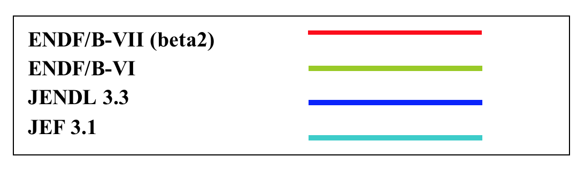

.. _fig10-2a-1:
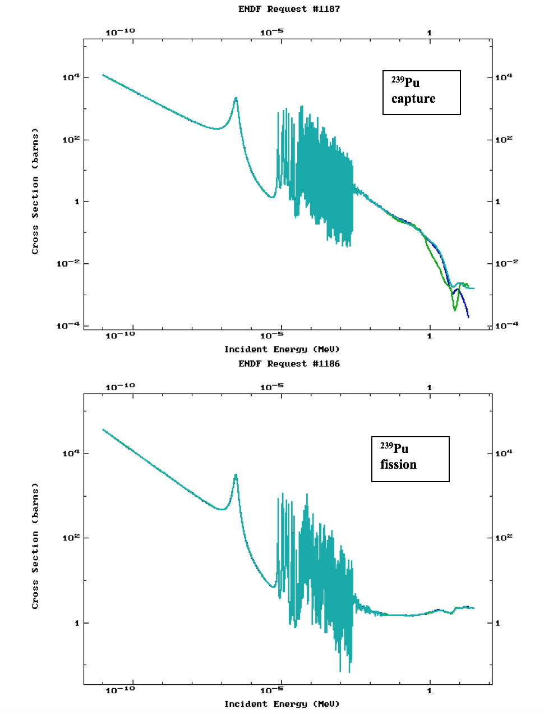

  :sup:`239`\ Pu fission and capture comparison between ENDF/B-VI,
  JENDL 3.3, and JEF 3.1.

.. _fig10-2a-2:
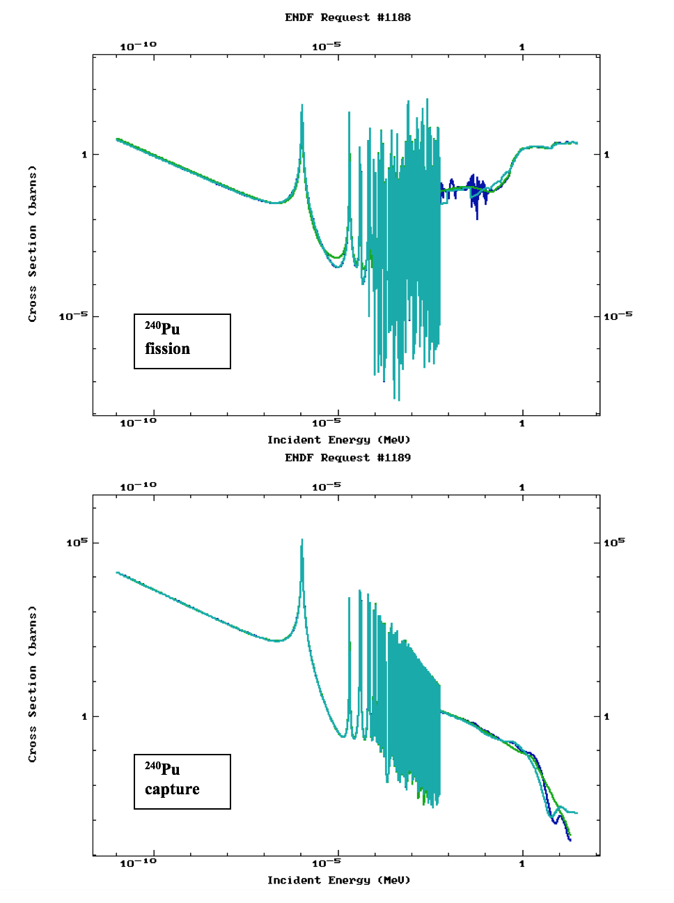

  :sup:`240`\ Pu fission and capture comparison between ENDF/B-VI,
  JENDL 3.3 and JEF 3.1.

.. _fig10-2a-3:
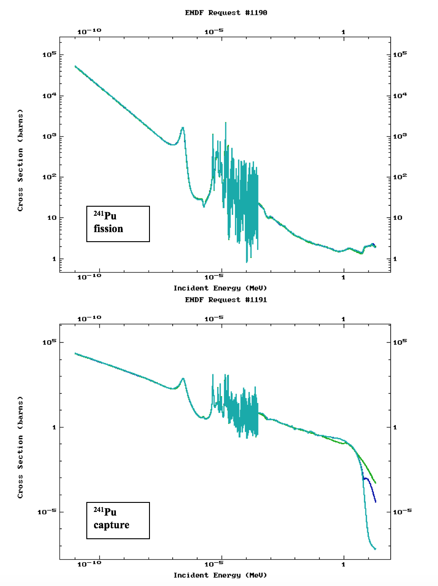

  :sup:`241` fission and capture comparison between ENDF/B-VI,
  JENDL 3.3 and JEF 3.1.

.. _fig10-2a-4:
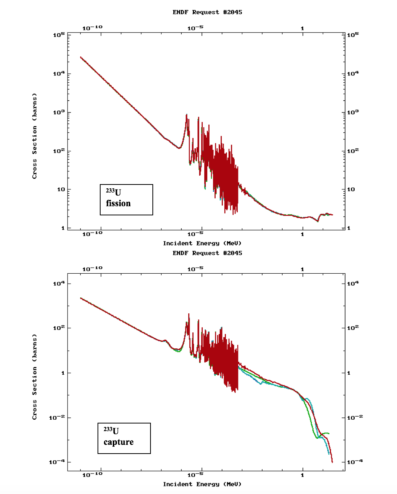

  :sup:`233` fission and capture comparison between ENDF/B-VI,
  JENDL 3.3 and JEF 3.1.

.. _fig10-2a-5:
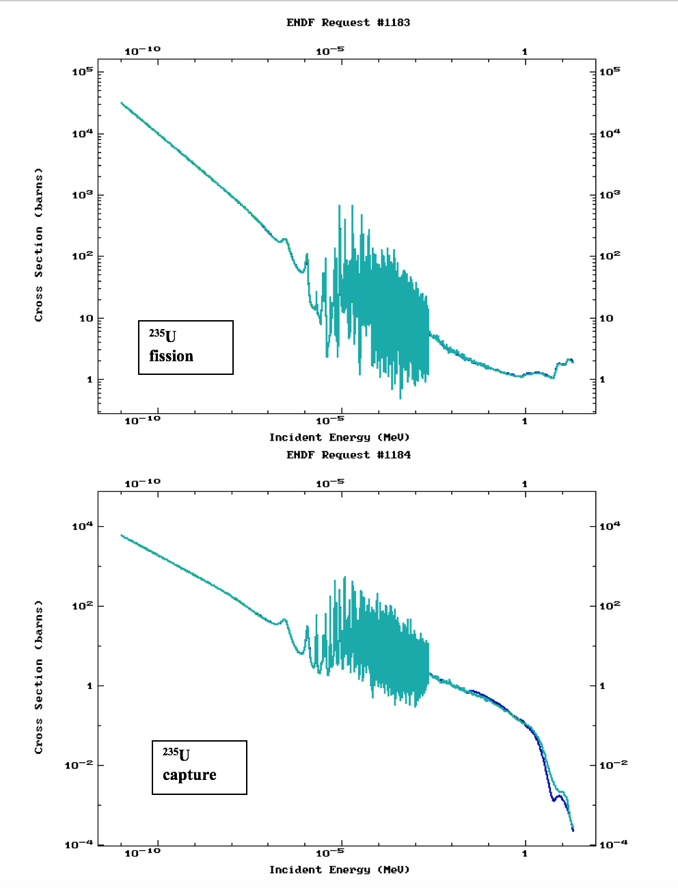

  :sup:`235` fission and capture comparison between ENDF/B-VI,
  JENDL 3.3 and JEF 3.1.

.. _fig10-2a-6:
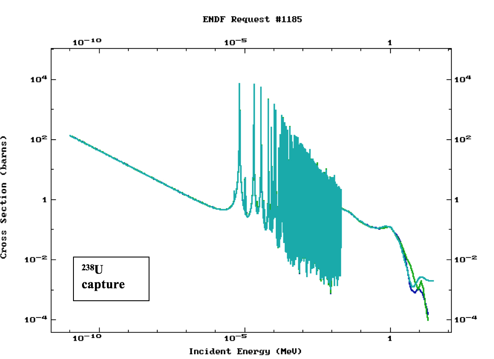

  :sup:`238`\ U capture comparison between ENDF/B-VI, JENDL 3.3
  and JEF 3.1.

.. _fig10-2a-7:
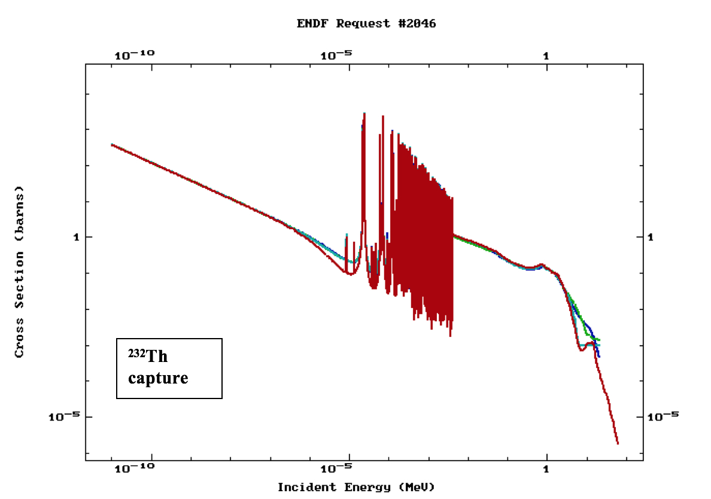

  :sup:`232`\ Th capture comparison between ENDF/B-VII
  (beta2), ENDF/B‑VI, JENDL 3.3 and JEF 3.1.

.. _fig10-2a-8:
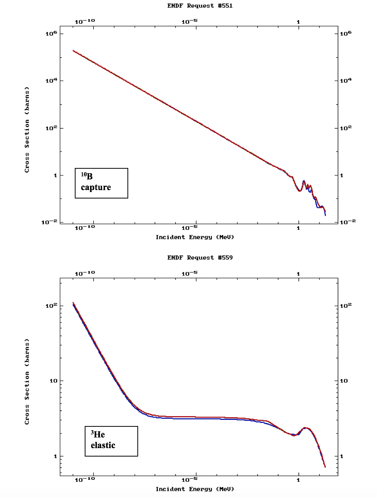

  :sup:`10`\ B capture and :sup:`3`\ He elastic comparison
  between ENDF/B-VII (beta2), ENDF/B-VI, JENDL 3.3 and JEF 3.1.

.. _fig10-2a-9:
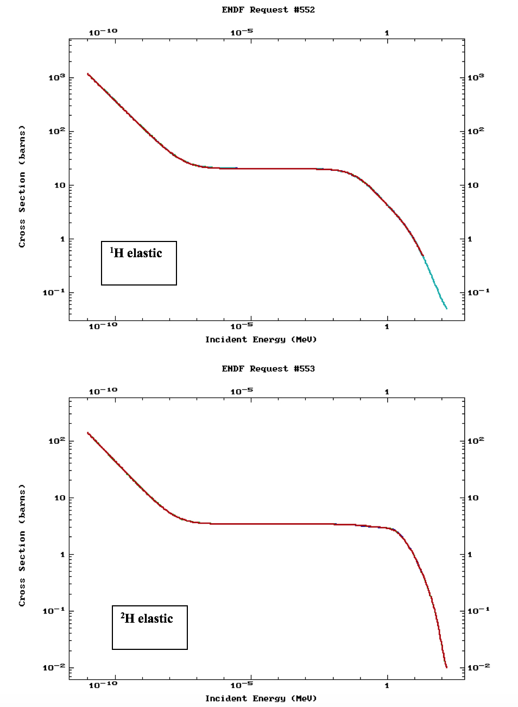

  :sup:`1`\ H and :sup:`2`\ H elastic comparison between
  ENDF/B-VII (beta2), ENDF/B-VI, JENDL 3.3 and JEF 3.1.

.. _fig10-2a-10:
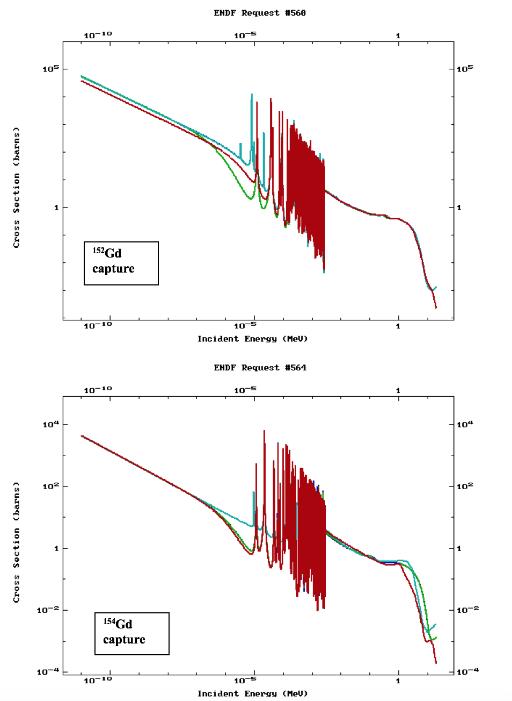

  :sup:`152`\ Gd and :sup:`154`\ Gd capture comparison
  between ENDF/B-VII (beta2), ENDF/B-VI, JENDL 3.3 and JEF 3.1.

.. _fig10-2a-11:
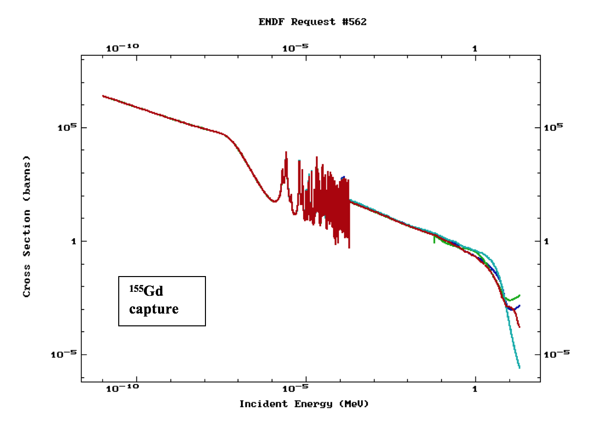

  :sup:`155`\ Gd capture comparison between ENDF/B-VII
  (beta2), ENDF/B-VI, JENDL 3.3 and JEF 3.1.
