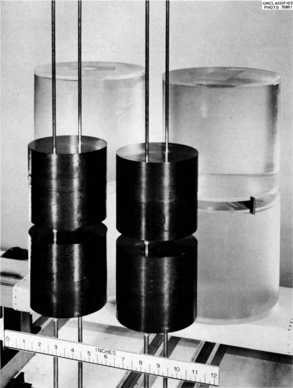

.. _CSAS5:

CSAS5:  Control Module For Enhanced Criticality Safety Analysis Sequences With KENO V.a
=======================================================================================

*L. M. Petrie, K. B. Bekar, S. Goluoglu,*\ :sup:`\*` *D. F. Hollenbach,*\ :sup:`\*` *N. F. Landers*

The **C**\ riticality **S**\ afety **A**\ nalysis **S**\ equences with
KENO V.a (CSAS5) provides reliable and efficient means of performing
*k*\ :sub:`eff` calculations for systems that are routinely encountered in
engineering practice. In the multigroup calculation mode, CSAS5 uses
XSProc to process the cross sections for temperature corrections and
problem-dependent resonance self-shielding and calculates the *k*\ :sub:`eff`
of a three-dimensional (3-D) system model. If the continuous energy
calculation mode is selected no resonance processing is needed and the
continuous energy cross sections are used directly in KENO V.a, with
temperature corrections provided as the cross sections are loaded. The
geometric modeling capabilities available in KENO V.a coupled with the
automated cross-section processing within the control sequences allow
complex, 3-D systems to be easily analyzed. A search capability is
achieved by repeatedly activating the control module MODIFY, to alter
either the system dimensions or densities, and the functional module
KENO V.a to calculate the *k*\ :sub:`eff` for the modified dimensions or
densities.

\*Formerly with Oak Ridge National Laboratory.

Acknowledgments
---------------

CSAS5 and its related Criticality Safety Analysis Sequences are based on the old CSAS2 control
module (no longer in SCALE) and the KENO V.a functional module described in the KENO V.a chapter.
Therefore, special acknowledgment is made to J. A. Bucholz, R. M. Westfall, and J. R. Knight who developed CSAS2.
G. E. Whitesides is acknowledged for his contributions through early versions of KENO.
Appreciation is expressed to C. V. Parks and S. M. Bowman for their guidance in developing CSAS5.

Special appreciation is expressed to S. J. Poarch and S. Y. Walker for their efforts in formatting this document.

.. _CSAS5-intro:

Introduction
------------

Criticality Safety Analysis Sequence with KENO V.a (CSAS5) provides
reliable and efficient means of performing *k*\ :sub:`eff` calculations for
systems that are routinely encountered in engineering practice,
especially in the calculation of *k*\ :sub:`eff` of three-dimensional (3-D)
system models. CSAS5 implements XSProc to process material input and
provide a temperature and resonance-corrected cross-section library
based on the physical characteristics of the problem being analyzed. If
a continuous energy cross-section library is specified, no resonance
processing is needed and the continuous energy cross sections are used
directly in KENO V.a, with temperature corrections provided as the cross
sections are loaded. A search capability is available to find a desired
values of *k*\ :sub:`eff` as a function of dimensions or densities. The two
basic search options offered are (1) an optimum search seeking a maximum
or minimum value of *k*\ :sub:`eff` and (2) a critical search seeking a fixed
value of *k*\ :sub:`eff`.

All the control sequences in the CSAS5 control module are listed in
:numref:`tab2-1` with the modules they invoke. The first four sequences are
subsets of the CSAS5 sequence.

.. _tab2-1:
.. table:: CSAS5 sequences for criticality safety
  :align: center

  +-------------------+-----------------------------------+--------------------------+----------+--------+
  | Control sequence  | Function                          | Functional modules       |          |        |
  |                   |                                   | executed by the          |          |        |
  |                   |                                   | control sequence         |          |        |
  |                   |                                   | for multigroup libraries |          |        |
  +===================+===================================+==========================+==========+========+
  | CSAS5             | :math:`k_{eff}` (3-D)             | XSProc                   | KENO V.a |        |
  +-------------------+-----------------------------------+--------------------------+----------+--------+
  | CSAS5S            |  :math:`k_{eff}` (3-D) search     | XSProc                   | KENO V.a | MODIFY |
  +-------------------+-----------------------------------+--------------------------+----------+--------+

Sequence Capabilities
---------------------

In order to minimize human error, the SCALE data handling is automated
as much as possible. CSAS5 and many other SCALE sequences apply a
standardized procedure to provide appropriate number densities and
cross sections for the calculation. XSProc is responsible for reading
the standard composition data and other engineering-type specifications,
including volume fraction or percent theoretical density, temperature,
and isotopic distribution as well as the unit cell data. XSProc then
generates number densities and related information, prepares geometry
data for resonance self-shielding and flux-weighting cell calculations,
if needed, and (if needed) provides problem-dependent multigroup
cross-section processing. Sequences that execute KENO V.a include a
KENO V.a Data Processor to read and check the KENO V.a data. Sequences
that execute a search use a Search Data Processor to read and check the
search data. When the data checking has been completed, the control
sequence executes XSProc to prepare a resonance-corrected microscopic
cross-section library in the AMPX working library format if a multigroup
library has been selected.

For each unit cell specified as being cell-weighted, XSProc performs the
necessary calculations and produces a cell-weighted microscopic
cross-section library. KENO V.a may be executed to calculate the
*k*\ :sub:`eff` or neutron multiplication factor using the cross-section
library that was prepared by the control sequence. MODIFY may be invoked
to perform a search :cite:`lorek_improved_1979` by repeatedly altering the unit cell
(multigroup mode only) and KENO V.a data prior to executing the next
pass through the calculation. Cross sections are updated at the
beginning of each search pass with the modified data. If unit cell data
is altered as part of the search, i.e., pitch or material search, the
cross-sections are correctly processed with the updated data.

The search capability is implemented by the control module MODIFY. It
performs operations according to the specified search data to determine
(1) the maximum or minimum value of :math:`k_{eff}` as a function of pitch,
dimensions or densities or (2) the pitch, dimensions, or densities
corresponding to a specified value of :math:`k_{eff}`. An iterative procedure
is used, making use of all previous information to modify the dimensions
or densities to achieve the desired result. The procedures for
conducting optimum and critical searches are summarized in the following
sections.

Optimum (minimum/maximum) search
~~~~~~~~~~~~~~~~~~~~~~~~~~~~~~~~

Because only an initial value of :math:`k_{eff}` and a set of boundary
constraints are available, four initial points are generated spanning
the range defined by the constraints. The search package identifies the
type of cubic equation [i.e., a cubic with no local extrema (type A) or
a cubic with two local extrema (type B)] and utilizes this knowledge in
determining the pitch, dimensions, or material densities corresponding
to the maximum (or minimum) value of :math:`k_{eff}`. The optimum search
procedure is summarized as follows:

  #.  Calculate :math:`k_{eff}` for the specified problem.

  #.  Calculate :math:`k_{eff}` for the minimum constraint.

  #.  Calculate :math:`k_{eff}` for the maximum constraint.

  #.  Calculate :math:`k_{eff}` for a fourth point that lies approximately
      equidistant between the initial guess and the constraint that is
      farthest from it.

  #.  Utilize a weighted least-squares fit to a cubic polynomial on the
      data points.

  #.  Determine the type of cubic. For a type A cubic, go to step 11.

  #.  Take the first derivative of the least-squares cubic.

  #.  Solve the quadratic for its roots.

  #.  Take the second derivative of the least-squares cubic to determine
      which root is the maximum (or minimum), and if it falls within
      the constraints, use this root as the next guess. Otherwise,
      convergence has been defined as occurring at the constraint with
      the maximum (or minimum) :math:`k_{eff}`.

  #. Calculate the :math:`k_{eff}` corresponding to the next guess. Go to
     step 5. Repeat this procedure until convergence is achieved.

  #. If the cubic equation is a type A cubic, the optimum lies on one of
     the boundaries. If the fit shows that the cubic is actually a
     type B cubic, go to step 7 and continue.

Convergence is defined as occurring when a *k*\ :sub:`eff` has been calculated
for a point on the curve where the value of the curve is within epsilon
of the maximum (or minimum) of the curve. Additionally, the calculated
*k*\ :sub:`eff` must be within two standard deviations of the value of the
curve at that point. The search is terminated when convergence is
achieved, when the code determines there is no local maximum within the
constraints, or the maximum number of search iterations is reached.

.. Note::

  At the beginning of each search pass, the cross sections are
  updated using the updated values of pitch, dimensions, or material
  densities. Also, the unit or material being modified can be directly
  tied to a unit cell, so that unit cell is updated during the search.
  Therefore, the final result should be consistent with the results
  obtained by running a non-search problem using the data from the last
  pass.

Critical search
~~~~~~~~~~~~~~~

The critical search option searches for the pitch, dimensions, or
material densities corresponding to a specified value of *k*\ :sub:`eff`. If
the calculated value of *k*\ :sub:`eff` is within the specified search
tolerance (EPS) of the desired *k*\ :sub:`eff`, the search is considered to be
complete. The critical search procedure is summarized as follows:

   1. Calculate *k*\ :sub:`eff` for the specified problem. If it is within EPS of
   the specified *k*\ :sub:`eff`, convergence has been achieved.

   2. Calculate *k*\ :sub:`eff` for one of the constraints. If the specified
   *k*\ :sub:`eff` of the system does not fall between the initial value and
   the *k*\ :sub:`eff` of the constraint, calculate the *k*\ :sub:`eff` of the other
   constraint. If the calculated *k*\ :sub:`eff` is within EPS of the specified
   *k*\ :sub:`eff`, convergence has been achieved.

   3. Calculate *k*\ :sub:`eff` for a point chosen from a linear fit of the two
   existing points closest to the specified *k*\ :sub:`eff`.

   4. Repeat step 3 until convergence has been achieved, the program
   determines that the specified value lies outside the constraints, or
   the maximum number of search iterations is reached. Convergence has
   been achieved when the calculated \**k*\ :sub:`eff` is within EPS of the
   specified *k*\ :sub:`eff`.

   5. If convergence is achieved, calculate *k*\ :sub:`eff` for a point determined
   from fitting the previous points to a cubic and solving the cubic for
   the point closest to the desired *k*\ :sub:`eff`. If all roots lie outside
   the constraints, the problem is terminated and an appropriate message
   is written. If the maximum number of iterations is reached without
   the problem converging, the problem is terminated and an appropriate
   message is written.

.. Note::

  At the beginning of each search pass, the cross sections are
  updated using the updated values of pitch, dimensions, or material
  densities. Also, the unit or material being modified can be directly
  tied to a unit cell, so that unit cell is updated during the search.
  Therefore, the final result should be consistent with the results
  obtained by running a non-search problem using the data from the last
  pass.

Multigroup CSAS5 limitations
~~~~~~~~~~~~~~~~~~~~~~~~~~~~

The CSAS5 control module was developed to use simple input data and
prepare problem-dependent cross sections for use in calculating the
effective neutron multiplication factor of a 3-D system using KENO V.a.
An attempt was made to make the system as general as possible within the
constraints of the standardized methods chosen to be used in SCALE.
Standardized methods of data input were adopted to allow easy data entry
and for quality assurance purposes. Some of the limitations of the CSAS5
multigroup sequences are a result of using preprocessed multigroup
cross sections. Inherent limitations in multigroup CSAS5 calculations
are as follows:

   1. Two-dimensional (2-D) effects such as fuel rods in assemblies where
   some positions are filled with control rod guide tubes, burnable
   poison rods and/or fuel rods of different enrichments. The
   cross sections are processed as if the rods are in an infinite
   lattice of identical rods. If the user inputs a Dancoff factor for
   the cell (such as one computed by MCDancoff), XSProc can produce an
   infinite lattice cell, which reproduces that Dancoff. This can
   mitigate some two dimensional lattice effects

Continuous energy CSAS5 limitations
~~~~~~~~~~~~~~~~~~~~~~~~~~~~~~~~~~~

When continuous energy KENO calculations are desired, none of the
resonance processing capabilities of XSProc are applicable or needed.
The continuous energy cross sections are directly used in KENO. An
existing multigroup input file can easily be converted to a continuous
energy input file by simply specifying the continuous energy library. In
this case, all cell data is ignored. However, the following limitations
exist:

  1. If CELLMIX is defined in the cell data, the problem will not run in
     the continuous energy mode. CELLMIX implies new mixture cross
     sections are generated using XSDRNPM-calculated cell fluxes and
     therefore is not applicable in the continuous energy mode.

  2. Only VACUUM, MIRROR, PERIODIC, and WHITE boundary conditions are
     allowed. Other albedos, e.g., WATER, CARBON, POLY, etc. are for
     multigroup only.

  3. Problems with DOUBLEHET cell data are not allowed as they inherently
     utilize CELLMIX feature.

Input Data Guide
----------------

This section describes the input data required for CSAS5. Several
subsets of the CSAS5 sequences listed in :numref:`tab2-1` are available to
achieve several different levels of processing.

The input data for these CSAS5 sequences are composed of three broad
categories of data. The first is XSProc, including Standard Composition
Specification Data and Unit Cell Geometry Specification. This first
category specifies the cross-section library and defines the composition
of each mixture and optionally unit cell geometry that may be used to
process the cross sections. This data block is necessary for all CSAS5
sequences. The second category of data, the KENO V.a input data, is used
to specify the geometric and boundary conditions that represent the
physical 3-D configuration of a KENO V.a problem. Both data blocks are
necessary for CSAS5 and CSAS5S. The last category of data is the search
data and is required only for CSAS5S.

All data are entered in free form, allowing alphanumeric data,
floating-point data, and integer data to be entered in an unstructured
manner. Up to 252 columns of data entry per line are allowed. Data can
usually start or end in any column with a few exceptions. As an example,
the word END beginning in column 1 and followed by two blank spaces or a
new line will end the problem and any data following will be ignored.
Each data entry must be followed by one or more blanks to terminate the
data entry. For numeric data, either a comma or a blank can be used to
terminate each data entry. Integers may be entered for floating-point
values. For example, 10 will be interpreted as 10.0. Imbedded blanks are
not allowed within a data entry unless an E precedes a single blank as
in an unsigned exponent in a floating-point number. For example, 1.0E 4
would be correctly interpreted as 1.0 × 10\ :sup:`4`.

The word “END” is a special data item. An “END” may have a name or label
associated with it (e.g., “END DATA”). The name or label associated with
an “END” is separated from the “END” by a single blank and is a maximum
of 12 characters long. *At least two blanks or a new line MUST follow
every labeled and unlabeled “END.” It is the user’s responsibility to
ensure compliance with this restriction. Failure to observe this
restriction can result in the use of incorrect or incomplete data
without the benefit of warning or error messages.*

Multiple entries of the same data value can be achieved by specifying
the number of times the data value is to be entered, followed by either
R, \*, or $, followed by the data value to be repeated. Imbedded blanks
are not allowed between the number of repeats and the repeat flag. For
example, 5R12, 5*12, 5$12, or 5R 12, etc., will enter five successive
12s in the input data. Multiple zeros can be specified as nZ where n is
the number of zeroes to be entered.

The purpose of this section is to define the input data in discrete
subsections relating to a particular type of data. Tables of the input
data are included in each subsection, and the entries are described in
more detail in the appropriate sections.

Resonance-corrected cross sections are generated using the appropriate
boundary conditions for the unit cell description (i.e., void for the
outer surface of a single unit, white for the outer surface of an
infinite array of cylinders). As many unit cells as needed may be
specified in a problem. A unit cell is cell-weighted by using the
keyword “CELLMIX=” followed by a unique user specified mixture number in
the unit cell data.

To check the input data without actually processing the cross sections,
the words “PARM=CHECK” or “PARM=CHK” should be entered, as shown below.

                      | =CSAS5 PARM=CHK
                      | or
                      | #CSAS5 PARM=CHK

This will cause the input data for CSAS5 to be checked and appropriate
error messages to be printed. If plots are specified in the data, they
will be printed. This feature allows the user to debug and verify the
input data while using a minimum of computer time.

XSProc data
~~~~~~~~~~~

The XSProc reads the standard composition specification data and the
unit cell geometry specifications. It then produces the mixing table and
unit cell information necessary for processing the cross sections if
needed. The XSProc section of this manual provides a detailed
description of the input data and processing options.

KENO V.a data
~~~~~~~~~~~~~

If the problem utilizes a sequence that contains KENO V.a as a
functional module, the input to KENO V.a comes after the XSProc input.
:numref:`tab2-2` contains the outline for the KENO V.a input and the SEARCH
input, which is required for a search case (i.e., CSAS5S). The KENO V.a
input is divided into 13 data blocks and CSAS5S includes an additional
block of search data. A brief outline of commonly used data blocks is
shown in :numref:`tab2-2`. Note that parameter data must precede all other
KENO data blocks. Information on all KENO V.a input is provided in the
KENO chapter of this document and will not be repeated here.

.. _tab2-2:
.. table:: Outline of KENO data
  :align: center

  +-----------------+-----------------+-----------------+-----------------+
  | **Type of       |    **Starting   | **Comments**    | **Termination   |
  | data**          |    flag**       |                 | flag**          |
  +-----------------+-----------------+-----------------+-----------------+
  |    Parameters\* | READ PARAMETER  |    Enter        | END PARAMETER   |
  |                 |                 |    desired      |                 |
  |                 |                 |    parameter    |                 |
  |                 |                 |    data         |                 |
  +-----------------+-----------------+-----------------+-----------------+
  |    Geometry     | READ GEOMETRY   |    Enter        | END GEOMETRY    |
  |                 |                 |    desired      |                 |
  |                 |                 |    geometry     |                 |
  |                 |                 |    data         |                 |
  +-----------------+-----------------+-----------------+-----------------+
  |    Array data   | READ ARRAY      |    Enter        | END ARRAY       |
  |                 |                 |    desired      |                 |
  |                 |                 |    array data   |                 |
  +-----------------+-----------------+-----------------+-----------------+
  |    Boundary     | READ BOUNDS     |    Enter        | END BOUNDS      |
  |    conditions   |                 |    desired      |                 |
  |                 |                 |    boundary     |                 |
  |                 |                 |    conditions   |                 |
  +-----------------+-----------------+-----------------+-----------------+
  |    Energy group | READ ENERGY     |    Enter        | END ENERGY      |
  |    boundaries   |                 |    desired      |                 |
  |                 |                 |    neutron      |                 |
  |                 |                 |    energy group |                 |
  |                 |                 |    boundaries   |                 |
  +-----------------+-----------------+-----------------+-----------------+
  |    Start data   | READ START      |    Enter        | END START       |
  |    or initial   |                 |    desired      |                 |
  |    source       |                 |    start data   |                 |
  +-----------------+-----------------+-----------------+-----------------+
  |    Plot data    | READ PLOT       |    Enter        | END PLOT        |
  |                 |                 |    desired plot |                 |
  |                 |                 |    data         |                 |
  +-----------------+-----------------+-----------------+-----------------+
  |    Grid         | READ GRID       |    Enter        | END GRID        |
  |    geometry     |                 |    desired mesh |                 |
  |    data         |                 |    data         |                 |
  +-----------------+-----------------+-----------------+-----------------+
  |    Reaction     | READ REACTION   |    Enter desire | END REACTION    |
  |                 |                 |    reaction     |                 |
  |                 |                 |    tallies (CE  |                 |
  |                 |                 |    mode only)   |                 |
  +-----------------+-----------------+-----------------+-----------------+
  |    KENO V.a     | END DATA        |    | Enter to   |                 |
  |    data         |                 |      signal the |                 |
  |    terminus     |                 |      end of all |                 |
  |                 |                 |    | KENO V.a   |                 |
  |                 |                 |      data       |                 |
  +-----------------+-----------------+-----------------+-----------------+
  |    Search data  | READ SEARCH     |    Enter for    | END SEARCH      |
  |                 |                 |    CSAS5        |                 |
  +-----------------+-----------------+-----------------+-----------------+
  | \*Must precede  |                 |                 |                 |
  | all other data  |                 |                 |                 |
  | blocks in this  |                 |                 |                 |
  | table.          |                 |                 |                 |
  +-----------------+-----------------+-----------------+-----------------+

Search data
~~~~~~~~~~~

Search data must be entered for CSAS5S. The search data enable the code
to perform a search according to the instructions specified by the user.
The code begins reading search data when it encounters the words READ
SEARCH and continues reading search data until it encounters the words
END SEARCH. Search data consist of the search type specification and
auxiliary search commands.

Search type specification
^^^^^^^^^^^^^^^^^^^^^^^^^

These data are used to define the type of search and to set the
parameters that provide limits for the search. The search type
specification data consist of (a) a search descriptor, (b) the search
type, and (c) optional search parameters as described below.

SEARCH DESCRIPTOR is used to define the search mode.

   Use OPTIMUM if the maximum value of *k*\ :sub:`eff` is to be determined.

   Use CRITICAL if a specified value of *k*\ :sub:`eff` is to be obtained.

   Use MINIMUM if the minimum value of *k*\ :sub:`eff` is to be determined.

SEARCH TYPE is used to specify the variable that is to be changed during the search procedure.

   Use PITCH to alter the center-to-center spacing between the units at
   the lowest array level. By default only the spacing in the X and
   Y directions will be altered. Use DIMENSION to alter the dimensions
   of one or more geometry regions in one or more units. Use
   CONCENTRATION to alter the concentration of one or more standard
   compositions in one or more mixtures.

The combination of the search descriptor and the search type defines the
search method. Each search type has a set of predefined defaults and the
ability to change the default settings and expand the scope of the
search. Only one SEARCH DESCRIPTOR and one SEARCH TYPE are allowed in a
problem.

An OPTIMUM PITCH search determines the pitch that gives the maximum
value of *k*\ :sub:`eff`.* By default the X spacing will be altered for slab
arrays, the X and Y spacing will be altered for arrays of cylinders, and
the X, Y, and Z spacing will be altered for spherical arrays. Auxiliary
search commands can be used to instruct the code to change any of these
defaults.

An OPTIMUM DIMENSION search determines the maximum value of *k*\ :sub:`eff` by
altering the dimensions of one or more geometry regions in one or more
units in accordance with the specified auxiliary search commands. Only
the dimensions specified in the search commands will be modified. The
relative variations in dimensions are determined by the search constants
specified for each dimension.

An OPTIMUM CONCENTRATION search determines the maximum value of *k*\ :sub:`eff`
by altering the concentration of standard compositions in mixtures in
accordance with specified search commands. Only the standard
compositions in the materials specified are altered. The relative
variations in concentrations are determined by the search constants
specified for each composition.

A CRITICAL PITCH search alters the spacing between units in the same
manner as an optimum pitch search to achieve the specified value of
*k*\ :sub:`eff`. By default the X spacing will be altered for slab arrays, the
X and Y spacing will be altered for arrays of cylinders, and the X, Y,
and Z spacing will be altered for spherical arrays. Auxiliary search
commands can be used to instruct the code to change any of these
defaults.

A CRITICAL DIMENSION search alters the dimensions of one or more
geometry regions in accordance with the specified auxiliary search
commands to achieve the specified value of *k*\ :sub:`eff`.* Only the dimensions
specified in the search commands will be modified. The relative
variations in dimensions are determined by the search constants
specified for each dimension.

A CRITICAL CONCENTRATION search alters the concentration of standard
compositions in mixtures in accordance with the specified auxiliary
search commands to achieve the specified value of *k*\ :sub:`eff`. Only the
standard compositions in the materials specified are altered. The
relative variations in concentrations are determined by the search
constants specified for each composition.

A MINIMUM PITCH search determines the pitch that gives the minimum value
of *k*\ :sub:`eff`. By default the X spacing will be altered for slab arrays,
the X and Y spacing will be altered for arrays of cylinders, and the X,
Y, and Z spacing will be altered for spherical arrays. Auxiliary search
commands can be used to instruct the code to change any of these
defaults.

A MINIMUM DIMENSION search determines the minimum value of *k*\ :sub:`eff` by
altering the dimensions of one or more geometry regions in one or more
units in accordance with the specified auxiliary search commands. Only
the dimensions specified in the search commands will be modified. The
relative variations in dimensions are determined by the search constants
specified for each dimension.

A MINIMUM CONCENTRATION search determines the minimum value of *k*\ :sub:`eff`
by altering the concentration of standard compositions in mixtures in
accordance with specified search commands. Only the standard
compositions in the materials specified are altered. The relative
variations in concentrations are determined by the search constants
specified for each composition.

OPTIONAL SEARCH PARAMETERS are entered after the SEARCH DESCRIPTOR AND
SEARCH TYPE and are used to alter the default values of the optional
search parameters. Only one set of optional search parameters can be
entered for a problem. The optional search parameters are listed below.

PAS=nn
  is used to set the maximum number of times the search will
  calculate *k*\ :sub:`eff`.* The first pass calculates the *k*\ :sub:`eff` corresponding
  to the initial geometry dimensions. The second pass calculates the
  *k*\ :sub:`eff` corresponding to one of the constraints, and the third pass
  often corresponds to the other constraint. After the third pass, the
  search dimensions or concentrations are changed based on a fit to a
  quadratic or cubic equation. The default value of nn is 10.

NPM=nn
  is used to set the number of search parameters. The default value
  of nn is 1 and should not be overridden.

EPS=ff
  is used to set the search convergence tolerance (the amount by
  which *k*\ :sub:`eff` is allowed to vary from the desired *k*\ :sub:`eff`)\ *.* An
  optimum or minimum search is terminated when the calculated *k*\ :sub:`eff` is
  within EPS of the optimum or minimum value as indicated by the
  mathematical fit to the calculated points. A critical search is
  terminated when the calculated *k*\ :sub:`eff` is within EPS of the specified
  *k*\ :sub:`eff`. The default value of ff is 0.005.

KEF=ff
  is used only for a CRITICAL search. The default value of ff is
  1.000.

MINPITCH=ff
  is allowed ONLY for a PITCH search. It is used to specify
  the minimum allowed pitch (center-to-center spacing in the X; X,Y; or
  X,Y,Z directions depending on array type) between the units in an array.
  The search will terminate if the pitch becomes smaller than the
  specified minimum pitch. The default value of ff is the pitch at which
  the region immediately inside the outer most region of the unit touches
  the same region in an adjacent unit. It is much easier to specify the
  minimum allowed pitch than to calculate the appropriate value of the
  minimum constraint.

MAXPITCH=ff
  is allowed ONLY for a PITCH search. It is used to specify
  the maximum allowed pitch (center-to-center spacing in the X; X, Y; or
  X, Y, Z directions depending on array type) between units in an array.
  The search will terminate if the specified pitch is exceeded. The
  default value of ff is the pitch corresponding to −5 times the parameter
  that corresponds to the minimum pitch. It is much easier to specify a
  maximum allowed pitch than to calculate the appropriate value of the
  maximum constraint.

MORE
  is used to terminate the optional search parameters and initiate
  the auxiliary search commands. Do not enter MORE unless auxiliary search
  commands are to be entered. This command may only be entered once,
  immediately prior to the auxiliary search commands.

.. _tab2-3:
.. table:: Outline of search type specification
  :align: center

  +-----------------+-----------------+-----------------+-----------------+
  | **Entry**       | **Type of       | **Data entry**  | **Comments**    |
  |                 | data**          |                 |                 |
  | **No.**         |                 |                 |                 |
  +-----------------+-----------------+-----------------+-----------------+
  | 1               | Search          | OPTIMUM         | Initiates a     |
  |                 | descriptor      |                 | search for the  |
  |                 |                 |                 | maximum value   |
  |                 |                 |                 | of *k\ eff*.    |
  +-----------------+-----------------+-----------------+-----------------+
  |                 |                 | CRITICAL        | Initiates a     |
  |                 |                 |                 | search for a    |
  |                 |                 |                 | specified value |
  |                 |                 |                 | of *k\ eff*.    |
  +-----------------+-----------------+-----------------+-----------------+
  |                 |                 | MINIMUM         | Initiates a     |
  |                 |                 |                 | search for the  |
  |                 |                 |                 | minimum value   |
  |                 |                 |                 | of *k\ eff*.    |
  +-----------------+-----------------+-----------------+-----------------+
  | 2               | Search type     | PITCH           | Vary the pitch  |
  |                 |                 |                 | of an array.    |
  +-----------------+-----------------+-----------------+-----------------+
  |                 |                 | DIMENSION       | Vary one or     |
  |                 |                 |                 | more dimensions |
  |                 |                 |                 | in one or more  |
  |                 |                 |                 | regions of one  |
  |                 |                 |                 | or more units.  |
  +-----------------+-----------------+-----------------+-----------------+
  |                 |                 | CONCENTRATION   | Vary the        |
  |                 |                 |                 | concentration   |
  |                 |                 |                 | of one or more  |
  |                 |                 |                 | standard        |
  |                 |                 |                 | compositions in |
  |                 |                 |                 | one or more     |
  |                 |                 |                 | mixtures.       |
  +-----------------+-----------------+-----------------+-----------------+
  | 3               | Optional search |                 | Optional search |
  |                 | parameters      |                 | parameters      |
  |                 |                 |                 | allow changing  |
  |                 |                 |                 | default values. |
  |                 |                 |                 | Any or all may  |
  |                 |                 |                 | be entered in   |
  |                 |                 |                 | any order.      |
  +-----------------+-----------------+-----------------+-----------------+
  | 3a              | No. of search   | PAS=            | Enter the       |
  |                 | passes          |                 | keyword PAS=    |
  |                 |                 |                 | followed by the |
  |                 |                 |                 | desired number  |
  |                 |                 |                 | of search       |
  |                 |                 |                 | passes.         |
  |                 |                 |                 | Default=10.     |
  +-----------------+-----------------+-----------------+-----------------+
  | 3b              | No. of search   | NPM=            | Enter the       |
  |                 | parameters      |                 | keyword NPM=    |
  |                 |                 |                 | followed by the |
  |                 |                 |                 | number of       |
  |                 |                 |                 | search          |
  |                 |                 |                 | parameters.     |
  |                 |                 |                 | Present         |
  |                 |                 |                 | capability is   |
  |                 |                 |                 | limited to 1.   |
  +-----------------+-----------------+-----------------+-----------------+
  | 3c              | Search          | EPS=            | Enter the       |
  |                 | convergence     |                 | keyword EPS=    |
  |                 | tolerance       |                 | followed by the |
  |                 |                 |                 | desired         |
  |                 |                 |                 | convergence     |
  |                 |                 |                 | tolerance.      |
  |                 |                 |                 | Default=0.005.  |
  +-----------------+-----------------+-----------------+-----------------+
  | 3d              | Desired value   | KEF=            | Enter the       |
  |                 | of *k\ eff*     |                 | keyword KEF=    |
  |                 |                 |                 | followed by the |
  |                 |                 |                 | desired value   |
  |                 |                 |                 | of *k\ eff*.    |
  |                 |                 |                 | The default     |
  |                 |                 |                 | value is 1.000. |
  |                 |                 |                 |                 |
  |                 |                 |                 | DO NOT ENTER    |
  |                 |                 |                 | FOR OPTIMUM OR  |
  |                 |                 |                 | MINIMUM         |
  |                 |                 |                 | SEARCHES.       |
  +-----------------+-----------------+-----------------+-----------------+
  | 3e              | Maximum allowed | MAXPITCH=       | Enter the       |
  |                 | pitch           |                 | keyword         |
  |                 |                 |                 | MAXPITCH=       |
  |                 |                 |                 | followed by the |
  |                 |                 |                 | maximum allowed |
  |                 |                 |                 | pitch for a     |
  |                 |                 |                 | search whose    |
  |                 |                 |                 | search type,    |
  |                 |                 |                 | entry 2 above,  |
  |                 |                 |                 | is PITCH. The   |
  |                 |                 |                 | default value   |
  |                 |                 |                 | is the pitch    |
  |                 |                 |                 | corresponding   |
  |                 |                 |                 | to −5.0 times   |
  |                 |                 |                 | the parameter   |
  |                 |                 |                 | at the minimum  |
  |                 |                 |                 | possible pitch. |
  +-----------------+-----------------+-----------------+-----------------+
  | 3f              | Minimum allowed | MINPITCH=       | Enter the       |
  |                 | pitch           |                 | keyword         |
  |                 |                 |                 | MINPITCH=       |
  |                 |                 |                 | followed by the |
  |                 |                 |                 | minimum allowed |
  |                 |                 |                 | pitch for a     |
  |                 |                 |                 | search whose    |
  |                 |                 |                 | search type,    |
  |                 |                 |                 | entry 2 above,  |
  |                 |                 |                 | is PITCH. The   |
  |                 |                 |                 | default value   |
  |                 |                 |                 | is the minimum  |
  |                 |                 |                 | possible pitch  |
  |                 |                 |                 | (i.e., the      |
  |                 |                 |                 | pitch at which  |
  |                 |                 |                 | the shapes in   |
  |                 |                 |                 | the array       |
  |                 |                 |                 | touch).         |
  +-----------------+-----------------+-----------------+-----------------+
  | 4               | Additional      | MORE            | Enter the       |
  |                 | search data     |                 | delimiter MORE. |
  |                 |                 |                 | This delimiter  |
  |                 |                 |                 | ends the        |
  |                 |                 |                 | optional search |
  |                 |                 |                 | commands and    |
  |                 |                 |                 | initiates the   |
  |                 |                 |                 | auxiliary       |
  |                 |                 |                 | search commands |
  |                 |                 |                 | found in        |
  |                 |                 |                 | Table 2.1.4.    |
  |                 |                 |                 |                 |
  |                 |                 |                 |                 |
  |                 |                 |                 |                 |
  +-----------------+-----------------+-----------------+-----------------+

Auxiliary search commands and constraints
^^^^^^^^^^^^^^^^^^^^^^^^^^^^^^^^^^^^^^^^^

Auxiliary search commands are entered **only** if MORE, item 4, of the
search type specification data is entered (see :numref`tab2-3`). Individual
search commands are used to specify search constraints and to
communicate to the search program. Searches can alter geometric
dimensions (PITCH or DIMENSION Search) or alter standard composition
number densities (CONCENTRATION Search).

A PITCH or DIMENSION search may require the user to specify the units
that will be altered, the regions that will be altered within those
units, and the faces or surfaces of those regions that will be altered.
For a PITCH search, the program automatically assigns the units in the
arrays to a unit cell if possible. If multiple units are contained in
the array, each unit could be assigned a unit cell if the data in the
unit cells match the geometry data of the units in the array. This data
may be overridden in the MORE section of the search data. For a
DIMENSION search, if the user wishes to tie a unit to unit cell this
must be explicitly done in the MORE section of the search data. Several
examples of search problems are provided in :ref:`CSAS5-intro`.

A CONCENTRATION search requires the user to specify the mixture,
standard composition name, and the search constant for the component
being altered. For a CONCENTRATION search, the program automatically
assigns the material being changed to a unit cell. This data may be
overridden in the MORE section of the search data. Several examples of
search problems are provided in :ref:`CSAS5-intro`.

The data comprising the auxiliary search commands are listed in
:numref:`tab2-4`. All data except items 1a, 1b, and 1c are keyworded (i.e.,
the data are entered by specifying a keyword, followed by a value).
An explanation of each individual search command follows the table.

1 Command Definition
  A command definition tells the code what action is to be taken.  A new search command is
  initiated whenever an item 1a through 1c is encountered.  The code will vary the geometry
  according to subsequent commands.

1a. ALTER CHANGE MODIFY
  Alter geometry regions. These words specify that modifications will be made to the geometry
  according to subsequent commands.

1b. MAINTAIN
  Maintain the thickness.  The thickness of the specified geometry region(s) will be maintained
  when the interior regions grow or shrink (i.e., the specified region will grow or shrink in
  conjunction with the interior region in such a way as to maintain the original distance between the two regions).
  This means that the original thickness of the region is preserved.  For instance, the inner radius of a pipe
  can be altered and the wall thickness can be preserved by applying the MAINTAIN command to the region defining
  the outer radius of the pipe.

1c. KEEP HOLD
  Keep the original specification.  This command causes the specified geometry region(s)
  to be reset to their original input value for every search pass.  Therefore they go
  through the entire search process unchanged.

2 PAR=
  Parameter number.  The search parameter number is not functional.  The default number is 1 and should not be overridden.

3 +CON=
  Maximum constraint.  Enter the maximum value you wish to allow the search parameter to obtain.
  The maximum constraint must be larger than the minimum constraint.  For a DIMENSION or PITCH
  search the default value of the maximum constraint is 1011.  For a CONCENTRATION search the default
  value of the maximum constraint is as follows:

    +CON= min(−1/FACTOR ), if any FACTOR < 0

    +CON= −5*(−CON ), if all FACTOR > 0

.. Note::
  For a PITCH search, the maximum constraint is redefined and is calculated from the data entered for MAXPITCH.
  +CON should not be entered if a value was entered for MAXPITCH.  If constraints, +CON= and/or −CON= are
  not entered as data, the code computes the minimum constraint corresponding to the pins touching,
  and the maximum constraint is then negative five times the magnitude of the minimum constraint.

4 −CON=
  Minimum constraint.  Enter the minimum value you wish to allow the search parameter to obtain.
  The minimum constraint must be smaller than the maximum constraint but need not be a negative number.
  The default value of the minimum constraint for a dimension search is −1011.
  The default value of the minimum constraint for a pitch search is redefined to correspond to the pins
  in the lattice touching.  For a CONCENTRATION search the default value of the minimum constraint is as follows:

    −CON= −5(+CON ), if all FACTOR < 0

    −CON= max(−1/FACTOR ), if any FACTOR > 0

5 CELL=
  Unit Cell Number.  This is the unit cell to which the unit or mixture will be tied.
  It needs to follow either the UNIT= or MIX= keyword data.  Tying a unit cell to a unit or mixture
  ensures the unit cell data gets changed as the geometry or mixture data gets changed thus ensuring the
  cross sections are properly processed.

6 UNIT=
  Geometry unit number.  This is the geometry unit to which the previously entered command definition
  (item 1a, 1b, or 1c) is applied.  Items 7, 8, and 9 specify the region(s) within the unit and the surfaces of
  the region(s) to be altered.

7 REGION=
  First region to be altered.  This is used to specify the first or only region in the unit (specified by item 6)
  that is to be altered according to the search command (item 1a, 1b, or 1c).  The region(s) are altered according
  to the search constants (items 9a, 9b, 9c, and/or 9d).

8 TO
  Last region to be altered.  This item is entered to specify the last region to be altered,
  starting with the region specified by REG=.  For example, assume unit 3 contains eight regions and you
  wish to make changes to regions 4, 5, 6, 7, and 8.  These regions are identified by entering the following data.
  UNIT=3  REG=4 TO 8.

Geometric search constants.  A search constant is the proportionality factor utilized to alter a geometry region.
A search constant must be entered for each surface of a region that is to be altered.
A nonzero search constant will cause the region dimension for that surface to be changed.
A search constant of 0.0 will cause the region dimension to remain unchanged.
The default value of the search constant is 0.0.

9 ALL=
  Search constant for all surfaces.  All of the surfaces in a region are altered simultaneously by using this search command.

9a. +X=
  Search constant for +X face.  This parameter is used to specify the value of the search constant for the +X face of a cuboid.

9a. -X=
  Search constant for −X face.  This parameter is used to specify the value of the search constant for the −X face of a cuboid.

9a. +Y=
  Search constant for +Y face.  This parameter is used to specify the value of the search constant for the +Y face of a cuboid.

9a. -Y=
  Search constant for −Y face.  This parameter is used to specify the value of the search constant for the −Y face of a cuboid.

9a. +Z=
  Search constant for +Z face.  This parameter is used to specify the value of the search constant for the +Z face of a cuboid.

9a. -Z=
  Search constant for −Z face.  This parameter is used to specify the value of the search constant for the −Z face of a cuboid.

.. Note::
  If it is desirable to change all the faces of a cuboid except the −Z face by some amount
  (search constant of 1.0), items 9a and 9b can be used together as follows:  ALL=1.0 −Z=0.0.
  This is the same as entering +X=1.0 −X=1.0 +Y=1.0 −Y=1.0 +Z=1.0.  If both Z faces are to remain unchanged,
  items 8a and 8b can be entered as:  ALL=1.0 +Z=0.0 −Z=0.0 or as +X=1.0 −X=1.0 +Y=1.0 −Y=1.0.

9b. RADIUS=
  Search constant for radius.  This parameter is used to specify the value of the search constant for the radius of a
  sphere, hemisphere, cylinder, or hemicylinder.

9c. +HEIGHT=
  Search constant for +height.  This parameter is used to specify the value of the search constant for the
  +height of a cylinder or hemicylinder.

9c. -HEIGHT=
  Search constant for −height.  This parameter is used to specify the value of the search constant for the −height of
  a cylinder or hemicylinder.

9d. CHORD=
  Search constant for chord.  This parameter is used to specify the value of the search constant for the
  chord of a hemisphere or hemicylinder.

10 MIX=
  Search constant for mixture.  This parameter is the mixture number containing the standard composition that
  is to be changed during the search.

11 SCNAME=
  Search constant for the standard composition name.  This parameter is the standard composition name associated with
  the material that is to be changed during the search.  Only compositions listed in the
  *Standard Composition Library* section of the Standard Composition Library chapter are allowed (SECTIONREFERENCE).
  Standard compositions beginning with SOLN cannot be altered directly.

.. Note::
  If the standard composition name specified in the Material Information Data
  begins with SOLN and the Concentration Search Data specifies SCNAME=UO2(NO3)2, the amount of UO2(NO3)2
  in the solution is altered but the amount of H2O and nitric acid is not altered during the search.
  The resulting mixture, when the search is finished, may no longer meet the criteria associated with the SOLN
  specification.

12 FACTOR=
  Concentration search factor used to specify the value of the search constant used in the concentration search.
  It is a proportionality factor used to alter the specified mixture standard composition.  A search constant must
  be entered for each standard composition that is altered.  A non-zero search constant will cause the concentration
  of the associated standard composition to be altered.  The default value of the search constant is 1.0.
  A set of concentration search data consists of the mixture to be altered, the standard composition to be
  altered in the mixture, and the search factor.  Keywords are used to enter the data.  Each set of data consists of
  items 10, 11, and 12.  The keywords used in this data may be entered using terse notation.

.. _tab2-4:
.. table:: Outline of auxiliary search commands and constraints
  :align: center

  +-----------------+-----------------+-----------------+-----------------+
  | **Entry**       | **Keyword**     | **Type of       | **Comments**    |
  |                 |                 | data**          |                 |
  | **no.**         | **name**        |                 |                 |
  +-----------------+-----------------+-----------------+-----------------+
  | GENERIC SEARCH  |                 |                 |                 |
  | DATA — May be   |                 |                 |                 |
  | used with all   |                 |                 |                 |
  | Search Types —  |                 |                 |                 |
  +-----------------+-----------------+-----------------+-----------------+
  | 1a              | ALTER           | Begin a new     | These words are |
  |                 |                 | search command  | used to specify |
  |                 | CHANGE MODIFY   |                 | that            |
  |                 |                 |                 | modifications   |
  |                 |                 |                 | will be made to |
  |                 |                 |                 | the geometry or |
  |                 |                 |                 | concentration   |
  |                 |                 |                 | according to    |
  |                 |                 |                 | subsequent      |
  |                 |                 |                 | commands        |
  |                 |                 |                 | (entries 3      |
  |                 |                 |                 | through 12 as   |
  |                 |                 |                 | required to     |
  |                 |                 |                 | specify the     |
  |                 |                 |                 | desired         |
  |                 |                 |                 | changes).       |
  +-----------------+-----------------+-----------------+-----------------+
  | 1b              | MAINTAIN        | Begin a new     | The spacing     |
  |                 |                 | search command  | (thickness) of  |
  |                 |                 |                 | the specified   |
  |                 |                 |                 | geometry        |
  |                 |                 |                 | regions will be |
  |                 |                 |                 | maintained when |
  |                 |                 |                 | the interior    |
  |                 |                 |                 | regions grow or |
  |                 |                 |                 | shrink.         |
  +-----------------+-----------------+-----------------+-----------------+
  | 1c              | KEEP            | Begin a new     | This command    |
  |                 |                 | search command  | resets the      |
  |                 | HOLD            |                 | specified       |
  |                 |                 |                 | geometry to the |
  |                 |                 |                 | original input  |
  |                 |                 |                 | specifications. |
  +-----------------+-----------------+-----------------+-----------------+
  | 2               | PAR=            | Parameter       | Enter the       |
  |                 |                 | number          | parameter       |
  |                 |                 |                 | number that the |
  |                 |                 |                 | current command |
  |                 |                 |                 | (ALTER,         |
  |                 |                 |                 | MAINTAIN, KEEP) |
  |                 |                 |                 | applies to.     |
  |                 |                 |                 | Default=1 and   |
  |                 |                 |                 | should not be   |
  |                 |                 |                 | changed.        |
  +-----------------+-----------------+-----------------+-----------------+
  | 3               | +CON=           | Maximum         | Enter the       |
  |                 |                 | constraint      | maximum         |
  |                 |                 |                 | constraint for  |
  |                 |                 |                 | the current     |
  |                 |                 |                 | parameter.      |
  |                 |                 |                 | Default =       |
  |                 |                 |                 | +10E10.         |
  +-----------------+-----------------+-----------------+-----------------+
  | 4               | −CON=           | Minimum         | Enter the       |
  |                 |                 | constraint      | minimum         |
  |                 |                 |                 | constraint for  |
  |                 |                 |                 | the current     |
  |                 |                 |                 | parameter.      |
  |                 |                 |                 | Default =       |
  |                 |                 |                 | −10E10.         |
  +-----------------+-----------------+-----------------+-----------------+
  | 5               | CELL=           | Unit Cell       | Default values  |
  |                 |                 | Associated with | are assigned    |
  |                 |                 | search data     | for PITCH and   |
  |                 |                 |                 | CONCENTRATION   |
  |                 |                 |                 | searches.       |
  |                 |                 |                 | Associated Unit |
  |                 |                 |                 | Cells must be   |
  |                 |                 |                 | entered for a   |
  |                 |                 |                 | DIMENSION       |
  |                 |                 |                 | search if       |
  |                 |                 |                 | desired.        |
  +-----------------+-----------------+-----------------+-----------------+
  | PITCH &         |                 |                 |                 |
  | DIMENSION       |                 |                 |                 |
  | SEARCH DATA —   |                 |                 |                 |
  | Defines         |                 |                 |                 |
  | Geometric       |                 |                 |                 |
  | Changes —       |                 |                 |                 |
  +-----------------+-----------------+-----------------+-----------------+
  | 6               | UNIT=           | Unit to which   | Enter the unit  |
  |                 |                 | the current     | in which        |
  |                 |                 | command applies | regions are to  |
  |                 |                 |                 | be altered.     |
  +-----------------+-----------------+-----------------+-----------------+
  | 7               | REGION=         | First region to | Enter the first |
  |                 |                 | be altered in   | or only region  |
  |                 |                 | the unit        | in the unit     |
  |                 |                 |                 | that the search |
  |                 |                 |                 | constants       |
  |                 |                 |                 | (entry 9a, b, c |
  |                 |                 |                 | and/or d) apply |
  |                 |                 |                 | to. Default is  |
  |                 |                 |                 | the first       |
  |                 |                 |                 | region.         |
  +-----------------+-----------------+-----------------+-----------------+
  | 8               | TO              | Last region to  | Enter the last  |
  |                 |                 | be altered in   | region in the   |
  |                 |                 | the unit        | unit to which   |
  |                 |                 |                 | the search      |
  |                 |                 |                 | constants apply |
  |                 |                 |                 | (entry 9a, b, c |
  |                 |                 |                 | and/or d).      |
  |                 |                 |                 |                 |
  |                 |                 |                 |    Default is   |
  |                 |                 |                 |    the first    |
  |                 |                 |                 |    region.      |
  +-----------------+-----------------+-----------------+-----------------+
  |                 |                 |                 | **NOTE:**       |
  |                 |                 |                 | Entry 7 must be |
  |                 |                 |                 | entered in      |
  |                 |                 |                 | order to alter  |
  |                 |                 |                 | a single region |
  |                 |                 |                 | in a unit.      |
  |                 |                 |                 | Entries 7 and 8 |
  |                 |                 |                 | must both be    |
  |                 |                 |                 | entered in      |
  |                 |                 |                 | order to alter  |
  |                 |                 |                 | more than one   |
  |                 |                 |                 | region in a     |
  |                 |                 |                 | unit.           |
  +-----------------+-----------------+-----------------+-----------------+

+-----------------+-----------------+-----------------+-----------------+
| Table 2.1.4.    |                 |                 |                 |
| Outline of      |                 |                 |                 |
| auxiliary       |                 |                 |                 |
| search commands |                 |                 |                 |
| and constraints |                 |                 |                 |
| (continued)     |                 |                 |                 |
+-----------------+-----------------+-----------------+-----------------+
| **Entry**       | **Keyword**     | **Type of       | **Comments**    |
|                 |                 | data**          |                 |
| **no.**         | **name**        |                 |                 |
+-----------------+-----------------+-----------------+-----------------+
| 9               | ALL=            | Search constant | Enter a value   |
|                 |                 | for all         | for the search  |
|                 |                 | surfaces        | constants for   |
|                 |                 | (faces) of the  | the specified   |
|                 |                 | region(s)       | regions.        |
|                 |                 |                 | This value will |
|                 |                 |                 | be applied to   |
|                 |                 |                 | all surfaces of |
|                 |                 |                 | the region(s).  |
+-----------------+-----------------+-----------------+-----------------+
| 9a              | +X=             | Search constant | Enter a value   |
|                 |                 | for +X face of  | for the search  |
|                 |                 | cuboid          | constant for    |
|                 |                 |                 | the +X face     |
|                 |                 |                 | of a cuboid.    |
+-----------------+-----------------+-----------------+-----------------+
|                 | −X=             | Search constant | Enter a value   |
|                 |                 | for −X face of  | for the search  |
|                 |                 | cuboid          | constant for    |
|                 |                 |                 | the −X face     |
|                 |                 |                 | of a cuboid.    |
+-----------------+-----------------+-----------------+-----------------+
|                 | +Y=             | Search constant | Enter a value   |
|                 |                 | for +Y face of  | for the search  |
|                 |                 | cuboid          | constant for    |
|                 |                 |                 | the +Y face     |
|                 |                 |                 | of a cuboid.    |
+-----------------+-----------------+-----------------+-----------------+
|                 | −Y=             | Search constant | Enter a value   |
|                 |                 | for −Y face of  | for the search  |
|                 |                 | cuboid          | constant for    |
|                 |                 |                 | the −Y face     |
|                 |                 |                 | of a cuboid.    |
+-----------------+-----------------+-----------------+-----------------+
|                 | +Z=             | Search constant | Enter a value   |
|                 |                 | for +Z face of  | for the search  |
|                 |                 | cuboid          | constant for    |
|                 |                 |                 | the +Z face     |
|                 |                 |                 | of a cuboid.    |
+-----------------+-----------------+-----------------+-----------------+
|                 | −Z=             | Search constant | Enter a value   |
|                 |                 | for −Z face of  | for the search  |
|                 |                 | cuboid          | constant for    |
|                 |                 |                 | the −Z face     |
|                 |                 |                 | of a cuboid.    |
+-----------------+-----------------+-----------------+-----------------+
| 9b              | RADIUS=         | Search constant | Enter a value   |
|                 |                 | for radius      | for the search  |
|                 |                 |                 | constant for    |
|                 |                 |                 | the radius      |
|                 |                 |                 | of a sphere or  |
|                 |                 |                 | a cylinder.     |
+-----------------+-----------------+-----------------+-----------------+
| 9c              | +HEIGHT=        | Search constant | Enter a value   |
|                 |                 | for +height     | for the search  |
|                 |                 |                 | constant for    |
|                 |                 |                 | the +height     |
|                 |                 |                 | of a cylinder.  |
+-----------------+-----------------+-----------------+-----------------+
|                 | −HEIGHT=        | Search constant | Enter a value   |
|                 |                 | for −height     | for the search  |
|                 |                 |                 | constant for    |
|                 |                 |                 | the −height     |
|                 |                 |                 | of a cylinder.  |
+-----------------+-----------------+-----------------+-----------------+
| 9d              | CHORD=          | Search constant | Enter a value   |
|                 |                 | for chord       | for the search  |
|                 |                 |                 | constant for    |
|                 |                 |                 | the chord face  |
|                 |                 |                 | of a hemisphere |
|                 |                 |                 | or              |
|                 |                 |                 | hemicylinder.   |
+-----------------+-----------------+-----------------+-----------------+
| CONCENTRATION   |                 |                 |                 |
| SEARCH DATA —   |                 |                 |                 |
| Defines         |                 |                 |                 |
| concentration   |                 |                 |                 |
| changes —       |                 |                 |                 |
+-----------------+-----------------+-----------------+-----------------+
| 10              | MIX=            | Search constant | Enter the       |
|                 |                 | for mixture     | mixture number  |
|                 |                 |                 | containing the  |
|                 |                 |                 | standard        |
|                 |                 |                 | composition to  |
|                 |                 |                 | be changed.     |
+-----------------+-----------------+-----------------+-----------------+
| 11              | SCNAME=         | Search constant | Enter the       |
|                 |                 | for Standard    | standard        |
|                 |                 | Composition     | composition     |
|                 |                 |                 | name whose      |
|                 |                 |                 | density is to   |
|                 |                 |                 | be changed.     |
+-----------------+-----------------+-----------------+-----------------+
| 12              | FACTOR=         | Search          | Enter the value |
|                 |                 | proportionality | of the search   |
|                 |                 | constant        | constant for    |
|                 |                 |                 | the             |
|                 |                 |                 | concentration   |
|                 |                 |                 | search.         |
+-----------------+-----------------+-----------------+-----------------+

Example problems
----------------

This section contains example problems to demonstrate some of the options available in CSAS5 and its
associated sequences.  A brief problem description and the associated input data for multigroup mode of
calculation are included for each problem.  The same sample problems may be executed in the continuous
energy mode by changing the library name from “v7-238” to “ce_v7”.  The sample problems can also be
executed with the multigroup or continuous energy libraries based on ENDF/B-VII.1. The complete list
of libraries distributed with SCALE is provided in the Nuclear Data Libraries (SECTIONREFERENCE) section of the SCALE manual.
Note that sample problems 3, 7, and 8 do not run in the continuous energy mode because they use CELLMIX or
DOUBLEHET cell type.  See Appendix A (CSAS5App) for additional and historical examples.

Sample problem 1: *k*\ :sub:`eff` calculation
~~~~~~~~~~~~~~~~~~~~~~~~~~~~~~~~~~~~~~~~~~~~~

The purpose of this problem is to calculate the k-effective of a
system. This problem is the same as the KENO V.a sample problem 12 in
Appendix B (SECTIONREFERENCE) except the cross-section library and KENO V.a mixing table
are prepared by CSAS. The problem represents a critical experiment
consisting of a composite array :cite:`thomas_critical_1973,thomas_critical_1964` of four
highly-enriched (93.2%) uranium metal cylinders having a density of
18.76 g/cc and four 5.0677-L Plexiglas containers filled with uranyl
nitrate solution. The uranium metal cylinders have a radius of
5.748 cm and a height of 10.765 cm. The uranyl nitrate solution has a
specific gravity of 1.555 and contains 415 g of uranium per liter. The
ID of the Plexiglas bottle is 19.05 cm and the inside height is
17.78 cm. The Plexiglas is 0.635 cm thick. The center-to-center
spacing between the metal units is 13.18 cm in the Y direction and
13.45 cm in the Z direction. The center-to-center spacing between the
solution units is 21.75 cm in the Y direction and 20.48 cm in the
Z direction. The spacing between the Y-Z plane that passes through the centers of the metal units and the
Y-Z plane that passes through the centers of the solution units is
17.465 cm in the X direction.

The metal units in this experiment are designated in Table II of Ref. 2
as cylinder index 11 and reflector index 1. A photograph of the
experiment, Fig. 9 in Ref. 3, is given in :numref:`fig2-1-1`.

.. code:: scale

  =csas5   parm=(centrm)
  sample problem 1  set up 4aqueous 4 metal in csas5
  v7-238
  read composition
    uranium        1 0.985 300.  92235 93.2 92238 5.6 92234 1.0 92236 0.2 end
    solution
       mix=2
       rho[uo2(no3)2]= 415. 92235 92.6 92238 5.9 92234 1.0  92236 0.5
       molar[hno3]=9.783-3
       temperature=300
    end solution
    plexiglass     3 end
  end composition
  read param
    flx=yes fdn=yes nub=yes
  end param
  read geom
    unit 1
      com='uranyl nitrate solution in a plexiglas container'
      cylinder  2 1 9.525 2p8.89
      cylinder  3 1 10.16 2p9.525
      cuboid  0 1 4p10.875 2p10.24
    unit 2
      com='uranium metal cylinder'
      cylinder  1 1 5.748 2p5.3825
      cuboid  0 1 4p6.59 2p6.225
    unit 3
      com='1x2x2 array of solution units'
      array 1 3*0.0
    unit 4
      com='1x2x2 array of metal units padded to match solution array'
      array 2 3*0.0
      replicate 0 1 2*0.0 2*8.57 2*8.03 1
    global unit 5
      array 3 3*0.0
  end geom
  read array
    ara=1 nux=1 nuy=2 nuz=2 fill f1 end fill
    ara=2 nux=1 nuy=2 nuz=2 fill f2 end fill
    gbl=3 ara=3 nux=2 nuy=1 nuz=1
    com='composite array of solution and metal units'
    fill 4 3 end fill
  end array
  end data
  end

.. _fig2-1-1:

  Critical assembly of four solution units and four metal units.

Sample problem 2: optimum pitch search using detailed geometry
~~~~~~~~~~~~~~~~~~~~~~~~~~~~~~~~~~~~~~~~~~~~~~~~~~~~~~~~~~~~~~

This problem represents an attempt to optimize the reactivity of
PWR-like fuel bundles in a storage pool. The storage array is an
infinite planar array of flooded fuel bundles. Each bundle consists of a
17 × 17 × 1 array of 2.35%-enriched UO\ :sub:`2` pins, density
9.21 g/cc, clad with Zircaloy-2. The fuel is 0.823 cm in diameter, the
clad diameter is 0.9627 cm, and the length of each pin is 366 cm. Each
fuel bundle is encased in a Boral sheath. There is a 1/4-in. gap flooded
with water between the bundle and the sheath. The Boral sheath is
3/8 in. thick. One inch of water separates the fuel bundle sheaths in
the horizontal plane, and 15 cm of water is present on the top and
bottom of the array.

The KENO V.a geometry represents each fuel pin in the bundle discretely.
The search should determine the optimum pitch within the fuel bundle.
The gap between the bundle and the Boral remains fixed, as does the
thickness of the sheath and the spacing between sheaths.

.. code:: scale

  =csas5s
  sample problem 2  storage array of pwr-like fuel bundles in poison sheaths
  v7-238
  read composition
    uo2    1 .84 300.. 92235 2.35 92238 97.65 end
    zirc2  2 1 end
    h2o    3 1 end
    b4c    4 den=2.65 0.3517 end
    al     4 den=2.65 0.6483 end
    h2o    5 1 end
  end composition
  read celldata
    latticecell  squarepitch  pitch=1.2751 3 fueld=.823 1 cladd=.9627 2 end
  end celldata
  read param
    nub=yes far=yes gen=103 npg=500 gas=no fdn=yes
  end param
  read geom
    unit 1
      cylinder  1 1 .4115 183.0 -183.0
      cylinder  2 1 .48135 183.1 -183.1
      cuboid    3 1 .63755 -.63755 .63755 -.63755 183.1 -183.1
    global unit 2
      array     1 3*0.0
      reflector 5 1 4*0.635  2z    1
      reflector 4 1 4*0.9525 2z    1
      reflector 5 1 4*1.27   2z    1
      reflector 5 2 4z       2*3.0 5
  end geom
  read array
    ara=1 nux=17 nuy=17 nuz=1 fill f1 end fill
  end array
  read bounds
    xyf=mirror
  end bounds
  read bias
    id=500 2 6
  end bias
  end data
  read search
    optimum pitch
  end search
  end

Sample problem 3: optimum pitch search using homogenized geometry
~~~~~~~~~~~~~~~~~~~~~~~~~~~~~~~~~~~~~~~~~~~~~~~~~~~~~~~~~~~~~~~~~

This problem illustrates the use of a cell-weighted mixture to represent
a PWR-like fuel bundle. The cask contains a 2 × 2 × 1 array of fuel
bundles. Each fuel bundle consists of a 17 × 17 × 1 array of Zircaloy-2
clad, 2.35%-enriched UO\ :sub:`2` fuel pins with a density of 9.21 g/cc
arranged in a square pitch. The pin diameter is 0.823 cm, and its length
is 366 cm. The clad is 0.06985 cm thick, and the pitch is 1.275 cm. Each
fuel bundle is contained in a 0.6625-cm-thick Boral sheath. The bundles
are separated by 1 cm of water, representing a flooded cask. The square
aluminum cask is 10-cm thick on all faces and is reflected by 15 cm of
water.

By using CELLMIX=, a cell-weighted cross section is created to represent
the fuel bundle. The KENO V.a geometry utilizes the cell-weighted
mixture (500) and the overall dimensions of the fuel bundle to represent
the entire fuel bundle as a single homogeneous region. The first
reflector entry represents the fuel cask, and the second reflector entry
represents the 15-cm reflector. Because this problem utilizes a
cell-weighted mixture, which is not applicable in the continuous energy
mode, the problem will end with an error message in the continuous
energy mode.

.. highlight:: scale

::

  =csas5s
  sample problem 3  sample square fuel cask
  v7-238
  read composition
    uo2    1 .84 300. 92235 2.35 92238 97.65 end
    zirc2  2 1 end
    h2o    3 1 end
    b4c    4 den=2.65 0.3517 end
    al     4 den=2.65 0.6483 end
    h2o    5 1 end
    al     6 1 end
  end composition
  read celldata
    latticecell
    squarepitch  pitch=1.275 3 fueld=.823 1 cladd=.9627 2 cellmix=500 end
  end celldata
  read param
    nub=yes far=yes gen=103 npg=500 gas=no fdn=yes
  end param
  read geom
    unit 1
      cuboid  500 1 4p10.8375 2p183.0
      cuboid    4 1 4p11.5    2p183.0
      cuboid    5 1 4p12.0    2p183.0
    global unit 2
      array     1 3*0
      reflector 6 1 6*10.0 1
      reflector 5 2 6*3 5
  end geom
  read array
    ara=1  nux=2  nuy=2  nuz=1 fill f1 end fill
  end array
  read bias
    id=500 2 6
  end bias
  end data
  read search
    optimum pitch
  end search
  end

Sample problem 4: search for a specified value of *k*\ :sub:`eff`
~~~~~~~~~~~~~~~~~~~~~~~~~~~~~~~~~~~~~~~~~~~~~~~~~~~~~~~~~~~~~~~~~

Find the pitch at which a 2 × 2 × 2 array of cylinders of highly
enriched (93.2%) uranium metal with a density of 18.76 g/cc are
critical. Each cylinder has a radius of 5.748 cm and a height of
10.765 cm. The surface-to-surface spacing between the units is the same
in all directions. The initial guess for the critical surface-to-surface
spacing was 3.0 cm. The experimentally critical surface-to-surface
separation for this system is 2.248 cm. The input data for this problem
are given below.

::

  =csas5s
  sample problem 4  critical pitch search for case 2c8 bare
  v7-238
  read comp
  uranium  1 0.985 300.  92235 93.2 92238 5.6 92234 1.0 92236 0.2 end
  end comp
  read parameters  flx=yes fdn=yes far=yes gas=no rnd=656651ed24de
  end parameters
  read geometry
  unit 1
  cylinder 1 1 5.748 5.3825 -5.3825
  cuboid  0 1 4p7.248 2p6.8825
  end geometry
  read array
  com='single unit problem with 1 array is filled with unit 1'
  ara=1  gbl=1 nux=2 nuy=2 nuz=2 fill f1 end fill
  end array
  end data
  read search   critical pitch   maxpitch=15.5  more
  alter  unit=1 reg=2 +z=1.0531 -z=1.0531
  end search
  end

Sample problem 5: solution conc. search for a specified *k*\ :sub:`eff`
~~~~~~~~~~~~~~~~~~~~~~~~~~~~~~~~~~~~~~~~~~~~~~~~~~~~~~~~~~~~~~~~~~~~~~~

Consider a large spherical tank partially filled with
UO\ :sub:`2`\ F\ :sub:`2` solution. The tank has a radius of 34.6 cm and
is filled with solution to a height of 30.0 cm above the midpoint. The
tank is composed of a 0.759 cm thick Al shell. The
UO\ :sub:`2`\ F\ :sub:`2` solution is composed of three standard
compositions: UO2F2, HF acid, and H2O. The code combines these using a
set algorithm. This may or may not produce a solution at the desired
density. If the density of the solution is known it should be entered.
Also, extra acid can be added to the solution by specifying a non-zero
acid molarity.

A critical concentration search is performed on the solution yielding
system *k*\ :sub:`eff` = 1.0 for various densities of UO\ :sub:`2`\ F\ :sub:`2`
in the solution. In the MORE search data, MIX=1 and SCNAME=UO2F2 specify
that the UO\ :sub:`2`\ F\ :sub:`2` component of the mixture 1 solution
is to be altered during the search. The code calculates the density of
the solution. The initial uranium fuel density is 300 gm/liter. The
maximum allowed uranium density is 600 gm/liter. The minimum allowed
uranium density is 150 gm/liter.

::

  =csas5s
  sample problem 5 soln tank - crit. conc. search
  v7-238
  read composition
    solution
      mix=1
      rho[uo2f2]= 300  92235 80 92238 19.98 92234 0.02
      temp= 300
    end solution
    al         2 1.0 300.0 end
  end composition
  read geom
    global unit 1
      hemisphe-z  1 1 16   chord 15.5
      sphere      0 1 16
      sphere      2 1 16.1
  end geom
  end data
  read search
    critical  concentration kef=1.0
    more
      alter  mix=1  scname=uo2f2  factor=1.0
      -con=-0.5  +con=1.0
  end search
  end

Sample problem 6: dimension chord search for a specified *k*\ :sub:`eff`
~~~~~~~~~~~~~~~~~~~~~~~~~~~~~~~~~~~~~~~~~~~~~~~~~~~~~~~~~~~~~~~~~~~~~~~~

Consider a large spherical tank partially filled with
UO\ :sub:`2`\ F\ :sub:`2` solution. The tank has a radius of 34.6 cm and
is filled with solution to an initial height of 10.0 cm above the
midpoint. The tank is composed of a 0.759 cm thick Al shell. The
UO\ :sub:`2`\ F\ :sub:`2` solution is composed of three standard
compositions: UO2F2, HF acid, and H2O. The code combines these using a
set algorithm. This may or may not produce a solution at the desired
density. If the density of the solution is known it should be entered.
Also, extra acid can be added to the solution by specifying a non-zero
acid molarity.

A critical dimension search is performed on the chord length yielding
system *k\ eff* = 0.98. In the MORE search data, UNIT=1 REG=1 CHORD=1.0
specify that the chord length in region 1 of unit 1 is to be altered
during the search. The constraints are set so the chord length varies
from −10.0 cm to just under 34.6 cm.

::

  =csas5s
  sample problem 6 soln tank - crit. dim. search on chord
  v7-238
  read comp
    solution
      mix=1
      rho[uo2f2]= 300  92235 80 92238 19.98 92234 0.02
      temp= 300
    end solution
    al         2 1.0 300.0 end
  end comp
  read geom
    global unit 1
      hemisphe-z  1 1 16   chord 10.
      sphere      0 1 16
      sphere      2 1 16.1
  end geom
  end data
  read search
    critical  dimension kef=0.98
    more
      alter  unit=1  reg=1  chord=1.0
      -con=-0.23  +con=0.23
  end search
  end

Sample problem 7 two material conc. search for a specified *k*\ :sub:`eff`
~~~~~~~~~~~~~~~~~~~~~~~~~~~~~~~~~~~~~~~~~~~~~~~~~~~~~~~~~~~~~~~~~~~~~~~~~~

The fuel bundles in this problem represent 17 × 17 PWR fuel assemblies.
The fuel pin lattice is homogenized, making a cell-weighted mixture 100.
Because this problem utilizes a cell-weighted mixture, which is not
applicable in the continuous energy mode, the problem will end with an
error message in the continuous energy mode. The fuel pins consist of
4.35 wt % :sup:`235`\ U having a diameter of 0.823 cm, zirconium
cladding having an outer diameter of 0.9627 cm, and a pitch of 1.275 cm.
The fuel bundle is represented as a 10.8375 cm × 10.8375 cm × 366 cm
cuboid of mixture 100 surrounded by Boral and then water. The Boral has
a density of 2.61 g/cm\ :sup:`3` and has an initial composed of
50.0 wt % B\ :sub:`4`\ C and 50.0 wt % Al. The fuel bundles are at a
fixed pitch of 13.0 cm. Boral plates surrounding the X and Y sides of
each fuel assembly are 0.1625 cm thick. Full density water is between
the Boral plates.

A critical concentration search is performed on the Boral plates
searching for a system *k\ eff* = 0.95. The Boral plates are at a fixed
density of 2.61 gm/cc. As the density of the B\ :sub:`4`\ C changes, the
density of the Al changes in the opposite direction maintaining a
constant Boral density. There are two entries in the MORE search data.
The first entry, MIX=4 SCNAME=b4c factor=1.0 specifies that the
B\ :sub:`4`\ C of mixture 4 is to be altered during the search. The
second entry, MIX=4 SCNAME=al factor=−1.0 specifies that aluminum is to
be changed in the opposite direction and proportionally to
B\ :sub:`4`\ C during the search. Both B\ :sub:`4`\ C and Al have the
same initial density of 0.5 \* 2.61 = 1.305 gm/cc.

::

  =csas5s
  sample problem 7 flux trap between fuel bundles - crit. conc. srch
  v7-238
  read composition
    uo2    1 .84 300. 92235 4.35 92238 95.65 end
    zr     2 1 end
    h2o    3 1 end
    arbmb4c  2.61  2  0  1  0  5000 4  6000  1  4  0.5  300.0 end
    al     4 den=2.61 0.5 end
    h2o    5 1.0 end
  end composition
  read celldata
    latticecell  squarepitch  pitch=1.275 3 fueld=.823 1
      cladd=.9627 2 cellmix=100  end
    more data
       bal=none
    end more
  end celldata
  read param
    far=no gen=203 npg=1000
  end param
  read geom
    global unit 1
      cuboid 100 1 4p10.8375 2p183.0
      cuboid   4 1 4p11.0    2p183.0
      cuboid   5 1 4p13.0    2p183.0
  end geom
  read bounds
    xfc=mirror yfc=mirror
  end bounds
  end data
  read search
     critical concentration  kef=0.95
     more
       alter mix=4  scname=arbmb4c   factor=1.0
       alter mix=4  scname=al        factor=-1.0
       -con=-0.9  +con=0.99
  end search
  end

Sample problem 8: k\ :sub:`∞` for a pebble bed fuel
~~~~~~~~~~~~~~~~~~~~~~~~~~~~~~~~~~~~~~~~~~~~~~~~~~~
This problem demonstrates setting up a fuel pebble from a pebble bed
reactor, and calculating its k\ **∞**. The pebble consists of a fuel
grain of UO\ :sub:`2` 0.025 cm in radius, coated with 0.003 cm of
pyrolitic carbon, a further coat of 0.0035 cm thick silicon carbide,
with a final coat of 0.004 cm thick pyrolitic carbon. 15000 grains are
packed with graphite into an internal fuel sphere of 2.5 cm radius clad
with a 0.5 cm thick covering of carbon and surrounded by helium. The
fuel is 8.2% enriched :sup:`235`\ U. The pebbles are stacked into an
infinite square pitched array with a pitch of 6 cm.

This problem uses DOUBLEHET cell type, which is applicable only in the
multigroup mode of KENO calculations. Therefore, the continuous energy
version of this problem will end with an error message.

::

  =csas5             parm=(centrm)
  infinite array of pebbles on a square pitch
  v7-238
  read composition
  ' fuel kernel
    u-238  1 0 2.12877e-2 293.6 end
    u-235  1 0 1.92585e-3 293.6 end
    o      1 0 4.64272e-2 293.6 end
  ' inner pyro carbon
    c      3 0 9.52621e-2 293.6 end
  ' silicon carbide
    c      4 0 4.77240e-2 293.6 end
    si     4 0 4.77240e-2 293.6 end
  ' outer pyro carbon
    c      5 0 9.52621e-2 293.6 end
  ' graphite matrix
    c      6 0 8.77414e-2 293.6 end
  ' carbon pebble outer coating
    c      7 0 8.77414e-2 293.6 end
    he-3    8 0 3.71220e-11 293.6 end
    he-4    8 0 2.65156e-5 293.6 end
  end composition
  read celldata
    doublehet  right_bdy=white fuelmix=10 end
     gfr=0.025  1 coatt=0.004 3 coatt=0.0035 4 coatt=0.004 5
     matrix=6 numpar=15000 end grain
    pebble sphsquarep right_bdy=white hpitch=3.0 8 fuelr=2.5 cladr=3.0 7 end
    centrm data
      ixprt=1 isn=8 nprt=2
    end centrm
  end celldata
  read param
    gen=210 npg=1000
  end param
  read bounds
    all=mirror
  end bounds
  read geom
    global unit 1
      sphere   10 1 2.5
      sphere    7 1 3.0
      cuboid    8 1 6p3.0
  end geom
  end data
  end

Warning and error messages
--------------------------

CSAS5 contains two types of warning and error messages. Warning messages
appear when a possible error is encountered. It is the responsibility of
the user to verify whether the data are correct when a warning message
is encountered. The functional modules activated by CSAS5 sequences will
be executed if no error messages are generated and a warning message has
been generated.

When an error is recognized, an error message is written and an error
flag is set so the functional modules will not be activated. The code
stops immediately if the error is too severe to allow continuation of
input. However, it will continue to read and check the data if it is
able. When the data reading is completed, execution is terminated if an
error flag was set when the data were being processed. If the error flag
has not been set, execution continues. When error messages are present
in the output, the user should focus on the first error message, because
subsequent messages may have been caused by the error that generated the
first message.

The following messages originate in the part of CSAS5 that reads,
checks, and prepares data for KENO V.a and the search module MODIFY.

CS-10	\**\* ERROR \**\* CONCENTRATION SEARCH MATERIAL WAS NOT SPECIFIED IN THE STANDARD COMPOSITION.
  This self-explanatory message from subroutine CNCN indicates that the
  indicated material is not in the standard composition data. Recheck the
  standard composition data and the search data, correct the input, and
  resubmit the problem.

CS-11	\**\* ERROR \**\* CONCENTRATION SEARCH DATA HAS BEEN DESTROYED. I= ______      ICMND= ______     IPNUM= ______     MIXUR= ______      SCNAME= ______
  This message from subroutine CNCSRH indicates that the search data could
  not be read properly. This usually indicates either: search data that is
  required for the specified search type is missing or search data
  inappropriate for the specified search type is present. Recheck the
  search data, correct the input, and resubmit the problem.

CS-16	\**\*WARNING\**\* READ FLAG NOT FOUND.  ASSUME KENO V PARAMETER DATA FOLLOWS.
  This message from subroutine CPARAM indicates that the word READ is not
  the first word of KENO V.a data following the Material Information
  Processor input data. If parameter data is to be entered, the code
  expects the words READ PARAMETERS to precede the parameter input data.
  If the word READ is not the first word, the code assumes the data are
  parameter input data.

CS-21 A UNIT NUMBER WAS ENTERED FOR THE CROSS-SECTION LIBRARY. (LIB= IN PARAMETER DATA.) THE DEFAULT VALUE SHOULD BE USED IN ORDER TO UTILIZE THE CROSS SECTIONS GENERATED BY CSAS5. MAKE CERTAIN THE CORRECT CROSS-SECTION LIBRARY IS BEING USED.
  This message is from subroutine CPARAM. It indicates that a value has
  been entered for the cross-section library in the KENO V.a parameter
  data. The cross-section library created by the analytical sequence
  should be used. MAKE CERTAIN THAT THE CORRECT CROSS SECTIONS ARE BEING
  USED.

CS-50	\**\* ERROR \**\* SEARCH COMMAND NUMBER ______ IS UNABLE TO PERFORM A PITCH SEARCH BECAUSE THE DIMENSIONS OF REGION ______ OF UNIT ______ ARE NOT EXPLICITLY DEFINED.
  This message from subroutine PCHSRH indicates that the specified search
  command is not valid for the specified region. An ARRAY or CORE region
  cannot be altered; nor can a REPLICATE or REFLECTOR region immediately
  following an ARRAY or CORE region.

CS-55	\**\* ERRORS WERE ENCOUNTERED IN PROCESSING THE CSAS-KENO5 DATA.  EXECUTION IS IMPOSSIBLE.  \**\*
  This message from subroutine SASSY is printed if errors were found in
  the KENO V.a input data for CSAS5. If a search is being made, data
  reading will continue until all the data have been entered or a fatal
  error terminates the data reading. When the data reading and checking
  have been completed, the problem will terminate without executing. Check
  the printout to locate the errors responsible for this message.

CS-62	\**\* ERROR \**\* MIXTURE ______ IN THE GEOMETRY WAS NOT CREATED IN THE STANDARD COMPOSITIONS SPECIFICATION DATA.
  This message from subroutine MIXCHK indicates that a mixture specified
  in the KENO V.a geometry was not created in the standard composition
  data.

CS-68	\**\* ERROR \**\* AN INPUT DATA ERROR HAS BEEN ENCOUNTERED IN THE ______ DATA ENTERED FOR THIS PROBLEM.
  This message from the main program, CSAS5, is printed if the subroutine
  library routine LRDERR returns a value of “TRUE,” indicating that a
  reading error has been encountered in the “KENO PARAMETER” data or the
  CSAS5 “SEARCH” data. The appropriate data type is printed in the
  message. Locate the unnumbered message stating “****\* ERROR IN INPUT.
  CARD IMAGE PRINTED ON NEXT LINE \*****.” Correct the data and resubmit
  the problem.

CS-69	\**\*ERROR\**\* MIXTURE ______ IS AN INAPPROPRIATE MIXTURE NUMBER FOR USE IN THE KENO GEOMETRY DATA BECAUSE IT IS A COMPONENT OF THE CELL-WEIGHTED MIXTURE CREATED BY XSDRNPM.
  This message from subroutine CMXCHK indicates that a mixture that is a
  component of a cell-weighted mixture has been used in the KENO V.a
  geometry data.

CS-70	\**\*** ERROR \**\*** SEARCH OR OPTIMIZATION DATA MUST BE ENTERED FOR CSAS5.  NO SEARCH DATA WAS ENTERED.
  This message from subroutine RDOPT is self-explanatory. If the user does
  not desire to run a search, another sequence such as CSAS5 should be
  chosen.

CS-71	\**\* ERROR \**\* ______ IS NOT A VALID SEARCH TYPE.
  This message is from subroutine RDOPT. The allowed search types include
  PITCH, DIMENSION, and CONCENTRATION. The first four characters of the
  search data after the words READ SEARCH must be PIT, PITC, DIM, DIME,
  DMSN, CON, or CONC. The data may be misspelled or out of order.

CS-72	\**\* ERROR \**\* THE SEARCH TYPE IS INVALID.  I= ______.
  This message is from subroutine RDOPT. The numerical index, I, should be
  1 for an optimum pitch search, 2 for a dimension search, and 3 for a
  concentration search. If it is none of these, the search type has been
  incorrectly specified or a code error has been introduced.

CS-73	\**\*** AN END OF FILE WAS ENCOUNTERED BEFORE ALL THE SEARCH DATA WAS READ.
  This self-explanatory message is from subroutine RDOPT. Check the input
  data to be sure nothing was omitted or misspelled.

CS-74	\**\*** AN END SEARCH FLAG WAS READ BEFORE ALL THE SEARCH DATA WAS READ.
  This self-explanatory message is from subroutine RDOPT. Check the input
  data for omissions and correct order.

CS-75	\**\* ERROR \**\* READ SEARCH FLAG WAS NOT FOUND. ______ WAS READ INSTEAD.
  This self-explanatory message is from subroutine RDOPT. READ SEARCH was
  expected but was not found. Check the input data for omissions and
  correct order.

CS-76	\**\* ERROR \**\* END SEARCH FLAG WAS NOT FOUND. ______ WAS READ INSTEAD.
  This self-explanatory message from subroutine RDOPT indicates that an
  end of file was encountered when looking for READ SEARCH. Check the
  input data for omissions, correct order, and spelling.

CS-77	\**\* ERROR \**\* AN END OF FILE WAS FOUND WHEN THE READ SEARCH FLAG WAS EXPECTED.
  This self-explanatory message is from subroutine RDOPT. Check the input
  data for omissions, correct order, and spelling.

CS-78	\**\* ERROR \**\* ______ IS NOT A VALID SEARCH TYPE.
  This message is from subroutines SRCHTYP. It indicates that an invalid
  search type was read. The valid search names include PITCH,
  CONCENTRATION, and DIMENSION. Either the data was entered improperly or
  a code error has been introduced. A STOP 215 is executed when this
  message is printed.

CS-80	\**\* ERROR \**\* SEARCH DATA HAS BEEN DESTROYED.  I= ______ ICMND= ______  IPNUM= ______ II= ______  IGEOM= ______
  This message from subroutines DIMSRH indicates that the search data
  cannot be interpreted. This usually indicates either: search data that
  is required for the specified search type is missing or search data
  inappropriate for the specified search type is present. Recheck the
  search data, correct the input, and resubmit the problem.

CS-82 \**\* AN ERROR WAS ENCOUNTERED IN ONE OF THE FUNCTIONAL MODULES.
  This message from CSAS5 or MODIFY indicates that an error was
  encountered during execution of one of the functional modules such as
  CRAWDAD, BONAMI, CENTRM, PMC, XSDRNPM, or KENO V.a. Check the printout
  to locate and correct the error.

CS-83 \**\**\* NO FEASIBLE SOLUTION WAS FOUND IN THE SEARCH PACKAGE. EXECUTION IS TERMINATED.
  This message comes from the MODIFY search package, and indicates that it
  is unable to find a solution to the problem as presented. This usually
  occurs when a solution is not within the range specified. For this case
  the user must decide what to change to improve the possibility of a
  solution. Fairly rarely, for an optimum problem, there may be 2 maximums
  within the range specified, and the package has found the wrong one. For
  this case, the user would tighten the range to be searched to eliminate
  the unwanted peak. The package uses least mean square fitted cubic
  polynomials to make guesses as to where a solution is. If the
  Keffectives have too much variance, the polynomials may not be a good
  representation of the actual behavior of the system. For this case the
  user could rerun the problem using more histories per pass to reduce the
  variance.

CS-85 \**\* ERROR \**\* ALL OF THE ROOTS FOR K=____\_ LIE OUTSIDE THE PARAMETER CONSTRAINTS
  This message from MODIFY indicates that the polynomial fit to the
  Keffectives already calculated only has solutions for the Keffective
  asked for outside the parameter constraints specified. Keffectives with
  large variances can lead to polynomials which fit the actual behavior of
  a system poorly. The user could rerun the case with more histories to
  reduce the variance, if this is the problem. If the variance is not the
  problem, then extending the parameter range, or making some other change
  to the problem definition to change the Keffective range will be
  necessary.

CS-89 \**\* ERROR \**\* ______ IS AN INVALID DIMENSION SEARCH COMMAND.
  This message from subroutine DMSN indicates that the dimension search
  data are out of order, a search command is spelled incorrectly, or the
  search data are specified incorrectly.

CS-90 \**\* ERROR \**\* ______ IS AN INVALID SEARCH PARAMETER.
  This message printed from subroutines CNCTYP, DIMTYP, and PCHTYP
  indicates that a parameter entered in the search type specification data
  is not valid. The data could be misspelled or out of order. Omission of
  the keyword MORE before entering the individual search commands can
  cause this error.

CS-91 \**\* ERROR \**\* ______ IS AN INVALID CONCENTRATION SEARCH COMMAND.
  This message from subroutine CNCN is caused by a misspelled or illegal
  search command when attempting to do a concentration search.

CS-94 \**\* ERROR \**\* REG= ______ IS AN INVALID SEARCH DATA ENTRY. THE REGION NUMBER MUST BE GREATER THAN ZERO AND NO LARGER THAN THE NUMBER OF REGIONS IN THE UNIT.
  This message from subroutine DMSN indicates that the region to be
  altered is incorrectly specified. For example, if the unit being altered
  contains five geometry regions, the value specified for REG= can be as
  small as 1 and as large as 5.

CS-95 \**\* ERROR \**\* AN ERROR WAS ENCOUNTERED IN THE SEARCH DATA. THE LAST REGION NUMBER MUST BE AT LEAST AS LARGE AS THE FIRST REGION NUMBER. CHECK THE SEARCH DATA PRINTED BELOW. keyword UNIT ______ REGIONS ______ TO ______ PARAMETER= SEARCH CONSTANTS ARE ______ 
  This message from subroutine DMSN indicates that the search data
  specified an invalid region number for the final region to be altered.
  Check the printed data and correct as appropriate.

CS-96 \**\* ERROR \**\* AN ERROR WAS ENCOUNTERED IN THE SEARCH DATA. THE REGION NUMBERS MUST BE GREATER THAN ZERO AND NO LARGER THAN THE NUMBER OF REGIONS IN THE UNIT. CHECK THE SEARCH DATA PRINTED BELOW. keyword UNIT ______ REGIONS ______ TO ______ PARAMETER= ______ SEARCH CONSTANTS ARE ______  
  This message from subroutine DMSN indicates that one of the specified
  region numbers is incorrect. Check the printed data and correct as
  appropriate.

CS-97 \**\* ERROR \**\* NO VALID SEARCH COMMANDS WERE FOUND IN THE DATA.
  This message is accompanied by a STOP 235 and is printed from
  subroutines PCHSRH, CNCSRH, and DIMSRH. A common cause of this error is
  the omission of the MORE command before the individual search commands
  are entered.

CS-99 \**\* ERROR \**\* THIS PROBLEM WILL NOT BE RUN BECAUSE PARM=CHECK WAS ENTERED IN THE ANALYTICAL SEQUENCE SPECIFICATION.
  This message from subroutine CSAS5 indicates that the problem data were
  read and checked and no errors were found. To execute the problem,
  remove the PARM=CHECK or PARM=CHK from the analytical sequence indicator
  data entry.

CS-100 \**\* ERROR \**\* THIS PROBLEM WILL NOT BE RUN BECAUSE ERRORS WERE ENCOUNTERED IN THE INPUT DATA.
  This message from subroutine CSAS5 is self-explanatory. Examine the
  printout to locate the error or errors in the input data. Correct them
  and resubmit the problem.

CS-101	\**\* ERROR *** THE CONSTRAINTS ARE NOT VALID FOR PARAMETER SET. −CON= ______  +CON= ______
  This message is printed from either subroutine CNCN or DMSN if the
  parameter set is invalid. For a parameter set to be valid, −CON must be
  less than 0.0 and +CON must be greater than 0.0. They can be explicitly
  set or calculated using default or provided data.

CS-102 \**\* ERROR \**\* THE UNIT CELL SPECIFICATION FOR UNIT ______ IS OUT OF BOUNDS. CELL NUMBER ______ WAS SPECIFIED. THE SPECIFIED CELL MUST BE BETWEEN 1 AND THE NUMBER OF CELLS ______.
  This self-explanatory message from subroutine DMSN indicates that the
  unit cell specified is not between 1 and the number of unit cells
  present in the problem. Recheck the unit cell number specified in the
  search data, correct the input, and resubmit the problem.

CS-103 \**\* ERROR \**\* THE UNIT CELL SPECIFICATION FOR MIXTURE ______  IS OUT OF BOUNDS. CELL NUMBER ______ WAS SPECIFIED. THE SPECIFIED CELL MUST BE BETWEEN 1 AND THE NUMBER OF UNIT CELLS ______ .
  This self-explanatory message from subroutine CNCN indicates that the
  unit cell specified for the indicated mixture is not between 1 and the
  number of unit cells present in the problem. Recheck the unit cell
  number specified in the search data, correct the input, and resubmit the
  problem.

.. bibliography:: bibs/CSAS5.bib
