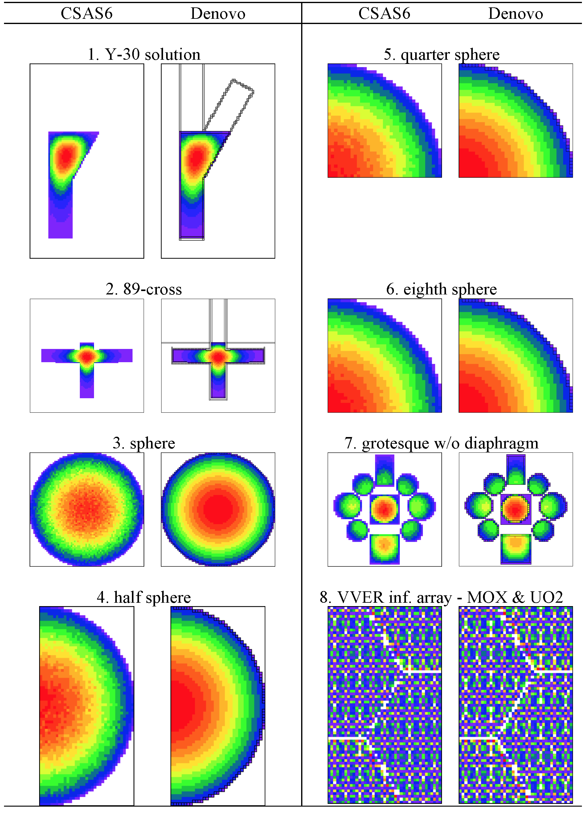

.. _DEVC:

DEVC: Denovo EigenValue Calculation
===================================

*Douglas E. Peplow and Cihangir Celik*

Introduction
------------

The DEVC (Denovo EigenValue Calculation) sequence is an interface to the
Denovo discrete-ordinates package :cite:`evans_denovo_2010` for calculating criticality
eigenvalue problems. This sequence reads an input file very similar to a
CSAS6 input file :cite:`goluoglu_monte_2011` that contains an extra block of input for
describing the Denovo mesh grid and calculational parameters. Many of
the subroutines are shared from the MAVRIC routines that interface with
Denovo for fixed-source calculations.

This manual assumes that the user is familiar with the
discrete-ordinates method for radiation transport and the Denovo
package. DEVC provides an easy way for users to modify existing CSAS6
inputs and use them to run Denovo. The DEVC sequence also provides a way
to create mesh geometry for Denovo from the combinatorial solid geometry
description used by KENO-VI.

The steps in the DEVC sequence are listed in :numref:`tab2-4a-1`.

.. _tab2-4a-1:
.. table:: Steps in DEVC for an input file named *input*.inp
  :align: center

  +-----------------+-----------------+-----------------+-----------------+
  | Step            | Module/Task     | Creates file    | To stop after   |
  +=================+=================+=================+=================+
  | 0               | Check user      |                 |                 |
  |                 | input           |                 |                 |
  +-----------------+-----------------+-----------------+-----------------+
  |                 |                 |                 |                 |
  +-----------------+-----------------+-----------------+-----------------+
  | 1               | Self-shielding  |                 |                 |
  |                 | (celldata/cellm |                 |                 |
  |                 | ix)             |                 |                 |
  |                 | calculations    |                 |                 |
  +-----------------+-----------------+-----------------+-----------------+
  |                 |                 |                 |                 |
  +-----------------+-----------------+-----------------+-----------------+
  | 2               | Produces        |                 |                 |
  |                 | optional \*.png |                 |                 |
  |                 | plots           |                 |                 |
  +-----------------+-----------------+-----------------+-----------------+
  |                 | Produces        |                 | ``parm=check``  |
  |                 | optional        |                 |                 |
  |                 | \*.3mdap files  |                 |                 |
  |                 | (to visualize   |                 |                 |
  |                 | grid in         |                 |                 |
  |                 | MeshFileViewer) |                 |                 |
  +-----------------+-----------------+-----------------+-----------------+
  |                 |                 |                 |                 |
  +-----------------+-----------------+-----------------+-----------------+
  | 3               | Creates AMPX    | ``ft02f001``    | ``parm=cross``  |
  |                 | cross sections  |                 |                 |
  |                 | for the “real”  |                 |                 |
  |                 | materials       |                 |                 |
  +-----------------+-----------------+-----------------+-----------------+
  |                 |                 |                 |                 |
  +-----------------+-----------------+-----------------+-----------------+
  | 4               | Creates Denovo  | ``xkba_b.inp``  | ``parm=input``  |
  |                 | binary stream   |                 |                 |
  |                 | input file and  | ``input.mmt``   |                 |
  |                 | the             |                 |                 |
  |                 |                 |                 |                 |
  |                 | macromaterial   |                 |                 |
  |                 | table file      |                 |                 |
  +-----------------+-----------------+-----------------+-----------------+
  |                 |                 |                 |                 |
  +-----------------+-----------------+-----------------+-----------------+
  | 5               | Runs Denovo to  | ``input.dff`` or|                 |
  |                 | compute         |                 |                 |
  |                 | :math:`k_{      | ``input.dso``   |                 |
  |                 | \text{eff}}`    |                 |                 |
  |                 | and             |                 |                 |
  |                 | either the      |                 |                 |
  |                 | fluxes or the   |                 |                 |
  |                 | fission source  |                 |                 |
  +-----------------+-----------------+-----------------+-----------------+

The DEVC sequence uses KENO-VI geometry. Users can specify what output
Denovo will generate: fluxes by space and energy in a binary \*.dff
(Denovo flux file) file or the space-only fission source distribution in
a binary \*.dso (Denovo spatial output) file. The eigenvalue is printed
in the main output text file.

Some of the more common KENO starting source types are supported. Other
starting source types may be added or extended to all of the different
array types in the future. Currently, starting sources are not sent to
Denovo because the Arnoldi solver does not use it. This may change in
the future.

Sequence input
--------------

The input file for a DEVC calculation looks similar to a CSAS6 input
file, as shown in :numref:`tab2-4a-2`. The major difference is that the
parameter block contains information for the Denovo calculation, not the
KENO Monte Carlo calculation. A macromaterial block is used to describe
how the KENO-VI materials are mapped onto the Denovo mesh grid. Only
multi-group cross-section libraries can be used with Denovo.

.. list-table:: Input file for a DEVC calculation (and differences with a CSAS6 input file, where black text is the same as CSAS6 and green text is new for DEVC sequence)
  :name: tab2-4a-2
  :align: center

  * - .. image:: figs/DEVC/tab2.png

Parameters block
~~~~~~~~~~~~~~~~

This block contains the parameters for the Denovo eigenvalue
calculation, the grid geometry, and the macromaterials. Boundary
conditions listed in the parameters block will override those listed in
the bounds block (using CSAS6 syntax). :numref:`tab2-4a-3` lists the Denovo
calculation parameters and their default values, and :numref:`tab2-4a-4` lists
the keywords for the setting the boundary conditions and file saving
options. The grid geometry is defined in a sub-block in the parameters
block, or the keyword ``“gridGeometryID=\ *n*\ ”`` can be used to point to a
grid geometry defined in its own input block.

.. list-table:: Denovo parameters in the parameters block
  :align: center
  :name: tab2-4a-3

  * - .. image:: figs/DEVC/tab3.png

.. list-table:: Boundary conditions and what type of file to save
  :align: center
  :name: tab2-4a-4

  * - .. image:: figs/DEVC/tab4.png

Grid geometry block
~~~~~~~~~~~~~~~~~~~

Grid geometries (“``gridGeometry`` *id*\ ”) require an identification number
and then a description of a three-dimensional rectangular mesh by
specifying the bounding planes of the cells in each of the *x*, *y*, and
*z* dimensions. The keyword ``“xPlanes … end”`` can be used to list plane
values (in any order). The keyword “``xLinear`` *n* *a* *b*\ ” can be used
to specify *n* cells between *a* and *b*. The keywords “``xPlanes``” and
``“xLinear”`` can be used together and multiple times – they will simply add
planes to any already defined for that dimension. Any duplicate planes
will be removed. Similar keywords are used for the *y* and *z*
dimensions.

When using multiple instances of the keywords \*``Linear`` and \*``Planes`` for
a given dimension, duplicates should be removed from the final list. In
some cases, double precision math will leave two planes that are nearly
identical but not removed (e.g., 6.0 and 5.9999999). To prevent this, a
default tolerance is set to remove planes that are within 10\ :sup:`-6`
cm of each other. The user is free to change this by using the keyword
``“tolerance=”`` and specifying something else. Note that the tolerance can
be reset to a different value in between each use of \*``Linear`` or
\*``Planes``.

The keyword “``make3dmap``” for a particular grid geometry definition will
create a file called “\ *outputName*.grid\ *id*.3dmap”, which can be
visualized using the Java Mesh File Viewer. These files will contain
crude geometry information (unit, region, material) that corresponds to
the center of each voxel.

Keywords for the grid geometry block are listed in :numref:`tab2-4a-5`.

.. list-table:: Grid geometry input keywords
  :align: center
  :name: tab2-4a-5

  * - .. image:: figs/DEVC/tab5.png

Macromaterial block
~~~~~~~~~~~~~~~~~~~

In order to get more accurate solutions from a coarse-mesh
discrete-ordinates calculation, Denovo can represent the material in
each voxel of the mesh as a volume-weighted mixture of the real
materials in the problem. When constructing the Denovo input, DEVC can
estimate the volume fraction taken by each real material in each voxel
by a sampling method. The user can specify parameters for how to sample
the geometry. Note that finer sampling makes more accurate estimates of
the material fraction but requires more setup time to create the Denovo
input. Users should understand how the macromaterials are sampled and
consider that when constructing a mesh grid. This is especially
important for geometries that contain arrays. Careful consideration
should be given when overlaying a mesh on a geometry that contains
arrays of arrays.

Because the list of macromaterials could become large, the user can also
specify a tolerance for how close two different macromaterials can be to
be considered the same, thereby reducing the total number of
macromaterials. The macromaterial tolerance, ``“mmTolerance=”``, is used for
creating a different macromaterial from the ones already created by
looking at the infinity norm between two macromaterials.

The number of macromaterials does not appreciably impact Denovo run time
or memory requirements.

Keywords for the macromaterial block are listed :numref:`tab2-4a-6`. Two
different sampling methods are available – ray tracing :cite:`ibrahim_improving_2009` with the
keyword ``mmRayTest`` and point testing :cite:`johnson_fast_2013` with the keyword ``mmPointTest``.

.. list-table:: Macromaterial block input
  :align: center
  :name: tab2-4a-6

  * - .. image:: figs/DEVC/tab6.png

Ray tracing
^^^^^^^^^^^

This method estimates the volume of different materials in the Denovo
mesh grid elements by throwing rays through the KENO-VI geometry and
computing the average track lengths through the each material. Rays are
traced in all three dimensions to better estimate the volume fractions
of materials within each voxel. The ``mmSubCell`` parameter controls how
many rays to trace in each voxel in each dimension. For example, if
``mmSubCell=``\ :math:`\text{\ n}`, then when tracing rays in the
*z* dimension, each column of voxels uses a set of :math:`n \times n`
rays starting uniformly spaced in the *x* and *y* dimensions. With rays
being cast from all three orthogonal directions, then a total of
:math:`3n^{2}` rays are used to sample each voxel. One can think of
subcells as an equally spaced sub-mesh with a single ray positioned at
each center. The number of subcells in each direction, and hence the
number of rays, can be explicitly given with ``mmSubCells ny nz nx nz nx
ny end`` keyword for rays parallel to the :math:`x` axis, :math:`y` axis,
and :math:`z` axis. :numref:`fig2-4a-1` shows different subcell
configurations (in two dimensions) for a given voxel.

.. _fig2-4a-1:

  Ray positions within a voxel with different mmSubCells parameters.

Ray tracing is a more robust method compared to the simple point testing
method used in previous versions of SCALE/MAVRIC; however, it requires
more memory than point testing. Ray tracing gives more accurate
estimates of volume fractions because track lengths across a voxel give
more information than a series of test points. Ray tracing is also much
faster than point testing because the particle tracking routines are
optimized for quickly determining lists of materials and distance along
a given ray.

Ray tracing operates on the grid geometry supplied by the user and
shoots rays in all three directions starting from the lower bounds of
the mesh grid. An example of arbitrary assembly geometry is shown in
:numref:`fig2-4a-2`. A ray consists of a number of steps that corresponds to
crossing a different material along the path of the ray. Ratios of each
step’s length to the voxel length in the ray’s direction determine the
material volume fraction of that step in that voxel, and summation of
the same material volume fractions gives the material volume fraction of
that material in that voxel. Ray tracing through a single voxel that
contains a fuel pin is illustrated in :numref:`fig2-4a-3`.

.. _fig2-4a-2:

  Geometry model (left) and the Denovo representation (right) of an assembly using macromaterials determined by ray tracing.

The final constructed macromaterials for this model are also shown in
:numref:`fig2-4a-2`. Voxels that contain only a single material are assigned
that original material number in the constructed macromaterials. For the
voxels that contain a fuel pin with three different materials, the
result is a new macromaterial consisting of the volume weighted
fractions of each original material.

After the rays are shot in all three directions, the material volume
fractions are updated and macromaterials are created by using these
material volume fractions. Material volume fraction calculations for a
single voxel, as shown in :numref:`fig2-4a-3`, are given by

.. math::

   F_{m} = \ \sum_{d = x,y,z}^{}{\sum_{r = 1}^{N_{r}}{\sum_{s = 1}^{N_{s}}\left\{ \begin{matrix}
   \frac{L_{d,r,s}}{L_{d}},\ \ \ & m_{s} = = m \\
   0,\ \ \ & \mathrm{\text{otherwise}} \\
   \end{matrix} \right.\ }} \ \ \ \ \ \  \mathrm{\text{ and  }} \ \ \ \ \ \ \ V_{m} = \frac{F_{m}}{\sum_{n = 1}^{N_{m}}F_{n}}\ ,

where *F*\ :sub:`m` = sampled fraction of material *m* in the voxel,

*d* = direction of the rays (*x*, *y*, *z*),

*r* = ray number,

*N*\ :sub:`r` = total number of rays in the voxel for direction of *d,*

*s* = step number,

*N*\ :sub:`s` = total number of steps for ray *r* in the voxel for direction of
*d,*

*L*\ :sub:`d,r,s` = length of the steps *s* for ray *r* in the voxel for
direction of *d,*

*L*\ :sub:`d,` = length of the voxel along direction of *d,*

*m*\ :sub:`s` = material of step *s,*

*m* = material number,

*N*\ :sub:`m` = total number of materials in the voxel, and

*V*\ :sub:`m` = volume fraction of material *m* in the voxel.

.. _fig2-4a-3:

  Ray tracing (in two dimensions) through a voxel.

Point testing
^^^^^^^^^^^^^

The recursive bisection method uses a series of point tests to determine
the macromaterial fractions. For a given voxel, the material at the
center is compared to the material at the eight corners. If they are all
the same, the entire volume is considered to be made of that material.
If different, the volume is divided into two in each dimension. Each
subvolume is tested, and the method is then applied to the subvolumes
that are not of a single material. When the ratio of the volume of the
tested region to the original voxel becomes less than a user-specified
tolerance (in the range of 10\ :sup:`-1` to 10\ :sup:`-4`), then further
subdivision and testing are stopped. This is illustrated in
:numref:`fig2-4a-4`.

.. _fig2-4a-4:

  Progression of the recursive bisection method (from upper left to lower right).

In point testing, the keyword “``mmTolerance=``\ *f*\ ” is interpreted to be
where *f* is the smallest fraction of the voxel volume to consider. This
same tolerance *f* is also used to limit the number of macromaterials.
Before a new macromaterial is created, if one already exists where the
fraction of each actual material matches to within the given tolerance,
then the existing material will be used. If using only a single point at
the center of each voxel, use ``“mmTolerance=1”``. The ``mmSubCell`` keyword is
not used in point testing.

Example
^^^^^^^

:numref:`fig2-4a-5` shows an example of a cask geometry with two types of
spent fuel (yellows), steel (blue), resin (green), and other metals
(gray). When the Denovo geometry is set up by testing only the center of
each mesh cell, the curved surfaces are not well represented (upper
right). By applying the ray-tracing method and defining a new material
made of partial fractions of the original materials, an improved Denovo
model can be made. In the lower left of the figure, the Denovo model was
constructed using one ray (in each dimension) per voxel and a tolerance
of 0.1. This gives 20 new materials that are a mixture of the original
13 actual materials and void. With ``mmSubCells=3`` and an ``mmTolerance=0.01``,
139 macromaterials are created.

A macromaterial table listing the fractions of each macromaterial is
saved to a file called “\ *outputName*.mmt”, where *outputName* is the
name the user chose for his or her output file. This file can be used by
the Mesh File Viewer to display the macromaterials as mixtures of the
actual materials, as seen in lower row of :numref:`fig2-4a-5`. See the Mesh
File Viewer help pages for more information on how to use colormap files
and macromaterial tables.

.. _fig2-4a-5:

  Cask geometry model (upper left) and the Denovo representation using (upper right) cell center testing. Representations using macromaterials determined by ray tracing are shown for (lower left) mmSubCell=1/mmTolerance=0.1 and (lower right) mmSubCell=3/mmTolerance=0.01.

Starting sources block
~~~~~~~~~~~~~~~~~~~~~~

The default KENO-VI starting source is “flat over the volume specified
by the unrotated, untranslated geometry record specified in the first
position of the global unit boundary record in fissile material only”.
For DEVC, the default starting source strength is uniform in the fissile
voxels contained within the bounding box of the global unit (uniform
density). If macromaterials are used, the amounts in each voxel are
volume averaged between fissile and non-fissile materials. :numref:`tab2-4a-7`
and :numref:`tab2-4a-8` describe the starting sources available in the DEVC
interface to Denovo.

.. _tab2-4a-7:
.. table:: Starting source types (within the fissile areas of the listed shape)
  :align: center

  +-----------------------+-----------------------+-----------------------+
  |                       | KENO-VI start type    | DEVC                  |
  +=======================+=======================+=======================+
  | nst=0                 | the first surface of  | The bounding box of   |
  |                       | boundary (default)    | global unit           |
  +-----------------------+-----------------------+-----------------------+
  | nst=0                 | Within boundary of    | Not supported         |
  |                       | global array having a |                       |
  |                       | reflector key set to  |                       |
  |                       | false                 |                       |
  +-----------------------+-----------------------+-----------------------+
  | nst=0                 | A cuboid defined by   | Supported             |
  |                       | XSM, XSP, YSM, YSP,   |                       |
  |                       | ZSM, and ZSP          |                       |
  +-----------------------+-----------------------+-----------------------+
  | nst=1                 | A cuboid defined by   | Supported             |
  |                       | XSM, XSP, YSM, YSP,   |                       |
  |                       | ZSM, and ZSP with     |                       |
  |                       | cosine distributions  |                       |
  +-----------------------+-----------------------+-----------------------+
  | nst=2                 | Arbitrary fraction    | Supported for some    |
  |                       | (FCT) in element NXS, | array types (see      |
  |                       | NYS, NZS of the       | :numref:`tab2-4a-8`)  |
  |                       | global array with the |                       |
  |                       | remainder in a cuboid |                       |
  |                       | defined by XSM, XSP,  |                       |
  |                       | YSM, YSP, ZSM, and    |                       |
  |                       | ZSP with cosine       |                       |
  |                       | distributions         |                       |
  +-----------------------+-----------------------+-----------------------+
  | nst=3                 | At the location TFX,  | Supported for some    |
  |                       | TFY, TFZ in the       | array types (see      |
  |                       | element NXS, NYS, NZS | :numref:`tab2-4a-8`)  |
  |                       | of the global array   |                       |
  +-----------------------+-----------------------+-----------------------+
  | nst=4                 | At the location TFX,  | Supported             |
  |                       | TFY, TFZ in units NBX |                       |
  |                       | of the global array   |                       |
  +-----------------------+-----------------------+-----------------------+
  | nst=5                 | Across units NBX in   | Not supported         |
  |                       | the global array      |                       |
  +-----------------------+-----------------------+-----------------------+
  | nst=6                 | List of points TFX,   | Limited to 1 point    |
  |                       | TFY, TFZ in global    |                       |
  |                       | coordinates           |                       |
  +-----------------------+-----------------------+-----------------------+
  | nst=6                 | List of points TFX,   | Limited to 1 point    |
  |                       | TFY, TFZ in element   | and only for some     |
  |                       | NXS, NYS, NZS of the  | array types (see      |
  |                       | global array          | :numref:`tab2-4a-8`)  |
  +-----------------------+-----------------------+-----------------------+
  | nst=7                 | Flat distributions in | Supported             |
  |                       | X and Y with          |                       |
  |                       | [1-cos\ :sup:`2`\ (z)]|                       |
  |                       | in Z for a cuboid     |                       |
  |                       | defined by XSM, XSP,  |                       |
  |                       | YSM, YSP, ZSM, and    |                       |
  |                       | ZSP                   |                       |
  +-----------------------+-----------------------+-----------------------+
  | nst=8                 | Flat distributions in | Not supported         |
  |                       | X and Y with a        |                       |
  |                       | segmented             |                       |
  |                       | distribution in Z for |                       |
  |                       | a cuboid defined by   |                       |
  |                       | XSM, XSP, YSM, YSP,   |                       |
  |                       | ZSM, and ZSP          |                       |
  +-----------------------+-----------------------+-----------------------+
  | nst=9                 | Use a mesh source     | Not supported         |
  |                       | lite file             |                       |
  +-----------------------+-----------------------+-----------------------+

.. _tab2-4a-8:
.. table:: Supported array types for starting sources
  :align: center

  +--------------+-----------+
  | no arrays    | supported |
  +==============+===========+
  | cuboid       | supported |
  +--------------+-----------+
  | hexagonal    | supported |
  +--------------+-----------+
  | shexagonal   | no        |
  +--------------+-----------+
  | rhexagonal   | no        |
  +--------------+-----------+
  | dodecahedral | no        |
  +--------------+-----------+

The starting source initialized in Denovo is always a volumetric source---\
DEVC does not create point sources (which would activate the first
collision option in Denovo).

Sequence Output
---------------

The main text output file consists of the output from the cross-section
processing codes and Denovo. The user should examine the output and pay
attention to any warnings or errors. :numref:`tab2-4a-9` lists the files
generated during the DEVC sequence.

.. _tab2-4a-9:
.. table:: Files created by DEVC for an input file named *input*.inp
  :align: center

  +-----------------+-----------------+-----------------+-----------------+
  | **Filename**    |                 |    **Viewer**   | **Description** |
  +=================+=================+=================+=================+
  | Output Summary  |                 |                 |                 |
  +-----------------+-----------------+-----------------+-----------------+
  |                 | *input*.out     |                 | main text       |
  |                 |                 |                 | output file,    |
  |                 |                 |                 | contains        |
  |                 |                 |                 | :math:`k_{\math |
  |                 |                 |                 | rm{\text{eff}}}`|
  |                 |                 |                 |                 |
  +-----------------+-----------------+-----------------+-----------------+
  |                 | *input*.msg     |                 | messages file   |
  +-----------------+-----------------+-----------------+-----------------+
  |                 |                 |                 |                 |
  +-----------------+-----------------+-----------------+-----------------+
  | Denovo          |                 |                 |                 |
  +-----------------+-----------------+-----------------+-----------------+
  |                 | xkba_b.inp      | V\ :sup:`a`     | input file for  |
  |                 |                 |                 | Denovo – if     |
  |                 |                 |                 | this file is    |
  |                 |                 |                 | renamed to have |
  |                 |                 |                 |                 |
  |                 |                 |                 | a \*.dsi        |
  |                 |                 |                 | extension       |
  |                 |                 |                 | (Denovo simple  |
  |                 |                 |                 | input), it is   |
  |                 |                 |                 | viewable        |
  |                 |                 |                 |                 |
  |                 |                 |                 | in the Mesh     |
  |                 |                 |                 | File Viewer     |
  +-----------------+-----------------+-----------------+-----------------+
  |                 | ft02f001        |                 | AMPX formatted  |
  |                 |                 |                 | cross sections  |
  |                 |                 |                 | for Denovo      |
  +-----------------+-----------------+-----------------+-----------------+
  |                 | *input*.mmt     | V               | macromaterial   |
  |                 |                 |                 | table, use with |
  |                 |                 |                 | \*.dso or       |
  |                 |                 |                 | \*.dsi file     |
  +-----------------+-----------------+-----------------+-----------------+
  |                 |                 |                 |                 |
  +-----------------+-----------------+-----------------+-----------------+
  |                 | *input*.dff     | V               | Denovo fission  |
  |                 |                 |                 | fluxes          |
  +-----------------+-----------------+-----------------+-----------------+
  |                 | *input*.dso     | V               | Denovo fission  |
  |                 |                 |                 | source          |
  |                 |                 |                 | distribution    |
  +-----------------+-----------------+-----------------+-----------------+
  | :sup:`a`\ V – c\|                 |                 |                 |
  | an be displayed |                 |                 |                 |
  | with the Mesh F\|                 |                 |                 |
  | ile Viewer.     |                 |                 |                 |
  +-----------------+-----------------+-----------------+-----------------+

Using the mesh file viewer
~~~~~~~~~~~~~~~~~~~~~~~~~~

The Mesh File Viewer is a Java utility shipped with SCALE that is used
for viewing mesh tallies from Monaco, as well as importance maps and
mesh-based sources in MAVRIC. The Mesh File Viewer can be used with DEVC
to view the Denovo input file (\*.dsi, showing the starting source), the
Denovo output fission source distribution (\*.dso) file, or the Denovo
output flux (\*.dff) file.

With any Denovo file, material information for each voxel can be
displayed. Users can use the graphical user interface to select colors
for each material in the DEVC input and save them to a colormap text
file (\*.cmp) for later use. For example, :numref:`fig2-4a-6` shows a cask
model that has 13 materials with the default colors assigned by the
viewer. A better color map (uranium is yellow, steel is blue, etc.) and
an image using that color map are also shown in :numref:`fig2-4a-6`.

.. _fig2-4a-6:

  Viewing material information with the Mesh File Viewer.

If the Denovo input was made using the mixed macromaterials, that can
also be shown with the Mesh File Viewer. When one of the mesh files is
loaded and the geometry is displayed (e.g., the materials for a cask
model shown in :numref:`fig2-4a-7`), there will be many values since each
macromaterial is treated by the Java viewer as a separate material.
Redefining the color map using the GUI is not realistic.

A colormap needs to be defined for the original materials of the
problem. For this example, there are 13 original materials, but when
using macromaterials, 73 macromaterials are used in the
discrete-ordinates model (as listed in the \*.mmt file). The colormap
file should only contain values for the 13 original materials. When
loading the colormap, a corresponding \*.mmt file can also be loaded.
This will display mixed colors for the macromaterials, as shown in
:numref:`fig2-4a-7`.

The final result is an image where the colors for the different values
of the geometry attribute (which in the above example is material) are
mixed in the ratio of the macromaterial definition.

.. _fig2-4a-7:

  Viewing material information from a Denovo input file.

Viewing the starting source
~~~~~~~~~~~~~~~~~~~~~~~~~~~

The Java MeshFileViewer (scale/cmds/meshview) can be used to visualize
the Denovo binary stream input file to show materials and starting
source strengths. An example is shown in :numref:`fig2-4a-8`.

**Material Numbering**

The cross sections produced by the SCALE cross-section mixing module ICE
typically have a number of materials equal to the maximum material ID
specified by the user in the “read composition” block. For a user input
that contains materials 1, 3, and 5, the GIP-formatted cross-section
file will contain five entries. For each lattice cell calculation that
uses a cellmix= parameter, one more entry is contained in the GIP file.
Hence, the GIP file does not contain the user’s value from the
“cellmix=” parameter but instead numbers the cellmix materials
sequentially starting from 1+maximum(material ID). The Denovo geometry
input and macroMixTable file produced by DEVC are modified to match the
GIP cross-section file. When viewing the Denovo binary input file with
the Mesh File Viewer, the GIP numbering for materials will be seen.

.. _fig2-4a-8:

  Fine-mesh version of sample problem 8, showing the materials using macromaterial blending of UO\ :sub:`2`, MOX, clad, and water (left) and the starting source strength limited to cells with fissionable material (right).

Sample Problems
---------------

Sample problems have been made that correspond to the eight CSAS6 sample
problems. In each problem, the KENO parameters block was commented out,
a parameters block containing Denovo calculation parameters was added,
and a grid geometry block was added. These sample problems use a coarse
discretization and loose tolerances to obtain a short runtime. Users
will typically use much finer discretization (mesh, quadrature) and
higher fidelity parameter settings for real eigenvalue calculations. The
voxelized geometry and starting source distribution are shown below in
:numref:`fig2-4a-9`.

Results for the sample problems are displayed in :numref:`tab2-4a-10`. The
sample problems used QR 1/1, a P\ :sub:`0` scattering expansion, a k
tolerance of 0.001 and coarse meshes for speed. The higher fidelity runs
used finer spatial meshes, default parameters of QR 2/2, *P*\ :sub:`0`
scattering expansion, and the default *k* tolerance (10:sup:`-5`).
Results for the longer-time CSAS6 and higher fidelity Denovo
calculations are shown in :numref:`fig2-4a-10`.

.. _fig2-4a-9:

  Denovo geometry (left) and starting source distribution (right) for the sample problems.

.. _fig2-4a-10:

  Fission source distributions computed by CSAS6 (left) and Denovo (right).

.. list-table:: Sample problem results
  :name: tab2-4a-10
  :align: center

  * - .. image:: figs/DEVC/tab10.png

.. bibliography:: bibs/DEVC.bib
