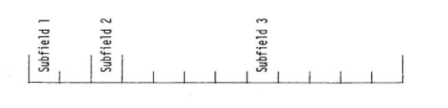

.. _11-5:

FIDO Input System
=================

*L. M. Petrie*

ABSTRACT

This document provides a description of the FIDO input system being used
in conjunction with several SCALE functional modules. The FIDO system is
a widely used method of entering or modifying large data arrays with
minimum effort. Special advantage is taken of patterns of repetition or
symmetry whenever possible.

ACKNOWLEDGMENTS

This document was funded by the Office of Nuclear Material Safety and
Safeguards, U.S. Nuclear Regulatory Commission, for inclusion within the
SCALE manual.

.. _11-5-1:

Introduction
------------

The FIDO input method is specially devised to allow entering or
modifying large data arrays with minimum effort. Advantage is taken of
patterns of repetition or symmetry wherever possible. The FIDO system
was patterned after the input method used with the FLOCO coding system
at Los Alamos and was first applied to the DTF-II code. Since that time,
numerous features requested by users have been added, a free-field
option has been developed, and the application of FIDO has spread to
innumerable codes. Starting with SCALE 5, the FIDO routines have been
converted to Fortran 90, and the requirement that arrays be held in a
large container array has been removed.

The data are entered in units called “arrays.” An array comprises a
group of contiguous storage locations that are to be filled with data at
the same time. These arrays usually correspond on a one-to-one basis
with Fortran arrays used in the program. A group of one or more arrays
read with a single call to the FIDO package forms a “block,” and a
special delimiter is required to signify the end of each block. Arrays
within a block may be read in any order with respect to each other, but
an array belonging to one block must not be shifted to another. The same
array can be entered repeatedly within the same block. For example, an
array could be filled with “0” using a special option, and then a few
scattered locations could be changed by reading in a new set of data for
that array. If no entries to the arrays in a block are required, the
delimiter alone satisfies the input requirement.

Three major types of input are available: fixed-field input, free-field
input, and user-field input.

.. _11-5-2:

Fixed-Field Input
-----------------

The fixed-field input option is documented here for completeness.

.. note:: The use of fixed-field input is NOT recommended. Use the free-field input
  option documented in :ref:`11-5-3`.

Each record is divided into six 12-column data fields, each of which is
divided into three subfields. The following sketch illustrates a typical
data field. The three subfields always comprise 2, 1, and 9 columns,
respectively.

To begin the first array of a block, an array originator field is placed
in any field on a record:

Subfield 1: An integer array identifier < 100 specifying the data array to be read in.

Subfield 2: An array-type indicator:

    “$” if the array is integer data

    “*” if the array is real data

    “#” if the array is double-precision data

Subfield 3: Blank

Data are then placed in successive fields until the required number of
entries has been accounted for.

In entering data, it is convenient to think of an “index” or “pointer”
as a designator that is under the control of the user and which
specifies the position in the array into which the next data entry is to
go. The pointer is always positioned at array location #1 by entering
the array originator field. The pointer subsequently moves according to
the data operator chosen. Blank fields are a special case in that they
do not cause any data modification and do not move the pointer.

A data field has the following form:

Subfield 1: The data numerator, an integer <100. We refer to this entry
as N\ :sub:`1` in the following discussion.

Subfield 2: One of the special data operators listed below.

Subfield 3: A nine-character data entry, to be read in F9.0 format. It
will be converted to an integer if the array is a “$” array or if a
special array operator such as Q is being used. Note that an exponent is
permissible but not required. Likewise, a decimal is permissible but not
required. If no decimal is supplied, it is assumed to be immediately to
the left of the exponent, if any; and otherwise to the right of the last
column. This entry is referred to as N3 in the following discussion.

A list of data operators and their effect on the array being input
follows:

“Blank”

indicates a single entry of data. The data entry in the third
subfield is entered in the location indicated by the pointer, and the
pointer is advanced by one. However, an entirely blank field is ignored.

“+” or “–”

indicates exponentiation. The data entry in the third field
is entered and multiplied by :math:`10^{\pm N_{1}}` where N\ :sub:`1` is the data numerator in
the first subfield, given the sign indicated by the data operator
itself. The pointer advances by one. In cases where an exponent is
needed, this option allows the entering of more significant figures than
the blank option.

“&”

has the same effect as “+.”

“R”

indicates that the data entry is to be repeated N\ :sub:`1` times.
The pointer advances by N\ :sub:`1`. The entry 5R1 is equivalent to 1 1
1 1 1.

“I”

indicates linear interpolation. The data numerator, N\ :sub:`1`,
indicates the number of interpolated points to be supplied. The data
entry in the third subfield N\ :sub:`3` is entered, followed by Nj
interpolated entries equally spaced between that value and the data
entry found in the third subfield of the next nonblank field. The
pointer is advanced by N\ :sub:`1` + 1. The field following an “I” field
is than processed normally, according to its own data operator. The “I”
entry is especially valuable for specifying a spatial mesh. For example,
the entry 3I 10 50 is equivalent to 10 20 30 40 50. In “$” arrays,
interpolated values will be rounded to the nearest integer.

“L”

indicates logarithmic interpolation. The effect is the same as that
of “I” except that the resulting data are evenly separated in log-space.
This feature is especially convenient for specifying an energy mesh. For
example, the entry 3L 1 1+4 is equivalent to 1 10 100 1000 10000.

“Q”

is used to repeat sequences of numbers. The length of the sequence
is given by the third subfield, N\ :sub:`3`. The sequence of N\ :sub:`3`
entries is to be repeated N\ :sub:`1` times. The pointer advances by
N\ :sub:`1`\ \*N\ :sub:`3`. If either N\ :sub:`1` or N\ :sub:`3` is 0,
then a sequence of N\ :sub:`1` + N\ :sub:`3` is repeated one time only,
and the pointer advances by N\ :sub:`1` + N\ :sub:`3`. This feature is
especially valuable for geometry specification.

The “N” option

has the same effect as “Q,” except that the order of the
sequence is reversed each time it is entered. This feature is valuable
for the type of symmetry possessed by S\ :sub:`n` quadrature
coefficients.

“M”

has the same effect as “N,” except that the sign of each entry in
the sequence is reversed each time the sequence is entered. For example,
the entries

  1 2 3 2M2

  would be equivalent to

  1 2 3 –3 –2 2 3.

This option is also useful in entering discrete ordinates angular
quadrature coefficients.

“Z”

causes N\ :sub:`1` + N\ :sub:`3` locations to be set at 0. The
pointer is advanced by N\ :sub:`1` + N\ :sub:`3`.

“C”

causes the position of the last array entered to be printed. This is
the position of the pointer, less 1. The pointer is not moved.

“O”

causes the print trigger to be changed. The trigger is originally
off. Successive “O” fields turn it on and off alternately. When the
trigger is on, each record is listed as it is read.

“S”

indicates that the pointer is to skip N\ :sub:`1` positions leaving
those array positions unchanged. If the third subfield is blank, the
pointer is advanced by N\ :sub:`1`. If the third subfield is nonblank,
that data entry is entered following the skip, and the pointer is
advanced by N\ :sub:`1` + 1.

“A”

moves the pointer to the position, N\ :sub:`3` specified in the
third subfield.

"F"

fills the remainder of the array with the datum entered in the third
subfield. For example, F9 will fill all positions of the array with a
value of 9.

“E”

skips over the remainder of the array. The array length criterion is
always satisfied by an E, no matter how many entries have been
specified. No more entries to an array may be given following an “E,”
except that data entry may be restarted with an “A.”

The reading of data to an array is terminated when a new array origin
field is supplied, or when the block is terminated. If an incorrect
number of positions has been filled, an error edit is given; and a flag
is set which will later abort execution of the problem. FIDO then
continues with the next array if an array origin was read. Otherwise,
control is returned to the calling program.

A block termination consists of a field having “T” in the second
subfield. Entries following “T” on a record are ignored, and control is
returned from FIDO to the calling program.

Comment records can be entered within a block by placing an apostrophe
(') in column 1. Then columns 2–80 will be listed, with column 2 being
used for printer carriage control. Such records have no effect on the
data array or pointer.

.. _11-5-3:

Free-Field Input
----------------

With free-field input, data are written without fixed restrictions as to
field and subfield size and positioning on the record. The options used
with fixed-field input are available, although some are slightly
restricted in form. In general, fewer data records are required for a
problem, the interpreting print is easier to read, a record listing is
more intelligible, the records are easier to enter, and certain common
data entry errors are tolerated without affecting the problem. Data
arrays using fixed- and free-field input can be intermingled at will
within a given block.

The concept of three subfields per field is still applicable to
free-field input; but if no entry for a field is required, no space for
it need be left. Only columns 1–72 may be used, as with fixed-field
input. A field may not be split across records.

The array originator field can begin in any position. The array
identifiers and type indicators are used as in fixed-field input. The
type indicator is entered twice to designate free-field input (i.e.,
“$$,” “\*\*,” or “##”). The blank third subfield required in fixed-field
input is not required. For example,

  31*\*

indicates that array 31, a real-data array, will follow in free-field
format.

Data fields may follow the array origin field immediately. The data
field entries are identical to the fixed-field entries with the
following restrictions:

1. Any number of blanks may separate fields, but at least one blank must
follow a third subfield entry if one is used.

2. If both first- and second-subfield entries are used, no blanks may
separate them (i.e., 24S, but not 24 S).

3. Numbers written with exponents must not have imbedded blanks (i.e.,
1.0E+4, 1.0−E4, 1.0+4, or even 1+4, but *not* 1.0 E4). A zero should
never be entered with an exponent. For example, 0.00 − 5 or 0.00E − 5
will be interpreted as − 5 × 10\ :sup:`–2`.

4. In third-subfield data entries only 9 digits, including the decimal
but not including the exponent field, can be used (i.e.,
123456.89E07, but *not* 123456.789E07).

5. The Z entry must be of the form: 738Z, *not* Z738 or 738 Z.

6. The + or − data operators are not needed and are not available.

7. The Q, N, and M entries are restricted: 3Q4, 1N4, M4, but *not* 4Q,
4N, or 4M.

.. _11-5-4:

User-Field Input
----------------

If the user follows the array identifier in the array originator field
with the character “U” or “V,” the input format is to be specified by
the user. If “U” is specified, the FORTRAN FORMAT to be used must be
supplied in columns 1–72 of the next record. The format must be enclosed
by the usual parentheses. Then the data for the entire array must follow
on successive records. The rules of ordinary FORTRAN input as to
exponents, blanks, etc., apply. If the array data do not fill the last
record, the remainder must be left blank.

“V” has the same effect as “U,” except that the format read in the last
preceding “U” array is used.

.. _11-5-5:

Character Input
---------------

If the user wishes to enter character data into an array, at least three
options are available. The user may specify an arbitrary format using a
“U” and reading in the format. The user may follow the array identifier
by a “/.” The next two entries into subfield 3 specify the beginning and
ending indices in the array into which data will be read. The character
data are then read starting with the next data record in an 18A4 format
if going to a real or integer array, and 9AB if going to a double
precision array.

Finally, the user may specify the array as a free-form “*” array and
then specify the data entries as “nH” character data where n specifies
how many characters follow H.
