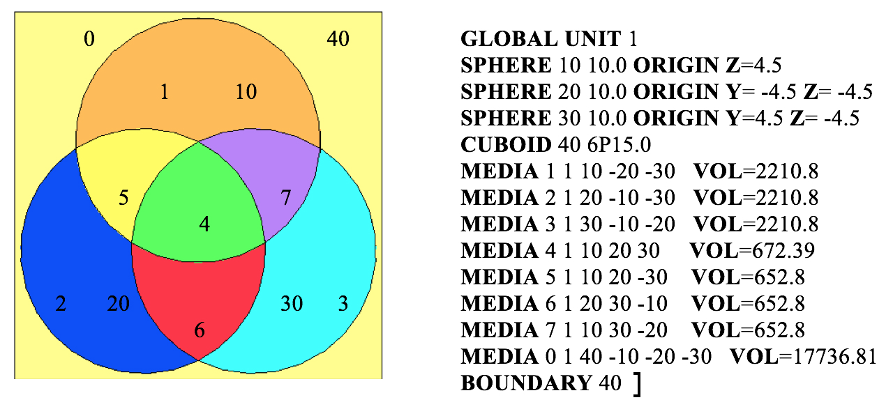

.. _Keno:

Keno: A Monte Carlo Criticality Program
=======================================

*L. M. Petrie, K. B. Bekar, C. Celik, D. F. Hollenbach*,\ :sup:`1` *C. M.*
*Perfetti, S. Goluoglu,*\ :sup:`1` *N. F. Landers,*\ :sup:`1` *M. E. Dunn, B.*
*T. Rearden*

KENO is a three-dimensional (3D) Monte Carlo criticality transport
program developed and maintained for use as part of the SCALE Code
System. It can be used as part of a sequence or as a standalone program.
There are two versions of the code currently supported in SCALE.
KENO V.a is the older of the two. KENO-VI contains all current KENO V.a
features plus a more flexible geometry package known as the SCALE
Generalized Geometry Package. The geometry package in KENO-VI is capable
of modeling any volume that can be constructed using quadratic
equations. In addition, such features as geometry intersections, body
rotations, hexagonal and dodecahedral arrays, and array boundaries have
been included to make the code more flexible.

The simpler geometry features supported by KENO V.a allow for
significantly shorter execution times than KENO-VI, while the additional
geometry features supported in KENO-VI make the code appropriate for
cases where geometry modeling is not possible with KENO V.a. In
particular, KENO-VI allows intersections, body truncations with planes,
and a much wider variety of geometrical bodies. KENO-VI also has the
ability to rotate bodies so that volumes no longer must be positioned
parallel to a major axis. Hexagonal arrays are available in KENO-VI and
dohecahedral arrays enable the code to model pebble bed reactors and
other systems composed of close packed spheres. The use of array
boundaries makes it possible to fill a non-cuboidal volume with an
array, specifying the boundary where a particle leaves and enters the
array.

Except for geometry capabilities, the two versions of KENO share most of
the computational capabilities and the input flexibility specific to
most SCALE modules. They can both operate in multigroup or continuous
energy mode, run as standalone codes, or integrated in computational
sequences such as CSAS, TSUNAMI-3D, or TRITON. Both versions of the code
are continually updated and are written in FORTRAN 90.

Computational capabilities shared by the two versions of KENO include
the determination of k‑effective, neutron lifetime, generation time,
energy-dependent leakages, energy- and region-dependent absorptions,
fissions, the system mean-free-path, the region-dependent
mean-free-path, average neutron energy, flux densities, fission
densities, reaction rate tallies, mesh tallies, source convergence
diagnostics, problem-dependent continuous energy temperature treatments,
parallel calculations, restart capabilities, and many more.

:sup:`1`\ Formerly with Oak Ridge National Laboratory

ACKNOWLEDGMENTS

Many individuals have contributed significantly to the development of
KENO. Special recognition is given to G. E. Whitesides, former Director
of the Computing Applications Division, who was responsible for the
concept and development of the original KENO code. He has also
contributed significantly to some of the techniques used in both KENO
versions. The late J. T. Thomas offered many ideas that have been
implemented in the code. R. M. Westfall, retired from ORNL, provided
early consultation, encouragement, and benchmarks for validating the
code. The special abilities of J. R. Knight, retired from ORNL,
contributed substantially to debugging early versions of the code. S. W.
D. Hart was instrumental in implementing continuous energy temperature
treatments. W. J. Marshall has provided substantial validation and
quality assurance reviews. Appreciation is expressed to C. V. Parks and
S. M. Bowman for their support of KENO and the KENO3D visualization
tool. The late P. B. Fox provided many of the figures in this document.
D. Ilas, B. J. Marshall, and D. E. Mueller consolidated the previous
KENO V.a and KENO-VI manuals into this present form. The efforts of
L. F. Norris (retired), W. C. Carter (retired), S. J. Poarch, D. J.
Weaver (retired), S. Y. Walker and R. B. Raney in preparing this
document are gratefully acknowledged.

The authors thank the U. S. Nuclear Regulatory Commission and the DOE
Nuclear Criticality Safety Program for sponsorship of the continuous
energy, source convergence diagnostics, and grid geometry features in
the current version.

Introduction to KENO
--------------------

KENO, a functional module in the SCALE system, is a Monte Carlo
criticality program used to calculate :math:`k_{eff}`, fluxes, reaction rates,
and other data for three-dimensional (3-D) systems. Special features
include multigroup or continuous energy mode, simplified data input, the
ability to specify origins for spherical and cylindrical geometry
regions, a P\ :sub:`n` scattering treatment, and restart capability.

The KENO data input features flexibility in the order of input. The only
restrictions are that the sequence identifier, title, and cross section
library must be entered first. A large portion of the data has been
assigned default values found to be adequate for many
problems. This feature enables the user to run a problem with a minimum
of input data.

In addition to the features listed above, KENO-VI uses the SCALE
Generalized Geometry Package (SGGP), which contains a much larger set of
geometrical bodies, including cuboids, cylinders, spheres, cones,
dodecahedrons, elliptical cylinders, ellipsoids, hoppers,
parallelepipeds, planes, rhomboids, and wedges. The code’s flexibility
is increased by allowing: intersecting geometry regions; hexagonal,
dodecahedral, and cuboidal arrays; bodies and holes rotated to any angle
and translated to any position; and a specified array boundary that
contains only that portion of the array located inside the boundary.
Users should be aware that the added geometry features in KENO‑VI can
result in significantly longer run times than KENO V.a. A KENO-VI
problem that can be modeled in KENO V.a will typically run about four
times as long with KENO-VI as it does with KENO V.a. Therefore KENO-VI
is not a replacement for KENO V.a, but rather an additional version for
more complex geometries that could not be modeled previously.

Blocks of input data are entered in the form

**READ XXXX** *input_data* **END XXXX,**

where **XXXX** is the keyword for the type of data being entered. The
types of data entered include parameters, geometry region data, array
definition data, biasing or weighting data, albedo boundary conditions,
starting distribution information, the cross section mixing table, extra
one-dimensional (1-D) (reaction rate) cross section IDs for special
applications, energy group boundaries for tallying in the continuous
energy mode, a mesh grid for collecting flux moments, and printer plot
information.

A block of data can be omitted unless it is needed or desired for the
problem. Within the blocks of data, most of the input is activated by
using keywords to override default values.

The treatment of the energy variable can be either multigroup or
continuous. Changing the calculation mode from multigroup to continuous
energy or vice versa is established by simply changing the cross section
library used. All available calculated entities in the multigroup mode
can also be calculated in the continuous energy mode. If the calculated
entity is energy or group dependent, it is automatically tallied into
the appropriate group structure in the continuous energy mode.

The KENO V.a geometry input consists of spheres, hemispheres, cylinders,
hemicylinders, and cuboids. Although the origin of the cylinders,
hemicylinders, spheres, and hemispheres is zero by default, they may be
specified to any value that will allow the geometry to fit in the
problem. This feature allows the use of nonconcentric cylindrical and
spherical shapes and provides a great deal of freedom in positioning
them. Another feature that expands the generality of the code is the
ability to place the cut surface of the hemicylinders and hemispheres at
any distance between the radius and the origin.

An additional convenience is the availability of an alternative method
for specifying the array definition unit-location data. This method uses
FIDO-like options for filling the array.

As mentioned above, KENO-VI uses the SGGP, which contains a much more
flexible geometry package than the one in KENO V.a. In KENO-VI, geometry
regions are constructed and processed as sets of quadratic equations. A
set of geometric shapes (including all of those used in KENO V.a plus
others) is available in KENO-VI, as well as the ability to build more
complex geometric shapes using sets of quadratic equations. Unlike
KENO V.a, KENO-VI allows intersections between geometry regions within a
unit, and it provides the ability to specify an array boundary that
intersects the array.

The most flexible KENO V.a geometry features are the
“\ **ARRAY**-of-**ARRAY**\ s” and “\ **HOLE**\ s” capabilities. The
**ARRAY**-of-**ARRAY**\ s option allows the construction of **ARRAY**\ s
from other **ARRAY**\ s. The depth of nesting is limited only by
computer space restrictions. This option greatly simplifies the setup
for **ARRAY**\ s involving different **UNIT**\ s at different spacings.
The **HOLE** option allows a **UNIT** or an **ARRAY** to be placed at
any desired location within a geometry region. The emplaced **UNIT** or
**ARRAY** cannot intersect any geometry region and must be wholly
contained within a region. As many **HOLE**\ s as will snugly fit
without intersecting can be placed in a region. This option is
especially useful for describing shipping casks and reflectors that have
gaps or other geometrical features. Any number of **HOLE**\ s can be
described in a problem, and **HOLE**\ s can be nested to any depth.

The primary difference between the KENO V.a and KENO-VI geometry input
is the methodology used to represent the geometry/material regions in a
unit. KENO-VI uses two geometry records (cards) to describe a region.
The first record, called the GEOMETRY record, contains the geometry
(**shape**) keyword, region boundary definitions, and any geometry
modification data. Using geometry modification data, regions can be
rotated and translated to any angle and position within a unit. The
second record, the **CONTENT** record, contains the **MEDIA** keyword;
the material, **HOLE**, or **ARRAY** ID number; the bias ID number; and
the region definition vector. KENO-VI requires that a **GLOBAL UNIT** be
specified in all problems, including single unit problems.

In addition to the *cuboidal* **ARRAY**\ s available in KENO V.a,
*hexagonal* **ARRAY**\ s and *dodecahedral* **ARRAY**\ s can be directly
constructed in KENO-VI. Also, the ability to specify an **ARRAY**
boundary that intersects the **ARRAY** makes it possible to construct a
lattice in a cylinder using one **ARRAY** in KENO-VI instead of multiple
**ARRAY**\ s and **HOLE**\ s as would be required in KENO V.a.

Anisotropic scattering is treated by using discrete scattering angles.
The angles and associated probabilities are generated in a manner that
preserves the moments of the angular scattering distribution for the
selected group-to-group transfer. These moments can be derived from the
coefficients of a P\ :sub:`n` Legendre polynomial expansion. All moments
through the 2n − 1 moment are preserved for n discrete scattering
angles. A one-to-one correspondence exists such that n Legendre
coefficients yield n moments. The cases of zero and one scattering angle
are treated in a special manner. Even when the user specifies multiple
scattering angles, KENO can recognize that the distribution is
isotropic, and therefore KENO selects from a continuous isotropic
distribution. If the user specifies one scattering angle, the code
selects the scattering angle from a linear function if it is positive
between -1 and +1, and otherwise it performs semicontinuous scattering
by picking scattering angle cosines uniformly over some range between –1
and +1. The probability is zero over the rest of the range.

The KENO restart option is easy to activate. Certain changes can be made
when a problem is restarted, including using a different random sequence
or turning off certain print options such as fluxes or the fissions and
absorptions by region.

KENO can also compute angular fluxes and flux moments in multigroup
calculations, which are required to compute scattering terms for
generation of sensitivity coefficients with the SAMS module or the
TSUNAMI-3D control module. Fluxes can also be accumulated in a Cartesian
mesh that is superimposed over the user-defined geometry in an automated
manner.

KENO can perform Monte Carlo transport calculations concurrently on a
number of computational nodes. By introducing a simple master-slave
approach via MPI, KENO runs different random walks concurrently on the
replicated geometry within the same generation. Fission source and other
tallied quantities are gathered at the end of each generation by the
master process and are then processed either for final edits or
subsequent generations. Code parallel performance is strongly dependent
on the size of the problem simulated and the size of the tallied
quantities.

KENO Data Guide
---------------

KENO may be run stand alone or as part of a SCALE criticality safety or
sensitivity and uncertainty analysis sequence. If KENO is run stand
alone in the multigroup mode, cross section data can be used from an
AMPX :cite:`dunn_ampx-2000_2002` working format library or from a Monte Carlo format cross
section library. If KENO uses an AMPX working format library, a mixing
table data block must be entered. If a Monte Carlo format library is
used, a mixing table data block is not entered, and the mixtures
specified in the KENO geometry description must be consistent with the
mixtures created on the Monte Carlo format library file.

If KENO is run stand alone in the continuous energy mode, a mixing table
data block must be provided unless the restart option is used.

If KENO is run as part of a SCALE criticality safety or sensitivity and
uncertainty analysis sequence, the mixtures are defined in the CSAS or
TSUNAMI-3D input, and a mixing table data block cannot be entered in
KENO. Furthermore, the mixture numbers used in the KENO geometry
description must correspond to those defined in the composition data
block of the CSAS or TSUNAMI-3D input. To use a cell-weighted mixture in
KENO, the keyword “\ **CELLMIX**\ =,” followed by a unique mixture
number, must be specified in the unit cell data of the CSAS or
TSUNAMI‑3D sequence. Unit cell data are applicable only in the
multigroup mode. The mixture number used in the KENO input is the unique
mixture number immediately following the keyword “\ **CELLMIX**\ =.” A
cell‑weighted mixture is available only in SCALE sequences that use
XSDRN to perform a cell-weighting calculation using a multigroup cross
section library. :numref:`tab8-1-1` through :numref:`tab8-1-14` summarize the KENO
input data blocks. These input data blocks are discussed in detail in
the following sections.

In order to run KENO parallel (standalone execution), the user must
provide a name with the “%” prefix in the input file (=%kenovi). Control
modules like CSAS, TRITON, and TSUNAMI-3D automatically initiate
parallel KENO execution if the user provides the required arguments
while running this code.

.. list-table:: Summary of parameter data.
  :name: tab8-1-1
  :align: center

  * - .. image:: figs/Keno/tab1.svg
        :align: center
        :width: 800

.. list-table:: Summary of array data.
  :name: tab8-1-2
  :align: center

  * - .. image:: figs/Keno/tab2.svg
        :align: center
        :width: 1000

.. list-table:: Summary of biasing data.
  :name: tab8-1-3
  :align: center

  * - .. image:: figs/Keno/tab3.svg
        :align: center
        :width: 1000

.. list-table:: Summary of boundary condition data.
  :name: tab8-1-4
  :align: center

  * - .. image:: figs/Keno/tab4.svg
        :width: 1200
        :align: center

.. list-table:: Summary of boundary condition data specific to KENO-VI.
  :name: tab8-1-5

  * - .. image:: figs/Keno/tab5.svg
        :width:  800
        :align: center

.. list-table:: Summary of geometry data in KENO V.a.
  :name: tab8-1-6
  :align: center

  * - .. image:: figs/Keno/tab6.svg
  * - .. image:: figs/Keno/tab6cont.svg

.. list-table:: Summary of geometry data in KENO-VI.
  :name: tab8-1-7
  :align: center

  * - .. image:: figs/Keno/tab7.svg

.. list-table:: Summary of mixing table data.
  :name: tab8-1-8
  :align: center

  * - .. image:: figs/Keno/tab8.svg

.. list-table:: Summary of plot data.
  :name: tab8-1-9
  :align: center

  * - .. image:: figs/Keno/tab9.svg
       :align: center
       :width: 1000

.. list-table:: Summary of starting data.
  :name: tab8-1-10
  :align: center

  * - .. image:: figs/Keno/tab10.svg
        :align: center
        :width: 1000

.. list-table:: Summary of volume data (KENO-VI).
  :name: tab8-1-11
  :align: center

  * - .. image:: figs/Keno/tab11.svg
        :width: 10000
        :align: center

.. list-table:: Summary of grid geometry data.
  :name: tab8-1-12
  :align: center

  * - .. image:: figs/Keno/tab12.svg
        :width: 1000
        :align: center

.. _tab8-1-13:
.. table:: Summary of energy group boundary data.
  :align: center

  +-----------------------------------+-----------------------------------+
  | ENERGY                            | Format: READ ENERGY energy group  |
  |                                   | boundaries END ENERGY             |
  |                                   |                                   |
  |                                   | Enter upper energy boundary for   |
  |                                   | each group in eV. The last entry  |
  |                                   | is the lower energy boundary of   |
  |                                   | the last group. For N groups,     |
  |                                   | there are N+1 entries. Entries    |
  |                                   | must be in descending order and   |
  |                                   | in units of eV.                   |
  +-----------------------------------+-----------------------------------+

.. list-table:: Summary of reaction data.
  :name: tab8-1-14
  :align: center

  * - .. image:: figs/Keno/tab14.svg
        :width: 1000
        :align: center

.. _8-1-2-1:

Keno input outline
~~~~~~~~~~~~~~~~~~

The data input for KENO is outlined below. Default data for KENO have
been found to be adequate for many problems. These values should be
carefully considered when entering data.

Blocks of input data are entered in the form:

**READ XXXX** *input_data* **END XXXX**

where **XXXX** is the keyword for the type of data being entered. The
keywords that can be used are listed in Table 8.1.15. A minimum of four
characters is required for a keyword, and some keyword names may be as
long as twelve characters (**READ PARAMETER**, **READ GEOMETRY**, etc.).
Keyword inputs are not case sensitive. Data input is activated by
entering the words **READ XXXX** followed by one or more blanks. All
input data pertinent to **XXXX** are then entered. Data for **XXXX** are
terminated by entering **END XXXX** followed by two or more blanks. Note
that multiple **READ GRID** blocks are used if multiple grid definitions
are needed.

.. _tab8-1-15:
.. table:: Types of input data.
  :align: center

  +-----------------------------------+-----------------------------------+
  | Type of data                      | First four characters             |
  +-----------------------------------+-----------------------------------+
  | Parameters                        | PARA or PARM                      |
  +-----------------------------------+-----------------------------------+
  | Geometry                          | GEOM                              |
  +-----------------------------------+-----------------------------------+
  | Biasing                           | BIAS                              |
  +-----------------------------------+-----------------------------------+
  | Boundary conditions               | BOUN or BNDS                      |
  +-----------------------------------+-----------------------------------+
  | Start                             | STAR or STRT                      |
  +-----------------------------------+-----------------------------------+
  | Energy                            | ENER                              |
  +-----------------------------------+-----------------------------------+
  | Array (unit orientation)          | ARRA                              |
  +-----------------------------------+-----------------------------------+
  | Extra 1-D cross sections          | X1DS                              |
  +-----------------------------------+-----------------------------------+
  | Cross section mixing table\       | MIXT or MIX                       |
  | :sup:`a`                          |                                   |
  +-----------------------------------+-----------------------------------+
  | Plot\ :sup:`a`                    | PLOT or PLT or PICT               |
  +-----------------------------------+-----------------------------------+
  | Volumes                           | VOLU                              |
  +-----------------------------------+-----------------------------------+
  | Grid geometry                     | GRID                              |
  +-----------------------------------+-----------------------------------+
  | Reactions                         | REAC                              |
  +-----------------------------------+-----------------------------------+
  | :sup:`a` MIX and PLT must include |                                   |
  | a trailing blank, which is        |                                   |
  | considered part of the keyword.   |                                   |
  +-----------------------------------+-----------------------------------+

Three data records **must** be entered for every problem: first the
SCALE sequence identifier, then the problem title, and then the **END
DATA** to terminate the problem.

(1) KENO is typically run using one of the SCALE CSAS or TSUNAMI
sequences, but it may also be run stand alone using KENO V.a or KENO-VI.
The sequence identifier is specified using one line similar to:

=kenovi

This line may also include additional runtime directives that are
described throughout the SCALE manual. For example:

=kenova parm=check

The following guidance generally assumes the user is running KENO stand
alone. If KENO is to be run using of the other sequences (e.g., CSAS5),
see the appropriate manual section for additional guidance.

(2) **problem title**

   Enter a problem title (limit 80 characters, including blanks; extra
   characters will be discarded). A title **must be entered**.
   See Sect. 8.1.2.3.

(3) **READ PARA** *parameter_data* **END PARA**

   Enter parameter input as needed to describe a problem. If parameter
   data are desired in standalone KENO calculations (i.e., non-CSAS),
   they must immediately follow the problem title. Default values are
   assigned to all parameters. A problem **can** be run without entering
   any parameter data if the default values are acceptable.

   Parameter data must begin with the words **READ PARA**, **READ
   PARM**, or **READ PARAMETER.** Parameter data may be entered in any
   order. If a parameter is entered more than once, the last value is
   used. The words **END PARA** or **END PARM**, or **END PARAMETER**
   terminate the parameter data. See :ref:`8-1-2-3`.

(n\ :sub:`1`)...( n\ :sub:`13`) The following data may be entered in any
order. Data not needed to describe the problem may be omitted.

(n\ :sub:`1`) **READ GEOM** *all_geometry_region_data* **END GEOM**

Geometry region data must be entered for every problem that is not a
restart problem. Geometry data must begin with the words **READ GEOM**
or **READ GEOMETRY**. The words **END GEOM** or **END GEOMETRY**
terminate the geometry region data. See :ref:`8-1-2-4`.

(n\ :sub:`2`) **READ ARRA** *array_definition_data* **END ARRA**

   Enter array definition data as needed to describe the problem. Array
   definition data define the array size and position units (defined in
   the geometry data) in a 3-D lattice that represents the physical
   problem being analyzed. Array data must begin with the words **READ
   ARRA** or **READ ARRAY** and must terminate with the words **END
   ARRA** or **END ARRAY**. See :ref:`8-1-2-5`.

(n\ :sub:`4`) **READ BOUN** *albedo_boundary_conditions* **END BOUN**

   Enter albedo boundary conditions as needed to describe the problem.
   Albedo data must begin with the words **READ BOUN, READ BNDS**,
   **READ BOUND**, or **READ BOUNDS,** and it must terminate with the
   words **END BOUN**, **ENDS BNDS**, **END BOUND**, or **END BOUNDS**.
   See :ref:`8-1-2-6`.

(n\ :sub:`3`) **READ BIAS** *biasing_information* **END BIAS**

   The *biasing_information* is used to define the weight given to a
   neutron surviving Russian roulette. Biasing data must begin with the
   words **READ BIAS**. The words **END BIAS** terminate the biasing
   data. See :ref:`8-1-2-7`.

(n\ :sub:`5`) **READ STAR** *starting_distribution_information* **END
STAR**

   Enter starting information data for starting the initial source
   neutrons only if a uniform starting distribution is undesirable.
   Start data must begin with the words **READ STAR, READ STRT** or
   **READ START**, and it must terminate with the words **END STAR**,
   **END STRT** or **END START**. See :ref:`8-1-2-8`.

(n\ :sub:`6`) **READ ENER** *energy_group_boundaries* **END ENER**

   Enter upper energy boundaries for each neutron energy group to be
   used for tallying in the continuous energy mode. Energy bin data
   begin with the words **READ ENER** or **READ ENERGY** and terminate
   with the words **END ENER** or **END ENERGY**. The last entry is the
   lower energy boundary of the last group. The values must be in
   descending order. This block is only applicable to continuous energy
   KENO calculations. See :ref:`8-1-2-12`.

(n\ :sub:`7`) **READ MIXT** *cross_section_mixing_table* **END MIXT**

   Enter a mixing table to define all the mixtures to be used in the
   problem. The mixing table must begin with the words **READ MIXT** or
   **READ MIX** and must end with the words **END MIXT** or **END MIX**.
   Do not enter mixing table data if KENO is being executed as a part of
   a SCALE sequence. See :ref:`8-1-2-10`.

(n\ :sub:`8`) **READ X1DS** *extra_1-D_cross_section_IDs* **END X1DS**

   Enter the IDs of any extra 1-D cross sections to be used in the
   problem. These must be available on the mixture cross section
   library. Extra 1-D cross section data must begin with the words
   **READ X1DS** and terminate with the words **END X1DS**. See
   :ref:`8-1-2-9`.

(n\ :sub:`9`) **READ PLOT** *plot_data* **END PLOT**

   Enter the data needed to provide a 2-D character or color plot of a
   slice through a specified portion of the 3-D geometrical
   representation of the problem. Plot data must begin with the words
   **READ PLOT**, **READ PLT**, or **READ PICT** and terminate with the
   words **END PLOT**, **END PLT**, or **END PICT**. See :ref:`8-1-2-11`.

(n\ :sub:`10`) **READ VOLU** *volume_data* **END VOLU**

   Enter the data needed to specify the volumes of the geometry data.
   Volume data must begin with the words **READ VOLU** or **READ
   VOLUME** and end with the words **END VOLU** or **END VOLUME**. See
   Sect.Volume data.

(n\ :sub:`11`) **READ GRID** *mesh_grid_data* **END GRID**

   Enter the data needed to specify a simple Cartesian grid over either
   the entire problem or part of the problem geometry for tallying
   fluxes, moments, fission sources, etc. Grid data may be entered using
   the keywords **READ GRID**, **READ GRIDGEOM**, or **READ
   GRIDGEOMETRY**, and they are terminated with either **END GRID**,
   **END GRIDGEOM**, or **END GRIDGEOMETRY**. Multiple grids may be
   defined by repeating the **READ GRID** block several times,
   specifying a different mesh grid identification number for each so
   defined grid. See Sect. Grid geometry data for further information.

(n\ :sub:`12`) **READ REAC** *reaction_data* **END REAC**

   Enter the data needed to specify filters for the reaction tally
   calculations. Reaction data must begin with the words **READ REAC**
   and terminate with **END REAC**. This block is only applicable to
   calculations in the continuous energy mode. See :ref:`8-1-2-15`.

(n\ :sub:`13`) **END DATA must be entered**

   Terminate the data for the problem.

Procedure for data input
~~~~~~~~~~~~~~~~~~~~~~~~

For a standalone KENO problem, the first data records **must** be the
sequence identifier (e.g., =kenovi or =kenova) and the title. The next
block of data **must** be the parameters if they are to be entered. A
problem can be run without entering the parameters, which causes KENO to
use default values for input parameters. The remaining blocks of data
can be entered in any order.

   **BOLD TYPE** specifies keywords. A keyword is used to identify the
   data that follow it. When a keyword is used, it must be entered
   exactly as shown in the data guide. All keywords except those ending
   with an equal sign must be followed by at least one blank.

   *small_italics* correlate data with a program variable name. The
   actual values are entered in place of the program variable name and
   are terminated by a blank or a comma.

   *CAPITAL ITALICS* identify general data items. General data items are
   general classes of data including

   (1) geometry data such as *UNIT INITIALIZATION* and *UNIT NUMBER
   DEFINITION, GEOMETRY REGION DESCRIPTION, GEOMETRY WORD, MIXTURE
   NUMBER, BIAS ID,* and *REGION DIMENSIONS*,

   (2) albedo data such as *FACE CODES* and *ALBEDO NAMES*,

(3) weighting data such as *BIAS ID NUMBERS*, etc.

   Square brackets The square brackets, [ and ], are used to show that
   an entry is optional.

   Broken line The broken line, \|, is used as a logical “or” symbol to
   show that the entries to its left and right are alternatives that
   cannot be used simultaneously.

.. _8-1-2-3:

Title and parameter data
~~~~~~~~~~~~~~~~~~~~~~~~

A *title*, a character string, must be entered at the top of the input
file. The syntax is:

*title* a string of characters with a length of up to 80 characters,
including blanks.

The **PARAMETER** block may contain parameter initializations for those
parameters that need to be changed from their default value. The syntax
for the **PARAMETER** block is:

**READ** **PARA**\ [**METER**] *p\ 1 … p\ N* **END**
**PARA**\ [**METER**]

or

**READ** **PARM** *p\ 1 … p\ N* **END** **PARM**

*p\ 1 … p\ N* are *N* (*N* greater than or equal to zero) keyworded
parameters that together make up the *PARAMETER DATA*

The commonly changed parameters are **TME**\ *,* **GEN**\ *,* **NSK**,
and **NPG**. Seldom changed parameters are **NBK**\ *,* **NFB**\ *,*
**XNB**\ *,* **XFB**\ *,* **WTH**\ *,* **WTL**\ *,* **TBA**\ *,*
**BUG**\ *,* **TRK**\ *,* and **LNG**.

The *PARAMETER DATA*, *p\ 1 … p\ N*, consists of one or more of the
parameters described below.

Floating point parameters

  **RND** = *rndnum* input hexadecimal random number, a default value is
  provided.

  **TME** = *tmax* execution time (in minutes) for the problem, default =
  0.0 (no limit).

  **TBA** = *tbtch* time allotted for each generation (in minutes),
  default = 10 minutes. If *tbtch* is exceeded in any generation, the
  problem is assumed to be looping. Execution is terminated, and final
  edits are performed. The problem can loop indefinitely on a computer if
  the system-dependent routine to interrupt the problem (PULL) is not
  functional. **TBA=** is also used to set the amount of time available
  for generating the initial starting points.

  **SIG** = *tsigma* if entered and > 0.0, this is the standard deviation
  at which the problem will terminate, default = 0.0, which means do not
  check sigma.

  **WTA** = *dwtav* the default average weight given a neutron that
  survives Russian roulette, *dwtav* default = 0.5.

  **WTH** = *wthigh* the default value of *wthigh* is 3.0 and should be
  changed only if the user has a valid reason to do so. The weight at
  which splitting occurs is defined to be *wthigh x wtavg*, where *wtavg*
  is the weight given to a neutron that survives Russian roulette.

  **WTL** = *wtlow* Russian roulette is played when the weight of a
  neutron is less than *wtlow x wtavg*. The *wtlow* default =
  1.0/\ *wthigh*.

  .. note:: The default values of *wthigh* and *wtlow* have been determined to minimize the deviation per unit running time for many problems.

  **MSH** = *mesh_size* Length (cm) of one side of a cubic mesh for
  tallying fluxes. Default = 0.0. A positive non-zero value must be
  entered if **MFX**\ =YES and **READ GRID** input is not entered.

  **TTL =** *temperature_tolerance* The continuous energy cross sections
  must be within the *temperature_tolerance* (in degrees Kelvin) of the
  requested temperature for the problem to run. A negative value specifies
  the use of the closest temperature to that requested. TTL is ignored
  when **DBX** is nonzero. The default = -1.0.

  **DBH** = *dbrc_high* the energy cutoff (in eV) up to which the Doppler
  Broadening Rejection Correction (DBRC) method will be used on nuclides
  for which DBRC is enabled, and cross section libraries are available.
  DBH is only used in CE simulations. Default = 210.0 eV.

  **DBL** = *dbrc_low* the energy cutoff (in eV) down to which DBRC will
  be used on nuclides for which DBRC is enabled and cross section
  libraries are available. Only used in CE simulations. Default = 0.4 eV.

Integer parameters

  **GEN** = *nba* number of generations to be run, default = 203.

  **NPG** = *npb* number of neutrons per generation, default = 1000.

  **NSK** = *nskip* number of generations (1 through *nskip*) to be
  omitted when collecting results, default = 3.

  **RES** = *nrstrt* number of generations between writing restart data,
  default = 0. If **RES** is zero, restart data are not written. When
  restarting a problem, **RES** is defaulted to the value that was used
  when the restart data block was written. Thus, it must be entered as
  zero to terminate writing restart data for a restarted problem.

  **NBK** = *nbank* number of positions in the neutron bank, default =
  *npb* + 25.

  **XNB** = *nxnbk* number of extra entries in the neutron bank, default =
  0.

  **NFB** = *nfbnk* number of positions in the fission bank, default =
  *npb.*

  **XFB** = *nxfbk* number of extra entries in the fission bank, default =
  0.

  **X1D** = *numx1d* number of extra 1-D cross sections, default = 0.

  **BEG** = *nbas* beginning generation number, default = 1. If **BEG** is
  greater than 1, restart data must be available. **BEG** must be 1
  greater than the number of generations retrieved from the restart file.

  **NB8** = *nb8* number of blocks allocated for the first direct-access
  unit, default = 1000.

  **NL8** = *nl8* length of blocks allocated for the first direct-access
  unit, default = 512.

  **NQD** = *nquad* quadrature order for angular flux tallies, default =
  0, which means do not collect. Angular fluxes are typically only needed
  for TSUNAMI-3D calculations.

  **NGP** = *ngp* number of neutron energy groups to be used for tallying
  in the continuous energy mode. If *NGP* corresponds to a standard SCALE
  group structure, then the SCALE group structure will be used. If it does
  not correspond to a standard structure, an equally spaced in lethargy
  group structure will be used. If nothing is specified for a continuous
  energy problem, the SCALE 238 group structure will be used.

  **PNM** = *isctr* highest order of flux moment tallies, default = 0.
  Flux moments are typically only tallied for TSUNAMI-3D calculations.

  **CET** = *ce_tsunami_mode*.
  mode for CE TSUNAMI (See TSUNAMI-3D manual).

      0 = No sensitivity calculations

      1 = CLUTCH sensitivity calculation

      2 = IFP sensitivity calculation

      4 = GEAR-MC calculation (with CLUTCH only)

      5 = GEAR-MC calculation (with CLUTCH+IFP)

      7 = Undersampling metric calculation

  **CFP** = *number_of_latent_generations*

   number of latent generations used for IFP sensitivity or
   :math:`F^{*}\left( r \right)` calculations. Note:

   - If CET=1 and CFP= -1 then :math:`F^{*}\left( r \right)` is assumed to
     equal one everywhere.

   - If CET=4 and CFP= -1 then :math:`F^{*}\left( r \right)` is assumed to
     equal zero everywhere.

  **DBR** = *lusedbrc* use Doppler Broadening Rejection Correction method.
  See Sect. 8.1.6.2.9 for more details. Only used in CE simulations.
  Default = 2.

     0 = No DBRC

     1 = DBRC for :sup:`238`\ U only

     2 = DBRC for all available nuclides (:sup:`232`\ Th, :sup:`234`\ U,
     :sup:`235`\ U, :sup:`236`\ U, :sup:`238`\ U, :sup:`237`\ Np,
     :sup:`239`\ Pu, :sup:`240`\ Pu)

  **DBX** = *db_xs_mode*

  option for performing problem-dependent or on-the-fly Doppler
  Broadening. See Sect. 8.1.6.2.10 for more details. Default = 2.

     0 = No problem-dependent or on-the-fly Doppler Broadening

     1 = Perform problem-dependent Doppler Broadening for 1D cross
     sections only.

     2 = Perform problem-dependent Doppler Broadening for both 1D and 2D
     (thermal scattering data) cross sections.

Alphanumeric parameter data

  **CEP** = *lcep* key for choosing the calculation mode in stand alone
  KENO calculations. The parameter is set to the appropriate value by the
  calling sequence if not stand alone KENO. For stand alone KENO, enter NO
  for multigroup mode, or enter the continuous energy directory filename
  for the continuous energy mode. The directory file is the file
  containing pointers to files significant for the continuous energy run.

  **FNI** = *mode_in* extra field in the input restart file name
  [restart\_*mode_in*.keno_input] and
  [restart\_*mode_in*.keno_calculated]. The default is an empty field.

  **FNO** = *mode_out* extra field in the output restart filename
  [restart\_*mode_out*.keno_input] and
  [restart\_*mode_out*.keno_calculated]. The default is an empty field.

Logical parameter data … enter *YES* or *NO*

  **APP** = *lappend* key for appending the restart data, default = NO.

  **FLX** = *nflx* key for collecting and printing fluxes, default = NO.

  **FDN** = *nfden* key for collecting and printing fission densities,
  default = YES.

  **ADJ** = *nadj* key for running adjoint calculation, default = NO.
  Adjoint cross sections must be available to run an adjoint problem. If
  LIB= is specified, the cross sections will be adjointed by the code. If
  XSC= is specified, the cross sections must already be in adjoint order.

  **PTB** = *ptb* key for using probability tables in the continuous
  energy mode, default = YES

  **PNU =** *lpromptnu* key for using delayed or prompt ν in the
  continuous energy mode, default = NO – use total.

  **FRE** = *lfree_analytic* key for using free analytic gas treatment,
  default = YES.

  **AMX** = *amx* key for printing all mixture cross section data. This is
  the same as activating *XAP, XS1, XS2, PKI*, and *P1D*. If any of these
  are entered in addition to *AMX*, that portion of *AMX* will be
  overridden, default = NO.

  **XAP** = *prtap* key for printing discrete scattering angles and
  probabilities for the mixture cross sections, default = NO.

  **XS1** = *prtp0* key for printing mixture 1-D cross sections, default =
  NO.

  **XS2** = *prt1* key for printing mixture 2-D cross sections, default =
  NO.

  **XSL** = *prtl* key for printing mixture 2-D P\ :sub:`L` cross
  sections, default = NO. The Legendre expansion order L is automatically
  read from the cross section library.

  **PKI** = *prtchi* print input fission spectrum, default = NO.

  **P1D** = *prtex* print extra 1-D cross sections, default = NO.

  **FAR** = *lfa* key for generating region-dependent fissions and
  absorptions for each energy group, default = NO.

  **GAS** = *lgas* key for printing region-dependent fissions and
  absorptions by energy group, applicable only if FAR = YES. Default =
  FAR. GAS = YES prints region-dependent data by energy group. GAS = NO
  suppresses region-dependent data by energy group.

  **MKP** = *larpos* calculate and print matrix k-effective by unit
  location, default = NO. Unit location may also be referred to as array
  position or position index.

  **CKP** = *lckp* calculate and print cofactor k-effective by unit
  location, default = NO. Unit location may also be referred to as array
  position or position index.

  **FMP** = *pmapos* print fission production matrix by array position,
  default = NO.

  **MKU** = *lunit* calculate and print matrix k-effective by unit type,
  default = NO.

  **CKU** = *lcku* calculate and print cofactor k-effective by unit type,
  default = NO.

  **FMU** = *pmunit* print fission production matrix by unit type, default
  = NO.

  **MKH** = *lmhole* calculate and print matrix k-effective by hole
  number, default = NO.

  **CKH** = *lckh* calculate and print cofactor k-effective by hole
  number, default = NO.

  **FMH** = *pmhole* print fission production matrix by hole number,
  default = NO.

  **HHL** = *lhhgh* collect matrix information by hole number at the
  highest hole nesting level, default = NO.

  **MKA** = *lmarry* calculate and print matrix k-effective by array
  number, default = NO.

  **CKA** = *lcka* calculate and print cofactor k-effective by array
  number, default = NO.

  **FMA** = *pmarry* print fission production matrix by array number,
  default = NO.

  **HAL** = *langh* collect matrix information by array number at the
  highest array nesting level, default = NO.

  **BUG** = *ldbug* print debug information, default = NO. Enter *YES* for
  code debug purposes only.

  **TRK** = *ltrk* print tracking information, default = NO. Enter *YES*
  for code debug purposes only.

  **PWT** = *lpwt* print weight average array, default = NO.

  **PGM** = *lgeom* print unprocessed geometry as it is read, default =
  NO.

  **SMU** = *lmult* calculate the average self-multiplication of a unit,
  default = NO.

  **NUB** = *nubar* calculate the average number of neutrons per fission
  and the average energy group at which fission occurred, default = YES.

  **PAX** = *lcorsp* print the arrays defining the correspondence between
  the cross section energy group structure and the albedo energy group
  structure, default = NO.

  **TFM** = *ltfm* perform coordinate transform for flux moments and
  angular flux calculations, default = NO.

  **PMF** = *prtmore* print angular fluxes or flux moments if calculated,
  default = NO.

  **CFX** = *nflx* collect fluxes, default = NO.

  **UUM** = *lUnionizedMix* use unionized mixture cross section,
  default=NO. Only used in CE simulations. See Sect. 8.1.6.2.3 for further
  details.

  **M2U =** *luseMap2Union* store cross sections for each nuclide on a
  unionized energy grid, default=NO. Only used in CE simulations. See
  Sect. 8.1.6.2.3 for further details.

  **SCX** = *lxsecSave* save CE cross sections to restart file,
  default=NO.

  **MFX** = *make_mesh_flux* compute mesh fluxes on intervals defined by
  **MSH** above or by READ GRID data block, default = NO.

  **PMS** = *print_mesh_flux* print mesh fluxes if computed, default = NO.

  **MFP** = *mean-free-path* compute and print the mean-free-path of a
  neutron by region, default = NO.

  **HTM** = *html_output* produce HTML formatted output for interactive
  browsing, sorting, and plotting of results, default = YES.

  **PMM** = *print_mesh_moments* print the angular moments of the mesh
  flux, if computed, default = NO.

  **PMV** = *print_mesh_volumes* print the volume of each mesh interval,
  if computed. Default = NO.

  **FST** = *lprint_FStar* Create a .3dmap file that contains the
  *F*\ :sup:`\*`\ (r) mesh used by a CE-TSUNAMI CLUTCH sensitivity
  calculation.

  **RUN** = *lrun* key for determining if the problem is to be executed
  when data checking is complete, default = YES.

  **PLT** = *lplot* key for drawing specified plots of the problem
  geometry, default = YES.

.. note:: The parameters RUN and PLOT can also be entered in the PLOT
  data. See Sect. 8.1.2.11. It is recommended that these parameters be
  entered only in the parameter data in order to ensure that the data
  printed in the Logical Parameters table is actually performed. If RUN
  and/or PLT are entered in both the parameter data and plot data, the
  results vary depending on whether the problem is run (1) stand alone,
  (2) as a restarted problem, (3) as CSAS with parm=check, or (4) as CSAS
  without parm=check. These conditions are detailed below.

KENO standalone and CSAS with PARM=CHECK
  The values of RUN and/or PLT entered in KENO parameter data are printed in the Logical Parameters table of the problem output. However, values for RUN and/or PLT entered in the **KENO plot data** will override the values entered in the parameter data.

Restarted KENO
  The values of RUN and/or PLT printed in the Logical Parameters table of the problem output are the final values from the parent problem unless those values are overridden by values entered in the **KENO parameter data** of the restarted problem. If the problem is restarted at generation 1, **KENO plot data** can be entered, and the values for RUN and/or PLT will override the values printed in the Logical Parameters table.

CSAS Without PARM=CHECK
  The values of RUN and/or PLT entered in the KENO parameter data override values entered in the KENO plot data. The values printed in the Logical Parameters table control whether the problem is to be executed and whether a plot is performed.

Parameters that are either Integer or Logical

**SCD**\ = *lScnvgDiag* enable fission source convergence diagnostics
(ScnvgDiag), default=YES. See Sect. 8.1.6.7for further details.

**CDS** = *lcadis/lGridFissions* accumulate neutron fissions to use as
fission source in subsequent MAVRIC/Monaco shielding calculation or for
visualization, default = NO

**GFX** = *lGridFlux* compute grid fluxes averaged over the volume of
the mesh on intervals defined by a READ GRID data block, default = NO.

**MFX** = *lMeshFlux* compute mesh fluxes averaged over the volume of
mixtures/materials in a mesh on intervals defined by **MSH** above or by
READ GRID data block, default = NO.

**CGD** = *lStarMesh* grid ID for the *F*\ :sup:`\*`\ (r) mesh for
continuous energy CLUTCH sensitivity calculations. This mesh is defined
in the **READ GRID** data block, default = NO.

.. note::  The KENO codes in previous SCALE versions allowed for only one
  mesh definition in the user input with either MSH parameter or **READ
  GRID** data block, and (2) calculation of a single mesh-based quantity,
  such as **MFX** (mesh fluxes) or **CDS** (fission source accumulation on
  a mesh), per KENO simulation.

  The option to define multiple spatial meshes during a single simulation
  has been implemented in the KENO codes to add flexibility to mesh-based
  quantity calculations. The new implementation requires that each mesh
  definition in the **READ GRID** block should have a unique NUMBER (grid
  ID), which is used for mesh assignment. Users can assign any number of
  mesh-based quantities by setting the mesh parameters **SCD**, **CDS**,
  **GFX**, **MFX** and **CGD** to this grid NUMBER.

  To support these former and new definition formats, the parameters
  **SCD**, **CDS**, **GFX**, **MFX** and **CGD** have been redesigned to
  allow either integer or logical entries. Integer entries are required if
  multiple mesh-based quantities are requested by the user. In this case,
  each integer entry must point to a grid ID specified in any **READ
  GRID** data block. See Sect. 8.1.2.14. for several examples for the use
  of these parameter definitions. These entries are detailed below.

   **SCD**\ =yes Enable source convergence diagnostics using the fission
   source accumulation on the default mesh, which is 5 × 5 × 5 Cartesian
   mesh overlaying the whole problem geometry, generated automatically.
   See Sect. 8.1.6.7.

   **SCD**\ =\ *id* Enable source convergence diagnostics using the
   fission source accumulation on the mesh defined with **READ GRID**
   data block with grid ID, *id*.

   **MFX**\ =yes Compute mesh fluxes (fluxes averaged over each region
   volume in a voxel) on intervals defined by **MSH** above or by the
   first specified **READ GRID** data block.

   **MFX**\ =\ *id* Compute mesh fluxes on intervals defined by the
   **READ GRID** data block with grid ID, *id*.

   **CDS**\ =yes Accumulate fission sources on intervals defined by the
   first specified **READ GRID** data block.

   **CDS**\ =\ *id* Accumulate fission source on intervals defined by
   the specified **READ GRID** data block with grid ID, *id*.

   **GFX**\ =\ *id* Compute grid fluxes (fluxes averaged over a voxel
   volume) on intervals defined by the READ GRID data block with grid
   ID, *id*.

   **CGD**\ =\ *id* Enable a mesh grid defined by the READ GRID data
   block with grid ID, id for CLUTCH :math:`F^{*}\left( r \right)`
   calculations.

   All of the above quantities may be requested in a single input using
   either the same or different grids. See Sect. 8.1.2.14 for further
   details.

I/O Unit Numbers

  **XSC** = *xsecs* I/O unit number for a Monte Carlo format mixed cross
  section library. When LIB≠0, default = 14. To read a mixed cross section
  library from a Monte Carlo format library file or CSASI, XSC must be
  specified.

  **ALB** = *albdo* I/O unit number for albedo data, default = 79.

  **WTS** = *wts* I/O unit number for weights, default = 80.

  **LIB** = *lib* I/O unit number for *AMPX* working format cross section
  library, default = 0.

  **SKT** = *skrt* I/O unit number for scratch space, default = 16.

  **RST** = *rstrt* I/O unit number for reading restart data, default = 0.

  Enter a logical unit number to restart if *BEG* > 1.

  **WRS** = *wstrt* I/O unit number for writing restart data, default = 0.

     A non-zero value must be entered if *RES* > 0.

  **GRP** = *grpbs* I/O unit number for an energy group boundary library,
  default = 77.

  Example: **READ PARAM** **NPG**\ =203 **FLX**\ =YES **END PARAM**

.. _8-1-2-4:

Geometry data
~~~~~~~~~~~~~

The *GEOMETRY\_ DATA* consists of a series of **UNIT** descriptions, one
of which may be the **GLOBAL UNIT**. The **UNIT** is the basic geometry
piece in KENO and often corresponds to a well-defined physical entity
(e.g., a fuel pin). A **UNIT**, therefore, may consist of multiple
*material regions*. Each **UNIT** has its own, local coordinate system.
The **UNIT**\ s are assembled to construct the problem’s global geometry
for KENO. The *GEOMETRY\_ DATA* must be entered unless the problem is
being restarted. See :ref:`8-1-3-6` for detailed examples.

UNITS
^^^^^

Geometric arrangements in KENO are achieved in a manner similar to using
a child’s building blocks. Each building block is called a **UNIT**. An
**ARRAY** or lattice is constructed by stacking these **UNIT**\ s. Once
an **ARRAY** or lattice has been constructed, it can be placed in a
**UNIT** by using an **ARRAY** specification.

Each **UNIT** in an **ARRAY** or lattice has its own coordinate system.
In KENO V.a, all coordinate systems in all **UNIT**\ s must have the
same orientation. This restriction is removed in KENO-VI. All geometry
data used in a problem are correlated to the absolute coordinate system
by specifying a **GLOBAL UNIT**. **UNIT**\ s are constructed of
combinations from several allowed **shape**\ s or geometric regions.
These regions can be placed anywhere within a **UNIT**. In KENO V.a the
regions are oriented along the coordinate system of the **UNIT** and do
not intersect other regions. This means, for example, that a
**CYLINDER** must have its axis parallel to one of the coordinate axes,
while a rectangular parallelepiped must have its faces perpendicular to
a coordinate axis. The most stringent KENO V.a geometry restriction is
that none of the options allow geometry regions to intersect. In KENO
V.a, each region in a unit must entirely contain each preceding region.
The orientation, intersection, and containment restrictions are
eliminated in KENO-VI. :numref:`fig8-1-1` shows some situations that are not
allowed in KENO V.a, but are allowed in KENO-VI.

.. _fig8-1-1:

  Examples of geometry allowed in KENO-VI but not allowed in KENO V.a.

For KENO V.a, unless special options are invoked, each geometric region
in a **UNIT** must completely enclose each interior region. Regions may
touch at points of tangency and may share faces. See :numref:`fig8-1-2` for
examples of allowable situations.

.. _fig8-1-2:

  Examples of correct KENO V.a units.

Special options are provided to circumvent the complete enclosure
restriction in KENO V.a or to enhance the basic geometry package in
KENO-VI. These options include **ARRAY** and **HOLE** descriptions. The
**HOLE** option is the simplest of these and allows placing a **UNIT**
anywhere within a region of another **UNIT.** In KENO V.a, **HOLE**\ s
are not allowed to intersect the region into which they are placed; this
restriction does not apply in KENO-VI (see :numref:`fig8-1-3`). In both geometry
packages, a **HOLE** cannot intersect the **UNIT** boundary. It is
recommended that the outer boundary of a **UNIT** used as a **HOLE**
should not be tangent to or share a boundary with another **HOLE** or a
region of the **UNIT** containing the **HOLE** because the code may find
that the regions are intersecting due to precision and round-off. Since
a particle must check every region to determine its location within a
**UNIT**, using **HOLE**\ s to contain complex sections of a problem may
decrease the CPU time needed for the problem in KENO-VI. Inclusion of
**HOLE**\ s increases run-time in KENO V.a, but in many cases cannot be
avoided. An arbitrary number of **HOLE**\ s can be placed in a region in
combination with a series of surrounding regions. The only restrictions
on **HOLE**\ s are (1) when they are placed in a **UNIT,** they must be
entirely contained within the **UNIT**, and (2) they cannot intersect
other **HOLE**\ s or nested **ARRAY**\ s. **HOLE**\ s in KENO V.a cannot
intersect an **ARRAY**; in KENO-VI, the **HOLE** cannot intersect the
**ARRAY** boundary.

.. _fig8-1-3:

  Example demonstrating HOLE capability in KENO.

Lattices or arrays are created by stacking **UNIT**\ s. In KENO V.a,
only rectangular parallelepipeds can be organized in an **ARRAY**.
**HEXPRISM**\ s and **DODECAHEDRON**\ s are allowed in KENO-VI to
construct triangular pitched or closed-packed dodecahedral **ARRAY**\ s,
respectively. The adjacent faces of adjacent **UNIT**\ s stacked in this
manner must match exactly. See :ref:`8-1-3-6-4` for additional
clarification and :numref:`fig8-1-4` and :numref:`fig8-1-5` for typical examples.

.. _fig8-1-4:

  Example of triangular pitched ARRAY construction.

.. _fig8-1-5:
.. figure:: figs/Keno/fig5.png
  :align: center

  Example of ARRAY construction.

The **ARRAY** option is provided to allow for placing an **ARRAY** or
lattice within a **UNIT**. In KENO-VI, an **ARRAY** is placed in a
**UNIT** by inserting it directly into a geometry/material region as a
content record. In KENO V.a, the **ARRAY** is placed directly in the
unit like a **CUBOID**: it must be the first region in the **UNIT**, or
the **ARRAY** elements must intersect with the smaller region.
Subsequent regions in the **UNIT** containing the **ARRAY** must contain
it entirely. In KENO-VI, the reverse is true: the region boundary
containing the **ARRAY** must coincide with or be contained within the
**ARRAY** boundary. Therefore, in KENO-VI the region boundary becomes
the **ARRAY** boundary, with the problem ignoring any part of the
**ARRAY** outside the boundary. A particle enters or leaves the
**ARRAY** when the region boundary is crossed. In KENO V.a, only one
**ARRAY** can be placed directly in a UNIT. However, multiple
**ARRAY**\ s can be placed within a **UNIT** by using **HOLE**\ s. When
an **ARRAY** is placed in a **UNIT** via a **HOLE**, the **UNIT** that
contains the **ARRAY** (rather than the **ARRAY** itself) is placed in
the **UNIT**. **ARRAY**\ s of dissimilar **ARRAY**\ s can be created by
stacking **UNIT**\ s that contain **ARRAY**\ s. In KENO-VI, it is
possible to place multiple **ARRAY**\ s in a **UNIT** by placing them in
separate regions. Also in KENO-VI, using **HOLE**\ s to insert
**ARRAY**\ s allows the **ARRAY**\ s to be rotated when placed. See
:numref:`fig8-1-6` for an example of an **ARRAY** composed of **UNIT**\ s
containing **HOLE**\ s and **ARRAY**\ s.

.. _fig8-1-6:

  Example of an ARRAY composed of UNITs containing ARRAYs and HOLEs.

The method of entering *GEOMETRY_DATA* in the geometry data block
follows:

**READ GEOM** *GEOMETRY\_ DATA* **END GEOM**

UNIT initialization
...................

The description of a **UNIT** starts out with the **UNIT**
*INITIALIZATION* and is terminated by encountering another **UNIT**
*INITIALIZATION* or **END GEOM**.

The **UNIT** *INITIALIZATION* has the following format:

[**GLOBAL**] **UNIT** *u*

*u* is the identification number (positive integer) assigned to the
particular **UNIT**. It may be used later to reference a **UNIT**
previously constructed that the user wishes to place in a **HOLE**, or
it may be used in an **ARRAY** (see below for more details).

**GLOBAL** is an attribute that specifies that the respective **UNIT**
is the most comprehensive **UNIT** in the KENO problem to be solved, the
**UNIT** that includes all the other **UNIT**\ s and defines the overall
geometric boundaries of the problem. In general, a \ **GLOBAL UNIT**
must be entered for each problem.

   In KENO V.a, the **GLOBAL** specification is optional. If it is used,
   it can precede either a **UNIT** command or an **ARRAY**
   *PLACEMENT_DESCRIPTION*. If it is not entered and the problem does
   not contain **ARRAY** data, **UNIT** 1 is the default **GLOBAL
   UNIT**. If there is no **GLOBAL UNIT** specified and **UNIT** 1 is
   absent from the geometry description, an error message is printed. If
   the geometry description contains an **ARRAY**, KENO V.a defaults the
   global array to the array referenced by the last **ARRAY**
   *PLACEMENT_DESCRIPTION* that is not immediately preceded by a unit
   description. Otherwise, it is the largest array number specified in
   the array data (:ref:`8-1-2-5`).

Examples of initiating a **UNIT**:

1. Initiate input data for **UNIT** No. 6.

..

   **UNIT** 6

2. Initiate input data for the **GLOBAL UNIT** which is **UNIT** No. 4.

..

   **GLOBAL UNIT** 4

For each **UNIT**, the **UNIT**\ ’s *DESCRIPTION* follows the
**UNIT**\ ’s *INITIALIZATION*. The *DESCRIPTION* is realized by
combining the commands listed below. The basic principles for
constructing a **UNIT** are different between KENO V.a and KENO-VI. A
brief discussion of these principles, together with a few examples, is
presented at the end of this section following the description of the
basic input used to build the geometry of a **UNIT**. The keywords that
may be used to define a **UNIT** in KENO are as follows:

**shape**

**COM=**

**HOLE**

**ARRAY**

**REPLICATE** (KENO V.a only)

**REFLECTOR** (KENO V.a only)

**MEDIA** (KENO-VI only)

**BOUNDARY** (KENO-VI only)

Shape
.....

**Shape** is a generic keyword used to describe a basic geometric shape
that may be used in building the geometry of a particular **UNIT**. The
general format varies between KENO V.a and KENO-VI. In KENO V.a, the
**shape** defines a region containing a material, so the user is
required to provide both a material and a *bias ID*. In KENO-VI the
**shape** is used strictly as a surface, which is later used to define
the mono-material regions (using the **MEDIA** card). The user is
therefore required to enter a label for this surface so that the
**shape** can be referenced later.

KENO V.a:

**shape** *m* *b* *d*\ :sub:`1` … *d*\ :sub:`N` [*a*\ :sub:`1` …* [*a*\ :sub:`M` ]…]

KENO-VI:

**shape** *l* *d*\ :sub:`1` … *d*\ :sub:`N` [*a*\ :sub:`1` …* [*a*\ :sub:`M` ]…]

**shape** is a generic keyword that describes a basic predefined KENO
shape (e.g., **CUBOID**, **CYLINDER**) that is used to build the
geometry of the **UNIT**. The predefined shapes differ between KENO V.a
and KENO-VI. See Appendix A for a description of the KENO V.a basic
shapes and Appendix B for the KENO-VI shapes.

*m* is the mixture number of the material (positive integer) that fills
the particular shape in KENO V.a **UNIT** description. A material number
of zero indicates a void region (i.e., no material is present in the
volume defined by the **shape**).

*b* is the bias identification number (*bias ID*, a positive integer)
assigned to the particular region defined by the **shape** in the KENO
V.a **UNIT** description.

*l* is the label (positive integer) assigned to the particular **shape**
in the KENO-VI **UNIT** description. This label is used later to define
a certain mono-material region within the **UNIT**.

*d*\ :sub:`1` … *d*\ :sub:`N` represent the *N* dimensions (floating point numbers) that
define the particular **shape** (e.g., radius of a sphere or cylinder).
See Appendixes A and B for the particular value of *N* and how each
**shape** is described.

*a*\ :sub:`1` … *a*\ :sub:`M` are *M* optional *ATTRIBUTES* for the **shape**. The
attributes provide additional flexibility in the **shape** description.
The attributes that may be used with either KENO V.a or KENO-VI are
described below (see shape ATTRIBUTES).

shape ATTRIBUTES

The *ATTRIBUTES* that can be used to enhance the **shape** description
are **CHORD**, **ORIG**\ [**IN**], **CENTER**, and **ROTATE** (KENO-VI
only).

The CHORD attribute

This attribute has different formats in KENO V.a and KENO-VI. The user
will notice that it is more restrictive in KENO V.a. Only the
**HEMISPHERE and HEMICYLINDER shape**\ s can be **CHORD**\ ed in KENO
V.a, but all 3-D shapes may be **CHORD**\ ed in KENO-VI.

KENO V.a:
**CHORD** *ρ*

KENO-VI:
**CHORD** [**+X**\ =\ *x\ +*] [-**X**\ =\ *x\ -*] [**+Y**\ =\ *y\ +*]
[-**Y**\ =\ *y\ -*] [**+Z**\ =\ *z\ +*] [-**Z**\ =\ *z\ -*]

:math:`p`
  is the distance *ρ* from the cut surface to the center of the sphere
  or the axis of a hemicylinder. See :numref:`fig8-1-7` and :numref:`fig8-1-8`. Negative
  values of *ρ* indicate that less than half of the **shape** is retained,
  while positive values indicate that more than half of the **shape** will
  be retained.

**+X=**, -**X=**, **+Y=**, -**Y=**, **+Z=**, -**Z=**
  are subordinate
  keywords that define the axis parallel to the chord. The “+” and “-”
  signs are used to define the side of the chord which is included in the
  volume. A “+” in the keyword indicates that the more positive side of
  the chord is included in the volume. A “-” in the keyword indicates that
  the more negative side of the chord is included in the volume.

*x\ +, x\ -, y\ +, y\ -, z\ +, z\ -*
  are the coordinates of the plane
  perpendicular to the chord. For each chord added to a body, the keyword
  **CHORD** must be used, followed by one of the subordinate keywords and
  its dimension.

In KENO V.a, the CHORD attribute is applicable for only hemispherical
and hemicylindrical shapes, *not* for SPHERE, XCYLINDER, YCYLINDER,
CYLINDER, ZCYLINDER, CUBE, or CUBOID.

.. _fig8-1-7:

  Partial hemisphere or hemicylinder; less than half exists (less than half is defined by ρ < 0).

.. _fig8-1-8:

  Partial hemisphere of hemicylinder; more than half exists (more than half is defined by ρ > 0).

:numref:`fig8-1-9` provides two examples of the use of the CHORD option in
KENO-VI.

.. _fig8-1-9:

  Examples of the CHORD option in KENO-VI.

The ORIG\ [IN] attribute

The format is slightly different between KENO V.a and KENO-VI. Since the
entries in KENO-VI are key worded, the user has more flexibility in
choosing the order of these entries or in using default values. Only
non-zero values must be entered in KENO-VI, but all applicable values,
whether zero or non-zero, must be entered in KENO V.a.

KENO V.a:
**ORIG**\ [**IN**] *a b* [*c*]

KENO-VI:
**ORIGIN** [**X**\ =\ *x*\ :sub:`0`] [**Y**\ =\ *y*\ :sub:`0`] [**Z**\ =\ *z*\ :sub:`0`]

:math:`a`
  is the X coordinate of the origin of a sphere or hemisphere; the X
  coordinate of the centerline of a Z or Y cylinder or hemicylinder; the Y
  coordinate of the centerline of an X cylinder or hemicylinder.

:math:`b`
  is the Y coordinate of the origin of a sphere or hemisphere; the Y
  coordinate of the centerline of a Z cylinder or hemicylinder; the Z
  coordinate of the centerline of an X or Y cylinder or hemicylinder.

:math:`c`
  is the Z coordinate of the origin of a sphere or hemisphere; it must
  be omitted for all cylinders or hemicylinders.

**X=**, **Y=**, **Z=**
  are the subordinate keywords used to define the
  new position of the origin of the **shape**. If the a subordinate
  keyword appears more than once after the **ORIGIN** keyword, the values
  are summed. If the new value is zero, the particular coordinate does not
  need to be specified.

*x*\ :sub:`0`, *y*\ :sub:`0`, *z*\ :sub:`0`
  are the values for the new coordinates where the
  origin of the **shape** is to be translated.

The CENTER attribute

This attribute establishes the reference center for the flux moment
calculations, which can be useful in TSUNAMI calculations. The syntax
for this attribute is:

**CENTER** *center_type* [*u*] [*x y z*]

*center_type*
  is the reference center value, as described in
  :numref:`tab8-1-16`. The default value is **global**.

*u*
  is the **UNIT** number to be used as a reference center for this
  region when the *center_type* is **unit**.

*x*, *y*, *z*
  are the offset from the point specified by the
  *center_type*. The default is 0.0 for all three entries.

.. _tab8-1-16:
.. table:: Reference center values
  :align: center

  +-----------------------------------+-----------------------------------+
  | **center_type**                   | **Reference point**               |
  +-----------------------------------+-----------------------------------+
  | **unit**                          | Reference is defined as the       |
  |                                   | origin of **UNIT** *unit_number*  |
  |                                   | plus the offset defined by        |
  |                                   | *x*, \ *y*, and *z*.              |
  +-----------------------------------+-----------------------------------+
  |  **global**                       | Reference is defined as system    |
  |                                   | origin—i.e., (0,0,0) point of the |
  |                                   | **GLOBAL UNIT**—plus the offset   |
  |                                   | defined by *x*, *y*, and *z*.     |
  +-----------------------------------+-----------------------------------+
  | **local**                         | Reference is defined as the       |
  |                                   | origin of the current **UNIT**    |
  |                                   | plus the offset defined by *x*,   |
  |                                   | *y*, and *z*.                     |
  +-----------------------------------+-----------------------------------+
  | **fuelcenter**                    | Reference is defined as the       |
  |                                   | center of all fissile material in |
  |                                   | the system plus the offset        |
  |                                   | defined by *x*, *y*, and *z*.     |
  +-----------------------------------+-----------------------------------+
  | **wholeunit**                     | When entered for the first region |
  |                                   | in a unit, the reference for all  |
  |                                   | regions in the unit are defined   |
  |                                   | as the origin of the current unit |
  |                                   | plus the offset defined by        |
  |                                   | *x*, \ *y*, and *z*.              |
  +-----------------------------------+-----------------------------------+

The ROTATE attribute

This attribute can only be used in the KENO-VI input. It allows for the
rotation of the **shape** or **HOLE** to which it is applied. If
**ORIGIN** and **ROTATE** data follow the same **shape** or **HOLE**
record, the **shape** is always rotated prior to translation, regardless
of the order in which the data appear. Fig. 8.1.10 provides an example
of the use of the **ROTATE** option. Its syntax is:

**ROTATE** [**A1**\ =\ *a*\ :sub:`1`] [**A2**\ =\ *a*\ :sub:`2`] [**A3**\ =\ *a*\ :sub:`3`]

**A1**\ =, **A2**\ =, **A3**\ =
  are subordinate keywords to specify the
  angles of rotation of the particular shape with respect to the origin of
  the coordinate system. The Euler X-convention is used for rotation.

*a*\ :sub:`1`, *a*\ :sub:`2`*, *a*\ :sub:`3`
  are the values of the Euler rotation angles in
  degrees. The default is 0 degrees. If a subordinate keyword appears more
  than once following the ROTATE keyword, the values are summed.

.. _fig8-1-10:

  Explanation of the ROTATE option.

Examples of **shape**\ s:

1. Specify a hemisphere labeled 10, containing material 2 with a radius
   of 5.0 cm which contains only material where Z > 2.0 within the
   sphere centered at the origin, and its origin translated to X=1.0,
   Y=1.5, and Z=3.0.
   KENO V.a (no label, but material and bias ID are the first two numerical entries):

   **HEMISPHERE** 2 1 5.0 **CHORD** -2.0 **ORIGIN** 1.0 1.5 3.0

   or

   **HEMISPHE+Z** 2 1 5.0 **CHORD** -2.0 **ORIGIN** 1.0 1.5 3.0

   KENO-VI (no material; this is to be specified with **MEDIA**):

   **SPHERE** 10 5.0 **CHORD** **+Z**\ =2.0 **ORIGIN** **X**\ =1.0
   **Y**\ =1.5 **Z**\ =3.0

2. Specify a hemicylinder labeled 10, containing material 1, having a
   radius of 5.0 cm and a length extending from Z=2.0 cm to Z=7.0 cm.
   The hemicylinder has been truncated perpendicular to the X axis at
   X= −3 such that material 1 does not exist between X= −3 and X= −5.
   Position the origin of the truncated hemicylinder at X=10 cm and
   Y=15 cm with respect to the origin of the unit, and rotate it (in
   KENO-VI input) so it is in the YZ plane at X=10 and at a 45° angle
   with the Y plane.

   KENO V.a (no rotation possible, no label):

   **ZHEMICYL+X** 1 1 5.0 7.0 2.0 **CHORD** 3.0 **ORIGIN** 10.0 15.0

   KENO-VI (no material; this is to be specified with **MEDIA** card):

   **CYLINDER** 10 5.0 7.0 2.0 **CHORD** **+X**\ = −3.0 **ORIGIN**
   **X**\ =10.0 **Y**\ =15.0 **ROTATE** **A2**\ = −45

COM=
....

The keyword **COM**\ = signals that a comment is to be read. The
optional comment can be placed anywhere within a unit definition. Its
syntax is:

**COM** = *delim comment delim*

*delim*
  is the delimiter, which may be any one of “ , ‘ , \* , ^ , or !

*comment*
  is the comment string, up to 132 characters long.

Example of comment within a **UNIT**:

**COM**\ =“This is a fuel pin”

HOLE
....

This entry is used to position a **UNIT** within a surrounding **UNIT**
relative to the origin of the surrounding **UNIT**. **HOLE**\ s may
share surfaces with but may not intersect other **HOLE**\ s, the
**BOUNDARY** of the **UNIT** which contains the **HOLE**, or an
**ARRAY** boundary. In KENO-VI, the **BOUNDARY** record of a **UNIT**
placed in a **HOLE** may contain more than one geometry label, but all
labels must be positive, indicating inside the respective geometry
bodies. The syntax for **HOLE** is:

KENO V.a:
**HOLE** *u x y z*

KENO-VI:
**HOLE** *u* [*a*\ :sub:`1` … [*a*\ :sub:`M` ]…]

*u*
  is the unit previously defined that is to be placed within the
  **HOLE**.

*x y z*
  is the position of the **HOLE** in the KENO V.a host **UNIT**.

*a\ 1 … a\ M*
  are optional KENO-VI *ATTRIBUTES* for the **HOLE**. The
  *ATTRIBUTES* can be **ORIGIN** or **ROTATE** and follow the same syntax
  previously defined for KENO-VI **shape** *ATTRIBUTES*. These
  *ATTRIBUTES* allow for the translation and/or rotation of the **HOLE**
  within the host region.

Examples of **HOLE** use:

Place **UNIT** 2 in the surrounding **UNIT** such that the **ORIGIN** of
**UNIT** 2 is at **X**\ =3, **Y**\ =3.5, **Z**\ =4 relative to the
origin of the surrounding **UNIT**.

KENO V.a:
**HOLE** 2 3 3.5 4

KENO-VI:
**HOLE** 2 **ORIGIN** **X**\ =3.0 **Y**\ =3.5 **Z**\ =4.0

ARRAY
.....

When used within a **UNIT** description, this entry provides an
**ARRAY** placement description. In KENO V.a, it always starts a new
**UNIT** and generates a rectangular parallelepiped that fits the outer
boundaries of the specified **ARRAY**. The specified **ARRAY** is
positioned in the **UNIT** according to the most negative point in the
**ARRAY** with respect to the coordinate system of the surrounding
**UNIT**. Thus, the location of the minimum x, minimum y, and minimum z
point in the array is specified in the coordinate system of the **UNIT**
into which the **ARRAY** is being placed.

In KENO-VI, the **ARRAY** keyword is used to position an **ARRAY**
within a region in a surrounding **UNIT** relative to the origin of the
surrounding **UNIT**. When the subordinate keyword **PLACE** is entered,
it is followed by six numbers that precisely locate the **ARRAY** within
the surrounding **UNIT** as shown in the example below. The first three
numbers consist of the element in the **ARRAY** of the **UNIT** selected
to position the **ARRAY**. The next three numbers consist of the
position of the origin of the selected **UNIT** in the surrounding
**UNIT**. Higher level **ARRAY** boundaries may intersect lower level
**ARRAY** boundaries as long as they do not intersect **HOLE**\ s in the
**UNIT**\ s contained in the **ARRAY** or in **UNIT**\ s contained in
lower level **ARRAY**\ s.

The syntax for the **ARRAY** card is as follows:

KENO V.a:
**ARRAY** *array_id* *x y z*

KENO-VI:
**ARRAY** *array_id* *l*\ :sub:`1` … *l*\ :sub:`N` [**PLACE** *N*\ :sub:`x` *N*\ :sub:`y` *N*\ :sub:`z` *x y
z*]

*array_id*
  is the label that identifies the array to be placed.

*l\ 1* … *l\ N*
  is the *REGION DEFINITION VECTOR*. These are previously
  defined **shape** labels, and together they define the region in which
  the array *array_id* is to be placed. This is used only in KENO-VI.

*N\ x N\ y N\ z*
  are three integers that define the element in the
  **ARRAY** of the **UNIT** selected to position the **ARRAY**. This is
  used only in KENO-VI.

*x y z*
  specify the position of the **ARRAY** in the **UNIT**.

  In KENO V.a, the x, y, and z values are the point where the most
  negative x, y, and z point of the **ARRAY** is to be located in the
  **UNIT**\ ’s coordinates.

  In KENO-VI, the x, y, and z values are the point where the origin of the
  **UNIT** specified by *N\ x*, *N\ y*, and *N\ z* is to be located in the
  **shape** specified by the *REGION DEFINITION VECTOR*.

Example of **ARRAY** use:

In KENO V.a, position the most negative point of **ARRAY** 6 at X = 2.0,
Y = 3.0, Z = 4.0 relative to the origin of the containing **UNIT**.

**ARRAY** 6 2.0 3.0 4.0

In KENO-VI, position instead the origin of **UNIT** (1,2,3) of **ARRAY**
6 at X = 2.0, Y = 3.0, Z = 4.0 and specify the **ARRAY** boundary to be
the region that is inside the geometry **shape**\ s labeled 10 and 20
and outside the geometry **shape** labeled 30 used to describe the
surrounding **UNIT**.

**ARRAY** 6 10 20 −30 **PLACE** 1 2 3 2.0 3.0 4.0

REPLICATE and REFLECTOR
.......................

These keywords specific to KENO V.a are used to generate additional
geometry regions having the **shape** of the previous region. The
geometry keyword **REFLECTOR** is a synonym for **REPLICATE**. The
desired weighting functions can be applied to those regions by
specifying biasing data as described in :ref:`8-1-2-7`. The total
thickness generated for each surface is the thickness per region for
that surface times the number of regions to be generated, *nreg*.

The replicate specification is frequently used to generate weighting
regions external to an **ARRAY** placement description. Thus an
**ARRAY** placement description followed by a **REPLICATE** description
would generate regions of a cuboidal shape. A cylindrical reflector
could be generated by following the **ARRAY** placement description with
a **CYLINDER** and then a **REPLICATE**. A **HOLE** cannot immediately
follow a **REPLICATE**.

Extra regions using default weights can be generated by specifying the
first importance region, *imp*, to be one that was not defined in the
*BIASING INFORMATION* provided in a **READ BIAS** block. This capability
can be used to generate extra regions for collecting information such as
fluxes, leakage, etc.

Multiple replicate descriptions can be used in any problem. This
capability can be used to model different reflector materials of
different thicknesses on different faces.

The number of appropriate region dimensions needed for specifying
**REPLICATE** is determined by the preceding region. For example, if the
previous region were a **SPHERE**, one entry (i.e., *t*\ :sub:`1`) would be
required. If the previous region were a **CYLINDER**, the first entry,
*t*\ :sub:`1`, would be the thickness/region in the radial direction, the
second entry, *t*\ :sub:`2`, would the thickness/region in the positive length
direction, the third entry, *t*\ :sub:`3`, would be the thickness/region in the
negative length direction, etc. The **REPLICATE** specification
requirements for a **CUBE** are the same as for a **CUBOID**.

Syntax:

**REPLICATE|REFLECTOR** *m* *b* *t*\ :sub:`1` … *t*\ :sub:`N` *nreg*

*m*
  is the number of the material (non-negative integer) that fills the
  particular REPLICATE/REFLECTOR region in the **UNIT** description. A
  material of zero indicates a void region (i.e., no material is present
  in the volume defined by the **shape**).

*b*
  is the bias identification number (positive integer) assigned to the
  particular region defined by the **shape** in the KENO V.a **UNIT**
  description. If the specified bias ID is defined in a **READ BIAS**
  block, the bias ID number will be incremented automatically, increasing
  one for each additional region up to *nreg*.

*t*\ :sub:`1` … *t*\ :sub:`N`
  represent the thickness (floating point number) per region
  for each of the *N* surfaces that define the particular **shape**. If
  the specified bias ID is one that is defined in the READ BIAS block, the
  region thicknesses should be consistent with the thicknesses used to
  generate the bias data being used. See :ref:`9-1-2-7`.

*nreg*
  is the number of regions (integer) to be generated.

Example:

Create five regions of material 4, each being 3 cm thick, outside a
cuboid region (a cuboid has six dimensions). The inner-most of the five
generated regions has a *bias id* of 2. The following four regions have
*bias id* of 3, 4, 5, and 6.

MEDIA
.....

This card is used in the KENO-VI input file to define the location of a
mixture relative to the geometric **shape**\ s in the **UNIT**.
:numref:`fig8-1-11` shows the input for a set of three intersecting
**SPHERE**\ s in a **CUBOID**. The total volume data for a region in the
problem may be entered as the last entry on the **MEDIA** card by using
the keyword “\ **VOL**\ =” keyword immediately followed by the volume in
cm\ :sup:`3`. The volume entered is the volume of the region in the unit
multiplied by the number of times the unit occurs in the problem minus
any volume excluded from the problem by **ARRAY** boundaries and
**HOLE**\ s. The volumes for any or all regions may be entered. If the
volume is entered here, this value will be used even if volumes are also
entered as a file or calculated (See :ref:`8-1-2-13`). Volumes not
entered will be determined by the input specified in the VOLUME DATA
block. If no volume is supplied, the KENO-VI default volume of -1 will
be used. This only affects volume-averaged quantities, i.e., not
*k*\ :sub:`eff`.

Syntax:

**MEDIA** *m* *b* *l*\ :sub:`1` … *l*\ :sub:`N` [**VOL**\ =\ *v*]

*m*
  is the material (positive integer or zero for vacuum) that fills the
  region defined by **MEDIA**.

*b*
  is the *bias id* for the material sector being defined.

*l*\ :sub:`1` … *l*\ :sub:`N`
  is the region definition vector (*N* integers). These
  are *N* previously defined **shape** labels that together define the
  material sector.

**VOL**\ =
  is an optional sub-keyword used to input the material sector
  volume.

*v*
  is the volume in cm\ :sup:`3` of the material sector defined by the
  **MEDIA** card.

.. _fig8-1-11:

  Example of the MEDIA record.

BOUNDARY
........

This card is used in KENO-VI to define the outer boundary of the
**UNIT**. In KENO V.a, the outer boundary of the **UNIT** is implicitly
defined by the last **shape** in the **UNIT**. Each **UNIT** must have
one and only one **BOUNDARY** card.

Syntax:

**BOUNDARY** *l\ 1* … *l\ N*

*l*\ :sub:`1` … *l*\ :sub:`N`
  is the **UNIT** *BOUNDARY DEFINITION VECTOR* (*N*
  integers). These are *N* previously defined **shape** labels that
  together define the outer boundary of the **UNIT**. All entries must be
  positive for the **UNIT** being defined to be used subsequently as a
  **HOLE**.

.. _8-1-2-5:

ARRAY Data
~~~~~~~~~~

The array definition data block is used to define the size of an
**ARRAY** and to position **UNIT**\ s (defined in the geometry data) in
a 3-D lattice that represents the **ARRAY** being described. As many
arrays as are necessary can be described in a problem, subject to
computer storage limitations. In KENO V.a, only one **ARRAY** may be
placed directly in a **UNIT**, but as many **ARRAY**\ s as are needed
may be placed in the **UNIT** by using **HOLE**\ s. In KENO-VI,
any number of arrays can be placed in any **UNIT** either directly or
indirectly using **HOLE**\ s. There is no default global array. If a
global array is desired it must be explicitly defined.

The **ARRAY** definition data is entered as:

READ ARRAY ARRAY_ DATA END ARRAY

The *ARRAY\_ DATA* consists of *ARRAY_PARAMETERS* and
*UNIT_ORIENTATION_DESCRIPTION*.

.. _8-1-2-5-1:

ARRAY Parameters
^^^^^^^^^^^^^^^^

The ARRAY parameters that can be used in the definition of an ARRAY are:

**ARA**\ =

**GBL**\ =

**NUX**\ =, **NUY**\ =, **NUZ**\ =

**PRT**\ =

**COM**\ =

**TYP**\ = (KENO-VI only)

ARA=
....

The **ARA**\ = parameter defines a reference number for an **ARRAY**. It
has no default in KENO-VI. In KENO V.a, if is missing, the default is 1.

Syntax:

**ARA**\ =\ *a*

*a*
  is the reference number for the **ARRAY**. It has no default in
  KENO-VI. In KENO V.a, if is missing, the default is 1.

GBL=
....

This is used to input the number of the global array.

Syntax:

**GBL**\ =\ *g*

*g*
  is the reference number for the global **ARRAY**. In KENO V.a it
  must not be entered more than once. The default is the largest value for
  *a*, the reference number for the **ARRAY**. In KENO-VI it is no default
  value and if entered more than once, the last value is used.

PRT=
....

This entry is used to enable printing the **ARRAY** of **UNIT** numbers.

Syntax:

**PRT**\ =\ *print*

*print*
  is a logical constant which defaults to YES, indicating that the
  **ARRAY** of **UNIT** numbers is printed. If the value is NO, then a
  summary table is printed instead containing the number of times each
  unit is used in each array.

.. _8-1-2-5-1-4:

NUX=, NUY=, NUZ=
................

These entries are used to input the number of units in the X, Y, and Z
directions, respectively.

Syntax:

**NUX**\ =\ *n*\ :sub:`x` **NUY**\ =\ *n*\ :sub:`y` **NUZ**\ =\ *n*\ :sub:`z`

*n*\ :sub:`x` *n*\ :sub:`y` *n*\ :sub:`z`
  are the number of units in the X, Y, and Z directions,
  respectively. There is no default in KENO-VI. In KENO V.a, each of them
  defaults to 1.

TYPE=
.....

This entry is used to specify the type of **ARRAY** and is specific to
KENO-VI, where more than one type of arrays can be used. It cannot be
used in KENO V.a.

Syntax:

**TYP**\ =\ *atyp*

*atyp*
  type of array (**cuboidal** or **square**, **hexagonal** or
  **triangular**, **rhexagonal**, **shexagonal**, **dodecahedral**),
  default = **cuboidal**

.. _8-1-2-5-1-6:

COM=
....

This keyword is used to enter a comment.

Syntax:

**COM**\ =\ *delim comment delim*

*delim*
  is a delimiter. Acceptable delimiters are “, ‘, \* , ^ , or !.

*comment*
  is the comment string. Maximum *comment* length is
  132 characters.

.. _8-1-2-5-2:

ARRAY orientation data
^^^^^^^^^^^^^^^^^^^^^^

There are two methods to enter the **UNIT** numbers constituting an
**ARRAY**: **LOOP** and **FILL**.

LOOP Construct
..............

The **LOOP** construct resembles a FORTRAN DO-loop construct.
The arrangement of **UNIT**\ s may be considered as consisting of a 3-D
matrix of **UNIT** numbers, with the **UNIT** position increasing in the
positive X, Y, and Z directions, respectively.

Syntax:

**LOOP** *u* *ix*\ :sub:`1` *ix*\ :sub:`2` incx *iy*\ :sub:`1` *iy*\ :sub:`2` incy *iz*\ :sub:`1` *iz*\ :sub:`2` *incz* **END
LOOP**

*u*
  is the **UNIT** identification number (a positive integer).

*ix*\ :sub:`1`
  is the starting position in the X direction; *ix*\ :sub:`1` must be at
  least 1 and less than or equal to *n*\ :sub:`x` of :ref:`8-1-2-5-1-4`.

*ix*\ :sub:`2` is the ending position in the X direction; *ix*\ :sub:`2` must be at
least 1 and less than or equal to *n\ x*.

*incx*
  is the number of **UNIT**\ s by which increments are made in the
  positive X direction; *incx* must be greater than zero and less than or
  equal to *n*\ :sub:`x`.

*iy*\ :sub:`1`
  is the starting position in the Y direction; *iy*\ :sub:`1` must be at
  least 1 and less than or equal to *n*\ :sub:`y`.

*iy*\ :sub:`2`
  is the ending position in the Y direction; *iy*\ :sub:`2` must be at
  least 1 and less than or equal to *n*\ :sub:`y`.

*incy*
  is the number of **UNIT**\ s by which increments are made in the
  positive Y direction; *incy* must be greater than zero and less than or
  equal to *n*\ :sub`y`.

*iz*\ :sub:`1`
  is the starting position in the Z direction; *iz*\ :sub:`1` must be at
  least 1 and less than or equal to *n*\ :sub:`z`.

*iz*\ :sub:`2`
  is the ending position in the Z direction;, *iz*\ :sub:`2` must be at
  least 1 and less than or equal to *n*\ :sub:`z`.

*incz*
  is the number of **UNIT**\ s by which increments are made in the
  positive Z direction; *incz* must be greater than zero and less than or
  equal to *n*\ :sub:`z`.

The syntax for ending the **LOOP** construct is:

**END LOOP**

The sequence *u* through *incz* is repeated until the entire **ARRAY**
is described. If any portion of an **ARRAY** is defined in a conflicting
manner, the last entry to define that portion will determine the
**ARRAY**\ ’s configuration. To use this feature, fill the entire
**ARRAY** with the most relevant **UNIT** number and superimpose the
other **UNIT** numbers in their proper places. An example showing the
use of the **LOOP** option is given below. This 5 × 4 × 3 **ARRAY** of
**UNIT**\ s is a matrix of **UNIT**\ s that has 5 \ **UNIT**\ s stacked
in the X direction, 4 \ **UNIT**\ s in the Y direction, and
3 \ **UNIT**\ s in the Z direction. X increases from left to right, and
Y increases from bottom to top. Each Z layer is shown separately.

.. highlight:: scale

Given:

::

		1 2 1 2 1	  2 1 2 1 2	  1 1 1 1 1
		1 1 1 1 1	  2 2 2 2 2	  1 3 3 3 1
		1 1 1 1 1	  2 2 2 2 2	  1 3 3 3 1
		1 2 1 2 1	  2 1 2 1 2	  1 1 1 1 1
		Z Layer 1	  Z Layer 2	  Z Layer 3

The data for this array could be entered using the following entries.

(1)  1  1 5 1  1 4 1  1 3 1
This fills the entire array with 1s.

(2)  2  2 5 2  1 4 3  1 1 1
This loads the four 2s in the first Z layer.

(3)  2  1 5 1  2 3 1  2 2 1
This loads the second and third rows of 2s in the second Z layer.

(4)  2  1 5 2  1 4 3  2 2 1
This loads the desired 2s in the first and fourth rows of the second Z layer.

(5)  3  2 4 1  2 3 1  3 3 1
This loads the 3s in the third Z layer and completes the array data input.

The second layer could have been defined by substituting the following data for entries (3) and (4):

(3)  2  1 5 1  1 4 1  2 2 1
This completely fills the second layer with 2s.

(4)  1  2 4 2  1 4 3  2 2 1
This loads the four 1s in the second layer.

When using the **LOOP** option, there is no single correct method of
entering the data. If a **UNIT** is improperly positioned in the
**ARRAY** or if some positions in the **ARRAY** are left undefined, it
is often easier to add data to correctly define the **ARRAY** than to
try to correct the existing data.

FILL Construct
..............

The **FILL** construct enters data by stringing in **UNIT** numbers
starting at X=1, Y=1, Z=1, and varying X, then Y, and then Z to fill the
**ARRAY**. *n*\ :sub:`x` x *n*\ :sub:`y` x *n*\ :sub:`z` entries are required. FIDO-like
input options specified in :numref:`tab8-1-17` are also available for filling
the **ARRAY**.

Syntax:

**FILL** *u*\ :sub:`1` … *u*\ :sub:`N` {**END FILL}**\ \|\ **T**

*u*\ :sub:`1` … *u*\ :sub:`N` are the *N*\ =\ *n*\ :sub:`x` x *n*\ :sub:`y` x *n*\ :sub:`z` **UNIT** numbers
that make up the **ARRAY**

The syntax for ending the **FILL** construct is

**END FILL**

An alternative to end the **UNIT** data in **FILL** is by entering the
letter **T**.

.. _tab8-1-17:
.. table:: FIDO-like input for mixed box orientation fill option.
  :align: center

  +-----------------+-----------------+-----------------+-----------------+
  | Count           | Option          | Operand         | Function        |
  |                 |                 |                 |                 |
  | field           | field           | field           |                 |
  +-----------------+-----------------+-----------------+-----------------+
  |                 |                 | *j*             | stores *j* at   |
  |                 |                 |                 | the current     |
  |                 |                 |                 | position in the |
  |                 |                 |                 | array           |
  +-----------------+-----------------+-----------------+-----------------+
  | *i*             | R               | *j*             | stores *j* in   |
  |                 |                 |                 | the next *i*    |
  |                 |                 |                 | positions in    |
  |                 |                 |                 | the array       |
  +-----------------+-----------------+-----------------+-----------------+
  | *i*             | \*              | *j*             | stores *j* in   |
  |                 |                 |                 | the next *i*    |
  |                 |                 |                 | positions in    |
  |                 |                 |                 | the array       |
  +-----------------+-----------------+-----------------+-----------------+
  | *i*             | $               | *j*             | stores *j* in   |
  |                 |                 |                 | the next *i*    |
  |                 |                 |                 | positions in    |
  |                 |                 |                 | the array       |
  +-----------------+-----------------+-----------------+-----------------+
  |                 | F               | *j*             | fills the       |
  |                 |                 |                 | remainder of    |
  |                 |                 |                 | the array with  |
  |                 |                 |                 | unit number     |
  |                 |                 |                 | *j*, starting   |
  |                 |                 |                 | with the        |
  |                 |                 |                 | current         |
  |                 |                 |                 | position in the |
  |                 |                 |                 | array           |
  +-----------------+-----------------+-----------------+-----------------+
  |                 | A               | *j*             | sets the        |
  |                 |                 |                 | current         |
  |                 |                 |                 | position in the |
  |                 |                 |                 | array to *j*    |
  +-----------------+-----------------+-----------------+-----------------+
  | *i*             | S               |                 | increments the  |
  |                 |                 |                 | current         |
  |                 |                 |                 | position in the |
  |                 |                 |                 | array by *i*    |
  |                 |                 |                 | (This allows    |
  |                 |                 |                 | for skipping    |
  |                 |                 |                 | *i* positions;  |
  |                 |                 |                 | *i* may be      |
  |                 |                 |                 | positive or     |
  |                 |                 |                 | negative.)      |
  +-----------------+-----------------+-----------------+-----------------+
  | *i*             | Q               | *j*             | repeats the     |
  |                 |                 |                 | previous *j*    |
  |                 |                 |                 | entries *i*     |
  |                 |                 |                 | times (default  |
  |                 |                 |                 | value of *i* is |
  |                 |                 |                 | 1)              |
  +-----------------+-----------------+-----------------+-----------------+
  | *i*             | N               | *j*             | repeats         |
  |                 |                 |                 | previous *j*    |
  |                 |                 |                 | entries *i*     |
  |                 |                 |                 | times,          |
  |                 |                 |                 | inverting the   |
  |                 |                 |                 | sequence each   |
  |                 |                 |                 | time. (default  |
  |                 |                 |                 | value of *i* is |
  |                 |                 |                 | 1)              |
  +-----------------+-----------------+-----------------+-----------------+
  | *i*             | B               | *j*             | backs *i*       |
  |                 |                 |                 | entries. From   |
  |                 |                 |                 | that position,  |
  |                 |                 |                 | repeats the     |
  |                 |                 |                 | previous *j*    |
  |                 |                 |                 | entries in      |
  |                 |                 |                 | reverse order   |
  |                 |                 |                 | (default value  |
  |                 |                 |                 | of *i* is 1)    |
  +-----------------+-----------------+-----------------+-----------------+
  | *i*             | I               | *j k*           | provides the    |
  |                 |                 |                 | end points j    |
  |                 |                 |                 | and k, with i   |
  |                 |                 |                 | entries         |
  |                 |                 |                 | linearly        |
  |                 |                 |                 | interpolated    |
  |                 |                 |                 | between them    |
  |                 |                 |                 | (i.e., a total  |
  |                 |                 |                 | of i+2 points). |
  |                 |                 |                 | At least one    |
  |                 |                 |                 | blank must      |
  |                 |                 |                 | separate j and  |
  |                 |                 |                 | k. When used    |
  |                 |                 |                 | for an integer  |
  |                 |                 |                 | array, the      |
  |                 |                 |                 | I option should |
  |                 |                 |                 | only be used to |
  |                 |                 |                 | generate        |
  |                 |                 |                 | integer         |
  |                 |                 |                 | steps—i.e., (k− |
  |                 |                 |                 | j)/(i+1)        |
  |                 |                 |                 | should be a     |
  |                 |                 |                 | whole number    |
  +-----------------+-----------------+-----------------+-----------------+
  |                 | T               |                 | terminates the  |
  |                 |                 |                 | data reading    |
  |                 |                 |                 | for the array   |
  +-----------------+-----------------+-----------------+-----------------+

.. note:: When entering data using the options in this table, the *count
   field* and *option field* must be adjacent with no imbedded blanks.
   The operand field may be separated from the option field by one or
   more blanks.

Example: Consider a 3 × 3 × 1 **ARRAY** filled with 8 **UNIT** 1s and a
**UNIT** 2, as shown below.

::

  1	1	1
  1	2	1
  1	1	1

The input data to describe this **ARRAY** could be entered as follows:

(1) 1 1 1 1 2 1 1 1 1 **T**
  This fills the array one position at a time,
  starting at the lower left corner. The \ **T** terminates the data.

or

(2) F1 A5 2 **END FILL**
  The F1 fills the entire array with 1s, the A5
  locates the fifth position in the array, and the 2 loads a 2 in that
  position. The **END FILL** terminates the data.

.. _8-1-2-6:

Albedo data
~~~~~~~~~~~

Albedo boundary conditions are entered by assigning an albedo condition
to each face of the outermost boundary. The **default value for each
face is vacuum**. The default values are overridden only on faces for
which other albedo names are specified. Albedo boundary conditions are
applied **only** to **the outermost region of a problem.** In KENO V.a
this geometry region must be a rectangular parallelepiped. The outer
boundary can be any **shape** (or combination of **shape**\ s) in
KENO-VI. Material-specific albedos (e.g., H2O and CONC) may not be used
in continuous energy calculations.

KENO-VI users need to be aware that when a neutron reaches a surface
with a vacuum albedo, that neutron is lost. If a model contains features
that are reentrant, that is a neutron could exit the model and reenter
the model on the other side of an unmodeled region, all neutrons passing
through the problem boundary are lost when they reach the unmodeled
region. Neutrons are not “transported” across unmodeled areas between
reentrant surfaces. It is not possible to create a KENO V.a model with
reentrant problem outer boundary surfaces.

The syntax for entering the albedo boundary conditions is:

**READ BOUNDS** **fc**\ :sub:`1`\ =\ *a*\ :sub:`1` [**fc**\ :sub:`2`\ =\ *a*\ :sub:`2`\ …
[**fc**\ :sub:`N`\ =\ *a*\ :sub:`N` ]…] **END BOUNDS**

**fc**\ :sub:`1` … **fc**\ :sub:`N` are **N** face codes as defined in :numref:`tab8-1-18`.

*a*\ :sub:`1` … *a*\ :sub:`N` are the albedo types as defined in :numref:`tab8-1-19`

:numref:`tab8-1-19` lists some material-specific albedo sets. Care must be
exercised when using material-specific albedo types. These data sets
were generated using a real problem, and they implicitly reflect the
neutron energy spectrum, materials, and geometry from that model. Where
neutron energy spectra, materials, and geometry vary from that model,
the material-specific albedos may give significantly incorrect results.
This may be checked by comparing results from a sample of calculations
performed with both explicitly modeled reflectors and material-specific
albedos. In general, use of material-specific albedos is not
recommended.

.. _tab8-1-18:
.. table:: Face codes and surface numbers for entering boundary (albedo) conditions (continued in the next table).
  :align: center

  +-----------------------------------+-----------------------------------+
  | Face code                         | Faces defined by face codes       |
  +-----------------------------------+-----------------------------------+
  | +XB=                              | Positive X face                   |
  +-----------------------------------+-----------------------------------+
  | &XB=                              | Positive X face                   |
  +-----------------------------------+-----------------------------------+
  | −XB=                              | Negative X face                   |
  +-----------------------------------+-----------------------------------+
  | +YB=                              | Positive Y face                   |
  +-----------------------------------+-----------------------------------+
  | &YB=                              | Positive Y face                   |
  +-----------------------------------+-----------------------------------+
  | −YB=                              | Negative Y face                   |
  +-----------------------------------+-----------------------------------+
  | +ZB=                              | Positive Z face                   |
  +-----------------------------------+-----------------------------------+
  | &ZB=                              | Positive Z face                   |
  +-----------------------------------+-----------------------------------+
  | −ZB=                              | Negative Z face                   |
  +-----------------------------------+-----------------------------------+
  | ALL=                              | All six faces                     |
  +-----------------------------------+-----------------------------------+
  | XFC=                              | Both positive and negative X      |
  |                                   | faces                             |
  +-----------------------------------+-----------------------------------+
  | YFC=                              | Both positive and negative Y      |
  |                                   | faces                             |
  +-----------------------------------+-----------------------------------+
  | ZFC=                              | Both positive and negative Z      |
  |                                   | faces                             |
  +-----------------------------------+-----------------------------------+
  | +FC=                              | Positive X, Y, and Z faces        |
  +-----------------------------------+-----------------------------------+
  | &FC=                              | Positive X, Y, and Z faces        |
  +-----------------------------------+-----------------------------------+
  | −FC=                              | Negative X, Y, and Z faces        |
  +-----------------------------------+-----------------------------------+
  | XYF=                              | Positive and negative X and Y     |
  |                                   | faces                             |
  +-----------------------------------+-----------------------------------+
  | XZF=                              | Positive and negative X and Z     |
  |                                   | faces                             |
  +-----------------------------------+-----------------------------------+
  | YZF=                              | Positive and negative Y and Z     |
  |                                   | faces                             |
  +-----------------------------------+-----------------------------------+
  | +XY=                              | Positive X and Y faces            |
  +-----------------------------------+-----------------------------------+
  | +YX=                              | Positive X and Y faces            |
  +-----------------------------------+-----------------------------------+
  | &XY=                              | Positive X and Y faces            |
  +-----------------------------------+-----------------------------------+
  | &YZ=                              | Positive X and Y faces            |
  +-----------------------------------+-----------------------------------+
  | +XZ=                              | Positive X and Z faces            |
  +-----------------------------------+-----------------------------------+
  | +ZX=                              | Positive X and Z faces            |
  +-----------------------------------+-----------------------------------+
  | &XZ=                              | Positive X and Z faces            |
  +-----------------------------------+-----------------------------------+
  | &ZX=                              | Positive X and Z faces            |
  +-----------------------------------+-----------------------------------+
  | +YZ=                              | Positive Y and Z faces            |
  +-----------------------------------+-----------------------------------+
  | +ZY=                              | Positive Y and Z faces            |
  +-----------------------------------+-----------------------------------+
  | &YZ=                              | Positive Y and Z faces            |
  +-----------------------------------+-----------------------------------+
  | &ZY=                              | Positive Y and Z faces            |
  +-----------------------------------+-----------------------------------+
  | −XY=                              | Negative X and Y faces            |
  +-----------------------------------+-----------------------------------+
  | −XZ=                              | Negative X and Z faces            |
  +-----------------------------------+-----------------------------------+
  | −YZ=                              | Negative Y and Z faces            |
  +-----------------------------------+-----------------------------------+
  | YXF=                              | Positive and negative X and Y     |
  |                                   | faces                             |
  +-----------------------------------+-----------------------------------+
  | ZXF=                              | Positive and negative X and Z     |
  |                                   | faces                             |
  +-----------------------------------+-----------------------------------+
  | ZYF=                              | Positive and negative Y and Z     |
  |                                   | faces                             |
  +-----------------------------------+-----------------------------------+
  | −YX=                              | Negative X and Y faces            |
  +-----------------------------------+-----------------------------------+
  | −ZX=                              | Negative X and Z faces            |
  +-----------------------------------+-----------------------------------+
  | −ZY=                              | Negative Y and Z faces            |
  +-----------------------------------+-----------------------------------+
  | BODY= x                           | x is the body’s geometry label in |
  |                                   | the global unit (KENO-VI only)    |
  +-----------------------------------+-----------------------------------+
  | SURFACE( ii )=                    | Boundary condition for surface    |
  |                                   | number ii of body x (KERNO-VI)    |
  |                                   | only                              |
  +-----------------------------------+-----------------------------------+

.. list-table::
  :align: center

  * - .. image:: figs/Keno/tab18_Page_1.png
  * - .. image:: figs/Keno/tab18_Page_2.png

.. list-table::

  * - .. image:: figs/Keno/tab18_Page_3.png

.. _tab8-1-19:
.. table:: Albedo names available on the KENO albedo library for use with the face codes \*
  :align: center

  +-----------------------------------+-----------------------------------+
  | DP0H2O                            | 12 in. (30.48 cm) double          |
  |                                   | P\ :sub:`0` water differential    |
  | DPOH2O                            | albedo with 4 incident angles     |
  |                                   |                                   |
  | DP0                               |                                   |
  |                                   |                                   |
  | DPO                               |                                   |
  +-----------------------------------+-----------------------------------+
  | H2O                               | 12 in. (30.48 cm) water           |
  |                                   | differential albedo with          |
  | WATER                             | 4 incident angles                 |
  +-----------------------------------+-----------------------------------+
  | PARAFFIN                          | 12 in. (30.48 cm) paraffin        |
  |                                   | differential albedo with          |
  | PARA                              | 4 incident angles                 |
  |                                   |                                   |
  | WAX                               |                                   |
  +-----------------------------------+-----------------------------------+
  | CARBON                            | 78.74 in. (200.00 cm) carbon      |
  |                                   | differential albedo with          |
  | GRAPHITE                          | 4 incident angles                 |
  |                                   |                                   |
  | C                                 |                                   |
  +-----------------------------------+-----------------------------------+
  | ETHYLENE                          | 12 in. (30.48 cm) polyethylene    |
  |                                   | differential albedo with          |
  | POLY                              | 4 incident angles                 |
  |                                   |                                   |
  | CH2                               |                                   |
  +-----------------------------------+-----------------------------------+
  | CONC-4                            | 4 in. (10.16 cm) concrete         |
  |                                   | differential albedo with          |
  | CON4                              | 4 incident angles                 |
  |                                   |                                   |
  | CONC4                             |                                   |
  +-----------------------------------+-----------------------------------+
  | CONC-8                            | 8 in. (20.32 cm) concrete         |
  |                                   | differential albedo with          |
  | CON8                              | 4 incident angles                 |
  |                                   |                                   |
  | CONC8                             |                                   |
  +-----------------------------------+-----------------------------------+
  | CONC-12                           | 12 in. (30.48 cm) concrete        |
  |                                   | differential albedo with          |
  | CON12                             | 4 incident angles                 |
  |                                   |                                   |
  | CONC12                            |                                   |
  +-----------------------------------+-----------------------------------+
  | CONC-16                           | 16 in. (40.64 cm) concrete        |
  |                                   | differential albedo with          |
  | CON16                             | 4 incident angles                 |
  |                                   |                                   |
  | CONC16                            |                                   |
  +-----------------------------------+-----------------------------------+
  | CONC-24                           | 24 in. (60.96 cm) concrete        |
  |                                   | differential albedo with          |
  | CON24                             | 4 incident angles                 |
  |                                   |                                   |
  | CONC24                            |                                   |
  +-----------------------------------+-----------------------------------+
  | VACUUM                            | Vacuum condition                  |
  |                                   |                                   |
  | VOID                              |                                   |
  +-----------------------------------+-----------------------------------+
  | SPECULAR                          | Mirror image reflection           |
  |                                   |                                   |
  | MIRROR                            |                                   |
  |                                   |                                   |
  | REFLECT                           |                                   |
  +-----------------------------------+-----------------------------------+
  | PERIODIC                          | Periodic boundary condition       |
  +-----------------------------------+-----------------------------------+
  | WHITE                             | White boundary condition          |
  +-----------------------------------+-----------------------------------+
  | \* Material-specific albedos may not be used in continuous energy\    |
  | mode                                                                  |
  +-----------------------------------------------------------------------+

The **BODY** and **SURFACE** keywords are unique to KENO-VI. The face
code **BODY**\ = refers to the body label in global unit input. For
example, assume the **GLOBAL UNIT** boundary record in a KENO-VI input
consisted of the following: **BOUNDARY** 10 −30 20. In this case
**BODY**\ =10 would refer to the geometry record labeled 10,
**BODY**\ =20 would refer to the geometry record labeled 20, and
**BODY**\ =30 would refer to the geometry record labeled 30. All surface
numbers following the **BODY** keyword apply to that body. The default
value of **BODY** is the first geometry label listed in the **GLOBAL
UNIT** boundary record.

All the face codes, listed in the first part of :numref:`tab8-1-18`, except
**BODY**\ = and **SURFACE**\ (ii)= were intended to apply only to
cuboids (KENO V.a). However, when used with non-cuboidal surfaces
(KENO-VI) they will fill in the first six surface positions of a body in
the following order, +X, −X, +Y, −Y, +Z, −Z. The **ALL** face code will
apply the listed boundary conditions to all surfaces of the body
currently being considered.

Albedo boundary conditions may be entered on each **GLOBAL UNIT**
boundary surface multiple times. The boundary condition that applies to
the surface is the last one entered. If no boundary data are entered or
if no albedo boundary condition is applied to a **GLOBAL UNIT** boundary
surface, then the boundary surface is assumed to have a void or vacuum
boundary condition. Any **CHORD**\ ed surfaces that are **GLOBAL UNIT**
boundaries will use the default (void) boundary condition, and it cannot
be changed. This restriction may need to be considered when building the
geometry of the **GLOBAL UNIT**.

Example:
  Use a 24 in. concrete albedo boundary condition on the −Z face
  of a problem with a cuboidal boundary and use mirror image reflection on
  the +X and −X faces of the cuboid to represent an infinite linear array
  on a 2 ft. thick concrete pad.

  **READ BOUNDS** **−ZB**\ =CON24 **XFC**\ =MIRROR **END BOUNDS**

Example:
  Use a 24 in. concrete albedo boundary condition on the −Z face
  of a problem with a hexagonal boundary, and use mirror image reflection
  on all side faces of the hexprism to represent an infinite planar array
  on a 2 ft. thick concrete pad.

  **READ BOUNDS**

  **SURFACE**\ (1)=MIRROR **SURFACE**\ (2)=MIRROR **SURFACE**\ (3)=MIRROR

  **SURFACE**\ (4)=MIRROR **SURFACE**\ (5)=MIRROR **SURFACE**\ (6)=MIRROR

  **SURFACE**\ (7)=VACUUM **SURFACE**\ (8)=CONC24

  **END BOUNDS**

Example:
  The outer boundary of the global unit consists of a cuboid
  (body label 10) and a sphere (body label 20). The sphere is large enough
  to cut the corners of the cuboid leaving most of the cuboid intact. Use
  a 24 in. concrete albedo boundary condition on the −Z face of the cuboid
  to represent a 2 ft. thick concrete pad. Use the DP0H2O on the other
  surfaces to represent an infinite water reflector.

  **READ BOUNDS**

  **BODY**\ =10 **ALL**\ =DP0H2O **−ZB**\ =CON24

  **BODY**\ =20 **SURFACE**\ (1)=DP0H2O

  **END BOUNDS**

.. WARNING:: The user should thoroughly understand material-specific
  albedos (e.g., DP0H2O, CON24, etc.) before attempting to use these
  reflectors. Missapplication of these problem-specific albedo data can
  cause the code to produce incorrect results without obvious symptoms.**

.. _8-1-2-7:

Biasing or weighting data
~~~~~~~~~~~~~~~~~~~~~~~~~

The biasing data block is used (in only multigroup mode) to define the
weight that is given to a neutron surviving Russian roulette. The
average weight of a neutron that survives Russian roulette, *wtavg*, is
defaulted to *dwtav* (**WTA**\ = in the parameter data [see :ref:`8-1-2-3`])
for all *BIAS IDs* and can be overridden by entering biasing
information.

The *biasing_information* is used to relate a *BIAS ID* to the desired
energy-dependent values of *wtavg*. This concept is similar to the way
the *MIXTURE ID, mat*, is related to the macroscopic cross section data.

The weighting functions used in KENO  are energy-dependent values of
*wtavg* that are applicable over a given thickness interval of a
material. For example, the weighting function for water is composed of
sets of energy-dependent values of *wtavg* for 11 intervals, each
interval being 3 cm thick. The first set of *wtavg’s* is for the 0–3 cm
interval of water, the second set of *wtavg’s* is for the 3–6 cm
interval of water, etc. The eleventh set of *wtavg’s* is for the 30–33
cm interval of water.

To input biasing information, a *BIAS ID* must be assigned to correspond
to a set of *wtavg*. Biasing data can specify a *MATERIAL ID* from the
existing KENO V.a weighting library or from the *AUXILIARY DATA* input.
The materials available from the KENO  weighting library are listed in
:numref:`tab8-1-20`.

The *biasing_information* is entered in one of the following two forms.
The first set is said to input the *CORRELATION DATA*, while the second
form is said to input the *AUXILIARY DATA*.

**READ BIAS ID**\ =\ *m ib ie* **END BIAS**

or

**READ BIAS WT**\ [**S**]=\ *wttitl id s* *t*\ :sub:`1` *i*\ :sub:`1` *g*\ :sub:`1` *w*\ :sub:`1,1` …
*w*\ :sub:`1,i1xg1` … *t*\ :sub:`s` *i*\ :sub:`s` *g*\ :sub:`s` *w*\ :sub:`s,1` … *w*\ :sub:`s,isxgs`   **END BIAS**

**ID=** specifies that *CORRELATION DATA* will be entered next.

**WT=** or **WTS=** specifies that *AUXILIARY DATA* will be entered
next.

*m*
  is the identification (material ID) for the material whose weighting
  function is to be used. A material ID can be chosen from the existing
  KENO weighting library (:numref:`tab8-1-20`) or from the *auxiliary data* input
  using the second form of the **BIAS** block as described later. If a
  material ID appears in both the KENO weighting library and the
  *auxiliary data*, the *weights* from the *auxiliary data* will be used.

*ib*
  is the bias ID of the weighting function for the first interval of
  material *m*. The geometry record having the bias ID equal to *ib* will
  use the group-dependent *weights* from the first interval of material
  *m*.

*ie*
  is the bias ID of the group-dependent *weights* from the (*ie* −
  *ib* + 1)\ *th* interval of material *m*.

*wttitl*
  is an arbitrary title name (12 characters maximum), such as
  CONCRETE, WATER, SPECIALH2O, etc., to identify the material for which
  the user is entering data. Embedded blanks are not allowed.

*id*
  is an identification number (material ID). The value is arbitrary.
  However, if the data are to be utilized in the problem, this ID must
  also be used at least once in the first form of the **BIAS** block.

*s*
  is the number of sets of group structures for which *weights* will
  be read for this ID.

*t*\ :sub:`1`\ … *t*\ :sub:`s`
  are *s* thicknesses of each increment for which *weights*
  will be read for this ID.

*i*\ :sub:`1`\ … *i*\ :sub:`s`
  are *s* numbers of increments for which *weights* will be
  read for this ID.

*g*\ :sub:`1`\ … *g*\ :sub:`s`
  are *s* numbers of energy groups for which *weights* will
  be read.

*w*\ :sub:`1,i1xg1`\ … *w*\ :sub:`s,isxgs`
  are *s* sets of *weights*, each set containing
  a number of *weights* equal to the product of number of increments times
  the number of groups for that set. The group index varies the fastest.

.. _tab8-1-20:
.. table:: IDs, group structure and incremental thickness for weighting data available on the KENO  weighting library.
  :align: center

  +-------------+-------------+-------------+-------------+-------------+
  | Material    | Material    | Group       | Increment\  | Total       |
  |             |             | structure   | :sup:`a`    |             |
  |             | ID          |             |             | number of   |
  |             |             | for which   | thickness   |             |
  |             |             | weights     |             | increments  |
  |             |             |             | (cm)        | available   |
  |             |             | are         |             |             |
  |             |             | available   |             |             |
  +-------------+-------------+-------------+-------------+-------------+
  | Concrete    | 301         | 27          | 5           | 20          |
  |             |             |             |             |             |
  |             |             | 28          | 5           | 20          |
  |             |             |             |             |             |
  |             |             | 56          | 5           | 20          |
  |             |             |             |             |             |
  |             |             | 200         | 5           | 20          |
  |             |             |             |             |             |
  |             |             | 238         | 5           | 20          |
  |             |             |             |             |             |
  |             |             | 252         | 5           | 20          |
  +-------------+-------------+-------------+-------------+-------------+
  | Paraffin    | 400         | 27          | 3           | 10          |
  |             |             |             |             |             |
  |             |             | 28          | 3           | 10          |
  |             |             |             |             |             |
  |             |             | 56          | 3           | 10          |
  |             |             |             |             |             |
  |             |             | 200         | 3           | 10          |
  |             |             |             |             |             |
  |             |             | 238         | 3           | 10          |
  |             |             |             |             |             |
  |             |             | 252         | 3           | 10          |
  +-------------+-------------+-------------+-------------+-------------+
  | Water       | 500         | 27          | 3           | 10          |
  |             |             |             |             |             |
  |             |             | 28          | 3           | 10          |
  |             |             |             |             |             |
  |             |             | 56          | 3           | 10          |
  |             |             |             |             |             |
  |             |             | 200         | 3           | 10          |
  |             |             |             |             |             |
  |             |             | 238         | 3           | 10          |
  |             |             |             |             |             |
  |             |             | 252         | 3           | 10          |
  +-------------+-------------+-------------+-------------+-------------+
  | Graphite    | 6100        | 27          | 20          | 10          |
  |             |             |             |             |             |
  |             |             | 28          | 20          | 10          |
  |             |             |             |             |             |
  |             |             | 56          | 20          | 10          |
  |             |             |             |             |             |
  |             |             | 200         | 20          | 10          |
  |             |             |             |             |             |
  |             |             | 238         | 20          | 10          |
  |             |             |             |             |             |
  |             |             | 252         | 20          | 10          |
  +-------------+-------------+-------------+-------------+-------------+
  |  :sup:`a`\ Group-dependent weight averages are supplied for each    |
  |  increment of the specified incremental thickness (i.e., for any    |
  |  given material) the first ngp (number of energy groups) weights    |
  |  apply to the first increment of the thickness specified here, the  |
  |  next ngp weights apply to the next increment of that thickness, etc|
  |  CAUTION--If bias IDs defined in the weighting information data are |
  |  used in the geometry, the region thickness should be consistent wi\|
  |  th the incremental thickness of the weighting data in order to avo\|
  |  id overbiasing or underbiasing.                                    |
  +---------------------------------------------------------------------+

.. Warning:: The user should thoroughly understand weighted tracking
  before attempting to generate and use auxiliary data for biasing. Incorrect
  weighting can cause the code to produce incorrect results without obvious symptoms.

.. caution:: 1. Each set of *AUXILIARY* or *CORRELATION* data must be completely
  described in conjunction with its keyword. Complete sets of these data
  can be interspersed in an arbitrary order but data within each set must
  be entered in the specified order.

  2. *AUXILIARY DATA*: If the same *m* is specified in more than one set
  of data, the last set having the group structure used in the problem is
  the set that will be utilized. When *AUXILIARY DATA* are entered,
  *CORRELATION DATA* must also be entered in order to use the *AUXILIARY
  DATA*.

  3. *CORRELATION DATA*: If biasing data define the same bias ID (from the
  geometry data) more than once, the value that is entered last supersedes
  previous entries. *Be well aware that multiple definitions for the same
  bias ID can cause erroneous answers due to overbiasing.*

  4. Bias data may not be used in continuous energy mode.

.. centered:: Examples

1. Use the first form of the **BIAS** block to utilize the water biasing
   factors in bias IDs 2 through 11. From :numref:`tab8-1-20`, water has
   material ID m=500 and has bias parameters for 10 intervals that are
   each 3 cm thick.

**READ BIAS ID**\ =500 2 11 **END BIAS**

2. Use the second form of the **BIAS** block to specify biasing factors
   for SPECIALWATER to be used in bias IDs 6 and 7. The SPECIALWATER
   biasing factors have a value of 0.69 for BIAS ID 6 and 0.86 for bias
   ID 7 in each energy group. Sixteen-group cross sections are being
   used. Each weighting region is 3.048 cm thick. The material ID is
   arbitrarily chosen to be 510. Note that the first form of the
   **BIAS** block must be entered to allow the second form of the
   **BIAS** block to be used for BIAS IDs 6 and 7.

**READ BIAS WT**\ =SPECIALWATER 510 1 3.048 2 16 16*0.69 16*0.86
**ID**\ =510 6 7 **END BIAS**

3. An example of multiple definitions for the same bias ID follows:

**READ BIAS ID**\ =400 2 7 **ID**\ =500 5 7 **END BIAS** .

The data for paraffin (**ID**\ =400) will be used for bias IDs 2, 3, and
4, and the data for water (**ID**\ =500) will be used for bias IDs 5, 6,
and 7. The paraffin data for bias IDs 5, 6, and 7 have been overwritten
by water data.

Multiple definitions for the same bias ID are not necessarily incorrect,
but the user should be cautious about using multiple definitions and
should ensure that the desired biasing or weighting functions are used
in the desired geometry regions.

4. An example of how the *bias ID* relates to the energy-dependent
   values of *weights* is given below.

Assume that a paraffin reflector is to be used, and it is desirable to
use the weighting function from the KENO weighting library to minimize
the running time for the problem. Also assume that these weighting
functions are to be used in the volumes defined in the geometry records
having the *bias ID* (defined on a **shape** or **MEDIA** card for KENO
V.a and KENO-VI, respectively) equal to 6, 7, 8, and 9. *Correlation
data* are then entered and *auxiliary data* will not be entered.

The biasing data would be:

**READ BIAS ID**\ =400 6 9 **END BIAS**.

The results of these data are

(1) the group-dependent *weights* for the 0–3 cm interval of paraffin
will be used in the volume defined by the geometry region having *bias
ID*\ = 6.

(2) the group-dependent *weights* for the 3–6 cm interval of paraffin
will be used in the volume defined by the geometry region having *bias
ID*\ = 7.

(3) the group-dependent *weights* for the 6–9 cm interval of paraffin
will be used in the volume defined by the geometry region having *bias
ID*\ = 8.

(4) the group-dependent *weights* for the 9–12 cm interval of paraffin
will be used in the volume defined by the geometry region having *bias
ID*\ = 9.

.. _8-1-2-8:

Start data
~~~~~~~~~~

Special start options are available for controlling the initial neutron
distribution. The default starting distribution for an array is flat
over the overall array dimensions, in fissile material only. The default
starting distribution for a single unit is flat over the system, in
fissile material only. See :numref:`tab8-1-21` for the starting distributions
available in KENO. The syntax for the **START** block is:

**READ START** *p\ 1* …\ *p\ N* **END START**

*p*\ :sub:`1` …\ *p*\ :sub:`N` are *N* initializations for the parameters listed
below.

The starting information that can be entered is given below. Enter only
the data necessary to describe the desired starting distribution.

**NST =** *ntypst*
  start type, default = 0
  :numref:`tab8-1-21` lists the available options under the heading, “Start
  type.”

**TFX =** *tfx*
  the X coordinate of the point at which neutrons are to
  be started. Default = 0.0. Use for start types 3, 4, and 6.

**TFY =** *tfy*
  the Y coordinate of the point at which neutrons are to
  be started. Default = 0.0. Use for start types 3, 4, and 6.

**TFZ =** *tfz*
  the Z coordinate of the point at which neutrons are to
  be started. Default = 0.0.
  Use for start types 3, 4, and 6.

**NXS =** *nbxs*
  the x index of the unit’s position in the global array.
  Default = 0.
  Use for start types 2, 3, and 6.

**NYS =** *nbys*
  the y index of the unit’s position in the global array.
  Default = 0.
  Use for start types 2, 3, and 6.

**NZS =** *nbzs*
  the z index of the unit’s position in the global array.
  Default = 0.
  Use for start types 2, 3, and 6.

**KFS =** *kfis*
  the mixture whose fission spectrum is to be used for
  starting neutrons that are not in a fissionable medium. Defaulted to the
  fissionable mixture having the smallest mixture number. Available for
  start types 3, 4, and 6.

**LNU =** *lfin*
  the final neutron to be started at a point. Default =
  0. Each *lfin* should be greater than zero and less than or equal to
  NPG. Each successive *lfin* should be greater than the previous one. Use
  for start types 6 and 8.

**NBX =** *nboxst*
  the unit in which neutrons will be started. Default =
  0.
  Use for start types 4 and 5.

**FCT =** *fract*
  the fraction of neutrons that will be started as a
  spike. Default = 0.
  Use for start type 2.

**XSM =** *xsm*
  the −X dimension of the cuboid in which the neutron will
  be started. For an array problem, **XSM** is defaulted to the minimum
  X coordinate of the global array. If the reflector key **RFL** is YES,
  then and the outer reflector region is a cube or cuboid, **XSM** is
  defaulted to the minimum X coordinate of the outer reflector region. If
  **RFL** is YES and the outer region of the reflector is not a cube or
  cuboid, then **XSM** must be entered in the start data and must fit
  inside the outer reflector region.
  Available for start types 0, 1, 2, and 8.

**XSP =** *xsp*
  the +X dimension of the cuboid in which the neutrons
  will be started. For an array problem, **XSP** is defaulted to the
  maximum X coordinate of the global array. If the reflector key **RFL**
  is YES, then and the outer reflector region is a cube or cuboid, **XSP**
  is defaulted to the maximum X coordinate of the outer reflector region.
  If **RFL** is YES and the outer region of the reflector is not a cube or
  cuboid, then **XSP** must be entered in the data and must fit inside the
  outer reflector region.
  Available for start types 0, 1, 2, and 8.

**YSM =** *ysm*
  the −Y dimension of the cuboid in which the neutron will
  be started. For an array problem, **YSM** is defaulted to the minimum
  Y coordinate of the global array. If the reflector key **RFL** is YES,
  then **YSM** is defaulted to the minimum Y coordinate of the outer
  reflector region, provided that region is a cube or cuboid. If **RFL**
  is YES and the outer region of the reflector is not a cube or cuboid,
  then **YSM** must be entered in the start data and must fit inside the
  outer reflector region.
  Available for start types 0, 1, 2, and 8.

**YSP =** *ysp*
  the +Y dimension of the cuboid in which the neutrons
  will be started. For an array problem, **YSP** is defaulted to the
  maximum Y coordinate of the global array. If the reflector key **RFL**
  is YES, then **YSP** is defaulted to the maximum Y coordinate of the
  outer reflector region, provided that region is a cube or cuboid. If
  **RFL** is YES and the outer region of the reflector is not a cube or
  cuboid, then **YSP** must be entered in the start data and must fit
  inside the outer reflector region.
  Available for start types 0, 1, 2, and 8.

**ZSM =** *zsm*
  the −Z dimension of the cuboid in which the neutrons
  will be started. For an array problem, **ZSM** is defaulted to the
  minimum Z coordinate of the global array. If the reflector key **RFL**
  is YES, then **ZSM** is defaulted to the minimum Z coordinate of the
  outer reflector region, provided that region is a cube or cuboid. If
  **RFL** is YES and the outer region of the reflector is not a cube or
  cuboid, then **ZSM** must be entered in the start data and must fit
  inside the outer reflector region.
  Available for start types 0, 1, 2, and 8.

**ZSP =** *zsp*
  the +Z dimension of the cuboid in which the neutrons
  will be started. For an array problem, **ZSP** is defaulted to the
  maximum Z coordinate of the global array. If the reflector key **RFL**
  is YES, then **ZSP** is defaulted to the maximum Z coordinate of the
  outer reflector region, provided that region is a cube or cuboid. If
  **RFL** is YES and the outer region of the reflector is not a cube or
  cuboid, then **ZSP** must be entered in the start data and must fit
  inside the outer reflector region.
  Available for start types 0, 1, 2, and 8.

**RFL =** *rflkey*
  the reflector key. If the reflector key is YES, then
  neutrons can be started in the reflector. If it is NO, then all the
  neutrons will be started in the array. Enter YES or NO. Default = NO.
  Available for start types 0, 1, and 2.

**PS6 =** *lprt6*
  the key for printing start type 6 input data. If the
  key is YES, then start type 6 data are printed. If it is NO, then start
  type 6 data are not printed. Enter YES or NO. Default = NO.
  Available for start type 6.

**PSP =** *lpstp*
  the key for printing the neutron starting points using
  the tracking format. If the key is YES, then print the neutron starting
  points. If it is NO, then do not print the starting points. Enter YES or
  NO. Default = NO.
  Available for all start types.

**RDU =** *rdu*
  the file from which ASCII start data are to be read for
  start type 6.

**WS6** = *ws6*
  the file to which ASCII start data are written.

**MSS** = *filename.msl*
  the file from which ASCII start data are to be
  read. *filename* may include a valid pathname. Available for start type
  9.

.. _tab8-1-21:
.. table:: Starting distributions available in KENO.
  :align: center

  +-----------------+-----------------+-----------------+-----------------+
  | Start           | Required        | Optional        | Starting        |
  |                 |                 |                 | distribution    |
  | type            | data            | data            |                 |
  +-----------------+-----------------+-----------------+-----------------+
  | 0               | None            | NST             | Uniform         |
  |                 |                 |                 | throughout      |
  |                 |                 | XSM             | fissile         |
  |                 |                 |                 | material within |
  |                 |                 | XSP             | the volume      |
  |                 |                 |                 | defined by      |
  |                 |                 | YSM             | (1) the outer   |
  |                 |                 |                 | region of a     |
  |                 |                 | YSP             | single unit,    |
  |                 |                 |                 | (2) the outer   |
  |                 |                 | ZSM             | region of a     |
  |                 |                 |                 | reflected array |
  |                 |                 | ZSP             | having the      |
  |                 |                 |                 | reflector key   |
  |                 |                 | RFL             | set true,       |
  |                 |                 |                 | (3) the         |
  |                 |                 | PSP             | boundary of the |
  |                 |                 |                 | global array,   |
  |                 |                 |                 | or (4) a cuboid |
  |                 |                 |                 | specified by    |
  |                 |                 |                 | XSM, XSP, YSM,  |
  |                 |                 |                 | YSP, ZSM, and   |
  |                 |                 |                 | ZSP.            |
  +-----------------+-----------------+-----------------+-----------------+
  | 1               | NST             | XSM             | The starting    |
  |                 |                 |                 | points are      |
  |                 |                 | XSP             | chosen          |
  |                 |                 |                 | according to a  |
  |                 |                 | YSM             | cosine          |
  |                 |                 |                 | distribution    |
  |                 |                 | YSP             | throughout the  |
  |                 |                 |                 | volume of a     |
  |                 |                 | ZSM             | cuboid defined  |
  |                 |                 |                 | by XSM, XSP,    |
  |                 |                 | ZSP             | YSM, YSP, ZSM,  |
  |                 |                 |                 | and ZSP. Points |
  |                 |                 | RFL             | that are not in |
  |                 |                 |                 | fissile         |
  |                 |                 | PSP             | material are    |
  |                 |                 |                 | discarded.      |
  +-----------------+-----------------+-----------------+-----------------+
  | 2               | NST             | XSM             | An arbitrary    |
  |                 |                 |                 | fraction (FCT)  |
  |                 | NXS             | XSP             | of neutrons are |
  |                 |                 |                 | started         |
  |                 | NYS             | YSM             | uniformly in    |
  |                 |                 |                 | the unit        |
  |                 | NZS             | YSP             | located at      |
  |                 |                 |                 | position NXS,   |
  |                 | FCT             | ZSM             | NYS, NZS in the |
  |                 |                 |                 | global array.   |
  |                 |                 | ZSP             | The remainder   |
  |                 |                 |                 | of the neutrons |
  |                 |                 | RFL             | is started in   |
  |                 |                 |                 | fissile         |
  |                 |                 | PSP             | material, from  |
  |                 |                 |                 | points chosen   |
  |                 |                 |                 | from a cosine   |
  |                 |                 |                 | distribution    |
  |                 |                 |                 | throughout the  |
  |                 |                 |                 | volume of a     |
  |                 |                 |                 | cuboid defined  |
  |                 |                 |                 | by XSM, XSP,    |
  |                 |                 |                 | YSM, YSP, ZSM,  |
  |                 |                 |                 | ZSP.            |
  +-----------------+-----------------+-----------------+-----------------+
  | 3               | NST             | KFS             | All neutrons    |
  |                 |                 |                 | are started at  |
  |                 | TFX             | PSP             | position TFX,   |
  |                 |                 |                 | TFY, TFZ within |
  |                 | TFY             |                 | the unit        |
  |                 |                 |                 | located at      |
  |                 | TFZ             |                 | position NXS,   |
  |                 |                 |                 | NYS, NZS in the |
  |                 | NXS             |                 | global array.   |
  |                 |                 |                 |                 |
  |                 | NYS             |                 |                 |
  |                 |                 |                 |                 |
  |                 | NZS             |                 |                 |
  +-----------------+-----------------+-----------------+-----------------+
  | 4               | NST             | KFS             | All neutrons    |
  |                 |                 |                 | are started at  |
  |                 | TFX             | PSP             | position TFX,   |
  |                 |                 |                 | TFY, TFZ within |
  |                 | TFY             |                 | units NBX in    |
  |                 |                 |                 | the global      |
  |                 | TFZ             |                 | array.          |
  |                 |                 |                 |                 |
  |                 | NBX             |                 |                 |
  +-----------------+-----------------+-----------------+-----------------+

+-----------------+-----------------+-----------------+-----------------+
|                 |                 |                 |                 |
| Starting        |                 |                 |                 |
| distributions   |                 |                 |                 |
| available in    |                 |                 |                 |
| KENO            |                 |                 |                 |
| (continued)     |                 |                 |                 |
+-----------------+-----------------+-----------------+-----------------+
| Start           | Required        | Optional        | Starting        |
|                 |                 |                 | distribution    |
| type            | data            | data            |                 |
+-----------------+-----------------+-----------------+-----------------+
| 5               | NST             | PSP             | Neutrons are    |
|                 |                 |                 | started         |
|                 | NBX             |                 | uniformly in    |
|                 |                 |                 | fissile         |
|                 |                 |                 | material in     |
|                 |                 |                 | units NBX in    |
|                 |                 |                 | the global      |
|                 |                 |                 | array.          |
+-----------------+-----------------+-----------------+-----------------+
| 6               | NST             | NXS             | The starting    |
|                 |                 |                 | distribution is |
|                 | TFX             | NYS             | arbitrarily     |
|                 |                 |                 | input. LNU is   |
|                 | TFY             | NZS             | the final       |
|                 |                 |                 | neutron to be   |
|                 | TFZ             | KFS             | started at a    |
|                 |                 |                 | point TFX, TFY, |
|                 | LNU\ *a*        | PS6             | TFZ relative to |
|                 |                 |                 | the global      |
|                 |                 | PSP             | coordinate      |
|                 |                 |                 | system or at a  |
|                 |                 | RDU             | point TFX, TFY, |
|                 |                 |                 | TFZ, relative   |
|                 |                 |                 | to the unit     |
|                 |                 |                 | located at the  |
|                 |                 |                 | global array    |
|                 |                 |                 | position NXS,   |
|                 |                 |                 | NYS, NZS.       |
+-----------------+-----------------+-----------------+-----------------+
| 7               |                 | XSM             | The starting    |
|                 |                 |                 | points are      |
|                 |                 | XSP             | chosen          |
|                 |                 |                 | according to a  |
|                 |                 | YSM             | flat            |
|                 |                 |                 | distribution in |
|                 |                 | YSP             | the X- and      |
|                 |                 |                 | Y-dimensions    |
|                 |                 | ZSM             | and a (1.0 −    |
|                 |                 |                 | cos(z))\ :sup:` |
|                 |                 | ZSP             | 2`              |
|                 |                 |                 | distribution in |
|                 |                 |                 | the Z-dimension |
|                 |                 |                 | throughout the  |
|                 |                 |                 | volume of a     |
|                 |                 |                 | cuboid defined  |
|                 |                 |                 | by XSM, XSP,    |
|                 |                 |                 | YSM, YSP, ZSM,  |
|                 |                 |                 | and ZSP. Points |
|                 |                 |                 | that are not in |
|                 |                 |                 | fissile         |
|                 |                 |                 | material are    |
|                 |                 |                 | discarded.      |
+-----------------+-----------------+-----------------+-----------------+
| 8               | NST             | XSM             | Neutrons are    |
|                 |                 |                 | started with    |
|                 | ZSM             | XSP             | flat            |
|                 |                 |                 | distribution in |
|                 | ZSP             | YSM             | X and Y, and a  |
|                 |                 |                 | segmented       |
|                 | FCT             | YSP             | distribution in |
|                 |                 |                 | Z, with the X-Y |
|                 |                 |                 | limits defined  |
|                 |                 |                 | by XSM, XSP,    |
|                 |                 |                 | YSM, YSP and    |
|                 |                 |                 | the relative    |
|                 |                 |                 | fraction in     |
|                 |                 |                 | ZSP-ZSM defined |
|                 |                 |                 | by FCT. FCT     |
|                 |                 |                 | must be the     |
|                 |                 |                 | last thing      |
|                 |                 |                 | entered for     |
|                 |                 |                 | each segment.   |
+-----------------+-----------------+-----------------+-----------------+
| 9               | NST             |                 | Mesh source     |
|                 |                 |                 | from Sourcerer. |
|                 | MSS             |                 | The starting    |
|                 |                 |                 | distribution is |
|                 |                 |                 | read from a     |
|                 |                 |                 | previously      |
|                 |                 |                 | created mesh    |
|                 |                 |                 | source file     |
|                 |                 |                 | declared with   |
|                 |                 |                 | MSS=\ *filename |
|                 |                 |                 | .msl*,          |
|                 |                 |                 | where           |
|                 |                 |                 | *filename* may  |
|                 |                 |                 | include a valid |
|                 |                 |                 | pathname. See   |
|                 |                 |                 | Sourcerer       |
|                 |                 |                 | section of      |
|                 |                 |                 | SCALE manual    |
|                 |                 |                 | for more        |
|                 |                 |                 | details.        |
+-----------------+-----------------+-----------------+-----------------+
| *a* When        |                 |                 |                 |
| entering data   |                 |                 |                 |
| for start 6,    |                 |                 |                 |
| LNU must be the |                 |                 |                 |
| last entry for  |                 |                 |                 |
| each set of     |                 |                 |                 |
| data and the    |                 |                 |                 |
| LNU in each     |                 |                 |                 |
| successive set  |                 |                 |                 |
| of data must be |                 |                 |                 |
| larger than the |                 |                 |                 |
| previous value  |                 |                 |                 |
| of LNU. A set   |                 |                 |                 |
| of data         |                 |                 |                 |
| consists of     |                 |                 |                 |
| required and    |                 |                 |                 |
| optional data.  |                 |                 |                 |
| The last LNU    |                 |                 |                 |
| entered should  |                 |                 |                 |
| be equal to the |                 |                 |                 |
| number per      |                 |                 |                 |
| generation      |                 |                 |                 |
| (parameter NPG= |                 |                 |                 |
| in the          |                 |                 |                 |
| parameter       |                 |                 |                 |
| input,          |                 |                 |                 |
| :ref:`8-1-2-3`).|                 |                 |                 |
+-----------------+-----------------+-----------------+-----------------+

.. _8-1-2-9:

Extra 1-D XSECS IDs data
~~~~~~~~~~~~~~~~~~~~~~~~

Extra 1-D cross section IDs are not required. They are allowed as input
in order to simplify future modifications to calculate reaction rates,
etc., as well as for compatibility with other SCALE codes. The syntax
for the extra 1-D cross section data block is:

**READ X1DS** **NEUTRON** *i\ 1 …i\ x1d* **END X1DS**

**NEUTRON**
  is a keyword to indicate that the following ID identifies a
  neutron interaction.

*i*\ :sub:`1` … *i*\ :sub:`x1d`
  **X1D** 1-D identification numbers or keyword identifiers
  for the 1-D cross section to be used. These cross sections must be
  available on the mixture cross section library. **X1D** entries are
  expected to be read (see integer PARAMETER data).

.. _8-1-2-10:

Mixing table data
~~~~~~~~~~~~~~~~~

A cross section mixing table must be entered if KENO is being run stand
alone and a Monte Carlo cross section format library is not being used
in the multigroup mode, or KENO is being run stand alone in the
continuous energy mode. If the parameter **LIB**\ = (Sect. 8.1.2.3) is
entered, then mixing table data must be entered. A cross section mixing
table is entered using the following syntax:

**READ MIXT** *p*\ :sub:`1` … *p*\ :sub:`N` **END MIXT**

*p*\ :sub:`1` … *p*\ :sub:`N`
  are *N* parameters that might or might not be keyworded.

The possible parameters that can be used in a **MIXT** block are
described below.

**SCT =** *nsct*
  is used to input the number of scattering angles and
  only applies in multigroup mode. *nsct* is the number of discrete
  scattering angles, default = 1. The number of scattering angles
  specifies the number of discrete scattering angles to be used for the
  cross sections. If SCT is not set (i.e., SCT= −1), then the number of
  scattering angles is determined from the cross section library
  specified. The number of scattering angles defaults to (ncoef+1)/2,
  where ncoef is the largest Legendre polynomial order used in the
  problem. It needs to be entered only once for a problem. If more than
  one value is entered, the last one is used for the problem. For
  assistance in determining the number of discrete scattering angles for
  the cross sections, see :ref:`8-1-3-4-3`.

**EPS =** *pbxs*
  is used to enter the cross section message cutoff
  value, and it only applies in multigroup mode. *pbxs* is the value of
  the P\ :sub:`0` cross section for each transfer, above which generated
  warning messages will be printed, default = 3 × 10\ :sup:`−5`. The
  primary purpose of entering this cutoff value is to suppress printing
  these messages when they are generated during cross section processing.
  For assistance in determining a value for EPS, see :ref:`8-1-3-4-4`.

**MIX =** *mix*
  is used to input the identification number of the
  mixture being described. *mix* defines the mixture being described.

**NCM** = *ncmx*
  is used to input the nuclide mixture IDs to be used for
  this mixture. *ncmx* defines the nuclide mixture ID. When
  **MIX**\ =\ *mix* is read, *ncmx* is defaulted to *mix* also. Then, as
  long as all the nuclides that need to be mixed into *mix* already have
  *mix* specified as their nuclide mixture (frequently the case when using
  SCALE), the user does not need to specify **NCM**. The most usual case
  where **NCM** must be specified is when the mixtures were specified as a
  different mixture number when they were created in SCALE as compared to
  the mixture number used for them in KENO. Cell homogenized mixtures also
  need **NCM** specified.

**TMP**\ \|\ **TEM** = *temperature*
  is used to input the desired
  temperature of the CE cross section data.

*nucl*
  is the nuclide ID number from the AMPX working format cross
  section library.

**XS**\ =\ *fname*
  is used to input the optional continuous energy cross
  section filename to override the default cross sections. *fname* is the
  name of the file.

*dens*
  is the number density (atoms/b-cm) associated with nuclide ID
  number *nucl*.

The sequence “\ *nucl* **NCM**\ =\ *ncmx* [**XS**\ =\ *fname*] *dens*\ ”
may be repeated until the mixture defined by **MIX**\ =\ *mix* has been
completely described.

The sequence “\ **MIX =** *mix* **NCM** = *ncmx* **TMP**\ \|\ **TEM** =
*temperature nucl* **NCM**\ =\ *ncmx* [**XS**\ =\ *fname*] *dens*\ ” may
be repeated until all the mixtures have been described.

.. note:: If a given nuclide ID is entered more than once in the same
   mixture, then the number densities for that nuclide are summed.

   If a mixture number is used as a nuclide ID, then it is treated as a
   nuclide and the number density associated with it is used as a
   density modifier. (If the density is entered as 1, then the mixture
   is mixed in at full density. If it is entered as 0.5, the mixture is
   mixed in at one half of its full density.) A Monte Carlo formatted
   cross section library is generated on the unit defined by the
   parameter **XSC=**. If this data set is saved, subsequent cases can
   utilize these mixtures without remixing.

   The entry **XS**\ =\ *fname* is optional. If a nuclide is entered
   more than once in a mixture and this entry is specified, then they
   must be the same (i.e., cannot use more than one continuous energy
   cross section sets for a nuclide in a given mixture). Different
   mixtures may have the same nuclide with different continuous energy
   cross section sets.

.. _8-1-2-11:

Plot data
~~~~~~~~~

Plots of slices specified through the geometry can be generated and
displayed (1) as character plots using alphanumeric characters to
represent mixture numbers, unit numbers or bias ID numbers or (2) as
color plots which generate a PNG file using colors to represent mixture
numbers, unit numbers or bias ID numbers. Color plots require an
independent program to display the PNG file to a PC or workstation
monitor or to convert the file to be displayed using a plotting device.
The keyword **SCR=** is used to control the plot display method.
**SCR**\ =YES, the default value, uses the color plot display method.
**SCR**\ =NO uses the character plot display method. The value of
**SCR** determines the plot display method for all the plots specified
in a problem. If **SCR**\ = is entered more than once, the last entry
determines the plot display method. In other words, all plots generated
by a problem will be either character plots or color plots.

The plot data can include the data for any or all types of plots. A plot
by mixture number is the default. The kind of plot is defined by the
parameter **PIC=**. Character plots are printed after the volumes are
printed and before the final preparations for tracking are completed.
Plot data are not required for a problem, but theyb can be used to
verify the problem description. The actual plotting of the picture can
be suppressed by entering **PLT= NO** in the parameter data or plot
data. This allows plot data to be kept in the problem input for
reference purposes without actually plotting the picture(s). Entering a
value for **PLT** in the plot data will override any value entered in
the parameter data. However, if a problem is restarted, the value of
**PLT** from the parameter data is used. The upper left and lower right
coordinates of the plot must be specified relative to the origin of the
problem. See :ref:`8-1-3-9` for a discussion of plot origins and plot
data.

Enter the plot data using the following syntax:

**READ PLOT** *p*\ :sub:`1` … *p*\ :sub:`N` **END PLOT**

*p*\ :sub:`1` … *p*\ :sub:`N`
  are *N* parameters entered using keywords followed by the
  appropriate data. The plot title and the plot character string must be
  contained within delimiters. Enter as many picture parameters as
  necessary to describe the plot. Multiple sets of plot data can be
  entered. The parameter input for each plot is terminated by a labeled or
  unlabeled **END**. The labeled **END** cannot use the word **PLOT** as
  the first four characters of the label. For example, **END PLT1** is a
  valid label, but **END PLOT1** is not. If an unlabeled **END** is used,
  it cannot start in column 1.

The possible parameters that can be used in a **PLOT** block are
described below.

**TTL=** *delim ptitl delim*
  Enter a one-character delimiter *delim* to
  signal the beginning of the title (132 characters maximum). The title is
  terminated when *delim* is encountered the second time. Acceptable
  delimiters include “ , ‘ , \* , ^ , or !.
  Default = title of the KENO case.

**PIC=** *wrd*
The plot type, *wrd*, is followed by one or more blanks
and must be one of the keywords listed below. The plot type is
initialized to MAT; the default is the value from the previous plot.

  +-----------------------------------+-----------------------------------+
  | MAT                               | These keywords will cause the     |
  |                                   | plot to represent the mixture     |
  | MIX[T[URE]]                       | numbers used in the specified     |
  |                                   | geometry slice.                   |
  | MEDI[A]                           |                                   |
  +-----------------------------------+-----------------------------------+
  | UNT                               | These keywords will cause the     |
  |                                   | plot to represent the units used  |
  | UNIT[TYPE]                        | in the specified geometry slice.  |
  |                                   | In the legend of the color plot,  |
  |                                   | the material number actually      |
  |                                   | refers to the units.              |
  +-----------------------------------+-----------------------------------+
  | IMP                               | These keywords will cause the     |
  |                                   | plot to represent the bias ID     |
  | BIAS[ID]                          | numbers used in the specified     |
  |                                   | geometry slice. In the legend of  |
  | WTS                               | the color plot, the material      |
  |                                   | number actually refers to the     |
  | WEIG[HTS]                         | bias ID numbers.                  |
  |                                   |                                   |
  | WGT[S]                            |                                   |
  +-----------------------------------+-----------------------------------+

**TYP**\ =
  Enter the type desired.
  XY for an X-Y plot
  XZ for an X-Z plot
  YZ for a Y-Z plot
  Direction cosines do not need to be entered if TYP is entered.

Plot coordinates
  Enter values for the upper left and lower right
  coordinates of the plot as described below. **Data must be entered for
  all nonzero coordinates unless all six values from the previous plot are
  to be used.**

Upper left coordinates
  Enter the X, Y, and Z coordinates of the upper
  left-hand corner of the plot.

**XUL=**\ *xul*
  is used to enter the X coordinate of the upper
  left-hand corner of the plot.
  Default = value from previous plot; initialized to zero if any other
  coordinates are entered.

**YUL=** *yul*
  is used to enter the Y coordinate of the upper left-hand
  corner of the plot. Default = value from previous plot; initialized to
  zero if any other coordinates are entered.

**ZUL=** *zul*
  is used to enter the Z coordinate of the upper left-hand
  corner of the plot. Default = value from previous plot; initialized to
  zero if any other coordinates are entered.

Lower right coordinates
  Enter the X, Y, and Z coordinates of the lower
  right-hand corner of the plot.

**XLR=** *xlr*
  is used to enter the X coordinate of the lower right-hand
  corner of the plot. Default = value from previous plot; initialized to
  zero if any other coordinates are entered.

**YLR=** *ylr*
  is used to enter the Y coordinate of the lower right-hand
  corner of the plot.
  Default = value from previous plot; initialized to zero if any other
  coordinates are entered.

**ZLR=** *zlr*
  is used to enter the Z coordinate of the lower right-hand
  corner of the plot. Default = value from previous plot; initialized to zero if any other
  coordinates are entered.

Direction cosines across the plot
  Enter direction numbers proportional to the direction cosines for the AX axis of the plot.
  The AX axis is from left to right across the plot. If any one of the AX direction cosines is entered,
  the other two are set to zero. The direction cosines are normalized by the code.

  **UAX=** *uax* is used to enter the X component of the direction
  cosines for the AX axis of the plot. Default = value from previous
  plot; initialized to zero if any other direction cosines are entered.

  **VAX=** *vax* is used to enter the Y component of the direction
  cosines for the AX axis of the plot. Default = value from previous
  plot; initialized to zero if any other direction cosines are entered.

  **WAX=** *wax* is used to enter the Z component of the direction
  cosines for the AX axis of the plot. Default = value from previous
  plot; initialized to zero if any other direction cosines are entered.

Direction cosines down the plot
  Enter direction numbers proportional
  to the direction cosines for the DN axis of the plot.
  The DN axis is from top to bottom down the plot. If any one of the DN direction
  cosines is entered, the other two are set to zero. The direction cosines are normalized
  by the code.

  **UDN=** *udn* is used to enter the X component of the direction
  cosines for the DN axis of the plot. Default = value from previous
  plot; initialized to zero if any other direction cosines are entered.

  **VDN=** *vdn* is used to enter the Y component of the direction
  cosines for the DN axis of the plot. Default = value from previous
  plot; initialized to zero if any other direction cosines are entered.

  **WDN=** *wdn* is used to enter the Z component of the direction
  cosines for the DN axis of the plot. Default = value from previous
  plot; initialized to zero if any other direction cosines are entered.

Scaling parameters
  Enter one or more scaling parameters to define the
  size of the plot.

  .. note:: If any of the scaling parameters are entered for a plot,
   the value of those that were not entered is recalculated. If none of
   the scaling parameters are specified for a plot, the values from the
   previous plot are used.

**DLX=** *dlx*
  is used to input the horizontal spacing between points on
  the plot. Default = value from previous plot; initialized to zero if
  **NAX** or **NDN** is entered.

**DLD=** *dld*
  is used to input the vertical spacing between points on
  the plot. Default = value from previous plot; initialized to zero if
  **NAX** or **NDN** is entered.

.. note:: If either DLX or DLD is entered, the code will calculate the
  value of the other. If both are entered, the plot may be distorted.

**NAX=** *nax*
  is used to input the number of intervals to be printed
  across the plot. Default = value from previous plot; initialized to zero
  if **DLX** or **DLD** is entered.

**NDN=** *ndn*
  is used to input the number of intervals to be printed
  down the plot. Default = value from previous plot; initialized to zero
  if **DLX** or **DLD** is entered.

Global scaling parameter

**LPI=** *lpi*
  is used to input a scaling factor used to control the
  horizontal to vertical proportionality of a plot or plots. SCALE 4.3 and
  later versions allow *lpi* to be input as a floating point number. For
  an undistorted character plot, *lpi* should be specified as the number
  of characters down the page that occupy the same distance as ten
  characters across the page. For an undistorted color plot, *lpi* should
  be entered as ten times the ratio of the vertical pixel dimension to the
  horizontal pixel dimension. The default value of *lpi* is 8.0 for a
  character plot and 10.0 for a color plot. *lpi*\ =10 will usually
  display an undistorted color plot.

  The value entered for *lpi* applies to all plot data following it
  until a new value of *lpi* is specified.

  .. note:: Plot data must include the specification of the upper left
    corner of the plot and the direction cosines across and down the
    plot.

    Additional data required to generate a plot are one of the following
    combinations:

    1. the lower right corner of the plot, the global scaling parameter,
    **LPI**, and one of the scaling parameters (**DLX**, **DLD**,
    **NAX**, **NDN**).

    2. the lower right corner of the plot, one of the scaling parameters
    related to the horizontal specifications of the plot (**DLX** or
    **NAX**), and one of the scaling parameters related to the vertical
    specification of the plot (**DLD** or **NDN**). **LPI**, even if
    specified will not be used.

    3. **NAX** and **NDN** and any two of **LPI, DLX**, and **DLD**. If
    **LPI, DLX**, and **DLD** are all specified, **LPI** is not used.

    The data required to generate a plot may be supplied from
    (1) defaulted values, (2) data from the previous plot, or (3) data
    that are specifically entered for the current plot.

Miscellaneous parameters
  Enter miscellaneous parameters

**RUN**\ = *run*
  is used to determine if the problem is executed or is
  terminated after data checking. A value of YES for *run* means the
  problem will be executed if all the data were acceptable. A value of NO
  specifies the problem will be terminated after data checking is
  completed. The default value of **RUN** is YES.

**PLT**\ = *plt*
  is used to specify if a plot is to be made. A value of
  YES for *plt* specifies that a plot is to be made. If plot data are
  entered, **PLT** is defaulted to YES.

.. note:: The parameters **RUN** and **PLT** can also be entered in the
  PARAMETER data. See :ref:`8-1-2-3`. It is recommended that these
  parameters be entered only in the parameter data block in order to
  ensure that the data printed in the “Logical Parameters” table are what
  is actually performed.

**SCR=** *src*
  This is used to determine the plot display method. The
  plot display method is specified by entering either YES or NO for *src*.
  The default value is YES. **SCR**\ =YES uses the color plot display
  method. **SCR**\ =NO uses the character plot display method. If **SCR**
  is entered more than once in a problem, the last value entered is the
  one that is used.

**NCH=** *delim char delim*
  Enter only if plots are to be made utilizing
  the character plot display method (**SCR**\ =NO). Enter a delimiter
  (i.e., “ , ‘ , \* , ^ , or !) to signal the beginning of character
  string *char*. The character string is terminated when the *delim*
  character is encountered the second time. Do not use the initial
  delimiter in the *char* string, as it will be read as terminating the
  string. *char* is a character string with each entry representing a
  plottable quantity (i.e., media {mixture} number, unit number, or bias
  ID). These are the characters that will be used in the plot. The first
  entry represents media, unit, or bias ID zero; the second entry
  represents the smallest media, unit, or bias ID used in the problem; the
  third entry represents the next larger media, unit, or bias ID used in
  the problem; etc. For example, assume **PIC**\ =MAT is specified, and
  15 mixtures are defined in the mixing table, and the geometry data use
  only mixtures 3 and 7. By default, a blank will be printed for mixture
  zero, a 1 will be printed for mixture 3, and a 2 will be printed for
  mixture 7. If you wish to print a zero for a void (mixture 0), a 3 for
  mixture 3, and a 7 for mixture 7, enter NCH=‘037’.

The default values of CHAR are the following:

  +----------+-----+-----+-----+-----+-----+-------+-----+-----+-----+-----+-----+-----+-----+-----+-----+----+
  | Quantity | 0   | 1   | 2   | 3   | 4   | 5     | 6   | 7   | 8   | 9   | 10  | 11  | 12  | 13  | 14  | 15 |
  +----------+-----+-----+-----+-----+-----+-------+-----+-----+-----+-----+-----+-----+-----+-----+-----+----+
  | SYMBOL   |     | 1   | 2   | 3   | 4   | 5     | 6   | 7   | 8   | 9   | A   | B   | C   | D   | E   | F  |
  +----------+-----+-----+-----+-----+-----+-------+-----+-----+-----+-----+-----+-----+-----+-----+-----+----+
  |          |     |     |     |     |     |       |     |     |     |     |     |     |     |     |     |    |
  +----------+-----+-----+-----+-----+-----+-------+-----+-----+-----+-----+-----+-----+-----+-----+-----+----+
  | Quantity | 16  | 17  | 18  | 19  | 20  | 21    | 22  | 23  | 24  | 25  | 26  | 27  | 28  | 29  | 30  | 31 |
  +----------+-----+-----+-----+-----+-----+-------+-----+-----+-----+-----+-----+-----+-----+-----+-----+----+
  | SYMBOL   | G   | H   | I   | J   | K   | L     | M   | N   | O   | P   | Q   | R   | S   | T   | U   | V  |
  +----------+-----+-----+-----+-----+-----+-------+-----+-----+-----+-----+-----+-----+-----+-----+-----+----+
  |          |     |     |     |     |     |       |     |     |     |     |     |     |     |     |     |    |
  +----------+-----+-----+-----+-----+-----+-------+-----+-----+-----+-----+-----+-----+-----+-----+-----+----+
  | Quantity | 32  | 33  | 34  | 35  | 36  | 37    | 38  | 39  | 40  | 41  | 42  | 43  | 44  | 45  | 46  |    |
  +----------+-----+-----+-----+-----+-----+-------+-----+-----+-----+-----+-----+-----+-----+-----+-----+----+
  | SYMBOL   | W   | X   | Y   | Z   | ‘#’ |  ,    | ‘$’ | ‘−’ | ‘+’ | ‘)’ | ‘|’ | ‘&’ | ‘>’ | ‘:’ | ‘;’ |    |
  +----------+-----+-----+-----+-----+-----+-------+-----+-----+-----+-----+-----+-----+-----+-----+-----+----+
  |          |     |     |     |     |     |       |     |     |     |     |     |     |     |     |     |    |
  +----------+-----+-----+-----+-----+-----+-------+-----+-----+-----+-----+-----+-----+-----+-----+-----+----+
  | Quantity | 47  | 48  | 49  | 50  | 51  | 52    | 53  | 54  | 55  | 56  | 57  | 58  |     |     |     |    |
  +----------+-----+-----+-----+-----+-----+-------+-----+-----+-----+-----+-----+-----+-----+-----+-----+----+
  | SYMBOL   | ‘⋅’ | ‘−’ | “%” | “*” | “”“ |  “=”  | “!” | “(“ | “@” | “<“ | “/” | 0   |     |     |     |    |
  +----------+-----+-----+-----+-----+-----+-------+-----+-----+-----+-----+-----+-----+-----+-----+-----+----+

**CLR=** *n*\ :sub:`1` *r*(*n*\ :sub:`1`) *g*(*n*\ :sub:`1`) *b*(*n*\ :sub:`1`) … *n*\ :sub:`N` *r*(*n*\ :sub:`N`) *g*(*n*\ :sub:`N`) *b*(*n*\ :sub:`N`) **END COLOR**
  this entry is used to define the colors to be used by the color plot.
  It may be entered only if plots are to be made utilizing the color
  plot display method (**SCR**\ =YES). After entering the keyword
  **CLR=**, 4 numbers are entered *N* times. The first number, *n*\ :sub:`1`,
  represents a media (mixture) number, unit number, or bias ID. The
  next three numbers, whose values can range from 0 through 255, define
  the *red, green, and blue* components of the color that will
  represent this *n*\ :sub:`1` in the plot. The sequence of 4 numbers is
  repeated until the colors associated with all of the media (mixture)
  numbers, unit numbers, or bias IDs used in the problem have been
  defined. The smallest number that can be entered for *n*\ :sub:`i` is −1,
  representing undefined regions in the plot. An *n\ i* of 0 represents
  void regions; *n*\ :sub:`i` of 1 represents the smallest media, unit, or
  bias ID used in the problem; *n*\ :sub:`i` of 2 represents the next larger
  media, unit, or bias ID used in the problem, etc. The color plot
  definition data are terminated by entering the keywords **END
  COLOR**. A total of 256 default colors are provided in :numref:`tab8-1-22`
  Two of those colors represent undefined regions, *n*\ :sub:`i`\ =-1*, as
  black and void regions, and *n*\ :sub:`i`\ =0 as gray. The remaining 254
  colors represent the default values for mixtures, bias IDs, or unit
  numbers used in the problem. If **num** is entered as **−1**, the
  next three numbers define the color that will be used to represent
  undefined regions of the plot. The default color for undefined
  regions is black, represented as 0 0 0. If *n*\ :sub:`i` is entered as 0,
  the next three numbers define the color that will represent void
  regions in the plot. The default color for void is gray, represented
  as 200 200 200. For example, assume a color plot is to be made for a
  problem that uses void regions and mixture numbers 1, 3, and 5. By
  default, the undefined regions (Index −1) will be black; void regions
  (Index 0) will be gray; the first mixture, mixture 1 (Index 1), will
  be medium blue; the next larger mixture, mixture 3 (Index 2), will be
  turquoise2; and the last mixture, mixture 5 (Index 3), will be
  green2. If these values are acceptable, data do not need to be
  entered for **CLR**\ =. If the user decides to define void to be
  white (255 255 255), mixture 1 to be red (255 0 0), mixture 3 to be
  bright blue (0 0 255), and mixture 5 to be green (0 255 0), then the
  following data could be entered:

  **CLR**\ =0 255 255 255 1 255 0 0 2 0 0 255 3 0 255 0 **END COLOR**

  In this example, the first number (0) defines the void, and the next
  three numbers are the *red, green, and blue* components that combine
  as the color white. The fifth number (1) represents the smallest
  mixture number (mixture 1), and the next three numbers are the *red,
  green, and blue* components of red. The ninth number (2) represents
  the next larger mixture number (mixture 3), and the next three
  numbers are the *red, green, and blue* components of bright blue. The
  thirteenth number (3) represents the next larger mixture number
  (mixture 5), and the next three numbers are the red, green, and blue
  components of green. The **END COLOR** terminates the color
  definition data. Because color data were not entered for *n\ i* of
  −1, undefined regions will be represented by the color black, the
  default specification from :numref:`tab8-1-22`. The *red, green, and blue*
  components of some bright colors are listed below.

  +---------------------+---------+-----------+----------+
  | **Display Color**   | **red** | **green** | **blue** |
  +=====================+=========+===========+==========+
  | black               | 0       | 0         | 0        |
  +---------------------+---------+-----------+----------+
  | white               | 255     | 255       | 255      |
  +---------------------+---------+-----------+----------+
  | “default void gray” | 200     | 200       | 200      |
  +---------------------+---------+-----------+----------+
  | red                 | 255     | 0         | 0        |
  +---------------------+---------+-----------+----------+
  | green               | 0       | 255       | 0        |
  +---------------------+---------+-----------+----------+
  | brightest blue      | 0       | 0         | 255      |
  +---------------------+---------+-----------+----------+
  | yellow              | 255     | 255       | 0        |
  +---------------------+---------+-----------+----------+
  | brightest cyan      | 0       | 255       | 255      |
  +---------------------+---------+-----------+----------+
  | magenta             | 255     | 0         | 255      |
  +---------------------+---------+-----------+----------+

The 256 default colors are listed in :numref:`tab8-1-22`.

.. list-table:: Default color specifications for the color plot display method
  :name: tab8-1-22
  :align: center

  * - .. image:: figs/Keno/tab22_Page_01.png
        :width: 400
        :align: center

.. list-table::

  * - .. image:: figs/Keno/tab22_Page_02.png
        :width: 400
        :align: center

.. list-table::
  :align: center

  * - .. image:: figs/Keno/tab22_Page_03.png
        :width: 400
        :align: center

.. list-table::

  * - .. image:: figs/Keno/tab22_Page_04.png
        :width: 400
        :align: center

.. list-table::
  :align: center

  * - .. image:: figs/Keno/tab22_Page_05.png
        :width: 400
        :align: center

.. list-table::

  * - .. image:: figs/Keno/tab22_Page_06.png
        :width: 400
        :align: center

.. list-table::
  :align: center

  * - .. image:: figs/Keno/tab22_Page_07.png
        :width: 400
        :align: center

.. list-table::

  * - .. image:: figs/Keno/tab22_Page_08.png
        :width: 400
        :align: center

.. list-table::
  :align: center

  * - .. image:: figs/Keno/tab22_Page_09.png
        :width: 400
        :align: center

.. list-table::

  * - .. image:: figs/Keno/tab22_Page_10.png
        :width: 400
        :align: center

.. list-table::
  :align: center

  * - .. image:: figs/Keno/tab22_Page_11.png
        :width: 400
        :align: center

.. _8-1-2-12:

Energy group boundary data
~~~~~~~~~~~~~~~~~~~~~~~~~~

Upper energy group boundary data in eV are entered to determine the
groups into which the tallies will be collected in the continuous energy
mode. For *G* groups *G*\ +1 entries are entered. The last entry is the
lower energy boundary of the last group. The values must be in
descending order. The parameter **NGP** is set equal to the number of
entries−1. The syntax is:

**READ ENERGY** *u*\ :sub:`1` …u\ *G* *u*\ :sub:`G+1` **END ENERGY**

*u*\ :sub:`1` … *u*\ :sub:`G`
  are the upper energy limits of energy groups 1 … *G*,
  respectively.

*u*\ :sub:`G+1`
  is the lower energy limit of energy group *G*.

Example:

  **READ ENERGY**

  2e7 1e5 1 1e−5

  **END ENERGY**

Defines a 3-group structure with group 1 (2e+7 eV to 1e+5 eV), group 2
(1e+5 eV to 1 eV), and group 3 (1 eV to 1e−5 eV) and sets **NGP**\ =3.

Energy group boundary data are optional. Default values for the energy
group boundaries in the calculations are determined as in the following
order:

  i.   Use energy group boundaries from **READ ENERGY** block if specified
       in the input. The number of entries in the **READ ENERGY** block is
       **NGP**\ +1.

  ii.  If only **NGP** is specified (in **READ PARAMETER**) in the input
       and **NGP** is equal to the number of energy groups in one of the
       SCALE neutron cross section libraries, the energy group structure
       from that library will be used.

  iii. If only **NGP** is specified (in **READ PARAMETER**) in the input
       and **NGP** is not equal to the number of energy groups in one of
       the SCALE neutron cross section libraries, **NGP** equal lethargy
       bins will be used.

  iv.  Use SCALE 238 group structure as default, **NGP**\ =238.

.. _8-1-2-13:

Volume data
~~~~~~~~~~~

If volumes are needed (for calculating fission densities, fluxes, etc.),
then the data necessary to determine them are entered. The syntax for
this block is:

**READ VOLUME** *p*\ :sub:`1` … *p*\ :sub:`N` **END VOLUME**

*p*\ :sub:`1` … *p*\ :sub:`N`
  are *N* parameters entered using keywords followed by the
  appropriate data.

The possible parameters that can be used in a **VOLUME** block are
described below.

**READVOL**\ =\ *vol*
  used to input the file name (up to 256 characters)
  of the file from which user-specified volumes are read. This is an
  optional parameter and only works for KENO-VI. The data are read in
  sections for each **UNIT** contained in the problem. First the keyword
  “\ **UNIT**\ ” is read, followed by the **UNIT** number. For that
  **UNIT** the data for each region containing material in the order shown
  in the input is read as follows: the keyword “\ **MEDIA**\ ” is read,
  followed by the mixture number, followed by the keyword “\ **VOL**\ =”,
  followed by the total volume for that region. Regions containing
  **ARRAY**\ s and **HOLE**\ s are skipped. An example of the data
  contained in a volume file is given later in this section.

**TYPE**\ =\ *vcalc*
  used to determine the type of volume calculation.
  *vcalc* can have the values:

   NONE: (only works in KENO-VI, where it is also the default) No volume
   calculation, volumes are set to –1.0 (only in KENO-VI).

   TRACE: A trapezoidal integration will be performed (only in KENO‑VI).

   RANDOM: A Monte Carlo integration will be performed.

**NRAYS**\ =\ *ntotal*
  the number of intervals used in the trapezoidal
  integration (default 100,000). Used only with TYPE=TRACE (KENO-VI).

**BATCHES**\ =\ *nloop*
  the number of batches to be used in the
  Monte Carlo integration (default 500). Used only with TYPE=RANDOM.

**POINTS**\ =nplp
  the number of points per batch used in the Monte Carlo
  integration (default 1000). Used only with TYPE=RANDOM.

**XP**\ =\ *xp*
  the plus X face of the encompassing cuboid.

**XM**\ =\ *xm*
  the minus X face of the encompassing cuboid.

**YP**\ =\ *yp*
  the plus Y face of the encompassing cuboid.

**YM**\ =\ *ym*
  the minus Y face of the encompassing cuboid.

**ZP**\ =\ *zp*
  the plus Z face of the encompassing cuboid.

**ZM**\ =\ *zm*
  the minus Z face of the encompassing cuboid.

**SAMPLE_DEN=**\ *sampleden*
  the density of sampling points per
  cm\ :sup:`3` per batch. Used only with TYPE=RANDOM.

**IFACE** =\ *fname*
  the face of the enclosing cuboid where the
  trapezoidal integration will be performed. Enter either **XFACE**,
  **YFACE**, or **ZFACE**. KENO-VI will integrate over the face with the
  smallest area by default. This allows specifying a different face. Used
  only for **TYPE**\ =TRACE (KENO-VI).

The volume parameters include specifying the type of calculation to
determine the volumes and additional parameters needed for the selected
type. In KENO-VI the default type is NONE (i.e., no volume calculation
will be performed), and the volumes for regions not containing
**HOLE**\ s or **ARRAY**\ s will be set to -1.0. No other data are
needed for this type.

In KENO-VI the volume data may be entered for any or all regions within
the geometry data by placing the keyword **VOL**\ = followed by the
total volume of that region in the problem at the end of the **MEDIA**
card. See :ref:`8-1-2-4` (Geometry Data) for more details.

For KENO-VI, in the same problem, volumes may be entered using a
combination of three methods: (1) in the geometry data using **VOL**\ =,
(2) read from a volume file, and (3) calculated. The calculated volumes
(method 3) are obtained for both the regions, and the meshes are defined
by a grid (such as in TSUNAMI runs). As for KENO V.a, the mesh volumes
must always be calculated (i.e., there is no method to input the mesh
volumes). If volumes are entered or calculated using more than one
method, the following hierarchy is used to determine which volume is
used for the regions.

1. Volumes entered as part of a **MEDIA** card using **VOL**\ = are
   always used.

2. Volumes read from the volume file are used if that volume for the
   region was not specified using VOL= following a **MEDIA** card.

3. Calculated volumes are used if they are not specified using
   **VOL**\ = and if there is no volume file or data for that region on
   the volume file.

4. Volumes that have not been set or calculated will be set to –1.0.
   This may result in negative fluxes and fission densities for these
   regions.

5. Volumes are only calculated for regions containing material. Regions
   containing **ARRAY**\ s or **HOLE**\ s have no volume. Those volumes
   are associated with the **UNIT** contained in the **ARRAY** or
   **HOLE**.

In KENO V.a, the region volumes are always calculated by the code
without the user’s intervention. This is possible because KENO V.a has
no region intersections, so calculation of the volumes is always
possible using analytical methods. The use of the (RANDOM) calculated
volumes using the **VOLUME** block is then only justified when the user
needs to calculate the volumes defined by a grid, such as for TSUNAMI
calculations.

When volumes are calculated using either RANDOM or TRACE, then a file
containing volumes and named \_volxxxx (where xxxx is an 18-digit number
with the leftmost unused digits padded with zeros) is created in the
temporary directory. The program searches the temporary directory for a
file name beginning with \_vol. If it is not found, the volume file that
is created is named \_vol000000000000000000. If a file exists, then a
new file will be created where the file number is the largest number
associated with a previous volume file incremented by 1. The file is
automatically copied to the user directory with the input file base name
prepended to it, such as inputfile.volxxxx.volumes.

Below is an example of the **VOLUME** data block associated with a case
in which volumes are being calculated using ray tracing. The number of
rays used is set to one million, and if the outer unit volume is not a
cuboid, then a cuboid will be placed around the global region prior to
calculating volumes.

::

  read volume
  type=trace nrays=1000000
  XP=10  XM=-15 YP=15  YM=-15  ZP=15  ZM=-15
  end volume

Below is an example of the **VOLUME** data block associated with a case
where volumes are being calculated using random sampling. The number of
particles per batch is set to 100,000, and the number of batches used is
set to 500. After being calculated, the volume data will be written to a
file in the temporary directory as discussed above.

::

  read volume
  type=random points=100000 batches=500
  XP=10  XM=-10  YP=15  YM=-15  ZP=25  ZM=15
  end volume

Below is an example of the **VOLUME** data block associated with a case
where volumes are both read in from the file VOLUME_DATA and calculated
using random sampling. The number of particles per generation is set to
1,000,000, and the number of generations used is set to 500. The file
VOLUME_DATA must be formatted as shown below. The calculated volume data
are written in the temporary working directory to a file as discussed
above. Calculating volume data for some volume regions and providing
input volume data for others may be useful if only part of the volume
data is known and the remaining data need to be calculated.

::

  read volume
  type=random points=1000000 batches=500
  readvol=volume_DAta
  end volume

Example volume file VOLUME_DATA:

::

  UNIT 1
     MEDIA 1 VOL=110.0
     MEDIA 2 VOL=2435.8
     MEDIA 2 VOL=3242.9
  UNIT 2
     MEDIA 2 VOL=342.8
     MEDIA 0 VOL=4235.0

Below is an example of a sample problem in which volumes are being
calculated using random sampling. The number of particles per generation
is set to 100,000, and the number of generations used is set to 500.
After being calculated, the **VOLUME** data will be written as described
above.

::

  =CSAS6
  SAMPLE PROBLEM WITH VOLUMES CALCULATED AND PRINTED TO FILE
  v7.1-252n
  READ COMP
  URANIUM 1 DEN=18.76 1 293 92235 93.2 92238 5.6 92234 1.0 92236 0.2 END
  END COMP
  READ GEOMETRY
  UNIT 3
  COM='SINGLE UNIT CENTERED'
  SPHERE 10 4.000
  CUBOID 20 6P6.0
  MEDIA 1 1 10
  MEDIA 0 1 20 -10
  BOUNDARY 20
  UNIT 1
  COM='SINGLE UNIT CENTERED'
  SPHERE 10 5.000
  CUBOID 20 6P6.0
  MEDIA 1 1 10
  MEDIA 0 1 20 -10
  BOUNDARY 20
  GLOBAL UNIT 2
  COM='Global UNIT'
  CUBOID 10 6P18.0
  ARRAY 1 10 PLACE 2 2 2 3R0.0
  BOUNDARY 10
  END GEOMETRY
  READ ARRAY ARA=1 NUX=3 NUY=3 NUZ=3 TYP=CUBOIDAL FILL
  1 1 1 1 1 1 1 1 1 3 3 3 3 3 3 3 3 3 1 1 1 1 1 1 1 1 1 END ARRAY
  READ VOLUME
  TYPE=RANDOM POINTS=100000 BATCHES=500
  END VOLUME
  END DATA
  END

Example volume file _volxxxx:

::

  UNIT 1
     MEDIA 1 VOL=9423.45
     MEDIA 0 VOL=21678.6
  UNIT 3
     MEDIA 1 VOL=2410.81
     MEDIA 0 VOL=13143.1

Below is an example of a problem with the volumes entered in the
geometry data block using **VOL**\ = followed by the volume for all
**MEDIA** type content records. Note that the keyword “\ **VOL**\ =”
should never follow a **HOLE** or **ARRAY** content record.

::

  =csas26
  Sample problem with volumes input in geometry data
  v7.1-252n
  read comp
  uranium  1 den=18.76 1 293 92235 93.2 92238 5.6 92234 1.0 92236 0.2 end
  end comp
  read geometry
  unit 3
  com='unit 3'
  sphere   10  4.000
  cuboid   20  6p6.0
  media  1 1 10       vol=2412.7
  media  0 1 20 -10   vol=13139.3
  boundary 20
  unit 1
  com='UNIT 1'
  sphere   10  5.000
  cuboid   20  6p6.0
  media  1 1 10       vol=9424.8
  media  0 1 20 -10   vol=21679.2
  boundary 20
  global unit 2
  com='GLOBAL Unit 2'
  cuboid 10  6p18.0
  array 1    10 place 2 2 2 3r0.0
  boundary  10
  end geometry
  read array  ara=1 nux=3 nuy=3 nuz=3  typ=cuboidal fill
  1 1 1 1 1 1 1 1 1 3 3 3 3 3 3 3 3 3 1 1 1 1 1 1 1 1 1  end array
  end data
  end

.. _8-1-2-14:

Grid geometry data
~~~~~~~~~~~~~~~~~~

This data block is used to input the data needed to define a Cartesian
grid for tallying purposes.

**READ GRID N** *p*\ :sub:`1` … *p*\ :sub:`L` **END GRID**

*N*
  mesh grid identifier, always entered.

*p*\ :sub:`1` … *p*\ :sub:`L`
  are *L* parameters chosen from the list below. The
  parameters are entered using keywords followed by the appropriate data,
  except for the grid identifier, which is always entered first as an
  integer.

**N**\ [**UM**]\ **XCELLS**\ =\ *numx*
  number of cells in the x
  direction, default = 1.

**N**\ [**UM**]\ **YCELLS**\ =\ *numy*
  number of cells in the y
  direction, default = 1.

**N**\ [**UM**]\ **ZCELLS**\ =\ *numz*
  number of cells in the z
  direction, default = 1.

**XMIN=**\ *xmin*
  minimum cell boundary in the x direction, default = 0.

**XMAX**\ =\ *xmax*
  maximum cell boundary in the x direction, default =
  1.

**YMIN**\ =\ *ymin*
  minimum cell boundary in the y direction, default =
  0.

**YMAX**\ =\ *ymax*
  maximum cell boundary on the y direction, default =
  1.

**ZMIN**\ =\ *zmin*
  minimum cell boundary in the z direction, default =
  0.

**ZMAX=**\ *zmax*
  maximum cell boundary in the z direction, default = 1.

**XPLANES**\ =\ *xplanes*
  the cell boundaries in the x direction
  followed by end, default = 0, 1 end.

**YPLANES**\ =\ *yplanes*
  the cell boundaries in the y direction
  followed by end, default = 0, 1 end.

**ZPLANES**\ =\ *zplanes*
  the cell boundaries in the z direction
  followed by end, default = 0, 1 end.

**XLINEAR**\ =\ *numcellsx *x*\ :sub:`min` *x*\ :sub:`max`
  generate y-z planes from
  x\ :sub:`min` to x\ :sub:`max` creating *numcellsx* intervals.

**YLINEAR**\ =\ *numcellsy *y*\ :sub:`min` *y*\ :sub:`max`
  generate x-z planes from
  y\ :sub:`min` to y\ :sub:`max`, creating *numcellsy* intervals.

**ZLINEAR**\ =\ *numcellsz *z*\ :sub:`min` *z*\ :sub:`max`
  generate x-y planes from
  z\ :sub:`min` to z\ :sub:`max`, creating *numcellsz* intervals.

**TITLE**\ =\ *title*
  optional title for this mesh grid. Only used in
  KENO if an error in the grid causes a debug print.

If *numx, xmin, xmax* are entered, then the code will calculate *numx*
equally spaced cells in the x direction between *xmin* and *xmax*.

If *xplanes* is entered, then the code will count the number of unique
*xplanes*, and order them from minimum to maximum, deleting any
duplicates.

If the user inputs both sets of data, then the code will use the
*xplanes* data.

If *xplanes* and *xlinear* are both entered, then the code will retain
all unique planes from *xplanes* and all *xlinear* entries provided. The
above also applies to Y and Z.

**NOTE**: The user **MUST** set the minimum and maximum values in each
direction so that the actual geometry is totally covered by the mesh for
mesh flux tally that is used in TSUNAMI sensitivity calculations.

KENO checks for and eliminates duplicate or nearly duplicate planes.

The user may specify multiple mesh grids; each must be defined in
separate **READ GRID** blocks. In this case, each grid should have
different *N* (grid ID number). See :ref:`8-1-3-10` for details and
samples.

.. _8-1-2-15:

Reaction data
~~~~~~~~~~~~~

The reaction data block is used to specify the type of tally (e.g.,
reaction rates, flux, and few group reaction cross sections) and the
reaction/nuclide pairs in any mixture used in the problem for reaction
tally calculations. This block is operational only with the continuous
energy mode, and it provides the specifications for reaction rate,
neutron flux, and reaction cross section tallies. See :ref:`8-1-6-6` for
more details. For multigroup KENO calculations, use KMART5 or KMART6,
which are described in the KMART section of the SCALE manual.

A reaction data block consists of REACTION FILTERS, TALLY TYPE, ENERGY
GROUP BOUNDARIES, and OUTPUT EDITS. These data types can be entered in
any order. A combination of parameters for describing the REACTION
FILTERS and TALLY TYPE must be entered for any reaction or cross section
tally calculation. ENERGY GROUP BOUNDARIES and OUTPUT EDITS data are
optional. Tally calculations can be performed for multiple reactions
specified by the REACTION FILTERS. Only one energy grid, either
specified with the data in ENERGY GROUP BOUNDARIES or from the READ
ENERGY block or from the code defaults, is used for all reaction tally
calculations. To provide data for the continuous energy depletion
calculations, another energy grid can be specified and used for tallying
only the mixture flux.

Enter REACTION DATA in the form:

**READ REACTION** *REACTION FILTERS [TALLY TYPE] [ENERGY GROUP BOUNDARIES]\
        [OUTPUT EDITS]* **END REACTION**

*REACTION FILTERS*
  define a reaction map that is used in reaction tally
  calculations. The *REACTION FILTERS* must be entered in the following
  order; mixture data (**MIX** or **MIXLIST**) followed by nuclide data
  (**NUC** or **NUCLIST**) followed by reaction IDs (**MT** or
  **MTLIST**). Each filter is defined using a combination of the following
  keywords:

**MIX**\ =\ *mixnum*
  Mixture number, no default value. Specified mixture
  number must exist in the mixing table and be used in the problem for a
  valid filter generation. A wildcard “\ *\**\ ” can be used to define a
  filter applicable for all mixtures in the problem.

**MIXLIST** *mixnum*\ :sub:`1` *mixnum*\ :sub:`2` … *mixnum*\ :sub:`N`\ **END**
  A list of mixture
  numbers followed by *end,* no default values. Specified mixture numbers
  must exist in the mixing table and be used in the problem for a valid
  reaction tally calculation. Within each filter, use either **MIX** or
  **MIXLIST**, but not both.

**NUC**\ =\ *nucid*
  Nuclide identifier, no default value. Specified
  nuclide must be a constituent of the mixtures used in this filter
  definition (specified with MIX or MIXLIST). A wildcard “*” can be used
  to define a filter applicable for all nuclides in each mixture in this
  filter definition. Nuclide identifiers are listed for all isotopes in
  the Standard Composition Library section of the SCALE manual (see :ref:`7-2`).

**NUCLIST** *nucid*\ :sub:`1` *nucid*\ :sub:`2` … *nucid*\ :sub:`N`\ **END**
  A list of nuclide
  identifiers followed by *end,* no default values. Specified nuclides
  must be the constituents of the mixtures used in this filter definition
  (specified by **MIX** or **MIXLIST**). Within each filter, use either
  **NUC** or **NUCLIST**, but not both.

**MT**\ =\ *mt*
  Reaction MT number, no default value. Specified reaction
  MT number should be available for the nuclides defined in this filter
  definition (specified by **NUC** or **NUCLIST**). Otherwise, the code
  skips the filter definition with this given reaction MT. A wildcard “*”
  can be used to define a filter with all reaction MTs. Valid SCALE
  library MT values are listed in the SCALE Cross Section Libraries
  section of the SCALE manual (see Appendix A of :ref:`11-1`).

**MTLIST** *mt*\ :sub:`1` *mt*\ :sub:`2` … *mt*\ :sub:`N`\ **END**
  A list of reaction **MT**
  numbers followed by *end,* no default values. Specified MT numbers
  should be available for the nuclides defined in this filter definition
  (specified by **MIX** or **MIXLIST**). Otherwise, KENO skips that
  reaction specified in the filter for the reaction tally calculations.
  Within each filter, use either **MT** or **MTLIST**, but not both.

A reaction filter consists of either single or multiple mixture, nuclide
and reaction definitions. A valid reaction filter starts with mixture
specification, followed by nuclide specification, and ends with reaction
specification. Mixture(s) must be specified with either **MIX** or
**MIXLIST** keywords. Nuclide(s) in these mixtures must be entered with
either **NUC** or **NUCLIST**, and reactions for each nuclide must be
specified with either **MT** or **MTLIST**.

Mixture, nuclide, and reaction number are required for mixture average
fluxes, even though the nuclide and reaction numbers are not used for
the neutron flux tallies.

Multiple reaction filter definitions are allowed. KENO processes all the
definitions and creates a reaction map based on them. The following
examples demonstrate the reaction filter specifications for different
problems. In these examples, reaction filters are specified based on the
following composition data used in the problem:

compositions in the example problem

+---------+------------------------+
| mixture | nuclides               |
+=========+========================+
| 10      | 92235, 92238, 8016     |
+---------+------------------------+
| 20      | 92238, 94239, 8016     |
+---------+------------------------+
| 30      | 92235, 92238, 8016     |
+---------+------------------------+
| 40      | 1001, 8016             |
+---------+------------------------+
| 100     | 1001, 8016, 5010, 5011 |
+---------+------------------------+

Example-1:

::

   READ REACTION
 	    MIX=10 NUC=92235  MT=18
 	    …
   END REACTION

Defines a reaction filter used to tally only fission reaction
(**MT**\ =18) of :sup:`235`\ U in mixture 10.

Example-2:

::

  READ REACTION
 	    MIX=10 NUC=92235  MT=*
	    …
  END REACTION

Defines a reaction filter used to tally all available reactions of
:sup:`235`\ U in mixture 10.

Example-3:

::

  READ REACTION
 	    MIX=10 NUC=92235  MTLIST 2 18 102 END
	    …
  END REACTION

Defines a reaction filter used to tally the elastic scattering (mt=2),
fission (mt=18), and capture (mt=102) reactions of :sup:`235`\ U in
mixture 10.

Example-4:

::

  READ REACTION
 	    MIX=10 NUC=92235  MT=2
	    MIX=10 NUC=92235  MT=18
	    MIX=10 NUC=92235  MT=102
	    …
  END REACTION

Defines a reaction filter used to tally the elastic scattering
(**MT**\ =2), fission (**MT**\ =18), and capture (**MT**\ =102)
reactions of :sup:`235`\ U in mixture 10. Reaction filter definition in
this example is identical to the filter definition given in Example-3.

Example-5:

::

  READ REACTION
 	    MIX=10 NUC=*  MT=18
	    …
  END REACTION

Defines a reaction filter used to tally the fission reaction
(**MT**\ =18) of :sup:`235`\ U and :sup:`238`\ U in mixture 10. Code
skips the reaction tally request for :sup:`16`\ O since the requested
reaction is not available for this nuclide in the data library.

Example-6:

::

  READ REACTION
 	    MIX=10 NUC=92235  MT=18
	    MIX=10 NUC=92238  MT=18
	    …
  END REACTION

Defines a reaction filter used to tally the fission reaction
(**MT**\ =18) of :sup:`235`\ U and :sup:`238`\ U in mixture 10. Reaction
filter definition in this example is identical to the filter definition
given in Example-5.

Example-7:

::

  READ REACTION
 	    MIX=* NUC=8016  MT=102
	    …
  END REACTION

Defines a reaction filter used to tally the capture reaction
(**MT**\ =102) of :sup:`16`\ O in all mixtures.

Example-8:

::

  READ REACTION
     	MIX=10  NUC=8016  MT=102
    	MIX=20  NUC=8016  MT=102
    	MIX=30  NUC=8016  MT=102
    	MIX=40  NUC=8016  MT=102
    	MIX=100 NUC=8016  MT=102
		        …
  END REACTION

Defines a reaction filter used to tally the capture reaction
(**MT**\ =102) of :sup:`16`\ O in mixtures 10, 20, 30, 40, and 100
respectively. Reaction filter definition in this example is identical to
the filter definition given in Example-7.

Example-9:

::

  READ REACTION
 	    MIXLIST 10 20 30 40 100 END NUC=8016  MT=102
	    …
  END REACTION

Defines a reaction filter used to tally the capture reaction
(**MT**\ =102) of :sup:`16`\ O in mixtures 10, 20, 30, 40, and 100
respectively. Reaction filter definition in this example is identical to
the filter definition given in Examples 7 and 8.

Example-10:

::

  READ REACTION
     	MIXLIST 10 20 30 END NUC=92238  MT=102
    	MIX=20  NUC=94239 MT=18
      	MIX=40  NUC=1001  MT=*
    	MIX=*   NUC=8016  MT=2
    	MIX=*   NUC=*     MT=27
    	…
  END REACTION

Defines a complex reaction filter used to tally:

a) Capture reaction (**MT**\ =102) of :sup:`238`\ U in mixtures 10, 20
   and 30 respectively,

b) Fission reaction (**MT**\ =18) of :sup:`239`\ Pu in mixture 20,

c) All reactions of :sup:`1`\ H in mixture 40,

d) Elastic scattering reaction of :sup:`16`\ O in all mixtures,

e) Total absorption reaction of all nuclides in all mixtures.

Parameters of TALLY TYPE are logical parameters used to select
quantities (reaction cross section, reaction rate, and mixture flux)
that are tallied for the given problem. The user specifies any
combination of these TALLY TYPEs once for all filters:

**XSTALLY**\ *=lCEXSTally*
   Enter YES or NO. A value of YES specifies that reaction cross
   sections be tallied for the reactions listed in *REACTION FILTERS*.
   The default value of **XSTALLY** is NO. Computed reaction cross
   sections are saved in a file named *BASENAME_keno_micro_xs.0* in
   RTNDIR, which is a SCALE environment variable for the directory from
   where the calculation was started. BASENAME is a SCALE environment
   variable that is the base name of the input file. (BASENAME is equal
   to *“mytest”* if the SCALE input name is *“mytest.inp.”*)

**RRTALLY**\ *=lCERRTally*
   Enter YES or NO. A value of YES specifies that reaction rates be
   tallied for the reactions listed in *REACTION FILTERS*. The default
   value of RRTALLY is NO. Computed reaction rates are saved in a file
   named *BASENAME_keno_micro_rr.0* in RTNDIR.

.. note:: KENO combines and saves reaction rate and reaction cross
  section tallies to the same file, named *BASENAME_keno_micro_xs_rr.0* in
  RTNDIR, if both **XSTALLY** and **RRTALLY** are set to YES.

**MIXFLX**\ *=lCEMixFlux*
   Enter YES or NO. A value of YES specifies that mixture fluxes are to
   be tallied for the mixtures listed in *REACTION FILTERS*. The default
   value of **MIXFLX** is NO. Computed mixture fluxes are saved in a
   file named *BASENAME_keno_mixture_flux.0* in RTNDIR.

   Mixture, nuclide, and reaction number are required for mixture
   average fluxes, even though the nuclide and reaction numbers are not
   used for the neutron flux tallies.

Example-11:

::

  READ REACTION
 	    MIX=10 NUC=92235  MT=18
	    XSTALLY=YES
 	    …
  END REACTION

Defines a reaction filter, which uses fission reaction (**MT**\ =18) of
:sup:`235`\ U in mixture 10, for tallying reaction cross sections.

.. note:: Computed data are saved in a file named
  *BASENAME_keno_micro_xs.0*

Example-12:

::

  READ REACTION
 	    MIX=10 NUC=92235  MT=18
	    XSTALLY=YES RRTALLY=YES
 	    …
  END REACTION

Defines a reaction filter, which uses fission reaction (**MT=**\ 18) of
:sup:`235`\ U in mixture 10, for tallying reaction rates as well as the
reaction cross sections.

.. note:: Computed data are saved in files named
  *BASENAME_keno_micro_xs_rr.0*

Example-13:

::

  READ REACTION
 	  MIX=10 NUC=92235  MT=18
	   XSTALLY=YES MIXFLX=YES
 	   …
  END REACTION

Defines a reaction filter, which uses fission reaction (**MT=**\ 18) of
:sup:`235`\ U in mixture 10, for tallying reaction cross sections. In
addition, mixture flux is tallied for mixture 10 given in this reaction
filter.

.. note:: Computed data are saved in files named
  *BASENAME_keno_micro_xs.0*, and *BASENAME_keno_mixture_flux.0*,
  respectively.

*ENERGY GROUP BOUNDARIES* data define energy group structure other than
the defaults for tallying both reaction cross sections/reaction rates
and mixture fluxes.

**ENER_XS** *e\ 1 e\ 2 e\ 3 …*\ **END** Upper energy boundary for each
group. The last entry is the lower energy boundary of the last group.
For N groups, there are N+1 entries. Entries must be in descending
order. This may be specified once in the REACTION block and, if used, is
applied to all cross section and reaction rate tallies.

**ENER_FLX** *e\ 1 e\ 2 e\ 3 …*\ **END** Upper energy boundary for each
group, default is **NGP**-group data. The last entry is the lower energy
boundary of the last group. For N groups, there are N +1 entries.
Entries must be in descending order. This may be specified once in the
REACTION block and, if used, is applied to all mixture flux tallies.

.. note:: Default values for the energy group boundaries in reaction
  tally calculations are determined as in the order described in :ref:`8-1-2-12`.

Example-14: (no **READ ENERGY** block, no **NGP** in **READ PARAMETER**
block, no energy group

::

  READ REACTION
 	  MIX=10 NUCLIST 92235 92238 END
	   MTLIST 16 17 18 END
	    MIXFLX=YES XSTALLY=YES
 	    …
  END REACTION

Default SCALE 238-group energy structure is used for tallying both
mixture flux and reaction cross sections.

Example-15: (energy group bounds specified in **READ ENERGY** block)

::

  READ ENERGY
	   20.E6   0.6 1.E-4
  END ENERGY
      …
  READ REACTION
 	   MIX=10 NUCLIST 92235 92238 END
	   MTLIST 16 17 18 END
	   MIXFLX=YES XSTALLY=YES
 	   …
  END REACTION

2-group energy structure given in **READ ENERGY** block is used for
tallying both mixture flux and reaction cross sections.

Example-16: (**NGP** is set in **READ PARAMETER** block)

::

  READ PARAMETER
 		 …
		 NGP=4
  END PARAMETER
    …
  READ REACTION
 	   MIX=10 NUCLIST 92235 92238 END
	   MTLIST 16 17 18 END
	   MIXFLX=YES XSTALLY=YES
 	   …
  END REACTION

4-group energy group structure (4-equal lethargy bins) is used for
tallying both mixture flux and reaction cross sections.

Example-17:

::

  READ REACTION
     	MIX=10 NUCLIST 92235 92238 END
    	MTLIST 16 17 18 END
    	MIXFLX=YES XSTALLY=YES
    	ENER_XS 20.E6 1.E3 1.0 1.E-4 END
     	 …
  END REACTION

3-group energy group structure given in **READ REACTION** block is used
for tallying reaction cross sections, and default SCALE 238 group energy
structure is used for tallying mixture flux.

Example-18:

::

  READ REACTION
     	MIX=10 NUCLIST 92235 92238 END
    	MTLIST 16 17 18 END
    	MIXFLX=YES XSTALLY=YES
    	ENER_FLX 20.E6 1.E3 1.0 1.E-4 END
    	ENER_XS 20.E6 1.0 1.E-4 END
     	 …
  END REACTION

2-group energy group structure given in **READ REACTION** block is used
for tallying reaction cross sections, and 3-group energy group structure
given in **READ REACTION** block is used for tallying mixture flux.

Parameters of *OUTPUT EDITS* are logical parameters used to print
reaction tallies and mixture fluxes in separate files. These parameters
are optional parameters.

**PRNTXS**\ *=lCEprintXS* Enter YES or NO. A value of YES specifies that
reaction cross sections tallies for each mixture be written in separate
files in RTNDIR (*BASENAME_keno_micro_xs_mix{mixnum}.0, mixnum* is the
mixture numbers specified in the reaction filters)\ *.* The default
value of **PRNTXS** is NO.

**PRNTRR**\ *=lCEprintRR* Enter YES or NO. A value of YES specifies that
reaction rate tallies for each mixture be written in separate files in
RTNDIR (*BASENAME_keno_micro_rr_mix{mixnum}.0, mixnum* is the mixture
numbers specified in the reaction filters)\ *.* The default value of
**PRNTRR** is NO.

**PRNTFLX**\ *=lCEprintMixFlux* Enter YES or NO. A value of YES
specifies that mixture flux tallies for each mixture be written in
separate files in RTNDIR (*BASENAME_keno_mixture_flux_mix{mixnum}.0,
mixnum* is the mixture numbers specified in the reaction filters)\ *.*
The default value of **PRNTFLX** is NO.

.. _8-1-3:

Notes for Keno Users
--------------------

This section provides assorted tips designed to assist the KENO user with problem mockups.
Some information concerning methods used by KENO is also included.

.. _8-1-3-1:

Data entry
~~~~~~~~~~

The KENO data is entered in blocks that begin and end with keywords as
described in :ref:`8-1-2-1`. Only one set of parameter data can be
entered for a problem. However, for other data blocks, it is possible to
enter more than one block of the same kind of data. When this is done,
only the last block of that kind of data is retained for use by the
problem, except for the GRID block for which all blocks are retained.

Within data blocks, a number, x, can be repeated n times by specifying
nRx, n*x, or n$x.

Numbers in engineering notation may be specified with or without an “E”
between the base and the exponent. For example; 0.0011 may be specified
as 1.1e-3 or as 1.1-3.

.. _8-1-3-1-1:

Multiple and scattered entries in the mixing table
^^^^^^^^^^^^^^^^^^^^^^^^^^^^^^^^^^^^^^^^^^^^^^^^^^

In the following examples, assume 1001 is the nuclide ID for hydrogen,
8016 is the nuclide ID for oxygen, 92235 is the nuclide ID for
:sup:`235`\ U, and 92238 is the nuclide ID for :sup:`238`\ U. If a given
nuclide ID is used more than once in the same mixture, the result is the
summing of all the number densities associated with that nuclide. For
example:

**MIX**\ =1 92235 4.3e-2 92238 2.6e-3 1001 3.7e-2 92235 1.1e-3 8016
1.8e-2

would be the same as entering:

**MIX**\ =1 92235 4.41e-2 92238 2.6e-3 1001 3.7e-2 8016 1.8e-2

A belated entry for a mixture can be made as follows:

**MIX**\ =1 1001 6.6e-2 MIX=2 92235 4.3e-2 92238 2.6e-3 MIX=1 8016
3.3e-2

This is the same as entering:

**MIX**\ =1 1001 6.6e-2 8016 3.3e-2 MIX=2 92235 4.3e-2 92238 2.6e-3

.. _8-1-3-1-2:

Multiple entries in geometry data
^^^^^^^^^^^^^^^^^^^^^^^^^^^^^^^^^

Individual geometry regions cannot be replaced by adding an additional
description. However, entire unit descriptions can be replaced by adding
a new description having the same unit number. The last description
entered for a unit is used in the calculation. For example, the
following geometry descriptions are equivalent in KENO V.a and KENO-VI,
respectively:

In KENO V.a:

::

  READ GEOM  UNIT 1 SPHERE 1 1 5.0 CUBE 0 1 10.0 -10.0
  UNIT 2 CYLINDER 1 1 2.0 5.0 -5.0  CUBE  0 1 10.0 -10.0
  UNIT 1  CUBOID  1 1 1.0 -1.5 2.5 -2.0 5.0 -6.0  CUBE  0 1 10.0 -10.0
  END GEOM

is the same as entering:

::

  READ GEOM  UNIT 1  CUBOID 1 1 1.0 -1.5 2.5 -2.0 5.0 -6.0
  CUBE  0 1 10.0 -10.0
  UNIT 2  CYLINDER  1 1 2.0 5.0 -5.0  CUBE  0 1 10.0 -10.0 END GEOM

or

::

  READ GEOM  UNIT 2 CYLINDER  1 1 2.0 5.0 -5.0  CUBE  0 1 10.0 -10.0
  UNIT 1  CUBOID  1 1 1.0 -1.5 2.5 -2.0 5.0 -6.0  CUBE  0 1 10.0 -10.0
  END GEOM

In KENO-VI:

::

    READ GEOM
    UNIT 1 SPHERE 10 5.0
    CUBOID 20 10.0 -10.0 10.0 -10.0 10.0 -10.0
    MEDIA 1 1 10
    MEDIA 0 1 20 -10
    BOUNDARY  20
    UNIT 2
    CYLINDER  10  2.0 5.0 -5.0
    CUBOID  20  10.0 -10.0 10.0 -10.0 10.0 -10.0
    MEDIA 1 1 10
    MEDIA 0 1 20 -10
    BOUNDARY  20
    UNIT 1
    CUBOID  10   1.0  -1.5  2.5  -2.0  5.0  -6.0
    CUBOID  20  10.0 -10.0 10.0 -10.0 10.0 -10.0
    MEDIA 1 1 10
    MEDIA 0 1 -10 20
    BOUNDARY  20
    END GEOM

is the same as entering

::

    READ GEOM
    UNIT 1
    CUBOID  10   1.0  -1.5  2.5  -2.0  5.0  -6.0
    CUBOID  20  10.0 -10.0 10.0 -10.0 10.0 -10.0
    MEDIA 1 1 10
    BOUNDARY  20
    MEDIA 0 1 -10  20
    UNIT 2
    CYLINDER  10   2.0   5.0 -5.0
    CUBOID    20  10.0 -10.0 10.0 -10 10.0 -10.0
    MEDIA 1 1 10
    MEDIA 0 1 -10 20
    BOUNDARY  20
    END GEOM

or

::

    READ GEOM
    UNIT 2
    CYLINDER  30  2.0  5.0 -5.0
    CUBOID    40  6P10.0
    MEDIA 1 1 30
    MEDIA 0 1 -30  40
    BOUNDARY  40
    UNIT 1
    CUBOID  20  1.0 -1.5 2.5 -2.0 5.0 -6.0
    CUBOID  10  6P10.0
    MEDIA 1 1 20
    MEDIA 0 1 10 -20
    BOUNDARY  10
    END GEOM

The order of entry for **UNIT** descriptions is not important because
the **UNIT** number is assigned as the value following the word
**UNIT**. They do not need to be entered sequentially, and they do not
need to be numbered sequentially. It is perfectly acceptable to enter
**UNIT**\ s 2, 3, and 5, omitting Units 1 and 4 as long as **UNIT**\ s 1
and 4 are not referenced in the problem. It is also acceptable to
scramble the order of entry as in entering **UNIT**\ s 3, 2, and 5.

.. _8-1-3-2:

Default logical unit numbers for KENO
~~~~~~~~~~~~~~~~~~~~~~~~~~~~~~~~~~~~~

The logical unit numbers for data used by KENO are listed in
:numref:`tab8-1-23`.

.. _tab8-1-23:
.. table:: KENO logical unit numbers
  :align: center

  +-----------------+-----------------+-----------------+-----------------+
  | Function        | Parameter       | Unit            | Variable        |
  |                 | name            | number          | name            |
  +-----------------+-----------------+-----------------+-----------------+
  | Problem input   |                 | 5               | INPT            |
  | data (ASCII)    |                 |                 |                 |
  +-----------------+-----------------+-----------------+-----------------+
  | Problem input   |                 | 95              | BIN             |
  | data (binary)   |                 |                 |                 |
  +-----------------+-----------------+-----------------+-----------------+
  | Program output  |                 | 6               | OUTPT           |
  | (ASCII)         |                 |                 |                 |
  +-----------------+-----------------+-----------------+-----------------+
  | Albedo data     | ALB=            | 79              | ALBDO           |
  +-----------------+-----------------+-----------------+-----------------+
  | Scratch unit    | SKT=            | 16              | SKRT            |
  +-----------------+-----------------+-----------------+-----------------+
  | Read restart    | RST=            | 0\ :sup:`a`     | RSTRT           |
  | data            |                 |                 |                 |
  +-----------------+-----------------+-----------------+-----------------+
  |                 |                 | 34\ :sup:`b`    | RSTRT           |
  +-----------------+-----------------+-----------------+-----------------+
  | Write restart   | WRS=            | 0\ :sup:`a`     | WSTRT           |
  | data            |                 |                 |                 |
  +-----------------+-----------------+-----------------+-----------------+
  |                 |                 | 35\ :sup:`c`    | WSTRT           |
  +-----------------+-----------------+-----------------+-----------------+
  | Direct access   |                 | 8               | DIRECT(1)       |
  | storage for     |                 |                 |                 |
  | input data      |                 |                 |                 |
  +-----------------+-----------------+-----------------+-----------------+
  | Direct access   |                 | 9               | DIRECT(2)       |
  | storage for     |                 |                 |                 |
  | supergrouped    |                 |                 |                 |
  | data            |                 |                 |                 |
  +-----------------+-----------------+-----------------+-----------------+
  | Direct access   |                 | 10              | DIRECT(3)       |
  | storage for     |                 |                 |                 |
  | cross section   |                 |                 |                 |
  | mixing          |                 |                 |                 |
  +-----------------+-----------------+-----------------+-----------------+
  | Mixed cross     | XSC=            | 14\ :sup:`d`    | ICEXS           |
  | section data    |                 |                 |                 |
  | set             |                 |                 |                 |
  +-----------------+-----------------+-----------------+-----------------+
  | Group-dependent | WTS=            | 80              | WTS             |
  | weights         |                 |                 |                 |
  +-----------------+-----------------+-----------------+-----------------+
  | AMPX working    | LIB=            | 0\ :sup:`a`     | AMPXS           |
  | format cross    |                 |                 |                 |
  | sections        |                 |                 |                 |
  +-----------------+-----------------+-----------------+-----------------+
  | Group boundary  | GRP=            | 77              | GRPBS           |
  | Library         |                 |                 |                 |
  | (KENO-VI)       |                 |                 |                 |
  +-----------------+-----------------+-----------------+-----------------+
  | *a* Defaulted   |                 |                 |                 |
  | to zero.        |                 |                 |                 |
  |                 |                 |                 |                 |
  | *b* Defaulted   |                 |                 |                 |
  | to 34 if BEG= a |                 |                 |                 |
  | number greater  |                 |                 |                 |
  | than 1 and      |                 |                 |                 |
  | RSTRT=0.        |                 |                 |                 |
  |                 |                 |                 |                 |
  | *c* Defaulted   |                 |                 |                 |
  | to 35 if RES= a |                 |                 |                 |
  | number greater  |                 |                 |                 |
  | than zero and   |                 |                 |                 |
  | WSTRT=0.        |                 |                 |                 |
  |                 |                 |                 |                 |
  | *d* Defaulted   |                 |                 |                 |
  | to 0; if LIB= a |                 |                 |                 |
  | number greater  |                 |                 |                 |
  | than zero,      |                 |                 |                 |
  | ICEXS is        |                 |                 |                 |
  | defaulted to    |                 |                 |                 |
  | 14.             |                 |                 |                 |
  +-----------------+-----------------+-----------------+-----------------+

.. _8-1-3-3:

Parameter input
~~~~~~~~~~~~~~~

When the parameter data block is entered for a problem, the same keyword
may be entered several times. The last value that is entered is used in
the problem. Data may be entered as follows:

::

  READ PARAM  FLX=YES NPG=1000 TME=0.5 TME=1.0
  NPG=50 TME=10.0 FLX=NO
  NPG=500
  END PARA

This will result in the problem having **FLX=NO**, **TME=10.0**, and
**NPG=500**. It may be more convenient for the user to insert a new
value than to change the existing data.

Certain parameter default values should not be overridden unless the
user has a very good reason to do so. These parameters are as follows:

   1. **X1D=** which defines the number of extra 1-D cross sections. The
   use of extra 1‑D cross sections—other than the use of the fission
   cross section for calculating the average number of neutrons per
   fission—requires programming changes to the code;

   2. **NFB=** which defines the number of neutrons that can be entered
   in the fission bank (the fission bank is where the information
   related to a fission is stored);

   3. **XFB=** which defines the number of extra positions in the
   fission bank;

   4. **NBK=** which defines the number of neutrons that can be entered
   in the neutron bank (the neutron bank contains information about each
   history);

   5. **XNB=** which defines the number of extra positions in the
   neutron bank;

   6. **WTH=** which defines the factor that determines when splitting
   occurs;

   7. **WTA=** which defines the default average weight given to a
   neutron that survives Russian roulette;

   8. **WTL=** which defines the factor that determines when Russian
   roulette is played; and

   9. **LNG=** which sets the maximum words of storage available to the
   program.

It is recommended that **BUG=**, the flag for printing debug
information, **never** be set to YES. The user would have to look at the
FORTRAN coding to determine what information is printed. **BUG**\ =YES
prints massive amounts of sparsely labeled information. The user should
only rarely consider using **TRK**\ =YES. This generates thousands of
lines of well-labeled output that provides information about each
history at key locations during the tracking procedure. All other
parameters can be changed at will to provide features the user wishes to
activate.

.. _8-1-3-4:

Cross sections
~~~~~~~~~~~~~~

In multi-energy group mode, KENO always uses cross sections from a mixed
cross section data file. The format of this file is the Monte Carlo
processed cross section file. A mixed cross section file can be created
by previous KENO run, or  by using an AMPX working format library and
entering mixing table data in KENO.

.. _8-1-3-4-1:

Use a mixed cross section Monte Carlo format library
^^^^^^^^^^^^^^^^^^^^^^^^^^^^^^^^^^^^^^^^^^^^^^^^^^^^

A mixed cross section Monte Carlo format library (premixed cross section
data file) from a previous KENO case may be used. This file is specified
using the parameter **XSC**\ =. If a mixing table data block is entered,
the premixed cross section data file will be rewritten. Therefore, a
mixing table should not be entered if a premixed cross section data file
is used. The user should verify that the mixtures created by a previous
KENO case are consistent with those used in the geometry data of the
problem.

.. _8-1-3-4-2:

Use an AMPX working format library
^^^^^^^^^^^^^^^^^^^^^^^^^^^^^^^^^^

When an AMPX working format library is used, it must be specified using
the parameter **LIB**\ =, and mixing table data must always be entered.
IDs used in the mixing table must match the IDs on the AMPX working
format library. The user must provide a file with the correct cross
sections with a name that matches the pattern ftNNf001, with NN being
the number of the logical unit.

.. _8-1-3-4-3:

Number of scattering angles
^^^^^^^^^^^^^^^^^^^^^^^^^^^

The number of scattering angles is defaulted to 1 (defaulted to 2 when
KENO-VI is run as part of the CSAS6 sequence). This stand alone default
is not adequate for many applications. The user should specify the
scattering angle to be consistent with the cross sections being used.
The number of scattering angles is entered in the cross section mixing
table by using the keyword **SCT**\ =. See :ref:`8-1-2-10`.

The order of the last Legendre coefficient to be preserved in the
scattering distribution is equal to (2 × SCT − 1). **SCT**\ =1 could be
used with a P\ :sub:`1` cross section set such as the 16-group
Hansen-Roach cross section library, and **SCT**\ =2, for a P\ :sub:`3`
cross section set such as the SCALE 27-group cross section library.
ENDF/B-V cross section libraries such as the 44-group or 238-group
libraries contain many nuclides having P\ :sub:`5` cross section sets.
Isotropic scattering is achieved by entering **SCT**\ =0.

.. _8-1-3-4-4:

Cross section message cutoff
^^^^^^^^^^^^^^^^^^^^^^^^^^^^

The cross section message cutoff value, *pbxs*, is defaulted to
3 × 10\ :sup:`−5`. Warning messages generated when errors are
encountered in the P\ :sub:`L` expansion of the group-to-group transfers
will be suppressed if the P\ :sub:`0` cross section for that particular
energy transfer is less than *pbxs*. The value of *pbxs* is specified in
the cross section mixing table by using the keyword **EPS**\ =. See
:ref:`8-1-2-10`.

The default value of *pbxs* is sufficient to assure that warning
messages will not be printed for most of the SCALE P\ :sub:`1` and
P\ :sub:`3` cross section libraries. However, the v7.0-238n library may
print a few errors if P\ :sub:`5` cross sections are specified.

The error messages below were printed for a problem using the 238-group
cross section library and *pbxs* = 3.0 × 10\ :sup:`–5`. If the default
value of *pbxs* allows too many warning messages to be printed, a value
can be determined which does not print the error messages from the
printed messages by choosing a number larger than the P\ :sub:`0`
component on the first line, as shown below.

THE LEGENDRE EXPANSION OF THE CROSS SECTION (P\ :sub:`0`\-P\ :sub:`N`) IS
P\ :sub:`0` P\ :sub:`1` P\ :sub:`2` ... P\ :sub:`n`

THE MOMENTS CORRESPONDING TO THIS DISTRIBUTION ARE
M\ :sub:`1` M\ :sub:`2` ... M\ :sub:`n`

THE MOMENTS CORRESPONDING TO THE GENERATED DISTRIBUTION ARE
M\ :sub:`1` M\ :sub:`2` ... M\ :sub:`n`

THE LEGENDRE EXPANSION CORRESPONDING TO THESE MOMENTS IS
P\ :sub:`0` P\ :sub:`1` P\ :sub:`2` ... P\ :sub:`n`

___ MOMENTS WERE ACCEPTED

For the following messages, **EPS**\ =6.9e−5 would cause all three
messages to be suppressed. A value less than 5.615159e−5 and greater
than 4.767635e−5 would suppress the second message, and a value less
than 6.855362e−5 and greater than 5.615159e−5 would suppress the first
two messages.

::

  KMSG060	THE ANGULAR SCATTERING DISTRIBUTION FOR MIXTURE 2 HAS BAD MOMENTS FOR THE TRANSFER FROM GROUP 28 TO GROUP 72
                    1 MOMENTS WERE ACCEPTED
                  THE LEGENDRE EXPANSION OF THE CROSS SECTION (P0-PN) IS
             5.615159E-05   1.155527E-06  -2.804013E-05  -1.732067E-06
  THE MOMENTS CORRESPONDING TO THIS DISTRIBUTION ARE
             2.057870E-02   4.234578E-04   8.710817E-06
  THE MOMENTS CORRESPONDING TO THE GENERATED DISTRIBUTION ARE
             2.057870E-02   4.235078E-04   8.710817E-06
  THE LEGENDRE EXPANSION CORRESPONDING TO THESE MOMENTS IS
             5.615159E-05   1.155527E-06  -2.804011E-05  -1.732066E-06
                  THE WEIGHTS/ANGLES FOR THIS DISTRIBUTION ARE
             9.999995E-01   5.268617E-07
             2.057881E-02  -1.973451E-01
  THE MOMENTS CORRESPONDING TO THIS DISTRIBUTION ARE
             2.057870E-02   4.235078E-04   8.710817E-06

  KMSG060	THE ANGULAR SCATTERING DISTRIBUTION FOR MIXTURE 2 HAS BAD MOMENTS FOR THE TRANSFER FROM GROUP 31 TO GROUP 75
                    1 MOMENTS WERE ACCEPTED
                  THE LEGENDRE EXPANSION OF THE CROSS SECTION (P0-PN) IS
             4.767635E-05   7.834378E-07  -2.381887E-05  -1.174626E-06
                  THE MOMENTS CORRESPONDING TO THIS DISTRIBUTION ARE
             1.643242E-02   2.700205E-04   4.451724E-06
                  THE MOMENTS CORRESPONDING TO THE GENERATED DISTRIBUTION ARE
             1.643242E-02   2.700282E-04   4.437279E-06
                  THE LEGENDRE EXPANSION CORRESPONDING TO THESE MOMENTS IS
             4.767635E-05   7.834378E-07  -2.381885E-05  -1.174627E-06
                  THE WEIGHTS/ANGLES FOR THIS DISTRIBUTION ARE
             9.999858E-01   1.420136E-05
             1.643265E-02  -2.334324E-07
                  THE MOMENTS CORRESPONDING TO THIS DISTRIBUTION ARE
             1.643242E-02   2.700282E-04   4.437279E-06

  KMSG060	THE ANGULAR SCATTERING DISTRIBUTION FOR MIXTURE 2 HAS BAD MOMENTS FOR THE TRANSFER FROM GROUP
  32 TO GROUP 74  	                                                          (1)
                    1 MOMENTS WERE ACCEPTED         	                        (2)
                  THE LEGENDRE EXPANSION OF THE CROSS SECTION (P0-PN) IS 	    (3)
              6.855362E-05   1.341944E-06  -3.423741E-05  -2.011613E-06  	    (4)
                  THE MOMENTS CORRESPONDING TO THIS DISTRIBUTION ARE     	    (5)
              1.957510E-02   3.831484E-04   7.601939E-06                  	  (6)
                  THE MOMENTS CORRESPONDING TO THE GENERATED DISTRIBUTION ARE (7)
              1.957510E-02   3.832207E-04   7.502292E-06                   	  (8)
                  THE LEGENDRE EXPANSION CORRESPONDING TO THESE MOMENTS IS  	(9)
              6.855362E-05   1.341944E-06  -3.423740E-05  -2.011629E-06    	  (10)
                  THE WEIGHTS/ANGLES FOR THIS DISTRIBUTION ARE             	  (11)
              9.999056E-01   9.437981E-05                                    	(12)
              1.957695E-02  -1.848551E-06                                  	  (13)
                  THE MOMENTS CORRESPONDING TO THIS DISTRIBUTION ARE       	  (14)
                   1.957510E-02   3.832207E-04   7.502292E-06              	  (15)

The user does not need to attempt to suppress all these messages. They
are printed to inform the user of the fact that the moments of the
angular distribution are not moments of a valid probability
distribution. The original P\ :sub:`n` coefficients and their moments
are listed in lines 3–6 of the message. Lines 7–10 list the new
corrected moments and their corresponding P\ :sub:`n` coefficients.

The weights and angles printed in lines 11–13 were generated from the
corrected moments. The last two lines of the message list the moments
generated from those weights and angles. They should match line 8, which
lists the moments corresponding to the generated distribution.

For most criticality problems, the first moment contributions are much
more significant than the contributions of the higher order moments.
Thus, the higher order moments may not affect the results significantly.
The user may compare the original moments and corrected moments to make
a judgment as to the significance of the change in the moments.

.. _8-1-3-5:

Mixing table
~~~~~~~~~~~~

Mixtures can be used in defining other mixtures. When defining mixture
numbers, care should be taken to avoid using a mixture number that is
identical to a nuclide ID number if the mixture is to be used in
defining another mixture. If a mixture number is defined more than once,
it results in a summing effect.

The nuclide mixing loop is done before the mixture mixing loop, which
performs mixing in the order of data entry. Thus, the order of mixing
mixtures into other mixtures is important because a mixture must be
defined before it can be used in another mixture. Some examples of
correct and incorrect mixing are shown below, using 1001 as the nuclide
ID for hydrogen, 8016 as the nuclide ID for oxygen, 92235 as the nuclide
ID for :sup:`235`\ U, and 92238 as the nuclide ID for :sup:`238`\ U.

EXAMPLES OF CORRECT USAGE

::

    1.	READ MIXT
          MIX=1 1001 6.6e-2  8016 3.3e-2
          MIX=2 1 0.5
        END MIXT

This results in mixture 1 being full-density water and mixture 2 being half-density water.

::

    2.	READ MIXT
          MIX=1  2  0.5
          MIX=3  1  0.5
          MIX=2  1001  6.6e-2  8016  3.3e-2
        END MIXT

This results in mixture 1 being half-density water, mixture 2 being
full-density water, and mixture 3 being quarter-density water. Because
the nuclide mixing loop is done first, mixture 2 is created first and is
available to create mixture 1, which is then available to create
mixture 3.

::

    3.  READ MIXT
          MIX=1   1001   6.6e-2   8016   3.3e-2
          MIX=2   92235   7.5e-4   92238   2.3e-2  8016   4.6e-2  1 .01
       END MIXT

This results in mixture 1 being full-density water and mixture 2 being uranium oxide containing 0.01 density water.

::

    4.  READ MIXT
          MIX=1    1001  6.6e-2    8016  3.3e-2
          MIX=2  92235  4.4e-2  92238  2.6e-3
          MIX=1  1  0.5
        END MIXT

This results in mixture 1 being water at 1.5 density (1001 9.9e-2 and 8016 4.95e-2)
and mixture 2 is highly enriched uranium metal.

EXAMPLES OF INCORRECT USAGE

::

      1.	READ MIXT
            MIX=3  1  0.75
            MIX=1  2  0.5
            MIX=2  1001  6.6e-2  8016  3.3e-2
          END MIXT

Here the intent is for mixture 2 to be full-density water, mixture 1 to
be half-density water, and mixture 3 to be 3/8 (0.75 × 0.5) density
water. Instead, the result for mixture 3 is a void, mixture 1 is
half-density water, and mixture 2 is full-density water. This is because
the nuclide mixing loop is done first, thus defining mixture 2. The
mixture mixing loop is done next. Mixture 3 is defined to be mixture 1
multiplied by 0.75, but since mixture 1 has not been defined yet, 0.75
of zero is zero. Mixture 1 is then defined to be mixture 2 multiplied by
0.5. If the definition of mixture 1 preceded the definition of
mixture 3, as in item (2) under examples of correct usage, it would work
correctly.

::

      2.	READ MIXT
            MIX=1         1001   6.6e-2     8016     3.3e-2
            MIX=1001 92235   4.4e-2   92238   2.6e-3
            MIX=2   1001   0.5
          END MIXT

This results in mixture 1 being full-density water, mixture 1001 being
uranium metal, and mixture 2 being hydrogen with a number density of 0.5
because 1001 is the nuclide ID number for hydrogen. When a mixture
number is identical to a nuclide ID and is used in mixing, that number
is assumed to be a nuclide ID rather than a mixture number. The intent
was for mixture 1 to be full-density water, mixture 1001 to be uranium
metal, and mixture 2 to be half-density uranium metal.

.. _8-1-3-6:

Geometry
~~~~~~~~

In general, KENO geometry descriptions consist of (1) geometry data
(:ref:`8-1-2-4`) defining the geometrical shapes present in the problem,
and (2) array data (:ref:`8-1-2-5`) defining the placement of the units
that were defined in the geometry data. The geometry data block is
prefaced by **READ GEOM**, and the array data block is prefaced by
**READ ARRAY**.

When a 3-D geometrical configuration is described as KENO geometry data,
it may be necessary to describe portions of the configuration
individually. These individual partial descriptions of the configuration
are called **UNIT**\ s. KENO geometry modeling is subject to the
following restrictions:

1. Units are composed of regions. These regions are created using
      geometric bodies and surfaces (**shape**\ s) that are previously
      defined.

   1. In KENO-VI the geometric bodies and surfaces may intersect.
      Regions are defined relative to the geometric bodies and surfaces
      in a **UNIT**. **HOLE**\ s provide a means of creating complex
      geometries in a **UNIT** and then inserting the **UNIT** into
      existing **UNIT**\ s. For complex geometries the use of
      **HOLE**\ s may decrease the CPU time required for the problem.

   2. In KENO V.a, each geometry region in a **UNIT** must completely
      enclose all geometry regions which precede it. Boundaries of the
      surfaces of the regions may be shared or tangent, but they must
      not intersect. The use of **HOLE**\ s in KENO V.a provides an
      exception to this complete enclosure rule. The use of **HOLE**\ s
      in KENO V.a will increase the CPU time required for the problem.

2. All geometrical surfaces must be describable in KENO V.a as spheres,
      hemispheres, cylinders, hemicylinders, cubes, cuboids, or as a set
      of quadratic equations in KENO-VI.

3. When specifying an **ARRAY**, each **UNIT** used in a cuboidal
      **ARRAY** must have a **CUBE** or **CUBOID** as its outer region
      (this is the only option in KENO V.a); a hexprism as the outer
      boundary if it is a hexagonal, triangular, or shexagonal
      **ARRAY**; a rhexprism as the outer boundary if it is a rhexagonal
      **ARRAY**; and a dodecahedron as the outer boundary if it is a
      dodecahedral **ARRAY**. In addition, the outer boundary of a
      **UNIT** cannot be rotated or translated in KENO V.a.

4. When several **UNIT**\ s are used to describe an **ARRAY**, the
      adjacent faces of the **UNIT**\ s in contact with each other must
      be the same size and shape.

5. **UNIT**\ s are placed directly into regions using **HOLE**\ s. As
      many **HOLE**\ s as will fit without intersecting other
      **HOLE**\ s, nested **ARRAY**\ s or **HOLE**\ s, or the **UNIT**
      **BOUNDARY** can be placed in a **UNIT** without intersecting each
      other. In KENO V.a, **HOLE**\ s cannot intersect any of the
      regions within the **UNIT** in which they are placed. **HOLE**\ s
      are described in more detail in :ref:`8-1-3-6-1`, and nested
      **HOLE**\ s are described in :ref:`8-1-3-6-2`.

6. Multiple **ARRAY**\ s may be required to describe a complicated
      system. In KENO V.a, only one **ARRAY** may be placed directly
      into a **UNIT**. However, multiple **ARRAY**\ s may be placed in a
      **UNIT** by placing the **ARRAY**\ s in other **UNIT**\ s and
      placing those **UNIT**\ s in the original **UNIT** using
      **HOLE**\ s. Multiple **ARRAY**\ s may be placed directly into a
      **UNIT** in KENO-VI. These **UNIT**\ s may then be used to create
      other **ARRAY**\ s, or they may be placed in other **UNIT**\ s
      using **HOLE**\ s. **UNIT**\ s placed in **ARRAY**\ s or
      **HOLE**\ s that are contained in other **HOLE**\ s or
      **ARRAY**\ s are said to be nested. The nesting level of a
      **UNIT** is the number of **ARRAY**\ s and **HOLE**\ s between the
      **ARRAY** or **HOLE** in the **GLOBAL UNIT** or **ARRAY** and the
      **UNIT**. Multiple **ARRAY**\ s are described in more detail in
      :ref:`8-1-3-6-3`.

The KENO V.a geometry package allows any applicable **shape** to be
enclosed by any other applicable **shape**, subject only to the complete
enclosure restriction. The KENO-VI geometry package allows any **shape**
describable using quadratic equations to be enclosed or intersected by
any other allowable **shape**. The implication of this type of
description is that the entire volume between two adjacent geometrical
surfaces contains only one mixture, **HOLE**, or **ARRAY**. A void is
specified by a mixture ID of zero. If **HOLE**\ s are present in the
volume between two surfaces, the volume of that region is reduced by the
**HOLE**\ ’s volume(s).

In KENO V.a geometry, if the problem requires several **UNIT**\ s to
describe its geometrical characteristics, each **UNIT** that is used in
an **ARRAY** must have a rectangular parallelepiped as its outer
surface. This restriction is relaxed in KENO-VI, where the outer surface
may be a rectangular parallelepiped, a hexagonal prism, a 90º rotated
hexagonal prism, or a dodecahedron, but all units placed in an array
must use the same shape as their outer **BOUNDARY**. In order to
describe the composite overall geometrical characteristics of the
problem, these **UNIT**\ s may be arranged in a rectangular **ARRAY**
for KENO V.a geometry, or in either a rectangular, hexagonal,
shexagaonal, rhexagonal, or dodecahedral **ARRAY** for KENO-VI geometry.
This is done by specifying the number of units in the X, Y, and
Z directions. If more than one **UNIT** is involved, data must be
entered to define the number assigned to the **ARRAY** and the placement
of the individual **UNIT**\ s in the **ARRAY**. The **ARRAY** number,
the number of **UNIT**\ s in the X, Y, and Z directions, and the
placement data are called *array data* (:ref:`8-1-2-5`).

In the KENO V.a geometry description, the surrounding regions of any
**shape** may be placed around an **ARRAY**, and they may consist of any
number of regions in any order subject to the complete enclosure
restriction. **ARRAY**\ s are positioned relative to the **UNIT ORIGIN**
by specifying the location of the most negative point in the array, i.e.
the most negative X, most negative Y, and most negative Z corner of the
**ARRAY**. In KENO-VI geometry, an **ARRAY** may be placed in a region
of any shape if the region boundary is contained within the **ARRAY** or
shares the **ARRAY** boundary and does not cut across nested
**ARRAY**\ s or **HOLE**\ s. In this case, only the section of the
**ARRAY** contained within the region is recognized by the problem.
**ARRAY**\ s are positioned relative to the **UNIT** **ORIGIN** by
placing the **ORIGIN** of a specified **UNIT** in the **ARRAY** at a
specified location in the **UNIT**.

To create a geometry mockup from a physical configuration, the user
should keep the restrictions mentioned earlier in mind. There may be
several ways of correctly describing the same physical configuration.
Careful analysis of the system can result in a simpler mockup and
shorter computer running time. A mockup with fewer geometry regions may
run faster than the same mockup with extraneous regions. The number of
**UNIT**\ s used can affect the running time, because a transformation
of coordinates must be made every time a history moves from one **UNIT**
into another. Thus, if the size of a **UNIT** is small relative to the
mean free path, a larger percentage of time is spent processing the
transformation of coordinates. Because all boundaries in a **UNIT** must
be checked for crossings, it may be more efficient to break up complex
**UNIT**\ s into several smaller, simpler **UNIT**\ s. The trade-off
involves the time required to process more boundary crossings vs the
time required to transform coordinate systems when **UNIT** boundaries
are crossed.

**Geometry dimensions:** The use of FIDO syntax may help simplify the
description of the geometry. For example, a 20 × 20 × 2.5 cm rectangular
parallelepiped would have been described as **CUBOID** 1 1 10.0 −10.0
10.0 −10.0 1.25 −1.25 in KENO V.a and **CUBOID** 1 10.0 –10.0 10.0 –10.0
1.25 –1.25 in KENO-VI. By using the P option (see Table 8.1.17), the
same rectangular parallelepiped could be described as **CUBOID** 1 1
4P10.0 2P1.25 in KENO V.a and or **CUBOID** 1 4P10.0 2P1.25 in KENO-VI,
where the last 6 entries describe the geometry. The P option simply
repeats the dimension following the P for the number of times stated
before the P, and it reverses the sign every time. Therefore, 6P8.0 is
equivalent to 8.0 −8.0 8.0 −8.0 8.0 −8.0.

**Geometry comments:** One comment can be entered for each **UNIT** in
the *geometry region data*. Similarly, one comment can be entered for
each **ARRAY** in the *array definition data*. A comment can be entered
using the keyword **COM**\ =. This is followed by a comment with a
maximum length of 132 characters. The comment must be preceded and
terminated by a delimiter character. Acceptable delimiters include “ , ‘
, \* , ^ , or !. One comment is allowed for each **UNIT** in the
*geometry region data*. If multiple comments are entered for a **UNIT**,
the last comment is used. The comment can be entered anywhere after the
**UNIT** number where a keyword is expected (:ref:`8-1-2-4`). See the
following example.

KENO V.a:

::

  READ GEOM
  UNIT 1
    COM=*SPHERICAL METAL UNIT*
    SPHERE 1 1 5.0
    CUBE 0 1 2P5.0
  UNIT 2
    CYLINDER 1 1 5.0 2P5.0
    CUBE 0 1 2P5.0
    COM=!CYLINDRICAL METAL UNIT!
  UNIT 3
    HEMISPHE+X 1 1 5.0
    COM='HEMISPHERICAL METAL UNIT'
    CUBE 0 1 2P5.0
  UNIT 4
    COM=^ARRAY OF SPHERICAL UNITS^
    ARRAY 1 3*0.0
  UNIT 5
    COM=“ARRAY OF CYLINDRICAL UNITS”
    ARRAY 2 3*0.0
  UNIT 6
    COM='ARRAY OF HEMISPHERICAL UNITS'
    ARRAY 3 3*0.0
  END GEOM

KENO-VI:

::

  READ GEOM
  UNIT 1
    COM=*SPHERICAL METAL UNIT*
    SPHERE 1  5.0
    CUBOID 2  6P5.0
    MEDIA 1 1 1
    MEDIA 0 1 -1 2
    BOUNDARY 2
  UNIT 2
    CYLINDER 1 5.0 2P5.0
    CUBOID 2 6P5.0
    MEDIA 1 1 1
    COM=!CYLINDRICAL METAL UNIT!
    MEDIA 0 1 -1 2
    BOUNDARY 2
  UNIT 3
    SPHERE 1  5.0 CHORD +X=0.0
    MEDIA 1 1 1
    COM='HEMISPHERICAL METAL UNIT'
    CUBOID 2  6P5.0
    MEDIA 0 1 -1 2
    BOUNDARY 2
  UNIT 4
    COM='ARRAY OF SPHERICAL UNITS'
    CUBOID 1 6P15
    ARRAY 1 1 PLACE 2 2 2 3*0.0
    BOUNDARY 1
  UNIT 5
    CUBOID 1 6P15.0
    COM='ARRAY OF CYLINDRICAL UNITS'
    ARRAY 2 1 PLACE 2 2 2 3*0.0
    BOUNDARY 1
  UNIT 6
    COM='ARRAY OF HEMISPHERICAL UNITS'
    CUBOID 1 6P15.0
    ARRAY 3 1 PLACE 2 2 2 3*0.0
    BOUNDARY 1
  GLOBAL UNIT 7
    COM='ARRAY OF ARRAYS'
    CUBOID 1 4P15.0 2P45.0
    ARRAY 4 1 PLACE 1 1 2 3*0.0
    BOUNDARY 1
  END GEOM

One comment is allowed for each array in the *array definition data*.
The rules governing these comments are the same as those listed above.
However, the comment for an **ARRAY** must precede the **UNIT**
arrangement description, and it can precede the **ARRAY** number
(:ref:`8-1-2-5`). Examples of correct **ARRAY** comments are given below.

KENO V.a:

::

  READ ARRAY
    COM='ARRAY OF SPHERICAL METAL UNITS'
    ARA=1 NUX=2 NUY=2 NUZ=2 FILL F1 END FILL
    ARA=2 COM='ARRAY OF CYLINDRICAL METAL UNITS'
    NUX=2 NUY=2 NUZ=2 FILL F2 END FILL
    ARA=3 NUX=2 NUY=2 NUZ=2
    COM='ARRAY OF HEMISPHERICAL METAL UNITS'
    FILL F3 END FILL
    ARA=4 COM='COMPOSITE ARRAY OF ARRAYS. Z=1 IS SPHERES, Z=2 IS CYLINDERS,   Z=3 IS HEMISPHERES'
    NUX=1 NUY=1 NUZ=3 FILL 4 5 6 END FILL
  END ARRAY

KENO-VI:

::

  READ ARRAY
    COM='ARRAY OF SPHERICAL METAL UNITS'
    ARA=1 NUX=3 NUY=3 NUZ=3 FILL F1 END FILL
    ARA=2 COM='ARRAY OF CYLINDRICAL METAL UNITS'
    NUX=3 NUY=3 NUZ=3 FILL F2 END FILL
    ARA=3 NUX=3 NUY=3 NUZ=3
    COM='ARRAY OF HEMISPHERICAL METAL UNITS'
    FILL F3 END FILL
    ARA=4 COM='COMPOSITE ARRAY OF ARRAYS. Z=1 IS SPHERES, Z=2 IS CYLINDERS, Z=3 IS  HEMISPHERES'
    NUX=1 NUY=1 NUZ=3 FILL 4 5 6 END FILL
  END ARRAY

Some of the basics of KENO geometry are illustrated in the following examples:

EXAMPLE 1. Assume a stack of six cylindrical disks each measuring 5 cm
in radius and 2 cm thick. The bottom disk is composed of material 1, and
the next disk is composed of material 2, etc., alternating throughout
the stack. A square plate of material 3 that is 20 cm on a side and
2.5 cm thick is centered on top of the stack. This configuration is
shown in :numref:`fig8-1-12`.

.. _fig8-1-12:

  Stack of disks with a square top.

This problem can be described as a single **UNIT** problem, describing
the cylindrical portion first. In this instance, the origin has been
chosen at the center bottom of the bottom disk. The bottom disk is
defined by the first cylinder description, and the next disk is defined
by the difference between the first and second cylinder descriptions.
Since both disks have a radius of 5.0 and a −Z length of 0.0, the first
cylinder containing material 1 exists from Z = 0.0 to Z = 2.0, and the
second cylinder containing material 2 exists from Z = 2.0 to Z = 4.0.
When all the disks have been described, a void cuboid having the same X
and Y dimensions as the square plate and the same Z dimensions as the
stack of disks is defined. The square plate of material 3 is then
defined on top of the stack. Omission of the first cuboid description
would result in the stack of disks being encased in a solid cuboid of
material 3 instead of having a flat plate on top of the stack. The
geometry input is shown below.

.. centered:: Data description 1, Example 1.

KENO V.a:

::

  READ GEOM
  CYLINDER 1  1     5.0 2.0    0.0
  CYLINDER 2  1     5.0 4.0    0.0
  CYLINDER 1  1     5.0 6.0    0.0
  CYLINDER 2  1     5.0 8.0    0.0
  CYLINDER 1  1     5.0 10.0   0.0
  CYLINDER 2  1     5.0 12.0   0.0
  CUBOID 0 1 10.0 -10.0 10.0 -10.0 12.0 0.0
  CUBOID 3 1 10.0 -10.0 10.0 -10.0 14.5 0.0

KENO-VI:

::

  READ GEOM
  GLOBAL UNIT 1
  CYLINDER   1   5.0   2.0   0.0
  CYLINDER   2   5.0   4.0   2.0
  CYLINDER   3   5.0   6.0   4.0
  CYLINDER   4   5.0   8.0   6.0
  CYLINDER   5   5.0  10.0   8.0
  CYLINDER   6   5.0  12.0  10.0
  CUBOID     7  10.0 -10.0  10.0 -10.0  12.0  0.0
  CUBOID     8  10.0 -10.0  10.0 -10.0  14.5  0.0
  MEDIA 1 1 1
  MEDIA 2 1 2
  MEDIA 1 1 3
  MEDIA 2 1 4
  MEDIA 1 1 5
  MEDIA 2 1 6
  MEDIA 0 1 -1 -2 -3 -4 -5 -6 7
  MEDIA 3 1 -7 8
  BOUNDARY  8
  END GEOM

An alternative description of the same example is given below. The
origin has been chosen at the center of the disk of material 1 nearest
the center of the stack. This disk of material 1 is defined by the first
cylinder description, and the disks of material 2 on either side of it
are defined by the second cylinder description. The top and bottom disks
of material 1 are defined by the third cylinder, and the top disk of
material 2 is defined by the last cylinder. The square plate is defined
by the two cuboids. This description is more efficient than the previous
one because there are fewer surfaces to check for crossings.

.. centered:: Data description 2, Example 1.

KENO V.a:

::

  READ GEOM
  CYLINDER 1 1  5.0   1.0 -1.0
  CYLINDER 2 1  5.0   3.0 -3.0
  CYLINDER 1 1  5.0   5.0 -5.0
  CYLINDER 2 1  5.0   7.0 -5.0
  CUBOID   0 1 10.0 -10.0 10.0 -10.0 7.0 -5.0
  CUBOID   3 1 10.0 -10.0 10.0 -10.0 9.5 -5.0

KENO-VI:

::

  READ GEOM
  GLOBAL UNIT 1
  CYLINDER 10  5.0   1.0 -1.0
  CYLINDER 20  5.0   3.0 -3.0
  CYLINDER 30  5.0   5.0 -5.0
  CYLINDER 40  5.0   7.0 -5.0
  CUBOID   50 10.0 -10.0 10.0 -10.0 7.0 -5.0
  CUBOID   60 10.0 -10.0 10.0 -10.0 9.5 -5.0
  MEDIA 1 1 10
  MEDIA 2 1 -10 20
  MEDIA 1 1 -20 30
  MEDIA 2 1 -30 40
  MEDIA 0 1 -40 50
  MEDIA 3 1 -50 60
  BOUNDARY  60
  END GEOM

Example 1 can also be described as an **ARRAY**. Define three different
**UNIT** types. **UNIT** 1 will define a disk of material 1, **UNIT** 2
will define a disk of material 2, and **UNIT** 3 will define the square
plate of material 3. The origin of each **UNIT** is defined at the
center bottom of the disk or plate being described. As mentioned
earlier, only **UNIT**\ s with a **CUBE** or **CUBOID** as their outer
boundary can be placed in a cuboidal **ARRAY**. The geometry input for
this arrangement is shown below.

.. centered:: Data description 3, Example 1.

KENO V.a:

::

  READ GEOM
  UNIT 1
  CYLINDER  1 1  5.0   2.0  0.0
  CUBOID    0 1 10.0 -10.0 10.0 -10.0 2.0 0.0
  UNIT 2
  CYLINDER  2 1  5.0   2.0  0.0
  CUBOID    0 1 10.0 -10.0 10.0 -10.0 2.0 0.0
  UNIT 3
  CUBOID    3 1 10.0 -10.0 10.0 -10.0 2.5 0.0
  END GEOM
  READ ARRAY  NUX=1 NUY=1 NUZ=7 FILL 1 2 1 2 1 2 3 END ARRAY

.. note:: The **ARRAY** is assumed to be the **GLOBAL ARRAY** because
  only a single **ARRAY** is defined.

KENO-VI:

::

  READ GEOM
  UNIT 1
  CYLINDER 1  5.0   2.0  0.0
  CUBOID  2 10.0 -10.0 10.0 -10.0 2.0 0.0
  MEDIA 1 1 1
  MEDIA 0 1 -1 2
  BOUNDARY 2
  UNIT 2
  CYLINDER  1  5.0   2.0  0.0
  CUBOID    2 10.0 -10.0 10.0 -10.0 2.0 0.0
  MEDIA 2 1 1
  MEDIA 0 1 2 -1
  BOUNDARY 2
  UNIT 3
  CUBOID    1 10.0 -10.0 10.0 -10.0 2.5 0.0
  MEDIA 3 1 1
  BOUNDARY 1
  GLOBAL UNIT 4
  CUBOID 1  10 -10 10 -10 14.5 0.0
  ARRAY 1 1  PLACE 1 1 1 3*0.0
  BOUNDARY 1
  END GEOM
  READ ARRAY ARA=1 NUX=1 NUY=1 NUZ=7 FILL 1 2 1 2 1 2 3 END ARRAY

If the user prefers for the origin of each unit to be at its center, the
geometry region data can be entered as shown below. The array data would
be identical to that of data description 3, Example 1.

.. centered:: Data description 4, Example 1.

KENO V.a:

::

  READ GEOM
  UNIT 1
  CYLINDER  1 1  5.0   1.0 -1.0
  CUBOID    0 1 10.0 -10.0 10.0 -10.0 1.0 -1.0
  UNIT 2
  CYLINDER  2 1  5.0   1.0 -1.0
  CUBOID    0 1 10.0 -10.0 10.0 -10.0 1.0 -1.0
  UNIT 3
  CUBOID  3 1 10.0 -10.0 10.0 -10.0 1.25 -1.25
  END GEOM

KENO-VI:

::

  READ GEOM
  UNIT 1
  CYLINDER 1  5.0   1.0 -1.0
  CUBOID  2   10.0 -10.0 10.0 -10.0 1.0 -1.0
  MEDIA 1 1 1
  MEDIA 0 1 -1 2
  BOUNDARY  2
  UNIT 2
  CYLINDER 1  5.0   1.0 -1.0
  CUBOID  2  10.0 -10.0 10.0 -10.0 1.0 -1.0
  MEDIA 2 1 1
  MEDIA 0 1 -1 2
  BOUNDARY  2
  UNIT 3
  CUBOID 1 10.0 -10.0 10.0 -10.0 1.25 -1.25
  MEDIA 3 1 1
  BOUNDARY  1
  GLOBAL UNIT 4
  CUBOID 1 10 -10 10 -10 14.5 0.0
  ARRAY 1 1 PLACE 1 1 1 0.0 0.0 1.0
  BOUNDARY 1
  END GEOM

Be aware that each **UNIT** in a geometry description can have its
origin defined independent of the other **UNIT**\ s. It would be correct
to use **UNIT**\ s 1 and 3 from data descriptions 3, and **UNIT** 2 from
data description 4. The *array data* would remain the same as data
description 3, Example 1. The user should define the origin of each unit
to be as convenient as possible for the chosen description. Care should
be taken when assigning coordinates to the **UNIT** used to **PLACE**
the **ARRAY** in its surrounding region.

Another method of describing Example 1 as a bare array is to define
**UNIT** 1 to be a disk of material 1 topped by a disk of material 2.
The origin has been chosen at the center bottom of the disk of
material 1. **UNIT** 2 is the square plate of material 3 with the origin
at the center of the **UNIT**. The **ARRAY** consists of three
**UNIT** 1s, topped by a **UNIT** 2, as shown below.

.. centered:: Data description 5, Example 1.

KENO V.a:

::

  READ GEOM
  UNIT 1
  CYLINDER  1 1  5.0   2.0  0.0
  CYLINDER  2 1  5.0   4.0  0.0
  CUBOID    0 1 10.0 -10.0 10.0 -10.0 4.0 0.0
  UNIT 2
  CUBOID    3 1 10.0 -10.0 10.0 -10.0 1.25 -1.25
  END GEOM
  READ ARRAY  NUX=1 NUY=1 NUZ=4 FILL 3R1 2 END ARRAY

KENO-VI:

::

  READ GEOM
  UNIT 1
  CYLINDER  1  5.0   2.0  0.0
  CYLINDER  2  5.0   4.0  2.0
  CUBOID  3   10.0 -10.0 10.0 -10.0 4.0 0.0
  MEDIA 1 1 1
  MEDIA 2 1 2
  MEDIA 0 1 -1 -2 3
  BOUNDARY  3
  UNIT 2
  CUBOID  1  10.0 -10.0 10.0 -10.0 1.25 -1.25
  MEDIA 3 1 1
  BOUNDARY  1
  GLOBAL UNIT 3
  CUBOID  1 10 -10 10 -10 14.5 0.0
  ARRAY 1 1 PLACE 1 1 1 3*0.0
  BOUNDARY  1
  END GEOM
  READ ARRAY  ARA=1 NUX=1 NUY=1 NUZ=4 FILL 3R1 2 END ARRAY

Example 1 can be described as a reflected **ARRAY** by treating the
square plate as a reflector in the positive Z direction. One means of
describing this situation is to define **UNIT**\ s 1 and 2 as in data
description 3, Example 1. The origin of the **GLOBAL UNIT** is defined
to be at the center of the **ARRAY**. The corresponding input geometry
is shown below.

.. centered:: Data description 6, Example 1.

KENO V.a:

::

  READ GEOM
  UNIT 1
  CYLINDER  1 1   5.0   2.0  0.0
  CUBOID    0 1  10.0  -10.0  10.0  -10.0  2.0  0.0
  UNIT 2
  CYLINDER  2 1   5.0   2.0  0.0
  CUBOID      0 1  10.0  -10.0  10.0  -10.0  2.0  0.0
  GLOBAL UNIT 3
  ARRAY        1 -10.0  -10.0  -6.0
  CUBOID     3 1  10.0  -10.0  10.0  -10.0  8.5  -6.0
  END GEOM
  READ ARRAY  NUX=1 NUY=1 NUZ=6 FILL 1 2 1 2 1 2 END ARRAY

KENO-VI:

::

  READ GEOM
  UNIT 1
  CYLINDER  1  5.0   2.0  0.0
  CUBOID  2   10.0 -10.0 10.0 -10.0 2.0  0.0
  MEDIA 1 1 1
  MEDIA 0 1 -1 2
  BOUNDARY  2
  UNIT 2
  CYLINDER  1  5.0   2.0  0.0
  CUBOID  2  10.0 -10.0 10.0 -10.0 2.0  0.0
  MEDIA 2 1 1
  MEDIA 0 1 -1 2
  BOUNDARY  2
  GLOBAL UNIT 3
  CUBOID 1  10.0 -10.0 10.0 -10.0 6.0 -6.0
  CUBOID 2  10.0 -10.0 10.0 -10.0 8.5 -6.0
  ARRAY 1 1 PLACE 1 1 1 0.0 0.0 -6.0
  MEDIA 3 1 -1 2
  BOUNDARY  2
  END GEOM
  READ ARRAY ARA=1 NUX=1 NUY=1 NUZ=6 FILL 1 2 1 2 1 2 END ARRAY

The user could have chosen the origin of the **ARRAY** boundary to be at
the center bottom of the **ARRAY**, in which case the geometry
description for the **GLOBAL UNIT** would be:

KENO V.a:

::

  ARRAY       1 -10.0  -10.0  0.0
  CUBOID   3 1 10.0  -10.0  10.0  -10.0  14.5  0.0

or

::

  ARRAY    1  -10.0  -10.0 0.0
  REPLICATE  3  4*0.0  2.5  0 1

The reflector region at the top of the array can be added by using a
**CUBOID** or by using a **REPLICATE** description in KENO V.a. Recall
that there is no **REPLICATE** function in KENO-VI.

A simpler method of describing Example 1 as a reflected array is to
define only one unit as in data description 5, Example 1. The square
plate is treated as a reflector, as in data description 6, Example 1.
The input for this arrangement is given below.

.. centered:: Data description 7, Example 1.

KENO V.a:

::

  READ GEOM
  UNIT 1
  CYLINDER  1 1   5.0   2.0  0.0
  CYLINDER  2 1   5.0   4.0  0.0
  CUBOID      0 1  10.0  -10.0  10.0  -10.0  4.0  0.0
  GLOBAL UNIT 2
  ARRAY        1  -10.0  -10.0  0.0
  CUBOID     3  1  10.0  -10.0  10.0  -10.0  14.5  0.0
  END GEOM
  READ ARRAY NUX=1 NUY=1 NUZ=3 END ARRAY

KENO-VI:

::

  READ GEOM
  UNIT 1
  CYLINDER  1   5.0   2.0  0.0
  CYLINDER  2   5.0   4.0  2.0
  CUBOID   3   10.0 -10.0 10.0 -10.0 4.0 0.0
  MEDIA 1 1 1
  MEDIA 2 1 2
  MEDIA 0 1 -1 -2 3
  BOUNDARY  3
  GLOBAL UNIT 2
  CUBOID  1  10.0 -10.0 10.0 -10.0  12.0 0.0
  CUBOID  2  10.0 -10.0 10.0 -10.0 14.5 0.0
  ARRAY 1 1 PLACE 1 1 1 3*0.0
  MEDIA 3 1 -1 2
  BOUNDARY  2
  END GEOM
  READ ARRAY ARA=1 NUX=1 NUY=1 NUZ=3 FILL F1  END FILL  END ARRAY

EXAMPLE 2. Assume that the stack of six disks in Example 1 is placed at
the center bottom of a cylindrical container composed of material 6
whose inside diameter is 16.0 cm. The bottom and sides of the container
are 0.25 cm thick, the top is open, and the total height of the
container is 18.25 cm. Assume the square plate of Example 1 is centered
on top of the container.

The geometry input can be described utilizing most of the data
description methods associated with Example 1. One method of describing
Example 2 as a single **UNIT** is given below.

.. centered:: Data description 1, Example 2.

KENO V.a:

::

  READ GEOM
  UNIT 1
  CYLINDER  1 1  5.0    1.0  -1.0
  CYLINDER  2 1  5.0    3.0  -3.0
  CYLINDER  1 1  5.0    5.0  -5.0
  CYLINDER  2 1  5.0    7.0  -5.0
  CYLINDER  0 1  8.0   13.0  -5.0
  CYLINDER  6 1  8.25  13.0  -5.25
  CUBOID    0 1 10.0  -10.0  10.0 -10.0 13.0 -5.25
  CUBOID    3 1 10.0  -10.0  10.0 -10.0 15.5 -5.25
  END GEOM

KENO-VI:

::

  READ GEOM
  GLOBAL UNIT 1
  CYLINDER  1  5.0    1.0  -1.0
  CYLINDER  2  5.0    3.0  -3.0
  CYLINDER  3  5.0    5.0  -5.0
  CYLINDER  4  5.0    7.0  -5.0
  CYLINDER  5  8.0   13.0  -5.0
  CYLINDER  6  8.25  13.0  -5.25
  CUBOID    7  10.0 -10.0  10.0 -10.0 13.0 -5.25
  CUBOID    8  10.0 -10.0  10.0 -10.0 15.5 -5.25
  MEDIA 1 1 1
  MEDIA 2 1 -1 2
  MEDIA 1 1 -2 3
  MEDIA 2 1 -3 4
  MEDIA 0 1 -4 5
  MEDIA 6 1 -5 6
  MEDIA 0 1 -6 7
  MEDIA 3 1 -7 8
  BOUNDARY  8
  END GEOM

In the above description, the origin is defined to be at the center of
the disk of material 1 nearest the center of the stack. This disk is
defined by the first cylinder description. The disks of material 2 above
and below it are defined by the second cylinder description. The disks
of material 1 above and below them are defined by the third cylinder
description. The top disk of material 2 is defined by the fourth
cylinder description. The void interior of the container is defined by
the fifth cylinder description. The container is defined by the last
cylinder description. The first cuboid description is used to define a
void whose X and Y dimensions are the same as the square plate and whose
Z dimensions are the same as the container. The last cuboid description
defines the square plate. Omission of the first cuboid description would
result in the container being encased in a solid cuboid of material 3.
Thus, both cuboids are necessary to properly define the square plate.

Example 2 can be described as a reflected **ARRAY**. One of the
descriptions uses only one **UNIT** and is similar to data
description 7, Example 1. This description is shown below.

.. centered:: Data description 2, Example 2.

KENO V.a:

::

  READ GEOM
  UNIT 1
  CYLINDER  1  1  5.0    2.0   0.0
  CYLINDER  2  1  5.0    4.0   0.0
  CUBOID    0 1  5.0   -5.0   5.0   -5.0  4.0  0.0
  GLOBAL UNIT 2
  ARRAY          1  -5.0   -5.0   0.0
  CYLINDER  0  1  8.0   18.0   0.0
  CYLINDER  6  1  8.25  18.0  -0.25
  CUBOID      0  1  10.0  -10.0  10.0  -10.0  18.0  -0.25
  CUBOID      3  1  10.0  -10.0  10.0  -10.0  20.5  -0.25
  END GEOM
  READ ARRAY  NUX=1 NUY=1 NUZ=3 END ARRAY

KENO-VI:

::

  READ GEOM
  UNIT 1
  CYLINDER  1  5.0    2.0   0.0
  CYLINDER  2  5.0    4.0   2.0
  CUBOID    3  5.0   -5.0   5.0   -5.0  4.0  0.0
  MEDIA 1 1 1
  MEDIA 2 1 2
  MEDIA 0 1 -1 -2 3
  BOUNDARY  3
  GLOBAL UNIT 2
  CUBOID   1 5.0 -5.0 5.0 -5.0 12.0 0.0
  ARRAY 1 1 PLACE 1 1 1 3*0.0
  CYLINDER  2  8.0   18.0   0.0
  MEDIA 0 1 -1 2
  CYLINDER  3  8.25  18.0  -0.25
  MEDIA 6 1 -2 3
  CUBOID    4 10.0  -10.0  10.0  -10.0 20.5 18.0
  CUBOID    5 10.0  -10.0  10.0  -10.0 20.5 -0.25
  MEDIA 3 1 4
  MEDIA 0 1 -3 -4 5
  BOUNDARY  5
  END GEOM
  READ ARRAY ARA NUX=1 NUY=1 NUZ=3 FILL F1 END FILL END ARRAY

In the above data description, the first two cylinder descriptions
define a disk of material 1 with a disk of material 2 directly on top of
it. A tight fitting void cuboid is placed around them so they can be
stacked three high to achieve the stack of disks shown in Example 1,
:numref:`fig8-1-12`. This array comprises the array portion of the geometry
region description. The origin of the array boundary, a tight fitting
cube or cuboid that encompasses the array, is defined by the **ARRAY**
description. Everything after the **ARRAY** record is considered part of
the reflector. The first cylinder after the **ARRAY** record defines the
void interior of the cylindrical container. The next cylinder defines
the walls of the container. The second-to-last cuboid defines a void
volume outside the container from its bottom to its top and having the
same X and Y dimensions as the square plate. The last cuboid defines the
square plate of material 3 that is sitting on top of the container.

Another method to describe Example 2 is as an array composed of units
that contain both the stack and container. This description requires a
minimum of four units to describe the problem. This configuration is
given below in data description 3, Example 2.

.. centered:: Data description 3, Example 2.

KENO V.a:

::

  READ GEOM
  UNIT 1
  CYLINDER  6 1  8.25   0.25   0.0
  CUBOID    0 1 10.0  -10.0   10.0 -10.0 0.25  0.0
  UNIT 2
  CYLINDER  1 1  5.0    2.0    0.0
  CYLINDER  2 1  5.0    4.0    0.0
  CYLINDER  0 1  8.0    4.0    0.0
  CYLINDER  6 1  8.25   4.0    0.0
  CUBOID    0 1 10.0  -10.0   10.0 -10.0 4.0   0.0
  UNIT 3
  CYLINDER  0 1  8.0    3.0   -3.0
  CYLINDER  6 1  8.25   3.0   -3.0
  CUBOID    0 1 10.0  -10.0   10.0 -10.0 3.0  -3.0
  CUBOID    3 1 10.0  -10.0   10.0 -10.0 5.5  -3.0
  END GEOM
  READ ARRAY  NUX=1 NUY=1 NUZ=5 FILL 1 3R2 3 END ARRAY

KENO-VI:

::

  READ GEOM
  UNIT 1
  CYLINDER  1  8.25   0.25   0.0
  CUBOID  2   10.0  -10.0   10.0 -10.0 0.25  0.0
  MEDIA 6 1 1
  MEDIA 0 1 2 -1
  BOUNDARY  2
  UNIT 2
  CYLINDER  10  5.0    2.0    0.0
  CYLINDER  20  5.0    4.0    0.0
  CYLINDER  30  8.0    4.0    0.0
  CYLINDER  40  8.25   4.0    0.0
  CUBOID  50   10.0  -10.0   10.0 -10.0 4.0   0.0
  MEDIA 1 1 10
  MEDIA 2 1 20 -10
  MEDIA 0 1 30 -20
  MEDIA 6 1 40 -30
  MEDIA 0 1 50 -40
  BOUNDARY  50
  UNIT 3
  CYLINDER  1  8.0    3.0   -3.0
  CYLINDER  2  8.25   3.0   -3.0
  CUBOID    3 10.0  -10.0   10.0 -10.0 5.5   3.0
  CUBOID    4 10.0  -10.0   10.0 -10.0 5.5  -3.0
  MEDIA 0 1 1
  MEDIA 6 1 2 -1
  MEDIA 3 1 3
  MEDIA 0 1 4 -3 -2
  BOUNDARY  4
  GLOBAL UNIT 4
  CUBOID  1  10.0 -10.0 10.0 -10.0 20.75 0.0
  ARRAY 1 1 PLACE 1 1 1 3*0.0
  BOUNDARY  1
  END GEOM
  READ ARRAY  NUX=1 NUY=1 NUZ=5 FILL 1 3R2 3 END ARRAY

In the above description, **UNIT** 1 is the bottom of the cylindrical
container. The void **CUBOID** is only as tall as the bottom of the
container, and its X and Y dimensions are the same as the square plate
on top of the container. If all the **UNIT**\ s in the **ARRAY** use
these same dimensions in the X and Y directions, the requirement that
adjacent faces of units in contact with each other must be the same size
and shape is satisfied. This **ARRAY** is stacked in the Z direction, so
all **UNIT**\ s must have the same overall dimensions in the X direction
and in the Y direction. **UNIT** 2 will be used in the **ARRAY** three
times to create the stack of disks. It contains a disk of material 1
topped by a disk of material 2. The portion of the container that
contains the disks and the cuboid that defines the outer boundaries of
the unit are included in **UNIT** 2. **UNIT** 3 describes the empty top
portion of the container and the square plate on top of it. The
Z dimensions of **UNIT** 3 were determined by subtracting three times
the total Z dimension of **UNIT** 2 from the inside height of the
container [18.0 − (3 × 4.0) = 6.0]. This can also be determined from the
overall height of the container by subtracting off the bottom thickness
of the container and three times the height of **UNIT** 2 [18.25 − 0.25
− (3 × 4.0) = 6.0]. The origin of **UNIT** 3 is located at the center of
this distance. For the KENO-VI input, a **GLOBAL UNIT** is also
provided, **UNIT** 4, containing the **ARRAY** built with **UNIT**\ s 1,
2, 3.

EXAMPLE 3. Refer to Example 1, :numref:`fig8-1-12`, and imagine a **HOLE**
1.5 cm in diameter is drilled along the centerline of the stack through
the disks and the square plate. In KENO V.a this **HOLE** would
eliminate the possibility of describing the system as a single unit
because the **HOLE** in the center of the alternating materials of the
stack cannot be described in a manner that allows each successive
geometry region to encompass the regions interior to it. Therefore, it
must be described as an **ARRAY**. The square plate on the top of the
disks is defined as a **UNIT** in the **ARRAY**. In the geometry
description given below, the square plate is defined in **UNIT** 3.
KENO-VI can easily describe this configuration as a single **UNIT**.

.. centered:: Data description 1, Example 3.

KENO V.a:

::

  READ GEOM
  UNIT 1
  CYLINDER  0 1  0.75   2.0  0.0
  CYLINDER  1 1  5.0    2.0  0.0
  CUBOID    0 1 10.0  -10.0 10.0 -10.0 2.0 0.0
  UNIT 2
  CYLINDER  0 1  0.75   2.0  0.0
  CYLINDER  2 1  5.0    2.0  0.0
  CUBOID    0 1 10.0  -10.0 10.0 -10.0 2.0 0.0
  UNIT 3
  CYLINDER  0 1  0.75   2.5  0.0
  CUBOID    3 1 10.0  -10.0 10.0 -10.0 2.5 0.0
  END GEOM
  READ ARRAY  NUX=1 NUY=1 NUZ=7 FILL 1 2 2Q2 3 END FILL END ARRAY

KENO-VI:

::

  READ GEOM
  GLOBAL UNIT 1
  CYLINDER  1  0.75     7.0  -5.0
  CYLINDER  2  5.0      1.0  -1.0
  CYLINDER  3 5.0      3.0  -3.0
  CYLINDER  4 5.0      5.0  -5.0
  CYLINDER  5 5.0      7.0  -5.0
  CYLINDER  6 8.0    13.0  -5.0
  CYLINDER  7 8.25  13.0  -5.25
  CUBOID  8  10.0  -10.0  10.0 -10.0 15.5  13.0
  CUBOID   9 10.0  -10.0  10.0 -10.0 15.5 -5.25
  MEDIA 0 1  1
  MEDIA 1 1 -1  2
  MEDIA 2 1 -1 -2  3
  MEDIA 1 1 -1 -3  4
  MEDIA 2 1 -1 -4  5
  MEDIA 0 1 -5  6
  MEDIA 6 1 -6  7
  MEDIA 3 1  8
  MEDIA 0 1 -7 -8  9
  BOUNDARY   9
  END GEOM

In data description 1, Example 3 above, KENO V.a input, **UNIT** 1
describes a disk of material 1 with a **HOLE** through its centerline.
The first **CYLINDER** defines the **HOLE**, the second defines the rest
of the disk, and the **CUBOID** defines the size of the **UNIT** to be
consistent with the square plate so they can be stacked together in an
**ARRAY**. **UNIT** 2 describes a disk of material 2 in similar fashion.
**UNIT** 3 describes the square plate of material 3 with a **HOLE**
through its center. The **CYLINDER** defines the **HOLE** and the
**CUBOID** defines the square plate. These three **UNIT**\ s are stacked
in the Z direction to achieve the composite system. This is represented
by **FILL** 1 2 2Q2 3. The 2Q2 repeats the two entries preceding the 2Q2
twice. Alternatively, this can be achieved by entering **FILL** 1 2 1 2
1 2 3 **END FILL**. The same **ARRAY** can also be achieved using the
**LOOP** option. An example of the data for this option is:

**LOOP** 1 6R1 1 5 2 2 6R1 2 6 2 3 6R1 7 7 1 **END LOOP**.

**UNIT** 1 is placed at the X = 1, Y = 1, and Z = 1,3,5 positions of the
**ARRAY** by entering 1 6R1 1 5 2. **UNIT** 2 is positioned at the X =
1, Y = 1 and Z = 2,4,6 positions in the **ARRAY** by entering 2 6R1 2 6
2. **UNIT** 3 is placed at the X = 1, Y = 1, Z = 7 position of the
**ARRAY** by entering 3 6R1 7 7 1. See Sect. 8.1.2.5 for additional
information regarding **ARRAY** specifications.

For the KENO-VI input, **UNIT** 1 contains the entire problem
description. The first **CYLINDER** describes the 1.5 cm diameter hole
through the stack. The next four **CYLINDER**\ s define the stack. The
sixth and seventh **CYLINDER**\ s describe the void and container. The
two **CUBOID**\ s describe the top plate and surrounding global region
of void. The **MEDIA** cards are used to place the materials in the
appropriate regions.

EXAMPLE 4. Assume two large cylinders that are 2.5 cm in radius and 5 cm
long are connected by a smaller cylinder that is 0.5 cm in radius and
10 cm long, as shown in :numref:`fig8-1-13`. All three cylinders are composed of
material 1. By starting the geometry description in the small cylinder,
this system can be described as a single unit.

.. _fig8-1-13:

  Two large cylinders joined axially by a small cylinder.

.. centered:: Data description 1, Example 4.

KENO-VI:

::

  READ GEOM
  GLOBAL UNIT 1
  XCYLINDER  1  0.5  5.0  -5.0
  XCYLINDER  2  2.5  5.0  -5.0
  XCYLINDER  3  2.5 10.0 -10.0
  MEDIA 1 1 1
  MEDIA 0 1 2 -1
  MEDIA 1 1 3 -2
  BOUNDARY  3
  END GEOM

KENO V.a:

::

  READ GEOM
  CYLINDER  1 1 0.5  5.0  -5.0
  CYLINDER  0 1 2.5  5.0  -5.0
  CYLINDER  1 1 2.5 10.0 -10.0
  END GEOM

The origin is at the center of the small cylinder, which is described by
the first cylinder description. The second cylinder description defines
a void cylinder surrounding the small cylinder. Its radius is the same
as the large cylinders, and its height (length) coincides with that of
the small cylinder. The last cylinder description defines the large
cylinders on either end of the small cylinder. In KENO V.a, because this
problem does not specify otherwise, the length of the **CYLINDER**\ s is
assumed to coincide with the Z axis. In KENO-VI, because the problem was
created using **XCYLINDER**\ s, the long axes of the **CYLINDER**\ s
coincide with the X axis.

EXAMPLE 5. Assume two large cylinders with a center-to-center spacing of
15 cm, each having a radius of 2.5 cm and length of 5 cm, are connected
radially by a small cylinder having a radius of 1.5 cm, as shown in :numref:`fig8-1-14`.

.. _fig8-1-14:

  Two large cylinders radially connected by a small cylinder.

This system cannot be described rigorously in KENO V.a geometry because
the intersection of the cylinders cannot be described. However, it can
be approximated two ways, as shown in :numref:`fig8-1-15`. The top approximation
is described in data description 1, Example 5. The bottom approximation
is described in data description 2, Example 5, and data description 3,
Example 5. These may be poor approximations for criticality safety
calculations.

.. _fig8-1-15:

  KENO V.a approximations of cylindrical intersections.

.. centered:: Data description 1, Example 5.

KENO V.a:

::

  READ GEOM
  UNIT 1
  CYLINDER  1 1 2.5 2.5 -2.5
  CUBE      0 1 2.5 -2.5
  UNIT 2
  XCYLINDER 1 1 1.5 5.0 -5.0
  CUBOID    0 1 5.0 -5.0 2.5 -2.5 2.5 -2.5
  END GEOM
  READ ARRAY NUX=3 NUY=1 NUZ=1 FILL 1 2 1 END ARRAY

**UNIT** 1 defines a large **CYLINDER**, and **UNIT** 2 describes the
small **CYLINDER**. In both **UNIT**\ s the origin is at the center of
the **CYLINDER**. The large **CYLINDER**\ s have their centerlines along
the Z axis and the small **CYLINDER** has its length along the X axis.

.. centered:: Data description 2, Example 5.

KENO V.a:

::

  READ GEOMETRY
  UNIT 1
  CYLINDER 1 1 2.5 1.0 0.0
  CUBOID 0 1 4P2.5 1.0 0.0
  UNIT 2
  ZHEMICYL-X 1 1 2.5 2P1.5 CHORD 2.0
  CUBOID 0 1 2.0 3P-2.5 2P1.5
  UNIT 3
  ZHEMICYL+X 1 1 2.5 2P1.5 CHORD 2.0
  CUBOID 0 1 2.5 -2.0 2P2.5 2P1.5
  UNIT 4
  XCYLINDER 1 1 1.5 2P5.5
  CUBOID 0 1 2P5.5 2P2.5 2P1.5
  UNIT 5
  CUBOID 0 1 2P5.0 2P2.5 1.0 0.0
  UNIT 6
  ARRAY 1 3*0.0
  UNIT 7
  ARRAY 2 3*0.0
  END GEOMETRY
  READ ARRAY ARA=1 NUX=3 NUY=1 NUZ=1 FILL 1 5 1 END FILL
  ARA=2 NUX=3 NUY=1 NUZ=1 FILL 2 4 3 END FILL
  ARA=3 NUX=1 NUY=1 NUZ=3 FILL 6 7 6 END FILL
  END ARRAY

The above geometry description uses **ARRAY**\ s of **ARRAY**\ s (see
:ref:`8-1-3-6-3`) to describe the bottom approximation of :numref:`fig8-1-15`.
**UNIT** 1 defines a large **CYLINDER** that has a radius of 2.5 cm and
a height of 10 cm inside a close-fitting **CUBOID**. This is used in
both large **CYLINDER**\ s as the portion of the large **CYLINDER** that
exists above and below the region where the small **CYLINDER** joins it.
**UNIT** 5 is the spacing between the tops of the two large
**CYLINDER**\ s and the spacing between the bottoms of the two large
**CYLINDER**\ s. **ARRAY** 1 thus defines the bottom of the system:
two short **CYLINDER**\ s (**UNIT** 1s) separated by 10 cm (**UNIT** 5
is the separation). **UNIT** 6 contains **ARRAY** 1.

**UNIT** 2 is the left hemicylinder that adjoins the horizontal
**CYLINDER**, and **UNIT** 3 is the right hemicylinder that adjoins the
horizontal **CYLINDER**. **UNIT** 4 defines the horizontal **CYLINDER**.
**ARRAY** 2 contains **UNIT**\ s 2, 4, and 3 from left to right. This
defines the central portion of the system where the horizontal
**CYLINDER** adjoins the two hemicylinders. These hemicylinders are
larger than half **CYLINDER**\ s. **UNIT** 7 contains **ARRAY** 2. The
entire system is achieved by stacking a **UNIT** 6 above and below the
**UNIT** 7 as defined in **ARRAY** 3, the **GLOBAL ARRAY**.

.. centered:: Data description 3, Example 5.

KENO V.a:

::

  READ GEOMETRY
  UNIT 1
  CYLINDER 1 1 2.5 1.0 0.0
  UNIT 2
  CYLINDER 1 1 2.5 1.0 0.0
  CUBOID 0 1 17.5 -2.5 2P2.5 1.0 0.0
  HOLE 1 15.0 0.0 0.0
  UNIT 3
  ZHEMICYL-X 1 1 2.5 2P1.5 CHORD 2.0
  UNIT 4
  ZHEMICYL+X 1 1 2.5 2P1.5 CHORD 2.0
  UNIT 5
  XCYLINDER  1 1 1.5 2P5.5
  CUBOID 0 1  2P10.0 2P2.5 2P1.5
  HOLE 3 -7.5 2*0.0
  HOLE 4 7.5 2*0.0
  END GEOMETRY
  READ ARRAY
  ARA=1 NUX=1 NUY=1 NUZ=3 FILL 2 5 2 END FILL
  END ARRAY

The above geometry description uses **HOLE**\ s (see :ref:`8-1-3-6-1`) to
describe the bottom approximation of :numref:`fig8-1-15`. **UNIT** 1 defines a
large **CYLINDER** with a radius of 2.5 cm and a height of 1.0 cm.
**UNIT** 2 defines the same **CYLINDER** within a **CUBOID** that
extends from X = −2.5 to X = 17.5, from Y = −2.5 to Y = 2.5, and Z = 0.0
to Z = 1.0. The origin of the **CYLINDER** is at (0.0,0.0,0.0). Thus
**UNIT** 2 describes the top and bottom of the **CYLINDER** on the left.
**UNIT** 1 is positioned within this **CUBOID** as a **HOLE** with its
origin at (15.0,0.0,0.0) to describe the top and bottom of the
**CYLINDER** on the right. **UNIT** 3 is the left hemicylinder that
adjoins the horizontal **CYLINDER**, and **UNIT** 4 is the right
hemicylinder that adjoins the horizontal **CYLINDER**. **UNIT** 5
defines the horizontal **CYLINDER** with its origin at the center within
a **CUBOID** that extends from X = −10.0 to X = +10.0, Y = −2.5 to Y =
2.5, and Z = −1.5 to Z = 1.5. **UNIT** 3 is positioned to the left of
the horizontal **CYLINDER**, and **UNIT** 4 is positioned to the right
of the horizontal **CYLINDER** by using **HOLE**\ s. The entire system
is achieved by stacking a **UNIT** 2 above and below **UNIT** 5 as shown
in the **ARRAY** data.

This same geometry description can be used with **UNIT** 2 redefined,
having its origin defined so that it extends from X = −10 to X = 10, Y =
−2.5 to Y = 2.5, and Z = 0.0 to Z = 1. In this instance, the geometry
data would be identical except for **UNIT** 2. This alternative
description of **UNIT** 2 is

KENO V.a:

::

  UNIT 2
  CYLINDER 1 1 2.5 1.0 0.0 ORIGIN -7.5 0.0
  CUBOID 0 1 2P10.0 2P2.5 1.0 0.0
  HOLE 1 7.5 0.0 0.0

This system can be easily described in KENO-VI geometry because
intersections are allowed. The small **CYLINDER** is rotated in data
description 1, Example 5.

.. centered:: Data description 1, Example 5.

KENO-VI:

::

  READ GEOM
  GLOBAL UNIT 1
  CYLINDER   1  2.5  2.5 -2.5
  CYLINDER   2  2.5  2.5 -2.5 ORIGIN Y=15.0
  YCYLINDER  3  1.5 15.0  0.0
  CUBOID     4  5.0 -5.0 17.5 -2.5 2.5 -2.5
  MEDIA 1 1 1
  MEDIA 1 1 2
  MEDIA 1 1 3 -1 -2
  MEDIA 0 1 4 -3 -2 -1
  BOUNDARY  4
  END GEOM

The first and second **CYLINDER**\ s define the two large
**CYLINDER**\ s, and the third **CYLINDER** describes the small
connecting **CYLINDER**. The two large **CYLINDER**\ s are oriented
along the Z axis. The second large cylinder is translated so its origin
is at position (0.0, 15.0, 0.0). The small **CYLINDER** is oriented
along the Y axis. Region 1 consists of the material in the first large
**CYLINDER**. Region 2 consists of the material in the second large
**CYLINDER**. Region 3 consists of the material in the small
**CYLINDER** but not in either of the large **CYLINDER**\ s. Region 4 is
the **BOUNDARY** region.

EXAMPLE 6. Assume 2 small cylinders 1.0 cm in radius and 10 cm long are
connected by a large cylinder 2.5 cm in radius and 5 cm long as shown in
:numref:`fig8-1-16`.

.. _fig8-1-16:

  Two small cylinders joined axially by a large cylinder.

This problem is very similar to Example 4. It can be described as a
single **UNIT** in KENO-VI, but not in KENO V.a where it must be
described as an array. In KENO V.a, **UNIT** 1 defines the large
cylinder, and **UNIT** 2 defines the small cylinder. The origin of each
**UNIT** is at its center. The composite system consists of two
**UNIT** 2s and one **UNIT** 1 as shown below. In KENO-VI,
**CYLINDER** 1 defines the long thin cylinder, and **CYLINDER** 2
defines the short thick cylinder. The origin of each cylinder is at its
center. In both KENO V.a and KENO-VI, the centerline of the cylinders
lies along the Z axis.

.. centered:: Data description 1, Example 6.

KENO V.a:

::

  READ GEOM
  UNIT 1
  CYLINDER  1 1 2.5 2.5 -2.5
  CUBE      0 1 2.5 -2.5
  UNIT 2
  CYLINDER  1 1 1.0 5.0 -5.0
  CUBOID    0 1 2.5 -2.5 2.5 -2.5 5.0 -5.0
  END GEOM
  READ ARRAY NUX=1 NUY=1 NUZ=3 FILL 2 1 2 END ARRAY

KENO-VI:

::

  READ GEOM
  GLOBAL UNIT 1
  CYLINDER  1  1.0 12.5  -12.5
  CYLINDER  2  2.5  2.5   -2.5
  CUBOID    3  4P2.5 12.5 -12.5
  MEDIA 1 1 1
  MEDIA 1 1 2 -1
  MEDIA 0 1 3 -2 -1
  BOUNDARY  3
  END GEOM

EXAMPLE 7. Assume an 11 × 5 × 3 square-pitched array of spheres of
material 1, radius 3.75 cm, with a center-to-center spacing of 10 cm in
the X, Y, and Z directions. The data for this system are given below.

.. centered:: Data description 1, Example 7.

KENO V.a:

::

  READ GEOM
  SPHERE 1 1 3.75
  CUBE   0 1 5.0 -5.0
  END GEOM
  READ ARRAY NUX=11  NUY=5 NUZ=3 END ARRAY

KENO-VI:

::

  READ GEOM
  UNIT 1
  SPHERE  1  3.75
  CUBOID  2  6P5.0
  MEDIA 1 1 1
  MEDIA 0 1 2 -1
  BOUNDARY  2
  GLOBAL UNIT 2
  CUBOID 10 55.0 -55.0 25.0 -25.0 15.0 -15.0
  ARRAY 1 10 PLACE 6 3 2 3*0.0
  BOUNDARY  10
  END GEOM
  READ ARRAY NUX=11  NUY=5 NUZ=3 FILL F1 END FILL END ARRAY

EXAMPLE 8. Assume an 11 × 5 × 3 rectangular-pitched array of spheres of
material 1, whose radius is 3.75 cm and whose center-to-center spacing
is 10 cm in the X direction, 15 cm in the Y direction, and 20 cm in the
Z direction. The input for this geometry is given below.

.. centered:: Data description 1, Example 8.

KENO V.a:

::

  READ GEOM
  SPHERE  1 1 3.75
  CUBOID  0 1 5.0  -5.0 7.5 -7.5 10.0 -10.0
  END GEOM
  READ ARRAY  NUX=11 NUY=5 NUZ=3 END ARRAY

KENO-VI:

::

  READ GEOM
  UNIT 1
  SPHERE  1 3.75
  CUBOID  2  5.0  -5.0 7.5 -7.5 10.0 -10.0
  MEDIA 1 1 1
  MEDIA 0 1 2 -1
  BOUNDARY  2
  GLOBAL UNIT 2
  CUBOID  1  55.0 -55.0 37.5 -37.5 30.0 -30.0
  ARRAY 1 1 PLACE 6 3 2 3*0.0
  BOUNDARY  1
  END GEOM
  READ ARRAY  NUX=11 NUY=5 NUZ=3 FILL F1 END FILL END ARRAY

EXAMPLE 9. Assume an 11 × 5 × 3 square-pitched array of spheres of
material 1 with a 3.75 cm radius and 10 cm center-to-center spacing in
the X, Y, and Z directions. This array is reflected by 30 cm of
material 2 (water) on all faces, and weighted tracking (biasing) is to
be used in the water reflector. The array spacing defines the
perpendicular distance from the outer layer of spheres to the reflector
to be 5 cm in the X, Y, and Z directions. The geometry input for this
system is given below.

.. centered:: Data description 1, Example 9.

KENO V.a:

::

  READ GEOM
  UNIT 1
  SPHERE     1  1   3.75
  CUBE         0  1   5.0   -5.0
  GLOBAL UNIT 2
  ARRAY               1  -55.0  -25.0  -15.0
  REFLECTOR    2  2  6*3.0  10
  END GEOM
  READ ARRAY  NUX=11 NUY=5 NUZ=3 END ARRAY
  READ BIAS ID=500 2 11 END BIAS

KENO-VI:

::

  READ GEOM
  UNIT 1
  SPHERE  1  3.75
  CUBOID  2 6P5.0
  MEDIA 1 1 1
  MEDIA 0 1 2 -1
  BOUNDARY  2
  GLOBAL UNIT 2
  CUBOID  1  55.0  -55.0  25.0  -25.0  15.0  -15.0
  CUBOID  2  58.0  -58.0  28.0  -28.0  18.0  -18.0
  CUBOID  3  61.0  -61.0  31.0  -31.0  21.0  -21.0
  CUBOID  4  64.0  -64.0  34.0  -34.0  24.0  -24.0
  CUBOID  5  67.0  -67.0  37.0  -37.0  27.0  -27.0
  CUBOID  6  70.0  -70.0  40.0  -40.0  30.0  -30.0
  CUBOID  7  73.0  -73.0  43.0  -43.0  33.0  -33.0
  CUBOID  8  76.0  -76.0  46.0  -46.0  36.0  -36.0
  CUBOID  9  79.0  -79.0  49.0  -49.0  39.0  -39.0
  CUBOID 10  82.0  -82.0  52.0  -52.0  42.0  -42.0
  CUBOID 11  85.0  -85.0  55.0  -55.0  45.0  -45.0
  ARRAY 1 1 PLACE 6 3 2 3*0.0
  MEDIA 2 2 2 -1
  MEDIA 2 3 3 -2
  MEDIA 2 4 4 -3
  MEDIA 2 5 5 -4
  MEDIA 2 6 6 -5
  MEDIA 2 7 7 -6
  MEDIA 2 8 8 -7
  MEDIA 2 9 9 -8
  MEDIA 2 10 10 -9
  MEDIA 2 11 11 -10
  BOUNDARY  11
  END GEOM
  READ ARRAY  NUX=11 NUY=5 NUZ=3 FILL F1 END FILL  END ARRAY
  READ BIAS ID=500 2 11 END BIAS

In the KENO V.a input, the **ARRAY** boundary defines the origin of the
**REFLECTOR** to be at the center of the **ARRAY**. The 6*3.0 in the
**REFLECTOR** description repeats the 3.0 six times. The **REFLECTOR**
record is used to generate ten **REFLECTOR** regions, each of which is
3.0 cm thick, on all six faces of the **ARRAY**.

In the KENO-VI input, the basic **UNIT** used to construct the **ARRAY**
is defined in **UNIT** 1. The **ARRAY** is positioned in **UNIT** 2
(the **GLOBAL UNIT**) using the **ARRAY** card and the **PLACE** option.
The **ARRAY** is then surrounded by ten \ **REFLECTOR** regions, each
3.0 cm thick, on all sides.

The first bias **ID** is 2, so the last bias **ID** will be 11 if
10 regions are created. The biasing data block is necessary to apply
the desired weighting or biasing function to the reflector. The
biasing material ID is obtained from :numref:`tab8-1-20`. IDs, group
structure and incremental thickness for
weighting data available on the KENO  weighting library. If the
biasing data block is omitted from the problem description, the 10
reflector regions will not have a biasing function applied to them,
and the default value of the average weight will be used. This may
cause the problem to execute more slowly, and therefore require the
use of more computer time.

EXAMPLE 10. Assume the reflector in Example 9 is present only on both
X faces, both Y faces, and the negative Z face. The reflector is only
15.24 cm thick on these faces. The top of the array (positive Z face) is
unreflected.

.. centered:: Data description 1, Example 10.

KENO V.a:

::

  READ GEOM
  UNIT 1
  SPHERE    1  1   3.75
  CUBE        0  1   5.0   -5.0
  GLOBAL UNIT 2
  ARRAY             1  -55.0   -25.0  -15.0
  REFLECTOR  2  2  4*3.0    0.0   3.0  5
  REFLECTOR  2 7  4*0.24   0.0  0.24  1
  READ ARRAY NUX=11 NUY=5 NUZ=3 END ARRAY
  READ BIAS ID=500 2 7 END BIAS

KENO-VI:

::

  READ GEOM
  UNIT 1
  SPHERE  1 3.75
  CUBOID  2 6P5.0
  MEDIA 1 1 1
  MEDIA 0 1 2 -1
  BOUNDARY  2
  GLOBAL UNIT 2
  CUBOID  1  55.0  -55.0  25.0  -25.0  15.0  -15.0
  CUBOID  2  58.0  -58.0  28.0  -28.0  15.0  -18.0
  CUBOID  3  61.0  -61.0  31.0  -31.0  15.0  -21.0
  CUBOID  4  64.0  -64.0  34.0  -34.0  15.0  -24.0
  CUBOID  5  67.0  -67.0  37.0  -37.0  15.0  -27.0
  CUBOID  6  70.24 -70.24 40.24 -40.24 15.0  -30.24
  ARRAY 1 1 PLACE 6 3 2 3*0.0
  MEDIA 2 2 2 -1
  MEDIA 2 3 3 -2
  MEDIA 2 4 4 -3
  MEDIA 2 5 5 -4
  MEDIA 2 6 6 -5
  BOUNDARY  6
  END GEOM
  READ ARRAY  NUX=11 NUY=5 NUZ=3 FILL F1 END FILL  END ARRAY
  READ BIAS ID=500 2 6 END BIAS

In the KENO V.a input, the first **REFLECTOR** description generates
five regions around the **ARRAY**, each region being 3.0 cm thick in the
+X, −X, +Y, −Y, and −Z directions, and of zero thickness in the
+Z direction. This defines a total thickness of 15 cm of reflector
material on the appropriate faces. The second **REFLECTOR** description
generates the last 0.24 cm of material 2 on those faces. Thus, the total
reflector thickness is 15.24 cm on each face of the array, except the
top which has no reflector. Five reflector regions were generated by the
first **REFLECTOR** description, and one was generated by the second
**REFLECTOR** description; so, six biasing regions must be defined in
the biasing data. Thus, the beginning bias **ID** is 2, and the ending
bias ID is 7.

In the KENO-VI input, the first **CUBOID** in Unit 2 represents the
boundary for the **ARRAY**. The next four **CUBOID**\ s represent the
first four regions around the **ARRAY**, each region being 3.0 cm thick
in the +X, X, +Y, −Y, and −Z directions, and of zero thickness in the
+Z direction. A total thickness of 12 cm of reflector material is on the
appropriate faces. The last **CUBOID** represents the last 3.24 cm of
material 2 on those faces. Thus, the total reflector thickness is
15.24 cm on each face of the array, except the top which has no
reflector. The beginning bias ID is 2, and the ending bias ID is 6. The
last region could either be larger or smaller than the recommended
thickness to complete the reflector.

The biasing material **ID** and thickness per region are obtained from
:numref:`tab8-1-20`. The thickness per region should be very nearly the
thickness per region from the table to avoid over biasing in the
reflector. Partial increments at the outer region of a reflector are
exempt from this recommendation. If a biasing function is not to be
applied to a region generated by the **REFLECTOR** record, the thickness
per region can be any desired thickness and the biasing data block is
omitted.

EXAMPLE 11. Assume the array of Example 7 has the central unit of the
array replaced by a cylinder of material 4, 5 cm in radius and 10 cm
tall. Assume a 20 cm thick spherical reflector of material 3 (concrete)
is positioned so its inner radius is 65 cm from the center of the array.
The minimum inner radius of a spherical reflector for this array is
62.25 cm (:math:`\sqrt{55^{2} + 25^{2} + 15^{2} }`). If the inner radius is smaller than this, the problem
cannot be described using KENO V.a geometry.

.. centered:: Data description 1, Example 11.

KENO V.a:

::

  READ GEOM
  UNIT 1
  SPHERE  1  1  3.75
  CUBE  0  1  5.0  -5.0
  UNIT 2
  CYLINDER  4  1  5.0  5.0  -5.0
  CUBE  0  1  5.0  -5.0
  GLOBAL UNIT 2
  ARRAY     1 -55.0  -25.0  -15.0
  SPHERE  0  1  65.0
  REPLICATE  3  2  5.0  4
  END GEOM
  READ ARRAY
     NUX=11 NUY=5 NUZ=3
     LOOP 1  1  11  1  1 5 1  1 3 1  2  6 6 1  3 3 1  2 2 1  END LOOP
  END ARRAY
  READ BIAS ID=301 2 5 END BIAS

KENO-VI:

::

  READ GEOM
  UNIT 1
  SPHERE  1 3.75
  CUBOID   2 6P5.0
  MEDIA 1 1 1
  MEDIA 0 1 2 -1
  BOUNDARY  2
  UNIT 2
  CYLINDER 1 5.0 5.0 -5.0
  CUBOID  2  6P5.0
  MEDIA 4 1 1
  MEDIA 0 1 2 -1
  BOUNDARY  2
  GLOBAL UNIT 3
  CUBOID 1  55.0 -55.0 25.0 -25.0 15.0 -15.0
  SPHERE 2 65.0
  SPHERE 3 70.0
  SPHERE 4 75.0
  SPHERE 5 80.0
  SPHERE 6 85.0
  ARRAY 1 1 PLACE 6 3 2 3*0.0
  MEDIA 0 1 2 -1
  MEDIA 3 2 3 -2
  MEDIA 3 3 4 -3
  MEDIA 3 4 5 -4
  MEDIA 3 5 6 -5
  BOUNDARY  6
  END GEOM
  READ ARRAY
  NUX=11 NUY=5 NUZ=3
  LOOP 1  1  11  1  1 5 1  1 3 1 2  6 6 1  3 3 1  2 2 1 END LOOP
  END ARRAY
  READ BIAS ID=301 2 5 END BIAS

**UNIT** 1 describes the **SPHERE** and spacing used in the **ARRAY**.
**UNIT** 2 defines the **CYLINDER** located at the center of the
**ARRAY**. In KENO V.a, the **ARRAY** record defines the origin of the
reflector to be at the center of the **ARRAY**, while in KENO-VI it
defines the origin of the **ARRAY** to be at the center of the **GLOBAL
UNIT**. The first **SPHERE** in the **GLOBAL UNIT** defines the inner
radius of the reflector. The next four **SPHERE** and four **MEDIA**
records of the KENO-VI input and the **REPLICATE** record of the KENO
V.a input will generate four spherical regions of material 3, each
5.0 cm thick. The data for the **BIAS** block is generated in a similar
manner to previous examples, except that concrete (ID=301) is used. The
recommended reflector thickness is 5 cm; this thickness is incorporated
explicitly in the KENO-VI model and with 4 repetitions of the 5 cm thick
reflector via **REPLICATE** in the KENO V.a model. The first 10 entries
following the word **LOOP** fills the 11 × 5 × 3 **ARRAY** with
**UNIT**\ s 1. The next 10 entries position **UNIT** 2 at the center of
the **ARRAY** (X = 6, Y = 3, and Z = 2), replacing the **UNIT** 1 that
had been placed there by the first 10 entries.

EXAMPLE 12. Assume a data profile such as fission densities is desired
in a cylinder at 0.5 cm intervals in the radial direction and 1.5 cm
intervals axially. The cylinder is composed of material 1 and has a
radius of 5 cm and a height of 15 cm. The **REPLICATE** or **REFLECTOR**
description can be used to generate these regions in KENO V.a. A biasing
data block is not entered because default biasing is desired throughout
the cylinder.

.. centered:: Data description 1, Example 12.

KENO V.a:

::

  READ GEOM
  CYLINDER  1 1 0.5 1.5 0
  REFLECTOR 1 1 0.5 1.5 0 9
  END GEOM

KENO-VI:

::

  READ GEOM
  GLOBAL UNIT 1
  CYLINDER 1 0.5 1.5 0
  CYLINDER 2 1.0 3.0 0
  CYLINDER 3 1.5 4.5 0
  CYLINDER 4 2.0 6.0 0
  CYLINDER 5 2.5 7.5 0
  CYLINDER 6 3.0 9.0 0
  CYLINDER 7 3.5 10.5 0
  CYLINDER 8 4.0 12.0 0
  CYLINDER 9 4.5 13.5 0
  CYLINDER 10 5.0 15.0 0
  MEDIA 1 1 1
  MEDIA 1 1 2 -1
  MEDIA 1 1 3 -2
  MEDIA 1 1 4 -3
  MEDIA 1 1 5 -4
  MEDIA 1 1 6 -5
  MEDIA 1 1 7 -6
  MEDIA 1 1 8 -7
  MEDIA 1 1 9 -8
  MEDIA 1 1 10 -9
  BOUNDARY  10
  END GEOM

EXAMPLE 13. (KENO-VI due to pipe junctions) Assume a cross composed of
two Plexiglas cylinders (material 3) having an inner diameter of
13.335 cm and an outer diameter of 16.19 cm. The bottom and side legs of
the cross are closed by a 3.17 cm thick piece of Plexiglas. From the
center of the intersection, the bottom and side legs are 91.44 cm long
and the top leg is 121.92 cm long. The cross is filled with a
UO\ :sub:`2`\ F\ :sub:`2` solution (material 1) to a height of 28.93 cm
above the center of the cylinder intersection. The cross is then
surrounded by a water reflector (material 2) that extends from the
center of the intersection: 111.74 cm in the ±X directions, 20.64 cm in
the ±Y directions, 29.03 cm in the +Z direction, and –118.428 cm in the
–Z direction. A schematic of the assembly is shown in :numref:`fig8-1-17`.

.. _fig8-1-17:

  Plexiglas UO\ :sub:`2`\ F\ :sub:`2`-filled cross.

.. centered:: Data description of Example 13 (KENO-VI only).

::

  READ GEOMETRY
  GLOBAL UNIT 1
  CYLINDER   10 13.335  28.93 -88.27
  CYLINDER   20 13.335 121.92 -88.27
  CYLINDER   30 16.19  121.92 -91.44
  YCYLINDER  40 13.335  88.27 -88.27
  YCYLINDER  50 16.19 91.44 -91.44
  CUBOID     60 2P111.74 2P20.64  29.03 -118.428
  CUBOID     70 2P111.74 2P20.64 121.92 -118.428
  MEDIA 1 1 10
  MEDIA 0 1 20 -10
  MEDIA 3 1 30 -20 -40
  MEDIA 1 1 40 -10
  MEDIA 3 1 50 -40 -30
  MEDIA 2 1 60 -30 -50
  MEDIA 0 1 70 -30 -60
  BOUNDARY  70
  END GEOMETRY

EXAMPLE 14. (KENO-VI only because of rotation) Assume a Y-shaped
aluminum cylinder (material 2) with a 13.95 cm inner radius and a 0.16
cm wall thickness is filled with a UO\ :sub:`2`\ F\ :sub:`2` solution
(material 1). From the center where the Y intersects the cylinder, the
bottom leg is 76.7 cm long, the top leg is 135.4 cm long, and the Y leg
is 126.04 cm long, canted at a 29.26-degree angle. The bottom of the
bottom leg and the top of the Y leg are sealed with 1.3 cm caps. The
Y cylinder is filled to a height of 52.8 cm above the center where the
Y leg intersects the vertical cylinder. The cylinder is surrounded by a
water reflector (material 3) that extends out 37.0 cm in the
±X direction, 100.0 and  −37.0 cm in the ±Y direction, and 135.4 and
–99.6 in the ±Z direction. A schematic of the assembly is shown in
:numref:`fig8-1-18`.

.. _fig8-1-18:

  Y-shaped UO\ :sub:`2`\ F\ :sub:`2`-filled aluminum cylinder.

.. centered:: Data description of Example 14 (KENO-VI only).

::

  READ GEOMETRY
  GLOBAL UNIT 1
  COM='30 DEG Y CYLINDER'
  CYLINDER 10 13.95 135.4 -75.4
  CYLINDER 20 14.11 135.4 -76.7
  CYLINDER 30 13.95 124.74  0.0  ROTATE A2=-29.26
  CYLINDER 40 14.11 126.04  0.0 ROTATE A2=-29.26
  CUBOID   50 2P37.0 100.0 -37.0 52.8 -75.4
  CUBOID   60 2P37.0 100.0 -37.0 135.4 -99.6
  MEDIA 1 1 10 50
  MEDIA 2 1 20 -10 -30
  MEDIA 1 1 30  50 -10
  MEDIA 2 1 40 -30 -20
  MEDIA 0 1 10 -50
  MEDIA 0 1 30 -50 -10
  MEDIA 3 1 60 -20 -40
  BOUNDARY  60
  END GEOMETRY

.. _8-1-3-6-1:

Use of holes in the geometry
^^^^^^^^^^^^^^^^^^^^^^^^^^^^

:ref:`8-1-3-6` tells how each KENO V.a geometry region in a **UNIT**
must completely enclose all previously described regions in that
**UNIT** and how KENO-VI geometry allows regions in a **UNIT** to
intersect, thus eliminating the need for **HOLE**\ s. **HOLE**\ s can be
used to circumvent the complete enclosure restriction in KENO V.a to
some degree. In KENO-VI, they can be useful in simplifying the input of
a problem and decreasing the total CPU time needed for a problem.
A \ **HOLE** is a means of placing an entire **UNIT** within a geometry
region. A separate **HOLE** description is required for every location
in a geometry region where a **UNIT** is to be placed. The information
contained in a **HOLE** description is (1) the keyword **HOLE**, (2) the
**UNIT** number of the **UNIT** to be placed, and (3) any modification
data needed to correctly position and rotate (in KENO-VI) the specified
**UNIT** within the containing **UNIT**. In KENO V.a, a **HOLE** is
placed inside the geometry region that precedes it. This excludes
**HOLE**\ s ... (i.e., if a **CUBE** geometry region is followed by four
**HOLE** descriptions, all four **HOLE**\ s are located within the
**CUBE**). In KENO V.a, **HOLE**\ s are subject to the restriction that
they cannot intersect any other geometry region. **HOLE**\ s can be
nested to any depth (see :ref:`8-1-3-6-2`). It is not advisable to use
**HOLE**\ s tangent to other **HOLE**\ s or geometry, because round-off
error may cause them to overlap. It is not uncommon for a problem that
runs on one type of computer to fail on another type using the same
data. Therefore, it is recommended that tangency and boundaries shared
with **HOLE**\ s be avoided. This may be accomplished by separating the
otherwise collocated or tangent surfaces by a very small (i.e.,
10\ :sup:`-6` cm) distance.

In KENO V.a, tracking in regions that contain holes is less efficient
than tracking in regions that do not contain holes. Therefore, holes
should be used only when the system cannot be easily described by
conventional methods. One example of the use of holes is shown in
:numref:`fig8-1-19`, representing nine close-packed rods in an annulus.

In KENO-VI, tracking in regions that contain **HOLE**\ s can be more
efficient than tracking in regions that do not contain **HOLE**\ s
because every region boundary in a **UNIT** must be checked for a
crossing whenever a crossing is possible. Putting small but complex
geometries in a hole will lessen the number of boundaries that need to
be checked for possible crossings. However, the indiscriminate use of
holes is not advised since the particle must change coordinate systems
every time a hole is entered or exited. Therefore, holes should be used
carefully and only when the system can be simplified significantly by
their use.

EXAMPLE 15. One example of a unit that requires holes in KENO V.a is
better described not using holes in KENO-VI as shown in :numref:`fig8-1-19`,
representing nine close-packed rods in an annulus. The large rods are
1.4 cm in radius and composed of mixture 3. The small rods are 0.6 cm
in radius and composed of mixture 1. The inside radius of the annulus
is 3.6 cm, and the outside radius is 3.8 cm. The annulus is made of
mixture 2. The rods and annulus are both 30 cm long. The annulus is
centered in a cuboid having an 8 cm\ :sup:`2` cross section and a
length of 32 cm. The black and gray areas in
:numref:`fig8-1-19` are void.

.. _fig8-1-19:

  Close-packed cylinders in an annulus.

.. centered:: Data description of Example 15.

KENO V.a:

::

  READ GEOM
  UNIT 1
  CYLINDER 1 1 0.6 2P15.0
  UNIT 2
  CYLINDER 3 1 1.4 2P15.0
  GLOBAL UNIT 3
  CYLINDER 1 1 0.6 2P15.0
  CYLINDER 0 1 3.6 2P15.0
  HOLE 2 0.0 -2.0 0.0
  HOLE 1 2.0 -2.0 0.0
  HOLE 2 2.0 0.0 0.0
  HOLE 1 2.0 2.0 0.0
  HOLE 2 0.0 2.0 0.0
  HOLE 1 -2.0 2.0 0.0
  HOLE 2 -2.0 0.0 0.0
  HOLE 1 -2.0 -2.0 0.0
  CYLINDER  2 1 3.8 2P15.0
  CUBOID    0 1 4P4.0 2P16.0
  END GEOM

KENO-VI:

::

  READ GEOM
  GLOBAL UNIT 1
  CYLINDER 1 0.6 2P15.0
  CYLINDER 2 0.6 2P15.0 ORIGIN X=2.0  Y=-2.0
  CYLINDER 3 0.6 2P15.0 ORIGIN X=2.0  Y=2.0
  CYLINDER 4 0.6 2P15.0 ORIGIN X=-2.0 Y=2.0
  CYLINDER 5 0.6 2P15.0 ORIGIN X=-2.0 Y=-2.0
  CYLINDER 6 1.4 2P15.0 ORIGIN X=2.0
  CYLINDER 7 1.4 2P15.0 ORIGIN Y=2.0
  CYLINDER 8 1.4 2P15.0 ORIGIN X=-2.0
  CYLINDER 9 1.4 2P15.0 ORIGIN Y=-2.0
  CYLINDER 10 3.6 2P15.0
  CYLINDER 11 3.8 2P15.0
  CUBOID  12  4P4.0 2P16.0
  MEDIA 1 1 1
  MEDIA 1 1 2
  MEDIA 1 1 3
  MEDIA 1 1 4
  MEDIA 1 1 5
  MEDIA 3 1 6
  MEDIA 3 1 7
  MEDIA 3 1 8
  MEDIA 3 1 9
  MEDIA 0 1 10 -1 -2 -3 -4 -5 -6 -7 -8 -9
  MEDIA 2 1 11 -10
  MEDIA 0 1 12 -11
  BOUNDARY  12
  END GEOM

The first **HOLE** description in the KENO V.a input represents the
bottom large rod. It takes **UNIT** 2 and places its **ORIGIN** at
(0.0,−2.0,0.0) relative to the **ORIGIN** of **UNIT** 3. The second
**HOLE** description represents the small rod to the right of the large
rod just discussed. It places the origin of **UNIT** 1 at (2.0,−2.0,0.0)
in **UNIT** 3. The third **HOLE** description represents the large rod
to the right. It places the origin of **UNIT** 2 at (2.0,0.0,0.0) in
**UNIT** 3. This procedure is repeated in a counterclockwise direction
until all eight rods have been placed within the region that defines the
inner surface of the annulus. The **CYLINDER** that defines the outer
surface of the annulus is described after all the **HOLE**\ s for the
previous region have been placed. Then the outer **CUBOID** is
described. This example illustrates that a **UNIT** that is to be placed
using a **HOLE** description need not have a **CUBE** or **CUBOID** as
its last region. Note that including the central rod directly in
**UNIT** 3 reduces the CPU time required for transport compared to the
case of all 9 rods being inserted as **HOLE**\ s. It is also important
that the 9 **HOLE**\ s are inserted *after* the void cylinder into which
they are inserted. Entering the **HOLE**\ s in any other position in the
input would generated region intersection errors. The order of the HOLE
records in any given region is not important, as they can be
interchanged with each other randomly. However, they must always appear
immediately after the region in which they are placed.

The KENO-VI input does not need to use **HOLE**\ s. The first
**CYLINDER** description in this case represents the middle small rod.
The next four **CYLINDER** records describe the four remaining small
rods surrounding the middle rod. The **ORIGIN** attribute is used to
shift the origin of each **CYLINDER** to the appropriate location. The
following four **CYLINDER** records represent the four large rods.
Again, the **ORIGIN** attribute is used to shift the **ORIGIN** of each
**CYLINDER** to the appropriate location. Only the nonzero dimensions
need to be entered in the **ORIGIN** data. The tenth **CYLINDER** record
is the void in the annulus that contains the rods. The last **CYLINDER**
record defines the outer surface of the annulus. Finally, the **CUBOID**
record describes the surrounding **UNIT** boundary.

In KENO-VI, holes may not extend across any array outer boundary, may
not intersect with other holes, and may not cross the host UNIT outer
boundary. Thus a hole may be placed so that it crosses several regions
within an array. The hole description replaces the unit description
within the hole domain. Since the holes are placed using the host UNIT
coordinate system, the location of the hole record in the unit
definition is not relevant.

An array of the arrangement shown in :numref:`fig8-1-19` can be easily described
by altering the array description data. For example, a 5 × 3 × 2 array
of these shapes with a center-to-center spacing of 8 cm in X and Y and
32 cm in Z can be achieved by using the following array data:

::

	READ ARRAY  NUX=5 NUY=3 NUZ=2  FILL F3  END FILL  END ARRAY

or

::

	READ ARRAY  NUX=5 NUY=3 NUZ=2  FILL 30*3  END FILL  END ARRAY

or

::

	READ ARRAY  NUX=5 NUY=3 NUZ=2  LOOP  3 1 5 1 1 3 1 1 2 1  END LOOP END ARRAY

.. _8-1-3-6-2:

Nesting holes
^^^^^^^^^^^^^

This section illustrates how holes are nested. Holes can be nested to
any level. Consider the configuration illustrated in :numref:`fig8-1-19` and
replace the large rods with a complicated geometric arrangement. The
resulting Fig. is shown in :numref:`fig8-1-20`. :numref:`fig8-1-21` shows the
complicated geometric arrangement that replaced the large rods of
:numref:`fig8-1-19`. :numref:`fig8-1-22` shows a component of the arrangement shown in
:numref:`fig8-1-20`.

.. _fig8-1-20:
.. figure:: figs/Keno/fig20.png
  :align: center
  :width: 400

  Configuration using nested holes.

.. _fig8-1-21:

  Complicated geometric arrangement by Unit 7.

.. _fig8-1-22:

  Geometric component represented by Unit 4.

EXAMPLE 16. There is no predetermined preferred method to create a
geometry mockup for a given physical system. The user should determine
the most convenient order. To describe the configuration shown in Fig.
8.1.20 using nested **HOLE**\ s, it is likely most convenient to start
the geometry mockup at the deepest nesting level, as shown in
Fig. 8.1.22. The small **CYLINDER**\ s are composed of mixture 1, and
they are each 0.1 cm in radius and 30 cm long. There are five small
**CYLINDER**\ s used in Fig. 8.1.22. Their centers are located at
(0,0,0) for the central one, at (0,−0.4,0) for the bottom one, at
(0.4,0,0) for the right one, at (0,0.4,0) for the top one, and at
(−0.4,0,0) for the left one. The rectangular parallelepipeds
(**CUBOID**\ s) are composed of mixture 2. Each one is 30 cm long and
0.1 cm by 0.2 cm in cross section. The large **CYLINDER** containing the
configuration is composed of mixture 3, is 30 cm long and has a radius
of 0.5 cm.

A possible geometry mockup for this system is described as follows in
KENO V.a:

   (1) define a small cylinder to be **UNIT** 1,

   (2) define a small **CUBOID** with its length in the X direction to
   be **UNIT** 2,

   (3) define a small **CUBOID** with its length in the Y direction to
   be **UNIT** 3,

   (4) define **UNIT** 4 to be the large cylinder and place the
   **CYLINDER**\ s and **CUBOID**\ s in it using **HOLE**\ s.

::

  UNIT 1
  CYLINDER 1 1 0.1 2P15.0
  UNIT 2
  CUBOID 2 1 2P0.1 2P0.05 2P15.0
  UNIT 3
  CUBOID 2 1 2P0.05 2P0.1 2P15.0
  UNIT 4
  CYLINDER  1 1 0.1 2P15.0
  CYLINDER  3 1 0.5 2P15.0
  HOLE 1 0.0 -0.4 0.0
  HOLE 1 0.4 0.0 0.0
  HOLE 1 0.0 0.4 0.0
  HOLE 1 -0.4 0.0 0.0
  HOLE 2 -0.2 0.0 0.0
  HOLE 2 0.2 0.0 0.0
  HOLE 3 0.0 -0.2 0.0
  HOLE 3 0.0 0.2 0.0

The first cylinder description in **UNIT** 4 places the central rod,

the second cylinder description in **UNIT** 4 places the outer cylinder,

the *first* **HOLE** places the bottom **CYLINDER**,

the *second* **HOLE** places the **CYLINDER** at the right,

the *third* **HOLE** places the top **CYLINDER**,

the *fourth* **HOLE** places the **CYLINDER** at the left,

the *fifth* **HOLE** places the left **CUBOID** whose length is in X,

the *sixth* **HOLE** places the right **CUBOID** whose length is in X,

the *seventh* **HOLE** places the bottom **CUBOID** whose length is in
Y, and

the *eighth* **HOLE** places the top **CUBOID** whose length is in Y.

A possible geometry mockup for this system is described as follows in
KENO-VI:

1. define **UNIT** 1 to contain the five small cylinders and four
   blocks,

2. define **UNIT** 2 to contain the next two larger-sized cylinders and
   **UNIT** 1 as **HOLE**\ s, and

3. define **GLOBAL UNIT** 3 to contain the large cylinders and
   **UNIT** 2 as **HOLE**\ s.

::

  UNIT 1
  CYLINDER  1 0.1 2P15.0
  CYLINDER  2 0.1 2P15.0 ORIGIN Y=-0.4
  CYLINDER  3 0.1 2P15.0 ORIGIN X=0.4
  CYLINDER  4 0.1 2P15.0 ORIGIN Y=0.4
  CYLINDER  5 0.1 2P15.0 ORIGIN X=-0.4
  CUBOID    6 -0.3 -0.1  2P0.05 2P15.0
  CUBOID    7 0.3 0.1  2P0.05 2P15.0
  CUBOID    8 2P0.05 -0.3 -0.1  2P15.0
  CUBOID    9 2P0.05 0.3 0.1  2P15.0
  CYLINDER 10 0.5 2P15.0
  MEDIA 1 1 1
  MEDIA 1 1 2
  MEDIA 1 1 3
  MEDIA 1 1 4
  MEDIA 1 1 5
  MEDIA 2 1 6
  MEDIA 2 1 7
  MEDIA 2 1 8
  MEDIA 2 1 9
  MEDIA 3 1 10 -1 -2 -3 -4 -5 -6 -7 -8 -9
  BOUNDARY  10

geometry record *1* places the central rod,

geometry record *2* places the bottom **CYLINDER**,

geometry record *3* places the **CYLINDER** at the right,

geometry record *4* places the top **CYLINDER**,

geometry record *5* places the **CYLINDER** at the left,

geometry record *6* places the left **CUBOID** whose length is in X,

geometry record *7* places the right **CUBOID** whose length is in X,

geometry record *8* places the bottom **CUBOID** whose length is in Y,

geometry record *9* places the top **CUBOID** whose length is in Y, and

geometry record *10* is the surrounding **CYLINDER** that defines the
unit boundary.

In :numref:`fig8-1-21`, the large plain cylinders are composed of mixture 1 and
are 0.5 cm in radius and 30 cm long. The cylindrical component of
**UNIT** 4 for KENO V.a or **UNIT** 1 for KENO-VI is the same size: an
outer radius of 0.5 cm and a length of 30 cm. The small cylinders
located in the interstices between the large cylinders are composed of
mixture 2, are 0.2 cm in radius, and are 30 cm long. The annulus is
composed of mixture 4, has a 1.3 cm inside radius and a 1.4 cm outer
radius. The volume between the inner cylinders is void. The large
cylinders each have a radius of 0.5 cm and are tangent. Therefore, their
origins are offset from the origin of the **UNIT** by 0.707107. This is
from X\ :sup:`2` + Y\ :sup:`2` = 1.0, where X and Y are equal.

For KENO V.a, define **UNIT** 5 to be the large plain cylinder,
**UNIT** 6 to be the small cylinder, and **UNIT** 7 as the annulus that
contains the cylinders. Its origin is at its center. The geometry mockup
for this portion of the problem follows:

KENO V.a:

::

  UNIT 5
  CYLINDER  1 1 0.5 2P15.0
  UNIT 6
  CYLINDER  2 1 0.2 2P15.0
  UNIT 7
  CYLINDER  2 1 0.2 2P15.0
  CYLINDER  0 1 1.3 2P15.0
  HOLE      5 0.707107 0.0 0.0
  HOLE      6 0.707107 0.707107 0.0
  HOLE      4 0.0 0.707107 0.0
  HOLE      6 -0.707107 0.707107 0.0
  HOLE      5 -0.707107 0.0 0.0
  HOLE      6 -0.707107 -0.707107 0.0
  HOLE      4 0.0 -0.707107 0.0
  HOLE      6 0.707107 -0.707107 0.0
  CYLINDER  4 1 1.4 2P15.0

The *first* **HOLE** places the larger **CYLINDER** of mixture 1 at the
right with its origin at (0.707107,0.0,0.0),

the *second* **HOLE** places the small **CYLINDER** in the upper right
quadrant,

the *third* **HOLE** places the top **CYLINDER** that contains the
geometric component defined in **UNIT** 4,

the *fourth* **HOLE** places the small **CYLINDER** in the upper left
quadrant,

the *fifth* **HOLE** places the larger **CYLINDER** of mixture 1 at the
left,

the *sixth* **HOLE** places the small **CYLINDER** in the lower lower
left quadrant,

the *seventh* **HOLE** places the bottom **CYLINDER** that contains the
geometric component defined in **UNIT** 4, and

the *eighth* **HOLE** places the small **CYLINDER** in the lower right
quadrant.

The last **CYLINDER** defines the outer surface of the annulus.

For KENO-VI, **UNIT** 2 is the annulus that contains the cylinders.

KENO-VI:

::

  UNIT 2
  CYLINDER  1 0.2 2P15.0
  CYLINDER  2 0.2 2P15.0 ORIGIN X=0.707107  Y=0.707107
  CYLINDER  3 0.2 2P15.0 ORIGIN X=-0.707107 Y=0.707107
  CYLINDER  4 0.2 2P15.0 ORIGIN X=-0.707107 Y=-0.707107
  CYLINDER  5 0.2 2P15.0 ORIGIN X=0.707107  Y=-0.707107
  CYLINDER  6 0.5 2P15.0 ORIGIN X=0.707107
  CYLINDER  7 0.5 2P15.0 ORIGIN X=-0.707107
  CYLINDER 10 1.3 2P15.0
  CYLINDER 11 1.4 2P15.0
  MEDIA 2 1 1
  MEDIA 2 1 2
  MEDIA 2 1 3
  MEDIA 2 1 4
  MEDIA 2 1 5
  MEDIA 1 1 6
  MEDIA 1 1 7
  HOLE 1 ORIGIN Y=0.707107
  HOLE 1 ORIGIN Y=-0.707107
  MEDIA 0 1 10 -1 -2 -3 -4 -5 -6 -7
  MEDIA 4 1 11 -10
  BOUNDARY  11

In Unit 2 of the above KENO-VI geometry,

**CYLINDER** *1* places a small **CYLINDER** of mixture 2 at the origin,

**CYLINDER** *2* places the small **CYLINDER** of mixture 2 in the upper
right quadrant,

**CYLINDER** *3* places the small **CYLINDER** of mixture 2 in the upper
left quadrant,

**CYLINDER** *4* places the small **CYLINDER** of mixture 2 in the lower
left quadrant,

**CYLINDER** *5* places the small **CYLINDER** of mixture 2 in the lower
right quadrant,

**CYLINDER** *6* places the larger **CYLINDER** of mixture 1 at the
right with its origin at (0.707107,0.0,0.0),

**CYLINDER** *7* places the larger **CYLINDER** of mixture 1 at the left
with its origin at (0.0,0.707107.0.0),

**CYLINDER** *10* defines the inner surface of the annulus,

**CYLINDER** *11* defines the outer surface of the annulus and the
**UNIT** boundary,

the first **HOLE** places the top **CYLINDER** that contains the
geometric component defined in **UNIT** 1, and

the second **HOLE** places the bottom **CYLINDER** that contains the
geometric component defined in **UNIT** 1.

To complete the geometry mockup, consider :numref:`fig8-1-20`.

For KENO V.a geometry, define **UNIT** 8 to be a cylinder of mixture 2
having a radius of 0.6 cm and a length of 30 cm. Define **UNIT** 9 to be
the central rod and the large annulus of 3.6 cm inner radius, 3.8 cm
outer radius, and 30 cm length centered in a **CUBOID** having an 8
cm\ :sup:`2` cross section and being 32 cm long.

KENO V.a:

::

  UNIT 8
  CYLINDER  2 1 0.6 2P15.0
  UNIT 9
  CYLINDER  2 1 0.6 2P15.0
  CYLINDER  0 1 3.6 2P15
  HOLE   7 2.0 0.0 0.0
  HOLE   8 2*2.0 0.0
  HOLE   7 0.0 2.0 0.0
  HOLE   8 -2.0 2.0 0.0
  HOLE   7 -2.0 2*0.0
  HOLE   8 2*-2.0 0.0
  HOLE   7 0.0 -2.0 0.0
  HOLE   8 2P2.0 0.0
  CYLINDER  4 1 3.8 2P15.0
  CUBOID    0 1 4P4.0 2P16.0

In **UNIT** 9 of the KENO V.a description, the first **CYLINDER**
defines the rod of mixture 2, centered in the annulus. The second
**CYLINDER** defines the void volume between the central rod and the
annulus.

The *first* **HOLE** places the composite annulus of **UNIT** 7 to the
right of the central rod,

the *second* **HOLE** places a rod defined by **UNIT** 8 in the upper
right quadrant of the annulus,

the *third* **HOLE** places the composite annulus of **UNIT** 7 above
the central rod,

the *fourth* **HOLE** places a rod defined by **UNIT** 8 in the upper
left quadrant of the annulus,

the *fifth* **HOLE** places the composite annulus of **UNIT** 7 to the
left of the central rod,

the *sixth* **HOLE** places a rod defined by **UNIT** 8 in the lower
left quadrant,

the *seventh* **HOLE** places the composite annulus of **UNIT** 7 below
the central rod, and

the *eighth* **HOLE** places a rod defined by **UNIT** 8 in the lower
right quadrant.

The last **CYLINDER** defines the outer surface of the annulus. The
outer **CUBOID** is the last region.

For KENO-VI geometry, define **UNIT** 3 to be the central rod and four
outer rods of 0.6 cm radius and 30.0 cm length, and the large annulus of
3.6 cm inner radius, 3.8 cm outer radius, and 30 cm length centered in a
cuboid having an 8 cm\ :sup:`2` cross section and a length of 32 cm.

KENO-VI:

::

  GLOBAL UNIT 3
  CYLINDER  1 0.6 2P15.0
  CYLINDER  2 0.6 2P15.0 ORIGIN X=2.0 Y=2.0
  CYLINDER  3 0.6 2P15.0 ORIGIN X=-2.0 Y=2.0
  CYLINDER  4 0.6 2P15.0 ORIGIN X=-2.0 Y=-2.0
  CYLINDER  5 0.6 2P15.0 ORIGIN X=2.0 Y=-2.0
  CYLINDER 10 3.6 2P15.0
  CYLINDER 11 3.8 2P15.0
  CUBOID   12 4P4.0 2P16.0
  MEDIA 2 1 1
  MEDIA 2 1 2
  MEDIA 2 1 3
  MEDIA 2 1 4
  MEDIA 2 1 5
  HOLE  2 ORIGEN X=2
  HOLE  2 ORIGEN Y=2
  HOLE  2 ORIGEN X=-2
  HOLE  2 ORIGEN Y=-2
  MEDIA 0 1 10 -1 -2 -3 -4 -5
  MEDIA 4 1 11 -10
  MEDIA 0 1 12 -11
  BOUNDARY  12

In **UNIT** 3 of the above KENO-VI description,

**CYLINDER** *1* defines the rod of mixture 2, centered in the annulus,

**CYLINDER** *2* places a rod of mixture 2 in the upper right quadrant
of the annulus,

**CYLINDER** *3* places a rod of mixture 2 in the upper left quadrant of
the annulus,

**CYLINDER** *4* places a rod of mixture 2 in the lower left quadrant,

**CYLINDER** *5* places a rod of mixture 2 in the lower right quadrant,

**CYLINDER** *10* defines the void volume between the central rod and
the annulus,

**CYLINDER** *11* defines the outer surface of the annulus,

**CUBOID** *12* defines the unit boundary,

the first **HOLE** places **UNIT** 2 to the right of the central rod,

the second **HOLE** places **UNIT**  2 above the central rod,

the third **HOLE** places **UNIT**  2 to the left of the central rod,
and

the fourth **HOLE** places **UNIT**  2 below the central rod.

This problem illustrates three levels of **HOLE** nesting. The total
input data for the problem is given below. The geometry description
accurately recreates the geometry arrangement of :numref:`fig8-1-20`. The 2‑D
color plot output is shown in :numref:`fig8-1-23`.

.. _fig8-1-23:

  Color plot of nested holes example problem.

KENO V.a:

NESTED HOLES SAMPLE

::

  READ GEOM
  UNIT 1
  CYLINDER 1 1 0.1 2P15.0
  UNIT 2
  CUBOID 2 1 2P0.1 2P0.05 2P15.0
  UNIT 3
  CUBOID 2 1 2P0.05 2P0.1 2P15.0
  UNIT 4
  CYLINDER 1 1 0.1 2P15.0
  CYLINDER 3 1 0.5 2P15.0
  HOLE 1  0.0 -0.4 0.0
  HOLE 1  0.4  0.0 0.0
  HOLE 1  0.0  0.4 0.0
  HOLE 1 -0.4  0.0 0.0
  HOLE 2 -0.2  0.0 0.0
  HOLE 2  0.2  0.0 0.0
  HOLE 3  0.0 -0.2 0.0
  HOLE 3  0.0  0.2 0.0
  UNIT 5
  CYLINDER 1 1 0.5 2P15.0
  UNIT 6
  CYLINDER 2 1 0.2 2P15.0
  UNIT 7
  CYLINDER 2 1 0.2 2P15.0
  CYLINDER 0 1 1.3 2P15.0
  HOLE 5 0.707107 2*0.0
  HOLE 6 0.707107 0.707107 0.0
  HOLE 4 0.0 0.707107 0.0
  HOLE 6 -0.707107 0.707107 0.0
  HOLE 5 -0.707107 0.0 0.0
  HOLE 6 -0.707107 -0.707107 0.0
  HOLE 4 0.0 -0.707107 0.0
  HOLE 6 0.707107 -0.707107 0.0
  CYLINDER 4 1 1.4 2P15.0
  UNIT 8
  CYLINDER 2 1 0.6 2P15.0
  GLOBAL UNIT 9
  CYLINDER 2 1 0.6 2P15.0
  CYLINDER 0 1 3.6 2P15.0
  HOLE 7 2.0 0.0 0.0
  HOLE 8 2*2.0 0.0
  HOLE 7 0.0 2.0 0.0
  HOLE 8 -2.0 2.0 0.0
  HOLE 7 -2.0 2*0.0
  HOLE 8 2*-2.0 0.0
  HOLE 7 0.0 -2.0 0.0
  HOLE 8 2P2.0 0.0
  CYLINDER 4 1 3.8 2P15.0
  CUBOID 0 1 4P4.0 2P16.0
  END GEOM
  READ PLOT
    TTL='X-Y SLICE AT Z MIDPOINT. NESTED HOLES'
    XUL=-0.1  YUL=8.1 ZUL=16.0
    XLR=8.1 YLR=-0.1 ZLR=16
    UAX=1.0 VDN=-1.0  NAX=260 NCH=' *-.X' SCR=NO
  END PLOT
  END DATA
  END

KENO-VI:

::

  READ GEOM
  UNIT 1
  CYLINDER  1 0.1 2P15.0
  CYLINDER  2 0.1 2P15.0 ORIGIN Y=-0.4
  CYLINDER  3 0.1 2P15.0 ORIGIN X=0.4
  CYLINDER  4 0.1 2P15.0 ORIGIN Y=0.4
  CYLINDER  5 0.1 2P15.0 ORIGIN X=-0.4
  CUBOID    6 -0.3 -0.1  2P0.05 2P15.0
  CUBOID    7 0.3 0.1  2P0.05 2P15.0
  CUBOID    8 2P0.05 -0.3 -0.1  2P15.0
  CUBOID    9 2P0.05 0.3 0.1  2P15.0

  CYLINDER 10 0.5 2P15.0
  MEDIA 1 1 1 -6 -7 -8 -9
  MEDIA 1 1 2 -8
  MEDIA 1 1 3 -7
  MEDIA 1 1 4 -9
  MEDIA 1 1 5 -6
  MEDIA 2 1 6 -1 -5
  MEDIA 2 1 7 -1 -3
  MEDIA 2 1 8 -1 -2
  MEDIA 2 1 9 -1 -4
  MEDIA 3 1 -1 -2 -3 -4 -5 -6 -7 -8 -9 10
  BOUNDARY  10
  UNIT 2
  CYLINDER  1 0.2 2P15.0
  CYLINDER  2 0.2 2P15.0 ORIGIN X=0.707107  Y=0.707107
  CYLINDER  3 0.2 2P15.0 ORIGIN X=-0.707107 Y=0.707107
  CYLINDER  4 0.2 2P15.0 ORIGIN X=-0.707107 Y=-0.707107
  CYLINDER  5 0.2 2P15.0 ORIGIN X=0.707107  Y=-0.707107
  CYLINDER  6 0.5 2P15.0 ORIGIN X=0.707107
  CYLINDER  7 0.5 2P15.0 ORIGIN X=-0.707107
  CYLINDER 10 1.3 2P15.0
  CYLINDER 11 1.4 2P15.0
  MEDIA 2 1 1
  MEDIA 2 1 2
  MEDIA 2 1 3
  MEDIA 2 1 4
  MEDIA 2 1 5
  MEDIA 1 1 6
  MEDIA 1 1 7
  HOLE  1 ORIGIN Y=0.707107
  HOLE  1 ORIGIN Y=-0.707107
  MEDIA 0 1 10 -1 -2 -3 -4 -5 -6 -7
  MEDIA 4 1 11 -10
  BOUNDARY  11
  GLOBAL UNIT 3
  CYLINDER  1 0.6 2P15.0
  CYLINDER  2 0.6 2P15.0 ORIGIN X=2.0  Y=2.0
  CYLINDER  3 0.6 2P15.0 ORIGIN X=-2.0 Y=2.0
  CYLINDER  4 0.6 2P15.0 ORIGIN X=-2.0 Y=-2.0
  CYLINDER  5 0.6 2P15.0 ORIGIN X=2.0  Y=-2.0
  CYLINDER 10 3.6 2P15.0
  CYLINDER 11 3.8 2P15.0
  CUBOID   12 4P4.0 2P16.0
  MEDIA 2 1 1
  MEDIA 2 1 2
  MEDIA 2 1 3
  MEDIA 2 1 4
  MEDIA 2 1 5
  HOLE 2 ORIGIN X=2
  HOLE 2 ORIGIN Y=2
  HOLE 2 ORIGIN X=-2
  HOLE 2 ORIGIN Y=-2
  MEDIA 0 1 10 -1 -2 -3 -4 -5
  MEDIA 4 1 11 -10
  MEDIA 0 1 12 -11
  BOUNDARY  12
  END GEOM
  READ PLOT
    TTL='X-Y SLICE AT Z MIDPOINT. NESTED HOLES'
    XUL=-4.1  YUL=4.1 ZUL=0.0
    XLR=4.1 YLR=-4.1 ZLR=0
    UAX=1.0 VDN=-1.0  NAX=800
  END PLOT
  END DATA
  END

.. _8-1-3-6-3:

Multiple arrays
^^^^^^^^^^^^^^^

EXAMPLE 17. :ref:`8-1-3-6` demonstrates how **UNIT**\ s are composed of
geometry regions and how these **UNIT**\ s can be stacked in an
**ARRAY**. This same procedure can be extended to create multiple
**ARRAY**\ s. Furthermore, **ARRAY**\ s can be used as building blocks
within other **ARRAY**\ s.

Consider Sample Problem 19 from Appendix C. This problem is a critical
experiment consisting of a composite array :cite:`thomas_critical_1973,thomas_critical_1964` of four
highly enriched uranium metal cylinders and four cylindrical Plexiglas
containers filled with uranyl nitrate solution. A photograph of the
experiment is given in :numref:`fig9-1c-3`. The coordinate system is defined to
be Z up the page, Y across the page, and X out of the page.

The Plexiglas containers have an inside radius of 9.525 cm and an
outside radius of 10.16 cm. The inside height is 17.78 cm, and the
outside height is 19.05 cm. Four of these containers are stacked with a
center-to-center spacing of 21.75 cm in the Y direction and 20.48 cm in
the Z direction (vertical). This arrangement of four Plexiglas
containers can be described as follows: mixture 2 is the uranyl nitrate
and mixture 3 is Plexiglas, so the Plexiglas container with its
appropriate spacing **CUBOID** can be described as **UNIT** 1. This
considers the **ARRAY** to be bare and suspended with no supports.

KENO V.a:

::

  UNIT 1
  CYLINDER  2 1 9.525  2P8.89
  CYLINDER  3 1 10.16  2P9.525
  CUBOID    0 1 4P10.875  2P10.24

KENO-VI:

::

  UNIT 1
  CYLINDER 1  9.525  2P8.89
  CYLINDER 2  10.16  2P9.525
  CUBOID  3   4P10.875  2P10.24
  MEDIA 2 1 1
  MEDIA 3 1 2 -1
  MEDIA 0 1 3 -2
  BOUNDARY  3

The **ARRAY** of four Plexiglas containers can be described as
**ARRAY** 1 in the array data as follows:

   **ARA**\ =1 **NUX**\ =1 **NUY**\ =2 **NUZ**\ =2 **FILL** F1 **END
   FILL**

The four metal cylinders, comprised of mixture 1, each have a radius of
5.748 cm and are 10.765 cm tall. They have a center-to-center spacing of
13.18 cm in the Y direction and 12.45 cm in the Z direction (vertical).
Thus, one of the metal cylinders with its appropriate spacing **CUBOID**
can be described as **UNIT** 2. This **ARRAY** is also considered to be
bare and unsupported.

KENO V.a:

::

  UNIT 2
  CYLINDER 1 1  5.748 2P5.3825
  CUBOID   0 1  4P6.59 2P6.225

KENO-VI:

::

  UNIT 2
  CYLINDER 1 5.748 2P5.3825
  CUBOID   2   4P6.59 2P6.225
  MEDIA 1 1 1
  MEDIA 0 1 2 -1
  BOUNDARY  2

The array of four metal cylinders can be described as **ARRAY** 2 in the
array data.

   **ARA**\ =2 **NUX**\ =1 **NUY**\ =2 **NUZ**\ =2 **FILL** F2 **END
   FILL**

Now two **ARRAY**\ s have been described. The overall dimensions of the
**ARRAY** of Plexiglas containers are 21.75 cm in X, 43.5 cm in Y, and
40.96 cm in Z. The overall dimensions of the **ARRAY** of metal
cylinders are 13.18 cm in X, 26.36 cm in Y, and 24.9 cm in Z.

In order to describe the composite **ARRAY**, these two **ARRAY**\ s
must be positioned within **UNIT**\ s and stacked together into one
**ARRAY**. In order for them to be stacked into one **ARRAY**, the
adjacent faces must match. This is accomplished by defining a **UNIT** 3
which contains **ARRAY** 1, the **ARRAY** of Plexiglas solution
containers. The overall dimensions of this **UNIT** are 21.75 cm in X,
43.5 cm in Y, and 40.96 cm in Z. These dimensions are calculated by the
code and need not be specified. **UNIT** 3 is defined as follows:

KENO V.a:

::

  UNIT 3
  ARRAY 1  3*0.0

KENO-VI:

::

  UNIT 3
  CUBOID  1 2P10.875 2P21.75 2P20.48
  ARRAY 1 1 PLACE 1 1 1 0.0 -10.875 -10.24
  BOUNDARY  1

The **ARRAY** of metal cylinders will be defined to be **UNIT** 4.
However, this **ARRAY** is 17.14 cm smaller in the Y and 16.06 cm
smaller in the Z dimensions than the **ARRAY** of Plexiglas **UNIT**\ s.
Therefore, a void region must be placed around the **ARRAY** in those
directions so **UNIT** 4 and **UNIT** 3 will be the same size in Y and
Z.

KENO V.a:

::

  UNIT 4
  ARRAY  2  3*0.0
  REPLICATE  0 1 2*0.0  2*8.57  2*8.03  1

KENO-VI:

::

  UNIT 4
  CUBOID 1 2P6.59 2P13.18 2P12.45
  CUBOID 2 2P6.59 2P21.75 2P20.48
  ARRAY  2  1 PLACE 1 1 1 0.0 -6.59 -6.225
  MEDIA 0 1 2 -1
  BOUNDARY 2

Now that **UNIT** 3 and **UNIT** 4 have been defined, they must be
placed in the global or universe **ARRAY** to define the physical
arrangement of the eight pieces. This procedure is implemented via a
**GLOBAL** **ARRAY** in KENO V.a, while KENO-VI uses a **GLOBAL UNIT** 3
as follows:

KENO V.a:

::

  GBL=3  ARA=3  NUX=2  NUY=1  NUZ=1  FILL  4 3  END FILL

KENO-VI:

::

  GLOBAL UNIT 5
  CUBOID 1 34.93 0.0 43.5 0.0 40.96 0.0
  ARRAY 3 1 PLACE 1 1 1 6.59 21.75 20.48
  BOUNDARY  1

The description of **ARRAY** 3 in KENO-VI is identical to that shown for
KENO V.a.

This completes the geometry description for the problem. The complete
geometry input description for the problem is given below.

KENO V.a:

::

  =KENOVA
  SAMPLE PROBLEM 19 4 AQUEOUS 4 METAL ARRAY OF ARRAYS
  READ PARAM  LIB=4  RUN=NO END PARAM
  READ MIXT SCT=1
       MIX=1
    1092238  	3.2275e-3
    1092235  	4.4802e-2
       MIX=2
    20011023 	5.81e-2
    2007014   	1.9753e-3
    2008016   	3.6927e-2
    20092235 	9.8471e-4
    20092238 	7.7697e-5
       MIX=3
    11006012 	3.5552e-2
    11011023	5.6884e-2
    11008016 	1.4221e-2
  END MIXT
  READ GEOM
  UNIT 1
    CYLINDER  2 1 9.525 8.89 -8.89
    CYLINDER  3 1 10.16 2P9.525
    CUBOID  0 1 4P10.875 2P10.24
  UNIT 2
    CYLINDER  1 1 5.748 2P5.3825
    CUBOID  0 1 4P6.59 2P6.225
  UNIT 3
    ARRAY 1 3*0.0
  UNIT 4
    ARRAY 2 3*0.0
    REPLICATE 0 1 2*0.0 2*8.57 2*8.03 1
  END GEOM
  READ ARRAY
    ARA=1 NUX=1 NUY=2 NUZ=2                FILL F1 END FILL
    ARA=2 NUX=1 NUY=2 NUZ=2                FILL F2 END FILL
    GBL=3 ARA=3 NUX=2 NUY=1 NUZ=1   FILL 4 3 END FILL
  END ARRAY
    READ PLOT TTL='X-Y SLICE AT Z=10.24'
    XUL=-1.0    YUL=44.5 ZUL=10.24
    XLR=35.93 YLR=-1.0  ZLR=10.24
    UAX=1.0 VDN=-1.0 NAX=640 PIC=MIX END
    TTL='X-Z SLICE AT Y=10.875'
    XUL=-1.0 YUL=10.875 ZUL=41.96 XLR=35.93 YLR=10.875 ZLR=-1.0
    UAX=1.0 WDN=-1.0 PIC=MIX END  END PLOT
  END DATA
  END

KENO-VI:

::

  =KENO-VI
  SAMPLE PROBLEM 19 4 AQUEOUS 4 METAL ARRAY OF ARRAYS
  READ PARAM
    LIB=4 FLX=YES FDN=YES NUB=YES SMU=YES MKP=YES MKU=YES FMP=YES FMU=YES
  END PARAM
  READ MIXT
    SCT=2
    MIX=1
        1092234 4.82717E-04
        1092235 4.47971E-02
        1092236 9.57233E-05
        1092238 2.65767E-03
    MIX=2
        2001001 5.77931E-02
        2007014 2.13092E-03
        2008016 3.74114E-02
        2092234 1.06784E-05
        2092235 9.84602E-04
        2092236 5.29386E-06
        2092238 6.19414E-05
    MIX=3
        11001001 5.67873E-02
        11006000 3.54921E-02
        11008016 1.41968E-02
  END MIXT
  READ GEOM
  UNIT 1
    CYLINDER 1  9.525  2P8.89
    CYLINDER 2  10.16  2P9.525
    CUBOID   3  4P10.875  2P10.24
    MEDIA 2 1 1
    MEDIA 3 1 2 -1
    MEDIA 0 1 3 -2
    BOUNDARY  3
  UNIT 2
    CYLINDER  1 5.748 2P5.3825
    CUBOID    2 4P6.59 2P6.225
    MEDIA 1 1 1
    MEDIA 0 1 2 -1
    BOUNDARY  2
  UNIT 3
    CUBOID 1 2P10.875 2P21.75 2P20.48
    ARRAY 1 1 PLACE 1 1 1 0.0 -10.875 -10.24
    BOUNDARY  1
  UNIT 4
    CUBOID 1 2P6.59 2P13.18 2P12.45
    CUBOID 2 2P6.59 2P21.75 2P20.48
    ARRAY  2  1 PLACE 1 1 1 0.0 -6.59 -6.225
    MEDIA 0 1 2 -1
    BOUNDARY
  GLOBAL UNIT 5
    CUBOID 1 34.93 0.0 43.5 0.0 40.96 0.0
    ARRAY 3 1 PLACE 1 1 1 6.59 21.75 20.48
    BOUNDARY  1
  END GEOM
  READ ARRAY
    ARA=1 NUX=1 NUY=2 NUZ=2                 FILL F1 END FILL
    ARA=2 NUX=1 NUY=2 NUZ=2                 FILL F2 END FILL
    GBL=3 ARA=3 NUX=2 NUY=1 NUZ=1    FILL 4 3 END FILL
  END ARRAY
  READ PLOT TTL='X-Y SLICE AT Z=10.24'
    XUL=-1.0 YUL=44.5 ZUL=10.24
    XLR=35.93 YLR=-1.0 ZLR=10.24
    UAX=1.0 VDN=-1.0 NAX=130 NCH=' *.-' PIC=MIX END
    TTL='X-Z SLICE AT Y=10.875'
    XUL=-1.0 YUL=10.875 ZUL=41.96
    XLR=35.93 YLR=10.875 ZLR=-1.0
    UAX=1.0 WDN=-1.0 PIC=MIX END
  END PLOT
  END DATA
  END

A plot of an X-Y slice taken through the bottom layer of the array is
shown in :numref:`fig8-1-24`. A plot of an X-Z slice taken through the +Y half
of the array is shown in :numref:`fig8-1-25`. These plots were used to verify
the geometry mockup.

.. _fig8-1-24:

  X-Y plot of mixed array.

.. _fig8-1-25:

  X-Z plot of mixed array.

.. centered:: STORAGE ARRAY

EXAMPLE 18. Consider a storage array of highly enriched uranium buttons,
each 1 in. tall and 4 in. in diameter. These buttons are stored on
stainless steel shelves with a center-to-center spacing of 60.96 cm
(2 ft) between them in the Y direction, and only one button on each
shelf in the X direction. The shelves are 0.635 cm
(:sup:`1`/:sub:`4` in.) thick (Z dimension), 45.72 cm (18 in.) wide (X
dimension), 609.6 cm (20 ft) long (Y dimension), and are 45.72 cm
(18 in.) from the top of a shelf to the bottom of the shelf above it.
Each rack of storage shelves is four shelves high, with the first shelf
being 15.24 cm (6 in.) above the floor. The storage room is 586.56 cm
(19.5 ft) in the X direction by 1293.44 cm (43 ft) in the Y direction
with 365.76 cm (12 ft. ) ceilings in the Z direction. The walls,
ceiling, and floor are composed of concrete, 30.48 cm (1 ft) thick. All
the aisles between the storage racks are 91.44 cm (3 ft) wide. The racks
are arranged with their length in the Y direction and an aisle between
them. The arrays of racks are arranged with two in the Y direction and
five in the X direction. Mixture 1 is the uranium metal, mixture 2 is
the stainless steel, and mixture 3 is the concrete.

The metal button and its center-to-center spacing are described first.
The void vertical spacing has arbitrarily been chosen to extend from the
bottom of the button to the next shelf above the button. The shelf of
stainless steel is described under the button.

KENO V.a:

::

  UNIT 1
  COM='METAL BUTTONS'
  CYLINDER 1 1 5.08 2.54 0.0
  CUBOID  0 1 2P22.86 2P30.48 45.72 0.0
  CUBOID  2 1 2P22.86 2P30.48 45.72 -0.635

KENO-VI:

::

  UNIT 1
  CYLINDER 1 5.08  2.54  0.0
  CUBOID   2   2P22.86   2P30.48  45.72   0.0
  CUBOID   3   2P22.86   2P30.48  45.72  -0.635
  MEDIA 1 1 1
  MEDIA 0 1 2 -1
  MEDIA 2 1 3 -2
  BOUNDARY  3

**ARRAY** 1 creates an **ARRAY** of these buttons that fills one shelf.
**UNIT** 2 then contains one of the shelves shown in :numref:`fig8-1-26`.

.. _fig8-1-26:

  Two racks of uranium buttons.

KENO V.a:

::

  ARA=1 COM='SINGLE SHELF CONTAINING 10 METAL BUTTONS'
        NUX=1 NUY=10 NUZ=1 FILL F1 END FILL

  UNIT 2
  COM='SINGLE SHELF (1 X 10 X 1 ARRAY OF METAL BUTTONS ON A SHELF)'
  ARRAY 1 3*0.0

KENO-VI:

::

  ARA=1  NUX=1  NUY=10  NUZ=1  FILL  F1  END FILL

  UNIT 2
  CUBOID 1 45.72 0.0 609.60 0.0 46.355 0.0
  ARRAY  1  1  PLACE  1  1  1  22.86  30.48  0.635
  BOUNDARY  1

.. note:: The origin of **UNIT** 2 is on the bottom of the bottom shelf; it
  has been moved from the bottom of the button. The X and Y position of
  the origin is at the front, left-hand corner of the bottom of this
  lowest shelf.

Stack four **UNIT** 2s vertically to obtain one of the racks shown in
:numref:`fig8-1-26`. One rack is defined by array 2.

   **ARA**\ =2 **COM**\ ='SINGLE RACK OF 4 SHELVES'

   **NUX**\ =1 **NUY**\ =1 **NUZ**\ =4 **FILL** F2 **END FILL**

Generate a **UNIT** 3 that contains a rack of shelves and a **UNIT** 4
that is the aisle between the ends of the two racks in the Y direction.

KENO V.a:

::

  UNIT 3
  COM='SINGLE RACK (4 SHELVES TALL)'
  ARRAY 2 3*0.0

  UNIT 4
  COM='CENTRAL AISLE UNIT SAME HEIGHT AS 4 SHELVES'
  CUBOID 0 1 2P22.86 2P45.72 185.42 0.0

KENO-VI:

::

  UNIT 3
  CUBOID 1 45.72 0.0 609.60 0.0 185.42 0.0
  ARRAY  2 1 PLACE 1 1 1 3*0.0
  BOUNDARY  1
  UNIT 4
  CUBOID  1  2P22.86  2P45.72  185.42  0.0
  MEDIA 0 1 1
  BOUNDARY  1

Stack **UNIT**\ s 3 and 4 together in the Y direction to create
**UNIT** 5 which contains both racks in the Y direction and the aisle
between them. This configuration is shown in :numref:`fig8-1-26`.

KENO V.a:

::

  ARA=3 COM='TWO RACKS END TO END WITH CENTRAL AISLE'
        NUX=1 NUY=3 NUZ=1 FILL 3 4 3 END FILL

  UNIT 5
  COM='SET OF TWO RACKS END TO END SEPARATED BY THE CENTRAL AISLE'
  ARRAY 3 3*0.0

KENO-VI:

::

  ARA=3  NUX=1  NUY=3  NUZ=1  FILL  3 4 3  END FILL

  UNIT 5
  CUBOID 1 45.72 0.0 1310.64 0.0 185.42 0.0
  ARRAY 3 1 PLACE 1 1 1 3*0.0
  BOUNDARY  1

Create a **UNIT** 6, which is an aisle 91.44 cm (3 ft) wide in the
X direction and 1310.64 cm (43 ft) in the Y direction (full length of
the room).

KENO V.a:

::

  UNIT 6
  COM='AISLE BETWEEN ADJACENT SETS OF TWO RACKS & CENTRAL AISLE (UNITS 5)'  CUBOID 0 1 91.44 0.0 1310.64 0.0 185.42 0.0

KENO-VI:

::

  UNIT 6
  CUBOID 1 91.44 0.0  1310.64 0.0  185.42 0.0
  MEDIA 0 1 1
  BOUNDARY  1

Stack **UNIT**\ s 5 and 6 in the X direction to achieve the array of
racks in the room. Then put the 6 in. spacing below the bottom of the
racks, the spacing between the top of the top rack and the ceiling, and
add the concrete floor, walls, and ceiling around the array. **ARRAY** 4
describes the array of racks in the room. **ARRAY** record (first
**CUBOID** description in KENO-VI) encompasses this **ARRAY**, and the
first **REFLECTOR** (second **CUBOID** in KENO-VI) descriptions are used
to add the spacing between the top rack and the ceiling. The last two
**REFLECTOR** (**CUBOID**\ s 3 through 9 in KENO-VI) descriptions add
the ceiling, walls, and floor in 5.0 cm increments to bias the concrete.
A perspective of the room is shown in :numref:`fig8-1-27`.

KENO V.a:

::

  ARA=4 COM='ENTIRE STORAGE ARRAY'
        NUX=9 NUY=1 NUZ=1 FILL 5 6 3Q2 5 END FILL
  GLOBAL
  UNIT 7
  COM='STORAGE ARRAY IN THE ROOM WITH WALLS, FLOOR AND CEILING'
  ARRAY  4  3*0.0
  REFLECTOR   0  1  4*0.0  165.1  15.24  1
  REFLECTOR  3  2  6*5.0  6
  REFLECTOR  3  8  6*0.48  1

KENO-VI:

::

  GBL=4  ARA=4  NUX=9  NUY=1  NUZ=1  FILL 5 6  3Q2  5  END FILL

  GLOBAL UNIT  7
  CUBOID 1 594.36   0.0  1310.64   0.0  185.42   0.0
  CUBOID 2 594.36   0.0  1310.64   0.0  350.52 -15.24
  CUBOID 3 599.36  -5.00 1315.64  -5.00 355.52 -20.24
  CUBOID 4 604.36 -10.00 1320.64 -10.00 360.52 -25.24
  CUBOID 5 609.36 -15.00 1325.64 -15.00 365.52 -30.24
  CUBOID 6 614.36 -20.00 1330.64 -20.00 370.52 -35.24
  CUBOID 7 619.36 -25.00 1335.64 -25.00 375.52 -40.24
  CUBOID 8 624.36 -30.00 1340.64 -30.00 380.52 -45.24
  CUBOID 9 624.84 -30.48 1341.12 -30.48 381.00 -45.72
  ARRAY  4 1 PLACE 1 1 1 3*0.0
  MEDIA 0 1 2 -1
  MEDIA 3 2 3 -2
  MEDIA 3 3 4 -3
  MEDIA 3 4 5 -4
  MEDIA 3 5 6 -5
  MEDIA 3 6 7 -6
  MEDIA 3 7 8 -7
  MEDIA 3 8 9 -8
  BOUNDARY  9

.. _fig8-1-27:

  Entire storage array in the room.

The complete input for this room is given below: The plots for this
problem must be quite large in order to see all the detail because the
array is sparse and the shelves are thin. Therefore, the plots for this
system are not included as Fig.s. The user can generate the plots if it
is desirable to see them. The nuclide IDs used in this problem are for
the 16-group Hansen-Roach working format library, which is no longer
distributed with SCALE.

KENO V.a:

::

  =KENO5A
  STORAGE ARRAY
  READ PARAMETERS  FDN=YES LIB=41
  END PARAMETERS
  READ MIXT  SCT=1  MIX=1 92500 4.48006e-2  92800 2.6578e-3  92400 4.827e-4
  92600 9.57e-5  MIX=2 200 1.0 MIX=3 301 1 END MIXT
  READ GEOMETRY
  UNIT 1
  COM='METAL BUTTONS'
  CYLINDER 1 1 5.08 2.54 0.0
  CUBOID  0 1 2P22.86 2P30.48 45.72 0.0
  CUBOID  2 1 2P22.86 2P30.48 45.72 -0.635
  UNIT 2
  COM='SINGLE SHELF (1 X 10 X 1 ARRAY OF METAL BUTTONS ON A SHELF)'
  ARRAY 1 3*0.0
  UNIT 3
  COM='SINGLE RACK (4 SHELVES TALL)'
  ARRAY 2 3*0.0
  UNIT 4
  COM='CENTRAL AISLE UNIT SAME HEIGHT AS 4 SHELVES'
  CUBOID 0 1 2P22.86 2P45.72 185.42 0.0
  UNIT 5
  COM='SET OF TWO RACKS END TO END SEPARATED BY THE CENTRAL AISLE'
  ARRAY 3 3*0.0
  UNIT 6
  COM='AISLE BETWEEN ADJACENT SETS OF TWO RACKS & CENTRAL AISLE (UNITS 5)'
  CUBOID 0 1 91.44 0.0 1310.64 0.0 185.42 0.0
  GLOBAL
  UNIT 7
  COM='STORAGE ARRAY IN THE ROOM WITH WALLS, FLOOR AND CEILING'
  ARRAY 4 3*0.0
  REFLECTOR 0 1 4*0.0 165.1 15.24 1
  REFLECTOR 3 2 6*5.0    6
  REFLECTOR 3 8 6*0.48  1
  END GEOMETRY
  READ ARRAY
  ARA=1 COM='SINGLE SHELF CONTAINING 10 METAL BUTTONS'
        NUX=1 NUY=10 NUZ=1 FILL F1 END FILL
  ARA=2 COM='SINGLE RACK OF 4 SHELVES'
        NUX=1 NUY=1 NUZ=4 FILL F2 END FILL
  ARA=3 COM='TWO RACKS END TO END WITH CENTRAL AISLE'
        NUX=1 NUY=3 NUZ=1 FILL 3 4 3 END FILL
  ARA=4 COM='ENTIRE STORAGE ARRAY'
        NUX=9 NUY=1 NUZ=1 FILL 5 6 3Q2 5 END FILL
  END ARRAY
  READ BIAS ID=301 2 8 END BIAS
  READ START NST=5  NBX=5 END START
  READ PLOT TTL='X-Z SLICE AT Y=30.48 WITH Z ACROSS AND X DOWN'
  XUL=594.8 YUL=30.48 ZUL=-1.0 XLR=-0.5 YLR=30.48 ZLR=186.0
  WAX=1.0 UDN=-1.0 NAX=640  END
  TTL='Y-Z SLICE OF LEFT RACKS, X=22.86 WITH Z ACROSS AND Y DOWN'
  XUL=22.86 YUL=1311.0 ZUL=-0.5 XLR=22.86 YLR=-3.0 ZLR=186.0
  WAX=1.0 VDN=-1.0 NAX=640 END
  TTL='X-Y SLICE OF ROOM THROUGH SHELF Z=0.3175 WITH X ACROSS AND Y DOWN'
  XUL=-1.0 YUL=1312.0 ZUL=0.3175 XLR=596.0 YLR=-2.5 ZLR=0.3175
  UAX=1.0 VDN=-1.0 NAX=320 END
  END PLOT
  END DATA
  END

KENO-VI:

::

  =KENOVI
  STORAGE ARRAY
  READ PARAMETERS  FDN=YES LIB=41  END PARAMETERS
  READ MIXT  SCT=1
  MIX=1 92500 4.48006e-2  92800 2.6578e-3  92400 4.827e-4  92600 9.57e-5
  MIX=2 200 1.0 MIX=3 301 1
  END MIXT
  READ GEOMETRY
  UNIT 1
  CYLINDER 1  5.08  2.54  0.0
  CUBOID   2   2P22.86   2P30.48  45.72  0.0
  CUBOID   3   2P22.86   2P30.48  45.72  -.635
  MEDIA 1 1 1
  MEDIA 0 1 2 -1
  MEDIA 2 1 3 -2
  BOUNDARY  3
  UNIT 2
  CUBOID 1 45.72 0.0 609.60 0.0 46.355 0.0
  ARRAY  1  1  PLACE  1  1  1  22.86  30.48  0.635
  BOUNDARY  1
  UNIT 3
  CUBOID 1 45.72 0.0 609.60 0.0 185.42 0.0
  ARRAY 2 1 PLACE 1 1 1 3*0.0
  BOUNDARY  1
  UNIT 4
  CUBOID  1  2P22.86  2P45.72  185.42  0.0
  MEDIA 0 1 1
  BOUNDARY  1
  UNIT 5
  CUBOID 1 45.72 0.0 1310.64 0.0 185.42 0.0
  ARRAY 3 1 PLACE 1 1 1 3*0.0
  BOUNDARY  1
  UNIT 6
  CUBOID 1 91.44 0.0  1310.64 0.0  185.42 0.0
  MEDIA 0 1 1
  BOUNDARY  1
  GLOBAL UNIT  7
  CUBOID 1 594.36    0.0 1310.64    0.0 185.42    0.0
  CUBOID 2 594.36    0.0 1310.64    0.0 350.52 -15.24
  CUBOID 3 599.36  -5.00 1315.64  -5.00 355.52 -20.24
  CUBOID 4 604.36 -10.00 1320.64 -10.00 360.52 -25.24
  CUBOID 5 609.36 -15.00 1325.64 -15.00 365.52 -30.24
  CUBOID 6 614.36 -20.00 1330.64 -20.00 370.52 -35.24
  CUBOID 7 619.36 -25.00 1335.64 -25.00 375.52 -40.24
  CUBOID 8 624.36 -30.00 1340.64 -30.00 380.52 -45.24
  CUBOID 9 624.84 -30.48 1341.12 -30.48 381.00 -45.72
  ARRAY  4 1 PLACE 1 1 1 3*0.0
  MEDIA 0 1 2 -1
  MEDIA 3 2 3 -2
  MEDIA 3 3 4 -3
  MEDIA 3 4 5 -4
  MEDIA 3 5 6 -5
  MEDIA 3 6 7 -6
  MEDIA 3 7 8 -7
  MEDIA 3 8 9 -8
  BOUNDARY  9
  END GEOMETRY
  READ ARRAY
  ARA=1 NUX=1 NUY=10 NUZ=1 FILL F1 END FILL
  ARA=2 NUX=1 NUY=1 NUZ=4 FILL F2 END FILL
  ARA=3 NUX=1 NUY=3 NUZ=1 FILL 3 4 3 END FILL
  GBL=4 ARA=4 NUX=9 NUY=1 NUZ=1 FILL 5 6 3Q2 5 END FILL
  END ARRAY
  READ BIAS ID=301 2 8 END BIAS
  READ START NST=5 NBX=5 END START
  READ PLOT PLT=YES TTL='X-Z SLICE AT Y=30.48 WITH Z ACROSS AND X DOWN'
  XUL=594.8 YUL=30.48 ZUL=-1.0 XLR=-0.5 YLR=30.48 ZLR=186.0
  WAX=1.0 UDN=-1.0 NAX=640  END
  TTL='Y-Z SLICE OF LEFT RACKS, X=22.86 WITH Z ACROSS AND Y DOWN'
  XUL=22.86 YUL=1311.0 ZUL=-0.5 XLR=22.86 YLR=-3.0 ZLR=186.0
  WAX=1.0 VDN=-1.0 NAX=640 END
  TTL='X-Y SLICE OF ROOM THROUGH SHELF Z=0.3175 WITH X ACROSS AND Y DOWN'
  XUL=-1.0 YUL=1312.0 ZUL=0.3175 XLR=596.0 YLR=-2.5 ZLR=0.3175
  UAX=1.0 VDN=-1.0 NAX=320 END
  END PLOT
  END DATA
  END

.. _8-1-3-6-4:

Arrays and holes
^^^^^^^^^^^^^^^^

:ref:`8-1-3-6-1` and :ref:`8-1-3-6-2` describe the use of **HOLE**\ s, and
:ref:`8-1-3-6-3` describes multiple **ARRAY**\ s and **ARRAY**\ s of
**ARRAY**\ s. **HOLE**\ s can be used to place **ARRAY**\ s at locations
in other **UNIT**\ s. This section contains examples to illustrate the
combined use of **ARRAY**\ s and **HOLE**\ s.

.. centered:: EXAMPLE 19. A SIMPLE CASK

This example consists of cylindrical mild steel container with an inside
radius of 4.15 cm and a radial wall thickness of 0.45 cm. The thickness
of the ends of the container is 1.27 cm, and the inside height is
10.1 cm. Highly enriched uranium rods 1 cm in diameter and 10 cm long
are banded together into square bundles of four. These bundles are then
positioned in the mild steel container as shown in Fig. 8.1.28. The rods
sit on the floor of the container and have a 0.1 cm gap between their
tops and the top of the container.

.. _fig8-1-28:
.. figure:: figs/Keno/fig28.png
  :align: center
  :width: 400

  Uranium rods in a cylindrical container.

To generate the geometry description for this system, **UNIT** 1 is
defined as one uranium rod and its associated square-pitch close-packed
spacing region.

KENO V.a:

::

  UNIT 1
  CYLINDER  1 1  0.5  2P5.0
  CUBOID    0 1  4P0.5  2P5.0

KENO-VI:

::

  UNIT 1
  CYLINDER 1 0.5  2P5.0
  CUBOID   2   4P0.5  2P5.0
  MEDIA 1 1 1
  MEDIA 0 1 2 -1
  BOUNDARY  2

From here, the geometry description diverges between KENO V.a and KENO-VI.

KENO V.a:

**ARRAY** 1 is defined to be the central square **ARRAY** consisting of
four bundles of rods.

   **ARA**\ =1 **NUX**\ =4 **NUY**\ =4 **NUZ**\ =1 **FILL** F1 **END
   FILL**

**ARRAY** 2 is defined to be a bundle of four rods.

   **ARA**\ =2 **NUX**\ =2 **NUY**\ =2 **NUZ**\ =1 **FILL** F1 **END
   FILL**

**ARRAY** 2 is placed in **UNIT** 2. This defines the outer boundaries
of an imaginary **CUBOID** that contains the **ARRAY**. It is convenient
to have the origin of the **ARRAY** at its center, so the most negative
point of the array will be (−1, −1,−5).

  UNIT 2
  ARRAY 2  -1.0 -1.0 -5.0

An **ARRAY** record is used to place **ARRAY** 1 in the **GLOBAL UNIT**.
Then the cylindrical container is described around it and **HOLE**\ s
are used to place the four outer bundles around the central **ARRAY**.

::

  GLOBAL UNIT 3
  ARRAY   1  -2.0  -2.0  -5.0
  CYLINDER   0 1  4.15  5.1  -5.0
  HOLE   2    0.0 -3.0  0.0
  HOLE   2    3.0  0.0  0.0
  HOLE   2    0.0  3.0  0.0
  HOLE   2   -3.0  0.0  0.0
  CYLINDER   2  1  4.6  6.37 -6.27

The first **HOLE** places the bottom bundle of four rods, the second
**HOLE** places the bundle of four rods at the right, the third **HOLE**
places the top bundle of rods and the fourth **HOLE** places the left
bundle of rods.

KENO-VI:

Define **UNIT** 2 to be a void **CUBOID** with the same square pitch as
the rod square pitch.

   **UNIT** 2

   **CUBOID** 1 4P0.5 2P5.0

   **MEDIA** 0 1 1

   **BOUNDARY** 1

**ARRAY** 1 is defined to be the central square 10 × 10 **ARRAY**
consisting of 32 rods and 68 void positions that can be used to
represent the array shown in :numref:`fig8-1-28`.

  **ARA**\ =1 **NUX**\ =10 **NUY**\ =10 **NUZ**\ =1 **FILL** 14*2 1 1
  8*2 1 1 7*2 4*1 4*2 8*1 2 2 8*1 4*2 4*1 7*2 1 1 8*2 1 1 14*2 **END
  FILL**

**ARRAY** 1 is placed in **UNIT** 3. The first **CYLINDER** card defines
the **ARRAY** **BOUNDARY**. Everything external to this boundary is not
considered part of the problem. The positions in the **ARRAY** that do
not contain rods are filled with cuboids consisting of void. The
**ARRAY** boundary must either coincide with the outer boundary of the
**ARRAY** or be contained within the **ARRAY**. An exterior void region
is placed around the array boundary to coincide with the size of the
interior radius of the container. The 10 × 10 **ARRAY** with the
**ARRAY** boundary is shown in :numref:`fig8-1-29`.

::

  UNIT 3
  CYLINDER 1  4.15 5.0 -5.0
  CYLINDER 2 4.15 5.1 -5.0
  ARRAY 1 1 PLACE 5 5 1   -0.5 -0.5 -0.0
  MEDIA 0 1 2 -1
  BOUNDARY  2

.. _fig8-1-29:

  The 10 × 10 array of 32 uranium rods and 68 void cuboids with the array boundary.

The **UNIT** containing the **ARRAY** is now placed within the global
unit using a **HOLE** content record. The location of the **HOLE** is
determined using **ORIGIN** data to match the origin of the **UNIT** in
the **HOLE** with an X, Y, Z position in the surrounding **UNIT**. In
this problem, the origin of the **UNIT** must be at position (0,0,0).
Since only nonzero data must be entered, **ORIGIN** data are not needed
for this problem. The boundary region consists of the steel container.

::

  GLOBAL UNIT 4
  CYLINDER 2 4.6 6.37 -6.27
  HOLE 3 ORIGIN X=0.0 Y=0.0 Z=0.0
  MEDIA 2 1 2
  BOUNDARY  2

The overall problem description is shown below. Two of the color plots
used for verification of this mockup are shown in :numref:`fig8-1-30` and
:numref:`fig8-1-31`. The black outside border of the two color plots indicates
volume outside the global unit. The plot can be extended just outside
the global unit boundary to ensure that the entire problem is included
in the plot. This results in a black area surrounding the actual
problem.

KENO V.a:

::

  =KENOVA
  CASK ARRAY
  READ PARAMETERS  FDN=YES LIB=41 GEN=10
  END PARAMETERS
  READ MIXT  SCT=1  MIX=1 92500 4.48006e-2  92800 2.6578e-3  92400 4.827e-4
  92600 9.57e-5  MIX=2 100 1.0 END MIXT
  READ GEOMETRY
  UNIT 1
  CYLINDER 1 1 0.5 2P5.0
  CUBOID  0 1 4P0.5 2P5.0
  UNIT 2
  ARRAY 2 -1.0 -1.0 -5.0
  GLOBAL UNIT 3
  ARRAY  1 -2.0 -2.0 -5.0
  CYLINDER 0 1 4.15 5.1 -5.0
  HOLE 2 0.0 -3.0 0.0
  HOLE 2 3.0 0.0 0.0
  HOLE 2 0.0 3.0 0.0
  HOLE 2 -3.0 0.0 0.0
  CYLINDER 2 1 4.6 6.37 -6.27
  END GEOM
  READ ARRAY
  ARA=1 NUX=4 NUY=4 NUZ=1 FILL F1 END FILL
  ARA=2 NUX=2 NUY=2 NUZ=1 FILL F1 END FILL
  END ARRAY
  READ PLOT TTL='X-Z SLICE AT Y=0.25 WITH X ACROSS AND Z DOWN'
  XUL=-5.0 YUL=0.25 ZUL=6.5 XLR=5.0 YLR=0.25 ZLR=-6.5
  UAX=1.0 WDN=-1.0 NAX=640  END
  TTL='X-Y SLICE AT Z=0.0 WITH X ACROSS AND Y DOWN'
  XUL=-5.0 YUL=5.0 ZUL=0.0 XLR=5.0 YLR=-5.0 ZLR=0.0
  UAX=1.0 VDN=-1.0 NAX=640 END
  END PLOT
  END DATA
  END

KENO-VI:

::

  KENO VI
  CASK ARRAY
  READ PARAMETERS  TME=1.0 FDN=YES LIB=41 GEN=10  END PARAMETERS
  READ MIXT  SCT=1
  MIX=1 92500 4.48006e-2  92800 2.6578e-3  92400 4.827e-4  92600 9.57e-5
  MIX=2 100 1.0 END MIXT
  READ GEOMETRY
  UNIT 1
  CYLINDER 1  0.5  2P5.0
  CUBOID   2   4P0.5  2P5.0
  MEDIA 1 1 1
  MEDIA 0 1 2 -1
  BOUNDARY  2
  UNIT 2
  CUBOID 1 4P0.5 2P5.0
  MEDIA 0 1 1
  BOUNDARY  1
  UNIT 3
  CYLINDER 1  4.15 5.0 -5.0
  CYLINDER 2 4.15 5.1 -5.0
  ARRAY 1 1 PLACE 5 5 1   -0.5 -0.5 -0.0
  MEDIA 0 1 2 -1
  BOUNDARY  2
  GLOBAL UNIT 4
  CYLINDER 2 4.6 6.37 -6.27
  HOLE 3 ORIGIN X=0.0 Y=0.0 Z=0.0
  MEDIA 2 1 2
  BOUNDARY  2
  END GEOM
  READ ARRAY
  ARA=1  NUX=10  NUY=10  NUZ=1  FILL  14*2 1 1 8*2 1 1 7*2 4*1 4*2 8*1 2 2 8*1 4*2 4*1 7*2 1 1
  8*2 1 1 14*2  END FILL
  END ARRAY
  READ PLOT TTL='X-Z SLICE AT Y=0.25 WITH X ACROSS AND Z DOWN'
  XUL=-5.0 YUL=0.25 ZUL=6.5 XLR=5.0 YLR=0.25 ZLR=-6.5
  UAX=1.0 WDN=-1.0 NAX=640  END
  TTL='X-Y SLICE AT Z=0.0 WITH X ACROSS AND Y DOWN'
  XUL=-5.0 YUL=5.0 ZUL=0.0 XLR=5.0 YLR=-5.0 ZLR=0.0
  UAX=1.0 VDN=-1.0 NAX=640 END
  END PLOT
  END DATA
  END
  =

.. _fig8-1-30:

  X-Y slice of uranium rods in a cylindrical container.

.. _fig8-1-31:

  X-Z slice of uranium rods in a cylindrical container.

.. centered:: EXAMPLE 20. A TYPICAL PRESSURIZED WATER REACTOR (PWR) SHIPPING CASK

A typical PWR shipping cask is illustrated in :numref:`fig8-1-32`. The interior
and exterior shell of the cask is carbon steel (mixture 7), and a
depleted uranium gamma shield (mixture 6) is present in the annulus
between the steel layers. The shipping cask contains seven PWR fuel
assemblies. Each assembly is a 17 × 17 **ARRAY** of fuel rods with water
holes. Each assembly is contained in a stainless steel (mixture 5) box.
Each fuel rod is composed of 4% enriched UO\ :sub:`2` (mixture 1) clad
with Zircaloy (mixture 2). Rods of B\ :sub:`4`\ C clad (mixture 4) with
stainless steel are positioned between the fuel assemblies. The entire
cask is filled with water (mixture 3).

.. _fig8-1-32:

  Typical PWR shipping cask.

To describe the geometry of the cask, some simple units are defined as
shown in :numref:`fig8-1-33`. **UNIT** 1 represents a fuel rod and its
associated square pitch spacing region. **UNIT** 2 represents a water
hole in a fuel assembly. **UNIT**\ s 3, 4, and 6 represent the
B\ :sub:`4`\ C rods with their various spacings, and **UNIT** 5 is a
water hole that is used in association with some of the B\ :sub:`4`\ C
rods.

.. _fig8-1-33:

  Simple units.

KENO V.a:

::

  UNIT 1
  CYLINDER  1 1 .41148 365.76 0.0
  CYLINDER  2 1 .48133 365.76 0.0
  CUBOID    3 1 .63754 -.63754 .63754 -.63754 365.76 0.0

  UNIT 2
  CUBOID    3 1 .63754 -.63754 .63754 -.63754 365.76 0.0

  UNIT 3
  CYLINDER  4 1 .584 365.76 0.0
  CYLINDER  5 1 .635 365.76 0.0
  CUBOID    3 1 .9912 -.9912 2.2352 -1.27 365.76 0.0

  UNIT 4
  CYLINDER  4 1 .584 365.76 0.0
  CYLINDER  5 1 .635 365.76 0.0
  CUBOID    3 1 .9912 -.9912 1.2702 -2.235 365.76 0.0

  UNIT 5
  CUBOID    3 1 .9912 -.9912 1.7526 -1.7526 365.76 0.0

  UNIT 6
  CYLINDER  4 1 .584 365.76 0.0
  CYLINDER  5 1 .635 365.76 0.0
  CUBOID    3 1 1.1875215 -1.1875215 1.883706 -1.883706 365.76 0.0

KENO-VI:

::

  UNIT 1
  CYLINDER 1  .41148 365.76 0.0
  CYLINDER 2  .48133 365.76 0.0
  CUBOID   3  .63754 -.63754 .63754 -.63754 365.76 0.0
  MEDIA 1 1 1
  MEDIA 2 1 2 -1
  MEDIA 3 1 3 -2
  BOUNDARY  3

  UNIT 2
  CUBOID   1  .63754 -.63754 .63754 -.63754 365.76 0.0
  MEDIA 3 1 1
  BOUNDARY  1

  UNIT 3
  CYLINDER  1  .584 365.76 0.0
  CYLINDER 2   .635 365.76 0.0
  CUBOID    3   .9912 -.9912 2.2352 -1.27 365.76 0.0
  MEDIA 4 1 1
  MEDIA 5 1 2 -1
  MEDIA 3 1 3 -2
  BOUNDARY  3

  UNIT 4
  CYLINDER 1  .584 365.76 0.0
  CYLINDER 2  .635 365.76 0.0
  CUBOID   3   .9912 -.9912 1.2702 -2.235 365.76 0.0
  MEDIA 4 1 1
  MEDIA 5 1 2 -1
  MEDIA 3 1 3 -2
  BOUNDARY  3

  UNIT 5
  CUBOID 1   .9912 -.9912 1.7526 -1.7526 365.76 0.0
  MEDIA 3 1 1
  BOUNDARY  1

  UNIT 6
  CYLINDER 1  .584 365.76 0.0
  CYLINDER 2  .635 365.76 0.0
  CUBOID  3    1.1875215 -1.1875215 1.883706 -1.883706 365.76 0.0
  MEDIA 4 1 1
  MEDIA 5 1 2 -1
  MEDIA 3 1 3 -2
  BOUNDARY  3

**UNIT**\ s 1 and 2 are stacked together into **ARRAY** 1 to form the
**ARRAY** of fuel pins and water holes in a fuel assembly as shown in
:numref:`fig8-1-34`. This **ARRAY** is then encompassed with a layer of water
and a layer of stainless steel to complete a fuel assembly in a storage
cell (**UNIT** 7) as shown in :numref:`fig8-1-35`.

.. _fig8-1-34:

  Quarter section of fuel pin array.

.. _fig8-1-35:

  Quarter section of fuel assembly.

KENO V.a:

::

  ARA=1 NUX=17 NUY=17 NUZ=1 FILL
  39R1 2 2Q3 8R1 2 9R1 2 22R1 2 4Q3 38R1 2 4Q3
  Q51 22R1 2 Q10 Q9 2Q3 39R1                END FILL

  UNIT 7
  ARRAY 1 -10.83818 -10.83818 0.0
  CUBOID    3 1 11.112495 -11.112495 11.112495 -11.112495 365.76 0.0
  CUBOID    8 1 11.302238 -11.302238 11.302238 -11.302238 365.76 0.0

KENO-VI:

::

  ARA=1 NUX=17 NUY=17 NUZ=1 FILL
  39R1 2 2Q3 8R1 2 9R1 2 22R1 2 4Q3 38R1 2 4Q3
  Q51 22R1 2 Q10 Q9 2Q3 39R1                END FILL
  UNIT 7
  CUBOID  1 10.83818 -10.83818 10.83818 -10.83818 365.76 0.0
  CUBOID  2 11.112495 -11.112495 11.112495 -11.112495 365.76 0.0
  CUBOID  3 11.302238 -11.302238 11.302238 -11.302238 365.76 0.0
  ARRAY 1 1  PLACE 9 9 1  3*0.0
  MEDIA 3 1 2 -1
  MEDIA 5 1 3 -2
  BOUNDARY  3

An array of **UNIT** 6s is created to represent the array of
B\ :sub:`4`\ C rods that is positioned between the fuel assemblies. In
KENO V.a, the array of B\ :sub:`4`\ C rods shown in :numref:`fig8-1-36` is
contained in **UNIT** 8 for further use. KENO-VI geometry description
does not need the placement of **ARRAY** 2 in a separate **UNIT**.

.. _fig8-1-36:

  2 × 6 array of B\ :sub:`4`\ C rods.

KENO V.a:

::

  ARA=2 NUX=2 NUY=6 NUZ=1    FILL F6        END FILL

  UNIT 8
  ARRAY 2 0 0 0

KENO-VI:

::

  ARA=2 NUX=2 NUY=6 NUZ=1    FILL F6        END FILL

The next step is to create the central array of three fuel assemblies
with B\ :sub:`4`\ C rods between them. In KENO V.a, this is done by
stacking fuel assemblies in storage cells (**UNIT** 7) and
B\ :sub:`4`\ C rod arrays (**UNIT** 8) into an array (**ARRAY** 3) and
placing it in a **UNIT** (**UNIT** 9). In KENO-VI description, **UNIT**
7 (fuel assembly in storage cell) and the array of B\ :sub:`4`\ C rods
(**ARRAY** 2) are directly placed into a **UNIT** (**UNIT** 8). The
resultant geometry is shown in :numref:`fig8-1-37`.

.. _fig8-1-37:

  Central array.

KENO V.a:

::

  ARA=3 NUX=5 NUY=1 NUZ=1    FILL 7 8 7 8 7 END FILL

  UNIT 9    ARRAY 3 0 0 0

KENO-VI:

::

  UNIT 8
  CUBOID 4  -11.302238 -16.052324 11.302238 -11.302238 365.76 0.0
  CUBOID 5    16.052324 11.302238 11.302236 -11.302236 365.76 0.0
  CUBOID 6    38.052324 -38.052324 11.302236 -11.302236 365.76 0.0
  HOLE 7
  HOLE 7 ORIGIN X= -27.354562
  HOLE 7 ORIGIN X= 27.354562
  ARRAY 2 4 PLACE 1 1 1 -14.8648025  -9.418530 0.0
  ARRAY 2 5 PLACE 1 1 1  12.4897595  -9.418530 0.0
  MEDIA 3 1 6 -5 -4
  BOUNDARY  6

**UNIT**\ s 3, 4, and 5 are used to define the arrays of B\ :sub:`4`\ C
rods that fit above and below the central array, as shown in
:numref:`fig8-1-38`.

.. _fig8-1-38:

  Long B\ :sub:`4`\ C rod arrays.

::

  ARA=4 NUX=39 NUY=1 NUZ=1   FILL 3 5 2Q2 3 4 2Q2 5 4 3 2Q2 5 3 4 2Q2 5 4 3 2Q2 5 2Q2 3
  END FILL

  ARA=5 NUX=39 NUY=1 NUZ=1   FILL 4 5 2Q2 4 3 2Q2 5 3 4 2Q2 5 4 3 2Q2 5 3 4 2Q2 5 2Q2 4
  END FILL

In KENO V.a these **ARRAY**\ s are placed in **UNIT**\ s (**UNIT**\ s 10
and 11) for further use.

KENO V.a:

::

  UNIT 10   ARRAY 4 0 0 0

  UNIT 11   ARRAY 5 0 0 0

**UNIT**\ s 9, 10, and 11 in the KENO V.a description, or **UNIT** 8 and
**ARRAY**\ s 3 and 4 in the KENO-VI description, are stacked to form the
central array with B\ :sub:`4`\ C rods as shown in :numref:`fig8-1-39`.

.. _fig8-1-39:

  Central array with long B\ :sub:`4`\ C arrays.

KENO V.a:

::

  ARA=6 NUX=1 NUY=3 NUZ=1    FILL 11 9  10  END FILL

KENO-VI:

::

  CUBOID 2  38.052324 -38.052324 14.807436  11.302236  365.76 0.0
  CUBOID 3  38.052324 -38.052324 11.302236 -14.807436  365.76 0.0
  HOLE 8
  ARRAY 3 2 PLACE 20 1 1 0.0 13.054836  0.0
  ARRAY 4 3 PLACE 20 1 1 0.0 13.054836  0.0

This completes the three central fuel assemblies and all the
B\ :sub:`4`\ C rods associated with them. Next, **UNIT**\ s 7 and 8 in
KENO V.a geometry, **UNIT** 7 and **ARRAY** 2 in the KENO-VI geometry,
are stacked together to form the array of two fuel assemblies separated
by B\ :sub:`4`\ C rods as shown in :numref:`fig8-1-40`. This is designated as
**ARRAY** 7 and **UNIT** 12 in KENO V.a, and **UNIT** 9 in KENO-VI. The
origin of **UNIT** 12 for KENO V.a is specified at the center of the
array in the X and Y directions and the bottom of the fuel assemblies
(Z=27.94 cm). The origin of **UNIT** 9 in the KENO-VI description is
specified at the center of the B\ :sub:`4`\ C array in the X and
Y directions and the bottom of the array in the Z direction.

.. _fig8-1-40:

  Two fuel assemblies and B\ :sub:`4`\ C rods.

KENO V.a:

::

  ARA=7 NUX=3 NUY=1 NUZ=1    FILL 7 8 7     END FILL

  UNIT 12   ARRAY 7 -24.979519 -11.302238 27.94

KENO-VI:

::

  UNIT 9
  CUBOID 1 2.375043 -2.375043  11.302236 -11.302236 365.76 0.0
  CUBOID 4  24.979519  -23.7919975 11.302238 -11.302238 365.76 0.0
  ARRAY 2 1 PLACE 1 1 1 -1.1875215 -9.418530 0.0
  HOLE 7 ORIGIN X=-13.67728
  HOLE 7 ORIGIN X=13.67728
  MEDIA 0 1 4 -1
  BOUNDARY  4

In KENO V.a, **UNIT** 13 is simply a cylindrical lid that fits on top of
the shipping cask. It is described relative to the origin of the
shipping cask and is made of depleted uranium.

KENO V.a:

::

  UNIT 13
  CYLINDER  6 1 47.625 457.2 449.58

All necessary subassemblies that make up the shipping cask have been
built. The shipping cask is completed by specifying the origin of the
central section (**ARRAY** 6 in KENO V.a) (see :numref:`fig8-1-39`) to be at the
center of the array in X and Y and the bottom of the array in the Z
direction. A cylinder of water defining the interior of the shipping
cask is described around the array. In the KENO V.a geometry, a **HOLE**
is used to place **UNIT** 12 (:numref:`fig8-1-40`) below the array, and a second
HOLE is used to place another **UNIT** 12 above the array. In the
KENO-VI geometry, **UNIT** 9 is placed as a **HOLE** above and below the
central array. Then a cylinder of steel is placed around the water,
which is in turn encased by depleted uranium. The depleted uranium is
then contained in the outer steel cylinder of the shipping cask. In KENO
V.a description, a third **HOLE** is used to place the depleted uranium
lid (**UNIT** 13) on the shipping cask. This completes the shipping cask
description of :numref:`fig8-1-32`

The geometry data for this shipping cask are shown below. The plot data
have been included for verification of the geometry description.
However, the plot generated by this data is quite large and is therefore
not included in this document.

KENO V.a:

::

  READ GEOM
  UNIT 1
  CYLINDER  1 1 .41148 365.76 0.0
  CYLINDER  2 1 .48133 365.76 0.0
  CUBOID    3 1 .63754 -.63754 .63754 -.63754 365.76 0.0
  UNIT 2
  CUBOID    3 1 .63754 -.63754 .63754 -.63754 365.76 0.0
  UNIT 3
  CYLINDER  4 1 .584 365.76 0.0
  CYLINDER  5 1 .635 365.76 0.0
  CUBOID    3 1 .9912 -.9912 2.2352 -1.27 365.76 0.0
  UNIT 4
  CYLINDER  4 1 .584 365.76 0.0
  CYLINDER  5 1 .635 365.76 0.0
  CUBOID    3 1 .9912 -.9912 1.2702 -2.235 365.76 0.0
  UNIT 5
  CUBOID    3 1 .9912 -.9912 1.7526 -1.7526 365.76 0.0
  UNIT 6
  CYLINDER  4 1 .584 365.76 0.0
  CYLINDER  5 1 .635 365.76 0.0
  CUBOID    3 1 1.1875215 -1.1875215 1.883706 -1.883706 365.76 0.0
  UNIT 7    ARRAY 1 -10.83818 -10.83818 0.0
  CUBOID    3 1 11.112495 -11.112495 11.112495 -11.112495 365.76 0.0
  CUBOID    8 1 11.302238 -11.302238 11.302238 -11.302238 365.76 0.0
  UNIT 8    ARRAY 2 0 0 0
  UNIT 9    ARRAY 3 0 0 0
  UNIT 10   ARRAY 4 0 0 0
  UNIT 11   ARRAY 5 0 0 0
  UNIT 12   ARRAY 7 -24.979519 -11.302238 27.94
  UNIT 13
  CYLINDER  6 1 47.625 457.2 449.58
  ARRAY     6  -38.6568 -14.807438 27.94
  CYLINDER  3 1 47.625 447.04 16.51
  HOLE     12    0.0 -26.1097 0.0
  HOLE     12    0.0  26.1097 0.0
  CYLINDER  7 1 48.895 447.04 13.335
  CYLINDER  6 1 59.06 447.04 3.81
  CYLINDER  7 1 63.01 462.28 0.0
  HOLE     13    0.0 0.0 0.0
  END GEOM
  READ ARRAY
  ARA=1 NUX=17 NUY=17 NUZ=1 FILL
  39R1 2 2Q3 8R1 2 9R1 2 22R1 2 4Q3 38R1 2 4Q3
  Q51 22R1 2 Q10 Q9 2Q3 39R1                END FILL
  ARA=2 NUX=2 NUY=6 NUZ=1    FILL F6        END FILL
  ARA=3 NUX=5 NUY=1 NUZ=1    FILL 7 8 7 8 7 END FILL
  ARA=4 NUX=39 NUY=1 NUZ=1   FILL 3 5 2Q2 3 4 2Q2 5 4 3 2Q2 5 3 4 2Q2
  5 4 3 2Q2 5 2Q2 3                         END FILL
  ARA=5 NUX=39 NUY=1 NUZ=1   FILL 4 5 2Q2 4 3 2Q2 5 3 4 2Q2 5 4 3 2Q2
  5 3 4 2Q2 5 2Q2 4                         END FILL
  ARA=6 NUX=1 NUY=3 NUZ=1    FILL 11 9  10  END FILL
  ARA=7 NUX=3 NUY=1 NUZ=1    FILL 7 8 7     END FILL
  END ARRAY
  READ PLOT
  TTL=? SHIPPING CASK IF-300 X-Y SLICE  ?
  XUL=-63 YUL=63 ZUL=180 XLR=63 YLR=-63 ZLR=180
  UAX=1 VDN=-1 NAX=350
  PLT=NO
  END PLOT

KENO-VI:

::

  READ GEOM
  UNIT 1
  CYLINDER  1 .41148 365.76 0.0
  CYLINDER  2 .48133 365.76 0.0
  CUBOID  3    .63754 -.63754 .63754 -.63754 365.76 0.0
  MEDIA 1 1 1
  MEDIA 2 1 2 -1
  MEDIA 3 1 3 -2
  BOUNDARY  3
  UNIT 2
  CUBOID  1  .63754 -.63754 .63754 -.63754 365.76 0.0
  MEDIA 3 1 1
  BOUNDARY  1
  UNIT 3
  CYLINDER 1   .584 365.76 0.0
  CYLINDER 2   .635 365.76 0.0
  CUBOID   3    .9912 -.9912 2.2352 -1.27 365.76 0.0
  MEDIA 4 1 1
  MEDIA 5 1 2 -1
  MEDIA 3 1 3 -2
  BOUNDARY  3
  UNIT 4
  CYLINDER 1  .584 365.76 0.0
  CYLINDER 2  .635 365.76 0.0
  CUBOID  3    .9912 -.9912 1.2702 -2.235 365.76 0.0
  MEDIA 4 1 1
  MEDIA 5 1 2 -1
  MEDIA 3 1 3 -2
  BOUNDARY  3
  UNIT 5
  CUBOID 1   .9912 -.9912 1.7526 -1.7526 365.76 0.0
  MEDIA 3 1 1
  BOUNDARY  1
  UNIT 6
  CYLINDER 1  .584 365.76 0.0
  CYLINDER 2  .635 365.76 0.0
  CUBOID  3    1.1875215 -1.1875215 1.883706 -1.883706 365.76 0.0
  MEDIA 4 1 1
  MEDIA 5 1 2 -1
  MEDIA 3 1 3 -2
  BOUNDARY  3
  UNIT 7
  CUBOID 1  10.83818 -10.83818 10.83818 -10.83818 365.76 0.0
  CUBOID 2  11.112495 -11.112495 11.112495 -11.112495 365.76 0.0
  CUBOID 3  11.302238 -11.302238 11.302238 -11.302238 365.76 0.0
  ARRAY 1 1  PLACE 9 9 1  3*0.0
  MEDIA 3 1 2 -1
  MEDIA 8 1 3 -2
  BOUNDARY  3
  UNIT 8
  CUBOID 4  -11.302238 -16.052324 11.302238 -11.302238 365.76 0.0
  CUBOID 5    16.052324 11.302238 11.302236 -11.302236 365.76 0.0
  CUBOID 6    38.052324 -38.052324 11.302236 -11.302236 365.76 0.0
  HOLE 7
  HOLE 7 ORIGIN X= -27.354562
  HOLE 7 ORIGIN X= 27.354562
  ARRAY 2 4 PLACE 1 1 1 -14.8648025  -9.418530 0.0
  ARRAY 2 5 PLACE 1 1 1  12.4897595  -9.418530 0.0
  MEDIA 0 1 6 -5 -4
  BOUNDARY  6
  UNIT 10
  CUBOID 1 1.1875215 -1.1875215  11.302236 -11.302236 365.76 0.0
  CUBOID 4  23.7919975 -23.7919975 11.302238 -11.302238 365.76 0.0
  ARRAY 2 1 PLACE 1 1 1 3*0.0
  HOLE 7 ORIGIN X=-12.4897595
  HOLE 7 ORIGIN X=12.4897595
  MEDIA 0 1 4 -1
  BOUNDARY  4
  GLOBAL UNIT 11
  CUBOID 2  38.052324 -38.052324 13.284638  11.302236  365.76 0.0
  CUBOID 3  38.052324 -38.052324 11.302236 -13.284638 365.76 0.0
  CYLINDER 6 47.625 419.10  -11.43
  CYLINDER 7   48.895 419.10 -14.605
  CYLINDER 8  59.06 419.10 -24.13
  CYLINDER 9  47.625 429.26 421.64
  CYLINDER 10  63.01 434.34 -27.94
  HOLE 8
  ARRAY 3 2 PLACE 20 1 1 0.0 12.293438  0.0
  ARRAY 4 3 PLACE 20 1 1 0.0 12.293438  0.0
  HOLE 9 ORIGIN Y=24.586876
  HOLE 9 ORIGIN Y=-24.586876
  MEDIA 3 1 6 -3 -2
  MEDIA 7 1 7 -6 -3 -2
  MEDIA 6 1 8 -7
  MEDIA 7 1 9
  MEDIA 6 1 10 -9 -8
  BOUNDARY  10
  END GEOM
  READ ARRAY
  ARA=1 NUX=17 NUY=17 NUZ=1 FILL
  39R1 2 2Q3 8R1 2 9R1 2 22R1 2 4Q3 38R1 2 4Q3
  Q51 22R1 2 Q10 Q9 2Q3 39R1                END FILL
  ARA=2 NUX=2 NUY=6 NUZ=1    FILL F6        END FILL
  ARA=3 NUX=5 NUY=1 NUZ=1    FILL 7 8 7 8 7 END FILL
  ARA=4 NUX=39 NUY=1 NUZ=1   FILL 3 5 2Q2 3 4 2Q2 5 4 3 2Q2 5 3 4 2Q2
  5 4 3 2Q2 5 2Q2 3                         END FILL
  ARA=5 NUX=39 NUY=1 NUZ=1   FILL 4 5 2Q2 4 3 2Q2 5 3 4 2Q2 5 4 3 2Q2
  5 3 4 2Q2 5 2Q2 4                         END FILL
  ARA=6 NUX=1 NUY=3 NUZ=1    FILL 11 9  10  END FILL
  ARA=7 NUX=3 NUY=1 NUZ=1    FILL 7 8 7     END FILL
  END ARRAY
  READ PLOT
  TTL=? SHIPPING CASK IF-300 X-Y SLICE  ?
  XUL=-63 YUL=63 ZUL=180 XLR=63 YLR=-63 ZLR=180
  UAX=1 VDN=-1 NAX=350
  PLT=NO
  END PLOT

.. _8-1-3-6-5:

Triangular pitched arrays in KENO-VI
^^^^^^^^^^^^^^^^^^^^^^^^^^^^^^^^^^^^

.. centered:: EXAMPLE 21.

Triangular pitched **ARRAY**\ s can be described in KENO-VI
by defining the **UNIT**\ s that make up the **ARRAY** as **HEXPRISM**
and in the array data block setting **TYP**\ =TRIANGULAR, HEXAGONAL,
SHEXAGONAL, or RHEXAGONAL. This includes close-packed triangular pitched
arrays. Since the **ARRAY**\ s are constructed by stacking hexprisms,
care must be taken to ensure that the **ARRAY** boundary is completely
enclosed within the stacked **UNIT**. Below is an example of a
triangular pitched **ARRAY**.

The first and second **UNIT**\ s are the **HEXPRISM**\ s that make up
the **ARRAY**. **UNIT** 1 is the fuel cell stacked in a triangular
pitched or hexagonal lattice. **UNIT** 2 is a dummy **UNIT** used to
fill in the **ARRAY** so the array boundary is contained within the
stacked **UNIT**\ s. Since the **ARRAY** is not moderated, **UNIT** 2
contains void. :numref:`fig8-1-41` shows an X-Y cross section schematic of
**UNIT**\ s 1 and 2.

.. _fig8-1-41:

  Fuel cell and empty cell set up as hexprisms.

::

  UNIT  1
  COM='SINGLE CELL FUEL CAN IN HEXPRISM'
  CYLINDER 10  10.16  18.288  0.0
  CYLINDER 20  10.312 18.288 -0.152
  HEXPRISM 30  10.503 18.288 -0.152
  MEDIA  1  1  10
  MEDIA  2  1  20  -10
  MEDIA  0  1  30  -20
  BOUNDARY  30
  UNIT  2
  COM='EMPTY CELL'
  HEXPRISM  10  10.503  18.288  -0.152
  MEDIA  0  1  10
  BOUNDARY  10

**UNIT** 3 is the **GLOBAL UNIT** that contains the **ARRAY** and
**ARRAY** **BOUNDARY**. The **ARRAY** is an unmoderated triangular
pitched assembly of 7 cells. Unrotated triangular or hexagonal pitched
arrays can be set up in two array configurations. The first
configuration, selected using the **TYP**\ = followed by keyword
**HEXAGONAL** or **TRIANGULAR**, stacks the **UNIT**\ s so that the
faces perpendicular to the X axis meet. Each consecutive row in the Y
direction begins ½ of the face-to-face dimension farther over in the
positive X direction than in the previous row. The second configuration,
selected using the **TYP**\ = followed by keyword **SHEXAGONAL**, also
stacks the **UNIT**\ s so that the faces perpendicular to the X axis
meet. However, for this type of **ARRAY**, the odd numbered rows in the
Y direction (1, 3, 5, etc.) begin at the left edge of the **ARRAY**, and
the even numbered rows in the Y direction (2, 4, 6, etc.) begin ½ of the
face-to-face dimension to the right of the left edge of the **ARRAY**.
:numref:`fig8-1-42` and :numref:`fig8-1-43` show X-Y cross section schematics of the
assembly for the two different unrotated hexagonal **ARRAY** types.

::

  GLOBAL UNIT 3
  COM='7 CYLINDERS IN A CIRCLE WITH CYLINDRICAL BOUNDARY'
  CYLINDER 10  32.000  18.288  -0.152
  ARRAY  1  10 PLACE 3 3 1 3*0.0
  BOUNDARY 10
  READ ARRAY GBL=1 ARA=1 TYP=HEXAGONAL NUX=5 NUY=5 NUZ=1
  FILL 7*2 2*1 2*2 3*1 2*2 2*1 7*2 END FILL  END ARRAY

.. _fig8-1-42:

  Seven cylinders stacked in a HEXAGONAL array with cylindrical array boundary.

.. _fig8-1-43:

  Seven cylinders stacked in a SHEXAGONAL array with a cylindrical array boundary.

The overall problem description is shown below. The cross section
library would be generated in a separate CSAS-MG step. An X-Y cross
section color plot used for verification of this mockup is shown in
:numref:`fig8-1-44`.

.. _fig8-1-44:

  X-Y slice of 7 cylinders in a triangular pitch array.

Data description of Example 21.

::

  =KENOVI
  TRIANGULAR PITCHED ARRAY 7 PINS IN A CIRCLE
  READ PARAMETERS LNG=20000 LIB=4 END PARAMETERS
  READ MIXT SCT=2
  MIX=1 NCM=8 92235 1.37751E-03  92238 9.92354E-05  8016 3.32049E-02
         9019 2.95349E-03  1001 6.05028E-02
  MIX=2 NCM=14 13027 6.02374E-02
  END MIXT
  READ GEOMETRY
  UNIT 1
  COM='SINGLE CELL FUEL CAN IN HEXPRISM'
  CYLINDER 10  10.16  18.288  0.0
  CYLINDER 20  10.312 18.288 -0.152
  HEXPRISM 30  10.503 18.288 -0.152
  MEDIA  1 1 10
  MEDIA  2 1 20 -10
  MEDIA 0 1 30 -20
  BOUNDARY  30
  UNIT 2
  COM='EMPTY CELL'
  HEXPRISM 10  10.503 18.288 -0.152
  MEDIA  0 1 10
  BOUNDARY  10
  GLOBAL UNIT 3
  CYLINDER 10  32.000 18.288 -0.152
  COM='7 CYLINDERS IN A CIRCLE WITH CYLINDRICAL BOUNDARY'
  ARRAY  1 10 PLACE 3 3 1 3*0.0
  BOUNDARY  10
  END GEOMETRY
  READ ARRAY  GBL=1 TYP=HEXAGONAL NUX=5 NUY=5 NUZ=1
  FILL 7*2 2*1 2*2 3*1 2*2 2*1 7*2 END FILL  END ARRAY
  READ PLOT
  TTL='TRIANGULAR PITCHED ARRAY, 7 PINS IN A CIRCLE'
  XUL=-33.0  YUL=33.0  ZUL=0.0
  XLR=33.0  YLR=-33.0  ZLR=0.0
  UAX=1  VDN=-1  NAX=640    END
  END PLOT
  END DATA
  END

.. centered:: EXAMPLE 21a.

Another hexagonal **ARRAY** type involves stacking rotated hexprisms,
which are hexprisms rotated 30°/ 90º so that the flat faces
perpendicular to the Y axis now meet. Rotated hexagonal arrays are
specified by setting **TYP**\ =\ **RHEXAGONAL** in the array data block.
Because the **ARRAY**\ s are constructed by stacking hexprisms, care
must be taken to ensure the array boundary is completely enclosed within
the stacked **UNIT**. Below is an example of a rotated hexagonal pitched
**ARRAY**.

The first and second **UNIT**\ s are the rotated hexprisms that make up
the **ARRAY**. They are specified using the geometry keyword
**RHEXPRISM**. **UNIT** 1 is the fuel cell that is stacked in a rotated
hexagonal lattice. **UNIT** 2 is a dummy **UNIT** used to fill in the
**ARRAY** so that the **ARRAY BOUNDARY** is contained within the stacked
**UNIT**\ s. Since the **ARRAY** is not moderated, **UNIT** 2 contains
void. :numref:`fig8-1-45` shows an X-Y cross section schematic of **UNIT**\ s 1
and 2.

.. _fig8-1-45:

  Fuel cell and empty cell set up as rotated hexprism (RHEXPRISM).

::

  UNIT  1
  COM='SINGLE CELL FUEL CAN IN HEXPRISM'
  CYLINDER 10  10.16  18.288  0.0
  CYLINDER 20  10.312 18.288 -0.152
  RHEXPRISM 30  10.503 18.288 -0.152
  MEDIA  1  1  10
  MEDIA  2  1  20  -10
  MEDIA  0  1  30  -20
  BOUNDARY  30
  UNIT  2
  COM='EMPTY CELL'
  RHEXPRISM  10  10.503  18.288  -0.152
  MEDIA  0  1  10
  BOUNDARY  10

**UNIT** 3 is the **GLOBAL UNIT** that contains the **ARRAY** and
**ARRAY BOUNDARY**. The **ARRAY** is an unmoderated rotated hexagonal
pitched assembly of 7 cells. The rotated hexagonal array type is
specified in the array data block using **TYP**\ = with the keyword
**RHEXAGONAL**. This **ARRAY** type stacks the **UNIT**\ s so the faces
perpendicular to the Y axis meet. In the odd numbered columns (i.e., 1,
3, 5, etc.), the **UNIT**\ s are stacked so the columns begin at the
lower edge of the array and in the even numbered columns (i.e., 2, 4, 6,
etc.), the **UNIT**\ s are stacked so the columns begin ½ of the
face-to-face dimension above the lower edge of the **ARRAY**.
:numref:`fig8-1-46` shows the X-Y cross section schematic of the assembly for
the rotated hexagonal **ARRAY** type.

.. _fig8-1-46:

  Seven cylinders stacked in a RHEXAGONAL array with a cylindrical array boundary.

::

  GLOBAL UNIT 3
  COM='7 CYLINDERS IN A CIRCLE WITH CYLINDRICAL BOUNDARY'
  CYLINDER 10  32.000  18.288  -0.152
  ARRAY  1  10 PLACE 3 3 1 3*0.0
  BOUNDARY 10
  READ ARRAY GBL=1 ARA=1 TYP=RHEXAGONAL NUX=5 NUY=5 NUZ=1
  FILL 6*2 3*1 2*2 3*1 3*2 1*1 7*2 END FILL  END ARRAY

The overall problem description is shown below. The cross section
library would be generated in a separate CSAS-MG step. An X-Y cross
section color plot used for verification of this mockup is shown in
:numref:`fig8-1-47`.

.. _fig8-1-47:

  X-Y slice of 7 cylinders in a rotated hexagonal pitched array.

Data description of Example 21a.

::

  =KENOVI
  TRIANGULAR PITCHED ARRAY 7 PINS IN A CIRCLE
  READ PARAMETERS LNG=20000 LIB=4 END PARAMETERS
  READ MIXT SCT=2
  MIX=1 NCM=8 92235 1.37751E-03  92238 9.92354E-05  8016 3.32049E-02
         9019 2.95349E-03  1001 6.05028E-02
  MIX=2 NCM=14 13027 6.02374E-02
  END MIXT
  READ GEOMETRY
  UNIT 1
  COM='SINGLE CELL FUEL CAN IN HEXPRISM'
  CYLINDER 10  10.16  18.288  0.0
  CYLINDER 20  10.312 18.288 -0.152
  RHEXPRISM 30  10.503 18.288 -0.152
  MEDIA  1 1 10
  MEDIA  2 1 20 -10
  MEDIA 0 1 30 -20
  BOUNDARY  30
  UNIT 2
  COM='EMPTY CELL'
  RHEXPRISM 10  10.503 18.288 -0.152
  MEDIA  0 1 10
  BOUNDARY  10
  GLOBAL UNIT 3
  CYLINDER 10  32.000 18.288 -0.152
  COM='7 CYLINDERS IN A CIRCLE WITH CYLINDRICAL BOUNDARY'
  ARRAY  1 10 PLACE 3 3 1 3*0.0
  BOUNDARY  10
  END GEOMETRY
  READ ARRAY  GBL=1 TYP=RHEXAGONAL NUX=5 NUY=5 NUZ=1
  FILL 6*2 3*1 2*2 3*1 3*2 1*1 7*2 END FILL  END ARRAY
  READ PLOT
  TTL='ROTATED HEXAGONAL ARRAY, 7 PINS IN A CIRCLE'
  XUL=-33.0  YUL=33.0  ZUL=0.0
  XLR=33.0  YLR=-33.0  ZLR=0.0
  UAX=1  VDN==-1  NAX=640    END
  END PLOT
  END DATA
  END

.. _8-1-3-6-6:

Triangular pitched Arrays in KENO V.a
^^^^^^^^^^^^^^^^^^^^^^^^^^^^^^^^^^^^^

Triangular pitched arrays can be described in KENO V.a geometry by
properly defining the basic unit from which the array can be built. This
includes close-packed triangular pitched arrays. Two geometry
configurations are described below.

.. centered:: EXAMPLE 1. Bare Triangular pitched Array.

:numref:`fig8-1-48` illustrates a small close-packed triangular pitched
**ARRAY**. Each rod in the **ARRAY** has a radius of 2.0 cm, and the
pitch of the **ARRAY** is 4 cm. To create this **ARRAY**, describe five
units as defined in :numref:`fig8-1-49`.

Assume the rods described in the **ARRAY** are each 2.0 cm in radius and
100 cm tall. The rods are composed of mixture 1. The geometry
descriptions for the first four **UNIT**\ s are given below.

::

  UNIT 1
  ZHEMICYL-Y 1 1 2.0 50.0 -50.0

  UNIT 2
  ZHEMICYL+Y 1 1 2.0 50.0 -50.0

  UNIT 3
  ZHEMICYL-X 1 1 2.0 50.0 -50.0

  UNIT 4
  ZHEMICYL+X 1 1 2.0 50.0 -50.0

.. _fig8-1-48:

  Bare triangular pitched ARRAY.

.. _fig8-1-49:

  Units used to describe a bare triangular pitched ARRAY.

To describe **UNIT** 5, the origin of the **UNIT** is defined to be at
its center. One of the hemicylinders is built into the box, and the
other three are added as holes. In this example, the +X hemicylinder is
built into the box, and the other hemicylinders are inserted as holes.
(Because the +X hemicylinder is built into **UNIT** 5, **UNIT** 4 is not
used in the problem.) The half dimension of the box in the X dimension
is equal to the radius, 2.0 cm. The half dimension of the box in the
Y direction is :math:`\frac{\sqrt{3}}{2}` times the pitch (0.866025 \* 4.0) or 3.46411 cm.
**UNIT** 5 is described below.

::

  UNIT 5
  ZHEMICYL+X  1 1 2.0 50.0 -50.0 ORIGIN -2.0 0.0
  CUBOID  0 1 2P2.0 2P3.46411 2P50.0
  HOLE 1 0.0  3.46411	0.0
  HOLE 2 0.0 -3.46411	0.0
  HOLE 3 2.0         	0.0

In the description of **UNIT** 5, the **ZHEMICYL+X** places the
hemicylinder at the left of the box. **HOLE** 1 places the top
hemicylinder, **HOLE** 2 places the bottom hemicylinder, and **HOLE** 3
places the hemicylinder at the right of the box.

Next, a **UNIT** 6 is defined that can be used to complete the lower rod
of **UNIT** 5. A **UNIT** 7 is defined that can be used to complete the
upper rod of **UNIT** 5. **UNIT** 8 is defined to complete the left rod
of **UNIT** 5, and **UNIT** 9 is defined to complete the right rod of
**UNIT** 5. **UNIT** 10 is defined to complete the corners of the
overall **ARRAY**. The input data for these **UNIT**\ s are given below
and are illustrated in :numref:`fig8-1-50`.

.. _fig8-1-50:

  UNITs to complete the triangular pitched ARRAY.

::

  UNIT 6
  ZHEMICYL-Y	   1 1 2.0 50.0 -50.0
  CUBOID	   0 1 2P2.0 0.0 -2.0 50.0 -50.0

  UNIT 7
  ZHEMICYL+Y   1 1 2.0 50.0 -50.0
  CUBOID	   0 1 2P2.0 2.0 0.0 2P50.0

  UNIT 8
  ZHEMICYL-X	   1 1 2.0 50.0 -50.0
  CUBOID	   0 1 0.0 -2.0 2P3.46411 2P50.0

  UNIT 9
  ZHEMICYL+X   1 1 2.0 50.0 -50.0
  CUBOID	   0 1 2.0 0.0 2P3.46411 2P50.0

  UNIT 10
  CUBOID	   0 1 2.0 0.0 2.0 0.0 2P50.0

:numref:`fig8-1-51` shows the arrangement of the **UNIT**\ s to complete the
**ARRAY**. The data to describe the **ARRAY** are shown below.

   **ARA**\ =1 **NUX**\ =6 **NUY**\ =4 **NUZ**\ =1 **FILL** 10 4R6 10 8
   4R5 9 1Q6 10 4R7 10 **END FILL**

The bottom row of the **ARRAY** is described by the data entries
10 4R6 10. The second row of the **ARRAY** is described by the data
entries 8 4R5 9. The third row is filled by repeating the previous six
entries (1Q6). It could also have been described by entering 8 4R5 9.
The top row of the **ARRAY** is described by the data entries 10 4R7 10.

.. _fig8-1-51:

  Completed ARRAY.

.. centered:: EXAMPLE 2a. Triangular Pitched ARRAY in a Cylinder

:numref:`fig8-1-52` illustrates a close-packed triangular pitched **ARRAY** in a
cylinder. This array may be described by defining five basic units that
are the same as those of Example 1 shown in :numref:`fig8-1-49`.

.. _fig8-1-52:

  Triangular pitched ARRAY within a cylinder.

::

  UNIT 1
  ZHEMICYL-Y 1 1 2.0 50.0 -50.0

  UNIT 2
  ZHEMICYL+Y 1 1 2.0 50.0 -50.0

  UNIT 3
  ZHEMICYL-X 1 1 2.0 50.0 -50.0

  UNIT 4
  ZHEMICYL+X 1 1 2.0 50.0 -50.0

To describe **UNIT** 5, the origin of the **UNIT** to be at its center
is defined. One of the hemicylinders is built into the box, and the
other three are added as **HOLE**\ s. In this example, the
+X hemicylinder is built into the box, and the other hemicylinders are
inserted as **HOLE**\ s. The half dimension of the box in the
X dimension is equal to the radius, 2.0 cm. The half dimension of the
box in the Y direction is :math:`\frac{\sqrt{3}}{2}` times the pitch (0.866025 * 4.0) or
3.46411 cm. **UNIT** 5 is described below.

::

  UNIT 5
  ZHEMICYL+X 1 1 2.0 50.0 -50.0 ORIGIN -2.0 0.0
  CUBOID     0 1 2P2.0 2P3.46411 2P50.0
  HOLE 1  0.0  3.46411 0.0
  HOLE 2  0.0 -3.46411 0.0
  HOLE 3  2.0  0.0     0.0

In the description of **UNIT** 5, the **ZHEMICYL+X** places the
hemicylinder at the left of the box. **HOLE** 1 places the top
hemicylinder, **HOLE** 2 places the bottom hemicylinder, and **HOLE** 3
places the hemicylinder at the right of the box.

To describe the base **ARRAY** of the problem, **UNIT**\ s 5 is stacked
in a 4 × 2 × 1 array as shown in :numref:`fig8-1-53`. The input data for the
**ARRAY** are the following:

::

  ARA=1 NUX=4 NUY=2 NUZ=1  FILL F5 END FILL

.. _fig8-1-53:

  4 × 2 × 1 array to be placed within a cylinder.

Next, the **ARRAY** is placed within the cylinder. This is done by
placing the **ARRAY** in a **UNIT**, defined here to be **UNIT** 6. The
origin of the cylinder has been defined to be at the center of the
**ARRAY**. The resulting geometry is shown in :numref:`fig8-1-54`.

.. _fig8-1-54:

  4 × 2 × 1 ARRAY within a cylinder.

::

  UNIT 6
  ARRAY 1 -8.0 -6.92822 -50.0
  CYLINDER 0 1 12.4  2P50.0
  CYLINDER 2 1 12.65 2P50.0

Next, the hemicylinders necessary to complete all of the half cylinders
remaining in :numref:`fig8-1-54` are added. This is done by placing four
**UNIT**\ s 1 at the appropriate positions along the bottom of the
**ARRAY**, four **UNIT**\ s 2 at the top of the **ARRAY**, two
**UNIT**\ s 3 at the left of the **ARRAY**, and two **UNIT**\ s 4 at the
right of the **ARRAY**. The input data are shown below, and the
resulting configuration is shown in :numref:`fig8-1-55`. In **UNIT** 6, the
first **HOLE** 1 places a **UNIT** 1 under the lower left **UNIT** of
the **ARRAY**. The second **HOLE** 1 places a **UNIT** 1 under the next
**ARRAY** **UNIT** to the right of the first one. This procedure is
repeated for the next two lower **ARRAY** **UNIT**\ s, thus completing
the lower row of cylinders. Similarly, the first **HOLE** 2 places a
**UNIT** 2 above the upper left **UNIT** of the **ARRAY**. The second
**HOLE** 2 places a **UNIT** 1 to the right of the first one, etc.,
until the four cylinders at the top of the **ARRAY** are completed. The
first **HOLE** 3 places a **UNIT** 3 at the lower left side of the
**ARRAY** to complete that rod. The second **HOLE** 3 completes the rod
above it. The first **HOLE** 4 completes the lower rod on the right side
of the **ARRAY**. The second **HOLE** 4 completes the rod above it. The
geometry data listed below result in the configuration shown in
:numref:`fig8-1-55`.

.. _fig8-1-55:

  Partially completed triangular pitched ARRAY in a cylinder.

::

  UNIT 6
  ARRAY 1 -8.0 -6.92822 -50.0
  CYLINDER 0 1 12.4  2P50.0
  HOLE 1  -6.0 -6.92822 0.0
  HOLE 1  -2.0 -6.92822 0.0
  HOLE 1   2.0 -6.92822 0.0
  HOLE 1   6.0 -6.92822 0.0
  HOLE 2  -6.0  6.92822 0.0
  HOLE 2  -2.0  6.92822 0.0
  HOLE 2   2.0  6.92822 0.0
  HOLE 2   6.0  6.92822 0.0
  HOLE 3  -8.0 -3.46411 0.0
  HOLE 3  -8.0  3.46411 0.0
  HOLE 4   8.0 -3.46411 0.0
  HOLE 4   8.0  3.46411 0.0
  CYLINDER 2 1 12.65 2P50.0

To complete the desired configuration, a cylinder is defined, **UNIT**
7, and it is placed at the four appropriate positions as shown below.
The first **HOLE** 7 places the cylinder of **UNIT** 7 at the left of
the **ARRAY**, the second **HOLE** 7 places the cylinder at the top of
the **ARRAY**, the third **HOLE** 7 places the cylinder at the right of
the **ARRAY**, and the fourth **HOLE** 7 places the cylinder at the
bottom of the **ARRAY**. The completed configuration is shown in
:numref:`fig8-1-56`. It is not necessary for **UNIT** 7 to precede **UNIT** 6.
It is allowable to place **UNIT** 7 after **UNIT** 6 in the input data.
Because the final configuration is defined in **UNIT** 6, it must be
designated as the **GLOBAL UNIT**. The total geometry input for this
example is listed below.

.. _fig8-1-56:

  Completed triangular pitched array in a cylinder.

::

  READ GEOM
  UNIT 1
  ZHEMICYL-Y 1 1 2.0 50.0 -50.0

  UNIT 2
  ZHEMICYL+Y 1 1 2.0 50.0 -50.0

  UNIT 3
  ZHEMICYL-X 1 1 2.0 50.0 -50.0

  UNIT 4
  ZHEMICYL+X 1 1 2.0 50.0 -50.0

  UNIT 5
  ZHEMICYL+X 1 1 2.0 50.0 -50.0 ORIGIN -2.0 0.0
  CUBOID     0 1 2P2.0 2P3.46411 2P50.0
  HOLE 1  0.0  3.46411 0.0
  HOLE 2  0.0 -3.46411 0.0
  HOLE 3  2.0  0.0     0.0

  UNIT 7
  CYLINDER 1 1 2.0 2P50.0

  GLOBAL UNIT 6
  ARRAY 1 -8.0 -6.92822 -50.0
  CYLINDER 0 1  12.4  2P50.0
  HOLE 1  -6.0  -6.92822 0.0
  HOLE 1  -2.0  -6.92822 0.0
  HOLE 1   2.0  -6.92822 0.0
  HOLE 1   6.0  -6.92822 0.0
  HOLE 2  -6.0   6.92822 0.0
  HOLE 2  -2.0   6.92822 0.0
  HOLE 2   2.0   6.92822 0.0
  HOLE 2   6.0   6.92822 0.0
  HOLE 3  -8.0  -3.46411 0.0
  HOLE 3  -8.0   3.46411 0.0
  HOLE 4   8.0  -3.46411 0.0
  HOLE 4   8.0   3.46411 0.0
  HOLE 7 -10.0   0.0     0.0
  HOLE 7   0.0  10.39233 0.0
  HOLE 7  10.0   0.0     0.0
  HOLE 7   0.0 -10.39233 0.0
  CYLINDER 2 1  12.65 2P50.0
  END GEOM

  READ ARRAY
  ARA=1 NUX=4 NUY=2 NUZ=1  FILL F5 END FILL
  END ARRAY

.. centered:: EXAMPLE 2b. Alternative Mockup of Triangular Pitched ARRAY in a Cylinder.

Consider the triangular pitched **ARRAY** shown in :numref:`fig8-1-52`. Another
method of describing this configuration is given below. Four basic
**UNIT**\ s are defined, as listed below. These are the same **UNIT**\ s
shown in :numref:`fig8-1-49`.

::

  UNIT 1
  ZHEMICYL-Y 1 1 2.0 50.0 -50.0

  UNIT 2
  ZHEMICYL+Y 1 1 2.0 50.0 -50.0

  UNIT 3
  ZHEMICYL-X 1 1 2.0 50.0 -50.0

  UNIT 4
  ZHEMICYL+X 1 1 2.0 50.0 -50.0

**UNIT** 5 is the same as previously defined in Example 2a, and pictured
in :numref:`fig8-1-49`.

::

  UNIT 5
  ZHEMICYL+X 1 1 2.0 50.0 -50.0 ORIGIN -2.0 0.0
  CUBOID     0 1 2P2.0 2P3.46411 2P50.0
  HOLE 1  0.0  3.46411 0.0
  HOLE 2  0.0 -3.46411 0.0
  HOLE 3  2.0  0.0     0.0

To describe the basic array for the problem, **UNIT**\ s 5 is stacked in
a 4 × 2 × 1 as shown in :numref:`fig8-1-53`. The input data for the **ARRAY**
are the following:

::

  ARA=1 NUX=4 NUY=2 NUZ=1  FILL F5 END FILL

Next, the **ARRAY** (**ARRAY** 1) is placed in **UNIT** 6, and
**UNIT**\ s 7 and 8 are defined to be placed to the left and right of it
(see :numref:`fig8-1-57`). **UNIT** 7 will complete the two rods at the left
boundary of the **ARRAY** and will contain half of the far left rod in
the completed configuration. In the description of **UNIT** 7, the
**ZHEMICYL+X** is half of the far right rod and is located with its cut
face at the left boundary of a box that is as tall as the entire
**ARRAY** of :numref:`fig8-1-53`. The first **HOLE** 3 in **UNIT** 7 completes
the lower left rod of that **ARRAY**, and the second **HOLE** 3
completes the upper left rod. **UNIT** 8 is constructed in similar
fashion to complete the two rods at the right of the **ARRAY** shown in
Fig. 8.1.53. **UNIT** 8 is the mirror image of **UNIT** 7.
**UNIT**\ s 6, 7, and 8 are stacked in an **ARRAY** (**ARRAY** 2) to
achieve the configuration shown in :numref:`fig8-1-57`. The data to accomplish
this are listed below.

.. _fig8-1-57:

  Array to be placed in a cylinder.

::

  UNIT 6
  ARRAY 1 -8.0 -6.92822 -50.0

  GLOBAL
  UNIT 7
  ZHEMICYL+X 1 1 2.0 50.0 -50.0
  CUBOID     0 1 2.0 0.0 2P6.92822 2P50.0
  HOLE 3 2.0 -3.46411 0.0
  HOLE 3 2.0  3.46411 0.0

  UNIT 8
  ZHEMICYL-X 1 1 2.0 50.0 -50.0
  CUBOID     0 1 0.0 -2.0 2P6.92822 2P50.0
  HOLE 4 -2.0 -3.46411 0.0
  HOLE 4 -2.0  3.46411 0.0

  ARA=2 NUX=3 NUY=1 NUZ=1 FILL 7 6 8 END FILL

Next, **ARRAY** 2 is placed in the cylinder as shown in :numref:`fig8-1-58`. The
data are listed below.

.. _fig8-1-58:

  Partially completed array in a cylinder.

::

  UNIT 9
  ARRAY 2 -10.0 -6.92822 -50.0
  CYLINDER 0 1 12.4  2P50.0
  CYLINDER 2 1 12.65 2P50.0

 Now **UNIT**\ s 10 and 11 are described and placed above and below the
**ARRAY**. These **UNIT**\ s are shown in :numref:`fig8-1-59`. **UNIT** 10 is
described to complete the two central rods at the top of the **ARRAY**
of :numref:`fig8-1-58`. :numref:`fig8-1-59` and :numref:`fig8-1-60` illustrate these **UNIT**\ s.
The **ZHEMICYL-Y** is placed at the top of the **UNIT** to describe
half of the rod at the very top of the **ARRAY**. The first **HOLE** 2
completes the left center rod at the top of the **ARRAY** pictured in
:numref:`fig8-1-58`. The second **HOLE** 2 completes the right center rod at
the top of the **ARRAY**. **UNIT** 11 is described in similar fashion.
It is the mirror image of **UNIT** 10 and is placed below the
**ARRAY** of :numref:`fig8-1-58`. The resulting configuration is shown in
:numref:`fig8-1-59`.

.. _fig8-1-59:

  Description of UNITs 10 and 11 for Example 2b.

::

  UNIT 10
  ZHEMICYL-Y 1 1 2.0 2P50.0
  CUBOID  0 1 2P4.0 0.0 -3.46411 2P50.0
  HOLE 2 -2.0 -3.46411 0.0 2P50.0
  HOLE 2  2.0 -3.46411 0.0

  UNIT 11
  ZHEMICYL+Y 1 1 2.0 2P50.0
  CUBOID  0 1 2P4.0 3.46411 0.0 2P50.0
  HOLE 1 -2.0 3.46411 0.0
  HOLE 1  2.0 3.46411 0.0

Now **UNIT**\ s 10 and 11 are placed above and below the **ARRAY** of
:numref:`fig8-1-58` to obtain the configuration shown in :numref:`fig8-1-60`.

.. _fig8-1-60:

  Partially completed triangular pitched ARRAY in a cylinder.

::

  UNIT 9
  ARRAY 2 -10.0 -6.92822 -50.0
  CYLINDER 0 1 12.4  2P50.0
  HOLE 10 0.0 10.39233 0.0
  HOLE 11 0.0 -10.39233 0.0
  CYLINDER 2 1 12.65 2P50.0

To complete the array, the remaining half cylinders must be entered as
**HOLE**\ s, as shown below. The first **HOLE** 1 completes the half rod
at the lower left of :numref:`fig8-1-60`. The second **HOLE** 1 completes the
half rod at the lower center, and the third **HOLE** 1 completes the
half rod at the lower right of :numref:`fig8-1-60`. Similarly, the first
**HOLE** 2 completes the half rod at the upper left of :numref:`fig8-1-60`.
The second **HOLE** 2 completes the half rod at the upper center, and
the third **HOLE** 2 completes the half rod at the upper right.
**HOLE** 3 completes the half rod at the left of :numref:`fig8-1-60`, and
**HOLE** 4 completes the half rod at the right. The final geometry
configuration is shown in :numref:`fig8-1-61`. **UNIT** 9 must be specified as
the **GLOBAL UNIT** because it defines the overall configuration.

.. _fig8-1-61:

  Final configuration of triangular pitched ARRAY in a cylinder.

::

  GLOBAL  UNIT 9
  ARRAY 2 -10.0 -6.92822 -50.0
  CYLINDER 0 1 12.4  2P50.0
  HOLE 10  0.0 10.39233 0.0
  HOLE 11  0.0 -10.39233 0.0
  HOLE 1  -6.0  -6.92822 0.0
  HOLE 1   0.0 -10.39233 0.0
  HOLE 1   6.0  -6.92822 0.0
  HOLE 2  -6.0   6.92822 0.0
  HOLE 2   0.0  10.39233 0.0
  HOLE 2   6.0   6.92822 0.0
  HOLE 3 -10.0   0.0     0.0
  HOLE 4  10.0   0.0     0.0
  CYLINDER 2 1 12.65 2P50.0

The geometry data for Example 2b are given below.

::

  READ GEOM

  UNIT 1
  ZHEMICYL-Y 1 1 2.0 50.0 -50.0

  UNIT 2
  ZHEMICYL+Y 1 1 2.0 50.0 -50.0

  UNIT 3
  ZHEMICYL-X 1 1 2.0 50.0 -50.0

  UNIT 4
  ZHEMICYL+X 1 1 2.0 50.0 -50.0

  UNIT 5
  ZHEMICYL+X 1 1 2.0 50.0 -50.0 ORIGIN -2.0 0.0
  CUBOID     0 1 2P2.0 2P3.46411 2P50.0
  HOLE 1  0.0  3.46411 0.0
  HOLE 2  0.0 -3.46411 0.0
  HOLE 3  2.0  0.0     0.0

  UNIT 6
  ARRAY 1 -8.0 -6.92822 -50.0

  UNIT 7
  ZHEMICYL+X 1 1 2.0 50.0 -50.0
  CUBOID     0 1 2.0 0.0 2P6.92822 2P50.0
  HOLE 3 2.0 -3.46411 0.0
  HOLE 3 2.0  3.46411 0.0

  UNIT 8
  ZHEMICYL-X 1 1 2.0 50.0 -50.0
  CUBOID     0 1 0.0 -2.0 2P6.92822 2P50.0
  HOLE 3 0.0 -3.46411 0.0
  HOLE 3 0.0  3.46411 0.0

  UNIT 10
  YZHEMICYL-Y 1 1 2.0 2P50.0
  CUBOID  0 1 2P4.0 0.0 -3.46411 2P50.0
  HOLE 2 -2.0 -3.46411 0.0
  HOLE 2  2.0 -3.46411 0.0

  UNIT 11
  YZHEMICYL+Y 1 1 2.0 2P50.0
  CUBOID  0 1 2P4.0 3.46411 0.0 2P50.0
  HOLE 1 -2.0 3.46411 0.0
  HOLE 1  2.0 3.46411 0.0

  GLOBAL
  UNIT 9
  ARRAY 2 -10.0 -6.92822 -50.0
  CYLINDER 0 1 12.4  2P50.0
  HOLE 10  0.0	10.39233	0.0
  HOLE 11  0.0	-10.39233	0.0
  HOLE 1  -6.0	  -6.92822	0.0
  HOLE 1   0.0	-10.39233	0.0
  HOLE 1   6.0	  -6.92822	0.0
  HOLE 2  -6.0	   6.92822	0.0
  HOLE 2   0.0	 10.39233	0.0
  HOLE 2   6.0	   6.92822	0.0
  HOLE 3 -10.0	   0.0     	0.0
  HOLE 4  10.0	   0.0     	0.0
  CYLINDER 2 1 12.65 2P50.0
  END GEOM

  READ ARRAY
  ARA=1 NUX=4 NUY=2 NUZ=1  FILL F5 END FILL
  ARA=2 NUX=3 NUY=1 NUZ=1 FILL 7 6 8 END FILL
  END ARRAY

.. _8-1-3-6-7:

Dodecahedral pitched arrays
^^^^^^^^^^^^^^^^^^^^^^^^^^^

.. centered:: EXAMPLE 22.

Dodecahedral pitched **ARRAY**\ s can be described in
KENO-VI by defining the **UNIT**\ s that make up the **ARRAY** as
dodecahedra and in the **ARRAY** data block setting
**TYP**\ =DODECAHEDRAL. Since the **ARRAY**\ s are constructed by
stacking dodecahedra, care must be taken to ensure the **ARRAY**
boundary is completely enclosed within the stacked unit. Below is an
example of a dodecahedral **ARRAY** that represents a close packed
**ARRAY** of spheres.

The first and second **UNIT**\ s are the dodecahedra that make up the
**ARRAY**. **UNIT** 1 is the fuel sphere stacked in a dodecahedral
lattice. **UNIT** 2 is a dummy **UNIT** used to fill in the **ARRAY** so
the **ARRAY** boundary is contained within the stacked **UNIT**\ s.
Since the **ARRAY** is not moderated, **UNIT** 2 contains void.
:numref:`fig8-1-62` shows an isometric, cross section view of **UNIT**\ s 1 and
2.

.. _fig8-1-62:

  Fuel cell and empty cell set up as dodecahedra.

::

  UNIT  1
  COM='SINGLE CELL FUEL CAN IN DODECAHDRON'
  SPHERE       10   8.0
  SPHERE       20   8.5
  DODECAHEDRON 30  10.5
  MEDIA  1  1  10
  MEDIA  2  1  20  -10
  MEDIA  0  1  30  -20
  BOUNDARY     30
  UNIT  2
  COM='EMPTY CELL'
  DODECAHEDRON 10  10.5
  MEDIA  0  1  10
  BOUNDARY     10

**UNIT** 3 is the **GLOBAL UNIT** that contains the **ARRAY** and
**ARRAY BOUNDARY**. The **ARRAY** is an unmoderated triangular pitched
assembly of 17 fuel spheres. Dodecahedral **ARRAY**\ s are specified by
using **TYP**\ = followed by keyword dodecahedral in the array data
block. The X and Y coordinates are stacked together as a square pitched
**ARRAY** with the pitch equal to twice the dodecahedron radius. In the
Z dimension, the odd Z planes (Z = 1, 3, 5, etc.) have the X and
Y \ **UNIT**\ s begin at the most negative edge of the **ARRAY**, while
the even Z planes (Z = 2, 4, 6, etc.) have the X and Y \ **UNIT**\ s
begin one dodecahedron inscribed sphere radius in the positive direction
from the most negative edge of the **ARRAY**. Also, the Z distance
between the centers of the **UNIT**\ s in successive Z planes is the
square root of 2.0 times the dodecahedron radius (or the dodecahedron
diameter divided by the square root of 2.0). :numref:`fig8-1-63` and :numref:`fig8-1-64`
show X-Y cross sectional color plots of the assembly at an odd and even
Z plane.

::

  GLOBAL UNIT 3
  COM='17 CLOSE PACKED FUEL SPHERES IN A CYLINDER'
  CYLINDER  10  41.0  44.5   0.0
  CYLINDER  20  42.0  44.5  -1.0
  ARRAY  1  10 PLACE 3 3 1 3*0.0
  MEDIA  3  20  -10
  BOUNDARY 20

  READ ARRAY GBL=1 ARA=1 TYP=DODECAHEDRAL NUX=5 NUY=5 NUZ=5
  FILL 25*2
       6*2  2*1  3*2  2*1  12*2
       6*2  3*1  2*2  3*1  2*2  3*1  6*2
       6*2  2*1  3*2  2*1  12*2
       25*2 END FILL  END ARRAY

.. _fig8-1-63:

  X-Y slice of dodecahedral array at even level Z = 2.

.. _fig8-1-64:

  X-Y slice of dodecahedral array at odd level Z = 3.

The overall problem description is shown below. The cross section
library would be generated in a separate CSAS-MG step.

Data description of Example 22.

::

  =KENOVI
  CLOSE PACKED DODECAHEDRAL ARRAY 17 FUEL SPHERES IN A CYLINDER
  READ PARAMETERS LNG=20000 LIB=4 END PARAMETERS
  READ MIXT SCT=2
  MIX=1 NCM=8 92235 1.37751E-03  92238 9.92354E-05  8016 3.32049E-02
         9019 2.95349E-03  1001 6.05028E-02
  MIX=2 NCM=14 13027 6.02374E-02
  MIX=3 NCM=14 13027 6.02374E-02
  END MIXT
  READ GEOMETRY
  UNIT  1
  COM='SINGLE CELL FUEL CAN IN DODECAHDRON'
  SPHERE       10   8.0
  SPHERE       20   8.5
  DODECAHEDRON 30  10.5
  MEDIA  1  1  10
  MEDIA  2  1  20  -10
  MEDIA  0  1  30  -20
  BOUNDARY     30
  UNIT  2
  COM='EMPTY CELL'
  DODECAHEDRON 10  10.5
  MEDIA  0  1  10
  BOUNDARY     10
  GLOBAL UNIT 3
  COM='9 CLOSE PACKED FUEL SPHERES IN A CYLINDER'
  CYLINDER  10  41.0  44.5   0.0
  CYLINDER  20  42.0  44.5  -1.0
  ARRAY  1  10 PLACE 3 3 1 3*0.0
  MEDIA  3  1 20  -10
  BOUNDARY 20
  END GEOMETRY
  READ ARRAY GBL=1 ARA=1 TYP=DODECAHEDRAL NUX=5 NUY=5 NUZ=5
  FILL 25*2
       6*2  2*1  3*2  2*1  12*2
       6*2  3*1  2*2  3*1  2*2  3*1  6*2
       6*2  2*1  3*2  2*1  12*2
       25*2 END FILL  END ARRAY
  READ PLOT
  TTL='DODECAHEDRAL ARRAY, 4 SPHERES - Z LEVEL = 2'
  XUL=-43.0  YUL=43.0  ZUL=14.85  XLR=43.0  YLR=-43.0  ZLR=14.85
  UAX=1  VDN=-1  NAX=640    END  PLT0
  TTL='DODECAHEDRAL ARRAY, 9 SPHERES - Z LEVEL = 3'
  XUL=-43.0  YUL=43.0  ZUL=29.70  XLR=43.0  YLR=-43.0  ZLR=29.70
  UAX=1  VDN=-1  NAX=640    END  PLT1
  END PLOT
  END DATA
  END

.. _8-1-3-7:

Alternative sample problem mockups
~~~~~~~~~~~~~~~~~~~~~~~~~~~~~~~~~~

The geometry data for KENO can often be described correctly in several
ways. Some alternative geometry descriptions are given here for sample
problems C.12 and C.13. (See Appendix C of the KENO manual.)

.. _8-1-3-7-1:

Sample Problem C.12, First Alternative
^^^^^^^^^^^^^^^^^^^^^^^^^^^^^^^^^^^^^^

This mockup maintains the same overall unit dimensions that were used in
sample problem C.12. In sample problem C.12, the origin of **UNIT** 1,
the solution cylinder, is at the center of the unit; the origin of
**UNIT**\ s 2, 3, 4, and 5, the metal cylinders, are at the center of
the cylinders. In this mockup, the unit numbers remain the same and the
origin of each unit is at the center of the unit. In each unit the
cylinder is offset by specifying the position of its centerline relative
to the origin of the **UNIT**.

KENO V.a:

::

  READ GEOM
  UNIT 1
  CYLINDER  2 1 9.525 8.89 -8.89
  CYLINDER  3 1 10.16 9.525 -9.525
  CUBOID    0 1 10.875 -10.875 10.875 -10.875 10.24 -10.24
  UNIT 2
  CYLINDER  1 1 5.748 9.3975 -1.3975 ORIG 4.285 4.285
  CUBOID    0 1 10.875 -10.875 10.875 -10.875 10.24 -10.24
  UNIT 3
  CYLINDER  1 1 5.748 9.3975 -1.3675 ORIG 4.285 -4.285
  CUBOID    0 1 10.875 -10.875 10.875 -10.875 10.24 -10.24
  UNIT 4
  CYLINDER  1 1 5.748 1.3675 -9.3975 ORIG 4.285 4.285
  CUBOID    0 1 10.875 -10.875 10.875 -10.875 10.24 -10.24
  UNIT 5
  CYLINDER  1 1 5.748 1.3675 -9.3975 ORIG 4.285 -4.285
  CUBOID    0 1 10.875 -10.875 10.875 -10.875 10.24 -10.24
  END GEOM
  READ ARRAY  NUX=2 NUY=2 NUZ=2 FILL 2 1 3 1 4 1 5 1 END ARRAY

KENO-VI:

::

  READ GEOM
  UNIT 1
  CYLINDER 1  9.525 8.89 -8.89
  CYLINDER 2  10.16 9.525 -9.525
  CUBOID  3   10.875 -10.875 10.875 -10.875 10.24 -10.24
  MEDIA 2 1 1
  MEDIA 3 1 2 -1
  MEDIA 0 1 3 -2
  BOUNDARY  3
  UNIT 2
  CYLINDER 1  5.748 9.3975 -1.3675 ORIG  X=4.285 Y=4.285
  CUBOID  2   10.875 -10.875 10.875 -10.875 10.24 -10.24
  MEDIA 1 1 1
  MEDIA 0 1 2 -1
  BOUNDARY  2
  UNIT 3
  CYLINDER 1  5.748 9.3975 -1.3675 ORIG X=4.285 Y=-4.285
  CUBOID  2   10.875 -10.875 10.875 -10.875 10.24 -10.24
  MEDIA 1 1 1
  MEDIA 0 1 2 -1
  BOUNDARY  2
  UNIT 4
  CYLINDER 1  5.748 1.3675 -9.3975 ORIG X=4.285 Y=4.285
  CUBOID  2   10.875 -10.875 10.875 -10.875 10.24 -10.24
  MEDIA 1 1 1
  MEDIA 0 1 2 -1
  BOUNDARY  2
  UNIT 5
  CYLINDER 1  5.748 1.3675 -9.3975 ORIG X=4.285 Y=-4.285
  CUBOID  2   10.875 -10.875 10.875 -10.875 10.24 -10.24
  MEDIA 1 1 1
  MEDIA 0 1 2 -1
  BOUNDARY  2
  GLOBAL UNIT 6
  CUBOID 1 21.75 -21.75 21.75 -21.75 20.48 -20.48
  ARRAY 1 PLACE 1 1 1 -10.875 -10.875 -10.24
  BOUNDARY  1
  END GEOM
  READ ARRAY ARA=1  NUX=2 NUY=2 NUZ=2 FILL 2 1 3 1 4 1 5 1 END ARRAY

.. _8-1-3-7-2:

Sample Problem C.12, Second Alternative
^^^^^^^^^^^^^^^^^^^^^^^^^^^^^^^^^^^^^^^

In this mockup, the outer boundaries of the system are made as close
fitting as possible on all six faces. The origin of each **UNIT** is
located at the center of the cylinder. **UNIT**\ s 1, 3, 5, and 7
contain the metal cylinders. **UNIT**\ s 2, 4, 6, and 8 contain the
solution cylinders.

KENO V.a:

::

  READ GEOM
  UNIT 1
  CYLINDER 1 1 5.748 5.3825 -5.3825
  CUBOID   0 1 6.59 -5.748 6.59 -14.445 6.225 -13.54
  UNIT 2
  CYLINDER  2 1 9.525 8.89 -8.89
  CYLINDER  3 1 10.16 9.525 -9.525
  CUBOID    0 1 10.16 -10.875 10.875 -10.16 10.24 -9.525
  UNIT 3
  CYLINDER  1 1 5.748 5.3825 -5.3825
  CUBOID    0 1 6.59 -5.748 14.444 -6.59 6.225 -13.54
  UNIT 4
  CYLINDER   2 1 9.525 8.89 -8.89
  CYLINDER   3 1 10.16 9.525 -9.525
  CUBOID     0 1 10.16 -10.875 10.16 -10.875 10.24 -9.525
  UNIT 5
  CYLINDER  1 1 5.748 5.3825 -5.3825
  CUBOID    0 1 6.59 -5.748 6.59 -14.445 13.54 -6.225
  UNIT 6
  CYLINDER   2 1 9.525 8.89 -8.89
  CYLINDER   3 1 10.16 9.525 -9.525
  CUBOID     0 1 10.16 -10.875 10.875 -10.16 9.525 -10.24
  UNIT 7
  CYLINDER  1 1 5.748 5.3825 -5.3825
  CUBOID    0 1 6.59 -5.748 14.445 -6.59 13.54 -6.225
  UNIT 8
  CYLINDER   2 1 9.525 8.89 -8.89
  CYLINDER   3 1 10.16 9.525 -9.525
  CUBOID     0 1 10.16 -10.875 10.16 -10.875 9.525 -10.24
  READ ARRAY  NUX=2 NUY=2 NUZ=2 FILL 6I1 8 END FILL END ARRAY

KENO-VI:

::

  READ GEOM
  UNIT 1
  CYLINDER 1 5.748 5.3825 -5.3825
  CUBOID  2  6.59 -5.748 6.59 -14.445 6.225 -13.54
  MEDIA 1 1 1
  MEDIA 0 1 2 -1
  BOUNDARY  2
  UNIT 2
  CYLINDER 1  9.525 8.89 -8.89
  CYLINDER 2  10.16 9.525 -9.525
  CUBOID  3   10.16 -10.875 10.875 -10.16 10.24 -9.525
  MEDIA 2 1 1
  MEDIA 3 1 2 -1
  MEDIA 0 1 3 -2
  BOUNDARY  3
  UNIT 3
  CYLINDER  1 5.748 5.3825 -5.3825
  CUBOID  2   6.59 -5.748 14.444 -6.59 6.225 -13.54
  MEDIA 1 1 1
  MEDIA 0 1 2 -1
  BOUNDARY  2
  UNIT 4
  CYLINDER 1  9.525 8.89 -8.89
  CYLINDER 2  10.16 9.525 -9.525
  CUBOID   3   10.16 -10.875 10.16 -10.875 10.24 -9.525
  MEDIA 2 1 1
  MEDIA 3 1 2 -1
  MEDIA 0 1 3 -2
  BOUNDARY  3
  UNIT 5
  CYLINDER 1 5.748 5.3825 -5.3825
  CUBOID   2  6.59 -5.748 6.59 -14.445 13.54 -6.225
  MEDIA 1 1 1
  MEDIA 0 1 2 -1
  BOUNDARY  2
  UNIT 6
  CYLINDER 1  9.525 8.89 -8.89
  CYLINDER 2  10.16 9.525 -9.525
  CUBOID   3   10.16 -10.875 10.875 -10.16 9.525 -10.24
  MEDIA 2 1 1
  MEDIA 3 1 2 -1
  MEDIA 0 1 3 -2
  BOUNDARY  3
  UNIT 7
  CYLINDER 1  5.748 5.3825 -5.3825
  CUBOID  2   6.59 -5.748 14.445 -6.59 13.54 -6.225
  MEDIA 1 1 1MEDIA 0 1 2 -1
  BOUNDARY  2
  UNIT 8
  CYLINDER 1  9.525 8.89 -8.89
  CYLINDER 2  10.16 9.525 -9.525
  CUBOID  3    10.16 -10.875 10.16 -10.875 9.525 -10.24
  MEDIA 2 1 1
  MEDIA 3 1 2 -1
  MEDIA 0 1 3 -2
  BOUNDARY  3
  GLOBAL UNIT 9
  CUBOID 1 20.035 -12.748 20.67 -20.67 19.765 -19.765
  ARRAY 1 1 PLACE 1 1 1 -7.00 -6.225 -6.225
  BOUNDARY  1
  END GEOM
  READ ARRAY ARA=1  NUX=2 NUY=2 NUZ=2 FILL 6I1 8 END FILL END ARRAY

.. _8-1-3-7-3:

Sample Problem C.13, Alternative
^^^^^^^^^^^^^^^^^^^^^^^^^^^^^^^^

This mockup maintains the same overall **UNIT** dimensions that were
used in sample problem C.13, (KENO Manual, Appendix C). In sample
problem C.13, the origin of **UNIT**\ s 1, 2, and 3 is located at the
center of the base of the uranium metal cuboid. In this mockup, the
origin of **UNIT**\ s 1 and 2 is located at the center of the cylinder.
In \ **UNIT** 3, the origin is at the center of the **UNIT**.

KENO V.a:

::

  READ GEOM
  UNIT 1
  CUBOID  1 1 0.2566 -12.4434 6.35 -6.35 3.81 -3.81
  CYLINDER  0 1 13.97 3.81 -3.81
  CYLINDER  1 1 19.05 3.81 -3.81
  CUBOID  0 1 19.05 -19.05 19.05 -19.05 3.81 -3.81
  UNIT 2
  CUBOID  1 1 12.4434 -0.2566 6.35 -6.35 4.28 -4.28
  CYLINDER  0 1 13.97 4.28 -4.28
  CYLINDER  1 1 19.05 4.28 -4.28
  CUBOID  0 1 19.05 -19.05 19.05 -19.05 4.28 -4.28
  UNIT 3
  CUBOID  1 1 12.4434 -0.2566 6.35 -6.35 1.308 -1.308
  CUBOID  0 1 19.05 -19.05 19.05 -19.05 1.308 -1.308
  END GEOM
  READ ARRAY  NUX=1 NUY=1 NUZ=3  FILL 1 2 3 END ARRAY

KENO-VI:

::

  READ GEOM
  UNIT 1
  CUBOID  1 0.2566 -12.4434 6.35 -6.35 3.81 -3.81
  CYLINDER 2  13.97 3.81 -3.81
  CYLINDER 3  19.05 3.81 -3.81
  CUBOID 4  19.05 -19.05 19.05 -19.05 3.81 -3.81
  MEDIA 1 1 1
  MEDIA 0 1 2 -1
  MEDIA 1 1 3 -2 -1
  MEDIA 0 1 4 -3 -2 -1
  BOUNDARY  4
  UNIT 2
  CUBOID  1 12.4434 -0.2566 6.35 -6.35 4.28 -4.28
  CYLINDER 2 13.97 4.28 -4.28
  CYLINDER 3 19.05 4.28 -4.28
  CUBOID 4  19.05 -19.05 19.05 -19.05 4.28 -4.28
  MEDIA 1 1 1
  MEDIA 0 1 2 -1
  MEDIA 1 1 3 -2 -1
  MEDIA 0 1 4 -3 -2 -1
  BOUNDARY  4
  UNIT 3
  CUBOID 1 12.4434 -0.2566 6.35 -6.35 1.308 -1.308
  CUBOID 2 19.05 -19.05 19.05 -19.05 1.308 -1.308
  MEDIA 1 1 1
  MEDIA 0 1 2 -1
  BOUNDARY  2
  GLOBAL UNIT 4
  CUBOID 1 19.05 -19.05 19.05 -19.05 6.896  -11.90
  ARRAY 1 1 PLACE 1 2 1 0.0 0.0 0.0
  BOUNDARY  1
  END GEOM
  READ ARRAY ARA=1  NUX=1 NUY=1 NUZ=3  FILL 1 2 3 END ARRAY

.. _8-1-3-8:

Biasing or weighting data
~~~~~~~~~~~~~~~~~~~~~~~~~

:ref:`8-1-3-6-3` discusses the basis of weighting or biasing. The use of
biasing data in reflected problems has been illustrated in Examples 9,
10, and 11 of :ref:`8-1-3-6`. :ref:`8-1-2-7` discusses the input
directions for entering biasing data.

Every **shape** card in KENO V.a, or **MEDIA** card in KENO-VI requires
a bias ID to associate that geometry region with a biasing or weighting
function. A biasing or weighting function is a set of energy-dependent
values of the average weight that are applicable in a given region. The
default function for all bias IDs is constant through all energy groups
and is defined to be the default value of weight average which can be
specified in the parameter data. A bias ID can be associated with a
biasing function (other than default) by specifying it in the biasing
input data. This function can be chosen from the weighting library, or
it can be entered from records. :numref:`tab8-1-20` lists the materials and
energy group structures for biasing functions available from the
weighting library.

In general, the use of biasing should be restricted to external
reflectors unless the user has generated correct biasing functions for
other applications. Improper use of biasing functions can result in
erroneous answers without giving any indication that they are invalid.
Caution should be exercised in the generation and use of biasing
functions.

Biasing functions are most applicable to thick external reflectors.
Their use can significantly reduce the amount of computer time required
to obtain answers in KENO. If the user wishes to use a biasing function
for a concrete reflector, for example, the following steps must be
included in preparing the input data:

1. The geometry region data must define the shape and dimensions of the
reflector using the mixture ID for concrete and a sequence of bias IDs
that associate the geometry region with the appropriate interval of the
concrete weighting function. CAUTION: THE THICKNESS AND SEQUENTIAL
LOCATION OF EACH REGION USING BIASING FUNCTIONS MUST MATCH OR VERY
NEARLY MATCH THE INCREMENT THICKNESS AND ORDER OF THE WEIGHTING DATA. NO
CHECK IS MADE ON THE REQUIREMENT. IT IS THE USER’S RESPONSIBILITY TO
ENSURE CONSISTENCY.

2. Biasing data must be entered. This must include the material ID for
the reflector material (from :numref:`tab8-1-20` or as specified on records)
and a beginning and ending bias ID. The beginning bias ID is used to
select the first set of energy-dependent average weights, and the
subsequent sets of energy-dependent average weights are assigned
consecutive IDs until the ending bias ID is reached.

Small deviations in reflector region thickness are allowed, such as
using three generated regions with a thickness per region of 5.08 cm to
generate a 15.24 cm thick reflector of concrete, or using five generated
regions with a thickness per region of 3.048 cm to generate a 15.24 cm
thick reflector of water. See :numref:`tab8-1-20` for a list of the increment
thicknesses for the materials in the weighting library. It is acceptable
for the thickness of the last reflector region to be significantly
different than the increment thickness. For example, a reflector record
specifying five generated regions with a thickness per region of 3.0 cm
could be followed by a reflector record specifying one region with a
thickness per region of 0.24 cm. Assuming that material 2 is water and a
15.24 cm thick cuboidal reflector of water is desired, the required
reflector description and biasing data could be entered as follows:

KENO V.a:

::

  REFLECTOR 2 2 6*3.0  5
  REFLECTOR 2 7 6*0.24 1
  READ BIAS ID=500 2 7 END BIAS

KENO-VI:

::

  GLOBAL UNIT 1
  CUBOID 1 6P10.0
  CUBOID 2 6P13.0
  CUBOID 3 6P16.0
  CUBOID 4 6P19.0
  CUBOID 5 6P22.0
  CUBOID 6 6P25.0
  CUBOID 7 6P25.24
  MEDIA 1 1 1
  MEDIA 2 2 2 -1
  MEDIA 2 3 3 -2
  MEDIA 2 4 4 -3
  MEDIA 2 5 5 -4
  MEDIA 2 6 6 -5
  MEDIA 2 7 7 -6
  BOUNDARY  7
  READ BIAS ID=500 2 7 END BIAS

The same 15.24 cm thick reflector can be described by including the
extra 0.24 cm in the last region as shown below:

KENO V.a:

::

  REFLECTOR 2 2 6*3.0  4
  REFLECTOR 2 6 6*3.24 1
  READ BIAS  ID=500 2 6 END BIAS

KENO-VI:

::

  GLOBAL UNIT 1
  CUBOID 1 6P10.0
  CUBOID 2 6P13.0
  CUBOID 3 6P16.0
  CUBOID 4 6P19.0
  CUBOID 5 6P22.0
  CUBOID 6 6P25.24
  MEDIA 1 1 1
  MEDIA 2 2 2 -1
  MEDIA 2 3 3 -2
  MEDIA 2 4 4 -3
  MEDIA 2 5 5 -4
  MEDIA 2 6 6 -5
  BOUNDARY  6
  READ BIAS ID=500 2 6 END BIAS

Here the weighting functions associated with bias IDs 2, 3, 4, and 5
each have a thickness of 3.0 cm, corresponding exactly to the increment
thickness for water in :numref:`tab8-1-20` Bias ID 6 is used for the last
generated region which is 3.24 cm thick.

The following examples illustrate the use of biasing data. Suppose the
user wishes to use the weighting function for water from Table 8.1.20
for bias IDs 2 through 6. The biasing input data would then be:

::

  READ BIAS  ID=500 2 6 END BIAS

The energy-dependent values of weight average for the first 3 cm
interval of water will be used for weighting the geometry regions that
specify a bias ID of 2. The energy-dependent values of weight average
for the second 3 cm interval of water will be used for geometry regions
that specify a bias ID of 3, etc. Thus, the energy-dependent values of
weight average for the fifth 3 cm interval of water will be used for
geometry regions that specify a bias ID of 6. Geometry regions that use
bias IDs other than 2, 3, 4, 5, and 6 will use the default value of
weight average that is constant for all energies as a biasing function.

Several sets of biasing data can be entered at once. Assume the user
wishes to use the weighting function for concrete from :numref:`tab8-1-20` for
bias IDs 2 through 4 and the weighting function for water for bias IDs 5
through 7. The appropriate input data block is the following:

::

  READ BIAS  ID=301 2 4 ID=500 5 7 END BIAS

The energy-dependent values of weight average for the first 5 cm
interval of concrete will be used for the geometry regions that specify
a bias ID of 2, the energy-dependent values of weight average for the
second 5 cm interval of concrete will be used for the geometry regions
that specify a bias ID of 3, and the energy-dependent values of weight
average for the third 5 cm interval of concrete will be used for the
geometry regions that specify a bias ID of 4. The energy-dependent
values of weight average for the first 3 cm interval of water will be
used for geometry regions that specify a bias ID of 5, the values for
the second 3 cm interval of water will be used for geometry regions that
specify a bias ID of 6, and the values for the third 3 cm interval of
water will be used for geometry regions that specify a bias ID of 7. The
default value of weight average will be used for all bias IDs outside
the range of 2–7.

If the biasing data block defines the same bias ID more than once, the
value that is entered last supersedes previous entries. Assuming that
the following data block is entered,

::

  READ BIAS  ID=400 2 7 ID=500 5 7 END BIAS

the data for paraffin (ID=400) will be used for bias IDs 2, 3, and 4,
and the data for water (ID=500) will be used for bias IDs 5, 6, and 7.

.. centered:: EXAMPLE 1. USE OF BIASING DATA

It is assumed that a 5 cm radius sphere of material 2 is reflected by a
20 cm thickness of material 1 (concrete). The concrete reflector is
spherical and close fitting upon the sphere of material 2. The mixing
table must specify material 1 and material 2. Material 1 must be defined
as concrete. The geometry and biasing data should be entered as follows:

KENO V.a:

::

  READ GEOM
  SPHERE 2 1 5.0
  REPLICATE 1 2 5.0 4
  END GEOM
  READ BIAS ID=301 2 5 END BIAS

KENO-VI:

::

  READ GEOM
  GLOBAL UNIT 1
  SPHERE 1 5.0
  SPHERE 2 10.0
  SPHERE 3 15.0
  SPHERE 4 20.0
  SPHERE 5 25.0
  MEDIA 2 1 1
  MEDIA 1 2 2 -1
  MEDIA 1 3 3 -2
  MEDIA 1 4 4 -3
  MEDIA 1 5 5 -4
  BOUNDARY  5
  END GEOM
  READ BIAS ID=301 2 5 END BIAS

The bias ID for the first generated region is 2, the second is 3, the
third is 4, and the fourth is 5. The biasing data block specifies that
the biasing function for material ID 301 (concrete) will be used from
the weighting library. The bias ID to which the energy-dependent
weighting function for the first 5.0 cm interval of concrete is applied
is 2; the energy-dependent weighting function for the fourth 5 cm
interval of concrete is applied to the fourth generated geometry region.
This generated region has a bias ID of 5.

In KENO V.a, Example 1 can also be described without using a reflector
record as shown below. The records that are generated by the reflector
record in the previous set of data are identical to the last four
spheres in this mockup.

EXAMPLE 1. Use of biasing without a reflector record.

KENO V.a:

::

  READ GEOM
  SPHERE 2 1 5.0
  SPHERE 1 2 10.0
  SPHERE 1 3 15.0
  SPHERE 1 4 20.0
  SPHERE 1 5 25.0
  END GEOM
  READ BIAS  ID=301 2 5 END BIAS

.. _8-1-3-9:

Color plots
~~~~~~~~~~~

Plots are generated only if a plot data block has been entered for the
problem and **PLT**\ =NO has not been entered in the parameter data or
the plot data. See :ref:`8-1-2-11` for a description of plot data. When a
plot is to be made, the user MUST correctly specify the upper left-hand
corner of the plot with respect to the origin of the plot. The origin of
a plot is defined as the origin of the **GLOBAL UNIT**.

Plots can represent mixture numbers, unit numbers, or bias ID numbers. A
title can be entered for each plot. If plot titles are omitted, the
title of the KENO case will be printed for each plot title until a plot
title is entered. If a plot title is entered and a subsequent plot title
is omitted, the last plot title prior to the omitted one will be used
for the omitted one.

The upper left and lower right coordinates define the area (i.e., the
slice and its location) for which the plot is to be made. The direction
cosines across the plot and the direction cosines down the plot define
the direction of the vector across the plot and the vector down the plot
with respect to the geometry coordinate system. One of the simplest ways
of generating a plot is to specify the desired coordinates of the upper
left and lower right corners of the plot. Then one must determine which
plot axis is to be across the plot and which is to be down. The sign of
the direction cosine should be consistent with the direction of that
component when moving from the upper left to lower right corner. For
example, to draw a plot of an X‑Z slice at Y = 5.0 with X across the
plot and Z down the plot for a system whose X coordinates ranges from
0.0 to 10.0 and whose Z coordinates range from 0.0 to 20.0, the upper
left coordinate could be **XUL**\ =0.0 **YUL**\ =5.0 **ZUL**\ =20.0 and
the lower right coordinates could be **XLR**\ =10.0 **YLR**\ =5.0
**ZLR**\ =0.0. Since X is to be plotted across the plot with X = 0.0 at
the left and X = 10.0 at the right, only the X component of the
direction cosines across the plot need be entered. It should be positive
because going from 0.0 to 10.0 is moving in the positive direction.
Thus, **UAX**\ =1.0 would be entered for the direction cosines across
the plot. **VAX** and **WAX** could be omitted. Z is to be plotted down
the plot with Z = 20.0 at the top and Z = 0.0 at the bottom. Therefore,
only the Z component of the direction cosines down the plot needs to be
defined. It should be negative because moving from 20.0 to 0.0 is moving
in the negative direction. Thus, **WDN** = −1.0 would be entered for the
direction cosines down the plot. **UDN** and **VDN** could be omitted.
The sign of the direction cosines should be consistent with the
coordinates of the upper left and lower right corners in order to get a
plot.

It is not necessary that the plot be made for a slice orthogonal to one
of the axes. Plots can be made of slices cut at any desired angle, but
the user should exercise caution and be well aware of the distortion of
shapes that can be introduced. (Nonorthogonal slices through cylinders
plot as ellipses.)

The user can specify the horizontal and vertical spacing between points
on the plot. It is usually advisable to enter one or the other. Entering
both can cause distortion of the plot. **DLX**\ = is used to specify the
horizontal spacing between points and **DLD**\ = is used to specify the
vertical spacing between points. When only one of them is specified, the
code calculates the correct value of the other so the plot will not be
distorted. **DLX** or **DLD** can be specified by the user to be small
enough to show the desirable detail in the plot. The plot is generated
by starting at the upper left corner of the plot and generating a point
every **DLX** across the plot; then moving down **DLD** and repeating
the generation of the points across the plot.

**NAX** specifies the number of intervals (pixels) that will be printed
across the plot. **NDN** specifies the number of intervals (pixels) that
will be printed down the plot. If both **NAX** and **NDN** are entered,
the plot may be distorted. If one of them is entered, the value of the
other will be calculated so the plot will not be distorted.

When a plot is being made, the first pixel represents the coordinates of
the upper left corner. The value of **DELV** is added to the coordinate
that is to be printed across the plot, and the next pixel is printed.
**DELV** is added to that value to determine the location of the next
pixel, that is, a point is determined every **DELV** across the plot and
a pixel is printed for each point. When a line has been completed, a new
line is begun **DELU** from the first line. This procedure is repeated
until the plot is complete.

.. centered:: EXAMPLE 1. SINGLE UNIT WITH CENTERED ORIGIN

Consider two concentric cylinders in a cuboid. The inner cylinder is
5.2 cm in diameter. The outer cylinder has an inside diameter of 7.2 cm
and an outside diameter of 7.6 cm. Both cylinders are 30 cm high. They
are contained in a tight-fitting box with a wall thickness of 0.5 cm and
top and bottom thickness of 1.0 cm. The inner cylinder is composed of
mixture 1, the outer cylinder is made of mixture 4, and the box is made
of mixture 2. The problem can be described with its origin at the center
of the inner cylinder. The problem description for this arrangement is
shown below:

KENO V.a:

::

  =KENOVA
  SINGLE UNIT CONCENTRIC CYLINDERS IN CUBOID WITH ORIGIN AT CENTER
  READ PARAM  RUN=NO LIB=41 END PARAM
  READ MIXT  SCT=1
  MIX=1 92500  4.7048e-2
  MIX=2 200 1.0
  MIX=3 502 0.1
  MIX=4 200 1.0
  END MIXT
  READ GEOM
  UNIT 1
  CYLINDER 1 1 2.6 2P15.0
  CYLINDER 0 1 3.6 2P15.0
  CYLINDER 4 1 3.8 2P15.0
  CUBOID 0 1 4P3.8 2P15.0
  CUBOID 2 1 4P4.3 2P16.0
  END GEOM

  READ PLOT
  TTL='X-Y SLICE AT Z MIDPOINT. SINGLE UNIT CONCENTRIC CYLS'
  XUL=-4.6 YUL=4.6   ZUL=0.0  XLR=4.6  YLR=-4.6   ZLR=0.0
  UAX=1.0   VDN=-1.0   NAX=640   END
  PIC=UNIT   END
  END PLOT
  END DATA
  END

KENO-VI:

::

  =KENOVI
  SINGLE UNIT CONCENTRIC CYLINDERS IN CUBOID WITH ORIGIN AT CENTER
  READ PARAM  RUN=NO LIB=41 TME=0.5 END PARAM
  READ MIXT  SCT=1  MIX=1 92500 4.7048-2 MIX=2 200 1.0 MIX=3 502 0.1
  MIX=4 200 1.0
  END MIXT
  READ GEOM
  GLOBAL UNIT 1
  CYLINDER 1 2.6 2P15.0
  CYLINDER 2 3.6 2P15.0
  CYLINDER 3 3.8 2P15.0
  CUBOID 4 4P3.8 2P15.0
  CUBOID 5 4P4.3 2P16.0
  MEDIA 1 1 1
  MEDIA 0 1 2 -1
  MEDIA 4 1 3 -2
  MEDIA 0 1 4 -3
  MEDIA 2 1 5 -4
  BOUNDARY  5
  END GEOM

  READ PLOT
  TTL='X-Y SLICE AT Z MIDPOINT. SINGLE UNIT CONCENTRIC CYLS.'
  XUL=-4.6 YUL=4.6  ZUL=0.0  XLR=4.6  YLR=-4.6  ZLR=0.0
  UAX=1.0  VDN=-1.0  NAX=640  END
  PIC=UNIT   END
  END PLOT
  END DATA
  END

The plot data blocks included above are set up to draw a mixture map of
an X-Y slice taken at the half height (Z=0.0) and a unit map for the
same slice. In the above examples, the geometry dimensions extend from X
= −4.3 to X = 4.3, from Y = −4.3, to Y = 4.3, and from Z = −16.0 to Z =
16.0. An X-Y slice is be printed at the half height (Z = 0.0). The
desired plot data sets the upper left-hand corner of the plot to be
X = −4.6 and Y = 4.6. The lower right-hand corner of the plot is
specified as X = 4.6 and Y = −4.6. These data are entered by specifying
the upper left-hand corner as **XUL**\ = −4.6 **YUL**\ =4.6
**ZUL**\ =0.0 and the lower right-hand corner as **XLR**\ =4.6
**YLR**\ = −4.6 **ZLR**\ =0.0. It is desired to print X across the plot
and Y down the plot. Therefore, the X direction cosine is specified
across the plot, in the direction from X = −4.6 to X = 4.6 as
**UAX**\ =1.0. The Y direction cosine is specified down the plot, from
Y = 4.6 to Y = −4.6 as **VDN**\ = −1.0.

A black border will be printed for points outside the range of the
problem geometry description. By setting the plot dimension slightly
larger than the geometry dimension, a black border will be printed
around the specified plot. This verifies that the outer boundaries of
the geometry are contained within the plot dimensions. NAX is the number
of pixels across for a color plot. An initial recommended range for NAX
is between 600 and 800 pixels. The resulting plots are shown in
:numref:`fig8-1-65` and :numref:`fig8-1-66`. The associated data for both plots are
shown in :numref:`list8-1-1` and :numref:`list8-1-2`.

.. _fig8-1-65:

  Mixture color plot for single unit with centered origin.

.. _fig8-1-66:

  Unit map color plot for single unit with centered origin.

.. code-block:: scale
  :name: list8-1-1
  :caption: Associated data for single unit mixture map.

   mixture map

   mixture  0 1 2 4
    symbol    1 2 3
         upper  left          lower right
         coordinates          coordinates
   x     -4.6000e+00           4.6000e+00
   y      4.6000e+00          -4.6000e+00
   z      0.0000e+00           0.0000e+00

             u axis      v axis
             (down)      (across)
   x         0.00000      1.00000
   y        -1.00000      0.00000
   z         0.00000      0.00000

   nu=  640   nv=  640     delu= 1.4375e-02     delv= 1.4375e-02     lpi=  10.000

.. code-block:: scale
  :name: list8-1-2
  :caption: Associated data for single unit map.

   x-y slice at z midpoint. single unit concentric cyls

  unit map

      unit  1
    symbol  1
         upper  left          lower right
         coordinates          coordinates
   x     -4.6000e+00           4.6000e+00
   y      4.6000e+00          -4.6000e+00
   z      0.0000e+00           0.0000e+00
             u axis      v axis
             (down)      (across)
   x         0.00000      1.00000
   y        -1.00000      0.00000
   z         0.00000      0.00000
   nu=  640   nv=  640     delu= 1.4375e-02     delv= 1.4375e-02     lpi=  10.000

.. centered:: EXAMPLE 2. SINGLE UNIT WITH OFFSET ORIGIN.

The physical problem is the same as that described in Example 1: two
concentric cylinders in a cuboid. The dimensions are exactly the same,
and the difference is in the choice of the origin. In this geometry
description, the origin was specified as the most negative point of the
unit. Thus, the cylinders must have an origin specified to center them
in the cuboid, and the cuboid extends from 0.0 to 8.6 in X and Y and
from 0.0 to 32 in Z as shown in the problem description below.

KENO V.a:

::

  =KENO5
  SINGLE UNIT CONCENTRIC CYLINDERS IN CUBOID WITH ORIGIN AT CORNER
  READ PARAM  RUN=NO LIB=41 END PARAM
  READ MIXT  SCT=1  MIX=1 92500 4.7048-2 MIX=2 200 1.0 MIX=3 502 0.1
  MIX=4 200 1.0
  END MIXT
  READ GEOM
  UNIT 1
  CYLINDER 1 1 2.6 31.0 1.0 ORIGIN 4.3 4.3
  CYLINDER 0 1 3.6 31.0 1.0 ORIGIN 4.3 4.3
  CYLINDER 4 1 3.8 31.0 1.0 ORIGIN 4.3 4.3
  CUBOID 0 1 8.1 0.5 8.1 0.5 31.0 1.0
  CUBOID 2 1 8.6 0.0 8.6 0.0 32.0 0.0
  END GEOM
  READ PLOT
  TTL='X-Y SLICE AT Z MIDPOINT. SINGLE UNIT CONCENTRIC CYLS.'
  XUL=-0.3 YUL=8.9 ZUL=16.0 XLR=8.9 YLR=-0.3 ZLR=16.0
  UAX=1.0 VDN=-1.0 NAX=640 END
  PIC=UNIT  END
  END PLOT
  END DATA
  END

KENO-VI:

::

  =KENOVI
  SINGLE UNIT CONCENTRIC CYLINDERS IN CUBOID WITH ORIGIN AT CORNER
  READ PARAM  RUN=NO LIB=41 TME=0.5 END PARAM
  READ MIXT  SCT=1  MIX=1 92500 4.7048-2 MIX=2 200 1.0 MIX=3 502 0.1
  MIX=4 200 1.0
  END MIXT
  READ GEOM
  GLOBAL UNIT 1
  CYLINDER 1 2.6 31.0 1.0 ORIGIN X=4.3 Y=4.3
  CYLINDER 2 3.6 31.0 1.0 ORIGIN X=4.3 Y=4.3
  CYLINDER 3 3.8 31.0 1.0 ORIGIN X=4.3 Y=4.3
  CUBOID  4 8.1 0.5 8.1 0.5 31.0 1.0
  CUBOID 5  8.6 0.0 8.6 0.0 32.0 0.0
  MEDIA 1 1 1
  MEDIA 0 1 2 -1
  MEDIA 4 1 3  -2 -1
  MEDIA 0 1 4 -3 -2 -1
  MEDIA 2 1 5 -4
  BOUNDARY  5
  END GEOM
  READ PLOT
  TTL='X-Y SLICE AT Z MIDPOINT. SINGLE UNIT CONCENTRIC CYLS.'
  XUL=-0.3  YUL=8.9  ZUL=16.0  XLR=8.9  YLR=-0.3  ZLR=16.0
  UAX=1.0  VDN=-1.0  NAX=640 END
  PIC=UNIT NCH='01' END
  END PLOT
  END DATA
  END

The plot data included above will draw a mixture map of an X-Y slice
taken at the half height (Z = 16.0). It will also draw a unit map of the
same slice. The plot dimensions extend 0.3 cm beyond the problem
dimensions to provide a black border around the plot. The associated
plot data specification for the mixture map is shown in :numref:`list8-1-3`, the
mixture map is shown in :numref:`fig8-1-70`, and the associated plot data for
the unit map is shown in :numref:`list8-1-4`. The unit map is identical to
:numref:`fig8-1-66` and is not included.

.. code-block:: scale
  :name: list8-1-3
  :caption: Associated data for mixture map of single unit with offset origin.

  x-y slice at z midpoint. single unit concentric cyls.

  mixture map

   mixture  0 1 2 4
    symbol    1 2 3
         upper  left          lower right
         coordinates          coordinates
   x     -3.0000e-01           8.9000e+00
   y      8.9000e+00          -3.0000e-01
   z      1.6000e+01           1.6000e+01
             u axis      v axis
             (down)      (across)
   x         0.00000      1.00000
   y        -1.00000      0.00000
   z         0.00000      0.00000
   nu=  640   nv=  640     delu= 1.4375e-02     delv= 1.4375e-02     lpi=  10.000

.. _fig8-1-70:

  Mixture map of single unit with offset origin.

.. code-block:: scale
  :name: list8-1-4
  :caption: Associated data for unit map of single unit with offset origin.

   x-y slice at z midpoint. single unit concentric cyls.

  unit map

      unit  1
    symbol  1
         upper  left          lower right
         coordinates          coordinates
   x     -3.0000e-01           8.9000e+00
   y      8.9000e+00          -3.0000e-01
   z      1.6000e+01           1.6000e+01
             u axis      v axis
             (down)      (across)
   x         0.00000      1.00000
   y        -1.00000      0.00000
   z         0.00000      0.00000
   nu=  640   nv=  640     delu= 1.4375e-02     delv= 1.4375e-02     lpi=  10.000

.. centered:: EXAMPLE 3. A 2 × 2 × 2 UNREFLECTED ARRAY OF CONCENTRIC CYLINDERS IN
  CUBOIDS

The physical representation of this example is a 2 × 2 × 2 array of the
configuration described in Example 1 of this section. The input data
description for this array is given below:

KENO V.a:

::

  =KENOVA
  2x2x2 BARE ARRAY OF CONCENTRIC CYLINDERS IN CUBOID
  READ PARAM  RUN=NO LIB=41 END PARAM
  READ MIXT  SCT=1  MIX=1 92500 4.7048-2 MIX=2 200 1.0 MIX=3 502 0.1
  MIX=4 200 1.0
  END MIXT
  READ GEOM
  UNIT 1
  CYLINDER 1 1 2.6 2P15.0
  CYLINDER 0 1 3.6 2P15.0
  CYLINDER 4 1 3.8 2P15.0
  CUBOID 0 1 4P3.8 2P15.0
  CUBOID 2 1 4P4.3 2P16.0
  END GEOM
  READ ARRAY NUX=2 NUY=2 NUZ=2 END ARRAY
  READ PLOT
  TTL='X-Y SLICE AT HALF HEIGHT OF BOTTOM LAYER.'
  XUL=-0.3 YUL=17.5 ZUL=16.0 XLR=17.5 YLR=-0.3 ZLR=16.0
  UAX=1.0 VDN=-1.0 NAX=640  END
  TTL='X-Z SLICE THROUGH FRONT ROW, Y=12.9.'
  XUL=-1.0 YUL=12.9 ZUL=65.0 XLR=18.2 YLR=12.9 ZLR=-1.0
  UAX=1.0 WDN=-1.0 NAX=320 END
  END PLOT
  END DATA
  END

KENO-VI:

::

  =KENOVI
  2x2x2 BARE ARRAY OF CONCENTRIC CYLINDERS IN CUBOID
  READ PARAM  RUN=NO LIB=41 TME=8.5 END PARAM
  READ MIXT  SCT=1  MIX=1 92500 4.7048-2 MIX=2 200 1.0 MIX=3 502 0.1
  MIX=4 200 1.0
  END MIXT
  READ GEOM
  UNIT 1
  CYLINDER 1 2.6 2P15.0
  CYLINDER 2 3.6 2P15.0
  CYLINDER 3 3.8 2P15.0
  CUBOID 4 4P3.8 2P15.0
  CUBOID 5 4P4.3 2P16.0
  MEDIA 1 1 1
  MEDIA 0 1 2 -1
  MEDIA 4 1 3 -2 -1
  MEDIA 0 1 4 -3 -2 -1
  MEDIA  2 1 -5 -4
  BOUNDARY  5
  GLOBAL UNIT 2
  CUBOID 1 17.2 0.0 17.2 0.0 64.0 0.0
  ARRAY 1 1 PLACE 1 1 1 4.3 4.3 16.0
  BOUNDARY  1
  END GEOM
  READ ARRAY  ARA=1 NUX=2 NUY=2 NUZ=2 FILL F1 END FILL  END ARRAY

  READ PLOT
  TTL='X-Y SLICE AT HALF HEIGHT OF BOTTOM LAYER.'
  XUL=-0.3 YUL=17.5 ZUL=16.0 XLR=17.5 YLR=-0.3 ZLR=16.0
  UAX=1.0 VDN=-1.0 NAX=640 END
  TTL='X-Z SLICE THROUGH FRONT ROW, Y=12.9.'
  XUL=-1.0 YUL=12.9 ZUL=65.0 XLR=18.2 YLR=12.9 ZLR=-1.0
  UAX=1.0 WDN=-1.0 NAX=320 END
  END PLOT
  END DATA
  END

As stated at the beginning of :ref:`8-1-3-9`, the origin of a plot is
defined as the origin of the **GLOBAL UNIT**. Each individual unit in
the array is 8.6 cm wide in X and Y and 32 cm high in Z. Since the array
has two units stacked in each direction, the array is 17.2 cm wide in X
and Y and is 64 cm high. Therefore, the array exists from X = 0.0 to X =
17.2, from Y = 0.0 to Y = 17.2 and from Z = 0.0 to Z = 64.0.

The first color plot is to generate an X-Y slice through the array at
the half height (Z = 16.0 cm) of the first layer as shown in
:numref:`fig8-1-72`. It is desirable to create an image with a larger extent
than the global unit to ensure that the boundaries are as expected. This
is achieved by setting the boundaries of the plot larger than the array.
In this case, the boundaries were arbitrarily set 0.3 cm larger than the
array, resulting in a black border around the array. If the plot were to
exclude everything external to the array, the following coordinates
could have been entered: **XUL**\ =0.0 **YUL**\ =17.2 **ZUL**\ =16.0
**XLR**\ =17.2 **YLR**\ =0.0 **ZLR**\ =16.0. This would have eliminated
the black border. The existing plot was made using **XUL**\ = −0.3
**YUL**\ =17.5 **ZUL**\ =16.0 **XLR**\ =17.5 **YLR**\ = −0.3
**ZLR**\ =16.0.

.. _fig8-1-72:

  X-Y plot of 2 × 2 × 2 bare array.

The second color plot is to generate an X-Z slice through the center of
the front row of the array. In order to obtain a black border, the
coordinates of X and Z were arbitrarily set 1.0 cm larger than the
boundaries of the array. The center of the front row occurs at Y = 12.9.
The coordinates of the plot were: **XUL**\ = −1.0 **ZUL**\ =65.0
**YUL**\ =12.9 **XLR**\ =18.2 **ZLR**\ = −1.0 **YLR**\ =12.9. The
resulting mixture map is shown in :numref:`fig8-1-73`.

.. _fig8-1-73:
.. figure:: figs/Keno/fig73.png
  :align: center
  :width: 400

  X-Z plot of 2 × 2 × 2 bare array.

.. centered:: EXAMPLE 4. A 2 × 2 × 2 REFLECTED ARRAY WITH THE ORIGIN AT THE MOST
  NEGATIVE POINT OF THE ARRAY

The **ARRAY** is described in Example 3 of this section with a 6 in.
concrete reflector on all faces. The input data description for this
array is given below.

KENO V.a:

::

  =KENOVA
  2x2x2 REFLECTED ARRAY OF CONCENTRIC CYLINDERS IN CUBOID
  READ PARAM  RUN=NO LIB=41 END PARAM
  READ MIXT  SCT=1  MIX=1 92500 4.7048-2 MIX=2 200 1.0 MIX=3 301 1.0
  MIX=4 200 1.0
  END MIXT
  READ GEOM
  UNIT 1
  CYLINDER 1 1 2.6 2P15.0
  CYLINDER 0 1 3.6 2P15.0
  CYLINDER 4 1 3.8 2P15.0
  CUBOID 0 1 4P3.8 2P15.0
  CUBOID 2 1 4P4.3 2P16.0
  GLOBAL
  UNIT 2
  ARRAY 1  3*0.0
  REFLECTOR 3 2 6*5.0 3
  REFLECTOR 3 5 6*0.24 1
  END GEOM
  READ BIAS ID=301 2 5 END BIAS
  READ ARRAY ARA=1 NUX=2 NUY=2 NUZ=2 FILL F1 END FILL END ARRAY
  READ PLOT
  TTL='X-Y SLICE AT HALF HEIGHT OF BOTTOM LAYER.INCLUDES REFL.'
  XUL=-16.24 YUL=33.44 ZUL=16.0 XLR=33.44 YLR=-16.24 ZLR=16.0
  UAX=1.0 VDN=-1.0 NAX=640  END
  TTL='X-Y SLICE AT HALF HEIGHT OF BOTTOM LAYER, INCLUDE 3 CM OF REFL.'
  XUL=-3.0 YUL=20.2 ZUL=16.0 XLR=20.2 YLR=-3.0 ZLR=16.0
  UAX=1.0 VDN=-1.0 NAX=640 END
  TTL='X-Z SLICE THROUGH FRONT ROW, Y=12.9. INCLUDE REFLECTOR'
  XUL=-16.24 YUL=12.9 ZUL=80.24 XLR=33.44 YLR=12.9 ZLR=-16.24
  UAX=1.0 WDN=-1.0 NAX=640 END
  TTL='X-Z SLICE THROUGH FRONT ROW, Y=12.9. INCLUDE 3 CM OF REFLECTOR'
  XUL=-3.0 YUL=12.9 ZUL=67.0 XLR=20.2 YLR=12.9 ZLR=-3.0
  UAX=1.0 WDN=-1.0 NAX=640 END
  END PLOT
  END DATA
  END

KENO-VI:

::

  =KENOVI
  2x2x2 REFLECTED ARRAY OF CONCENTRIC CYLINDERS IN CUBOID
  READ PARAM  RUN=NO LIB=41 TME=0.5 END PARAM
  READ MIXT  SCT=1  MIX=1 92500 4.7048-2 MIX=2 200 1.0 MIX=3 301 1.0
  MIX=4 200 1.0
  END MIXT
  READ GEOM
  UNIT 1
  CYLINDER 1 2.6 2P15.0
  CYLINDER 2 3.6 2P15.0
  CYLINDER 3 3.8 2P15.0
  CUBOID 4  4P3.8 2P15.0
  CUBOID 5  4P4.3 2P16.0
  MEDIA 1 1 1
  MEDIA 0 1 2 -1
  MEDIA 4 1 3 -2
  MEDIA 0 1 4 -3
  MEDIA 2 1 5 -4
  BOUNDARY  5
  GLOBAL UNIT 2
  CUBOID 1  17.2       0.0    17.2       0.0    64.0        0.0
  CUBOID 2  22.20    -5.00  22.20    -5.00  69.00     -5.00
  CUBOID 3  27.20  -10.00  27.20  -10.00  74.00   -10.00
  CUBOID 4  32.20  -15.00  32.20  -15.00  79.00   -15.00
  CUBOID 5  32.44  -15.24  32.44  -15.24  79.24   -15.24
  ARRAY 1  1  PLACE 1 1 1 4.3 4.3 16.0
  MEDIA 3  2  2  -1
  MEDIA 3  3  3  -2
  MEDIA 3  4  4  -3
  MEDIA 3  5  5  -4
  BOUNDARY  5
  END GEOM
  READ BIAS ID=301 2 5 END BIAS
  READ ARRAY  ARA=1  NUX=2  NUY=2  NUZ=2  FILL F1  END FILL   END ARRAY
  READ PLOT
  TTL='X-Y SLICE AT HALF HEIGHT OF BOTTOM LAYER.INCLUDES REFL.'
  XUL=-16.24  YUL=33.44  ZUL=16.0  XLR=33.44  YLR=-16.24  ZLR=16.0
  UAX=1.0  VDN=-1.0  NAX=640  END
  TTL='X-Y SLICE AT HALF HEIGHT OF BOTTOM LAYER, INCLUDE 3 CM OF REFL.'
  XUL=-3.0  YUL=20.2  ZUL=16.0  XLR=20.2  YLR=-3.0  ZLR=16.0
  UAX=1.0  VDN=-1.0  NAX=640  END
  TTL='X-Z SLICE THROUGH FRONT ROW, Y=12.9. INCLUDE REFLECTOR'
  XUL=-16.24  YUL=12.9  ZUL=80.24  XLR=33.44  YLR=12.9  ZLR=-16.24
  UAX=1.0  WDN=-1.0  NAX=640  END
  TTL='X-Z SLICE THROUGH FRONT ROW, Y=12.9. INCLUDE 3 CM OF REFLECTOR'
  XUL=-3.0  YUL=12.9  ZUL=67.0  XLR=20.2  YLR=12.9  ZLR=-3.0
  UAX=1.0  WDN=-1.0  NAX=640  END
  END PLOT
  END DATA
  END

The **ARRAY** record specifies the array number and the coordinates of
the most negative point of the array to be (0.0,0.0,0.0) and the
coordinates of the most positive point to be (17.2,17.2,64.0). Thus the
reflected array extends from -15.24 cm to +32.44 cm in X and Y and from
-15.24 to +79.24 in Z.

The first color plot for this example is to show an X-Y slice through
the array and reflector at the half height of the bottom layer. A black
border is used to verify that the entire reflector has been shown. This
is accomplished by arbitrarily setting the plot boundaries 1 cm beyond
the reflector boundaries. The coordinates used for this plot are **XUL**
= −16.24 **YUL** = 33.44 **ZUL** = 16.0 **XLR** = 33.44 **YLR** = 16.24
**ZLR** = 16.0. The plot data description is shown in :numref:`list8-1-5`, and
the plot is shown in :numref:`fig8-1-75`.

.. code-block:: scale
  :name: list8-1-5
  :caption: Plot data for X-Y slice of Example 4.

  x-y slice at half height of bottom layer. includes refl.

  mixture map

   mixture  0 1 2 3 4
    symbol    1 2 3 4
         upper  left          lower right
         coordinates          coordinates
   x     -1.6240e+01           3.3440e+01
   y      3.3440e+01          -1.6240e+01
   z      1.6000e+01           1.6000e+01
             u axis      v axis
             (down)      (across)
   x         0.00000      1.00000
   y        -1.00000      0.00000
   z         0.00000      0.00000
   nu=  640   nv=  640     delu= 7.7625e-02     delv= 7.7625e-02     lpi=  10.000

.. _fig8-1-75:

  X-Y plot of 2 × 2 × 2 reflected array.

The next color plot is the same as the previous plot, except this plot
includes only the first 3 cm of the reflector in order to show more
detail. The coordinates used for this plot are **XUL**\ = −3.0
**YUL**\ =20.2 **ZUL**\ =16.0 **XLR**\ =20.2 **YLR**\ = −3.0
**ZLR**\ =16.0. This plot data description is given in :numref:`list8-1-6`, and
the plot is shown in :numref:`fig8-1-77`.

.. code-block:: scale
  :name: list8-1-6
  :caption: Plot data for enlarged X-Y slice of Example 4.

  x-y slice at half height of bottom layer, include 3 cm of refl.
  mixture map

   mixture  0 1 2 3 4
    symbol    1 2 3 4
         upper  left          lower right
         coordinates          coordinates
   x     -3.0000e+00           2.0200e+01
   y      2.0200e+01          -3.0000e+00
   z      1.6000e+01           1.6000e+01
             u axis      v axis
             (down)      (across)
   x         0.00000      1.00000
   y        -1.00000      0.00000
   z         0.00000      0.00000
   nu=  640   nv=  640     delu= 3.6250e-02     delv= 3.6250e-02     lpi=  10.000

.. _fig8-1-77:

  Enlarged X-Y plot of 2 × 2 × 2 reflected array.

The third color plot for this example is an X-Z slice through the center
of the front row. An extra 1 cm is included in the coordinates to
provide a black border around the plot. The coordinates are: **XUL**\ =
−16.24 **YUL**\ =12.9 **ZUL**\ =80.24 **XLR**\ =33.44 **YLR**\ =12.9
**ZLR**\ = −16.24. The resultant plot data and plot are shown in
:numref:`list8-1-7` and :numref:`fig8-1-79`. X-Z plot for 2 × 2 × 2 reflected array.

.. code-block:: scale
  :name: list8-1-7
  :caption: Plot data for X-Z slice of Example 4.

  x-z slice through front row, y=12.9. include reflector

  mixture map

   mixture  0 1 2 3 4
    symbol    1 2 3 4
         upper  left          lower right
         coordinates          coordinates
   x     -1.6240e+01           3.3440e+01
   y      1.2900e+01           1.2900e+01
   z      8.0240e+01          -1.6240e+01
             u axis      v axis
             (down)      (across)
   x         0.00000      1.00000
   y         0.00000      0.00000
   z        -1.00000      0.00000
   nu= 1242   nv=  640     delu= 7.7625e-02     delv= 7.7625e-02     lpi=  10.000

.. _fig8-1-79:

  X-Z plot for 2 × 2 × 2 reflected array.

The last color plot for this example is the same as the previous one,
except only 3 cm of the reflector is included in the plot. The plot data
and associated plot are shown in :numref:`list8-1-8` and :numref:`fig8-1-81`.

.. code-block:: scale
  :name: list8-1-8
  :caption: Plot data for enlarged X-Z slice of Example 4.

  x-z slice through front row, y=12.9. include 3 cm of reflector

  mixture map

   mixture  0 1 2 3 4
    symbol    1 2 3 4
         upper  left          lower right
         coordinates          coordinates
   x     -3.0000e+00           2.0200e+01
   y      1.2900e+01           1.2900e+01
   z      6.7000e+01          -3.0000e+00
             u axis      v axis
             (down)      (across)
   x         0.00000      1.00000
   y         0.00000      0.00000
   z        -1.00000      0.00000
   nu= 1931   nv=  640     delu= 3.6250e-02     delv= 3.6250e-02     lpi=  10.000

.. _fig8-1-81:

  Enlarged X-Z plot of 2 × 2 × 2 reflected array.

.. centered:: EXAMPLE 5. A 2 × 2 × 2 REFLECTED ARRAY WITH THE ORIGIN CENTERED IN THE
  ARRAY

This example is physically identical to Example 4. The difference is in
the specification of the origin. The bare array is 17.2 cm wide in X and
Y and 64 cm high. The origin (0,0,0) can be placed at the exact center
of the array by specifying the most negative point of the array as X =
−8.6, Y = −8.6 and Z = −32.0. This is done using the **ARRAY**
description in the geometry block. Because the origin is located at a
different position, the coordinates of the plots will also be different.
The input data description for this example is given below.

KENO V.a:

::

  =KENOVA
  2x2x2 REFLECTED ARRAY OF CONCENTRIC CYLINDERS IN CUBOID
  READ PARAM  RUN=NO LIB=41 TME=0.5 END PARAM
  READ MIXT  SCT=1  MIX=1 92500 4.7048-2 MIX=2 200 1.0 MIX=3 301 1.0
  MIX=4 200 1.0
  END MIXT
  READ GEOM
  UNIT 1
  CYLINDER 1 1 2.6 2P15.0
  CYLINDER 0 1 3.6 2P15.0
  CYLINDER 4 1 3.8 2P15.0
  CUBOID 0 1 4P3.8 2P15.0
  CUBOID 2 1 4P4.3 2P16.0
  GLOBAL
  UNIT 2
  ARRAY 1 1 2*-8.6 -32.0
  REFLECTOR 3 2 6*5.0 3
  REFLECTOR 3 5 6*0.24 1
  END GEOM
  READ BIAS ID=301 2 5 END BIAS
  READ ARRAY ARA=1 NUX=2 NUY=2 NUZ=2 FILL F1 END FILL  END ARRAY
  READ PLOT
  TTL='X-Y SLICE AT HALF HEIGHT OF BOTTOM LAYER.INCLUDES REFL.'
  XUL=-24.84 YUL=24.84 ZUL=-8.0 XLR=24.84 YLR=-24.84 ZLR=-8.0
  UAX=1.0 VDN=-1.0 NAX=640  END
  TTL='X-Y SLICE AT HALF HEIGHT OF BOTTOM LAYER, INCLUDE 3 CM OF REFL.'
  XUL=-11.6 YUL=11.6 ZUL=-8.0 XLR=11.6 YLR=-11.6 ZLR=-8.0
  UAX=1.0 VDN=-1.0 NAX=640  END
  TTL='X-Z SLICE THROUGH FRONT ROW. Y=4.3  INCLUDE REFLECTOR'
  XUL=-24.84 YUL=4.3 ZUL=48.24 XLR=24.84 YLR=4.3 ZLR=-48.24
  UAX=1.0 WDN=-1.0 NAX=640 END
  TTL='X-Z SLICE THROUGH FRONT ROW, Y=4.3  INCLUDE 3 CM OF REFLECTOR'
  XUL=-11.6 YUL=4.3 ZUL=35.0 XLR=11.6 YLR=4.3 ZLR=-35.0
  UAX=1.0 WDN=-1.0 NAX=640 END
  END PLOT
  END DATA
  END

KENO-VI:

::

  =KENOVI
  2x2x2 REFLECTED ARRAY OF CONCENTRIC CYLINDERS IN CUBOID
  READ PARAM  RUN=NO LIB=41 TME=0.5 END PARAM
  READ MIXT  SCT=1  MIX=1 92500 4.7048-2 MIX=2 200 1.0 MIX=3 301 1.0
  MIX=4 200 1.0
  END MIXT
  READ GEOM
  UNIT 1
  CYLINDER 1 2.6 2P15.0
  CYLINDER 2 3.6 2P15.0
  CYLINDER 3 3.8 2P15.0
  CUBOID 4 4P3.8 2P15.0
  CUBOID 5 4P4.3 2P16.0
  MEDIA 1 1
  MEDIA 0 1 2 -1
  MEDIA 4 1 3 -2
  MEDIA 0 1 4 -3
  MEDIA 2 1 5 -4
  BOUNDARY  5
  GLOBAL UNIT 2
  CUBOID 1 8.6 -8.6 8.6 -8.6 32.0 -32.0
  CUBOID 2 13.6 -13.6 13.6 -13.6 37.0 -37.0
  CUBOID 3 18.6 -18.6 18.6 -18.6 42.0 -42.0
  CUBOID 4 23.6 -23.6 23.6 -23.6 47.0 -47.0
  CUBOID 5 23.84 -23.84 23.84 -23.84 47.24 -47.24
  ARRAY 1 1 PLACE 1 1 1 -4.3 -4.3 -16.0
  MEDIA 3 2 2 -1
  MEDIA 3 3 3 -2
  MEDIA 3 4 4 -3
  MEDIA 3 5 5 -4
  BOUNDARY  5
  END GEOM
  READ BIAS ID=301 2 5 END BIAS
  READ ARRAY ARA=1 NUX=2 NUY=2 NUZ=2I FILL F1 END FILL   END ARRAY
  READ PLOT
  TTL='X-Y SLICE AT HALF HEIGHT OF BOTTOM LAYER INCLUDES REFL.'
  XUL=-24.84 YUL=24.84 ZUL=-8.0 XLR=24.84 YLR=-24.84 ZLR=-8.0
  UAX=1.0  VDN=-1.0  NAX=130  NCH=' *=.X'  END
  TTL='X-Y SLICE AT HALF HEIGHT OF BOTTOM LAYER, INCLUDE 3 CM OF REFL.'
  XUL=-11.6  YUL=11.6  ZUL=-8.0  XLR=11.6  YLR=-11.6  ZLR=-8.0
  UAX=1.0  VDN=-1.0  NAX=640  END
  TTL='X-Z SLICE THROUGH FRONT ROW. Y=4.3  INCLUDE REFLECTOR'
  XUL=-24.84  YUL=4.3  ZUL=48.24  XLR=24.84  YLR=4.3  ZLR=-48.24
  UAX=1.0  WDN=-1.0  NAX=640 END
  TTL='X-Z SLICE THROUGH FRONT ROW, Y=4.3  INCLUDE 3 CM OF REFLECTOR'
  XUL=-11.6  YUL=4.3  ZUL=35.0  XLR=11.6  YLR=4.3  ZLR=-35.0
  UAX=1.0  WDN=-1.0  NAX=640  END
  END PLOT
  END DATA
  END

The first color plot for this example covers exactly the same area as
the first plot for Example 4. The plot data and the plot are given in
:numref:`list8-1-9` and :numref:`fig8-1-83`, respectively.

.. code-block:: scale
  :name: list8-1-9
  :caption: Plot data for X-Y slice of Example 5.

  x-y slice at half height of bottom layer.includes refl.
  mixture map

   mixture  0 1 2 3 4
    symbol    1 2 3 4
         upper  left          lower right
         coordinates          coordinates
   x     -2.4840e+01           2.4840e+01
   y      2.4840e+01          -2.4840e+01
   z     -8.0000e+00          -8.0000e+00
             u axis      v axis
             (down)      (across)
   x         0.00000      1.00000
   y        -1.00000      0.00000
   z         0.00000      0.00000
   nu=  640   nv=  640     delu= 7.7625e-02     delv= 7.7625e-02     lpi=  10.000

.. _fig8-1-83:

  X-Y plot of 2 × 2 × 2 reflected array with centered origin.

The Example 5 plot data and associated plots for an enlarged X-Y plot,
an X-Z plot and an enlarged X-Z plot are given in :numref:`list8-1-10` through :numref:`fig8-1-89`.

.. code-block:: scale
  :name: list8-1-10
  :caption: Plot data for an enlarged X-Y slice of Example 5.

  x-y slice at half height of bottom layer, include 3 cm of refl.

  mixture map

   mixture  0 1 2 3 4
    symbol    1 2 3 4
         upper  left          lower right
         coordinates          coordinates
   x     -1.1600e+01           1.1600e+01
   y      1.1600e+01          -1.1600e+01
   z     -8.0000e+00          -8.0000e+00
             u axis      v axis
             (down)      (across)
   x         0.00000      1.00000
   y        -1.00000      0.00000
   z         0.00000      0.00000
   nu=  640   nv=  640     delu= 3.6250e-02     delv= 3.6250e-02     lpi=  10.000

.. _fig8-1-85:

  Enlarged X-Y plot of 2 × 2 × 2 reflected array with centered origin.

.. code-block:: scale
  :name: list8-1-11
  :caption: Plot data for X-Z slice of Example 5.

  x-z slice through front row. y=4.3  include reflector

  mixture map

   mixture  0 1 2 3 4
    symbol    1 2 3 4
         upper  left          lower right
         coordinates          coordinates
   x     -2.4840e+01           2.4840e+01
   y      4.3000e+00           4.3000e+00
   z      4.8240e+01          -4.8240e+01
             u axis      v axis
             (down)      (across)
   x         0.00000      1.00000
   y         0.00000      0.00000
   z        -1.00000      0.00000
   nu= 1242   nv=  640     delu= 7.7625e-02     delv= 7.7625e-02     lpi=  10.000

.. _fig8-1-87:

  X-Z plot of reflected 2 × 2 × 2 array with centered origin.

.. code-block:: scale
  :name: list8-1-12
  :caption: Plot data for enlarged X-Z slice of Example 5.

  x-z slice through front row, y=4.3  include 3 cm of reflector

  mixture map

   mixture  0 1 2 3 4
    symbol    1 2 3 4
         upper  left          lower right
         coordinates          coordinates
   x     -1.1600e+01           1.1600e+01
   y      4.3000e+00           4.3000e+00
   z      3.5000e+01          -3.5000e+01
             u axis      v axis
             (down)      (across)
   x         0.00000      1.00000
   y         0.00000      0.00000
   z        -1.00000      0.00000
   nu= 1931   nv=  640     delu= 3.6250e-02     delv= 3.6250e-02     lpi=  10.000

.. _fig8-1-89:

  Enlarged X-Z plot of reflected 2 × 2 × 2 array with centered origin.

.. centered::EXAMPLE 6. NESTED HOLES.

The nested hole description is provided in :ref:`8-1-3-6-2`. Because this
example involves a complicated placement of units, it is helpful useful
to the user to generate a mixture plot and/or a unit plot for the
problem. The resultant mixture plot for this problem is shown in
:numref:`fig8-1-90`, and the data description for Example 6 follows.

.. _fig8-1-90:

  Mixture plot of nested holes problem.

.. code-block:: scale
  :name: list8-1-13
  :caption: Plot data for unit plot of nested holes.

  x-y slice at z midpoint. nested holes. unit map
  0                                        unit map
      unit  1 2 3 4 5 6 7 8 9
    symbol  1 2 3 4 5 6 7 8 9

         overall system coordinates:
         xmin= 0.00000e+00   xmax= 8.00000e+00   ymin= 0.00000e+00   ymax= 8.00000e+00
         zmin= 0.00000e+00   zmax= 3.20000e+01
         upper  left          lower right
         coordinates          coordinates
   x     -1.0000e-01           8.1000e+00
   y      8.1000e+00          -1.0000e-01
   z      1.6000e+01           1.6000e+01
             u axis      v axis
             (down)      (across)
   x         0.00000      1.00000
   y        -1.00000      0.00000
   z         0.00000      0.00000
   nu=  640   nv=  640     delu= 1.2813e-02     delv= 1.2813e-02     lpi=  10.000

.. _fig8-1-92:

  Unit plot of nested holes problem.

KENO V.a:

::

  =KENOVA
  NESTED HOLES SAMPLE
  READ PARAM  RUN=NO LIB=41  END PARAM
  READ MIXT  SCT=1  MIX=1 92500 4.7048-2 MIX=2 200 1.0 MIX=3 502 0.1
  MIX=4 200 1.0
  END MIXT
  READ GEOM
  UNIT 1
  CYLINDER 1 1 0.1 2P15.0
  UNIT 2
  CUBOID 2 1 2P0.1 2P0.05 2P15.0
  UNIT 3
  CUBOID 2 1 2P0.05 2P0.1 2P15.0
  UNIT 4
  CYLINDER 1 1 0.1 2P15.0
  CYLINDER 3 1 0.5 2P15.0
  HOLE 1  0.0 -0.4 0.0
  HOLE 1  0.4  0.0 0.0
  HOLE 1  0.0  0.4 0.0
  HOLE 1 -0.4  0.0 0.0
  HOLE 2 -0.2  0.0 0.0
  HOLE 2  0.2  0.0 0.0
  HOLE 3  0.0 -0.2 0.0
  HOLE 3  0.0  0.2 0.0
  UNIT 5
  CYLINDER 1 1 0.5 2P15.0
  UNIT 6
  CYLINDER 2 1 0.2 2P15.0
  UNIT 7
  CYLINDER 2 1 0.2 2P15.0
  CYLINDER 0 1 1.3 2P15.0
  HOLE 5 0.707107 2*0.0
  HOLE 6 0.707107 0.707107 0.0
  HOLE 4 0.0 0.707107 0.0
  HOLE 6 -0.707107 0.707107 0.0
  HOLE 5 -0.707107 0.0 0.0
  HOLE 6 -0.707107 -0.707107 0.0
  HOLE 4 0.0 -0.707107 0.0
  HOLE 6 0.707107 -0.707107 0.0
  CYLINDER 4 1 1.4 2P15.0
  UNIT 8
  CYLINDER 2 1 0.6 2P15.0
  UNIT 9
  CYLINDER 2 1 0.6 2P15.0
  CYLINDER 0 1 3.6 2P15.0
  HOLE 7 2.0 0.0 0.0
  HOLE 8 2*2.0 0.0
  HOLE 7 0.0 2.0 0.0
  HOLE 8 -2.0 2.0 0.0
  HOLE 7 -2.0 2*0.0
  HOLE 8 2*-2.0 0.0
  HOLE 7 0.0 -2.0 0.0
  HOLE 8 2P2.0 0.0
  CYLINDER 4 1 3.8 2P15.0
  CUBOID 0 1 4P4.0 2P16.0
  END GEOM
  READ ARRAY ARA=1 NUX=1 NUY=1 NUZ=1  FILL 9 END ARRAY
  READ PLOT
  TTL='X-Y SLICE AT Z MIDPOINT. NESTED HOLES'
  XUL=-0.1 YUL=8.1 ZUL=16.0 XLR=8.1 YLR=-0.1 ZLR=16
  UAX=1.0 VDN=-1.0 NAX=640  END
  TTL='X-Y SLICE AT Z MIDPOINT. NESTED HOLES. UNIT MAP'
  PIC=UNIT  END
  END PLOT
  END DATA
  END

KENO-VI:

::

  =KENOVI
  NESTED HOLES SAMPLE
  READ PARAM  RUN=NO LIB=41 TME=0.5 END PARAM
  READ MIXT  SCT=1  MIX=1 92500 4.7048-2 MIX=2 200 1.0 MIX=3 502 0.1
  MIX=4 200 1.0
  END MIXT
  READ GEOM
  UNIT 1
  CYLINDER 1 0.1 2P15.0
  CYLINDER 2 0.1 2P15.0 ORIGIN Y=-0.4
  CYLINDER 3 0.1 2P15.0 ORIGIN X=0.4
  CYLINDER 4 0.1 2P15.0 ORIGIN Y=0.4
  CYLINDER 5 0.1 2P15.0 ORIGIN X=-0.4
  CUBOID 6 2P0.1 2P0.05 2P15.0 ORIGIN X=-0.2
  CUBOID 7 2P0.1 2P0.05 2P15.0 ORIGIN X=0.2
  CUBOID 8 2P0.05 2P0.1 2P15.0 ORIGIN Y=-0.2
  CUBOID 9 2P0.05 2P0.1 2P15.0 ORIGIN Y=0.2
  CYLINDER 10 0.5 2P15.0
  MEDIA 1 1 1 -6 -7 -8 -9
  MEDIA 1 1 2 -8
  MEDIA 1 1 3 -7
  MEDIA 1 1 4 -9
  MEDIA 1 1 5 -6
  MEDIA 2 1 6 -1 -5
  MEDIA 2 1 7 -1 -3
  MEDIA 2 1 8 -1 -2
  MEDIA 2 1 9 -1 -4
  MEDIA 3 1 -1 -2 -3 -4 -5 -6 -7 -8 -9 10
  BOUNDARY  10
  UNIT 2
  CYLINDER 1 0.2 2P15.0
  CYLINDER 2 0.2 2P15.0 ORIGIN X=0.707107 Y=0.707107
  CYLINDER 3 0.2 2P15.0 ORIGIN X=-0.707107 Y=0.707107
  CYLINDER 4 0.2 2P15.0 ORIGIN X=-0.707107 Y=-0.707107
  CYLINDER 5 0.2 2P15.0 ORIGIN X=0.707107 Y=-0.707107
  CYLINDER 6 0.5 2P15.0 ORIGIN X=0.707107
  CYLINDER 7 0.5 2P15.0 ORIGIN X=-0.707107
  CYLINDER 8 0.5 2P15.0 ORIGIN Y=0.707107
  CYLINDER 9 0.5 2P15.0 ORIGIN Y=-0.707107
  CYLINDER 10 1.3 2P15.0
  CYLINDER 11 1.4 2P15.0
  MEDIA 2 1 1
  MEDIA 2 1 2
  MEDIA 2 1 3
  MEDIA 2 1 4
  MEDIA 2 1 5
  MEDIA 1 1 6 -8 -9
  MEDIA 1 1 7 -8 -9
  HOLE 1 8 -3 -6 ORIGIN Y=0.707107
  HOLE 1 9 -6 -7 ORIGIN Y=-0.707107
  MEDIA 0 1 10 -1 -2 -3 -4 -5 -6 -7 -8 -9
  MEDIA 4 1 11 -10
  BOUNDARY  11
  GLOBAL UNIT 3
  CYLINDER 1 0.6 2P15.0
  CYLINDER 2 0.6 2P15.0 ORIGIN X=2.0 Y=2.0
  CYLINDER 3 0.6 2P15.0 ORIGIN X=-2.0 Y=2.0
  CYLINDER 4 0.6 2P15.0 ORIGIN X=-2.0 Y=-2.0
  CYLINDER 5 0.6 2P15.0 ORIGIN X=2.0 Y=-2.0
  CYLINDER 6 1.4 2P15.0 ORIGIN X=2.0
  CYLINDER 7 1.4 2P15.0 ORIGIN Y=2.0
  CYLINDER 8 1.4 2P15.0 ORIGIN X=-2.0
  CYLINDER 9 1.4 2P15.0 ORIGIN Y=-2.0
  CYLINDER 10 3.6 2P15.0
  CYLINDER 11 3.8 2P15.0
  CUBOID  12  4P4.0 2P16.0
  MEDIA 2 1 1 -6 -7 -8 -9
  MEDIA 2 1 2 -6 -7
  MEDIA 2 1 3 -7 -8
  MEDIA 2 1 4 -8 -9
  MEDIA 2 1 5 -9 -6
  HOLE 2 6 -1 -5 -2 ORIGIN X=2
  HOLE 2 7 -1 -2 -3 ORIGIN Y=2
  HOLE 2 8 -1 -3 -4 ORIGIN X=-2
  HOLE 2 9 -1 -4 -5 ORIGIN Y=-2
  MEDIA 0 1 10 -1 -2 -3 -4 -5 -6 -7 -8 -9
  MEDIA 4 1 11 -10
  MEDIA 0 1 12 -11
  BOUNDARY  12
  END GEOM
  READ PLOT
  TTL='X-Y SLICE AT Z MIDPOINT. NESTED HOLES'
  XUL=-4.1  YUL=4.1 ZUL=0.0 XLR=4.1 YLR=-4.1 ZLR=0
  UAX=1.0 VDN=-1.0  NAX=640 END
  TTL='X-Y SLICE AT Z MIDPOINT. NESTED HOLES, UNIT MAP.'
  PIC=UNIT END
  END PLOT
  END DATA
  END

.he plot data description for the **UNIT** plot of nested holes is shown
in :numref:`list8-1-13`. The **UNIT** plot is shown in :numref:`fig8-1-92`. The user can
reference this map to verify the correct placement of the **UNIT**\ s.
Note that the **UNIT** map plots the **UNIT**\ s present at the deepest
nesting level for the 2-D slice. It does not show any detail within a
**UNIT**. The apparent detail within **UNIT** 7 includes
**UNIT**\ s 1–6, which were placed there via the hole option. In the
legend of the plot, the material number actually refers to the **UNIT**
number.

.. centered:: EXAMPLE 7. LARGE STORAGE ARRAY.

.. 67 68, 69, 71 are list
.. bibliography:: bibs/Keno.bib
