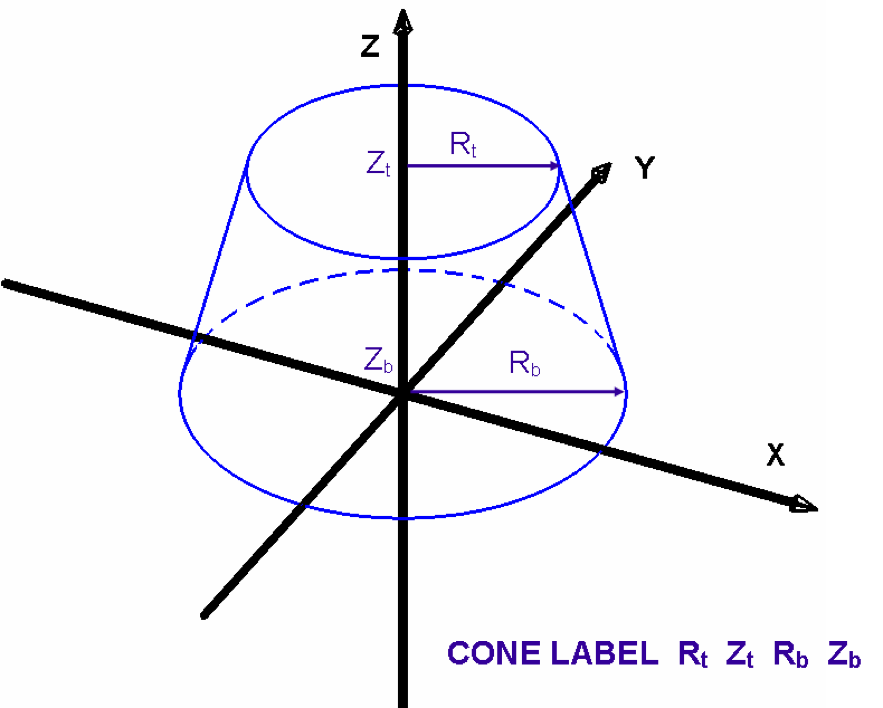
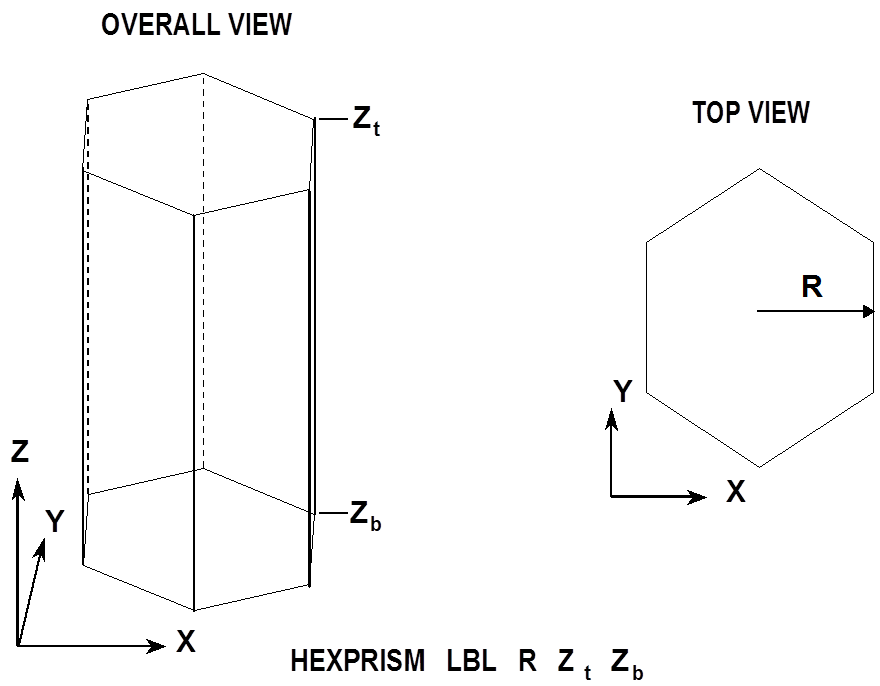
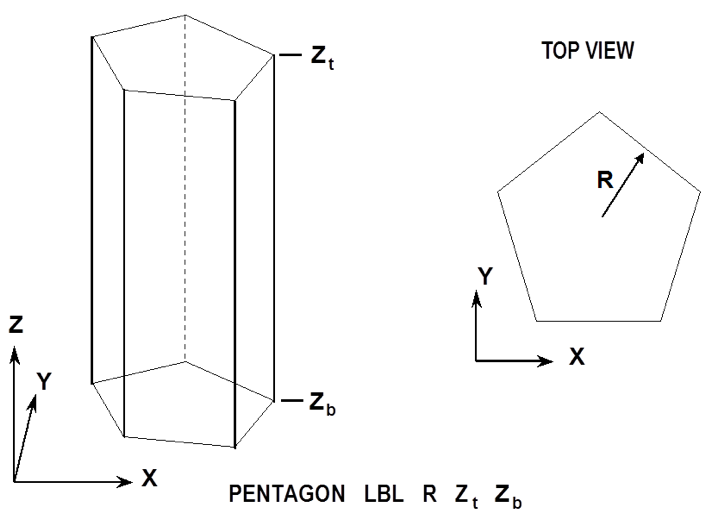
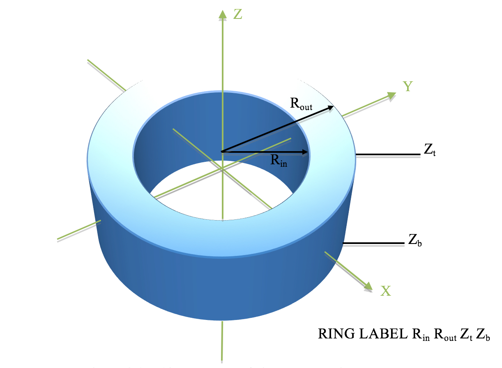
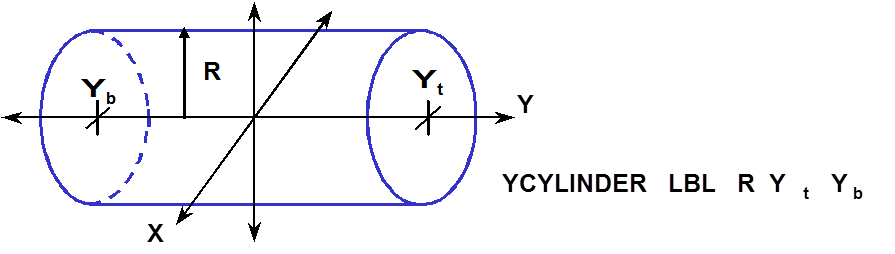

.. _8-1B:

Keno Appendix B: KENO VI Shape Descriptions
===========================================

The geometry **shape**\ s allowed in KENO-VI geometry description are:

   **CONE**, **CUBOID**, **CYLINDER**, **DODECAHEDRON**, **ECYLINDER**,
   **ELLIPSOID**, **HEXPRISM**, **HOPPER**, **PARALLELEPIPED**,
   **PPIPED**, **PENTAGON**, **PLANE**, **QUADRATIC**, **RHEXPRISM**,
   **RHOMBOID**, **SPHERE**, **WEDGE**, **XCYLINDER**, **XPPLANE**,
   **YCYLINDER**, **YPPLANE**, **ZCYLINDER**, **ZPPLANE**

**CONE**
  specifies a body consisting of one nappe of a right circular
  cone. It is defined by specifying the top radius of the cone,
  R\ :sub:`t`, the Z coordinate of the top face, Z\ :sub:`t`, the bottom
  radius of the cone, R\ :sub:`b`, and the Z coordinate of the bottom
  face, Z\ :sub:`b`. :numref:`fig8-1b-1` shows the correct input sequence for a
  cone.

.. _fig8-1b-1:

  Example of cone construction.

**CUBOID**
  specifies a rectangular parallelepiped. It is defined by
  specifying the +X dimension, −X dimension, +Y dimension, −Y dimension,
  +Z dimension, −Z dimension. It is perpendicular to the X, Y, and Z axes
  unless otherwise specified by the option geometry modification data.
  :numref:`fig8-1b-2` shows the correct input sequence for a cuboid.

.. _fig8-1b-2:

  Example of cuboid construction.

**CYLINDER**
  specifies a right circular cylinder. It is defined by
  specifying the radius of the cylinder, R, the Z coordinate of the top
  face, Z\ :sub:`t`, and the Z coordinate of the bottom face, Z\ :sub:`b`.
  Its centerline must lie on the Z axis, unless otherwise specified by the
  optional geometry modification data. :numref:`fig8-1b-3` shows the correct
  input sequence for a cylinder.

.. _fig8-1b-3:

  Example of cylinder construction.

**DODECAHEDRON**
  specifies a body whose surface consists of 12 rhombuses
  of the same size and shape. It is defined by specifying the radius of
  the inscribed sphere, R. It is centered on the origin in a fixed
  orientation unless otherwise specified by the optional geometry
  modification data. :numref:`fig8-1b-4` shows the correct input sequence for a
  dodecahedron.

.. _fig8-1b-4:

  Example of dodecahedron construction.

**ECYLINDER**
  specifies a right cylinder with an elliptical cross
  section. It is defined by specifying the semiradius along the X-axis,
  R\ :sub:`x`, the semiradius along the Y-axis, R\ :sub:`y`, the
  Z coordinate of the top face, Z\ :sub:`t`, and the Z coordinate of the
  bottom face, Z\ :sub:`b`. Its centerline must lie on the Z axis, unless
  otherwise specified by the optional geometry modification data.
  :numref:`fig8-1b-5` shows the correct input sequence for an elliptical
  cylinder.

.. _fig8-1b-5:

  Example of elliptical cylinder construction.

**ELLIPSOID**
  specifies a body whose cross-section slices parallel to
  each of the coordinate axes are ellipses. It is defined by specifying
  the semiradius along the X-axis, R\ :sub:`x`, the semiradius along the
  Y-axis, R\ :sub:`y`, and the semiradius along the Z-axis, R\ :sub:`z`.
  It is centered about the origin, unless otherwise specified by the
  optional geometry modification data.
  :numref:`fig8-1b-6` shows the correct input sequence for an ellipsoid.

.. _fig8-1b-6:

  Example of ellipsoid construction.

**HEXPRISM**
  specifies a body whose top and bottom faces are hexagons
  that have the same orientation and are perpendicular to the Z axis. It
  is defined by specifying the inscribed radius, R, the Z coordinate of
  the top face, Z\ :sub:`t`, and the Z coordinate of the bottom face,
  Z\ :sub:`b`. :numref:`fig8-1b-7` is an example input for a hexprism.

.. _fig8-1b-7:

  Example of hexprism construction.

**HOPPER**
  specifies a body whose top and bottom faces are rectangular
  parallelepipeds centered about the Z-axis and parallel to the X and
  Y axes. It is defined by specifying the half-length of the top face
  along the X-axis, X\ :sub:`t`, the half-length of the top face along the
  Y-axis, Y\ :sub:`t`, the Z coordinate of the top face, Z\ :sub:`t`, the
  half-length of the bottom face along the X-axis, X\ :sub:`b`, the
  half-length of the bottom face along the Y-axis, Y\ :sub:`b`, and the
  Z coordinate of the bottom face, Z\ :sub:`b`. Its centerline must lie on
  the Z axis unless otherwise specified by the optional geometry
  modification data. :numref:`fig8-1b-8` shows the correct input sequence for a
  hopper.

.. _fig8-1b-8:

  Example of hopper construction.

**PARALLELEPIPED** or **PPIPED**
  is a body with six faces composed
  of parallelograms, whose opposing
  faces are parallel. It is defined
  by specifying the length of the
  faces in the X direction, XDIST,
  the length of the faces in the
  Y direction, YDIST, the length of
  the faces in the Z direction,
  ZDIST, the angle between the
  X-face and the Y-axis, PSI, the
  angle between the Y-face and the
  Z-axis, THETA, and the angle
  between the projection of the top
  corner nearest the Z-axis onto
  the X-Y plane and the X-axis,
  PHI. The bottom face must lie on
  the X-Y plane at Z = 0 with a
  corner at the origin unless
  otherwise specified by the
  optional geometry modification
  data. :numref:`fig8-1b-9` shows the
  correct input sequence for a
  parallelepiped. The angles psi,
  theta, and phi must be in the
  range 0 to 90°.

.. _fig8-1b-9:

  Example of parallelepiped construction.

**PENTAGON**
  specifies a body whose top and bottom faces are pentagons
  that have the same orientation and are perpendicular to the Z axis. It
  is defined by specifying the inscribed radius, R, the Z coordinate of
  the top face, Z\ :sub:`t`, and the Z coordinate of the bottom face,
  Z\ :sub:`b`. :numref:`fig8-1b-10` is an example input for a pentagon.

.. _fig8-1b-10:

  Example of pentagon construction.

**PLANE**
  is a surface where any two points can be connected by a
  straight line entirely contained within a plane that divides all space
  into two regions. The positive side of the plane is the side the normal
  points to or where the equation aX + bY + cZ + d > 0. It is defined by
  specifying the coefficients of the equation aX + bY + cZ + d = 0 using
  the keywords XPL=a, YPL=b, ZPL=c, and CON=d. Only the nonzero
  coefficients of the equation need to be specified. :numref:`fig8-1b-11` shows
  the correct input sequence for a plane.

.. _fig8-1b-11:

  Example of plane construction.

**QUADRATIC**
  specifies a surface using a quadratic equation of the
  form:

     aX\ :sup:`2` + bY\ :sup:`2` + cZ\ :sup:`2` + dXY + eXZ + fYZ + gX +
     hY + iZ + j = 0.

     It is defined by specifying the coefficients of the above equation
     using the keywords AQU=a, BQU=b, CQU=c, DQU=d, EQU=e, FQU=f, GQU=g,
     HQU=h, IQU=i, and JQU=j. Only the nonzero coefficients of the
     equation need to be specified.

**RHEXPRISM**
  specifies a body whose top and bottom faces are rotated
  hexagons that have the same orientation and are perpendicular to the
  Z axis. It is defined by specifying the inscribed radius, R, the
  Z coordinate of the top face, Z\ :sub:`t`, and the Z coordinate of the
  bottom face, Z\ :sub:`b`. :numref:`fig8-1b-12` is an example input for a
  rotated hexprism.

.. _fig8-1b-12:

  Example of rotated hexprism construction.

**RING**
  is a body composed of the space between 2 concentric cylinders.
  It is defined by specifying the radius Rin of the inner cylinder and
  Rout of the outer cylinder, and the coordinate Zt of the top and Zb of
  the bottom of the annulus. Its center line lies on the Z axis unless
  specified by the optional geometry modification data. :numref:`fig8-1b-13`
  shows the correct input sequence for a ring.

.. _fig8-1b-13:

  Example of ring construction.

**RHOMBOID**
  is a body composed of six identical faces, each one a
  rhombus. It is defined by specifying the length of the edge of the base
  along the X-axis, DX and the angle between Y edge of the base and the
  Y-axis, Ψ. Its base is in the XY plane at Z = 0, with a corner at the
  origin unless otherwise specified by the optional geometry modification
  data. :numref:`fig8-1b-14` shows the correct input sequence for a rhomboid.

.. _fig8-1b-14:

  Example of rhomboid construction.

**SPHERE**
  specifies a sphere. It is defined by specifying the radius,
  R. It is centered about the origin, unless otherwise specified by the
  optional geometry modification data.
  :numref:`fig8-1b-15` shows the correct input sequence for a sphere.

.. _fig8-1b-15:

  Example of sphere construction.

**WEDGE**
  is a right-triangular prism having five faces. The two ends
  are triangles, and the three sides are rectangles. It is defined by
  specifying the length of the base along the X-axis, XBASE, the X and
  Y coordinate where the other two sides meet, Xpt and Ypt, and the length
  along the Z-axis, ZLNG. One side is in the XZ plane at Y = 0, and the
  bottom face is in the XY plane at Z = 0, with a corner at the origin
  unless otherwise specified by the optional geometry modification data.
  :numref:`fig8-1b-16` shows the correct input sequence for a wedge.

.. _fig8-1b-16:

  Example of wedge construction.

**XCYLINDER**
  specifies a right circular cylinder oriented about the
  X-axis. It is defined by specifying the radius of the cylinder, R, the
  X coordinate of the top face, X :sub:`t`, and the X coordinate of the
  bottom face, X :sub:`b`. Its centerline must lie on the X axis, unless
  otherwise specified by the optional geometry modification data.
  :numref:`fig8-1b-17` shows the correct input sequence for a cylinder.

.. _fig8-1b-17:

  Example of xcylinder construction.

**XPPLANE**
  is a set of flat parallel surfaces where any two points in
  one of the surfaces can be connected by a straight line entirely
  contained within that surface. These surface planes divide space into
  three sections; one section between the two planes which is considered
  inside the surfaces, one section on the negative side of the negative
  plane which is considered outside the surfaces, and one section on the
  positive side of the positive plane which is considered outside the
  surfaces. The set of parallel planes are defined by the keyword XPPLANE,
  which places the planes perpendicular to the X-axis, the X-intercept
  between the more positive plane and the X-axis (X\ :sub:`+`) and the
  X‑intercept between the more negative plane and the X-axis (X\ :sub:`−`).
  :numref:`fig8-1b-18` shows the correct input sequence for the set of paired
  planes.

.. _fig8-1b-18:

  Example of x-paired plane construction.

**YCYLINDER**
  specifies a right circular cylinder oriented about the
  Y-axis. It is defined by specifying the radius of the cylinder, R, the
  Y coordinate of the top face, Y\ :sub:`t`, and the Y coordinate of the
  bottom face, Y\ :sub:`b`. Its centerline must lie on the Y axis, unless
  otherwise specified by the optional geometry modification data.
  :numref:`fig8-1b-19` shows the correct input sequence for a cylinder.

.. _fig8-1b-19:

  Example of ycylinder construction.

**YPPLANE**
  is a set of flat parallel surfaces where any two points in
  one of the surfaces can be connected by a straight line entirely
  contained within that surface. These surface planes divide space into
  three sections; one section between the two planes which is considered
  inside the surfaces, one section on the negative side of the negative
  plane which is considered outside the surfaces, and one section on the
  positive side of the positive plane which is considered outside the
  surfaces. The set of parallel planes are defined by the keyword YPPLANE,
  which places the planes perpendicular to the Y-axis, the Y‑intercept
  between the more positive plane and the Y-axis (Y\ :sub:`+`) and the
  Y-intercept between the more negative plane and the Y-axis (Y\ :sub:`−`).
  :numref:`fig8-1b-20` shows the correct input sequence for the set of paired
  planes.

.. _fig8-1b-20:

  Example of y-paired plane construction.

**ZCYLINDER**
  specifies a right circular cylinder oriented about the
  Z-axis. It is defined by specifying the radius of the cylinder, R, the
  Z coordinate of the top face, Z :sub:`t`, and the Z coordinate of the
  bottom face, Z :sub:`b`. Its centerline must lie on the Z-axis, unless
  otherwise specified by the optional geometry modification data. The
  keyword ZCYLINDER is the same as CYLINDER. It is included to be
  consistent with the XCYLINDER and YCYLINDER keywords. :numref:`fig8-1b-21`
  shows the correct input sequence for a zcylinder.

.. _fig8-1b-21:

  Example of zcylinder construction.

**ZPPLANE**
  is a set of flat parallel surfaces where any two points in
  one of the surfaces can be connected by a straight line entirely
  contained within that surface. These surface planes divide space into
  three sections; one section between the two planes which is considered
  inside the surfaces, one section on the negative side of the negative
  plane which is considered outside the surfaces, and one section on the
  positive side of the positive plane which is considered outside the
  surfaces. The set of parallel planes are defined by the keyword ZPPLANE,
  which places the planes perpendicular to the Z-axis, the Z-intercept
  between the more positive plane and the Z-axis (Z\ :sub:`+`) and the
  Z-intercept between the more negative plane and the Z-axis (Z\ :sub:`−`).
  :numref:`fig8-1b-22` shows the correct input sequence for the set of paired
  planes.

.. _fig8-1b-22:
.. figure:: figs/KenoB/fig22.png
  :align: center
  :width: 600

  Example of z-paired plane construction.
