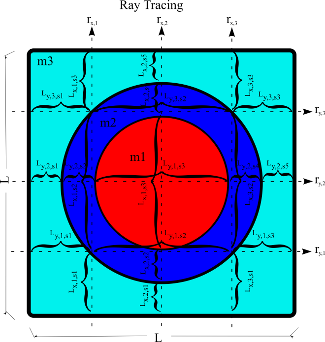
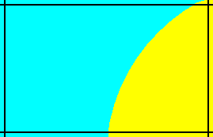
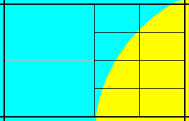
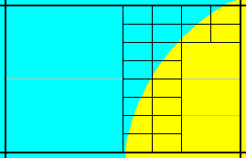
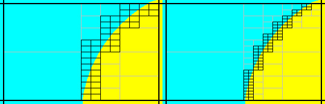

.. _MAVRIC:

MAVRIC: Monaco with Automated Variance Reduction using Importance Calculations
==============================================================================

*D. E. Peplow and C. Celik*

Introduction
------------

Monte Carlo particle transport calculations for deep penetration problems can require very long run times in order to achieve an acceptable level of statistical uncertainty in the final answers. Discrete-ordinates codes can be faster but have limitations relative to the discretization of space, energy, and direction. Monte Carlo calculations can be modified (biased) to produce results with the same variance in less time if an approximate answer or some other additional information is already known about the problem. If an importance can be assigned to different particles based on how much they will contribute to the final answer, more time can be spent on important particles with less time devoted to unimportant particles. One of the best ways to bias a Monte Carlo code for a particular tally is to form an importance map from the adjoint flux based on that tally. Unfortunately, determining the exact adjoint flux could be just as difficult as computing the original problem itself. However, an approximate adjoint can still be very useful in biasing the Monte Carlo solution :cite:`wagner_acceleration_1997`. Discrete ordinates can be used to quickly compute that approximate adjoint. Together, Monte Carlo and discrete ordinates can be used to find solutions to thick shielding problems in reasonable times.

The MAVRIC (Monaco with Automated Variance Reduction using Importance Calculations) sequence is based on the CADIS (Consistent Adjoint Driven Importance Sampling) and FW-CADIS (Forward-Weighted CADIS) methodologies :cite:`wagner_automated_1998` :cite:`wagner_automated_2002` :cite:`haghighat_monte_2003` :cite:`wagner_forward-weighted_2007` MAVRIC automatically performs a three-dimensional, discrete-ordinates calculation using Denovo to compute the adjoint flux as a function of position and energy. This adjoint flux information is then used to construct an importance map (i.e., target weights for weight windows) and a biased source distribution that work together—particles are born with a weight matching the target weight of the cell into which they are born. The fixed-source Monte Carlo radiation transport Monaco then uses the importance map for biasing during particle transport and the biased source distribution as its source. During transport, the particle weight is compared with the importance map after each particle interaction and whenever a particle crosses into a new importance cell in the map.

For problems that do not require variance reduction to complete in a reasonable time, execution of MAVRIC without the importance map calculation provides an easy way to run Monaco. For problems that do require variance reduction to complete in a reasonable time, MAVRIC removes the burden of setting weight windows from the user and performs it automatically with a minimal amount of additional input. Note that the MAVRIC sequence can be used with the final Monaco calculation as either a multigroup (MG) or a continuous-energy (CE) calculation.

Monaco has a wide variety of tally options: it can calculate fluxes (by group) at a point in space, over any geometrical region, or for a user-defined, three-dimensional, rectangular grid. These tallies can also integrate the fluxes with either standard response functions from the cross section library or user-defined response functions. All of these tallies are available in the MAVRIC sequence.

While originally designed for CADIS, the MAVRIC sequence is also capable of creating importance maps using both forward and adjoint deterministic estimates. The FW-CADIS method can be used for optimizing several tallies at once, a mesh tally over a large region, or a mesh tally over the entire problem. Several other methods for producing importance maps are also available in MAVRIC and are explored in Appendix C.

CADIS Methodology
-----------------

MAVRIC is an implementation of CADIS (Consistent Adjoint Driven Importance Sampling) using the Denovo SN and Monaco Monte Carlo functional modules. Source biasing and a mesh-based importance map, overlaying the physical geometry, are the basic methods of variance reduction. In order to make the best use of an importance map, the map must be made consistent with the source biasing. If the source biasing is inconsistent with the weight windows that will be used during the transport process, source particles will undergo Russian roulette or splitting immediately, wasting computational time and negating the intent of the biasing.

Overview of CADIS
~~~~~~~~~~~~~~~~~

CADIS has been well described in the literature, so only a
brief overview is given here. Consider a class source-detector problem
described by a unit source with emission probability distribution
function :math:`q\left(\overrightarrow{r},E \right)` and a detector
response function :math:`\sigma_{d}\left(\overrightarrow{r},E \right)`.
To determine the total detector response, *R*, the forward scalar flux
:math:`\phi\left(\overrightarrow{r},E \right)` must be known. The
response is found by integrating the product of the detector response
function and the flux over the detector volume :math:`V_{d}`.

.. math::
  :label: mavric-1

  R = \int_{V_{d}}^{}{\int_{E}^{}{\sigma_{d}\left( \overrightarrow{r},E \right)}}\phi\left(\overrightarrow{r},E \right)\textit{dE dV.}

Alternatively, if the adjoint scalar flux,
:math:`\phi^{+}\left(\overrightarrow{r},E \right)`, is known from the
corresponding adjoint problem with adjoint source
:math:`q^{+}\left(\overrightarrow{r},E \right) = \sigma_{d}\left(\overrightarrow{r},E \right)`,
then the total detector response could be found by integrating the
product of the forward source and the adjoint flux over the source
volume, :math:`V_{s}`.

.. math::
  :label: mavric-2

  R = \int_{V_{s}}^{}{\int_{E}^{}{q\left(\overrightarrow{r},E \right)}}\phi^{+}\left( \overrightarrow{r},E \right)\textit{dE dV.}

Unfortunately, the exact adjoint flux may be just as difficult to
determine as the forward flux, but an approximation of the adjoint flux
can still be used to form an importance map and a biased source
distribution for use in the forward Monte Carlo calculation.

Wagner\ :sup:`1` showed that if an estimate of the adjoint scalar flux
for the corresponding adjoint problem could be found, then an estimate
of the response *R* could be made using Eq. . The adjoint source for the
adjoint problem is typically separable and corresponds to the detector
response and spatial area of tally to be optimized:
:math:`q^{+}\left(\overrightarrow{r},E \right) = \sigma_{d}\left(E \right)g\left( \overrightarrow{r} \right)`,
where :math:`\sigma_{d}\left( E \right)` is a flux-to-dose conversion
factor and :math:`g\left( \overrightarrow{r} \right)` is 1 in the tally
volume and 0 otherwise. Then, from the adjoint flux
:math:`\phi^{+}\left( \overrightarrow{r},E \right)` and response
estimate *R*, a biased source distribution,
:math:`\widehat{q}\left( \overrightarrow{r},E \right)`, for source
sampling of the form

.. math::
  :label: mavric-3

  \widehat{q}\left(\overrightarrow{r},E \right) = \frac{1}{R}q\left(\overrightarrow{r},E\right)\phi^{+}\left( \overrightarrow{r},E \right)

and weight window target values,
:math:`\overline{w}\left( \overrightarrow{r},E \right)`, for particle
transport of the form

.. math::
  :label: mavric-4

  \overline{w}\left( \overrightarrow{r},E \right) = \frac{R}{\phi^{+}\left( \overrightarrow{r},E \right)}

could be constructed, which minimize the variance in the forward Monte
Carlo calculation of *R*.

When a particle is sampled from the biased source distribution
:math:`\widehat{q}\left( \overrightarrow{r},E \right)`, to preserve a
fair game, its initial weight is set to

.. math::
  :label: mavric-5

  w_{0}\left(\overrightarrow{r},E \right) = \frac{q\left(\overrightarrow{r},E \right)}{\widehat{q}\left( \overrightarrow{r},E \right)} = \frac{R}{\phi^{+}\left( \overrightarrow{r},E \right)}\,

which exactly matches the target weight for that particle’s position and
energy. This is the “consistent” part of CADIS—source particles are born
with a weight matching the weight window of the region/energy they are
born into. The source biasing and the weight windows work together.

CADIS has been applied to many problems—including reactor ex-core
detectors, well-logging instruments, cask shielding studies, and
independent spent fuel storage facility models—and has demonstrated very
significant speed-ups in calculation time compared to analog
simulations.

Multiple sources with CADIS
~~~~~~~~~~~~~~~~~~~~~~~~~~~

For a typical Monte Carlo calculation with multiple sources (each with a
probability distribution function
:math:`q_{i}\left( \overrightarrow{r},E \right)` and a strength
:math:`S_{i}`, giving a total source strength of
:math:`S = \sum_{}^{}S_{i}`), the source is sampled in two steps. First,
the specific source *i* is sampled with probability
:math:`p\left( i \right) = \ S_{i}/S`, and then the particle is sampled
from the specific source distribution
:math:`q_{i}\left( \overrightarrow{r},E \right)`.

The source sampling can be biased at both levels: which source to sample
from and how to sample each source. For example, the specific source can
be sampled using some arbitrary distribution,
:math:`\widehat{p}\left( i \right)`, and then the individual sources can
be sampled using distributions
:math:`{\widehat{q}}_{i}\left( \overrightarrow{r},E \right)`. Particles
would then have a birth weight of

.. math::
  :label: mavric-6

  w_{0} \equiv \ \left(\frac{p\left( i \right)}{\widehat{p}\left( i \right)} \right)\left(\frac{q_{i}\left( \overrightarrow{r},E \right)}{{\widehat{q}}_{i}\left( \overrightarrow{r},E \right)} \right)\text{.}

For CADIS, a biased multiple source needs to be developed so that the
birth weights of sampled particles still match the target weights of the
importance map. For a problem with multiple sources (each with a
distribution :math:`q_{i}\left( \overrightarrow{r},E \right)` and a
strength :math:`S_{i}`), the goal of the Monte Carlo calculation is to
compute some response :math:`R` for a response function
:math:`\sigma_{d}\left( \overrightarrow{r},E \right)` at a given
detector.

.. math::
  :label: mavric-7

  R = \ \int_{V}^{}{\int_{E}^{}{\sigma_{d}\left( \overrightarrow{r},E \right)\phi \left( \overrightarrow{r},E \right)\textit{dE dV.}}}

Note that the flux :math:`\phi\left( \overrightarrow{r},E \right)` has
contributions from each source. The response, :math:`R_{i}`, from each
specific source (:math:`S_{i}` with
:math:`q_{i}\left( \overrightarrow{r},E \right)`) can be expressed using
just the flux from that source,
:math:`\phi_{i}\left( \overrightarrow{r},E \right)`, as

.. math::
  :label: mavric-8

  R_{i} = \ \int_{V}^{}{\int_{E}^{}{\sigma_{d}\left(\overrightarrow{r},E \right)\ \phi_{i}\left(\overrightarrow{r},E \right)\textit{dE dV .}}}

The total response is then found as :math:`R = \sum_{i}^{}R_{i}`.

For the adjoint problem, using the adjoint source of
:math:`q^{+}\left( \overrightarrow{r},E \right) = \sigma_{d}\left( \overrightarrow{r},E \right)`,
the response :math:`R` can also be calculated as

.. math::
  :label: mavric-9

  R = \ \int_{V}^{}{\int_{E}^{}{\left\lbrack \sum_{i}^{}{S_{i}q_{i}\left( \overrightarrow{r},E \right)} \right\rbrack\ \phi^{+}\left( \overrightarrow{r},E \right)\textit{dE dV}}},

with response contribution from each specific source being

.. math::
  :label: mavric-10

  R_{i} = \ \int_{V}^{}{\int_{E}^{}{\ {S_{i}q_{i}\left( \overrightarrow{r},E \right)\phi^{+}}\left( \overrightarrow{r}, E \right)\textit{dE dV.}}}

The target weights
:math:`\overline{w}\left( \overrightarrow{r},E \right)` of the
importance map are found using

.. math::
  :label: mavric-11

  \overline{w}\left( \overrightarrow{r},E \right) = \frac{R/S}{\phi^{+}\left( \overrightarrow{r},E \right)\ }.

Each biased source
:math:`{\widehat{q}}_{i}\left( \overrightarrow{r},E \right)` pdf is
found using

.. math::
  :label: mavric-12

  {\widehat{q}}_{i}\left(\overrightarrow{r},E \right) = \frac{S_{i}}{R_{i}}{q_{i}\left( \overrightarrow{r},E \right)\phi}^{+}\left( \overrightarrow{r},E \right)\ ,

and the biased distribution used to select an individual source is
:math:`\widehat{p}\left( i \right) = \ R_{i}/\sum_{}^{}{R_{i} = R_{i}/R}`.

When using the biased distribution used to select an individual source,
:math:`\widehat{p}\left( i \right)`, and the biased source distribution,
:math:`{\widehat{q}}_{i}\left( \overrightarrow{r},E \right)`, the birth
weight of the sampled particle will be

.. math::
  :label: mavric-13

   \begin{matrix}
      w_{0} & \equiv & \left( \frac{p\left( i \right)}{\widehat{p}\left( i \right)} \right)\left( \frac{q_{i}\left( \overrightarrow{r}, E \right)}{{\widehat{q}}_{i}\left(\overrightarrow{r},E \right)} \right) \\ & = & \ \left( \frac{\frac{S_{i}}{S}}{\frac{R_{i}}{R}} \right) \left( \frac{q_{i}\left( \overrightarrow{r},E \right)}{\frac{S_{i}}{R_{i}}{q_{i}\left( \overrightarrow{r},E \right)\phi^{+}}\left( \overrightarrow{r},E \right)} \right) \\
      & = & \frac{R/S}{{\phi}^{+}\left( \overrightarrow{r},E \right)\ }, \\
  \end{matrix}

which matches the target weight,
:math:`\overline{w}\left( \overrightarrow{r},E \right)`.

Multiple tallies with CADIS
~~~~~~~~~~~~~~~~~~~~~~~~~~~

The CADIS methodology works quite well for classic source/detector problems. The statistical uncertainty of the tally that serves as the adjoint source is greatly reduced since the Monte Carlo transport is optimized to spend more simulation time on those particles that contribute to the tally, at the expense of tracking particles in other parts of phase space. However, more recently, Monte Carlo has been applied to problems where multiple tallies need to all be found with low statistical uncertainties. The extension of this idea is the mesh tally—where each voxel is a tally where the user desires low statistical uncertainties. For these problems, the user must accept a total simulation time that is controlled by the tally with the slowest convergence and simulation results where the tallies have a wide range of relative uncertainties.

The obvious way around this problem is to create a separate problem for each tally and use CADIS to optimize each. Each simulation can then be run until the tally reaches the level of acceptable uncertainty. For more than a few tallies, this approach becomes complicated and time-consuming for the user. For large mesh tallies, this approach is not reasonable.

Another approach to treat several tallies, if they are in close proximity to each other, or a mesh tally covering a small portion of the physical problem is to use the CADIS methodology with the adjoint source near the middle of the tallies to be optimized. Since particles in the forward Monte Carlo simulation are optimized to reach the location of the adjoint source, all the tallies surrounding that adjoint source should converge quickly. The drawback to this approach is the difficult question of “how close.” If the tallies are too far apart, certain energies or regions that are needed for one tally may be of low importance for getting particles to the central adjoint source. This may under-predict the flux or dose at the tally sites far from the adjoint source.

MAVRIC has the capability to have multiple adjoint sources with this problem in mind. For several tallies that are far from each other, multiple adjoint sources could be used. In the forward Monte Carlo, particles would be drawn to one of those adjoint sources. The difficulty with this approach is that typically the tally that is closest to the true physical source converges faster than the other tallies—showing the closest adjoint source seems to attract more particles than the others. Assigning more strength to the adjoint source further from the true physical source helps, but finding the correct strengths so that all of the tallies converge to the same relative uncertainty in one simulation is an iterative process for the user.

Forward-weighted CADIS
~~~~~~~~~~~~~~~~~~~~~~

In order to converge several tallies to the same relative uncertainty in
one simulation, the adjoint source corresponding to each of those
tallies needs to be weighted inversely by the expected tally value. In
order to calculate the dose rate at two points—say one near a reactor
and one far from a reactor—in one simulation, then the total adjoint
source used to develop the weight windows and biased source needs to
have two parts. The adjoint source far from the reactor needs to have
more strength than the adjoint source near the reactor by a factor equal
to the ratio of the expected near dose rate to the expected far dose
rate.

This concept can be extended to mesh tallies as well. Instead of using a
uniform adjoint source strength over the entire mesh tally volume, each
voxel of the adjoint source should be weighted inversely by the expected
forward tally value for that voxel. Areas of low flux or low dose rate
would have more adjoint source strength than areas of high flux or high
dose rate.

An estimate of the expected tally results can be found by using a quick
discrete-ordinates calculation. This leads to an extension of the CADIS
method: forward-weighted CADIS (FW-CADIS).**Error! Bookmark not
defined.** First, a forward S\ :sub:`N` calculation is performed to
estimate the expected tally results. A total adjoint source is
constructed where the adjoint source corresponding to each tally is
weighted inversely by those forward tally estimates. Then the standard
CADIS approach is used—an importance map (target weight windows) and a
biased source are made using the adjoint flux computed from the adjoint
S\ :sub:`N` calculation.

For example, if the goal is to calculate a detector response function
:math:`\sigma_{d}\left( E \right)` (such as dose rate using
flux-to-dose-rate conversion factors) over a volume (defined by
:math:`g\left( \overrightarrow{r} \right)`) corresponding to mesh tally,
then instead of simply using
:math:`q^{+}\left( \overrightarrow{r},E \right) = \sigma_{d}\left( E \right)\ g(\overrightarrow{r})`,
the adjoint source would be

.. math::
  :label: mavric-14

   q^{+}\left( \overrightarrow{r},E \right) = \frac{\sigma_{d}\left( E \right)\text{g}\left( \overrightarrow{r} \right)}{\int_{}^{}{\sigma_{d}\left( E \right)\phi\left( \overrightarrow{r},E \right)}\textit{dE}}\ ,

where :math:`\phi\left( \overrightarrow{r},E \right)` is an estimate of
the forward flux and the energy integral is over the voxel at :math:`\overrightarrow{r}`.
The adjoint source is nonzero only where the mesh tally is defined
(:math:`g\left( \overrightarrow{r} \right)`), and its strength is
inversely proportional to the forward estimate of dose rate.

The relative uncertainty of a tally is controlled by two components:
first, the number of tracks contributing to the tally and, second, the
shape of the distribution of scores contributing to that tally. In the
Monte Carlo game, the number of simulated particles,
:math:`m\left( \overrightarrow{r},E \right)`, can be related to the true
physical particle density, :math:`n\left( \overrightarrow{r},E \right),`
by the average Monte Carlo weight of scoring particles,
:math:`\overline{w}\left( \overrightarrow{r},E \right)`, by

.. math::
  :label: mavric-15

  n\left( \overrightarrow{r},E \right) = \ \overline{w}\left( \overrightarrow{r},E \right)\text{m}\left( \overrightarrow{r},E \right).

In a typical Monte Carlo calculation, tallies are made by adding some
score, multiplied by the current particle weight, to an accumulator. To
calculate a similar quantity related to the Monte Carlo particle density
would be very close to calculating any other quantity but without
including the particle weight. The goal of FW-CADIS is to make the Monte
Carlo particle density, :math:`m\left( \overrightarrow{r},E \right)`,
uniform over the tally areas, so an importance map needs to be developed
that represents the importance to achieving uniform Monte Carlo particle
density. By attempting to keep the Monte Carlo particle density more
uniform, more uniform relative errors for the tallies should be
realized.

Two options for forward weighting are possible. For tallies over some
area where the entire group-wise flux is needed with low relative
uncertainties, the adjoint source should be weighted inversely by the
forward flux, :math:`\phi\left( \overrightarrow{r},E \right)`. The other
option, for a tally where only an energy-integrated quantity is desired,
is to weight the adjoint inversely by that energy-integrated
quantity,\ :math:`\int_{}^{}{\sigma_{d}\left( E \right)\phi\left( \overrightarrow{r},E \right)}\text{\ dE}`.
For a tally where the total flux is desired, then the response in the
adjoint source is simply :math:`\sigma_{d}\left( E \right) = 1`.

To optimize the forward Monte Carlo simulation for the calculation of
some quantity at multiple tally locations or across a mesh tally, the
adjoint source needs to be weighted by the estimate of that quantity.
For a tally defined by its spatial location
:math:`g\left( \overrightarrow{r} \right)` and its optional response
:math:`\sigma_{d}\left( E \right)`, the standard adjoint source would be
:math:`q^{+}\left( \overrightarrow{r},E \right) = \sigma_{d}\left( E \right)\text{g}\left( \overrightarrow{r} \right)`.
The forward-weighted adjoint source,
:math:`q^{+}\left( \overrightarrow{r},E \right)`, depending on what
quantity is to be optimized, is listed below.

.. list-table::
  :header-rows: 1

  * - For the calculation of
    -
    - Adjoint source
  * - Energy and spatially dependent flux
    - :math:`\phi\left(\overrightarrow{r},E \right)`
    - .. math:: \frac{g\left( \overrightarrow{r}\right)}{\phi\left(\overrightarrow{r},E \right)}
  * - Spatially dependent total flux
    - :math:`\int_{}^{}{\phi\left( \overrightarrow{r},E \right)}\textit{dE}`
    - .. math:: \frac{g\left( \overrightarrow{r}\right)}{\int_{}^{}{\phi\left( \overrightarrow{r},E \right)}\textit{dE}}
  * - Spatially dependent total response
    - :math:`\int_{}^{}{\sigma_{d}\left( E \right)\phi    \left(\overrightarrow{r},E\right)}\textit{dE}`
    - .. math:: \frac{\sigma_{d}\left( E \right)\text{g}\left( \overrightarrow{r} \right)}{\int_{}^{}{\sigma_{d}\left( E \right)\phi    \left( \overrightarrow{r},E \right)}\textit{dE}}

The bottom line of FW-CADIS is that in order to calculate a quantity at
multiple tally locations (or across a mesh tally) with more uniform
relative uncertainties, an adjoint source needs to be developed for an
objective function that keeps some non-physical quantity—related to the
Monte Carlo particle density and similar in form to the desired
quantity—constant. FW-CADIS uses the solution of a forward
discrete-ordinates calculation to properly weight the adjoint source.
After that, the standard CADIS approach is used.

MAVRIC Implementation of CADIS
------------------------------

With MAVRIC, as with other shielding codes, the user defines the problem as a set of physical models—the material compositions, the geometry, the source, and the detectors (locations and response functions)—as well as some mathematical parameters on how to solve the problem (number of histories, etc.). For the variance reduction portion of MAVRIC, the only additional inputs required are (1) the mesh planes to use in the discrete-ordinates calculation(s) and (2) the adjoint source description—basically the location and the response of each tally to optimize in the forward Monte Carlo calculation. MAVRIC takes this information and constructs a Denovo adjoint problem. (The adjoint source is weighted by a Denovo forward flux or response estimate for FW-CADIS applications.)  MAVRIC then uses the CADIS methodology: it combines the adjoint flux from the Denovo calculation with the source description and creates the importance map (weight window targets) and the mesh-based biased source. Monaco is then run using the CADIS biased source distribution and the weight window targets.

Denovo
~~~~~~

Denovo is a parallel three-dimensional SN code that is used to generate adjoint (and, for FW-CADIS, forward) scalar fluxes for the CADIS methods in MAVRIC. For use in MAVRIC/CADIS, it is highly desirable that the SN code be fast, positive, and robust. The phase-space shape of the forward and adjoint fluxes, as opposed to a highly accurate solution, is the most important quality for Monte Carlo weight-window generation. Accordingly, Denovo provides a step-characteristics spatial differencing option that produces positive scalar fluxes as long as the source (volume plus in-scatter) is positive. Denovo uses an orthogonal, nonuniform mesh that is ideal for CADIS applications because of the speed and robustness of calculations on this mesh type.

Denovo uses the highly robust GMRES (Generalized Minimum Residual) Krylov method to solve the SN equations in each group. GMRES has been shown to be more robust and efficient than traditional source (fixed-point) iteration. The in-group discrete SN equations are defined as

.. math::
  :label: mavric-16

  \mathbf{L}\psi = \mathbf{\text{MS}}\phi + q

where **L** is the differential transport operator, **M** is the
moment-to-discrete operator, **S** is the matrix of scattering
cross-section moments, *q* is the external and in-scatter source,
:math:`\phi` is the vector of angular flux moments, and :math:`\psi` is
the vector of angular fluxes at discrete angles. Applying the operator
**D**, where :math:`\phi = \mathbf{D}\psi`, and rearranging terms casts
the in-group equations in the form of a traditional linear system,
:math:`\mathbf{A}x = b`,

 .. math::
  :label: mavric-17

  \left( \mathbf{I} - \mathbf{D}\mathbf{L}^{- 1}\mathbf{\text{MS}} \right) = \mathbf{D}\mathbf{L}^{- 1}q .

The operation :math:`\mathbf{L}^{- 1}\nu`, where :math:`\nu` is an
iteration vector, is performed using a traditional wave-front solve
(transport sweep). The parallel implementation of the Denovo wave-front
solver uses the well-known Koch-Baker-Alcouffe (KBA) algorithm, which is
a two-dimensional block‑spatial decomposition of a three-dimensional
orthogonal mesh :cite:`baker_sn_1998`. The Trilinos package is used for the GMRES
implementation :cite:`willenbring_trilinos_2003` Denovo stores the mesh-based scalar fluxes in a
double precision binary file (*.dff) called a Denovo flux file. Past
versions of SCALE/Denovo used the TORT :cite:`rhoades_tort_1997` \*.varscl file format
(DOORS package :cite:`rhoades_doors_1998`), but this was limited to single precision. Since
the rest of the MAVRIC sequence has not yet been parallelized, Denovo is
currently used only in serial mode within MAVRIC.

Monaco
~~~~~~

The forward Monte Carlo transport is performed using Monaco, a
fixed-source, shielding code that uses the SCALE General Geometry
Package (SGGP, the same as used by the criticality code KENO-VI) and the
standard SCALE material information processor. Monaco can use either MG
or CE cross section libraries. Monaco was originally based on the MORSE
Monte Carlo code but has been extensively modified to modernize the
coding, incorporate more flexibility in terms of sources/tallies, and
read a user-friendly block/keyword style input.

Much of the input to MAVRIC is the same as Monaco. More details can be
found in the Monaco chapter of the SCALE manual.

Running MAVRIC
~~~~~~~~~~~~~~

The objective of a SCALE sequence is to execute several codes, passing
the output from one to the input of the next, in order to perform some
analysis—things that users typically had to do in the past. MAVRIC does
this for difficult shielding problems by running approximate
discrete-ordinates calculations, constructing an importance map and
biased source for one or more tallies that the user wants to optimize in
the Monte Carlo calculation, and then using those in a forward Monaco
Monte Carlo calculation. MAVRIC also prepares the forward and adjoint
cross sections when needed. The steps of a MAVRIC sequence are listed in
:numref:`Mavric-sequence`. The user can instruct MAVRIC to run this whole sequence of
steps or just some subset of the steps—in order to verify the
intermediate steps or to reuse previously calculated quantities in a new
analyses.

The MAVRIC sequence can be stopped after key points by using the
“parm= *parameter* ” operator on the “=mavric” command line, which is
the first line of the input file. The various parameters are listed in
Table :numref:`mavric-param`. These parameters allow the user to perform checks and make
changes to the importance map calculation before the actual Monte Carlo
calculation in Monaco.

MAVRIC also allows the sequence to start at several different points. If
an importance map and biased source have already been computed, they can
be used directly. If the adjoint scalar fluxes are known, they can
quickly be used to create the importance map and biased source and then
begin the forward Monte Carlo. All of the different combinations of
starting MAVRIC with some previously calculated quantities are listed in
the following section detailing the input options.

When using MG cross-section libraries that do not have flux-to-dose-rate
conversion factors, use “parm=nodose” to prevent the cross section
processing codes from trying to move these values into the working
library.

MAVRIC creates many files that use the base problem name from the output
file. For an output file called “c:\path1\path2\\\ *outputName*.out” or
“/home/path1/path2/ *outputName*.inp”, spaces in the output name will
cause trouble and should not be used.

.. list-table:: Steps in the MAVRIC sequence
   :name: Mavric-sequence
   :widths: 100 100
   :header-rows: 0
   :align: center

   * - **Cross section calculation**
     - XSProc is used to calculate the forward cross sections for Monaco
   * - **Forward Denovo (optional)**
     -
   * -  Cross section calculation
     - XSProc is used to calculate the forward cross sections for Denovo
   * -  Forward flux calculation
     - Denovo calculates the estimate of the forward flux
   * - **Adjoint Denovo (optional)**
     -
   * -  Cross section calculation
     - XSProc is used to calculate the adjoint cross sections for Denovo
   * -  Adjoint flux calculation
     - Denovo calculates the estimate of the adjoint flux
   * - **CADIS (optional)**
     - The scalar flux file from Denovo is then used to create the biased source distribution and transport weight windows
   * - **Monte Carlo calculation**
     - Monaco uses the biased source distribution and transport weight windows to calculate the various tallies

.. list-table:: Parameters for the MAVRIC command line (“parm=…”)
   :name: mavric-param
   :widths: 50 50
   :header-rows: 1
   :align: center

   * - Parameter
     - MAVRIC will stop after
   * - check
     - input checking
   * - forinp
     - Forward Denovo input construction (makes ``xkba_b.inp`` in the tmp area)
   * - forward
     - The forward Denovo calculation
   * - adjinp
     - Adjoint Denovo input construction (makes ``xkba_b.inp`` in the tmp area)
   * - adjoint
     - The adjoint Denovo calculation
   * - impmap
     - Calculation of importance map and biased source

MAVRIC input
------------

The input file for MAVRIC consists of three lines of text (“=mavric”
command line with optional parameters, the problem title, and SCALE
cross section library name) and then several blocks, with each block
starting with “read xxxx” and ending with “end xxxx”. There are three
required blocks and nine optional blocks. Material and geometry blocks
must be listed first and in the specified order. Other blocks may be
listed in any order.

Blocks (must be in this order):

-  Composition – (required) SCALE standard composition, list of materials used in the problem

-  Celldata – SCALE resonance self-shielding

-  Geometry – (required) SCALE general geometry description

-  Array – optional addition to the above geometry description

-  Volume – optional calculation or listing of region volumes

-  Plot – create 2D slices of the SGGP geometry

Other Blocks (any order, following the blocks listed above):

-  Definitions – defines locations, response functions, and grid geometries used by other blocks

-  Sources – (required) description of the particle source spatial, energy, and directional distributions

-  Tallies – description of what to calculate: point detector tallies, region tallies, or mesh tallies

-  Parameters – how to perform the simulation (random number seed, how many histories, etc.)

-  Biasing – data for reducing the variance of the simulation

-  ImportanceMap – instructions for creating an importance map based on a discrete-ordinates calculation

The material blocks (Composition and Celldata) and the physical model
blocks (Geometry, Array, Volume, and Plot) follow the standard SCALE
format. See the other SCALE references as noted in the following
sections for details. The Biasing block and ImportanceMap block cannot
both be used.

For the other six blocks, scalar variables are set by “keyword=value”,
fixed-length arrays are set with “keyword value\ :sub:`1` ...
value\ :sub:`N`\ ”, variable-length arrays are set with “keyword
value\ :sub:`1` ... value\ :sub:`N` end”, and some text and filenames
are read in as quoted strings. Single keywords to set options are also
used in some instances. The indention, comment lines, and
upper/lowercase shown in this document are not required— they are used
in the examples only for clarity. Except for strings in quotes (like
filenames), SCALE is case insensitive.

After all input blocks are listed, a single line with “end data” should be listed.
A final “end” should also be listed, to signify the end of all MAVRIC input.
Nine of the blocks are the same input blocks used by the functional module Monaco,
with a few extra keywords only for use with MAVRIC. These extra keywords are highlighted here,
without relisting all of the standard Monaco keywords for those blocks.
See :numref:`input-format` for an overview of MAVRIC input file structure.

Composition block
~~~~~~~~~~~~~~~~~

Material information input follows the standard SCALE format for
material input. Basic materials known to the SCALE library may be used
as well as completely user-defined materials (using isotopes with known
cross sections). Input instructions are located in the XSProc chapter in
the SCALE manual. The Standard Composition Library chapter lists the
different cross section libraries and the names of standard materials.
An example is as follows:

.. code:: rest

   read composition

       uo2 1 0.2 293.0 92234 0.0055 92235 3.5 92238 96.4945 end

       orconcrete 2 1.0 293.0 end

       ss304 3 1.0 293.0 end

   end composition

Details on the cell data block are also included in the XSProc chapter.
When using different libraries for the importance map production (listed
at the top of the input) and the final Monte Carlo calculation (listed
in the parameters block, if different), make sure that the materials are
present in both libraries.

.. list-table:: Overall input format
   :widths: 30 30
   :header-rows: 1
   :align: center
   :name: input-format

   * - input file
     - Comment
   * - .. code:: rest

         =mavric
         Some title for this problem
         v7-27n19g
         read composition
            ...
         end composition
         read celldata
            ...
         end celldata
         read geometry
            ...
         end geometry
         read array
            ...
         end array
         read volume
            ...
         end volume
         read plot
            ...
         end plot
         read definitions
            ...
         end definitions
         read sources
            ...
         end sources
         read tallies
            ...
         end tallies
         read parameters
            ...
         end parameters
         read biasing
            ...
         end biasing
         read importanceMap
            ...
         end importanceMap
         end data
         end
     - .. code:: rest

          name of sequence
          title
          cross section library name
          SCALE material compositions
              [required block]

          SCALE resonance self-shielding
              [optional block]

          SCALE SGGP geometry
              [required block]

          SCALE SGGP arrays
              [optional block]

          SCALE SGGP volume calc
              [optional block]

          SGGP Plots
              [optional block]

          Definitions
              [possibly required]

          Sources definition
              [required block]

          Tally specifications
              [optional block]

          Monte Carlo parameters
              [optional block]

          Biasing information
              [optional block]

          Importance map
              [optional block]

          end of all blocks
          end of MAVRIC input

SGGP geometry blocks
~~~~~~~~~~~~~~~~~~~~

MAVRIC uses the functional module Monaco for the forward Monte Carlo calculation. Monaco tracks particles through the physical geometry described by the SGGP input blocks as well as through the mesh importance map and any mesh tallies, which are defined in the global coordinates and overlay the physical geometry. Because Monaco must track through all of these geometries at the same time, users should not use the reflective boundary capability in the SGGP geometry.

For more details on each SGGP Geometry block, see the following sections of the KENO-VI chapter of the SCALE Manual.

    Geometry – *Geometry Data*

    Array – *Array Data*

    Volume – *Volume Data*

    Plot – *Plot Data*

Other blocks shared with Monaco
~~~~~~~~~~~~~~~~~~~~~~~~~~~~~~~

The definitions, sources, tallies, and biasing blocks are all the same
as Monaco. They are all fully described in the Monaco chapter of the
SCALE Manual.

   Definitions – *Definitions Block*

   Sources – *Sources Block*

   Tallies – *Tallies Block*

   Biasing – *Biasing Block*

In the parameters block, there are several extra keywords compared to
Monaco (see the *Parameter Block* section of the Monaco chapter) which
are used when the cross section library used in the importance
calculations is different from the library used in the final forward
Monaco Monte Carlo calculation. The library listed at the beginning of
the MAVRIC input file will be used for the importance calculations
(forward and adjoint Denovo calculation, formation of the importance
map, and biased sources). To use a different MG library in the final
Monaco simulation, use the keyword “library=” with the cross section
library name in quotes. A cross section library for Monaco will be made
using csas-mg. If there are any extra parameters to use (“parm=” in the
“=csas-mg” line of the csas-mg input), they can be passed along using
the keyword “parmString=” with the extra information in quotes. For
example, the following input file would use a coarse-group library for
the importance calculations and a fine-group library for the final
Monaco, each with CENTRM processing.

.. code:: rest

    =mavric parm=centrm
    v7-27n19g
    …

    read parameters

        library=”v7-200n47g” parmString=”centrm”

        …

    end parameters

    …

    end data

    end

To use a CE cross section in the final Monaco step, use the keyword “ceLibrary=” with the cross section library name in quotes. When using the “library=” or “ceLibrary=” keywords, they should precede the “neutron”, “photon”, “noNeutron”, and “noPhoton” keywords. :numref:`extra-keywords` summarizes all of the keywords in the MAVRIC parameter block.

When using two different cross section libraries, be sure that the responses and distributions are defined in ways that do not depend on the cross section library. For example, any response that is just a list of n values (corresponding to a cross section library of n groups) needs to have the group energies specifically listed so that it can be evaluated properly on the other group structure.

.. csv-table:: Extra keywords for the parameters block
  :file: csv-tables/table4.1.04.csv
  :header-rows: 1
  :name: extra-keywords

Importance map block
~~~~~~~~~~~~~~~~~~~~

The importance map block is the “heart and soul” of MAVRIC. This block lists the parameters for creating an importance map and biased source from one (adjoint) or two (forward, followed by adjoint) Denovo discrete-ordinates calculations. Without an importance map block, MAVRIC can be used to run Monaco and use its conventional types of variance reduction. If both the importance map and biasing blocks are specified, only the importance map block will be used. There are a variety of ways to use the importance map block, as explained in the subsections below. Keywords for this block are summarized at the end of this section, in
:numref:``

Constructing a mesh for the S\ :sub:`N` calculation
^^^^^^^^^^^^^^^^^^^^^^^^^^^^^^^^^^^^^^^^^^^^^^^^^^^

All of the uses of the importance map block that run the
discrete-ordinates code require the use of a grid geometry that overlays
the physical geometry. Grid geometries are defined in the definitions
block of the MAVRIC input. The extent and level of detail needed in a
grid geometry are discussed in the following paragraphs.

When using S\ :sub:`N` methods alone for solving radiation transport in
shielding problems, a good rule of thumb is to use mesh cell sizes on
the order of a meanfree path of the particle. For complex shielding
problems, this could lead to an extremely large number of mesh cells,
especially when considering the size of the meanfree path of the lowest
energy neutrons and photons in common shielding materials.

In MAVRIC, the goal is to use the S\ :sub:`N` calculation for a quick
approximate solution. Accuracy is not paramount—just getting an idea of
the overall shape of the true importance map will help accelerate the
convergence of the forward Monte Carlo calculation. The more accurate
the importance map, the better the forward Monte Carlo acceleration will
be. At some point there is a time trade-off when the computational time
for calculating the importance map followed by the Monte Carlo
calculation exceeds that of a standard analog Monte Carlo calculation.
Large numbers of mesh cells, coming from using very small mesh sizes,
for S\ :sub:`N` calculations also use a great deal of computer memory.

Because the deterministic solution(s) for CADIS and FW-CADIS can have
moderate fidelity and still provide variance reduction parameters that
substantially accelerate the Monte Carlo solution, mesh cell sizes in
MAVRIC applications can be larger than what most S\ :sub:`N` practioners
would typically use. The use of relatively coarse mesh reduces memory
requirements and the run time of the deterministic solution(s). Some
general guidelines to keep in mind when creating a mesh for the
importance map/biased source are:

-  The true source regions should be included in the mesh with mesh
   planes at their boundaries.

-  For point or very small sources, place them in the center of a mesh
   cell, not on the mesh planes.

-  Any region of the geometry where particles could eventually
   contribute to the tallies (the “important” areas) should be included
   in the mesh.

-  Point adjoint sources (corresponding to point detector locations) in
   standard CADIS calculations do not have to be included inside the
   mesh. For FW-CADIS, they must be in the mesh and should be located at
   a mesh cell center, not on any of the mesh planes.

-  Volumetric adjoint sources should be included in the mesh with mesh
   planes at their boundaries.

-  Mesh planes should be placed at significant material boundaries.

-  Neighboring cell sizes should not be drastically different.

-  Smaller cell sizes should be used where the adjoint flux is changing
   rapidly, for example, toward the surfaces of adjoint sources and
   shields (rather than their interiors).

Another aspect to keep in mind is that the source in the forward Monaco
Monte Carlo calculation will be a biased, mesh-based source. Source
particles will be selected by first sampling which mesh cell to use and
then sampling a position uniformly within that mesh cell that meets the
user criteria of “unit=”, “region=”, or “mixture=” if specified. The
mesh should have enough resolution that the mesh source will be an
accurate representation of the true source.

The geometry for the Denovo calculation is specified using the keyword
“gridGeometryID=” and the identification number of a grid geometry that
was defined in the definitions block. The material assigned to each
voxel of the mesh is determined by testing the center point in the SGGP
geometry (unless the macro-material option is used – see below).

Macromaterials for S\ :sub:`N` geometries
^^^^^^^^^^^^^^^^^^^^^^^^^^^^^^^^^^^^^^^^^

Part of the advantage of the CADIS method is that the adjoint
discrete-ordinates calculation only needs to be approximate in order to
form a reasonable importance map and biased source. This usually means
that the mesh used is much coarser than the mesh that would be used if
the problem were to be solved only with a discrete-ordinates code. This
coarse mesh may miss significant details (especially curves) in the
geometry and produce a less-than-optimal importance map.

In order to get more accurate solutions from a coarse-mesh
discrete-ordinates calculation, Denovo can represent the material in
each voxel of the mesh as a volume-weighted mixture of the real
materials, called macromaterials, in the problem. When constructing the
Denovo input, the Denovo EigenValue Calculation (DEVC, see section SECTIONREFERENCE)
sequence can estimate the volume fraction occupied by each real
material in each voxel by a sampling method. The user can specify
parameters for how to sample the geometry. Note that finer sampling
makes more accurate estimates of the material fraction but requires more
setup time to create the Denovo input. Users should understand how the
macromaterials are sampled and consider that when constructing a mesh
grid. This is especially important for geometries that contain arrays.
Careful consideration should be given when overlaying a mesh on a
geometry that contains arrays of arrays.

Because the list of macromaterials could become large, the user can also
specify a tolerance for how close two different macromaterials can be to
be considered the same, thereby reducing the total number of
macromaterials. The macromaterial tolerance, “``mmTolerance=``”, is used for
creating a different macromaterial from the ones already created by
looking at the infinity norm between two macromaterials.
The number of macromaterials does not appreciably impact Denovo run time
or memory requirements.

Two different sampling methods are available—point testing :cite:`ibrahim_improving_2009` with
the keyword ``mmPointTest`` and ray tracing :cite:`johnson_fast_2013` with the keyword
``mmRayTest``.

Ray Tracing
'''''''''''

This method estimates the volume of different materials in the Denovo mesh grid elements by tracing rays through the SGGP geometry and computing the average track lengths through the each material. Rays are traced in all three dimensions to better estimate the volume fractions of materials within each voxel. The mmSubCell parameter controls how many rays to trace in each voxel in each dimension. For example, if mmSubCell= n, then when tracing rays in the z dimension, each column of voxels uses a set of n×n rays starting uniformly spaced in the x  and y  dimensions. With rays being cast from all three orthogonal directions, a total of 3n2 rays are used to sample each voxel. One can think of subcells as an equally spaced sub-mesh with a single ray positioned at each center. The number of subcells in each direction, and hence the number of rays, can be explicitly given with mmSubCells ny nz nx nz nx ny end keyword for rays parallel to the x axis, y axis, and z axis.
:numref:`ray-positions` shows different subcell configurations (in two dimensions) for a given voxel.

.. _ray-positions:

  Ray positions within a voxel with different mmSubCells parameters.

Ray tracing is a more robust method compared to the simple point testing
method used in previous versions of SCALE/MAVRIC; however, it requires
more memory than point testing. Ray tracing gives more accurate
estimates of volume fractions because track lengths across a voxel give
more information than a series of test points. Ray tracing is also much
faster than point testing because the particle tracking routines are
optimized for quickly determining lists of materials and distance along
a given ray.

Ray tracing operates on the grid geometry supplied by the user and
shoots rays in all three directions starting from the lower bounds of
the mesh grid. An example of an arbitrary assembly geometry is shown in
:numref:`geom-model`. A ray consists of a number of steps that each correspond
to crossing a material boundary along the path of the ray. Ratios of
each step’s length to the voxel length in the ray’s direction determine
the material volume fraction of that step in that voxel, and summation
of the same material volume fractions gives the material volume fraction
of that material in that voxel. Ray tracing through a single voxel that
contains a fuel pin is illustrated in :numref:`ray-vox`.

.. _geom-model:

.. figure:: figs/fig4.1.02_kenoDenovo.png
  :width: 600
  :align: center

  Geometry model (left) and the Denovo representation (right) of an assembly using macromaterials determined by ray tracing.

.. _ray-vox:

  Ray tracing (in two dimensions) through a voxel.

The final constructed macromaterials for this model are also shown in
:numref:`geom-model`. Voxels that contain only a single material are assigned
the original material number in the constructed macromaterials. For the
voxels that contain a fuel pin with three different materials, the
result is a new macromaterial consisting of the volume weighted
fractions of each original material.

After the rays are shot in all three directions, the material volume
fractions are updated and macromaterials are created by using these
material volume fractions. Material volume fraction calculations for a
single voxel, as shown in :numref:`ray-vox`, are given by

.. math::
  :label: mavric-18

   F_{m} = \ \sum_{d = x,y,z}^{}{\sum_{r = 1}^{N_{r}}{\sum_{s = 1}^{N_{s}}\left\{ \begin{matrix}
   \frac{L_{d,r,s}}{L_{d}},\ \ \ & m_{s} = m \\
   0,\ \ \ & \mathrm{\text{otherwise}} \\
   \end{matrix} \right.\ }} \ \ \ \ \ \ \ and \ \ \ \ \ \ \ \ \ V_{m} = \frac{F_{m}}{\sum_{n = 1}^{N_{m}}F_{n}}\ ,

where *F\ m* = sampled fraction of material *m* in the voxel,

*d* = direction of the rays (*x, y, z*),

*r* = ray number,

:math:`N_r` = total number of rays in the voxel for direction of *d*,

*s* = step number,

:math:`N_s` = total number of steps for ray r in the voxel for direction of
*d*,

:math:`L_{d,r,s}` = length of the steps s for ray r in the voxel for direction
of *d*,

:math:`L_d` = length of the voxel along direction of *d*,

:math:`m_s` = material of step *s*,

*m* = material number,

:math:`N_m` = total number of materials in the voxel, and

:math:`V_m` = volume fraction of material m in the voxel.

Point Testing
'''''''''''''

The recursive bisection method is utilized in point testing and uses a
series of point tests to determine the macromaterial fractions. For a
given voxel, the material at the center is compared to the material at
the eight corners. If they are all the same, the entire volume is
considered to be made of that material. If different, the volume is
divided into two in each dimension. Each subvolume is tested, and the
method is then applied to the subvolumes that are not of a single
material. When the ratio of the volume of the tested region to the
original voxel becomes less than a user-specified tolerance (in the
range of 10-1 to 10-4), then further subdivision and testing are
stopped. This is illustrated in :numref:`rec-macro`.

.. _rec-macro:

.. centered:: *Fig. 4 Successive steps in the recursive macro-material method*

In point testing, the keyword “mmTolerance=f” is interpreted to be where f is the smallest
fraction of the voxel volume that can be achieved by bisection method and hence the limiting
factor for dividing the voxel. This same tolerance f is also used to limit the number of macromaterials.
Before a new macromaterial is created, if one already exists where the fraction of each actual
material matches to within the given tolerance, then the existing material will be used. If
using only a single point at the center of each voxel, use “mmTolerance=1”.
The mmSubCell keyword is not used in point testing.

Example
'''''''

:numref:`cask-geom` shows an example of a cask geometry with two types of spent fuel (yellows),
steel (blue), resin (green), and other metals (gray). When the Denovo geometry is set up by
testing only the center of each mesh cell, the curved surfaces are not well represented (upper right).
By applying the ray-tracing method and defining a new material made of partial fractions of the original materials,
an improved Denovo model can be made. In the lower left of the figure, the Denovo
model was constructed using one ray (in each dimension) per voxel and a tolerance of 0.1.
This gives 20 new materials that are a mixture of the original 13 actual materials and void.
With mmSubCells=3 and an mmTolerance=0.01, 139 macromaterials are created.

A macromaterial table listing the fractions of each macromaterial is saved to a file called “outputName.mmt”,
where outputName is the name the user chose for his or her output file. This file can be used by the Mesh File
Viewer to display the macromaterials as mixtures of the actual materials, as seen in the lower row of :numref:`cask-geom`.
See the Mesh File Viewer help pages for more information on how to use colormap files and macromaterial tables.

.. list-table::
  :widths: 200 200

  * - .. image:: figs/fig4.1.05a_keno3dtop.bmp

    - .. image:: figs/fig4.1.05b_macroMat1.geom.png

  * - .. image:: figs/fig4.1.05c_macroMat2.geom.png

    - .. _cask-geom:

      .. figure:: figs/fig4.1.05d_macroMat3.geom.png

.. centered:: *Fig. 5 Cask geometry model (upper left) and the Denovo representation using cell center testing (upper right). Representations using macromaterials determined by ray tracing are shown for mmSubCell=1/mmTolerance=0.1 (lower left) and mmSubCell=3/mmTolerance=0.01 (lower right).*

Optimizing source/detector problems
^^^^^^^^^^^^^^^^^^^^^^^^^^^^^^^^^^^

For standard source/detector problems where one tally is to be optimized
in the forward Monte Carlo calculation, an adjoint source based on that
tally needs to be constructed. An adjoint source requires a unique and
positive identification number, a physical location, and an energy
spectrum. The adjoint source location can be specified either by (1) a
point location (“locationID=” keyword) or (2) a volume described by a
box (“boundingBox” array). A bounding box is specified by maximum and
minimum extent in each dimension—\ :math:`x_{max}` :math:`x_{min}` :math:`y_{max}` :math:`y_{min}` :math:`z_{max}`
:math:`z_{min}` in global coordinates. The boundingBox should not be degenerate
(should have volume>0) but can be optionally limited to areas matching a
given unit number (“unit=”), a given region number (“region=”), or a
given material mixture number (“mixture=”). A mixture and a region
cannot both be specified since that would either be redundant or
mutually exclusive. The energy spectrum of an adjoint source is a
response function (“responseID=”) listing one of the ID numbers of the
responses defined in the definitions block. An optional weight can be
assigned to each adjoint source using the “weight=” keyword. If not
given, the default weight is 1.0.

For example, to optimize a region tally, the user would construct an
adjoint source located in the same place as the tally, with an adjoint
source spectrum equal to the response function that the tally is
computing. Note that the grid geometry 1 and response function 3 need to
already be defined in the definitions block.

.. code:: rest

  read importanceMap
     gridGeometryID=1
     adjointSource 24
         boundingBox 12.0 10.0  5.0 -5.0  10.0 -10.0
         unit=1 region=5
         responseID=3
     end adjointSource
  end importanceMap

For optimizing a point detector for the calculation of total photon flux,
the importance map block would look like the following:

.. code:: rest

  read importanceMap
     adjointSource 21
         locationID=4
         responseID=1
     end adjointSource
     gridGeometryID=1
  end importanceMap

where location 4 is the same location used by the point detector. Response function 1, to calculate total photon flux, must be defined in the definitions block similar to this response

.. code:: rest

  read definitions
      response 1
           values 27r0.0 19r1. end
      end response
      …
  end definitions

used for computing total photon flux for the 27-neutron/19-photon group coupled cross section library or like this response

.. code:: rest

  read definitions
      response 1
           photon
           bounds 1000.0 2.0e7 end
           values  1.0   1.0   end
      end response
      …
  end definitions

which is independent of cross section library.

Multiple adjoint sources
^^^^^^^^^^^^^^^^^^^^^^^^

In cases where there are several tallies in very close proximity and/or several different responses being calculated by the tallies, multiple adjoint sources can be used.

.. code:: rest

  read importanceMap
     gridGeometryID=1
     adjointSource 1
         locationID=4  responseID=20
     end adjointSource
     adjointSource 2
         locationID=5  responseID=21
         weight=2.0
     end adjointSource
  end importanceMap

Note that adjoint sources using point locations can be mixed with volumetric adjoint sources (using bounding boxes).

Options for Denovo :math:`S_n` calculations
^^^^^^^^^^^^^^^^^^^^^^^^^^^^^^^^^^^^^^^^^^^

While the default values for various calculational parameters and settings used by Denovo for
the MAVRIC sequence should cover most applications, they can be changed if desired.
The two most basic parameters are the quadrature set used for the discrete ordinates and
the order of the Legendre polynomials used in describing the angular scattering.
The default quadrature order that MAVRIC uses is a level symmetric :math:`S_8` set, and the
default scattering order is :math:`P_3` (or the maximum number of coefficients contained in the
cross-section library if less than 3). :math:`S_8`/ :math:`P_3` is an adequate choice for many applications,
but the user is free to changes these. For complex ducts or transport over large distances at small angles,
:math:`S_{12}` may be required. :math:`S_4`/ :math:`P_1` or even :math:`S_2`/ :math:`P_0` would be useful in doing a very cursory run to confirm that the
problem was input correctly, but would likely not be adequate for weight window generation for a problem
that is complex enough to require advanced variance reduction.

These options, as well as the other Denovo options, are applied to both
the forward and the adjoint calculations that are required from the
inputs given in the importance map block.

In problems with small sources or media that are not highly scattering,
discrete ordinates can suffer from "ray effects" :cite:`lathrop_ray_1968,lathrop_remedies_1971`
where artifacts of the discrete quadrature directions can be seen in the
computed fluxes. To help alleviate the ray effects problem, Denovo has a
first-collision capability to help alleviate ray effects. This method
computes the uncollided flux in each mesh cell from a point source. The
uncollided fluxes are then used as a distributed source in the main
discrete-ordinates solution. At the end of the main calculation, the
uncollided fluxes are added to the fluxes computed with the first
collision source, forming the total flux. While this helps reduce ray
effects in many problems, the first-collision capability can take a
significant amount of time to compute on a mesh with many cells or for
many point sources.

Adjoint sources that use point locations will automatically use the
Denovo first-collision capability. Volumetric adjoint sources (that use
a boundingBox) will be treated without the first-collision capability.
The keywords “firstCollision” and “noFirstCollision” will be ignored by
MAVRIC for adjoint calculations. Keywords for Denovo options in the
importance map block are summarized at the end of this section, in
:numref:`denovo-op`.

Starting with an existing adjoint flux file
^^^^^^^^^^^^^^^^^^^^^^^^^^^^^^^^^^^^^^^^^^^

An importance map can be made from an existing Denovo flux file by using
the keyword “adjointFluxes=” with the appropriate file name in quotes.
The file must be a binary file using the \*.dff file format, and the
number of groups must match the number of groups in the MAVRIC cross
section library (i.e., the library entered on the third line of the
MAVRIC input file). Instead of performing an adjoint calculation, the
fluxes read from the file will be used to create both the mesh-based
importance map and the biased mesh source.

.. code:: rest

  read importanceMap
      adjointFluxes=”c:\mydocu~1\previousRun.adjoint.dff”
      gridGeometry=7
  end importanceMap

If the “adjointFluxes=” keyword is used and any adjoint sources are defined, an error will result. If a forward flux file is supplied for forward-weighting the adjoint source (see below), then an adjoint flux file cannot be specified.

The grid geometry is not required when using a pre-existing flux file. If grid geometry is not supplied, one will be created from the mesh planes that are contained in the Denovo flux file (which were used to compute the fluxes in that file).

Forward-weighting the adjoint source
^^^^^^^^^^^^^^^^^^^^^^^^^^^^^^^^^^^^

To optimize a mesh tally or multiple region tallies/point detector
tallies over a large region, instead of a uniform weighting of the
adjoint source, a weighting based on the inverse of the forward response
can be done. This requires an extra discrete-ordinates calculation but
can help the forward Monte Carlo calculation compute the mesh tally or
group of tallies with more uniform statistical uncertainties.

The same grid geometry will be used in both the forward calculation and
the adjoint calculation, so the user needs to ensure that the mesh
covers all of the forward sources and all of the adjoint sources, even
if they are point sources.

To use forward-weighted CADIS, specify either of the keywords –
“respWeighting” or “fluxWeighting”. For either, MAVRIC will run Denovo
to create an estimate of the forward flux,
:math:`\phi\left( \overrightarrow{r},E \right)`. For response weighting
(“respWeighting”), each adjoint source is inversely weighted by the
integral of the product of the response function used in that adjoint
source and the estimate of the forward flux. For an adjoint source
described by the geometric function :math:`g(\overrightarrow{r})` and
the response function :math:`\sigma_{d}\left( E \right)` (note that
:math:`\sigma_{d}\left( E \right) = 1` for computing total fluxes), the
forward-weighted adjoint source becomes

.. math::
  :label: mavric-19

   q_{i}^{+}\left( \overrightarrow{r},E \right) = \frac{\sigma_{d}\left( E \right)g(\overrightarrow{r})}{\int_{}^{}{\sigma_{d}\left( E \right)\ \phi\left( \overrightarrow{r},E \right)}\ \text{dE}} \ \ .

Response weighting will calculate more uniform relative uncertainties of
the integral quantities of the tallies in the final Monte Carlo
calculation.

To optimize the calculation of the entire group-wise flux with more
uniform relative uncertainties in each group, the adjoint source should
be weighted inversely by the forward flux,
:math:`\phi\left( \overrightarrow{r},E \right),` using the
“fluxWeighting” keyword. For an adjoint source described by the
geometric function :math:`g(\overrightarrow{r})` and the response
function :math:`\sigma_{d}\left( E \right) = 1`, the forward-weighted
adjoint source becomes

.. math::
 :label: mavric-20

 q_{i}^{+}\left( \overrightarrow{r},E \right) = \frac{\sigma_{d}\left( E \right)g(\overrightarrow{r})}{\phi\left( \overrightarrow{r},E \right)}\ .

For example, consider a problem with a single source and two detectors,
one near the source that measures flux and one far from the source that
measures some response. In a standard Monte Carlo calculation, it is
expected that since more Monte Carlo particles cross the near detector,
it will have a much lower relative uncertainty than the far detector.
Standard CADIS could be used to optimize the calculation of each in
separate simulations:

.. list-table::

  * - To optimize the flux in the near detector

    - To optimize the response in the far detector

  * - .. code:: rest

        read importanceMap
            gridGeometryID=1
            adjointSource 1
                boundingBox x1 x2 y1 y2 z1 z2
                responseID=1
            end adjointSource
        end importanceMap

    - .. code:: rest

        read importanceMap
            gridGeometryID=1
            adjointSource 2
                boundingBox u1 u2 v1 v2 w1 w2
                responseID=6
            end adjointSource
        end importanceMap

where response 1 was defined as :math:`\sigma_{1}\left( E \right) = 1`
and response 6 was defined as :math:`\sigma_{6}\left( E \right) =`
flux-to-response conversion factors. The two options for
forward-weighting allow the tallies for both detectors to be calculated
in the same MAVRIC simulation. Using “fluxWeighting”, the importance map
and biased source will be made to help distribute Monte Carlo particles
evenly through each energy group and every voxel in each both detectors,
making the relative uncertainties close to uniform. With
“respWeighting”, the importance map and biased source will optimize the
total integrated response of each tally.

.. list-table::

  * - To optimize :math:`\phi\left( \overrightarrow{r},E \right)` in each detector

    - To optimize a total response :math:`\int_{}^{}{\sigma_{d}\left ( E \right) \phi \left( \overrightarrow{r},E \right)} dE` (either total flux or total dose)

  * - .. code:: rest

          read importanceMap
            gridGeometryID=1
        ‘   near detector
            adjointSource 1
                boundingBox x1 x2 y1 y2 z1 z2
                responseID=1
            end adjointSource
        ‘   far detector
            adjointSource 2
                boundingBox u1 u2 v1 v2 w1 w2
                responseID=6
            end adjointSource
            fluxWeighting
        end importanceMap

    - .. code:: rest

        read importanceMap
            gridGeometryID=1
        ‘   near detector
            adjointSource 1
                boundingBox x1 x2 y1 y2 z1 z2
                responseID=1
            end adjointSource
        ‘   far detector
            adjointSource 2
                boundingBox u1 u2 v1 v2 w1 w2
                responseID=6
            end adjointSource
            respWeighting
        end importanceMap

Using flux weighting, the adjoint source will be

 .. math::
  :label: mavric-21

  q^{+}\left( \overrightarrow{r},E \right) = \frac{\sigma_{1}\left( E \right)g_{\mathrm{\text{near}}}(\overrightarrow{r})}{\phi\left( \overrightarrow{r},E \right)} + \frac{\sigma_{6}\left( E \right)g_{\mathrm{\text{far}}}(\overrightarrow{r})}{\phi\left( \overrightarrow{r},E \right)}\ ,

or using response weighting, the adjoint source will be

 .. math::
  :label: mavric-22

  q^{+}\left( \overrightarrow{r},E \right) = \frac{\sigma_{1}\left( E \right)g_{1}(\overrightarrow{r})}{\int_{}^{}{\sigma_{1}\left( E \right)\phi \left(\overrightarrow{r},E \right)}\ dE} + \frac{\sigma_{6}\left( E \right)g_{2}(\overrightarrow{r})}{\int_{}^{}{\sigma_{6}\left(E \right)\phi \left( \overrightarrow{r},E \right)}\ dE} \ .

This implementation is slightly different from the original MAVRIC in
SCALE 6. The current approach is simpler for the user and allows the
importance parameters to optimize the final Monte Carlo calculation for
the calculation of two different responses in two different areas.

If the number of mesh cells containing the true source is less than 10,
then MAVRIC will convert these source voxels to point sources and Denovo
will automatically use its first-collision capability to help reduce ray
effects in the forward calculation. The user can easily override the
MAVRIC defaults—to force the calculation of a first-collision source no
matter how many voxels contain source—by using the keyword
“firstCollision”. To prevent the calculation of a first-collision
source, the keyword “noFirstCollision” can be used. If the keywords
“firstCollision” or “noFirstCollision” are used, they will only apply to
the forward calculation, not the subsequent adjoint calculation.

The keyword “saveExtraMaps” will save extra files that can be viewed by
the Mesh File Viewer. The source used by the forward Denovo calculation
is stored in “\ *outputName.*\ dofs.3dmap”, where *outputName* is the
name the user chose for his output file.

Forward-weighting with an existing forward flux file
^^^^^^^^^^^^^^^^^^^^^^^^^^^^^^^^^^^^^^^^^^^^^^^^^^^^

Similar to the capability of using pre-existing adjoint flux files,
MAVRIC can use a pre-existing forward flux file to create a
forward-weighted adjoint source without performing the forward Denovo
calculation. The user may specify the \*.dff file containing the forward
fluxes using the keyword “forwardFluxes=”. The filename should be
enclosed in quotes, and the file must be a binary file using the Denovo
flux file format. The number of groups must match the number of groups
in the MAVRIC cross section library (i.e., the library entered on the
third line of the MAVRIC input file).

.. highlight:: none

.. code::

    read importanceMap
         forwardFluxes=”c:\mydocu~1\previousRun.forward.dff”
         gridGeometry=7
         adjointSource 1
            ...
         end adjointSource
         respWeighting
    end importanceMap

When using a pre-existing forward flux file, either “respWeighting” or “fluxWeighting” must still be specified.

Using the importance map
^^^^^^^^^^^^^^^^^^^^^^^^

An importance map produced by the importance map block consists of the target weight values as a function of position and energy. The upper weight window used for splitting and the lower weight window used for Russian roulette are set by the window ratio. The window ratio is simply the ratio of the weight window upper bound to the weight window lower bound, with the target weight being the average of the upper and lower.

The keyword “windowRatio=” can be used within the importance map block to specify what
window ratio will be used with the importance map that is passed to the Monaco forward
Monte Carlo calculation. For a windowRatio of :math:`r`, the upper weights for
splitting, :math:`w_{max}`, and the lower weights for Russian roulette, :math:`w_{min}`, are set as

.. math::
  :label: mavric-23

  w_{\mathrm{\min}} = \frac{2}{r + 1}\overline{w}

and

.. math::
  :label: mavric-24

  w_{\mathrm{\max}} = \frac{2r}{r + 1}\overline{w}

for the target weight :math:`\overline{w}` in each mesh cell and for
each energy of the importance map. The default value for the windowRatio
is 5.0.

Other notes on importance map calculations
^^^^^^^^^^^^^^^^^^^^^^^^^^^^^^^^^^^^^^^^^^

Since the importance map calculations all take place using mesh
geometry, one of the first steps that occurs is to create a mesh
representation of the true source (the forward source) on the same grid.
This procedure uses the same two methods as the Monaco mesh source saver
routine. Mesh cells can be subdivided and tested to see if they are
within the defined source, or a set number of points can be sampled from
the source. The keywords “subCells=” and “sourceTrials=” are used in the
importance map block to change the default settings for constructing the
mesh representation of the forward source.

If macromaterials are used (“mmTolerance<1”) and the adjoint source is
limited to a particular material, the amount of adjoint source in a mesh
voxel will be weighted by the material amount in that voxel.

In SCALE/MAVRIC, Denovo is called as a fixed-source S\ :sub:`N` solver
and cannot model multiplying media. Neither forward nor adjoint neutron
calculations from Denovo will be accurate when neutron multiplication is
a major source component. If neutron multiplication is not turned off in
the parameters block of the MAVRIC input (using “fissionMult=0”), a
warning will be generated to remind the user of this limitation.

By default, MAVRIC instructs Denovo not to perform outer iterations for
neutron problems if the cross-section library contains upscatter groups.
This is because the time required calculating the fluxes using upscatter
can be significantly longer than without. For problems where thermal
neutrons are an important part of the transport or tallies, the user
should specify the keyword “upScatter=1” in the importance map block.
This will instruct Denovo to perform the outer iterations for the
upscatter groups, giving more accurate results but taking a much longer
time for the discrete-ordinates calculation.

When doing a MAVRIC calculation using a coarse-group energy structure
for Denovo (for example with the 27/19 library) but a fine-group energy
structure (with the 200/47 library) for the final Monaco calculation,
the source biasing parameters are determined on the coarse-group
structure. The importance map (*.mim) file and the biased mesh source
(*.msm) files all use the coarse-group structure. The source biasing
information is then applied to fine-group mesh versions of the sources,
resulting in the \*.sampling.*.msm files. This way, the biased sources
used in the final Monaco calculation retain their fine-group resolution.
This can be especially important in representing the high-energy portion
of the fission neutron distribution for example. When using CE-Monaco,
the source sampling routines first use the \*.msm files to determine the
source particle’s voxel and energy group. From that voxel and energy
group, the user-given source distributions are used to sample the
specific starting location and specific energy of the source particle.
This way, the CE-Monaco calculation samples the true CE distributions.

.. list-table::
  :header-rows: 1

  * - block
    - keyword
    - type
    - length
    - default
    - required
    - restrictions/comments
  * - importance Map
    -
    -
    -
    -
    -
    -
  * - *Perform an adjoint* S\ :math:`_N` *calculation using one (or more) adjoint source(s) and a gridGeometry*
    -
    -
    -
    -
    -
    -
  * -
    - gridGeometryID=
    - integer
    -
    -
    - yes
    - matches one of the id numbers from gridGeometries
  * -
    - *adjointSource id*
    - integer
    -
    -
    - yes
    - non-negative integer, unique among adjointSources
  * -
    - locationID=
    - integer
    -
    -
    - a*
    - matches one of the id numbers from locations
  * -
    - boundingBox
    - real
    - 6
    -
    - b*
    - parameters: x\ :sub:`max` x\ :sub:`min` y\ :sub:`max` y\ :sub:`min` z\ :sub:`max` z\ :sub:`min`.
      *required: either (a) locationID= or (b) boundingBox
  * -
    - responseID=
    - integer
    -
    -
    - c*
    - single id number from responses
  * -
    - responseIDs
    - integer
    - any
    - none
    - d*
    - list of id numbers from responses. *required either (c) locationID= or (d) responseIDs
  * -
    - weight =
    - real
    -
    - 1.0
    - no
    - positive real number
  * -
    - unit=
    - integer
    -
    - 1.0
    - no
    - limit adjointSource in boundingBox to a unit
  * -
    - region=
    - integer
    -
    - -1
    - no
    - limit adjointSource in boundingBox to a region of a unit
  * -
    - mixture=
    - integer
    -
    - -1
    - no
    - limit adjointSource in boundingBox to a mixture
  * -
    - *end adjointSource*
    -
    -
    -
    -
    -
  * -
    -
    -
    -
    -
    -
    -
  * - *Constructing the Denovo geometry using macro materials*
    -
    -
    -
    -
    -
    -
  * -
    - *macromaterial*
    -
    -
    -
    -
    -
  * -
    - mmSubCell=
    -
    - integer
    - 1
    - no
    - rays per dimension to throw at each voxel
  * -
    - mmTolerance=
    - real
    -
    - 0.01
    - no
    - smallest volume fraction for macromatrial
  * -
    - mmSubCells
    - integer
    - 6
    -
    - no
    - rays per dimension to throw (x:ny, nz; y:nx, nz; z:nx, ny)
  * -
    - mmPointTest
    -
    -
    -
    - no
    - use recursive bisection point testing method
  * -
    - mmRayTest
    -
    -
    -
    - no
    - use ray tracing method
  * -
    - mmRTSpeed
    -
    -
    -
    - no
    - optimize ray-tracing method for speed
  * -
    - mmRTMemory
    -
    -
    -
    - no
    - optimize ray-tracing method for memory conservation
  * -
    - *end macromaterial*
    -
    -
    -
    -
    -
  * - *Constructing the mesh version of the true source*
    -
    -
    -
    -
    -
    -
  * -
    - subCells=
    - integer
    -
    - 2
    - no
    - subcells per cell (each dimension)
  * -
    - sourceTrials=
    - integer
    -
    - 1000
    - no
    - how many source particles to sample
  * -
    - reduce
    -
    -
    - not present
    - no
    - store the smallest cuboid around the voxels with source
  * -
    -
    -
    -
    -
    -
    -
  * - *Perform a forward* S\ :sub:`N` *calculation and weight the adjoint source*
    -
    -
    -
    -
    -
    -
  * -
    - forwardFluxes=
    - string
    -
    - not present
    - no
    - legal file name for current system, in quotes
  * -
    -
    -
    -
    -
    -
    -
  * - *Use existing adjoint flux file to create importance map*
    -
    -
    -
    -
    -
    -
  * -
    - adjointFluxes=
    - string
    -
    - not present
    - no
    - legal file name for current system, in quotes
  * -
    -
    -
    -
    -
    -
    -
  * - *While using the importance map*
    -
    -
    -
    -
    -
    -
  * -
    - windowRatio=
    - real
    -
    - 5.0
    - no
    - real number greater than 1
  * -
    - mapMultiplier=
    - real
    -
    - 1.0
    - no
    - Multiply targetWeights in imp. map
  * - end importance map
    -
    -
    -
    -
    -
    -

.. _denovo-op:

.. list-table:: Denovo options for the importance map block
  :header-rows: 1

  * - block
    - keyword
    - type
    - length
    - default
    - required
    - restrictions/comments
  * - importance map
    -
    -
    -
    -
    -
    -
  * - *Optional Denovo* S\ :sub:`N` *code parameters*
    -
    -
    -
    -
    -
    -
  * -
    - discretization=
    - integer
    -
    - 4
    - no
    - 0-diamond difference, 1-DD with flux fix-up:lin0, 2-theta-weighted DD, 3-linear discontinuous finite element, 4-step characteristics, 5-trilinear discontinuous finite element
  * -
    - quadType=
    - integer
    -
    - 2
    - no
    - 0-level symmetric, 1-Gauss-Legendre product, 2-QR
  * -
    - legendre=
    - integer
    -
    - 3*
    - no
    - PL, L=highest Legendre polynomial, L=0,1,2,3,… *default is to use min(the highest available in the data,3)
  * -
    - tportcorrection=
    - integer
    -
    - 1
    - no
    - transport correction: 0-none, 1-diagonal, 2-Cesaro *P\ :sub:`2` or higher is required for Cesaro
  * -
    - upScatter=
    - integer
    -
    - 0
    - no
    - upscatter iterations: 0-none, 1-yes, 2-ignore
  * -
    - xblocks=
    - integer
    -
    - 1
    - no
    - parallel stuff
  * -
    - yblocks=
    - integer
    -
    - 1
    - no
    - parallel stuff
  * -
    - zblocks=
    - integer
    -
    - 1
    - no
    - parallel stuff
  * -
    - numSets=
    - integer
    -
    - 1
    - no
    - ?
  * -
    - partUpscatter=
    - integer
    -
    - 1
    - no
    - partition upscatter (0-no, 1-yes)
  * -
    - quadrature=
    - integer
    -
    - 8
    - no
    - level symmetric SN quadrature, N=2, 4, 6, 8, 10, 12, 14, 16
  * -
    - polarsPerOct=
    -	integer
    -
    - 3
    - no
    - Gauss-Legendre product quadrature or QR
  * -
    - azimuthsPerOct=
    -	integer
    -
    - 3
    - no
    - Gauss-Legendre product quadrature or QR
  * -
    - maxIters=
    - integer
    -
    - 100
    - no
    - maximum number of iterations
  * -
    - diagnostics=
    - integer
    -
    - 0
    - no
    - 0-no diganostics, 1-all diagnostics
  * -
    - output=
    - integer
    -
    - 0
    - no
    - 0-no ouput, 1-all output
  * -
    - krylovSpaceSize=
    - integer
    -
    - 10
    - no
    - size in memory for Krylov space
  * -
    - tolerance=
    - double
    -
    - 1.E-03
    - no
    - tolerance used in convergence test
  * -
    - krylovType=
    - integer
    -
    - 0
    - no
    - 0-GMRES, 1-BiCGStab
  * -
    - eigenSolver=
    - integer
    -
    -	0
    - no
    - 0-power iteration, 1-Arnoldi, 2-shifted inverse
  * -
    - multiGSolover=
    -	integer
    -
    - 0
    - no
    - 0-Gauss-Seidel, 1-Krylov
  * -
    - withinGSolver=
    -	integer
    -
    - 0
    -	no
    - 0-Krylov, 1-residual Krylov, 2-source iteration
  * -
    - mgSettings=
    - integer
    -
    - 1
    - no
    - 0-user supplied, 1-automatic
  * -
    - upGroupSolver=
    -	integer
    -
    -	0
    - no
    - 0-same as within-group solver, 1-Krylov, 2-residual Krylov, 3-source iteration, 4-single source iteration
  * -
    - acceleration=
    - integer
    -
    - 0
    - no
    - 0-none, 1-two grid
  * -
    - maxItersMG=
    - integer
    -
    - 20
    - no
    - maximum number of iterations
  * -
    - toleranceMG=
    - double
    -
    - 0.001
    - no
    - tolerance used in convergence test
  * - end importanceMap
    -
    -
    -
    -
    -
    -

MAVRIC output
-------------

Main text output file
~~~~~~~~~~~~~~~~~~~~~

Similar to other SCALE sequences, MAVRIC returns a text output file
containing the output from the SCALE driver, the sequence itself, and
all of the functional modules called. The SCALE driver output first
displays the problem input file then the first reading of the input file
by the MAVRIC sequence is shown (which includes some material processing
information). If there are any errors or warnings about the input file,
they will be shown next. Next in the output file are the different
passes through the MAVRIC sequence, up to 10 parts. If any errors or
warning messages (such as lack of memory) are generated during
processing, they will be displayed here. Finally, the output files from
each functional module are concatenated to the above output and shows
the files returned to the user.

The Monaco section of output first reviews the input it received. First
is a review of the geometry—showing which materials are used in each
region and the volume of that region, if input or calculated. Then there
is a detailed list of other Monaco input: cross section parameters, data
definitions, the source description, the tallies, the Monte Carlo
parameters, and the biasing parameters. For MAVRIC calculations, if an
importance map is used, then its summary is also given. The “Mesh
Importance Map Characterization” shows where the importance map may be
changing too rapidly and may require more refinement.

For each Monaco batch, the output file lists the batch time and the
starting random number for the next batch, which may be useful in
rerunning just a portion of a problem. Once all of the batches are
completed, a list of the various tally files that have been created is
given. Finally, the tallies are summarized in a section titled “Final
Tally Results Summary.” For each point detector, the total neutron and
photon fluxes (uncollided and total) are given as well as the final
response values for each response function. For each region tally, the
total neutron and photon fluxes (both track-length and collision density
estimates) are listed, followed by the final response values for each
response function. Group‑by‑group details are saved to separate files
for each tally.

Additional output files
~~~~~~~~~~~~~~~~~~~~~~~

In addition to the generous amount of data contained in the MAVRIC text
output file, many other files are created containing the intermediate
data used by the sequence and the final tally data. Many of the files
produced can be viewed using the Mesh File Viewer or the Interactive
Plotter capabilities of Fulcrum, which is distributed with SCALE. (Note
that most of the images in this document were taken from the Mesh File
Viewer from SCALE 6.1.) :numref:`output-files` lists the other output files, based
on the name of the main output file (here called *outputName)*, that are
available to the user. These files will be copied back to the directory
where the input file was located. Many of the files come from Monaco and
are discussed in the Monaco chapter of the SCALE manual.

Other files that the user may be interested in are listed in
:numref:`intermediate-files`. These files are kept in the temporary directory where SCALE
executes and are not copied back to the directory where the input file
was located, unless specifically requested using a SCALE “``shell``”
command. Curious users may also be interested in viewing the various
input files (i_*) that the MAVRIC sequence writes in order to run the
SCALE functional modules.

.. _output-files:

.. list-table:: Output files that are copied back to user’s area when the sequence finishes\ :sup:`a`
  :header-rows: 1

  * - Filename
    - Viewer
    - Description
  * - Output Summary
    -
    -
  * - *outputName*.out
    -
    - main text output file, contains results summary
  * -
    -
    -
  * - Diagnostic files
    -
    -
  * - *outputName*.respid.chart
    - P
    - response input and MG representation for response *id*
  * - *outputName*.gridid.3dmap
    - V
    - mesh version of geometry using grid geometry *id*
  * - *outputName*.cylid.3dmap
    - V
    - mesh version of geometry using cylindrical geometry *id*
  * - *outputName*.distid.chart
    - P
    - distribution input and sampling test for distribution *id*
  * -
    -
    -
  * - Mesh Source Saver
    -
    -
  * - *filename*.msm
    - V
    - mesh representation of a single source or total source
  * - *filename*.id.msm
    - V
    - mesh representation of multiple sources
  * - *filename*.sampling.msm
    - V
    - biased representation of a single source or total source
  * - *filename*.sampling.id.msm
    - V
    - biased representation of multiple sources
  * -
    -
    -
  * - Importance Map Generation
    -
    -
  * - *outputName*.geometry.3dmap
    - V
    - voxelized geometry (cell-center testing only)
  * - *outputName*.forward.dff
    - V
    - scalar forward flux estimate,  :math:`\phi\left(x,y,z,E \right)`
  * - *outputName*.adjoint.dff
    - V
    - scalar adjoint flux estimate,  :math:`\phi^{+} \left( x,y,z,E \right)`
  * - *outputName*.mim
    - V
    - Monaco mesh importance map, :math:`\overline{w}\left(x,y,z,E \right)`
  * - *outputName*.msm
    - V
    - Monaco mesh source, :math:`\widehat{q}\left(x,y,z,E \right)`
  * - *outputName*.mmt
    - V
    - macro-material table
  * -
    -
    -
  * - Tally Files
    -
    -
  * - outputName.pdid.txt
    -
    - detailed results for point detector tally *id*
  * - *outputName*.pdid.chart
    - P
    - batch convergence data for point detector tally *id*
  * - *outputName*.rtid.txt
    -
    - detailed results for region tally *id*
  * - *outputName*.rtid.chart
    - P
    - batch convergence data for region tally *id*
  * - *outputName*.mtid.3dmap
    - V
    - mesh tally for meshTally *id*
  * - *outputName*.mtid.respxx.3dmap
    - V
    - mesh tally of response by group for meshTally *id* response xx
  * - outputName.mtid.flux.txt
    -
    - detailed results for the group-wise flux of meshTally *id*
  * - *outputName*.mtid.tfluxtxt
    -
    - detailed results for total flux of meshTally *id*
  * - *outputName*.mtid.respxx.txt
    -
    - detailed results for response xx of meshTally *id*
  * - :sup:`a` \V – can be displayed with the Mesh File Viewer capabilities of Fulcrum. P – can be displayed with the 2D plotting capabilities of Fulcrum.
    -
    -

.. _intermediate-files:

.. table:: Other intermediate files—available in the temporary directory. These may be useful for testing and debugging

  +-----------------------+-----------------------+
  | **Filename**          | **Description**       |
  +=======================+=======================+
  | ft02f001              | AMPX formatted cross  |
  |                       | sections for Denovo   |
  +-----------------------+-----------------------+
  | fort.51               | text file, listings   |
  |                       | of the mixing table   |
  |                       | for Monaco            |
  +-----------------------+-----------------------+
  | fort.52               | text file, review of  |
  |                       | MAVRIC sequence input |
  |                       | variables             |
  +-----------------------+-----------------------+
  | fort.54               | energy bin boundaries |
  |                       | for the current cross |
  |                       | section library       |
  +-----------------------+-----------------------+
  | xkba_b.inp            | binary input file for |
  |                       | Denovo – rename to    |
  |                       | have                  |
  |                       |                       |
  |                       | a \*.dsi extension    |
  |                       | (Denovo simple input) |
  |                       | to be viewed via Mesh |
  |                       | File Viewer           |
  +-----------------------+-----------------------+

Sample problems
---------------

Graphite shielding measurements with CADIS
~~~~~~~~~~~~~~~~~~~~~~~~~~~~~~~~~~~~~~~~~~

As shown in the Monaco sample problem for simulating the Ueki shielding experiments
(Monaco chapter Graphite Shielding Measurements),
as the amount of shielding material between a source and detector increases,
the time required to reach a certain level of relative uncertainty increases quickly.
This example will use the MAVRIC automated variance reduction capability to optimize the
calculation of the dose rate at the detector location by specifying an importance map block
with an adjoint source made from the detector response function and the detector location.

Input file
^^^^^^^^^^

The following is a listing of the file ``mavric.graphiteCADIS.inp`` located
in the SCALE ``samples\input`` directory. This calculation will use the
coarse-group shielding library (27n19g) for all of the importance map
calculations and the fine-group library (200n47g) for the final Monaco
step. Additions, compared to the file ``monaco.graphite.inp``, include a
grid geometry for the Denovo computational mesh, a mesh tally to better
visualize the particle flow, and the importance map block to optimize
the Monte Carlo calculation of the point detector.

::

  =mavric
  Monaco/MAVRIC Training - Exercise 3. Graphite Shielding Measurements Revisited
  v7-27n19g

  '-------------------------------------------------------------------------------
  ' Composition Block - standard SCALE input
  '-------------------------------------------------------------------------------
  read composition
      para(h2o)    1         1.0 293.0 end
      carbon       2 den=1.7 1.0 300.0 end
  end composition

  '-------------------------------------------------------------------------------
  ' Geometry Block - SCALE standard geometry package (SGGP)
  '-------------------------------------------------------------------------------
  read geometry
      global unit 1
          cuboid  1   25.0 -25.0  25.0 -25.0   25.0 -25.0
          cone    2  10.35948  25.01   0.0 0.0   rotate  a1=-90 a2=-90 a3=0
          cuboid  3   90.0  70.0  40.0 -40.0   40.0 -40.0
          cuboid 99  120.0 -30.0  50.0 -50.0   50.0 -50.0
          media 1 1  1 -2
          media 0 1  2
          media 2 1  3
          media 0 1  99 -1  -2 -3
      boundary 99
  end geometry

  '-------------------------------------------------------------------------------
  ' Definitions Block
  '-------------------------------------------------------------------------------
  read definitions
      location 1
          position 110 0 0
      end location
      response 5
          title="ANSI standard (1977) neutron flux-to-dose-rate factors"
          specialDose=9029
      end response
      distribution 1
          title="Cf-252 neutrons, Watt spectrum a=1.025 MeV and b=2.926/MeV"
          special="wattSpectrum"
          parameters 1.025 2.926 end
      end distribution
      gridGeometry 7
          title="large meshes in paraffin, 5 cm mesh for shield thicknesses"
          xLinear 5 -25 25
          xLinear 12 30 90
          xplanes 100 110 120 -30 end
          yplanes -50 -40 40 50 end
          yLinear 7 -35 35
          zplanes -50 -40 40 50 end
          zLinear 7 -35 35
      end gridGeometry
  end definitions

  '-------------------------------------------------------------------------------
  ' Sources Block
  '   Cf-252 neutrons, Watt fission spectrum model
  '   with a=1.025 MeV and  b=2.926/MeV
  '-------------------------------------------------------------------------------
  read sources
      src 1
          title="Cf-252 neutrons, Watt fission spectrum model"
          strength=4.05E+07
          cuboid  0.01 0.01  0 0  0 0
          neutrons
          eDistributionID=1
      end src
  end sources

  '-------------------------------------------------------------------------------
  ' Tallies Block
  '-------------------------------------------------------------------------------
  read tallies
      pointDetector 1
          title="center of detector"
          locationID=1
          responseID=5
      end pointDetector
      meshTally 1
          title="example mesh tally"
          gridGeometryID=7
          responseID=5
          noGroupFluxes
      end meshTally
  end tallies

  '-------------------------------------------------------------------------------
  ' Parameters Block
  '-------------------------------------------------------------------------------
  read parameters
      randomSeed=00003ecd7b4e3e8b
      library="v7-200n47g"
      perBatch=10000 batches=10
      fissionMult=0   noPhotons
  end parameters

  '-------------------------------------------------------------------------------
  ' Importance Map Block
  '-------------------------------------------------------------------------------
  read importanceMap
      adjointSource 1
          locationID=1
          responseID=5
      end adjointSource
      gridGeometryID=7
              macromaterial
          mmTolerance=0.01
      end macromaterial
  end importanceMap

  end data
  end

Output
^^^^^^

MAVRIC results for the point detector response for the 20 cm case are shown below and in :numref:`mesh-tally`.

::

  Neutron Point Detector 1. center of detector
                           average      standard     relat      FOM    stat checks
      tally/quantity        value       deviation    uncert   (/min)   1 2 3 4 5 6
      ------------------  -----------  -----------  -------  --------  -----------
      uncollided flux     1.06384E+01  1.88744E-02  0.00177
      total flux          2.36367E+02  5.47276E+00  0.02315  8.10E+02  X - X - X -
      response 5          1.28632E-02  1.74351E-04  0.01355  2.36E+03  X X X X X X
      ------------------  -----------  -----------  -------  --------  -----------

This problem took only ~2.5 minutes (0.2 in Denovo and 2.3 minutes in
Monaco) on the same processor as the 20 minute analog case. [The figure
of merit (FOM) is 15 times higher than the analog.] Note that the point
detector dose rate is the same as the Monaco analog sample problem, but
the relative uncertainty is smaller with less computation time. CADIS
has optimized the calculation by focusing on neutrons that contribute to
the dose rate at the detector location, at the expense of neutrons in
the paraffin block. This is demonstrated by the mesh tally of dose rates
where the values for the dose rate are lower in the paraffin block and
the relative uncertainties are higher. Since the calculation was
optimized for the position of the detector, dose rates in other parts of
the problem are underestimated and should not be believed.

The mesh tally shows that the CADIS calculation did not follow as many
particles deep into the paraffin block, so the uncertainties are larger
there, but that is what this problem was supposed to do—reduce the
uncertainty at the point detector at the expense of the other portions
of the problem.

.. list-table::

  * - .. image:: figs/fig4.1.06a_graphite.dose.values.png
    - .. image:: figs/fig4.1.06b_graphite.dose.relunc.png
  * - .. image:: figs/fig4.1.06c_graphiteCADIS.dose.values.png
    - .. _mesh-tally:

      .. figure:: figs/fig4.1.06d_graphiteCADIS.dose.relunc.png

.. centered:: Fig. 6 Mesh tally showing neutron dose rate (rem/hr) and uncertainties for the analog case and the CADIS case.

Dose rates outside of a simple cask
~~~~~~~~~~~~~~~~~~~~~~~~~~~~~~~~~~~

This example problem is a full-size cylindrical cask model, which consists of an inner steel liner, a thick section of concrete, and an outer steel cover. This problem is intended to be used as a tool to teach users how to build MAVRIC input files. This is not a completely realistic shipping cask but has been simplified greatly for this purpose. The goal of this example it to show how to quickly calculate neutron and photon does rates at six points outside of the cask, including in front of the vent port.

Geometry and materials
^^^^^^^^^^^^^^^^^^^^^^

The simple model of a cask is shown in :numref:`cask-geom2`.
Vent ports at the top and bottom of the cask are modeled as void all of the way around the cask.
The interior of the cask was modeled using materials from about 20 typical pressurized-water reactor
(PWR) fuel assemblies (including the UO2, Zr, Fe, Ni, Cr, Sn, and other constituents),
homogenized over the interior volume. The total mass of the fuel/assembly hardware in this
region is 10.6 metric tonnes. Separate end regions of the assemblies are not modeled in this
simple example. Also note that the fuel material is based on fresh fuel, not spent fuel with
its hundreds of fission products.

.. list-table::
  :widths: 300
  :align: center

  * - .. _cask-geom2:

      .. figure:: figs/fig4.1.07_mcgeom2.jpg

  * - Model Specifics:

      ::

        Materials:
        fuel - UO2, Zr, others, ρ=0.9137 g/cm3
        stainless steel - SCALE ss304, ρ=7.94 g/cm3
        concrete - SCALE orconcrete, ρ=2.2994 g/cm3

        Regions: (rmin, rmax, zmin, zmax, all in cm)
        yellow – 0, 95, -228.6, 228.6; fuel
        blue – 95, 100, -255.2 255.2; inner steel liner
        blue – 0, 90, 228.6, 240.6; inner steel liner
        blue – 0, 90, -240.6, -228.6; inner steel liner
        gray – 100,168, -255.2, 255.2; concrete
        gray –0, 90, 240.6, 280.6; concrete
        gray –0, 90, -280.6, -240.6; concrete
        blue – 168, 170, -255.2 255.2; outer steel liner
        blue – 0, 170, 280.6.2, 285.6; outer steel liner
        blue – 0, 170, -285.6, -280.6.2; outer steel liner

        Detector locations: (coordinates in cm)
        1 – 180, 0, 0; midplane, 10 cm from surface
        2 – 0, 0, 295.6; on axis, 10 cm from surface
        3 – 180, 0, 267.9; center of gap, 10 cm from rmax
        4 – 270, 0, 0; midplane, 100 cm from surface
        5 – 0, 0, 385.6; on axis, 100 cm from surface
        6 – 270, 0, 385.6; 100 cm from each surface

.. centered:: Fig. 7 Cask geometry and detector locations.

Sources and responses
~~~~~~~~~~~~~~~~~~~~~

Spent fuel from a typical mid-sized PWR was used to determine the source
term. ORIGEN was used to deplete a full core (46.1 metric tonnes of
uranium, 4.2% enriched, with O, Zr, Fe, Ni, Cr, Sn, and other
constituents) to 55,000 MWdays/MTU. The contents of the modeled fuel
represent typical values for PWR fuel. ORIGEN then computed the neutron
and photon spectra in 27 group and 19 group energy structures for the
fuel following a 10 year cooling period after the last irradiation. The
total neutron source strength for the cask (1/6 of a full core – about
20 assemblies) was 8.577×10\ :sup:`9` neutrons/s. The total photon
source strength was 7.155 × 10\ :sup:`16` photons/s.

Two cases will be done for this example: one for calculating the neutron
dose rates from the spent fuel neutrons and the other for calculating
the photon dose rates from the spent fuel photons. The source spectra
and response functions are shown in Figure 4.1.8 through Figure 4.1.11
and listed in Table 4.1.9. Note that in this example, the neutron source
shown in Figure 4.1.8 and Table 4.1.9 is considered the final neutron
source—no further neutron multiplication is considered.

.. bibliography:: /bibs/mavric.bib
