.. _MAVRIC:

MAVRIC: Monaco with Automated Variance Reduction using Importance Calculations
==============================================================================

*D. E. Peplow and C. Celik*

Introduction
------------

Monte Carlo particle transport calculations for deep penetration problems can require very long run
times in order to achieve an acceptable level of statistical uncertainty in the final answers.
Discrete-ordinates codes can be faster but have limitations relative to the discretization of space, energy,
and direction. Monte Carlo calculations can be modified (biased) to produce results with the same variance in
less time if an approximate answer or some other additional information is already known about the problem.
If importances can be assigned to different particles based on how much they will contribute to the final answer,
then more time can be spent on important particles, with less time devoted to unimportant particles. One of the best
ways to bias a Monte Carlo code for a particular tally is to form an importance map from the adjoint flux based on
that tally. Unfortunately, determining the exact adjoint flux could be just as difficult as computing the original
problem itself.  However, an approximate adjoint can still be very useful in biasing the Monte Carlo
solution :cite:`wagner_acceleration_1997`. Discrete ordinates can be used to quickly compute that approximate adjoint. Together, Monte Carlo and discrete ordinates can be used to find solutions to thick shielding problems in reasonable times.

The MAVRIC (Monaco with Automated Variance Reduction using Importance Calculations) sequence is based on the
CADIS (Consistent Adjoint Driven Importance Sampling) and FW-CADIS (Forward-Weighted CADIS)
methodologies :cite:`wagner_automated_1998` :cite:`wagner_automated_2002` :cite:`haghighat_monte_2003`
:cite:`wagner_forward-weighted_2007` MAVRIC automatically performs a three-dimensional, discrete-ordinates
calculation using Denovo to compute the adjoint flux as a function of position and energy. This adjoint flux
information is then used to construct an importance map (i.e., target weights for weight windows) and a biased
source distribution that work together—particles are born with a weight matching the target weight of the cell
into which they are born. The fixed-source Monte Carlo radiation transport Monaco :cite:`peplow_monte_2011`
then uses the importance map for biasing during particle transport, and it uses the biased source distribution
as its source. During transport, the particle weight is compared with the importance map after each particle
interaction and whenever a particle crosses into a new importance cell in the map.

For problems that do not require variance reduction to complete in a reasonable time,
execution of MAVRIC without the importance map calculation provides an easy way to run Monaco.
For problems that do require variance reduction to complete in a reasonable time, MAVRIC removes the burden of setting weight windows from the user and performs it automatically with a minimal amount of additional input. Note that the MAVRIC sequence can be used with the final Monaco calculation as either a multigroup (MG) or a continuous-energy (CE) calculation.

Monaco has a wide variety of tally options: it can calculate fluxes (by group) at a point in space,
over any geometrical region, or for a user-defined, three-dimensional, rectangular grid.
These tallies can also integrate the fluxes with either standard response functions from the cross
section library or user-defined response functions. All of these tallies are available in the MAVRIC sequence.

Although it was originally designed for CADIS, the MAVRIC sequence is also capable of
creating importance maps using both forward and adjoint deterministic estimates.
The FW-CADIS method :cite:`wagner_fw-cadis_2014` can be used for optimizing several tallies at once,
a mesh tally over a large region, or a mesh tally over the entire problem. Several other methods for
producing importance maps are also available in MAVRIC and are explored in :ref:`appendixc`.

CADIS Methodology
-----------------

MAVRIC is an implementation of CADIS (Consistent Adjoint Driven Importance Sampling) using the Denovo
SN and Monaco Monte Carlo functional modules. Source biasing and a mesh-based importance map, overlaying
the physical geometry, are the basic methods of variance reduction. To make the best use of an
importance map, the map must be made consistent with the source biasing. If the source biasing is inconsistent
with the weight windows that will be used during the transport process, then source particles will undergo Russian
roulette or splitting immediately, wasting computational time and negating the intent of the biasing.

Overview of CADIS
~~~~~~~~~~~~~~~~~

CADIS is well described in the literature, so only a
brief overview is given here. Consider a class source-detector problem
described by a unit source with emission probability distribution
function :math:`q\left(\overrightarrow{r},E \right)` and a detector
response function :math:`\sigma_{d}\left(\overrightarrow{r},E \right)`.
To determine the total detector response, *R*, the forward scalar flux
:math:`\phi\left(\overrightarrow{r},E \right)` must be known. The
response is found by integrating the product of the detector response
function and the flux over the detector volume :math:`V_{d}`:

.. math::
  :label: mavric-1

  R = \int_{V_{d}}^{}{\int_{E}^{}{\sigma_{d}\left( \overrightarrow{r},E \right)}}\phi\left(\overrightarrow{r},E \right)\textit{dE dV.}

Alternatively, if the adjoint scalar flux,
:math:`\phi^{+}\left(\overrightarrow{r},E \right)`, is known from the
corresponding adjoint problem with adjoint source
:math:`q^{+}\left(\overrightarrow{r},E \right) = \sigma_{d}\left(\overrightarrow{r},E \right)`,
then the total detector response could be found by integrating the
product of the forward source and the adjoint flux over the source
volume, :math:`V_{s}`:

.. math::
  :label: mavric-2

  R = \int_{V_{s}}^{}{\int_{E}^{}{q\left(\overrightarrow{r},E \right)}}\phi^{+}\left( \overrightarrow{r},E \right)\textit{dE dV.}

Unfortunately, the exact adjoint flux may be just as difficult to
determine as the forward flux, but an approximation of the adjoint flux
can still be used to form an importance map and a biased source
distribution for use in the forward Monte Carlo calculation.

Wagner :cite:`wagner_acceleration_1997` showed that if an estimate of the adjoint scalar flux
for the corresponding adjoint problem can be found, then an estimate
of the response *R* can be made using :eq:`mavric-2`. The adjoint source for the
adjoint problem is typically separable and corresponds to the detector
response and spatial area of the tally to be optimized:
:math:`q^{+}\left(\overrightarrow{r},E \right) = \sigma_{d}\left(E \right)g\left( \overrightarrow{r} \right)`,
where :math:`\sigma_{d}\left( E \right)` is a flux-to-dose conversion
factor and :math:`g\left( \overrightarrow{r} \right)` is 1 in the tally
volume and is 0 otherwise. Then, from the adjoint flux
:math:`\phi^{+}\left( \overrightarrow{r},E \right)` and response
estimate *R*, a biased source distribution,
:math:`\widehat{q}\left( \overrightarrow{r},E \right)`, for source
sampling of the form

.. math::
  :label: mavric-3

  \widehat{q}\left(\overrightarrow{r},E \right) = \frac{1}{R}q\left(\overrightarrow{r},E\right)\phi^{+}\left( \overrightarrow{r},E \right)

and weight window target values,
:math:`\overline{w}\left( \overrightarrow{r},E \right)`, for particle
transport of the form

.. math::
  :label: mavric-4

  \overline{w}\left( \overrightarrow{r},E \right) = \frac{R}{\phi^{+}\left( \overrightarrow{r},E \right)}

can be constructed, which minimizes the variance in the forward Monte
Carlo calculation of *R*.

When a particle is sampled from the biased source distribution
:math:`\widehat{q}\left( \overrightarrow{r},E \right)`, to preserve a
fair game, its initial weight is set to

.. math::
  :label: mavric-5

  w_{0}\left(\overrightarrow{r},E \right) = \frac{q\left(\overrightarrow{r},E \right)}{\widehat{q}\left( \overrightarrow{r},E \right)} = \frac{R}{\phi^{+}\left( \overrightarrow{r},E \right)}\,

which exactly matches the target weight for that particle’s position and
energy. This is the “consistent” part of CADIS—source particles are born
with a weight matching the weight window of the region/energy into which they are
born. The source biasing and the weight windows work together.

CADIS has been applied to many problems—including reactor ex-core
detectors, well-logging instruments, cask shielding studies, and
independent spent fuel storage facility models—and has demonstrated very
significant speed-ups in calculation time compared to analog
simulations.

Multiple sources with CADIS
~~~~~~~~~~~~~~~~~~~~~~~~~~~

For a typical Monte Carlo calculation with multiple sources---each with a
probability distribution function
:math:`q_{i}\left( \overrightarrow{r},E \right)` and a strength
:math:`S_{i}`, giving a total source strength of
:math:`S = \sum_{}^{}S_{i}`---the source is sampled in two steps. First,
the specific source *i* is sampled with probability
:math:`p\left( i \right) = \ S_{i}/S`, and then the particle is sampled
from the specific source distribution
:math:`q_{i}\left( \overrightarrow{r},E \right)`.

The source sampling can be biased at both levels: from which source to sample
and how to sample each source. For example, the specific source can
be sampled using some arbitrary distribution,
:math:`\widehat{p}\left( i \right)`, and then the individual sources can
be sampled using distributions
:math:`{\widehat{q}}_{i}\left( \overrightarrow{r},E \right)`. Particles
would then have a birth weight of

.. math::
  :label: mavric-6

  w_{0} \equiv \ \left(\frac{p\left( i \right)}{\widehat{p}\left( i \right)} \right)\left(\frac{q_{i}\left( \overrightarrow{r},E \right)}{{\widehat{q}}_{i}\left( \overrightarrow{r},E \right)} \right)\text{.}

For CADIS, a biased multiple source needs to be developed so that the
birth weights of sampled particles still match the target weights of the
importance map. For a problem with multiple sources---each with a
distribution :math:`q_{i}\left( \overrightarrow{r},E \right)` and a
strength :math:`S_{i}`---the goal of the Monte Carlo calculation is to
compute some response :math:`R` for a response function
:math:`\sigma_{d}\left( \overrightarrow{r},E \right)` at a given
detector,

.. math::
  :label: mavric-7

  R = \ \int_{V}^{}{\int_{E}^{}{\sigma_{d}\left( \overrightarrow{r},E \right)\phi \left( \overrightarrow{r},E \right)\textit{dE dV.}}}

Note that the flux :math:`\phi\left( \overrightarrow{r},E \right)` has
contributions from each source. The response, :math:`R_{i}`, from each
specific source (:math:`S_{i}` with
:math:`q_{i}\left( \overrightarrow{r},E \right)`) can be expressed using
just the flux from that source,
:math:`\phi_{i}\left( \overrightarrow{r},E \right)`, as

.. math::
  :label: mavric-8

  R_{i} = \ \int_{V}^{}{\int_{E}^{}{\sigma_{d}\left(\overrightarrow{r},E \right)\ \phi_{i}\left(\overrightarrow{r},E \right)\textit{dE dV .}}}

The total response is then found as :math:`R = \sum_{i}^{}R_{i}`.

For the adjoint problem, using the adjoint source of
:math:`q^{+}\left( \overrightarrow{r},E \right) = \sigma_{d}\left( \overrightarrow{r},E \right)`,
the response :math:`R` can also be calculated as

.. math::
  :label: mavric-9

  R = \ \int_{V}^{}{\int_{E}^{}{\left\lbrack \sum_{i}^{}{S_{i}q_{i}\left( \overrightarrow{r},E \right)} \right\rbrack\ \phi^{+}\left( \overrightarrow{r},E \right)\textit{dE dV}}},

with the response contribution from each specific source being

.. math::
  :label: mavric-10

  R_{i} = \ \int_{V}^{}{\int_{E}^{}{\ {S_{i}q_{i}\left( \overrightarrow{r},E \right)\phi^{+}}\left( \overrightarrow{r}, E \right)\textit{dE dV.}}}

The target weights
:math:`\overline{w}\left( \overrightarrow{r},E \right)` of the
importance map are found using

.. math::
  :label: mavric-11

  \overline{w}\left( \overrightarrow{r},E \right) = \frac{R/S}{\phi^{+}\left( \overrightarrow{r},E \right)\ }.

Each biased source
:math:`{\widehat{q}}_{i}\left( \overrightarrow{r},E \right)` pdf is
found using

.. math::
  :label: mavric-12

  {\widehat{q}}_{i}\left(\overrightarrow{r},E \right) = \frac{S_{i}}{R_{i}}{q_{i}\left( \overrightarrow{r},E \right)\phi}^{+}\left( \overrightarrow{r},E \right)\ ,

and the biased distribution used to select an individual source is
:math:`\widehat{p}\left( i \right) = \ R_{i}/\sum_{}^{}{R_{i} = R_{i}/R}`.

When using the biased distribution used to select an individual source,
:math:`\widehat{p}\left( i \right)`, and the biased source distribution,
:math:`{\widehat{q}}_{i}\left( \overrightarrow{r},E \right)`, the birth
weight of the sampled particle will be

.. math::
  :label: mavric-13

   \begin{matrix}
      w_{0} & \equiv & \left( \frac{p\left( i \right)}{\widehat{p}\left( i \right)} \right)\left( \frac{q_{i}\left( \overrightarrow{r}, E \right)}{{\widehat{q}}_{i}\left(\overrightarrow{r},E \right)} \right) \\ & = & \ \left( \frac{\frac{S_{i}}{S}}{\frac{R_{i}}{R}} \right) \left( \frac{q_{i}\left( \overrightarrow{r},E \right)}{\frac{S_{i}}{R_{i}}{q_{i}\left( \overrightarrow{r},E \right)\phi^{+}}\left( \overrightarrow{r},E \right)} \right) \\
      & = & \frac{R/S}{{\phi}^{+}\left( \overrightarrow{r},E \right)\ }, \\
  \end{matrix}

which matches the target weight,
:math:`\overline{w}\left( \overrightarrow{r},E \right)`.

Multiple tallies with CADIS
~~~~~~~~~~~~~~~~~~~~~~~~~~~

The CADIS methodology works quite well for classic source/detector problems.
The statistical uncertainty of the tally that serves as the adjoint source is greatly reduced since the
Monte Carlo transport is optimized to spend more simulation time on those particles that contribute to the
tally, at the expense of tracking particles in other parts of phase space. However, more recently,
Monte Carlo has been applied to problems in which multiple tallies need to all be found with low statistical
uncertainties. The extension of this idea is the mesh tally—where each voxel is a tally for which the user desires
low statistical uncertainties. For these problems, the user must accept a total simulation time that is controlled
by the tally with the slowest convergence and simulation results where the tallies have a wide range of relative
uncertainties.

The obvious way around this problem is to create a separate problem for each tally and use CADIS to optimize each.
Each simulation can then be run until the tally reaches the level of acceptable uncertainty.
For more than a few tallies, this approach becomes complicated and time-consuming for the user.
For large mesh tallies, this approach is not reasonable.

Another approach to treat several tallies, if they are in close proximity to each other,
or a mesh tally covering a small portion of the physical problem, is to use the CADIS methodology
with the adjoint source near the middle of the tallies to be optimized. Since particles in the
forward Monte Carlo simulation are optimized to reach the location of the adjoint source, all the
tallies surrounding that adjoint source should converge quickly. This approach requires the
difficult question of “how close.” If the tallies are too far apart, then certain energies or regions that are
needed for one tally may be of low importance for getting particles to the central adjoint source. This may
under-predict the flux or dose at the tally sites far from the adjoint source.

MAVRIC has the capability to have multiple adjoint sources with this problem in mind.
For several tallies that are far from each other, multiple adjoint sources could be used.
In the forward Monte Carlo, particles would be drawn to one of those adjoint sources.
The difficulty with this approach is that typically the tally that is closest to the true
physical source converges faster than the other tallies—--showing that the closest adjoint source
seems to attract more particles than the others. Assigning more strength to the adjoint
source further from the true physical source helps to address this issue, but finding the correct strengths so
that all of the tallies converge to the same relative uncertainty in one simulation is an iterative process for the user.

Forward-weighted CADIS
~~~~~~~~~~~~~~~~~~~~~~

To converge several tallies to the same relative uncertainty in
one simulation, the adjoint source corresponding to each of those
tallies must be weighted inversely by the expected tally value. To calculate the
dose rate at two points—--say one near a reactor
and one far from a reactor—--in one simulation, then the total adjoint
source used to develop the weight windows and biased source must
have two parts. The adjoint source far from the reactor must have
more strength than the adjoint source near the reactor by a factor equal
to the ratio of the expected near dose rate to the expected far dose
rate.

This concept can be extended to mesh tallies, as well. Instead of using a
uniform adjoint source strength over the entire mesh tally volume, each
voxel of the adjoint source should be weighted inversely by the expected
forward tally value for that voxel. Areas of low flux or low dose rate
would have more adjoint source strength than areas of high flux or high
dose rate.

An estimate of the expected tally results can be found by using a quick
discrete-ordinates calculation. This leads to an extension of the CADIS
method: forward-weighted CADIS (FW-CADIS). First, a forward S\ :sub:`N` calculation is performed to
estimate the expected tally results. A total adjoint source is
constructed so that the adjoint source corresponding to each tally is
weighted inversely by those forward tally estimates. Then the standard
CADIS approach is used—an importance map (target weight windows) and a
biased source are made using the adjoint flux computed from the adjoint
S\ :sub:`N` calculation.

For example, if the goal is to calculate a detector response function
:math:`\sigma_{d}\left( E \right)` (such as dose rate using
flux-to-dose-rate conversion factors) over a volume (defined by
:math:`g\left( \overrightarrow{r} \right)`) corresponding to mesh tally,
then instead of simply using
:math:`q^{+}\left( \overrightarrow{r},E \right) = \sigma_{d}\left( E \right)\ g(\overrightarrow{r})`,
the adjoint source would be

.. math::
  :label: mavric-14

   q^{+}\left( \overrightarrow{r},E \right) = \frac{\sigma_{d}\left( E \right)\text{g}\left( \overrightarrow{r} \right)}{\int_{}^{}{\sigma_{d}\left( E \right)\phi\left( \overrightarrow{r},E \right)}\textit{dE}}\ ,

where :math:`\phi\left( \overrightarrow{r},E \right)` is an estimate of
the forward flux, and the energy integral is over the voxel at :math:`\overrightarrow{r}`.
The adjoint source is nonzero only where the mesh tally is defined
(:math:`g\left( \overrightarrow{r} \right)`), and its strength is
inversely proportional to the forward estimate of dose rate.

The relative uncertainty of a tally is controlled by two components:
(1) the number of tracks contributing to the tally and (2) the
shape of the distribution of scores contributing to that tally. In the
Monte Carlo game, the number of simulated particles,
:math:`m\left( \overrightarrow{r},E \right)`, can be related to the true
physical particle density, :math:`n\left( \overrightarrow{r},E \right),`
by the average Monte Carlo weight of scoring particles,
:math:`\overline{w}\left( \overrightarrow{r},E \right)`, by

.. math::
  :label: mavric-15

  n\left( \overrightarrow{r},E \right) = \ \overline{w}\left( \overrightarrow{r},E \right)\text{m}\left( \overrightarrow{r},E \right).

In a typical Monte Carlo calculation, tallies are made by adding some
score, multiplied by the current particle weight, to an accumulator. To
calculate a similar quantity related to the Monte Carlo particle density
would be very close to calculating any other quantity but without
including the particle weight. The goal of FW-CADIS is to make the Monte
Carlo particle density, :math:`m\left( \overrightarrow{r},E \right)`,
uniform over the tally areas, so an importance map must be developed
that represents the importance of achieving uniform Monte Carlo particle
density. By attempting to keep the Monte Carlo particle density more
uniform, more uniform relative errors for the tallies should be
realized.

Two options for forward weighting are possible. For tallies over some
area where the entire group-wise flux is needed with low relative
uncertainties, the adjoint source should be weighted inversely by the
forward flux, :math:`\phi\left( \overrightarrow{r},E \right)`. The other
option, for a tally in which only an energy-integrated quantity is desired,
is to weight the adjoint inversely by that energy-integrated
quantity,\ :math:`\int_{}^{}{\sigma_{d}\left( E \right)\phi\left( \overrightarrow{r},E \right)}\text{\ dE}`.
For a tally in which the total flux is desired, then the response in the
adjoint source is simply :math:`\sigma_{d}\left( E \right) = 1`.

To optimize the forward Monte Carlo simulation for the calculation of
some quantity at multiple tally locations or across a mesh tally, the
adjoint source must be weighted by the estimate of that quantity.
For a tally defined by its spatial location
:math:`g\left( \overrightarrow{r} \right)` and its optional response
:math:`\sigma_{d}\left( E \right)`, the standard adjoint source would be
:math:`q^{+}\left( \overrightarrow{r},E \right) = \sigma_{d}\left( E \right)\text{g}\left( \overrightarrow{r} \right)`.
The forward-weighted adjoint source,
:math:`q^{+}\left( \overrightarrow{r},E \right)`, depending on what
quantity is to be optimized, is listed below.

.. list-table::
  :header-rows: 1
  :widths: 50 100 200

  * - For the calculation of
    -
    - Adjoint source
  * - Energy and spatially dependent flux
    - :math:`\phi\left(\overrightarrow{r},E \right)`
    - .. math:: \frac{g\left( \overrightarrow{r}\right)}{\phi\left(\overrightarrow{r},E \right)}
  * - Spatially dependent total flux
    - :math:`\int_{}^{}{\phi\left( \overrightarrow{r},E \right)}\textit{dE}`
    - .. math:: \frac{g\left( \overrightarrow{r}\right)}{\int_{}^{}{\phi\left( \overrightarrow{r},E \right)}\textit{dE}}
  * - Spatially dependent total response
    - :math:`\int_{}^{}{\sigma_{d}\left( E \right)\phi    \left(\overrightarrow{r},E\right)}\textit{dE}`
    - .. math:: \frac{\sigma_{d}\left( E \right)\text{g}\left( \overrightarrow{r} \right)}{\int_{}^{}{\sigma_{d}\left( E \right)\phi    \left( \overrightarrow{r},E \right)}\textit{dE}}

The bottom line of FW-CADIS is that in order to calculate a quantity at
multiple tally locations (or across a mesh tally) with more uniform
relative uncertainties, an adjoint source must be developed for an
objective function that keeps some non-physical quantity—related to the
Monte Carlo particle density and similar in form to the desired
quantity—constant. FW-CADIS uses the solution of a forward
discrete-ordinates calculation to properly weight the adjoint source.
After that, the standard CADIS approach is used.

MAVRIC Implementation of CADIS
~~~~~~~~~~~~~~~~~~~~~~~~~~~~~~

With MAVRIC, as with other shielding codes, the user defines the problem as a set of
physical models—the material compositions, the geometry, the source, and the detectors
(locations and response functions)—as well as some mathematical parameters on how to solve
the problem (number of histories, etc.). For the variance reduction portion of MAVRIC, the
only additional inputs required are (1) the mesh planes to use in the discrete-ordinates
calculation(s) and (2) the adjoint source description—--basically the location and the response
of each tally to optimize in the forward Monte Carlo calculation. MAVRIC uses this information
to construct a Denovo adjoint problem. (The adjoint source is weighted by a Denovo forward flux
or response estimate for FW-CADIS applications.)  MAVRIC then uses the CADIS methodology: it combines
the adjoint flux from the Denovo calculation with the source description and creates the importance map
(weight window targets) and the mesh-based biased source. Monaco is then run using the CADIS biased source
distribution and the weight window targets.

Denovo
^^^^^^

Denovo is a parallel three-dimensional SN code that is used to generate adjoint (and, for FW-CADIS, forward)
scalar fluxes for the CADIS methods in MAVRIC. For use in MAVRIC/CADIS, it is highly desirable that the SN code be fast,
positive, and robust. The phase-space shape of the forward and adjoint fluxes, as opposed to a highly accurate solution,
is the most important quality for Monte Carlo weight-window generation. Accordingly,
Denovo provides a step-characteristics spatial differencing option that produces positive scalar fluxes as
long as the source (volume plus in-scatter) is positive. Denovo uses an orthogonal, nonuniform mesh that is
ideal for CADIS applications because of the speed and robustness of calculations on this mesh type.

Denovo uses the highly robust GMRES (Generalized Minimum Residual) Krylov method to solve the SN equations in each group. GMRES has been shown to be more robust and efficient than traditional source (fixed-point) iteration. The in-group discrete SN equations are defined as

.. math::
  :label: mavric-16

  \mathbf{L}\psi = \mathbf{\text{MS}}\phi + q

where **L** is the differential transport operator, **M** is the
moment-to-discrete operator, **S** is the matrix of scattering
cross section moments, *q* is the external and in-scatter source,
:math:`\phi` is the vector of angular flux moments, and :math:`\psi` is
the vector of angular fluxes at discrete angles. Applying the operator
**D**, where :math:`\phi = \mathbf{D}\psi`, and rearranging terms, casts
the in-group equations in the form of a traditional linear system,
:math:`\mathbf{A}x = b`,

 .. math::
  :label: mavric-17

  \left( \mathbf{I} - \mathbf{D}\mathbf{L}^{- 1}\mathbf{\text{MS}} \right) = \mathbf{D}\mathbf{L}^{- 1}q .

The operation :math:`\mathbf{L}^{- 1}\nu`, where :math:`\nu` is an
iteration vector, is performed using a traditional wave-front solve
(transport sweep). The parallel implementation of the Denovo wave-front
solver uses the well-known Koch-Baker-Alcouffe (KBA) algorithm, which is
a two-dimensional block‑spatial decomposition of a three-dimensional
orthogonal mesh :cite:`baker_sn_1998`. The Trilinos package is used for the GMRES
implementation :cite:`willenbring_trilinos_2003` Denovo stores the mesh-based scalar fluxes in a
double precision binary file (\*.dff) called a *Denovo flux file*. Past
versions of SCALE/Denovo used the TORT :cite:`rhoades_tort_1997` \*.varscl file format
(DOORS package :cite:`rhoades_doors_1998`), but this was limited to single precision. Since
the rest of the MAVRIC sequence has not yet been parallelized, Denovo is
currently used only in serial mode within MAVRIC.

Monaco
^^^^^^

The forward Monte Carlo transport is performed using Monaco, a
fixed-source shielding code that uses the SCALE General Geometry
Package (SGGP, the same as used by the criticality code KENO-VI) and the
standard SCALE material information processor. Monaco can use either MG
or CE cross section libraries. Monaco was originally based on the MORSE
Monte Carlo code but has been extensively modified to modernize the
coding, incorporate more flexibility in terms of sources/tallies, and
read a user-friendly block/keyword style input.

Much of the input to MAVRIC is the same as Monaco. More details can be
found in the Monaco chapter of the SCALE manual (SECTIONREFERENCE).

Running MAVRIC
^^^^^^^^^^^^^^

The objective of a SCALE sequence is to execute several codes, passing
the output from one to the input of the next, in order to perform some
analysis—--tasks that users typically had to do in the past. MAVRIC does
this for difficult shielding problems by running approximate
discrete-ordinates calculations, constructing an importance map and
biased source for one or more tallies that the user wants to optimize in
the Monte Carlo calculation, and then using those in a forward Monaco
Monte Carlo calculation. MAVRIC also prepares the forward and adjoint
cross sections when needed. The steps of a MAVRIC sequence are listed in
:numref:`Mavric-sequence`. The user can instruct MAVRIC to run this whole sequence of
steps or just some subset of the steps to verify the
intermediate steps or to reuse previously calculated quantities in a new
analyses.

The MAVRIC sequence can be stopped after key points by using the
“parm= *parameter* ” operator on the “=mavric” command line, which is
the first line of the input file. The various parameters are listed in
Table :numref:`mavric-param`. These parameters allow the user to perform checks and make
changes to the importance map calculation before the actual Monte Carlo
calculation in Monaco.

MAVRIC also allows the sequence to start at several different points. If
an importance map and biased source have already been computed, they can then
be used directly. If the adjoint scalar fluxes are known, they can
quickly be used to create the importance map and biased source and then
begin the forward Monte Carlo calculation. All of the different combinations of
starting MAVRIC with some previously calculated quantities are listed in
the following section detailing the input options.

When using MG cross section libraries that do not have flux-to-dose-rate
conversion factors, use “parm=nodose” to prevent the cross section
processing codes from trying to move these values into the working
library.

MAVRIC creates many files that use the base problem name from the output
file. For an output file called “c:\path1\path2\\\ *outputName*.out” or
“/home/path1/path2/ *outputName*.inp”, spaces in the output name will
cause trouble and should not be used.

.. list-table:: Steps in the MAVRIC sequence
   :name: Mavric-sequence
   :widths: 100 100
   :header-rows: 0
   :align: center

   * - **Cross section calculation**
     - XSProc is used to calculate the forward cross sections for Monaco
   * - **Forward Denovo (optional)**
     -
   * -  Cross section calculation
     - XSProc is used to calculate the forward cross sections for Denovo
   * -  Forward flux calculation
     - Denovo calculates the estimate of the forward flux
   * - **Adjoint Denovo (optional)**
     -
   * -  Cross section calculation
     - XSProc is used to calculate the adjoint cross sections for Denovo
   * -  Adjoint flux calculation
     - Denovo calculates the estimate of the adjoint flux
   * - **CADIS (optional)**
     - The scalar flux file from Denovo is then used to create the biased source distribution and transport weight windows
   * - **Monte Carlo calculation**
     - Monaco uses the biased source distribution and transport weight windows to calculate the various tallies

.. list-table:: Parameters for the MAVRIC command line (“parm=…”)
   :name: mavric-param
   :widths: 50 50
   :header-rows: 1
   :align: center

   * - Parameter
     - MAVRIC will stop after
   * - check
     - input checking
   * - forinp
     - Forward Denovo input construction (makes ``xkba_b.inp`` in the tmp area)
   * - forward
     - The forward Denovo calculation
   * - adjinp
     - Adjoint Denovo input construction (makes ``xkba_b.inp`` in the tmp area)
   * - adjoint
     - The adjoint Denovo calculation
   * - impmap
     - Calculation of importance map and biased source

MAVRIC input
------------

The input file for MAVRIC consists of three lines of text (“=mavric”
command line with optional parameters, the problem title, and SCALE
cross section library name) and then several blocks, with each block
starting with “read xxxx” and ending with “end xxxx”. There are three
required blocks and nine optional blocks. Material and geometry blocks
must be listed first and in the specified order. Other blocks may be
listed in any order.

Blocks (must be in this order):

-  Composition – (required) SCALE standard composition, list of materials used in the problem

-  Celldata – SCALE resonance self-shielding

-  Geometry – (required) SCALE general geometry description

-  Array – optional addition to the above geometry description

-  Volume – optional calculation or listing of region volumes

-  Plot – create 2D slices of the SGGP geometry

Other Blocks (in any order, following the blocks listed above):

-  Definitions – defines locations, response functions, and grid geometries used by other blocks

-  Sources – (required) description of the particle source spatial, energy, and directional distributions

-  Tallies – description of what to calculate: point detector tallies, region tallies, or mesh tallies

-  Parameters – how to perform the simulation (random number seed, how many histories, etc.)

-  Biasing – data for reducing the variance of the simulation

-  ImportanceMap – instructions for creating an importance map based on a discrete-ordinates calculation

The material blocks (Composition and Celldata) and the physical model
blocks (Geometry, Array, Volume, and Plot) follow the standard SCALE
format. See the other SCALE references as noted in the following
sections for details. The Biasing block and ImportanceMap block cannot
both be used.

For the other six blocks, scalar variables are set by “keyword=value”,
fixed-length arrays are set with “keyword value\ :sub:`1` ...
value\ :sub:`N`\ ”, variable-length arrays are set with “keyword
value\ :sub:`1` ... value\ :sub:`N` end”, and some text and filenames
are read in as quoted strings. Single keywords to set options are also
used in some instances. The indention, comment lines, and
upper/lowercase shown in this document are not required— they are used
in the examples only for clarity. Except for strings in quotes (like
filenames), SCALE is case insensitive.

After all input blocks are listed, a single line with “end data” should be listed.
A final “end” should also be listed, to signify the end of all MAVRIC input.
Nine of the blocks are the same input blocks as those used by the functional module Monaco,
with a few extra keywords only for use with MAVRIC. These extra keywords are highlighted here, but
without relisting all of the standard Monaco keywords for those blocks.
See :numref:`input-format` for an overview of MAVRIC input file structure.

Composition block
~~~~~~~~~~~~~~~~~

Material information input follows the standard SCALE format for
material input. Basic materials known to the SCALE library may be used
as well as completely user-defined materials (using isotopes with known
cross sections). Input instructions are located in the XSProc chapter (SECTIONREFERENCE) in
the SCALE manual. The Standard Composition Library chapter (SECTIONREFERENCE) lists the
different cross section libraries and the names of standard materials.
An example is as follows:

.. code:: scale

   read composition

       uo2 1 0.2 293.0 92234 0.0055 92235 3.5 92238 96.4945 end

       orconcrete 2 1.0 293.0 end

       ss304 3 1.0 293.0 end

   end composition

Details on the cell data block are also included in the XSProc chapter (SECTIONREFERENCE).
When using different libraries for the importance map production (listed
at the top of the input) and the final Monte Carlo calculation (listed
in the parameters block, if different), make sure that the materials are
present in both libraries.

.. list-table:: Overall input format
   :widths: 30 30
   :header-rows: 1
   :align: center
   :name: input-format

   * - input file
     - Comment
   * - .. code:: scale

         =mavric
         Some title for this problem
         v7-27n19g
         read composition
            ...
         end composition
         read celldata
            ...
         end celldata
         read geometry
            ...
         end geometry
         read array
            ...
         end array
         read volume
            ...
         end volume
         read plot
            ...
         end plot
         read definitions
            ...
         end definitions
         read sources
            ...
         end sources
         read tallies
            ...
         end tallies
         read parameters
            ...
         end parameters
         read biasing
            ...
         end biasing
         read importanceMap
            ...
         end importanceMap
         end data
         end
     - .. code:: rest

          name of sequence
          title
          cross section library name
          SCALE material compositions
              [required block]

          SCALE resonance self-shielding
              [optional block]

          SCALE SGGP geometry
              [required block]

          SCALE SGGP arrays
              [optional block]

          SCALE SGGP volume calc
              [optional block]

          SGGP Plots
              [optional block]

          Definitions
              [possibly required]

          Sources definition
              [required block]

          Tally specifications
              [optional block]

          Monte Carlo parameters
              [optional block]

          Biasing information
              [optional block]

          Importance map
              [optional block]

          end of all blocks
          end of MAVRIC input

SGGP geometry blocks
~~~~~~~~~~~~~~~~~~~~

MAVRIC uses the functional module Monaco for the forward Monte Carlo calculation.
Monaco tracks particles through the physical geometry described by the SGGP input
blocks, as well as through the mesh importance map and any mesh tallies, which are
defined in the global coordinates and overlay the physical geometry. Because Monaco
must track through all of these geometries at the same time, users should not use the
reflective boundary capability in the SGGP geometry.

For more details on each SGGP geometry block, see the following sections of the KENO-VI chapter (SECTIONREFERENCE) of the SCALE Manual.

    Geometry – *Geometry Data*

    Array – *Array Data*

    Volume – *Volume Data*

    Plot – *Plot Data*

Other blocks shared with Monaco
~~~~~~~~~~~~~~~~~~~~~~~~~~~~~~~

The definitions, sources, tallies, and biasing blocks are all the same
as Monaco. They are all fully described in the Monaco chapter (SECTIONREFERENCE) of the
SCALE Manual.

   Definitions – *Definitions Block*

   Sources – *Sources Block*

   Tallies – *Tallies Block*

   Biasing – *Biasing Block*

The parameters block includes several keywords that are not included in
Monaco (see the *Parameter Block* section of the Monaco chapter (SECTIONREFERENCE)) which
are used when the cross section library used in the importance
calculations differs from the library used in the final forward
Monaco Monte Carlo calculation. The library listed at the beginning of
the MAVRIC input file will be used for the importance calculations
(forward and adjoint Denovo calculation, formation of the importance
map, and biased sources). To use a different MG library in the final
Monaco simulation, use the keyword “library=” with the cross section
library name in quotes. A cross section library for Monaco will be made
using csas-mg. If there are any extra parameters to use (“parm=” in the
“=csas-mg” line of the csas-mg input), they can be passed along using
the keyword “parmString=” with the extra information in quotes. For
example, the following input file would use a coarse-group library for
the importance calculations and a fine-group library for the final
Monaco, each with CENTRM processing.

.. code:: scale

    =mavric parm=centrm
    v7-27n19g
    …

    read parameters

        library=”v7-200n47g” parmString=”centrm”

        …

    end parameters

    …

    end data

    end

To use a CE cross section in the final Monaco step, use the keyword “ceLibrary=” with the cross section
library name in quotes. When the “library=” or “ceLibrary=” keywords are used, they should precede the “neutron”, “photon”,
“noNeutron”, and “noPhoton” keywords. :numref:`extra-keywords` summarizes all of the keywords in the MAVRIC parameter block.

When using two different cross section libraries, be sure that the responses and distributions are
defined in ways that do not depend on the cross section library. For example, any response that is
just a list of n values (corresponding to a cross section library of n groups) needs to have the
group energies specifically listed so that it can be evaluated properly on the other group structure.

.. list-table:: Extra keywords for the parameters block
  :align: center
  :name: extra-keywords

  * - .. image:: figs/MAVRIC/table4.4.png

Importance map block
~~~~~~~~~~~~~~~~~~~~

The importance map block is the “heart and soul” of MAVRIC. This block lists the parameters for creating an
importance map and biased source from one (adjoint) or two (forward, followed by adjoint) Denovo
discrete-ordinates calculations. Without an importance map block, MAVRIC can be used to run Monaco
and use its conventional types of variance reduction. If both the importance map and biasing blocks
are specified, then only the importance map block will be used. The various ways to use the importance map block
are explained in the subsections below. Keywords for this block are summarized at the end of this section, in
:numref:`keywords-importance`.

Constructing a mesh for the S\ :sub:`N` calculation
^^^^^^^^^^^^^^^^^^^^^^^^^^^^^^^^^^^^^^^^^^^^^^^^^^^

All uses of the importance map block that run the
discrete-ordinates code require the use of a grid geometry that overlays
the physical geometry. Grid geometries are defined in the definitions
block of the MAVRIC input. The extent and level of detail needed in a
grid geometry are discussed in the following paragraphs.

When using S\ :sub:`N` methods alone for solving radiation transport in
shielding problems, a good rule of thumb is to use mesh cell sizes on
the order of a meanfree path of the particle. In complex shielding
problems, this could lead to an extremely large number of mesh cells,
especially when considering the size of the meanfree path of the lowest
energy neutrons and photons in common shielding materials.

In MAVRIC, the goal is to use the S\ :sub:`N` calculation for a quick
approximate solution. Accuracy is not paramount—just getting an idea of
the overall shape of the true importance map will help accelerate the
convergence of the forward Monte Carlo calculation. The more accurate
the importance map, the better the forward Monte Carlo acceleration will
be. At some point there is a time trade-off when the computational time
for calculating the importance map followed by the time to perform the Monte Carlo
calculation exceeds that of a standard analog Monte Carlo calculation.
Large numbers of mesh cells that result from using very small mesh sizes
for S\ :sub:`N` calculations also use a great deal of computer memory.

Because the deterministic solution(s) for CADIS and FW-CADIS can have
moderate fidelity and still provide variance reduction parameters that
substantially accelerate the Monte Carlo solution, mesh cell sizes in
MAVRIC applications can be larger than what most S\ :sub:`N` practioners
would typically use. The use of relatively coarse mesh reduces memory
requirements and the run time of the deterministic solution(s). Some
general guidelines to keep in mind when creating a mesh for the
importance map/biased source are as follows:

-  The true source regions should be included in the mesh with mesh
   planes at their boundaries.

-  Place point or very small sources in the center of a mesh cell, not on the mesh planes.

-  Any region of the geometry where particles could eventually
   contribute to the tallies (the “important” areas) should be included
   in the mesh.

-  Point adjoint sources (corresponding to point detector locations) in
   standard CADIS calculations do not have to be included inside the
   mesh. For FW-CADIS, they must be in the mesh and should be located at
   a mesh cell center, not on any of the mesh planes.

-  Volumetric adjoint sources should be included in the mesh with mesh
   planes at their boundaries.

-  Mesh planes should be placed at significant material boundaries.

-  Neighboring cell sizes should not be drastically different.

-  Smaller cell sizes should be used where the adjoint flux is changing
   rapidly, such as toward the surfaces of adjoint sources and
   shields (rather than in their interiors).

Another aspect to keep in mind is that the source in the forward Monaco
Monte Carlo calculation will be a biased mesh-based source. Source
particles will be selected by first sampling which mesh cell to use and
then sampling a position uniformly within that mesh cell that meets the
user criteria of “unit=”, “region=”, or “mixture=” if specified. The
mesh should have enough resolution that the mesh source will be an
accurate representation of the true source.

The geometry for the Denovo calculation is specified using the keyword
“gridGeometryID=” and the identification number of a grid geometry that
was defined in the definitions block. The material assigned to each voxel of the mesh is determined by
testing the center point in the SGGP geometry (unless the macro-material option is used—see below).

.. _macromaterials:

Macromaterials for S\ :sub:`N` geometries
^^^^^^^^^^^^^^^^^^^^^^^^^^^^^^^^^^^^^^^^^

Part of the advantage of the CADIS method is that the adjoint
discrete-ordinates calculation only needs to be approximate in order to
form a reasonable importance map and biased source. This usually means
that the mesh used is much coarser than the mesh that would be used if
the problem were to be solved only with a discrete-ordinates code. This
coarse mesh may miss significant details (especially curves) in the
geometry and produce a less-than-optimal importance map.

To get more accurate solutions from a coarse-mesh
discrete-ordinates calculation, Denovo can represent the material in
each voxel of the mesh as a volume-weighted mixture of the real
materials, called *macromaterials*, in the problem. When constructing the
Denovo input, the Denovo EigenValue Calculation (DEVC, see section SECTIONREFERENCE)
sequence can estimate the volume fraction occupied by using each real
material in each voxel by a sampling method. The user can specify
parameters for how to sample the geometry. Note that finer sampling
makes more accurate estimates of the material fraction but requires more
setup time to create the Denovo input. Users should understand how the
macromaterials are sampled and should consider this when constructing a mesh
grid. This is especially important for geometries that contain arrays.
Careful consideration should be given when overlaying a mesh on a
geometry that contains arrays of arrays.

Because the list of macromaterials could become large, the user can also
specify a tolerance for how close two different macromaterials can be in order to
be considered the same, thereby reducing the total number of
macromaterials. The macromaterial tolerance, “``mmTolerance=``”, is used for
creating a different macromaterial from the those already created by
looking at the infinity norm between two macromaterials.
The number of macromaterials does not appreciably impact Denovo run time
or memory requirements.

Two different sampling methods are available—point testing :cite:`ibrahim_improving_2009` with
the keyword ``mmPointTest`` and ray tracing :cite:`johnson_fast_2013` with the keyword
``mmRayTest``.

Ray Tracing
'''''''''''

This method estimates the volume of different materials in the Denovo mesh grid elements by
tracing rays through the SGGP geometry and computing the average track lengths through each material.
Rays are traced in all three dimensions to better estimate the volume fractions of materials within each voxel.
The mmSubCell parameter controls how many rays will be traced in each voxel in each dimension. For example, if mmSubCell= n,
then when tracing rays in the z dimension, each column of voxels uses a set of n×n rays
starting uniformly spaced in the x  and y  dimensions. With rays being cast from all three orthogonal directions,
a total of 3n2 rays are used to sample each voxel. One can think of subcells as an equally spaced sub-mesh with a
single ray positioned at each center. The number of subcells in each direction, and hence the number of rays, can
be explicitly given with mmSubCells ny nz nx nz nx ny end keyword for rays parallel to the x axis, y axis, and z axis.
:numref:`ray-positions` shows different subcell configurations (in two dimensions) for a given voxel.

.. _ray-positions:

  Ray positions within a voxel with different mmSubCells parameters.

Ray tracing is a more robust method compared to the simple point testing
method used in previous versions of SCALE/MAVRIC; however, it requires
more memory than point testing. Ray tracing gives more accurate
estimates of volume fractions because track lengths across a voxel give
more information than a series of test points. Ray tracing is also much
faster than point testing because the particle tracking routines are
optimized to quickly determine lists of materials and distance along
a given ray.

Ray tracing operates on the grid geometry supplied by the user and
shoots rays in all three directions, starting from the lower bounds of
the mesh grid. An example of an arbitrary assembly geometry is shown in
:numref:`geom-model`. A ray consists of a number of steps that each correspond
to crossing a material boundary along the path of the ray. Ratios of
each step’s length to the voxel length in the ray’s direction determine
the material volume fraction of that step in that voxel, and summation
of the same material volume fractions gives the material volume fraction
of that material in that voxel. Ray tracing through a single voxel that
contains a fuel pin is illustrated in :numref:`ray-vox`.

.. _geom-model:

  Geometry model (left) and the Denovo representation (right) of an assembly using macromaterials determined by ray tracing.

.. _ray-vox:

  Ray tracing (in two dimensions) through a voxel.

The final constructed macromaterials for this model are also shown in
:numref:`geom-model`. Voxels that contain only a single material are assigned
the original material number in the constructed macromaterials. For the
voxels that contain a fuel pin with three different materials, the
result is a new macromaterial consisting of the volume weighted
fractions of each original material.

After the rays are shot in all three directions, the material volume
fractions are updated, and macromaterials are created by using these
material volume fractions. Material volume fraction calculations for a
single voxel, as shown in :numref:`ray-vox`, are given by

.. math::
  :label: mavric-18

   F_{m} = \ \sum_{d = x,y,z}^{}{\sum_{r = 1}^{N_{r}}{\sum_{s = 1}^{N_{s}}\left\{ \begin{matrix}
   \frac{L_{d,r,s}}{L_{d}},\ \ \ & m_{s} = m \\
   0,\ \ \ & \mathrm{\text{otherwise}} \\
   \end{matrix} \right.\ }} \ \ \ \ \ \ \ and \ \ \ \ \ \ \ \ \ V_{m} = \frac{F_{m}}{\sum_{n = 1}^{N_{m}}F_{n}}\ ,

where *F\ m* = sampled fraction of material *m* in the voxel,

*d* = direction of the rays (*x, y, z*),

*r* = ray number,

:math:`N_r` = total number of rays in the voxel for direction of *d*,

*s* = step number,

:math:`N_s` = total number of steps for ray r in the voxel for direction of
*d*,

:math:`L_{d,r,s}` = length of the steps s for ray r in the voxel for direction
of *d*,

:math:`L_d` = length of the voxel along direction of *d*,

:math:`m_s` = material of step *s*,

*m* = material number,

:math:`N_m` = total number of materials in the voxel, and

:math:`V_m` = volume fraction of material m in the voxel.

Point Testing
'''''''''''''

The recursive bisection method is utilized in point testing and uses a
series of point tests to determine the macromaterial fractions. For a
given voxel, the material at the center is compared to the material at
the eight corners. If they are all the same, then the entire volume is
considered to be made of that material. If they are different, then the volume is
divided into two in each dimension. Each subvolume is tested, and the
method is then applied to the subvolumes that are not of a single
material. When the ratio of the volume of the tested region to the
original voxel becomes less than a user-specified tolerance (in the
range of 10-1 to 10-4), then further subdivision and testing are
stopped. This is illustrated in :numref:`rec-macro`.

.. _rec-macro:
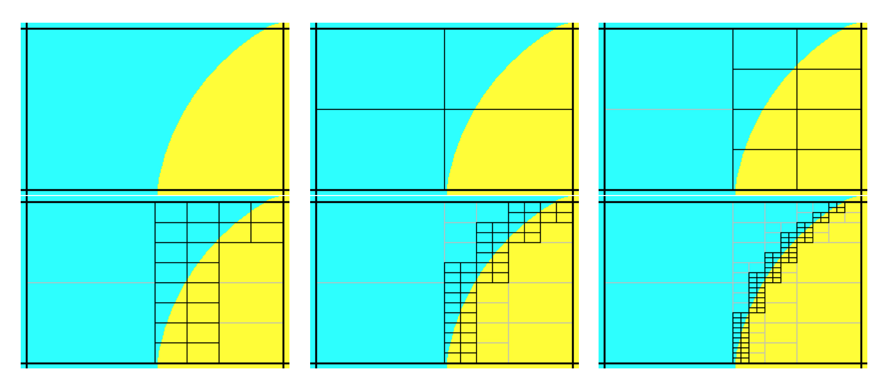

.. centered:: *Fig. 4 Successive steps in the recursive macromaterial method*

In point testing, the keyword “mmTolerance=f” is interpreted to be where *f* is the smallest
fraction of the voxel volume that can be achieved by bisection method and hence the limiting
factor for dividing the voxel. This same tolerance *f* is also used to limit the number of macromaterials.
Before a new macromaterial is created, if one already exists where the fraction of each actual
material matches to within the given tolerance, then the existing material will be used. If
using only a single point at the center of each voxel, then use “mmTolerance=1”.
The mmSubCell keyword is not used in point testing.

Example
'''''''

:numref:`cask-geom` shows an example of a cask geometry with two types of spent fuel (yellows),
steel (blue), resin (green), and other metals (gray). When the Denovo geometry is set up by
testing only the center of each mesh cell, the curved surfaces are not well represented (upper right).
By applying the ray-tracing method and defining a new material made of partial fractions of the original materials,
an improved Denovo model can be made. In the lower left of the figure, the Denovo
model was constructed using one ray (in each dimension) per voxel and a tolerance of 0.1.
This gives 20 new materials that are a mixture of the original 13 actual materials and void.
With mmSubCells=3 and an mmTolerance=0.01, 139 macromaterials are created.

A macromaterial table listing the fractions of each macromaterial is saved to a file called “outputName.mmt”,
where outputName is the name the user chose for his or her output file. This file can be used by the Mesh File
Viewer to display the macromaterials as mixtures of the actual materials, as seen in the lower row of :numref:`cask-geom`.
See the Mesh File Viewer help pages for more information on how to use colormap files and macromaterial tables.

.. _cask-geom:
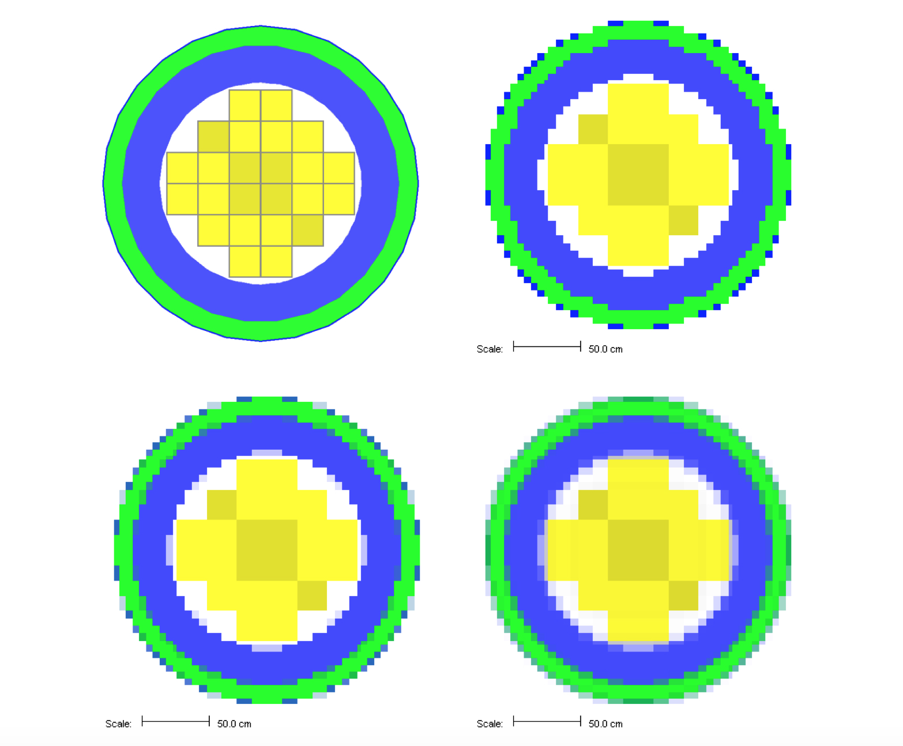

  Cask geometry model (upper left) and the Denovo representation using cell center testing (upper right). Representations using macromaterials determined by ray tracing are shown for mmSubCell=1/mmTolerance=0.1 (lower left) and mmSubCell=3/mmTolerance=0.01 (lower right).*

Optimizing source/detector problems
^^^^^^^^^^^^^^^^^^^^^^^^^^^^^^^^^^^

For standard source/detector problems in which one tally is to be optimized
in the forward Monte Carlo calculation, an adjoint source based on that
tally must be constructed. An adjoint source requires a unique and
positive identification number, a physical location, and an energy
spectrum. The adjoint source location can be specified either by (1) a
point location (“locationID=” keyword) or (2) a volume described by a
box (“boundingBox” array). A bounding box is specified by maximum and
minimum extent in each dimension—\ :math:`x_{max}` :math:`x_{min}` :math:`y_{max}` :math:`y_{min}` :math:`z_{max}`
:math:`z_{min}`—in global coordinates. The boundingBox should not be degenerate
(should have volume>0) but can be optionally limited to areas matching a
given unit number (“unit=”), a given region number (“region=”), or a
given material mixture number (“mixture=”). A mixture and a region
cannot both be specified, since that would either be redundant or
mutually exclusive. The energy spectrum of an adjoint source is a
response function (“responseID=”) listing one of the ID numbers of the
responses defined in the definitions block. An optional weight can be
assigned to each adjoint source using the “weight=” keyword. If not
given, the default weight is 1.0.

For example, to optimize a region tally, the user would construct an
adjoint source located in the same place as the tally, with an adjoint
source spectrum equal to the response function that the tally is
computing. Note that the grid geometry 1 and response function 3 must
already be defined in the definitions block.

.. code:: scale

  read importanceMap
     gridGeometryID=1
     adjointSource 24
         boundingBox 12.0 10.0  5.0 -5.0  10.0 -10.0
         unit=1 region=5
         responseID=3
     end adjointSource
  end importanceMap

For optimizing a point detector for the calculation of total photon flux,
the importance map block would look like the following:

.. code:: scale

  read importanceMap
     adjointSource 21
         locationID=4
         responseID=1
     end adjointSource
     gridGeometryID=1
  end importanceMap

where location 4 is the same location used by the point detector. To calculate total photon flux, response function 1 must be defined in the definitions block similar to this response:

.. code:: scale

  read definitions
      response 1
           values 27r0.0 19r1. end
      end response
      …
  end definitions

This response is used for computing total photon flux for the 27 neutron/19 photon group coupled cross section library or like this response

.. code:: scale

  read definitions
      response 1
           photon
           bounds 1000.0 2.0e7 end
           values  1.0   1.0   end
      end response
      …
  end definitions

which is independent of the cross section library.

Multiple adjoint sources
^^^^^^^^^^^^^^^^^^^^^^^^

If there are several tallies in very close proximity and/or several different responses being calculated by the tallies, multiple adjoint sources can be used.

.. code:: scale

  read importanceMap
     gridGeometryID=1
     adjointSource 1
         locationID=4  responseID=20
     end adjointSource
     adjointSource 2
         locationID=5  responseID=21
         weight=2.0
     end adjointSource
  end importanceMap

Note that adjoint sources using point locations can be mixed with volumetric adjoint sources (using bounding boxes).

Options for Denovo :math:`S_n` calculations
^^^^^^^^^^^^^^^^^^^^^^^^^^^^^^^^^^^^^^^^^^^

While the default values for various calculational parameters and settings used by Denovo for
the MAVRIC sequence should cover most applications, they can be changed if desired.
The two most basic parameters are the quadrature set used for the discrete ordinates and
the order of the Legendre polynomials used in describing the angular scattering.
The default quadrature order that MAVRIC uses is a level symmetric :math:`S_8` set, and the
default scattering order is :math:`P_3` (or the maximum number of coefficients contained in the
cross-section library if less than 3). :math:`S_8`/ :math:`P_3` is an adequate choice for many applications,
but the user is free to changes these. For complex ducts or transport over large distances at small angles,
:math:`S_{12}` may be required. :math:`S_4`/ :math:`P_1` or even :math:`S_2`/ :math:`P_0` would be useful in doing a very cursory run to confirm that the
problem was input correctly, but this would likely be inadequate for weight window generation in a problem
that is complex enough to require advanced variance reduction.

These and other Denovo options are applied to both
the forward and the adjoint calculations that are required from the
inputs given in the importance map block.

In problems with small sources or media that are not highly scattering,
discrete ordinates can suffer from "ray effects" :cite:`lathrop_ray_1968,lathrop_remedies_1971`
where artifacts of the discrete quadrature directions can be seen in the
computed fluxes. Denovo has a
first-collision capability to help alleviate ray effects. This method
computes the uncollided flux in each mesh cell from a point source. The
uncollided fluxes are then used as a distributed source in the main
discrete-ordinates solution. At the end of the main calculation, the
uncollided fluxes are added to the fluxes computed with the first
collision source, forming the total flux. While this helps reduce ray
effects in many problems, the first-collision capability can take a
significant amount of time to compute on a mesh with many cells or for
many point sources.

Adjoint sources that use point locations will automatically use the
Denovo first-collision capability. Volumetric adjoint sources (that use
a boundingBox) will be treated without the first-collision capability.
The keywords “firstCollision” and “noFirstCollision” will be ignored by
MAVRIC for adjoint calculations. Keywords for Denovo options in the
importance map block are summarized at the end of this section, in
:numref:`denovo-op`.

Starting with an existing adjoint flux file
^^^^^^^^^^^^^^^^^^^^^^^^^^^^^^^^^^^^^^^^^^^

An importance map can be made from an existing Denovo flux file by using
the keyword “adjointFluxes=” with the appropriate file name in quotes.
The file must be a binary file using the \*.dff file format, and the
number of groups must match the number of groups in the MAVRIC cross
section library (i.e., the library entered on the third line of the
MAVRIC input file). Instead of performing an adjoint calculation, the
fluxes read from the file will be used to create both the mesh-based
importance map and the biased mesh source.

.. code:: scale

  read importanceMap
      adjointFluxes=”c:\mydocu~1\previousRun.adjoint.dff”
      gridGeometry=7
  end importanceMap

If the “adjointFluxes=” keyword is used and any adjoint sources are defined, an error will result. If a forward flux file is supplied for forward-weighting the adjoint source (see below), then an adjoint flux file cannot be specified.

The grid geometry is not required when using a pre-existing flux file. If grid geometry is not supplied, one will be created from the mesh planes that are contained in the Denovo flux file (which were used to compute the fluxes in that file).

Forward-weighting the adjoint source
^^^^^^^^^^^^^^^^^^^^^^^^^^^^^^^^^^^^

To optimize a mesh tally or multiple region tallies/point detector
tallies over a large region, instead of a uniform weighting of the
adjoint source, a weighting based on the inverse of the forward response
can be performed. This requires an extra discrete-ordinates calculation but
can help the forward Monte Carlo calculation compute the mesh tally or
group of tallies with more uniform statistical uncertainties.

The same grid geometry will be used in both the forward calculation and
the adjoint calculation, so the user must ensure that the mesh
covers all of the forward sources and all of the adjoint sources, even
if they are point sources.

To use forward-weighted CADIS, specify either of the keywords –
“respWeighting” or “fluxWeighting”. For either, MAVRIC will run Denovo
to create an estimate of the forward flux,
:math:`\phi\left( \overrightarrow{r},E \right)`. For response weighting
(“respWeighting”), each adjoint source is inversely weighted by the
integral of the product of the response function used in that adjoint
source and the estimate of the forward flux. For an adjoint source
described by the geometric function :math:`g(\overrightarrow{r})` and
the response function :math:`\sigma_{d}\left( E \right)` (note that
:math:`\sigma_{d}\left( E \right) = 1` for computing total fluxes), the
forward-weighted adjoint source becomes

.. math::
  :label: mavric-19

   q_{i}^{+}\left( \overrightarrow{r},E \right) = \frac{\sigma_{d}\left( E \right)g(\overrightarrow{r})}{\int_{}^{}{\sigma_{d}\left( E \right)\ \phi\left( \overrightarrow{r},E \right)}\ \text{dE}} \ \ .

Response weighting will calculate more uniform relative uncertainties of
the integral quantities of the tallies in the final Monte Carlo
calculation.

To optimize the calculation of the entire group-wise flux with more
uniform relative uncertainties in each group, the adjoint source should
be weighted inversely by the forward flux,
:math:`\phi\left( \overrightarrow{r},E \right),` using the
“fluxWeighting” keyword. For an adjoint source described by the
geometric function :math:`g(\overrightarrow{r})` and the response
function :math:`\sigma_{d}\left( E \right) = 1`, the forward-weighted
adjoint source becomes

.. math::
 :label: mavric-20

 q_{i}^{+}\left( \overrightarrow{r},E \right) = \frac{\sigma_{d}\left( E \right)g(\overrightarrow{r})}{\phi\left( \overrightarrow{r},E \right)}\ .

For example, consider a problem with a single source and two detectors,
one near the source that measures flux and one far from the source that
measures some response. In a standard Monte Carlo calculation, it is
expected that since more Monte Carlo particles cross the near detector,
it will have a much lower relative uncertainty than the far detector.
Standard CADIS could be used to optimize the calculation of each in
separate simulations:

.. list-table::

  * - To optimize the flux in the near detector

    - To optimize the response in the far detector

  * - .. code:: scale

        read importanceMap
            gridGeometryID=1
            adjointSource 1
                boundingBox x1 x2 y1 y2 z1 z2
                responseID=1
            end adjointSource
        end importanceMap

    - .. code:: scale

        read importanceMap
            gridGeometryID=1
            adjointSource 2
                boundingBox u1 u2 v1 v2 w1 w2
                responseID=6
            end adjointSource
        end importanceMap

where response 1 was defined as :math:`\sigma_{1}\left( E \right) = 1`
and response 6 was defined as :math:`\sigma_{6}\left( E \right) =`
flux-to-response conversion factors. The two options for
forward weighting allow the tallies for both detectors to be calculated
in the same MAVRIC simulation. Using “fluxWeighting”, the importance map
and biased source will be made to help distribute Monte Carlo particles
evenly through each energy group and every voxel in both detectors,
making the relative uncertainties close to uniform. With
“respWeighting”, the importance map and biased source will optimize the
total integrated response of each tally.

.. list-table::

  * - To optimize :math:`\phi\left( \overrightarrow{r},E \right)` in each detector

    - To optimize a total response :math:`\int_{}^{}{\sigma_{d}\left ( E \right) \phi \left( \overrightarrow{r},E \right)} dE` (either total flux or total dose)

  * - .. code:: scale

          read importanceMap
            gridGeometryID=1
        ‘   near detector
            adjointSource 1
                boundingBox x1 x2 y1 y2 z1 z2
                responseID=1
            end adjointSource
        ‘   far detector
            adjointSource 2
                boundingBox u1 u2 v1 v2 w1 w2
                responseID=6
            end adjointSource
            fluxWeighting
        end importanceMap

    - .. code:: scale

        read importanceMap
            gridGeometryID=1
        ‘   near detector
            adjointSource 1
                boundingBox x1 x2 y1 y2 z1 z2
                responseID=1
            end adjointSource
        ‘   far detector
            adjointSource 2
                boundingBox u1 u2 v1 v2 w1 w2
                responseID=6
            end adjointSource
            respWeighting
        end importanceMap

Using flux weighting, the adjoint source will be

 .. math::
  :label: mavric-21

  q^{+}\left( \overrightarrow{r},E \right) = \frac{\sigma_{1}\left( E \right)g_{\mathrm{\text{near}}}(\overrightarrow{r})}{\phi\left( \overrightarrow{r},E \right)} + \frac{\sigma_{6}\left( E \right)g_{\mathrm{\text{far}}}(\overrightarrow{r})}{\phi\left( \overrightarrow{r},E \right)}\ ,

or using response weighting, the adjoint source will be

 .. math::
  :label: mavric-22

  q^{+}\left( \overrightarrow{r},E \right) = \frac{\sigma_{1}\left( E \right)g_{1}(\overrightarrow{r})}{\int_{}^{}{\sigma_{1}\left( E \right)\phi \left(\overrightarrow{r},E \right)}\ dE} + \frac{\sigma_{6}\left( E \right)g_{2}(\overrightarrow{r})}{\int_{}^{}{\sigma_{6}\left(E \right)\phi \left( \overrightarrow{r},E \right)}\ dE} \ .

This implementation is slightly different from the original MAVRIC in
SCALE 6. The current approach is simpler for the user and allows the
importance parameters to optimize the final Monte Carlo calculation for
the calculation of two different responses in two different areas.

If the number of mesh cells containing the true source is less than 10,
then MAVRIC will convert these source voxels to point sources and Denovo
will automatically use its first-collision capability to help reduce ray
effects in the forward calculation. The user can easily override the
MAVRIC defaults—to force the calculation of a first-collision source no
matter how many voxels contain source; this can be done by using the keyword
“firstCollision”. To prevent the calculation of a first-collision
source, the keyword “noFirstCollision” can be used. If the keywords
“firstCollision” or “noFirstCollision” are used, then they will only apply to
the forward calculation, not the subsequent adjoint calculation.

The keyword “saveExtraMaps” will save extra files that can be viewed by
the Mesh File Viewer. The source used by the forward Denovo calculation
is stored in “\ *outputName.*\ dofs.3dmap”, where *outputName* is the
name the user chose for his output file.

Forward weighting with an existing forward flux file
^^^^^^^^^^^^^^^^^^^^^^^^^^^^^^^^^^^^^^^^^^^^^^^^^^^^

Similar to the capability of using pre-existing adjoint flux files,
MAVRIC can use a pre-existing forward flux file to create a
forward-weighted adjoint source without performing the forward Denovo
calculation. The user may specify the \*.dff file containing the forward
fluxes using the keyword “forwardFluxes=”. The filename should be
enclosed in quotes, and the file must be a binary file using the Denovo
flux file format. The number of groups must match the number of groups
in the MAVRIC cross section library (i.e., the library entered on the
third line of the MAVRIC input file).

.. code:: scale

    read importanceMap
         forwardFluxes=”c:\mydocu~1\previousRun.forward.dff”
         gridGeometry=7
         adjointSource 1
            ...
         end adjointSource
         respWeighting
    end importanceMap

When using a pre-existing forward flux file, either “respWeighting” or “fluxWeighting” must still be specified.

Using the importance map
^^^^^^^^^^^^^^^^^^^^^^^^

An importance map produced by the importance map block consists of the target
weight values as a function of position and energy. The upper weight window used
for splitting and the lower weight window used for Russian roulette are set by the
window ratio. The window ratio is simply the ratio of the weight window's upper bound to
the weight window lower bound, with the target weight being the average of the upper and lower bounds.

The keyword “windowRatio=” can be used within the importance map block to specify what
window ratio will be used with the importance map that is passed to the Monaco forward
Monte Carlo calculation. For a windowRatio of :math:`r`, the upper weights for
splitting, :math:`w_{max}`, and the lower weights for Russian roulette, :math:`w_{min}`, are set as

.. math::
  :label: mavric-23

  w_{\mathrm{\min}} = \frac{2}{r + 1}\overline{w}

and

.. math::
  :label: mavric-24

  w_{\mathrm{\max}} = \frac{2r}{r + 1}\overline{w}

for the target weight :math:`\overline{w}` in each mesh cell and for
each energy of the importance map. The default value for the windowRatio
is 5.0.

Other notes on importance map calculations
^^^^^^^^^^^^^^^^^^^^^^^^^^^^^^^^^^^^^^^^^^

Since the importance map calculations all take place using mesh
geometry, one of the first steps that occurs is to create a mesh
representation of the true source (the forward source) on the same grid.
This procedure uses the same two methods as the Monaco mesh source saver
routine. Mesh cells can be subdivided and tested to see if they are
within the defined source, or a set number of points can be sampled from
the source. The keywords “subCells=” and “sourceTrials=” are used in the
importance map block to change the default settings for constructing the
mesh representation of the forward source.

If macromaterials are used (“mmTolerance<1”) and the adjoint source is
limited to a particular material, then the amount of adjoint source in a mesh
voxel will be weighted by the material amount in that voxel.

In SCALE/MAVRIC, Denovo is called as a fixed-source S\ :sub:`N` solver
and cannot model multiplying media. Neither forward nor adjoint neutron
calculations from Denovo will be accurate when neutron multiplication is
a major source component. If neutron multiplication is not turned off in
the parameters block of the MAVRIC input (using “fissionMult=0”), a
warning will be generated to remind the user of this limitation.

By default, MAVRIC instructs Denovo not to perform outer iterations for
neutron problems if the cross section library contains upscatter groups.
This is because the time required calculating the fluxes using upscatter
can be significantly longer than without. For problems in which thermal
neutrons are an important part of the transport or tallies, the user
should specify the keyword “upScatter=1” in the importance map block.
This will instruct Denovo to perform the outer iterations for the
upscatter groups, giving more accurate results but taking a much longer
time for the discrete-ordinates calculation.

When performing a MAVRIC calculation using a coarse-group energy structure
for Denovo (for example with the 27/19 library) but a fine-group energy
structure (with the 200/47 library) for the final Monaco calculation,
the source biasing parameters are determined on the coarse-group
structure. The importance map (*.mim) file and the biased mesh source
(*.msm) files all use the coarse-group structure. The source biasing
information is then applied to fine-group mesh versions of the sources,
resulting in the \*.sampling.*.msm files. This way, the biased sources
used in the final Monaco calculation retain their fine-group resolution.
This can be especially important in representing the high-energy portion
of the fission neutron distribution for example. When using CE-Monaco,
the source sampling routines first use the \*.msm files to determine the
source particle’s voxel and energy group. From that voxel and energy
group, the user-given source distributions are used to sample the
specific starting location and specific energy of the source particle.
This way, the CE-Monaco calculation samples the true CE distributions.

.. list-table:: Keywords for the importance map block
  :name: keywords-importance
  :align: center

  * - .. image:: figs/MAVRIC/table4-5.png

.. list-table:: Denovo options for the importance map block
  :name: denovo-op
  :align: center

  * - .. image:: figs/MAVRIC/table4-6.png

MAVRIC output
-------------

Main text output file
~~~~~~~~~~~~~~~~~~~~~

Similar to other SCALE sequences, MAVRIC returns a text output file
containing the output from the SCALE driver, the sequence itself, and
all of the functional modules called. The SCALE driver output first
displays the problem input file, and then the first reading of the input file
by the MAVRIC sequence is shown (which includes some material processing
information). If there are any errors or warnings about the input file,
they will be shown next. Next in the output file are the different
passes through the MAVRIC sequence---up to 10 parts. If any errors or
warning messages (such as lack of memory) are generated during
processing, they will be displayed here. Finally, the output files from
each functional module are concatenated to the above output and shows
the files returned to the user.

First, the Monaco section of output first reviews the input it received. First
the geometry is reviewed, showing which materials are used in each
region and the volume of that region, if input or calculated. Then a
detailed list of other Monaco input is reviewed: cross section parameters, data
definitions, the source description, the tallies, the Monte Carlo
parameters, and the biasing parameters. For MAVRIC calculations, if an
importance map is used, then its summary is also given. The “Mesh
Importance Map Characterization” shows where the importance map may be
changing too rapidly and may require more refinement.

For each Monaco batch, the output file lists the batch time and the
starting random number for the next batch, which may be useful in
rerunning only a portion of a problem. Once all of the batches are
completed, a list of the various tally files that have been created is
given. Finally, the tallies are summarized in a section entitled “Final
Tally Results Summary.” For each point detector, the total neutron and
photon fluxes (uncollided and total) are given as well as the final
response values for each response function. For each region tally, the
total neutron and photon fluxes (both track-length and collision density
estimates) are listed, followed by the final response values for each
response function. Group‑by‑group details are saved to separate files
for each tally.

Additional output files
~~~~~~~~~~~~~~~~~~~~~~~

In addition to the generous amount of data contained in the MAVRIC text
output file, many other files are created containing the intermediate
data used by the sequence and the final tally data. Many of the files
produced can be viewed using the Mesh File Viewer or the Interactive
Plotter capabilities of Fulcrum, which is distributed with SCALE. (Note
that most of the images in this document were taken from the Mesh File
Viewer from SCALE 6.1.) :numref:`output-files` lists the other output files, based
on the name of the main output file (here called *outputName)*, that are
available to the user. These files will be copied back to the directory
where the input file was located. Many of the files come from Monaco and
are discussed in the Monaco chapter of the SCALE manual (SECTIONREFERENCE).

Other files that the user may be interested in are listed in
:numref:`intermediate-files`. These files are kept in the temporary directory where SCALE
executes and are not copied back to the directory where the input file
was located, unless specifically requested using a SCALE “``shell``”
command. Curious users may also be interested in viewing the various
input files (i_*) that the MAVRIC sequence writes in order to run the
SCALE functional modules.

.. _output-files:
.. table:: Output files that are copied back to user’s area when the sequence finishes\ :sup:`a`

  +--------------------------------+--------+------------------------------------------------------------------------------------------------------+
  | Filename                       | Viewer | Description                                                                                          |
  +================================+========+======================================================================================================+
  | Output Summary                 |        |                                                                                                      |
  +--------------------------------+--------+------------------------------------------------------------------------------------------------------+
  | *outputName*.out               |        | main text output file, contains results summary                                                      |
  +--------------------------------+--------+------------------------------------------------------------------------------------------------------+
  | Diagnostic files               |        |                                                                                                      |
  +--------------------------------+--------+------------------------------------------------------------------------------------------------------+
  | *outputName*.respid.chart      | P      | response input and MG representation for response *id*                                               |
  +--------------------------------+--------+------------------------------------------------------------------------------------------------------+
  | *outputName*.gridid.3dmap      | V      | mesh version of geometry using grid geometry *id*                                                    |
  +--------------------------------+--------+------------------------------------------------------------------------------------------------------+
  | *outputName*.cylid.3dmap       | V      | mesh version of geometry using cylindrical geometry *id*                                             |
  +--------------------------------+--------+------------------------------------------------------------------------------------------------------+
  | *outputName*.distid.chart      | P      | distribution input and sampling test for distribution *id*                                           |
  +--------------------------------+--------+------------------------------------------------------------------------------------------------------+
  |                                |        |                                                                                                      |
  +--------------------------------+--------+------------------------------------------------------------------------------------------------------+
  | Mesh Source Saver              |        |                                                                                                      |
  +--------------------------------+--------+------------------------------------------------------------------------------------------------------+
  | *filename*.msm                 | V      | mesh representation of a single source or total source                                               |
  +--------------------------------+--------+------------------------------------------------------------------------------------------------------+
  | *filename*.id.msm              | V      | mesh representation of multiple sources                                                              |
  +--------------------------------+--------+------------------------------------------------------------------------------------------------------+
  | *filename*.sampling.msm        | V      | biased representation of a single source or total source                                             |
  +--------------------------------+--------+------------------------------------------------------------------------------------------------------+
  | *filename*.sampling.id.msm     | V      | biased representation of multiple sources                                                            |
  +--------------------------------+--------+------------------------------------------------------------------------------------------------------+
  |                                |        |                                                                                                      |
  +--------------------------------+--------+------------------------------------------------------------------------------------------------------+
  | Importance Map Generation      |        |                                                                                                      |
  +--------------------------------+--------+------------------------------------------------------------------------------------------------------+
  | *outputName*.geometry.3dmap    | V      | voxelized geometry (cell-center testing only)                                                        |
  +--------------------------------+--------+------------------------------------------------------------------------------------------------------+
  | *outputName*.forward.dff       | V      | scalar forward flux estimate,  :math:`\phi\left(x,y,z,E \right)`                                     |
  +--------------------------------+--------+------------------------------------------------------------------------------------------------------+
  | *outputName*.adjoint.dff       | V      | scalar adjoint flux estimate,  :math:`\phi^{+} \left( x,y,z,E \right)`                               |
  +--------------------------------+--------+------------------------------------------------------------------------------------------------------+
  | *outputName*.mim               | V      | Monaco mesh importance map, :math:`\overline{w}\left(x,y,z,E \right)`                                |
  +--------------------------------+--------+------------------------------------------------------------------------------------------------------+
  | *outputName*.msm               | V      | Monaco mesh source, :math:`\widehat{q}\left(x,y,z,E \right)`                                         |
  +--------------------------------+--------+------------------------------------------------------------------------------------------------------+
  | *outputName*.mmt               | V      | macro-material table                                                                                 |
  +--------------------------------+--------+------------------------------------------------------------------------------------------------------+
  |                                |        |                                                                                                      |
  +--------------------------------+--------+------------------------------------------------------------------------------------------------------+
  | Tally Files                    |        |                                                                                                      |
  +--------------------------------+--------+------------------------------------------------------------------------------------------------------+
  | *outputName*.pdid.txt          |        | detailed results for point detector tally *id*                                                       |
  +--------------------------------+--------+------------------------------------------------------------------------------------------------------+
  | *outputName*.pdid.chart        | P      | batch convergence data for point detector tally *id*                                                 |
  +--------------------------------+--------+------------------------------------------------------------------------------------------------------+
  | *outputName*.rtid.txt          |        | detailed results for region tally *id*                                                               |
  +--------------------------------+--------+------------------------------------------------------------------------------------------------------+
  | *outputName*.rtid.chart        | P      | batch convergence data for region tally *id*                                                         |
  +--------------------------------+--------+------------------------------------------------------------------------------------------------------+
  | *outputName*.mtid.3dmap        | V      | mesh tally for meshTally *id*                                                                        |
  +--------------------------------+--------+------------------------------------------------------------------------------------------------------+
  | *outputName*.mtid.respxx.3dmap | V      | mesh tally of response by group for meshTally *id* response xx                                       |
  +--------------------------------+--------+------------------------------------------------------------------------------------------------------+
  | *outputName*.mtid.flux.txt     |        | detailed results for the group-wise flux of meshTally *id*                                           |
  +--------------------------------+--------+------------------------------------------------------------------------------------------------------+
  | *outputName*.mtid.tfluxtxt     |        | detailed results for total flux of meshTally *id*                                                    |
  +--------------------------------+--------+------------------------------------------------------------------------------------------------------+
  | *outputName*.mtid.respxx.txt   |        | detailed results for response xx of meshTally *id*                                                   |
  +--------------------------------+--------+------------------------------------------------------------------------------------------------------+
  |                                |        |                                                                                                      |
  +--------------------------------+--------+------------------------------------------------------------------------------------------------------+

:sup:`a` \V – can be displayed with the Mesh File Viewer capabilities of Fulcrum. *P* – can be displayed with the 2D plotting capabilities of Fulcrum.

.. _intermediate-files:
.. table:: Other intermediate files—available in the temporary directory (may be useful for testing and debugging)

  +-----------------------+-----------------------+
  | **Filename**          | **Description**       |
  +=======================+=======================+
  | ft02f001              | AMPX formatted cross  |
  |                       | sections for Denovo   |
  +-----------------------+-----------------------+
  | fort.51               | text file, listings   |
  |                       | of the mixing table   |
  |                       | for Monaco            |
  +-----------------------+-----------------------+
  | fort.52               | text file, review of  |
  |                       | MAVRIC sequence input |
  |                       | variables             |
  +-----------------------+-----------------------+
  | fort.54               | energy bin boundaries |
  |                       | for the current cross |
  |                       | section library       |
  +-----------------------+-----------------------+
  | xkba_b.inp            | binary input file for |
  |                       | Denovo – rename to    |
  |                       | have                  |
  |                       |                       |
  |                       | a \*.dsi extension    |
  |                       | (Denovo simple input) |
  |                       | to be viewed via Mesh |
  |                       | File Viewer           |
  +-----------------------+-----------------------+

Sample problems
---------------

Graphite shielding measurements with CADIS
~~~~~~~~~~~~~~~~~~~~~~~~~~~~~~~~~~~~~~~~~~

As shown in the Monaco sample problem for simulating the Ueki shielding experiments
(Monaco chapter Graphite Shielding Measurements) (SECTIONREFERENCE),
as the amount of shielding material between a source and detector increases,
the time required to reach a certain level of relative uncertainty increases quickly.
This example will use the MAVRIC automated variance reduction capability to optimize the
calculation of the dose rate at the detector location by specifying an importance map block
with an adjoint source made from the detector response function and the detector location.

Input file
^^^^^^^^^^

The following is a listing of the file ``mavric.graphiteCADIS.inp`` located
in the SCALE ``samples\input`` directory. This calculation will use the
coarse-group shielding library (27n19g) for all of the importance map
calculations and the fine-group library (200n47g) for the final Monaco
step. Additions, compared to the file ``monaco.graphite.inp``, include a
grid geometry for the Denovo computational mesh, a mesh tally to better
visualize the particle flow, and the importance map block to optimize
the Monte Carlo calculation of the point detector.

.. code:: scale

  =mavric
  Monaco/MAVRIC Training - Exercise 3. Graphite Shielding Measurements Revisited
  v7-27n19g

  '-------------------------------------------------------------------------------
  ' Composition Block - standard SCALE input
  '-------------------------------------------------------------------------------
  read composition
      para(h2o)    1         1.0 293.0 end
      carbon       2 den=1.7 1.0 300.0 end
  end composition

  '-------------------------------------------------------------------------------
  ' Geometry Block - SCALE standard geometry package (SGGP)
  '-------------------------------------------------------------------------------
  read geometry
      global unit 1
          cuboid  1   25.0 -25.0  25.0 -25.0   25.0 -25.0
          cone    2  10.35948  25.01   0.0 0.0   rotate  a1=-90 a2=-90 a3=0
          cuboid  3   90.0  70.0  40.0 -40.0   40.0 -40.0
          cuboid 99  120.0 -30.0  50.0 -50.0   50.0 -50.0
          media 1 1  1 -2
          media 0 1  2
          media 2 1  3
          media 0 1  99 -1  -2 -3
      boundary 99
  end geometry

  '-------------------------------------------------------------------------------
  ' Definitions Block
  '-------------------------------------------------------------------------------
  read definitions
      location 1
          position 110 0 0
      end location
      response 5
          title="ANSI standard (1977) neutron flux-to-dose-rate factors"
          specialDose=9029
      end response
      distribution 1
          title="Cf-252 neutrons, Watt spectrum a=1.025 MeV and b=2.926/MeV"
          special="wattSpectrum"
          parameters 1.025 2.926 end
      end distribution
      gridGeometry 7
          title="large meshes in paraffin, 5 cm mesh for shield thicknesses"
          xLinear 5 -25 25
          xLinear 12 30 90
          xplanes 100 110 120 -30 end
          yplanes -50 -40 40 50 end
          yLinear 7 -35 35
          zplanes -50 -40 40 50 end
          zLinear 7 -35 35
      end gridGeometry
  end definitions

  '-------------------------------------------------------------------------------
  ' Sources Block
  '   Cf-252 neutrons, Watt fission spectrum model
  '   with a=1.025 MeV and  b=2.926/MeV
  '-------------------------------------------------------------------------------
  read sources
      src 1
          title="Cf-252 neutrons, Watt fission spectrum model"
          strength=4.05E+07
          cuboid  0.01 0.01  0 0  0 0
          neutrons
          eDistributionID=1
      end src
  end sources

  '-------------------------------------------------------------------------------
  ' Tallies Block
  '-------------------------------------------------------------------------------
  read tallies
      pointDetector 1
          title="center of detector"
          locationID=1
          responseID=5
      end pointDetector
      meshTally 1
          title="example mesh tally"
          gridGeometryID=7
          responseID=5
          noGroupFluxes
      end meshTally
  end tallies

  '-------------------------------------------------------------------------------
  ' Parameters Block
  '-------------------------------------------------------------------------------
  read parameters
      randomSeed=00003ecd7b4e3e8b
      library="v7-200n47g"
      perBatch=10000 batches=10
      fissionMult=0   noPhotons
  end parameters

  '-------------------------------------------------------------------------------
  ' Importance Map Block
  '-------------------------------------------------------------------------------
  read importanceMap
      adjointSource 1
          locationID=1
          responseID=5
      end adjointSource
      gridGeometryID=7
              macromaterial
          mmTolerance=0.01
      end macromaterial
  end importanceMap

  end data
  end

Output
^^^^^^

MAVRIC results for the point detector response for the 20 cm case are shown below and in :numref:`mesh-tally`.

.. code:: scale

  Neutron Point Detector 1. center of detector
                           average      standard     relat      FOM    stat checks
      tally/quantity        value       deviation    uncert   (/min)   1 2 3 4 5 6
      ------------------  -----------  -----------  -------  --------  -----------
      uncollided flux     1.06384E+01  1.88744E-02  0.00177
      total flux          2.36367E+02  5.47276E+00  0.02315  8.10E+02  X - X - X -
      response 5          1.28632E-02  1.74351E-04  0.01355  2.36E+03  X X X X X X
      ------------------  -----------  -----------  -------  --------  -----------

This problem took only ~2.5 minutes (0.2 in Denovo and 2.3 minutes in
Monaco) on the same processor as the 20 minute analog case. (The figure
of merit [FOM] is 15 times higher than the analog.) Note that the point
detector dose rate is the same as the Monaco analog sample problem, but
the relative uncertainty is smaller with less computation time. CADIS
has optimized the calculation by focusing on neutrons that contribute to
the dose rate at the detector location at the expense of neutrons in
the paraffin block. This is demonstrated by the mesh tally of dose rates
where the values for the dose rate are lower in the paraffin block and
the relative uncertainties are higher. Since the calculation was
optimized for the position of the detector, dose rates in other parts of
the problem are underestimated and should not be believed.

The mesh tally shows that the CADIS calculation did not follow as many
particles deep into the paraffin block, so the uncertainties are greater
there, but that is what this problem was supposed to do—reduce the
uncertainty at the point detector at the expense of the other portions
of the problem.

.. _mesh-tally:

.. figure:: figs/MAVRIC/mesh-tally.png

    Mesh tally showing neutron dose rate (rem/hr) and uncertainties for the analog case and the CADIS case.

Dose rates outside of a simple cask
~~~~~~~~~~~~~~~~~~~~~~~~~~~~~~~~~~~

This example problem is a full-size cylindrical cask model, which consists of an inner steel liner,
a thick section of concrete, and an outer steel cover. This problem is intended to be used as a tool to
teach users how to build MAVRIC input files. This is not a completely realistic shipping cask; it has been
simplified greatly for this purpose. The goal of this example it to show how to quickly calculate neutron
and photon does rates at six points outside of the cask, including in front of the vent port.

Geometry and materials
^^^^^^^^^^^^^^^^^^^^^^

The simple model of a cask is shown in :numref:`cask-geom2`.
Vent ports at the top and bottom of the cask are modeled as void all of the way around the cask.
The interior of the cask was modeled using materials from about 20 typical pressurized water reactor
(PWR) fuel assemblies (including the UO2, Zr, Fe, Ni, Cr, Sn, and other constituents),
homogenized over the interior volume. The total mass of the fuel/assembly hardware in this
region is 10.6 metric tonnes. Separate end regions of the assemblies are not modeled in this
simple example. Also note that the fuel material is based on fresh fuel, not spent fuel with
its hundreds of fission products.

.. _cask-geom2:
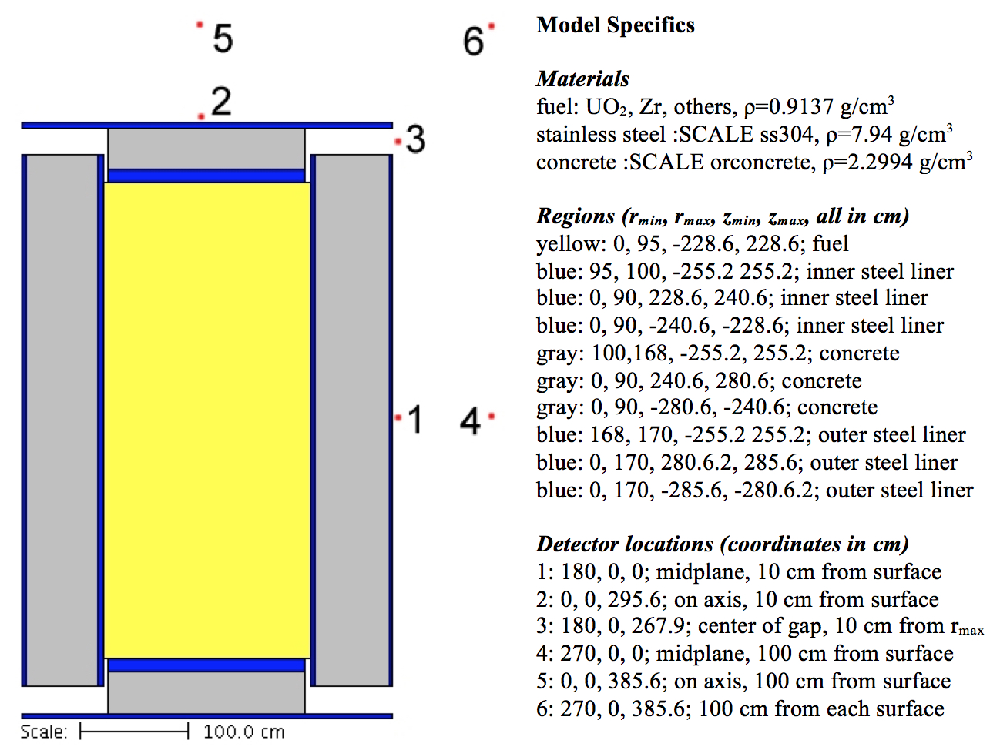

  Cask geometry and detector locations.

Sources and responses
^^^^^^^^^^^^^^^^^^^^^

Spent fuel from a typical mid-sized PWR was used to determine the source
term. ORIGEN was used to deplete a full core (46.1 metric tonnes of
uranium, 4.2% enriched, with O, Zr, Fe, Ni, Cr, Sn, and other
constituents) to 55,000 MWdays/MTU. The contents of the modeled fuel
represent typical values for PWR fuel. ORIGEN then computed the neutron
and photon spectra in 27-group and 19-group energy structures for the
fuel following a 10-year cooling period after the last irradiation. The
total neutron source strength for the cask (1/6 of a full core, or about
20 assemblies) was 8.577×10\ :sup:`9` neutrons/s. The total photon
source strength was 7.155 × 10\ :sup:`16` photons/s.

Two cases will be done for this example: one for calculating the neutron
dose rates from the spent fuel neutrons and the other for calculating
the photon dose rates from the spent fuel photons. The source spectra
and response functions are shown in :numref:`spent-neutron` through :numref:`ANSI-photon`
and listed in :numref:`source-and-response`. Note that in this example, the neutron source
shown in :numref:`spent-neutron` and :numref:`source-and-response` is considered the final neutron
source: no further neutron multiplication is considered.

.. _spent-neutron:
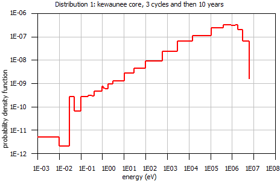

  Spent fuel neutron source spectrum with strength 8.577 × 10\ :sup:`9`/second.

.. _ANSI-neutron:
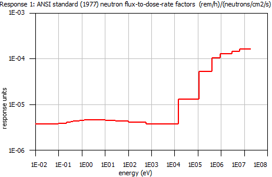

  ANSI-1977/ flux-to-dose-rate factors (rem/hr)/(neutrons/\cm :sup:`2`/sec).

.. _spent-photon:

  Spent fuel photon source spectrum with strength 7.155×10\ :sup:`16`/second

.. _ANSI-photon:
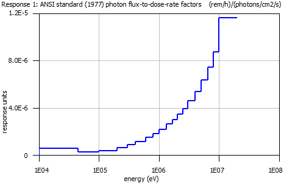

  ANSI-1977 photon flux-to-dose-rate factors (rem/hr)/(photons/\cm :sup:`2`/sec)

.. list-table:: Source and response data using the SCALE 27-group energy structure for neutrons and the 19-group energy structure for photons
  :name: source-and-response

  * - .. image:: figs/MAVRIC/tab9.png

Energies listed are the bin upper energies. Source units are
particles/s normalized to a total of 1 particle/s. Response units are
(rem/hr)/(particle/cm\ :sup:`2`/s).

Analog calculation
^^^^^^^^^^^^^^^^^^

The analog model for this problem starts with the problem title and the cross section library name,
which in this example is the ENDF/B-VII.0 27 neutron group / 19 photon group library.
This is in the SCALE ``samples\input`` directory as ``mavric.caskAnalogn.inp`` and ``mavric.caskAnalogp.inp``.

.. code:: scale

  =mavric
  Simplified cask model
  v7-27n19g

Then the material compositions are listed for fresh fuel, concrete, and steel.

.. code:: scale

  read composition
      wtptFuel   1 0.913717475 18         6000  0.00939719    7014  0.00528993
                      8016  9.73397641   13000  0.00715715   14000  0.01031670
                     15000  0.02227505   22000  0.00780567   24000  0.36655141
                     25000  0.01716839   26000  0.72041451   27000  0.00523824
                     28000  0.68955526   40000 15.78990702   41000  0.05130153
                     42000  0.02844690   50118  0.25877903   92235  3.03560962
                     92238 69.24080999
                   1.0 293.0 end
      orconcrete 2 1.0 293.0 end
      ss304      3 1.0 293.0 end
  end composition

Then the SGGP geometry is listed, with the origin of the coordinate system at the center of the cask.

.. code:: scale

  read geometry
      global unit  1
          zcylinder  1   95.0  228.6 -228.6
          zcylinder  2  170.0  255.2 -255.2
          zcylinder  3   90.0  240.6 -240.6
          zcylinder  4   90.0  280.6 -280.6
          zcylinder  5  170.0  280.6 -280.6
          zcylinder  6  170.0  285.6 -285.6
          zcylinder  7   95.0  255.2 -255.2
          zcylinder  8  100.0  255.2 -255.2
          zcylinder  9  168.0  255.2 -255.2
          sphere    10  999.0
          media  1 1   1          vol=1.29629E+07
          media  3 1   8 -7       vol=1.56338E+06
          media  2 1   9 -8       vol=2.92216E+07
          media  3 1   2 -9       vol=1.08394E+06
          media  3 1   3 -1       vol=6.10726E+05
          media  2 1   4 -3       vol=2.03575E+06
          media  3 1   6 -5       vol=9.07920E+05
          media  0 1   5 -4 -2    vol=3.31953E+06
          media  0 1   7 -4 -1    vol=1.54598E+05
          media  0 1   10 -6      vol=4.12429E+09
      boundary 10
  end geometry

The definitions block contains locations, response functions, grid geometries, and a distribution used by the source input block. For the neutron source/neutron dose problem, the definitions block is listed below.

.. code:: scale

  read definitions
      location 1   position 180.0 0.0   0.0    end location
      location 2   position   0.0 0.0 295.6    end location
      location 3   position 180.0 0.0 267.9    end location
      location 4   position 270.0 0.0   0.0    end location
      location 5   position   0.0 0.0 385.6    end location
      location 6   position 270.0 0.0 385.6    end location
      response 1  specialDose=9029  end response
      distribution 1
          title="kewaunee core, 3 cycles and then 10 years"
          neutronGroups
          truePDF  2.040E-02 2.147E-01 2.365E-01 1.267E-01 1.586E-01
                   1.587E-01 7.281E-02 1.073E-02 7.688E-04 5.694E-05
                   4.479E-06 3.148E-07 4.983E-08 9.864E-09 1.117E-09
                   3.286E-10 1.060E-10 9.203E-11 9.135E-11 1.755E-10
                   2.590E-11 3.024E-11 3.451E-11 3.269E-12 5.447E-12
                   4.089E-14 4.916E-14 end
      end distribution
  end definitions

The neutron source from the spent fuel is then listed.

.. code:: scale

  read sources
      src 1
          title="1/6 of kewaunee core, ~ 0.25 Ci"
          strength=8.577E+09
          neutrons
          zCylinder 95.0  228.6 -228.6
          eDistributionID=1
      end src
  end sources

Six point detectors are used to evaluate dose rates radially, axially, and near the vent port.

.. code:: scale

  read tallies
      pointDetector 1  locationID=1  responseID=1  end pointDetector
      pointDetector 2  locationID=2  responseID=1  end pointDetector
      pointDetector 3  locationID=3  responseID=1  end pointDetector
      pointDetector 4  locationID=4  responseID=1  end pointDetector
      pointDetector 5  locationID=5  responseID=1  end pointDetector
      pointDetector 6  locationID=6  responseID=1  end pointDetector
  end tallies

The Monte Carlo parameters were tailored for the neutron problem to be 1-minute batches
on a 2 GHz Linux computer. For the photon problem, the number per batch would be 91,000 for 1-minute batches.

.. code:: scale

  read parameters
      randomSeed=8655745280030001
      perBatch=25400 batches=600
      fissionMult=0    noPhotons
  end parameters

No biasing is specified, which will use the default weight window target value of 1 for every energy
group in every region. To allow the neutrons to penetrate into the cask wall before being rouletted,
a larger window ratio is used, making the lower weight window bound 0.01.

.. code:: scale

  read biasing
      windowRatio=199.0
  end biasing

The Monaco input is then ended.

.. code:: scale

  end data
  end

For the photon source/photon dose rate problem, the definitions block would instead contain a photon flux-to-dose-rate response function and the energy distribution for the source.

.. code:: scale

  read definitions
      response 1
          specialDose=9504
      end response
      …
      distribution 1
          title="kewaunee core, 3 cycles and then 10 years"
          photonGroups
          truePDF 1.320E-12 7.185E-11 3.281E-10 1.672E-09 4.167E-09
                  8.086E-08 7.937E-07 1.164E-05 3.331E-05 8.160E-03
                  3.511E-02 2.478E-02 4.827E-01 4.641E-02 9.736E-03
                  1.514E-02 5.182E-02 7.015E-02 2.560E-01       end
      end distribution
  end definitions

The sources block would contain the photon source information.

.. code:: scale

  read sources
      src 1
          title="1/6 of kewaunee core, ~ 2e6 Ci"
          strength=7.155e+16
          photons
          zCylinder 95.0  228.6 -228.6
          eDistributionID=1
      end src
  end sources

Each of the two analog problems in the ``samples\input`` directory will run for
about 10 minutes. In this time, no meaningful results will be generated
due to the difficulty of the problem. Analog results for each case
running 110 hr are listed in :numref:`analog-neutron` for the neutron source/neutron
dose problem, while results for the photon problem are listed in
:numref:`analog-photon`. Note that after 110 hr, some of the relative uncertainties
in the point detector tallies are still quite high, and only one of the
six tallies in each problem passed all of the statistical checks.
:numref:`neutron-dose-plot` is the convergence plot for the neutron dose rate at point
detector 1, showing that the tally is not well converged and that some
batches contain rare events that change the tally value a great deal.

.. list-table:: Analog Monaco results for the simplified cask model—neutron source/neutron dose rate.
  :name: analog-neutron
  :align: center

  * - .. image:: figs/MAVRIC/tab10.png

.. list-table:: Analog Monaco results for the simplified cask model—photon source/photon dose rate.
  :name: analog-photon
  :align: center

  * - .. image:: figs/MAVRIC/tab11.png

.. _neutron-dose-plot:
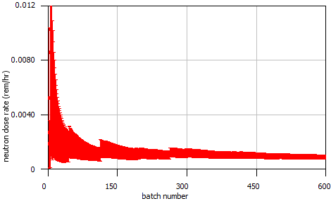

  Convergence plot for the neutron dose rate at point detector 1 (error bars show the 1-sigma tally uncertainties).

SAS4 calculations
^^^^^^^^^^^^^^^^^

Calculations for these two problems were also done using the SAS4
sequence in SCALE 5.1. SAS4 was specifically designed for cask
geometries and used a one-dimensional discrete-ordinates calculation
(either radially or axially) to determine weight windows. Results for
the neutron problem are shown in :numref:`neutron-problem`, and results for the
photon problem are shown in :numref:`photon-problem`. Note that SAS4 using radial
biasing is only expected to do well for the two radial point detector
locations. Similarly, only the two axial point detectors are expected to
do well when using axial biasing. SAS4 was not intended to do well for
the points near the vent port, but the results using the axial biasing
seem reasonable.

.. list-table:: SAS4 results using radial biasing (361 minutes) and axial biasing (361 minutes), for the simplified cask model—neutron source/neutron dose rate
  :align: center
  :name: neutron-problem

  * - .. image:: figs/MAVRIC/tab12.png

.. list-table:: SAS4 results using radial biasing (361 minutes) and axial biasing (361 minutes), for the simplified cask model—photon source/photon dose rate
  :name: photon-problem
  :align: center

  * - .. image:: figs/MAVRIC/tab13.png

Calculations using CADIS
^^^^^^^^^^^^^^^^^^^^^^^^

In the analog calculations, the dose rates at all six points could be
calculated at the same time. With MAVRIC and using CADIS, the importance
map will optimize the transport of particles towards only the selected
detector. Hence, each detector will have a separate calculation with an
importance map tailored to reduce the variance for only that detector.
Calculations for close detectors could be performed at the same time. For example, detectors 1
and 4 both need to push particles out of the cask in the positive
*x* direction, towards the *z*\ =0 plane. In this example, all six
detectors will use separate importance maps.

For the importance map, in the input, the user lists what planes to use
for the adjoint discrete-ordinates calculation. These planes define
cells, which are treated as homogenous parallelpipeds by Denovo, made of
a macro material corresponding to a mixture of materials that are in the
cell in the true geometry. Users should try to bound as many materials
as possible with their selection of mesh planes. More mesh planes should
be used where the importance (adjoint flux) varies quickly, such as
near the adjoint sources (the detector positions). It is also important
to have planes on the true source bounding box.

In this example problem, different sets of mesh planes will be used for
the different detector positions. For detector positions 1 and 4, the
mesh planes are shown in :numref:`importance-1` and :numref:`importance-2`. Note that
there are more planes closer to the detectors. Also note that in the
*z* dimension, it is quite easy to place mesh planes at every material
boundary, but it is a bit more difficult to do so in the *x* and *y* dimensions
due to the curved surfaces. Users need not worry about getting things
perfect—an approximate importance map can still reduce Monte Carlo
variances a great deal. The meshes used for detector positions 2/5 and
positions 3/6 are also shown in :numref:`importance-1` and :numref:`importance-2`. Mesh
parameters are listed in :numref:`mesh-param-xyz`, and the mesh planes are listed in
:numref:`mesh-planes`.

.. _importance-1:

.. figure:: figs/MAVRIC/fig1.13.jpg
  :width: 99 %
  :align: center

  Importance map mesh planes in the x and z dimensions for detector positions 1/4, 2/5, and 3/6.

.. _importance-2:

  Importance map mesh planes in the x and y dimensions for detector positions 1/4, 2/5, and 3/6.

.. list-table:: Mesh parameters
  :name: mesh-param-xyz
  :header-rows: 1
  :align: center

  * - Detector position
    - Number
    - of
    - cells
    - Total cells
  * -
    - x
    - y
    - z
    -
  * - 1/4
    - 46
    - 35
    - 35
    - 56350
  * - 2/5
    - 35
    - 35
    - 49
    - 60025
  * - 3/6
    - 46
    - 35
    - 49
    - 78890

.. list-table:: List of the various sets of mesh planes used for the importance calculations for six different point detectors
  :name: mesh-planes
  :align: center

  * - .. image:: figs/MAVRIC/tab15.png

MAVRIC input files
^^^^^^^^^^^^^^^^^^

With two sources and six detectors, this example problem will require 12
separate input files. Starting with the two input files for the analog
calculations, these 12 input files will share most of the same features
and will differ only in blocks related to the importance map calculation: the
location of the adjoint source and the planes used in the grid geometry.

To change the input for the neutron problem from an analog calculation
to one using CADIS, the user first adds the mesh planes for the
discrete-ordinates calculation as a grid geometry to the definitions
block. This set of planes is tailored for the vent port direction
toward detectors 3 and 6.

.. code:: scale

  gridGeometry 3
          title="for importance map for detectors 3,6"
          xplanes -170 -168 -146 -122 -100
                  -95 -90 -60 -40 -20 -5
                  5 15 25 35 45 55 65 75 85 90 95 100
                  104 108 112 116 120 124 128 132 136 140 144 148 152
                  156 158 160 162
                  164 165 166 167
                  168 169 170  end
          yplanes -170 -168 -155 -141 -127 -113 -100
                  -95 -90 -85 -75 -65 -55 -45 -35 -25 -15 -5
                  5 15 25 35 45 55 65 75 85 90 95 100
                  113 127 141 155 168 170  end
          zplanes -285.6 -280.6 -255.2 -240.6 -228.6 -210
                  -190 -170 -150 -130 -110 -90 -70 -50 -30 -10
                  10 30 50 70 90 110 130 150 170 190
                  210    216.2 222.4
                  228.6  232.6 236.6
                  240.6  245.1 249.7 254.2
                  255.2  256.2 260.1 264 267.9 271.8 275.7 279.6
                  280.6  281.6 282.6 283.6 284.6 285.6  end
  end gridGeometry

To help the mesh-based biased source represent the true source,
“mixture=1” can be added to the source definition. This will ensure that
particles sampled from the mesh source that are not in the fuel are
rejected. Then an importance map block replaces the standard biasing
block. In this case, the importance map will optimize the flow of
particles to location 3 (where point detector 3 is defined).

.. code:: scale

  read importanceMap
      adjointSource 1
          locationID=3
          responseID=1
      end adjointSource
      gridGeometryID=3
      macromaterial
          mmTolerance=0.01
      end macromaterial
  end importanceMap

A mesh tally could be added with the following in the tallies block.

::

  meshTally 1
        title="Shows how importance map changes the transport of particles"
        gridGeometryID=3
        responseID=1
  end meshTally

The above mesh tally uses the same grid geometry as the CADIS
calculations, but a different grid (or grids) could be used. The files
``mavric.caskCADISn.inp`` and ``mavric.caskCADISp.inp`` are available in the
SCALE ``samples\input`` directory. These are for calculating the dose rates
at detector position 3, but they can be modified for the other five positions
(by changing the geometry grid planes and the adjoint source location).

Neutron source/neutron response results
^^^^^^^^^^^^^^^^^^^^^^^^^^^^^^^^^^^^^^^

The above MAVRIC input file first performed the discrete-ordinates
calculation to determine the adjoint flux from detector position 3. The
adjoint Denovo flux file (\*.adjoint.dff) produced can be viewed using
the Mesh File Viewer and is shown in :numref:`adjoint-denovo` for several of the
neutron energy groups.

MAVRIC then combined a mesh representation of the true source (space and
energy) with the adjoint fluxes to create the importance map and
mesh-based biased source. These are shown in :numref:`fifth-neutron` for the fifth
neutron group, covering the energy range of 0.9 to 1.4 MeV. Notice how
the most important region (lowest target weights) is right around the
vent port near detector position 3. This is something we know
qualitatively, but quantitative values for exactly how the importance
changes with space and energy are difficult to guess. Also notice the
“consistent” part of CADIS—--the source particles---are born with a weight
that matches the target weight for the position they are born into. The
biased source sampling distribution is depicted in :numref:`biased-source`, showing
how the source particles nearest to detector 3 will be sampled more
often.

The biased source distribution and the importance map are then used by
Monaco to compute the dose equivalent rate response at detector 3.

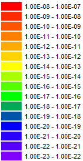
.. _adjoint-denovo:
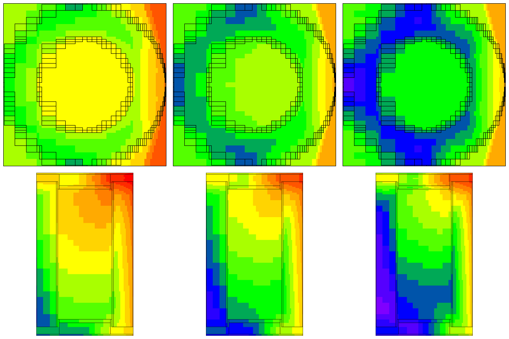

  Adjoint neutron fluxes (/cm :sup:`2`/s) for groups 5 (0.9–1.4 MeV), 10 (0.58–3.0 keV), and 19 (0.8–1 eV) calculated by Denovo.

.. _fifth-neutron:

  Neutron target weights from the importance map and source weights (at birth) for neutron group 5 (0.9 to 1.4 MeV).

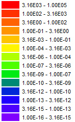

.. _biased-source:

  Biased source sampling probability (neutrons/cm3) for neutron groups 5 (0.9‑1.4 MeV), 10 (0.58–3.0 keV), and 19 (0.8–1 eV).

The results for all six neutron cases, each using their own importance
map and biased source, are shown in :numref:`MAVRIC-final`.

This example shows that MAVRIC using CADIS obtains the
correct answer much faster than the analog calculations. This is shown
with a comparison to the results from the analog Monaco and SAS4
calculations, all of which are listed in :numref:`MAVRIC-CADIS-results`.

To account for the time it takes to achieve a given level of
uncertainties, the calculation figure-of-merit---FOM=1/time/(relative
uncertainty)\ :sup:`2`---can be calculated for each of the codes. The
ratios of each code FOM to the FOM of analog Monaco (speedup) are listed
in :numref:`figure-of-merit` to show how much faster MAVRIC and SAS4 are compared to
analog Monaco. The FOMs for MAVRIC include the Denovo calculation times.
The FOMs for analog Monaco and SAS4 were modified to account for
calculating all six detectors at once.

.. list-table:: Final MAVRIC results (rem/hr) for each point detector in the neutron source/neutron dose rate problem
  :align: center
  :name: MAVRIC-final

  * - .. image:: figs/MAVRIC/tab16.png

.. list-table:: Comparison of neutron dose rates (rem/hr) to other SCALE codes
  :align: center
  :name: MAVRIC-CADIS-results

  * -
    - Analog Monaco
    - SAS4 radial
    - SAS4 axial
    - MAVRIC
  * - detector
    - 6595 min
    - 360 min
    - 361 min
    - 556 min
  * - 1
    - 8.78E-04 ± 19%
    - 7.67E-04 ± 0.8%
    - 1.32E-05 ± 45%
    - 7.65E-04 ± 0.8%
  * - 2
    - 7.35E-03 ± 4.1%
    - 2.67E-02 ± 86%
    - 7.80E-03 ± 0.4%
    - 7.83E-03 ± 0.3%
  * - 3
    - 1.54E-02 ± 1.2%
    - 1.27E-02 ± 14%
    - 1.53E-02 ± 0.8%
    - 1.54E-02 ± 0.3%
  * - 4
    - 4.47E-04 ± 3.1%
    - 4.54E-04 ± 0.8%
    - 2.34E-04 ± 68%
    - 4.57E-04 ± 0.3%
  * - 5
    - 1.36E-02 ± 0.6%
    - 1.43E-02 ± 13%
    - 1.35E-02 ± 0.4%
    - 1.36E-02 ± 0.3%
  * - 6
    - 2.92E-03 ± 0.7%
    - 2.81E-03 ± 12.7%
    - 2.86E-03 ± 0.5%
    - 2.93E-03 ± 0.2%

.. list-table:: Ratio of the figure-of-merit (speed-up) of MAVRIC and SAS4 compared to analog Monaco
  :align: center
  :name: figure-of-merit

  * - .. image:: figs/MAVRIC/tab18.png

Photon source/photon response results
^^^^^^^^^^^^^^^^^^^^^^^^^^^^^^^^^^^^^

The results for the photon source/photon response are similar to the
results of the neutron source/neutron response. For the MAVRIC
calculation using the photon importance map made from an adjoint source
located at detector position 3, :numref:`fig4-18` details the adjoint photon
flux. :numref:`fig4-19` compares the target weights from the importance map
and the source birth weights. :numref:`fig4-20` shows the distribution of
the sampled source positions from the biased source.

:numref:`tab4-19` shows the results from all six photon MAVRIC runs, each
using its own importance map and biased source.

The MAVRIC results of the photon problem compare well against SAS4 and
analog Monaco, as shown in :numref:`tab4-20` and :numref:`tab4-21`.

.. _fig4-18:

  Adjoint photon fluxes (/cm: sup:`2`/s) for groups 2 (8–10 MeV), 2 (0.8–1.0 MeV), and 18 (45–100 keV) calculated by Denovo.

.. list-table:: Final MAVRIC results (rem/hr) for each point detectorin the photon source/photon dose rate problem
  :align: center
  :name: tab4-19

  * - .. image:: figs/MAVRIC/tab18.png

.. _fig4-19:

  Photon target weights from the importance map and source weights (at birth) for photon group 12 (0.8–1.0 MeV).

.. list-table:: Comparison of the photon dose rates (rem/hr) to other SCALE codes
  :align: center
  :name: tab4-20

  * - .. image:: figs/MAVRIC/tab20.png

.. _fig4-20:

  Biased source sampling probability (photons/cm3) for groups 2 (8–10 MeV), 12 (0.8–1.0 MeV), and 18 (45–100 keV).

.. list-table:: Ratio of the FOM (speed-up) of MAVRIC and SAS4 compared to analog Monaco
  :align: center
  :name: tab4-21

  * - .. image:: figs/MAVRIC/tab21.png

Gamma-ray litho-density logging tool using FW-CADIS
~~~~~~~~~~~~~~~~~~~~~~~~~~~~~~~~~~~~~~~~~~~~~~~~~~~

Consider a simple model of a gamma-ray litho-density
tool :cite:`gardner_monte_1991,wagner_automated_1998` used in well-logging studies, shown in
:numref:`fig4-21`. This model uses a 10 cm diameter tool made of iron (with
a tungsten density) in a 20 cm borehole filled with water. The near
detector is a 2 cm diameter cylinder, 2 cm in length, located 20 cm from
the source. The far detector is a 4 cm by 4 cm cylinder located 40 cm
from the source. Each detector is made of NaI and collimated to look out
into the formation. The source is contained in an angled collimator,
aiming upward and into the formation. The collimators are filled with
oxygen. The extent of the modeled formation is 100 × 100 × 140 cm. The
source is an isotropic :sup:`137`\ Cs source emitting
10\ :sup:`11` photons/s (661.7 keV). For these calculations, no response
function is used—the goal of this example is to calculate the total
photon flux within each detector volume.

.. _fig4-21:

  Cutaway view of the litho-density tool in a rock formation.

.. _fig4-22:

  Denovo mesh, y=0 plane.

.. _fig4-23:

  Denovo mesh, z=20 plane (through near detector).

Input file
^^^^^^^^^^

The following input file represents the simple model of the litho-density tool.
It lists of the file ``mavric.lithoFW.inp`` located in the SCALE ``samples\input`` directory.
The 27 neutron group/19 photon group library based on ENDF/B-VII.0 data was used for the discrete-ordinates
calculations, whereas the final Monte Carlo calculation used the 200 neutron group / 47 photon group library.

The input file starts with the problem title, the library for the importance calculations, and the materials.

.. code:: scale

  =mavric
  Photon lithodensity logging tool - using FW-CADIS
  v7-27n19g

  read composition
      o           1 den=1.0               1.0 293.0 end
      wtptNaI     2 3.67  2 11000 15.337
                            53129 84.663  1.0 293.0 end
      iron        3 den=19.3              1.0 293.0 end
      h2o         4                       1.0 293.0 end
      wtptCaCO3   5 2.36  4  1000  1.0
                             6000 11.0
                             8016 51.4
                            20000 36.6    1.0 293.0 end
  end composition

The geometry is relatively simple. Volumes are only needed for the regions where tallies will be made.

.. code:: scale

  read geometry
      global unit  1
          zcylinder  2 1.0 10.0  0.0  origin x=5.0 rotate a1=90 a2=45
          zcylinder  3 1.0 21.0 19.0  origin x=5.0
          xcylinder  4 1.0 10.0  5.0  origin z=20.0
          zcylinder  5 2.0 42.0 38.0  origin x=5.0
          xcylinder  6 2.0 10.0  5.0  origin z=40.0

          zcylinder  7  5.0 100 -40 origin x=5.0
          zcylinder 11 10.0 100 -40
          cuboid    12 50 -50  50 -50   100 -40

          media   1 1   2 7
          media   2 1   3          vol=6.2831853072
          media   1 1   4 -3 7
          media   2 1   5          vol=50.265482456
          media   1 1   6 -5 7
          media   3 1   7 -2 -3 -4 -5 -6
          media   4 1   11 -7
          media   5 1   12 -11
      boundary 12
  end geometry

The definitions block lists the response (total photon flux) so
that it can be understood by both libraries used in the problem. The mesh
grid for the importance calculations used 49 × 43 × 59 = 124,313 mesh
cells, with particular emphasis on geometric representation of the
collimators to ensure accurate importance maps. This mesh grid is shown
in :numref:`fig4-22` and :numref:`fig4-23`. The source is represented by a
distribution in which the most probable bin is located right near the
661.7 keV line, which can be translated into one photon group in either
library (from 600 to 800 keV in the 27/19 library or from 600 to 700 keV
in the 200/47 library).

.. code:: scale

  read definitions
      response 1
          title="for computing total photon flux"
          photonBounds 1.0e4 2.0e7 end
          values         1.0   1.0 end
      end response
      gridgeometry 1
          title="entire formation"
          xplanes -50 -40 -35 -30 -25 -20 -15
                  -10 -9 -8 -7 -6 -5 -4 -3 -2 -1
                  0 1 2 3 3.5 4 4.5 5 5.5 6 6.5 7 8 9
                  10 11 12 13 14 15 16 17 18 19 20
                  22 24 26 28 30 35 40 50 end
          yplanes -50 -40 -35 -30 -25 -20 -18 -16 -14 -12
                  -10 -9 -8 -7 -6 -5 -4 -3 -2 -1.5 -1 -0.5
                  0 0.5 1 1.5 2 3 4 5 6 7 8 9
                  10 12 14 16 18 20 25 35 40 50 end
          zplanes -40 -30 -20 -15 -10 -5
                  -4 -3 -2 -1 0 1 2 3 4 5 6 7 8 9 10
                  12   14 16 17 18 18.5
                  19   19.5 20 20.5
                  21   21.5 22 23 24 26 28 30 32 34 36 37
                  38   39 40 41
                  42   43 44 46 48 50 55 60 65 70 80 90 100 end
      end gridgeometry
      gridgeometry 2
          title="y=0 plane in detail"
          xLinear 100  -50.0  50.0
          yLinear   1   -1.0   1.0
          zLinear 140  -40.0 100.0
      end gridgeometry
      distribution 1
          	title="cesium-137 gammas/decay"
          discrete 31817  32194  36304   36378   37255   283500    661657 end
          truepdf  0.0199 0.0364 0.00348 0.00672 0.00213 0.0000058 0.851  end
      end distribution
  end definitions

The source is a simple point source. For more realistic calculations,
the source strength could be modified so that the total energy emitted
is preserved,
:math:`S' = S\left( \frac{661.7}{0.5}\left( 700 + 600 \right) \right)`,
which uses the ratio of the line energy to the energy at the center of
the group in the 200/47 library.

.. code:: scale

  read sources
      src 1
          title="Cs-137 Source: 661.7 keV"
          strength=1.0e11
          photons
          sphere  0.0 origin  x=5.0
          eDistributionID=1
      end src
  end sources

Each detector is represented by a region tally. A mesh tally is made for one slice in *y* for visualization.

.. code:: scale

  read tallies
      regionTally 1
          photon  unit=1 region=2
      end regionTally
      regionTally 2
          photon  unit=1 region=4
      end regionTally
      meshTally 1
          title="mesh tally in just the y=0 plane"
          photon
          gridGeometryID=2
          noGroupFluxes
      end meshTally
  end tallies
  read parameters
      library="v7-200n47g"
      randomSeed=00003ecd7b4e3e8b
      perBatch=466000 batches=24
      noNeutrons
  end parameters

The importance map defines two adjoint sources that correspond to the two
tallies. Forward weighting, based on the response integrated over energy
(“respWeighting”), is used. Because the true source is a point source,
the subcell method of making a mesh source will fail, so the number of
source trials is input. This number is small since the source is a
monoenergetic point source. The Denovo calculations used the default
S\ :sub:`8` quadrature and the P\ :sub:`3` Legendre order.

.. code:: scale

  read importanceMap
      gridGeometryID=1

  '   near detector
      adjointSource 1
          boundingBox 6 4  1 -1  21 19
          unit=1 region=2
          responseID=1
      end adjointSource

  '   far detector
      adjointSource 2
          boundingBox 7 3  2 -2  42 38
          unit=1 region=4
          responseID=1
      end adjointSource
      respWeighting
      sourceTrials=100
  end importanceMap

  end data
  end

Output
^^^^^^

The results for the two region tallies, the first for the near detector and the second for the far detector after 60 minutes of computations (3 forward Denovo, 4 adjoint Denovo and 52 Monaco), were as follows.

::

  Photon Region Tally 1.
                           average      standard     relat      FOM    stat checks
      tally/quantity        value       deviation    uncert   (/min)   1 2 3 4 5 6
      ------------------  -----------  -----------  -------  --------  -----------
      total flux (tl)     1.47918E+03  1.57461E+01  0.01065  1.70E+02  X - X X X X
      total flux (cd)     1.47936E+03  1.56963E+01  0.01061  1.71E+02  X - X - X X
      ------------------  -----------  -----------  -------  --------  -----------

   Photon Region Tally 2.
                           average      standard     relat      FOM    stat checks
      tally/quantity        value       deviation    uncert   (/min)   1 2 3 4 5 6
      ------------------  -----------  -----------  -------  --------  -----------
      total flux (tl)     4.57691E+01  2.81778E-01  0.00616  5.07E+02  X X X X X X
      total flux (cd)     4.57825E+01  2.80714E-01  0.00613  5.11E+02  X X X X X X
      ------------------  -----------  -----------  -------  --------  -----------

Note that both detectors have similarly low relative uncertainties
(about 1%) even though the tally values differ by a factor of 30. These
results should be compared to analog results (no biasing at all) and
optimizations of each detector in separate input files, as shown in
:numref:`tab4-22`. The CADIS calculations for each detector (near or far) do
exactly what they were supposed to do---optimize the Monte Carlo
calculation for one tally or the other. The FOMs for the FW-CADIS
calculation were about half of the FOMs for the single-detector CADIS
calculations. Hence, for this two-detector problem, two CADIS
calculations are just as efficient as one FW-CADIS calculation. For
modern well-logging tools with up to a dozen detectors, a single
FW-CADIS would be much more efficient and manageable. Note that the near
detector still needs more time to pass the second (uncertainty fit) and
the fourth (VOV fit) statistical checks. Neither of the single-detector
CADIS calculations passed the fourth statistical check within an hour.

:numref:`fig4-24` shows a mesh tally of total photon flux in the y=0 plane
for all four of the simulations: analog, CADIS for the near detector,
CADIS for the far detector, and the FW-CADIS calculation for both.

.. list-table:: Comparison of different CADIS techniques for the litho-density problem
  :name: tab4-22
  :align: center

  * - .. image:: figs/MAVRIC/tab22.png

/

.. _fig4-24:

  Mesh tallies showing total photon flux in cm\ :sup:`2`/s (left column) and its relative error (right column) in the y=0 plane.

AOS-100 using FW-CADIS and continuous-energy transport
~~~~~~~~~~~~~~~~~~~~~~~~~~~~~~~~~~~~~~~~~~~~~~~~~~~~~~

The advanced variance reduction in MAVRIC can also be used when the
final Monaco Monte Carlo transport calculation is performed using a CE
cross section library. Simulations involving discrete-energy photon
sources are best handled with CE. Consider the AOS-100, one of several
radioactive material transport packaging systems developed by Alpha
Omega Services, Inc., and a :sup:`60`\Co source. (International Isotopes
Inc. of Idaho Falls, Idaho, distributes the AOS Radioactive Material
Transport Packaging Systems.)

A simple model of the AOS-100 package,  which is constructed primarily of steel and tungsten, is shown in
:numref:`fig4-25`. The diameter is 71.12 cm, and the height is 91.44 cm.
The innermost cylinder (16.51 cm diameter and 50.8 cm height) typically contains the material to be transported,
but in this study, this region is simply modeled as an air region containing a uniform source of 1 Ci of :sup:`60`\Co.
This is conservative—it assumes the radioactive material containing the cobalt provides no self-shielding.

.. _fig4-25:

  Simple AOS-100 cask geometry showing tungsten (brown) and steel (gray).

The objective in this study is to compute the dose rates around the cask.
This can be done using a mesh tally. Note that the dose rates inside the package are not of
concern—only the dose rates outside the package are.

The results of a 15-hour analog calculation (using only implicit capture with a lower weight limit of 10\ :sup:`-7`)
are shown in :numref:`fig4-26`. This calculation does not show many photons that have escaped the package
into the air, which is similar to reality for this heavily shielded cask. To compute dose rates outside
the package, variance reduction is needed.

.. _fig4-26:

  Dose rates (mrem/hr/Ci) and relative uncertainties along the *y* = 0 midplane of the cask as calculated by an analog calculation.

Input file
^^^^^^^^^^

The sample problem file ``mavric.aos100.inp`` is located in the ``samples\input`` directory.
For this demonstration, a very simplified geometry is used, with a few tungsten regions inside a steel
cylinder. The library given at the beginning of the input is the MG library for the importance calculations.
The final Monaco Monte Carlo calculation will use the CE library, which is specified in the parameters block.
About 1 meter of air is modeled around the cask.

.. code:: scale

  =mavric
  AOS-100: Demonstrate use of MG importance maps with final MC using CE transport
  v7-200n47g
  read composition
      ss304           1   end
      wtptTungsten    2  17.8 4  74182 26 74183 14 74184 31 74186 29 end
      dry-air         3   end
  end composition

  read geometry
      global unit 1
          cylinder 1  8.255   25.40 -25.40
          cylinder 2 10.795   27.94 -27.94
          cylinder 3 20.955   27.94 -27.94
          cylinder 4 13.335   40.64  30.48
          cylinder 5 13.335  -30.48 -40.64
          cylinder 6 35.56    45.72 -45.72

          cuboid  99  139.7 -139.7   139.7 -139.7  152.4 -152.4

          media 3 1  1
          media 1 1  2 -1
          media 2 1  3 -2
          media 2 1  4
          media 2 1  5
          media 1 1  6 -3 -4 -5

          media 3 1  99 -6
      boundary 99
  end geometry

In the definitions block, the photon dose response function, the
cobalt-60 line spectrum, two grid geometries, and an energy boundaries
structure are all defined. The first grid geometry is used for the
deterministic calculation, the importance map, and the biased source. The
second grid geometry is for the high-resolution (1 in.) mesh tally. The
energyBounds defined here has a base structure of 30 bins that are 50
keV wide, with three bins that are 2 keV wide at the dominant cobalt
line energies and the 511-keV annihilation gamma energy.

.. code:: scale

  read definitions
      response 5
          title="ANSI standard (1977) neutron flux-to-dose-rate factors"
          doseData=9504
      end response

      distribution 1
          title="cobalt-60 gammas/decay"
          discrete   347140   826100 1173228 1332492  2158570    2505692 end
          truepdf  0.000075 0.000076 0.9985 0.999826 0.000012 0.00000002 end
      end distribution


      gridGeometry 7
          title="mesh for discrete ordinates/importance map/biased source"
          xLinear 28   -35.56  35.56
          yLinear 28   -35.56  35.56
          zLinear 36   -45.72  45.72

          xLinear 22  -139.7  139.7
          yLinear 22  -139.7  139.7
          zLinear 24  -152.4  152.4
      end gridGeometry

      gridGeometry 8
          title="mesh for mesh tally - 1 inch voxels"
          xLinear  110  -139.7   139.7
          yLinear  110  -139.7   139.7
          zLinear  120  -152.4   152.4
      end gridGeometry

      energyBounds 1
          linear 30 0.00e6 1.50e6
          bounds  0.510e+6 0.512e+6   1.172e6 1.174e6   1.331e6 1.333e6 end
      end energyBounds
  end definitions

The source is modeled as a uniform volumetric source in the center
region of the cask. Because the distribution of cobalt gamma rays was
entered as gammas per decay, the keyword “useNormConst” will set the
source strength to be the total of the energy distribution—about 2
photons/decay. The “multiplier” keyword is used to multiply that
strength by 37e9 decays/sec to get 1 Ci.

.. code:: scale

  read sources
      src 1
          title="one Ci of cobalt-60"
          useNormConst
          multiplier=37e9
          cylinder  8.255   25.40 -25.40
          photons
          eDistributionID=1
      end src
  end sources

A single mesh tally is defined and is limited to the air region outside of the cask. A multiplier of 1,000 is
used to convert the response values from rem/hr to mrem/hr.

.. code:: scale

  read tallies
      meshTally 1
          photon
          gridGeometryID=8
          responseID=5
          unit=1 region=7
          energyBoundsID=1
      end meshTally

      multiplier=1000.0
  end tallies

In this problem, the importance calculations will use the 200/47 MG
library, which will transport all particles contained in the library by
default. The keyword “noNeutrons” is used to turn off neutron transport
during the Denovo calculations, thereby saving time. The final Monaco
calculation will use the CE library (“ceLibrary=”), which only
transports the particles specifically requested by the user (to avoid
loading large amounts of cross section from disk to memory). Thus, the
keyword “photons” is included to specifically tell the CE Monaco to
transport photons.

.. code:: scale

  read parameters
      randomSeed=00003ecd7b4e3e8b
      ceLibrary="ce_v7np_endf.xml"
      perBatch=2000000 batches=233
      photons   noNeutrons
  end parameters

The importance map uses FW-CADIS to construct a map and biased source
that will optimize the photon dose rate in the air outside the cask.
Since photon scatter is typically forward peaked, an S\ :sub:`12`
quadrature and P\ :sub:`5` Legendre scattering expansion are used.

.. code:: scale

  read importanceMap
      adjointSource 1
          boundingBox 139.7 -139.7   139.7 -139.7  152.4 -152.4
          unit=1 region=7
          responseID=5
      end adjointSource
      respWeighting

      gridGeometryID=7
      macromaterial
          mmTolerance=0.01
      end macromaterial

      quadrature=12
      legendre=5
  end importanceMap

Output file
^^^^^^^^^^^

Results for the mesh tally after 958 minutes (27 forward Denovo, 31
adjoint Denovo, and 900 CE-Monaco) are shown in :numref:`fig4-27`.
Since dose rates inside the package are not of concern, that region was
excluded from the mesh tally. Due to the optimization that focused the
Monte Carlo calculation on dose rates outside the cask, values of the
dose rate inside the cask are underestimated and should not be used.
Also note that voxels along the outer cylindrical edge of the package
could show low dose rates, since the voxel value is an average and only
part of the voxel is actually outside the package. The resolution of the
mesh tally is 2.54 cm.

.. _fig4-27:

  Dose rates (mrem/hr/Ci) and relative uncertainties from the CE FW-CADIS calculation showing the midplane views of the cask (*z* = 0 above and *y* = 0 below).

The flux using the user-defined energy bin boundaries for a point 10 cm above the top of the package
(along the axis) is shown in :numref:`fig4-28`. Note that since the importance map was made to optimize
the photon dose rate, some of the low-energy bins that do not contribute much to dose  may have
larger uncertainties.

.. _fig4-28:
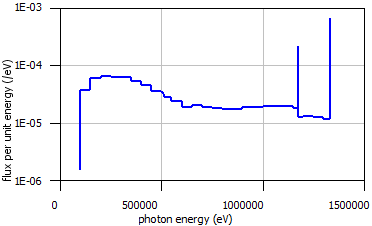

  Flux 10 cm above the cask.

:numref:`fig4-29` and :numref:`fig4-30` show the ratios of the dose rates computed using a MG calculation to the
CE calculation. Dose rates inside the cask should not be compared because the importance map is focused on
dose outside the cask, so low-energy photons are not simulated inside. The 47-group MG calculation is fairly
close to the CE-calculation in dose rate (10% high axially, 20% high radially), but the 19-group MG dose rates
are much higher than the CE. Neither of the MG calculations shows the 1.17 and 1.33 MeV lines in the energy spectra.

.. _fig4-29:

  Ratio of the 47-group MG computed dose rates to the CE dose rates (*y* = 0 left and *z* = 0 right).

.. _fig4-30:

  Ratio of the 19-group MG computed dose rates to the CE dose rates (*y* = 0 left and *z* = 0 right).

Independent spent fuel storage installation
~~~~~~~~~~~~~~~~~~~~~~~~~~~~~~~~~~~~~~~~~~~

A good example of a problem in which the dose rate needs to be known well
everywhere—--in low dose areas and high dose areas—--is an independent spent
fuel storage installation. The dose rates around these arrays of spent
fuel casks need to be evaluated over a large area of ground to
determine the boundary of the controlled area. This sample problem uses
a simplified model of a cask array, shown in :numref:`fig4-31` and
:numref:`fig4-32`, to demonstrate the FW-CADIS method for obtaining the dose
rates with reasonably low relative uncertainties over a mesh tally which
covers a very large area.

.. _fig4-31:

  Array of eight casks.

.. _fig4-32:
.. figure:: figs/MAVRIC/fig4.1.32_isfsi.newcask07.bmp
  :align: center
  :width: 30 %

  Cask detail.

Source term
^^^^^^^^^^^

The calculation of the spent fuel source term using data from the
Kewaunee nuclear power plant is described in the cask example problem
and is modeled in the first part of ``mavric.isfsi.inp`` with ORIGEN. The
result of this calculation is a binary concentration (ft71f001) file.
This file also contains a list of the group-wise neutron source term
(“total neutron spectra, neutrons/sec/basis”) and photon source term
(“gamma spectra, photons/sec/basis”) for each time step. In this example
problem, the source term for the MAVRIC calculation will be read
directly from the binary concentration file. The file contains the
concentration and source-term data at each of 64 time steps. For this
analysis, the photon source at the last time step will be used.

Input file
^^^^^^^^^^

The following is a listing of the second part (the MAVRIC input) of the
file ``mavric.isfsi.inp`` located in the SCALE ``samples\input`` directory. Note
that soil and air are included in the model to properly account for dose
near the ground. The mesh tally does not extend into the air above 2
meters since this problem is only concerned with the area near the ground where
people could be. For MAVRIC to read the ORIGEN binary concentration
file, it must be named as a Fortran unit file with a number matching the
distribution input. In this example, unit 71 is used in both the ORIGEN
input and MAVRIC input.

.. code:: scale

  =mavric
  ISFSI - forward-weighted adjoint using photon dose response
  v7-27n19g

The materials include the fresh fuel (with a density representing homogenization), concrete, steel, air, and ordinary soil.

.. code:: scale

  read composition
      wtptFuel   1 0.913717475 18         6000  0.00939719    7014  0.00528993
                      8016  9.73397641   13000  0.00715715   14000  0.01031670
                     15000  0.02227505   22000  0.00780567   24000  0.36655141
                     25000  0.01716839   26000  0.72041451   27000  0.00523824
                     28000  0.68955526   40000 15.78990702   41000  0.05130153
                     42000  0.02844690   50118  0.25877903   92235  3.03560962
                     92238 69.24080999
                   1.0 293.0 end
      orconcrete 2 1.0 293.0 end
      ss304      3 1.0 293.0 end
      dry-air    4 1.0 293.0 end
      wtptSoil   5 1.685 12  1000 3.498   6000  2.138   8016 60.826  11000 0.579
                            13000 7.489  14000 18.841  17000  0.026  19000 0.582
                            20000 0.896  22000  0.488  25000  0.097  26000 4.540
                   1.0 293.0 end
  end composition

The geometry models one cask and then repeats the cask model eight times using an array.

.. code:: scale

  read geometry
    unit  1
      zcylinder  1   90.0  228.6 -228.6
      zcylinder  2   90.0  240.6 -240.6
      zcylinder  3   90.0  280.6 -280.6
      zcylinder  4   95.0  280.6 -280.6
      zcylinder  5  100.0  280.6 -280.6
      zcylinder  6  168.0  280.6 -280.6
      zcylinder  7  170.0  280.6 -280.6
      zcylinder  8  170.0  285.6 -285.6
      cuboid    11  170  90 30 -30   280.6 255.6
      cuboid    12  30 -30 170 90    280.6 255.6
      cuboid    13  -90 -170 30 -30  280.6 255.6
      cuboid    14  30 -30 -90 -170  280.6 255.6
      cuboid    21  170  90 30 -30   -255.6 -280.6
      cuboid    22  30 -30 170 90    -255.6 -280.6
      cuboid    23  -90 -170 30 -30  -255.6 -280.6
      cuboid    24  30 -30 -90 -170  -255.6 -280.6
      cuboid    99  340.0 -340.0   340.0 -340.0   285.6 -285.6

      media  1    1   1
      media  3    1   2 -1
      media  2    1   3 -2
      media  4    1   4 -3
      media  3    1   5 -4  -11 -12 -13 -14  -21 -22 -23 -24
      media  2    1   6 -5  -11 -12 -13 -14  -21 -22 -23 -24
      media  3    1   7 -6  -11 -12 -13 -14  -21 -22 -23 -24
      media  3    1   8 -7
      media  4    1   11 -4 7
      media  4    1   12 -4 7
      media  4    1   13 -4 7
      media  4    1   14 -4 7
      media  4    1   21 -4 7
      media  4    1   22 -4 7
      media  4    1   23 -4 7
      media  4    1   24 -4 7
      media  4    1   99 -8
    boundary 99
    global unit 2
      cuboid 1   1360 -1360      680 -680       571.2    0.0
      cuboid 2   2040 -2040     1360 -1360        0.0  -60.0
      cuboid 3  12000 -12000   12000 -12000       0.0 -100.0
      cuboid 4  12000 -12000   12000 -12000   10000.0 -100.0
      array 10 1 place 1 1 1  -1020 -340 285.6
      media  2  1   2
      media  5  1   3 -2
      media  4  1   4 -3 -1
    boundary 4
  end geometry

  read array
      ara=10 nux=4 nuy=2 nuz=1  fill 1 1 1 1   1 1 1 1   end fill
  end array

The definitions block contains the photon dose response, a mesh geometry for the discrete-ordinates calculations,
a uniform mesh for the mesh tally, and the photon energy distribution read from the binary concentration
file (located on unit 71, the last time step case 64).

.. code:: scale

  read definitions
      response 6
          specialDose=9504
      end response
      gridGeometry 3
          title="exercise geometry 68x44x24 = 71808"
          xplanes -12000 -10000 -8000 -6000 -4000 -3000
                  -2040 -1870 -1700 -1530
                  -1360 -1275 -1190 -1150 -1110 -1070 -1020 -970 -930 -890 -850 -765
                  -680 -595 -510 -470 -430 -390 -340 -290 -250 -210 -170 -85
                  0 85 170 210 250 290 340 390 430 470 510 595 680
                  765 850 890 930 970 1020 1070 1110 1150 1190 1275 1360
                  1530 1700 1870 2040
                  3000 4000 6000 8000 10000 12000 end
          yplanes -12000 -10000 -8000 -6000 -4000 -2000
                  -1360 -1190 -1020 -850
                  -680 -595 -510 -470 -430 -390 -340 -290 -250 -210 -170 -85
                  0 85 170 210 250 290 340 390 430 470 510 595 680
                  850 1020 1190 1360
                  2000 4000 6000 8000 10000 12000 end
          zplanes -100 -50 -30 -15 0 25 50 75 100 200 300 400 500 570 600 800
                  900 1000 1500 2000 3000 4000 6000 8000 10000 end
      end gridGeometry
      gridGeometry 4
          title="large voxels for mesh tally"
          xLinear 24 -12000.0 12000.0
          yLinear 24 -12000.0 12000.0
          zLinear  1      0.0   200.0
      end gridGeometry

      distribution 1
  '       use result from kewaunee.origen.inp, case 64, master photon library
          special="origensBinaryConcentrationFile"
          filename=”ft71f001”
          parameters 71 64 4 end
      end distribution
  end definitions

The source can be defined in two ways. Since there are eight casks, eight
sources could be defined, each over a cylinder with a strength of
7.155×10\ :sup:`16` photon/s. In this example of eight identical
sources, one source region can be defined and then limited to only exist
in the spent fuel material (the first material) but with a strength for
all the casks of 5.724×10\ :sup:`17` photon/s.

.. code:: scale

  read sources
      src 1
          title="each cask holds 1/6 of kewaunee core"
          strength=5.724e17
          cuboid -1115 1115  435 -435  514.2  57
          mixture=1
          photons
          eDistributionID=1
      end src
  end sources

The mesh tally covers only the first 2 meters above the ground since the dose rate above that would not impact a person.

.. code:: scale

  read tallies
      meshTally 1
          title="120m from cask array center"
          photon
          gridGeometryID=4
          responseID=6
      end meshTally
  end tallies

  '-------------------------------------------------------------------------------
  ' Parameters Block
  '-------------------------------------------------------------------------------
  read parameters
      randomSeed=8655740521000041
      perBatch=940000  batches=60
  end parameters

The adjoint source is placed everywhere that the dose rate is desired—--near the ground but
not very close to or in between the casks (where people will not be).
The macro material option is used here to ensure that the discrete-ordinates calculation is more representative of the problem.

.. code:: scale

  read importanceMap
      gridGeometryID=3
      adjointSource 1
          boundingBox 12000 -12000   12000 -12000  600.0 0.0
          responseID=6
          unit=2 region=3
      end adjointSource
      respWeighting
      macromaterial
          mmTolerance=0.001
      end macromaterial
      saveExtraMaps
  end importanceMap

  end data
  end

Output
^^^^^^

The MAVRIC calculational times were 3 minutes for the forward Denovo, 3.5 minutes for the adjoint Denovo,
and 60 minutes for the Monaco forward Monte Carlo. Results for the mesh tally of dose rates are shown in
:numref:`fig4-33`. For a longer Monaco calculation (64 hr), the mesh tally results are shown in :numref:`fig4-34`.
Note that the scale for the dose rate has been adjusted to only show the values outside of the cask array.

Using the Mesh File Viewer, the distribution of relative uncertainty in a mesh tally can be plotted.
For this 1 hr calculation, 50% of the voxels in the mesh tally had less than 20% relative uncertainty.
:numref:`fig4-35` shows how the distribution of relative errors changes with longer run times.
For the 64 hr run, 90% of the voxels had less than 10% relative uncertainty.

.. _fig4-33:

  Photon dose rate values in rem/hr (left) and the relative uncertainty (right) for the area around the cask array (1 hr Monaco).

.. _fig4-34:

  Photon dose rate values in rem/hr (left) and the relative uncertainty (right) for the area around the cask array (64 hr Monaco). For the uncertainty plot, purple represents <=5%.

.. _fig4-35:

  Distribution of relative uncertainties for different run times of ``mavric.isfsi.inp`` showing the fraction of the mesh tally voxels that had less than a given amount of relative uncertainty.

TN24-P spent fuel cask
~~~~~~~~~~~~~~~~~~~~~~

For an example that uses multiple sources, user-defined distributions in
those sources, macromaterials for improved S\ :sub:`N` calculations, and
the automated variance reduction capabilities in MAVRIC, consider the
model for the TN-24P cask, as used in previous SCALE shielding
reports :cite:`wiarda_development_2009` and shown in :numref:`fig4-36`. This model contains two types
of PWR spent fuel assemblies (Types V and W, both Westinghouse 15×15
assemblies of different starting enrichments and burnups), each with
specified neutron and photon sources, in an aluminum/boron fuel basket.
The cask is made of forged steel for photon shielding with a resin layer
for neutron shielding. The model also includes three activated
hardware regions (bottom nozzle, top nozzle, and top plenum), which
consist of specified amounts of :sup:`60`\ Co (a photon source). The
task for this example is to calculate the total dose rate within 2
meters of the cask surface.

.. _fig4-36:

  MAVRIC model of the TN24-P cask. Materials: spent fuel (light and dark yellow), steels (blues), resin (green), and other metals (gray).

For MAVRIC, this means that the calculation of a dose rate mesh tally is calculated using
FW-CADIS to ensure that each voxel has low relative uncertainty,
independent of the dose rate. Without MAVRIC, the calculation of dose
rate everywhere in three dimensions would be too challenging. Most
likely, the dose rate would be evaluated with reasonable uncertainty at
only a few locations. In fact, with analog calculations, this example
would be a very difficult problem since most source particles never
leave the cask, just as in the real-life situation. This type of problem
really benefits from the CADIS-biased source distribution, in which
source particles deep inside the cask are sampled very rarely since they
do not contribute significantly to the response.

Input file
^^^^^^^^^^

The following is a partial list of the file ``mavric.tn24p.inp`` located
in the SCALE ``samples\input`` directory. This calculation will use the
coarse-group shielding library for all of the importance map
calculations but then will use the fine-group library for the final Monaco
step. The full geometry and source distributions are not printed here
due to their length.

.. code:: scale

  =mavric
  Monaco/MAVRIC Training - Exercise 3. Graphite Shielding Measurements Revisited
  v7-27n19g
  read composition
      …
  end composition

  read geometry
      …
  end geometry

  read array
      …
  end array

The definitions block includes three responses (neutron, photon,
total), two grid geometries (one for the importance map calculations
and one for a mesh tally), one cylindrical mesh for a mesh tally,
five distributions for the energy spectra of the sources, and two
distributions for the spatial distributions of the fuel assembly
sources.

.. code:: scale

  read definitions
      response 1  specialDose=9029  end response
      response 2  specialDose=9504  end response
      response 3  specialDose=9729  end response

      gridGeometry 1
          title="for discrete ordinates calculations  48 x 48 x 61"
          …
      end gridGeometry
      gridGeometry 2
          title="for mesh tallies"
          xLinear 66 -330 330
          yLinear 66 -330 330
          zLinear 90 -435 465
      end gridGeometry
      cylGeometry 3
          radiusLinear 66 0 330
          degreeLinear 72 0 360
          zLinear 90 -435 465
      end cylGeometry

      distribution 1
          title="neutron energy distribution for W assembly"
          abscissa … end
          truePDF … end
      end distribution
      distribution 2
          title="photon energy distribution for W assembly"
          abscissa … end
          truePDF … end
      end distribution

      distribution 3
          title="neutron energy distribution for V assembly"
          abscissa … end
          truePDF … end
      end distribution
      distribution 4
          title="photon energy distribution for V assembly"
          abscissa … end
          truePDF … end
      end distribution
      distribution 5
          title="cobalt-60 gammas/decay"
          special="origensDiscreteGammas"
          parameters 27 60 end
      end distribution

      distribution 101  special="pwrNeutronAxialProfile"  end distribution
      distribution 102  special="pwrGammaAxialProfile"   end distribution

      runSampleTests   makeCharts
  end definitions

Seven sources are defined—--a neutron and photon source for each type of fuel assembly, and three activated hardware regions.

.. code:: scale

  read sources
      src 1
          title="W assembly, neutron source"
          neutrons
          strength=1.6472e9
          zCylinder 71.0  182.9 -182.9
          zDistributionID=101  zScaleDist
          mixture=2
          eDistributionID=1
      end src
      src 2
          title="W assembly, photon source"
          photons
          strength=5.3638e16
          zCylinder 71.0  182.9 -182.9
          zDistributionID=102  zScaleDist
          mixture=2
          eDistributionID=2
      end src

      src 3
          title="V assembly, neutron source"
          neutrons
          strength=7.1927e8
          zCylinder 63.0  182.9 -182.9
          zDistributionID=101  zScaleDist
          mixture=12
          eDistributionID=3
      end src
      src 4
          title="V assembly, photon source"
          photons
          strength=1.8234e16
          zCylinder 63.0  182.9 -182.9
          zDistributionID=102  zScaleDist
          mixture=12
          eDistributionID=4
      end src
       src 6
          title="bottom nozzel Co-60 source"
          photons
          strength=1.7960e14
          zCylinder 71.0 -186 -193
          mixture=9
          eDistributionID=5
      end src

      src 7
          title="top nozzle Co-60 source"
          photons
          strength=1.0103e14
          zCylinder 71.0 212.8 203.9
          mixture=10
          eDistributionID=5
      end src

      src 8
          title="plenum Co-60 source"
          photons
          strength=6.3137e13
          zCylinder 71.0 201.0 182.9
          mixture=11
          eDistributionID=5
      end src
  end sources

Four mesh tallies are used to collect the neutron dose rate, the photon dose rate, and the total dose rate.

.. code:: scale

   read tallies
    meshTally 1
        neutron
        gridGeometryID=2
        responseID=1
        noGroupFluxes
    end meshTally
    meshTally 2
        photon
        gridGeometryID=2
        responseID=2
        noGroupFluxes
    end meshTally
    meshTally 11
        neutron
        cylGeometryID=3
        responseID=1
        noGroupFluxes
    end meshTally
    meshTally 12
        photon
        cylGeometryID=3
        responseID=2
        noGroupFluxes
    end meshTally
   end tallies

The goal of this example is to calculate the total dose outside the
cask. Therefore, the adjoint source uses the total dose rate response
function for its energy component, whereas for the spatial component, it
uses a large block around the cask. Note the “mixture=” keyword, which
restricts the adjoint source to only exist where the material is air
(13). There is no need to put adjoint source deep in the cask since the
dose rates inside the cask are not of interest. Response weighting is
used to put more adjoint source in the low dose areas outside the cask.
Note that since this area is air, not many interactions/scatter take
place, so a great balance in relative uncertainties
near and far from the cask should not be expected. Macromaterials are used to improve the
results from the discrete-ordinates calculations, which should improve
the FOM of the final Monaco calculation. The geometry images in :ref:`macromaterials` are taken from this problem.

.. code:: scale

  read importanceMap
      gridGeometryID=1
      adjointSource 1
          boundingBox  330 -330   330 -330  465 -435
          responseID=3
          mixture=13
      end adjointSource
      respWeighting
      reduce
      subCells=3
      macromaterial
          mmTolerance=0.001
      end macromaterial
  end importanceMap

  end data
  end

Output
^^^^^^

The distributions used by the source descriptions of the TN24-P model
are shown in :numref:`fig4-38`, and the responses used in this problem are
shown in :numref:`fig4-37`. :numref:`fig4-39` and :numref:`fig4-40` show the total
(neutron + photon) dose rate outside the TN24-P cask, up to 2 meters
from each surface using rectilinear and cylindrical mesh tallies
with 10 cm voxels. Uncertainties in the computed dose rates were 3–4%
after this 16 hr calculation. The scale of the figure was adjusted to
only show the dose rate outside the cask; dose rates inside the cask
went as high as 6×10\ :sup:`5` rem/hr. Likewise, the scale of the
uncertainties ranged from 0 to 10% to highlight the uncertainties
outside the cask. Relative uncertainties inside the cask were much
higher (white areas) since those areas were deemed unimportant by the
chosen adjoint source. Obtaining dose rates on a 10 cm mesh would not be
achievable without the variance reduction capabilities of MAVRIC.

.. _fig4-37:

  Neutron (left) and photon (right) dose rate response functions.

.. _fig4-38:

  Distributions in the TN24-P model.

.. _fig4-39:
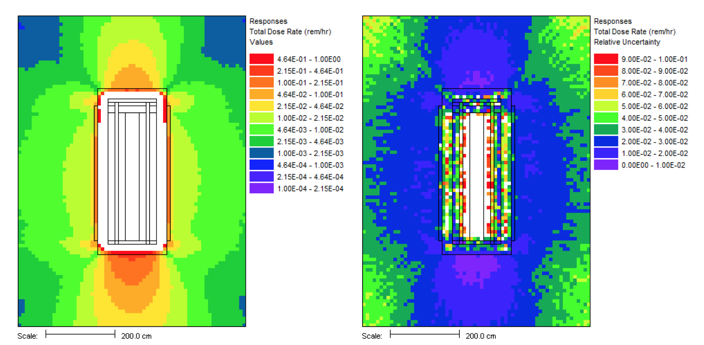

  Rectilinear mesh tally of total dose rate (rem/hr) and its relative uncertainty along the x=0 plane.

.. _fig4-40:
.. figure:: figs/MAVRIC/4.40.png
  :align: center

  Cylindrical mesh tally of total dose rate (rem/hr) and its relative uncertainty along the θ=0° plane.

.. bibliography:: /bibs/mavric.bib
