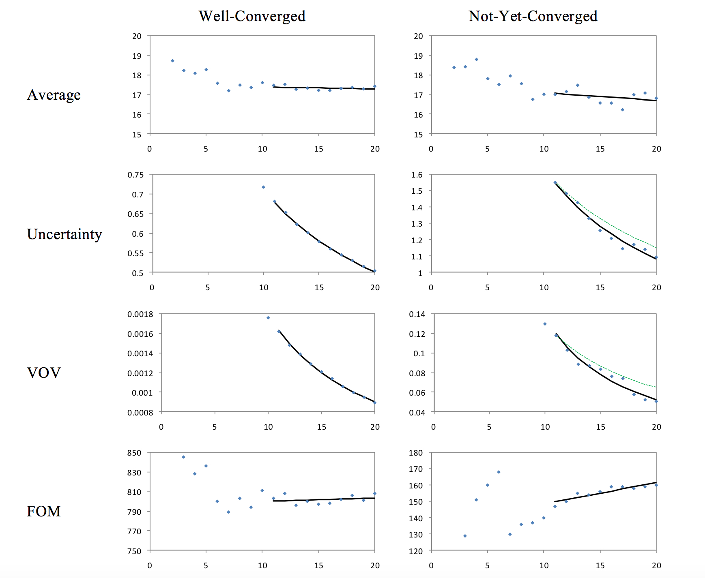
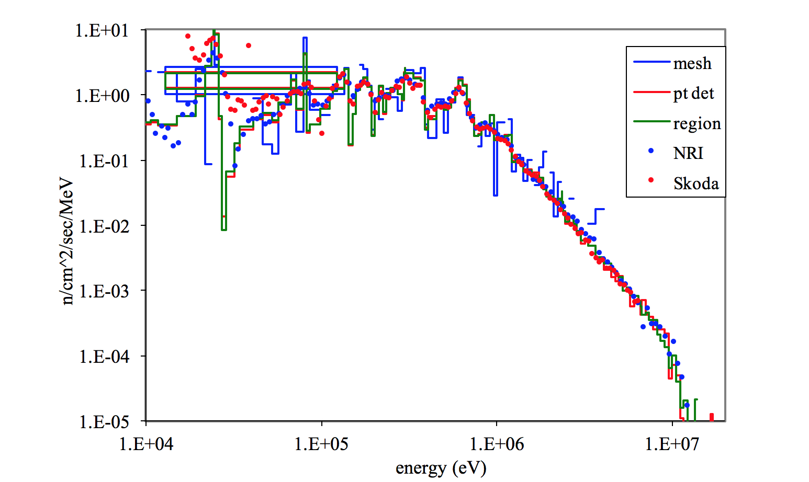
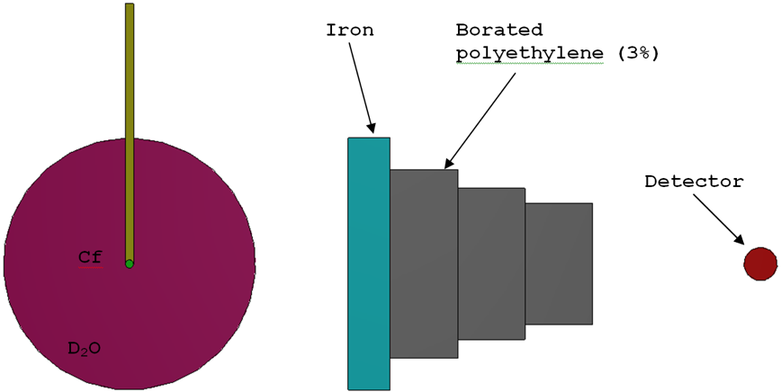
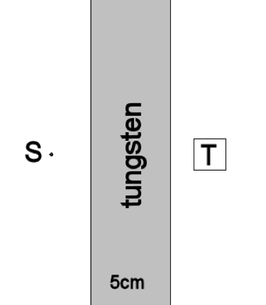

.. _Monaco:

Monaco: A Fixed-Source Monte Carlo Transport Code for Shielding Applications
============================================================================

*D. E. Peplow and C. Celik*

Monaco is a general-purpose, fixed-source, Monte Carlo shielding code
for the SCALE package. It is a functional module that uses either AMPX
cross sections or continuous energy libraries to calculate neutron and
photon fluxes and responses to specific geometry regions, to point
detectors and to mesh tallies. Basic multigroup transport methods are
inherited from Monaco’s predecessor, MORSE. Continuous energy physics
has been incorporated into the code with a new physics package that uses
the same CE data as CE-KENO-VI, with extensions for simulating photons.
Variance reduction capabilities include source biasing and weight
windows, either by geometry region or by using a mesh-based importance
map. User input includes the cross section file unit number; the
geometry description using the SCALE General Geometry Package; source
description as a function of position, energy, and direction; tally
descriptions (fluxes in which regions, at what point detectors, or over
what mesh grids); and response functions (functions of energy). Output
consists of tables detailing the region and point detector fluxes (and
their responses), as well as files for mesh tallies.

Introduction
------------

Monaco is a neutron/photon, fixed-source Monte Carlo shielding code for
the SCALE code package. Monaco uses the SCALE General Geometry Package
(SGGP)---the same geometry description as KENO-VI. Monaco has many
options available to the user for specifying source distributions, many
tally options, and many variance reduction capabilities. Monaco was
originally based on the MORSE Monte Carlo code but has been extensively
modified to modernize the coding, increase the number of capabilities in
terms of sources and tallies, and allow for either multigroup or
continuous energy (CE) transport through the use of the new SCALE CE
Modular Physics Package (SCEMPP).

Monaco was developed to address a number of long-term goals for the
Monte Carlo shielding capabilities in SCALE. The principal goals for
this project included (1) unification of geometric descriptions between
the SCALE shielding and criticality Monte Carlo codes,
(2) implementation of a mesh-based importance map and mesh-based biased
source distribution so that automated variance reduction could be used,
and (3) establishment of a code using modern programming practices from
which to continue future development. The addition of a
continuous-energy transport capability is a significant change as well.

Monaco is the key component of the MAVRIC sequence, which also uses
Denovo to create the mesh-based importance map and mesh-based biased
source distribution for general 3-D automated variance reduction. See
the MAVRIC chapter for more information.

Monaco Capabilities
-------------------

Monaco has a wide range of source descriptions and tallies for
performing general radiation transport calculations. Note that Monaco
can work with either the AMPX-based multigroup libraries or the newer
AMPX-based CE libraries. Note that for CE calculations, tallies still
employ a multigroup energy structure to store and report results.

Source Descriptions
~~~~~~~~~~~~~~~~~~~

Multiple sources can be defined for a Monaco calculation. Sampling of
the different sources can be biased by the user. Each source is
specified by its spatial distribution, its energy distribution, its
directional distribution, and its strength. Distributions defined by the
user can also be biased and can be used multiple times by different
sources. The Monaco tallies assume that the sources all have units of
particles/second. If the source strengths are given in other units, the
user will have to incorporate the proper conversion to the tally results
and remember to interpret the results accordingly.

Distributions
^^^^^^^^^^^^^

Two types of basic distributions are used by Monaco – binned histograms
and a set of value/function pairs. The binned histogram type is defined
by :math:`n + 1` bin boundaries and *n* values, representing the
integrated amount in each bin. For the true distribution\ :math:`f(x)`,
the bin boundaries
:math:`\left\lbrack x_{0},\ x_{1},\ \ldots,\ x_{n} \right\rbrack` and
the integrated amounts
:math:`F_{i} = \ \int_{x_{i - 1}}^{x_{i}}{f\left( x \right)\text{dx}}`
are given. The distribution will be normalized by Monaco after reading.
The user can optionally bias a binned histogram distribution by
supplying one of the following: the biased sampling distribution
amounts,
:math:`G_{i} = \ \int_{x_{i - 1}}^{x_{i}}{g\left( x \right)\text{dx}}`;
the importance of each bin, :math:`I_{i}`; or the suggested weight for
each bin, :math:`w_{i}`.

Based on what type of input is given, Monaco will compute a properly
normalized probability distribution function for sampling. If the
importances are given, the sampling distribution is computed as

.. math::
  :label: Monaco-1

  G_{i} = \frac{I_{i}F_{i}}{\sum_{i}^{}{I_{i}F_{i}}}

If suggested weights are given, then the sampling distribution is
computed as

.. math::
  :label: Monaco-2

  G_{i} = \frac{\frac{F_{i}}{w_{i}}}{\sum_{i}^{}\frac{F_{i}}{w_{i}}}

for bins with non-zero weight. The sampling distribution for bins with a
suggested weight of zero are set to :math:`G_{i} = \ 0`. When sampled,
particles are assigned a weight of :math:`\frac{F_{i}}{G_{i}}`.

The second type of distribution that a user can define is for a series
of point values of a function. For a set of :math:`n + 1` point pairs,
:math:`\left( x_{i},\ f_{i} \right)` for
:math:`i \in \left\lbrack 0\ldots n \right\rbrack`, defining :math:`n`
intervals, a distribution can be made by linearly interpolating between
adjacent point pairs. This type of distribution can also be biased by
supplying one of the following: the biased sampling distribution
function value :math:`g_{i}` at each point, the importance of each
point, :math:`I_{i}`; or the suggested weight for each point,
:math:`w_{i}`. Similar to above, if importances or weights are given,
Monaco computes the biased distribution for sampling. For the
value/function point pairs type of distribution, the weight assigned to
the sampled particle is a continuous function.

Some commonly used distributions are built into Monaco and can be used
by simple keywords. Monaco can produce a graph of any distribution so
that the user can verify that the input was entered correctly.

Spatial energy and directional attributes
^^^^^^^^^^^^^^^^^^^^^^^^^^^^^^^^^^^^^^^^^

Each Monaco source is described by three separable components: spatial,
energy and directional.

The spatial component of a source in Monaco is simple but very flexible.
First, the general shape of the source region is defined in global
coordinates. The basic solid shapes and their allowed degenerate cases
are listed in :numref:`Monaco-tab1`. The user can reference any of the defined
distributions to describe the source distribution in any coordinate
(*x*, *y*, and *z* for cuboids, *r* and *z* for cylinders and *r* for
spheres) to use for sampling or leave the source distribution as uniform
over each dimension for the solid shape. The source region can be
limited by the underlying SGGP geometry variables of unit, media, and
mixture. This way, source volumes (or planes, lines, or points) can be
defined that are independent or dependent on the model geometry. A
cylinder or cylindrical shell region can be oriented with its axis in
any direction.

.. _Monaco-tab1:
.. table:: Available source shapes and their allowed degenerate cases

  +-----------------------------------+-----------------------------------+
  | **Shape**                         | **Allowable degenerate cases**    |
  +===================================+===================================+
  | cuboid                            | rectangular plane, line, point    |
  +-----------------------------------+-----------------------------------+
  | cylinder                          | circular plane, line, point       |
  +-----------------------------------+-----------------------------------+
  | cylindrical shell                 | cylinder, planar annulus,         |
  |                                   | circular plane, cylindrical       |
  |                                   | surface, line, ring, point        |
  +-----------------------------------+-----------------------------------+
  | sphere                            | point                             |
  +-----------------------------------+-----------------------------------+
  | spherical shell                   | sphere, spherical surface, point  |
  +-----------------------------------+-----------------------------------+

Monaco samples the source position using either the given distributions
or uniformly over the basic solid shape and then uses rejection if any
of the optional SGGP geometry limiters have been specified. For sources
that are confined to a particular unit, media, or mixture, users should
make sure the basic solid shape tightly bounds the desired region for
efficient sampling.

For the energy component of each source, either type of distribution
described above can be used. Biasing can be used in the energy component
of the source as well. The Watt spectrum is a built-in distribution
which uses the Froehner and Spencer :cite:`froehner_method_1981` method for sampling. If the
defined energy distribution has point(s) that are out of the problem’s
energy range for a CE problem, these points will be rejected in the
source energy sampling and an error message will be generated. The
warnings will be suppressed if the number of rejected source points
exceeds a pre-defined threshold (1000).

Distributions can be used to define the directional component of the
source. A function of the cosine of the polar angle, with respect to
some reference direction in global coordinates, can be used by Monaco.
If no directional distribution is specified, the default is an isotropic
distribution (one directional bin from *µ*\ = −1 to *µ*\ =1). The
default reference direction is the positive *z*-axis (<0,0,1>).

Monaco mesh source map files
^^^^^^^^^^^^^^^^^^^^^^^^^^^^

An alternative to specifying the separate spatial and energy
distributions, a Monaco mesh source file can be used. A mesh source
consists of a 3D Cartesian mesh that overlay the geometry. Each mesh
cell has some probability of emitting a source particle, and within each
mesh cell, a different energy distribution can be sampled. Position
within each mesh cell is sampled uniformly, and the emission direction
is sampled from the standard directional distribution. Monaco mesh
source files are typically produced by the MAVRIC sequence or by other
Monaco calculations (see the mesh source saver option in the source
input). For a source constructed from the separable spatial and energy
distributions, Monaco can create a mesh source file which can then be
visualized using the Mesh File Viewer. This is a convenient way to
ensure that the source being used is what was intended.

Tallies
~~~~~~~

Monaco offers three tally types: point detectors, region tallies, and
mesh tallies. Each is useful in determining quantities of interest in
the simulation. Any number of each can be used, up to the limit of
machine memory. The tallies will compute flux for each group, the total
neutron and total photon fluxes, and any number of dose-like responses.
A typical dose-like response, *R*, is the integral over energy of the
product of a response function, :math:`f\left( E \right)`, and the flux,
:math:`\phi\left( E \right)`.

 .. math::
  :label: Monaco-3

  R = \int_{}^{}{f\left(E \right)\phi \left( E \right)\ } dE

In multigroup calculations, the total response would be expressed as the
sum over all groups :math:`R = \sum_{}^{}{f_{g}\phi_{g}}`. For CE
calculations, tallies can be segmented into energy and time bins which
can be thought of as “groups”. All three of the tally types can be
scaled with a constant – for example, to account for units conversions.

Tally statistics
^^^^^^^^^^^^^^^^

The three Monaco tallies are really just collections of simple and
extended tallies for each group, each total, and each group contribution
to a response or total response. The simple tally works in the following
way: a history score :math:`h_{i}` is zeroed out at the start of history
:math:`i`. During the course of the history, when an event occurs during
substep :math:`j`, a score consisting of some contribution
:math:`c_{\text{ij}}` weighted by the current particle weight
:math:`w_{\text{ij}}` is calculated and added to :math:`h_{i}`. At the
end of the history, the history score is the total weighted score for
each substep :math:`j` in the history.

 .. math::
  :label: Monaco-4

  h_{i} = \sum_{j}^{}w_{\text{ij}}c_{\text{ij}}

Note that the values for the contribution :math:`c_{\text{ij}}` and when
it is added to the accumulator are determined by the tally type. At the
end of the each history, the history score is added to two accumulators
(power sums) - the first accumulator is for finding the tally average,
:math:`S_{1}`, and the second accumulator is for finding the uncertainty
in the tally average, :math:`S_{2}`.

 .. math::
   :label: Monaco-5

   S_{1} = \ \sum_{i}^{}h_{i}^{\ }

 .. math::
   :label: Monaco-6

   S_{2} = \ \sum_{i}^{}h_{i}^{2}

At the end of all :math:`N` histories, the second sample central moment
is found from the power sums

 .. math::
   :label: Monaco-7

    m_{2} = \frac{S_{2}}{N} - \ \frac{S_{1}^{2}}{N^{2}}

and then the tally average is computed as
:math:`\overline{x} = \frac{S_{1}}{N}` and the uncertainty in the tally
average is :math:`u = \sqrt{\frac{m_{2}}{N}}`.

The extended tally uses four accumulators – the first and second are the
same as the simple tally – with the third and fourth accumulators used
for finding the variance of the variance (VOV). These extra
accumulators, :math:`S_{3}` and :math:`S_{4}`, are calculated as

 .. math::
   :label: Monaco-8

    S_{3} = \ \sum_{i}^{}h_{i}^{3}

 .. math::
   :label: Monaco-9

    S_{4} = \ \sum_{i}^{}h_{i}^{4}

At the end of all :math:`N` histories, the tally average
:math:`\overline{x}\ `\ and uncertainty in the tally average :math:`u`
are found in the same way as a simple tally. For the VOV calculation,
the third and fourth sample central moments are found as

At the end of all :math:`N` histories, the tally average
:math:`\overline{x}\ `\ and uncertainty in the tally average :math:`u`
are found in the same way as a simple tally. For the VOV calculation,
the third and fourth sample central moments are found as

 .. math::
   :label: Monaco-10

   m_{3} = \frac{S_{3}}{N} - \frac{3S_{1}S_{2}}{N^{2}} + \frac{2S_{1}^{3}}{N^{3}}

.. math::
  :label: Monaco-11

  m_{4} = \frac{S_{4}}{N} - \frac{4S_{1}S_{3}}{N^{2}} + \ \frac{6S_{1}^{2}S_{2}}{N^{3}} - \ \frac{3S_{1}^{4}}{N^{4}}

and then the VOV :cite:`pederson_confidence_1997` and figure-of-merit (FOM) are found using

 .. math::
   :label: Monaco-12

   \mathrm{\text{VOV}} = \frac{m_{4} - \ m_{2}^{2}}{Nm_{2}^{2}}

 .. math::
   :label: Monaco-13

   \mathrm{\text{FOM}} = \ \frac{1}{\left( \frac{u}{\overline{x}} \right)^{2} \ T}

where *T* is the calculation time (in minutes).

Extended tallies are used for the total neutron flux, total photon flux
and any responses for the Monaco tallies. Simple tallies are used for
each group’s flux and each group’s contribution to a response.

Detailed, group-wise results for each tally are saved to separate files
at the end of each batch of particles. Users can view these files (in
the SCALE temporary directory) as the Monaco simulation progresses.
Summaries of the extended tallies appear in the final Monaco output
file.

Statistical tests
^^^^^^^^^^^^^^^^^

Statistical tests are performed on the extended tallies at the end of
each batch. Results for each batch are stored in files and the results
for the final batch are shown in the main output tally summary. The six
tests are:

+-------------+-------------+-------------+-------------+------------------+
|             | **Quantity**| **Test**    | **Goal**    | **Within**       |
|             |             |             |             |                  |
+=============+=============+=============+=============+==================+
| 1.          | mean        | relative    | = 0.00      | ±0.10            |
|             |             | slope of    |             |                  |
|             |             | linear fit  |             |                  |
+-------------+-------------+-------------+-------------+------------------+
| 2.          | standard    | exponent of | = -0.50     | .. math::        |
|             | deviation   | power fit   |             |    R^{2} > 0.99  |
+-------------+-------------+-------------+-------------+------------------+
| 3.          | relative    | final value | < 0.05      |                  |
|             | uncertainty |             |             |                  |
+-------------+-------------+-------------+-------------+------------------+
| 4.          | relative    | exponent of | = -1.00     | .. math::        |
|             | VOV         | power fit   |             |  R^{2} > 0.95    |
+-------------+-------------+-------------+-------------+------------------+
| 5.          | relative    | final value | < 0.10      |                  |
|             | VOV         |             |             |                  |
+-------------+-------------+-------------+-------------+------------------+
| 6.          | figure-of-m | relative    | = 0.00      | ±0.10            |
|             | erit        | slope of    |             |                  |
|             |             | linear fit  |             |                  |
+-------------+-------------+-------------+-------------+------------------+

For the tests that are fit to a function with respect to batch (1, 2, 4,
and 6), only the last half of the simulation is used. The basis for
these tests is that in a well-behaved Monte Carlo, the mean should not
increase or decrease as a function of the number of histories
(:math:`N`), the standard deviation should decrease with
:math:`\frac{1}{\sqrt{N}}`, the variance of the variance should decrease
with :math:`\frac{1}{N}` and the figure-of-merit should neither

increase or decrease as a function of the number of histories
(proportional to time). For tests 2 and 4, the coefficient of
determination, :math:`R^{2}`, from a forced fit to a function with the
right exponent is used as the tally test.

Point detector tallies
^^^^^^^^^^^^^^^^^^^^^^

Point detectors are a form of variance reduction in computing the flux
or response at a specific point. At the source emission site and at
every interaction in the particle’s history, an estimate is made of the
probability of the particle striking the position of the point detector.
For each point detector, Monaco tallies the uncollided and total flux
for each energy group, the total for all neutron groups, and the total
for all photon groups. Any number of optional dose-like responses can be
calculated as well.

Multigroup
..........

After a source particle of group *g* is started, the distance *R*
between the source position and the detector position is calculated.
Along the line connecting the source and detector positions, the sum of
the distance *s\ j* through each region *j* multiplied by the total
cross section :math:`\Sigma_{j}^{g}`\ for that region is also
calculated. The contribution *c\ g* to the uncollided flux estimator is
then made to the tally for group *g*.

.. math::
  :label: Monaco-14

  c_{g} = \frac{1}{4\pi R^{2}}\mathrm{\exp}\left( - \sum_{j}^{}{s_{j}\Sigma_{j}^{g}} \right)

Continuous Energy
.................

After a source particle with energy *E* is started, the distance *R*
between the source position and the detector position is calculated. For
each bin :math:`g` of the tally energy structure, a specific energy
:math:`E_{g}` is sampled uniformly within the bin. Along the line
connecting the source and detector positions, the sum of the distance
*s\ j* through each region *j* multiplied by the total cross section
:math:`\Sigma_{j}\left( E_{g} \right)` for that region. The contribution
*c\ g* to the uncollided flux estimator is then made to the tally for
group *g*. total cross section :math:`\Sigma_{j}\left( E \right)` :

.. math::
  :label: Monaco-15

  c_{g} = \frac{1}{4\pi R^{2}}\mathrm{\exp}\left( - \sum_{j}^{}{s_{j}\Sigma_{j}\left( E \right)} \right)

Only source particles contribute to the uncollided flux tally. At each
interaction point during the life of the particle, similar contributions
are made to each of the tallies. For each group *g′* that the particle
could scatter into and reach the detector location, a contribution is
made that also includes the probability to scatter from the current
direction towards the detector and having the energy change from group
*g* to group *g′.*

This type of tally is costly, since ray-tracing through the geometry
from the current particle position to the detector location is required
many times over the particle history. Point detectors should be located
in regions made of void material, so that contributions from
interactions arbitrarily close to the point detector cannot overwhelm
the total estimated flux (as
:math:`\frac{1}{4\pi R^{2} \rightarrow \infty}`).

Care must be taken in using point detectors in deep penetration problems
to ensure that the entire phase space that could contribute has been
well sampled—so that the point detector is not underestimating the flux
by leaving out areas far from the source but close to the point detector
position. One way to check this is by examining how the tally average
and uncertainty change with each batch of particles used in the
simulation. Large fluctuations in either quantity could indicate that
the phase space is not being sampled well.

Region tallies
^^^^^^^^^^^^^^

Region tallies are used for calculating the flux and/or responses over
one of the regions listed in the SGGP geometry. Both the track-length
estimate of the flux and the collision density estimate of the flux are
calculated—and for each, the region tally contains simple tallies for
finding flux in each group, the total neutron flux, and the total photon
flux. For each of the optional response functions, the region tally also
contains simple tallies for each group and the total response.

For the track-length estimate of flux, each time a particle of energy
:math:`E` moves through the region of interest, a contribution of
:math:`l` (the length of the step in the region) is made to the history
score for the simple tally for flux for tally group \ *g*. The same
contribution is made for the history score for the simple tally for
total particle flux, neutron or photon, depending on the particle type.

If any optional response functions were requested with the tally, then
the contribution of :math:`\text{lf}\left( E \right)`\ is made for the
response group, where :math:`f\left( E \right)` is the response function
value for energy :math:`E`. The history score for the total response
function is also incremented using :math:`\text{lf}\left( E \right)`.

At the end of all of the histories, the averages and uncertainties of
all of the simple tallies for fluxes are found for every group and each
total. These results then represent the average track-length over the
region. To determine flux, these results are divided by the volume of
the region. If the volume :math:`V` of the region was not given in the
geometry input nor calculated by Monaco, then the tally results will be
just the average track lengths and their uncertainties. A reminder
message is written to the tally detail file if the volume of the region
was not set.

For the collision density estimate of the flux, each time a particle of
energy :math:`E` has a collision in the region of interest, a
contribution of :math:`\frac{1}{\Sigma}` (the reciprocal of the total
macroscopic cross section) is made to the history scores for the simple
tally for flux for tally energy group *g* and for the total particle
flux. At the end of the simulation, the averages and uncertainties of
all of the simple tallies for every group flux and total flux are found
and then divided by the region volume, if available.

Similar to the point detector tallies, region tallies produce a file
listing the tally average and uncertainty at the end of each batch of
source particles (a \*.chart file). This file can be plotted using the
simple 2-D plotter (ChartPlot) to observe the tally convergence
behavior.

Mesh tallies
^^^^^^^^^^^^

For a D Cartesian mesh or a cylindrical mesh (independent of the SGGP
geometry), Monaco can calculate the track-length estimate of the flux.
Since the number of cells (voxels) in a mesh can become quite large, the
mesh tallies are not updated at the end of each history but are instead
updated at the end of each batch of particles. This prevents the mesh
tally accumulation from taking too much time but means that the estimate
of the statistical uncertainty is slightly low.

Like the other tallies, mesh tallies can calculate optional response
functions.

Since a mesh tally consists of many actual tallies, the statistical
tests are a bit more complex than for the region and point detector
tallies. Several statistical quantities and tests are used in Monaco
similar to those in several recent studies :cite:`kiedrowski_statistical_2011,kiedrowski_evaluating_2011` which
look at a distribution of relative variances over the mesh tally. In
Monaco, the basis of the statistical tests center on the distribution of
relative uncertainties and its mean, :math:`\overline{r}`, of the voxels
(:math:`V`) with score.

.. math::
  :label: Monaco-16

  \overline{r} = \frac{1}{V}\sum_{}^{}R_{i}

where :math:`R_{i}` is the relative uncertainty of the flux or dose in
voxel :math:`i`. If every voxel has been sampled well and its relative
uncertainty :math:`R_{i} \propto \frac{1}{\sqrt{N}}`, then the mean
relative uncertainty of the voxels should also behave as
:math:`\frac{1}{\sqrt{N}}`. The variance of the mean relative
uncertainty can be calculated and a figure of merit (FOM) for the mesh
tally can be constructed using

.. math::
  :label: Monaco-17

  FOM = \frac{1}{{\overline{r}}^{2}T}

with the time\ :math:`\text{\ T}` in minutes. The four tests measure
over the simulation: 1) if :math:`\zeta`, the fraction of voxels with
non-zero score, is constant; 2) if the mean relative uncertainty is
decreasing as :math:`\frac{1}{\sqrt{N}}` (as measured by the coefficient
of determination, :math:`R^{2}`, of a fit to a curve with power of
-0.5); 3) if the variance of the mean relative uncertainty is decreasing
with :math:`\frac{1}{N}`; and 4) if the FOM is constant.

+----+------------------------------------------------------------+------------------------------+----------+---------------------------+
|    | Quantity                                                   | Test                         | Goal     | Within                    |
+====+============================================================+==============================+==========+===========================+
| 1. | :math:`\zeta`, fraction with score                         | relative slope of linear fit | = 0.00   | ±0.10                     |
+----+------------------------------------------------------------+------------------------------+----------+---------------------------+
| 2. | :math:`\overline{r}`, mean relative uncertainty            | exponent of power fit        | = -0.50  | .. math:: R^{2} > 0.99    |
+----+------------------------------------------------------------+------------------------------+----------+---------------------------+
| 3. | variance of :math:`\overline{r}`                           | exponent of power fit        | = -1.00  | .. math:: R^{2} > 0.95    |
+----+------------------------------------------------------------+------------------------------+----------+---------------------------+
| 4. | figure-of-merit                                            | exponent of power fit        | = 0.00   | ±0.10                     |
+----+------------------------------------------------------------+------------------------------+----------+---------------------------+

For non-uniform meshes (especially cylindrical), these tests may not be
the best measure of performance since different size voxels will have a
wider variety of relative uncertainties. The user is also cautioned that
if there are individual voxels within the mesh tally that have relative
uncertainties that are not decreasing as :math:`\frac{1}{\sqrt{N}}`,
then the mesh tally statistical tests will not be meaningful. It is
ultimately up to the user to decide if the mesh tally is performing well
(is the goal of the mesh tally just to calculate dose, not flux?; are
all spatial areas of the mesh tally equally important?; are all
magnitudes of the flux or response values equally important?; etc.)

Mesh tallies can be viewed with the Mesh File Viewer, a Java utility
that can be run from GeeWiz (on PC systems) or can be run separately (on
any system). The Mesh File Viewer will show the flux for each group, the
total flux for each type of particle and the optional responses.
Uncertainties and relative uncertainties can also be shown for mesh
tallies using the Mesh File Viewer. For more information on the Mesh
File Viewer, see its on-line documentation.

Continuous Energy Transport
~~~~~~~~~~~~~~~~~~~~~~~~~~~

Using multigroup data in Monte Carlo transport calculations is generally
sufficient for most problems (both shielding and criticality). Many of
the reaction cross sections vary slowly with energy, so energy “groups”
can be made with one set of properties for the group. Multigroup
treatments can further simplify radiation transport by combining the
different types of reactions that can occur into a simple scattering
matrix – particles then have certain probabilities to scatter from their
current energy group to another energy group. If the user is not
interested in knowing which specific type of interaction happened at
each collision, this simplification can increase calculation efficiency.

One major drawback of the multigroup approach is in representing discrete gammas,
such as the decay radiation from common isotopic sources.  Consider a simple shielding
simulation using cobalt-60.  This isotope gives off two high-energy gamma rays when it decays
(1173230 eV with intensity 99.85% and 1332490 eV with intensity 99.9826%).  In the SCALE multigroup
calculations, a cobalt-60 source spectrum is represented by a broad pdf, controlled by the group structure.
This is shown in :numref:`fig8-1`. for the fine 47-group structure and the broad 19-group structure.

.. _fig8-1:

  The multigroup representation of a cobalt-60 source.

Note that in both group structures, 1.33 MeV is a group boundary, so the
1332490 eV line is represented by group that covers higher energies. The
cross section for that group is lower than the cross section for the
specific line, so multigroup transport calculations will tend to
overestimate the number of photons penetrating a shield, which will
overestimate dose rates.

Using CE and the two multigroup libraries, the total cross sections for the cobalt lines are listed in :numref:`tab8-2`.
:numref:`fig8-2`. shows the total cross section of photons in tungsten, in both CE and the two SCALE multigroup structures.
On the whole, the multigroup data represents the CE data well.  :numref:`fig8-3`. shows the same cross section information
near the two cobalt lines, which shows how the multigroup cross sections average over quite large energy ranges.

.. _tab8-2:
.. table:: Total macroscopic cross section in tungsten (/cm).
  :align: center

  +----------+------------+------------+
  |          | 1173230 eV | 1332490 eV |
  +==========+============+============+
  | SCALE CE | 1.03353    | 0.94864    |
  +----------+------------+------------+
  | SCALE 47 | 1.09066    | 0.92743    |
  +----------+------------+------------+
  | SCALE 19 | 1.05167    | 0.89289    |
  +----------+------------+------------+

The small differences in cross section can make large differences in the
transport. Consider just 5 cm of tungsten. Using the cross sections in
:numref:`tab8-2`, the attenuation (:math:`e^{- \mu x}`) of either line can
vary by 30%.

In addition to source representation problems, multigroup transport is
not adequate for applications where line spectra are measured. Because
of the group structure, tally results will be averaged out within a
group. With the fixed boundaries, specific lines in the tallies will not
be able to be seen. For examples, in the 19-group library, there is no
group around the 511 keV annihilation gammas – they are averaged in with
other photons from 400 to 600 keV. No multigroup structure could contain
thin groups around every line of interest.

.. _fig8-2:

  Photon total cross section in tungsten.  The energies of the cobalt-60 are displayed as lines at 1173230 and 1332490 eV.

.. _fig8-3:

  Photon total cross section in tungsten, near the cobalt lines.  The energies of the cobalt-60 are displayed as lines at 1173230 and 1332490 eV.

A sample problem involving a cobalt source and a slab of tungsten will
compare the use of continuous-energy transport to multigroup transport,
to demonstrate the large difference in results for single-line sources.
For distributions, differences between multigroup and continuous-energy
may not be very significant.

Monaco Input Files
------------------

The input file for Monaco consists of two lines of text (“=monaco”
command line and one for the problem title) and then several blocks,
with each block starting with “read xxxx” and ending with “end xxxx”.
There are three blocks that are required and seven blocks that are
optional. The cross section and geometry blocks must be listed first and
in the specified order. Other blocks may be listed in any order.

Blocks (must be in this order):

-  Cross Sections – (required) lists the cross-section file and the
      mixing table information

-  Geometry – (required) SCALE general geometry description

-  Array – optional addition to the above geometry description

-  Volume – optional calculation or listing of region volumes

-  Plot – create 2D slices of the SGGP geometry

Other Blocks (any order, following the blocks listed above):

-  Definitions – defines locations, response functions, grid geometries,
      cylindrical mesh geometries, energy bin boundaries, time bin
      boundaries and various distributions used by other blocks

-  Source – (required) description of multiple sources; with the
      spatial, energy, and directional distributions and particle type
      for each

-  Tallies – description of what to calculate: point detector tallies,
      region tallies, or mesh tallies

-  Parameters – how to perform the simulation (random number seed, how
      many histories, etc.)

-  Biasing – data for reducing the variance of the simulation

The physical model blocks (Geometry, Array, Volume and Plot) follow the
standard SCALE format. See the other SCALE references as noted in the
following sections for details.

For the other six blocks, scalar variables are set by “keyword=value”,
fixed length arrays are set with “keyword value\ :sub:`1` ...
value\ :sub:`N`\ ”, variable length arrays are set with “keyword
value\ :sub:`1` ... value\ :sub:`N` end”, and some text and filenames
are read in as quoted strings. Single keywords to set options are also
used in some instances. The indention, comment lines, and upper/lower
case shown in this document are not required—they are used in the
examples only for clarity. Except for strings in quotes (like
filenames), SCALE is not case sensitive.

After all of the blocks are listed, a single line with “end data” should
be listed. A final “end” should also be listed, to signify the end of
all Monaco input. See :numref:`tab8-3` for an overview of the Monaco input
file structure.

Cross sections block
~~~~~~~~~~~~~~~~~~~~

Monaco does its own mixing, so it needs a mixing table. For each element
of each mixture, an identifier and a number density must be supplied.
These can be found in the output of whatever sequence was used to make
the cross-section file, such as CSAS-MG. Two coupled neutron/photon
multigroup libraries were created specifically for shielding problems
from ENDF/B-VII.0 data—the v7-200n47g fine-group and the v7-27n19g
coarse-group libraries. CE libraries made from ENDF/BVII.0 are also
available in SCALE.

.. _tab8-3:
.. list-table:: Overall input format for Monaco
  :align: center

  * - ``Input File``
    - ``Comment``
  * - .. code:: scale

        =monaco
        Some title for this problem
        read crossSections
           ...
        end crossSections
        read geometry
           ...
        end geometry
        read array
           ...
        end array
        read volume
           ...
        end volume
        read plot
           ...
        end plot
        read definitions
           ...
        end definitions
        read sources
           ...
        end sources
        read tallies
           ...
        end tallies
        read parameters
           ...
        end parameters
        read biasing
           ...
        end biasing
        end data
        end
    - .. code:: scale

        name of sequence
        title
        List of isotopes/mixtures
            [required block]

        SCALE SGGP geometry
            [required block]

        SCALE SGGP arrays
            [optional block]

        SCALE SGGP volume calc
            [optional block]

        SGGP Plots
            [optional block]

        Definitions
            [possibly required]

        Sources definition
            [required block]

        Tally specifications
            [optional block]

        Monte Carlo parameters
            [optional block]

        Biasing information
            [optional block]

        end of all blocks
        end of Monaco input

For example, if CSAS-MG was used to produce an AMPX file using the
following input,

.. code:: scale

  =csas-mg
  Demonstration problem, three mixtures
  v7-200n47g
  read composition
      uo2   1 0.2 293.0 92234 0.0055 92235 3.5 92238 96.4945 end
      ss304 2 1.0 293.0 end
      h2o   4 1.0 293.0 end
  end composition
  end

in addition to creating an AMPX file, the output would include a tables similar to

.. code:: scale

  m i x i n g   t a b l e    (THREAD = 00 )
  entry   mixture   isotope   number density   new identifier   explicit temperature
      1       1        92234     2.73451E-07             92234             293.0
      2       1        92235     1.73272E-04             92235             293.0
      3       1        92238     4.71674E-03             92238             293.0
      4       1         8016     9.78057E-03              8016             293.0

  m i x i n g   t a b l e    (THREAD = 00 )
  entry   mixture   isotope   number density   new identifier   explicit temperature
      1       2         6000     3.18488E-04              6000             293.0
      2       2        14028     1.57010E-03             14028             293.0
      3       2        14029     7.97625E-05             14029             293.0
      4       2        14030     5.26416E-05             14030             293.0
      5       2        15031     6.94688E-05             15031             293.0
      6       2        24050     7.59178E-04             24050             293.0
      7       2        24052     1.46400E-02             24052             293.0
      8       2        24053     1.66006E-03             24053             293.0
      9       2        24054     4.13224E-04             24054             293.0
     10       2        25055     1.74072E-03             25055             293.0
     11       2        26054     3.42190E-03             26054             293.0
     12       2        26056     5.37166E-02             26056             293.0
     13       2        26057     1.24055E-03             26057             293.0
     14       2        26058     1.65094E-04             26058             293.0
     15       2        28058     5.26873E-03             28058             293.0
     16       2        28060     2.02951E-03             28060             293.0
     17       2        28061     8.82212E-05             28061             293.0
     18       2        28062     2.81288E-04             28062             293.0
     19       2        28064     7.16357E-05             28064             293.0

   m i x i n g   t a b l e    (THREAD = 00 )
   entry   mixture   isotope   number density   new identifier   explicit temperature
      1       4         1001     6.67531E-02              1001             293.0
      2       4         8016     3.33765E-02              8016             293.0

which can be used to construct the Monaco cross-section block mixing table.

.. highlight:: scale

::

  read crossSections
      ampxFileUnit=4
      mixture 1
          element    92234 2.73451E-07
          element    92235 1.73272E-04
          element    92238 4.71674E-03
          element     8016 9.78057E-03
      end mixture
      mixture 2
          element     6000 3.18488E-04
          element    14028 1.57010E-03
          element    14029 7.97625E-05
          element    14030 5.26416E-05
          element    15031 6.94688E-05
          element    24050 7.59178E-04
          element    24052 1.46400E-02
          element    24053 1.66006E-03
          element    24054 4.13224E-04
          element    25055 1.74072E-03
          element    26054 3.42190E-03
          element    26056 5.37166E-02
          element    26057 1.24055E-03
          element    26058 1.65094E-04
          element    28058 5.26873E-03
          element    28060 2.02951E-03
          element    28061 8.82212E-05
          element    28062 2.81288E-04
          element    28064 7.16357E-05
      end mixture
      mixture 4
          element     1001 6.67531E-02
          element     8016 3.33765E-02
      end mixture
  end crossSections

For a CE calculation, instead of the keyword “ampxFileUnit=” (which
refers to a given AMPX library), the keyword “ceLibrary=” should be used
with a CE library name, enclosed in quotes. Also for CE, a default
temperature can be set before any mixtures are defined using the
“ceTempDefault=” temperature (in Kelvins). With each mixture, a specific
temperature can be set using “temperature.”

Other keywords that can be used in the cross-section block for
multigroup problems include flags to turn on printing of different
aspects of the cross-section mixing process (“printTotals”,
“printScatters”, “printAngleProb”, “printFissionChi”, “printExtra”, and
“printLegendre”). The keyword “fullyCoupled” can be used to specify all
groups to be treated as primary groups. These keywords do not work in CE
problems since the point wise data contain an enormous number of points.

Users are encouraged to use Monaco by running the MAVRIC sequence, which
creates the cross-section mixing table automatically, for both
multigroup and CE calculations.

Geometry block
~~~~~~~~~~~~~~

The geometry input uses the standard SGGP, similar to KENO-VI. Input
instructions can be found in *Geometry Data* in the KENO-VI chapter of
the SCALE manual.

Shielding calculations (Monaco, MAVRIC, SAS4) differ from their
criticality cousins (KENO V.a, KENO-VI) in a very special way—sources
and detectors can be located outside of the materials where the
transport takes place. To accommodate this fact in Monaco and MAVRIC,
make sure that a void region (a media record using mixture 0) surrounds
the source area and any point detectors, if they are not located in a
region of the actual geometry.

For example, if the objective is to calculate the effectiveness of a
simple slab shield, the model geometry would consist of just one slab of
material. The source would be on one side of the slab, and a detector
would be on the other side of the slab. In Monaco (and the MAVRIC
sequence), the input should list at least two regions: (1) the slab
itself and (2) a void region outside of the slab containing both the
source and detector positions.

Monaco tracks particles through the SGGP geometry as well as other
geometries used for mesh tallies or mesh importance maps. Because Monaco
must track through all of these geometries at the same time, users
should not use the reflective boundary capability in the SGGP geometry.

The graphical user interfaces GeeWiz and Keno3D can be used on Windows
platforms to develop and view the geometry.

Array, volume, and plot blocks
~~~~~~~~~~~~~~~~~~~~~~~~~~~~~~

Geometry array input uses the standard SGGP, similar to KENO-VI. Input
instructions can be found in KENO-VI chapter on *Array Data* of the
SCALE manual.

Volumes of various geometry regions are used to calculate fluxes for
those regions. Volumes can be input as part of the geometry input block
above, or calculated by the SGGP using one of two different methods. See
KENO-VI chapter on *Volume Data* for instructions.

The “read plot” block allows users to create a 2-D character or color
plots of slices through a specified portion of the 3-D geometrical
representation of the problem. These images can be saved as \*.png
files. For more information, see the KENO-VI chapter on *Plot Data*.

Definitions block
~~~~~~~~~~~~~~~~~

The definitions block defines different types of data (locations,
detector response functions, grid geometries, cylindrical geometries,
distributions, energy bin boundaries and time bin boundaries) that are
used by some of the other blocks in Monaco. Individual data can be
listed in any order. Identification numbers must be positive integers
and unique within that type of data. Each type of data begins with a
keyword and ends with an “end” and that same keyword. All of the
different data types can have an optional title using the keyword
“title=”.

::

  read definitions
      location 43
          …
      end location
      response 45
          …
      end response
      distribution 1
          …
      end distribution
      response 12
          …
      end response
  end definitions

Locations
^^^^^^^^^

Locations (“location”) require an identification number and the physical
position in global coordinates using the “position” keyword (a fixed
length array). A position is specified by listing its *x*, *y*, and
*z* coordinates.

::

    location  1
       title="Radial detector - close to surface"
        position 162.0 0.0 0.0
    end location
    location  2  position 0.0 0.0 295.6   end location
    location  3
        title=”Corner detector”
        position 162.0 0.0 295.6
    end location
    location 105 position   0.0 0.0 385.6   end location
    location 106 position 252.0 0.0 385.6   end location

Response functions
^^^^^^^^^^^^^^^^^^

Response functions (“response”) require an identification number
and information on how to build an energy dependent response function.
There are three basic types of responses: 1) the general user-defined
response, 2) a response based on cross-section data, and 3) a response
based on a specific flux-to-dose conversion factor. For multigroup
calculations, a fourth type of a response simply listing multigroup
values is also available. Responses must be defined as either a neutron
response or a photon response.

  Type 1.
    A general user-defined response function can be either a binned
    histogram function (*n*\ +1 energies and *n* values) or a set of
    value/function pairs that will be linearly interpolated (*n*\ +1
    energies and *n*\ +1 values). The energies (in eV) are set using the
    “bounds … end” keyword. The response values are entered with the “values
    … end” keyword. The energies can be entered from low energy to high
    energy order or the traditional high energy to low energy order but must
    be monotonic. The values array of the response is interpreted to
    correspond to the order of the bounds array. These two examples

    ::

      response 11
          title="user-defined response, histogram"
          neutron
          bounds 1e7   8e6   6e6   4e6   2e6   1e5 end
          values    1.0   0.8   0.6   0.4   0.2    end
      end response
      response 12
          title="user-defined response, value/function pairs"
          photon
          bounds  1e5 2e6 4e6 6e6 8e6 1e7 end
          values 0.01 0.2 0.4 0.6 0.8 1.0 end
      end response

    are shown in :numref:`fig8-4` and :numref:`fig8-5`.

    .. _fig8-4:
    .. figure:: figs/Monaco/8-4.png
      :align: center
      :width: 400

      Histogram-type response.

    .. _fig8-5:
    .. figure:: figs/Monaco/8-5.png
      :align: center
      :width: 400

      Value/function pair response.

  Type 2.
    Data from the cross-section library can also be used to define a
    response, for example in finding reaction rates. For the cross section
    (with units of barns) for a single isotope, the user specifies a
    material/ZAID/MT combination. The keyword “macro” can be used to
    multiply the cross section by the atom density of the ZAID in the
    material (which converts the units of the response from barns to /cm).
    Users can also specify just the material and MT numbers, to produce the
    macroscopic cross section of reaction MT for the entire material (with
    units of /cm). A partial list of common MT numbers is shown in Table
    F23.3.2 (the full list is in XSECLIB M04, Appendix B). To match some
    other sequences in SCALE, users can also use text strings to specify the
    ZAID and MT by using keywords “nuclide=” (for example, nuclide=U-235)
    and “reaction=” (for example reaction=fission). If the user requested a
    microscopic cross section response for a reaction in a CE problem, the
    response will be generated for the nuclide from the AMPX CE libraries
    even if the nuclide itself is not included in any of the material
    definitions in the problem. Available reaction lists depend on the
    nuclide and the list will be printed as a warning message in the output
    if a non-existing reaction is requested.

    ::

      read composition
          uo2 7 1.0 293.0 end
      end composition
      …
      read definitions
          response 41
              title=”get the microscopic (b) for 235”
              neutron
              material=7 ZAID=92235 MT=18
          end response
          response 43
              title=”get the macroscopic (/cm) for 235”
              neutron
              material=7 ZAID=92235 MT=18
              macro
          end response
          response 45
              title=”get the macroscopic (/cm) for UO_2 (234, 235, 238)”
              neutron
              material=7 MT=18
          end response
      end definitions

    For the examples above, response 41 is shown in :numref:`fig8-6`. and
    :numref:`fig8-7`. for both MULTIGROUP and CE.

    .. list-table:: Common MT (reaction) numbers for responses
      :name: tab8-4
      :align: center

      * - .. image:: figs/Monaco/tab8-4.png

    .. _fig8-6:
    .. figure:: figs/Monaco/8-6.png
      :align: center
      :width: 400

      Multigroup :sup:`235`\ U total fission cross section.

    .. _fig8-7:
    .. figure:: figs/Monaco/8-7.png
      :align: center
      :width: 400

      CE :sup:`235`\ U total fission cross section.

Type 3.
  Flux-to-dose conversion factors are a little different in
  multigroup and continuous-energy implementations. The AMPX multigroup
  shielding libraries contain neutron and photon dose responses from
  several sources. These have been processed by the AMPX system (the
  jergens module). To form the multigroup values for the libraries, the
  original data was extrapolated to cover the entire energy range of the
  shielding libraries and was then collapsed into the group structures
  using a weighting spectrum. These dose responses can be accessed through
  Monaco/MAVRIC by defining a response object that uses the keyword
  “specialDose=” and then providing the MT number of the particular
  response. The dose responses available in the shielding libraries in are
  shown in :numref:`tab8-5`. Note that the coupled responses in SCALE 6.1 are
  no longer used by Monaco, since responses are now defined to be either a
  neutron response or a photon response. When using the “specialDose=”
  keyword, the “neutron” or “photon” designation is ignored, since the
  particle type is inherent with the MT number.

  ::

    read definitions
        response 1
            specialDose=9031
        end response
    end definitions

  .. list-table:: Flux-to-Dose conversion factor MT numbers
    :name: tab8-5
    :align: center

    * - .. image:: figs/Monaco/tab8-5.png

  The standard flux-to-dose conversion factors have not been made part of
  the continuous-energy libraries. Routines have been added to the Monaco
  code base to generate data points to allow users to define responses
  based on the original references. Note that the responses in these
  references were defined over different energy ranges, as shown in
  :numref:`tab8-6`.

  .. list-table:: Energy ranges of the original Flux-to-Dose responses
    :align: center
    :name: tab8-6

    * - .. image:: figs/Monaco/tab8-6.png

  The keyword “doseData=” can be used to create a response using the
  original, point-wise data (except for Claiborne-Trubey where the
  original data is a histogram). Data points are also extrapolated to
  cover the energy range of 10\ :sup:`-5` to 2×10\ :sup:`7` eV for
  neutrons and up to 20 MeV for photons. (The optional keyword
  “noExtrapolation” can be used to get just the original data without the
  extrapolations.) The final response is formed by interpolating (lin-lin)
  between these points. For multigroup problems, these keywords will
  collapse the original data (with or without extrapolation) into a
  multigroup structure but without the weighting function used to create
  the dose factors in the multigroup libraries. This will not match the
  multigroup responses in the those libraries.

  ::

    read definitions
        response 1
            doseData=9031
        end response
        response 1
            doseData=9031  noExtrapolation
        end response
    end definitions

  As an example of the various forms of a flux-to-dose conversion factor,
  the ANSI 1991 values (MT=9031 and 9505) are shown in
  :numref:`fig8-8` through :numref:`fig8-11`.

  .. _fig8-8:
  .. figure:: figs/Monaco/8-8.png
    :align: center
    :width: 600

    ANSI 1991 neutron CE (left is log-log, right is linear-linear)

  .. _fig8-9:
  .. figure:: figs/Monaco/8-9.png
    :align: center
    :width: 600

    ANSI 1991 neutron MULTIGROUP (left is log-log, right is linear-linear)

  .. _fig8-10:
  .. figure:: figs/Monaco/8-10.png
    :align: center
    :width: 600

    ANSI 1991 photon CE (left is log-log, right is linear-linear)

  .. _fig8-11:
  .. figure:: figs/Monaco/8-11.png
    :align: center
    :width: 600

    ANSI 1991 photon MULTIGROUP (left is log-log, right is linear-linear)

  The use of the “specialDose=” and “doseData=” keywords is summarized in
  :numref:`tab8-7`. Users should understand that the only way to get the ‘true’
  response described in the original references is to use the “doseData=”
  and “noExtrapolation” keywords. The traditional approach in SCALE has
  been to extrapolate the original data over the entire energy range of
  the problem, yielding higher dose rates than the ‘true’ response would.

  .. list-table:: Use of the “specialDose=” and “doseData=” keywords.
    :align: center
    :name: tab8-7

    * - .. image:: figs/Monaco/tab8-7.png

Type 4.
  For multigroup calculations, since the energy structure is
  already known, a response can be defined by listing just the values for
  each group using the keyword “values … end”. The array length of this
  type of response should match the number of energy groups for that
  particle type in the cross-section library. Values should be entered in
  the standard multigroup order – from high energy to low energy. The
  shortcut keyword “unity” places a value of 1.0 as the response for each
  group.

  ::

    response 19
        title="Total Photon Dose at Each Detector Point Location (ANSI 9504)"
        photon
        values                         1.16200E-05  8.74457E-06  7.45967E-06
             6.35058E-06  5.39949E-06  4.60165E-06  3.95227E-06  3.45885E-06
             3.01309E-06  2.62001E-06  2.19445E-06  1.82696E-06  1.51490E-06
             1.15954E-06  8.70450E-07  6.21874E-07  3.70808E-07  2.68778E-07
             5.93272E-07  end
    end response
    response 4
         title=”total photon flux above 1 MeV, photons/(/cm2/sec)”
         photon
         values 11r1.0  8r0.0 end
    end response
    response 99
         title=”put a 1 in every group”
         neutron
         unity
    end response

  The different response types all share some optional keywords. The
  keyword “makeChart” can be used to produce a \*.chart file (called
  ‘\ *outputName*.resp\ *id*.chart’) so that the response can be plotted
  with the ChartPlot 2D plotter. To create files for every response, use
  the keyword “makeCharts” inside the definitions block but outside any
  particular response definition. The keyword “multiplier=” can be used
  with any type of response, which is useful for things such as units
  conversions. Multiple uses of the “multiplier=” keyword within one
  response definition will apply the product of all multipliers to that
  response. Using the keyword “multiplier=” in the definitions block but
  outside any particular response will apply that multiplier to all
  responses. Keywords “eHigh=” and “eLow=” can be used to only keep the
  response values in a range between eHigh and eLow (both in eV). The
  keyword “lessOutput” can be used to suppress response data echoing in
  the output file and minimize output file size particularly for CE
  responses that can have fine point-wise data. It will cause to print
  only the first five and the last five points of the data if the number
  of bins is greater than twenty for binned histogram and value/function
  pairs type of responses.

  The original flux-to-dose conversion factor references that were
  incorporated into Monaco are:

   - ANSI/ANS-6.1.1-1977 (N666) “American National Standard Neutron and
     Gamma-Ray Flux-to-Dose-Rate Factors,” Prepared by the American Nuclear
     Society Standards Committee Working Group ANS-6.1.1, Published by the
     American Nuclear Society, 555 North Kensington Avenue LaGrange Park,
     Illinois 60525, Approved March 17, 1977 by the American National
     Standards Institute, Inc.

   - ANSI/ANS·6.1.1-1991, “American National Standard for Neutron and
     Gamma-Ray Fluence-to-Dose Factors,” Prepared by the American Nuclear
     Society Standards Committee Working Group ANS-6.1.1, Published by the
     American Nuclear Society, 555 North Kensington Avenue LaGrange Park,
     Illinois 60525 USA, Approved August 26, 1991 by the American National
     Standards Institute, Inc.

   - H. C. Claiborne and D. K. Trubey, “Dose Rates in a Slab Phantom from
     Monoenergetic Gamma Rays,” *Nuclear Applications & Technology*, Vol. 8,
     May 1970.

   - B. J. Henderson, “Conversion of Neutron or Gamma Ray Flux to Absorbed
     Dose Rate,” ORNL Report No. XDC-59-8-179, August 14, 1959.

   - International Commission of Radiation Units and Measurements, *ICRU
     Report 44: Tissue Substitutes in Radiation Dosimetry and Measurement*,
     Bethesda, MD, 1989.

   - International Commission of Radiation Units and Measurements, *ICRU
     Report 57: Conversion Coefficients for use in Radiological Protection
     Against External Radiation*, Bethesda, MD, August 1, 1998.

Grid geometries
^^^^^^^^^^^^^^^

Grid geometries (“gridGeometry”) require an identification number and
then a description of a 3‑D rectangular mesh by specifying the bounding
planes of the cells in each of the *x*, *y*, and *z* dimensions. The
keyword “xplanes … end” can be used to list plane values (in any order).
The keyword “xLinear *n* *a* *b*\ ” can be used to specify *n* cells
between *a* and *b*. The keywords “xplanes” and “xLinear” can be used
together and multiple times – they will simply add planes to any already
defined for that dimension. Any duplicate planes will be removed.
Similar keywords are used for the *y*- and *z*-dimensions.

::

    gridGeometry 3
        title="Boring uniform grid"
        xLinear 10 -100 100
        yLinear 10 -100 100
        zLinear 10 -100 100
    end gridGeometry
    gridGeometry 2
        xplanes -100.0 -90.0 -99.0 -95.0 end
        xLinear  9 -90.0  0.0
        xLinear 18   0.0 90.0
        xplanes 95.0 100.0 99.0  end
        yLinear 20  100.0 -100.0
        zLinear 40  100.0 -100.0
    end gridGeometry

When using multiple instances of the keyword \*Linear and \*planes for a
given dimension, duplicates should be removed from the final list. In
some cases, double precision math will leave two planes that are nearly
identical but not removed (for example: 6.0 and 5.9999999). To prevent
this, a default tolerance is set to remove planes that are within
10\ :sup:`-6` cm of each other. The user is free to change this by using
the keyword “tolerance=” and specifying something else. Note that the
tolerance can be reset to a different value in between each use of
\*Linear or \*planes.

The keyword “make3dmap” for a particular grid geometry definition will
create a file called ‘\ *outputName*.grid\ *id*.3dmap’ which can be
visualized using the Java Mesh File Viewer. Using the keyword
“make3dmaps” in the definitions block but outside any particular
gridGeometry definition will create a geometry file for each
gridGeometry defined.

Cylindrical mesh geometries
^^^^^^^^^^^^^^^^^^^^^^^^^^^

Cylindrical geometries (“cylGeometry”) require an identification number
and then a description of a 3‑D cylindrical mesh by specifying the
bounding planes of the cells in each of the *r*, *θ*, and
*z* dimensions. The keywords “radii … end”, “thetas … end”, and “zplanes
… end” can be used to list the plane values in any order. The keywords
“radiusLinear *n* *a* *b*\ ”, “thetaLinear *n* *a* *b*\ ”, and “zLinear
*n* *a* *b*\ ” can be used to specify *n* cells between *a* and *b*.
Note that the keywords “thetas” and “thetaLinear” expect values between
0 and 2π. For entering values between 0 and 360°, use the keywords
“degrees” and “degreeLinear” instead. The keywords for each dimension
can be used together and multiple times – they will simply add planes to
any already defined for that dimension. Any duplicate planes will be
removed.

Cylindrical meshes are oriented along the positive z-axis by default. To
change this, the user can specify the axis of the cylinder using the
keyword “zaxis *u v w*\ ” and specify the perpendicular direction where
*θ* =0 using “xaxis *u v w*\ ”. To change the base position of the
cylinder, use the keyword “position *x y z*\ ”. Some examples of
cylindrical mesh geometries include:

::

    cylGeometry 12
        radiusLinear 20 100.0 168.0
        radiusLinear 10 168.0 368.0
        degreeLinear 12 0 360
        zLinear 25 255.2 -255.2
        zPlanes  -45.0 -40. -35.0 end
    end cylGeometry
    cylGeometry 13
        title="degenerate: only one angular bin"
        radiusLinear 10 168.0 368.0
        thetaLinear  1 0.0 6.2831853
        zLinear 25 255.2 -255.2
    end cylGeometry
    cylGeometry 14
        title="degenerate: emulate surface tally over partial angle range"
        radiusLinear 1 367.5 368.5
        degreeLinear 1 45 135
        zLinear 25 255.2 -255.2
        zaxis 0 0 1
        xaxis 0 -1 0
     end cylGeometry

Similar to the grid geometries, the user can use the keyword
“tolerance=” to specify how close duplicate planes can be when being
considered for removal. The keyword “makeCylMap” for a particular
cylindrical geometry definition will create a file called
‘\ *outputName*.cyl\ *id*.3dmap’ which can be visualized using the Java
Mesh File Viewer. Using the keyword “makeCylMaps” in the definitions
block but outside any particular gridGeometry definition will create a
geometry file for each gridGeometry defined. The Mesh File Viewer is
written for rectilinear geometries and will not display circles. The
only view that works in the Mesh File Viewer for cylindrical meshes is
the *x*-*z* view, which will correctly show an *r*-*z* slice. The slider
(marked “\ *y*\ ”) will control which *θ* value to display (from 0 to
2π).

Cylindrical meshes can only be used for tallies. They cannot be used for
making mesh sources or for any importance calculations in MAVRIC.

Distributions
^^^^^^^^^^^^^

Distributions (“distribution”) require an identification number and
several other keywords depending on the type of distribution. For a
binned histogram distribution over *n* intervals, the keyword “abscissa
… end” is used to list the :math:`n + 1` bin boundaries and the keyword
“truePDF … end” is used to list the :math:`n` values of the pdf
integrated over those bins. For a pdf defined using a series of
evaluated points over :math:`n` intervals, use the keywords “abscissa …
end” and “truePDF … end” listing the :math:`n + 1` values for each. The
“truePDF” values should be the value of the pdf evaluated at the
corresponding point in the abscissa array. The abscissa array should
either be in increasing order or decreasing order – monotonic either way
– with the truePDF array ordered accordingly.

For either the binned histogram or the value/function point pairs
distributions, biasing can also be specified for a given distribution
using the “biasedPDF … end” keyword, the “weight … end” keyword, or the
“importance ... end” keyword, with a length that matches the truePDF
array. Weights specify the suggested sampling weights for particles and
importances specify the suggested importance. For biasing, the user only
needs to specify just one of “biasedPDF”, “weight” or “importance”. The
other arrays will be computed by Monaco.

For discrete distributions (such as gamma line sources), use the keyword
“discrete … end” to list the discrete abscissa values and use the
keyword “truePDF … end” to list the probabilities. The “biasedPDF …
end”, “trueCDF … end”, and “biasedCDF … end” keywords can also be used.
Each array should have the same length – the number of discrete lines.

To visualize a distribution, add the keyword “runSampleTest” and a
\*.chart file will be produced showing the true pdf, the pdf used for
sampling (the biased pdf) and the results of a sampling test using
10\ :sup:`6` samples. The file will be named using the output name of
the SCALE job and the distribution identification number
‘\ *outputName*.dist\ *id*.chart’ and can be viewed with the ChartPlot
2D Interactive Plotter. To perform a sampling test and create a \*.chart
file for all of the distributions in the definitions block, use the
keyword “runSampleTests” inside the definitions block but outside any
particular distribution.

Some example distribution inputs are listed below and shown in
:numref:`fig8-12`.

::

      distribution 11
         title="a binned histogram"
         abscissa -5 -4 -3 -2 -1 0 1 2 3 4 5 end
         truePDF   1  2  3  4  5 4 3 2 2 2   end
      end distribution
      distribution 12
         title="value/function pairs"
         abscissa   -5 -4 -3 -2 -1 0 1 2 3 4 5  end
         truePDF     0  1  2  3  4 5 4 3 2 2 2  end
      end distribution
      distribution 21
         title="a binned histogram with biasing"
         abscissa -5 -4 -3 -2 -1 0 1 2 3 4 5 end
         truePDF   1  2  3  4  5 4 3 2 2 2   end
         biasedPDF 3  2  1  1  1 1 1 2 2 2   end
      end distribution
      distribution 22
         title="value/function pairs with importances"
         abscissa   -5 -4 -3 -2 -1 0 1 2 3 4 5  end
         truePDF     0  1  2  3  4 5 4 3 2 2 2  end
         importance  4  3  2  1  1 1 1 1 2 2 2  end  
      end distribution
      distribution 31
         title="a binned histogram using CDF's"
         abscissa -5 -4 -3 -2 -1  0  1  2  3  4 5 end
         trueCDF   1  3  6 10 15 19 22 24 26 28   end
      end distribution
      distribution 32
         title="a binned histogram with biasing using CDF's"
         abscissa -5 -4 -3 -2 -1  0  1  2  3  4 5 end
         trueCDF   1  3  6 10 15 19 22 24 26 28   end
         biasedPDF 3  5  6  7  8  9 10 12 14 16   end
      end distribution

Other notes on distributions:

  1) Binned histogram distributions can also be specified using cdf’s
     (keywords “trueCDF” and “biasedCDF”).

  2) For distributions that will be used for source energy sampling, use
     abscissa values of eV.

  3) For multigroup calculations using histograms, the keywords
     “neutronGroups” or “photonGroups” can be used instead of specifying
     the abscissa values. In this case, be sure to list the binned pdf
     values in order from the highest energy group to the lowest energy
     group.

  4) For CE calculations, instead of specifying abscissa values, the bin
     boundaries of an energyBounds object (see next section) can be
     specified using “energyBoundsID=”.

.. _fig8-12:

  Sampling tests for the distribution examples.

Several special (built-in) distributions are available in Monaco. To use
one of these, specify the keyword “special=” with a distribution name in
quotes and the keyword “parameters … end” (if required) for that type of
distribution. These special distributions are summarized in Table 8.2.8.

The Watt spectrum has the form

.. math::
  :label: Monaco-18

  p(E) = ce^{-E/a} \text{sinh}(\sqrt{bE})

with the parameters *a* and *b* (with *c* as a normalization constant).
For spontaneous fission of :sup:`252`\ Cf, values typically used are
*a*\ =1.025 MeV and *b*\ =2.926/MeV. For thermal fission of
:sup:`235`\ U, the parameters are *a*\ =1.028 MeV and *b*\ =2.249/MeV.
For induced fission, the parameters *a* and *b* are, in general,
functions of incident neutron energy. See Table 8.2.9 for an example.
The Watt spectrum distribution will be displayed in the \*.chart plot as
a histogram distribution using the cross-section energy structure
neutron groups but when sampled in Monaco, the continuous Froehner and
Spencer\ :sup:`1` method is used to select an energy of source particles
using a Watt spectrum distribution.

with the parameters *a* and *b* (with *c* as a normalization constant).
For spontaneous fission of :sup:`252`\ Cf, values typically used are
*a*\ =1.025 MeV and *b*\ =2.926/MeV. For thermal fission of
:sup:`235`\ U, the parameters are *a*\ =1.028 MeV and *b*\ =2.249/MeV.
For induced fission, the parameters *a* and *b* are, in general,
functions of incident neutron energy. See Table 8.2.9 for an example.
The Watt spectrum distribution will be displayed in the \*.chart plot as
a histogram distribution using the cross-section energy structure
neutron groups but when sampled in Monaco, the continuous Froehner and
Spencer\ :sup:`1` method is used to select an energy of source particles
using a Watt spectrum distribution.

.. _tab8-8:
.. table:: Special (built-in) distributions
  :align: center

  +-----------------------+-----------------------+-----------------------+
  | **Distribution**      | **Parameters**        | **Description**       |
  +=======================+=======================+=======================+
  | "wattSpectrum"        | *a* *b n*             | Watt spectrum         |
  |                       |                       | distribution. Units   |
  |                       |                       | are: *a* in MeV, *b*  |
  |                       |                       | in /MeV. Optional     |
  |                       |                       | parameter *n*         |
  |                       |                       | specifies how many    |
  |                       |                       | subintervals in each  |
  |                       |                       | neutron group to use  |
  |                       |                       | in integrating the    |
  |                       |                       | pdf (default 100) for |
  |                       |                       | the histogram         |
  |                       |                       | representation in the |
  |                       |                       | sampling test and     |
  |                       |                       | mesh source           |
  |                       |                       | representation.       |
  +-----------------------+-----------------------+-----------------------+
  | "fissionNeutrons"     | *m ZAID*              | Spectrum of fission   |
  |                       |                       | neutrons from the     |
  |                       |                       | MULTIGROUP            |
  |                       |                       | cross-section library |
  |                       |                       | for material *m* and  |
  |                       |                       | nuclide *ZAID*.       |
  +-----------------------+-----------------------+-----------------------+
  | "fissionPhotons"      | *ZAID*                | Spectrum of fission   |
  |                       |                       | photons from nuclide  |
  |                       |                       | *ZAID*.               |
  +-----------------------+-----------------------+-----------------------+
  | "origensBinaryConcent | *c s*                 | Spectrum from an      |
  | rationFile"           |                       | ORIGEN-S binary       |
  |                       |                       | concentration file    |
  |                       |                       | case number *c*,      |
  |                       |                       | spectra type *s*.     |
  |                       |                       | For the spectra type  |
  |                       |                       | *s*, values are:  1 – |
  |                       |                       | total neutron, 2 –    |
  |                       |                       | spontaneous fission,  |
  |                       |                       | 3 – (α,n), and 4 –    |
  |                       |                       | delayed neutrons, 5 – |
  |                       |                       | photons.  The         |
  |                       |                       | ORIGEN-S filename     |
  |                       |                       | should be supplied    |
  |                       |                       | with the keyword      |
  |                       |                       | filename= “…” and the |
  |                       |                       | path/filename in      |
  |                       |                       | quotes.               |
  +-----------------------+-----------------------+-----------------------+
  | "cosine"              | *n*                   | Cosine function from  |
  |                       |                       | –π /2 to π/2.         |
  |                       |                       | Optional parameter    |
  |                       |                       | *n* (default 100) is  |
  |                       |                       | the number of         |
  |                       |                       | value/function pairs  |
  |                       |                       | to show in the        |
  |                       |                       | sampling test.        |
  +-----------------------+-----------------------+-----------------------+
  | "pwrNeutronAxialProfi | none                  | Typical neutron PWR   |
  | le"                   |                       | axial profile.        |
  +-----------------------+-----------------------+-----------------------+
  | "pwrGammaAxialProfile"| none                  | Typical gamma PWR     |
  |                       |                       | axial profile.        |
  +-----------------------+-----------------------+-----------------------+
  | "pwrNeutronAxialProfi | none                  | Typical neutron PWR   |
  | leReverse"            |                       | axial profile,        |
  |                       |                       | reversed top to       |
  |                       |                       | bottom.               |
  +-----------------------+-----------------------+-----------------------+
  | "pwrGammaAxialProfile | none                  | Typical gamma PWR     |
  | Reverse"              |                       | axial profile,        |
  |                       |                       | reversed top to       |
  |                       |                       | bottom.               |
  +-----------------------+-----------------------+-----------------------+
  | “exponential”         | *a n*                 | Exponential function  |
  |                       |                       | *e\ ax* from -1 to 1. |
  |                       |                       | Optional parameter    |
  |                       |                       | *n* (default 100) is  |
  |                       |                       | the number of         |
  |                       |                       | value/function pairs  |
  |                       |                       | to show in the        |
  |                       |                       | sampling test.        |
  +-----------------------+-----------------------+-----------------------+
  |“origensDiscreteGammas"| *z a m*               | Discrete gammas from  |
  |                       |                       | the ORIGEN mpdkxgam   |
  |                       |                       | database for isotope  |
  |                       |                       | of atomic number *z*, |
  |                       |                       | mass *a* and          |
  |                       |                       | metastable state *m*. |
  |                       |                       | (default is m=0)      |
  +-----------------------+-----------------------+-----------------------+

For the ORIGEN-S binary concentration sources, the ORIGEN input file
should be specified using the filename=“…” with the path/filename in
quotes. Note that the ORIGEN calculation has to be set to save the
neutron or photon data will be used as a Monaco distribution. This can
be done by specifying the number of photon or neutron groups on the 3$
(library integer constants) array and specifying the energy bin
boundaries on the 83\* and 84\* (group structure) arrays. In Monaco, to
show all of the cases in the binary concentration file, ask for case 0.
To show what data is available for a particular case, ask for that case
number and spectra type 0.

Other notes on special distributions: 1) Fission neutron distributions
use MT=1018 for the specified ZAID of the specified isotope from the
cross-section library. 2) Fission photon distributions are not read from
the cross-section file but are instead read from a separate file
containing only ENDF/B-VII.0 fission photon data. 3) The neutron and
photon axial profile distributions come from the SCALE 5.1 SAS4 manual,
Table S4.4.5. 4) Fission neutron distributions are not allowed in the CE
problems, users are advised to use “wattSpectum” in order to get a
similar distribution.

.. list-table:: Watt spectrum parameters for neutron induced fission of :sup:`233`\U (From ENDF/B-VII.0)
  :align: center
  :name: tab8-9

  * - .. image:: figs/Monaco/tab8-9.png
         :width: 300

Some example special distribution inputs are listed below and shown in
:numref:`fig8-13`.

::

      distribution 11
          special="wattSpectrum"
          parameters 1.0 3.0 end
      end distribution
      distribution 12
          special="fissionNeutrons"
          parameters 1 92235 end
      end distribution
      distribution 21
          special="fissionPhotons"
          parameters 94239 end
      end distribution
      distribution 22
          special="origensBinaryConcentrationFile"
          filename="c:\\path\somefile.f71"
          parameters 9 5 end
      end distribution
      distribution 31
          special="origensBinaryConcentrationFile"
          filename="c:\\path\somefile.f71"
          parameters 9 1 end
      end distribution
      distribution 32
          special="cosine"
          parameters 100 end
      end distribution
      distribution 41
          special="pwrNeutronAxialProfile"
      end distribution
      distribution 42
          special="exponential"
          parameters 1.0 100 end
      end distribution

.. _fig8-13:

  Sampling tests for the special (built-in) distribution examples.

Energy boundaries
^^^^^^^^^^^^^^^^^

Energy boundaries (“energyBounds”) require an identification number and
a specification of a set of bin boundaries in energy (eV). Energy bounds
objects are typically used in CE calculations for specifying and energy
grid for tallies. The keyword “bounds … end” can be used to list energy
values (in eV, in any order). The keyword “linear *n* *a* *b*\ ” can be
used to specify *n* bins between *a* and *b*. Likewise, the keyword
“logarithmic *n a b*\ ” can be used for :math:`n` bins logarithmically
spaced between *a* and *b*. The keywords “bounds”, “linear” and
“logarithmic” can be used together and multiple times – they will simply
add energy boundaries to any already defined. Any duplicate planes will
be removed using the absolute tolerance, specified with the keyword
“tolerance=”. To specify one of the more common SCALE energy structures
(handy for doing tallies one a standard structure in CE calculations),
one of the following shortcut keywords can be used: “252n”, “238n”,
“200n”, “56n”, “47p”, “44n”, “27n”, or “19p”.

These keywords will cause to load the energy structures from the MG
cross-section libraries aliased in the “FileNameAliases.txt” with names
of “xn252”, “xn238”, “xn200”, “xn56”, “xg47”, “xn44”, “xn27”, and “xg19”
relatively. If required energy structure is for neutrons and there is no
alias for MG cross-section library or the library is missing, MG JEFF
reaction data library will be searched as “n{NG}.reaction.data” to load
the energy structure. These can be used in combination with the other
keywords to use existing structures supplemented with extra boundaries.

::

    energyBounds 1
        title="bounds command, check for duplicates"
        bounds 1 4 2 3 5 end
        bounds 7 6 10 5 9 8 7 end
    end energyBounds
    energyBounds 3
        title="logarithmic command"
        logarithmic  21  1.0 10000000.0
    end energyBounds
    energyBounds 11
        title="SCALE 19 group photon structure with extras"
        19p
        linear 10 6.0e6 7.0e6
    end energyBounds

An energyBounds object can also be used to set the energy bin boundaries
for a response (type1) instead of using the “bounds … end” keyword. This
is done by using with the keyword “energyBoundsID=” and referencing a
defined energyBounds object. Likewise for distributions, instead of
specifying the “abscissa … end” keyword and listing abscissa values, an
energyBounds object can be used. This allows the user to define a set of
energy bin boundaries once and re-use them across multiple responses and
definitions. When using the “energyBoundsID=” keyword, the data values
should be entered in the standard multigroup order – from high energy to
low energy. For a stand-alone multigroup Monaco calculation, do not use
ID numbers of 1 or 2 for energyBounds objects – these ID numbers are
reserved.

Time boundaries
^^^^^^^^^^^^^^^

Time boundaries (“timeBounds”) are similar to energy bin boundaries but
take values in seconds. These objects are only used in tallies in CE
calculations.

::

    timeBounds 2
        title="linear command"
        linear 10 0.0 10.0e-3
    end timeBounds
    timeBounds 7
        title="logarithmic command"
        logarithmic  6  1.0e-6 1.0
    end timeBounds

Sources block
~~~~~~~~~~~~~

The sources block specifies what sources to use. Multiple sources are
allowed and each is sampled according to its strength, relative to the
total strength of all sources. Each source description must be contained
with a “src *id*\ ” and an “end src” (where the *id* is the source
identification number). The sources block must contain at least one
source.

For each user-defined source, the user can specify the spatial
distribution, the energy distribution and the directional distribution
separately. Many options for each distribution are available and
defaults are used for most if the user does not specify anything. The
source strength is set using the keyword “strength=” and the type of
source is set using the keyword “neutron” or “photon”. The “strength=”
keyword is required for each source.

When using more than one source, the user can set the true strength of
each using the keyword “strength=” and can also specify how often to
sample each source using the keyword “biasedStrength=”. The true
strengths of the sources will be combined to form the true source
distribution PDF. The biased strengths of sources will be combined to
form a PDF from which to sample. The weights of the source particles
will be properly weighted to account for the biased sampling strengths.
For example, consider two sources of strengths 10\ :sup:`9` and
9×10\ :sup:`9` /sec that should be sampled in a ratio of 4:1. The biased
sampling strengths are then set to 4 and 1. Monaco will sample the first
source 80% of the time and the particles will be born with a weight of
0.125. The second source will be sampled 20% of the time and its
particles will be born with weights of 4.5.

Spatial distribution
^^^^^^^^^^^^^^^^^^^^

+----------------+-------------------------------------------------------------------------------------------------+-------------------------------------------------------+
| Keyword        | Parameters                                                                                      | Possible degenerate cases                             |
+================+=================================================================================================+=======================================================+
| cuboid         | :math:`x_{max}` :math:`x_{min}` :math:`y_{max}` :math:`y_{min}` :math:`z_{max}` :math:`z_{min}` | rectangular plane, line, point                        |
+----------------+-------------------------------------------------------------------------------------------------+-------------------------------------------------------+
| xCylinder      | *r* :math:`x_{max}` :math:`x_{min}`                                                             | circular plane, line, point                           |
+----------------+-------------------------------------------------------------------------------------------------+-------------------------------------------------------+
| yCylinder      | *r* :math:`y_{max}` :math:`y_{min}`                                                             | circular plane, line, point                           |
+----------------+-------------------------------------------------------------------------------------------------+-------------------------------------------------------+
| zCylinder      | *r* :math:`z_{max}` :math:`z_{min}`                                                             | circular plane, line, point                           |
+----------------+-------------------------------------------------------------------------------------------------+-------------------------------------------------------+
| xShellCylinder | *r1* *r2* :math:`x_{max}` :math:`x_{min}`                                                       | cyl., planar annulus, cyl. surface, line, ring, point |
+----------------+-------------------------------------------------------------------------------------------------+-------------------------------------------------------+
| yShellCylinder | *r1* *r2* :math:`y_{max}` :math:`y_{min}`                                                       | cyl., planar annulus, cyl. surface, line, ring, point |
+----------------+-------------------------------------------------------------------------------------------------+-------------------------------------------------------+
| zShellCylinder | *r1* *r2* :math:`z_{max}` :math:`z_{min}`                                                       | cyl., planar annulus, cyl. surface, line, ring, point |
+----------------+-------------------------------------------------------------------------------------------------+-------------------------------------------------------+
| sphere         | *r*                                                                                             | point                                                 |
+----------------+-------------------------------------------------------------------------------------------------+-------------------------------------------------------+
| shellSphere    | *r1* *r2*                                                                                       | sphere, spherical surface, point                      |
+----------------+-------------------------------------------------------------------------------------------------+-------------------------------------------------------+

Note that other than the shell-type solids, the parameters are the same
as the SGGP geometry specification of those solids. The SGGP keyword
“origin” (followed by at least one of “x=”, “y=”, and/or“z=”) is
available for all of the different source solid bodies. For the cylinder
based solid bodies, the direction of the axis of the cylinder can be set
by using the keyword “cylinderAxis *u* *v* *w*\ ”, where *u*, *v*, and
*w* are the direction cosines with respect to the global *x*-, *y*-, and
*z*-directions.

The source can be limited to only be from the parts of the solid body
that are inside a specific unit (“unit=”), inside a specific region
(“region=”) within the specified unit, or made of a certain material
(“mixture=”). A mixture and a unit/region cannot both be specified since
that would either be redundant or mutually exclusive.

If no source spatial information is provided by the user, the default is
a point source located at the origin (in global coordinates). Like SGGP
input, the geometry keywords used for the bounding shape are fixed
lengths arrays and do not have an “end” terminator. They must be
followed by the correct number of parameters.

The spatial distribution in each dimension of the cuboid shape is
specified by using the keywords “xDistributionID=”, “yDistributionID=”,
or “zDistributionID=” and pointing to a distribution defined in the
definitions block. For the cylindrical shapes, “rDistributionID=” and
“zDistributionID=” can be used. For spherical shapes, only the
“rDistributionID=” can be specified. Distributions defined using
abscissa values that are different than the length of the simple
geometry bounding shape can still be used if the keyword “xScaleDist”
(or “y”, “z”, or “r”) is used. This linearly scales the distribution
abscissa values to the length of the simple geometry bounding shape.
Note that for cylindrical sources, since the axis can point in any
direction, the z distribution is interpreted as the length along the
axis, with the base position as z=0.

Energy distribution
^^^^^^^^^^^^^^^^^^^

“eDistributionID=” and pointing to one of the distributions defined in
the definitions block. Energies will be sampled from the distribution in
a continuous manner. For MULTIGROUP calculations, that energy will then
be mapped onto the group structure of the cross-section library being
used by Monaco. Each source should have an energy distribution that has
abscissa values in units of eV. If no energy distribution is given, 1
MeV (translated to the current group structure if a multigroup problem)
will be used.

To use the total of an energy distribution as the source strength, use
the keyword “useNormConst” without either “strength=” or “fissions=”.
This will set the strength to be equal to the normalization constant of
the distribution – the total of the distribution before it was
normalized into a pdf. An optional “multiplier=” keyword can be used to
increase or decrease that strength. For example, consider a case using
the neutron spectrum information from a case of an ORIGEN-S binary
concentration file that used a basis of an entire core. If the Monaco
source was just one of the 200 assemblies, then the “multiplier=”
keyword can be set to 0.005 so that the source strength is scaled
appropriately.

Directional distribution
^^^^^^^^^^^^^^^^^^^^^^^^

The directional distribution of the source is specified by using the
keyword “dDistributionID=” and pointing to one of the distributions
defined in the definitions block. The distribution will be used to
sample the cosine of the polar angle, :math:`\mu`, from the reference
direction. The reference direction, where :math:`\mu = 1`, is set with
the keyword “direction *u* *v* *w*\ ”, where *u*, *v*, and *w* are the
direction cosines with respect to the global *x*-, *y*-, and
*z*-directions. The default value for the reference direction is the
positive *z*-axis (<0,0,1>). The keyword “dScaleDist” can be used to
linearly scale the distribution abscissa values to the range of
:math:`\mu \in \left\lbrack - 1,1 \right\rbrack`. If no directional
distribution is specified with the keyword “dDistributionID=”, then an
isotropic directional distribution will be used.

Using a Monaco mesh source map file
^^^^^^^^^^^^^^^^^^^^^^^^^^^^^^^^^^^

The user can alternatively specify an existing Monaco mesh source map
file—a binary file created by a previous MAVRIC or Monaco calculation.
The mesh source map must be a binary file using the Monaco mesh source
map format (a \*.msm file). This option is specified with the
“meshSourceFile=” keyword and the file name (and full path if necessary)
in quotes.

::

  read sources
      src 1
          meshSourceFile=”c:\mydocu~1\previouslyMadeSource.msm”
      end src
  end sources

If the “meshSourceFile=” keyword is used, all energy distribution
keywords and most spatial distribution keywords will be ignored. Source
keywords that can be used with a mesh source include “strength=” to
override the source strength in the mesh source; “biasedStrength=” to
set the sampling strength; “origin”, “x=”, “y=”, and “z=” to place the
origin of the mesh source file at a particular place in the current
global coordinate system; and the keywords for describing the
directional distribution – “dDistributionID=”, “direction *u* *v* *w*\ ”
and “dScaleDist”.

Mesh sources are sampled using the following algorithm: First, a
direction is sampled. Second, a voxel is sampled and a position is
picked uniformly within the voxel. If that position does not match the
optional limiters (unit, region, material specified in the mesh source),
a new position is chosen within the voxel until a match is made. If a
position cannot be found within the voxel after 10000 tries, Monaco will
stop. (This can occur if the mesh voxel contained just a sliver of
source volume when generated. For this case, the keyword
“allowResampling” can be used to select a new voxel instead of stopping.
In general, this keyword should not be used.)

Creating a mesh source
^^^^^^^^^^^^^^^^^^^^^^

To create a mesh source out of the source definition, use the
“meshSourceSaver” subblock inside the sources block. It is quite handy
to visualize the sources and ensure they are what were intended. You
must specify which one of the defined grid geometries to use (keyword
“gridGeometryID=”) and a filename for the resulting mesh source file
(keyword “filename=” with the filename in quotes
“\ *path*\\\ *name*.msm”). For more than one source, each will be stored
separately and the filename will include the source id number.

::

  read sources
      src 1
          …
          …
      end src
      src 5
          …
          …
      end src
      meshSourceSaver
          gridGeometryID=7
          filename="meshSource.msm"
          subcells=3
      end meshSourceSaver
  end sources

To create the mesh source, Monaco determines if the defined source
exists within each cell. This is done by dividing each mesh cell into
*n×n×n* subcells (from the keyword subCells=\ *n* with a default of
*n*\ =2) and testing each subcell center. For every subcell center that
is a valid source position (within the spatial solid and meets the
optional unit, region, or mixture requirements), an amount of source
proportional to the subcell volume is assigned to the mesh cell. The
keyword subCells= can be used to better refine how much source is
computed for the mesh cells at the boundary of a curved source region.
Of course, more subcell testing takes more time. If a given source is
degenerate in any dimension (point, line, or plane), that information
will be stored in the resulting mesh source so that particles will not
be sampled over the entire corresponding voxel but will have closer to
the original spatial distribution. Likewise, if the original source had
restrictions based on unit, region or mixture, those restrictions will
be stored as part of the resulting mesh source.

The above process may miss small sources or degenerate sources
(surfaces, lines, points) that do not lay on the tested subcell centers.
If none of the mesh cells contain any source after the subcell method,
then random sampling of the source is used. A number of source positions
are sampled from the source (set by the “sourceTrials=” keyword, default
of 1000000) and then placed into the proper mesh cell. If this method is
used, the resulting mesh source file should be visualized to ensure that
the statistical nature of the source trials method does not unduly
influence the overall mesh source. To skip the subcell method and go
directly to the source trials method, use “subCells=0”.

The keyword “makeTotal” will make a single mesh source file which is the
composite of all of the individual sources. Geometric degeneracies or
restrictions to only sample particles from a specified unit, region or
material will only be kept if they are the same for all of the sources.
For this reason, users may not wish to use a mesh source using the
“makeTotal” keyword for transport but rather use it to verify that all
of the sources have been input properly.

The keyword “reduce” can be used to only save the smallest rectangular
portion of the mesh surrounding the voxels with non-zero source amounts.
This can result in much smaller file sizes for sources that are small
compared to the extents of the grid geometry.

Monaco mesh source files (\*.msm) can be viewed with the Mesh File
Viewer. Plots can be made showing the source values for each group (or
total). The viewer can also show the geometry regions or material
mixtures as well. Using the viewer is an easy way to confirm that the
source definition was entered correctly. Note that the \*.msm files
actually only store the biased sampling distribution and the initial
weights (to speed up the sampling process). So, in the viewer the “true”
source is computed as the product of the sampled distribution and the
weights. If groups with real source are set to zero importance, the
viewer cannot recreate the original true source. The true source shown
by the viewer is the amount of true source only in groups that have
non-zero importance.

Mesh source advanced features
^^^^^^^^^^^^^^^^^^^^^^^^^^^^^

Two advanced features exist in the meshSourceSaver subblock – mainly
used by the MAVRIC sequence when the importance map calculations use a
different cross-section library than the final Monaco calculation.

The keyword “sampleFromMesh” can be used to tell Monaco to sample from
the created mesh file(s) instead of the standard source definition. This
can be useful in determining if the mesh source is fine enough to
accurately represent the original source definition. If the “makeTotal”
keyword was used, then Monaco will sample from the total mesh source
file.

The keyword “meshBiasFile=” can be optionally be used when
“sampleFromMesh” is on. This tells Monaco to sample from the mesh source
file(s) version of the source definition that has been modified using
just the importance information from the named mesh source file. For
example, using a 27-group biased mesh source for a Watt spectrum source
may not represent the high energy tail very well. In this case, it would
be better to do a 200-group Monaco calculation but still use the
importance information from 27-group mesh source file using
“sampleFromMesh” and “meshBiasFile=”.

Tallies block
~~~~~~~~~~~~~

The tallies block tells Monaco what to compute: fluxes at certain points
in space (point detectors), fluxes in certain geometry regions, or
fluxes in each voxel of a mesh grid. The computed fluxes can also be
integrated with response functions to compute dose, reaction rate or
some other dose-like quantity. Any number of optional response functions
can be evaluated with each tally.

Each tally type begins with a keyword (“pointDetector”, “regionTally”,
or “meshTally”) and ends with an “end” and that same keyword. Individual
tallies can be listed in any order. Identification numbers for each
tally are required and must be positive integers and unique among the
tally type. All three of the tally types can have an optional title
using the keyword “title=” followed by the title enclosed in double
quotes. Tallies should be defined as either a neutron tally or a photon
tally.

::

  read tallies
      pointDetector 1
          …
      end pointDetector
      regionTally 9
          …
      end regionTally
      regionTally 19
          …
      end regionTally
      meshTally 1
          …
      end meshTally
  end tallies

Each tally computes the fluxes in each tally bin and the total flux. For
multigroup calculations, the multigroup cross section group structure is
used for all tallies. For CE calculations, each tally can use a
different “energyBoundsID=”, which points to one of the energy bounds
defined in the definitions block. CE calculations can also use the
keyword “timeBoundsID=” to specify a set of time bin boundaries. For one
response function to integrate the fluxes with, the keyword
“responseID=” can be used, where the value corresponds to the
identification number of one of the response functions defined in the
definitions block. For multiple response functions, the keyword array
“responseIDs … end” can be used.

Each tally type can be multiplied by using the “multiplier=” keyword.
This is useful for units conversions or other types of scaling. Multiple
uses of the multiplier keyword within one tally definition will apply
the product of all multipliers to that tally. Using the keyword
“multiplier=” inside the tallies block but outside any particular tally
will apply that multiplier to all tallies.

Point detector tallies
^^^^^^^^^^^^^^^^^^^^^^

A point detector tally computes the uncollided and total flux at a given
location in space. This tally requires exactly one location and can use
any number of optional response functions. The “locationID=” keyword is
used to specify one of the locations listed in the definitions block.
Point detectors should only use locations that are in void regions of
the geometry.

Because point detectors estimate the flux at the location using a
ray-trace from every collision site during the life of the particle,
they can be quite expensive. For particles very far away from the
detector location, the contributions to the tally can be quite small.
Point detectors can be made to use the importance of the current
particle location/energy to decide whether or not to make a contribution
to the tally using the keyword “minSampProb=” and a value such as 0.1 or
0.01. This keyword specifies the minimum sampling probability for a
given point detector. As the particle is transported, the probability
:math:`p` of making a contribution to the point detector tally is set by
using the current weight of the particle, :math:`w`, to be

.. math::
  :label: Monaco-19

  p = \left( \frac{w_{\mathrm{\min}}}{w} \right)^{a}

where the power :math:`a` for each point detector was determined at the
start of the simulation using the minimum sampling probability
:math:`p_{\mathrm{\min}}` to be

.. math::
  :label: Monaco-20

  a = \ \frac{\mathrm{ln} \left( p_{\mathrm{\min}} \right)}{\mathrm{\ln}\left( \frac{w_{\mathrm{\min}}}{w_{\mathrm{\max}}} \right)}

where the minimum and maximum target weights, :math:`w_{\mathrm{\min}}`
and :math:`w_{\mathrm{\min}}`, were determined from either the
region-based weight targets or the mesh-based importance map weight
targets. So, when the current particle weight approaches the minimum
target weight of the problem (in very important areas), the point
detector contribution is made nearly 100% of the time. When the particle
weight approaches the maximum target weight (in very unimportant areas),
the contribution to the point detector tally is made with probability
:math:`p_{\mathrm{\min}}`, saving quite a bit of computer time.

This option should only be used if the point detector location is in the
area of high importance. For point detectors in areas of low importance,
using this option may severely undersample the point detector where
contributions would actually be the most significant, causing an
underestimation of the flux. The default value for the minimum sampling
probability is :math:`p_{\mathrm{\min}} = 1`, giving a default value of
:math:`a = 0` so that the point detector contribution is made at every
collision, independent of the current particle weight.

The keyword “minSampProb” used in the tallies block but outside any
particular point detector tally specification will be applied to all
point detectors.

Each point detector is summarized in the main output file. The
uncollided and total flux for each particle type is listed as well as
the values for the optional integrated response functions. Along with
each of these quantities is a list of the standard deviation of the
quantity, the relative uncertainty, the figure-of-merit and a summary of
list of the statistical checks (passed or not). Group-by-group values of
the fluxes and responses are listed in a separate file named
“\ *outputName*.pd\ *id*.txt” where *outputName* is the name the user
chose for his output file and “\ *id*\ ” is the identification number
corresponding to the point detector tally specification. This file also
contains more information about the six statistical checks for flux and
each response – their pass/fail values with each batch of simulated
particles and their final numerical values at the end of the simulation.
A second file called “\ *outputName*.pd\ *id*.chart” is also created
which can be displayed using the ChartPlot 2D Interactive Plotter, to
visually check the convergence behavior of the tally. The total neutron
flux, the total photon flux, and the total response function value for
each response as a function of batch can be viewed.

Region tallies
^^^^^^^^^^^^^^

A region tally computes both the track-length estimate and the collision
density estimate of the flux over a given geometry region (an SGGP
“media”). This tally uses the keywords “unit=”, “region=”, and
“mixture=” to limit the tally to one or more of those aspects. For
example, “unit=2” and “region=3” are used to specify a region tally for
the 3rd media listed for unit 2 of the SGGP geometry input. A mixture
and a unit/region cannot both be specified since that would either be
redundant or mutually exclusive. If the volume of the region is not
given (or calculated) in the SGGP input, then instead of flux, the tally
will compute average track length and average collision density.

Each region tally is summarized in the main output file. The total flux
for each particle type is listed as well as the values for the optional
integrated response functions. Along with each of these quantities is a
list of the standard deviation of the quantity, the relative
uncertainty, the figure-of-merit and a summary of list of the
statistical checks (passed or not). Group-by-group values of the fluxes
and responses are listed in a separate file named
“\ *outputName*.rt\ *id*.txt” where *outputName* is the name the user
chose for his output file and “\ *id*\ ” is the identification number
corresponding to the region tally specification. This file also contains
more information about the six statistical checks for flux and each
response – their pass/fail values with each batch of simulated particles
and their final numerical values at the end of the simulation. A second
file called “\ *outputName*.rt\ *id*.chart” is also created which can be
displayed using the ChartPlot 2D Interactive Plotter, to visually check
the convergence behavior of the tally. The total neutron flux, the total
photon flux, and the total response function value for each response as
a function of batch can be viewed.

Mesh tallies
^^^^^^^^^^^^

A mesh tally computes the track-length estimate of the flux for every
cell in a grid (mesh) geometry. This tally requires exactly one grid
geometry or cylindrical geometry and can use any number of optional
response functions. The “gridGeometryID=” or “cylGeometryID=” keyword is
used to specify one of the mesh geometries listed in the definitions
block. The group-by-group flux values, the total flux values and the
total for each response are kept in memory during the simulation.
Group-by-group contributions to the responses are not tallied during the
simulation.

Mesh tallies can be limited to only save contributions to the voxel flux
from track lengths through a certain unit, region or material using the
keywords “unit=”, “region=”, and “mixture=”. For example, to compute a
mesh tally of a reaction rate of a specific isotope, the response
function should only be multiplied by the amount of flux in the voxel
that resulted in contributions from the material that contained that
isotope. In this case, the keyword “mixture=” should be used so that the
fluxes in each voxel represent only the flux from that material that
holds the desired isotope.

A mesh tally saves the flux for each group, as well as the integrated
response functions for each listed response for every cell of the grid
geometry to a file called “\ *outputName*.mt\ *id*.3dmap” where
*outputName* is the name the user chose for his output file and
“\ *id*\ ” is the identification number corresponding to the mesh tally
specification. This file contains the group flux values and their
absolute uncertainties. If any response functions were specified, then
the responses and their uncertainties will be computed and stored in the
same file. Monaco mesh tally files can be viewed with the Mesh File
Viewer.

With each mesh tally, files are also created with the statistical test
information - “\ *outputName*.mt\ *id*.flux” and
“\ *outputName*.mt\ *id*.resp\ *xx*.txt” where *xx* is the responseID.
The statistical tests can be turned off with the keyword “noStatChecks”.

The Mesh File Viewer can be used to show the value, uncertainty, or
relative uncertainty of any of the group fluxes, total fluxes, or
responses tallied. For characterizing the mesh tally, the viewer can be
used to display histograms of the relative errors—showing what fraction
of the mesh cells had less than some amount of relative uncertainty.
Images from the Mesh File Viewer can be saved as \*.jpg, \*.bmp, \*.gif
or \*.png files or exported to other applications, such as MS Word.

Mesh tally files can become quite large—if the group-by-group fluxes are
not important for a given problem, the keyword “noGroupFluxes” can be
added to the mesh tally input. Instead of the group fluxes, only the
total neutron and total photon fluxes will be written to the mesh tally
file. If the group-by-group values for the response functions are
required, the keyword “saveRespDetails” can be used to create separate
mesh tally files of each response called
“\ *outputName*.mt\ *id*.resp\ *id*.3dmap” where the second “\ *id*\ ”
is the response identification number. Note that for CE calculations,
these group-by-group results are formed using the response function
mapped onto the energy grid of the tally, since separate tallies of
response by group are not made during the simulation.

The mesh tally keyword “weightless” will instruct Monaco to not include
the particle weight in the contribution to the mesh tally for track
lengths that cross the voxels of the mesh. Instead of a flux tally, this
will compute the Monte Carlo particle density – a measure of the number
of particles simulated by Monaco in each mesh cell and in each energy
group.

Mesh tallies can use a cylindrical mesh instead of a rectilinear mesh.
Use the keyword “cylGeometryID=” instead of “gridGeometryID=” and
reference one of the defined cylindrical meshes defined in the
definitions block. Both cannot be specified at the same time. The Java
Mesh File Viewer can only show the *r*-*z* view of a cylindrical mesh
tally.

Parameter Block
~~~~~~~~~~~~~~~

The parameter block sets the Monte Carlo parameters used by Monaco.
Items can be listed in any order. The initial random number
(“randomSeed=”) is given as a 16-digit hexadecimal number. The number of
histories per batch (“perBatch=”) and the number of batches (“batches=”)
can be specified. After every batch of source particles, the tally files
are saved to disk. To prevent long run times, a maximum run time in
minutes (“maxMinutes=”) can also be specified. Defaults are 10 batches
of 1000 histories each, with no time limit. The value of batches is used
to allocate arrays for the tally statistical tests – so do not make this
overly large, even when using maxMinutes to control termination.

For MULTIGROUP, the particles contained in the library will be
transported, unless turned off using the keywords “noNeutron” or
“noPhoton.” In CE, to prevent loading large amounts of unneeded
cross-section information into memory, the user should specify which
particles to transport, using the keywords “neutron” and/or “photon.”
Monaco also supports Doppler pre-broadening of the CE neutron cross
sections. This is controlled by the “dopplerBroaden=” parameter. Integer
options are 0 (disabled, default), 1 (broaden 1D cross sections only), 2
(broaden 1D and 2D cross sections), and 3 (broaden 2D cross sections
normally and broaden 1D cross sections using a less robust, but faster,
interpolation method).

The default behavior for Monaco is to create neutrons from fission
events and create secondary gammas from neutron collisions. To turn off
the creation of fission neutrons in all multiplying media (for example,
when the source already includes them), use the keyword “fissionMult=0”.
For problems where the library has photon data but none of the tallies
require photons, use the keyword “secondaryMult=0” to stop the creation
of secondary photons from neutrons. In CE problems, the number of
fission neutrons and secondary gammas can be simulated as one particle
of each type having a high weight (“fissionMult=1”, “secondaryMult=1”)
or as many particles as the physical yield for the reaction would
dictate (“fissionMult=2”, “secondaryMult=2”), each with a weight
corresponding to their probability of emission. If the user requests
option 2 and the particle bank becomes too large, Monaco will drop the
settings back to option 1. In MULTIGROUP, values of 1 and 2 are both
treated as 1.

::

  read parameters
     randomSeed=003ecd7b4e3e8b
     perBatch=100000  batches=100  maxMinutes=1440.0
     fissionMult=0
  end parameters

In complex geometries, particles can sometimes “get lost” due to
round-off errors in the ray-tracing. This would normally result in the
code stopping, since lost particles usually indicate an undefined or
doubly defined region of space. In order to tolerate a few lost
particles without stopping the code, use the keyword “maximumLost=”.
Care should be taken not to increase this just to get around poorly
defined geometry. To aid in geometry testing, the keyword
“voidAllRegions” can be used. This keyword sets every region material to
void so that tracks can stream through without interacting (faster). A
large source and this keyword can be used to test a geometry input for
gaps and overlaps. When the “voidAllRegions” keyword is used, mesh tally
files will not contain material information, only the unit and region
information.

Note that for both CE and MULTIGROUP, using fissionMult=0 only turns off
the creation of neutrons from fission. The fission photons are
controlled by the secondaryMult setting because some of the ENDF data
evaluations do not separate fission gammas from other neutron collision
gammas.When using a mesh-based importance map, if a particle is outside
the importance map, the code will stop with the message “Could not find
particle importance. The particle is outside of the importance map.” If
the importance map does not cover the entire problem, then the tallies
may be missing part of their final values. If the user intends to use an
importance map that does not cover the entire geometry and wants
particles outside the importance map to have zero importance (they will
then be killed), then the keyword “allowShortImpMap” can be used to
allow the use of a “short” importance map. Users must be sure that areas
outside the importance map are unimportant to the problem.

Biasing Block
~~~~~~~~~~~~~

The optional biasing block lists the parameters for the standard Monaco
variance reduction tools: forced collisions, region-based weight
windows, and path-length stretching. This block also allows for the use
of a previously made Monaco mesh importance map, such as those produced
by the MAVRIC sequence.

Forced collisions
^^^^^^^^^^^^^^^^^

Forced collisions are one of the simplest variance reduction techniques.
This makes a particle have a collision along its current flight
direction before leaving the geometry. The collision is forced and the
particle weight is reduced by the true probability of having a collision
within the geometry. This is helpful in small or low-density geometries
where many particles leave without interacting but can add computation
time to ordinary problems. To use forced collisions, specify the
“forcedCollisions” keyword. This requires the use of Russian roulette
(“targetWeights” and “lowerWeights”, see below).

Weight windows
^^^^^^^^^^^^^^

Monaco can use Russian roulette for preventing low particle weights from
being followed and splitting to prevent the production of very high
weight particles. Either of these requires the target weight values
(“targetWeights … end”) for each energy group and for each region to be
listed. For CE calculations, the energy bin boundaries are specified
with the keywords “nEnergyBoundsID=” and “pEnergyBoundsID=”. For Russian
roulette, the lower weight bounds must be specified (“lowerWeights …
end”) and for splitting the upper weight bounds are listed
(“upperWeights … end”). The different weight arrays can have a length
matching (1) the product of the number of energy groups and the number
of regions, (2) the number of regions, or (3) the number of energy
groups. In case 2, the values are repeated for each energy group. In
case 3, the values are repeated for each region. For example, to specify
only Russian roulette in a coupled neutron-photon problem with target
and lower weights the same in each region the following is used. An
example using the 27/19 multigroup library would be

::

  read biasing
      targetWeights 27r1.0 19r0.1  end
      lowerWeights  27r0.1 19r0.01 end
  end biasing

and for a CE calculation

::

  read definitions
      energyBounds 1 27n end energyBounds
      energyBounds 2 19p end energyBounds
  end definitions

  read biasing
      nEnergyBoundsID=1  pEnergyBoundsID=2
      targetWeights 27r1.0 19r0.1  end
      lowerWeights  27r0.1 19r0.01 end
  end biasing

Alternatively, to use Russian roulette and splitting, the target weights
and a window ratio (“windowRatio=”) can be specified. The window ratio
is simply the ratio of the weight window upper bound to the weight
window lower bound, with the target weight being the average of the
upper and lower. If target weights :math:`\overline{w}` and a window
ratio *r* are supplied, then the lower and upper weight bounds are found
by using

.. math::
  :label: Monaco-21

  w_{\mathrm{\min}} = \frac{2}{r + 1}\overline{w}

.. math::
  :label: Monaco-22

  w_{\mathrm{\max}} = \frac{2r}{r + 1}\overline{w}

If only the window ratio is supplied, both Russian roulette and
splitting will be turned on with the target weights for every energy
group and every region set to 1.

A target weight of 0 will prevent particles of that energy group in that
region from being transported. For example, to perform a neutron-only
calculation using a coupled neutron-photon library, simply set the
target weight values for all of the photon groups in every region to 0.
The user should be careful not to “turn off” energy groups or regions
that may impact (bias incorrectly) the final tally results.

Monaco always uses the implicit capture technique—at collision sites
absorption is not simulated but instead the particle weight is reduced
by the ratio of the scatter probability to the total interaction
probability. Particles only stop if they escape the defined geometry.
This generally produces tally results with lower uncertainties in less
time, but for highly scattering or very large geometries, particles with
very low weights will be tracked until their weight reaches the lower
limit of real numbers in double precision. This is not typically what
the user wants. So, for problems that are not using any weight windows
or importance map, Russian roulette and splitting are automatically
turned on using the a target weight of 1 for every energy group and
every region and a window ratio of 5.

Path-length stretching
^^^^^^^^^^^^^^^^^^^^^^

Path-length stretching allows particles going a certain direction to
travel farther (with reduced weight) before interacting. Seventeen
different directions are available, as listed in the Table 8.2.10. One
of the directions is specified by using the “direction=” keyword and one
of the direction strings listed in Table 8.2.10, in quotes. The amount
of stretching is specified using the “pathStretch … end” array, with
values between 0 (no stretching) and 1 (lots of stretching), for each
energy group and region. Items can be listed in any order. Similar to
the weight window arrays, the “pathStretch” array can have a length
matching (1) the product of the number of energy groups and the number
of regions, (2) the number of regions, or (3) the number of energy
groups. Values are repeated to fill in all of the regions and groups.

::

  read biasing
      pathStretch  46r0.5 46r0.6 46r0.75 end
      direction=”localZp”
  end biasing

When stretching toward a given location (direction=“location”), then the
location ID number must be specified using the “locationID=” keyword.
For CE calculations, energy boundary objects need to be defined using
the keywords “nEnergyBoundsID=” and “pEnergyBoundsID=”.

.. list-table:: Directions available for path-length stretching
  :align: center
  :name: tab8-10

  * - +-------------+----------------------------------------+
      | Direction   | Comment                                |
      +=============+========================================+
      | ``localXp`` | +x direction in local coordinates      |
      +-------------+----------------------------------------+
      | ``localYp`` | +y direction in local coordinates      |
      +-------------+----------------------------------------+
      | ``localZp`` | +z direction in local coordinates      |
      +-------------+----------------------------------------+
      | ``localXm`` | -x direction in local coordinates      |
      +-------------+----------------------------------------+
      | ``localYm`` | -y direction in local coordinates      |
      +-------------+----------------------------------------+
      | ``localZm`` | -z direction in local coordinates      |
      +-------------+----------------------------------------+
      | ``localYZ`` | cylindrically away from x-axis (local) |
      +-------------+----------------------------------------+
      | ``localXZ`` | cylindrically away from y-axis (local) |
      +-------------+----------------------------------------+
      | ``localXY`` | cylindrically away from z-axis (local) |
      +-------------+----------------------------------------+
    - +--------------+---------------------------------------------------------------+
      | Direction    | Comment                                                       |
      +==============+===============================================================+
      | ``globalXp`` | +x direction in global coordinates                            |
      +--------------+---------------------------------------------------------------+
      | ``globalYp`` | +y direction in global coordinates                            |
      +--------------+---------------------------------------------------------------+
      | ``globalZp`` | +z direction in global coordinates                            |
      +--------------+---------------------------------------------------------------+
      | ``globalXm`` | -x direction in global coordinates                            |
      +--------------+---------------------------------------------------------------+
      | ``globalYm`` | -y direction in global coordinates                            |
      +--------------+---------------------------------------------------------------+
      | ``globalZm`` | -z direction in global coordinates                            |
      +--------------+---------------------------------------------------------------+
      | ``outward``  | spherically outward (local)                                   |
      +--------------+---------------------------------------------------------------+
      | ``location`` | in the direction of a given location  (requires a locationID) |
      +--------------+---------------------------------------------------------------+

Mesh-based importance map
^^^^^^^^^^^^^^^^^^^^^^^^^

The user can alternatively specify an existing Monaco mesh-based
importance map—a binary file created by a previous MAVRIC calculation.
The mesh importance map must be a binary file using the Monaco mesh
importance map format (a \*.mim file). This option is specified with the
“meshImpMapFile=” keyword and the file name (and full path if necessary)
in quotes.

::

  read biasing
      meshImpMapFile=”c:\mydocu~1\previouslyMadeImpMap.mim”
      windowRatio=10.0
  end biasing

If the “meshImpMapFile=” keyword is used, most other biasing block
keywords cannot be used. The keyword “windowRatio=” can be used and its
default value is five.

If particles leave the importance map but are still in the defined
geometry, the simulation will be stopped. If the user wants to allow
importance maps that do not cover the entire problem, the keyword
“allowShortImpMap” should be used in the parameters block. In that case,
areas outside the mesh importance map will be treated as completely
unimportant—particles will be killed outside the mesh.

Note that for the most effective use of an importance map, the source
should be biased to match. This is what the MAVRIC sequence does – it
produces a biased source such that sampled particles are born with a
weight matching the target weight of the importance map.

Monaco input summary
^^^^^^^^^^^^^^^^^^^^

Below are summaries of the Monaco blocks and their available keywords.

.. list-table:: Keywords for the cross section block
  :name: tab8-11
  :align: center

  * - .. image:: figs/Monaco/tab8-11.png

.. list-table:: Keywords for the definitions block
  :name: tab8-12
  :align: center

  * - .. image:: figs/Monaco/tab8-12.png

.. list-table:: More keywords for the definitions block
  :name: tab8-13
  :align: center

  * - .. image:: figs/Monaco/tab8-13.png

.. list-table:: Even more keywords for the definitions block
  :name: tab8-14
  :align: center

  * - .. image:: figs/Monaco/tab8-14.png

.. list-table:: Special distribution keywords for the definitions block
  :name: tab8-15
  :align: center

  * - .. image:: figs/Monaco/tab8-15.png

.. list-table:: Continuous energy keywords for the definitions block
  :name: tab8-16
  :align: center

  * - .. image:: figs/Monaco/tab8-16.png

.. list-table:: Keywords for the sources block
  :name: tab8-17
  :align: center

  * - .. image:: figs/Monaco/tab8-17.png

.. list-table:: More keywords for the sources block
  :name: tab8-18
  :align: center

  * - .. image:: figs/Monaco/tab8-18.png

.. list-table:: Keywords for the tallies block
  :name: tab8-19
  :align: center

  * - .. image:: figs/Monaco/tab8-19.png

.. list-table:: Keywords for the parameters block
  :name: tab8-20
  :align: center

  * - .. image:: figs/Monaco/tab8-20.png

.. list-table:: Keywords for the biasing block
  :name: tab8-21
  :align: center

  * - .. image:: figs/Monaco/tab8-21.png

Monaco Output
-------------

Main text output file
~~~~~~~~~~~~~~~~~~~~~

The Monaco output file first reviews the input Monaco received. First is
a review of the geometry—showing which materials are used in each region
and the volume of that region, if input or calculated. Then there is a
detailed list of other Monaco input: cross-section parameters, data
definitions, the sources, the tallies, the Monte Carlo parameters, and
the biasing parameters. For calculations using an importance map, its
summary is also given. The “Mesh Importance Map Characterization” shows
where the importance map may be changing too fast and may require more
refinement.

For each batch of source particles simulated, the output file lists the
batch time and the starting random number for the next batch, which may
be useful in rerunning just a portion of a problem. Once all of the
batches are completed, a list of the various tally files that have been
created is given. Finally, the tallies are summarized in a section
titled “Final Tally Results Summary”. For each point detector, the total
neutron and photon fluxes (uncollided and total) are given as well as
the final response values for each response function. For each region
tally, the total neutron and photon fluxes (both track-length and
collision density estimates) are listed, followed by the final response
values for each response function. Along with each of the final
quantities are the standard deviation of the quantity, the relative
uncertainty, the figure-of-merit and a summary of list of the
statistical checks (passed or not).

Tally files
~~~~~~~~~~~

In addition to the summary of tallies contained in the Monaco text
output file, many other files are created containing the group‑by‑group
details of the final tally data. Each mesh tally produces a file
“\ *outputName*.mt\ *id*.3dmap” where *outputName* is the name the user
chose for his output file and “\ *id*\ ” is the identification number
corresponding to the tally specification. This file can be viewed using
the Mesh File Viewer capability of Fulcrum. Point detector tallies and
region tallies each create files “\ *outputName*.pd\ *id*.txt” or
“\ *outputName*.rt\ *id*.txt” to list the group‑by‑group results. They
also produce chart files, “\ *outputName*.pd\ *id*.chart” or
“\ *outputName*.rt\ *id*.chart”, which contain the total neutron flux,
the total photon flux, and the total response function value calculated
at the end of each batch. This data can be used to look at tally
convergence and can be viewed with the Interactive Plotter capabilities
of Fulcrum. :numref:`tab8-22` lists the output files, based on the name of
the main output file (here called *outputName)*, that are available to
the user. These files will be copied back to the directory where SCALE
was executed.

Diagnostic files
~~~~~~~~~~~~~~~~

Three of the data types defined in the definitions block can create
files or add output to the main text output file to allow the user to
ensure items were interpreted by Monaco as they were intended. Responses
that included the “makeChart” keyword will each produce a file
“\ *outputName*.resp\ *id*.chart”, where “\ *id*\ ” is the response
identification number, which can be displayed using the Interactive
Plotter. Grid geometries that include the keyword “make3dmap” will each
produce a file called “\ *outputName*.grid\ *id*.3dmap”, where
“\ *id*\ ” is the grid geometry identification number, which can be
visualized using the Mesh File Viewer. Likewise, cylindrical geometries
with the keyword “makeCylMap” will create a file called
“\ *outputName*.cyl\ *id*.3dmap”. Distributions using the
“runSampleTest” keyword will produce a file
“\ *outputName*.dist\ *id*.chart”, where “\ *id*\ ” is the response
identification number. The “runSampleTest” results will also be
displayed in the main text output with each distribution listed in the
Monaco input review.

.. _tab8-22:
.. table:: Output files created by Monaco
  :align: center

  +-----------------+-----------------+-----------------+-----------------+
  | **Filename**    | **Viewer**      | **Description** |                 |
  +=================+=================+=================+=================+
  | Output Summary  |                 |                 |                 |
  +-----------------+-----------------+-----------------+-----------------+
  |                 | *outputName*.ou\|                 | main text       |
  |                 | t               |                 | output file,    |
  |                 |                 |                 | contains        |
  |                 |                 |                 | results summary |
  +-----------------+-----------------+-----------------+-----------------+
  |                 |                 |                 |                 |
  +-----------------+-----------------+-----------------+-----------------+
  | Diagnostic      |                 |                 |                 |
  | Files           |                 |                 |                 |
  +-----------------+-----------------+-----------------+-----------------+
  |                 | *outputName*.re\| P               | response input  |
  |                 | sp\ *id*.chart  |                 | and MULTIGROUP  |
  |                 |                 |                 | representation  |
  |                 |                 |                 | for response    |
  |                 |                 |                 | *id*            |
  +-----------------+-----------------+-----------------+-----------------+
  |                 | *outputName*.gr\| V               | mesh version of |
  |                 | id\ *id*.3dmap  |                 | geometry using  |
  |                 |                 |                 | grid geometry   |
  |                 |                 |                 | *id*            |
  +-----------------+-----------------+-----------------+-----------------+
  |                 | *outputName*.cy\| V               | mesh version of |
  |                 | l\ *id*.3dmap   |                 | geometry using  |
  |                 |                 |                 | cylindrical     |
  |                 |                 |                 | geometry *id*   |
  +-----------------+-----------------+-----------------+-----------------+
  |                 | *outputName*.di\| P               | distribution    |
  |                 | st\ *id*.chart  |                 | input and       |
  |                 |                 |                 | sampling test   |
  |                 |                 |                 | for             |
  |                 |                 |                 | distribution    |
  |                 |                 |                 | *id*            |
  +-----------------+-----------------+-----------------+-----------------+
  |                 |                 |                 |                 |
  +-----------------+-----------------+-----------------+-----------------+
  | Mesh Source     |                 |                 |                 |
  | Saver           |                 |                 |                 |
  +-----------------+-----------------+-----------------+-----------------+
  |                 | *filename*.msm  | V               | mesh            |
  |                 |                 |                 | representation  |
  |                 |                 |                 | of a single     |
  |                 |                 |                 | source or total |
  |                 |                 |                 | source          |
  +-----------------+-----------------+-----------------+-----------------+
  |                 | *filename.id*.m\| V               | mesh            |
  |                 | sm              |                 | representation  |
  |                 |                 |                 | of multiple     |
  |                 |                 |                 | sources         |
  +-----------------+-----------------+-----------------+-----------------+
  |                 | *filename*.samp\| V               | biased          |
  |                 | ling.msm        |                 | representation  |
  |                 |                 |                 | of a single     |
  |                 |                 |                 | source or total |
  |                 |                 |                 | source          |
  +-----------------+-----------------+-----------------+-----------------+
  |                 | *filename.*\ sa\| V               | biased          |
  |                 | mpling.\ *id*.m\|                 | representation  |
  |                 | sm              |                 | of multiple     |
  |                 |                 |                 | sources         |
  +-----------------+-----------------+-----------------+-----------------+
  |                 |                 |                 |                 |
  +-----------------+-----------------+-----------------+-----------------+
  | Tally Files     |                 |                 |                 |
  +-----------------+-----------------+-----------------+-----------------+
  |                 | *outputName*.pd\|                 | detailed        |
  |                 | \ *id*.txt      |                 | results for     |
  |                 |                 |                 | point detector  |
  |                 |                 |                 | tally *id*      |
  +-----------------+-----------------+-----------------+-----------------+
  |                 | *outputName*.pd\| P               | batch           |
  |                 | \ *id*.chart    |                 | convergence     |
  |                 |                 |                 | data for point  |
  |                 |                 |                 | detector tally  |
  |                 |                 |                 | *id*            |
  +-----------------+-----------------+-----------------+-----------------+
  |                 | *outputName*.rt\|                 | detailed        |
  |                 | \ *id*.txt      |                 | results for     |
  |                 |                 |                 | region tally    |
  |                 |                 |                 | *id*            |
  +-----------------+-----------------+-----------------+-----------------+
  |                 | *outputName*.rt\| P               | batch           |
  |                 | \ *id*.chart    |                 | convergence     |
  |                 |                 |                 | data for region |
  |                 |                 |                 | tally *id*      |
  +-----------------+-----------------+-----------------+-----------------+
  |                 | *outputName*.mt\| V               | mesh tally for  |
  |                 | \ *id*.3dmap    |                 | meshTally *id*  |
  +-----------------+-----------------+-----------------+-----------------+
  |                 | *outputName*.mt\| V               | mesh tally of   |
  |                 | \ *id*.resp\ *x\|                 | response by     |
  |                 | x*.3dmap        |                 | group for       |
  |                 |                 |                 | meshTally *id*, |
  |                 |                 |                 | response *xx*   |
  +-----------------+-----------------+-----------------+-----------------+
  |                 | *outputName*.mt\|                 | detailed        |
  |                 | \ *id*.flux.txt |                 | results for the |
  |                 |                 |                 | group-wise flux |
  |                 |                 |                 | of meshTally    |
  |                 |                 |                 | *id*            |
  +-----------------+-----------------+-----------------+-----------------+
  |                 | *outputName*.mt\|                 | detailed        |
  |                 | \ *id*.tfluxtxt |                 | results for     |
  |                 |                 |                 | total flux of   |
  |                 |                 |                 | meshTally *id*  |
  +-----------------+-----------------+-----------------+-----------------+
  |                 | *outputName*.mt\|                 | detailed        |
  |                 | \ *id*.resp\ *x\|                 | results for     |
  |                 | x*.txt          |                 | response *xx*   |
  |                 |                 |                 | of meshTally    |
  |                 |                 |                 | *id*            |
  +-----------------+-----------------+-----------------+-----------------+
  | V – can be      |                 |                 |                 |
  | displayed with  |                 |                 |                 |
  | the Mesh File   |                 |                 |                 |
  | Viewer          |                 |                 |                 |
  | capabilities    |                 |                 |                 |
  | Fulcrum.        |                 |                 |                 |
  |                 |                 |                 |                 |
  | P – can be      |                 |                 |                 |
  | displayed with  |                 |                 |                 |
  | the 2D plotting |                 |                 |                 |
  | capabilities of |                 |                 |                 |
  | Fulcrum.        |                 |                 |                 |
  +-----------------+-----------------+-----------------+-----------------+

Mesh source saver files
~~~~~~~~~~~~~~~~~~~~~~~

If the Mesh Source Saver was used, one mesh source file will be created
for each defined source. For a single source, the filename will be
whatever was listed with the “filename=” keyword or “source.msm” if
nothing was given. For multiple sources, the filenames will include the
source identification number, such as “source.\ *id*.msm”. If there were
multiple sources and the “makeTotal” keyword was used, the total will be
stored in “source.msm”. Note that if these files are desired, they must
be manually copied back from the SCALE temporary area.

If the keyword “meshBiasFile=” was used, then for every mesh source
generated above there will also be a biased mesh source that is used in
sampling. These files have the names in the form of
“source.sampling.\ *id*.msm”.

Statistical checks on point detector and region tallies
~~~~~~~~~~~~~~~~~~~~~~~~~~~~~~~~~~~~~~~~~~~~~~~~~~~~~~~

With each region tally and point detector tally, detailed statistical
information is provided in separate files, “\ *outputName*.rt\ *id*.txt”
or “\ *outputName*.pd\ *id*.txt”, just after the group-by-group values
for the fluxes and responses. For the total fluxes and any responses of
each tally, two tables are given.

First, the values of the tally and several statistical quantities are
listed as a function of batch number. With each batch, the statistical
tests are listed by number with one of the following: “X” for passing,
“-” for failing or a blank if the test could not be performed yet. The
second table lists the details of the final statistical checks for the
last batch completed. This table lists the value for each of the six
tests as well as what the goal is for that test.

As an example, consider a 1 Ci point source of Watt spectrum neutrons
inside an *r*\ =20 cm sphere of polyethylene. Two tallies are used to
find the neutron dose rate (rem/hr) 35 cm from the center of the sphere
– a region tally (region between two concentric spheres with radii of 34
and 36 cm) and a point detector 35 cm away from the center of the
sphere. Twenty batches of 1000 particles each were used in this example.

The first depiction of the region tally dose rate response is shown in
:numref:`list8-1`. Since four of the tests involve curve fits to the table
values over the last half of the simulation, the table is split showing
each half of the simulation separately. The second depiction of the region
tally, showing all of the details for the last batch, is shown in
:numref:`list8-2`. These two tables show that this tally passed all the
statistical tests for the entire second half of the simulation. This
information, combined with the fact that this is a simple tally for a
well-posed problem, indicates that this tally is well converged.

.. code-block:: scale
  :caption: Tally values for a well-converged tally.
  :name: list8-1

        Tally Values as the Simulation Progressed

                  average      standard    relat      rel       FOM    stats check
         batch     value      deviation    uncert     VOV     (/min)   1 2 3 4 5 6
        ------  -----------  -----------  -------  --------  --------  -----------
             1  2.06269E+01  2.45012E+00  0.11878  1.45E-02  9.96E+02      -   X
             2  1.87353E+01  1.65492E+00  0.08833  8.16E-03  8.76E+02      -   X
             3  1.82317E+01  1.33026E+00  0.07296  5.63E-03  8.45E+02      -   X
             4  1.80905E+01  1.15401E+00  0.06379  4.27E-03  8.28E+02      -   X
             5  1.82780E+01  1.03792E+00  0.05679  3.40E-03  8.36E+02      -   X
             6  1.75679E+01  9.28759E-01  0.05287  2.97E-03  8.00E+02      -   X
             7  1.71843E+01  8.46577E-01  0.04926  2.60E-03  7.89E+02      X   X
             8  1.74775E+01  7.99275E-01  0.04573  2.23E-03  8.03E+02      X   X
             9  1.73520E+01  7.52502E-01  0.04337  2.00E-03  7.94E+02      X   X
            10  1.76020E+01  7.17178E-01  0.04074  1.76E-03  8.11E+02  X X X X X X

            11  1.74628E+01  6.80834E-01  0.03899  1.62E-03  8.03E+02  X X X X X X
            12  1.75161E+01  6.52464E-01  0.03725  1.48E-03  8.08E+02  X X X X X X
            13  1.72561E+01  6.21777E-01  0.03603  1.39E-03  7.96E+02  X X X X X X
            14  1.73196E+01  6.00329E-01  0.03466  1.29E-03  8.00E+02  X X X X X X
            15  1.72025E+01  5.77747E-01  0.03359  1.21E-03  7.97E+02  X X X X X X
            16  1.72019E+01  5.58956E-01  0.03249  1.14E-03  7.98E+02  X X X X X X
            17  1.72998E+01  5.43721E-01  0.03143  1.06E-03  8.02E+02  X X X X X X
            18  1.73534E+01  5.29351E-01  0.03050  9.99E-04  8.06E+02  X X X X X X
            19  1.72752E+01  5.14264E-01  0.02977  9.51E-04  8.01E+02  X X X X X X
            20  1.74155E+01  5.03061E-01  0.02889  8.95E-04  8.08E+02  X X X X X X
        ------  -----------  -----------  -------  --------  --------  -----------

.. code-block:: scale
  :caption: Final check for a well-converged tally.
  :name: list8-2

          Final Statistical Check (fits are over the last half of the simulation)

        quantity                check                       goal    actual  pass
        ----------------------- -----------------------  -------  --------  ----
        1 mean                  rel slope of linear fit  =  0.00   -0.0118  yes
        2 standard deviation    exponent of power fit    = -0.50   -0.5092  yes
        3 relative uncertainty  final value              <  0.05    0.0289  yes
        4 relative VOV          exponent of power fit    = -1.00   -0.9833  yes
        5 relative VOV          final value              <  0.10    0.0009  yes
        6 figure-of-merit (FOM) rel slope of linear fit  =  0.00    0.0075  yes
        ----------------------- -----------------------  -------  --------  ----

Since the point detector is close compared to the size of the sphere, it
should converge slower than the region tally. Contributions coming from
different parts of the sphere have large differences in attenuation
which will cause large fluctuations in the weights arriving at the point
detector. The two statistical tables are shown in :numref:`list8-3` and
:numref:`list8-4`. This tally is not yet converged enough to pass most of
the statistical tests. With thirty times the simulation time, this point
detector tally will pass all six tests.

:numref:`fig8-14` shows the behavior of both the region tally
(well-converged) and the point detector tally (not-yet-converged) for
this example problem as a function of the simulation run time (shown as
the twenty batches of particles). The batch values are shown as blue
points and the fits for the last half of the simulation are shown as
solid black lines. The average value for a tally should be constant, so
test 1 looks at the slope of a linear fit over the tally average over
the last half of the simulation. The uncertainty of the tally should
decrease with the square root of the total number of particles
(:math:`\frac{1}{\sqrt{N}}`), so test 3 computes the slope of an
exponential fit which should be close to -0.5 (green dotted line). The
variance-of-the-variance (VOV) should decrease
with\ :math:`\frac{1}{N}`, so test 4 computes the slope of an
exponential fit which should be close to -1.0. The tally figure-of-merit
(FOM) should be constant. Test 6 computes the slope of the FOM values
which should be zero.

.. code-block:: scale
  :name: list8-3
  :caption: Tally values for a not-yet-converged tally.

          Tally Values as the Simulation Progressed

                  average      standard    relat      rel       FOM    stats check
         batch     value      deviation    uncert     VOV     (/min)   1 2 3 4 5 6
        ------  -----------  -----------  -------  --------  --------  -----------
             1  1.45258E+01  3.00915E+00  0.20716  1.60E-01  3.27E+02      -   -
             2  1.83822E+01  4.47657E+00  0.24353  5.27E-01  1.15E+02      -   -
             3  1.84192E+01  3.44084E+00  0.18681  3.20E-01  1.29E+02      -   -
             4  1.87897E+01  2.80685E+00  0.14938  2.33E-01  1.51E+02      -   -
             5  1.78133E+01  2.31117E+00  0.12974  2.09E-01  1.60E+02      -   -
             6  1.75190E+01  2.02252E+00  0.11545  1.74E-01  1.68E+02      -   -
             7  1.79523E+01  2.18108E+00  0.12149  1.78E-01  1.30E+02      -   -
             8  1.75624E+01  1.95272E+00  0.11119  1.63E-01  1.36E+02      -   -
             9  1.67648E+01  1.75017E+00  0.10440  1.58E-01  1.37E+02      -   -
            10  1.70234E+01  1.66732E+00  0.09794  1.30E-01  1.40E+02  X X - - - -

            11  1.70104E+01  1.55192E+00  0.09123  1.18E-01  1.47E+02  - - - X - -
            12  1.71598E+01  1.48432E+00  0.08650  1.03E-01  1.50E+02  X - - X - -
            13  1.74796E+01  1.42808E+00  0.08170  8.85E-02  1.55E+02  X - - - X -
            14  1.68710E+01  1.33186E+00  0.07894  8.70E-02  1.54E+02  X - - - X -
            15  1.65807E+01  1.25707E+00  0.07582  8.34E-02  1.56E+02  X - - - X -
            16  1.65731E+01  1.20836E+00  0.07291  7.61E-02  1.59E+02  X - - X X -
            17  1.62390E+01  1.14550E+00  0.07054  7.40E-02  1.59E+02  X - - X X -
            18  1.70002E+01  1.17106E+00  0.06889  5.75E-02  1.58E+02  X - - X X -
            19  1.70863E+01  1.14126E+00  0.06679  5.20E-02  1.59E+02  X - - - X -
            20  1.68215E+01  1.09329E+00  0.06499  5.04E-02  1.60E+02  X - - - X -
        ------  -----------  -----------  -------  --------  --------  -----------

.. code-block:: scale
  :caption: Final check for a not-yet-converged tally.
  :name: list8-4

          Final Statistical Check (fits are over the last half of the simulation)

        quantity                check                       goal    actual  pass
        ----------------------- -----------------------  -------  --------  ----
        1 mean                  rel slope of linear fit  =  0.00   -0.0468  yes
        2 standard deviation    exponent of power fit    = -0.50   -0.6006  no
        3 relative uncertainty  final value              <  0.05    0.0650  no
        4 relative VOV          exponent of power fit    = -1.00   -1.3823  no
        5 relative VOV          final value              <  0.10    0.0504  yes
        6 figure-of-merit (FOM) rel slope of linear fit  =  0.00    0.1667  no
        ----------------------- -----------------------  -------  --------  ----

.. _fig8-14:

  Behavior of two tallies as a function of number of particle batches.

Note that the slope of the VOV is found by fitting an exponential curve
through the calculated VOV values and is very sensitive to outliers.
Users need to apply their own judgment to whether or not the VOV test
implemented in Monaco is too strict (failing when the tally seems
converged).

Mesh tallies produce similar tables - detailed statistical information
is provided in separate files, “\ *outputName*.mt\ *id*.flux.txt” and
“\ *outputName*.mt\ *id*.resp\ *xx*.txt”, for the total flux and
responses. First, the statistical values related to the mean relative
variance are listed as a function of batch number. With each batch, the
statistical tests are listed by number with one of the following: “X”
for passing, “-” for failing or a blank if the test could not be
performed yet. The second table lists the details of the final
statistical checks for the last batch completed. This table lists the
value for each of the four tests as well as what the goal is for that
test.

Example Problems
----------------

Neutron transmission through an iron sphere
~~~~~~~~~~~~~~~~~~~~~~~~~~~~~~~~~~~~~~~~~~~~

In the early 1990s, several experiments were performed in order to
benchmark ENDF/B-VI cross-section data for iron :cite:`sajo_comparison_1993` This example
problem will use Monaco to simulate one of these experiments:
transmission of :sup:`252`\ Cf neutrons through a sphere of iron. The
Monaco calculations will be compared to two sets of measurements, one by
the Czechoslovakian National Research Institute (NRI) and the other by
the Skoda Company.

The Monaco model for this sample problem
(samples\input\monaco.ironSphere.inp) will be quite simple—just a point
source and a spherical shell of iron. Three different tallies are used
which should all give the same result: a region tally (for a thin
spherical shell at radius=100cm); a point detector tally at
(x,y,z)=(100,0,0); and a coarse mesh tally, with one cell enclosing the
point (x,y,z)=(100,0,0).

Input
^^^^^

First, the cross sections need to be computed.  Here, csas-mg is used and the “activities” material is included to make sure the flux-to-dose conversion factors are added to the working library.

::

  =csas-mg
  Materials for Leakage spectrum of Cf-252 through an iron sphere
  v7-27n19g
  read composition
      wtptSphere 3 8.0 7   26054 5.767   26056 91.618  26057 2.187
                           26058 0.298    6000 0.07    15000 0.03
                           16000 0.03
          1.0 293.0 end
      activities 99 1.0 293.0 end
  end composition
  end

The Monaco input file starts with module name (“monaco”) and a title.

::

  =monaco
  Leakage spectrum of Cf-252 through an iron sphere

The mixing table information can be found in the output of the above csas-mg run.

::

  read crossSections
      ampxFileUnit=4
      mixture 3
          element     26054 5.150920E-03
          element     26056 7.891181E-02
          element     26057 1.850588E-03
          element     26058 2.478141E-04
          element      6000 2.807736E-04
          element     15031 4.666202E-05
          element     16032 4.283109E-05
          element     16033 3.380690E-07
          element     16034 1.897694E-06
          element     16036 9.015172E-09
      end mixture
  end crossSections

The SGGP geometry consists of several nested spheres. The regions (in
order) are a void for the :sup:`252`\ Cf source, the iron shield, a void
out to the detector, a thin shell about 100 cm, and then a void to the
problem boundary. The only volume that needs to be supplied is the
fourth region, since that is where the flux tally will be.

::

  read geometry
      global unit 1
          sphere   10   1.25
          sphere   11  25.0
          sphere   12  99.5
          sphere   13  100.5
          sphere   99  200.0
          media  0 1   10       vol=8.181230869
          media  3 1   11 -10   vol=65441.66572
          media  0 1   12 -11   vol=4060822.14
          media  0 1   13 -12   vol=125664.7533
          media  0 1   99 -13   vol=29258384.9
      boundary 99
  end geometry

For the different tallies, responses, locations, and grid geometry
objects need to be defined. For the source, one distribution needs to be
defined.

::

  read definitions
      response 1
          title="ANSI standard (1977) neutron flux-to-dose-rate factors  (rem/h)/(neutrons/cm2/s)"
          specialDose=9029
      end response
      location 1
          title="true detector location"
          position 100.0 0.0 0.0
      end location
      gridGeometry 1
          title="simple grid"
          xplanes -25 -15 -5 5 15 25 35 55 75 95 105 end
          yLinear 5 -25 25
          zLinear 5 -25 25
      end gridGeometry
      distribution 1
          title="Cf-252 neutrons, Watt spectrum a=1.025 MeV and  b=2.926/MeV"
          special="wattSpectrum"
          parameters 1.025 2.926 end
      end distribution
  end definitions

The :sup:`252`\ Cf source can be modeled using the Watt spectrum with
*a*\ =1.025 MeV and *b*\ =2.926/MeV, which was used for distribution 1.
The strength is set so that the total flux at the detector (at
*r*\ =100 cm) without the shield would be 1 n/cm\ :sup:`2`/s. So,
strength = 4π(100)\ :sup:`2` = 125664 n/s.

::

  read sources
      src 1
          title="Cf-252 neutrons, Watt Spectra using a=1.025 MeV and b=2.926/MeV"
          neutron  strength=125663.70614
          sphere 0.1
          eDistributionID=1
      end src
  end sources

Three tallies will be defined: a region tally over the fourth region of
unit 1 (since this is a symmetric problem); a mesh tally using a coarse
mesh over the entire problem; and a point detector tally at the true
detector location.

::

  read tallies
      regionTally 4
          title="example region tally"
          neutron
          unit=1 region=4
          responseID=1
      end regionTally

      meshTally 1
          title="example mesh tally"
          neutron
          gridGeometryID=1
          responseID=1
      end meshTally
      pointDetector 2
          title="example point detector"
          neutron
          locationID=1
          responseID=1
      end pointDetector
  end tallies

Monte Carlo parameters include the starting random number seed, the
number of particles per batch, and the number of batches to simulate.
Since we are only interested in simulating neutrons, use the keywords
“neutrons” and “noPhotons” to transport neutrons and not photons. To
prevent the production of fission neutrons and secondary gamma rays from
neutron interactions, the keywords “fissionMult=0” and “secondaryMult=0”
are used. In order to prevent a long run time, a maximum allowable run
time using the “maxMinutes=” keyword could also be used.

::

  read parameters
      randomSeed=8655745262010033
      perBatch=262000  batches=10
      neutrons  noPhotons
      fissionMult=0  secondaryMult=0
  end parameters

Without any biasing parameters, Monaco will set the target weights of
every energy group in every region to 1 and the values for weight lower
bounds (Russian roulette) will be 1/3. Since “noPhotons” was listed in
the parameters block, photons should not be generated. So, no biasing
block is required.

If desired, a biasing block could be added to change the size of the
weight windows (default is 5, giving lower weights of 1/3 and upper
weights of 5/3). By using the default target weights of 1.0 and defining
the windowRatio as 199, the lower weights are all set to 0.01 and the
upper weights for splitting are 1.99.

::

  read biasing
      windowRatio=199.0
  end biasing

or the target weights and lower weights could be listed for every group,
every region or for every group/region. For all regions having the same
targets and lower bounds, the following could be used:

::

  read biasing
      targetWeights  27r1.00 19r0.0 end
      lowerWeights   27r0.01 19r0.0 end
  end biasing

If this last case were used, the “noPhotons” keyword would not be
required since the target weights for all photon groups were explicitly
set to 0.

Finally, the Monaco input file is ended with

::

  end data
  end

The complete input file ``monaco.ironSphere.inp`` is located in the SCALE
``samples\input`` directory.

Output
^^^^^^

When Monaco finishes, there are several output files produced. First,
the main output file lists summaries for each of the region tallies and
point detector tallies. With each mesh tally, a \*.3dmap file is
produced which can be viewed with the Mesh File Viewer capabilities of
Fulcrum. Region tallies and point detectors produce text files listing
group-by-group results for fluxes and any optional responses. Both of
these tallies also produce \*.chart files which contain information
about how the simulation progresses with each batch. These can be viewed
with the Interactive Plotter capabilities of Fulcrum.

From the main output file, the final tally results summary is shown
below:

::

  Final Tally Results Summary
   ============================

  Neutron Point Detector 2.  example point detector
                           average      standard     relat      FOM    stat checks
      tally/quantity        value       deviation    uncert   (/min)   1 2 3 4 5 6
      ------------------  -----------  -----------  -------  --------  -----------
      uncollided flux     5.28059E-03  3.15856E-06  0.00060
      total flux          9.76163E-01  1.06422E-03  0.00109  8.39E+04  X X X X X X
      response 1          7.55800E-05  8.63873E-08  0.00114  7.64E+04  X X X X X X
      ------------------  -----------  -----------  -------  --------  -----------

   Neutron Region Tally 4.  example region tally
                           average      standard     relat      FOM    stat checks
      tally/quantity        value       deviation    uncert   (/min)   1 2 3 4 5 6
      ------------------  -----------  -----------  -------  --------  -----------
      total flux (tl)     9.75719E-01  5.54774E-05  0.00006  3.09E+07  X X X X X X
      total flux (cd)     0.00000E+00
      response 1          7.55800E-05  8.63873E-08  0.00114  7.64E+04  X X X X X X
      ------------------  -----------  -----------  -------  --------  -----------

The fluxes reported are the total fluxes. Note the close agreement
between the point detector flux and the region tally track-length
estimate. The region tally did not produce a collision-density estimate
of flux since the region was a void. Also notice that the neutron dose
(response 1) from both tallies match well. The tally details that are
saved in the \*.pd*.txt or \*.rt*.txt files are shown in :numref:`tab8-23`.
Group values for the mesh tally were obtained through the Mesh File
Viewer.

For the mesh tally, the total neutron flux and neutron dose can be
visualized using the Mesh File Viewer, as shown in :numref:`fig8-15` and :numref:`fig8-16`. Using the mouse in the
viewer, the flux and the dose rate for the cell that contains the
detector location (100,0,0) are found to be 1.004 ± 2.3%
n/cm\ :sup:`2`/s and 7.82×10\ :sup:`‑5` ± 2.4% rem/hr, respectively,
matching the other tallies well, given the higher uncertainties for the
mesh tally.

A comparison of the results of all three Monaco tallies to the two
experimental measurements is shown in :numref:`fig8-17` through
:numref:`fig8-21` for different cross section libraries. Note
that the point detector results and the region tally results are the
same for most of the energy range shown. The line representing the mesh
tally result becomes broken in some plots because no neutrons of certain
energy groups crossed this particular mesh cell. These four plots are
each for 10 minutes of computation using a 2 GHz Linux processor.

Using the library with finer groups, the Monaco results show more of the
structure seen in the experiments over the energy range from 0.01 MeV to
1.0 MeV, as shown in :numref:`fig8-18` and :numref:`fig8-19`.

.. _tab8-23:
.. table:: Group-by-group details of the three flux tallies (ENDF/B-VII.0 27n19g)
  :align: center

  +---------+---------+---------+---------+---------+---------+---------+
  | **Energ\|  Mesh   |         | **Point |         | Region  |         |
  | y**     |  Tally  |         | detecto\|         | Tally   |         |
  |         |         |         | r**     |         |         |         |
  +=========+=========+=========+=========+=========+=========+=========+
  |**(MeV)**|**value**| **rel\  |**value**| **rel\  |**value**| **rel\  |
  |         |         | -unc**  |         | -unc**  |         | -unc**  |
  +---------+---------+---------+---------+---------+---------+---------+
  | 2.000E+\| 9.59E-0\| 0.6325  | 1.30E-0\| 0.0344  | 1.35E-0\| 0.0168  |
  | 07      | 4       |         | 3       |         | 3       |         |
  +---------+---------+---------+---------+---------+---------+---------+
  | 6.376E+\| 1.26E-0\| 0.1472  | 8.19E-0\| 0.0117  | 8.40E-0\| 0.0067  |
  | 06      | 2       |         | 3       |         | 3       |         |
  +---------+---------+---------+---------+---------+---------+---------+
  | 3.012E+\| 2.03E-0\| 0.1413  | 2.21E-0\| 0.0060  | 2.21E-0\| 0.0041  |
  | 06      | 2       |         | 2       |         | 2       |         |
  +---------+---------+---------+---------+---------+---------+---------+
  | 1.827E+\| 2.88E-0\| 0.0919  | 2.41E-0\| 0.0047  | 2.42E-0\| 0.0039  |
  | 06      | 2       |         | 2       |         | 2       |         |
  +---------+---------+---------+---------+---------+---------+---------+
  | 1.423E+\| 8.94E-0\| 0.0770  | 9.05E-0\| 0.0026  | 9.06E-0\| 0.0020  |
  | 06      | 2       |         | 2       |         | 2       |         |
  +---------+---------+---------+---------+---------+---------+---------+
  | 9.072E+\| 3.40E-0\| 0.0466  | 3.26E-0\| 0.0018  | 3.25E-0\| 0.0009  |
  | 05      | 1       |         | 1       |         | 1       |         |
  +---------+---------+---------+---------+---------+---------+---------+
  | 4.076E+\| 4.19E-0\| 0.0320  | 4.15E-0\| 0.0017  | 4.15E-0\| 0.0007  |
  | 05      | 1       |         | 1       |         | 1       |         |
  +---------+---------+---------+---------+---------+---------+---------+
  | 1.111E+\| 7.25E-0\| 0.0790  | 6.65E-0\| 0.0046  | 6.64E-0\| 0.0023  |
  | 05      | 2       |         | 2       |         | 2       |         |
  +---------+---------+---------+---------+---------+---------+---------+
  | 1.503E+\| 1.27E-0\| 0.1751  | 1.21E-0\| 0.0118  | 1.21E-0\| 0.0055  |
  | 04      | 2       |         | 2       |         | 2       |         |
  +---------+---------+---------+---------+---------+---------+---------+
  | 3.035E+\| 4.05E-0\| 0.3065  | 4.80E-0\| 0.0179  | 4.75E-0\| 0.0083  |
  | 03      | 3       |         | 3       |         | 3       |         |
  +---------+---------+---------+---------+---------+---------+---------+
  | 5.830E+\| 1.51E-0\| 0.4935  | 2.58E-0\| 0.0237  | 2.59E-0\| 0.0109  |
  | 02      | 3       |         | 3       |         | 3       |         |
  +---------+---------+---------+---------+---------+---------+---------+
  | 1.013E+\| 6.10E-0\| 0.6476  | 1.26E-0\| 0.0320  | 1.20E-0\| 0.0151  |
  | 02      | 4       |         | 3       |         | 3       |         |
  +---------+---------+---------+---------+---------+---------+---------+
  | 2.902E+\| 4.75E-0\| 0.6724  | 7.23E-0\| 0.0367  | 7.16E-0\| 0.0182  |
  | 01      | 4       |         | 4       |         | 4       |         |
  +---------+---------+---------+---------+---------+---------+---------+
  | 1.068E+\| 2.82E-0\| 0.9487  | 5.19E-0\| 0.0402  | 5.03E-0\| 0.0210  |
  | 01      | 4       |         | 4       |         | 4       |         |
  +---------+---------+---------+---------+---------+---------+---------+
  | 3.059E+\|         |         | 1.60E-0\| 0.0597  | 1.40E-0\| 0.0403  |
  | 00      |         |         | 4       |         | 4       |         |
  +---------+---------+---------+---------+---------+---------+---------+
  | 1.855E+\|         |         | 7.91E-0\| 0.0824  | 8.31E-0\| 0.0534  |
  | 00      |         |         | 5       |         | 5       |         |
  +---------+---------+---------+---------+---------+---------+---------+
  | 1.300E+\|         |         | 3.15E-0\| 0.1059  | 2.96E-0\| 0.0901  |
  | 00      |         |         | 5       |         | 5       |         |
  +---------+---------+---------+---------+---------+---------+---------+
  | 1.125E+\|         |         | 2.24E-0\| 0.1108  | 1.97E-0\| 0.1086  |
  | 00      |         |         | 5       |         | 5       |         |
  +---------+---------+---------+---------+---------+---------+---------+
  | 1.000E+\|         |         | 3.21E-0\| 0.1299  | 2.45E-0\| 0.0979  |
  | 00      |         |         | 5       |         | 5       |         |
  +---------+---------+---------+---------+---------+---------+---------+
  | 8.000E-\|         |         | 4.20E-0\| 0.1127  | 3.63E-0\| 0.0816  |
  | 01      |         |         | 5       |         | 5       |         |
  +---------+---------+---------+---------+---------+---------+---------+
  | 4.140E-\|         |         | 1.02E-0\| 0.1720  | 1.03E-0\| 0.1583  |
  | 01      |         |         | 5       |         | 5       |         |
  +---------+---------+---------+---------+---------+---------+---------+
  | 3.250E-\|         |         | 1.13E-0\| 0.2433  | 7.62E-0\| 0.1701  |
  | 01      |         |         | 5       |         | 6       |         |
  +---------+---------+---------+---------+---------+---------+---------+
  | 2.250E-\|         |         | 8.26E-0\| 0.2554  | 7.42E-0\| 0.1746  |
  | 01      |         |         | 6       |         | 6       |         |
  +---------+---------+---------+---------+---------+---------+---------+
  | 1.000E-\|         |         | 1.00E-0\| 0.4480  | 6.73E-0\| 0.6451  |
  | 01      |         |         | 6       |         | 7       |         |
  +---------+---------+---------+---------+---------+---------+---------+
  | 5.000E-\|         |         | 6.61E-0\| 0.4590  |         |         |
  | 02      |         |         | 8       |         |         |         |
  +---------+---------+---------+---------+---------+---------+---------+
  | 3.000E-\|         |         | 6.59E-1\| 0.4491  |         |         |
  | 02      |         |         | 0       |         |         |         |
  +---------+---------+---------+---------+---------+---------+---------+
  | 1.000E-\|         |         | 6.90E-1\| 0.3458  |         |         |
  | 02      |         |         | 3       |         |         |         |
  +---------+---------+---------+---------+---------+---------+---------+
  | 1.000E-\|         |         |         |         |         |         |
  | 05      |         |         |         |         |         |         |
  +---------+---------+---------+---------+---------+---------+---------+

.. _fig8-15:

  Total neutron flux in n/cm2/s.

.. _fig8-16:

  Neutron dose rate in rem/hr.

.. _fig8-17:

  Comparison of Monaco results using the ENDF/B-VII.0 27n/19g library and the measured values.

.. _fig8-18:

  Comparison of Monaco results using the new ENDF/B-VII.0 200n/47g library and the measured values.

.. _fig8-19:

  Comparison of Monaco results using the ENDF/B-VII 238n library and the measured values.

.. _fig8-20:
.. figure:: figs/Monaco/8-20.png
  :align: center

  Comparison of Monaco results using the ENDF/B-VII 252n library and the measured values.

.. _fig8-21:

  Comparison of Monaco results using the ENDF/B-VII CE n/p library (binned using the 200n group structure) and the measured values.

Neutrons through a heavy water sphere
~~~~~~~~~~~~~~~~~~~~~~~~~~~~~~~~~~~~~

Similar to the first example problem, :sup:`252`\ Cf neutrons were
measured outside of a sphere filled with heavy water :cite:`jansky_comparison_1997` Two
measurements were made: one without the iron/polyethylene shield and one
with the shield. These two measurements were subtracted to account for
scatter from the floor (which is about a 5% effect for energies above
10 keV). A great amount of detail is given for the materials and
geometry of the source holder, insertion tube, and detectors in Ref. 6.
For this sample problem, just the basics will be modeled in two inputs:
``monaco.d2oSphereA.inp`` and ``monaco.d2oSphereB.inp``, both located in the
SCALE ``samples\input`` directory.

.. _fig8-22:

  Experimental setup.

Input
^^^^^

First, the cross sections for four materials need to be computed.  Here, csas-mg is used:

::

  =csas-mg
  Leakage spectrum of Cf-252 through a heavy water sphere
  v7-27n19g
  read composition
      d2o          1 0.99286 293.0 end
      h2o          1 0.00714 293.0 end
      polyethylene 2 0.882   293.0 end
      boron        2 0.118   293.0 end
      iron         3 1.0     293.0 end
      orconcrete   4 1.0     293.0 end
  end composition
  end

The Monaco input file starts with module name (“monaco”) and a title.

::

  =monaco
  Leakage spectrum of Cf-252 through a heavy water sphere, shield in place

The mixing table information can be found in the output of the above
csas-mg run. The newer ENDF/B-VII libraries contain isotopic data for
iron, instead of just the elemental data in the older ENDF/B-V
libraries.

.. list-table::
  :align: center

  * - ::

        read crossSections
            ampxFileUnit=4

            mixture 1
                element    1002     6.60172E-02
                element    8016     3.32469E-02
                element    1001     4.76617E-04
            end mixture

            mixture 2
                element 9001001     6.96775E-02
                element    6000     3.48387E-02
                element    5010     3.10004E-03
                element    5011     1.24780E-02
            end mixture

            mixture 3
                element   26054     4.95419E-03
                element   26056     7.77702E-02
                element   26057     1.79605E-03
                element   26058     2.39022E-04
            end mixture
    - ::

            mixture 4
                element   26054     1.12815E-05
                element   26056     1.77096E-04
                element   26057     4.08991E-06
                element   26058     5.44292E-07
                element    1001     8.50077E-03
                element    6000     2.01991E-02
                element    8016     3.55123E-02
                element   11023     1.63230E-05
                element   12024     1.46935E-03
                element   12025     1.86017E-04
                element   12026     2.04805E-04
                element   13027     5.55811E-04
                element   14028     1.56780E-03
                element   14029     7.96453E-05
                element   14030     5.25642E-05
                element   19039     3.75869E-05
                element   19040     4.71559E-09
                element   19041     2.71255E-06
                element   20040     1.07616E-02
                element   20042     7.18248E-05
                element   20043     1.49866E-05
                element   20044     2.31571E-04
                element   20046     4.44048E-07
                element   20048     2.07592E-05
            end mixture
        end crossSections

The SGGP geometry consists of two nested spheres for the source and
heavy water sphere. Four cylindrical shields made of either borated
polyethylene or iron are placed between the sphere and the detector
position (75,0,0). The experiment sat 2 m above the floor of an
experimental hall that measured 10 × 13 × 25 m. Here, the origin
corresponds to the source at the center of the heavy water sphere.

::

  read geometry
      global unit 1
          sphere    10   0.5
          sphere    11  15.0
          sphere    21   2.0  origin x=75.0
          xcylinder 31  15.0  26.0 31.0
          xcylinder 32  11.25 31.0 39.0
          xcylinder 33   9.00 39.0 47.0
          xcylinder 34   7.25 47.0 55.0
          cuboid    41  650.0 -650  500 -500   2300 -200
          cuboid    42  750.0 -750  600 -600   2400 -300
          media  0 1   10
          media  1 1   11 -10
          media  0 1   21          vol=33.510322
          media  3 1   31
          media  2 1   32
          media  2 1   33
          media  2 1   34
          media  0 1   41 -11 -21  -31 -32 -33 -34
          media  4 1   42 -41
      boundary 42
  end geometry

A second input file (``samples\input\monaco.d2oSphereA.inp``) was created
for the geometry without the four xcylinder shields in place.

For this example, a point detector will be used to calculate the flux at
the detector location and the source will require a Watt distribution.

::

  read definitions
      location 1
          title="true detector location"
          position 75.0 0.0 0.0
      end location
      distribution 1
          title="Cf-252 neutrons, Watt spectrum a=1.025 MeV and  b=2.926/MeV"
          special="wattSpectrum"
          parameters 1.025 2.926 end
      end distribution
  end definitions

The strength is set so that the total flux at the detector (at
*r*\ =75 cm) without any shield would be 1 n/cm\ :sup:`2`/s. So,
strength = 4π(75)\ :sup:`2` = 70686 n/s.

::

  read sources
      src 1
          title="Cf-252 neutrons, Watt fission spectrum, using a=1.025 and b=2.926"
          neutrons  strength=70685.834704
          sphere 0.1
          eDistributionID=1
      end src
  end sources

Two tallies will be defined: a region tally over the third region of
unit 1 and a point detector tally at the true detector location.

::

  read tallies
      regionTally 3
          title="example region tally"
          neutron
          unit=1 region=3
      end regionTally

      pointDetector 2
          title="example point detector"
          neutron
          locationID=1
      end pointDetector
  end tallies

Monte Carlo parameters include the starting random number seed, the
number of particles per batch, and the number of batches to simulate.
Since there are no photon tallies, the keyword “secondaryMult=0” is used
so that photons are not produced nor transported.

::

  read parameters
      randomSeed=8655745262010035
      perBatch=18700  batches=90
      neutrons  noPhotons
      fissionMult=0  secondaryMult=0
  end parameters

Finally, the Monaco input file is ended with

::

  end data
  end

Output
^^^^^^

For the case without the xcylinder shields, the tally summaries from the main output file are reported as:

::

  Neutron Point Detector 2.  example point detector
                           average      standard     relat      FOM    stat checks
      tally/quantity        value       deviation    uncert   (/min)   1 2 3 4 5 6
      ------------------  -----------  -----------  -------  --------  -----------
      uncollided flux     4.20334E-02  6.81217E-05  0.00162
      total flux          1.13349E+00  3.28455E-03  0.00290  1.18E+04  X X X X X X
      ------------------  -----------  -----------  -------  --------  -----------

   Neutron Region Tally 3.  example region tally
                           average      standard     relat      FOM    stat checks
      tally/quantity        value       deviation    uncert   (/min)   1 2 3 4 5 6
      ------------------  -----------  -----------  -------  --------  -----------
      total flux (tl)     1.00584E+00  1.47136E-01  0.14628  4.64E+00  - - - X X -
      total flux (cd)     0.00000E+00
      ------------------  -----------  -----------  -------  --------  -----------

Note that in this sample calculation (10 minutes), the region tally did
not pass all of the statistical checks and the relative uncertainty for
the region tally is very large due to the region’s small size. This
shows how useful a point detector tally can be in estimating fluxes for
hard‑to‑reach locations.

For the case with the xcylinder shields in place (450 minutes), the
final results were:

::

  Neutron Point Detector 2
                          average      standard     relat      FOM    stat checks
      tally/quantity        value       deviation    uncert   (/min)   1 2 3 4 5 6
      ------------------  -----------  -----------  -------  --------  -----------
      uncollided flux     8.37999E-05  1.44384E-07  0.00172
      total flux          1.26869E-01  1.10733E-04  0.00087  4.80E+03  X X X X X X
      ------------------  -----------  -----------  -------  --------  -----------

   Neutron Region Tally 3.  example region tally
                           average      standard     relat      FOM    stat checks
      tally/quantity        value       deviation    uncert   (/min)   1 2 3 4 5 6
      ------------------  -----------  -----------  -------  --------  -----------
      total flux (tl)     1.40236E-01  1.22375E-02  0.08726  4.80E-01  - - - X X -
      total flux (cd)     0.00000E+00
      ------------------  -----------  -----------  -------  --------  -----------

Here again, the region tally performed very poorly, showing that very
few neutrons actually crossed the tally region. The four shields make
this problem very slow to converge because rare particles can arrive at
the detector after paths that see different amounts of shield.

The group-wise results list in the point detector detail files from each
case can be subtracted and compared to the measurements and calculations
listed in :cite:`jansky_comparison_1997`. The computed and measured neutron spectra seen by the
detector are shown in :numref:`fig8-23` through :numref:`fig8-27`
using different cross-section libraries. For each figure, the
computational times for case “A”, without the shields and case “B”, with
the shields, were 10 minutes and 90 minutes, each on a 2 GHz Linux
processor. For the CE case, 100 and 900 minutes were used to reduce the
statistical uncertainties. Except for the 27/19 multigroup case shown
above, none of the “B” cases passed all of the statistical tests.

.. _fig8-23:

  Comparison of Monaco calculated results using the ENDF/B-VII.0 27n/19g library to the measured values.

.. _fig8-24:

  Comparison of Monaco calculated results using the ENDF/B-VII.0 200n/47g library to the measured values.

.. _fig8-25:

  Comparison of Monaco calculated results using the ENDF/B-V 238n library to the measured values.

.. _fig8-26:

  Comparison of Monaco calculated results using the ENDF/B-V 252n library to the measured values.

.. _fig8-27:

  Comparison of Monaco calculated results using the ENDF/B-VII CE n/p library (binned using the 200n group structure) to the measured values.

Activation rate from a neutron howitzer
~~~~~~~~~~~~~~~~~~~~~~~~~~~~~~~~~~~~~~~

A *neutron howitzer* is a common laboratory-sized neutron source. A few
curies of an alpha emitter is mixed with an isotope that has a large
(α,n) cross section. This source is then stored in a large tank of
moderating material (water, paraffin, etc.) with an access port.
Materials can be placed into the access port for irradiation. Activation
studies are a typical use of a neutron howitzer. Note that the large
moderator tank also provides shielding for the users. Typical source
strengths are such that users would probably not wish to spend large
amounts of time in front of an open access port.

A typical size and shape for a neutron howitzer is an upright cylinder,
outer radius of 30 cm by 70 cm in height. The outer wall, top, and
bottom are made of 2 cm thick Plexiglas. The access port is a cylinder
of radius 2 cm extending 5 cm away from the tank center through the side
wall. A Plexiglas rod can be removed/inserted into the port for sample
loading. The tank is filled with ordinary water. :numref:`fig8-28` shows a
cutaway view of a very simplified model of the tank with the Plexiglas
rod inserted into the access port, to prevent neutrons from streaming
into the room. The source is located in the center of the tank and is
small enough to be considered a point source. A small foil (1×1×0.001
cm) gold foil :sup:`197`\ Au is included as an activation sample.

The goal is to use Monaco to calculate the activation rate density, *R*,
in units of  /cm :sup:`3`/s, of the gold foil

.. math::
  :label: Monaco-23

  R = \int_{}^{}{\Sigma\left( E \right)\phi\left( E \right) dE}

so that the activity, *A*, can be calculated as a function of time in
the howitzer, *T*, and time outside the howitzer, *t*. Note that the
half-life of :sup:`198`\ Au of 2.7 days (decay constant is
:math:`\lambda`\ =2.97×10\ :sup:`-6` /s).

.. math::
  :label: Monaco-24

  A = RV\left( 1 - e^{- \lambda T} \right)e^{- \lambda t}

.. _fig8-28:

  Idealized geometry for a neutron howitzer.

Input file
^^^^^^^^^^

The following input file represents the simple model of a neutron
howitzer used for a gold foil activation experiment. The file
``monaco.howitzer.inp`` is located in the SCALE ``samples\input`` directory.
CSAS-MG is used to generate the cross sections.

::

  '===============================================================================
  ' Generate the Cross Sections
  '===============================================================================
  =csas-mg
  Materials for Monaco/MAVRIC Training - Exercise Problem 1.
  v7-27n19g
  read composition
      h2o         1 1.0 293.0 end
      plexiglass  2 1.0 293.0 end
      Au          3 1.0 293.0 end
  end composition
  end

  '===============================================================================
  ' Monaco functional module and title
  '===============================================================================
  =monaco
  Monaco/MAVRIC Training - Exercise Problem 1.  Neutron Howitzer

  '-------------------------------------------------------------------------------
  ' Cross Section Information
  '-------------------------------------------------------------------------------
  read crossSections
      ampxFileUnit=4
      mixture 1
          element   1001 6.675146E-02
          element   8016 3.337573E-02
      end mixture
      mixture 2
          element   1001 5.678730E-02
          element   6000 3.549206E-02
          element   8016 1.419682E-02
      end mixture
      mixture 3
          element  79197 5.772470E-02
      end mixture
  end crossSections

  '-------------------------------------------------------------------------------
  ' Geometry Block - SCALE standard geometry package (SGGP)
  '-------------------------------------------------------------------------------
  read geometry
      global unit  1
          cylinder  1  30    35 -35
          cylinder  2  28    33 -33
          xcylinder 3   2    30  10
          xcylinder 4   2    10   5
          cuboid   11   7.501 7.500  0.5 -0.5  0.5 -0.5

          media  1 1   2 -3 -4
          media  2 1   1 -2 -3
          media  2 1   3
          media  0 1   4 -11

          com="gold foil"
          media  3 1   11  vol=0.001
      boundary 4
  end geometry

  '-------------------------------------------------------------------------------
  ' Definitions Block
  '-------------------------------------------------------------------------------
  read definitions
      response 1
          title="gold macro"
          mat=3 ZAID=79197 MT=102 macro
          makeChart
      end response

      distribution 1
          title="Pu-Be Source Energy Spectra - from Knoll (Anderson & Neff)"
          abscissa 11.0E+06 10.5E+06 10.0E+06  9.5E+06  9.0E+06
                    8.5E+06  8.0E+06  7.5E+06  7.0E+06  6.5E+06
                    6.0E+06  5.5E+06  5.0E+06  4.5E+06  4.0E+06
                    3.5E+06  3.0E+06  2.5E+06  2.0E+06  1.5E+06
                    1.0E+06  0.5E+06  0.0E+06  end
          truePDF 2.74935E-03 7.94257E-03 1.38995E-02 8.70628E-03 1.40522E-02
                  3.37559E-02 4.13930E-02 3.54361E-02 4.12403E-02 2.93264E-02
                  3.89491E-02 5.97220E-02 6.76646E-02 6.56789E-02 6.41515E-02
                  8.11059E-02 6.00275E-02 5.59035E-02 4.78082E-02 5.78891E-02
                  8.20223E-02 9.05758E-02 end
          runSampleTest
      end distribution
  end definitions

  '-------------------------------------------------------------------------------
  ' Sources Block
  '-------------------------------------------------------------------------------
  read sources
      src 1
          neutrons  strength=1.377E+07
          cuboid  0 0  0 0  0 0
          eDistributionID=1
      end src
  end sources

  '-------------------------------------------------------------------------------
  ' Tallies Block
  '-------------------------------------------------------------------------------
  read tallies
      regionTally 1
          neutron
          unit=1 region=5
          responseID=1
      end regionTally
  end tallies

  '-------------------------------------------------------------------------------
  ' Parameters Block
  '-------------------------------------------------------------------------------
  read parameters
      randomSeed= 8650005740006085
      perBatch=47000 batches=10
      neutrons  noPhotons
      fissionMult=0  secondaryMult=0
  end parameters

  end data
  end

Output
^^^^^^

The main text output file results are reported as:

::

  Neutron Region Tally 1.
                           average      standard     relat      FOM    stat checks
      tally/quantity        value       deviation    uncert   (/min)   1 2 3 4 5 6
      ------------------  -----------  -----------  -------  --------  -----------
      total flux (tl)     8.59999E+04  2.64821E+03  0.03079  9.70E+01  X - X - X -
      total flux (cd)     1.23288E+05  8.52974E+04  0.69186  1.92E-01  - - - - - -
      response 1          2.66771E+05  1.12525E+04  0.04218  5.17E+01  - - X X X –
      ------------------  -----------  -----------  -------  --------  -----------

In addition to the main output file, the diagnostics from the
definitions block are shown in :numref:`fig8-29` and :numref:`fig8-30` The final value for the activation rate
density *R* is 2.65×10\ :sup:`5` /cm:sup:`3`/sec. Note how the track
length tally performs better than the collision density estimate for
this thin foil region. But also note that after ten minutes, not all of
the statistical checks are converged. Running this problem for longer
times (even up to 10 hours) does not make all of the tests pass. Due to
the very thin width of the of the tally region, most track-lengths
across are very small but occasionally a very long track-length is
recorded. This rare but high-value score tends to upset the convergence
metrics. A tally region over a larger, more cuboid-like volume would
make for a better behaved tally.

.. _fig8-29:

  Response 1.

.. _fig8-30:

  Distribution 1.

Graphite shielding measurements
~~~~~~~~~~~~~~~~~~~~~~~~~~~~~~~

K. Ueki of the Nuclear Technology Division, Ship Research Division in
Japan performed many simple studies on a variety of shielding materials
layered in different combinations. He and his colleagues used both
neutron (:sup:`252`\ Cf) and photon (:sup:`60`\ Co) sources to
investigate the shielding effectiveness of steel, graphite, and many
hydrogen-containing materials as single shields or in combinations.

One such series of measurements was for pure graphite :cite:`ueki_neutron_1992` A
:sup:`252`\ Cf neutron source was placed in the center of a 50 cm cube
of paraffin which had a 45° cone cut-out. A neutron meter was placed
110 cm from the source. Sheets of material, in 5×80×80 cm slabs, were
placed between the source and detector, with the detector side of the
shield always fixed at 90 cm from the source. The shield thickness was
increased on the source side of the shield. His results (read from a
plot) for different thicknesses of graphite are shown in :numref:`tab8-24`.

.. _tab8-24:
.. table:: Ueki’s experimental results
  :align: center

  +-------------+---------------------+
  |**Thickness**| **Dose equivalent** |
  |  **(cm)**   |                     |
  |             |   **attenuation**   |
  +-------------+---------------------+
  | 2           | 0.828810            |
  +-------------+---------------------+
  | 5           | 0.721721            |
  +-------------+---------------------+
  | 10          | 0.526054            |
  +-------------+---------------------+
  | 15          | 0.364949            |
  +-------------+---------------------+
  | 20          | 0.253182            |
  +-------------+---------------------+
  | 25          | 0.170514            |
  +-------------+---------------------+
  | 30          | 0.112591            |
  +-------------+---------------------+
  | 35          | 0.074181            |
  +-------------+---------------------+

Input file
^^^^^^^^^^

The following is a listing of the file monaco.graphite.inp located in
the SCALE samples\input directory. This represents a simple model of
Ueki’s experiment for the 20 cm graphite slab.

::

  '===============================================================================
  ' Generate the Cross Sections
  '===============================================================================
  =csas-mg
  Materials for Monaco/MAVRIC Training - Exercise Problem 2.
  v7-200n47g
  read composition
      para(h2o)    1         1.0 293.0 end
      carbon       2 den=1.7 1.0 300.0 end
      activities  99         1.0 293.0 end
  end composition
  end

  '===============================================================================
  ' Monaco functional module and title
  '===============================================================================
  =monaco
  Monaco/MAVRIC Training - Exercise Problem 2.  Graphite Shielding Measurements

  '-------------------------------------------------------------------------------
  ' Cross Section Information
  '-------------------------------------------------------------------------------
  read crossSections
      ampxFileUnit=4
      mixture 1
          element  1001 7.991204E-02
          element  6000 3.841925E-02
      end mixture
      mixture 2
          element  6000 8.523484E-02
      end mixtureend crossSections

  '-------------------------------------------------------------------------------
  ' Geometry Block - SCALE standard geometry package (SGGP)
  '-------------------------------------------------------------------------------
  read geometry
      global unit 1
          cuboid  1   25.0 -25.0  25.0 -25.0   25.0 -25.0
          cone    2  10.35948  25.01   0.0 0.0   rotate  a1=-90 a2=-90 a3=0
          cuboid  3   90.0  70.0  40.0 -40.0   40.0 -40.0
          cuboid 99  120.0 -30.0  50.0 -50.0   50.0 -50.0
          media 1 1  1 -2
          media 0 1  2
          media 2 1  3
          media 0 1  99 -1  -2 -3
      boundary 99
  end geometry

  '-------------------------------------------------------------------------------
  ' Geometry Plots
  '-------------------------------------------------------------------------------
  read plot
      scr=yes

      ttl="slice through plane of z=0, whole geometry"
      pic=mixture
      xul=-30.0 yul=50.0 zul=0.0
      xlr=120.0 ylr=-50.0 zlr=0.0
      uax=1.0 vax=0.0 wax=0.0
      udn=0.0 vdn=-1.0 wdn=0.0
      nax=640
      end

      ttl="slice through plane of y=0, through just the paraffin block"
      pic=mixture
      xul=-30.0 yul=0.0 zul=50.0
      xlr=30.0  ylr=0.0 zlr=-50.0
      uax=1.0 vax=0.0 wax=0.0
      udn=0.0 vdn=0.0 wdn=-1.0
      nax=640
      end

      ttl="slice through plane of x=0, through just the paraffin block"
      pic=mixture
      xul=0.0 yul=-50.0 zul=50.0
      xlr=0.0 ylr=50.0 zlr=-50.0
      uax=0.0 vax=1.0 wax=0.0
      udn=0.0 vdn=0.0 wdn=-1.0
      nax=640
      end
  end plot

  '-------------------------------------------------------------------------------
  ' Definitions Block
  '-------------------------------------------------------------------------------
  read definitions
      location 1
          position 110 0 0
      end location
      response 5
          title="ANSI standard (1977) neutron flux-to-dose-rate factors"
          specialDose=9029
      end response
      distribution 1
          title="Cf-252 neutrons, Watt spectrum a=1.025 MeV and b=2.926/MeV"
          special="wattSpectrum"
          parameters 1.025 2.926 end
      end distribution
  end definitions

  '-------------------------------------------------------------------------------
  ' Sources Block
  '-------------------------------------------------------------------------------
  read sources
      src 1
          title="Cf-252 neutrons"
          neutrons  strength=4.05E+07
          cuboid  0.01 0.01  0 0  0 0
          eDistributionID=1
      end src
  end sources

  '-------------------------------------------------------------------------------
  ' Tallies Block
  '-------------------------------------------------------------------------------
  read tallies
      pointDetector 1
          title="center of detector"
          neutron
          locationID=1
          responseID=5
      end pointDetector
  end tallies

  '-------------------------------------------------------------------------------
  ' Parameters Block
  '-------------------------------------------------------------------------------
  read parameters
      randomSeed=00003ecd7b4e3e8b
      perBatch=9500 batches=20
      neutrons  noPhotons
      fissionMult=0  secondaryMult=0
  end parameters

  end data
  end

Output
^^^^^^

For the 20 cm case, Monaco reports the following results:

::

  Neutron Point Detector 1.  center of detector
                           average      standard     relat      FOM    stat checks
      tally/quantity        value       deviation    uncert   (/min)   1 2 3 4 5 6
      ------------------  -----------  -----------  -------  --------  -----------
      uncollided flux     1.06273E+01  2.56481E-02  0.00241
      total flux          2.43530E+02  4.58843E+00  0.01884  1.39E+02  X X X X X X
      response 5          1.30398E-02  2.58938E-04  0.01986  1.26E+02  X X X X X X
      ------------------  -----------  -----------  -------  --------  -----------

The plots generated by the “read plots” block are shown in :numref:`fig8-31`

To compute the attenuation that Ueki measured, this dose rate can be
divided by the dose rate from another Monaco calculation using a slab
thickness of 0 cm—the unattenuated case. Combining the results of nine
Monaco runs (eight different thicknesses and the unattenuated case),
which were allowed to run long enough to achieve 1% uncertainty, gives
the results shown in :numref:`tab8-25`. Note how the runtime of the Monaco
calculation increases with increasing shield thickness.

.. _fig8-31:

  Images (\*.png files) generated with the “read plot” block.

.. _tab8-25:
.. table:: Measured and calculated dose attenuation rate for graphite
   :align: center

   +---------------+------------+-------------+------------+-------------+--------+
   | **Thickness** | **Ueki**   |             | **Monaco** |             |**C/E** |
   +===============+============+=============+============+=============+========+
   | **(cm)**      | **et al.** | **minutes** | **value**  | **rel unc** |        |
   +---------------+------------+-------------+------------+-------------+--------+
   | 2             | 0.8288     | 10          | 0.8679     | 0.0072      | 1.05   |
   +---------------+------------+-------------+------------+-------------+--------+
   | 5             | 0.7217     | 20          | 0.7383     | 0.0086      | 1.02   |
   +---------------+------------+-------------+------------+-------------+--------+
   | 10            | 0.5261     | 40          | 0.5387     | 0.0086      | 1.02   |
   +---------------+------------+-------------+------------+-------------+--------+
   | 15            | 0.3649     | 60          | 0.3837     | 0.0089      | 1.05   |
   +---------------+------------+-------------+------------+-------------+--------+
   | 20            | 0.2532     | 20          | 0.2593     | 0.0199      | 1.02   |
   +---------------+------------+-------------+------------+-------------+--------+
   | 25            | 0.1705     | 120         | 0.1774     | 0.0095      | 1.04   |
   +---------------+------------+-------------+------------+-------------+--------+
   | 30            | 0.1126     | 180         | 0.1206     | 0.0093      | 1.07   |
   +---------------+------------+-------------+------------+-------------+--------+
   | 35            | 0.0742     | 300         | 0.0806     | 0.0088      | 1.09   |
   +---------------+------------+-------------+------------+-------------+--------+

Adding a mesh tally

::

  read definitions
      …
      gridGeometry 7
          title="large meshes in paraffin, 5 cm mesh for shield thicknesses"
          xLinear 5 -25 25
          xLinear 12 30 90
          xplanes 100 110 120 -30 end
          yplanes -50 -40 40 50 end
          yLinear 7 -35 35
          zplanes -50 -40 40 50 end
          zLinear 7 -35 35
      end gridGeometry
  end definitions

  read tallies
      …

      meshTally 1
          title="example mesh tally"
          neutron
          gridGeometryID=7
          responseID=5
          noGroupFluxes
      end meshTally
  end tallies

and viewing the resulting \*.3dmap file with the Mesh File Viewer can produce the image shown in :numref:`fig8-32`.

.. _fig8-32:

  Mesh tally showing neutron dose rate (rem/hr)

Simple shielding demonstration with line spectra
~~~~~~~~~~~~~~~~~~~~~~~~~~~~~~~~~~~~~~~~~~~~~~~~

Sources containing line data are difficult to represent in multigroup.
Comparing real measurements of line data to multigroup calculations is
also difficult. This sample problem is not the simulation of a real
measurement but is just a simple demonstration of the differences
between continuous-energy simulation and the multigroup approach.

Consider an isotropic cobalt-60 source on one side of a slab of tungsten
(5 cm thick) and the goal is to compute the photon flux and dose on the
other side of the slab. Since the continuous-energy library does not
have a built-in structure that could be used by tallies, the user needs
to supply one (otherwise tally information is recorded in one bin
covering the entire range of energy). The user can construct an energy
boundaries object in the definitions block that is uniformly spaced,
logarithmically spaced, based on one of the multigroup libraries or any
combination of the above.

Input file
^^^^^^^^^^

The sample problem ``monaco.wSlab.inp``, is located in the ``samples\input``
directory. The materials input consist just of tungsten, in its natural
isotopic abundances.

::

  read crossSections
      ceLibrary="ce_v7.1_endf.xml"
      mixture 1
          element  74182 1.531781E-02
          element  74183 8.202875E-03
          element  74184 1.806470E-02
          element  74186 1.671717E-02
      end mixture
  end crossSections

The geometry is a simple slab of tungsten, with a small air region on one side for a region tally.

::

  read geometry
      global unit 1
          cuboid 10   2.5  -2.5  25.0 -25.0
                                 25.0 -25.0
          cuboid 20   6.0   4.0   1.0  -1.0
                                  1.0  -1.0
          cuboid 30  10.0 -10.0  25.0 -25.0
                                 25.0 -25.0

          media 1 1  10
          media 0 1  20          vol=8.0
          media 0 1  30 -10 -20
      boundary 30
  end geometry

.. _fig8-33:

  Simple slab geometry with a source (S) on the left and a tally region (T) on the right.

In the definitions block, a location (for a point detector), the photon
dose response function, the Co-60 line spectra and an energy boundaries
structure are all defined. The energyBounds defined here has a base
structure of 30 bins that are 50 keV wide, with three bins that are 2
keV wide at the cobalt line energies and the 511 keV annihilation gamma
energy.

::

  read definitions
      location 1
          position 5.0 0.0 0.0
      end location

      response 5
          title="ANSI standard (1977) photon flux-to-dose-rate factors"
          doseData=9504
      end response

      distribution 1
          title="cobalt-60 gammas/decay"
          discrete   347140   826100 1173228 1332492  2158570    2505692 end
          truepdf  0.000075 0.000076 0.9985 0.999826 0.000012 0.00000002 end
      end distribution

      energyBounds 1
          linear 30 0.00e6 1.50e6
          bounds  0.510e+6 0.512e+6   1.172e6 1.174e6   1.331e6 1.333e6 end
      end energyBounds
  end definitions

The source is a simple point source 5 cm to the left of the slab.
Because the distribution of cobalt gamma rays was entered as gammas per
decay, the keyword ‘useNormConst’ will set the source strength to be the
total of the energy distribution - about 2 photons/decay. The
‘multiplier’keyword is used to multiply that strength by 37×10\ :sup:`9`
decays/sec to get 1 Ci.

::

  read sources
      src 1
          title="one Ci of cobalt-60"
          useNormConst
          multiplier=37e9
          sphere 0.0   origin x=-5.0 y=0.0 z=0.0
          photons
          eDistributionID=1
      end src
  end sources

Both a region tally and a point detector tally are defined. Parameters are set for a 10 minute calculation.

::

  read tallies
      pointDetector 15
          photon
          locationID=1
          responseID=5
          energyBoundsID=1
      end pointDetector
      regionTally 24
          photon
          unit=1 region=2
          responseID=5
          energyBoundsID=1
      end regionTally
  end tallies

  read parameters
      randomSeed=00003ecd7b4e3e8b
      perBatch=582000 batches=90
      noNeutrons  photons
      fissionMult=0  secondaryMult=0
  end parameters

Output
^^^^^^

Results for the dose rate from this continuous-energy calculation are
shown in :numref:`tab8-26`, along with results from two multigroup
calculations and an MCNP calculation. To simulate the same type of
physics used in the continuous-energy SCALE, the MCNP calculation used a
photon cutoff energy of 0.01 MeV, EMCPF=100 MeV (detailed physics),
IDES=1 (no electrons/no bremsstrahlung), NOCOH=0 (coherent scattering
occurs), ISPN=0 (no photonuclear collisions), and NODOP=1 (no Doppler
energy broadening).

The results from the SCALE multigroup calculations differ by 20%, due to
how the source and the dose response function are represented. The
19-group structure represents the 1.33 MeV line with the 1.33-1.66 MeV,
so it is expected that the computed dose will be high. With the 47-group
structure, the 1.17 MeV line is represented by the 1-1.2 MeV group (too
low – lower dose will result) and the 1.33 MeV line is represented by
the 1.33-1.44 MeV group (too high – higher dose will result). The
multigroup results are well-converged – just not as accurate as desired.
The continuous-energy results should be more accurate.

.. list-table:: Dose rates for the cobalt-60/tungsten problem using different energy treatments.
  :name: tab8-26
  :align: center
  :width: 70 %

  * - .. image:: figs/Monaco/tab8-26.png

:numref:`fig8-34` and :numref:`fig8-35` show the results of the point detector
and region tally flux as a function of energy, for this problem as well
as two multigroup calculations and an MCNP calculation. Tables M and N
list the flux values of the cobalt lines and the annihilation gamma for
the two tally types.

.. _fig8-34:

  Point detector fluxes for the cobalt-60/tungsten problem using different energy treatments.

.. _fig8-35:

  Region tally fluxes for the cobalt-60/tungsten problem using different energy treatments.

.. list-table:: Region tally fluxes for the cobalt-60/tungsten problem using different energy treatments.
  :name: tab8-27
  :align: center
  :width: 70 %

  * - .. image:: figs/Monaco/tab8-27.png

.. list-table:: Region tally flux values for the lines.
  :name: tab8-28
  :align: center
  :width: 70 %

  * - .. image:: figs/Monaco/tab8-28.png

.. bibliography:: bibs/Monaco.bib
