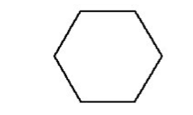
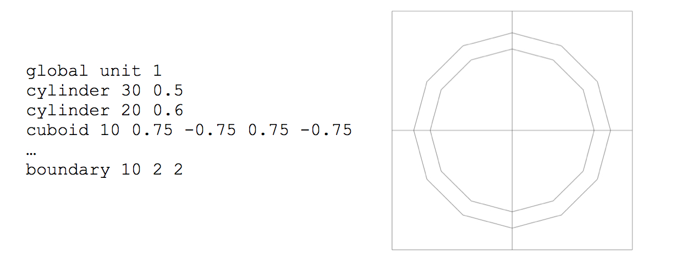

.. _9-2:

NEWT:  A New Transport Algorithm for Two-Dimensional Discrete-Ordinates Analysis in Non-Orthogonal Geometries
=============================================================================================================

.. |Om| replace:: :math:`\Omega`

M. A. Jessee, M. D. DeHart [1]_

ABSTRACT

NEWT (**N**\ ew **E**\ SC-based **W**\ eighting **T**\ ransport code) is
a multigroup discrete-ordinates radiation transport computer code with
flexible meshing capabilities that allow two-dimensional (2-D) neutron
transport calculations using complex geometric models. The differencing
scheme employed by NEWT, the Extended Step Characteristic approach,
allows a computational mesh based on arbitrary polygons. Such a mesh can
be used to closely approximate curved or irregular surfaces to provide
the capability to model problems that were formerly difficult or
impractical to model directly with discrete-ordinates methods. Automated
grid generation capabilities provide a simplified user input
specification in which elementary bodies can be defined and placed
within a problem domain. NEWT can be used for eigenvalue,
critical-buckling correction, and source calculations and it can be used
to prepare collapsed weighted cross sections in AMPX working library
format.

Like other SCALE modules, NEWT can be run as a standalone module or as
part of a SCALE sequence. NEWT has been incorporated into the SCALE
TRITON control module sequences. TRITON can be used simply to prepare
cross sections for a NEWT transport calculation and then automatically
execute NEWT. TRITON also provides the capability to perform 2-D
depletion calculations, in which the transport capabilities of NEWT are
combined with multiple ORIGEN depletion calculations to perform 2-D
depletion of complex geometries. In the TRITON depletion sequence, NEWT
can also be used to generate lattice-physics parameters and
cross sections for use in subsequent nodal core simulator calculations.
In addition, the SCALE TSUNAMI-2D sequence can be used to perform
sensitivity and uncertainty analysis of 2-D geometries, where NEWT is
used to compute the adjoint flux solution to generate sensitivity
coefficients for *k*\ :sub:`eff` and other responses of interest, with respect
to the cross sections used in the NEWT model.

ACKNOWLEDGMENTS

The author expresses gratitude to B. T. Rearden and S. M. Bowman for
their supervision of the SCALE project and review of the manuscript. The
author acknowledges R. Y. Lee of the U.S. Nuclear Regulatory Commission
(NRC) and A. P. Ulses (formerly NRC) for their support of the
development of NEWT. Appreciation is extended to G. Ilas, B. L.
Broadhead, Deokjung Lee (formerly ORNL), and B. J. Ade for their review
of this or previous versions of the manuscript. The efforts of Z. Zhong
(Argonne National Laboratory), A. P. Ulses (formerly NRC), K. S. Kim, C.
F. Weber, G. Ilas, and K. T. Clarno (Oak Ridge National Laboratory) in
methods development and testing of the code have been invaluable in the
continued evolution and improvement of the code.

.. _9-2-1:

Introduction
------------

NEWT (**N**\ ew **E**\ SC-based **W**\ eighting **T**\ ransport code) is
a two-dimensional (2-D) discrete-ordinates transport code developed
based on the Extended Step Characteristic (ESC) approach :cite:`dehart_discrete_1992` for
spatial discretization on an arbitrary mesh structure. This
discretization scheme makes NEWT an extremely powerful and versatile
tool for deterministic calculations in real-world non-orthogonal problem
domains. The NEWT computer code evolved from the earlier
proof-of-principle CENTAUR code :cite:`dehart_discrete_1992` and has been developed to run
within SCALE. Thus, NEWT uses AMPX-formatted cross sections processed by
other SCALE modules. If cross sections are properly prepared, NEWT can
be run in stand-alone mode. NEWT can also be used within the TRITON
control module for transport analysis, depletion analysis, and
sensitivity and uncertainty analysis.

.. _9-2-1-1:

How to use this manual
~~~~~~~~~~~~~~~~~~~~~~

This users’ manual is intended to assist both the novice and the expert
in the application of NEWT for transport analysis. As such, the document
is divided into subsections, each with a specific purpose. Not all
sections will be of value to all users. It is not intended that the user
of this manual read through the manual from start to end. Rather, the
manual is designed to serve as a reference, with each section meeting
different needs. This introductory section has been written to provide a
general overview of the background, nature, functionality, and
applications of NEWT; it should prove of interest to users at all
levels. :ref:`9-2-2` provides detail on the theory of NEWT in terms of
derivations, equations, and relationships used in the NEWT solution.
This information will be of interest to those with a background in
transport methods desiring a comprehensive understanding of the NEWT
solution scheme. However, this information may provide too much detail
or simply not be relevant for the beginning user or someone desiring to
improve or expand an existing model. These users will find :ref:`9-2-3`
to be of more value, where input data requirements and formats are
described in detail, along with examples of each data type. This
information is supplemented by :ref:`9-2-4`, in which complete sample
inputs with descriptions of the features of each model are provided.
:ref:`9-2-5` describes the components of an output listing obtained
from a successful NEWT calculation.

.. _9-2-1-2:

Background
~~~~~~~~~~

The radiation transport equation, a linearized derivative of the
Boltzmann equation, provides an exact description of a neutral-particle
radiation field in terms of the position, direction of travel, and
energy of every particle in the field. Both stochastic (Monte Carlo
simulation) and deterministic (direct numerical solution) forms of the
transport equation have been developed and are used extensively in
nuclear applications. Each approach has its strengths and weaknesses.
Stochastic approaches are extremely effective for problems with complex
geometries where the calculations of integral quantities, such as
radiation dose and neutron multiplication factors, are desired. However,
calculations to obtain accurate differential information, such as the
neutron flux as a function of space and energy, can be difficult and
inefficient at best and prone to inaccuracies (even if the integral
quantity is correct). Deterministic techniques, such as integral
transport, collision probability, diffusion theory, and
discrete-ordinates methods, are better suited for problems where
differential quantities, such as the neutron flux as a function of
energy or space, are desired. However, integral transport, collision
probability, and diffusion approximations are based on simplifying
assumptions, which can limit their applicability. The discrete-ordinates
approach is a more rigorous approximation to the transport equation but
is typically very limited in its flexibility to describe complex
geometric systems.

Discrete-ordinates approaches are derived from the integro-differential
form of the Boltzmann transport equation, where space, time, and energy
dependencies are normally treated by the use of a finite‑difference
grid, while angular behavior is treated by considering a number of
discrete directions in space. The angular solution is coupled to a
scalar spatial solution via some form of numerical integration. Because
of the direct angular treatment of the discrete-ordinates approach,
angularly dependent distribution functions can be computed; thus, this
approach is the preferred method of solution in many specific
applications where angular anisotropy is important. However, as
indicated earlier, it is often limited in applicability because of the
geometric constraints of the orthogonal grid system associated with the
finite-difference numerical approximation.

.. _9-2-1-3:

Discrete-ordinates solution on an arbitrary grid
~~~~~~~~~~~~~~~~~~~~~~~~~~~~~~~~~~~~~~~~~~~~~~~~

The ESC approach was developed to obtain a discrete-ordinates solution
in complicated geometries to handle the needs of irregular
configurations. Deterministic solutions to the transport equation
generally calculate a solution in terms of the particle flux; the flux
is the product of particle density and speed and is a useful quantity in
the determination of reaction rates that characterize nuclear systems.
General 2-D *xy* discrete-ordinates methods perform calculations that
provide four side-averaged fluxes and a cell-averaged flux for each cell
in a rectangular problem grid; iteration is performed to obtain a
converged distribution. This approach is usually termed the
diamond-difference approach. Using the ESC approach, a more flexible and
completely arbitrary problem grid may be defined in terms of completely
arbitrary polygons. Side-averaged fluxes for each polygon in the problem
domain are computed and are used to calculate a cell-averaged flux. This
process is repeated for each cell in the problem domain, and as with the
traditional approach, iteration is performed for convergence. This
geometric flexibility is a significant enhancement to existing
technology, as it provides the capability to model problems that are
currently difficult or impractical to model directly.

.. _9-2-1-4:

Functions performed
~~~~~~~~~~~~~~~~~~~

NEWT provides multiple capabilities that can potentially be used in a
wide variety of application areas. These include 2-D eigenvalue
calculations, forward and adjoint flux solutions, multigroup flux
spectrum calculations, and cross section collapse calculations. NEWT
provides significant functionality to support lattice-physics
calculations, including assembly cross section homogenization and
collapse, calculation of assembly discontinuity factors (for internal
and reflected assemblies), diffusion coefficients, pin powers, and group
form factors. Used as part of the TRITON depletion sequence, NEWT
provides spatial fluxes, weighted multigroup cross sections, and power
distributions used for multi-material depletion calculations and coupled
depletion and branch calculations needed for lattice-physics analysis.

.. _9-2-2:

Theory and Procedures
---------------------

This section provides the theoretical basis for the ESC discretization
technique, the NEWT solution algorithm, and cross section processing
procedures used by NEWT. Although this information is not necessary to
be able to use NEWT for transport calculations, it provides a deeper
understanding of the basic operations performed within NEWT.

.. _9-2-2-1:

Boltzmann transport equation
~~~~~~~~~~~~~~~~~~~~~~~~~~~~

The neutron transport equation may be presented in various forms, and
simplifications are often applied to tailor the equation to the
requirements of a specific application. In nuclear engineering
applications, the transport equation is often written in terms of the
angular neutron flux as the dependent variable. The angular neutron flux
is defined as the product of the angular neutron density and the neutron
velocity. The time-independent form of the linear transport equation is
then expressed as :cite:`duderstadt_nuclear_nodate`

.. math::
  :label: eq9-2-1

  \Omega \cdot \nabla \psi(\mathbf{r}, \Omega, E)+\sigma_{t}(\mathbf{r}, E) \psi(\mathbf{r}, \Omega, E)=Q(\mathbf{r}, \Omega, E) ,

where

  :math:`\psi(\mathbf{r}, \Omega, E)` ≡ angular flux at position per unit volume, in direction :math:`\Omega` per unit solid
  angle and at energy E per unit energy;

  :math:`\sigma_{t}(\mathbf{r}, E)` ≡ total macroscopic cross section at position **r** and energy E; and

  Q ≡ source at position **r** per unit volume, in direction :math:`\Omega` per unit solid
  angle and at energy E per unit energy.

The source Q is generally composed of three terms:

1. a scattering source,

.. math::
  :label: eq9-2-2

  S(\mathbf{r}, \Omega, E)=\int_{4 \pi} d \Omega^{\prime} \int_{0}^{\infty} d E^{\prime} \sigma_{s}\left(\mathbf{r}, \Omega^{\prime} \rightarrow \Omega, E^{\prime} \rightarrow E\right) \psi\left(\mathbf{r}, \Omega^{\prime}, E^{\prime}\right) ,

where

  :math:`\sigma_{s}\left(\mathbf{r}, \Omega^{\prime} \rightarrow \Omega, E^{\prime} \rightarrow E\right)`≡ macroscopic scattering cross section at position **r** from initial energy
  E′ and direction :math:`\Omega`′ to final energy E and direction :math:`\Omega`,

2. a fission source,

.. math::
  :label: eq9-2-3

  F(\mathbf{r}, \Omega, E)=\chi(\mathbf{r}, E) \int_{0}^{\infty} d E^{\prime} v\left(\mathbf{r}, E^{\prime}\right) \sigma_{f}\left(\mathbf{r}, E^{\prime}\right) \psi\left(\mathbf{r}, \Omega, E^{\prime}\right) ,

where

  :math:`\sigma_{f}\left(\mathbf{r}, E^{\prime}\right)` ≡ macroscopic fission cross section at position **r** and energy E′ (assumed
  to be isotropic),

  :math:`v\left(\mathbf{r}, E^{\prime}\right)` ≡ number of neutrons released per fission event at position **r** and
  energy E′,

  :math:`\chi(\mathbf{r}, E)` ≡ fraction of neutrons that are born at **r** and at energy E, and

3. an external or fixed source, S(**r** ,E).

In general, the transport equation can be difficult to apply and can be
solved analytically only for highly idealized cases. Hence,
simplifications and numerical approximations are often necessary to
apply the equation in engineering applications. Traditional
discrete-ordinates methods are based on a finite-difference
approximation to solve the flux streaming (leakage) term. Such
differencing schemes are intimately tied to the coordinate system in
which the differencing equations are developed, and it becomes difficult
to represent non-orthogonal volumes within that coordinate system. For
example, it is not possible to exactly represent a cylinder in a 2-D
Cartesian coordinate system; one must approximate the cylinder with a
number of rectangular cells. A close approximation can require a large
number of computational cells. However, the ESC approach for
discretizing computational cells allows the use of non-orthogonal
computational cells composed of arbitrary polygons. Using this method,
practically any shape can be represented within a Cartesian grid to a
very close approximation. The ESC approach is discussed in the following
sections.

.. _9-2-2-2:

The step characteristic approximation
~~~~~~~~~~~~~~~~~~~~~~~~~~~~~~~~~~~~~

Efficient application of discrete-ordinates methods is difficult when
dealing with complicated non-orthogonal geometries because of the nature
of finite difference approximations for spatial derivatives. An
alternative to the discrete representation of the spatial variable is
achieved in the method of characteristics, in which the transport
equation is solved analytically along characteristic directions within a
computational cell. The angular flux  is solved along the *s*-axis,
where this axis is oriented along the characteristic direction :math:`\Omega`. Since
only the angular flux in direction :math:`\Omega` is of concern, then the streaming
term can be rewritten as

.. math::
  :label: eq9-2-4

  \Omega \cdot \nabla \psi(\mathbf{r}, \Omega, E)=\frac{d \psi(s, E)}{d s} .

Hence :eq:`eq9-2-1` can be written in the characteristic form (omitting *E* for
clarity) as

.. math::
  :label: eq9-2-5

  \frac{d \psi(s)}{d s}+\sigma_{t}(s) \psi(\mathrm{s})=Q(s) ,

which has a solution of the form :cite:`hildebrand_advanced_1976`

.. math::
  :label: eq9-2-6

  \psi(s)=\psi_{0} e^{-\sigma_{t} s}+e^{-\sigma_{t} s} \int_{0}^{s} Q e^{\sigma_{t} s^{\prime}} d s^{\prime} ,

where s is the distance along the characteristic direction :math:`\Omega`, and
ψ\ :sub:`0` is the known angular flux at *s*\ =0. The value for
ψ\ :sub:`0` is given from boundary conditions for known cell sides, and
angular fluxes on unknown sides are computed using Eq. (9.2.6). Methods
for the determination of an appropriate value for ψ\ :sub:`0` and for
evaluation of the integral term vary in different solution
techniques.\ :sup:`4–9`\  :cite:`lewis_j_nodate,hildebrand_advanced_1976,alcouffe_review_1981,lathrop_spatial_1969,alcouffe_computational_1979,larsen_linear_1981,lathrop_spatial_1968`.
One of the simplest schemes employing the Method of Characteristics is
the Step Characteristic (SC) method developed by Lathrop :cite:`alcouffe_review_1981`. In
this approach, the source Q and macroscopic total cross section σt are
assumed to be constant within a computational cell and the angular flux
is assumed constant on the cell boundaries of incoming direction.
Integration of Eq. :eq:`eq9-2-6` can be performed to obtain

.. math::
  :label: eq9-2-7

  \psi(s)=\psi_{0} e^{-\sigma_{t} s}+\frac{Q}{\sigma_{t}}\left(1-e^{-\sigma_{t} s}\right) .

:numref:`fig9-2-1` shows a sample computational cell in which the SC method
can be applied. For a given characteristic direction :math:`\Omega`, the angular flux
on any unknown side may be expressed in terms of a suitable average of
fluxes from known sides, which contribute to the unknown side. For the
characteristic direction :math:`\Omega` shown in :numref:`fig9-2-1`, the unknown “top” flux
ψ\ :sub:`T` may be computed as a linearly weighted average of
contributions from known sides ψ\ :sub:`B` and ψ\ :sub:`L`. The fluxes
on each of the two known sides are taken to be constant along the length
of each side, representing the average angular flux in direction :math:`\Omega` and
must be specified from external boundary conditions or from a completed
calculation in an adjacent cell.

The set of characteristic directions is chosen from a quadrature set, so
that the resulting angular fluxes may be numerically integrated to
obtain a scalar flux. Knowing the lengths of the sides of a rectangular
cell (∆x and ∆y) and the direction cosines of :math:`\Omega` in the *x-y* plane
(μ and η), a function for the length *s* can easily be determined. The
solution for from Eq. :eq:`eq9-2-7` can then be integrated along the length of
each unknown side to determine the average angular flux of the unknown
side. Once the angular flux is known on all four sides, a neutron
balance on the cell can be used to determine the cell’s average angular
flux.

Although the SC method described above is based on rectangular cells,
the derivation of Eq. :eq:`eq9-2-7` makes no assumptions about the shape of
the cell. It merely requires knowledge of the relationship between cell
edges along the direction of the characteristic. Hence, the method is
not restricted to any particular geometry. Because it is an extension of
the SC approach into generalized cells, the method developed here for
generalized geometries is referred to as the Extended Step
Characteristic (ESC) method.

.. _fig9-2-1:

  Typical rectangular cell used in the step characteristic approach.

.. _9-2-2-3:

The Extended Step Characteristic approach
~~~~~~~~~~~~~~~~~~~~~~~~~~~~~~~~~~~~~~~~~

The theory of the ESC approach is developed and explained in detail in
:cite:`dehart_discrete_1992`. However, the work has evolved significantly from that time, most
notably in the elimination of a requirement for non-reentrant polygons
(convex). The following subsections describe the primary equations
applied in the ESC approach as currently applied in NEWT.

.. _9-2-2-3-1:

Cell properties and geometries
^^^^^^^^^^^^^^^^^^^^^^^^^^^^^^

The two primary assumptions of the ESC method are that (1) within each
computational cell all properties (i.e., σt and Q) are uniform and
(2) cell boundaries are defined by straight lines. The restriction of a
computational cell to boundaries consisting of a set of straight lines
results in computational cells that are limited to polygons. However, as
will be seen later, no restrictions are placed on the shape of the
polygon or on the number of sides in the polygon. However, the size of
the polygon will be limited. In practical applications, properties are
unlikely to remain constant over significant volumes. Thus this
approach, like many other differencing schemes, is a poor approximation
when cell volumes become too large. Although σt is a material property
and may remain spatially constant, the source term Q, which depends on
the neutron flux, will vary with position. However, since the solution
would become exact in an infinitesimally small cell, it is expected that
the approximation will be reasonable for computational cells in which
the change in the flux (and therefore the source) is small over the
domain of the cell.

As a result of this geometric configuration, each side of a cell can
have one of three possible attributes relative to particle flow in a
given characteristic direction, as illustrated in :numref:`fig9-2-2`: (1) flow
can enter the cell when crossing a side (as shown by sides E and F in
the figure); (2) flow can exit the cell when crossing a side (sides B
and C); or (3) in a special case, flow may be parallel to the
orientation of a given side (sides A and D). Expressed mathematically,
these relationships become

.. math::
  :label: eq9-2-8

  \text { Category } 1: \Omega_{k} \cdot \hat{n}_{i}<0

.. math::
  :label: eq9-2-9

  \text { Category } 2: \Omega_{k} \cdot \hat{n}_{i}>0

.. math::
  :label: eq9-2-10

  \text { Category } 1: \Omega_{k} \cdot \hat{n}_{i}=0

where :math:`\hat{n}_{i}` is a unit vector in the cell-outward direction normal to
side \ *i*, and :math:`\Omega_{k}` is the *k*\ :sup:`th` discrete element of a set of
characteristic directions. A category 1 side will be termed an
“incoming” side with respect to the direction :math:`\Omega_{k}`, and a category 2 side
will be referred to as an “outgoing” side. For simplicity, the
definition of Eq. :eq:`eq9-2-10` will be included as a special case of
Eq. :eq:`eq9-2-8` for an incoming side. Thus, Eq. :eq:`eq9-2-8` can be rewritten as

.. math::
  :label: eq9-2-11

  \text { Side } i \text { is incoming with respect to } \Omega_{k}: \Omega_{k} \cdot \hat{n}_{i} \leq 0

.. math::
  :label: eq9-2-12

  \text { Side } i \text { is outgoing with respect to } \Omega_{k}: \Omega_{k} \cdot \hat{n}_{i}>0

To solve for fluxes (flow) on outgoing sides of a cell, one must know fluxes on
all incoming sides. Each incoming side of each cell will be given from a
boundary condition or will be the outgoing side of an adjacent cell.

.. _fig9-2-2:

  Orientation of the sides of a cell with respect to a given direction vector.

.. _9-2-2-3-2:

Relationships between cells
^^^^^^^^^^^^^^^^^^^^^^^^^^^

In the ESC method, the shape of the computational cell and the form of
the neutron balance differ from that used in traditional
discrete-ordinates methods. Nevertheless, the relationships between
cells are treated essentially as they would be in traditional
approaches. The entire problem domain is mapped in terms of a set of
finite cells. Each side of each cell is adjacent to either an external
boundary condition or another cell. For each discrete direction, cells
are swept in a predetermined order beginning at a known boundary (from a
specified external boundary condition) moving in the given direction.
The precise order of sweep is such that as the solution for one cell is
obtained, the cell provides sufficient boundary conditions for the
solution of an adjacent cell. Hence, cells sharing a given side share
the value of the angular flux on that side. Knowledge of the flux on all
incoming sides of a cell is sufficient to solve for all outgoing sides.
Once the angular flux has been determined for all sides of the cell for
the given direction, it is possible to use a neutron balance to compute
the average value of the angular flux within the cell.

The sweeping of cells continues for a given direction until all cell
fluxes have been calculated. The procedure is then repeated for the next
direction until all directions have been computed. At this point, the
cell average angular fluxes are known for each cell for each direction
used. Numerical quadrature can then be used to determine the average
scalar flux in each cell in the problem domain. The scalar fluxes are
used to determine fission and scattering reaction rates in each cell and
to update the value of the cell average source, Q. The process is
repeated, and the iteration continues until all scalar fluxes converge
to within a specified tolerance.

This approach can be performed assuming a single energy group or any
number of discretized energy groups. The multigroup approach used in the
ESC method is the standard approach used in most multigroup methods and
is independent of the shape of each computational cell. Hence, the
details of the multigroup formalism will be omitted from this
discussion.

.. _9-2-2-3-3:

The set of characteristic directions
^^^^^^^^^^^^^^^^^^^^^^^^^^^^^^^^^^^^
.. |Omk| replace:: :math:`\Omega_{k}`

The characteristic solution to the transport equation gives only the
angular flux in the direction of the characteristic direction vector |Omk|.
To compute interaction rates within a cell, one must compute scalar
fluxes. In computing the scalar flux from the set of angular fluxes, it
is convenient to choose the set of characteristic directions from an
appropriate quadrature set. Then the set of computed angular fluxes can
be combined with appropriate directional weights and summed to obtain a
scalar flux solution within a cell. Therefore, it is most appropriate to
choose characteristic directions from an established set of base points
and weights. Such quadrature sets that have been developed and used in
numerous earlier discrete- ordinates approaches are used in NEWT. No
restriction is placed on the nature or order of the quadrature set, as
long as it is sufficient to adequately represent the scalar flux from
computed angular fluxes.

.. _9-2-2-3-4:

Angular flux at a cell boundary
^^^^^^^^^^^^^^^^^^^^^^^^^^^^^^^

As in the development of the SC method, as well as most
finite-difference methods, the ESC approach does not explicitly
determine the flux distribution as a function of position along the
sides of a computational cell. Instead, the angular flux on each cell
side is represented in terms of the average angular flux along the
length of the side. This is sufficient to determine the net leakage
across each cell side, which is needed in order to maintain a cell
balance. An average value of the flux for an incoming side must be
specified from a boundary condition or from the prior solution of an
adjacent cell. The average flux along a given outgoing side can be
computed by integrating the flux along the side and dividing by the
length of the side. However, the form of the distribution of the angular
flux on the side must be known to perform this integration. This
distribution can be determined from the properties of the cell and from
the average flux on each of the known incoming sides.

Because the characteristic solution [Eq. :eq:`eq9-2-6`] allows calculation of
the angular flux at any point *s* in a single cell given an initial
condition, the exact value of the flux can be computed at any point on
any outgoing side if the flux along each incoming side is known. As an
initial condition, it is assumed that the angular flux in some
characteristic direction is known at some starting point, *s* = 0
[i.e., ψ(0) = ψ\ :sub:`0`], on an incoming side. To determine the flux at
some point on an outgoing side, one need know only the distance *s*
measured along a characteristic direction to the appropriate incoming
side. This method can then be expanded to determine a functional form of
the flux for every point on the outgoing side, which can be integrated
to produce the average outgoing flux on the side.

To develop a mathematical relationship between two arbitrary sides of a
cell, one should first consider two arbitrary coplanar line segments in
space whose endpoints each lie on a pair of parallel lines laid in the
direction |Omk|, as shown in :numref:`fig9-2-3`. Points B\ :sub:`1` and B\ :sub:`2`
can be considered to be the “projections” of A\ :sub:`1` and
A\ :sub:`2`, respectively, relative to |Omk|. Because *s* is the distance
between a point on segment A and its projection on segment B, it can be
seen that *s* varies linearly in moving from the “beginning” to the
“end” of the pair of segments.

.. _fig9-2-3:

  Line endpoints for computation of average fluxes.

If α is the distance along segment B measured from endpoint B\ :sub:`1`
and B has a total length L, then the distance *s* between A and B along
direction |Omk| can be written as a linear function in terms of the
position α:

.. math::
  :label: eq9-2-13

  s(\alpha)=s_{1}+\left(\frac{s_{2}-s_{1}}{L}\right) \alpha ,

where *s*\ :sub:`1` and *s*\ :sub:`2` are related to the distances along
the characteristic direction between A\ :sub:`1`, B\ :sub:`1` and
A\ :sub:`2`, B\ :sub:`2`, respectively. (It is important to note that
the length *s* is the same as the distance between the endpoints only
when the characteristic vector lies in the plane of the computational
cell. This is not necessarily the case, depending on the choice of
quadrature directions. This situation is discussed in more detail
later.)

If ψ(α) is the angular flux on side B at a distance α from B\ :sub:`1`,
then :math:`\bar{\psi}_{\mathrm{B}}`, the average value of ψ on B, is given by

.. math::
  :label: eq9-2-14

  \bar{\psi}_{B}=\frac{\int_{0}^{L} \psi(s(\alpha)) d \alpha}{\int_{0}^{L} d \alpha} .

Equation :eq:`eq9-2-6`, the solution to the characteristic equation in the
step approximation, can be rewritten in terms of the average known
angular flux on side A

.. math::
  :label: eq9-2-15

  \psi_{B}(s)=\left(\bar{\psi}_{A}-Q / \sigma_{t}\right) e^{-\sigma_{t} s}+Q / \sigma_{t} .

Inserting Eqs. :eq:`eq9-2-13` and :eq:`eq9-2-15` into Eq. :eq:`eq9-2-14` and simplifying
yields

.. math::
  :label: eq9-2-16

  \bar{\psi}_{B}=\frac{1}{L} \int_{0}^{L}\left[\left(\bar{\psi}_{A}-Q / \sigma_{t}\right) \exp \left(-\sigma_{t}\left(s_{1}+\left(\frac{s_{2}-s_{1}}{L}\right) \alpha\right)\right)+Q / \sigma_{t}\right] d \alpha .

For the special case in which A and B are parallel,
*s*\ :sub:`1` = *s*\ :sub:`2` and the second term in the exponential
drops out. Equation :eq:`eq9-2-16` can easily be integrated to obtain

.. math::
  :label: eq9-2-17

  \bar{\psi}_{B}=\left(\bar{\psi}_{A}-Q / \sigma_{t}\right) e^{-\sigma_{t} s_{1}}+Q / \sigma_{t} .

In the more general case, *s*\ :sub:`1` ≠ *s*\ :sub:`2`, the result is
slightly more complicated:

.. math::
  :label: eq9-2-18

  \bar{\psi}_{B}=\frac{\left(\bar{\psi}_{A}-Q / \sigma_{t}\right)}{\sigma_{t}\left(s_{2}-s_{1}\right)}\left[e^{-\sigma_{t} s_{1}}-e^{-\sigma_{t} s_{2}}\right]+Q / \sigma_{t} .

Equations :eq:`eq9-2-17` and :eq:`eq9-2-18` can also be written in a simplified form:

.. math::
  :label: eq9-2-19

  \bar{\psi}_{B}=\beta_{A B} \bar{\psi}_{A}+\left(1-\beta_{A B}\right) Q / \sigma_{t}

where

  .. math::

    \beta_{A B}=\left\{\begin{array}{cc}
    \frac{e^{-\sigma_{t} s_{1}}-e^{-\sigma_{t} s_{2}}}{\sigma_{t}\left(s_{2}-s_{1}\right)} & s_{1} \neq s_{2} \\
    e^{-\sigma_{t} s_{1}} & s_{1}=s_{2}
    \end{array}\right.

Thus far, this development has considered only the special case where
contributions to side B are the result only of the cell internal source
and a single incoming side (i.e., side A). For an arbitrarily shaped
cell and discrete direction |Omk|, it is likely that the outgoing side would
receive contributions from two or more incoming sides, as illustrated in
:numref:`fig9-2-4`, for a cell with three incoming sides (X, Y, and Z)
contributing to the flux on a single outgoing side (B). In such a
situation, the outgoing side can be subdivided into multiple components.
Side B of :numref:`fig9-2-4` can be represented by three components,
B\ :sub:`X`, B\ :sub:`Y`, and B\ :sub:`Z`, representing contributions
from line segments X, Y, and Z, respectively. The average angular flux
:math:`\bar{\psi}` can be computed for each component of side B using
Eq. :eq:`eq9-2-19`; then :math:`\bar{\psi}_{B}`, the average flux for the entire length of
B, can be calculated by the length-weighted average of each component.
In general, for a given side B composed of *n* components, the average
flux of the side is given by

.. math::
  :label: eq9-2-20

  \bar{\psi}_{B}=\sum_{i=1}^{n} \frac{\bar{\psi}_{i} i}{L_{B}}

where

  :math:`\ell_{i}` is the length of the projection of the ith side onto B, and

  :math:`\bar{\psi}_{i}` is the average flux computed for segment B\ :sub:`i` due to the
  flux on side *i*

Using Eqs. :eq:`eq9-2-19` and :eq:`eq9-2-20`, one can compute the average flux on
each of the outgoing sides for a given cell, once the angular flux on
each incoming side is known. At this point, only distances *s*\ :sub:`1`
and *s*\ :sub:`2` and the lengths :math:`\ell_{i}` and L need be determined to estimate
fluxes in an iterative process. These can be computed from the geometry
of the cell and the direction |Omk|.

.. _fig9-2-4:
.. figure:: figs/NEWT/fig4.png
  :align: center
  :width: 500

  Contributions of multiple incoming sides to an outgoing side.

.. _9-2-2-3-5:

Mapping a characteristic vector into the two-dimensional problem domain
^^^^^^^^^^^^^^^^^^^^^^^^^^^^^^^^^^^^^^^^^^^^^^^^^^^^^^^^^^^^^^^^^^^^^^^

Even in a 2-D x-y system in which the scalar flux is constant with
respect to the z axis, the angular flux has components in the
z direction. Thus, to obtain the scalar flux at a point on the
x-y plane, one must integrate over the unit sphere in all 4π directions
of |Om|. Recall that the choices of characteristic directions for this model
were selected to be the same as the set of directions composing a
conventional quadrature set. Quadrature sets specified in the
literature :cite:`carlson_transport_1970,carlson_discrete_1965,lee_discrete_1962` and used in other
discrete-ordinates codes :cite:`lathrop_twotran-ii_1973,engle_jr_users_1967` are based on a unit
sphere and are usually specified in terms of μ\ :sub:`k` and η\ :sub:`k`,
the respective x and y components of |Omk|, where is one of a set of discrete
directions composing the quadrature set. Because |Omk| is a unit vector, :math:`\xi_{k}`, the
z component of the direction, is implicit: :math:`\xi_{k}=\sqrt{1-\mu_{k}^{2}-\eta_{k}^{2}}`.
However, because of the 2‑D
nature of the problem, the z component is never explicitly used. It is
therefore sufficient to evaluate the angular flux at a finite number of
points in 4π of |Om| -space in terms of just the μ\ :sub:`k` and η\ :sub:`k`
components of the discrete directions |Omk|. One must recognize, however,
that the length of the path traveled by particles moving in a direction
out of the x-y plane is always longer than the x-y projection of the
path, by a factor of (μ\ :sup:`2` + η\ :sup:`2`)\ :sup:`–1/2`. Thus, for any
path length *s*' measured in the x‑y plane for a given direction |Omk|, the
true path length traveled is *s*, where

.. math::
  :label: eq9-2-21

  s=\frac{s^{\prime}}{\sqrt{\mu^{2}+\eta^{2}}} .

This is illustrated in :numref:`fig9-2-5`.

.. _fig9-2-5:

  Relationship between *s*\ :sub:`1` and *s*\ :sub:`2` and
  their projections in the x-y plane.

.. _9-2-2-3-6:

Neutron balance within a computational cell
^^^^^^^^^^^^^^^^^^^^^^^^^^^^^^^^^^^^^^^^^^^

Once angular fluxes have been computed for all sides of a cell, it is
necessary to compute the cell-averaged angular flux. To enforce
conservation, a balance condition is applied to the cell. This provides
the equation necessary to determine the average flux in the cell. The
neutron balance for an arbitrary cell in steady state may be expressed
as

.. math::
  :label: eq9-2-22

  \left[\begin{array}{c}
  \text { net number of } \\
  \text { neutrons moving in } \\
  \text { direction } \hat{\Omega} \text { escaping } \\
  \text { from the cell }
  \end{array}\right]+\left[\begin{array}{c}
  \text { number of neutrons } \\
  \text { removed from the cell } \\
  \text { or from direction } \hat{\Omega} \\
  \text { by interactions }
  \end{array}\right]=\left[\begin{array}{c}
  \text { number of } \\
  \text { neutrons produced } \\
  \text { in the cell moving } \\
  \text { in direction } \hat{\Omega}
  \end{array}\right]

or, expressed mathematically,

.. math::
  :label: eq9-2-23

  \oint_{s} n \cdot \hat{\Omega}_{k} \psi d S+\sigma_{t} \bar{\psi} V=Q V,

where :math:`n` is the outward normal direction at each side of the cell and V is
the 2-D volume of the cell. Note that in this context, *S* represents
the surface area or perimeter of the cell. Hence, for a cell with *m*
sides, each of the sides having a constant angular flux :math:`\bar{\psi}_{i}` and an outward
normal direction :math:`\mathrm{n}_{i}`,

.. math::
  :label: eq9-2-24

  \bar{\psi}_{c e l l}=\frac{Q}{\sigma_{t}}-\frac{1}{\sigma_{t} V} \sum_{i=1}^{m} \bar{\psi}_{i} \int_{S_{i}} \mathrm{n}_{i} \cdot \hat{\Omega}_{k} d S_{i} .

Because each cell is restricted to be a polygon, each side in the cell
will be a straight line and :math:`\mathrm{n}_{i} \cdot \hat{\Omega}_{k}` will be constant along the length of the
side. Equation :eq:`eq9-2-24` can then be simplified to obtain

.. math::
  :label: eq9-2-25

  \bar{\psi}_{c e l l}=\frac{Q}{\sigma_{t}}-\frac{1}{\sigma_{t} V} \sum_{i=1}^{m} \bar{\psi}_{i}\left(\mathrm{n}_{i} \cdot \hat{\Omega}_{k} \mathrm{~L}_{i}\right) ,

where L\ :sub:`i` is the length of the *i*\ th side and the term in
parentheses represents a leakage coefficient for the side.

.. _9-2-2-4:

Coarse-mesh finite-difference acceleration
~~~~~~~~~~~~~~~~~~~~~~~~~~~~~~~~~~~~~~~~~~

Beyond cell discretization and solution described above for the ESC
approach, the NEWT iterative approach is similar to that used in other
discrete-ordinates methods. Inner iterations are used to solve spatial
fluxes in each energy group to generate updated source terms; outer
iterations use these source terms to converge all energy groups. This
source-iteration approach can be somewhat slow to converge, especially
when significant scattering is present. Hence, it is desirable to apply
some form of acceleration to the iterative solution used by NEWT. To
this end, a coarse-mesh finite-difference acceleration (CMFD) approach
has been added to NEWT. The CMFD formulation uses a simplified
representation of a complex problem, in which selected rectangular
regions are derived from the global NEWT Cartesian grid and homogenized.
The CMFD formulation utilizes coupling correction factors for each
homogenized cell to dynamically homogenize the constituent ESC-based
polygonal cells during the iterative solution process such that the
heterogeneous transport solution can be preserved. Dynamic-group
collapse is also possible with a two-level CMFD formulation in which
alternating multigroup and two-group calculations are performed. By
extending the concept of the equivalence theory to energy and angle, it
is possible to apply a consistent lower-order formulation in the form of
a homogenized pin-cell, few-group, diffusion-like finite-difference
scheme. This simplified lower-order formulation is much less expensive
to solve, and its solution can be used to accelerate the original
higher-order transport solution in NEWT, resulting in much faster
convergence of the fission and scattering source distributions. This
work is described in detail in :cite:`zhong_implementation_2008` and in previous versions of
the NEWT manual.

Although the original implementation of the CMFD acceleration method is
extremely efficient and actively maintained, its use is limited to
rectangular-domain configurations (e.g., square-pitched fuel lattices).
An alternative CMFD acceleration method has been developed to support
triangular- and hexagonal-domain configurations (e.g.,
triangular-pitched fuel lattices such as the VVER or prismatic graphite
models). The new CMFD acceleration method does not require the
coarse-mesh cells to be rectangles but rather arbitrary polygons.
However in the current implementation, the “unstructured” coarse-mesh
cells are still constructed from the global NEWT Cartesian grid.
Therefore, for a hexagonal configuration, interior coarse-mesh cells
will be rectangular shape whereas cells near the boundary will be
triangular or trapezoidal shapes.

The new unstructured CMFD iterative solution scheme is essentially
identical to the original solution scheme; the two methods differ only
in how the lower-order system is solved. Additionally the two-group
acceleration is not employed in the unstructured CMFD method. Input
options for both CMFD methods are described in :ref:`9-2-3-2`.

.. _9-2-2-5:

Assembly discontinuity factors
~~~~~~~~~~~~~~~~~~~~~~~~~~~~~~

In nodal multi-assembly or core calculations, lattice transport
solutions are used to generate few-group homogenized cross sections.
These cross sections are in general obtained from single-assembly
transport calculations with zero-current boundary conditions. Generation
of few-group homogenized cross sections for nodal calculations typically
includes the generation of discontinuity factors (i.e., additional
parameters used to preserve both reaction rates and the interface
currents in the homogenization process). The discontinuity of the flux
at an assembly interface that can arise by the use of homogenized
cross sections is illustrated in :numref:`fig9-2-6`. The so-called
“homogeneous” flux, computed in the nodal calculation, is discontinuous
at the assembly interface, as opposed to the exact “heterogeneous” flux,
computed in the transport calculation, which is continuous at the
assembly interface. The interface condition employed in nodal
calculations between two assemblies (nodes) *i* and *i*\ +1 is given as

.. math::
  :label: eq9-2-26

  \phi_{i, \text { homogeneous }}^{+} \cdot F_{i}^{+}=\phi_{i+1, \text { homogeneous }}^{-} \cdot F_{i+1}^{-} ,

where :math:`F_{i}^{+}` and :math:`F_{i+1}^{-}` are assembly discontinuity factors (ADFs) on each side of the
interface between assemblies *i* and *i*\ +1.

The ADF on the assembly interface is defined as the ratio of the
heterogeneous flux :math:`\phi_{\text {heterogeneous }}` at that assembly interface to the homogeneous flux
evaluated at the interface, denoted :math:`\phi_{i, \text { homogeneous }}^{+}` (or :math:`\phi_{i+1, \text { homogeneous }}^{-}`):

.. math::
  :label: eq9-2-27

  F_{i}^{+}=\frac{\phi_{\text {heterogeneous }}}{\phi_{i, \text { homogeneous }}^{+}}, F_{i+1}^{-}=\frac{\phi_{\text {heterogeneous }}}{\phi_{i+1, \text { homogeneous }}^{-}} .

Fluxes, and therefore ADFs, vary with energy; therefore, few-group
homogenized cross sections are always accompanied by corresponding
few-group ADFs.

In a single-assembly calculation with zero-current boundary conditions,
the heterogeneous flux at each boundary is easily calculated as the
surface-averaged scalar flux on the boundary, whereas the homogenous
flux at each boundary is simply the assembly-averaged flux. Hence, for
each energy group, the ADF is calculated for each boundary as the ratio
of the average flux on that boundary to the average flux across the
assembly.

In other configurations, such as a multi-assembly calculation or an
assembly located on the edge of a core next to the core baffle and
reflector, the ADF calculation requires more effort. For reflector
situations, NEWT applies a simple one-dimensional (1-D) multigroup
diffusion approximation to determine the ADF at the assembly boundary.
In this approximation, it is assumed that the reflector is infinite and
that the scalar flux goes to zero at infinity. The reflector ADF can be
determined analytically using this boundary condition along with the
known surface-averaged current and scalar flux evaluated at the
assembly/reflector interface.

The reflector ADFs computed by NEWT may potentially be different from
the ADFs calculated using the diffusion approximations employed by the
nodal code. Moreover, ADFs computed for multi-assembly or
hexagonal-domain configurations will depend on the nodal method
employed. For these reasons, NEWT supports the option to edit
surface-averaged scalar flux and current values along user-defined line
segments so that appropriate ADFs can be computed directly by the nodal
code. The input options for the single-assembly ADF, reflector ADF, and
arbitrary line-segment edit are discussed in :ref:`9-2-3-11`.

.. _fig9-2-6:

  Heterogeneous vs homogeneous fluxes in a multi-assembly solution.

.. _9-2-3:

Input Formats
-------------

NEWT input is free form and keyword based, similar in form to the input for many
other modules in the SCALE code package. Input may start with a title card
record, but this line may be omitted if desired; remaining data are supplied in
data blocks. The order of the data blocks is arbitrary (with two exceptions),
and many blocks are optional.  Only one instance of a data block is allowed.

.. _9-2-3-1:

Overview of newt data blocks
~~~~~~~~~~~~~~~~~~~~~~~~~~~~

The NEWT input deck data blocks are defined by keyword delimiters in the
following form:

.. highlight:: none

::

  read keyword        [data]      end keyword

Read routines are terminated by the “end *keyword*\ ” label, and any
intervening carriage returns or line feeds are ignored. Thus, data can
also be entered in this format:

::

  read keyword
  [data]
  [data]
  end keyword

Within each block, specific control or specification parameters are
input. Each block contains a fixed set of input parameters (also defined
by keyword).

As with other keyword-driven modules within SCALE, lines beginning with
a single quote (') in the first column are treated as comments and
ignored.

The keyword name and general contents of each data block are as follows:

.. table::
  :align: center
  :class: longtable

  +-----------------------+-----------------------+-----------------------+
  | **Block type**        | **Recognized          | **Description**       |
  |                       | keywords**            |                       |
  +-----------------------+-----------------------+-----------------------+
  | Problem control       | parameter,            | General problem       |
  | parameters            | parameters, param,    | parameters—must       |
  |                       | parm, para            | follow title card, if |
  | :ref:`9-2-3-2`        |                       | used (optional)       |
  +-----------------------+-----------------------+-----------------------+
  | Material properties   | material, materials,  | Assigns               |
  |                       | matl                  | characteristics       |
  | :ref:`9-2-3-3`        |                       | (e.g., P\ :sub:`n`    |
  |                       |                       | scattering order and  |
  |                       |                       | material description) |
  |                       |                       | for each material     |
  |                       |                       | ID—must follow        |
  |                       |                       | problem control block |
  |                       |                       | or must follow title  |
  |                       |                       | card if control block |
  |                       |                       | is omitted (required) |
  +-----------------------+-----------------------+-----------------------+
  | Broad group collapse  | collapse, coll        | Defines broad group   |
  |                       |                       | energy ranges to be   |
  | :ref:`9-2-3-5`        |                       | created from the      |
  |                       |                       | original fine group   |
  |                       |                       | library when cross    |
  |                       |                       | section collapse is   |
  |                       |                       | desired (optional)    |
  +-----------------------+-----------------------+-----------------------+
  | Simple-body geometry  | geometry, geom        | Defines basic grid    |
  |                       |                       | structure and all     |
  | :ref:`9-2-3-6`        |                       | bodies to be placed   |
  |                       |                       | within this structure |
  |                       |                       | (required unless      |
  |                       |                       | geometry restart file |
  |                       |                       | is available)         |
  +-----------------------+-----------------------+-----------------------+
  | Boundary conditions   | bounds, bnds          | Defines boundary      |
  |                       |                       | conditions to be      |
  | :ref:`9-2-3-7`        |                       | applied on outer      |
  |                       |                       | boundaries of global  |
  |                       |                       | unit (optional,       |
  |                       |                       | default is reflective |
  |                       |                       | on all sides)         |
  +-----------------------+-----------------------+-----------------------+
  | Array specifications  | array                 | Defines composition   |
  |                       |                       | of all arrays (unit   |
  | :ref:`9-2-3-9`        |                       | placement within each |
  |                       |                       | array). Each array    |
  |                       |                       | placed within the     |
  |                       |                       | geometry block must   |
  |                       |                       | be defined in the     |
  |                       |                       | array block           |
  +-----------------------+-----------------------+-----------------------+
  | Homogenization        | homog, hmog, homo     | Defines mixtures to   |
  | instructions          |                       | be flux weighted and  |
  |                       |                       | homogenized in the    |
  | :ref:`9-2-3-10`       |                       | preparation of a      |
  |                       |                       | homogenized cross     |
  |                       |                       | section library       |
  |                       |                       | (optional)            |
  +-----------------------+-----------------------+-----------------------+
  | Assembly              | adf                   | Assigns type and      |
  | discontinuity factors |                       | location of planes at |
  |                       |                       | which assembly        |
  | :ref:`9-2-3-11`       |                       | discontinuity factors |
  |                       |                       | (ADFs) are calculated |
  |                       |                       | (optional)            |
  +-----------------------+-----------------------+-----------------------+
  | Flux plane            | flux                  | Allows definition of  |
  |                       |                       | an x- or y-axis line  |
  | :ref:`9-2-3-12`       |                       | (plane) for which     |
  |                       |                       | average fluxes are    |
  |                       |                       | computed and printed  |
  |                       |                       | (optional)            |
  +-----------------------+-----------------------+-----------------------+
  | Mixing table          | mixtable, mixt        | Mixing table          |
  |                       |                       | specification         |
  | :ref:`9-2-3-13`       |                       | (optional)            |
  +-----------------------+-----------------------+-----------------------+
  | Source definition     | src, source           | Defines particle      |
  |                       |                       | source strength for   |
  | :ref:`9-2-3-4`        |                       | use in source         |
  |                       |                       | calculations          |
  +-----------------------+-----------------------+-----------------------+

Each of the following subsections describes the parameters associated
with a specific data block, lists default values (if available), and
describes meaning of the parameter and its effect on a NEWT calculation.

.. _9-2-3-2:

Parameter block
~~~~~~~~~~~~~~~

**Parameter Block keyword = param, parm, para, parameter, or
parameters**

The Parameter block contains problem control parameters and must come
immediately after the title card if one is used. Valid parameter
specifications are described below. For each keyword, allowable values
are listed in parentheses, and the default (if any) is listed in
brackets. Input that can take an arbitrary integer value is indicated by
an *IN*; similarly, any parameter that can take an arbitrary
real/floating point value is indicated by *RN* as the allowable value.
However, note that SCALE read routines do allow input of integers for
real numbers, and vice versa; the number will be converted accordingly.
The order of the parameters within the block is arbitrary, and may be
skipped if a default value is desired for that parameter. Control
parameters are set in the order in which they are input; this means that
the same parameter may be listed multiple times, but only the final
value is used.

.. _9-2-3-2-1:

Convergence and acceleration parameters
^^^^^^^^^^^^^^^^^^^^^^^^^^^^^^^^^^^^^^^

**epseigen=**\ (*RN*) — Convergence criterion for *k*\ :sub:`eff`. [0.0001]

**epsinner=**\ (*RN*) — Spatial convergence criterion for inner
iterations. [0.0001]

**epsouter=**\ (*RN*) — Spatial convergence criterion for outer
iterations. [0.0001]

**epsthrm=**\ (*RN*) — Spatial convergence criterion for
thermal-upscattering iterations, if enabled. [same value as
**epsouter**]

**epsilon=**\ (*RN*) — Simultaneously sets all (spatial and eigenvalue)
convergence criteria to the same value. [uses individual defaults]

**converg**\ =(\ *cell/mix*) — Sets the region within which convergence
testing is applied. Use of *cell* will force converged scalar fluxes in
every computation cell, while *mix* will relax convergence such that
averaged scalar fluxes within a mixture are converged. The latter is
useful for mixtures in which fluxes become very small—large reflectors
or near a vacuum BC. [cell]

**therm**\ =(\ *yes/no*) — Enables/disables thermal-upscattering
iterations. [yes]

**inners=**\ (*IN*) — Maximum number of inner iterations in an energy
group. [5]

**therms=**\ (*IN*) — Maximum number of thermal-upscattering iterations,
if enabled. [2]

**outers=**\ (*IN*) — Maximum number of outer iterations. NEWT will stop
with an error code if more than *outers* outer iterations are required
for convergence. [250]

**inrcvrg**\ =(\ *yes/no*) — If inrcvrg=yes, NEWT will continue outer
iterations until all convergence criteria are met. If inrcvrg=no, NEWT
will stop whenever outer iteration and *k*\ :sub:`eff` convergence criterion
are met, regardless of the convergence of inner or thermal-upscattering
iterations. [no]

**cmfd=**\ (*no/rect/yes/part*) — CMFD acceleration option. If cmfd=no,
CMFD acceleration is not employed. If cmfd=rect, the CMFD method is
employed. The original NEWT CMFD method can be applied only to
rectangular-domain configurations. If cmfd=yes, the unstructured CMFD
method is employed. The new unstructured CMFD method can be applied to
rectangular-, triangular-, and hexagonal- domain configurations. If
cmfd=part, an alternative version of the unstructured CMFD method is
employed and uses a “partial-current” acceleration scheme.
Alternatively, users can use cmfd=0/1/2/3 for no, rect, yes, and part,
respectively. [no]

**cmfd2g=**\ (*yes/no*) — Enables/disables the second-level two-group
CMFD accelerator within the CMFD solver. This parameter has an effect
only when cmfd=rect is set. [yes]

**accel=**\ (*yes/no*) — Enables/disables source (*k*\ :sub:`eff`)
acceleration. This parameter is automatically disabled if unstructured
CMFD is employed (cmfd=yes or cmfd=part). [yes]

**xcmfd**\ =(\ *IN),* **ycmfd**\ =(\ *IN),* **xycmfd**\ =(\ *IN)* —
These inputs specify the number of fine-mesh cells in the global NEWT
grid per coarse-mesh cell. These options are used only when CMFD
acceleration is enabled. The parameter *xcmfd* specifies the number
fine-mesh cells per coarse-mesh cell in the x‑direction. Likewise,
*ycmfd* specifies the number of fine-mesh cells per coarse-mesh cell in
the y‑direction. The parameter *xycmfd* simultaneously sets *xcmfd* and
*ycmfd* to the same value. In a special case for rectangular-domain
configurations in which the entire domain is completely filled by a
square-type array (see :ref:`9-2-3-9`), *xycmfd=0* sets the coarse mesh
based on the size of the array elements. [1]

.. important:: Default convergence parameters are recommended for general analysis.
  Larger convergence criteria are useful for debugging if shorter run time
  is desired over solution accuracy. Smaller convergence criteria are
  recommended for generating reference solutions or benchmark
  calculations.

  CMFD acceleration should be applied whenever possible. The CMFD method
  with second-level 2-group acceleration should be applied for
  rectangular-domain configurations [e.g., light water reactor (LWR)
  assembly models (*\ **cmfd=rect**\ *), by default*\ **cmfd2g=yes**\ *].
  The unstructured CMFD method should be applied for triangular- or
  hexagonal-domain configurations (*\ **cmfd=yes**\ *). If NEWT detects an
  unstable CMFD condition, a warning message is printed and NEWT continues
  with CMFD disabled. NEWT may also provide a terminating error message if
  improper selection of the coarse mesh is detected. Internal
  investigation has shown that the coarse mesh should be approximately the
  same size as the unit cell used in the model. For LWR assembly models, a
  fine mesh of 4 x 4 is recommended for the square-pitched unit cell,
  implying that*\ **xycmfd**\ *should be 4 only if the global unit has a
  mesh. If individual meshes are used in each unit definition, then the
  global unit coarse-mesh cells should be sized based on the unit cell
  size and, therefore, xycmfd=1 should be used. The values
  of*\ **xcmfd**\ *and*\ **ycmfd**\ *do not have to be a common factor of
  the number of fine-mesh cells in a given direction (NEWT will make the
  last coarse-mesh cell smaller than the other coarse-mesh cells), but it
  is highly recommended.

  Users can gauge solution convergence by the outer iteration edit as it
  is printed to the terminal window (*\ **echo=yes**\ *, see below). One
  can terminate a calculation prematurely (via the Control-C option on
  most platforms) if convergence or iteration parameters need to be
  modified.

  The TRITON control module supports a sensitivity and uncertainty
  analysis sequence TSUNAMI-2D (See TRITON chapter, section S/U Analysis
  Sequences (TSUNAMI-2D, TSUNAMI-2DC)). TSUNAMI-2D calculations require
  NEWT to be run in both forward mode and adjoint mode. In adjoint mode,
  CMFD acceleration is not currently supported and NEWT automatically
  disables its use if*\ **cmfd=yes**\ *,*\ **=rect**\ *,
  or*\ **=part**\ *. In adjoint mode with defined fixed source [i.e.,
  generalized perturbation theory (GPT) analysis], it is observed that
  tighter convergence and iteration parameters are needed to properly
  remove fundamental mode contamination. (For more details, see SAMS
  chapter: Generalized Perturbation Theory.) To facilitate the CMFD
  options and larger convergence criteria for the forward calculations as
  well as smaller convergence criteria for GPT adjoint calculations, the
  following parameters are also available.

**gptepsinner=**\ (*RN*) — Spatial convergence criterion for inner
iterations in GPT analysis. [0.0001]

**gptepsouter=**\ (*RN*) — Spatial convergence criterion for outer
iterations in GPT analysis. [0.001]

**gptepsthrm=**\ (*RN*) — Spatial convergence criterion for
thermal-upscattering iterations, if enabled, in GPT analysis. [same
value as **gptepsouter**]

**gptsepsilon=**\ (*RN*) — Simultaneously sets all spatial convergence
criteria to the same value in GPT analysis. [uses individual defaults]

**gpttherm**\ =(\ *yes/no*) — Enables/disables thermal-upscattering
iterations in GPT analysis. [yes]

**gptinners=**\ (*IN*) — Maximum number of inner iterations in an energy
group in GPT analysis. [500]

**gpttherms=**\ (*IN*) — Maximum number of thermal-upscattering
iterations, if enabled, in GPT analysis. [10]

**gptouters=**\ (*IN*) — Maximum number of outer iterations in GPT
analysis. NEWT will stop with an error code if more than *outers* outer
iterations are required for convergence. [2000]

.. important:: Default values for GPT convergence may change with future releases, as
  more experience is gained and user feedback is received. If the GPT
  calculation is not converging because of fundamental mode contamination,
  it is recommended that convergence criteria be decreased and/or inner
  and thermal-upscattering iteration limits be increased. If the solution
  convergence is slow,*\ **gptinners**\ *can potentially be decreased.
  Again, it is highly recommended that*\ **echo=yes**\ *be used to monitor
  speed of convergence.

.. _9-2-3-2-2:

Output editing
^^^^^^^^^^^^^^

**drawit=**\ (*yes/no*) — Create a PostScript file showing the grid
structure determined from input. Two files are created—the first showing
the grid structure and the second showing the material placement.
(Features and use of this simple graphics capability are described
further in :ref:`9-2-5-14`) [no]

**echo=**\ (*yes/no*) — During the iteration phase of execution, output
is generated at the beginning of each outer iteration. This same
information can be printed to SCALE message file (.msg) during iteration
by setting echo=yes. [no]

**prtbalnc**\ =\ *(yes/no)* — Flag indicating whether or not balance
tables for fine-group mixtures should be printed. [no]

**prtbroad=**\ (*yes/no/1d*) — Flag indicating whether or not broad
group cross sections should be printed in problem output. The *1d*
option indicates that 2-D scattering tables are not to be printed. This
flag has no effect if collapse=no is specified. [no]

**prthmmix=**\ (*yes/no*) — Flag indicating whether or not homogenized
mixture macroscopic cross sections should be printed in problem output.
Homogenized cross sections are printed only if Homogenization Block is
provided (:ref:`9-2-3-10`). [yes]

**prtflux**\ *=(yes/no)* — Create a PostScript plot file showing flux
distribution for each energy group in problem. If an energy collapse is
performed, a second plot file is generated for the fluxes of the
collapsed group structures. [no]

**prtmxsec=**\ (*yes/no/1d*) — Flag indicating whether or not mixture
macroscopic cross sections should be printed in problem output. The *1d*
option indicates that 2-D scattering tables are not to be printed. [no]

**prtmxtab=**\ (*yes/no*) — Flag indicating whether or not the input
mixing table should be printed in problem output. [no]

**prtxsec=**\ (*yes/no/1d*) — Flag indicating whether or not input
microscopic cross sections should be printed in problem output. The *1d*
option indicates that 2-D scattering tables are not to be printed. [no]

**timed=**\ (yes/no) — Turns on printing of iteration timing and CPU use
data. [no]

**det=**\ (*IN*) — Specifies the mixture used to represent a local power
range monitor (LPRM) and/or Traversing In-core Probe (TIP) detector
located within a fuel lattice. The mixture must also be included in a
homogenization block in order to obtain detector cross sections. [has no
default]

.. important:: With the exception of*\ **prthmmix**\ *, all output edit options are
  disabled unless requested by the user. The output edits are disabled by
  default to minimize the size of the output. The*\ **drawit**\ *option is
  recommended to generate PostScript plots of the model grid structure and
  material placement. As previously mentioned,
  the*\ **echo**\ *and*\ **timed**\ *options are recommended to monitor
  solution convergence. If the timed option is enabled, each line in the
  outer iteration edit will be longer than 80 characters. Therefore, it is
  recommended that Windows users should increase the Command Window size
  from 80 characters to 132* characters.

.. _9-2-3-2-3:

Angular quadrature
^^^^^^^^^^^^^^^^^^

**sn=**\ (*2/4/6/8/10/12/14/16*) — Order of Sn level symmetric
quadrature set. [6]

**nazim**\ =(\ *IN*) — Number of equally spaced azimuthal directions in
a product quadrature set. Used in tandem with *npolar* keyword (both
must be specified). Total number of angles in the product quadrature set
is the product of *nazim* and *npolar*. [No default. If not specified,
level symmetric quadrature default is used.]

**npolar**\ =(\ *IN*) — Number of polar angles in a product quadrature
set (determined using a Gauss-Legendre polynomial). Used in tandem with
*nazim* keyword (both must be specified). Total number of angles in the
product quadrature set is the product of *nazim* and *npolar*. [No
default. If not specified, level symmetric quadrature default is used.]

**dgauss=**\ (yes/no) — Enables/disables use of double Gauss-Legendre
product quadrature set. If disabled, single Gauss-Legendre product
quadrature sets are used. [no]

.. important:: If both level symmetric quadrature sets and product quadrature sets are
  requested, the level symmetric quadrature set is to be used. Level
  symmetric quadrature sets are recommended for general analysis. If
  reflective boundary conditions are desired for hexagonal-domain
  configurations, product quadrature sets must be used and nazim must be a
  multiple of 3. If reflective boundary conditions are desired for
  triangular-domain configurations, product quadrature sets must be used
  and*\ **nazim**\ *must be an odd number.

.. _9-2-3-2-4:

Control options
^^^^^^^^^^^^^^^

**adjoint=**\ (*yes/no*) — This keyword specifies either a forward
(adjoint=no) or adjoint (adjoint=yes) calculation. [no]

**forward=**\ (*yes/no*) — This keyword specifies either a forward
(forward=yes) or adjoint (forward=no) calculation. If adjoint and
forward are both specified, NEWT uses the last specification. [yes]

**gpt=**\ (*yes/no*) — This keyword specifies whether this is a GPT
adjoint calculation. The *gpt* keyword is active only for adjoint
calculations. [no]

.. important:: The TRITON control module automatically sets the values for forward,
  adjoint, and gpt keywords; therefore, they can typically be omitted from
  the Parameter Block. Default values are recommended unless running
  stand-alone NEWT adjoint calculations.

**run=**\ (*yes/no*) — A run=no calculation will perform all setup
calculations normally performed before beginning iterations and then
will stop. It is useful for debugging input and obtaining plots of the
input geometry. Run=yes will perform a complete calculation. [yes]

**premix=**\ (*yes/no*) — This flag indicates whether the cross section
library contains microscopic (premix=no) or macroscopic (premix=yes)
cross sections. In essence, it creates a mixing table with a mixture
fraction of 1.0 for each mixture on the library. Other mixing tables are
ignored. The premixed cross section option is active only for
stand-alone NEWT calculations. [no]

**kguess=**\ (*RN*) — Initial guess at eigenvalue for an eigenvalue
calculation. This parameter may be entered but is not used if a source
calculation is performed or a restart file is used to determine the
initial guess. [1.0]

**restart=**\ (*yes/no*) — If restart=yes is specified, NEWT will open
file *restart_newt* and read scalar fluxes and fission rates, enabling a
restart from the point at which a previous calculation ended. The file
*restart_newt* is always written by NEWT at the end of every successful
calculation. The code assumes that all geometry is unchanged from the
previous calculation but does allow restart with a different angular
quadrature set and P\ :sub:`n` scattering coefficients. A low-order
solution can be used to accelerate a higher-order solution by restarting
using the converged flux of the lower-order solution. [no]

**savrest=**\ (*yes/no*) — Determines whether or not a geometry restart
file *worf* is written at the end of a calculation. If written, it will
overwrite any existing geometry restart file. [yes]

.. important:: The default values of savrest and kguess are recommended. The TRITON
  control module automates generation and reuse of the geometry restart
  file, as well as the initial guess of the eigenvalue. Keywords run,
  premix, and restart can generally be omitted unless the following
  conditions are applicable:

  -  TRITON T-NEWT sequence calculation or stand-alone NEWT calculation
     with user-supplied restart file, restart=yes.

  -  Stand-alone NEWT calculation with user-supplied premixed cross
     section file, premix=yes.

  -  Interested only in performing setup calculations to debug input and
     generate geometry plots, run=no, and/or PARM=CHECK in the TRITON
     sequence input.

**solntype**\ =(keff/b1/src) — Specifies solution mode type: keff is
eigenvalue, b1 is eigenvalue mode followed by a buckling correction, and
src is fixed source (no eigenvalue calculation). Fixed source
calculations require additional data for the source specification (see
Materials and Source data blocks in :ref:`9-2-3-3` and :ref:`9-2-3-4`). [keff]

**collapse=**\ (*yes/no*) — If collapse=yes is specified, a
flux-weighted collapse is performed by material number; cross sections
for each nuclide in each material in the problem are collapsed to a
specified (or default) group structure based on the average flux in that
material. If collapse=yes, NEWT will look for the *collapse* parameter
block; if not found, NEWT will generate cross sections based on the
original group structure. If a Homogenization block is present, then
collapse is always set to yes. [no]

**saveangflx=**\ (*yes/no*) — Option to save angular flux solution. The
angular flux is saved to a binary file used in the TSUNAMI-2D sequence
of the TRITON control module. Because the angular flux can require
significant file storage, it is not saved by default. The angular flux
solution can and should be saved for TSUNAMI-2D calculations to generate
more accurate sensitivity coefficients. [no]

.. important:: Keyword threads should be omitted in favor of the SCALE command line–I
  option. Keywords solntype, collapse, and saveangflx should be omitted
  unless the following conditions are applicable.

  -  For homogenized few-group cross section generation for nodal
     calculations, solntype* *should be b1. This option will perform a
     critical spectrum calculation, which will be folded into cross
     section homogenization calculation. The critical spectrum is also
     folded into the generation of ADFs and reaction rates for
     depletion calculations.

  -  Generation of a new collapsed cross section library, collapse=yes.

  -  For TSUNAMI-2D calculations, saveangflx=yes.

.. _9-2-3-2-5:

Geometry processing options
'''''''''''''''''''''''''''

**combine**\ =(\ *yes/no*) — Automatic grid generation can result in
very small grid cells in some locations. Setting parameter combine to
*yes* performs automatic combination of smaller grid cells into adjacent
neighbor of same material, if possible. Combine is automatically set to
*no* if CMFD is enabled; this setting cannot be overridden. [no]

**clearint**\ =(\ *yes/no*) — Grid generation option that removes the
global NEWT grid if a local unit grid is supplied. (For meshing options,
see the *boundary* keyword in the Geometry block description in
:ref:`9-2-3-6`) By default, clearint is set to yes, which means the
global grid is removed if local grids are provided. If CMFD acceleration
is enabled, clearint is set to no, which means both the global grid and
optional local grids are used. [yes]

**grid_tol=**\ (*RN*) — Tolerance used in determining if polygon
vertices are numerically identical during NEWT grid generation.
[0.000001]

**cell_tol=**\ (*RN*) — Tolerance used in determining if polygon
vertices are numerically identical during NEWT cell generation.
[0.000001]

**line_tol=**\ (*RN*) — Tolerance used in determining if polygon
vertices are numerically identical during NEWT line generation.
[1.0e-10]

.. important:: The default values for all geometry-processing keywords are recommended
  and can be omitted. For problems with very fine mesh, tighter grid and
  cell tolerances should be applied. For problems that terminate with a
  ray-tracing error (i.e., tracer error), tighter grid and cell tolerances
  should be applied.

.. _9-2-3-2-6:

Critical spectrum options
^^^^^^^^^^^^^^^^^^^^^^^^^

**useb1**\ =(\ *yes/no*) —Turns on/off the use of the B1 approximation
to determine the critical spectrum. If useb1 is set to no, the P1
approximation is used. [yes]

**b2=**\ (*RN*) — Material buckling factor, in units of 1/cm\ :sup:`2`.
[0.0]

**height=**\ (*RN*) — Height (transverse dimension) in centimeters. Used
in a geometric buckling correction to calculate leakage normal to the
plane of the input 2-D model. Keywords **dz=** and **deltaz=** are
equivalent. When set to zero (default), no buckling correction is
performed. [0.0]

**bf=**\ (*RN*) — Twice the extrapolation distance multiplier used to
determine the geometric buckling correction. [1.420892]

.. important:: If critical spectrum corrections are to be applied, the default values
  listed above are recommended along with **solntype=b1**\ . In this
  option, NEWT will search for the material buckling value such that the
  homogenized infinite-medium system is critical. NEWT currently uses the
  B1 approximation as the default. If the P1 approximation is preferred,
  useb1should be set to no. The infinite-medium B1 (or P1) buckling search
  is performed in the energy group structure as the original model.

  Alternatively, the user can supply the material buckling value using
  the b2 keyword, and specifying the B1 (default) or P1
  approximation ( **useb1=no** ). In this
  case, **solntype** should be set to **keff**\ .

  Alternatively, if the user knows the transverse dimension, a geometry
  buckling factor can be applied, derived from the
  user-defined **height** and extrapolation distance
  term **bf** as the following:

  :math:`B_{g}^{2}=\left(\frac{\pi}{H+z / \sigma_{t r}}\right)^{2}`

  In this formula, H is keyword height, z is keyword bf, and :math:`\sigma_{t r}` is the
  collapsed, homogenized macroscopic transport cross section.

.. _9-2-3-2-7:

File unit options
^^^^^^^^^^^^^^^^^

.. important::  It is highly recommended that the file unit options below be omitted or
  that default values be used. Alternate file unit values are acceptable
  for stand-alone NEWT calculations, but changing their values may
  adversely impact other SCALE modules if NEWT is invoked through a SCALE
  sequence.

**hmoglib=**\ (*IN, 0<IN<100*) — This input value specifies the unit
number to which a collapsed and homogenized cross section library is
written if homogenization instructions are provided (ft*IN*\ f001). [13]

**mixtab=**\ (*IN, 0<IN<100*) — NEWT is able to use a mixing table
prepared by SCALE (which may be generated using the T-XSEC sequence).
The value of *IN* defines the filename that NEWT will try to locate to
read mixing data (i.e., mixtab=92 will cause NEWT to seek the file named
ft92f001). This is the default filename produced by the T-XSEC sequence.
Alternatively, a mixing table may be specified in NEWT input in the
*read mixtable* block; if such a mixing table is supplied, the value of
*mixtab* is ignored. [92]

**wtdlib=**\ (*IN, 0<IN<100*) — This input value specifies the unit
number to which a collapsed cross section library is written if
*collapse=yes* is specified (ft*IN*\ f001). *IN* must be positive and
less than 100. [30]

**xnlib=**\ (*IN, 0<IN<100*) — This number indicates the filename
containing cross sections prepared in a problem-dependent AMPX working
library format. The input xnlib=\ *IN* will cause NEWT to open file
ft\ *IN*\ f001. This is the only method for providing cross sections as
input for NEWT :cite:`hildebrand_advanced_1976`.

Examples of input for the parameter block are given below. Note that the
two inputs are functionally identical. In the first example, parameters
are specified, while in the second example, the input is structured
differently and takes advantage of default values.

::

  read parm
    solnmode=keff adjoint=no run=yes prtflux=no prtbroad=yes
    mixtab=92 xnlib=4 wtdlib=30 collapse=yes accel=yes sn=6
    outers=100 epsinner=1.0e-4 epsouter=1.0e-4 epseigen=1.0e-5
    kguess=1.34 restart=no prtxsec=yes prtmxsec=yes prtmxtab=yes
  end parm

  read parm collapse=yes outers=100 epseigen=1.0e-5 kguess=1.34
  prtxsec=yes prtmxsec=yes prtbroad=yes end parm

.. _9-2-3-3:

Material Block
~~~~~~~~~~~~~~

**Material block keyword = matl, material, materials**

The Material block is always required. Material data must be specified
for each mixture used in the calculation. The general format of the
Material block is as follows:

::

  READ materials
  	mix=M pn=N srcid=I com=’embedded comment’ end
  END materials

where

  M = mixture ID;

  N = P\ :sub:`n` order for scattering in mixture M (by default, N is 1);

  I = Source ID number (the source description for each source ID number
  is given in the Source block).

Up to 80 characters of text may be entered after *com=*, delimited by
single quotes (') or double quotes (''). A mixture specification is
required for each mixture used in the NEWT calculation. The order of the
keywords in each specification is unimportant, and only the mix= keyword
is required; however, each mixture specification **must** be terminated
by the **end** keyword.

A sample Material block is provided below for three different mixtures.
Each mixture is specified in a different manner to illustrate different
input formats. In this example, P3 scattering is applied in mixture 3,
and water and P1 are applied in the other mixtures. The pn= keyword is
omitted for mixture 1. The com= keyword is omitted for mixture 2.

::

  READ materials
    mix=3  pn=3  com='water' end
    mix=1  com='3.0 enriched fuel' end
    mix=2  pn=1  end
  END materials

Consider this same set of mixtures but with a fixed source identified by source
ID 100 in mixture 1. This specification could be written as follows:

::

  READ materials
    mix=3  pn=3  com='water' end
    com='3.0 enriched fuel' mix=1  pn=1 srcid=100 end
    pn=1  mix=2 end
  END materials

.. _9-2-3-4:

Source block
~~~~~~~~~~~~

**Source block keyword=source, src**

The Source block contains source strength specifications associated with
a given source ID. The source is assigned to a mixture via the srcid=
keyword in the Material block (:ref:`9-2-3-3`). Data are input using a
keyword-based format:

::

  READ source
  	id=I typ=T com=’embedded comment’ src=X end
  END source

where

   I = Source ID number,

   T = Source type,

   X = List of source strength values, according to type T.

Up to 80 characters of text may be entered after *com=*, delimited by
single quotes ('). The comment string is optional—the remaining
parameters are required. Currently, only two source types are supported;
the definition of X depends on the source type.

Source type 0 (*typ=0*): A single value of X is supplied—this source
strength is placed in all energy groups.

Source type 1 (*typ=1*): *G* values of X are supplied, one value for
each energy group. FIDO-type repeat command is supported.

An example of a source specification for two different sources is the
following.

::

  READ source
  	id=1 typ=1 com=’44-g fuel source’ src=0.44 0.32 0.25 0.01 40r0.0 end
  	id=5 typ=0 src=0.001 end
  END source

The Material block is used to associate a given source definition with a
given mixture. The same source may be placed in multiple mixtures. For
generalized adjoint calculations—which require a fixed source derived
for the generalized response of interest (see *Generalized Perturbation
Theory* in the SAMS chapter)—the TRITON control sequence automatically
prepares the NEWT Source block.

.. _9-2-3-5:

Collapse block
~~~~~~~~~~~~~~

**Collapse block keyword = coll, collapse**

The Collapse block contains the broad (collapsed) group assignment for
each energy group in the original input group structure. Broad group
assignments must be contiguous. A FIDO-type repeat factor is allowed.
For example, given that a calculation is performed using a
44-energy-group library, in which it is desired to collapse the first
9 groups into a single group, the second 17 groups into a second broad
group, and the remaining 18 groups into a third group, either of the
following could be used.

::

  read collapse
  1 1 1 1 1 1 1 1 1 2 2 2 2 2 2 2 2 2 2 2 2 2
  2 2 2 2 3 3 3 3 3 3 3 3 3 3 3 3 3 3 3 3 3 3
  end collapse

  read coll 9r1 17r2 18r3 end coll

If a collapsing operation is requested, then upon the completion of the
transport iteration, NEWT performs a collapsing operation on all
cross sections for all mixtures in the problem. Cross sections are flux
weighted using the average flux in the mixture in which each nuclide
resides and saved in an AMPX working-format library at the unit
specified by the *wtdlib=* parameter (default=30). Collapsed, or “broad
group,” cross sections may also be printed by setting the parameter
*prtbroad=yes* (default=no). Note that the energy boundaries of the
collapsed cross section are always a subset of the boundaries of the
parent library. Cross sections may not be collapsed to arbitrary energy
boundaries.

.. _9-2-3-6:

Geometry block
~~~~~~~~~~~~~~

**Geometry block keyword = geom, geometry**

The Geometry block is always required. This data block contains
geometric descriptions for all bodies included in the model. NEWT
geometry input is performed based on the SCALE Generalized Geometry
Package (SGGP) paradigm employed in the KENO-VI Monte Carlo code within
SCALE. Those familiar with SGGP as applied in KENO-VI will find the new
format very familiar; however, they will quickly realize that the NEWT
geometry package contrasts most sharply with the 3-D implementation in
KENO‑VI because NEWT is a 2-D code. Hence, third dimension (z-axis)
specifications are omitted, along with other inherently 3-D bodies
supported by KENO-VI. Two other more subtle differences are seen:
(1) users must specify the underlying grid structure associated with
each *unit*, and (2) curved surfaces (e.g., cylinders) are approximated
as N-sided polygons, with user control. Details on these differences are
described in the following subsections and illustrated in examples.

The SGGP approach for model development is combinatorial in nature.
Hence, intersections are allowed, and the user is given enormous
flexibility to specify, translate, rotate, and combine bodies to create
complex configurations. However, the novice user must first focus on the
basics of model development, as outlined in this subsection. Sample
inputs are provided in :ref:`9-2-4` to demonstrate the development of
more complicated models.

Geometric arrangements in NEWT are based on a fundamental building block
called a unit. Different units can be arranged in an array. :numref:`fig9-2-7`
illustrates a simple unit and an array of such units. Arrays of units
can be contained inside larger units, and in principle, any level of
nesting can be achieved. Within a unit, various shapes can be specified,
each representing some geometrically distinct medium. In every geometry
specification, a single global unit, which forms the outer boundary for
the entire problem, must be specified.

Note that in the models pictured in :numref:`fig9-2-7`, bodies are laid within
a Cartesian grid. This is a hallmark of any NEWT model—the body
specifications combined with an underlying grid structure are used to
define a computational grid in which the NEWT ESC solution algorithm is
applied. :numref:`fig9-2-8` illustrates the grid structure associated with the
array example above. The model consists of a set of arbitrary polygons
used to spatially discretize the bodies of interest. The underlying
Cartesian mesh may be specified for any unit; a Cartesian mesh **must**
be specified for the global unit. The mesh for the global unit is the
primary mesh for the entire problem and is often referred to as the base
grid, whereas the mesh for constituent units within the global unit
constitutes localized refinement and may be referred to as the local, or
unit, grid.

The NEWT geometry block consists of specifications for a set of basic
building blocks known as units. A *unit* is defined as a collection of
shapes, one of which must be defined as the unit boundary. A complete
unit specification consists of a header and three distinct components:

1. **Bodies:** shapes, holes, or array placements that define the bodies
   within the unit;

2. **Media** specifications that define the material content
   (composition) of the various shapes; and

3. **Boundary** definition that defines the extent of the unit and its
   associated grid structure.

.. _fig9-2-7:

  A simple unit (top) and an array of units (bottom).

.. _fig9-2-8:

  Computational grid structure in a NEWT model.

Every unit begins with a header consisting of the keyword *unit*
followed by a unique integer label (*unit_id)* that serves to identify
the unit:

::

  unit unit_id

The header is followed by a complete unit description consisting of the
three components described above; each of these components of the unit
specification is described in the following subsections. In every NEWT
model, one unit must be defined as the *global unit*. This unit defines
the global coordinate system for the entire problem, and all other units
(if any) must fit within the global unit. Specification of the global
unit is accomplished simply with the format:

::

  global unit unit_id

The global unit may occur anywhere in the list of units. If only one
unit is defined in an input, it must be identified as the global unit.

As indicated earlier, the geometry block consists of a list of one or
more units. Each unit is terminated by the beginning of another unit or
by the end of the geometry block. Conceptually, a geometry block will
have the following structure:

::

  read geom
  global unit 1
  (unit specifications)
  unit 2
  (unit specifications)
  unit 3
  (unit specifications)
  …
  unit 10
  (unit specifications)
  end geom

The unit numbers are arbitrary and can occur in any order, although they
must be unique; they serve simply as labels.

The remainder of this section describes the various components of units.

.. _9-2-3-6-1:

Bodies
^^^^^^

Every unit contains a set of body specifications in terms of (1) basic
*shapes* that are placed directly within a unit; (2) one or more arrays,
each of which is defined elsewhere and placed within a unit with an
*array placement* operator; and (3) holes. Units **must** contain at
least one *shape* specification, which is used to define the spatial
boundaries of the unit. Additional shape specifications may be used as
needed. Holes and/or array placements are optional; there is no
theoretical limit on the number of each that may be used within a unit.

.. _9-2-3-6-1-1:

Shapes
''''''

Shapes are simple predefined bodies. NEWT currently supports six shapes:

  1. cylinder,

  2. cuboid,

  3. hexprism,

  4. rhexprism (rotated hexprism),

  5. wedge, and

  6. polygon.

The names of these shapes are generally associated with 3-D bodies but
are used in NEWT to be consistent with KENO-VI nomenclature. In NEWT, a
cylinder is equivalent to a circle, a cuboid is equivalent to a
rectangle, a hexprism is equivalent to a hexagon, and a wedge is
equivalent to a triangle.

Because the SGGP is combinatorial in nature, intersection and overlap of
shapes is permitted. For this reason, no specific mixture is associated
with each shape. Combinatorial logic allows a fraction of a shape to be
filled with one mixture, while the remainder or another fraction thereof
may be assigned a different mixture. This is discussed further in the
section **Media Specifications** in the description of *media*
assignment (:ref:`9-2-3-6-2`).

Each shape is specified by name, an associated body identification
(*body_id*) number, and dimensioning data. The *body_id* number is
arbitrary but must be unique within each unit. Specific formats for each
shape are provided below.

.. _9-2-3-6-1-2:

Cylinder
''''''''

Cylinder

The cylinder specification has the following format:

::

  cylinder  body_id  radius  [modifier_list]

where radius is the radius of the circle. The circle will be centered at
(0,0). The modifier list is an optional set of operations that may be
performed on each shape. One of the modifiers allowed is the *origin*
modifier, which lets one translate the origin of a shape to a different
location. Modifier commands are described later in this section.

.. _9-2-3-6-1-3:

Cuboid
''''''

The cuboid specification has the following format:

::

  cuboid  body_id  xmax, xmin, ymax, ymin  [modifier_list]

where (x\ :sub:`min`, y\ :sub:`min`) and (x\ :sub:`max`, y\ :sub:`max`)
represent the lower-left and upper-right vertices of a rectangle on a
Cartesian coordinate system. Note that the cuboid is explicitly placed
by its coordinates; no translation is required (or allowed).

.. _9-2-3-6-1-4:

Hexprism and rhexprism
''''''''''''''''''''''

Both hexprisms are specified in a manner identical to that of a
cylinder:

::

  hexprism body_id  radius  [modifier_list]
  rhexprism  body_id  radius  [modifier_list]

where *radius* is the inner/minor radius of the hexagon. A standard
hexagon (*hexprism)* is oriented with vertices at the top and bottom, as
illustrated in :numref:`fig9-2-9`. A rotated hexagon (*rhexprism*) is oriented
with vertices on the left and right sides, as illustrated in
:numref:`fig9-2-10`. Both types of hexprisms, like cylinders, are by default
placed with their origins at (0,0). However, like cylinders, they can
also be translated in space via the *origin* translation command.

.. _fig9-2-9:

  Orientation of a standard hexprism.

.. _fig9-2-10:

  Orientation of a rotated hexprism.

.. _9-2-3-6-1-5:

Wedge
'''''

A wedge, or triangle, specification has the following format:

::

  wedge  body_id  xbase xpt ypt [modifier_list]

where the vertices of the shape are defined as (0,0), (x\ :sub:`base`,0),
and (x\ :sub:`pt`,y\ :sub:`pt`). Thus, one side always lies on the x-axis.
The modifiers *origin* and *rotate* may be used to position and orient
the triangle in the problem domain. :numref:`fig9-2-11` illustrates placement
of a wedge using these parameters.

.. _fig9-2-11:

  Initial positioning of the wedge body.

.. _9-2-3-6-1-6:

Polygon
'''''''

The polygon specification has the following format:

::

  polygon  body_id  x0, y0, x1, y1, ..., xN, yN, x0, y0

where (x\ :sub:`i`, y\ :sub:`i`) are the polygon vertices (the first and
last pair in this list refer to the same vertex). Note that the polygon
is explicitly placed by its coordinates; no translation is required (or
allowed).

.. _9-2-3-6-1-7:

Example of shape specifications
'''''''''''''''''''''''''''''''

Use of shapes within a unit can be illustrated with a simple example.
Consider a unit, arbitrarily labeled with *unit_id*\ =10, containing a
cuboid and two cylinders. Each shape is given a unique (but arbitrary)
*body_id*.

::

  unit 10
  cuboid   11   3.0   -5.0   1.0   -2.0
  cylinder 12   0.8
  cylinder 13   0.6

The cuboid is explicitly placed by its coordinates; the two cylinders
will by default be placed at (0,0). Use of the *origin* command to
relocate cylinders is introduced below. :numref:`fig9-2-12` illustrates the
body placement that occurs for the given example.

.. _fig9-2-12:

  Body placement for two cylinders and a cuboid.

.. _9-2-3-6-1-8:

Shape modifier commands
'''''''''''''''''''''''

Modifier commands are provided as a means to perform specific functions
relative to the input shape. The five available modifier commands and
the shapes to which they may be applied are listed here:

   *origin* — translation of center bodies (cylinders, hexprisms,
   rhexprisms);

   *rotate* — rotation of bodies with respect to the transverse axis
   (all);

   *chord* — removal of a portion of a body with x-plane and y-plane
   cuts (cylinders, hexprisms, rhexprisms);

   *com* — addition of a comment to a specific shape (all);

   *sides* — number of sides used to approximate a circle (cylinder,
   default is 12).

The format for each of these commands follows.

.. _9-2-3-6-1-9:

ORIGIN
''''''

The *origin* modifier is used to translate the origin of a cylinder or
hexprism from the default origin of (0,0) to some other location. It has
the format

::

  origin x=xnew y=ynew

where (x\ :sub:`new`, y\ :sub:`new`) is the new center of the shape. The
modifier *origin* may not be applied to cuboids, as the location of a
cuboid is explicitly set by its shape specification. If not specified,
each ordinate is set to zero, such that

::

  origin x=5

is equivalent to

::

  origin x=5 y=0 .

For example, consider a cuboid whose lower-left and upper-right corners are
located at (0,0) and (1,1), respectively. If one places a cylinder with radius
0.3 in the center of this box [i.e., centered at (0.5, 0.5)], this would be
specified as follows:

::

  unit 1
  cuboid 10 1.0 0.0 1.0 0.0
  cylinder 20 0.3 origin x=0.5 y=0.5

This configuration is illustrated in :numref:`fig9-2-13`.

.. _fig9-2-13:

  Relocation (translation) of a cylinder using origin.

.. _9-2-3-6-1-10:

Rotate
''''''

The *rotate* body modifier is used to rotate a body around its geometric
center. It can be applied to any body type, but rotation of a cylinder
has no real meaning. The format of the *rotate* modifier is as follows:

::

  rotate a1=A

where *A* is the angle of rotation, in degrees, in a counterclockwise
direction. All bodies lie in the (x,y) plane, with rotation around the
z-axis, but with respect to the centroid of the body. Rotation always
occurs **before** translation (via *origin*), irrespective of the order
of *rotate* and *origin* commands in the modifier list for a body.
KENO-VI allows rotation about the x and y axes as well, through a2= and
a3=; however, only rotation about the z axis is permitted in NEWT.

As an example, consider a 1 by 1 cm cuboid centered at (0,0), place a
smaller 0.5  by 0.5 cm cuboid inside it, and rotate it 30 degrees
clockwise.

::

  unit 1
  cuboid 10 0.5 -0.5  0.5 -0.5
  cuboid 10 0.25 -0.25  0.25 -0.25 rotate a1=-30

.. _fig9-2-14:

  Rotation of a cuboid.

:numref:`fig9-2-14` illustrates the configuration generated using this
specification. Note that clockwise rotation was performed by specifying
a negative angle. In this case, the centroid of the inner cuboid
coincides with (0,0); however, the same geometric rotation would have
occurred if the bodies had not been centered at (0,0).

.. _9-2-3-6-1-11:

Chord
'''''

The *chord* modifier is used to remove a portion of a body. It provides
for horizontal and/or vertical cuts on a body, with the portion of the
body on a specified side of that body discarded. Chords may be applied
to cylinders or hexprisms but may not be applied to cuboids. (Such
“cuts” may be explicitly defined in the body definition.) The format of
the specification combines the selection of the plane (horizontal or
vertical cut), location of the plane, and the portion of the body to be
retained, all in one terse modifier.

The four possible chord specifications for a body are as follows:

::

  chord +x=xplane
  chord +y=yplane
  chord -x=xplane
  chord -y=yplane

where *xplane* and *yplane* are the ordinates on the x and y axes,
respectively. The sign on x and y indicates the portion of the body to
be retained after the cut. A plus (+) sign indicates that the portion of
the body in the positive (increasing x or y) direction should be kept,
and a minus (–) sign indicates that the portion of the body in the
negative direction of the cut plane (decreasing x or y) direction is
retained. Chords are applied **after** any translation (*origin*) or
rotation (*rotate*) modifier operations. Multiple chords may be
specified for a single body to obtain multiple cuts. The keyword *chord*
**must** precede each specification.

The use of chords is best illustrated by example. :numref:`fig9-2-15` through
:numref:`fig9-2-18` show unit body descriptions with various chord
specifications.

.. _fig9-2-15:

  Example of chord +x behavior.

.. _fig9-2-16:

  Example of chord -y behavior.

.. _fig9-2-17:

  Use of two chords to create a quarter-cylinder body.

.. _fig9-2-18:

  Use of four chords on a cylinder to create a square body.

In :numref:`fig9-2-15`, a chord is placed at x=0 and the positive portion
relative to the chord (x >0) is retained because +x mode is specified.
Since the cylinder is centered at (0, 0), this chord cuts the cylinder
in half and retains the right half of the cylinder. The unit in
:numref:`fig9-2-16` uses the same cylinder but with a chord cutting at the
plane located at y=0. The bottom half (y < 0) is kept because –y is
specified.

:numref:`fig9-2-17` is somewhat more complicated but represents perhaps the
most common use of chords in lattice models. In this case, it is
desired to create a one-quarter cylinder located in the bottom right
quadrant of a cuboid. A 1 by 1 cm square cuboid is centered at (0, 0),
and a cylinder is placed at
(0.5, –0.5), which is the lower right-hand corner of the cuboid. Since
we are interested only in the portion of the cylinder within the
cuboid, we choose to keep the top (+x) and left (–y) portions of the
cylinder. This requires two separate chord modifiers. (Each chord
specifies only one cutting plane.) Additionally, because the cylinder
was relocated to a new origin, the chords are specified such that the
cuts go through the new origin.

Note that there is no requirement that a chord cut through the origin of
a body. :numref:`fig9-2-18` illustrates the use of four chords to set four
cutting planes. A 0.5 cm cylinder is specified centered within the unit
cuboid. All four of the four permitted cutting planes are specified. We
have effectively created a cuboid by retaining the portion of the
cylinder above (+y) the xz plane located at y= –0.25, below (–y) the
plane at y=+0.25, to the right (+x) of the yz plane at x= –0.25, and to
the left (–x) of the plane located at x=+0.25. There is, of course, a
much more direct means to create a cuboid—this example is provided only
for illustrative purposes.

For guidance on how to cut a cylinder at an oblique angle, refer to
:ref:`9-2-3-6-1-14`.

.. _9-2-3-6-1-12:

Com
'''

The *com* modifier is a means to label specific bodies. It is provided
primarily for consistency with KENO‑VI. At this time, NEWT simply reads
and then ignores *com* data. It can, however, be used as a means to help
annotate an input listing. The format for the *com* modifier is as
follows:

::

  com=”comment string”

where *“comment string”* is any text description of up to 132
characters, delimited by single (′) or double quotes (″). For example,
the input description of :numref:`fig9-2-18` is shown here with comments added
via *com* modifiers.

::

  unit 10
  cuboid 1   0.5 -0.5 0.5 -0.5 com=”unit cuboid centered at (0,0)”
  cylinder 2 0.5 com=”cylinder with four chords”
    chord -x=0.25 chord +x=-0.25
    chord -y=0.25 chord +y=-0.25

.. _9-2-3-6-1-13:

Sides
'''''

The *sides* modifier applies only to cylinders and is unique to NEWT
(i.e., it is not used in KENO-VI). Because NEWT’s solution grid is based
on arbitrary polygons, all cells must be straight sided. Hence, the
curved surfaces of a cylinder are approximated as an N-sided regular
polygon. By default, N=12. The *sides* operator allows the user to
override the default. The format is very simple:

::

  sides=N

where N is the number of sides desired for the full cylinder. In
general, a 12-sided polygon provides an adequate approximation of a
cylinder. Use of additional sides will create a cylinder that has a
smoother appearance and increase the computational effort required to
solve the cells associated with the cylinder.

:numref:`fig9-2-19` shows a model built with three nested cylinders inside a
unit cuboid. Cylinder 10 is the innermost cylinder, with no *sides*
modifier; hence, it uses the default 12-sided approximation. The second
cylinder is specified with sides=16; the refinement in this
approximation is seen in the figure. Finally, cylinder 30 is specified
with 40 sides—this is visually a very close approximation to a cylinder.

.. _fig9-2-19:

  Use of the sides modifier for cylinders.

.. _9-2-3-6-1-14:

Holes
'''''

The next level of complexity within a *unit* is provided through the use
of a *hole* specification. The *hole* specification is simply a means by
which one unit may be placed within another unit. In some instances, a
well-defined set of structures, assembled as a *unit*, needs to be
placed within a larger unit. NEWT provides two methods to do this—holes
and arrays. Arrays are used to place a unit (or a number of similar
units) in a regular repeating pattern within an enclosing unit. A
*hole*, on the other hand, is a means to place a single unit. This is
often used when units being placed do not have a regular repeating
pattern.

The format for a *hole* specification within a unit is as follows:

::

  hole unit_id [modifier_list]

where *unit_id* is the identification number for the unit that is being
placed within the current unit. (A unit cannot be placed within itself.)
Unlike the shapes described earlier, holes do not have a distinct
identification number of their own—they are simply a mechanism to place
a unit defined elsewhere.

By default, the *hole* operator places the origin of the new unit at the
origin (0,0) of the current unit. The *origin* modifier may also be used
with a *hole* specification to position the placed unit at a location
other than (0,0) of the current unit. However, placement of the body is
**always** relative to the origin of the original unit, which can be
defined in a number of different ways.

Holes are also associated with a particular shape. Hole specifications
must immediately follow the shape into which they are being placed.
Holes redefine the boundaries of a shape by figuratively cutting holes
in that shape into which units are placed. When mixtures are defined for
a given shape (through media specifications, described below), the
mixture is placed throughout the region, except in the space excluded by
the hole placements.

The *rotate* modifier can also be applied to a hole, as can the *com*
modifier. However, *chord* specifications cannot be used to remove a
portion of a hole. To construct a cylinder that is cut at an oblique
angle, users should construct a cylinder that is cut by a chord and then
use the *hole* operator combined with the *origin* and *rotate*
modifiers to place and rotate the unit to the desired position and
orientation. This can be particularly useful in hexagonal or triangular
geometries.

As an example, consider a unit, unit_id=1, consisting of two concentric
cylinders, and a second unit, consisting of two concentric cuboids.
Descriptions for these two units are given below. Note that these are
incomplete unit specifications; other components of the unit
specification have not yet been introduced. However, for the purposes of
this example, incomplete unit specification will suffice.

::

  unit 1
  cylinder  12   0.8
  cylinder  13   0.6

  unit 2
  cuboid 12 0.8 -0.8 0.8 -0.8
  cuboid 13 0.6 -0.6 0.6 -0.6

Now suppose that we wished to place two of the unit 1 cells and one of
the unit 2 cells inside unit 3, with unit 2 rotated by 45°. We can
define a cuboid as unit 3 and place the units 1 and 2 inside the cuboid
using *hole* specifications:

::

  unit 3
  cuboid 10 4.5 0.0 4.5 0.0
  hole 1 origin x=1.3 y=1.3
  hole 1 origin x=1.3 y=3.3
  hole 2 origin x=3.1 y=2.3 rotate a1=45

In this example, a square cuboid is defined such that its lower-left
corner is situated at (0,0). Three hole operations are used: the first
to place unit 1 at (1.3, 1.3), the second to place another instance of
unit 1 2 cm above the first, at (1.3, 3.3). Lastly, unit 2 is placed
inside unit 3 at (3.1, 2.3) and then rotated 45°. :numref:`fig9-2-20`
illustrates how such a unit would appear.

.. _fig9-2-20:

  Unit placement within a unit using holes.

.. _9-2-3-6-1-15:

Array placement
'''''''''''''''

As indicated in the previous section, arrays are a method for arranging
one or more units within another unit. Arrays specifications are
typically used when units are placed in a repeating pattern. While the
*hole* specification is used to place different units within a given
unit, the array placement specification is used to place an *array*
within a unit\ *.*

All arrays are specified (declaration of size, type, and fill) in the
array data block, as described in :ref:`9-2-3-9`. The array placement
operator is used to locate an array within a unit. The format for the
array placement operator is as follows:

::

  array arrayid body_id place i j xij yij

where *arrayid* is the identification number assigned to the array in
the array data block and *body_id* is the identification number of the
*shape* into which the array is placed. The remainder of the array
placement operator is used to fix the position of the array within the
body, identified by *body_id*. A general discussion of this concept
follows, after which the actual placement of the array is described.

Arrays are defined by two dimensioning parameters—the number of rows and
the number of columns. Each element of an array is filled by a unit;
each unit has its own local coordinate system. In other words, one unit
may have the origin (0,0) in its local coordinate system defined as the
lower-left corner while another unit may have its origin defined at its
geometric center. The array itself has no coordinate system; it is
simply a list of relative positions of units, defined by their
row/column position. The *place* directive of the array placement
operator is used to locate the array within the body into which it is
being placed.

In the *place* directive, *i* represents the column (counting from left
to right) and *j* represents the row (counting from bottom to top) of a
specific element of the array. The coordinate system of that specific
unit is used to set the position of the entire array. The coordinates
*x\ ij* and *y\ ij* represent the location in the current unit where the
array is to be placed. Placement occurs by situating the origin of the
unit in column i, row j at coordinate (x:sub:`ij`,y\ :sub:`ij`).
Placement of arrays within a unit is best understood through examples.
Consider three (partial) unit specifications, as defined and illustrated
in :numref:`fig9-2-21`.

.. _fig9-2-21:

  Example of units to be placed in an array.

Unit 1 is a simple 1  by 1 cm cuboid with its origin located at its
bottom-left corner; unit 2 is a similar-sized cuboid but with its origin
located at its geometric center and with a cylinder centered in it; and
unit 3 is identical to unit 1 but with a cylinder centered in it.
Units 2 and 3 are identical in structure but use a different local
coordinate system.

Now assume an array has been defined in the array data block and
assigned *arrayid*\ =50. The relative positions of the units are shown
in :numref:`fig9-2-22`; unit 3 is located in row 1, column 1.

We desire to place this array within a unit 4, a 2 by 2 cm cuboid with
its lower-left corner located at (0,0). Because there are four different
array positions, this array has four possible placements:

.. _fig9-2-22:

  Layout of units in array 50.

For the first example, the unit located in row 1, column 1 (i.e.,
unit 3) is placed such that its origin (its lower-left corner) is
located at (0,0), which is the origin of unit 4. For the second example,
the unit located in column 2, row 1, is placed such that its local
origin, which is in the center of the unit, is located at x=1.5, y=0.5
in the coordinate system of unit 4.

.. _9-2-3-6-2:

Media specifications
^^^^^^^^^^^^^^^^^^^^

A unit is only partially specified by its constituent bodies. At this
point, no composition has been associated with the various regions of
the problem nor has the outer boundary of the unit been defined. This
section provides information on the use of *media* specifications to
define the contents of each shape that has been defined.

Each shape statement defines a basic shape, with optional modifiers,
which represents a spatial region within the unit. Assignment of
compositions to regions is performed via *media* specifications.

As discussed earlier in the introduction to shapes, input processing in
the SGGP is combinatorial. This permits intersection of shapes, and
different compositions (or media) may be assigned to different portions
of intersecting bodies.

The format of a media specification is as follows:

::

  media  materialid  bias_placeholder  reg_def_vector

where *materialid* is the composition number being placed in this entry,
*bias_placeholder* is a simple placeholder that is required but not
used, and *reg_def_vector* is the region definition vector used to
define the shape or shapes to which the mixture is assigned.

The *bias_placeholder* is used to be as consistent as possible with
KENO-VI input. KENO-VI allows the user to assign biases within the media
assignments to improve the Monte Carlo solution performance. Biases have
no meaning in NEWT, so the field has no meaning. In KENO-VI, if no
special biasing is desired, a value of 1 is assigned. If it is desired
to move models between NEWT and KENO-VI format, a placeholder value of 1
is recommended. However, the value itself has no meaning within NEWT; it
is simply read and ignored. (This may change in a future release.)

The region definition vector is used to describe the location of the
composition within the current unit. This is done by providing a list of
shapes for which the media is either “inside” or “outside.” The sense of
the media with respect to a shape is specified by listing the shape
number with a negative sign if “outside” and with a positive (or no)
sign when the media is placed “inside” the shape.

Consider a simple cylinder inside a cuboid. Assume composition 1 is to
be placed inside the cylinder and composition 2 outside the cylinder but
inside the cuboid. The shape and media specifications could have the
following format:

::

  unit 1
  cylinder 10 0.5
  cuboid 20 1.0 -1.0 1.0 -1.0
  media 1 1 10
  media 2 1 20 -10

In the above example, the first media record places mixture 1 inside all
of shape 10 (the cylinder). The second media entry places mixture 2 in
all regions that are outside shape 10 but inside shape 20. Note also
that a bias placeholder value of 1 is used in each media statement.

It is necessary to specify media for all regions of the unit. If any
regions remain unassigned, NEWT will stop with an error message. If the
second record had been omitted, regions outside the cylinder would be
unspecified and the code would stop. Note also that if the second media
statement had read only

::

  media 2 1 20

then composition 2 would have been placed inside all of cuboid 20,
including inside the cylinder 10. The fact that the contents of 10 have
already been specified is ignored. The above statement directs the code
to put mixture 2 everywhere inside the boundaries of the cuboid.

Each region definition vector combines all specifications with a logical
AND. In other words, the second media record in “``media 2 1 20``” places
composition 2 in all regions that are simultaneously outside shape 10
**and** inside shape 20. Separate media specifications are required to
place a composition in two independent shapes. The following represents
a cuboid with two nonintersecting cylinders.

::

  unit 1
  cylinder 10 0.4 origin x=0.5
  cylinder 20 0.4 origin x=1.5
  cuboid 30 2.0 0.0 1.0 -1.0
  media 1 1 10
  media 1 1 20
  media 2 1 30 -10 -20

A media statement is necessary to place composition 1 inside shape 10; a
similar statement is necessary to place composition 1 inside shape 20.
Finally, all space inside cuboid 30 but outside both 10 and 20 is filled
with composition 2. If one attempted to fill both 10 and 20 with
composition 1 in a single media record, for example,

::

  media 1 1 10 20

then an error would occur. The code would attempt to place composition 1
in all space that is simultaneously within shape 10 **and** within shape
20—and no such space exists.

A more common example is the configuration of a fuel pin
(composition 1), gas gap (composition 2), clad (composition 3), and
moderator (composition 4) in a lattice. Consider a pin in a hexagonal
lattice:

::

  unit 1
  cylinder 10 0.4
  cylinder 20 0.41
  cylinder 30 0.5
  hexprism 40 0.8
  media 1 1 10
  media 2 1 20 -10
  media 3 1 30 -20
  media 4 1 40 -30

In this example, for the hexagonal moderator region outside the clad, it
is sufficient to specify that mixture 4 is inside 40 **and** outside 30.
Although it is true that the moderator is also outside shapes 10 and 20,
it is not necessary to specify this. Logically, since 10 and 20 are
inside 30, then everything outside 30 must be outside 10 and outside 20.
The use of a hexprism in this example is irrelevant. If the outer body
had been a cuboid, the result would have been the same.

As a final example, consider a unit with intersecting bodies. It becomes
possible to assign a unique composition to each intersection of shapes
(:numref:`fig9-2-23`).

.. _fig9-2-23:
.. figure:: figs/NEWT/fig23.png
  :align: center
  :width: 500

  Media assignments in overlapping regions.

In this model, cylinder 10 is on the right, 20 is the lower left, and 30
is the upper left. Media 1, placed inside cylinder 10 but outside 20 and
30, is represented by the partially filled right-hand side of the right
cylinder. The central region of the unit is filled with composition 4
and represents all areas that are simultaneously within shapes 10, 20,
and 30. The outermost region is everything that is inside 40, but
outside 10, 20, and 30.

Media statements apply only to shapes, and only to those shapes within
the unit. Holes and array specifications are used to define placement of
one or more units in which media have already been specified in the
corresponding unit definitions. Like shape statements, media statements
may occur in any order. However, if one region is erroneously assigned
two different compositions in two different media statements, the code
will allow this and will proceed with the calculation. The last
specification for a shape will always take precedence. Thus, it is
important that newly developed models be visually inspected using
mixture plots (files named “*.newtmatl.ps”) created using *drawit=yes*
in the parameter block.

.. _9-2-3-6-3:

Unit boundary
'''''''''''''

The final section of a unit description is the *boundary* specification.
This input record serves two purposes: to specify the shape that defines
the outer bounds of the unit, and hence the shape of the unit, and
(optionally) to specify the underlying grid associated with the unit.
The format of the boundary specification is as follows:

::

  boundary  body_id  [x-discretization y-discretization]

where *body_id* is the identification number for the body that is to
serve as the unit boundary. The *x‑discretization* and
*y-discretization* terms are integers (≥2) that specify the number of
rectangular cells to be placed in the unit in the x-direction and
y-direction, respectively. A grid specification is **required** for the
global unit but is optional for other units. If a grid is specified for
a grid other than the global unit, that grid replaces the base grid. (An
exception to this principle is discussed later.)

In general, grid refinement should be such that cell sizes are on the
order of or smaller than a mean free path for a neutron. Grid spacing
can be easily varied in order to converge on the parameter of interest.
Global factors, such as a system eigenvalue, can tolerate a relatively
coarse grid. However, if fluxes are known to vary rapidly in space, then
a more refined grid may be necessary. NEWT does provide the ability to
locally refine a grid structure so that detail can be modeled where
needed, without having to pay the computational penalty of refining the
grid everywhere. NEWT does place one limit on grid refinement: every
shape, hole, or array placed within a unit must be intersected by at
least one gridline. The grid may be locally defined or part of the
global grid, but it must intersect each body at least once. Thus, if
small geometric shapes are modeled, a detailed grid structure is
generally necessary.

Examples of boundary specifications follow, as parts of partial unit
specifications. Media descriptions are omitted for simplicity.
Accompanying figures illustrate the grid structure(s) associated with
each specification. :numref:`fig9-2-24` shows a single (global) unit with a 2
by 2 base grid. Cuboid 10 serves as the boundary for the unit. This
represents the minimum grid structure that can be specified for a unit.
:numref:`fig9-2-25` shows a more complex configuration in which a unit defined
with a 5 by 5 grid is placed in the center of a larger enclosing unit,
specified to have a 3 by 3 grid. Note that because the first unit has
its own (local) grid, the underlying grid structure is removed in favor
of the local grid structure. The grid is applied to the boundary shape
of the unit, which is cuboid 10.

:numref:`fig9-2-26` shows a similar structure; however, the cuboid was removed
from unit 1 and the outer hexprism was defined as the unit boundary.
Note that the grid structure applied to the nonrectangular body is the
same as the one that would be assigned for a cuboid with the same minima
and maxima in x and y directions. :numref:`fig9-2-27` illustrates the grid
structure that would be applied to the same model as was used in the
previous figure but with CMFD acceleration enabled. Because CMFD is
normally applied to a coarse mesh defined by the base global grid
(unless xycmfd=0), the global grid is always retained when CMFD
acceleration is used. Finally, :numref:`fig9-2-28` illustrates the use of a
base grid only. In this case, no grid structure is assigned for unit 1;
the bodies are inlaid but are adapted to the base global grid structure.

.. _fig9-2-24:

  Unit with 2 by 2 grid in a simple pin-cell model.

.. _fig9-2-25:

  Unit with 5 by 5 grid inset into unit with 3 by 3 grid.

.. _fig9-2-26:

  Effect of boundary grid specification on noncuboidal unit placed as a hole within a larger unit.

.. _fig9-2-27:

  Effect of coarse-mesh finite-difference acceleration on grid structure.

.. _fig9-2-28:

  Use of base grid without localized grid specification.

The following section provides examples of complete geometry specifications for
various models, including bodies, media, and boundary specifications.  Each will
include one or more uses or boundary specifications for units.

.. _9-2-3-6-4:

Geometry block examples
^^^^^^^^^^^^^^^^^^^^^^^

The following three subsections present geometry block examples to show
how various models may be assembled. Each listing is described briefly
and is followed by a figure showing the NEWT grid structure generated
for each set of geometry instructions.

.. _9-2-3-6-4-1:

Simple pin cell
'''''''''''''''

The following geometry block (:numref:`fig9-2-29`) shows the specifications
necessary to define a single pin-cell. The model is reduced to a ¼ cell
to take advantage of symmetry. Mixture 1 is fuel, mixture 2 is fill gas,
mixture 3 is clad, and mixture 4 is moderator. Features of this model
include the use of chords to obtain ¼ cylinders and the specification of
20 sides for each cylinder (five sides for a ¼ cylinder).

.. _fig9-2-29:

  Geometry model for infinite-lattice pin cell with fuel, gap, clad, and moderator.

.. _9-2-3-6-4-2:

Hexagonal assembly
''''''''''''''''''

The geometry block below (:numref:`fig9-2-30`) is used to describe a hexagonal
fuel assembly within a hexagonal shroud. Each cylinder is placed
individually, followed by a series of media statements that fill each
cylinder. The hexagonal moderator area is surrounded by a hexagonal
shroud of cladding material. Note that NEWT allows only cuboid and
hexprisms as outer boundaries for the global unit. This model could also
have been assembled with a unit definition for a set of cylinders, which
could then be placed in the global unit using holes or by defining a
single pin cell and placing it using an array.

.. _fig9-2-30:

  Geometry model of hexagonal fuel assembly.

.. _9-2-3-6-4-3:

Advanced CANDU reactor ACR-700 assembly
'''''''''''''''''''''''''''''''''''''''

This example of a geometry block (:numref:`fig9-2-31`) is included to illustrate the complexity of design that
is possible through the use of simple bodies, units, and holes. The
ACR-700 design cannot be modeled using an array because pins are not
placed in a repeating lattice pattern. Features of this example include
use of holes; use of noncuboidal units placed in holes; and localized
pin-cell grid refinement by (1) decreased mesh size in fuel elements
(three outer rings) and (2) increased radial discretization (central
pin).

.. _fig9-2-31:

  ACR-700 fuel assembly model.

  (continued from :numref:`fig9-2-31`)

  ::

    hole 1
    hole 2  origin x=-1.56318 y= 0.75279
    hole 2  origin x=-0.38607 y= 1.69150
    hole 2  origin x= 1.08176 y= 1.35648
    hole 2  origin x= 1.73500
    hole 2  origin x= 1.08176 y=-1.35648
    hole 2  origin x=-0.38607 y=-1.69150
    hole 2  origin x=-1.56318 y=-0.75279
    hole 3 origin x=-2.99790 y= 0.68425
    hole 3 origin x=-2.40413 y= 1.91723
    hole 3 origin x=-1.33419 y= 2.77048
    hole 3 origin            y= 3.07500
    hole 3 origin x= 1.33419 y= 2.77048
    hole 3 origin x= 2.40413 y= 1.91723
    hole 3 origin x= 2.99790 y= 0.68425
    hole 3 origin x= 2.99790 y=-0.68425
    hole 3 origin x= 2.40413 y=-1.91723
    hole 3 origin x= 1.33419 y=-2.77048
    hole 3 origin x= 0.00000 y=-3.07500
    hole 3 origin x=-1.33419 y=-2.77048
    hole 3 origin x=-2.40413 y=-1.91723
    hole 3 origin x=-2.99790 y=-0.68425
    hole 4 origin x=-4.33602 y= 0.65355
    hole 4 origin x=-3.95075 y= 1.90258
    hole 4 origin x=-3.21443 y= 2.98256
    hole 4 origin x=-2.19250 y= 3.79752
    hole 4 origin x=-0.97575 y= 4.27506
    hole 4 origin x= 0.32769 y= 4.37274
    hole 4 origin x= 1.60202 y= 4.08188
    hole 4 origin x= 2.73400 y= 3.42833
    hole 4 origin x= 3.62306 y= 2.47016
    hole 4 origin x= 4.19019 y= 1.29250
    hole 4 origin x= 4.38500
    hole 4 origin x= 4.19019 y=-1.29250
    hole 4 origin x= 3.62306 y=-2.47016
    hole 4 origin x= 2.73400 y=-3.42833
    hole 4 origin x= 1.60202 y=-4.08188
    hole 4 origin x= 0.32769 y=-4.37274
    hole 4 origin x=-0.97575 y=-4.27506
    hole 4 origin x=-2.19250 y=-3.79752
    hole 4 origin x=-3.21443 y=-2.98256
    hole 4 origin x=-3.95075 y=-1.90258

    hole 4 origin x=-4.33602 y=-0.65355
    cylinder   501  5.8169 sides=20
    cylinder   502  7.55   sides=24
    cylinder   503  7.8    sides=24
    media     13  1  500
    media      5  1 501 -500
    media      6  1 502 -501
    media      7  1 503 -502
    media      8  1 100 -503
    boundary  100 50 50
    end geom

.. _9-2-3-6-5:

Summary of geometry specifications
^^^^^^^^^^^^^^^^^^^^^^^^^^^^^^^^^^

This section is provided as a quick reference for geometry statements.
Details and examples of the usage of each geometry specification are
provided in previous subsections of this manual. For each definition,
the lists of permitted modifiers are listed.

.. _9-2-3-6-5-1:

Unit definition statements
''''''''''''''''''''''''''
::

  [global] unit   unit_id

The *unit* statement is used to initiate the definition of each unit
used. *unit_id* is an integer identification label for the unit and must
be unique. One (and only one) global unit is required in each geometry
model. Modifiers: none.

::

  cuboid  body_id  xmax xmin ymax ymin [modifier_list]

The *cuboid* statement is used to define a rectangular shape. *body_id*
is the integer identification label for the cuboid and must be unique
within the unit it is used. The rectangle is defined such that the
coordinates (x\ :sub:`min`, y\ :sub:`min`) and (x\ :sub:`max`,
y\ :sub:`max`) represent the lower-left and upper-right vertices of the
cuboid. Modifiers: *rotate, com*.

::

  cylinder body_id  radius [modifier_list]

The *cylinder* statement defines a circle with integer label *body_id*
and radius *radius*, placed with its center at the origin (0,0) of the
unit. Modifiers: *origin, rotate, chord, sides, com*.

::

  hexprism  body_id  radius [modifier_list]

The *hexprism* statement defines a standard hexagon with integer label
*body_id* and inscribed radius *radius*, placed with its center at the
origin (0,0) of the unit. A standard hexagon has vertices located on
north (top) and south (bottom) regions of the shape. Modifiers: *origin,
rotate, chord, sides, com.*

::

  rhexprism  body_id  radius [modifier_list]

The *rhexprism* statement defines a rotated hexagon with integer label
*body_id* and inscribed radius *radius*, placed with its center at the
origin (0,0) of the unit. A rotated hexagon has vertices located on east
(right) and west (left) regions of the shape. Modifiers: *origin,
rotate, chord, sides, com.*

::

  wedge  body_id  xbase xpt ypt [modifier_list]

The *wedge* statement defines a triangle with integer label *body_id*
placed with a vertex at (0,0), a vertex at (x\ :sub:`base`,0), and a
vertex at (x\ :sub:`pt`,y\ :sub:`pt`). Modifiers: *origin, rotate, com.*

::

  array arrayid body_id place i j xij yij  [modifier_list]

The *array* placement statement specifies the placement of an array with
identification number *arrayid* (defined in the array data block),
within shape *body_id*. If the *place* statement is used, the array
element located in row \ *i* (counted from the bottom) and column \ *j*
(counted from the left) is placed such that its origin is located at
spatial coordinate (*x\ ij*, *y\ ij*) of the unit in which it is placed.
Modifiers: *com*.

::

  hole unit_id [modifier_list]

The *hole* statement is used to place a different unit identified by
label *unit_id* within the current unit. The origin of the unit being
placed will be located at the origin of the current unit but can be
repositioned using the *origin* modifier. Modifiers: *origin, rotate,
com*.

::

  media  materialid  bias_placeholder  reg_def_vector

The *media* statement assigns material properties associated with
mixture index *materialid* to a shape region defined within a unit. The
*bias_placeholder* term is not currently used but is retained for
consistency with KENO-VI; typically it is assigned a value of 1.
*reg_def_vector* is the region definition vector and assigns the mixture
placement relative to shapes within the unit. If the index is positive,
the shape region is included in the material assignment; if negative, it
is excluded. Modifiers: none.

::

  boundary  body_id  [x-discretization y-discretization]

The *boundary* statement is used to define the outer boundary of the
unit, corresponding to the outer bounds of the shape *body_id* within
the unit. This shape must exist and must contain all other bodies
associated with the unit. The *x-discretization* and *y-discretization*
terms are integers (≥2) that specify the number of cells to be placed in
the unit in the x-direction and y-direction, respectively. A grid
specification is required for the global unit but is optional for other
units. Modifiers: none.

.. _9-2-3-6-5-2:

Geometry modifiers
''''''''''''''''''

::

  origin x=xnew y=ynew

Used to relocate the origin of cylinders, hexprisms, rhexprisms, and
holes to new co-ordinate (x\ :sub:`new`, y\ :sub:`new`). The default (if
not specified) is to place the origin of the body at (0, 0).

::

  rotate  a1=A

Causes a body to be rotated by an angle of *A* degrees
(counterclockwise) around its origin. It can be applied to holes and all
basic shapes; the default is 0 degrees.

::

  chord  ±x=xplane
  chord  ±y=yplane

Chords are used to truncate a shape at the line x=\ *chord* (or
y=\ *chord*). Multiple chord commands are allowed, but only one line
(either in x- or y-direction) is specified for each. If the negative
keyword ‘–x’ (or ‘–y’) appears, then the part of the shape to the left
of (below) the chord cut is retained. Similarly, if the positive keyword
(‘+x’ or ‘+y’) is used, then the portion of the shape to the right of or
above the chord is retained. Chords may be applied to cylinders,
hexprisms, and rhexprisms only.

::

  sides=N

For use with the cylinder statement, the *sides* modifier specifies the
number of sides on the regular polygon used to approximate the cylinder.
Its default is N = 12. The radius of the polygon is adjusted such that
the area of the polygon matches the area of the cylinder it is
approximating. The *sides* modifier is unique to NEWT and is not used by
KENO-VI.

.. _9-2-3-7:

Boundary conditions
~~~~~~~~~~~~~~~~~~~

The *geometry data* block is generally followed by the *bounds* data
block, in which boundary conditions for the sides of the bounding shape
in the global array are specified. NEWT supports the use of cuboid,
hexprism, and wedge shapes to define outer boundaries. This results in
the need to specify up to 6 surface boundaries, on up to 8 spatial
orientations. In other words, a cuboid will have boundaries on +x, ‑x,
+y, and –y faces. A regular hexprism will have boundaries on +x and -x
faces; it will also have boundaries on the four sloped sides of the hex.
In order to identify the sense of sides for specification of boundary
conditions, NEWT applies an eight-point compass nomenclature. The four
permitted rectangular boundary surfaces are identified as +x, -x, +y,
and –y, corresponding to east (E), west (W), north (N), and south (S)
faces, as illustrated in :numref:`fig9-2-32` Sloped (non-rectangular) surfaces
are identified as +x+y, +x‑y, -x-y, and –x+y, for northeast (NE),
southeast (SE), southwest (SW), and northwest (NW) surfaces. No
assumptions are made on the slope of the various non-rectangular
surfaces; for the bodies available within NEWT, it is not possible to
have more than one surface in each octant.

.. _fig9-2-32:

  Two-dimensional boundary condition surface orientations.

Currently, full specification of boundary conditions is permitted only
when the boundary body for the global unit is a cuboid. Only white and
vacuum boundary conditions are permitted on non-rectangular surfaces.

Boundary conditions therefore may only be specified for the ±x and
±y faces of a boundary cuboid. Four boundary conditions are currently
supported:

  1. reflective (default),

  2. white,

  3. vacuum, and

  4. periodic.

Albedo boundary conditions are not yet supported but will be available
in a future release. Additional information on the meaning of each
boundary condition type is provided in the following section.

.. _9-2-3-7-1:

Boundary conditions descriptions
^^^^^^^^^^^^^^^^^^^^^^^^^^^^^^^^

Boundary conditions are mathematical approximations used to describe the
behavior of neutrons when they cross a problem boundary. Typically,
transport methods provide for reflective (or mirror), white, vacuum, or
periodic boundary conditions. The following subsections describe and
illustrate these four types of boundary conditions.

.. _9-2-3-7-1-1:

Reflective boundary condition
'''''''''''''''''''''''''''''

For the reflective boundary condition, the incoming angular flux is set
equal to the outgoing angular flux in the direction corresponding to
mirror or specular reflection. As shown in :numref:`fig9-2-33`, a given
quantity of neutrons leaving a boundary (dotted line) in a particular
direction will be returned (solid line of same color) to the system with
the same quantity but at a mirrored angle to the initial leakage
direction.

.. note:: In the following figures, a dashed arrow indicates neutrons
  leaving the system while a solid arrow represents those returning to the
  system. The length of the arrow is proportional to the number of
  neutrons; therefore, longer arrows represent more neutrons than do
  shorter arrows.

.. _fig9-2-33:

  Reflective boundary condition.

.. _9-2-3-7-1-2:

White boundary condition
''''''''''''''''''''''''

For the white boundary condition, the incoming angular fluxes are each
set equal to a single value chosen such that the net flow across the
boundary is zero. The white boundary provides isotropic return (solid
lines) at a boundary (:numref:`fig9-2-34`).

.. _fig9-2-34:

  White boundary condition.

.. _9-2-3-7-1-3:

Vacuum boundary condition
'''''''''''''''''''''''''

A vacuum boundary condition means that no neutrons will reenter the
boundary. Thus, any neutron exiting the system through a boundary with a
vacuum boundary condition is permanently lost to the system. This
condition is illustrated in :numref:`fig9-2-35`.

.. _fig9-2-35:

  Vacuum boundary condition.

.. _9-2-3-7-1-4:

Periodic boundary condition
'''''''''''''''''''''''''''

For the periodic boundary condition, the incoming angular flux on a
boundary is set equal to the outgoing angular flux on the opposite
boundary. :numref:`fig9-2-36` shows the leakage leaving each boundary (dotted
lines) being returned at the same quantity and angle on the opposite
boundary (solid line of same color). When the periodic boundary
condition is used, it must be applied to both opposing boundaries.

.. _fig9-2-36:

  Periodic boundary condition.

.. _9-2-3-7-2:

Boundary condition specification
^^^^^^^^^^^^^^^^^^^^^^^^^^^^^^^^

The standard format for boundary condition specifications is as follows:

::

  read bounds
  -x=west_BC  +x=east_BC  -y=south_BC  +y=north_BC
  +x+y=northeast_BC   +x-y=southeast_BC
  -x+y=northwest_BC   -x-y=southwest_BC
  end bounds

where *west_BC, east_BC, south_BC, north_BC, northeast_BC, southeast_BC,
northwest_BC, southwest_BC* are each one of the eight possible boundary
condition options. The name of the boundary condition requires only the
number of leading characters required to make the name unique. For this
set, the first letter is sufficient; that is, +x=v, +x=vac +x=vacu, and
+x=vacuum are all equivalent and specify a vacuum (zero return) boundary
condition on the right side of the global cuboid.

In keeping with KENO-VI, multiple shortcuts exist to simplify the
specification. For example, a single boundary condition can be assigned
to all four sides simultaneously with the *all=* specifier:

::

  read bounds
  all=refl
  end bounds

All KENO-VI boundary face keywords that do not reference the z-dimension
are allowed and are listed in :numref:`tab9-2-1`.

.. _tab9-2-1:
.. table:: Boundary condition specifiers accepted by NEWT.
  :align: center

  +------------------+---------------------------------+
  | **Keyword**      | **Boundary edge**               |
  +==================+=================================+
  |    +x, +xb       |    East (right)                 |
  +------------------+---------------------------------+
  |    -x, -xb       |    West (left)                  |
  +------------------+---------------------------------+
  |    +y, +yb       |    North (top)                  |
  +------------------+---------------------------------+
  |    -y, -yb       |    South (bottom)               |
  +------------------+---------------------------------+
  |    all, xyf, yxf |    All boundaries               |
  +------------------+---------------------------------+
  |    +xy, +yx, +fc |    East (right) + north (top)   |
  +------------------+---------------------------------+
  |    -xy, -yx, -fc |    West (left) + south (bottom) |
  +------------------+---------------------------------+
  |    xfc           |    West (left) + east (right)   |
  +------------------+---------------------------------+
  |    yfc           |    North (top) + south (bottom) |
  +------------------+---------------------------------+
  |    +x+y          |    Northeast (top right)        |
  +------------------+---------------------------------+
  |    -x+y          |    Southeast (bottom right)     |
  +------------------+---------------------------------+
  |    -x-y          |    Southwest (bottom left)      |
  +------------------+---------------------------------+
  |    -x+y          |    Northwest (top left)         |
  +------------------+---------------------------------+

.. _9-2-3-8:

General cross section weighting
~~~~~~~~~~~~~~~~~~~~~~~~~~~~~~~

NEWT performs cross section weighting by mixture and optionally by
homogenization zone (:ref:`9-2-3-10`). Weighting is always used in
conjunction with an energy collapse. Cross section weighting is
performed over a spatial and energy domain; the resulting average
(weighted) cross sections will preserve all reaction rates in the
collapsed cross section set; that is,

.. math::
  :label: eq9-2-28

  \sigma_{G}^{i}=\frac{\int_{r} N^{i}(r) d r \int_{G} \sigma^{i}(E, r) W(E, r) d E}{\int_{r} N^{i}(r) d r \int_{G} W(E, r) d E} ,

where

  :math:`\sigma_{G}^{i}` ≡ average (weighted) cross section in energy group \ *G* for
  nuclide \ *I*,

  :math:`N^{i}(r)` ≡ number density of nuclide *i* in region *r*,

  :math:`W(E, r)` ≡ the weighting function within region *r,*

  :math:`\sigma^{i}(E, r)` ≡ the cross section from the input library for nuclide \ *i* in
  region \ *r*.

Within NEWT, each collapsing region is the spatial region or regions in
which a given mixture is placed. Hence, for most of the cross section
types, an average cross section for the mixture associated with the
spatial domain *r* (which may include one or more defined regions
occupied by that mixture) is calculated by weighting the original
problem-specific cross section data for that mixture using as a
weighting function the neutron spectrum calculated within spatial domain
*r*.

In practice, the integration of :eq:`eq9-2-28` is performed as a simple
summation over all cells *j* within region \ *r*:

.. math::
  :label: eq9-2-29

  \sigma_{i, G}=\frac{N_{r}^{i} \sum_{j \in r} \sum_{g \in G} \sigma_{g, j}^{i} W_{g, j}}{N_{r}^{i} \sum_{j \in r} \sum_{g \in G} W_{g, j}} .

Because any region *r* is defined as the sum of all spatial regions
containing a given mixture, is constant everywhere within *r*.

All multigroup cross sections and related data present on the AMPX
library are weighted using appropriate weighting functions. For most
basic cross sections, the multigroup flux obtained from the transport
solution is the appropriate weighting function and :math:`W_{g, r}` in :eq:`eq9-2-29`
becomes :math:`\phi_{g, r}`. However, special cross sections and data need special
treatment, as described in the following sections.

.. _9-2-3-8-1:

Scattering cross section transfer matrix weighting
^^^^^^^^^^^^^^^^^^^^^^^^^^^^^^^^^^^^^^^^^^^^^^^^^^

In weighting scattering cross sections, the form of the weighting is
slightly more complex:

.. math::
  :label: eq9-2-30

  \sigma_{s, G \rightarrow G^{\prime}}^{i}=\frac{\int_{r} N^{i}(r) d r \int_{G} W(E, r) d E \int_{G^{\prime}} \sigma^{i}\left(E \rightarrow E^{\prime}, r\right) d E^{\prime}}{\int_{r} N^{i}(r) d r \int_{G} W(E, r) d E} ,

or, in multigroup format,

.. math::
  :label: eq9-2-31

  \sigma_{s, G \rightarrow G^{\prime}}^{i}=\frac{N_{r}^{i} \sum_{j \in r} \sum_{g \in G} W_{g, r} \sum_{g^{\prime} \in G^{\prime}} \sigma^{i}\left(g \rightarrow g^{\prime}\right)}{N_{r}^{i} \sum_{j \in r} \sum_{g \in G} W_{g, r}} .

In general, the scalar flux, *ϕ*\ :sub:`g,r` is the appropriate weighting
function for scattering cross sections:

.. math::
  :label: eq9-2-32

  \sigma_{G}^{i}=\frac{N_{r}^{i} \sum_{j \in r} \sum_{g \in G} \sigma_{g, r}^{i} \phi_{g, r}}{N_{r}^{i} \sum_{j \in r} \sum_{g \in G} \phi_{g, r}} .

This is an approximation for the higher order moments (*l* > 0) of the
scattering cross sections, which should be more properly weighted using
the *l*\ th moment of the flux instead of the 0th moment (scalar) flux
as used in Eq. :eq:`eq9-2-32`. However, because flux moments are generally
both positive and negative, NEWT performs higher-order-moment scattering
cross section weighting using the positive scalar flux.

.. _9-2-3-8-2:

Weighting of the collapsed fission spectrum, :math:`\chi`
^^^^^^^^^^^^^^^^^^^^^^^^^^^^^^^^^^^^^^^^^^^^^^^^^^^^^^^^^

Weighting is not required for collapsing a fission spectrum vector; the
format for a collapsed fission spectrum (χ\ :sub:`G`) is a very
straightforward summation of the fission spectra in energy groups \ *g*
spanning the energy domain of the collapsed energy group \ *G*:

.. math::
  :label: eq9-2-33

  \chi_{G}=\sum_{g \in G} \chi_{g} .

.. _9-2-3-8-3:

Weighting of the number of neutrons per fission, :math:`\boldsymbol{V}`
^^^^^^^^^^^^^^^^^^^^^^^^^^^^^^^^^^^^^^^^^^^^^^^^^^^^^^^^^^^^^^^^^^^^^^^

Accurate weighting of :math:`v` in an energy and space domain requires weighting
by the fission rate; that is,

.. math::
  :label: eq9-2-34

  W(E, r)=\sigma_{\text {fission }}^{i}(E, r) \phi(E, r) .

Hence, for :math:`v`, Eq. :eq:`eq9-2-32` has the form

.. math::
  :label: eq9-2-35

  v_{G}^{i}=\frac{N_{r}^{i} \sum_{j \in r} \sum_{g \in G} v_{g}^{i} \sigma_{f i s s i o n, g, r}^{i} \phi_{g, r}}{N_{r}^{i} \sum_{j \in r} \sum_{g \in G} \sigma_{f i s s i o n, g, r}^{i} \phi_{g, r}} .

.. _9-2-3-8-4:

Weighting of (n,2n), (n,3n), and (n,4n) cross sections
^^^^^^^^^^^^^^^^^^^^^^^^^^^^^^^^^^^^^^^^^^^^^^^^^^^^^^

In creating AMPX weighted libraries with NEWT, all data on the original
library are collapsed and written to a collapsed working-format library,
for each reaction type and for each nuclide. Therefore, each of the
(n,*X*\ n) libraries is collapsed independently using Eq. :eq:`eq9-2-29` and
is written on the weighted library.

However, during NEWT transport calculations, NEWT computes and stores a
single effective (n,2n) reaction rate, determined as the weighted sum of
the individual reactions:

.. math::
  :label: eq9-2-36

  \sigma_{n, 2 n}^{\text {effective }}=\sigma_{n, 2 n}+2 \sigma_{n, 3 n}+3 \sigma_{n, 4 n} .

The (n,2n) reaction rates reported in NEWT output are those computed for
the effective cross section. The effective (n,2n) cross section is not
saved to the weighted library.

.. _9-2-3-8-5:

Calculation and weighting of transport cross sections
^^^^^^^^^^^^^^^^^^^^^^^^^^^^^^^^^^^^^^^^^^^^^^^^^^^^^

Transport cross sections are processed in a different manner from other
cross sections. The transport cross section does not represent a purely
measurable quantity. Introduced within the P\ :sub:`1` (diffusion)
approximation to the neutron transport equation, it attempts to preserve
a flux gradient in addition to reaction rate information. Hence, the
magnitude of a microscopic transport cross section is affected by both
the physics properties of the nuclide in question and the geometrical
attributes of the spatial domain where the nuclide resides and the other
nuclides present in the same vicinity.

Consistent with XSDRNPM, NEWT provides two options to generate a
microscopic transport cross section—based on the “consistent” and
“inconsistent” methods for solving the P\ :sub:`l` transport equations.
These approximations are referred to as the “outscatter” and “inscatter”
approximations because of the nature of the equations used.

.. _9-2-3-8-5-1:

Outscatter approximation (inconsistent method)
''''''''''''''''''''''''''''''''''''''''''''''

In the outscatter approximation, the following assumption is made for
the transport cross section in group \ *g*:

.. math::
  :label: eq9-2-37

  \sigma_{t r}^{g}=\sigma_{t}^{g}-\bar{\mu}^{g} \sigma_{s}^{g} ,

where σ\ :sub:`t`\ :sup:`g` and σ\ :sub:`s`\ :sup:`g` are the total and
scattering cross section in group \ *g*,

.. math::
  :label: eq9-2-38

  \bar{\mu}^{g}=\frac{\sigma_{s, 1}^{g}}{3 \sigma_{s, 0}^{g}}

and

.. math::
  :label: eq9-2-39

  \sigma_{s, N}^{g}=\sum_{g^{\prime}} \sigma_{s, N}\left(g \rightarrow g^{\prime}\right) .

Note that the :math:`\sigma_{s, N}\left(g \rightarrow g^{\prime}\right)` terms are the P\ :sub:`N` coefficients of the scattering
matrix, hence the origin of the term “outscatter.”

.. _9-2-3-8-5-2:

Inscatter approximation (consistent method)
'''''''''''''''''''''''''''''''''''''''''''

In the “consistent” P\ :sub:`1` approximation of the transport equation,
the transport cross section is defined as

.. math::
  :label: eq9-2-40

  \sigma_{t r}(E)=\sigma_{t}(E)-\frac{1}{3 J(E)} \int_{0}^{\infty} \sigma_{s, 1}\left(E^{\prime} \rightarrow E\right) J\left(E^{\prime}\right) d E^{\prime}

where *J* is the neutron current and :math:`\sigma_{s, 1}` is the first moment (P\ :sub:`1`
coefficient) of the scattering transfer matrix.

If one multiplies Eq. :eq:`eq9-2-40` by J(E), integrates over group \ *g*, and
converts to a group-averaged form by dividing by :math:`\int_{g} J(E) d E`, the following
expression is derived:

.. math::
  :label: eq9-2-41

  \sigma_{t r}^{g}=\sigma_{t}^{g}-\frac{1}{3 J_{g}} \sum_{g^{\prime}} \sigma_{s, 1}\left(g^{\prime} \rightarrow g\right) J_{g^{\prime}} .

This is the “inscatter” approximation. It is consistent because the
transport values are explicitly derived from the P\ :sub:`0` and
P\ :sub:`1` equations.

Weighting function for transport cross section
''''''''''''''''''''''''''''''''''''''''''''''

Internal investigations have shown that transport cross sections
computed using the “outscatter” approximation are more robust in
subsequent nodal core calculations as compared with transport cross
sections computed using the “inscatter approximation.” NEWT computes
transport cross sections using the outscatter approximation and
collapses the cross section with the scalar flux.

.. _9-2-3-9:

Array definition
~~~~~~~~~~~~~~~~

Any arrays specified in unit definitions within the *read geom* block
are defined in terms of form and content in the *read array* data block.
The block has the form shown below:

::

  read array
  ara=arrayid  nux=nx  nuy=ny  typ=aratype  [pinpow=yes/no]
  fill i1 i2 i3 i4 … iN end fill
  …
  end array

where *arrayid* is a unique integer identifier for the array, *nx* is
the number of array elements moving left to right (i.e., columns), and
*ny* is the number of array elements moving from bottom to top
(i.e., rows). The type of array is indicated by *aratype* (e.g., square,
hexagonal). The optional parameter *pinpow* may be specified as either
*yes* or *no* (default is no) and is used to enable/disable pin power
edits for units within the array. The *fill*\ …\ *end fill* specifier
set is used to input the elements of the array. A total of *N *\ entries
are required, where *N* = nx*ny.

Each of these portions of the array definition statement is described in
more detail below.

.. _9-2-3-9-1:

Array types
^^^^^^^^^^^

NEWT supports arrays of cuboids, hexprisms, and rotated hexprism
elements. Four different array types may be selected. :numref:`tab9-2-2` lists
the supported array types and corresponding element types. The array
type given in the first column lists the keyword associated with each
type, as used in the typ= specifier; in some cases, multiple keywords
are associated with a specific array type. The element type in the
second column provides the boundary shape that can be used in the given
array type. For example, a cuboidal (square) array may only be filled
with cuboidal units.

.. _tab9-2-2:
.. table:: NEWT array types with corresponding element types.
  :align: center

  +-----------------------+------------------+
  | **Array type**        | **Element type** |
  +=======================+==================+
  | Cuboidal, square      | Cuboid           |
  +-----------------------+------------------+
  | Hexagonal, triangular | Hexprism         |
  +-----------------------+------------------+
  | Shexagonal            | Hexprism         |
  +-----------------------+------------------+
  | Rhexagonal            | Rhexprism        |
  +-----------------------+------------------+

All arrays are filled in a 2-D *i, j* pattern, with *i* varying from 1
to *nux* and *j* varying from 1 to *nuy*. All \ *nux*nuy* elements of
each array must be filled. :numref:`fig9-2-37` illustrates the layout of a
conceptual 4 by 4 cuboidal array, showing the row/column index for each
element of the array. :numref:`fig9-2-38` shows the row/column designation for
a 4 by 4 hexagonal array. Because of the shape of a hexprism, the array
itself is staggered. However, the row/column numbering is simple to
understand.

The stacked hexagon (shexagon) layout, as shown in :numref:`fig9-2-39`, was
developed to simply allow an alternate placement algorithm for
hexprisms. Any model that can be specified with *typ=hexagonal* can also
be specified with *type=shexagonal*; the choice of which form to use is
simply one of user preference. It is important to note that beginning
with row 3, units will be placed in a physical location different from
that of the hexagonal layout when the shexagonal layout is used.

Finally, the rotated hexprism (rhexprism) array is pictured in
:numref:`fig9-2-40`. This array is intended to facilitate placement of
rhexprisms. The numbering of cells is somewhat irregular because of the
staggered rows, but it is easy to follow if one is aware of the fill
pattern as illustrated in the figure. Note that the layout of a
rhexagonal array can be replicated exactly using a hexagonal or
rhexagonal array, placed in a hole, and rotated 90°. Thus, the type of
hexprism-based array used can always be tailored to the preferences of
the user and all can be used to create the same model.

It is often the case, especially for hexagonal-type arrays, that one
does not need to fill all array positions. While the array fill
procedure does require that all positions be filled, NEWT provides a
mechanism to fill a position with a null unit, effectively skipping that
position. This is discussed further under Fill Operations.

.. _fig9-2-37:

  Layout of a 4 by 4 cuboidal array.

.. _fig9-2-38:

  Layout of a 4 by 4 hexagonal array.

.. _fig9-2-39:

  Layout of a 4 by 4 stacked hexagonal (shexagonal) array.

.. _fig9-2-40:

  Layout of a 4 by 4 rotated hexagonal (rhexagonal) array.

Although all elements of cuboidal arrays **must** be cuboids, they need
not be the same size. Elements of each row must have the same height but
may have varying widths. Similarly, elements of each column must be of a
single common width but may vary in height. Less flexibility is
available in hex-based arrays, because of their very nature. Hexagonal
and stacked hexagonal arrays may contain only hexprisms, and all must be
of the same outer size (although unit contents may vary as needed).
Rotated hexagonal arrays likewise are limited to rhexprisms with a
single boundary size.

.. _9-2-3-9-2:

Pin-power edits
^^^^^^^^^^^^^^^

In lattice-physics calculations, it is often necessary to obtain a
pin-power edit showing the power produced in each fuel pin cell. NEWT
uses the array functionality to define pin cells. When *pinpow=yes* is
specified, an extra edit is produced that gives the normalized pin power
in each pin cell. A pin cell is defined as any element within the array
that contains a fissionable nuclide. Pin powers are normalized such that
the average of all fuel-bearing array elements is 1.0. Array elements
such as burnable poison rods or water holes, which produce no *fission*
power, are not included in the power normalization process. The *pinpow*
functionality is not available for hexagonal, shexagonal, or rhexagonal
lattices.

Output provides an edit of each assembly for which *pinpow=yes* is
specified. In addition, a final edit is provided for the entire system,
normalized to all fuel cells in all arrays for which *pinpow=ye*\ s is
specified.

Pin-power edits are shown in the description of output in :ref:`9-2-5`.

.. _9-2-3-9-3:

Fill operations
^^^^^^^^^^^^^^^

The final section of an array specification is the *fill* list.
Delimited by *fill* and *end fill* keywords, NEWT expects a list of
N=nux*nuy unit numbers, specifying the unit to be placed at each array
position. Arrays are filled left to right, starting at the bottom
left-hand corner and moving up a row after all columns in the current
row are filled. In other words, any of the 4 × 4 arrays in the figures
above would be filled in the following order: (1,1), (2,1), (3,1),
(4,1), (1,2), (2,2), (3,2), (4,2), (1,3), (2,3), (3,3), (4,3), (1,4),
(2,4), (3,4), (4,4).

The list of elements used to fill an array consists of unit numbers.
Each unit used in the fill list must be defined in the geometry block
and must be of the shape and size required for the array type and
position. However, NEWT provides the ability to fill an array location
with a null unit, which in essence skips the current array location.
This is accomplished simply by entering unit number “0” (a “null” unit)
at the location to be skipped.

.. _9-2-3-9-4:

Examples of array definitions
^^^^^^^^^^^^^^^^^^^^^^^^^^^^^

Consider a simple 3 × 3 square array with array ID 10, with unit 1 to be
placed in the center of the array, surrounded by unit 2 cells. Such a
specification would take the following form:

::

  ara=10 nux=3 nuy=3 type=cuboidal fill 2 2 2 2 1 2 2 2 2 end fill

This may also be written spanning several lines to help visualize the layout:

::

  ara=10 nux=3 nuy=3 type=cuboidal fill
  2 2 2
  2 1 2
  2 2 2 end fill

Note that the array is being filled from the bottom so that the actual unit
layout is inverted relative to the fill description. A fill specification that
places unit 1 at the top center position in this array would be input as
follows, where the second-to-last entry in the list is placed in the horizontal
center of the top row.

::

  ara=10 nux=3 nuy=3 type=cuboidal fill
  2 2 2
  2 1 2
  2 1 2 end fill

Arrays may be nested within arrays. Each array must be placed in a unit, but a
unit containing an array may be placed within another array. The following
example demonstrates the use of nested arrays, along with the use of a null
unit.

In this example, we define two units containing cells, a unit containing a
smaller array and a global unit containing a larger array:

.. code:: none
  :class: long

  unit 1
  '0.5/0.6 cm radius pin
  cylinder 30 0.5 sides=20
  cylinder 20 0.6 sides=20
  cuboid 10 4p0.75
  media 1 1 30
  media 2 1 20 -30
  media 3 1 10 -20
  boundary 10 3 3

  	unit 2
  '0.25/0.3 cm radius pin
  cylinder 30 0.25 sides=8
  cylinder 20 0.3 sides=8
  cuboid 10 4p0.375
  media 1 1 30
  media 2 1 20 -30
  media 3 1 10 -20
  boundary 10 3 3

  'small array
  unit 3
  cuboid 10 1.5 0 1.5 0
  array 1 10 place 1 1 0.375 0.375
  media 3 1 10
  boundary 10 5 5	'large array
  global unit 4
  cuboid 10 3.0 0.0 3.0 0.0
  array 2 10 place 1 1 0.75 0.75
  media 3 1 10
  boundary 10 5 5

Now, in a *read array* block, we define array 1, a 2 by 2 array filled
with unit 2 cells, and array 2, filled with two unit 1 cells, one unit 3
cell (containing array 1), and one null unit:

::

  read array
  ara=1 nux=2 nuy=2 typ=cuboidal
  fill 2 2
       2 2 end fill
  '
  ara=2 nux=2 nuy=2 typ=cuboidal
  fill 1 3
       0 1 end fill
  end array

When assembled, the model would appear as shown in :numref:`fig9-2-41`. Note
that local grids override the global grid in each array location but
that the global grid is seen where the null unit is placed.

.. _fig9-2-41:

  Example of nested arrays and a null unit specification.

.. _9-2-3-10:

Homogenization block
~~~~~~~~~~~~~~~~~~~~

**Homogenization block keyword = homog, hmog, homo**

As discussed earlier, NEWT can be used to collapse cross sections to a
reduced broad-group format. The cross sections produced from this
operation are written as microscopic cross sections for each nuclide in
each mixture. NEWT also provides the ability to produce macroscopic
weighted cross sections homogenized over one or more mixtures.
Homogenized cross sections are created using the collapsing energy
structure defined in the collapse data block or the original library’s
group structure if no collapsing instructions are provided.
Flux-weighted collapsed cross sections are combined with number
densities and added such that reaction rates in homogenized materials
are conserved.

Within the homogenization block, multiple homogenization records are
permitted, and the same mixtures may be repeated in different records.
Each record provides a recipe defining the mixtures to be homogenized.
Homogenization records have the following form:

::

  Homogenized	  Mixture	    List of	    end
  Mixture ID	 Description	Mixtures

The homogenized mixture ID is the “nuclide” number under which the
mixture is saved on the homogenized cross section library. The value is
arbitrary and serves only as a means to identify the cross section set
on the library, although each ID must be unique. The mixture description
is an alphanumeric label of up to 12 characters that is associated with
the mixture; this label provides a little more descriptive ability than
the ID itself. The label may not contain blanks. Finally, the label is
followed by the list of mixtures to be homogenized, terminated by the
end keyword. The list may contain up to 1000 unique mixtures.

A sample homogenization block is shown below. In this illustration, two
homogenized mixtures are created. This first consists of five different
fuel mixtures (201–205); this could be used to obtain the average fuel
cross section for an assembly containing five different fuel types. The
homogenized cross sections will be written to the homogenized library as
nuclide 500, with label “fuel.” The second instruction homogenizes
mixtures 201, 210, and 220 from the original problem; this could be
used, for example, to homogenize the fuel, clad, and moderator of a fuel
pin cell. This cross section set would be written on the same library as
nuclide 501, with the label “fuel_cell201.”

::

  read hmog
  500	fuel  201 202 203 204 205  end
  501	fuel_cell201   201 210 220 end
  end hmog

Homogenized (macroscopic) cross sections are saved in an AMPX
working-format library at the unit specified by the *hmoglib=* parameter
(default=13) [ft13f001].

.. _9-2-3-11:

Assembly discontinuity factors
~~~~~~~~~~~~~~~~~~~~~~~~~~~~~~

**Assembly discontinuity factor (adf) block keyword = adf**

Because discontinuity factors have meaning only with respect to
homogenized cross sections, ADFs are calculated only if homogenized
cross sections are also specified via the Homogenization data block
(see :ref:`9-2-3-10`). Calculation of ADFs is specified in the *read adf*
data block. The three supported formats of this data block are as
follows. For a single-assembly model, the following format is used:

::

  read adf
  1 homg_assm_id n=Y1 s=Y2 e=X1 w=X2
  end adf

For a reflected assembly model, the following format is used:

::

  read adf
  2 homg_assm_id homog_refl_id w=Xi
  end adf

::

  read adf
  3 homg_assm_id line1 line2 line3 ...
  end adf

where

  	``hmog_assm_id``	is the identifying label assigned to the homogenized assembly,

	  ``hmog_refl_id``	is the label assigned to the homogenized reflector region,

    ``Y1``	is the y-ordinate of the north boundary of the assembly
    (typically this is y\ :sub:`max` for the global unit),

    ``Y2``	is the y-ordinate of the south boundary of the assembly (typically this is y\ :sub:`min` for the global unit),

    ``X1``	is the x-ordinate of the east boundary of the assembly
    (typically this is x\ :sub:`max` for the global unit),

    ``X2``	is the x-ordinate of the east boundary of the assembly
    (typically this is x\ :sub:`max` for the global unit),

    ``Xi``	is the x-ordinate for the fuel/reflector interface,

    ``linei``	is a series of two ordered pairs (``X1``,``Y2``), (``X1``,``Y2``)that define a line segment in the NEWT grid.

In a single-assembly calculation, only a single homogenized mixture is
specified. Leading index 1 indicates that ADFs for the fuel assembly are
being calculated; ADFs may be calculated on any or all faces of a
rectangular assembly. In a reflected assembly, the leading index is 2,
followed by the homogenized mixture ID for the fuel assembly first, then
the homogenized mixture ID for the reflector region. An ADF may be
requested only for one location, at the fuel/reflector interface. In any
configuration, ADFs may be requested for a set of arbitrary line
segments defined in the NEWT geometry. In this case, the leading index
is 3, followed by the homogenized mixture ID, followed by up to 12 line
segments, which are defined by their beginning and ending points. ADFs
along these lines are defined as the surface-averaged flux divided by
the average flux defined for the associated homogenized mixture.
Surface-averaged currents are also edited for each arbitrary line
segment; both full and partial currents in both the x- and y- directions
are provided. The net current is also provided in the few-group cross
section database file *xfile016*. The orientation of the net current
across the line segment is further discussed in Appendix A of TRITON
chapter.

Although any homogenized set of mixtures can be specified for each
homogenized region, the ADF will have physical meaning only if the
homogenized set represents all mixtures in the assembly. Similarly, if a
reflector calculation is performed, the *hmog_refl_id* should represent
the set of homogenized reflector mixtures. The average collapsed flux in
the homogenized mixtures is used to calculate the homogeneous flux for a
single-assembly ADF. In a reflector calculation, the homogenized
cross sections for the reflector are used to solve the multigroup
diffusion approximation (:ref:`9-2-2-5`).

Examples illustrate the use of the ADF input specification. Consider a
17 × 17 pressurized-water-reactor (PWR) design. Because of symmetry, it
can be modeled a ¼ assembly; therefore, we choose to model the upper
right quadrant, as shown in :numref:`fig9-2-42`. Mixtures 1, 2, 3, and 4
represent the fuel, clad, moderator, and guide tube materials,
respectively. The west and south sides of the model are the assembly
midplanes, so ADFs calculated on these boundaries would have no physical
meaning. (These are not real assembly boundaries.) However, because of
the symmetry of the assembly, fluxes would be identical on all
boundaries. Therefore, selection of either the north or east boundary
will yield a valid ADF for all boundaries. We choose to request an ADF
calculation for the east (right) side of the assembly.

.. _fig9-2-42:

  Upper-right quadrant of an unreflected PWR assembly.

Assuming we are collapsing 44 energy groups to 2 energy groups, we would
specify the following *collapse*, *homog*, and *adf* blocks to obtain
2-group ADFs representative of this assembly:

::

  read collapse
  22r1 22r2
  end collapse
  read hmog
  500 assm   1 2 3 4 end
  end hmog
  read adf
  1 500 e=10.752
  end adf

Again, recall that for a single assembly, the ADF in each energy group
is simply the average flux on the specified boundary divided by the
average flux for the entire assembly, which in this case is the flux in
homogenized mixture 500.

ADF can also be calculated using the arbitrary line-segment ADF type.
Using this new ADF type, the ADF input would be the following:

::

  read collapse
  22r1 22r2
  end collapse
  read hmog
  500 assm   1 2 3 4 end
  end hmog
  read adf
  3 500 10.752 0.0 10.752 10.752
  end adf

In this example, the east-side ADF will be calculated along the line
segment starting at (10.752,0) and ending at (10.752,10.752). The values
of the line segments depend on a coordinate system of the global unit.

For a reflected model, consider the same type of assembly but
representing an assembly placed on the core periphery. It is bounded on
one side by a 2 cm stainless steel baffle and 10 cm of water, beyond
which is treated as vacuum. Because the reflector calculation is a 1-D
solution, it is not possible to directly model a fuel assembly with two
reflector boundaries. Typically the assumption is made that the same ADF
may be applied in any assembly/reflector boundary and that a 1-D
reflector model is all that is necessary. This model is pictured in
:numref:`fig9-2-43`. Notice that different mixtures are used in the reflector
model. Fluxes used in homogenized mixtures and for generating
homogenized cross sections are spatially averaged; thus, it is important
to separate the moderator in the reflector from that in the fuel
assembly such that average fluxes in each region properly characterize
that region. For example, the flux in the reflector will be
significantly different (far more thermal) from the flux within the
assembly.

.. _fig9-2-43:

  Upper-right quadrant of a PWR assembly with baffle and reflector.

Assuming again a collapse from 44 energy groups to 2, the following
*collapse*, *homog*, and *adf* blocks would be specified to obtain
2-group ADFs representative of the assembly and the reflector; 2-group
cross sections for each homogenized region would also be prepared from
the collapse and homogenization instructions:

::

  read collapse
  22r1 22r2
  end collapse
  read hmog
  500 assm   1 2 3 4 end
  501 reflector 5 6 end
  end hmog
  read adf
  2 500 501 w=10.752
  end adf

.. _9-2-3-12:

Flux planes
~~~~~~~~~~~

**Fluxplane block keyword = fluxplane, fluxplan, flux, fluxplanes**

The fluxplane block is a special output edit that lets one obtain the
average scalar flux and currents along any line segment or any
continuous set of collinear line segments. One must simply specify the
start and end points of a line segment for which a linearly averaged
flux is desired. This line segment must correspond to one or more line
segments in the model’s grid structure, which requires some knowledge of
where grid lines exist in the model.

The format of a flux plane specification is as follows:

::

  read fluxplane
  text_label homg_assm_id xstart ystart xend yend
  …
  end fluxplane

where *text_label* is an alphanumeric description used to label the
selected plane in the output, *homg_assm_id* is the identifier in the
*homog* block, and *(xstart, y\ start)* and *(xend, y\ end)* are the
start and end points, respectively, for the line segment for which an
average flux is desired. The *text_label* string must not contain white
space and may be up to 16 characters in length.

As an example, we consider a simple model consisting of two dissimilar
pin cells (1/4 cells):

::

  global unit 1
  cuboid 1 1.26 0.0 0.63 0.0
  cylinder 2 .4750 chord +x=0 chord +y=0 sides=20
  cylinder 3 .4095 chord +x=0 chord +y=0 sides=20
  cylinder 4 .6030 chord +y=0 chord -x=1.26 origin x=1.26 sides=20
  cylinder 5 .5630 chord +y=0 chord -x=1.26 origin x=1.26 sides=20
  media 1 1 3
  media 2 1 2 -3
  media 10 1 5
  media 2 1 4 -5
  media 3 1 1 -2 -4
  boundary 1 4 2

We know a line segment (actually, two) exists at *x* = 0, *x* = 0.63,
and *x* = 1.26, between *y* = 0 and *y* = 0.63. Thus, a legitimate set
of flux plane specifications would be the following:

::

  read fluxplane
  cell_interface 0.63 0.0 0.63 0.63
  midplane_cell1 0.0 0.0 0.0 0.63
  midplane_cell2 1.26 0.0 1.26 0.63
  end fluxplane

This will provide a summary of fluxes and currents at each line segment in
fine-group structure, and if a collapse is performed, in broad-group structure.
Results from a calculation with a two-group collapse appear as follows:

::

  Broad Group Fluxes:
   Group    cell_interface    midplane_cell1    midplane_cell2
      1      5.906586D+01      5.903113D+01      5.930420D+01
      2      7.645792D+00      7.641424D+00      6.705809D+00

  Broad Group Currents (x):
   Group    cell_interface    midplane_cell1    midplane_cell2
      1     -3.481505D-01      0.000000D+00      0.000000D+00
      2      3.004759D-01      0.000000D+00      0.000000D+00

  Broad Group Currents (y):
   Group    cell_interface    midplane_cell1    midplane_cell2
      1      1.081450D-01      1.652161D-01      1.120160D-01
      2     -1.031163D-01     -1.647396D-01     -9.993214D-02

Output also includes +x, –x, +y, and –y components of currents.

.. _9-2-3-13:

Mixing table block
~~~~~~~~~~~~~~~~~~

**Mixing table block keyword = mixt, mixtable**

Generally, NEWT calculations are performed using a cross section library
and mixing table prepared in advance by other SCALE modules. However,
NEWT allows the user the ability to manually specify the isotopic
composition of each mixture used in a NEWT model. If a mixing table
block is read, any existing mixing table data file is ignored.
Therefore, all mixtures specified in the material block must be mixed in
the mixing table block.

The format of the mixing table is simple and straightforward. For each
nuclide used, three parameters must be supplied: (1) *mixid*, the
mixture ID number into which the nuclide is to be mixed;
(2) *nuclideid*, the SCALE ID number for the nuclide (which must exist
on the cross section library being referenced); and (3) *concentration*,
the number density (atoms/b-cm) of the nuclide in this mixture. The same
nuclide may appear in multiple mixtures or more than once in a single
mixture if desired. Macroscopic cross sections are determined for each
mixture by the following formula:

.. math::

  \Sigma^{R}=\sum_{i} \sigma_{i}^{R} N_{i}

where

  :math:`\Sigma^{R}` is the mixed macroscopic cross section for reaction *R* in the mixture,

  N\ :sub:`i` is the number density of nuclide *i*,

  :math:`\sigma_{i}^{R}` is the microscopic cross section for reaction *R* in nuclide *i*.

The form of the mixing table block is as follows:

::

  read mixt
  mixid1 nuclideid1 concentration1
  mixid2 nuclideid2 concentration2
  mixid3 nuclideid3 concentration3
  …
  mixidN nuclideidN concentrationN
  end mixt

This concludes this list of input blocks available within NEWT. The
following section provides a list of sample inputs used to represent a
variety of configurations and use of codes. These examples are intended
to provide a broader illustration of the use of NEWT in a range of
potential applications.

.. _9-2-4:

Examples of Inputs
------------------

This section provides annotated sample input listings for three
different model types, showing the use of a number of different options
and approaches in model development for a variety of applications. These
samples use the TRITON T-XSEC sequence to prepare cross sections for
stand-alone NEWT calculations. In general, this is more easily
accomplished as a TRITON T-NEWT calculation in which cross section
processing and a NEWT transport solution are combined into a single
calculation. However, the user is directed to the TRITON user’s manual
(Chapter `T1.4 <file:///\\nstdsrv\users\m8j\mrrs\T01triton.pdf>`__ of
the SCALE manual) for details on T-XSEC and T‑NEWT calculations. The
examples are intended simply to demonstrate the use of the NEWT code.
The T-XSEC data are included to allow a user to observe the mixture
definitions used in the NEWT input in its calculation. These problems
are also available as sample problems in the SCALE distribution.

.. _9-2-4-1:

Sample 1
~~~~~~~~

Sample 1 illustrates the use of a series of three consecutive
stand-alone NEWT calculations. Annotated input for this problem is given
in :numref:`fig9-2-44`. The calculation begins with SCALE standard composition
specifications used to prepare a problem-specific weighted cross section
library and mixing table for use by NEWT. In this case the T-XSEC
sequence of the TRITON control module is used. This input is described
in the TRITON chapter and is not described further here.

The first NEWT case uses no parameter block; thus, all default
parameters are applied. The default is an eigenvalue calculation, with
cross sections read from ft04f001 (xnlib=4) and collapsed cross sections
written to ft30f001 (wtdlib=30). The 238-group cross section library is
collapsed to a 44‑group library using mixture-weighted fluxes. The model
calculates the eigenvalue for a simple 1/4 pin cell. The center of the
pin is placed at the origin, the lower-left corner of the global unit
boundary, inlaid into a 2 by 2 base grid. The grid structure is
illustrated in :numref:`fig9-2-45`.

The second case performs the same calculation using the collapsed cross
section library created by the first case. Parameter *restart*\ =no is
set to prevent the code from attempting a restart from the existing
library. Because the first case saved 238-group fluxes and the second
case uses 44 energy groups from the collapsed set, a restart is not
possible.

The third NEWT case is a calculation identical to the second case,
although the input is different. In this case, the flux restart file
from the previous calculation is used as a first guess for fluxes. This
is permitted since both cases used the same cross section library and
therefore have the same energy boundaries. For this case, the “read
geom” data block is omitted, telling NEWT to use the geometry restart
file from the previous case. This allows a rapid restart, since no
geometric data need to be recomputed. Because no other parameters are
changed, this case will converge after one outer iteration to the same
eigenvalue as in the first case.

.. _fig9-2-44:

  Sample 1 input listing (annotated).

.. _fig9-2-45:

  Grid structure for 1/4 pin cell of Sample 1.

.. _9-2-4-2:

Sample 2
~~~~~~~~

Sample 2 (shown in Figure 9.2.46 and Figure 9.2.47) illustrates the use
of multiple bodies within a single unit. It highlights the use of media
definitions to include and exclude regions when various bodies are used.
Although an array can be used to place bodies, this example illustrates
a method suitable for use in developing a model for a configuration with
an irregular non-array-type structure. This sample problem also
highlights the use of partial-current unstructured-mesh CMFD
acceleration, which reduces the number of outer iterations from 35 to 21
and the CPU run time by ~25%.

.. _fig9-2-46:

  Sample 2 input listing (annotated).

.. _fig9-2-47:

  Mixture placement and grid structure for model described in Sample 2.

.. _9-2-4-3:

Sample 3
^^^^^^^^

Sample 3 demonstrates the development of a VVER-440 hexagonal fuel
assembly. Annotated input for this problem is given in Figure 9.2.48.
The output plot for this model is shown in Figure 9.2.49. The key
attributes of this model are as follows:

1. the use of hexagonal (hexprism) units in a stacked hexagonal array,

2. the use of null units as placeholders in the array,

3. a full model within a rhexagonal outer boundary,

4. the use of white boundary conditions,

5. the use of the new partial-current-based unstructured CMFD
      acceleration for hexagonal-domain configurations, and

6. new type-3 ADF inputs.

Using CMFD acceleration, the number of outer iterations needed for
convergence decreased from 21 to 8 with a run-time speedup of ~2.58.

.. _fig9-2-48:
.. figure:: figs/NEWT/fig48.svg
  :align: center
  :width: 1000
  :class: long

  Sample 3 input listing (annotated).

.. _fig9-2-49:

  Grid structure and material placement for VVER-440 model.

.. _9-2-4-4:

Sample 4
~~~~~~~~

Sample 4 demonstrates the use of NEWT in modeling a larger, more complex
configuration. Annotated input for this problem is given in
:numref:`fig9-2-50`. The calculation begins with the use of SCALE standard
composition specifications to prepare a problem-specific weighted cross
section library and mixing table for use by NEWT. In this case the
T-XSEC sequence of the TRITON control module is used.

This NEWT case is used to calculate the eigenvalue of an infinite
lattice of fuel assemblies. Symmetry at the assembly center is used to
reduce a 15 by 15 assembly lattice to a smaller one-quarter assembly.
The grid structure is illustrated in :numref:`fig9-2-51`. A similar
illustration showing media placements by color is given in
:numref:`fig9-2-52`.

This input illustrates several features of NEWT modeling capabilities.
Some important features of this model are as follows.

-  In this sample problem, S-6 quadrature, P-1 scattering (P-2 in the
   moderator), spatial convergence criteria of 0.005, and an eigenvalue
   convergence criteria of 0.001 are used. These are an order of a
   magnitude larger than the values typically used for LWR lattice
   calculations.

-  Two sets of UO\ :sub:`2` cross sections are prepared in the T-XSEC
   calculation. These cross sections are identical with the exception of
   the mixture number. Since NEWT reports fluxes, reaction rates, etc.,
   by mixture, the placement of a unique mixture at a specific location
   in a model allows one to determine, for example, the reaction rates
   at that model location. Mixture 7, placed in unit 9 in this model,
   occurs in only one pin location in the model. Mixture 1, placed in
   all other fuel rod locations, will yield reaction rates close to the
   average of those for all fuel in the assembly. If the flux or
   reaction rate was needed in each unique fuel location, a unique
   mixture would be needed for each location.

-  The use of chords for cutting cylinders allows inclusion of one-half
   and one-quarter fuel cells in the quarter-assembly model. Because the
   fuel assembly has an odd number of rods in each dimension, use of
   symmetry at the assembly midplanes requires the rods to be bisected.

-  In this model, local grid spacing was selected such common grid
   spacings occur in all cells. However, this is not a requirement. For
   example, a much more refined local grid could have been specified for
   unit 9. There is no requirement that grid lines match between
   different elements of an array.

-  Unstructured coarse-mesh finite-difference acceleration (cmfd=2 or
   cmfd=yes) was employed to accelerate the convergence of the solution.
   For this case, 14 outer iterations were required for full spatial
   convergence as compared with 30 outer iterations when CMFD is
   disabled. The CMFD-accelerated case ran 2.5 times faster than its
   unaccelerated counterpart. In this sample problem, xycmfd=2 was used
   to define the coarse-mesh grid to have two fine-mesh cells per
   coarse-mesh cell.

-  Two-group homogenized cross sections were generated along with
   single-assembly (i.e., type 1) ADFs derived from the Collapse block,
   ADF block, and the Homogenization block. In addition, a B1 critical
   spectrum search is computed after the transport calculation, which is
   folded into the transport solution to generated homogenized
   constants.

.. _fig9-2-50:
.. figure:: figs/NEWT/fig50.svg
  :align: center
  :width: 1000
  :class: long

  Sample 4 input listing (annotated).

.. _fig9-2-51:

  Grid structure for one-quarter assembly of Sample 4.

.. _fig9-2-52:

  Mixture placement for quarter-assembly model of Sample 4.

.. _9-2-4-5:

Sample 5
~~~~~~~~

Sample 5 (:numref:`fig9-2-53`) illustrates a calculation for a fuel assembly
with a large water boundary and a vacuum boundary condition. The
calculation begins with the use of SCALE standard composition
specifications to prepare a problem-specific weighted cross section
library and mixing table for use by NEWT.

In this model, seven UO\ :sub:`2` pins are adjacent to eight MOX pins,
which, in turn, are adjacent to a large reflector region. The outer
boundary of the reflector is vacuum. Reflection on the top and bottom
boundaries makes the problem infinite in the y direction. The grid
structure for this problem is illustrated in :numref:`fig9-2-54`. This problem
illustrates the use of the original CMFD acceleration scheme in NEWT
(cmfd=1 or cmfd=rect). Because of the large degree of scattering within
the reflector region, the problem can be relatively slow to converge.
Without CMFD acceleration, 40 outer iterations are required for spatial
convergence as compared with 12 when CMFD is enabled. A total run-time
speedup of ~1.4 is achieved with the CMFD acceleration scheme.

In addition to the application of CMFD, Sample 5 also illustrates the
use of NEWT’s reflector ADF capability. Reflector ADFs are computed
along the fuel/reflector interface.

.. _fig9-2-53:

  Sample 5 input listing (annotated).

.. _fig9-2-54:

  Grid structure for 15-pin row of Sample 5.

.. _9-2-5:

Description of Output
^^^^^^^^^^^^^^^^^^^^^

This section contains a brief description and explanation of NEWT
output. Portions of the output will not be printed for every problem.
Some output is optional, depending on user input specifications and is
so noted in the description. As with any SCALE module, output begins
with an input echo, module execution records with times and completion
codes, and the program verification information banner page. These
outputs are common to all SCALE modules and are not described here.

.. _9-2-5-1:

NEWT banner
~~~~~~~~~~~

Following the SCALE program verification information, the first section
unique to NEWT output is the NEWT banner, which appears as shown in
:numref:`fig9-2-55`. The bottom of the banner gives the title of the case as
given in input. The NEWT banner is printed only if the command line
option –p is used to run SCALE.

.. _fig9-2-55:

  NEWT copyright banner page and case title.

.. _9-2-5-2:

Input summary
~~~~~~~~~~~~~

The next several pages of output provide a summary of input parameters.
As described in :ref:`9-2-5`, default parameters are used when no user
specification is supplied. The input summary lists all parameters and
states used in the calculation, whether user supplied or default. The
following subsections describe the various blocks of output information
provided in the input summary.

.. _9-2-5-2-1:

Control options
^^^^^^^^^^^^^^^

The Control Options block lists global control parameters that determine
the type of analysis being performed. A sample Control Options page is
shown in :numref:`fig9-2-56`. Parameters are self-explanatory. More
information is available in the description of the keywords in
:ref:`9-2-5-2`.

.. _fig9-2-56:
.. figure:: figs/NEWT/fig56.svg
  :align: center
  :width: 600

  Control Options page.

.. _9-2-5-2-2:

Output options
^^^^^^^^^^^^^^

The Output Options block (:numref:`fig9-2-57`) lists selections made for
output. Portions of the output listing will be printed only if the
appropriate printing option was selected.

.. _fig9-2-57:

  Output Options page.

.. _9-2-5-2-3:

Input/output unit assignments
^^^^^^^^^^^^^^^^^^^^^^^^^^^^^

The Input/Output (I/O) Unit Assignments block (:numref:`fig9-2-58`) simply
lists the unit numbers selected for reading or writing various data
files, as appropriate for the calculation.

.. _fig9-2-58:

  Input/Output Unit Assignments page.

.. _9-2-5-2-4:

Convergence control parameters
^^^^^^^^^^^^^^^^^^^^^^^^^^^^^^

The Convergence Control block (:numref:`fig9-2-59`) summarizes all parameters
used to control spatial, angular, and eigenvalue convergence for the
iterative phases of the solution process.

.. _fig9-2-59:

  Convergence Control Parameters page.

.. _9-2-5-2-5:

Pin-power edit requests
^^^^^^^^^^^^^^^^^^^^^^^

If pin-power edits are requested for one or more arrays, a listing is
provided of the arrays for which this request was made (:numref:`fig9-2-60`).

.. _fig9-2-60:

  Pin-power edit request summary.

.. _9-2-5-2-6:

Geometry specifications
^^^^^^^^^^^^^^^^^^^^^^^

The Geometry Specifications block (:numref:`fig9-2-61`) lists parameters
associated with the geometric model specified by the user. The first
section lists the characteristics of the global unit. This is followed
by a listing of the four boundary conditions. Finally, the last section
in this block lists all bodies specified for the model. The appearance
and contents of this section of input depend on the nature of the input
model.

.. _fig9-2-61:

  Geometry Specifications page.

.. _9-2-5-2-7:

Homogenization region specifications
^^^^^^^^^^^^^^^^^^^^^^^^^^^^^^^^^^^^

The Homogenization Region Specifications block (:numref:`fig9-2-62`)
summarizes all sets of homogenized cross sections requested in user
input.

.. _fig9-2-62:

  Homogenization Region Specifications page.

.. _9-2-5-2-8:

Material specifications
^^^^^^^^^^^^^^^^^^^^^^^

The Material Specification block (:numref:`fig9-2-63`) lists the NEWT material
number, counting in the order read in; the SCALE mixture number; and the
P\ :sub:`n` order assigned for that mixture.

.. _fig9-2-63:

  Material Specifications page.

.. _9-2-5-2-9:

Derived parameters
^^^^^^^^^^^^^^^^^^

The Derived Parameters block (:numref:`fig9-2-64`) lists values not
specifically input but derived from other sources of input. Some of this
information comes from the cross section library, some from the model
geometry, and some from the S\ :sub:`n` and P\ :sub:`n` values
specified.

.. _fig9-2-64:

  Derived Parameters page.

.. _9-2-5-2-10:

Energy group structure listing
^^^^^^^^^^^^^^^^^^^^^^^^^^^^^^

The Energy Group Structures block (:numref:`fig9-2-65`) lists the energy and
lethargy boundaries found in the cross section library. If a broad-group
collapse was requested, the boundaries of the broad-group library that
will be produced are also identified. This example shows the structure
of the SCALE 44GROUPNDF5 library and 2-group fast/thermal collapse
structure. The final entry (group 45, broad group 3) indicates the lower
bound of the previous energy group.

.. _fig9-2-65:

  Energy Group Structure Listing page.

.. _9-2-5-2-11:

Quadrature parameters
^^^^^^^^^^^^^^^^^^^^^

The Quadrature Parameters block (:numref:`fig9-2-66`) lists the first-quadrant
angles and weights used for the specified order of quadrature. The same
angles and weights are applied in the other three quadrants; however,
the signs of the angles vary with the quadrant. Also listed are the
P\ :sub:`n` moments associated with the maximum P\ :sub:`n` scattering
order requested in all materials. Of course, only a subset of these
moments applies to the lower-order P\ :sub:`n` assignments.

.. _fig9-2-66:

  Quadrature Parameters page.

.. _9-2-5-2-12:

Mixture volumes listing
^^^^^^^^^^^^^^^^^^^^^^^

The Mixture Volumes block (:numref:`fig9-2-67`) provides a summary of the
volume and volume fraction of each mixture in the problem, together with
the total volume. This block can be used as a simple check of the input
model by ensuring that the calculated volumes of mixtures used for a
given problem match the expected volumes or volume fractions.

.. _fig9-2-67:

  Mixture Volumes page.

.. _9-2-5-2-13:

Mixing table listing
^^^^^^^^^^^^^^^^^^^^

The Mixing Table block summarizes the input mixing table, whether user
supplied or read from a SCALE-generated file. Number densities are in
units of atoms per barn-centimeter. Although optional, the mixing table
is printed by default. This default setting can be disabled by
specifying *prtmxtab*\ =no in the Parameter block. A sample mixing table
is shown in :numref:`fig9-2-68`.

.. _fig9-2-68:

  Mixing Table Listing page.

.. _9-2-5-2-14:

Nuclide cross sections
^^^^^^^^^^^^^^^^^^^^^^

The Nuclide Cross Section block is optional and is printed only when
*prtxsec*\ =yes is specified in the Parameter Block. The volume of
output generated is quite extensive, especially when a very fine group
library is used and/or a large number of nuclides are included in the
mixing table. The nuclide data are taken directly from the working
library used for the calculation. A sample showing a partial listing for
a single nuclide is shown in :numref:`fig9-2-69`.

Following the block header, nuclide data are listed for all nuclides.
For each record, the same format is used. Nuclide data begin with a
listing of nuclide header information. This is followed by a listing of
the 1-D cross sections that are important in NEWT calculations. The
sample below shows a partial listing of the 1-D cross sections.
Following the 1-D cross section listing is the scattering matrix for the
nuclide. This abbreviated listing shows a portion of the
P\ :sub:`0` matrix for this nuclide; however, in a full listing, all
higher-order elements are printed as well.

As was indicated in the input description, specification of
*prtxsec*\ =1d can be used to obtain header and 1‑D cross section data
only, skipping the printing of scattering matrices.

.. _fig9-2-69:
.. figure:: figs/NEWT/fig69.svg
  :align: center
  :width: 1000

  Partial listing of Nuclide Cross section data pages.

.. _9-2-5-2-15:

Mixture cross sections
^^^^^^^^^^^^^^^^^^^^^^

The Mixture Cross Section block provides mixed macroscopic
cross sections for each mixture provided in the input mixing table. The
block is also optional and is printed only when *prtmxsec*\ =yes is
specified in the Parameter Block. Although the volume of output
generated is not as extensive as that of the nuclide listings, the
mixture cross section print can be voluminous, especially when a very
fine group library is used and/or a large number of mixtures are
included in the mixing table. A sample showing a partial listing for a
single mixture is shown in :numref:`fig9-2-70`.

Following the block header, information is provided for each mixture
using the same format. Mixture data begin with a listing of general
mixture information, including the mixing table for that mixture. This
is followed by a listing of 1-D cross sections important in NEWT
calculations. The sample below shows a partial listing of the 1-D mixed
macroscopic cross sections. Following the 1-D cross section listing is
the scattering matrix for the nuclide for all moments requested for the
mixture. This abbreviated listing shows a portion of the
P\ :sub:`0` matrix for this nuclide; however, in a full listing, all
higher-order elements are printed as well if greater than
P\ :sub:`0` scattering was requested.

As was indicated in the input description, specification of
*prtmxsec*\ =1d can be used to skip the printing of scattering matrices.

.. _fig9-2-70:
.. figure:: figs/NEWT/fig70.svg
  :align: center
  :width: 1000

  Partial listing of Mixture Cross section data pages.

.. _9-2-5-3:

Iteration history
~~~~~~~~~~~~~~~~~

The next portion of NEWT output lists the iteration convergence
history for the iterative solution
(:numref:`fig9-2-71`). This information can be used to track and understand
the performance of the outer loop of the iterative solution. The first
column provides the outer iteration count. The second column lists the
system eigenvalue after each outer iteration. The third column lists
the change in the eigenvalue from the last outer iteration; this is
one of the parameters tested for convergence. The fourth column, “Max
Flux Delta,” gives the maximum change in cell flux for all cells and
all energy groups; this is also used as a convergence test. The next
column lists the cell number and energy group corresponding to the
maximum flux change in this iteration. The next two columns list the
same flux information for mixtures with fissionable nuclides. This can
be used to track spatial convergence in fuel when convergence is
slowed by significant scattering outside the fuel. Finally, the last
column provides information on the convergence of inners in each outer
iteration. Inner iterations do not need to converge within early outer
iterations, but final convergence will not be achieved until all
inners are converged. The maximum number of inner iterations per
energy group is set by the *inners=* parameter in the parameter input
block. After convergence is achieved, the table is terminated by
printing the final version of *k*\ :sub:`eff`.

If the parameter keyword *timed=* is set to *yes*, four additional
columns are introduced that give timing information on the solution
process, listing real (“wall clock”) time, elapsed CPU time since
beginning the iteration process, elapsed CPU time per outer iteration,
and an estimate of the fractional CPU usage during each outer.
:numref:`fig9-2-72` illustrates the form of output produced when *timed=yes*
is input. Additionally, a supplementary edit follows the iteration edit
when *timed=yes*, giving information on average time per transport sweep
(outer iteration) within different components of the solution. This edit
is especially useful when coarse-mesh finite-difference acceleration is
used, to assess the overhead of the CMFD accelerator.

.. _fig9-2-71:

  Nominal iteration history output.

.. _fig9-2-72:

  Timed iteration history output.

.. _9-2-5-4:

Four-factor formula
~~~~~~~~~~~~~~~~~~~

Following the iteration history listing, NEWT output provides edit
listing the four traditional components of the four-factor formula. This
is followed by an alternate three-group formulation that separates out
resonance and fast escape probabilities (:numref:`fig9-2-73`).

.. _fig9-2-73:

  Four-factor formula with alternate three-group formulation.

.. _9-2-5-5:

Fine-group balance tables
~~~~~~~~~~~~~~~~~~~~~~~~~

Following the iteration history and flux convergence, a fine-group
balance table is provided for each mixture used in the calculation. Fine
group refers to the group structure of the library used for the
calculation. Broad-group data, discussed later, refer to a group
structure collapsed from the original fine-group structure. After tables
for all mixtures are printed, a last table provides a fine-group summary
for the entire problem (i.e., the volume-weighted average for all
mixtures). Balance tables are printed by default but may be disabled by
setting *prtbalnc=no* in the Parameter block.

:numref:`fig9-2-74` shows a clipped excerpt from the fine-group summary of an
output listing. Similar tables are produced for each mixture in the
problem for all energy groups in the problem. The header lists the NEWT
mixture number; the mixture ID (i.e., the SCALE mixture number); and the
mixture description, if provided in the original input specification.
The header also gives the number of computational cells in which the
mixture was present and the volume of the mixture in the problem.

For each mixture, two tables are printed. The first table provides a
balance of all sources and loss terms: the fixed source, the fission
source, in-scatter, out-scatter, absorption, leakage, n-2n production,
and the net balance of all terms for each energy group. The final row
lists the mixture total for all groups. The fixed source lists the
user-supplied source for fixed-source problems. This field is disabled
(set to zero) for eigenvalue calculations. The fission source is the
number of neutrons born into each energy group in the mixture. In this
example, the mixture is water, which is not fissile; hence, no fission
source is present. In‑scatter represents the number of neutrons
scattered into each group from all other groups; conversely, out‑scatter
is the loss from each energy group by scattering. Absorption is the
number of neutrons absorbed in reactions that do not emit a neutron
(e.g., n-γ). Leakage is the net loss of neutrons from the mixture to
another mixture or a nonreflective boundary, and n-2n is the effective
n-2n production rate calculated from a weighted sum of all n-\ *x*\ n
reactions. The balance table is the ratio of production to loss in each
energy group.

The second fine-group balance table, also shown in Figure 9.2.74, lists
other reactions rates of interest. The first two columns after the group
number list in-scatter broken into its upscatter and downscatter
components. The subsequent two columns provide a similar breakdown for
out-scatter from the energy group. Self-scatter is the amount of
within-group scattering occurring within each energy group. The fission
rate is the number of (n-fission) reactions occurring in each group. The
next column provides the transverse leakage (i.e., the product of the
flux and the DB\ :sup:`2` term). This column will provide only nonzero
values when a nonzero buckling height is specified in input. The final
column lists the total (scalar) flux for each energy group.

.. _fig9-2-74:

  Partial mixture fine-group balance table output.

.. _9-2-5-6:

Planar fluxes and currents
~~~~~~~~~~~~~~~~~~~~~~~~~~

If planar fluxes are requested, an edit is printed to provide fluxes and
currents on each line segment specified, identified by label
(:numref:`fig9-2-75`). Fine-group fluxes are listed for each energy group,
followed by x and y net currents and partial currents (+x, –x, +y, and
–y). Fluxes and currents are printed for each group in the input group
structure. The example below shows only partial listings of each for
simplicity. If a broad-group collapse is requested, the fine-group
output is followed by the set of fluxes and currents for each broad
energy group.

Note that discontinuity factors make internal use of planar fluxes to
determine the flux and current on each boundary. Hence, planar flux
edits will be present any time an ADF calculation is performed.

.. _fig9-2-75:

  Example of planar flux and current output (continued below).

.. _9-2-5-7:

Pin-power edits
~~~~~~~~~~~~~~~

The next section of the NEWT output listing is the pin-power edit
(:numref:`fig9-2-76`). This information is printed only if *pinpow=yes* is set
in one or more arrays. Two maps are provided. The first is the power of
each fuel location relative to all other fuel pins in all other arrays
for which *pinpow=yes*. This is useful if multiple fuel assemblies are
present or if more than one array is used to describe a fuel assembly.
The second power map shows the pin edit normalized to the set of pins
within the single array. Both maps are identical in a relative sense;
different normalization factors are applied. If *pinpow=yes* is
specified for only one array, then the two edits will have the same
normalization factor and will be identical. The location of each pin is
identified by the (x,y) coordinate of the center of each element of the
array, in centimeters. Please note that the pin-power option is
available only for square (cuboidal) arrays.

Following the two maps is a one-line edit identifying the location and
magnitude of the maximum pin power.

.. _fig9-2-76:

  Example of pin-power edit.

.. _9-2-5-8:

Broad-group collapse
~~~~~~~~~~~~~~~~~~~~

.. _9-2-5-8-1:

Broad-group summary data
^^^^^^^^^^^^^^^^^^^^^^^^

The next section of the NEWT output listing is the broad-group summary
listing (:numref:`fig9-2-77`). This is printed only if a broad-group collapse
is performed. This section lists broad-group data calculated based on
the collapsing scheme applied. First, the energy group structure is
printed, followed by cell-averaged fluxes in each mixture, for all
collapsed groups. This is followed by flux disadvantage factors for each
mixture and each broad group.

Note that when NEWT is used as the transport solver within TRITON
depletion calculations, a three-group collapse is always done
automatically. If a second user-specified collapse is requested,
broad-group summary data will be provided for both collapsing
structures.

.. _fig9-2-77:
.. figure:: figs/NEWT/fig77.svg
  :align: center
  :width: 800

  Broad-group summary output.

.. _9-2-5-8-2:

Broad-group cross section data
^^^^^^^^^^^^^^^^^^^^^^^^^^^^^^

The next section of data in a NEWT output listing is the broad-group
cross section output
(:numref:`fig9-2-78`). This is printed only if a broad-group collapse is
performed and if *prtbroad=yes* is specified in Parameter block input.
This block lists the collapsed cross section data for key reactions
for each nuclide used in the calculation. This is a summary form of
the data that are written to the collapsed cross section library. It
does not list all reactions. Such data may be read directly from the
working-format library by other SCALE utilities if needed. The listing
below shows the data printed for a single nuclide. Data are written in
the same format for all nuclides used in the analysis.

.. _fig9-2-78:

  Partial broad-group cross section listing.

.. _9-2-5-9:

Critical spectrum edit
~~~~~~~~~~~~~~~~~~~~~~

When a critical buckling correction is requested (e.g., *solntype=b1* is
set in the NEWT parameter block or user-defined material buckling or
transverse height), the critical spectrum is computed using either the
B1 approximation or the P1 approximation (:numref:`fig9-2-79`). The output
lists the buckling in 1/cm\ :sup:`2`, the method (B1 or P1), and the
computed critical spectrum as a function of energy. Note that the
spectrum is normalized “per unit lethargy” to be equal to 1.0. In
addition to the critical spectrum, the critical adjoint spectrum and the
zero-buckling spectra (forward and adjoint) are also edited.

.. _fig9-2-79:

  Partial collapsing spectra listing for a case with critical buckling correction.

.. _9-2-5-10:

Assembly discontinuity factors
~~~~~~~~~~~~~~~~~~~~~~~~~~~~~~

When calculation of assembly discontinuity factors (ADFs) is requested,
a broad-group edit is provided for each face for which an ADF was
selected (:numref:`fig9-2-80`). Up to four ADFs may be printed for the fuel
region. If the model contains a reflector region in addition to the
required fuel region, then ADFs are printed for a single face, typically
the fuel/moderator interface. Discontinuity factors for user-input
surfaces may also be edited.

.. _fig9-2-80:

  Output of assembly discontinuity factors.

.. _9-2-5-11:

Groupwise form factors
~~~~~~~~~~~~~~~~~~~~~~

Whenever homogenization is performed and pin-power edits are requested,
NEWT will automatically calculate groupwise form factors (GFFs). GFFs
are used in pin-power reconstruction calculations for homogenized
assemblies used in nodal diffusion methods (:numref:`fig9-2-81`).

.. _fig9-2-81:

  Partial collapsing spectra listing for a case with no critical buckling correction.

.. _9-2-5-12:

Homogenized cross sections
^^^^^^^^^^^^^^^^^^^^^^^^^^

When homogenization is performed and parameter *prthmmix=yes* is set,
the final output section of a NEWT calculation is the homogenized cross
section edit, as shown in :numref:`fig9-2-82`. This information is generally
passed to nodal analysis codes and hence is presented in a slightly
different format from other cross sections. Output includes a
region-averaged k-infinity value, transport-corrected cross section, and
two interpretations of absorption. The first is the directly collapsed
absorption cross section, while the second (Total-Scatter) is a more
consistent definition of absorption as applied in nodal calculations.
The difference between the two definitions is the effective (n-2n)
cross section. Both cross sections exclude contributions from
:sup:`135`\ Xe and :sup:`149`\ Sm; microscopic cross sections and number
densities for these two nuclides are printed explicitly elsewhere in the
table. Nu*fission is the product of the fission cross section and the
number of neutrons produced per fission, while Kappa*fission is the
product of the fission cross section and the energy release per fission
(J). Inverse velocity is the inverse (1/x) of the group neutron speed.

The table also lists the two-group isotropic scattering matrix and the
prompt fission fraction distribution. Finally, NEWT lists approximate
six-group decay constants (lambdas) and group fractions (betas) for each
group.

.. _fig9-2-82:

  Homogenized cross section edit for nodal diffusion applications.

.. _9-2-5-13:

End-of-calculation banner
~~~~~~~~~~~~~~~~~~~~~~~~~

NEWT output listings are terminated with an end-of-calculation banner
(shown in :numref:`fig9-2-83`) upon successful completion of a calculation. If
this banner is not present, then the calculation ended abnormally, and
the output listing must be reviewed to determine the cause of the error.
In general, the final lines of an output file describe the error
condition that caused the calculation to stop.

.. _fig9-2-83:

  End-of-calculation banner listing.

.. _9-2-5-14:

Postscript graphics files
^^^^^^^^^^^^^^^^^^^^^^^^^

Two user-selectable options within NEWT provide the ability to generate
PostScript-based graphics files for visualization of both input
specifications and output results. By specification of *drawit=yes* in
the NEWT parameter block, NEWT will generate two PostScript-based plot
files: :file:`newtgrid.ps` and :file:`newtmatl.ps`. The former, a grayscale plot of the
line segments generated by NEWT based on the input specification, will
be generated if all body placement input is valid. If input contains
errors such that the code stops before grid generation routines are
completed, no :file:`newtgrid.ps` output is created.

The :file:`newtmatl.ps` plot illustrates the same grid structure but with
material placement indicated by color. At this time, no user control is
provided for color assignment or plot control. This plot also requires
complete grid generation; additionally, it requires completion of all
media placement routines before the plot will be produced.

Figures used throughout this manual were generated from newtgrid and
newtmatl PostScript plot files. Files :file:`newtgrid.ps` and :file:`newtmatl.ps` are
automatically copied back from SCALE’s temporary directory to the
original location of the input case, with the names
*casename*.newtgrid.ps and *casename*.newtmatl.ps.

When *prtflux=yes* is input, NEWT will generate a set of flux plots
showing relative neutron number densities in each energy group. A plot
file will be generated with the name fluxplot\_\ *N*\ g.ps, where *N* is
the number of energy groups in the problem. If an energy collapse is
performed, an additional file named fluxplot\_\ *M*\ g.ps is created,
where M is the number of energy groups in the collapsed set.
:numref:`fig9-2-84` is an example of a flux plot output for the fast group of
a two-group flux collapse.

.. _fig9-2-84:

  Example of a flux plot image created with prtflux=yes.

.. _9-2-5-15:

Media zone edits
~~~~~~~~~~~~~~~~

NEWT automatically determines “zones” representing spatially independent
regions of the same media. For example, in a fuel pin cell, the fuel,
clad, and moderator are all considered separate zones. In an array of
such pin cells, each unique location is a unique zone. Zone numbers and
the geometric location of each zone are listed in the *Geometry
Specification*\ ” in :ref:`9-2-5-2-6`.

Upon completion of a calculation, NEWT provides an output edit of each
zone by number, giving the mixture number, average flux, fission power,
and volume, as shown in :numref:`fig9-2-85`.

.. _fig9-2-85:

  Media zone output edit.

Notes
~~~~~~~~~~

.. [1]
  Formerly with Oak Ridge National Laboratory.

.. bibliography:: bibs/NEWT.bib

..
