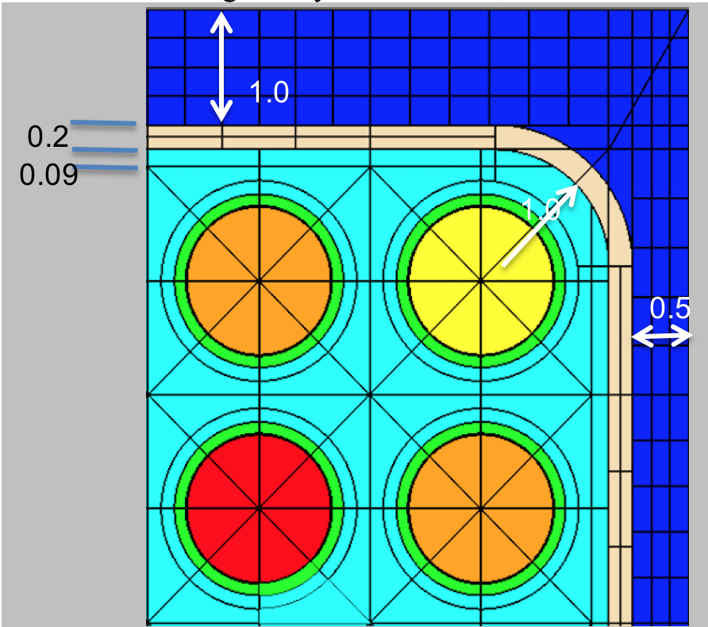
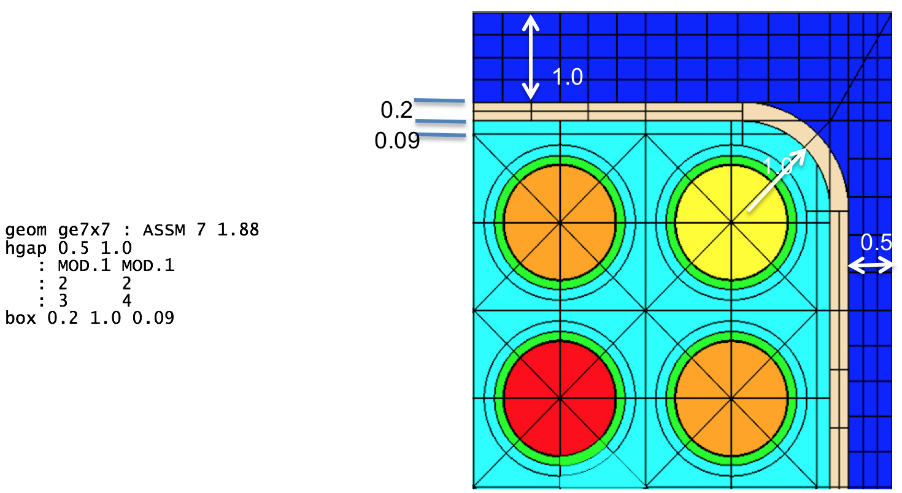
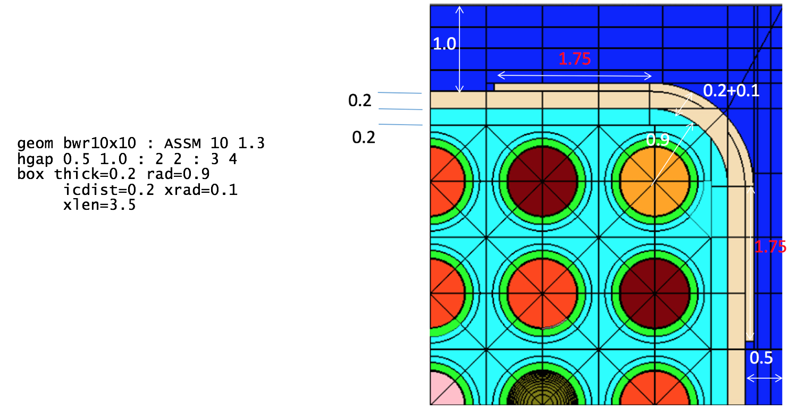
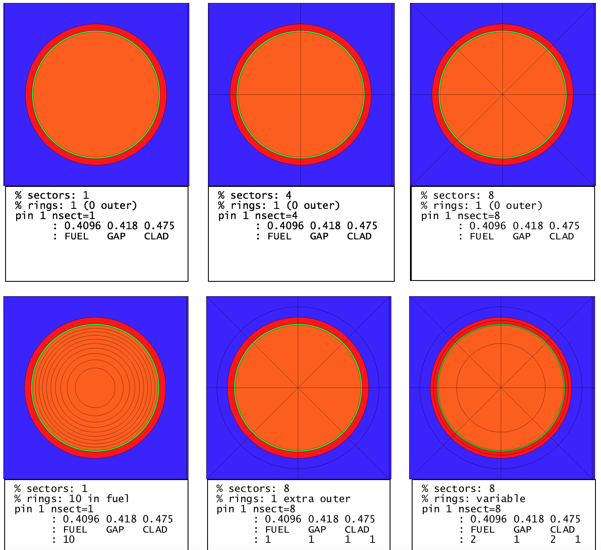

.. _3-2a:

SCALE 6.2 Polaris Input Format
==============================

For the release of SCALE 6.2.3, several new input cards were implemented
into Polaris to model boiling water reactor (BWR) geometries and
neutron/gamma detectors, which requires a gamma transport calculation.
Moreover, improvements to existing input cards were implemented, along
with the ability to specify time-dependent state properties and the
ability to specify one or more depletion histories. This appendix
documents the SCALE 6.2 input cards that were included in the Polaris
input format which are accessible as part of the release of SCALE 6.3.

The old input cards are not available *by default* with SCALE 6.3, and
should be considered deprecated. To maximize backwards compatibility for
input files developed with the original SCALE 6.2.0 release, the old
input options are available if the input file begins with =polaris_6.2.

The following input cards were introduced in SCALE 6.3 and are not
available by default in SCALE 6.2:

-  **cross** – define the interior water cross geometry of SVEA assembly
   designs;

-  **dxmap** (or **dymap**) – define displacement maps that indicate
   that translation of the pin center in the x- (or y-) direction;

-  **control <BLADE>** - define the control blade geometry;

-  **mesh** – define advanced spatial meshing options for different
   materials; and

-  **option <GEOM>** – define geometry tolerances, advance meshing
   options, and plotting options.

-  **option <GAMMA>** – gamma transport calculation

-  **detector** – insert a detector geometry

-  **history** – time dependent history

-  **bui [ti]** – initiate calculation with cumulative burnups [time]
   (with restart)

-  **property<GRAIN>** – used to model stochastic media

-  **state** – the generalized state input is preceded by the
   state<MNAME>, state<INAME>, state<GNAME> variants

.. _3-2a-1:

box – channel box
-----------------

**box** [thick=*Real*] [rad=*Real*] [icdist=*Real*] [xrad=*Real*]
[xlen=*Real*] [Mbox=MNAME]

+-------------+-------------+-------------+-------------+-------------+
| **param**   | **type**    | **name**    | **details** | **default** |
+-------------+-------------+-------------+-------------+-------------+
| thick       | *Real*      | nominal     | must be >0  | none        |
|             |             | thickness   |             |             |
|             |             | (cm)        |             |             |
+-------------+-------------+-------------+-------------+-------------+
| rad         | *Real*      | inner       | must be >0, | none        |
|             |             | corner      |             |             |
|             |             | radius (cm) | additional  |             |
|             |             |             | constraints |             |
|             |             |             | listed      |             |
|             |             |             | below       |             |
+-------------+-------------+-------------+-------------+-------------+
| icdist      | *Real*      | in-channel  | must be >0  | none        |
|             |             | distance    |             |             |
|             |             | (cm)        |             |             |
+-------------+-------------+-------------+-------------+-------------+
| xrad        | *Real*      | extra       | must be >=  | 0           |
|             |             | corner      | 0           |             |
|             |             | thickness   |             |             |
|             |             | (cm)        |             |             |
+-------------+-------------+-------------+-------------+-------------+
| xlen        | *Real*      | extra       | excludes    | 0           |
|             |             | corner      | rounded     |             |
|             |             | length (cm) | corner      |             |
|             |             |             | length      |             |
+-------------+-------------+-------------+-------------+-------------+
| M\ :sub:`bo\| MNAME       | box         |             | \*          |
| x`          |             | material    |             |             |
+-------------+-------------+-------------+-------------+-------------+

..

  \*By default, **box** material will be set to CAN.1 by “system BWR.”
  Otherwise **box** material is required.

.. highlight:: scale

::

  % GE 7x7 assembly with 1.88 cm pin pitch
  %   0.48 cm narrow gap
  %   0.95 cm wide gap
  system BWR
  geom ge7x7 : ASSM 7 1.88
  hgap 0.48 0.95

  % Box geometry
  %   0.2 thickness
  %   0.97 inner corner radius
  %   0.14 in-channel distance
  box 0.2 0.97 0.14

  % Same example, all variables
  box 0.2 0.97 0.14 0 0 CAN.1

Comments:

The **box** specifies the channel box geometry and material that
surround the array of fuel pins.

See also:

**hgap**

.. _fig3-2a-1:

  Box geometry example (uniform thickness).

.. _fig3-2a-2:

  Box geometry example (thick corners).

.. _3-2a-2:

pin – pin or pincell
--------------------

pin – pin or pincell
^^^^^^^^^^^^^^^^^^^^^

| **pin** PINID [nsect=*Int*] [nring=*Int*] [size=*Int*]
| : r\ :sub:`1` r\ :sub:`2` … r\ :sub:`i` … r\ :sub:`N`
| : M\ :sub:`1` M\ :sub:`2` … M\ :sub:`i` … M\ :sub:`N` [M\ :sub:`out`]
| [: nr\ :sub:`1` nr\ :sub:`2` … nr\ :sub:`i` … nr\ :sub:`N`
  nr\ :sub:`out`]
| [: ns\ :sub:`1` ns\ :sub:`2` … ns\ :sub:`i` … ns\ :sub:`N`
  ns\ :sub:`out`]

.. list-table::
  :align: center

  * - .. image:: figs/PolarisA/tab3-2a-2.svg
        :width: 700

..

   \*If not specified, the material class MCLASS is taken from the
   **channel** card (M\ :sub:`chan`) and set to the first member of that
   class, “M\ :sub:`chan`.1.” For example if M\ :sub:`chan`\ =“COOL,”
   then M\ :sub:`out`\ = “COOL.1.”

Examples:

::

  %standard fuel pin
  pin 1 : 0.4096 0.418 0.475
        : FUEL   GAS   CLAD

  %empty guide tube
  pin E :        0.561 0.602
        :       COOL.1 CLAD.1

  %pyrex
  pin P : 0.214 0.231 0.241 0.427 0.437 0.484 0.561 0.602
        : GAS   TUBE  GAS   BP.3  GAS   TUBE  COOL  CLAD

  %standard fuel pin with explicit material in the outermost region
  pin 1 : 0.4096 0.418 0.475
        : FUEL   GAS   CLAD   COOL.6

  %standard fuel pin with explicit ring and sector mesh
  pin 1 : 0.4096 0.418 0.475
        : FUEL   GAS   CLAD
        : 5      1     1      0   %5 rings in fuel
        : 8      1     1      1   %8 sectors only in fuel

  %large central 2x2 water rod in 4x4 assembly
  pin W size=2 : 0.8
               : COOL

  %pinmap must show adjacent Ws
  pinmap
  F F F F
  F W W F
  F W W F
  F F F F

Comments:

The **pin** card is one of the basic building blocks of the assembly
model. It is the only geometry component which allows an integer (*Int*)
identifier as well as a *Word*—all other geometric identifiers use
*Word*. Note that the materials are required, except for the last
M\ :sub:`out`, which can be used to overwrite the material given by a
**channel** for the outermost region in the pincell. The various pin
cell meshing options are displayed in :numref:`fig3-2a-3`. Note that extra
rings in the radial zones create equal area regions, whereas rings in
the outermost region create equal distance divisions between the last
radius and the pincell boundary. Extra sectors create additional
azimuthal divisions. A negative value of sectors is allowed and can be
used to rotate the sector mesh by a half angle, e.g., ns=4 looks like ⊕
and ns=-4 looks like ⊗.

The total number of cells used in the transport calculation is
determined from both the number of rings and the number of sectors. With
the MoC transport solver, the fidelity of the solution is also dictated
by the number of azimuthal and polar angles and ray spacing. These
parameters are changed on the **option<KEFF>** card.

Due to self-shielding and depletion, each cell could be modeled as a
unique material with its own cross section data. However, this is
prohibitively memory intensive and typically not necessary. The
**shield** card provides the mechanism to control the additional
self-shielded materials introduced.

See also:

pinmap, control, insert, channel, system, option<KEFF>, shield

.. _fig3-2a-3:

  Pincell meshing variants.

.. _3-2a-3:

bu – initiate calculation with cumulative burnups
-------------------------------------------------

**bu** [units=*GWD/MTIHM*\ \|\ *MWD/MTIHM*] : [b\ :sub:`1` b\ :sub:`2` …
b\ :sub:`i` … b\ :sub:`N`]

+-------------+-------------+------------------+-------------+-------------+
| **param**   | **Type**    | **name**         | **details** | **default** |
+-------------+-------------+------------------+-------------+-------------+
| units       | GWD/MTIHM\| | burnup units     |             | GWD/MTIHM   |
|             |             |                  |             |             |
|             | MWD/MTIHM   |                  |             |             |
+-------------+-------------+------------------+-------------+-------------+
| b\ :sub:`i` | *Real*      | list of          |             | 0           |
|             |             |                  |             |             |
|             |             | absolute burnups |             |             |
+-------------+-------------+------------------+-------------+-------------+

Examples:

::

  % simple depletion case with constant power and absolute/cumulative burnups
  power 40
  bu 0 5 10 15 20 30 40 50 60 80

  % using MWd/MTIHM units with variable power
  % 40 W/gIHM for 05000 MWD/MTIHM, then 30 W/gIHM for 500010000 MWD/MTIHM
  power  40    30
  bu MWD/MTIHM: 0 5000 10000

  % combine burn/time cards
  % 20 W/gIHM for 05 then 510 GWD/MTIHM steps, then
  % 40 W/gIHM for a 5-day step then 30 W/gIHM for a 5-day step
  power 20
  bu   GWD/MTIHM :  5 10 GWD/MTIHM
  power 40 30
  dt  DAYS :   5  5

Comments:

The **bu** card initiates a calculation for a given sequence of
cumulative burnups. A burnup or time card usually follows a **power**
card, the two effectively specifying the power history. If multiple
burnups are given, then the **power** card must have either a single
power or a list of powers the same size as the list times. A value of 0
is implicit at the beginning of the first burnup list. Multiple
burnup/time cards may be specified in an input. This can be convenient
for switching units or changing from burnup-based to time-based
depletion. Internal automatic substeps are always in effect unless
modified with the **option<DEPL>** card.

See also:

t, dt, dbu, power, option<DEPL>, branch, deplete

.. _3-2a-4:

dbu – initiate calculation with incremental burnups
---------------------------------------------------

**dbu** [units=*GWD/MTIHM*\ \|\ *MWD/MTIHM*] : [b\ :sub:`1` b\ :sub:`2` …
b\ :sub:`i` … b\ :sub:`N`]

+-------------+-------------+---------------------+-------------+-------------+
| **param**   | **Type**    | **name**            | **details** | **default** |
+-------------+-------------+---------------------+-------------+-------------+
| units       | GWD/MTIHM\| | burnup units        |             | GWD/MTIHM   |
|             |             |                     |             |             |
|             | MWD/MTIHM   |                     |             |             |
+-------------+-------------+---------------------+-------------+-------------+
| b\ :sub:`i` | *Real*      | list of             |             | 0           |
|             |             |                     |             |             |
|             |             | incremental burnups |             |             |
+-------------+-------------+---------------------+-------------+-------------+

Examples:

::

  % incremental burnups equivalent to
  %   power 40
  %   bu 0 5 10 15 20 30 40 50 60 80
  power 40
  dbu 5 5 5 5 10 10 10 10 20

Comments:

The **dbu** card initiates a calculation for a given sequence of
*incremental* burnups. Otherwise, it is identical to the **bu** card for
specifying cumulative burnups.

See also:

**t, dt, bu, power, option<DEPL>, branch, deplete**

.. _3-2a-5:

t – initiate calculation by cumulative time
-------------------------------------------

**t**
[units=*SECONDS*\ \|\ *MINUTES*\ \|\ *HOURS*\ \|\ *DAYS*\ \|\ *YEARS*] :
[t\ :sub:`1` t\ :sub:`2` … t\ :sub:`i` … t\ :sub:`N`]

+-------------+-------------+-------------+-------------+-------------+
| **param**   | **Type**    | **name**    | **details** | **default** |
+-------------+-------------+-------------+-------------+-------------+
| units       | *SECONDS*\  | time units  |             | DAYS        |
|             | \|\ *MINUTE |             |             |             |
|             | S*\ \|      |             |             |             |
|             |             |             |             |             |
|             | *HOURS*\ \| |             |             |             |
|             | \ *DAYS*\ \ |             |             |             |
|             | |\ *YEARS*  |             |             |             |
+-------------+-------------+-------------+-------------+-------------+
| t\ :sub:`i` | *Real*      | list of     | 0           | 0           |
|             |             |             |             |             |
|             |             | times       |             |             |
+-------------+-------------+-------------+-------------+-------------+

Examples:

::

  % burn with 40 W/gIHM for 300 days in 100-day increments
  power 40
  t 100 200 300

  % simulate 2 cycles of time-dependent irradiation with shutdown cooling
  % note that time defaults to DAYs
  %
  % cycle 1
  power 40   30   30   30
  t    100  200  300  400
  power  0
  t    415
  %
  % cycle 2
  power 30   20   20   20
  t    515  615  715  815
  power  0
  t    830

Comments:

The **t** card initiates a calculation for a given sequence of
cumulative/absolute times. One of the time cards (**t**, **dt**, or
**ti)** is required to model periods of decay in conjunction with
**power** 0. Otherwise, the time card **t** is similar in functionality
to the burnup **bu** card but with different units.

See also:

**dt, bu, dbu, power, option<DEPL>, branch, deplete**

.. _3-2a-6:

dt – initiate calculation by incremental time
---------------------------------------------

**dt**
[units=*SECONDS*\ \|\ *MINUTES*\ \|\ *HOURS*\ \|\ *DAYS*\ \|\ *YEARS*] :
[\ t\ :sub:`1` t\ :sub:`2` … t\ :sub:`i` … t\ :sub:`N`]

+-------------+-------------+-------------+-------------+-------------+
| **param**   | **Type**    | **name**    | **details** | **default** |
+-------------+-------------+-------------+-------------+-------------+
| units       | *SECONDS*\  | time units  |             | DAYS        |
|             | \|\ *MINUTE |             |             |             |
|             | S*\ \|      |             |             |             |
|             |             |             |             |             |
|             | *HOURS*\ \| |             |             |             |
|             | \ *DAYS*\ \ |             |             |             |
|             | |\ *YEARS*  |             |             |             |
+-------------+-------------+-------------+-------------+-------------+
| t\ :sub:`i` | *Real*      | list of     | 0           | 0           |
|             |             |             |             |             |
|             |             | times       |             |             |
+-------------+-------------+-------------+-------------+-------------+

Examples:

::

  % burn with 40 W/gIHM for 300 days in 100-day increments equivalent to
  %     power 40
  %     t 100 200 300
  power 40
  dt 100 100 100

  % decay for 30 minutes
  power 0
  dt 30 MINUTES

Comments:

The **dt** card is identical to the cumulative time card **t** except
that the values given are incremental.

See also:

t, bu, dbu, power, option<DEPL>, branch, deplete

.. _3-2a-7:

option<ESSM> – embedded self-shielding
^^^^^^^^^^^^^^^^^^^^^^^^^^^^^^^^^^^^^^

| **opt** *ESSM*
| [key\ :sub:`1`\ =val\ :sub:`1` key\ :sub:`2`\ =val\ :sub:`2` …
  key\ :sub:`i`\ =val\ :sub:`i` … key\ :sub:`N`\ =val\ :sub:`N`]

.. list-table::
  :align: center

  * - .. image:: figs/PolarisA/tab3-2a-7.svg
        :width: 700

Examples:

::

  % change within group solver to use source iterations
  opt ESSM WithinGroupSolver=SOURCE

.. _3-2a-8:

option<FG> – few-group cross section generation
-----------------------------------------------

| **opt** *FG*
|     [AdjointMode=String InvVelMode=String]
|     [: b\ :sub:`1` b\ :sub:`2` … b\ :sub:`i` … b\ :sub:`N` ]
|     [: E\ :sub:`1` E\ :sub:`2` … E\ :sub:`i` … E\ :sub:`N-1` ]

+-----------------+-----------------+-----------------+-----------------+
| **param**       | **type**        | **details**     | **default**     |
+=================+=================+=================+=================+
| AdjointMode     | *String*        | type of adjoint | "INFMED"        |
|                 |                 | calculation to  |                 |
|                 |                 | use in          |                 |
|                 |                 | few-group data  |                 |
|                 |                 | generation      |                 |
|                 |                 |                 |                 |
|                 |                 | "INFMED":       |                 |
|                 |                 | infinite medium |                 |
|                 |                 | adjoint         |                 |
|                 |                 |                 |                 |
|                 |                 | "CRITICAL":     |                 |
|                 |                 | critical        |                 |
|                 |                 | spectrum        |                 |
|                 |                 | adjoint         |                 |
|                 |                 |                 |                 |
|                 |                 | "UNIFORM":      |                 |
|                 |                 | uniform adjoint |                 |
+-----------------+-----------------+-----------------+-----------------+
| InvVelMode      | *String*        | weighting       | “FORWARD”       |
|                 |                 | option for      |                 |
|                 |                 | few-group       |                 |
|                 |                 | inverse         |                 |
|                 |                 | velocities      |                 |
|                 |                 |                 |                 |
|                 |                 | “FORWARD”:      |                 |
|                 |                 | forward flux    |                 |
|                 |                 | weighting       |                 |
|                 |                 |                 |                 |
|                 |                 | “ADJOINT”:      |                 |
|                 |                 | adjoint flux    |                 |
|                 |                 | weighting       |                 |
+-----------------+-----------------+-----------------+-----------------+
| b\ :sub:`i`     | *Real*          | list of burnups | all burnups     |
|                 |                 | to include in   | available       |
|                 |                 | output          |                 |
|                 |                 | few-group cross |                 |
|                 |                 | section         |                 |
|                 |                 | database, e.g., |                 |
|                 |                 | XFile16 output  |                 |
|                 |                 |                 |                 |
|                 |                 | units: GWd/MTHM |                 |
+-----------------+-----------------+-----------------+-----------------+
| E\ :sub:`i`     | *Real*          | note descending | 0.625 eV        |
|                 |                 | order and only  | division (two   |
|                 |                 | N-1 divisions   | groups)         |
|                 |                 | are needed for  |                 |
|                 |                 | an N group      |                 |
|                 |                 | structure       |                 |
|                 |                 |                 |                 |
|                 |                 | E\ :sub:`0` is  |                 |
|                 |                 | maximum energy  |                 |
|                 |                 | (typically 2e7  |                 |
|                 |                 | eV)             |                 |
|                 |                 |                 |                 |
|                 |                 | E\ :sub:`N` is  |                 |
|                 |                 | minimum         |                 |
|                 |                 | (typically 1e-5 |                 |
|                 |                 | eV)             |                 |
|                 |                 |                 |                 |
|                 |                 | units: eV       |                 |
+-----------------+-----------------+-----------------+-----------------+

Examples:

::

  % enable the critical spectrum adjoint
  opt FG AdjointMode="CRITICAL"

  %only include 0,10,15,20 GWd/MTHM burnups in few-group outputs, including XFile16
  opt FG : 0 10 15 20

  %redefine group energy divisions for 3 groups with divisions at 10 and 0.625 eV
  opt FG : : 10 0.625

.. _3-2a-9:

state<MNAME> – material state
-----------------------------

| **state** MNAME|MCLASS :
| p\ :sub:`1`\ =val\ :sub:`1` p\ :sub:`2`\ =val\ :sub:`2` …
  p\ :sub:`i`\ =val\ :sub:`i` … p\ :sub:`N`\ =val\ :sub:`N`

+-------------+-------------+-------------+-------------+-------------+
| **param**   | **type**    | **name**    | **details** | **default** |
+-------------+-------------+-------------+-------------+-------------+
| MNAME|MCLAS\| -           | material    | use ALL for |             |
| S           |             | name or     | all         |             |
|             |             |             | materials   |             |
|             |             | material    |             |             |
|             |             | class       |             |             |
+-------------+-------------+-------------+-------------+-------------+
| p\ :sub:`i` | PNAME       | property    |             |             |
|             |             | name        |             |             |
+-------------+-------------+-------------+-------------+-------------+
| val\        | *Value*     | property    |             |             |
| :sub:`i`    |             | value       |             |             |
+-------------+-------------+-------------+-------------+-------------+

Examples:

::

  % reset to hot zero power conditions
  state ALL  : temp=565
  state COOL : dens=0.75

  % set channel/bypass materials to different ppm boron
  state COOL : boron=0
  state BYP  : boron=600

  % set all materials with a boron property
  state ALL : boron=300

Comments:

The **state** card declares the *base state* for materials and the *base
state* of possible control elements or insert elements.

**See also: material, deplete, system**

.. _3-2a-10:

state<INAME> – insert/control state
-----------------------------------

**state** INAME : in=\ *Bool*

+-----------+----------+----------------------+-------------------+-------------+
| **param** | **type** | **name**             | **details**       | **default** |
+-----------+----------+----------------------+-------------------+-------------+
| INAME     | -        | insert name or       |                   |             |
|           |          |                      |                   |             |
|           |          | control element name |                   |             |
+-----------+----------+----------------------+-------------------+-------------+
| in        | Bool     | insertion            | "in=" is required |             |
+-----------+----------+----------------------+-------------------+-------------+

Examples:

::

  % insert bank D control rods
  state BankD : in=true
  % remove inserts named Ins6A
  state Ins6A false
  % perform reflector calculation
  state ReflectorNode : in=true

Comments:

This form of the **state** card is required to insert any control
element or inserts. By default, inserts and control elements are out
when defined.

See also:

**material, deplete, system**

.. _3-2a-11:

state<GNAME> – geometry state
-----------------------------

**state** GNAME : pres=Bool

+-----------+----------+---------------+---------------------+-------------+
| **param** | **type** | **name**      | **details**         | **default** |
+-----------+----------+---------------+---------------------+-------------+
| GNAME     | -        | geometry name |                     |             |
+-----------+----------+---------------+---------------------+-------------+
| pres      | Bool     | present       | “pres=” is required |             |
+-----------+----------+---------------+---------------------+-------------+

Examples:

::

  % disable reflector calculation even though
  % reflector geometry is present
  state ReflectorNode : pres=false

Comments:

The geometry version of the **state** card is used to declare which
geometric elements are present in the system. The geometry version of
the **add** card is useful for performing branch calculations for
reflector nodes. Note that an assembly geometry must be present to
perform a calculation.

See also:

**geometry<REFL>, state<MNAME>, state<INAME>**
