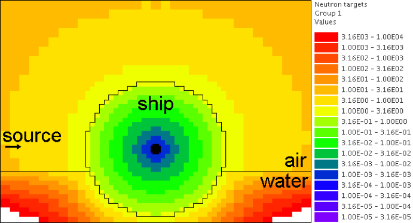
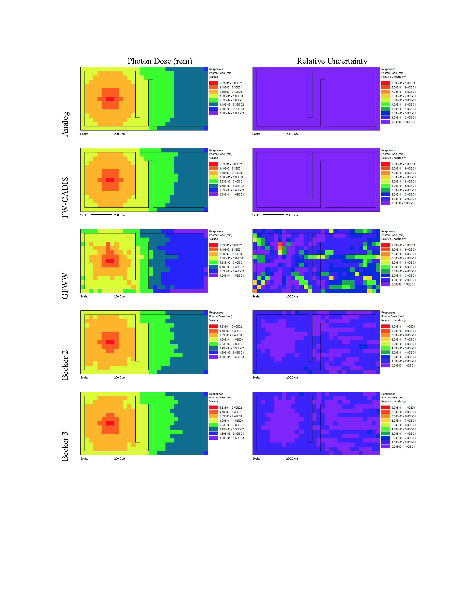
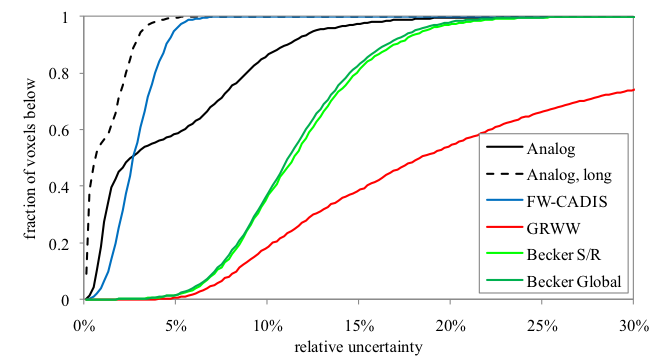
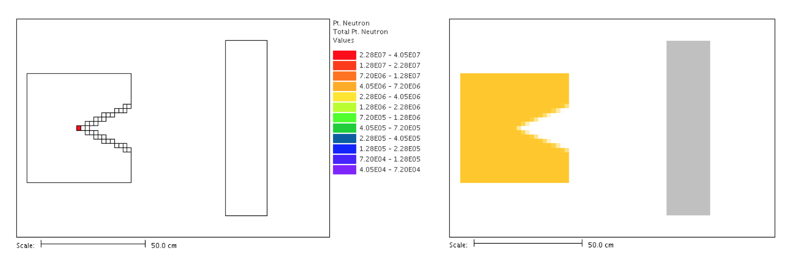
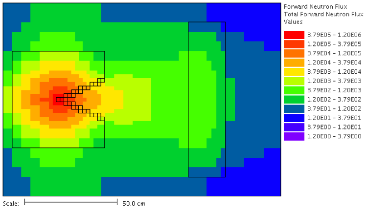
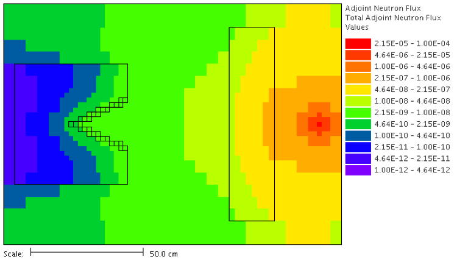

.. _appendixc:

MAVRIC Appendix C: Advanced Features
====================================

This appendix contains information on several advanced features that are
still under development or are non-standard use of the MAVRIC sequence.

Alternate normalization of the importance map and biased source
---------------------------------------------------------------

The importance map and biased source implemented in MAVRIC are only
functions of space and energy. The importance for a specific location
and energy represents the average over all directions. For applications
involving a collimated beam source, a space/energy importance map may
not be representative of the true importance of the particles as they
stream away from the source.

As an example, consider a 14.1 MeV active interrogation beam source 1
meter from a small spherical boat containing illicit nuclear material.
The objective is to compute the fission rate in the nuclear material. To
create the biasing parameters, an adjoint source is located within the
nuclear material and the resulting importance map is shown in
:numref:`fig4c1`. Note that in both the air and water, the importances
change with distance from the ship, but for the beam source, the
importance (to causing a fission in the nuclear material) anywhere along
the beam should be the same, since there is little chance a 14.1 MeV
neutron will interact with the air before striking the ship.

.. _fig4c1:

.. figure:: figs/fig41c.png
  :align: center

  Importance map computed using standard CADIS.

The CADIS algorithm has done exactly what it was supposed to: it made a
space/energy importance map and normalized it such that the target
weight where the 14.1 MeV source particles are born is 1. The problem
with this is that the source particles will stream towards the ship and
strike the hull where the target weight is 0.092. Since source particles
have little chance of interacting in the air, the weight windows are not
used to split the particle as they travel towards the ship. When source
particles cross into the ship, they are split by a factor of 11 to match
the target weight. For this example, splitting each particle by a factor
of 11 once they strike the ship is not so bad, but for longer distances,
this will result in much larger splits. For a polyenergetic source, this
could lead to undersampling of the source and could result in higher
variances.

To remedy this problem when using beam sources, the normalization of the
importance map and biased source should not be done at the source
location but instead at the point where the source particles first
interact with the ship. The keyword “shiftNormPos Δx Δy Δz” will shift
the source normalization position by the amounts Δx, Δy, and Δz when the
biased source and importance map are developed. For the Monaco Monte
Carlo calculation, the source is returned to its normal position. The
source input for the above problem would then be

.. highlight:: none

::

  read sources
      src 1
          title="14.1 DT neutrons - collimated"
          strength=1e30
          sphere 0 origin x=-195 y=0 z=0   (true source position)
          eDistributionID=1    (a mono-energetic 14.1 MeV distribution)
          direction 1.0 0.0 0.0
          dDistributionID=2    (a 2° beam )
          shiftNormPos 107.7 0.0 0.0    (just inside the hull)
      end src
  end sources

where the shift moves the source position from x = -195 to x = -87.3,
just inside the hull. The resulting target weights are shown in
:numref:`fig4c2` The source particles are born with weight 1 in a
location with a target weight 10.9. The particle weight is not checked
until the particle crosses into the hull, where the target weight is
1.0.

.. _fig4c2:

  Targets weights using the “shiftNormPos” keyword.

Other options to manipulate the importance map for special situations
include the “mapMultiplier=\ *f*\ ” keyword (in the importanceMap block
or the biasing block), which will multiply every target weight by the
factor *f*, and the keyword “noCheckAtBirth” in the parameters block
will prevent the weight windows from being applied to source particles
when they are started. When used in the MAVRIC sequence, the
“shiftNormPos” capability automatically adds “noCheckAtBirth” to the
Monaco input that is created.

Importance maps with directional information
--------------------------------------------

In MAVRIC, the CADIS method is implemented in space and energy, but in
general, it could also include particle direction as well. This
formulation would be the following:

.. list-table::
  :header-rows: 1
  :align: left

  * - True source:
    - .. math:: q\left( \overrightarrow{r},E,\widehat{\Omega} \right)
  * - Desired response:
    - .. math:: \sigma\left( \overrightarrow{r},E,\widehat{\Omega}\right)
  * - Adjoint flux using  :math:`q^{+}\left( \overrightarrow{r},E,\widehat{\Omega} \right) = \ \sigma \left( \overrightarrow{r},E,\widehat{\Omega} \right)`:
    - .. math:: \psi^{+}\left( \overrightarrow{r},E,\widehat{\Omega} \right)
  * - Estimate of detector response
    - .. math::
        :label: eq4c1

        R = \iiint_{}^{}{q\left( \overrightarrow{r},E,\widehat{\Omega} \right)\ \psi^{+}\left( \overrightarrow{r},E,\widehat{\Omega}\right)}d\text{Ω } dE \ dV
  * - Biased source:
    - .. math::
        :label: eq4c2

        \widehat{q}\left( \overrightarrow{r},E,\widehat{\Omega} \right) = \frac{1}{R}q\left( \overrightarrow{r},E,\widehat{\Omega} \right)\ \psi^{+}\left( \overrightarrow{r},E,\widehat{\Omega} \right)
  * - Target weight windows:
    - .. math::
        :label: eq4c3

        \overline{w}\left( \overrightarrow{r},E,\widehat{\Omega} \right) = \frac{R}{\psi^{+}\left( \overrightarrow{r},E,\widehat{\Omega} \right)}

For a system using a deterministic method to compute the adjoint fluxes,
this completely general, space/energy/angle, approach presents many
difficulties in implementation, namely,

a. dealing with the amount of memory required for a
   :math:`\left( \overrightarrow{r},E,\widehat{\Omega} \right)`
   importance map in memory,

b. interpolating the importance for particle directions in between
   quadrature angles, and

c. expressing the biased source in a form suitable for a general MC code
   since the above biased source is, in general, not separable.

Approaches incorporating directional information
~~~~~~~~~~~~~~~~~~~~~~~~~~~~~~~~~~~~~~~~~~~~~~~~

Completely general space/energy/angle CADIS is most likely too difficult
to implement and may not be necessary for most applications. In most
real problems that involve directionally dependent source distributions,
the directional dependence is azimuthally symmetric about some reference
direction, :math:`\widehat{d}`. The angular distribution,
:math:`q_{i}\left( \widehat{\Omega} \right)`, can be expressed as the
product of the uniform azimuthal distribution and a polar distribution
about reference direction :math:`{\widehat{d}}_{i}` giving
:math:`\frac{1}{2\pi}q_{i}\left( \widehat{\Omega} \bullet {\widehat{d}}_{i} \right)`.
The geometric size of these sources tends to be small, allowing each
source distribution to be expressed as the product of two separable
distributions:
:math:`q_{i}\left( \overrightarrow{r},E,\widehat{\Omega} \right) \cong q_{i}\left( \overrightarrow{r},E \right)\ q_{i}\left( \widehat{\Omega} \right)`.

What is needed is a CADIS method that (1) can account for the importance
of a particle traveling in a certain direction; (2) can be cast as a
simple modification of the space/energy CADIS method using
:math:`\overline{w}\left( \overrightarrow{r},E \right)` and
:math:`\widehat{q}\left( \overrightarrow{r},E \right)`; and (3) is
simpler than the full space/angle/energy approach. This can be done
starting with the approximation that the angular component of the
adjoint flux
:math:`\psi^{+}\left( \overrightarrow{r},E,\widehat{\Omega} \right)` is
separable and symmetric about the average adjoint current direction
:math:`\widehat{n}\left( \overrightarrow{r},E \right)`, such that

.. math:: \psi^{+}\left( \overrightarrow{r},E,\widehat{\Omega} \right) \cong \phi^{+}\left( \overrightarrow{r},E \right)\ \frac{1}{2\pi}f\left( \widehat{\Omega} \bullet \widehat{n} \right)\text{\ .}

This is similar to the AVATAR approach :cite:`van_riper_avatar_1997` but with explicitly
including the azimuthal distribution so that the standard definition
:math:`\int_{}^{}{\phi^{+}\left( \overrightarrow{r},E \right)\ \frac{1}{2\pi}f\left( \widehat{\Omega} \bullet \widehat{n} \right)\ d\widehat{\Omega}} = \phi^{+}\left( \overrightarrow{r},E \right)`
applies. The probability distribution function
:math:`f\left( \mu \right)` describing the shape of the azimuthally
symmetric current at :math:`\left( \overrightarrow{r},E \right)` has the
form of

.. math:: f\left( \mu \right) = \frac{\lambda e^{\text{λμ}}}{2\ \mathrm{\sinh}\left( \lambda \right)}\ ,

with the single parameter
:math:`\lambda\left( \overrightarrow{r},E \right)` determined from
:math:`\overline{\mu}\left( \overrightarrow{r},E \right)`, the average
cosine of scatter.

From this, we can propose that weight window targets be developed that
are inversely proportional to the approximation of the adjoint angular
flux:

.. math::
  :label: eq4c4

  \overline{w}\left( \overrightarrow{r},E,\widehat{\Omega} \right) = \frac{2\pi\ k}{\phi^{+}\left( \overrightarrow{r},E \right) \ \ f\left( \widehat{\Omega} \bullet \widehat{n} \right)}\ ,

where :math:`k` is the constant of proportionality that will be adjusted
to make the importance map consistent with the biased source(s). Two
methods will be examined here, one without and one with biasing of the
source directional dependence.

For both of the methods, the S\ :sub:`N` code Denovo was modified to
report not only the adjoint scalar fluxes,
:math:`\phi^{+}\left( \overrightarrow{r},E \right)`, but also the
adjoint net currents in :math:`x`, :math:`y`, and :math:`z` directions:
:math:`J_{x}\left( \overrightarrow{r},E \right)`,
:math:`\ J_{y}\left( \overrightarrow{r},E \right)`, and
:math:`J_{z}\left( \overrightarrow{r},E \right)`. These currents are
used to find :math:`\widehat{n}\left( \overrightarrow{r},E \right)` and
:math:`\lambda\left( \overrightarrow{r},E \right)`. The following
methods have been developed so that the standard CADIS routines can be
used to compute space/energy quantities of the response per unit source
:math:`R`, the weight window target values
:math:`\overline{w}\left( \overrightarrow{r},E \right)`, and biased
source :math:`\widehat{q}\left( \overrightarrow{r},E \right)` with just
the adjoint scalar fluxes. These quantities are then modified by the
directional information.

Directionally dependent weight windows without directional source biasing
~~~~~~~~~~~~~~~~~~~~~~~~~~~~~~~~~~~~~~~~~~~~~~~~~~~~~~~~~~~~~~~~~~~~~~~~~

It is proposed that the biased source
:math:`\widehat{q}\left( \overrightarrow{r},E,\widehat{\Omega} \right)`
should be proportional to both the true source distribution and the
space/energy component of the adjoint flux:

.. math:: \widehat{q}\left( \overrightarrow{r},E,\widehat{\Omega} \right) = \frac{1}{R}\left\lbrack q\left( \overrightarrow{r},E \right)\ \frac{1}{2\pi}q\left( \widehat{\Omega} \bullet \widehat{d} \right) \right\rbrack\ \phi^{+}\left( \overrightarrow{r},E \right)\ ,

where the constant of proportionality, :math:`R`, is determined by
forcing
:math:`\widehat{q}\left( \overrightarrow{r},E,\widehat{\Omega} \right)`
to be a pdf. Since the angular component of the adjoint flux is not
included, the directional distribution of the biased source will be
exactly the same as the true source. Note that this approach would be
exact for cases where no directional biasing could be applied – beam
sources.

For multiple sources (each with a probability distribution function
:math:`q_{i}\left( \overrightarrow{r},E \right)` and a strength
:math:`S_{i}`, giving a total source strength of
:math:`S = \sum_{}^{}S_{i}`), the user is required to provide one point
in phase space
:math:`\left( {\overrightarrow{r}}_{i},E_{i},{\widehat{\Omega}}_{i} \right)`
for each source :math:`i` that is representative of that entire source
where the biased source will match the target weight windows. For each
source, a vector
:math:`{\widehat{n}}_{i} = \widehat{n}\left( {\overrightarrow{r}}_{i},E_{i} \right)`
is computed using that point. For the general case of multiple sources,
the biased source sampling distribution, the biased source
distributions, and the weight windows are computed using

.. list-table::
  :align: left

  * - .. math:: R_{i} =
    - .. math:: \iint_{}^{}{q_{i}\left( \overrightarrow{r},E\right)\ \phi^{+}\left( \overrightarrow{r},E \right)} dE \ dr
    - estimated response from source *i*
  * - .. math:: \widehat{p}\left( i \right) =
    - .. math:: \frac{{S_{i}R}_{i}\ f\left( {\widehat{\Omega}}_{i} \bullet {\widehat{n}}_{i} \right)}{\sum_{}^{}{{S_{i}R}_{i}\ f\left( {\widehat{\Omega}}_{i} \bullet {\widehat{n}}_{i} \right)}}
    - biased sampling of source *i*
  * - .. math:: {\widehat{q}}_{i}\left(\overrightarrow{r},E,\widehat{\Omega} \right) =
    - .. math:: \frac{1}{R_{i}}q_{i}\left( \overrightarrow{r},E \right)\ \phi^{+}\left( \overrightarrow{r},E \right)\ \frac{1}{2\pi}q_{i}\left( \widehat{\Omega} \bullet {\widehat{d}}_{i} \right) =
    - .. math:: {\widehat{q}}_{i}\left( \overrightarrow{r},E\right)\ \frac{1}{2\pi}q_{i}\left( \widehat{\Omega} \bullet {\widehat{d}}_{i} \right)
  * - .. math:: \overline{w}\left( \overrightarrow{r},E,\widehat{\Omega} \right) =
    - .. math:: \frac{\sum_{}^{}{{S_{i}R}_{i}\ f\left( {\widehat{\Omega}}_{i} \bullet {\widehat{n}}_{i} \right)}}{S\phi^{+}\left( \overrightarrow{r},E \right)}\frac{1}{\ f\left( \widehat{\Omega} \bullet \widehat{n} \right)} =
    - .. math:: \frac{\sum_{}^{}{{S_{i}R}_{i}\ f\left( {\widehat{\Omega}}_{i} \bullet {\widehat{n}}_{i} \right)}}{\sum_{}^{}{S_{i}R}_{i}}\overline{w}\left( \overrightarrow{r},E \right)\frac{1}{f\left( \widehat{\Omega} \bullet \widehat{n} \right)}

Directionally dependent weight windows with directional source biasing
~~~~~~~~~~~~~~~~~~~~~~~~~~~~~~~~~~~~~~~~~~~~~~~~~~~~~~~~~~~~~~~~~~~~~~

Here it is proposed that the biased source be proportional to both the
true source distribution and the approximation of the adjoint angular
flux. With a small geometric source, it is also assumed that there is
one vector,
:math:`{\widehat{n}}_{0} = \widehat{n}\left( {\overrightarrow{r}}_{0},E_{0} \right),`
evaluated at a specific location and energy, which represents the
adjoint current direction over that source. The biased source then looks
like

.. list-table::
  :align: left
  :widths: 10 2 100

  * - .. math:: \widehat{q}\left( \overrightarrow{r},E,\widehat{\Omega} \right)
    - .. math:: =
    - .. math:: \frac{1}{\text{Rc}}q\left( \overrightarrow{r},E,\widehat{\Omega} \right)\\psi^{+}\left( \overrightarrow{r},E,\widehat{\Omega} \right)
  * -
    - .. math:: =
    - .. math:: \frac{1}{\text{Rc}}\left\lbrack q\left( \overrightarrow{r},E \right)\ \frac{1}{2\pi}q\left( \widehat{\Omega} \bullet {\widehat{d}}_{i} \right) \right\rbrack\ \left\lbrack \phi^{+}\left( \overrightarrow{r},E \right)\ \frac{1}{2\pi}\ f\left( \widehat{\Omega} \bullet {\widehat{n}}_{0} \right) \right\rbrack\ ,

where the constant :math:`\text{Rc}` is used to make :math:`\widehat{q}`
a pdf. Note that if either the original source directional distribution
:math:`q\left( \widehat{\Omega} \right)` or the adjoint angular flux
distribution at the source is isotropic, then
:math:`c = \frac{1}{4\pi}`.

For the general case of multiple sources, the biased source sampling
distribution, the biased source distributions and the weight windows are

.. list-table::
  :align: center

  * - .. math:: R_{i}
    - =
    - .. math:: \iint_{}^{}{q_{i}\left( \overrightarrow{r},E\right)\ \phi^{+}\left( \overrightarrow{r},E \right)}\text{dE}\ \text{dr}
    -
    -
  * - .. math:: c_{i}
    - =
    - .. math:: \int_{}^{}{\frac{1}{2\pi}q_{i}\left( \widehat{\Omega} \bullet {\widehat{d}}_{i} \right)\ \frac{1}{2\pi}f\left( \widehat{\Omega} \bullet {\widehat{n}}_{i} \right)}d\widehat{\Omega}
    -
    -
  * - .. math:: \widehat{p}\left( i \right)
    - =
    - .. math:: \frac{{S_{i}R}_{i}c_{i}}{\sum_{}^{}{{S_{i}R}_{i}c_{i}}}
    -
    -
  * - .. math:: {\widehat{q}}_{i}\left( \overrightarrow{r},E,\widehat{\Omega} \right)
    - =
    - .. math:: \left\lbrack \frac{1}{R_{i}}\ q_{i}\left( \overrightarrow{r},E \right)\ \phi^{+}\left( \overrightarrow{r},E \right) \right\rbrack\ \left\lbrack \frac{1}{c_{i}}\ q_{i}\left( \widehat{\Omega} \right)\ f\left( \widehat{\Omega} \right) \right\rbrack
    - =
    - .. math:: {\widehat{q}}_{i}\left( \overrightarrow{r},E \right)\ \frac{1}{c_{i}}\ \frac{1}{2\pi}q_{i}\left( \widehat{\Omega} \bullet {\widehat{d}}_{i} \right)\ \frac{1}{2\pi}f\left( \widehat{\Omega} \bullet {\widehat{n}}_{i} \right)
  * - .. math:: \overline{w}\left( \overrightarrow{r},E,\widehat{\Omega} \right)
    - =
    - .. math:: \frac{\sum_{}^{}{{S_{i}R}_{i}c_{i}}}{S\phi^{+}\left( \overrightarrow{r},E \right)} \ \ \frac{2\pi}{\ f\left( \widehat{\Omega} \bullet \widehat{n} \right)}
    - =
    - .. math:: \frac{\sum_{}^{}{{S_{i}R}_{i}c_{i}}}{\sum_{}^{}{S_{i}R}_{i}} \ \ \overline{w}\left( \overrightarrow{r},E \right)\ \frac{2\pi}{f\left( \widehat{\Omega} \bullet \widehat{n} \right)} \ .

More details on the development of these methods and their application
for several problems have been presented :cite:`peplow_hybrid_2010,peplow_consistent_2012`.

Using space/energy/angle CADIS in MAVRIC
~~~~~~~~~~~~~~~~~~~~~~~~~~~~~~~~~~~~~~~~

The two angular CADIS methods that use the AVATAR-type approximation of
adjoint flux are specified in MAVRIC with the “angularBiasing=” keyword
in the importanceMap block. Values for this keyword are 1 or 2.

Space/Energy/Angle CADIS without directional biasing (for beam sources)
– This method uses one specific location,
:math:`{\overrightarrow{r}}_{0}`, energy, :math:`E_{0}`, and direction,
:math:`{\widehat{\Omega}}_{0},` which is the reference direction of the
source :math:`\widehat{d}`, where the weight of the biased source
matches the weight window.

Space/Energy/Angle CADIS with directional biasing (for general sources)
– This method uses one specific energy, :math:`E_{0}`, to determine the
adjoint current vector :math:`{\widehat{n}}_{0}` and the
:math:`\lambda_{0}` parameter for the biased angular distribution for
each source.

With each method, the user must specify at what energy the importance
map and the biased sources should be made consistent. The particle type
must also be specified. This is done with the keywords “angBiasParType=”
(1 for neutron or 2 for photon) and “angBiasEnergy=” (with a value in
eV), also in the importanceMap block.

Note that all sources should have a direction :math:`\widehat{d}` set,
using “direction *u v w*\ ” within each source, even if the angular
distribution for a given source is isotropic. The direction is used for
source biasing and for aligning the weight windows and biased sources.
Also note that for either angular biasing method, the Denovo S\ :sub:`N`
calculation must use a Legendre order greater than 0.

With angular biasing, a mesh angular information (\*.mai) file is
produced which can be visualized with the MeshFileViewer. This file
contains the space/energy-dependent
:math:`\lambda\left( \overrightarrow{r},E \right)` values and components
of the average adjoint current direction
:math:`\widehat{n}\left( \overrightarrow{r},E \right) = \left\langle n_{x},n_{y},n_{z} \right\rangle`.
An existing mesh angular information (\*.mai) file can be used in a
separate MAVRIC problem by using the “meshAngInfoFile=” keyword in the
biasing block.

Example problem
~~~~~~~~~~~~~~~

Consider the Ueki shielding problem used as sample problems in the
Monaco and MAVRIC manuals. The goal is to calculate the neutron dose on
one side of a shield from a partially collimated :sup:`252`\ Cf source
on the other side of the shield. Both of the angular approaches
discussed above can be compared to analog and standard space/energy
CADIS calculations. For the analog calculations, no importanceMap block
is used. For the other cases, the importance map blocks are shown below.

.. list-table::
  :align: center

  * - ::

        CADIS

    - ::

        Angular CADIS 1 -
        without a biased source
        angular dist.

    - ::

        Angular CADIS 2 -
        with a biased source
        angular dist.

  * - ::

        read importanceMap
            adjointSource 1
                locationID=1
                responseID=5
            end adjointSource
            gridGeometryID=7
            macromaterial
              mmTolerance=0.01
            end macromaterial

        end importanceMap

    - ::

        read importanceMap
            adjointSource 1
                locationID=1
                responseID=5
            end adjointSource
            gridGeometryID=7
            macromaterial
              mmTolerance=0.01
            end macromaterial

            angularbiasing=1
            angBiasParType=1
            angBiasEnergy=2.0e6
        end importanceMap

    - ::

        read importanceMap
            adjointSource 1
                locationID=1
                responseID=5
            end adjointSource
            gridGeometryID=7
            macromaterial
              mmTolerance=0.01
            end macromaterial

            angularbiasing=2
            angBiasParType=1
            angBiasEnergy=2.0e6
        end importanceMap

Note that the energy at which to tie the importance map to the biased
source, 2 MeV, is about the average energy of the source energy
distribution. The figure-of-merit (FOM) of the calculation could change
as this parameter is varied.

Results, shown in :numref:`tab4c1`, demonstrate that the two directional
approaches improved the FOM for this problem by more than a factor of 2.
A larger boost is seen in method 2 where biasing is applied to the
source directional distribution. In this case, the biased source
distribution was an exponential distribution with a power of 2.45,
significantly sampling more source neutrons in the direction of the
shield than into the paraffin collimator block.

Note that the space/energy/angle CADIS methods require more memory to
hold the importance information. Improvements to the CADIS calculation
can also be made with a judicious choice of standard source direction
biasing, without an increase in memory requirements. A simple
distribution (where :math:`\mu = 0.924` represents the edge of the cone
cutout and :math:`\mu = 0.974` is the center half of the shield
dimension) added that to the source

::

    distribution 2
        abscissa -1.0     0.924    .974   1.0 end
        truepdf      0.962     0.025   .013   end
        biasedpdf    0.500     0.250  0.250   end
    end distribution

    src 1
        neutrons  strength=4.05E+07
        cuboid  0.01 0.01  0 0  0 0
        eDistributionID=1
        direction 1.0 0.0 0.0
        dDistributionID=2
    end src

results in an FOM improvement of nearly 3 over the standard CADIS without the overhead of the angular CADIS methods.

.. list-table:: Results of the Ueki Shielding Problem (35 cm graphite shield)
  :align: center
  :name: tab4c1

  * - Calculation Method
    - Adj. S\ :sub:`N` (min)
    - MC (min)
    - dose rate (rem/hr)
    - relative
      uncert
    - MC FOM
      (/min)
  * - Analog
    - 0.0
    - 152.7
    - 3.998E-03
    - 0.0101
    - 64.7
  * - CADIS
    - 0.2
    - 9.9
    - 3.998E-03
    - 0.0081
    - 1550
  * - Directional CADIS 1,
      no src bias
    - 0.2
    - 10.3
    - 4.035E-03
    - 0.0054
    - 3390
  * - Directional CADIS 2,
      with src bias
    - 0.2
    - 10.0
    - 4.012E-03
    - 0.0049
    - 4190
  * - CADIS, standard src
      dir. bias
    - 0.2
    - 10.0
    - 3.998E-03
    - 0.0047
    - 4550

A series of problems was used to compare the space/energy/angle CADIS to
the standard space/energy CADIS. Most of the problems saw an improvement
of a factor of about 2 or 3. Some problems did not improve at all, and
some photon problems actually performed worse. In that case (a photon
litho-density gauge), it could be that the angular approximation for
importance, an exponential function in :math:`\mu`, cannot adequately
describe the true importance.

Since the space/energy/angle CADIS methods are more difficult to explain
(more theory, adjustable parameters set by the user), require more
memory than standard CADIS, and may not offer any improvement over
standard space/energy CADIS, they have not been made part of the main
MAVRIC manual and have been left as an advanced/developing feature.
These methods were not removed from the MAVRIC code since they may be
helpful to future problems.

University of Michigan methods for global variance reduction
------------------------------------------------------------

The use of hybrid deterministic/Monte Carlo methods, particularly for
global variance reduction, has been an active area of research by the
transport team at the University of Michigan for a long time. One of the
first approaches studied was a way to develop Monte Carlo weight window
target values that were proportional to deterministically estimated
values of the forward flux :cite:`cooper_automated_2001`. For global problems using isotropic
weight windows, this reference argues that in order to get uniform
relative uncertainties in the Monte Carlo calculation, the weight
windows should be set such that the number density of Monte Carlo
particles, :math:`m\left( \overrightarrow{r} \right)`, is constant. The
physical particle density, :math:`n\left( \overrightarrow{r} \right)`,
is related by the average weight,
:math:`\overline{w}\left( \overrightarrow{r} \right)`, to the Monte
Carlo particle density by

.. math:: n\left( \overrightarrow{r} \right) = \overline{w}\left( \overrightarrow{r} \right)\ m\left( \overrightarrow{r} \right) \ .

To make :math:`m\left( \overrightarrow{r} \right)` constant over the
geometry, the weight window targets
:math:`\overline{w}\left( \overrightarrow{r} \right)` need to be
proportional to the physical particle density. Cooper and Larsen
calculate the weight window targets from an estimate of the forward
scalar flux :math:`\phi\left( \overrightarrow{r} \right)` to be

.. math:: \overline{w}\left( \overrightarrow{r} \right) = \frac{\phi\left( \overrightarrow{r} \right)}{\mathrm{\max}\left( \phi\left( \overrightarrow{r} \right) \right)} \ .

Two approaches have since been developed :cite:`becker_application_2009`, based on what global
information the user desires from the simulation: global flux weight
windows, for obtaining every energy group at every location, and global
response weight windows, for obtaining an energy-integrated response at
every spatial location. Both of these methods are designed for
calculating the “global solution” – everywhere in the geometry of the
problem – with nearly uniform statistics.

Note that none of the University of Michigan methods discussed here
included the development of biased sources. These methods have all been
extended to include a consistent biased source by ORNL during their
implementation in the MAVRIC sequence of SCALE. The methods have also
been extended by ORNL for multiple sources.

Weight windows using only forward estimates of flux
~~~~~~~~~~~~~~~~~~~~~~~~~~~~~~~~~~~~~~~~~~~~~~~~~~~

Global flux weight windows
^^^^^^^^^^^^^^^^^^^^^^^^^^

This method keeps the Monte Carlo particle distribution uniform in space
and energy. Note that this is a space/energy version of the original
space-only Cooper’s Method. The target weight windows,
:math:`\overline{w}\left( \overrightarrow{r},E \right)`, should be
proportional to the estimate of the forward scalar flux,
:math:`\phi\left( \overrightarrow{r},E \right)`.

.. math:: \overline{w}\left( \overrightarrow{r},E \right) = c\ \phi\left( \overrightarrow{r},E \right) \ .

A biased source distribution,
:math:`\widehat{q}\left( \overrightarrow{r},E \right)`, that is
consistent with the target weight windows can be found from the true
source distribution, :math:`q\left( \overrightarrow{r},E \right)`, and
the forward flux to be

.. math:: \widehat{q}\left( \overrightarrow{r},E \right) = \ \frac{1}{c}\ \frac{q\left( \overrightarrow{r},E \right)}{\phi\left( \overrightarrow{r},E \right)}\ ,

where the constant *c* can be determined so that the biased source
distribution is a probability distribution function,

.. math:: c = \int_{V}^{}{\int_{E}^{}{\ \frac{q\left( \overrightarrow{r},E \right)}{\phi\left( \overrightarrow{r},E \right)}\ \text{dE}\ d\overrightarrow{r}}} \ .

Thus, using the estimate of forward flux, we can first compute *c* and
then form a consistent set of weight window target values and a biased
source distribution.

Global response weight windows
^^^^^^^^^^^^^^^^^^^^^^^^^^^^^^

For an energy-integrated response (such as dose) desired at all spatial
locations, this method keeps the Monte Carlo particle distribution
proportional to the integral of the product of the response function,
:math:`\sigma_{d}\left( \overrightarrow{r},E \right)`, and the estimate
of the forward flux, :math:`\phi\left( \overrightarrow{r},E \right)`.
The energy-integrated response,
:math:`D\left( \overrightarrow{r} \right)`, is found from the estimate
of the forward flux as

.. math:: D\left( \overrightarrow{r} \right) = \int_{E}^{}{\sigma_{d}\left( \overrightarrow{r},E \right)\ \phi\left( \overrightarrow{r},E \right) DE } .

The target weight windows,
:math:`\overline{w}\left( \overrightarrow{r},E \right)`, should be

.. math:: \overline{w}\left( \overrightarrow{r},E \right) = c\ \frac{D\left( \overrightarrow{r} \right)}{\sigma_{d}\left( \overrightarrow{r},E \right)} \ .

A biased source distribution,
:math:`\widehat{q}\left( \overrightarrow{r},E \right)`, that is
consistent with the target weight windows can be found from the true
source distribution, :math:`q\left( \overrightarrow{r},E \right)`, and
the forward dose estimate to be

.. math:: \widehat{q}\left( \overrightarrow{r},E \right) = \ \frac{1}{c}\ \frac{q\left( \overrightarrow{r},E \right)\ \sigma_{d}\left( \overrightarrow{r},E \right)}{D\left( \overrightarrow{r} \right)}

using a proportionality constant of

.. math:: c = \int_{V}^{}{\frac{1}{D\left( \overrightarrow{r} \right)}\int_{E}^{}{q\left( \overrightarrow{r},E \right)\ \sigma_{d}\left( \overrightarrow{r},E \right)\ \text{dE}\ d\overrightarrow{r}}}\text{\ .}

Implementation in MAVRIC
^^^^^^^^^^^^^^^^^^^^^^^^

The global flux weight windows (GFWW) approach and the global response
weight windows (GRWW) are both triggered by specifying an importance map
block without any adjoint sources. For the GRWW approach, the response
of interest is listed in the importance map block. If none is listed,
GFWW is used.

For problems with multiple sources (each with probability distribution
function :math:`q_{i}\left( \overrightarrow{r},E \right)` and strength
:math:`S_{i}`, giving a total source strength of
:math:`S = \sum_{}^{}S_{i}`), the GWW methods require a biased mesh
source for each. This was implemented in MAVRIC in a manner similar to
the multiple source CADIS routines. Each biased source,
:math:`{\widehat{q}}_{i}\left( \overrightarrow{r},E \right)`, is
developed as

.. math::

   {\widehat{q}}_{i}\left( \overrightarrow{r},E \right) = \left\{ \begin{matrix}
   \frac{1}{c_{i}}\frac{q_{i}\left( \overrightarrow{r},E \right)}{\phi\left( \overrightarrow{r},E \right)} & \text{global\ flux\ weight\ windows} \\
   \frac{1}{c_{i}}\ \frac{q_{i}\left( \overrightarrow{r},E \right)\ \sigma_{d}\left( \overrightarrow{r},E \right)} {D\left( \overrightarrow{r} \right)} & \text{global\ response\ weight\ windows} \\
   \end{matrix} \ \ , \right.\

where :math:`c_{i}` is a normalization constant. The weight windows are
then set to

.. math::

  \overline{w}\left( \overrightarrow{r},E \right) = \left\{ \begin{matrix}
  \frac{\sum_{}^{}c_{i}}{\sum_{}^{}S_{i}}\ \phi\left( \overrightarrow{r},E \right) & \text{global flux weight windows} \\
  \frac{\sum_{}^{}c_{i}}{\sum_{}^{}S_{i}}\ \frac{D\left( \overrightarrow{r} \right)}{\sigma_{d}\left( \overrightarrow{r},E \right)} & \text{global response weight windows} \\
  \end{matrix} \right.\ \ \ \ .

In the final Monte Carlo, the specific source *i* is sampled with
probability :math:`p\left( i \right) = \ S_{i}/S`, and then the particle
is sampled from the biased mesh source
:math:`{\widehat{q}}_{i}\left( \overrightarrow{r},E \right)`. Unlike the
CADIS method for multiple sources, there is no way to develop a biased
probability distribution for which source to sample without knowing the
contribution to the global estimate from each source separately.

For multiple source problems where the expected contribution from each
source is very different from the true strengths of those sources, it
may be more efficient to run a series of problems with one source each
for different amounts of time. The resulting mesh tallies can then be
added together using the mesh tally adder (part of the MAVRIC
utilities).

Methods using forward and adjoint estimates
~~~~~~~~~~~~~~~~~~~~~~~~~~~~~~~~~~~~~~~~~~~

Becker :cite:`becker_hybrid_2009` proposed three methods for developing weight windows based
on both forward and adjoint deterministic solutions. These three methods
correspond to the portion of the phase space over which uniform relative
uncertainties are desired: a small “detector” region, a region
comprising a significant portion of the entire problem, and the global
problem. In this discussion, only a brief outline of each method,
focusing on its implementation into MAVRIC, will be given.

Source/detector problems
^^^^^^^^^^^^^^^^^^^^^^^^

For a small detector of volume :math:`V_{D}`\ where we want to optimize
the MC calculation of the detector response

.. math:: R = \int_{V_{D}}^{}{\int_{0}^{\infty}{\sigma\left( \overrightarrow{r},E \right)\ \phi\left( \overrightarrow{r},E \right)}\text{dE}\ \text{dV}}

or optimize for the energy dependent flux at the detector, the following
is used:

.. list-table::
  :align: center

  * - forward flux
      estimate
    - .. math::
        :label: eq4c5

        \phi\left( \overrightarrow{r},E \right)
  * - adjoint source
      for flux
    - .. math:: q^{+}\left( \overrightarrow{r},E \right) = \frac{1}{\phi\left( \overrightarrow{r},E \right)}
  * - or for response
    - .. math:: q^{+}\left( \overrightarrow{r},E \right) = \sigma\left( \overrightarrow{r},E \right)
  * - adjoint flux
    - .. math:: \phi^{+}\left( \overrightarrow{r},E \right)
  * - contributon flux
    - .. math:: \phi^{c}\left( \overrightarrow{r},E \right) = \phi\left( \overrightarrow{r},E \right)\ \phi^{+}\left( \overrightarrow{r},E \right)
  * - normalization constant
    - .. math:: C_{\mathrm{\text{norm}}} = \frac{V_{D}}{\int_{V_{D}}^{}{\int_{0}^{\infty}{\phi^{c}\left( \overrightarrow{r},E \right)} dE} \ dV}
  * - space-only
      contributon flux
    - .. math:: {\widetilde{\phi}}^{c}\left( \overrightarrow{r} \right) = \ C_{\mathrm{\text{norm}}}\int_{0}^{\infty}{\phi^{c}\left( \overrightarrow{r},E \right)} dE
  * - spatial parameter
    - .. math:: \alpha\left( \overrightarrow{r} \right) = \left\lbrack 1 + exp\left( \frac{{\widetilde{\phi}}_{\mathrm{\max} \in V_{D}}^{c}}{{\widetilde{\phi}}^{c}\left( \overrightarrow{r} \right)} - \frac{{\widetilde{\phi}}^{c}\left( \overrightarrow{r} \right)}{{\widetilde{\phi}}_{\mathrm{\max} \in V_{D}}^{c}} \right) \right\rbrack^{- 1}
  * - spatial parameter
    - .. math:: B\left( \overrightarrow{r} \right) = \ \alpha\left( \overrightarrow{r} \right){\widetilde{\phi}}^{c}\left( \overrightarrow{r} \right) + \ 1 - \ \alpha\left( \overrightarrow{r} \right)
  * - weight windows
    - .. math:: \overline{w}\left( \overrightarrow{r},E \right) = \frac{B\left( \overrightarrow{r} \right)}{\phi^{+}\left( \overrightarrow{r},E \right)}

Source-region problems
^^^^^^^^^^^^^^^^^^^^^^

For a detector of volume :math:`V_{D}` and surface area :math:`A_{D}`
(smaller than the entire problem) where we want to optimize the MC
calculation of the detector response

.. math:: R\left( \overrightarrow{r} \right) = \int_{0}^{\infty}{\sigma\left( \overrightarrow{r},E \right)\ \phi\left( \overrightarrow{r},E \right)} dE \ \ \ \ \ \ \ \ \ \overrightarrow{r} \in V_{D}

or optimize for the energy dependent flux in the region, the following
is used:

.. list-table::
  :align: left

  * - forward flux
      estimate
    - .. math::
        :label: eq4c6

        \phi\left( \overrightarrow{r},E \right)
  * - adjoint source for flux
    - .. math:: q^{+}\left( \overrightarrow{r},E \right) = \frac{1}{\phi\left( \overrightarrow{r},E \right)}
  * - adjoint source for response
    - .. math:: q^{+}\left( \overrightarrow{r},E \right) = \frac{\sigma\left( \overrightarrow{r},E \right)}{\int_{0}^{\infty}{\sigma\left( \overrightarrow{r},E \right)\ \phi\left( \overrightarrow{r},E \right)} dE}
  * - adjoint flux estimate
    - .. math:: \phi^{+}\left( \overrightarrow{r},E \right)
  * - contributon flux
    - .. math:: \phi^{c}\left( \overrightarrow{r},E \right) = \phi\left( \overrightarrow{r},E \right)\ \phi^{+}\left( \overrightarrow{r},E \right)
  * - normalization constant
    - .. math:: C_{\mathrm{\text{norm}}} = \frac{A_{D}}{\int_{A_{D}}^{}{\int_{0}^{\infty}{\phi^{c}\left( \overrightarrow{r},E \right)} dE} \ dA}
  * - space-only
      contributon flux
    - .. math:: {\widetilde{\phi}}^{c}\left( \overrightarrow{r} \right) = \ C_{\mathrm{\text{norm}}}\int_{0}^{\infty}{\phi^{c}\left( \overrightarrow{r},E \right)} dE
  * - spatial parameter
    - .. math:: \alpha\left( \overrightarrow{r} \right) = \left\lbrack 1 + exp\left( \frac{{\widetilde{\phi}}_{\mathrm{\max} \in V_{D}}^{c}}{{\widetilde{\phi}}^{c}\left( \overrightarrow{r} \right)} - \frac{{\widetilde{\phi}}^{c}\left( \overrightarrow{r} \right)}{{\widetilde{\phi}}_{\mathrm{\max} \in V_{D}}^{c}} \right) \right\rbrack^{- 1}
  * - spatial parameter
    - .. math::
        :label: eq4c7

         B\left( \overrightarrow{r} \right) = \ \left\{ \begin{matrix}
         {\widetilde{\phi}}^{c}\left( \overrightarrow{r} \right) & \overrightarrow{r} \in V_{D} \\
                       \alpha\left( \overrightarrow{r} \right){\widetilde{\phi}}^{c}
                       \left( \overrightarrow{r} \right) + \ 1 - \ \alpha\left( \overrightarrow{r} \right)
                       &  \mathrm{\text{otherwise}} \\     \end{matrix} \right.\
  * - weight windows
    - .. math:: \overline{w}\left( \overrightarrow{r},E \right) = \frac{B\left( \overrightarrow{r} \right)}{\phi^{+}\left( \overrightarrow{r},E \right)}

Note that :math:`A_{D}` does not include surfaces of :math:`V_{D}` which
are on the boundary of the problem.

Global response problem
^^^^^^^^^^^^^^^^^^^^^^^

For optimizing the Monte Carlo calculation of a detector response
everywhere in phase space

.. math:: R(\overrightarrow{r}) = \int_{0}^{\infty}{\sigma\left( \overrightarrow{r},E \right)\ \phi\left( \overrightarrow{r},E \right)}\text{dE}

or optimizing for the energy-dependent flux everywhere, the following is
used:

.. list-table::
  :align: center

  * - forward flux
      estimate
    - .. math::
        :label: eq4c8

        \phi\left( \overrightarrow{r},E \right)
  * - adjoint source for flux
    - .. math:: q^{+}\left( \overrightarrow{r},E \right) = \frac{1}{\phi\left( \overrightarrow{r},E \right)}
  * - adjoint source for response
    - .. math:: q^{+}\left( \overrightarrow{r},E \right) = \frac{\sigma\left( \overrightarrow{r},E \right)}{\int_{0}^{\infty}{\sigma\left( \overrightarrow{r},E \right)\ \phi\left( \overrightarrow{r},E \right)} dE }
  * - adjoint flux estimate
    - .. math:: \phi^{+}\left( \overrightarrow{r},E \right)
  * - contributon flux
    - .. math:: \phi^{c}\left( \overrightarrow{r},E \right) = \phi\left( \overrightarrow{r},E \right)\ \phi^{+}\left( \overrightarrow{r},E \right)
  * - space-only
      contributon flux
    - .. math:: \phi^{c}\left( \overrightarrow{r} \right) = \int_{0}^{\infty}{\phi^{c}\left( \overrightarrow{r},E \right)} dE
  * - spatial parameter
    - .. math:: B\left( \overrightarrow{r} \right) = \phi^{c}\left( \overrightarrow{r} \right)
  * - weight windows
    - .. math:: \overline{w}\left( \overrightarrow{r},E \right) = \frac{B\left( \overrightarrow{r} \right)}{\phi^{+}\left( \overrightarrow{r},E \right)}

Implementation in MAVRIC
~~~~~~~~~~~~~~~~~~~~~~~~

Like CADIS and FW-CADIS, the Denovo S\ :sub:`N` code is used to
calculate the forward flux estimate,
:math:`\phi\left( \overrightarrow{r},E \right)`, and the estimate of the
adjoint flux, :math:`\phi^{+}\left( \overrightarrow{r},E \right)`, for
all of the Michigan weight window methods.

None of the above discussions of the University of Michigan methods
include information on how the weight window target values were adjusted
to match the source sampling. When implemented into MAVRIC, each of the
above problem types will compute a biased source,
:math:`\widehat{q}\left( \overrightarrow{r},E \right)`, along with the
target weight, :math:`\overline{w}\left( \overrightarrow{r},E \right)`,
that are produced. For a problem with a single source of strength
:math:`S` and distribution :math:`q\left( \overrightarrow{r},E \right)`,
the biased source
distribution\ :math:`\ \widehat{q}\left( \overrightarrow{r},E \right)`
is found by using

.. math:: \widehat{q}\left( \overrightarrow{r},E \right) = \frac{q\left( \overrightarrow{r},E \right)}{\overline{w}\left( \overrightarrow{r},E \right)}\ .

The weight windows are multiplied by a factor of :math:`R/S`, where
:math:`R` is defined as

.. math:: R = \iint_{}^{}{\widehat{q}\left( \overrightarrow{r},E \right)}\phi^{+}\left( \overrightarrow{r},E \right)\ dE \ dV .

Sampled source particles will then be born with a weight that matches
the weight window of the phase space where they are born.

For multiple sources, each with strength :math:`S_{i}` and distribution
:math:`q_{i}\left( \overrightarrow{r},E \right)`, each biased source
distribution\ :math:`\ {\widehat{q}}_{i}\left( \overrightarrow{r},E \right)`
is found by using

.. math:: {\widehat{q}}_{i}\left( \overrightarrow{r},E \right) = \frac{q_{i}\left( \overrightarrow{r},E \right)}{\overline{w}\left( \overrightarrow{r},E \right)}

and the response from each source being

.. math:: R_{i} = \iint_{}^{}{{\widehat{q}}_{i}\left( \overrightarrow{r},E \right)}dE \ dV \ .

The individual sources are sampled with a biased probability of
:math:`\widehat{p}\left( i \right) = \ R_{i}/\sum_{}^{}R_{i}`. The
weight windows are then multiplied by a factor of

.. math:: \frac{\sum_{i}^{}R_{i}}{\sum_{i}^{}S_{i}}

to match the source birth weights.

To use one of the Becker methods in MAVRIC, the keyword “beckerMethod=”
is used with values of 1, 2, or 3 for the source/detector,
source/region, or global method. Adjoint sources are described just like
standard MAVRIC CADIS and FW-CADIS problems. To switch between
optimizing flux in every group or optimizing a response, the keywords
“fluxWeighting” and “respWeighting” are used. Just like FW‑CADIS, the
response listed in each adjoint source is the response that is
optimized. Note that even when starting a calculation with known forward
and adjoint flux files, the adjoint source(s) still need to be listed
since they are used in the final normalization of the weight windows.

Example problems
^^^^^^^^^^^^^^^^

The first Becker method (source/detector) is demonstrated using the Ueki
shielding problem (used as sample problems in the Monaco and MAVRIC
manuals and above in the space/energy/angle CADIS example). The goal is
to calculate the neutron dose on one side of a shield from a partially
collimated :sup:`252`\ Cf source on the other side of the shield. For
the analog calculations, no importanceMap block is used. For the other
cases, the importance map blocks are shown below.

.. list-table::
  :align: center
  :width: 80

  * - ::

        CADIS

    - ::

        Becker 1 – flux optimization

    - ::

        Becker 2 – response optimization

  * - ::

        read importanceMap
            adjointSource 1
                locationID=1
                responseID=5
            end adjointSource
            gridGeometryID=7
            macromaterial
              mmTolerance=0.01
            end macromaterial

        end importanceMap

    - ::

        read importanceMap
            adjointSource 1
                locationID=1
                responseID=5
            end adjointSource
            gridGeometryID=7
            macromaterial
              mmTolerance=0.01
            end macromaterial

            beckerMethod=1
            fluxWeighting
        end importanceMap

    - ::

        read importanceMap
            adjointSource 1
                locationID=1
                responseID=5
            end adjointSource
            gridGeometryID=7
            macromaterial
              mmTolerance=0.01
            end macromaterial

            beckerMethod=1
            respWeighting
        end importanceMap

The results are shown in :numref:`tab4c2`.
The Becker response-optimized source/detector method,
which requires two deterministic estimates, does slightly better
for this problem than standard CADIS, which only requires one deterministic estimate.

.. list-table:: Results of the Ueki Shielding Problem (35 cm graphite shield)
  :name: tab4c2
  :align: center

  * - Calculation method
    - For. S\ :sub:`N`
    - Adj. S\ :sub:`N`
    - MC
    - dose rate
      (rem/hr)
    - relative
      uncert
    - MC FOM
      (/min)
  * - Analog
    - 0.0
    - 0.0
    - 152.7
    - 3.998E-03
    - 0.0101
    - 6.47
  * - CADIS
    - 0.0
    - 0.2
    - 9.9
    - 3.988E-03
    - 0.0081
    - 1550
  * - Becker, source/detector
      flux
    - 0.2
    - 0.2
    - 9.9
    - 4.027E-03
    - 0.099
    - 1040
  * - Becker, source/detector
      resp
    - 0.2
    - 0.2
    - 10.1
    - 4.025E-03
    - 0.0075
    - 1760

A global problem
^^^^^^^^^^^^^^^^

For an example of a global problem, consider a two-room block building
with a criticality accident in one room. The objective is to find the
photon dose everywhere in order to see the locations where criticality
alarms would trigger. The building is 12 meters long, 6 meters wide, and
3 meters tall. A comparison will be made between an analog calculation,
an FW-CADIS calculation (using response weighting), GRWW, Becker’s
source/region method (response optimization), and Becker’s global method
(response optimization). The MAVRIC importance map block of each
calculation is as follows.

.. list-table::
  :align: center

  * - ::

        FW-CADIS

    - ::

        GRWW

    - ::

        Becker source/region

    - ::

        Becker - global

  * - ::

        read importanceMap
            gridGeometryID=1
            adjointSource 1
                boundingBox
                    1200 0
                    600 0
                    300 -60.0
                responseID=6
            end adjointSource

            respWeighting
        end importanceMap
    - ::

        read importanceMap
            gridGeometryID=1
            responseID=6
        end importanceMap

    - ::

        read importanceMap
            gridGeometryID=1
            adjointSource 1
                boundingBox
                    1190 10
                    590 10
                    290 -560.0
                responseID=6
            end adjointSource
            beckerMethod=2
            respWeighting
        end importanceMap

    - ::

        read importanceMap
            gridGeometryID=1
            adjointSource 1
                boundingBox
                    1200 0
                    600 0
                    300 -60.0
                responseID=6
            end adjointSource
            beckerMethod=3
            respWeighting
        end importanceMap

Note that Becker’s source/region method is designed for regions smaller
than the entire problem, so this is not a fair comparison, just a
demonstration on how to use it in MAVRIC. The bounding box of the
adjoint source in this case is set slightly smaller than the extent of
the entire problem.

Results for the photon dose and its relative uncertainty using the five
different methods of calculation are shown in :numref:`fig4c3`.
Information on the distribution of relative uncertainties is shown in
:numref:`fig4c4` and listed in :numref:`tab4c3`.

A more detailed comparison of the different hybrid methods for
representative shielding problems can be found in :cite:`peplow_comparison_2013`.

.. _fig4c3:

  Mesh tally results for the photon dose over the entire building use five different methods.

.. _fig4c4:

  The fraction of mesh tally voxels with less than a given amount of relative uncertainty for the five different methods.

.. list-table:: Comparison of the five different methods
  :name: tab4c3
  :align: center

  * - Calculation method
    - Forward S\ :sub:`N`
      (min)
    - Adjoint S\ :sub:`N`
      (min)
    - Monte Carlo
      (min)
    - fraction of voxels
      with relative
      uncertainties
      less than 5%
    - fraction of voxels
      with relative
      uncertainties
      less than 10%
    - fraction of voxels
      with relative
      uncertainties
      less than 15%
  * - Analog
    -
    -
    - 20.1
    - 0.583
    - 0.857
    - 0.973
  * - Analog, long
    -
    -
    - 308.1
    - 0.996
    - 1.000
    - 1.000
  * - FW-CADIS,
      response weighting
    - 3.5
    - 3.4
    - 20.3
    - 0.946
    - 1.000
    - 1.000
  * - GRWW
    - 4.0
    -
    - 20.2
    - 0.005
    - 0.180
    - 0.387
  * - Becker,
      source/region
    - 4.0
    - 3.6
    - 19.0
    - 0.016
    - 0.350
    - 0.800
  * - Becker,
      global response
    - 4.2
    - 4.4
    - 20.4
    - 0.016
    - 0.358
    - 0.832

Other special options for the importance map block input
~~~~~~~~~~~~~~~~~~~~~~~~~~~~~~~~~~~~~~~~~~~~~~~~~~~~~~~~

In MAVRIC, the above methods have been extended to use biased sources.
To turn off the use of a biased source, use the keyword “selfNormalize”.
For forward flux–based methods, this will scale the target weights in
the importance map so that the largest value is 1, which typically is at
the source location. To use the forward-based Michigan methods (Cooper,
GFWW, GRWW) or the van Wijk :cite:`van_wijk_easy_2011` methods as they were presented (without
the MAVRIC biased source), use this keyword.

Use the keyword “spaceOnly=\ :math:`n`\ ” to create an importance map
that contains one energy group over the entire range of energy. Use a
value of 1 for neutron problems or a value of 2 for photon problems.
This option is not designed for coupled problems. Both of the methods
that van Wijk presents use importance maps that are space only.

Use the keyword “forwardParam=\ :math:`p`\ ” to allow the target weights
to be proportional to the forward estimate (using Denovo) of flux raised
to any power :math:`p`.

.. math:: \overline{w}\left( \overrightarrow{r} \right) = \frac{\phi^{p}\left( \overrightarrow{r} \right)}{\mathrm{\max}\left( \phi^{p}\left( \overrightarrow{r} \right) \right)}\ .

For Cooper’s method or van Wijk’s first method, :math:`p = 1`, which is
the default if “forwardParam” is not specified. For van Wijk’s second
method, based on the relative error estimate
:math:`\text{Re}\left( \overrightarrow{r} \right) \propto \frac{1}{\sqrt{\phi\left( \overrightarrow{r} \right)}}`,
set this parameter to :math:`p = 0.5`. Note that with a power less than
1, the weight window targets will span a smaller range than the expected
Monte Carlo flux values. Particles may be rouletted before they reach
the lowest flux areas of the problem.

When applying FW-CADIS for a semi-global problem, the adjoint source
should cover the area where the lowest uncertainties are desired.
Sometimes the area where this is desired is not a fixed geometric area
but instead an area that has a final answer of a certain range. For
example, when finding dose rate maps, the user may only be interested in
getting low uncertainties for areas below the dose limit – areas above
the dose limit may not matter as much since people will not be allowed
in those areas. Another example may be that the dose map should be
optimized in those areas above the background dose rate, since dose
rates below that are of no concern. To allow the adjoint source area to
be tailored in this way, the keywords “minForwardValue=” and/or
“maxForwardValue=”can be used. Default values are 0 and 10\ :sup:`100`,
respectively. For flux weighting, only the voxels within the adjoint
source bounding box and containing a forward flux estimate between the
min and max are included as adjoint sources.

A comparison :cite:`peplow_comparison_2013` of FW-CADIS to the University of Michigan methods and
the Van Wijk methods showed that FW-CADIS performs better and is more
straightforward to use than the other methods. These other methods were
added to SCALE so that a fair comparison could be made and have been
left in the code base for academic use in case some types of problems
could benefit from them.

Using MAVRIC to run fixed-source Denovo calculations
----------------------------------------------------

The MAVRIC sequence of SCALE can be used to run the new
discrete-ordinates code Denovo :cite:`evans_denovo_2010` The sequence is designed to use
Denovo to compute an importance map for the Monte Carlo code Monaco but
can be stopped without starting the final Monaco calculation. The full
version of Denovo has a python-based user interface where the user must
construct the geometry, source, and cross sections on their own. MAVRIC
provides an easy interface to run the serial-only version of Denovo
within SCALE (called ‘xkba’). Denovo inputs made using MAVRIC can also
be imported into the python interface for the HPC version of Denovo.

To create Denovo inputs or run Denovo using MAVRIC, input the
composition, geometry (including arrays if needed), definitions (grid
geometry and response information), and sources block as if an actual
full MAVRIC case were being run. The sequence should then be started
with a ``parm=xxx`` flag to indicate to MAVRIC to stop after making Denovo
inputs or running Denovo.

+------------------------+----------------------------------------+
| parm=                  | MAVRIC stops after                     |
+========================+========================================+
| *Forward Calculations* |                                        |
+------------------------+----------------------------------------+
| forinp                 | Making cross sections and Denovo input |
+------------------------+----------------------------------------+
| forward                | Running Denovo                         |
+------------------------+----------------------------------------+
|                        |                                        |
+------------------------+----------------------------------------+
| *Adjoint Calculations* |                                        |
+------------------------+----------------------------------------+
| adjinp                 | Making cross sections and Denovo input |
+------------------------+----------------------------------------+
| adjoint                | Running Denovo                         |
+------------------------+----------------------------------------+

For forward Denovo simulations, the importance map block should contain
which grid geometry to use and any of the optional Denovo parameters:

For forward Denovo simulations, the importance map block should contain which grid geometry to use and any of the optional Denovo parameters:

::

  read importanceMap
      gridGeometryID=7
  end importanceMap

For adjoint Denovo calculations, the importance map block should contain which grid geometry to use, one or more adjoint sources, and any of the optional Denovo parameters:

::

  read importanceMap
      gridGeometryID=7
      adjointSource 1
          locationID=1
          responseID=5
      end adjointSource
  end importanceMap

For either forward or adjoint, the following files will be produced and should be copied out of the SCALE temporary directory back to your home area:

+------------+---------------------------------------------------+
| ft02f001   | the AMPX mixed working library cross section file |
+============+===================================================+
| xkba_b.inp | binary input file for Denovo                      |
+------------+---------------------------------------------------+
| \*.dff     | Denovo flux file (binary) - scalar fluxes         |
+------------+---------------------------------------------------+

The scalar flux file is automatically copied back to the home area when SCALE completes. The others can be copied back if desired using a shell command at the end of the MAVRIC input file (windows example shown below):

::

  =shell
      copy ft02f001   %{RTNDIR}%/mixed.ft02f001
      copy xkba_b.inp %{RTNDIR}%/denovo.dsi
  end

The xkba_b.inp file and the \*.dff file can both be viewed with the Java
utility, Mesh File Viewer, that is shipped with SCALE. The xkba_b.inp
file shows the Denovo source distribution (space and energy), and the
\*.dff shows the final computed scalar fluxes. The binary Denovo input
file should be renamed with an extension of \*.dsi (Denovo simple input)
so that the viewer can properly interpret the data.

Optional Denovo parameters
~~~~~~~~~~~~~~~~~~~~~~~~~~

The default values for various calculational parameters and settings
used by Denovo for the MAVRIC sequence should cover most applications.
These settings can be changed by the interested user in the importance
map block. The two most basic parameters are the quadrature set used for
the discrete ordinates and the order of the Legendre polynomials used in
describing the angular scattering. The default quadrature order that
MAVRIC uses is S\ :sub:`8`, and for the order of Legendre polynomials,
the default is P\ :sub:`3` (or the maximum number of coefficients
contained in the cross section library, if less than 3).
S\ :sub:`8`/P :sub:`3` should be a good choice for many applications, but
the user is free to changes these. For complex ducts or transport over
large distance at small angles, S\ :sub:`12` may be required.
S\ :sub:`4`/P :sub:`1` would be useful in doing a very cursory run just
to check if the problem was input correctly. Other parameters that can
be set by the user in the importance map block for Denovo calculations
are listed in :numref:`tab4c4`.

.. list-table:: Optional Denovo parameters for the MAVRIC Importance Map Block
  :align: center
  :name: tab4c4

  * - .. image:: figs/tab4c4.png

In problems with small sources or media that are not highly scattering,
discrete ordinates can suffer from “ray effects”—where artifacts of the
quadrature directions can be seen in the computed fluxes. To help
alleviate the ray effects problem, Denovo has a first-collision
capability. This computes the amount of uncollided flux in each mesh
cell from a point source. These uncollided fluxes are then used as a
distributed source in the main discrete-ordinates solution. At the end
of the main calculation, the uncollided fluxes are added to the fluxes
computed with the first-collision source, forming the total flux. While
this helps reduce ray effects in many problems, the first-collision
capability can take a long time to compute on a mesh with many cells or
for many point sources.

The macromaterials option (“mmTolerance=”) can be used to better
represent the geometry in Denovo. Refer to the main MAVRIC manual for
details on macromaterials.

Forward source preparations
~~~~~~~~~~~~~~~~~~~~~~~~~~~

The user-entered source description is converted to a mesh-based source
for Denovo. To create the mesh source, MAVRIC determines if the defined
source exists within each cell. This is done by dividing each mesh cell
into *n*\ ×\ *n*\ ×\ *n* subcells (from the keyword “subCells=\ *n*\ ”
in the importance map block with a default of *n*\ =2) and testing each
subcell center. For every subcell center that is a valid source position
(within the spatial solid and meets optional unit, region, or mixture
requirements), an amount of source proportional to the subcell volume is
assigned to the mesh cell. The keyword “subCells=” can be used to better
refine how much source is computed for the mesh cells at the boundary of
a curved source region. Of course, more subcell testing takes more time.

The above process may miss small sources or degenerate sources
(surfaces, lines, points) that do not lie on the tested subcell centers.
If none of the mesh cells contain any source after the subcell method,
then random sampling of the source is used. A number of source positions
are sampled from the source (set by the “sourceTrials=” keyword, default
of 1000000) and then placed into the proper mesh cell. If this method is
used, the resulting Denovo input file should be visualized to ensure
that the statistical nature of the source trials method does not unduly
influence the overall mesh source.

For forward calculations, if the number of mesh cells containing the
true source is less than 10, then MAVRIC will convert these source
voxels to point sources, to allow Denovo to use its first-collision
capability to help reduce ray effects. The user can easily override the
MAVRIC defaults—to force the calculation of a first-collision source no
matter how many voxels contain source—by using the keyword
“firstCollision.” To prevent the calculation of a first-collision
source, the keyword “noFirstCollision” can be used.

For coupled problems, there are two ways to make Denovo compute photon
fluxes from a neutron source: 1) include a tally using a photon response
or 2) manually specify the “startGroup=” and the “endGroup=” to cover
the particles/energy groups that are desired in the final Denovo output.

Adjoint source preparation
~~~~~~~~~~~~~~~~~~~~~~~~~~

For adjoint calculations, adjoint sources that use point locations will
use the Denovo first-collision capability. Volumetric adjoint sources
(that use a boundingBox) will be treated without the first-collision
capability. The keywords “firstCollision” and “noFirstCollision” will be
ignored by MAVRIC for adjoint calculations.

Note that for an adjoint Denovo calculation, the MAVRIC input must still
list a forward source. Otherwise, the sequence will report an error and
stop. The forward source is not used for an adjoint Denovo calculation,
but it must be present to make a legal MAVRIC input. For a coupled
problem using an adjoint photon source, using a neutron forward source
will make Denovo compute both photon and neutron adjoint fluxes. If the
forward source(s) and adjoint source(s) are all photon, then only photon
adjoint fluxes will be computed. The keywords “startGroup=” and
“endGroup=” can also be used to manually set the particles/energy groups
that are desired in the final Denovo output.

Other notes
~~~~~~~~~~~

Denovo (in SCALE 6) is a fixed-source S\ :sub:`N` solver and cannot
model multiplying media. Neither forward nor adjoint neutron
calculations from Denovo will be accurate when neutron multiplication is
a major source component. If neutron multiplication is not turned off in
the parameters block of the MAVRIC input (using keyword “noFissions”), a
warning will be generated to remind the user of this limitation.

By default, MAVRIC instructs Denovo not to perform outer iterations for
neutron problems if the cross-section library contains upscatter groups.
This is because the time required to calculate the fluxes using
upscatter can be significantly longer than without. For problems where
thermal neutrons are an important part of the transport or tallies, the
user should specify the keyword “upScatter=1” in the importance map
block. This will instruct Denovo to perform the outer iterations for the
upscatter groups, giving more accurate results but taking a longer time.

MAVRIC utilities for Denovo
~~~~~~~~~~~~~~~~~~~~~~~~~~~

Denovo simply calculates scalar fluxes for every mesh cell and energy
group – it does not compute responses based on those fluxes. Several
utilities have been added to the collection of MAVRIC utilities in order
to allow the user to further process Denovo scalar flux results. The
full details and input descriptions for these utilities can be found in
the MAVRIC Utilities description in Appendix B.

+-----------------------------------+-----------------------------------+
| dff2dso                           | Convert a Denovo flux file into a |
|                                   | Denovo spatial output file.       |
+-----------------------------------+-----------------------------------+
| dff2mai                           | Convert a Denovo flux file into a |
|                                   | mesh angular information file.    |
+-----------------------------------+-----------------------------------+
| dff2mim                           | Invert a Denovo flux file and     |
|                                   | store as a mesh importance map.   |
+-----------------------------------+-----------------------------------+
| dff2msl                           | Convert a Denovo flux file into a |
|                                   | mesh source lite.                 |
+-----------------------------------+-----------------------------------+
| dffBinOp                          | Binary operation of Denovo flux   |
|                                   | files: sum, difference, product,  |
|                                   | and ratio.                        |
+-----------------------------------+-----------------------------------+
| dffDisp                           | Display the basics of a Denovo    |
|                                   | flux file.                        |
+-----------------------------------+-----------------------------------+
| dffFilter                         | Perform various filters on a      |
|                                   | Denovo flux file.                 |
+-----------------------------------+-----------------------------------+
| dffFix                            | Fix the zero and negative values  |
|                                   | in a Denovo flux file.            |
+-----------------------------------+-----------------------------------+
| dffInt                            | Integrate a single particle type  |
|                                   | from a Denovo flux file.          |
+-----------------------------------+-----------------------------------+
| dffInv                            | Invert the values in a Denovo     |
|                                   | flux file.                        |
+-----------------------------------+-----------------------------------+
| dffMult                           | Multiply a Denovo flux file by a  |
|                                   | constant factor.                  |
+-----------------------------------+-----------------------------------+
| dffPull                           | Pull fluxes from certain voxels   |
|                                   | out of a Denovo flux file.        |
+-----------------------------------+-----------------------------------+
| dffResp                           | Apply a response function to      |
|                                   | scalar fluxes in a Denovo flux    |
|                                   | file.                             |
+-----------------------------------+-----------------------------------+
| dffSplit                          | Split off a single particle type  |
|                                   | from a Denovo flux file.          |
+-----------------------------------+-----------------------------------+

There are also two utility programs that look at the Denovo simple input
file (binary) that MAVRIC creates. In the SCALE temporary directory, the
file is called xkba_b.inp. In order to display in the MeshFileViewer,
Denovo simple input files need to be renamed with a \*.dsi extension.
The utilities are as follows.

+---------+------------------------------------------------------------+
| dsi2asc | Convert a Denovo simple input (\*.dsi) from binary to ASCII|
|         |                                                            |
|         | (so the user can see every detail).                        |
+---------+------------------------------------------------------------+
| dsiDisp | Display the basics of a Denovo simple input file.          |
+---------+------------------------------------------------------------+

Example problem
~~~~~~~~~~~~~~~

Forward
^^^^^^^

As an example, consider a simulation based on the Ueki shielding
experiments (see Monaco manual). A :sup:`252`\ Cf neutron source was
placed in the center of a 50 cm cube of paraffin which had a 45° cone
cut-out. The goal is to calculate the neutron dose at a detector 110 cm
from the source.

The input file (``denovo1.inp``) needs the compositions of the paraffin and
graphite

::

  read composition
      para(h2o)    3         1.0 293.0 end
      carbon       4 den=1.7 1.0 293.0 end
  end composition

then the geometry

::

  read geometry
      global unit 1
          cuboid  1   25.0 -25.0  25.0 -25.0   25.0 -25.0
          cone    2  10.35948  25.01   0.0 0.0   rotate  a1=-90 a2=-90 a3=0
          cuboid  3   90.0  70.0  40.0 -40.0   40.0 -40.0
          cuboid 99  120.0 -30.0  50.0 -50.0   50.0 -50.0
          media 3 1  1 -2
          media 0 1  2
          media 4 1  3
          media 0 1  99 -1  -2 -3
      boundary 99
  end geometry

then the position of the detector, the response of the detector and the mesh to use for Denovo

::

  read definitions
      location 1
          position 110 0 0
      end location
      response 5
          title="ANSI standard (1977) neutron flux-to-dose-rate factors"
          specialDose=9029
      end response
      distribution 1
          title="Cf-252 neutrons, Watt spectrum a=1.025 MeV and b=2.926/MeV"
          special="wattSpectrum"
          parameters 1.025 2.926 end
      end distribution
      gridGeometry 7
          xLinear 4 -25 -5
          xLinear 15 -5 25
          xLinear  9 25 70
          xLinear  8 70 90
          xplanes -30 95 100 105 109 111 115 120  end

          yplanes -50 -40 40 50 end
          yLinear  5 -40 -15
          yLinear 15 -15 15
          yLinear  5  15 40

          zplanes -50 -40 40 50 end
          zLinear  5 -40 -15
          zLinear 15 -15 15
          zLinear  5  15 40
      end gridGeometry
  end definitions

the description of the true source

::

  read sources
      src 1
          neutrons  strength=4.05E+07
          cuboid  0.01 0.01  0 0  0 0
          eDistributionID=1
      end src
  end sources

and finally the importance map block to trigger the Denovo calculation

::

  read importanceMap
      gridGeometryID=7
      mmTolerance=0.001
  end importanceMap

An optional shell command can be used to retrieve the cross section file and the Denovo input file (linux example shown below)

::

  =shell
    cp ft02f001       ${RTNDIR}/denovo1.ft02f001
    cp xkba_b.inp     ${RTNDIR}/denovo1.xkba.dsi
  end

The ``denovo1.xkba.dsi`` file (the Denovo simple input) contains both the source and mesh
geometry that MAVRIC prepared for Denovo, as shown in :numref:`fig4c5`.

.. _fig4c5:

  Forward Denovo source (left) and mesh geometry (right).

The result of the Denovo-only MAVRIC calculation is a file,
``denovo1.forward.dff``, containing the scalar fluxes for each energy group.
The Mesh File Viewer can be used to display each group or the total scalar flux, which is shown in :numref:`fig4c6`.

.. _fig4c6:

  Total forward fluxes.

The MAVRIC utilities can be used to further process the Denovo flux into
a detector response. The fluxes at the location of the detector need to
be multiplied by the photon flux-to-dose conversion factors (the
response function) and then summed. This is can be done in the same
input file using

.. list-table::
  :align: center

  * - ::

        =dffResp
        "denovo1.forward.dff"
        1
        27
        1.6151395E-04
        1.4451494E-04
        1.2703618E-04
        1.2810882E-04
        1.2983654E-04
        1.0343020E-04
        5.2655141E-05
        1.2860853E-05
        3.7358122E-06
        3.7197628E-06
        4.0085556E-06
        4.2945048E-06
        4.4731187E-06
        4.5656334E-06
        4.5597271E-06
        4.5209654E-06
        4.4872718E-06
        4.4659614E-06
        4.4342228E-06
        4.3315831E-06
        4.2027596E-06
        4.0974155E-06
        3.8398102E-06
        3.6748431E-06
        3.6748440E-06
        3.6748431E-06
        3.6748447E-06
        "denovo1.doses.dff"
        end

    - ::

        =dffInt
        " denovo1.doses.dff"
        1
        " denovo1.total.dff"
        end

        =dffPull
        " denovo1.total.dff"
        1
        110.0 0.0 0.0
        0
        "denovo1.detectorDose.txt"
        end

and results in a neutron dose rate of 5.426×10\ :sup:`-3` rem/hr,
calculated in about 2 minutes. Other combinations of the MAVRIC
utilities can be used to simply “pull” out the fluxes from the detector
location and then use a spreadsheet to compute the dose rate. With
upscatter on, the result is 5.424×10\ :sup:`-3` rem/hr, showing that
upscatter does not contribute to dose rate at the detector. Note that
with upscatter on, the Denovo calculation required 81 minutes.

Adjoint
^^^^^^^

For the same calculation of neutron dose as above, a Denovo adjoint
calculation can be performed. The input file (``denovo2.inp``) has the same
composition, geometry, definitions, and source blocks as the forward
example. The adjoint input importance map block contains a description
of the adjoint source

::

  read importanceMap
      adjointSource 1
          locationID=1
          responseID=5
      end adjointSource
      gridGeometryID=7
      mmTolerance=0.001
  end importanceMap

The result of this Denovo-only MAVRIC calculation is a file,
``denovo2.adjoint.dff``, containing the scalar adjoint fluxes for each
energy group, as shown in :numref:`fig4c7`.

.. _fig4c7:

  Total adjoint fluxes.

As with the forward fluxes, the MAVRIC utilities can be used to further
process the Denovo adjoint fluxes into a detector response. The adjoint
fluxes at the location of the forward source need to be multiplied by
the source distribution and strength and then summed. This is can be
done using

.. list-table::
  :align: center

  * - ::

        =dffResp
        "denovo2.adjoint.dff"
        1
        27
        3.365455E-02
        2.398546E-01
        2.398289E-01
        1.085244E-01
        1.527957E-01
        1.463752E-01
        6.669337E-02
        1.164470E-02
        5.713197E-04
        5.240384E-05
        4.470401E-06
        2.956226E-07
        4.160008E-08
        1.011605E-08
        9.667897E-10
        3.579175E-10
        9.880883E-11
        6.634570E-11
        9.742191E-11
        1.538334E-10
        2.777230E-11
        2.690255E-11
        2.572180E-11
        7.001169E-12
        2.049478E-12
        1.437105E-12
        3.424200E-13
        "denovo2.doses.dff"
        end

    - ::

        =dffMult
        " denovo2.doses.dff"
        4.05E+07
        " denovo2.doses.dff"
        end

        =dffInt
        " denovo2.doses.dff"
        1
        " denovo2.total.dff"
        end

        =dffPull
        " denovo2.total.dff"
        1
        0.0 0.0 0.0
        0
        "denovo2.detectorDose.txt"
        end

and results in a neutron dose rate of 5.463×10\ :sup:`-3` rem/hr.

The results of the example problems above used a fairly coarse mesh
(44×27×27) and the default values of S\ :sub:`8` and P\ :sub:`3`. Run
times were 2 minutes for the forward case and 2.5 minutes for the
adjoint. With a finer mesh, larger quadrature order and larger numbers
of Legendre moments for the scattering representation, the values
calculated using Denovo should converge towards the Monte Carlo
solution of
1.494×10\ :sup:`-2` rem/hr ± 1.2%.

.. bibliography:: bibs/41c.bib
