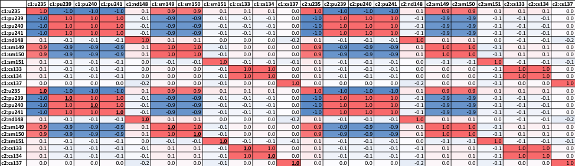
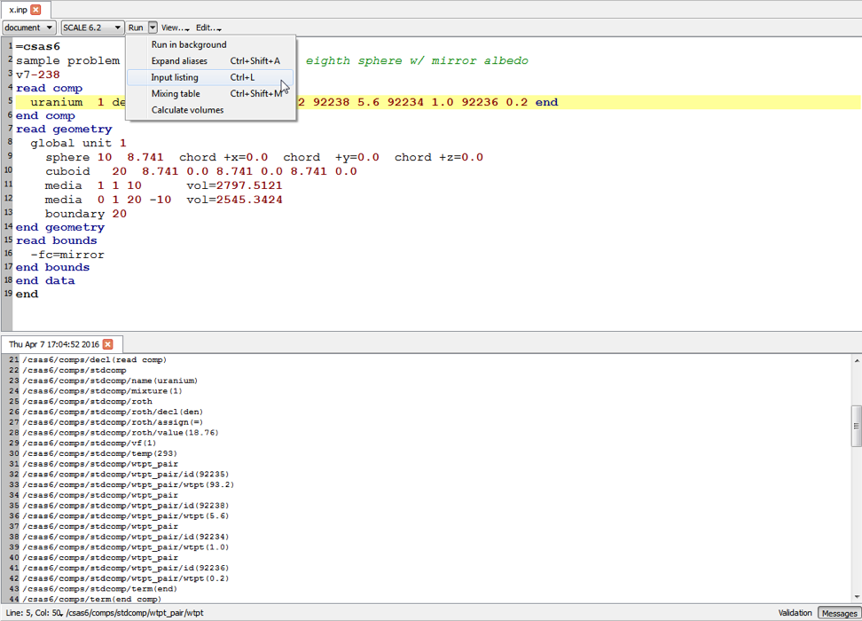

.. _6-7:

Sampler: A Module for Statistical Uncertainty Analysis with Scale Sequences
===========================================================================

W. A. Wieselquist, M. L. Williams, F. Havlůj [1]_, R. A. Lefebvre, W.
Zwermann [2]_, M. Klein [2]_, D. Wiarda, M. T. Pigni, I. C. Gauld,
M. A. Jessee, J. P. Lefebvre, K. J. Dugan [3]_, and B. T. Rearden

ABSTRACT

Sampler is a “super-sequence” that performs general uncertainty analysis
for SCALE sequences by statistically sampling the input data and
analyzing the output distributions for specified responses. Among the
input parameters that can be sampled are multigroup nuclear data,
resonance self-shielding data (shielding factors and CENTRM pointwise
cross sections), depletion data such as fission product yields and decay
data, and model parameters such as nuclide concentrations, temperatures,
and simple dimension specifications. Random perturbation factors for
nuclear cross sections and depletion data are pre-computed with the
XSUSA module Medusa by sampling covariance information and are stored in
libraries read during the Sampler execution, while model parameters are
sampled “on the fly”. A wide variety of output response types for
virtually all SCALE sequences can be specified for the uncertainty
analysis, and correlations in uncertain parameters between multiple
systems are also generated.

ACKNOWLEDGMENTS

Contributions from the Gesellschaft für Anlagen- und Reaktorsicherheit
(GRS) in Germany are gratefully acknowledged. The development of the SCALE
Sampler module is based on GRS’s suggestion that their XSUSA code could be used
in conjunction with SCALE for stochastic uncertainty calculations. The original
Sampler sequence was developed based on the XSUSA sampling sequence as well as
collaboration and knowledge exchange with GRS staff members. The GRS module
Medusa is used to generate perturbations of the MG cross sections, fission
yields, and decay data.

The U.S. Nuclear Regulatory Commission Office of Nuclear Regulatory Research,
the U.S. DOE Nuclear Fuel Storage and Transportation Planning Project, and the
U.S. DOE Nuclear Criticality Safety Program supported the development of
Sampler.

.. _6-7-1:

Introduction
------------

The SCALE nuclear analysis code system provides a unified set of
computational tools and data libraries to address a wide range of
applications, including criticality safety, reactor physics, spent fuel
characterization, burnup credit, national security, and neutron/photon
radiation shielding. [4]_ In addition to determining the problem
solutions, SCALE also provides tools to compute uncertainties in the
results, arising from uncertainties in the data used for the
calculations. Due to the diverse types of computational methods in
SCALE, robust sensitivity/uncertainty (S/U) methods are necessary.
Sampler implements stochastic sampling of uncertain parameters that can
be applied to any type of SCALE calculation, propagating uncertainties
throughout a computational sequence. Sampler treats uncertainties from
two sources: 1) nuclear data and 2) input parameters. Sampler generates
the uncertainty in any result generated by the computational sequence
through stochastic means by repeating numerous passes through the
computational sequence, each with a randomly perturbed sample of the
requested uncertain quantities. The mean value and uncertainty in each
parameter is reported along with the correlation in uncertain parameters
where multiple systems are simultaneously sampled with correlated
uncertainties.

Used in conjunction with nuclear data covariances available in SCALE,
Sampler is a general, overarching sequence for obtaining uncertainties
for many types of applications. SCALE includes covariances for
multigroup neutron cross-section data, as well as for fission product
yields and radioactive decay data, which allows uncertainty calculations
to be performed for most multigroup (MG) computational sequences in
SCALE. At the present time, nuclear data sampling cannot be applied to
SCALE continuous energy (CE) Monte Carlo calculations (i.e., CE-KENO and
CE-Monaco), although the fundamental approach is still valid.

Used in conjunction with uncertainties in input data, Sampler can
determine the uncertainties and correlations in computed results due to
uncertainties in dimensions, densities, distributions of material
compositions, temperatures, or many other quantities that are defined in
the user input for any SCALE computational sequence. This methodology
was especially developed to produce uncertainties and correlations in
criticality safety benchmark experiments, but it has a wide range of
applications in numerous scenarios in nuclear safety analysis and
design. The input sampling capabilities of Sampler also include a
parametric capability to determine the response of a system to a
systematic variation of an arbitrary number of input parameters.

.. _6-7-1-1:

Uncertainty analysis with stochastic versus perturbation methods
~~~~~~~~~~~~~~~~~~~~~~~~~~~~~~~~~~~~~~~~~~~~~~~~~~~~~~~~~~~~~~~~

Two quite different approaches may be used for uncertainty analysis. One
method uses first order perturbation theory expressions to compute
sensitivity coefficients for a given response. This requires performing
a forward transport calculation for the specified system and (sometimes)
adjoint calculations for each response of interest. After the forward
and adjoint transport solutions are obtained, sensitivity coefficients
for all nuclear cross sections and material concentrations can be
computed very efficiently with perturbation theory.\ :sup:`1` The
sensitivities may be folded with covariance matrices to obtain response
uncertainties due to nuclear data. The TSUNAMI modules and sequences in
SCALE use perturbation theory for S/U analysis in this manner (see
TSUNAMI-1D, TSUNAMI-2D, and TSUNAMI-3D).

For some types of applications, the adjoint-based perturbation
methodology is not adequate or is inefficient. These include:

   (a) Cases requiring codes with no adjoint functionality. SCALE has
   capability for critical eigenvalue adjoint solutions and generalized
   adjoint calculations using XSDRN, NEWT or KENO, but adjoint methods
   are not currently available for coupled neutronics-depletion
   calculations.

   (b) Cases for which first order perturbation theory is not valid
   (i.e., problems with significant second order effects).

The Sampler module described in this section provides an alternative
method for uncertainty analysis based on stochastic sampling (Monte
Carlo) and does not require adjoint calculations. This approach samples
joint probability density functions (PDFs) – such as given in the SCALE
nuclear data covariance library-- to produce a random sample for the
nuclear cross sections used a transport calculation. If PDFs are
available for other parameters such as depletion data or model
parameters, etc., then these too can be sampled and included in the
perturbed input vector. The perturbed data vector can be input to any
SCALE sequence or functional module to obtain a single forward solution
for all desired perturbed responses. The process is repeated for the
desired number of samples—typically a few hundred; and the output
distributions of results are analyzed to obtain standard deviations and
correlation coefficients for all responses. The stochastic sampling
method is not restricted to current SCALE modules; any new sequences or
codes can be used for the forward calculations, without having to
develop the capability for adjoint calculations.

Output distributions from the SCALE sampling also may be propagated to
downstream codes for follow-on uncertainty analysis. For example, input
for the TRITON lattice physics sequence can be sampled to produce a
random set of output assembly-averaged, two-group cross section
libraries. The two-group libraries can be input to a 3D core simulator
that performs steady-state or transient calculations, and statistical
analysis of the simulator output provides response uncertainties
(possibly time-dependent) due to the SCALE input data uncertainties.
Response uncertainties computed with this approach are not limited to
first order accuracy; i.e., they account for all non-linearities and
discontinuities with the same accuracy as the original codes.

Thus there are several advantages to the statistical sampling method
because it requires only forward calculations. The typical Sampler
computational procedure perturbs the entire input data vector
simultaneously, so that the total uncertainty in all responses, due to
all data uncertainties, is obtained. This standard approach does not
provide individual data sensitivity coefficients, unlike the
perturbation theory method. In this sense, the statistical sampling
method is complementary to the adjoint-based sensitivity method in the
TSUNAMI modules. Computation of sensitivities using only forward
calculations requires that each input parameter be varied individually,
rather than collectively; and this may require a large number of
simulations to obtain a full set of sensitivity coefficients.

.. _6-7-2:

Methodology
-----------

The main components of a Sampler calculation are the procedures for
perturbing input data, obtaining the desired responses, and performing
statistical analysis of the output distributions.

.. _6-7-2-1:

Definition of input data perturbations
~~~~~~~~~~~~~~~~~~~~~~~~~~~~~~~~~~~~~~

The input data for a SCALE computation will generally be one of three
types:

(a) *Nuclear data for transport calculations*. This includes multigroup
(MG) and continuous energy (CE) cross sections, multiplicities,
secondary particle distributions, and data used for resonance
self-shielding of MG cross sections.

(b) *Nuclide transmutation data for depletion and burnup calculations*.
This includes fission product yield data, decay constants, branching
ratios to excited states, decay energies and distributions.

(c) *Modeling parameters for the system*. This includes information for
defining nuclide number densities (e.g., density, weight fractions,
enrichment, void fraction, etc.), temperature, and dimensions.

In principle Sampler can perform uncertainty analysis for all the above
types of input data if uncertainties and correlations are known. The
main restriction at this time is that CE cross sections for Monte Carlo
calculations are not sampled (although the continuous data used for
self-shielding *are* treated), so data perturbation applications are
limited to MG calculations. Perturbations to input number densities and
model dimensions are not impacted by this data limitation.

.. _6-7-2-1-1:

Nuclear data perturbations for multigroup calculations
^^^^^^^^^^^^^^^^^^^^^^^^^^^^^^^^^^^^^^^^^^^^^^^^^^^^^^

Input MG nuclear data for SCALE sequences are obtained from an AMPX
Master formatted library, which contains infinitely-dilute
one-dimensional (1D) cross sections, two-dimensional (2D) scattering
distributions, and Bondarenko self-shielding factors for various types
of reactions. Only the 1D data and Bondarenko factors are varied in
Sampler because no covariance data are available for the 2D scattering
distributions; however, the 2D data are renormalized to be consistent
the perturbed 1D scattering cross sections.

The Medusa module of the XSUSA program [5]_ is used to generate
perturbation factors for the 1D cross sections on the MG library,
assuming that the probability density functions are multivariate normal
distributions with covariances given in the SCALE nuclear data
covariance library. The library covariance data are given as
infinitely-dilute, relative values; therefore a random sample for cross
section :math:`\sigma_{\mathrm{x}, \mathrm{g}}` corresponds to
:math:`\frac{\Delta \sigma_{\mathrm{x}, \mathrm{g}}}{\sigma_{\mathrm{x}, \mathrm{g}}}`,
where subscript x defines the nuclide/reaction
type and g is the group number. The relative variations are transformed
to multiplicative perturbation factors, defined by

.. math::
  :label: eq6-7-1

  \mathrm{Q}_{\mathrm{x}, \mathrm{g}}=1+\frac{\Delta \sigma_{\mathrm{x}, \mathrm{g}}}{\sigma_{\mathrm{x}, \mathrm{g}}}

that can be applied to the reference data to obtain the altered
infinitely-dilute values. A master sample file containing perturbation
factors for 1000 samples (see note below) of the infinitely-dilute 1D data has been
pre-computed and stored in the SCALE data directory. Each sample in the
file contains perturbation factors for all groups and reactions in all
materials. The master sample file is used for all cases, which avoids
having to perform the data sampling during SCALE execution.

Because the 1D data in the MG library are infinitely-dilute (i.e.,
problem-independent), SCALE sequences include modules that compute
resonance shielding corrections for the MG data. The self-shielding
calculations generally require two additional types of input data: (a)
Bondarenko self-shielding factors for the BONAMI module, which typically
performs self-shielding calculations outside of the resolved resonance
range; and (b) CE cross sections for the CENTRM/PMC modules, which
compute pointwise (PW) flux spectra and process self-shielded cross
sections for the resolved resonance range. Perturbations in the
Bondarenko factors and CE cross sections used in self-shielding
calculations must be consistent with perturbations made to the
infinitely dilute 1D cross sections since all these data are based on
the same fundamental ENDF/B information. It was shown in reference
[ [7]_] that consistent perturbations can be obtained by using the same
perturbation factors :math:`Q_{x, g}` in following expressions:

.. note::  The tradeoff of size on disk of the pre-calculated samples
  distributed with SCALE versus the maximum number of perturbations required in
  practice has led to the current maximum of 1000 samples. Based on limited
  experience, correlation coefficients of near zero require the most samples to
  converge and typically about 1000 samples has been sufficient.

(a) infinitely-dilute MG cross sections :math:`\sigma_{\mathrm{x}, \mathrm{g}}`:

.. math::
  :label: eq6-7-2

  \sigma_{\mathrm{x}, \mathrm{g}}^{\prime}=\mathrm{Q}_{\mathrm{x}, \mathrm{g}} \sigma_{\mathrm{x}, \mathrm{g}}

(b) Bondarenko factors :math:`\mathrm{f}\left(\sigma_{0}, \mathrm{~T}\right)`,
at background cross section :math:`\sigma_{0}` and temperature T:

.. math::
  :label: eq6-7-3

  \mathrm{f}_{\mathrm{x}, \mathrm{g}}^{\prime}\left(\sigma_{0}, \mathrm{~T}\right)=\mathrm{f}_{\mathrm{x}, \mathrm{g}}\left(\sigma_{0}^{\prime}, \mathrm{T}\right) ; \quad \text { where } \sigma_{0}^{\prime}=\sigma_{0} / \mathrm{Q}_{\mathrm{x}, \mathrm{g}}

(c) CE data :math:`\sigma_{\mathrm{x}}(\mathrm{E})`:

.. math::
  :label: eq6-7-4

  \sigma_{\mathrm{x}}^{\prime}(\mathrm{E})=\mathrm{Q}_{\mathrm{x}, \mathrm{g}} \sigma_{\mathrm{x}}(\mathrm{E}), \text { for } \mathrm{E} \in \mathrm{g}

In the above expressions, subscript x defines the nuclide/reaction type and g is the group number.

During Sampler execution the module ClarolPlus reads perturbation factors (:math:`Q_{x, g}`)
for a specified sample number from the master sample file, and evaluates
Equations :eq:`eq6-7-2` and :eq:`eq6-7-3`. ClarolPlus also writes a file containing
perturbation factors only for the particular sample number used by the
CrawdadPlus module, as described below.

.. _6-7-2-1-2:

Depletion data perturbations
^^^^^^^^^^^^^^^^^^^^^^^^^^^^

Multiplicative perturbation factors for fission product yields have
been generated with XSUSA by sampling the covariances for the
independent yield uncertainties. The yield uncertainties are taken
from ENDF/B VII.1, which in general are given by fissionable nuclide and
for up to three energies: 0.025 eV, 0.5 MeV, and 14 MeV. The ENDF/B
yield uncertainties do not include correlations between fission
products, which may arise due to constraints such as (a) the sum of
all yields must always be two (i.e., the uncertainty in the yield sum
is zero), and (b) the uncertainties in independent yields should be
consistent with uncertainties given for cumulative yields. The
constraints generally introduce positive and negative correlations
into the yields covariance matrix. A method developed by Pigni [8]_
was used to determine the correlations in :sup:`235`\ U yields.
Correlations in yields from other fissionable nuclides are not
available in SCALE at this time.

During Sampler execution the perturbation factors are read for a given
data sample, compute a complete set of perturbed independent yields for
all fissionable nuclides and energies, and renormalize the yields to
ensure that they sum to two. An output file containing the perturbed
yield data is written to an external file in the format read by ORIGEN.
The perturbation factors are read once each time a sequence executed
(i.e., for each data sample).

A set of 1,000 decay data perturbations has also been generated with
XSUSA and stored in decay-only ORIGEN library files. Sampler
automatically aliases the appropriate sample to the file “end7dec”.

.. note:: In order for decay data perturbations to be performed, the
  “end7dec” decay library must be used **directly**. Typical TRITON and
  Polaris calculations **do not use “**\ end7dec” directly, due to using
  the unperturbed decay data embedded in a special ORIGEN reaction library
  aliased to “transition.def” as the basis for all coupled
  transport/depletion calculations. Experience has been that decay data
  contributes very little additional uncertainty compared to yield data
  and cross section data.

.. _6-7-2-1-3:

Model data perturbations
^^^^^^^^^^^^^^^^^^^^^^^^

An approach presented by Areva NP GmbH utilizes statistical sampling on
uncertain parameters to assess the uncertainty in individual system as
well as correlations between multiple systems. [9]_ In this approach,
values for individual parameters in the input model are randomly
modified within the reported uncertainty and distribution function and a
series of perturbed values are obtained. Where sufficient samples are
made, the distribution of the perturbed values is used to determine the
uncertainty in the computed quantity due to uncertainties in the input
parameters. In cases where the same uncertain parameters influence
multiple experiments the simultaneous perturbation of the parameter for
multiple cases will provide the correlation in uncertainties between the
different configurations.

To obtain the uncertainty and correlation due to all uncertain
parameters, all parameters are randomly perturbed for each calculation
and the uncertainties and correlations are determined. Mathematically,
the uncertainty in an individual output parameter *k* is determined as
shown in Eq. :eq:`eq6-7-5`.

.. math::
  :label: eq6-7-5

  \Delta k^{\exp }(i)=\hat{\mu}_{i}=\sqrt{\frac{1}{n-1} \sum_{a=1}^{n}\left(\left(k_{c a l c}^{M C}(i)\right)_{a}-\overline{k_{\text {calc}}^{M C}(i)}\right)^{2}} ,

where :math:`\Delta k^{\exp }(i)` is the uncertainty (in terms of standard deviation) in
system *i* due to uncertainties in the input parameters. :math:`\left(k_{c a l c}^{M C}(i)\right)_{a}` is
the *a*\ :sup:`th` Monte Carlo (MC) sample of system *i*, where all uncertain
input parameters have been randomly varied within the specified
distribution.

The covariance between two systems, *i* and *j*, is determined as shown
in Eq. :eq:`eq6-7-6`.

.. math::
  :label: eq6-7-6

  \hat{\Sigma}_{i j}=\sqrt{\frac{1}{n-1} \sum_{a=1}^{n}\left(\left(k_{\text {calc}}^{M C}(i)\right)_{a}-\overline{k_{\text {calc}}^{M C}(i)}\right)\left(\left(k_{\text {calc}}^{M C}(j)\right)_{a}-\overline{k_{\text {calc}}^{M C}(j)}\right)} .

The correlation coefficient between systems i and j can be determined from Eqs.
:eq:`eq6-7-5` and :eq:`eq6-7-6` as shown in Eq. :eq:`eq6-7-7`.

.. math::
  :label: eq6-7-7

  c_{i j}=\frac{\hat{\Sigma}_{i j}}{\hat{\mu}_{i} \hat{\mu}_{j}} .

The correlation coefficients determined with Eq. :eq:`eq6-7-7` are the values needed
to perform the Generalized Least Linear Square (GLLS) analysis using TSURFER,
which solves for a set of cross section data perturbations that would improve
agreement between the computational simulations and experimental benchmark
results.

.. _6-7-2-2:

General workflow
~~~~~~~~~~~~~~~~

The overall workflow for Sampler is as follows:

-  for each sample, pick the perturbation factors and generate geometry
   perturbations

   -  for each case, build SCALE input decks, which include:

      -  calls to the perturbation modules, which generate the perturbed
         data libraries (based on the perturbation factors for this
         sample)

      -  user sequence inputs

      -  output data retrieval

   -  insert each of the constructed input decks into the processing
      queue

-  run all SCALE cases from the queue (serial or parallel, as available)

-  perform data extraction (using the response mechanism) and
   statistical analysis

-  print output and generate data files

The advantage of this workflow is that the individual SCALE runs are
completely identified by the sample number (so they are reproducible)
and they are independent. Each of the runs is executed within its own
environment (with SCALE runtime as a subprocess), with its own decay
data, fission yield and cross section library. This arrangement is very
robust and, as there is no coupling between the runs, can be effectively
parallelized.

.. _6-7-2-3:

File management
~~~~~~~~~~~~~~~

For every SCALE run, Sampler creates a subdirectory within its own
temporary directory. Each subdirectory has a name in the form *(case
name)* ``_pert_ `` *(sample number)*. Within this directory all the
useful data for the particular run are stored: the input file, the
output file, the message file, the terminal log file (which is a joint
capture of SCALE both standard output and standard error stream) along
with the saved data files (ft71, xfile016, PTP files etc.)

By retaining the temporary directory, the user can then examine and
possibly reuse saved files for the individual SCALE runs.

.. _6-7-2-4:

Parallel execution
~~~~~~~~~~~~~~~~~~

Since the Sampler calculations usually consist of several hundred
mutually completely independent calculations, it is desirable to run the
subcases in parallel.

Sampler supports both threading and MPI for parallel computing. No
special settings are needed in the input deck; Sampler fully relies on
the parallel capabilities of the SCALE runtime environment (ScaleRTE).

In order to run Sampler in parallel, use ``=%sampler`` as the sequence
declarator and specify either the ``–N`` (for MPI) or ``–I`` (for multi-threads)
command line arguments to ScaleRTE. For serial and multi-threaded runs,
the declaratory ``=sampler`` may be used to remove the warning about a
parallel version not being available.

.. note:: Where MPI is used, the Sampler case temporary directory has to
  be accessible by all of the computing nodes. Therefore, use –T to place
  the temporary directory into a shared storage space.

.. _6-7-2-5:

Behavior when encountering errors
~~~~~~~~~~~~~~~~~~~~~~~~~~~~~~~~~

Any time a parameter within a SCALE input is perturbed, there is the
possibility that the perturbation will cause unrealistic behavior (fuel
pellet passing through cladding, etc.) that will cause SCALE to fail.
The default behavior of Sampler is to finish all perturbed cases and
check whether there are errors present for each case once all cases have
been run.

.. _6-7-3:

Input Description
-----------------

This section describes the Sampler input file format.

.. _6-7-3-1:

Overall input structure
~~~~~~~~~~~~~~~~~~~~~~~

The order of the blocks is arbitrary, with the exception of dependent
variables (see :ref:`6-7-3-7-3`. Below is the layout of a typical
sampler input.

.. highlight:: scale

::

  =%sampler

  read parameters
    (control flags)
  end parameters
  read parametric
    (parametric studies definitions)
  end parametric

  read case[casename]
    sequence=(sequence name)
      (sequence input)
    end sequence
    ... (more sequences) ...
    read variable[id1]
      (variable definition)
    end variable
    ... (more variables) ...
  end case
  ... (more cases) ...

  read response[name1]
    (response definition)
  end response
  ... (more responses) ...

  read save
    (file save definition)
  end save
  ... (more saves) ...

  end

Every Sampler input file has to contain the parameters block and at least one
case block. Other input blocks are optional.

.. _6-7-3-2:

Cases and sequences
^^^^^^^^^^^^^^^^^^^

Within Sampler, multiple independent SCALE calculations, or *cases*, can
be included. Since the same set of responses is extracted from each of
the cases, these should have the same structure (i.e. produce the same
kind of output files); the benefit of having multiple cases within one
Sampler input deck is that it is possible to generate cross-correlations
between cases as an output.

Every *case* contains one or more stacked *sequences*. The whole case is
always run together.

Each case has an unique *identifier*. The identifier is a single word
beginning with a letter followed by letters, numbers and underscores.
Note that the dash “-” cannot be used in a case identifier.

Within the case block, the user can enter any number of sequences, which
contain the actual user input. The format of each sequence block is:

::

  sequence=(sequence name) (optional parm= setting)
   (sequence data)
  end sequence

The sequence data is a SCALE input that is not processed by Sampler,
except to substitute sampled values for variable placeholders (see :ref:`6-7-3-7-4`
for more information). For ``parm=`` settings, no limit on column
number is enforced.

.. _6-7-3-2-1:

Importing input data from external files
^^^^^^^^^^^^^^^^^^^^^^^^^^^^^^^^^^^^^^^^

Instead of directly specifying the SCALE sequence input within the Sampler input
file, the user can specify the path to a previously generated input file which
can be imported for use within Sampler as:

::

  read case[c1]
    import = "/home/usr/sampler_samples/sampler_1x_case.inp"
  end case

In this case, absolute paths should be used (or a ``shell`` sequence before invoking
Sampler, to copy the appropriate files into the temporary directory). This
approach provides concise input files and is advantageous for quality assurance
controlled input data.

.. _6-7-3-3:

Configuration parameters
~~~~~~~~~~~~~~~~~~~~~~~~

In the parameters block the user can control the main workflow and
output parameters for sampler. Valid keywords are shown in :numref:`tab6-7-1`.

.. important:: Note that of the major perturbation modes, only “perturb_geometry=yes”
  is on by default. (Bondarenko factor and pointwise data perturbation for
  CENTRM controls how “perturb_xs=yes” is performed.)

.. _tab6-7-1:
.. list-table:: Parameter input for Sampler.
  :align: center

  * - .. image:: figs/Sampler/tab1.svg
        :width: 800

**Notes on sample numbers:**

The samples are selected from the perturbation factor libraries (except
for geometry perturbation); it is up to the user to fit inside the range
of samples available (i.e. n_samples+first_sample–1 must be less or
equal to the number of samples). The built-in perturbation libraries
based nuclear data covariances contain 1000 samples.

**Note on perturbed library name:**

The default behavior for Sampler is to set ``perturbed_library`` to the same
name as ``library``. Since Sampler creates a local file in the temporary
directory, which is used by SCALE instead of the library in the lookup
table, it in general results in the desired behavior. SCALE sequences
only provide pre-defined resonance self-shielding options for known
libraries, so where ``perturbed_library`` differs from the name of a
standard SCALE library, the type of resonance self-shielding calculation
desired must be specified (via the *PARM=* setting). Please review the
documentation of the specified sequence for available options, such as
*PARM=CENTRM*.

.. warning:: The library name must result in a valid filename. In some
  cases the use of “``xn252v7.1``” instead of “``v7.1-252``” is recommended
  because the dash might result in improper links to the perturbed
  library. This guidance applies only to the cases when ``perturb_xs=yes`` is
  used; otherwise, Sampler does not generate a perturbed library.

See :ref:`6-7-3-8` for an example of properly referencing the perturbed library.

.. _6-7-3-4:

Sampler responses
~~~~~~~~~~~~~~~~~

For every case run within Sampler any number of responses can be
extracted. A response can be a single number or a time-dependent series,
which is assigned a name and optionally several parameters. The
responses are entered once and shared across all the cases, i.e. every
case returns the same set of responses. This allows Sampler to provide
the user with inter-case comparisons and statistics (i.e. covariance and
correlation matrices).

Sampler recognizes these kinds of responses:

-  ``opus_plt`` – data from an OPUS-generated PLT file

-  ``triton`` - TRITON homogenized cross-sections (xfile016)

-  ``stdcmp`` – standard composition files

-  ``f71`` – concentrations from the F71 ORIGEN dump

-  ``grep`` – general expression from the text output file

-  ``variables`` – the geometry perturbation sampled values

.. _6-7-3-4-1:

General response block format
^^^^^^^^^^^^^^^^^^^^^^^^^^^^^

The general format of the response block is:

::

  read response[(response id)]
    type = (response type)
    (response parameters)
  end response

The *(response id)* is an arbitrary identifier (a single word) by which
the the response is denoted in the results. The *(response type)* is one
of the keywords ``opus_plt``, ``triton``, ``stdcmp``, ``f71``, variables and ``grep``.
Response parameters are different for each response type and are
explained below.

.. _6-7-3-4-2:

OPUS PLT file responses
^^^^^^^^^^^^^^^^^^^^^^^

This response extracts any data from a PLT file generated by OPUS. The
user specifies which PLT file should be used and which elements/nuclides
should be used.

Parameter ``ndataset`` provides the number of the selected PLT file, i.e.
``ndataset=1`` will read data from the file ending with
.00000000000000001.plt (which is the second generated PLT file in the
given case).

Parameter ``nuclides=…end`` specifies the list of nuclides (or elements)
which are read from the PLT file; nuclides can be specified as
alphanumeric identifiers (U-235, ba137m) or six-digit ZAI identifiers
(922350). In addition to that, any other PLT file response identifiers
(i.e. the character strings in the first column of the plot table) may
be used, which allows for example the usage of ``total`` and ``subtotal``
keywords.

**Example**

::

  read response[fisrates]
    type = opus_plt
    ndataset = 1
    nuclides = u238 pu239 total end
  end response

.. _6-7-3-4-3:

TRITON homogenized cross-section responses
^^^^^^^^^^^^^^^^^^^^^^^^^^^^^^^^^^^^^^^^^^

This response extracts the homogenized cross-section data saved by
TRITON on the ``xfile016``.

Responses are retrieved for a selected homogenized mixture and all
branches (which are then denoted by response name suffixes).

Using a ``data= … end`` assignment specifies which data types are to be
saved.

The available options for data entries are:

.. code:: none

  kinf sigma_total sigma_fission sigma_absorption
  sigma_capture sigma_transport_out sigma_transport_in
  sigma_transport sigma_elastic sigma_n2n nu_fission
  kappa_fission nu chi flux diffusion

**Example**:

::

  read response[xs]
    type = triton
    mixture = 1
    data = kinf sigma_absorption end
  end response

.. _6-7-3-4-4:

Standard composition file responses
^^^^^^^^^^^^^^^^^^^^^^^^^^^^^^^^^^^

This response retrieves isotopic concentrations (in atoms/barn-cm) from
the standard composition file. Parameter ``nuclides=…end`` specifies which
nuclides should be retrieved. The parameter mixture specifies the number
of the StdCmpMix file, so ``mixture=10`` would load concentrations from the
file StdCmpMix00010_\* (for all time steps).

**Example:**

::

  read response[mix10]
    nuclides = u-235 pu-239 end
    mixture = 10
  end response

.. _6-7-3-4-5:

ORIGEN concentration (F71) responses
^^^^^^^^^^^^^^^^^^^^^^^^^^^^^^^^^^^^

This response retrieves the isotopic concentrations (in gram-atoms) from
the ORIGEN concentration edit in the ``ft71f001`` file.

Parameter ``nuclides=…end`` specifies the list of nuclides (or elements)
which are read from the F71 file; nuclides can be specified as
alphanumeric identifiers (U-235, ba137m) or six-digit ZAI identifiers
(922350).

Two options are available to choose the positions on the file from which data
should be retrieved. Either ``step_from=start`` and ``step_to=end`` can be used to
select a range of positions, or ``mixture=N``  can be used to choose either an
ORIGEN case or a TRITON case mixture. This is convenient for TRITON cases where
step numbers are usually not known in advance.

**Example:**

::

  read response[concentrations]
    type=origen_nuclides
    nuclides = u-235 pu-239 pu-240 pu-241 end
    mixture = 10
  end response

.. _6-7-3-4-6:

Generic regular expression (GREP) responses
^^^^^^^^^^^^^^^^^^^^^^^^^^^^^^^^^^^^^^^^^^^

In order to allow the user to collect other responses from the SCALE
output, a generic regular expression (regexp) mechanism is provided by
Sampler. For every response the user can enter one (or more) regular
expressions, which are applied (using the "grep" system tool) to the
main output file. "grep" is executed with the "-o" option, which returns
only the matched portion of the line (and not the whole line). Usually
it is necessary to use two expressions, one to find the line of interest
and another to extract only the desired value. The POSIX character
classes are supported in the grep used—the most commonly used are
"[[:digit:]]" to match a single digit 0-9 and [[:space:]] to match a
single space or tab. The "+" and "*" are used to match one or more and
zero or more repeats, respectively. Note that as per standard regexp
rules, "." matches any character and an escape is necessary, i.e. "\.",
in order to match a period.

Each regular expression is defined by the keyword ``regexp=``"…". The result
of the last regular expressions should be a single number (and is
treated as such by Sampler).

The following example defines regular expression for extraction of
k-effective from a CSAS5/6 output file:

::

  read response[keff]
    type = grep
    regexp = "best estimate system k-eff[[:space:]]+[[:digit:]]+\.[[:digit:]]+"
    regexp = "[[:digit:]]+\.[[:digit:]]+"
  end response

With the first ``regexp`` statement, a line containing "best estimate system
k-eff" followed by a number is found, and then just the number part is
extracted with the second ``regexp`` statement.

For ease of use, Sampler provides several regular expression shortcuts
shown in :numref:`tab6-7-2`.

.. _tab6-7-2:
.. list-table:: Regular expression shortcuts for SCALE sequences.
  :align: center

  * - .. image:: figs/Sampler/tab2.svg
        :width: 800

Thus, the previous example may be alternately rephrased as such:

::

  read response[keff]
    type = grep
    regexp = ":kenova.keff:"
  end response

In addition to this, the ``grep`` response also supports extraction of data
with uncertainties. In order to get the response uncertainty, use the
``eregexp=`` keyword, which follows the same rules as ``regexp=``. The same
shortcuts as for ``regexp=`` may be used as well (for KENO V.a/VI
multiplication coefficient). Therefore, to get KENO multiplication
factor including the uncertainty, one might define the response like
this:

::

  read response[keff]
    type = grep
    regexp = ":kenova.keff:"
    eregexp = ":kenova.keff:"
  end response

.. _6-7-3-4-7:

Sampled variable values
^^^^^^^^^^^^^^^^^^^^^^^

Using the ``variables`` response, the user can extract information from the
sampled values of the geometry/material perturbation variables. The
``data=`` key contains the list of variable identifiers of interest.

This option is useful to generate the correlations between
geometry/material perturbations and the responses of interest.

**Example:**

::

  read variable[r1]
    ...
  end variable
  read response[r]
    type=variables
    data = r1 end
  end response

.. _6-7-3-4-8:

Quick response definition overview
^^^^^^^^^^^^^^^^^^^^^^^^^^^^^^^^^^

:numref:`tab6-7-3` summarizes the available options for the different response
types. The nuclides specification can either be in terms of the standard
alphanumeric identifier, e.g. “u235m” for :sup:`235m`\ U, or the IZZZAAA
integer identifier, e.g. “1092235” for :sup:`235m`\ U.

.. _tab6-7-3:
.. list-table:: Response definition overview.
  :align: center

  * - .. image:: figs/Sampler/tab3.svg
        :width: 800

.. _6-7-3-5:

Saving files
~~~~~~~~~~~~

By default, Sampler saves from each run the input, output, message and
terminal log files. In addition to that, if respective responses are
requested, it saves the ``ft71f001`` as basename\ ``.f71``, x``file016`` as
basename\ ``.x16`` and the ``StdCmpMix*`` files.

The user might specify additional files to be saved into the sample
subdirectory; this is achieved by defining one or more ``save`` blocks.

Each save block contains a ``file=”…”`` parameter, which specifies the
filename in the sample run temporary directory. Optionally, the user can
specify ``name=”…”`` to let Sampler rename the file to
*basename*.\ *extension*, where *extension* is the value of the ``name``
parameter. If ``name`` is not specified, the file is not renamed and is just
copied to the sample subdirectory. The ``name`` parameter cannot be used if
wildcards are used in the ``file`` parameter.

The quotes for both ``name`` and ``file`` parameter values are mandatory.

**Example 1**:

::

  read save
    name = "ft2"
    file = "ft71f002"
  end save

**Example 2**:

::

  read save
    file = "StdCmpMix*"
  end save

.. _6-7-3-6:

Parametric studies
~~~~~~~~~~~~~~~~~~

The Sampler infrastructure allows an efficient implementation of studies
of parameter variation effects on various responses. This mode is
activated by entering the ``read parametric … end parametric`` block.

This block contains two arrays: ``variables = … end`` and ``n_samples = … end``.
The variables array lists the variables of the parametric study. The
variables must have “``distribution=uniform``”, and the minimum and maximum
becomes the range for that variable in the parametric study. For each
variable, the corresponding value in the ``n_samples`` = ``… end`` array
indicates the number of evenly spaced values to assume *in that
dimension.* The total number of calculations is therefore the
multiplication of all the ``n_samples`` values. Note that for a single
sample with ``n_samples=1``, only the minimum value is used. Below is as an
example of the parametric block.

::

  read parametric
    variables = density temperature end
    n_samples =      10           6 end
  end parametric

The two variables are ``density ``and ``temperature``, and there will be 10
evenly spaced density values (including the minimum and maximum) and 6
evenly spaced temperature values, for a total of
:math:`10 \times 6 = 60` calculations. To perform the same number of
samples in each dimension, the keyword ``n_samples`` in the parameters block
may also be used.

Sampler generates a summary table of the parametric study, including
values for which the minimum and maximum of each response occurs.
Sampler also generates PTP plot files showing the dependency of each
response on each variable.

.. _6-7-3-7:

Geometry and material perturbations
~~~~~~~~~~~~~~~~~~~~~~~~~~~~~~~~~~~

In addition to data perturbations, Sampler also allows the user to
include geometry and material uncertainties in the calculation. This is
achieved by defining ``variable`` blocks. Each variable may be linked to a
particular value in the input and is associated either with a random
variable distribution or with an arithmetic expression. The expression
capability allows for dependent or derived parameters, such as
:sup:`238`\ U content depending on enrichment or outer clad radius
depending on the inner radius.

For each sample, Sampler creates a perturbed input by generating a set
of variable values and substituting them into the input. For every
variable, the user has to define the variable and specify its
distribution (using one of the predefined random variable distributions
described in :ref:`6-7-3-2`) or its dependence on other variables (using an
arithmetic expression). If desired, the user can also specify which part
of the input will be replaced by the variable. This can be achieved
either by specifying a SCALE Input Retrieval ENgine (SIREN) expression
or by putting placeholders directly inside the input deck (see Appendix
A for details on SIREN).

.. _6-7-3-7-1:

Variable definition
^^^^^^^^^^^^^^^^^^^

Variables are defined by a ``read variable..end variable`` block. The general format of the block is:

::

  read variable[(variable id)]
    distribution = (distribution type)
    siren = "(siren expression)"
    (distribution-specific parameters)
    cases = (case list) end
  end variable

The variable id is an arbitrary, single word consisting of letters,
numbers and underscores (with number not being the first character). The
variable id has to be unique and is case dependent. ``distribution`` is one
of the distribution-type keywords (see :ref:`6-7-3-7-2`) or ``expression`` for
the dependent variable definition. The ``cases=`` specification applies only
to the variables defined at the global scope (see below). The ``siren=``
specification is optional, see below.

The block can be placed either:

a) inside a case block. This variable applies only to this particular case.

In the following example, variable ``x`` applies to the case ``c1`` and the
variable ``y`` applies to the case ``c2``.

::

  read case[c1]
    sequence=...
      ...
    end sequence
    read variable[x]
      ...
    end variable
  end case
  read case[c2]
    sequence=...
      ...
    end sequence
    read variable[y]
      ...
    end variable
  end case

b) at the global scope. The ``cases=... end`` has to be used to specify the
cases to which this variable applies.

In this example, variable ``x`` applies to the both cases ``c1`` and ``c2`` and the variable
``y`` applies only to the case ``c1``.

::

  read case[c1]
    sequence=...
      ...
    end sequence
  end case
  read case[c2]
    sequence=...
      ...
    end sequence
  end case
  read variable[x]
    ...
    cases = c1 c2 end
  end variable
  read variable[y]
    ...
    cases = c1 end
  end variable

.. _6-7-3-7-2:

Distribution types
^^^^^^^^^^^^^^^^^^

Sampler supports three random ``distribution`` types, selected using the
distribution= keyword.

1) ``uniform``: uniform distribution over a (closed) interval.

Additional parameters for a uniform distribution are shown in :numref:`tab6-7-4`.

.. _tab6-7-4:
.. table:: Parameters for uniform distributions.
  :align: center
  :widths: auto

  +-------------+--------------------------+----------+
  | **KEYWORD** | **DESCRIPTION**          | **NOTE** |
  +=============+==========================+==========+
  | value=      | Base (unperturbed) value | required |
  +-------------+--------------------------+----------+
  | minimum=    | Lower bound value        | required |
  +-------------+--------------------------+----------+
  | maximum=    | Upper bound value        | required |
  +-------------+--------------------------+----------+

**Example**:

::

  read variable[rfuel]
    distribution=uniform
    minimum = 0.40
    value = 0.41
    maximum = 0.42
  end variable

2) ``normal``: normal (optionally truncated) distribution.

Additional parameters for normal distribution are shown in :numref:`tab6-7-5`.

.. _tab6-7-5:
.. table:: Parameters for normal distributions.
  :align: center

  +-------------+--------------------+----------+
  | **KEYWORD** | **DESCRIPTION**    | **NOTE** |
  +=============+====================+==========+
  | value=      | Mean value         | required |
  +-------------+--------------------+----------+
  | stddev=     | Standard deviation | required |
  +-------------+--------------------+----------+
  | minimum=    | Lower cutoff value | optional |
  +-------------+--------------------+----------+
  | maximum=    | Upper cutoff value | optional |
  +-------------+--------------------+----------+

The user can specify both ``minimum`` and ``maximum``, one of them, or neither. If a
cutoff is not specified, the distribution is not truncated on that side.

**Example**:

::

  read variable[c1_u235]
    distribution=normal
    value=95.0
    stddev=0.05
  end variable

3) ``beta``: beta distribution.

Additional parameters for the beta distribution are shown in :numref:`tab6-7-6`.

.. _tab6-7-6:
.. table:: Parameters for beta distributions.
  :align: center

  +-------------+-----------------------------------+----------+
  | **KEYWORD** | **DESCRIPTION**                   | **NOTE** |
  +=============+===================================+==========+
  | value=      | Mean value                        | required |
  +-------------+-----------------------------------+----------+
  | minimum=    | Lower cutoff value                | required |
  +-------------+-----------------------------------+----------+
  | maximum=    | Upper cutoff value                | required |
  +-------------+-----------------------------------+----------+
  | beta_a=     | First parameter for distribution  | required |
  +-------------+-----------------------------------+----------+
  | beta_b=     | Second parameter for distribution | required |
  +-------------+-----------------------------------+----------+

The Beta distribution is defined in the standard way given by Eq.
:eq:`eq6-7-8`. The parameters for the distribution determine where the peak is
located in the interval [``minimum``, ``maximum``] and the variance of the
distribution; the parameters α and β are required to be integer values.
Note that ``value`` does not need to be the midpoint between ``minimum`` and
``maximum``.

.. math::
  :label: eq6-7-8

  f(x ; \alpha, \beta)=\frac{\Gamma(\alpha+\beta)}{\Gamma(\alpha) \Gamma(\beta)} x^{\alpha-1}(1-x)^{\beta-1} ,

**Example**:

::

  read variable[rclad]
    distribution=beta
    value=0.47
    minimum=0.45
    maximum=0.50
    beta_a=2
    beta_b=6
  end variable

.. _6-7-3-7-3:

Dependent variables (expressions)
^^^^^^^^^^^^^^^^^^^^^^^^^^^^^^^^^

Using ``distribution=expression`` allows the user to specify a variable
using the values of other variables. Setting ``expression=``\ "(expression)"
then specifies how to evaluate the variable. Sampler supports basic
arithmetic operators and other variables can be used as well. However,
Sampler currently provides no variable dependency resolution and
therefore only variables that were defined (using the variable block)
previously in the input deck can be referenced in an expression.

**Example**:

::

  read variable[c1_u238]
    distribution = expression
    expression="100.0-c1_u235"
  end variable

.. _6-7-3-7-4:

Using placeholders
^^^^^^^^^^^^^^^^^^

Inside the ``sequence=`` blocks, a #{*variable id*} placeholder can be used.
This will be replaced by a variable value when Sampler builds the
particular input deck. Only a simple variable reference can be used; no
expressions are allowed here.

**Example**:

::

  sequence=csas5
  ...
  uranium  1 den=18.76 1 300 92235 #{u235} 92238 #{u238} end
  ...
  end sequence
  read variable[u235]
  ...
  end variable
  read variable[u238]
  ...
  end variable

In the input deck snippet the :sup:`235`\ U and :sup:`238`\ U content
are inserted directly to the respective places (defined by variables
u235 and u238).

Using placeholders is straightforward and simple; however, if for input
deck quality assurance or other reasons it is not desirable to modify
the input deck directly, SIREN expressions can be used.

.. _6-7-3-7-5:

Using SIREN expressions
^^^^^^^^^^^^^^^^^^^^^^^

SIREN is a package which provides an XPath-like interface to the SCALE
input deck represented by a Document Object Model (DOM). In Sampler, the
user can specify ``siren=``"*path*" to have the respective token(s) replaced
by a variable value.

Please refer to Appendix A for more details on specifying the SIREN path
expressions.

**Example:**

::

  read variable[c1_u235]
    distribution=normal
    value=95.0
    stddev=0.05
    siren="/csas5/comps/stdcomp[decl=’uranium’]/wtpt_pair[id='92235']/wtpt"
  end variable

The variable ``c1_u235`` value is inserted as the weight percent of
:sup:`235`\ U in the basic standard composition declared as "uranium" in
the CSAS5 sequence.

.. _6-7-3-8:

Converting a standard SCALE input deck to a Sampler input deck
~~~~~~~~~~~~~~~~~~~~~~~~~~~~~~~~~~~~~~~~~~~~~~~~~~~~~~~~~~~~~~

In this section, a short walkthrough is provided on how to convert a
“normal” SCALE input into a Sampler input for cross section uncertainty
propagation.

Beginning with a simple CSAS5 input deck:

::

  =csas5
    sample problem 1  case 2c8 bare
    v7.1-252
    read comp
      uranium  1 den=18.76 1 300 92235 93.2 92238 5.6 92234 1.0 92236 0.2 end
    end comp

    read geometry
      unit 1
        cylinder 1 1 5.748 5.3825 -5.3825
        cuboid  0 1 6.87 -6.87 6.87 -6.87 6.505 -6.505
    end geometry
      read array
        gbl=1 ara=1 nux=2 nuy=2 nuz=2 fill f1  end fill
      end array
    end data
  end

First, wrap the given input in sequence and case blocks and assign the
case an arbitrary identifier (``c1``). It is also recommended to change the
library alias to the actual filename.

::

  =sampler
  read case[c1]
    sequence=csas5
      sample problem 1  case 2c8 bare
      xn252v7.1
      read comp
        uranium  1 den=18.76 1 300 92235 93.2 92238 5.6 92234 1.0 92236 0.2 end
      end comp

      read geometry
        unit 1
          cylinder 1 1 5.748 5.3825 -5.3825
          cuboid  0 1 6.87 -6.87 6.87 -6.87 6.505 -6.505
      end geometry
        read array
          gbl=1 ara=1 nux=2 nuy=2 nuz=2 fill f1  end fill
        end array
      end data
    end sequence
  end case
  end

Second, add the parameters block to identify the base cross-section
library used for building the perturbed ones. Note that this is the only
SCALE module that uses the plural form of parameters and that the
reference to the library matches exactly the one inside the CSAS5 input.

::

  =sampler
  read parameters
    library="xn252v7.1"
  end parameters
  read case[c1]
    sequence=csas5
      sample problem 1  case 2c8 bare
      xn252v7.1
      read comp
        uranium  1 den=18.76 1 300 92235 93.2 92238 5.6 92234 1.0 92236 0.2 end
      end comp
      read geometry
        unit 1
          cylinder 1 1 5.748 5.3825 -5.3825
          cuboid  0 1 6.87 -6.87 6.87 -6.87 6.505 -6.505
      end geometry
        read array
          gbl=1 ara=1 nux=2 nuy=2 nuz=2 fill f1  end fill
        end array
      end data
    end sequence
  end case
  end

Finally, set up the perturbations (number of samples and what to perturb):

::

  =sampler
  read parameters
    library="xn252v7.1"
    n_samples = 40
    perturb_xs = yes
  end parameters
  read case[c1]
    sequence=csas5
      sample problem 1  case 2c8 bare
      xn252v7.1
      read comp
        uranium  1 den=18.76 1 300 92235 93.2 92238 5.6 92234 1.0 92236 0.2 end
      end comp
      read geometry
        unit 1
          cylinder 1 1 5.748 5.3825 -5.3825
          cuboid  0 1 6.87 -6.87 6.87 -6.87 6.505 -6.505
      end geometry
        read array
          gbl=1 ara=1 nux=2 nuy=2 nuz=2 fill f1  end fill
        end array
      end data
    end sequence
  end case
  end

.. _6-7-4:

Example Problems and Output Description
---------------------------------------

This section describes output files created by Sampler and provides
several sample cases.

.. _6-7-4-1:

Output description
~~~~~~~~~~~~~~~~~~

This section describes the contents of the main Sampler output file, as
well as the other files generated by Sampler.

All of the CSV, PTP and SDF files are, for convenience, copied into a
separate directory called *${OUTBASENAME}*.\ ``samplerfiles``, where
*${OUTBASENAME}* is the base name of the main SCALE output file, e.g.
“my” in “my.out”.

.. _6-7-4-1-1:

Main text output
^^^^^^^^^^^^^^^^

The main text output summarizes the Sampler run progress and presents
the most important results.

.. _6-7-4-1-1-1:

Sampler banner
''''''''''''''

The program verification information banner shows the program version and the
main execution information (date and time, user name, computer name).

.. code:: none
  :class: long

  ************************************************************************************************************************************
  ************************************************************************************************************************************
  ************************************************************************************************************************************
  *****                                                                                                                          *****
  *****                                             program verification information                                             *****
  *****                                                                                                                          *****
  *****                                            code system:  SCALE   version: 6.2                                            *****
  *****                                                                                                                          *****
  ************************************************************************************************************************************
  ************************************************************************************************************************************
  *****                                                                                                                          *****
  *****                                                                                                                          *****
  *****                      program:  sampler                                                                                   *****
  *****                                                                                                                          *****
  *****                      version:  6.2.0                                                                                     *****
  *****                                                                                                                          *****
  *****                     username:  usr                                                                                       *****
  *****                                                                                                                          *****
  *****                     hostname:  node11.ornl.gov                                                                           *****
  *****                                                                                                                          *****
  *****                                                                                                                          *****
  *****            date of execution:  2013-04-04                                                                                *****
  *****                                                                                                                          *****
  *****            time of execution:  14:40:01                                                                                  *****
  *****                                                                                                                          *****
  ************************************************************************************************************************************
  ************************************************************************************************************************************
  ************************************************************************************************************************************

.. _6-7-4-1-1-2:

Input parameters echo
'''''''''''''''''''''

Input echo table summarizes the user selected parameters and options.

.. code:: none
  :class: long

  ------------------------------------------------------------------------------------------------------------------------------------
  -                                                      Input parameters echo                                                       -
  ------------------------------------------------------------------------------------------------------------------------------------

     Number of cases                          : 1
     Number of samples                        : 500
     First sample index                       : 1
     Number of MAT-MT pairs                   : 0

     Perturb cross-sections                   : yes
     Perturb decay data                       : no
     Perturb fission yields                   : no

     Perturb pointwise XS                     : yes
     Perturb Bondarenko factors               : yes

     Master XS library                        : xn238v7
     Perturbed XS library                     : xn238v7
     Multigroup factors library               :
     Sensitivity factors library              : sensitivity_factors
     Covariance library                       : 44groupcov

     Print CSV tables                         : yes
     Print PTP histograms/histories           : yes
     Print per-sample data                    : no
     Print covariances                        : no
     Print correlations                       : no
     Print chi-square test                    : no

.. _6-7-4-1-1-3:

SCALE run overview
''''''''''''''''''

The run overview table displays the list of SCALE calculations processed by
Sampler, i.e. for each case the baseline calculation (sample 0) and the
requested number of samples.

.. code:: none
  :class: long

  ************************************************************************************************************************************
  *                                                             Sampling                                                             *
  ************************************************************************************************************************************

        case |              run         sample       running?                                                 sample directory
  -----------+----------------------------------------------------------------------------------------------------------------
   case00001 |   sample #1 / 41         #00000            yes     /home/usr/sampler_samples/sampler_3_tmp/case00001_pert_00000
   case00001 |   sample #2 / 41         #00001            yes     /home/usr/sampler_samples/sampler_3_tmp/case00001_pert_00001
   case00001 |   sample #3 / 41         #00002            yes     /home/usr/sampler_samples/sampler_3_tmp/case00001_pert_00002
   case00001 |   sample #4 / 41         #00003            yes     /home/usr/sampler_samples/sampler_3_tmp/case00001_pert_00003
   case00001 |   sample #5 / 41         #00004            yes     /home/usr/sampler_samples/sampler_3_tmp/case00001_pert_00004
   case00001 |   sample #6 / 41         #00005            yes     /home/usr/sampler_samples/sampler_3_tmp/case00001_pert_00005
   case00001 |   sample #7 / 41         #00006            yes     /home/usr/sampler_samples/sampler_3_tmp/case00001_pert_00006
   case00001 |   sample #8 / 41         #00007            yes     /home/usr/sampler_samples/sampler_3_tmp/case00001_pert_00007
   case00001 |   sample #9 / 41         #00008            yes     /home/usr/sampler_samples/sampler_3_tmp/case00001_pert_00008
   case00001 |  sample #10 / 41         #00009            yes     /home/usr/sampler_samples/sampler_3_tmp/case00001_pert_00009
   case00001 |  sample #11 / 41         #00010            yes     /home/usr/sampler_samples/sampler_3_tmp/case00001_pert_00010
   case00001 |  sample #12 / 41         #00011            yes     /home/usr/sampler_samples/sampler_3_tmp/case00001_pert_00011
   case00001 |  sample #13 / 41         #00012            yes     /home/usr/sampler_samples/sampler_3_tmp/case00001_pert_00012
   case00001 |  sample #14 / 41         #00013            yes     /home/usr/sampler_samples/sampler_3_tmp/case00001_pert_00013
   case00001 |  sample #15 / 41         #00014            yes     /home/usr/sampler_samples/sampler_3_tmp/case00001_pert_00014
   case00001 |  sample #16 / 41         #00015            yes     /home/usr/sampler_samples/sampler_3_tmp/case00001_pert_00015
   case00001 |  sample #17 / 41         #00016            yes     /home/usr/sampler_samples/sampler_3_tmp/case00001_pert_00016
   case00001 |  sample #18 / 41         #00017            yes     /home/usr/sampler_samples/sampler_3_tmp/case00001_pert_00017
   case00001 |  sample #19 / 41         #00018            yes     /home/usr/sampler_samples/sampler_3_tmp/case00001_pert_00018
   case00001 |  sample #20 / 41         #00019            yes     /home/usr/sampler_samples/sampler_3_tmp/case00001_pert_00019
   case00001 |  sample #21 / 41         #00020            yes     /home/usr/sampler_samples/sampler_3_tmp/case00001_pert_00020
   case00001 |  sample #22 / 41         #00021            yes     /home/usr/sampler_samples/sampler_3_tmp/case00001_pert_00021
   case00001 |  sample #23 / 41         #00022            yes     /home/usr/sampler_samples/sampler_3_tmp/case00001_pert_00022
   case00001 |  sample #24 / 41         #00023            yes     /home/usr/sampler_samples/sampler_3_tmp/case00001_pert_00023
   case00001 |  sample #25 / 41         #00024            yes     /home/usr/sampler_samples/sampler_3_tmp/case00001_pert_00024
   case00001 |  sample #26 / 41         #00025            yes     /home/usr/sampler_samples/sampler_3_tmp/case00001_pert_00025
   case00001 |  sample #27 / 41         #00026            yes     /home/usr/sampler_samples/sampler_3_tmp/case00001_pert_00026
   case00001 |  sample #28 / 41         #00027            yes     /home/usr/sampler_samples/sampler_3_tmp/case00001_pert_00027
   case00001 |  sample #29 / 41         #00028            yes     /home/usr/sampler_samples/sampler_3_tmp/case00001_pert_00028
   case00001 |  sample #30 / 41         #00029            yes     /home/usr/sampler_samples/sampler_3_tmp/case00001_pert_00029
   case00001 |  sample #31 / 41         #00030            yes     /home/usr/sampler_samples/sampler_3_tmp/case00001_pert_00030
   case00001 |  sample #32 / 41         #00031            yes     /home/usr/sampler_samples/sampler_3_tmp/case00001_pert_00031
   case00001 |  sample #33 / 41         #00032            yes     /home/usr/sampler_samples/sampler_3_tmp/case00001_pert_00032
   case00001 |  sample #34 / 41         #00033            yes     /home/usr/sampler_samples/sampler_3_tmp/case00001_pert_00033
   case00001 |  sample #35 / 41         #00034            yes     /home/usr/sampler_samples/sampler_3_tmp/case00001_pert_00034
   case00001 |  sample #36 / 41         #00035            yes     /home/usr/sampler_samples/sampler_3_tmp/case00001_pert_00035
   case00001 |  sample #37 / 41         #00036            yes     /home/usr/sampler_samples/sampler_3_tmp/case00001_pert_00036
   case00001 |  sample #38 / 41         #00037            yes     /home/usr/sampler_samples/sampler_3_tmp/case00001_pert_00037
   case00001 |  sample #39 / 41         #00038            yes     /home/usr/sampler_samples/sampler_3_tmp/case00001_pert_00038
   case00001 |  sample #40 / 41         #00039            yes     /home/usr/sampler_samples/sampler_3_tmp/case00001_pert_00039
   case00001 |  sample #41 / 41         #00040            yes     /home/usr/sampler_samples/sampler_3_tmp/case00001_pert_00040

   --- Master process needs to run 41 SCALE runs.

The table shows case name, sample index, sample number (i.e. the number in the
perturbation factor library), whether the case has to be executed (if not it
means that the results were already available in the samplerfiles directory) and
the full path to the run subdirectory.

.. _6-7-4-1-1-4:

Response tables
'''''''''''''''

According to the print flags set by the user in the parameters block,
Sampler prints the following tables:

-  values of all responses for all samples (printed if ``print_data=yes``)

-  average values and standard deviation over the samples population
   (always printed)

-  comparison of average and baseline value (always printed)

-  chi-square normality test (printed if ``print_chi2=yes``)

-  covariance matrices (printed if ``print_cov=yes``)

-  correlation matrices (printed if ``print_corr=yes``)

-  case- and response- specific tables

The case-specific tables contain only responses for a given case (so it
is possible to explore correlations only within a given case). The
response-specific tables are, on the other hand, contain responses
across all cases, so they are useful for case cross-correlation
analysis.

All of the tables are, regardless of the print flags, saved in the CSV
files (see the following section).

.. _6-7-4-1-2:

CSV tables
^^^^^^^^^^

Every table produced by Sampler is (regardless of whether it has been
selected for the main text output) saved also in the CSV (comma
separated values) format, which makes it convenient to process Sampler
results with a spreadsheet program, plotting package, or any scripting
workflow.

These types of tables are created:

-  values for every sample for time-independent responses

..

   (``response_table.static.val.all.csv``)

-  correlation matrix for time-independent responses

..

   (``response_table.static.corr.all.csv``)

-  covariance matrix for time-independent responses

..

   (``response_table.static.cov.all.csv``)

-  values for every sample for time-independent responses for each case

..

   (``response_table.static.val.case-*.csv``)

-  correlation matrix for time-independent responses for each case

..

   (``response_table.static.corr.case-*.csv``)

-  covariance matrix for time-independent responses for each case

..

   (``response_table.static.cov.case-*.csv``)

-  values for every sample for time-independent responses for each
   response

..

   (``response_table.static.val.response-*.csv``)

-  correlation matrix for time-independent responses for each response

..

   (``response_table.static.corr.response-*.csv``)

-  covariance matrix for time-independent responses for each response

..

   (``response_table.static.cov.response-*.csv``)

-  values for every sample for time-dependent responses

..

   (``response_table.*.csv``)

-  average values for time-dependent responses

..

   (``response_table.*.avg.csv``)

-  standard deviations for time-dependent responses

..

   (``response_table.*.stddev.csv``)

-  correlation matrices for every time step for time-dependent responses

..

   (``response_table.*.corr.step*.csv``)

-  covariance matrices for every time step for time-dependent responses

..

   (``response_table.*.cov.step*.csv``)

.. _6-7-4-1-3:

Sampling histograms and running averages
^^^^^^^^^^^^^^^^^^^^^^^^^^^^^^^^^^^^^^^^

In order to provide information on sampling convergence, Sampler
provides two plots for each response at every time step:

-  histogram plot – distribution of the response values in directory
   *${OUTBASENAME}*.samplerfiles/histogram

-  running average plot – average and standard deviation for first N
   samples of the population in directory
   *${OUTBASENAME}*.samplerfiles/running_averages

Both plots are in the PTP format and can be plotted by Fulcrum, as shown
in :numref:`fig6-7-1` and :numref:`fig6-7-2`.

.. _fig6-7-1:

  Example histogram viewed in Fulcrum.

.. _fig6-7-2:

  Example running average viewed in Fulcrum.

.. _6-7-4-1-4:

Response histories
^^^^^^^^^^^^^^^^^^

For time-dependent responses, Sampler produces two plots with
time-dependent summary data.

-  standard deviation plot – time-dependent average response with
   1-sigma uncertainty bars in directory
   *${OUTBASENAME}*.samplerfiles/histories/history.avg.\*

-  min/max plot – time-dependent average response with min/max error
   bars in directory *${OUTBASENAME}*.samplerfiles/
   histories/history.min_max.\*

An example of the standard deviation plot is shown :numref:`fig6-7-3` and the
min/max plot in :numref:`fig6-7-4`.

.. _fig6-7-3:

  Time-dependent average plus standard deviation plot.

.. _fig6-7-4:

  Time-dependent average plus min/max plot.

.. _6-7-4-2:

Sample problems
~~~~~~~~~~~~~~~

The following sample problems demonstrate various computational and
output capabilities of Sampler in various situations, for both
uncertainty and parametric calculations.

Input files for those sample problems can be found in the ``samples/input``
directory of the SCALE installation. The naming convention for the
inputs is sampler\_\ *N*.inp, where *N* is the sample problem number.
The number of samples (n_samples) shown here may vary from the number
included in the sample inputs.

.. _6-7-4-2-1:

Sample problem 1
^^^^^^^^^^^^^^^^

This simple, single-case problem, evaluates uncertainty in eigenvalue
for a T-XSDRN calculation of a MOX pincell. Only the cross-sections are
perturbed.

.. code:: scale
  :class: long

  =%sampler

  read parameters
    n_samples=250
    library="xn238v7"
    perturb_xs = yes
  end parameters

  read case[c1]
    sequence=t-xsdrn           parm=2region
      pin-cell model with MOX
      xn238v7
      read comp
        uo2   1 0.95 900 92235 4.5 92238 95.5   end
        zirc2 2 1 600   end
        h2o   3 den=0.75 0.9991 540   end
      end comp
      read cell
        latticecell squarepitch pitch=1.3127 3 fuelr=0.42 1 cladd=0.9500 2 end
      end cell
      read model
      pin-cell model with MOX
      read parm
        sn=16
      end parm
      read materials
        mix=1 com='fuel' end
        mix=2 com='clad' end
        mix=3 com='moderator' end
      end materials
      read geom
        geom=cylinder
        rightBC=white
        zoneIDs 1 2 3 end zoneids
        zoneDimensions 0.42 0.475 0.7406117 end zoneDimensions
        zoneIntervals 3r10 end zoneIntervals
      end geom
      end model
    end sequence
  end case

  read response[lambda]
    type = grep
    regexp = ":xsdrn.lambda:"
  end response

  end

The distribution of lambda (k-eff) from sample problem 1 is shown in :numref:`fig6-7-5`.

.. _fig6-7-5:

  Distribution of lambda (k-eff) obtained from sample problem 1.

.. _6-7-4-2-2:

Sample problem 2
^^^^^^^^^^^^^^^^

This problem demonstrates a two-dimensional parametric study (using
inline placeholders) for two pincell systems.

.. code:: scale
  :class: long

  =%sampler

  read parametric
    variables = temp rho end
    n_samples = 3 5 end
  end parametric

  read case[c1]
    sequence=t-xsdrn           parm=2region
      pin-cell model with MOX
      xn238v7
      read comp
        uo2   1 0.95 #{temp} 92235 4.5 92238 95.5   end
        zirc2 2 1 600   end
        h2o   3 den=#{rho} 0.9991 540   end
      end comp
      read cell
        latticecell squarepitch pitch=1.8127 3 fuelr=0.45 1 cladd=0.9500 2 end
      end cell
      read model
      pin-cell model with MOX
      read parm
        sn=16
      end parm
      read materials
        mix=1 com='fuel' end
        mix=2 com='clad' end
        mix=3 com='moderator' end
      end materials
      read geom
        geom=cylinder
        rightBC=white
        zoneIDs 1 2 3 end zoneids
        zoneDimensions 0.45 0.475 1.0006117 end zoneDimensions
        zoneIntervals 3r10 end zoneIntervals
      end geom
      end model
    end sequence
  end case

  read case[c2]
    sequence=t-xsdrn           parm=2region
      pin-cell model with MOX
      xn238v7
      read comp
        uo2   1 0.95 #{temp} 92235 4.5 92238 95.5   end
        zirc2 2 1 600   end
        h2o   3 den=#{rho} 0.9991 540   end
      end comp
      read cell
        latticecell squarepitch pitch=1.9127 3 fuelr=0.45 1 cladd=0.9500 2 end
      end cell
      read model
      pin-cell model with MOX
      read parm
        sn=16
      end parm
      read materials
        mix=1 com='fuel' end
        mix=2 com='clad' end
        mix=3 com='moderator' end
      end materials
      read geom
        geom=cylinder
        rightBC=white
        zoneIDs 1 2 3 end zoneids
        zoneDimensions 0.45 0.475 1.0406117 end zoneDimensions
        zoneIntervals 3r10 end zoneIntervals
      end geom
      end model
    end sequence
  end case

  read variable[rho]
    distribution=uniform
    minimum = 0.5
    value = 0.65
    maximum = 0.8
    cases = c1 c2 end
  end variable

  read variable[temp]
    distribution=uniform
    minimum = 700
    value = 900
    maximum = 1100
    cases = c1 c2 end
  end variable

  read response[lambda]
    type = grep
    regexp = ":xsdrn.lambda:"
  end response

  end

The dependency of eigenvalue on coolant density for the two systems is
printed to the output file, as shown in :numref:`fig6-7-6`, where the first
table shows the temperature and density combinations in the first two
columns and the corresponding eigenvalue from case 1 and case 2 in the
next two columns. Two summary tables are printed, identifying the
conditions of the maximum and minimum for each response, in each case.

.. _fig6-7-6:

  Dependency of lambda (k-eff) on coolant density and fuel
  temperature for sample problem 2.

.. _6-7-4-2-3:

Sample problem 3
^^^^^^^^^^^^^^^^

This sample problem demonstrates enrichment variation using SIREN
expressions and dependent variables.

.. code:: scale
  :class: long

  =%sampler

  read parameters
    n_samples=50
    perturb_geometry=yes
  end parameters

  read case[sphere]
    sequence=csas5     parm=bonami
    sample problem 14  u metal cylinder in an annulus
    xn238v7
    read comp
      uranium  1 den=18.69 1 300  92235 94.4 92238 5.6 end
    end comp
    read geom
      global unit 1
        cylinder  1 1 8.89 10.109 0.0 orig 5.0799 0.0
        cylinder  0 1 13.97 10.109 0.0
        cylinder  1 1 19.05 10.109 0.0
    end geom
    end data
    end sequence
    read variable[u235]
      distribution=uniform
      minimum=91.0
      value=94.4
      maximum=95.0
      siren="/csas5/comps/stdcomp/wtpt_pair[id='92235']/wtpt"
    end variable
    read variable[u238]
      distribution=expression
      expression="100.0-u235"
      siren="/csas5/comps/stdcomp/wtpt_pair[id='92238']/wtpt"
    end variable
  end case

  read response[keff]
    type=grep
    regexp=":kenovi.keff:"
  end response

The distribution of the multiplication factor with the specified
enrichment distribution is shown in :numref:`fig6-7-7`.

.. _fig6-7-7:

  Distribution of multiplication factor with sampled enrichment distribution
  for sample problem 3.

.. _6-7-4-2-4:

Sample problem 4
''''''''''''''''

Sample problem 4 demonstrates sampling with covariance data for neutron
cross sections and fission product yields. Note that decay sampling does
not work with TRITON at this time due to not using the perturbed ORIGEN
decay libraries *directly*. Additionally, it demonstrates how to extract
reaction rates from a TRITON case, combining an additional OPUS run with
the ``opus_plt`` response.

.. code:: scale
  :class: long

  =%sampler

  read parameters
    n_samples=100
    library="xn238v7"
    perturb_xs = yes
    perturb_decay = no
    perturb_yields = yes
  end parameters

  read case[c1]
    sequence=t-depl  parm=(bonami,addnux=0)
      pincell model
      xn238v7
      read composition
       uo2         10 0.95 900 92235 3.6 92238 96.4   end
       zirc2       20 1 600   end
       h2o         30 den=0.75 0.9991 540   end
      end composition
      read celldata
        latticecell squarepitch pitch=1.2600 30 fuelr=0.4095 10 cladr=0.4750 20 end
      end celldata
      read depletion
        10
      end depletion
      read burndata
        power=25 burn=1200 nlib=30 end
      end burndata
      read model
      read materials
        mix=10 com="4.5 enriched fuel" end
        mix=20 com="cladding" end
        mix=30 com="water" end
      end materials
      read geom
        global unit 1
          cylinder 10 0.4095
          cylinder 20 0.4750
          cuboid   30 4p0.63
          media 10 1 10
          media 20 1 20 -10
          media 30 1 30 -20
        boundary 30 3 3
      end geom
      read collapse
       150r1 88r2
      end collapse
      read homog
        500 mini 10 20 30 end
      end homog
      read bounds
        all=refl
      end bounds
      end model
    end sequence
    sequence=opus
      typarams=nuclides
      units=fissions
      symnuc=u238 pu239 end
      library="ft33f001.cmbined"
      case = 10
    end sequence
    sequence=opus
      typarams=nuclides
      units=captures
      symnuc=u238 pu239 end
      library="ft33f001.cmbined"
      case = 10
    end sequence
  end case

  read response[hmgxs]
    type = triton
    mixture = 1
    data = kinf end
  end response

  read response[concentrations]
    type=origen_nuclides
    nuclides = u-235 pu-239 pu-240 pu-241 nd-148 sm-149 sm-150 sm-151 cs-133 cs-134 cs-137 end
    mixture = 10
  end response

  read response[fisrates]
    type = opus_plt
    ndataset = 1
    nuclides = u238 pu239 end
  end response

  read response[caprates]
    type = opus_plt
    ndataset = 2
    nuclides = u238 pu239 end
  end response

  end

Plots of various isotopic uncertainties as a function of time are shown
in :numref:`fig6-7-8` for :sup:`235`\ U, :numref:`fig6-7-9` for :sup:`239`\ Pu,
:numref:`fig6-7-10` for :sup:`240`\ Pu, :numref:`fig6-7-11` for :sup:`241`\ Pu,
:numref:`fig6-7-12` for :sup:`148`\ Nd, :numref:`fig6-7-13` for :sup:`150`\ Sm, and
:numref:`fig6-7-14` for :sup:`151`\ Sm in terms of the unperturbed with error
bars for the *minimum* and *maximum*, that is over the 100 samples
performed, the minimum value at that time and the maximum value at that
time. Note that most isotopes accumulate uncertainty over time, but this
is not always the case, e.g. for :sup:`151`\ Sm. Two common burnup
indicators (measured in spent fuel to infer/confirm burnup)
:sup:`148`\ Nd and :sup:`150`\ Sm show linear increase with time (as
expected for a burnup indicator).

.. _fig6-7-8:

  Uncertainty in :sup:`235`\ U concentration for problem 4.

.. _fig6-7-9:

  Uncertainty in :sup:`239`\ Pu concentration for problem 4.

.. _fig6-7-10:
.. figure:: figs/Sampler/fig10.png
  :align: center
  :width: 600

  Uncertainty in :sup:`240`\ Pu concentration for problem 4.

.. _fig6-7-11:

  Uncertainty in :sup:`241`\ Pu concentration for problem 4.

.. _fig6-7-12:

  Uncertainty in :sup:`148`\ Nd concentration for problem 4.

.. _fig6-7-13:

  Uncertainty in :sup:`150`\ Sm concentration for problem 4.

.. _fig6-7-14:
.. figure:: figs/Sampler/fig14.png
  :align: center
  :width: 600

  Uncertainty in :sup:`151`\ Sm concentration for problem 4.

.. _6-7-4-2-5:

Sample problem 5
^^^^^^^^^^^^^^^^

This problem provides an example of two correlated depletion cases. The second
“c2” case has a larger pitch and lower enrichment fuel. All data libraries are
perturbed.

.. code:: scale
  :class: long

  =%sampler

  read parameters
    n_samples = 100
    library = "xn238v7"
    perturb_xs = yes
    perturb_yields = yes
    perturb_decay = yes
  end parameters

  read case[c1]
    sequence=t-depl  parm=(bonami,addnux=0)
      pincell model
      xn238v7
      read composition
       uo2         10 0.95 900 92235 3.6 92238 96.4   end
       zirc2       20 1 600   end
       h2o         30 den=0.75 0.9991 540   end
      end composition
      read celldata
        latticecell squarepitch pitch=1.2600 30 fuelr=0.4095 10 cladr=0.4750 20 end
      end celldata
      read depletion
        10
      end depletion
      read burndata
        power=25 burn=1200 nlib=30 end
      end burndata
      read model
      read materials
        mix=10 com="4.5 enriched fuel" end
        mix=20 com="cladding" end
        mix=30 com="water" end
      end materials
      read geom
        global unit 1
          cylinder 10 0.4095
          cylinder 20 0.4750
          cuboid   30 4p0.63
          media 10 1 10
          media 20 1 20 -10
          media 30 1 30 -20
        boundary 30 3 3
      end geom
      read collapse
       150r1 88r2
      end collapse
      read homog
        500 mini 10 20 30 end
      end homog
      read bounds
        all=refl
      end bounds
      end model
    end sequence
  end case

  read case[c2]
    sequence=t-depl  parm=(bonami,addnux=0)
      pincell model
      xn238v7
      read composition
       uo2         10 0.95 900 92235 3.6 92238 96.4   end
       zirc2       20 1 600   end
       h2o         30 den=0.75 0.9991 540   end
      end composition
      read celldata
        latticecell squarepitch pitch=1.6600 30 fuelr=0.4095 10 cladr=0.4750 20 end
      end celldata
      read depletion
        10
      end depletion
      read burndata
        power=25 burn=1200 nlib=30 end
      end burndata
      read model
      read materials
        mix=10 com="3.6 enriched fuel" end
        mix=20 com="cladding" end
        mix=30 com="water" end
      end materials
      read geom
        global unit 1
          cylinder 10 0.4095
          cylinder 20 0.4750
          cuboid   30 4p0.83
          media 10 1 10
          media 20 1 20 -10
          media 30 1 30 -20
        boundary 30 3 3
      end geom
      read collapse
       150r1 88r2
      end collapse
      read homog
        500 mini 10 20 30 end
      end homog
      read bounds
        all=refl
      end bounds
      end model
    end sequence
  end case

  read response[concentrations]
    type=origen_nuclides
    nuclides = u-235 pu-239 pu-240 pu-241 nd-148 sm-149 sm-150 sm-151 cs-133 cs-134 cs-137 end
    mixture = 10
  end response

  end

The correlation matrix for concentrations at 1200 days of irradiation is
shown in :numref:`fig6-7-15`, post-processed with Excel to show high and low
correlation coefficients. The bold and underline entries indicate that
the each extracted isotope shows a correlation coefficient of 1.0
between the two cases. This means that the two cases are the same in
terms of their isotopic response to data perturbations.

.. _fig6-7-15:

  Correlation matrix for concentrations in sample problem 5.

.. _6-7-4-2-6:

Sample problem 6
^^^^^^^^^^^^^^^^

Sample problem 6 provides an example of fission yield and decay data
sampling. First, COUPLE is run to assemble an ORIGEN library (on file
ft33f001) from the perturbed yields and decay data libraries. Burst
fission with long decay is then performed by ORIGEN and OPUS is used to
extract the fission product decay heat.

.. code:: scale
  :class: long

  =%sampler

  read parameters
    n_samples = 500
    perturb_yields = yes
    perturb_decay = yes
  end parameters

  read case[heat]
  sequence=couple

  0$$ a3 80 21 0 33 e
  1$$ a4 1 a18 238 e 1t
  9**
   13z 1.25 0.3 223z
  2t
  done
  end sequence
  sequence=origens
  3$$ 1 1 e t
  ft33f001
  56$$ 40 1 1 0 -1 a9 0 1 2 1 1 e
  t
  u235 thermal fission energy release
  59**  3.08617e12 f0 e
  60** 1e-10 1 1.5 2 4 6 8 10 15 20 40 60 80 100
       150 200 400 600 800 1000 1500 2000 4000 6000 8000 1e4
       1.5e4 2e4 4e4 6e4 8e4 1e5
       1e6 1e7 1e8 1e9 1e10 1e11 1e12 1e13
  61** f1e-14
  67$$ a47 1 0 1 e
  68$$ a2 1 e
  73$$ 922350
  74** 1
  75$$ 2
  80$$ 0 f1
  t
  ft71f001
  end sequence
  sequence=opus
    library="ft33f001"
    units=watts
    libtype=fiss
    minposition=2
  end sequence
  end case

  read response[heat]
    type=opus_plt
    ndataset=0
    nuclides=total end
  end response

  end

The total decay heat with the uncertainty is shown in :numref:`tab6-7-7` and :numref:`fig6-7-16`.

.. _tab6-7-7:
.. list-table:: Decay heat and uncertainties from sample problem 6.
  :align: center

  * - .. image:: figs/Sampler/tab7.svg
        :width: 1000

.. _fig6-7-16:

  Decay heat and uncertainties from sample problem 6.

.. _6-7-4-2-7:

Sample problem 7
^^^^^^^^^^^^^^^^

Sample problem 7 illustrates an example of a shielding parametric study
with MAVRIC. It also demonstrates usage of the grep response for both
response value and uncertainty.

.. code:: scale
  :class: long

  =%sampler

  read parameters
    n_samples = 50
  end parameters

  read parametric
    variables = thick end
  end parametric

  read case[graphite]
  sequence=mavric
  Monaco/MAVRIC Training - Exercise 3. Graphite Shielding Measurements Revisited
  v7-27n19g

  '-------------------------------------------------------------------------------
  ' Composition Block - standard SCALE input
  '-------------------------------------------------------------------------------
  read composition
      para(h2o)    3         1.0 293.0 end
      carbon       4 den=1.7  1.0 300.0 end
  end composition

  '-------------------------------------------------------------------------------
  ' Geometry Block - SCALE standard geometry package (SGGP)
  '-------------------------------------------------------------------------------
  read geometry
      global unit 1
          cuboid  1   25.0 -25.0  25.0 -25.0   25.0 -25.0
          cone    2  10.35948  25.01   0.0 0.0   rotate  a1=-90 a2=-90 a3=0
          cuboid  3   #{x90}  70.0  40.0 -40.0   40.0 -40.0
          cuboid 99  120.0 -30.0  50.0 -50.0   50.0 -50.0
          media 3 1  1 -2
          media 0 1  2
          media 4 1  3
          media 0 1  99 -1  -2 -3
      boundary 99
  end geometry

  '-------------------------------------------------------------------------------
  ' Definitions Block
  '-------------------------------------------------------------------------------
  read definitions
      location 1
          position 110 0 0
      end location
      response 5
          title="ANSI standard (1977) neutron flux-to-dose-rate factors"
          specialDose=9029
      end response
      distribution 1
          title="Cf-252 neutrons, Watt spectrum a=1.025 MeV and b=2.926/MeV"
          special="wattSpectrum"
          parameters 1.025 2.926 end
      end distribution
      gridGeometry 7
          title="large meshes in paraffin, 5 cm mesh for shield thicknesses"
          xLinear 5 -25 25
          xLinear 12 30 #{x90}
          xplanes 100 110 120 -30 end
          yplanes -50 -40 40 50 end
          yLinear 7 -35 35
          zplanes -50 -40 40 50 end
          zLinear 7 -35 35
      end gridGeometry
  end definitions

  '-------------------------------------------------------------------------------
  ' Sources Block
  '   Cf-252 neutrons, Watt fission spectrum model
  '   with a=1.025 MeV and  b=2.926/MeV
  '-------------------------------------------------------------------------------
  read sources
      src 1
          title="Cf-252 neutrons, Watt fission spectrum model"
          strength=4.05E+07
          cuboid  0.01 0.01  0 0  0 0
          neutrons
          eDistributionID=1
      end src
  end sources

  '-------------------------------------------------------------------------------
  ' Tallies Block
  '-------------------------------------------------------------------------------
  read tallies
      pointDetector 1
          title="center of detector"
          neutron
          locationID=1
          responseID=5
      end pointDetector
      meshTally 1
          title="example mesh tally"
          neutron
          gridGeometryID=7
          responseID=5
          noGroupFluxes
      end meshTally
  end tallies

  '-------------------------------------------------------------------------------
  ' Parameters Block
  '-------------------------------------------------------------------------------
  read parameters
      randomSeed=00003ecd7b4e3e8b
      library="v7-200n47g"
      perBatch=10000 batches=10
      fissionMult=0   noPhotons
  end parameters

  '-------------------------------------------------------------------------------
  ' Importance Map Block
  '-------------------------------------------------------------------------------
  read importanceMap
      adjointSource 1
          locationID=1
          responseID=5
      end adjointSource
      gridGeometryID=7
      mmTolerance=0.01
  end importanceMap

  end data
  end sequence

  read variable[thick]
    value = 20
    minimum = 10
    maximum = 30
    distribution = uniform
  end variable

  read variable[x90]
    distribution = expression
    expression = "thick+70"
  end variable

  end case

  read response[flux]
    type = grep
    regexp = "total flux[[:space:]]+:scale.number:"
    regexp = ":scale.number:"
  end response

  end

Flux dependence on the shielding thickness is shown in :numref:`fig6-7-17`.

.. _fig6-7-17:

  Flux as a function of shielding thickness for sample problem 7.

.. _6-7A:

APPENDIX A – SCALE Input Retrieval ENgine (SIREN)
-------------------------------------------------

SIREN (SCALE Input Retrieval ENgine) provides a hierarchical representation of SCALE
input and enables access to individual input components or sets of related input
parameters. SIREN sorts the contents of supported SCALE input sequences into a
tree structure so that every component in a SCALE input can be accessed using an
XPath designation. The SIREN package is used by the SCALE super-sequence Sampler
to select individual components within an input file, perturb the parameter in
memory, and write the perturbed input to a new file. In this way, components
within an input file can be perturbed without modification to the original input
file, which can be maintained as a read-only file under configuration control
for quality assurance purposes.

To explore the use of SIREN expressions, two utilities are available in the
SCALE bin directory. The utilities are the executables “InputViewer” and
“InputSelector.” The InputViewer utility accepts a SCALE input file and outputs
the XPath designation for each component of that input file. The InputSelector
utility accepts a SCALE input file and a SIREN select statement and then outputs
the part of the input file specified by the SIREN select statement. The
remainder of this section provides practical examples in the use of SIREN select
statements to designate specific components of a SCALE input.

A simple CSAS6 input file, which models a sphere of HEU, is used to show how to
use SIREN select statements to access specific portions of a SCALE input. The
contents of the example CSAS6 input file are shown below.

::

  =csas6
  sample problem 6  bare 93.2% U sphere, eighth sphere w/ mirror albedo
  v7-238
  read comp
    uranium  1 den=18.76 1 293 92235 93.2 92238 5.6 92234 1.0 92236 0.2 end
  end comp
  read geometry
    global unit 1
      sphere 10  8.741  chord +x=0.0  chord  +y=0.0  chord +z=0.0
      cuboid   20  8.741 0.0 8.741 0.0 8.741 0.0
      media  1 1 10      vol=2797.5121
      media  0 1 20 -10  vol=2545.3424
      boundary 20
  end geometry
  read bounds
    -fc=mirror
  end bounds
  end data
  end

The InputViewer utility is used to view the contents of the example input file
with their respective XPath designations. The utility accepts the path to the
input file as an argument so that the usage is:

.. highlight:: none

::

  $ InputViewer inputfile

A portion of the output from InputViewer is shown below; this portion
corresponds to the material definition in the example input file. Notice that
each component of the composition has a specific XPath designation. For
instance, the “wtptPair” has several pieces of information (ids for each
component and the weight percent for that component). To gain access to a
specific component, the InputSelector utility is introduced below.

::

  /csas6/comps
  /csas6/comps/decl(read comp)
  /csas6/comps/stdcomp
  /csas6/comps/stdcomp/name(uranium)
  /csas6/comps/stdcomp/mixture(1)
  /csas6/comps/stdcomp/roth
  /csas6/comps/stdcomp/roth/decl(den)
  /csas6/comps/stdcomp/roth/assign(=)
  /csas6/comps/stdcomp/roth/value(18.76)
  /csas6/comps/stdcomp/vf(1)
  /csas6/comps/stdcomp/temp(293)
  /csas6/comps/stdcomp/wtpt_pair
  /csas6/comps/stdcomp/wtpt_pair/id(92235)
  /csas6/comps/stdcomp/wtpt_pair/wtpt(93.2)
  /csas6/comps/stdcomp/wtpt_pair
  /csas6/comps/stdcomp/wtpt_pair/id(92238)
  /csas6/comps/stdcomp/wtpt_pair/wtpt(5.6)
  /csas6/comps/stdcomp/wtpt_pair
  /csas6/comps/stdcomp/wtpt_pair/id(92234)
  /csas6/comps/stdcomp/wtpt_pair/wtpt(1.0)
  /csas6/comps/stdcomp/wtpt_pair
  /csas6/comps/stdcomp/wtpt_pair/id(92236)
  /csas6/comps/stdcomp/wtpt_pair/wtpt(0.2)
  /csas6/comps/stdcomp/term(end)
  /csas6/comps/term(end comp)

To explore how SIREN select statements are used, the InputSelector
utility is used for a few cases with the example CSAS6 input file.
Suppose the :sup:`235`\ \ U weight percent needed to be accessed for
perturbation; the SIREN expression to access the :sup:`235`\ \ U
weight percent is as follows:

Long form:

::

  '/csas6/comps/stdcomp/wtpt_pair[id="92235"]/wtpt'

Short form:

::

  '///wtpt_pair[id="92235"]/wtpt'

This statement tells SIREN to look for the weight percent with an ID of 92235 in
the weight percent pair. A short form of the select statement (designated by the
triple slash) can be used when there are unique qualities about a component; for
instance, there is only a single material with an ID of 92235, so the weight
percent pair must belong to that material. There are many combinations of select
statements that can point to a specific input component, and the developers
suggest using the InputSelector utility to familiarize oneself with this
capability. The usage of InputSelector is:

::

  $ InputSelector inputfile quoted_Select_Statement

Below is the screen output from the InputSelector with the example
CSAS6 input file and the select statement for the :sup:`235`\ \ U
weight percent.

::

  ---- 1 nodes selected with statement '///wtpt_pair[id='92235']/wtpt' ----
  1) /csas6/comps/stdcomp/wtpt_pair/wtpt
  93.2

The output from InputSelector shows that the select statement points
to a single component in the SCALE input, which is indeed the value for the
:sup:`235`\ \ U weight percent. There are cases where a select statement
points to a portion of the input that has multiple components and the
select statement may need to be refined to point to a specific component.
For instance, the cuboid defined in the geometry section of the input has
multiple dimensions (+x, -x, +y, -y, etc.). By using the select statement
below, the dimensions of the cuboid are shown

::

  '//cuboid/[id="20"]/dimensions'

The output from using InputSelector with this select statement is shown below.

::

  ---- 1 nodes selected with statement '//cuboid/[id="20"]/dimensions' ----
  1) /csas6/geometry/global_unit/cuboid/dimensions

  8.741 0.0 8.741 0.0 8.741 0.0

The output from InputSelector shows six values, which correspond to the
dimensions of the cuboid (+x,  x, +y, -y, +z, -z faces). To select a single
dimension, the select statement should include which component is desired. For
instance, to select the height of the cuboid the select statement becomes:

::

  '//cuboid/[id="20"]/dimensions/plus_z'

In the same way, the radius of the sphere can be selected using the SIREN
expression that identifies the radius of a sphere with an ID of 10:

::

  '//sphere/[id="10"]/dimensions/r'

The output from InputSelector is shown below.

::

  ---- 1 nodes selected with statement '//sphere/[id="10"]/dimensions/r' ----
  1) /csas6/geometry/global_unit/sphere/dimensions/r

  8.741

There are scenarios where there is no unique or obvious identifier for a
component. As an example, the media volume can utilize an array index to
retrieve the volume value.

::

  '//media/volume/value'

The output from InputSelector illustrates both media’s volume value are selected below.

::

  ---- 2 nodes selected with statement '//media/volume/value' ----
  1) /csas6/geometry/global_unit/media/volume/value
  2797.5121
  2) /csas6/geometry/global_unit/media/volume/value
  2545.3424

The printed index (1) can be utilized to narrow the selection.

::

  ‘//media[1]/volume/value’

Here the first media is selected and subsequently, the media’s volume value,
removing the selection of the second media entirely. The output from
InputSelector is shown below.

::

  ---- 1 nodes selected with statement '//media[1]/volume/value' ----
  1) /csas6/geometry/global_unit/media/volume/value
  2797.5121

For the sake of completeness, the following example illustrates selection of
the media’s volume value via the mixture’s value comparator.

::

  '//media[mixture="1"]/volume/value'

This illustrates the first media’s unique mixture component can be used to select the volume for the first media. The output from InputSelector is shown below.

::

  ---- 1 nodes selected with statement '//media[mixture="1"]/volume/value' ----
  1) /csas6/geometry/global_unit/media/volume/value

  2797.5121

The above examples were intended to provide users with an idea of how to use SIREN
select statements to access specific components within a SCALE input. The select
statements are primarily used in cases where the input is to be perturbed by the
Sampler super-sequence, but modification to the original input is not desirable.
The recommended way to ensure that the select statements are correct is to use
the InputSelector utility to check that a select statement points to the correct
input component.

For viewing the input paths, an alternative to the InputViewer command line
utility is available within the Fulcrum graphical user interface (GUI). By
clicking on the Run Button drop-down and selecting “Input Listing” as shown in
:numref:`fig6-7-18`, the full listing of the current input file is displayed in the
“Messages” box. Also, notice the path is displayed in the bottom left corner for
the input component located at the cursor.

.. _fig6-7-18:

  Input Listing in Fulcrum.

A table of SIREN expressions are as follows.

.. _tab6-7a-1:
.. list-table:: Expressions for SIREN.
  :align: center

  * - .. image:: figs/Sampler/taba1.svg
        :width: 800

.. _6-7B:

APPENDIX B – Expression Operators and Functions for Sampler
-----------------------------------------------------------

The expression engine utilized by Sampler supports all basic mathematical and
logical operators, as well as a number of functions. Logical expressions and
functions evaluate to the number 1 for true, and the number 0 for false.

.. _tab6-7b-1:
.. list-table:: Expressions for SIREN.
  :align: center

  * - .. image:: figs/Sampler/tabb1.svg
        :width: 800

.. _6-7C:

APPENDIX C – Guidelines for Running Sampler in Parallel
-------------------------------------------------------

Sampler calculations consist of three basic steps:

  1.	generate N perturbed input files and libraries,
  2.	run N independent SCALE jobs, and
  3.	analyze N results sets.

At this time, the preferred way of performing Sampler calculations is
to use *run_cases=no* (in the *parameters* block) and perform step 2
above outside of Sampler, i.e. using scripting or your system's
queuing system to launch the *N* SCALE jobs. The
“${OUTBASENAME}.samplerfiles” directory that Sampler creates in step
1 will contain all the perturbed input files. Each of these input
files should be run as a separate SCALE job. When all jobs are
complete, Sampler should be run again (still with *run_cases=no*).
Sampler will see that all jobs have completed, and perform the
analysis in step 3. The Sampler sample problem 8 is a quick-running
calculation that can be used to test and, if necessary adjust, the
manual 3-step scheme described above on your system.

**The internal frameworks for launching SCALE jobs in parallel are
experimental in this release. Users must accept all responsibility
for using these parallel capabilities on their systems.** The
following information is provided for different platforms on which
the parallel capability has been tested.

.. centered:: OpenMP Thread-based Parallelism

The recommended parallel capability is based on
parallel threads with OpenMP. This capability is available on all platforms
SCALE supports (e.g. Windows, Mac, and Linux) and allows scaling up to the
number of threads on a personal computer/workstation (typically 4 or more on
current machines) or a single node of a Linux cluster (typically 8 to 16 on
current machines). To launch a Sampler calculation with 5 parallel threads, one
would issue the following from the command line:

::

  scalerte –r –I 5 –m sample_8.inp

This will perform all 3 steps of the Sampler process in sequence, first
generating all the inputs, then using 5 parallel threads to launch jobs (1 for
the main "master" process that organizes the workers, and 4 worker processes
that actually perform the perturbed calculations).

.. centered:: MPI-based Parallelism

The main limitation of OpenMP's thread-based parallelism is that it
is limited to a single node in a Linux cluster environment, a common platform
for modern scientific computing. The MPI-based parallelism requires building
SCALE from source with MPI enabled. There is one workaround necessary with the
MPI-enabled Sampler. MPI-enabled Sampler cannot call another MPI-enabled SCALE
module, such as *kenovi* or *xkba*. For this reason, if kenovi or xkba (or any other
MPI-parallel sequence) is required in the Sampler calculation, the user must make the serial versions of these executables available to Sampler during calculations, e.g. by copying them into the temporary directories via a =shell command in the input file.

To launch a Sampler calculation with 32 parallel calculations on two nodes with
16 cores each, one would issue the following from the command line:

::

  scalerte –T temp –M machine.txt –N 32 –m sample_8.inp

where the machine.txt file contains:

::

  nodeA slots=16
  nodeB slots=16

where "nodeA" and "nodeB" are the names of nodes recognized by the system. Note that
the temporary directory "temp" must be available to all nodes, such that the
saved results can be copied back after execution. This requires the temp
directory be on a "shared filesystem", which in turn means that some
input/output (I/O) will be performed over this shared filesystem. If too many
parallel jobs are requested, the system I/O may be swamped by the Sampler file
transfer requests, impacting all users on the system. For modest sized Linux
clusters, a maximum number of parallel jobs of 50 (i.e. –N 50) is recommended,
although for I/O intensive sequences such as TRITON, this may still be too much.
The maximum number of jobs per node should take into account not only the number
of cores on that node, but the memory demands of the SCALE sequences to be
called by Sampler. Ensuring sufficient memory is available may limit the number
of cores per node ("slots") that should be requested.

Finally, some experience suggests that using the utility "nohup" to detach the main Sampler calculation, e.g. to logout of ssh and have the job continue to run, can cause runs to fail. It is recommended to use alternatives to "nohup" such as "screen" or "disown" to detach the main Sampler calculation from the user's login session.

..
