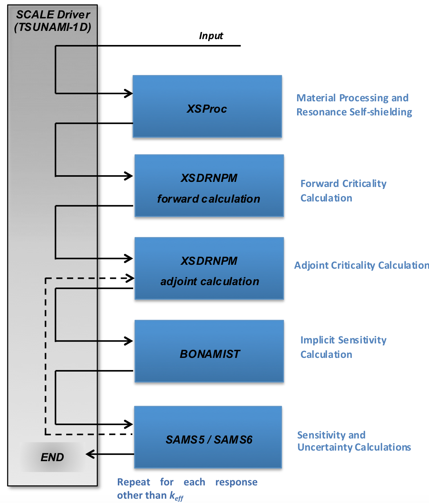
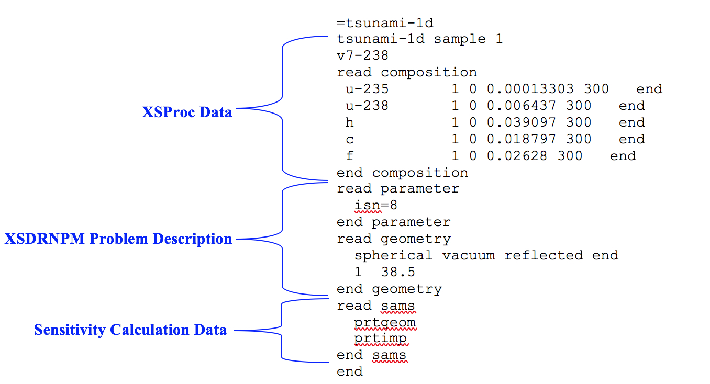
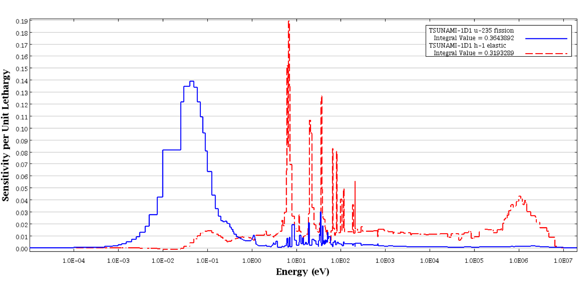
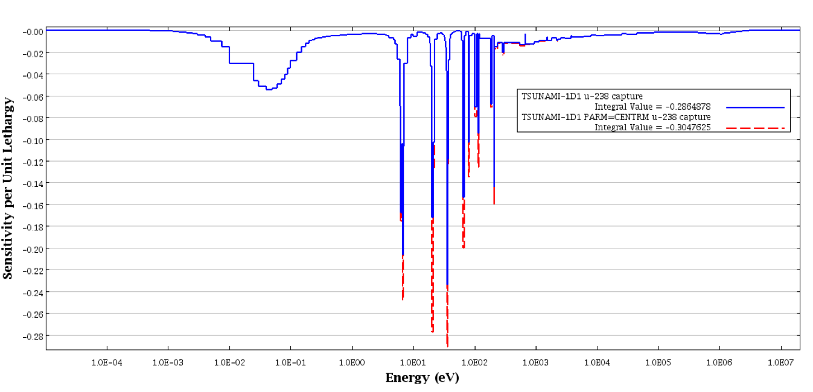
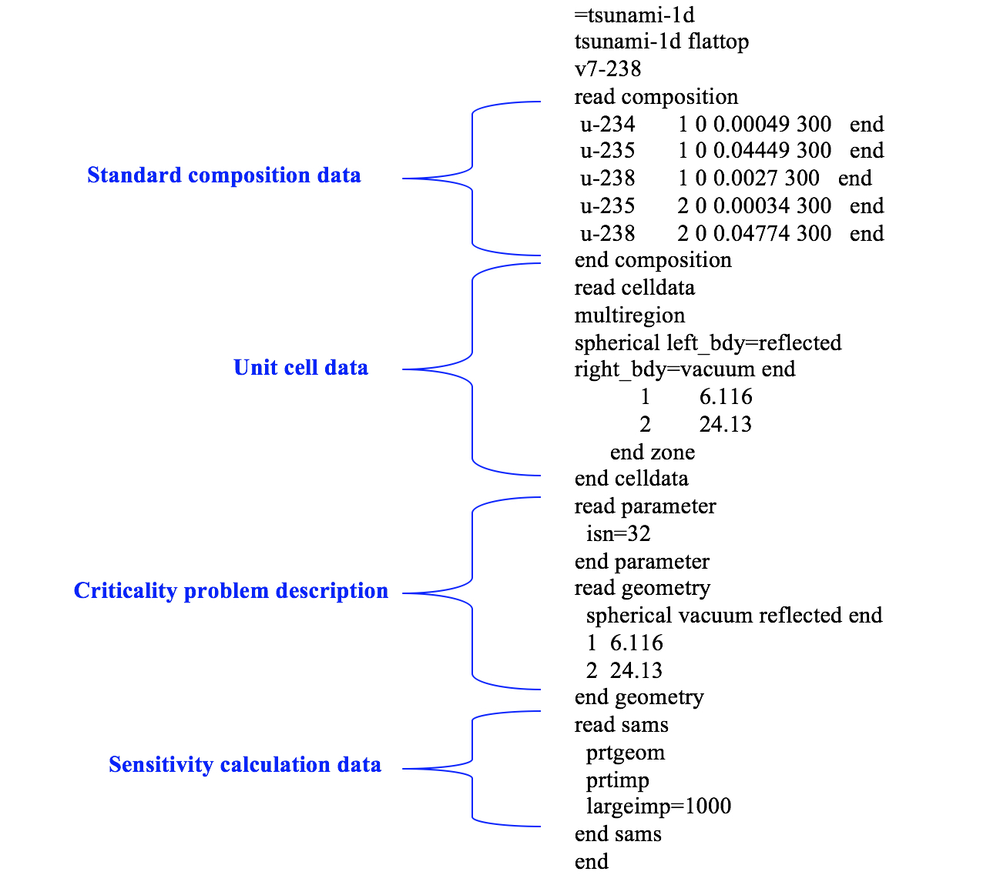
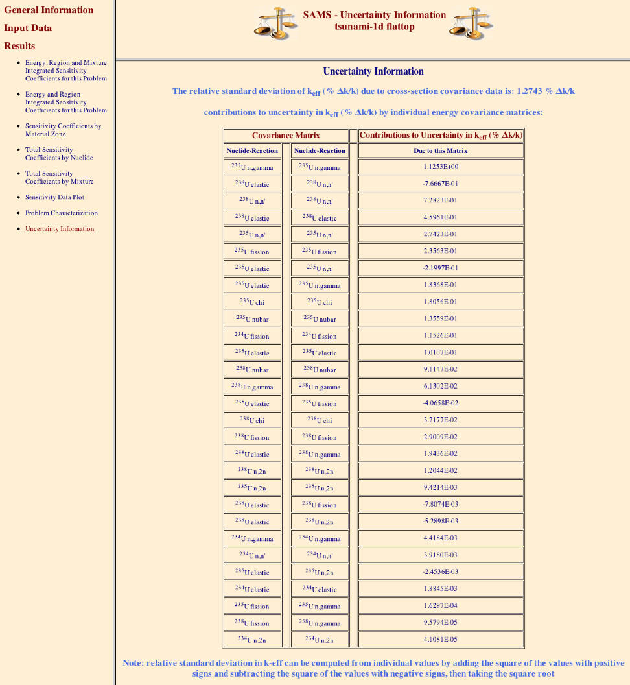
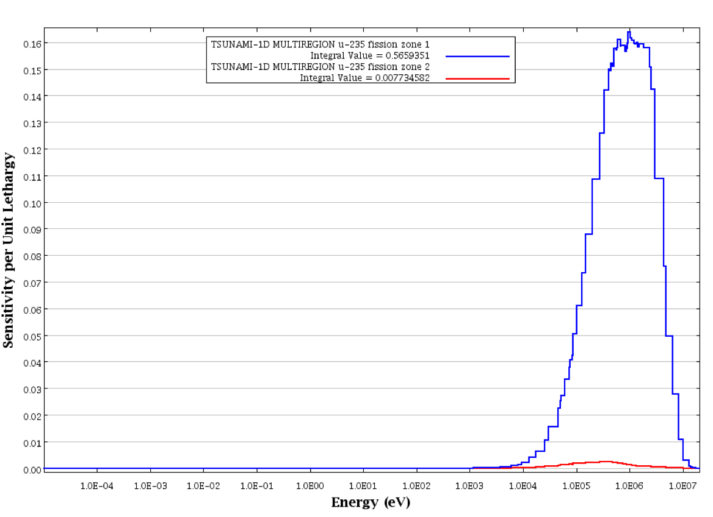
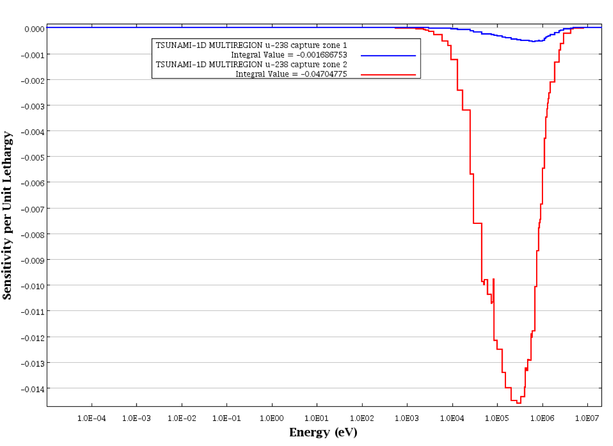
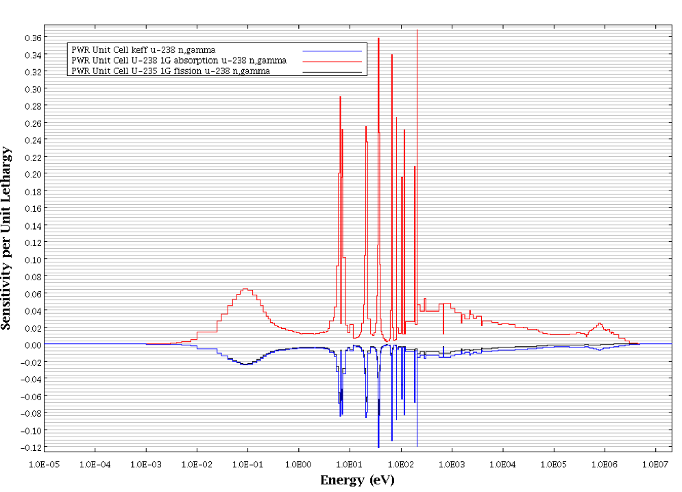

.. _6-1:

TSUNAMI-1D:  Control Module for One-Dimensional Cross-Section Sensitivity and Uncertainty
=========================================================================================

*B. T. Rearden, M. A. Jessee, L. M. Petrie, and M. L. Williams*

ABSTRACT

TSUNAMI-1D (**T**\ ools for **S**\ ensitivity and **Un**\ certainty
**A**\ nalysis **M**\ ethodology **I**\ mplementation in **One**
**D**\ imension) is a SCALE control module that facilitates the
application of sensitivity and uncertainty analysis theory to nuclear
systems analyses. TSUNAMI-1D was originally developed to provide
sensitivity and uncertainty analysis of *k*\ :sub:`eff`\ for criticality safety
applications, and subsequent updates provide for analysis of system
responses other than *k*\ :sub:`eff`, using generalized perturbation theory.
TSUNAMI-1D provides for automated processing of material input,
processing of cross-section data, calculation of neutron transport
solutions, calculation of sensitivity coefficients, and the calculation
of uncertainties in system responses due to cross-section-covariance
data. The XSDRNPM module is used for the transport solver. XSDRNPM uses
the method of discrete ordinates to calculate *k*\ :sub:`eff` for applications
that are appropriate for 1D modeling. The SAMS module is used to
determine the sensitivities of the calculated value of *k*\ :sub:`eff` and
other system responses to the nuclear data used in the calculation as a
function of nuclide, reaction type, and energy. The uncertainties in the
calculated value of *k*\ :sub:`eff`\ and other system responses, resulting from
uncertainties in the basic nuclear data used in the calculation, are
estimated using energy-dependent cross-section-covariance matrices. The
implicit effects of the resonance self-shielding calculations are
predicted using BONAMIST.

ACKNOWLEDGMENTS

The authors acknowledge Bryan Broadhead of Oak Ridge National
Laboratory, and R. L. Childs, formerly of the Oak Ridge National
Laboratory, for their assistance with this work. The support and
encouragement of Calvin Hopper, Cecil Parks, and Don Mueller of
Oak Ridge National Laboratory is also appreciated. Additionally, the
authors wish to acknowledge Debbie Weaver and Sheila Walker for their
assistance in preparing this document.

.. _6-1-1:

Introduction
------------

TSUNAMI-1D (**T**\ ools for **S**\ ensitivity and **Un**\ certainty
**A**\ nalysis **M**\ ethodology **I**\ mplementation in **One**
**D**\ imension) is a SCALE control module that facilitates the
application of sensitivity and uncertainty theory to nuclear system
analyses. The data computed with TSUNAMI-1D are the sensitivity of a
system response, such as *k*\ :sub:`eff`, to each constituent cross-section
data component used in the calculation. The sensitivity data are coupled
with cross-section uncertainty data, in the form of multigroup
covariance matrices, to produce an uncertainty in the system response
due to uncertainties in the underlying nuclear data. The group-wise
sensitivity data computed with TSUNAMI-1D are stored in a sensitivity
data file (.sdf file) that is suitable for use in assessing system
similarity for code validation purposes using TSUNAMI-IP, (see
TSUNAMI-IP chapter), and for advanced bias assessment using TSURFER, see
the TSURFER chapter.

This manual is intended to provide the user with a detailed reference on
code input options and provide some examples of the application of
TSUNAMI-1D to generate sensitivity and uncertainty data. A detailed
description of code input is provided in :ref:`6-1-3`, three sample
problems are given in :ref:`6-1-4` the techniques used in each
computational sequence are described in :ref:`6-1-2`, and additional
information is provided in the appendices. A new user may wish to begin
by reviewing the sample problems, and then refer to the input details in
:ref:`6-1-3` to customize an input for his specific needs.

TSUNAMI-1D provides automated, problem-dependent cross sections using
the same methods and input as the **C**\ riticality **S**\ afety
**A**\ nalysis **S**\ equences (CSAS). The BONAMIST code computes the
sensitivity of resonance self-shielded cross to the input data, the
so-called “implicit sensitivities.”

After the cross sections are processed, the TSUNAMI-1D sequence performs
two XSDRNPM criticality calculations, one forward and one adjoint.
Finally, the sequence calls the SAMS module to calculate the sensitivity
coefficients that indicate the sensitivity of the calculated values to
changes in the cross sections and the uncertainty in the calculated
value due to uncertainties in the basic nuclear data. SAMS prints
energy-integrated sensitivity coefficients and their statistical
uncertainties to the SCALE output file and generates a separate data
file containing the energy-dependent sensitivity coefficients.

In addition to the sensitivity and uncertainty analysis sequence, the
TSUNAMI-1DC sequence can be used to verify the accuracy of the
TSUNAMI-1D calculations with direct perturbation criticality
calculations. The verification of computed sensitivity coefficients is
imported for systems where the cell-weighted material is not the only
material used in the model. By default, TSUNAMI-1DC performs the same
functions as the TSUNAMI-1D sequence with PARM=CENTRM, except that it
does not perform the adjoint XSDRNPM calculation and does not call the
SAMS module.

.. _6-1-2:

TSUNAMI-1D Techniques
~~~~~~~~~~~~~~~~~~~~~

TSUNAMI-1D is a SCALE control module. As such, its primary function is
to control a sequence of calculations that are performed by other codes.
The input for each of the TSUNAMI-1D sequences is very similar to that
used for CSAS1, with the addition of the system model description and
optional sensitivity calculation data. TSUNAMI-1D uses the same material
and cell data input as all other SCALE sequences. The control sequences
available in TSUNAMI-1D are summarized in :numref:`tab6-1-1`, where the
functional modules executed by each control sequence are also shown. A
general flow diagram of TSUNAMI-1D is shown in :numref:`fig6-1-1`.

.. _tab6-1-1:
.. table:: TSUNAMI-1D control sequences.
  :align: center
  :widths: auto

  +-----------+-----------+-----------+-----------+-----------+-----------+
  | **Contro\ | **Functio\|           |           |           |           |
  | l**       | nal       |           |           |           |           |
  |           | modules   |           |           |           |           |
  | **sequenc\| executed  |           |           |           |           |
  | e**       | by the    |           |           |           |           |
  |           | control   |           |           |           |           |
  |           | module**  |           |           |           |           |
  +-----------+-----------+-----------+-----------+-----------+-----------+
  | TSUNAMI-1 | XSProc    | XSDRNPM   | XSDRNPM   | BONAMIST  | SAMS\*    |
  | D         |           |           |           |           |           |
  |           |           | forward   | adjoint\* |           |           |
  +-----------+-----------+-----------+-----------+-----------+-----------+
  | TSUNAMI-1 | XSProc    | XSDRNPM   |           |           |           |
  | DC        |           |           |           |           |           |
  |           |           | forward   |           |           |           |
  +-----------+-----------+-----------+-----------+-----------+-----------+
  | \*The     |           |           |           |           |           |
  | XSDRNPM   |           |           |           |           |           |
  | adjoint   |           |           |           |           |           |
  | calculati\|           |           |           |           |           |
  | on        |           |           |           |           |           |
  | and SAMS  |           |           |           |           |           |
  | calculati\|           |           |           |           |           |
  | on        |           |           |           |           |           |
  | are       |           |           |           |           |           |
  | repeated  |           |           |           |           |           |
  | for each  |           |           |           |           |           |
  | system    |           |           |           |           |           |
  | response  |           |           |           |           |           |
  | defined   |           |           |           |           |           |
  | by the    |           |           |           |           |           |
  | user.     |           |           |           |           |           |
  +-----------+-----------+-----------+-----------+-----------+-----------+

TSUNAMI-1D and many other SCALE sequences apply a standardized procedure
to provide appropriate cross sections for the calculation. This
procedure is carried out by routines of the XSProc that generate number
densities and related information, prepare geometry data for resonance
self-shielding and flux-weighting cell calculations, and create data
input files for the cross-section processing codes.

By default, the TSUNAMI-1D sequence performs cross-section processing
with XSProc, exercising all available options there, performs the
forward and adjoint XSDRNPM calculations, calls BONAMIST to produce
implicit sensitivity coefficients, then calls SAMS to produce
sensitivity and uncertainty output and *sdf* files. Optional sequence
level parameters can be used to change methods applied in resonance
self-shielding and exclude the implicit sensitivity calculation, which
detailed later in this document. If additional system responses are
requested in the input, TSUNAMI-1D executes additional generalized
adjoint XSDRNPM and SAMS calculations for each system response.

The input requirements for the model description are very similar to
those used for multiregion cell descriptions in the cell data section of
input. The definition of system responses other than *k*\ :sub:`eff` requires
both the DEFINITIONS and SYSTEMRESPONSE block of input data. These
blocks of data are described in :ref:`6-1-3-4`. TSUNAMI-1D also reads
and prepares inputs for the SAMS calculation. The additional input
blocks for the SAMS module are optional. The input format of the SAMS
blocks of data are described in the SAMS chapter.

.. _fig6-1-1:

  General flow diagram of TSUNAMI-1D.

.. _6-1-3:

TSUNAMI-1D Input Description
----------------------------

The input to TSUNAMI-1D consists of a SCALE Analytical Sequence
Specification Record, SCALE XSProc data, model problem data, optional
sensitivity and uncertainty calculation data, and optional system
response characterization data. The data for each of these segments are
entered using the SCALE free-form format, allowing alphanumeric data,
floating-point data, and integer data to be entered in an unstructured
manner. The input is not case sensitive, so either upper- or lowercase
letters may be used. A maximum of 252 columns per line may be used for
input. Data can usually start or end in any column with a few
exceptions. As an example, the word END beginning in column 1 and
followed by two blank spaces will end the problem, any data following
will be ignored. Each data entry must be followed by one or more blanks
to terminate the data entry. For numeric data, either a comma or a blank
can be used to terminate each data entry. Integers may be entered for
floating values. For example, 10 will be interpreted as 10.0. Imbedded
blanks are not allowed within a data entry unless an E precedes a single
blank as in an unsigned exponent in a floating-point number. For
example, 1.0E 4 would be correctly interpreted as 1.0 × 10\ :sup:`4`. A
comment is initiated with a single quote, ``‘``, and continues until the end
of the input line.

.. _6-1-3-1:

Analytical sequence specification record
~~~~~~~~~~~~~~~~~~~~~~~~~~~~~~~~~~~~~~~~

The analytical sequence specification begins in column 1 of the first line
of the input file and must contain one of the following:

.. describe:: =TSUNAMI-1D

  This sequence is used for sensitivity and uncertainty
  calculations.

.. describe:: =TSUNAMI-1DC

  This sequence allows more flexibility than CSAS1 and is
  used for criticality calculations where the criticality problem
  description contains more detail than that specified in a single unit
  cell description.

Optional keyword input may be entered, starting after column 10 of the
analytical sequence specification record. These keywords are

+-----------------------------------+-----------------------------------+
| PARM=CHECK                        | This option allows the input data |
|                                   | to be read and checked without    |
| PARM=CHK                          | executing any functional modules. |
+-----------------------------------+-----------------------------------+

.. describe:: PARM=SIZE=n

  The amount of memory requested in four-byte words may be set
  with this entry. The default value for n is 20000000. This value only
  affects calculations in BONAMIST, where this value of the SIZE parameter
  is used for allocation of storage for the derivatives. Please see the
  documentation on BONAMIST in the Sensitivity Utility Modules chapter for
  more details. All other codes use dynamic memory allocation and this
  value has no effect.

.. describe:: PARM=BONAMIST

  This is the default configuration for MG TSUNAMI-1D
  calculations. XSProc with BONAMI and CENTRM is used for cross-section
  processing, and implicit sensitivities are produced with BONAMIST.

.. describe:: PARM=CENTRM

  XSProc with BONAMI and CENTRM is used for cross-section
  processing, but BONAMIST is not run. **TSUNAMI-1D sequence with
  PARM=CENTRM does not produce the implicit portions of the sensitivity
  coefficients, and should be used with caution.**

.. describe:: PARM=BONAMI

  XSProc with BONAMI is used for cross-section processing, but
  BONAMIST is not run. **TSUNAMI-1D sequence with PARM=BONAMI does not
  produce the implicit portions of the sensitivity coefficients, and
  should be used with caution.**

.. describe:: PARM=2REGION

  XSProc with BONAMI and CENTRM are run where Dancoff factors
  are to compute the escape probabilities for an accelerated, yet more
  approximate, CENTRM calculation. Implicit sensitivities are computed
  with BONAMIST.

Multiple parameters can be used simultaneously by enclosing them in
parentheses and separating them with commas such as PARM=(SIZE=2000000,
CHECK).

Multiple parameters can be used simultaneously by enclosing them in
parentheses and separating them with commas such as PARM=(SIZE=2000000,
CHECK).

.. _6-1-3-2:

XSProc
~~~~~~

XSProc reads the standard composition specification data and the unit
cell geometry specifications. It then produces the mixing table and unit
cell information necessary for processing the cross sections. The XSProc
chapter provides a detailed description of the input data for the
Material Information Processor.

Model problem data
~~~~~~~~~~~~~~~~~~

The model problem data are used by the TSUNAMI-1D sequences to prepare
input for the XSDRNPM transport calculation. This input section consists
of two data blocks, one block contains a geometry description and one
contains optional parameters.

.. _6-1-3-3-1:

Geometry data
^^^^^^^^^^^^^

The TSUNAMI-1D geometry data block begins with the keywords *READ GEOM*
and ends with the keywords *END GEOM*. This data block is always
required. The following data is contained within this data block:

1. A line containing the geometry and boundary conditions for the
   XSDRNPM criticality case. The first entry on this line describes the
   geometry and must be SLAB, CYLINDRICAL, or SPHERICAL. The second
   entry is optional and describes the right-boundary condition. The
   default value for the right-boundary condition is VACUUM. The third
   entry on this line is optional and describes the left-boundary
   condition. The default value for the left boundary condition is
   REFLECTED. The last entry on this line is END. Valid entries for the
   boundary conditions are the following:

..

   VACUUM – No return at boundary

   REFLECTED – Specular (mirror-like) return at boundary

   PERIODIC – Infinite array of cells in slab geometry

   WHITE – Isotropic return at boundary

2. A line containing the following two entries for each zone of the
   XSDRNPM case:

   a. mixture number in the zone and

   b. zone outer dimension (in cm).

..

   Mixture numbers and zone dimensions are entered in pairs until the
   entire geometry is defined. The mixture numbers must be defined in
   the material input processor input. Mixture 0 is used for voids, and
   a mixture number defined with CELLMIX= in the MIP section of the
   input may be used here. It should be noted that, due to a restriction
   in XSDRNPM, the mixture number identified with CELLMIX= may not
   appear in the output file, even though it is input in this section.
   TSUNAMI-1D automatically renumbers the cell mixed mixture to the next
   available mixture number for use in XSDRNPM. A message is printed in
   the output identifying this change. TSUNAMI-1D uses the same
   techniques as CSAS1X to automatically prepare a spatial mesh
   appropriate for the input materials and dimensions.

.. _6-1-3-3-2:

Parameter data
^^^^^^^^^^^^^^

An optional data block may be entered to change parameters of the
XSDRNPM forward and adjoint calculations. This data block begins with
the keywords *READ PARA* or *READ PARM* and must end with either *END
PARA* or *END PARM*, corresponding to the read keyword. In this
data block, the user may enter optional lines that contain entries for
selected XSDRNPM input parameters. A list of the parameters and their
default values are found in :numref:`tab6-1-2`.

.. _tab6-1-2:
.. table:: Optional parameter input for the criticality problem data.
  :align: center
  :class: longtable

  +-----------------------+-----------------------+-----------------------+
  | **Name**              | **Default**           | **Meaning**           |
  +-----------------------+-----------------------+-----------------------+
  | ISN=                  | 16                    | Order of angular      |
  |                       |                       | quadrature            |
  +-----------------------+-----------------------+-----------------------+
  | IIM=                  | 20                    | Inner-iteration       |
  |                       |                       | maximum               |
  +-----------------------+-----------------------+-----------------------+
  | ICM=                  | 100                   | Outer-iteration       |
  |                       |                       | maximum               |
  +-----------------------+-----------------------+-----------------------+
  | ID1=                  | −1                    | Flux-edit option:     |
  +-----------------------+-----------------------+-----------------------+
  |                       |                       | −1 no flux print      |
  +-----------------------+-----------------------+-----------------------+
  |                       |                       |   0 scalar flux print |
  +-----------------------+-----------------------+-----------------------+
  |                       |                       |   1 scalar and        |
  |                       |                       | angular flux print    |
  +-----------------------+-----------------------+-----------------------+
  | SCT=                  | 5                     | Order of Legendre     |
  |                       |                       | expansion for         |
  |                       |                       | cross sections        |
  +-----------------------+-----------------------+-----------------------+
  | PRT=                  | −2                    | Cross-section print   |
  |                       |                       | option:               |
  +-----------------------+-----------------------+-----------------------+
  |                       |                       | −2 no cross-section   |
  |                       |                       | print                 |
  +-----------------------+-----------------------+-----------------------+
  |                       |                       | −1 print 1-D          |
  |                       |                       | cross sections        |
  +-----------------------+-----------------------+-----------------------+
  |                       |                       | 0/N print 2-D         |
  |                       |                       | cross sections        |
  |                       |                       | through order N       |
  +-----------------------+-----------------------+-----------------------+
  | PBT=                  | 0                     | Balance table print   |
  |                       |                       | option:               |
  +-----------------------+-----------------------+-----------------------+
  |                       |                       | −1 no balance table   |
  |                       |                       | print                 |
  +-----------------------+-----------------------+-----------------------+
  |                       |                       |   0 fine group        |
  |                       |                       | balance table print   |
  +-----------------------+-----------------------+-----------------------+
  | EPS=                  | 1.E−6                 | Outer-iteration       |
  |                       |                       | convergence criteria  |
  +-----------------------+-----------------------+-----------------------+
  | PTC=                  | 1.E−6                 | Inner-iteration       |
  |                       |                       | convergence criteria  |
  +-----------------------+-----------------------+-----------------------+
  | DY=                   | 0                     | First-transverse      |
  |                       |                       | dimension (cm) for    |
  |                       |                       | buckling correction   |
  |                       |                       | (i.e., height of      |
  |                       |                       | cylinder or slab)     |
  +-----------------------+-----------------------+-----------------------+
  |                       |                       |                       |
  +-----------------------+-----------------------+-----------------------+
  | DZ=                   | 0                     | Second-transverse     |
  |                       |                       | dimension (cm) for    |
  |                       |                       | buckling correction   |
  |                       |                       | (i.e., depth of slab) |
  +-----------------------+-----------------------+-----------------------+
  |                       |                       |                       |
  +-----------------------+-----------------------+-----------------------+
  | SZF=                  | 1.5                   | Size factor of        |
  |                       |                       | spatial computational |
  |                       |                       | mesh intervals.       |
  |                       |                       | Increasing this       |
  |                       |                       | number will cause the |
  |                       |                       | forward and adjoint   |
  |                       |                       | XSDRNPM calculations  |
  |                       |                       | to be conducted with  |
  |                       |                       | larger mesh intervals |
  |                       |                       | and fewer mesh        |
  |                       |                       | points. 0.0<SZF<1.5   |
  |                       |                       | gives a finer mesh,   |
  |                       |                       | SZF>1.5 gives a       |
  |                       |                       | coarser mesh.         |
  +-----------------------+-----------------------+-----------------------+

.. _6-1-3-4:

Sensitivity and uncertainty calculation data
~~~~~~~~~~~~~~~~~~~~~~~~~~~~~~~~~~~~~~~~~~~~

The data blocks for controlling the sensitivity and uncertainty
calculation are optional. The optional data blocks include the *SAMS*
block, the *HTML* block, the *COVARIANCE* block, the *DEFINITIONS*
block, and the *SYSTEMRESPONSES* block. These data blocks begin with the
keywords *READ BLOCKNAME* and end with the keywords *END BLOCKNAME,*
where *BLOCKNAME* is one of *SAMS, HTML, COVARIANCE, DEFINITONS*, or
*SYSTEMRESPONSES*. These data blocks can be input in any order with the
following two exceptions. First, all five data blocks must appear in the
input file *after* the composition and cell data blocks of data. Second,
if a *SAMS* block is specified, the *HTML* and *COVARIANCE* data blocks
must come *after* the *SAMS* block, if they are to be specified. In
addition, both the *DEFINITONS* and *SYSTEMRESPONSES* data blocks must
be present for additional analysis of system responses other than
*k*\ :sub:`eff`. If only one or both of the data blocks are omitted, then
analysis is only performed for *k*\ :sub:`eff`. The following sub-sections
describe these blocks of data in detail.

.. _6-1-3-4-1:

Response definition data
^^^^^^^^^^^^^^^^^^^^^^^^

The *DEFINITIONS* and *SYSTEMRESPONSES* blocks are used to define system
responses for additional sensitivities and uncertainty analysis in SAMS.
For criticality calculations, the sensitivities of system responses
other than *k*\ :sub:`eff` are calculated in TSUNAMI-1D using generalized
perturbation theory (GPT). The details of the GPT methodology are
provided in *General Perturbation Theory* section of the SAMS chapter.
Using GPT, a *system response,* denoted R, is defined as a ratio such
as:

.. math::
  :label: eq6-1-1

  R=\frac{\sum_{g} \int d \bar{r} H_{N, g}(\bar{r}) \phi_{g}(\bar{r})}{\sum_{g} \int d \bar{r} H_{D, g}(\bar{r}) \phi_{g}(\bar{r})}

In this equation, :math:`\phi_{g}(\bar{r})` is the space-dependent multi-group scalar
flux and :math:`H_{N, g}(\bar{r})`,\ :math:`H_{D, g}(\bar{r})` are referred to as the space-dependent,
multi-group *response functions*. In TSUNAMI-1D, the *response
functions* are specified in the *DEFINITIONS* data block and the *system
responses* are defined in the *SYSTEMRESPONSES* data block. Responses
(other *k*\ :sub:`eff`) treated in TSUNAMI-1D MUST be ratios.

The *DEFINITIONS* data block is used by TSUNAMI-1D similarly to that of
the MAVRIC and MONACO modules in SCALE. The format of the *DEFINITIONS*
block is as follows:

.. highlight:: scale

::

  read definitions
    response I1
      (specifications for response I1)
    end response
    response I2
      (specifications for response I2)
    end response
    ...
  end definitions

The *DEFINITIONS* block of data begins with *READ DEFINITIONS* and
terminates with *END DEFINITIONS*. Likewise, each response function
definition begins with *RESPONSE* — followed by a unique, positive
integer identifier — and terminates with *END RESPONSE*. The keyword
entries summarized in :numref:`tab6-1-3` are allowed for each response
specification. Keywords ending with ‘=’ must be followed by the value to
be assigned to the corresponding variable. All keywords are optional and
can be entered in any order. However certain keywords are required
depending one of the seven basic types of response functions described
in the following subsections. The required keywords are summarized for
each of the seven basic response function types in :numref:`tab6-1-3` at the
end of this section.

.. _tab6-1-3:
.. table:: Response function keywords in *DEFINITIONS* block.
  :align: center
  :class: longtable

  +-----------------+-----------------+-----------------+-----------------+
  | **Keyword**     | **Type**        | **Default       | **Description** |
  |                 |                 | value**         |                 |
  +=================+=================+=================+=================+
  | title=          | String          | “ “             | Response        |
  |                 |                 |                 | function title. |
  |                 |                 |                 | The title must  |
  |                 |                 |                 | begin and end   |
  |                 |                 |                 | with quotes and |
  |                 |                 |                 | have a maximum  |
  |                 |                 |                 | of 256          |
  |                 |                 |                 | characters.     |
  +-----------------+-----------------+-----------------+-----------------+
  | macro           | Logical         | F               | Macroscopic     |
  |                 |                 |                 | cross-section   |
  |                 |                 |                 | flag. If        |
  |                 |                 |                 | specified,      |
  |                 |                 |                 | macroscopic     |
  |                 |                 |                 | cross-sections  |
  |                 |                 |                 | are used to     |
  |                 |                 |                 | define the      |
  |                 |                 |                 | response        |
  |                 |                 |                 | function.       |
  +-----------------+-----------------+-----------------+-----------------+
  | micro           | Logical         | T               | Microscopic     |
  |                 |                 |                 | cross-section   |
  |                 |                 |                 | flag. If        |
  |                 |                 |                 | specified,      |
  |                 |                 |                 | microscopic     |
  |                 |                 |                 | cross-sections  |
  |                 |                 |                 | are used to     |
  |                 |                 |                 | define the      |
  |                 |                 |                 | response        |
  |                 |                 |                 | function.       |
  +-----------------+-----------------+-----------------+-----------------+
  | nuclide=        | Integer or      | Undefined       | Nuclide         |
  |                 | string          |                 | identifier for  |
  | or              |                 |                 | which           |
  |                 |                 |                 | cross-sections  |
  | zaid=           |                 |                 | are used to     |
  |                 |                 |                 | define the      |
  |                 |                 |                 | response        |
  |                 |                 |                 | function. The   |
  |                 |                 |                 | nuclide can be  |
  |                 |                 |                 | specified in    |
  |                 |                 |                 | integer format  |
  |                 |                 |                 | (92235) or in   |
  |                 |                 |                 | character       |
  |                 |                 |                 | string format   |
  |                 |                 |                 | (u-235).        |
  +-----------------+-----------------+-----------------+-----------------+
  | reaction=       | Integer or      | Undefined       | Reaction        |
  |                 | string          |                 | identifier for  |
  | or              |                 |                 | which           |
  |                 |                 |                 | cross-sections  |
  | mt=             |                 |                 | are used to     |
  |                 |                 |                 | define the      |
  |                 |                 |                 | response        |
  |                 |                 |                 | function. The   |
  |                 |                 |                 | reaction can be |
  |                 |                 |                 | specified as an |
  |                 |                 |                 | MT number (18)  |
  |                 |                 |                 | or as a         |
  |                 |                 |                 | character       |
  |                 |                 |                 | string          |
  |                 |                 |                 | (fission).      |
  |                 |                 |                 | Supported       |
  |                 |                 |                 | reaction types  |
  |                 |                 |                 | are listed      |
  |                 |                 |                 | below.          |
  +-----------------+-----------------+-----------------+-----------------+
  | material=       | Integer         | Undefined       | Mixture         |
  |                 |                 |                 | identifier for  |
  | or              |                 |                 | which           |
  |                 |                 |                 | cross-sections  |
  | mixture=        |                 |                 | are used to     |
  |                 |                 |                 | define the      |
  |                 |                 |                 | response        |
  |                 |                 |                 | function.       |
  +-----------------+-----------------+-----------------+-----------------+
  | multimix … end  | Integer array   | Undefined       | Array of        |
  | or              |                 |                 | mixture         |
  |                 |                 |                 | identifiers for |
  | multimat … end  |                 |                 | which           |
  |                 |                 |                 | cross-sections  |
  |                 |                 |                 | are used to     |
  |                 |                 |                 | define the      |
  |                 |                 |                 | response        |
  |                 |                 |                 | function.       |
  +-----------------+-----------------+-----------------+-----------------+
  | unity           | Logical         | F               | Flux response   |
  |                 |                 |                 | function flag.  |
  |                 |                 |                 | If specified,   |
  |                 |                 |                 | cross-sections  |
  |                 |                 |                 | are not used to |
  |                 |                 |                 | define the      |
  |                 |                 |                 | response        |
  |                 |                 |                 | function.       |
  +-----------------+-----------------+-----------------+-----------------+
  | multiplier      | Real            | 1.0             | Response        |
  |                 |                 |                 | function        |
  |                 |                 |                 | multiplier.     |
  +-----------------+-----------------+-----------------+-----------------+
  | ehigh=          | Real            | 10\ :sup:`25`   | Upper energy    |
  |                 |                 |                 | (eV) boundary   |
  |                 |                 |                 | of the response |
  |                 |                 |                 | function.       |
  +-----------------+-----------------+-----------------+-----------------+
  | elow=           | Real            | 0.0             | Lower energy    |
  |                 |                 |                 | (eV) boundary   |
  |                 |                 |                 | of the response |
  |                 |                 |                 | function.       |
  +-----------------+-----------------+-----------------+-----------------+
  | ehightransfer=  | Real            | 10\ :sup:`25`   | Upper energy    |
  |                 |                 |                 | (eV) boundary   |
  |                 |                 |                 | used for        |
  |                 |                 |                 | cross-sections  |
  |                 |                 |                 | with secondary  |
  |                 |                 |                 | particle        |
  |                 |                 |                 | distributions   |
  |                 |                 |                 | (elastic,       |
  |                 |                 |                 | inelastic,      |
  |                 |                 |                 | scatter, and    |
  |                 |                 |                 | n,2n).          |
  +-----------------+-----------------+-----------------+-----------------+
  | elowtransfer=   | Real            | 0.0             | Lower energy    |
  |                 |                 |                 | (eV) boundary   |
  |                 |                 |                 | used for        |
  |                 |                 |                 | cross-sections  |
  |                 |                 |                 | with secondary  |
  |                 |                 |                 | particle        |
  |                 |                 |                 | distributions   |
  |                 |                 |                 | (elastic,       |
  |                 |                 |                 | inelastic,      |
  |                 |                 |                 | scatter, and    |
  |                 |                 |                 | n,2n).          |
  +-----------------+-----------------+-----------------+-----------------+

.. _6-1-3-4-4-1:

Single-mixture flux response function
'''''''''''''''''''''''''''''''''''''

A single-mixture flux response is simply the integration of the neutron
flux wherever a specified mixture is defined in the problem geometry.
Therefore, the response function :math:`H_{g}(\bar{r})` for a single mixture-\ *j* is
defined as:

.. math::
  :label: eq6-1-2

  H_{g}(\bar{r})=c^{*} \delta_{g} * \delta_{j}(\bar{r})

where

.. math::

  \begin{aligned}
  &\delta_{g}=\left\{\begin{array}{cc}
  1.0 & E_{\text {High}}>E_{g}^{\text {Lower}}, E_{\text {Low}}<E_{g}^{U \text {pper}} \\
  0 & \text {otherwise}
  \end{array}\right.\\
  &\text { and }\\
  &\delta_{j}(\bar{r})=\left\{\begin{array}{cc}
  1.0 & \text { mixture jis used at } \bar{r} \\
  0 & \text { otherwise }
  \end{array}\right.
  \end{aligned}

In this expression, the constant *c* is the scalar multiplier defined by
the *multiplier=* keyword. For example, the “fast” and “thermal” flux
responses for mixture 5 would be:

::

  read definitions
    response 1 unity  eLow=0.625    mixture=5 end response
    response 2 unity eHigh=0.625    mixture=5 end response
    response 3 unity multiplier=2.0 mixture=5 end response
  end definitions

In this example, the energy cutoff between the fast group and the
thermal group is defined as 0.625 eV. Response 3 reflects the total
energy-integrated flux—scaled by a factor of 2.0—because the default
values of *eHigh* and *eLow* are used.

For single-mixture flux responses, keywords *unity* and *mixture* are
required; *multiplier*, *eHigh*, and *eLow* are optional; *title,*
*nuclide, reaction*, *micro, macro, eHighTransfer,* and *eLowTransfer*
are optional but are not used; and *multimix* is not allowed. These
keyword dependencies are outlined for each response type in :numref:`tab6-1-4`.

.. _6-1-3-4-1-2:

Multiple-mixture flux response
''''''''''''''''''''''''''''''

A multiple-mixture flux response is the integration of the neutron flux
wherever a set of mixtures are defined in the problem geometry.
Therefore, the response function :math:`H_{g}(\bar{r})` for a set of mixtures
“\ *S*\ ” is defined as:

.. math::
  :label: eq6-1-3

  H_{g}(\bar{r})=c^{*} \delta_{g} * \sum_{j \in S} \delta_{j}(\bar{r})

For example, the following definition is for the energy-integrated flux
response, and spatially-integrated wherever mixtures 5, 7, and 9 are
used:

::

  read definitions
    response 1 unity multimix 5 7 9 end end response
  end definitions

or alternatively,

::

  read definitions
    response 1 multimat 5 7 9 end unity end response
  end definitions

For multiple-mixture flux responses, keywords *unity* and *multimix* are
required; *multiplier*, *eHigh*, and *eLow* are optional; *title,*
*nuclide, reaction*, *micro, macro, eHighTransfer,* and *eLowTransfer*
are optional but are not used; and *mixture* is not allowed.

.. _6-1-3-4-1-3:

Single-mixture, single-nuclide, microscopic cross-section response
''''''''''''''''''''''''''''''''''''''''''''''''''''''''''''''''''

A single-mixture, single-nuclide, microscopic cross-section response is
the integration of the neutron flux multiplied by a microscopic
cross-section. The microscopic cross-section used in the integral is
defined by a specific mixture, nuclide, and reaction type. Therefore,
the response function :math:`H_{g}(\bar{r})` is defined as:

.. math::
  :label: eq6-1-4

  H_{g}(\bar{r})=c^{*} \delta_{g}^{*} \delta_{j}(\bar{r})^{*} \sigma_{x, g}^{j, n}

In this expression, :math:`\sigma_{x, g}^{j, n}` is the microscopic cross-section for
mixture-\ *j*, nuclide-\ *n*, reaction type-\ *x*, and energy
group-\ *g*. For transfer reaction types—scatter, elastic, inelastic,
and n,2n—the expression above is slightly modified so the user can
define the energy range of the secondary particles, i.e.,

.. math::
  :label: eq6-1-5

  H_{g}(\bar{r})=c^{*} \delta_{g} * \delta_{j}(\bar{r})^{*} \sum_{g^{\prime}} \delta_{g^{\prime}}^{T r a n s f e r} \sigma_{x, g \rightarrow g^{\prime}}^{j, n}

where

.. math::

  \delta_{g}^{\text {Transfer}}=\left\{\begin{array}{cc}
  1.0 & E_{\text {HighTranser}}>E_{g}^{\text {Lower}}, E_{\text {LowTransfer}}<E_{g}^{U \text {pper}} \\
  0 & \text {otherwise}
  \end{array}\right.

Likewise, the expression for :math:`H_{g}(\bar{r})` is also modified for fission
distribution responses (chi), which are usually integrated by the
energy-integrated neutron production rate rather than the neutron flux:

.. math::
  :label: eq6-1-6

  H_{g}(\bar{r})=c^{*} \delta_{j}(\bar{r})^{*} \bar{v}_{f, g}^{j, n} * \sigma_{f, g}^{j, n} * \sum_{g^{\prime}} \delta_{g^{\prime}}^{*} \chi_{g^{\prime}}^{j, n}

For examples of this response type, the following *DEFINITION* block has
response definitions for

-  total nu-fission rate of U-235 in mixture 1,

-  “fast” n,gamma capture rate of U-238 in mixture 1 (energy cutoff is
   0.625 eV),

-  downscatter rate of H-1 in mixture 2, and

-  number fission neutrons born from Pu-239 fissions in mixture 1 in the
   intermediate energy range (E>0.625 eV and E<25 keV)

   ::

     read definitions
       response 1
         reaction=nu-fission mixture=1 nuclide=92235
       end response
       response 2
         reaction=n,gamma mixture=1 nuclide=u-238 eLow=0.625
       end response
       response 3
         mt=0   mixture=2 zaid=1001  eLow=0.625 eHighTransfer=0.635
       end response
       response 4
         mt=chi mixture=1 zaid=pu-239 eHigh=25.0e3 eLow=0.625
       end response
     end definitions

For single-mixture, single-nuclide microscopic cross-section responses,
keywords *mixture, nuclide,* and *reaction* are required; *multiplier*,
*eHigh*, e\ *Low*, *eHighTransfer*, *eLowTransfer*, and *micro*, are
optional; *title* is optional but not used; and *multimix, macro,* and
*unity* are not allowed. A list of supported cross-section reaction
types is provided at the end of this section in :numref:`tab6-1-5`.

.. _6-1-3-4-1-4:

Single-mixture, single-nuclide, macroscopic cross-section response
''''''''''''''''''''''''''''''''''''''''''''''''''''''''''''''''''

A single-mixture, single-nuclide, macroscopic cross-section response is
the integration of the neutron flux multiplied by a macroscopic
cross-section. The macroscopic cross-section used in the integral is
defined by a specific mixture, nuclide, and reaction type. The response
function :math:`H_{g}(\bar{r})` is defined as:

.. math::
  :label: eq6-1-7

  H_{g}(\bar{r})=c^{*} \delta_{g} * \delta_{j}(\bar{r})^{*} \Sigma_{x, g}^{j, n}

In this expression, :math:`\Sigma_{x, g}^{j, n}` is the macroscopic cross-section
(:math:`N^{j,n} * \sigma^{j,n}_{x,g}`) for mixture-\ *j*, nuclide-\ *n*, reaction type-\ *x*, and
energy group-\ *g*. The modifications to this expression for transfer
reactions and chi are similar to that of single-mixture, single-nuclide,
microscopic cross-section responses\ *.* Using the same example as
above, the single-mixture, single-nuclide, macroscopic cross-section
responses are given as:

::

  read definitions
    response 1
      reaction=nu-fission mixture=1 nuclide=92235 macro
    end response
    response 2
      reaction=n,gamma mixture=1 nuclide=u-238 eLow=0.625 macro
    end response
    response 3
      mt=0   mixture=2 zaid=1001  eLow=0.625 eHighTransfer=0.635 macro
    end response
    response 4
      mt=chi mixture=1 zaid=pu-239 eHigh=25.0e3 eLow=0.625 macro
    end response
  end definitions

For single-mixture, single-nuclide macroscopic cross-section responses,
keywords *mixture, nuclide, macro,* and *reaction* are required;
*multiplier*, *eHigh*, e\ *Low*, *eHighTransfer*, and *eLowTransfer*,
are optional; *title* is optional but not used; and *multimix, micro,*
and *unity* are not allowed.

.. _6-1-3-4-1-5:

Single-mixture, multiple-nuclide, macroscopic cross-section response
''''''''''''''''''''''''''''''''''''''''''''''''''''''''''''''''''''

A single-mixture, multiple-nuclide, macroscopic cross-section response
is the integration of the neutron flux multiplied by a macroscopic
cross-section. The macroscopic cross-section used in the integral is
defined by a specific mixture, and reaction type. The response function
:math:`H_{g}(\bar{r})` is defined as:

.. math::
  :label: eq6-1-8

  H_{g}(\bar{r})=c^{*} \delta_{g} * \delta_{j}(\bar{r})^{*} \Sigma_{x, g}^{j}

In this expression, :math:`\Sigma_{x, g}^{j}` is the mixture macroscopic cross-section
defined as :math:`\sum_{n}N^{j,n} * \sigma^{j,n}_{x,g}` for mixture-\ *j*, reaction type-\ *x*, and energy
group-\ *g*. The modifications to this expression for transfer reactions
is similar to that defined in previous subsections\ *.* For mixture chi
responses, :math:`H_{g}(\bar{r})` is rewritten as

.. math::
  :label: eq6-1-9

  H_{g}(\bar{r})=c^{*} \delta_{j}(\bar{r})^{*} \sum_{n} \bar{v}_{f, g}^{j, n} * \Sigma_{f, g}^{j, n} * \sum_{g^{\prime}} \delta_{g^{\prime}} * \chi_{g^{\prime}}^{j, n}

For examples of this response type, the following *DEFINITIONS* block
has response definitions for

-  total nu-fission rate in mixture 1,

-  “fast” n,gamma capture rate in mixture 1 (energy cutoff is 0.625 eV),

-  downscatter rate in mixture 2, and

-  number fission neutrons born in mixture 1 in the intermediate energy
   range (E>0.625 eV and E<25 keV)

   ::

     read definitions
       response 1
         reaction=nu-fission mixture=1 macro
       end response
       response 2
         reaction=n,gamma mixture=1 eLow=0.625 macro
       end response
       response 3
         mt=0   mixture=2 eLow=0.625 eHighTransfer=0.635 macro
       end response
       response 4
         mt=chi mixture=1 eHigh=25.0e3 eLow=0.625 macro
       end response
     end definitions

For single-mixture, multiple-nuclide macroscopic cross-section
responses, keywords *mixture, macro,* and *reaction* are required;
*multiplier*, *eHigh*, e\ *Low*, *eHighTransfer*, and *eLowTransfer*,
are optional; *title* is optional but not used; and *multimix, micro,
nuclide,* and *unity* are not allowed.

.. _6-1-3-4-1-6:

Multiple-mixture, single-nuclide, macroscopic cross-section response
''''''''''''''''''''''''''''''''''''''''''''''''''''''''''''''''''''

A multiple-mixture, single-nuclide, macroscopic cross-section response
is the integration of the neutron flux multiplied by a macroscopic
cross-section over a set of mixtures defined in the problem geometry.
The macroscopic cross-section used in the integral is defined by a
specific mixture, nuclide, and reaction type. The response function
:math:`H_{g}(\bar{r})` is defined as:

.. math::
  :label: eq6-1-10

  H_{g}(\bar{r})=c^{*} \delta_{g} * \sum_{j \in S} \delta_{j}(\bar{r})^{*} \Sigma_{x, g}^{j, n}

In this expression, :math:`\Sigma_{x, g}^{j, n}` is the macroscopic cross-section
(:math:`N^{j,n} * \sigma^{j,n}_{x,g}`) for mixture-\ *j*, nuclide-\ *n*, reaction type-\ *x*, and
energy group-\ *g*. The summation of mixtures in this expression is for
a set of user-defined mixtures, denoted *S.* The modifications to this
expression for transfer reactions and chi are applied similarly to
previously defined response types above.

For examples of this response type, the following *DEFINITIONS* block
has response definitions for

-  total nu-fission rate of U-235 in the fuel mixtures (mixtures 1,3,5)

-  “fast” n,gamma capture rate of U-238 in the fuel mixtures

-  downscatter rate of H-1 in the moderator mixtures (mixtures 2,4)

-  number fission neutrons born in the intermediate energy range
   (E>0.625 eV and E<25 keV) in Pu-239 in the fuel mixtures

    ::

      read definitions
        response 1
          reaction=nu-fission multimix 1 3 5 end macro zaid=92235
        end response
        response 2
          reaction=n,gamma multimix 1 3 5 eLow=0.625 macro zaid=u-238
        end response
        response 3
          mt=0   multimix 2 4 end eLow=0.625 eHighTransfer=0.635 macro zaid=h-1
        end response
        response 4
          mt=chi multimix 1 3 5 end eHigh=25.0e3 eLow=0.625 macro zaid=pu-239
        end response
      end definitions

For multiple-mixture, single-nuclide macroscopic cross-section
responses, keywords *multimix, nuclide, macro,* and *reaction* are
required; *multiplier*, *eHigh*, e\ *Low*, *eHighTransfer*, and
*eLowTransfer*, are optional; *title* is optional but not used; and
*mixture, micro,* and *unity* are not allowed.

.. _6-1-3-4-1-7:

Multiple-mixture, multiple-nuclide, macroscopic cross-section response
''''''''''''''''''''''''''''''''''''''''''''''''''''''''''''''''''''''

A multiple-mixture, multiple-nuclide, macroscopic cross-section response
is the integration of the neutron flux multiplied by a macroscopic
cross-section over a set of mixtures defined in the problem geometry.
The macroscopic cross-section used in the integral is defined by a
specific mixture, and reaction type. The response function :math:`H_{g}(\bar{r})` is
defined as:

.. math::
  :label: eq6-1-11

  H_{g}(\bar{r})=c^{*} \delta_{g} * \sum_{j \in S} \delta_{j}(\bar{r})^{*} \Sigma_{x, g}^{j}

In this expression, :math:`\Sigma_{x, g}^{j}` is the mixture macroscopic cross-section
for mixture-\ *j* and reaction type-\ *x*, and energy group-\ *g*. The
summation of mixtures in this expression is for a set of user-defined
mixtures, denoted *S.* The modifications to this expression for transfer
reactions and chi are applied similarly to the previously defined
response types above.

For examples of this response type, the following *DEFINITIONS* block
has response definitions for

-  total nu-fission rate in the fuel mixtures (mixtures 1,3,5)

-  “fast” n,gamma capture rate in the fuel mixtures

-  downscatter rate in the moderator mixtures (mixtures 2,4)

-  number fission neutrons born in the intermediate energy range
   (E>0.625 eV and E<25 keV) in the fuel mixtures

   ::

     read definitions
       response 1
         reaction=nu-fission multimix 1 3 5 end macro
       end response
       response 2
         reaction=n,gamma multimix 1 3 5 eLow=0.625 macro
       end response
       response 3
         mt=0   multimix 2 4 end eLow=0.625 eHighTransfer=0.635 macro
       end response
       response 4
         mt=chi multimix 1 3 5 end eHigh=25.0e3 eLow=0.625 macro
       end response
     end definitions

For multiple-mixture, multiple-nuclide macroscopic cross-section
responses, keywords *multimix, macro,* and *reaction* are required;
*multiplier*, *eHigh*, e\ *Low*, *eHighTransfer*, and *eLowTransfer*,
are optional; *title* is optional but not used; and *mixture, micro,
nuclide,* and *unity* are not allowed.

.. _tab6-1-4:
.. table:: Keyword dependencies for the *DEFINITIONS* block.
  :align: center
  :class: longtable

  +-------------+-------------+-------------+-------------+-------------+
  | **Response  | **Required  | **Unallowed | **Optional  | **Optional, |
  | type**      | keywords**  | keywords**  | keywords**  | but not     |
  |             |             |             |             | used        |
  |             |             |             |             | keywords**  |
  +=============+=============+=============+=============+=============+
  | Single-mixt\| unity,      | multimix    | multiplier, | title,      |
  | ure         | mixture     |             | eHigh, eLow | nuclide,    |
  | flux        |             |             |             | reaction,   |
  |             |             |             |             | micro,      |
  |             |             |             |             | macro,      |
  |             |             |             |             | eHighTransf\|
  |             |             |             |             | er,         |
  |             |             |             |             |             |
  |             |             |             |             | eLowTransfe\|
  |             |             |             |             | r           |
  +-------------+-------------+-------------+-------------+-------------+
  | Multiple-mi\| unity,      | mixture     | multiplier, | title,      |
  | xture       | multimix    |             | eHigh, eLow | nuclide,    |
  | flux        |             |             |             | reaction,   |
  |             |             |             |             | micro,      |
  |             |             |             |             | macro,      |
  |             |             |             |             | eHighTransf\|
  |             |             |             |             | er,         |
  |             |             |             |             | eLowTransfe\|
  |             |             |             |             | r           |
  +-------------+-------------+-------------+-------------+-------------+
  | Single-mixt\| mixture,    | unity,      | multiplier, | title       |
  | ure,        | nuclide,    | macro,      | eHigh,      |             |
  | single-nucl\| reaction    | multimix    | eLow,       |             |
  | ide,        |             |             | micro,      |             |
  | microscopic |             |             | eHighTransf\|             |
  | cross-secti\|             |             | er\ :sup:`a`|             |
  | on          |             |             | ,           |             |
  |             |             |             | eLowTransfe\|             |
  |             |             |             | r\ :sup:`a` |             |
  +-------------+-------------+-------------+-------------+-------------+
  |             |             |             |             |             |
  +-------------+-------------+-------------+-------------+-------------+
  |             |             |             |             |             |
  +-------------+-------------+-------------+-------------+-------------+
  | Single-mixt\| mixture,    | unity,      | multiplier, | title       |
  | ure,        | nuclide,    | micro,      | eHigh,      |             |
  | single-nucl\| reaction,ma\| multimix    | eLow,       |             |
  | ide,        | cro         |             | eHighTransf\|             |
  | macroscopic |             |             | er\ :sup:`a`|             |
  | cross-secti\|             |             | ,           |             |
  | on          |             |             | eLowTransfe\|             |
  |             |             |             | r\ :sup:`a` |             |
  +-------------+-------------+-------------+-------------+-------------+
  |             |             |             |             |             |
  +-------------+-------------+-------------+-------------+-------------+
  | Single-mixt\| mixture,    | unity,      | multiplier, | title       |
  | ure,        | reaction,ma\| micro,      | eHigh,      |             |
  | multiple-nu\| cro         | multimix,   | eLow,       |             |
  | clide,      |             | nuclide     | eHighTransf\|             |
  | macroscopic\|             |             | er\ :sup:`a`|             |
  | cross-secti\|             |             | ,           |             |
  | on          |             |             | eLowTransfe\|             |
  |             |             |             | r\ :sup:`a` |             |
  +-------------+-------------+-------------+-------------+-------------+
  | Multiple-mi\| multimix,   | unity,      | multiplier, | title       |
  | xture,      | nuclide     | micro,      | eHigh,      |             |
  | single-nucl\| reaction,ma\| mixture     | eLow,       |             |
  | ide,        | cro         |             | eHighTransf\|             |
  | macroscopic |             |             | er\ :sup:`a`|             |
  | cross-secti\|             |             | ,           |             |
  | on          |             |             | eLowTransfe\|             |
  |             |             |             | r\ :sup:`a` |             |
  +-------------+-------------+-------------+-------------+-------------+
  | Multiple-mi\| multimix,   | unity,      | multiplier, | title       |
  | xture,      | reaction,ma\| micro,      | eHigh,      |             |
  | multiple-nu\| cro         | mixture,    | eLow,       |             |
  | clide,      |             | nuclide     | eHighTransf\|             |
  | macroscopic |             |             | er\ :sup:`a`|             |
  | cross-secti\|             |             | ,           |             |
  | on          |             |             | eLowTransfe\|             |
  |             |             |             | r\ :sup:`a` |             |
  +-------------+-------------+-------------+-------------+-------------+
  | :sup:`a`\ K\|             |             |             |             |
  | eywords     |             |             |             |             |
  | *eHighTrans\|             |             |             |             |
  | fer*        |             |             |             |             |
  | and         |             |             |             |             |
  | *eLowTransf\|             |             |             |             |
  | er*         |             |             |             |             |
  | are only    |             |             |             |             |
  | used for    |             |             |             |             |
  | the         |             |             |             |             |
  | following   |             |             |             |             |
  | reaction    |             |             |             |             |
  | types:      |             |             |             |             |
  | scatter     |             |             |             |             |
  | (mt=0),     |             |             |             |             |
  | elastic     |             |             |             |             |
  | (mt=2),     |             |             |             |             |
  | inelastic   |             |             |             |             |
  | (mt=4),     |             |             |             |             |
  | n,2n        |             |             |             |             |
  | (mt=16).    |             |             |             |             |
  | For all     |             |             |             |             |
  | other       |             |             |             |             |
  | reaction    |             |             |             |             |
  | types,      |             |             |             |             |
  | these       |             |             |             |             |
  | keywords    |             |             |             |             |
  | are         |             |             |             |             |
  | optional,   |             |             |             |             |
  | but not     |             |             |             |             |
  | used.       |             |             |             |             |
  +-------------+-------------+-------------+-------------+-------------+

.. _tab6-1-5:
.. table:: Supported Reaction Types in *DEFINITIONS* block.
  :align: center

  +-----------------------+-----------------------+-----------------------+
  | **MT**                | **Reaction**          | **String Identifier** |
  +=======================+=======================+=======================+
  | 1                     | total                 | Total                 |
  +-----------------------+-----------------------+-----------------------+
  | 2                     | elastic scattering    | Elastic               |
  +-----------------------+-----------------------+-----------------------+
  | 4                     | inelastic scattering  | Inelastic             |
  +-----------------------+-----------------------+-----------------------+
  | 16\ :sup:`a`          | effective n,2n        | n,2n                  |
  +-----------------------+-----------------------+-----------------------+
  | 0                     | sum of scattering     | Scatter               |
  |                       | (2+4+16)              |                       |
  +-----------------------+-----------------------+-----------------------+
  | 18                    | fission               | Fission               |
  +-----------------------+-----------------------+-----------------------+
  | 102                   | n,γ                   | n,gamma               |
  +-----------------------+-----------------------+-----------------------+
  | 103                   | n,p                   | n,p                   |
  +-----------------------+-----------------------+-----------------------+
  | 104                   | n,d                   | n,d                   |
  +-----------------------+-----------------------+-----------------------+
  | 105                   | n,t                   | n,t                   |
  +-----------------------+-----------------------+-----------------------+
  | 106                   | n,\ :sup:`3`\ he      | n,he-3                |
  +-----------------------+-----------------------+-----------------------+
  | 107                   | n,α                   | n,alpha               |
  +-----------------------+-----------------------+-----------------------+
  | 101                   | Neutron disappearance | capture               |
  |                       | (102+103+104+105+106+ |                       |
  |                       | 107)                  |                       |
  +-----------------------+-----------------------+-----------------------+
  | 452                   | :math:`\bar{\nu}`     | nubar                 |
  +-----------------------+-----------------------+-----------------------+
  | 1452                  | :math:`\bar{\nu}` tim\| nu-fission            |
  |                       | es fission            |                       |
  +-----------------------+-----------------------+-----------------------+
  | 1018                  | :math:`\chi`          | chi                   |
  +-----------------------+-----------------------+-----------------------+
  | :sup:`a`\ The         |                       |                       |
  | effective n,2n is     |                       |                       |
  | defined by the        |                       |                       |
  | summation of transfer |                       |                       |
  | matrices of the       |                       |                       |
  | following reaction    |                       |                       |
  | types: (n,2n),        |                       |                       |
  | (n,2n+α), (n,2n+2α),  |                       |                       |
  | (n,3n) , (n,3n+α) ,   |                       |                       |
  | and (n,4n). The       |                       |                       |
  | individual transfer   |                       |                       |
  | matrices are scaled   |                       |                       |
  | by the number exit    |                       |                       |
  | channel neutrons,     |                       |                       |
  | i.e., 2, 3, or 4.     |                       |                       |
  +-----------------------+-----------------------+-----------------------+

.. _6-1-3-4-2:

System response definition data
^^^^^^^^^^^^^^^^^^^^^^^^^^^^^^^

The *SYSTEMRESPONSES* block is used to define the set of system
responses for which TSUNAMI-1D will perform sensitivity and uncertainty
analysis additional to *k*\ :sub:`eff`. For SCALE 6.1, only system response
ratios are supported in TSUNAMI-1D. The system response ratios are
defined from the response function definitions created in the
*DEFINITIONS* block. The format of the *SYSTEMRESPONSES* block is as
follows:

::

  read systemresponses
    ratio I1
      (specifications for response ratio I1)
    end ratio
    ratio I2
      (specifications for response ratio I2)
    end ratio
    ...
  end systemresponses

The *SYSTEMRESPONSES* block of data begins with *READ SYSTEMRESPONSES*
and terminates with *END SYSTEMRESPONSES*. Likewise, each system
response ratio definition begins with *RATIO* — followed by a unique,
positive integer identifier — and terminates with *END RATIO*. For each
response ratio definition, the keywords *title=*, *numer*, and *denom*
are allowed in any order. The *title=* specification is optional.
However, if specified, the *title* must be begin and end with quotes and
have a maximum of 20 characters. If omitted, the title of the ratio is
“rsp ratio NNNNNNNNNN” where NNNNNNNNNN is a zero-padded 10-digit
integer that is equal to the ratio identifier. The title is used as
labels in both the TSUNAMI-1D text and html output. The title is also
used by SAMS to generate the filename for the sensitivity data file for
the ratio system response discussed further below.

The *numer* array is a list of integers that correlate to response
function identifiers defined in the *DEFINITIONS* block. These response
functions are added together to form the composite response function
used in the numerator of the ratio. Likewise, the *denom* array is a
list of integers that correlate to response function identifiers defined
in the *DEFINITIONS* block. These response functions are added together
to form the composite response function used in the denominator of the
response ratio. Multiple response function ratios can be defined in a
single input file.

For a simple example of the *SYSTEMRESPONSES* block, suppose the ratio
system response of interest is the resonance escape probability for a
given system. Using 2-group theory, this is equivalent to the following
expression:

.. math::
  :label: eq6-1-12

  p=\frac{\left\langle\Sigma_{s, 1 \rightarrow 2}\right\rangle}{\left\langle\Sigma_{r, 1}\right\rangle}=\frac{\int d \bar{r} \sum_{g \in 1} \phi_{g}(\bar{r}) \sum_{g^{\prime} \in 2} \Sigma_{s, g \rightarrow g^{\prime}}(\bar{r})}{\int d \bar{r} \sum_{g \in 1} \phi_{g}(\bar{r}) \Sigma_{r, g}(\bar{r})}

where :math:`\Sigma_{r, g}(\bar{r})` is the removal cross-section defined as the total
cross-section minus the within group cross-section (:math:`\Sigma_{t,g}(\bar{r}) - \Sigma_{s, g\rightarrow{g}(\bar{r})`). The
TSUNAMI-1D model uses three mixtures whose ids are 6, 7, and 10. The
thermal energy cutoff is 0.625 eV.

This ratio can be defined in multiple ways. First, the ratio can be
defined with three response function definitions:

::

  read definitions
    response 1 title=”DownScatter”
       reaction=scatter
       multimix 6 7 10 end
       macro
       eLow=0.625 eHighTransfer=0.625
    end response
    response 2 title=”Fast Total”
       reaction=total
       multimix 6 7 10 end
       macro
       eLow=0.625
    end response
    response 3 title=”Fast Within Group (times -1)”
       reaction=scatter
       multimix 6 7 10 end
       macro
       eLow=0.625 eLowTransfer=0.625
       factor=-1.0
    end response
  end definitions
  read systemresponses
    ratio 100
       title=”Res Escape”
       numer 1 end
       denom 2 3 end
    end ratio
  end systemresponses

In the above input, the numerator of the response ratio is defined by a
single response function (id=1), which represents the rate at which
neutrons slow down from fast energies to slow energies. The denominator
of the response ratio is defined by two response functions (id=2 and
id=3). The addition of these two response functions represents the
“total minus within group scattering” calculation to formulate the fast
neutron removal rate. In this input, the title of the response ratio is
set to “Res Escape”. Because only one response ratio is defined, TRITON
will invoke SAMS twice, first for the *k*\ :sub:`eff` sensitivity and
uncertainty analysis and second for the analysis of the resonance escape
probability. SAMS will generate two .sdf files, the first will be
*jobname.sdf* for *k*\ :sub:`eff` sensitivities and the second will be
*jobname.Res_Escape.sdf.* *jobname* is the name of the input file. An
underscore is used to replace blanks and special characters in the
response ratio title in the sdf filename.

Similarly, the resonance escape probability can be defined in a variety
of different ways. For example, the numerator response function can be
expressed as the sum of individual mixture downscattering rates:

::

  read definitions
    response 2 title=”Fast Total”
       reaction=total
       multimix 6 7 10 end
       macro
       eLow=0.625
    end response
    response 3 title=”Fast Within Group (times -1)”
       reaction=scatter
       multimix 6 7 10 end
       macro
       eLow=0.625 eLowTransfer=0.625
       factor=-1.0
    end response
    response  6 mt=0 mixture= 6 macro eLow=0.625 eHighTransfer=0.625
    end response
    response  7 mt=0 mixture= 7 macro eLow=0.625 eHighTransfer=0.625
    end response
    response 10 mt=0 mixture=10 macro eLow=0.625 eHighTransfer=0.625
    end response
  end definitions
  read systemresponses
    ratio 100
      numer 6 7 10 end
      denom 2 3        end
    end ratio
  end systemresponses

In this input, the numerator of the response ratio is defined by adding
the individual mixture downscattering rates together. Because a title
was not given for the response ratio, SAMS will generate the filename of
the response ratio sdf file as :file:`jobname.rsp_ratio_0000000100.sdf`.

.. _6-1-3-4-3:

SAMS data
^^^^^^^^^

The *SAMS* block is used for controlling certain aspects of the
sensitivity and uncertainty calculation. This data block begins with the
keywords *READ SAMS* and ends with the keywords *END SAMS*. Any of the
optional SAMS input data may be entered in free form format between the
*READ SAMS* and *END SAMS* keywords. This optional SAMS input data is
shown in:

:numref:`tab6-1-6`, with the default values specific to TSUNAMI-1D. Parameters
used to specify default covariance data to supplement or correct values
on the files specified by *coverx=* are shown in :numref:`tab6-1-7`. A more
detailed explanation of the SAMS parameters may be found in the SAMS
chapter (:ref:`6-3`).

.. _tab6-1-6:
.. table:: SAMS input keywords.
  :align: center

  +-----------------------+-----------------------+-----------------------+
  | **Keyword**           | Default value         | **Description**       |
  +-----------------------+-----------------------+-----------------------+
  |    binsen             | F                     |    Produces SENPRO    |
  |                       |                       |    formatted binary   |
  |                       |                       |    sensitivity data   |
  |                       |                       |    file on unit 40    |
  +-----------------------+-----------------------+-----------------------+
  |    coverx=            | 56groupcov7.1         |    Name of covariance |
  |                       |                       |    data file to use   |
  |                       |                       |    for uncertainty    |
  |                       |                       |    analysis           |
  +-----------------------+-----------------------+-----------------------+
  |    largeimp=          | 100.0                 |    Value for the      |
  |                       |                       |    absolute value of  |
  |                       |                       |    implicit           |
  |                       |                       |    sensitivities,     |
  |                       |                       |    which if exceeded, |
  |                       |                       |    will be reset to   |
  |                       |                       |    0.0 and print a    |
  |                       |                       |    warning message.   |
  +-----------------------+-----------------------+-----------------------+
  |    nocovar            | T                     |    Flag to cause      |
  |                       |                       |    uncertainty edit   |
  |                       |                       |    to be turned off   |
  |                       |                       |    (sets print_covar  |
  |                       |                       |    to F)              |
  +-----------------------+-----------------------+-----------------------+
  |    nohtml             | F                     |    Flag to cause HTML |
  |                       |                       |    output to not be   |
  |                       |                       |    produced.          |
  +-----------------------+-----------------------+-----------------------+
  |    nomix              | F                     |    Flag to cause the  |
  |                       |                       |    sensitivities by   |
  |                       |                       |    mixture to be      |
  |                       |                       |    turned off         |
  +-----------------------+-----------------------+-----------------------+
  |    pn=                | 3                     |    Legendre order for |
  |                       |                       |    moment             |
  |                       |                       |    calculations       |
  +-----------------------+-----------------------+-----------------------+
  |    prtgeom            | F                     |    Flag to cause the  |
  |                       |                       |    sensitivities to   |
  |                       |                       |    be output for each |
  |                       |                       |    geometry region    |
  +-----------------------+-----------------------+-----------------------+
  |    prtimp             | F                     |    Prints explicit    |
  |                       |                       |    sensitivities      |
  |                       |                       |    coefficients,      |
  |                       |                       |    implicit           |
  |                       |                       |    sensitivity        |
  |                       |                       |    coefficients and   |
  |                       |                       |    complete           |
  |                       |                       |    sensitivity        |
  |                       |                       |    coefficients       |
  +-----------------------+-----------------------+-----------------------+
  |    prtvols            | F                     |    Flag to cause the  |
  |                       |                       |    volumes of the     |
  |                       |                       |    regions to be      |
  |                       |                       |    printed by SAMS    |
  +-----------------------+-----------------------+-----------------------+
  |    unconstrainedchi   | F                     |    Flag to generate   |
  |                       |                       |    pre-SCALE 6        |
  |                       |                       |    unconstrained chi  |
  |                       |                       |    (fission spectrum) |
  |                       |                       |    sensitivities      |
  +-----------------------+-----------------------+-----------------------+

..

.. table:: SAMS input keywords for default covariance data.
  :align: center
  :name: tab6-1-7
  :class: longtable

  +-----------------------+-----------------------+------------------------+
  | **Keyword**           | **Default value**     | **Description**        |
  +-----------------------+-----------------------+------------------------+
  | use_dcov              | F                     | Use default            |
  |                       |                       | covariance data        |
  +-----------------------+-----------------------+------------------------+
  | use_icov              | F                     | Use user-input         |
  |                       |                       | covariance data        |
  +-----------------------+-----------------------+------------------------+
  | cov_fix               | F                     | Correct covariance     |
  |                       |                       | data if the            |
  |                       |                       | uncertainty is large   |
  |                       |                       | >1000% or zero         |
  +-----------------------+-----------------------+------------------------+
  | large_cov             | 10.0                  | Relative Standard      |
  |                       |                       | deviation to apply     |
  |                       |                       | cov_fix                |
  +-----------------------+-----------------------+------------------------+
  | return_work_cov       | F                     | Create a new           |
  |                       |                       | covariance data file   |
  |                       |                       | with only the          |
  |                       |                       | cross-section          |
  |                       |                       | covariance data used   |
  |                       |                       | in the analysis.       |
  +-----------------------+-----------------------+------------------------+
  | udcov=                | 0.05                  | User-defined default   |
  |                       |                       | value of standard      |
  |                       |                       | deviation in           |
  |                       |                       | cross-section data to  |
  |                       |                       | use for all groups     |
  |                       |                       | for nuclide-reaction   |
  |                       |                       | pairs for which        |
  |                       |                       | cross-section-covaria\ |
  |                       |                       | nce                    |
  |                       |                       | data are too large or  |
  |                       |                       | not available on       |
  |                       |                       | input covariance data  |
  |                       |                       | library.               |
  +-----------------------+-----------------------+------------------------+
  | udcov_corr=           | 1.0                   | User-defined default   |
  |                       |                       | correlation value to   |
  |                       |                       | use for                |
  |                       |                       | nuclide-reaction       |
  |                       |                       | pairs for which        |
  |                       |                       | cross-section-covaria\ |
  |                       |                       | nce                    |
  |                       |                       | data are not           |
  |                       |                       | available on the       |
  |                       |                       | input covariance       |
  |                       |                       | library.               |
  +-----------------------+-----------------------+------------------------+
  | udcov_corr_type=      | zone                  | User-defined default   |
  |                       |                       | correlation to use     |
  |                       |                       | for nuclide-reaction   |
  |                       |                       | pairs for which        |
  |                       |                       | cross-section-covaria\ |
  |                       |                       | nce                    |
  |                       |                       | data are not           |
  |                       |                       | available on the       |
  |                       |                       | input covariance       |
  |                       |                       | library. Allowed       |
  |                       |                       | values are *long*,     |
  |                       |                       | *zone*, and *short*.   |
  |                       |                       | See the table *Input   |
  |                       |                       | Data for Covariance    |
  |                       |                       | Block of TSAR Input*   |
  |                       |                       | in the TSAR chapter    |
  |                       |                       | for details on         |
  |                       |                       | *long*, *zone*, and    |
  |                       |                       | *short*.               |
  +-----------------------+-----------------------+------------------------+
  | udcov_therm=          | 0.0                   | User-defined default   |
  |                       |                       | value of standard      |
  |                       |                       | deviation in           |
  |                       |                       | cross-section data to  |
  |                       |                       | use for thermal data   |
  |                       |                       | for nuclide-reaction   |
  |                       |                       | pairs for which        |
  |                       |                       | cross-section-covaria\ |
  |                       |                       | nce                    |
  |                       |                       | data are too large or  |
  |                       |                       | not available on       |
  |                       |                       | input covariance data  |
  |                       |                       | library. If input,     |
  |                       |                       | the *udcov­_therm*     |
  |                       |                       | overrides the *udcov*  |
  |                       |                       | value in the thermal   |
  |                       |                       | range (i.e. neutron    |
  |                       |                       | energies below 0.625   |
  |                       |                       | eV).                   |
  +-----------------------+-----------------------+------------------------+
  | udcov_inter=          | 0.0                   | User-defined default   |
  |                       |                       | value of standard      |
  |                       |                       | deviation in           |
  |                       |                       | cross-section data to  |
  |                       |                       | use for intermediate   |
  |                       |                       | data for               |
  |                       |                       | nuclide-reaction       |
  |                       |                       | pairs for which        |
  |                       |                       | cross-section-covaria\ |
  |                       |                       | nce                    |
  |                       |                       | data are too large or  |
  |                       |                       | not available on       |
  |                       |                       | input covariance data  |
  |                       |                       | library. If input,     |
  |                       |                       | the *udcov­_inter*     |
  |                       |                       | overrides the *udcov*  |
  |                       |                       | value in the           |
  |                       |                       | intermediate range     |
  |                       |                       | (i.e. neutron          |
  |                       |                       | energies above 0.625   |
  |                       |                       | eV and below 25 keV).  |
  +-----------------------+-----------------------+------------------------+
  | udcov_fast=           | 0.0                   | User-defined default   |
  |                       |                       | value of standard      |
  |                       |                       | deviation in           |
  |                       |                       | cross-section data to  |
  |                       |                       | use for fast data for  |
  |                       |                       | nuclide-reaction       |
  |                       |                       | pairs for which        |
  |                       |                       | cross-section-covaria\ |
  |                       |                       | nce                    |
  |                       |                       | data are too large or  |
  |                       |                       | not available on       |
  |                       |                       | input covariance data  |
  |                       |                       | library. If input,     |
  |                       |                       | the *udcov­_fast*      |
  |                       |                       | overrides the *udcov*  |
  |                       |                       | value in the fast      |
  |                       |                       | range (i.e. neutron    |
  |                       |                       | energies above 25      |
  |                       |                       | keV).                  |
  +-----------------------+-----------------------+------------------------+

.. _6-1-3-4-4:

HTML and user-input covariance data
^^^^^^^^^^^^^^^^^^^^^^^^^^^^^^^^^^^

User-defined covariance data can be specified for individual nuclides
and reactions using the *COVARIANCE* data block. This data begins with
the keywords *READ COVARIANCE* and ends with the keywords *END
COVARIANCE*. Any of the optional *COVARIANCE* input data may be entered
in free form format between the *READ COVARIANCE* and *END COVARIANCE*
keywords. The specifications for the *COVARIANCE* data block are
described in *User Input Covariance Data* of the TSUNAMI Utility Modules
chapter.

As the SAMS module generates HTML output, the optional *HTML* data block
will provides user control over some formats of the output. This data
begins with the keywords *READ HTML* and ends with the keywords *END
HTML*. Any of the optional *HTML* input data may be entered in free form
format between the *READ HTML* and *END HTML* keywords. The
specifications for the *HTML* data block are described in
the TSUNAMI Utility Modules manual.

.. _6-1-3-5:

Input termination
~~~~~~~~~~~~~~~~~

The input specification for all TSUNAMI-1D sequences must terminate with
a line containing *END* in column 1. This *END* terminates the control
sequence.

.. _6-1-4:

Example Problems
----------------

Nine TSUNAMI-1D sample problems are included in the SCALE package to
verify successful installation and to provide examples for users. They
are provided in the *smplprbs* directory of the software distribution.
Three example problems are presented in this section and comparisons
among the different methods for cross-section processing are discussed.
The first problem presented is a variant of the TSUNAMI-1D1 *k*\ :sub:`eff`
sensitivity sample problem with some addition input parameters in the
READ SAMS data block and using INFHOMMEDIUM unit cell type. The second
example problem presented in this section generates *k*\ :sub:`eff`
sensitivities using the MULTIREGION unit cell type. The third example
problem is similar to the TSUNAMI-1D5 sample problem that demonstrates
the GPT capabilities. The five sample problems in the software package
are designed to run quickly and test most code features. The three
examples presented here are designed to produce accurate results, but
may require more computational resources.

For all problems the validity of the sensitivity coefficients should be
confirmed through the use of direct perturbation sensitivity
calculations. For each sensitivity coefficient examined by direct
perturbation, the *k*\ :sub:`eff` of the system is computed first with the
nominal values of the input quantities, then with a selected input value
increased by a certain percentage, and then with the value decreased by
the same percentage. The direct perturbation sensitivity coefficient of
*k*\ :sub:`eff` to some input value α is computed as

.. math::
  :label: eq6-1-13

  S_{k, \alpha}=\frac{\alpha}{k} \times \frac{d k}{d \alpha}=\frac{\alpha}{k} \times \frac{k_{\alpha^{+}}-k_{\alpha^{-}}}{\alpha^{+}-\alpha^{-}} ,

where\ :math:`\alpha^{+}` and :math:`\alpha^{-}` represent the increased and decreased
values, respectively, of the input quantity *α* and :math:`k_{\alpha^{+}}` and
:math:`k_{\alpha^{-}}` represent the corresponding values of *k*\ :sub:`eff`.

The use of direct perturbation calculations to confirm the validity of
sensitivity coefficients is strongly encouraged. Inconsistent modeling
between the resonance-self shielding input and the criticality problem
description can lead to erroneous sensitivity results. These erroneous
results can be revealed through the use of direct perturbation
confirmation of the energy-integrated sensitivity results for the total
cross section. The total cross-section sensitivities are equivalent to
number density sensitivities on an energy-integrated basis.

The results shown here were generated with a previous version of SCALE,
so current data libraries and code implementations may product different
results. However, the techniques demonstrated are applicable to the
current version of TSUNAMI-1D.

.. _6-1-4-1:

INFHOMMEDIUM sample problem
~~~~~~~~~~~~~~~~~~~~~~~~~~~

The selected sample problem with INFHOMMEDIUM cross-section processing
is based on an unreflected rectangular parallelepiped consisting of a
homogeneous mixture of UF\ :sub:`4` and paraffin with an enrichment of
2% in :sup:`235`\ U. The H/\ :sup:`235`\ U atomic ratio is 294:1. The
dimensions of the experiment were 56.22 cm × 56.22 cm × 122.47 cm. [1]_
For the purposes of this exercise, this experiment was modeled as a
sphere with a critical radius of 38.50 cm. This model is consistent with
SCALE sample problem TSUNAMI-1D1, which utilizes the 238-group
ENDF/B-VII cross-section library, and the default cross-section
processing with BONAMIST and CENTRM/PMC/WORKER.

An annotated TSUNAMI-1D1 input for this experiment is shown in
:ref:`6-1-2`. The composition data is input as number densities for each
nuclide. Because the material is treated as INFHOMMEDIUM, no explicit
unit cell model is necessary, and the READ CELL block is omitted. The
criticality description contains optional parameter data to change the
default S\ :sub:`16` angular quadrature set to S\ :sub:`8`. The change
in angular quadrature is made only to demonstrate the input capabilities
of TSUNAMI-1D and has little effect on this calculation. The criticality
problem geometry uses a spherical coordinate system with the default
boundary conditions (reflected left, vacuum right). The system consists
of a single material zone containing mixture 1 with a radius of
38.50 cm. The optional sensitivity calculation data block was entered to
request the extended edit of sensitivity by material zone (*prtgeom*),
the extended edits of the explicit, implicit and complete sensitivity
coefficients (*prtimp*), and corrections in the cross-section covariance
data (*use_dcov, cov_fix*).

Prior to producing the output of the functional modules, TSUNAMI-1D
produces output from the XSProc routines as it is processing the user
input and creating internal inputs for the resonance processing codes.
TSUNAMI-1D also prints information regarding the criticality
description.

.. _fig6-1-2:

  TSUNAMI-1D INFHOMMEDIUM sample problem input.

For this problem, direct perturbation results were obtained for the
number densities of each nuclide. In these calculations, the number
density of each nuclide was perturbed by ±2% and the calculation was
repeated using the TSUNAMI-1DC sequence. The sensitivity of *k*\ :sub:`eff` to
the number density is equivalent to the sensitivity of *k\ eff­* to the
total cross section, integrated over energy. The direct perturbation
sensitivity coefficients were computed by using the *k*\ :sub:`eff` values from
the unperturbed and perturbed cases in :eq:`eq6-1-13`. To demonstrate the
importance of the sensitivity to the resonance processing implicit
sensitivity computed by BONAMIST, the same model shown in :numref:`fig6-1-2`
was run with TSUNAMI‑1D with PARM=CENTRM. The results from the
INFHOMMEDIUM sample problem are given in :numref:`tab6-1-8`. The TSUNAMI-1D
results using the default codes for resonance processing show good
agreement with the direct perturbation results for all nuclides. Due to
omission of the implicit terms, the TSUNAMI-1D results with PARM=CENTRM
do not show good agreement with the direct perturbation for this thermal
system. The maximum difference between the direct perturbation results
and the TSUNAMI-1D results occurs for :sup:`238`\ U with a magnitude of
1.5%. The maximum difference between the direct perturbation results and
the TSUNAMI-1D with PARM=CENTRM results occurs for :sup:`238`\ U with a
magnitude of 19%. Thus, the use of the default PARM=BONAMIST is
recommended.

.. _tab6-1-8:
.. table:: Energy- and region-integrated sensitivity coefficients from TSUNAMI-1D INFHOMMEDIUM sample problem.
  :align: center

  +-------------+-------------+-------------+-------------+-------------+
  | **Isotope** | **Reaction**| **Direct**  | **TSUNAMI-1\| **TSUNAMI-1 |
  |             |             |             | D**         | D           |
  |             |             | **perturbat\|             | PARM=CENTR\ |
  |             |             | ion**       |             | M**         |
  +-------------+-------------+-------------+-------------+-------------+
  | :sup:`1`\ H | total       | 2.20E−01    | 2.18E-01    | 2.52E-01    |
  +-------------+-------------+-------------+-------------+-------------+
  | :sup:`1`\ H | scatter     |             | 3.19E-01    | 3.53E-01    |
  +-------------+-------------+-------------+-------------+-------------+
  | :sup:`1`\ H | elastic     |             | 3.19E-01    | 3.53E-01    |
  +-------------+-------------+-------------+-------------+-------------+
  | :sup:`1`\ H | capture     |             | -1.01E-01   | -1.01E-01   |
  +-------------+-------------+-------------+-------------+-------------+
  | :sup:`1`\ H | n,γ         |             | -1.01E-01   | -1.01E-01   |
  +-------------+-------------+-------------+-------------+-------------+
  | :sup:`12`\  | total       | 2.41E−02    | 2.38E-02    | 2.76E-02    |
  | C           |             |             |             |             |
  +-------------+-------------+-------------+-------------+-------------+
  | :sup:`12`\  | scatter     |             | 2.45E-02    | 2.83E-02    |
  | C           |             |             |             |             |
  +-------------+-------------+-------------+-------------+-------------+
  | :sup:`12`\  | elastic     |             | 2.43E-02    | 2.80E-02    |
  | C           |             |             |             |             |
  +-------------+-------------+-------------+-------------+-------------+
  | :sup:`12`\  | n,n'        |             | 2.20E-04    | 2.20E-04    |
  | C           |             |             |             |             |
  +-------------+-------------+-------------+-------------+-------------+
  | :sup:`12`\  | capture     |             | -6.83E-04   | -6.83E-04   |
  | C           |             |             |             |             |
  +-------------+-------------+-------------+-------------+-------------+
  | :sup:`12`\  | n,γ         |             | -4.98E-04   | -4.98E-04   |
  | C           |             |             |             |             |
  +-------------+-------------+-------------+-------------+-------------+
  | :sup:`12`\  | n,p         |             | -3.53E-08   | -3.53E-08   |
  | C           |             |             |             |             |
  +-------------+-------------+-------------+-------------+-------------+
  | :sup:`12`\  | n,d         |             | -7.33E-08   | -7.33E-08   |
  | C           |             |             |             |             |
  +-------------+-------------+-------------+-------------+-------------+
  | :sup:`12`\  | n,α         |             | -1.85E-04   | -1.85E-04   |
  | C           |             |             |             |             |
  +-------------+-------------+-------------+-------------+-------------+
  | :sup:`19`\  | total       | 4.10E−02    | 4.06E-02    | 4.47E-02    |
  | F           |             |             |             |             |
  +-------------+-------------+-------------+-------------+-------------+
  | :sup:`19`\  | scatter     |             | 4.62E-02    | 5.03E-02    |
  | F           |             |             |             |             |
  +-------------+-------------+-------------+-------------+-------------+
  | :sup:`19`\  | elastic     |             | 2.94E-02    | 3.34E-02    |
  | F           |             |             |             |             |
  +-------------+-------------+-------------+-------------+-------------+
  | :sup:`19`\  | n,n'        |             | 1.58E-02    | 1.58E-02    |
  | F           |             |             |             |             |
  +-------------+-------------+-------------+-------------+-------------+
  | :sup:`19`\  | n,2n        |             | 2.89E-06    | 2.89E-06    |
  | F           |             |             |             |             |
  +-------------+-------------+-------------+-------------+-------------+
  | :sup:`19`\  | capture     |             | -5.59E-03   | -5.59E-03   |
  | F           |             |             |             |             |
  +-------------+-------------+-------------+-------------+-------------+
  | :sup:`19`\  | n,γ         |             | -2.39E-03   | -2.39E-03   |
  | F           |             |             |             |             |
  +-------------+-------------+-------------+-------------+-------------+

.. table::
  :align: center

  +-------------+-------------+-------------+-------------+-------------+
  |             |             |             |             |             |
  |             |             |             |             |             |
  | Energy- and |             |             |             |             |
  | region-inte\|             |             |             |             |
  | grated      |             |             |             |             |
  | sensitivity |             |             |             |             |
  | coefficient\|             |             |             |             |
  | s           |             |             |             |             |
  | from        |             |             |             |             |
  | TSUNAMI-1D  |             |             |             |             |
  | INFHOMMEDIU\|             |             |             |             |
  | M sample    |             |             |             |             |
  | problem     |             |             |             |             |
  | (continued) |             |             |             |             |
  +-------------+-------------+-------------+-------------+-------------+
  | **Isotope** | **Reaction**| **Direct**  | **TSUNAMI-1\| **TSUNAMI-1 |
  |             |             |             | D**         | D           |
  |             |             | **perturbat\|             | PARM=CENTR\ |
  |             |             | ion**       |             | M**         |
  +-------------+-------------+-------------+-------------+-------------+
  | :sup:`19`\  | n,p         |             | -2.37E-04   | -2.37E-04   |
  | F           |             |             |             |             |
  +-------------+-------------+-------------+-------------+-------------+
  | :sup:`19`\  | n,d         |             | -1.27E-05   | -1.27E-05   |
  | F           |             |             |             |             |
  +-------------+-------------+-------------+-------------+-------------+
  | :sup:`19`\  | n,t         |             | -2.72E-06   | -2.72E-06   |
  | F           |             |             |             |             |
  +-------------+-------------+-------------+-------------+-------------+
  | :sup:`19`\  | n,α         |             | -2.96E-03   | -2.96E-03   |
  | F           |             |             |             |             |
  +-------------+-------------+-------------+-------------+-------------+
  | :sup:`235`\ | total       | 2.52E−01    | 2.52E-01    | 2.53E-01    |
  |  U          |             |             |             |             |
  +-------------+-------------+-------------+-------------+-------------+
  | :sup:`235`\ | scatter     |             | 4.32E-04    | 5.03E-04    |
  |  U          |             |             |             |             |
  +-------------+-------------+-------------+-------------+-------------+
  | :sup:`235`\ | elastic     |             | 2.02E-04    | 2.73E-04    |
  |  U          |             |             |             |             |
  +-------------+-------------+-------------+-------------+-------------+
  | :sup:`235`\ | n,n'        |             | 2.13E-04    | 2.13E-04    |
  |  U          |             |             |             |             |
  +-------------+-------------+-------------+-------------+-------------+
  | :sup:`235`\ | n,2n        |             | 1.70E-05    | 1.70E-05    |
  |  U          |             |             |             |             |
  +-------------+-------------+-------------+-------------+-------------+
  | :sup:`235`\ | fission     |             | 3.64E-01    | 3.65E-01    |
  |  U          |             |             |             |             |
  +-------------+-------------+-------------+-------------+-------------+
  | :sup:`235`\ | capture     |             | -1.13E-01   | -1.12E-01   |
  |  U          |             |             |             |             |
  +-------------+-------------+-------------+-------------+-------------+
  | :sup:`235`\ | n,γ         |             | -1.13E-01   | -1.12E-01   |
  |  U          |             |             |             |             |
  +-------------+-------------+-------------+-------------+-------------+
  | :sup:`235`\ | nubar       |             | 9.50E-01    | 9.50E-01    |
  |  U          |             |             |             |             |
  +-------------+-------------+-------------+-------------+-------------+
  | :sup:`235`\ | chi         |             | 8.52E-08    | 8.52E-08    |
  |  U          |             |             |             |             |
  +-------------+-------------+-------------+-------------+-------------+
  | :sup:`238`\ | total       | −2.08E−01   | -2.05E-01   | -2.47E-01   |
  |  U          |             |             |             |             |
  +-------------+-------------+-------------+-------------+-------------+
  | :sup:`238`\ | scatter     |             | 4.81E-02    | 2.46E-02    |
  |  U          |             |             |             |             |
  +-------------+-------------+-------------+-------------+-------------+
  | :sup:`238`\ | elastic     |             | 3.46E-02    | 1.10E-02    |
  |  U          |             |             |             |             |
  +-------------+-------------+-------------+-------------+-------------+
  | :sup:`238`\ | n,n'        |             | 1.25E-02    | 1.25E-02    |
  |  U          |             |             |             |             |
  +-------------+-------------+-------------+-------------+-------------+
  | :sup:`238`\ | n,2n        |             | 1.02E-03    | 1.02E-03    |
  |  U          |             |             |             |             |
  +-------------+-------------+-------------+-------------+-------------+
  | :sup:`238`\ | fission     |             | 3.35E-02    | 3.35E-02    |
  |  U          |             |             |             |             |
  +-------------+-------------+-------------+-------------+-------------+
  | :sup:`238`\ | capture     |             | -2.86E-01   | -3.05E-01   |
  |  U          |             |             |             |             |
  +-------------+-------------+-------------+-------------+-------------+
  | :sup:`238`\ | n,γ         |             | -2.86E-01   | -3.05E-01   |
  |  U          |             |             |             |             |
  +-------------+-------------+-------------+-------------+-------------+
  | :sup:`238`\ | nubar       |             | 5.02E-02    | 5.02E-02    |
  |  U          |             |             |             |             |
  +-------------+-------------+-------------+-------------+-------------+
  | :sup:`238`\ | chi         |             | 4.54E-09    | 4.54E-09    |
  |  U          |             |             |             |             |
  +-------------+-------------+-------------+-------------+-------------+

The uncertainty information from SAMS for the INFHOMMEDIUM sample
problem is shown in :numref:`list6-1-1`. Based on the 44GROUPCOV covariance
data library, documented in the COVLIB chapter, the uncertainty in
*k*\ :sub:`eff` due to these covariance data is 0.6064% Δk/k. A more detailed
description of the uncertainty information is given in Chapter 6.3. Some
plots of the energy-dependent sensitivity data were generated with
Fulcrum. The energy-dependent data is available in the sensitivity data
file, which is returned to the same directory as the input file and
given the same name as the user’s input file with the extension .sdf.
Energy-dependent sensitivity profiles for :sup:`235`\ U fission and
:sup:`1`\ H elastic scattering are shown in :numref:`fig6-1-4`. The
:sup:`238`\ U capture sensitivity profiles from TSUNAMI-1D and
TSUNAMI-1D with PARM=CENTRM are shown in :numref:`fig6-1-5`. The effect of the
implicit component of the sensitivity coefficients can be seen in the
resonance region in the difference between the TSUNAMI-1D and TSUNAMI-1D
PARM=CENTRM profiles.

.. code-block:: none
  :name: list6-1-1

   -----------------------------
      Uncertainty Information
   -----------------------------

    the relative standard deviation of k-eff (% delta-k/k) due
    to cross-section covariance data is:

      0.6064 % delta-k/k

     contributions to uncertainty in k-eff (% delta-k/k) by
     individual energy covariance matrices:

                            covariance matrix
          nuclide-reaction        with        nuclide-reaction            % delta-k/k due to this matrix
   ------------------------------      -------------------------------  ----------------------------------
           u-238 n,gamma                       u-238 n,gamma                 3.8595E-01
           u-235 nubar                         u-235 nubar                   2.8506E-01
           u-238 n,n'                          u-238 n,n'                    2.1331E-01
           u-235 n,gamma                       u-235 n,gamma                 1.5963E-01
            f-19 elastic                        f-19 elastic                 1.3392E-01
           u-238 elastic                       u-238 n,n'                   -1.2469E-01
           u-235 fission                       u-235 n,gamma                 1.2396E-01
           u-235 fission                       u-235 fission                 1.2185E-01
             h-1 elastic                         h-1 elastic                 1.1625E-01
            f-19 elastic                        f-19 n,n'                   -1.1598E-01
            f-19 n,n'                           f-19 n,n'                    1.1072E-01
           u-235 chi                           u-235 chi                     8.4524E-02
           u-238 elastic                       u-238 elastic                 6.8573E-02
           u-238 nubar                         u-238 nubar                   5.8699E-02
             h-1 n,gamma                         h-1 n,gamma                 5.0686E-02
           u-238 elastic                       u-238 n,gamma                 4.9596E-02
            f-19 n,alpha                        f-19 n,alpha                 1.9853E-02
           u-238 fission                       u-238 fission                 1.7402E-02
               c elastic                           c elastic                 1.5259E-02
           u-238 n,2n                          u-238 n,2n                    1.3655E-02
            f-19 n,gamma                        f-19 n,gamma                 9.7725E-03
               c n,n'                              c elastic                -8.8958E-03
               c n,n'                              c n,n'                    8.4710E-03
            f-19 elastic                        f-19 n,alpha                 6.6444E-03
           u-238 chi                           u-238 chi                     5.6329E-03
           u-235 elastic                       u-235 n,gamma                 4.4651E-03
           u-235 elastic                       u-235 fission                -3.2889E-03
           u-238 fission                       u-238 n,gamma                 2.7666E-03
            f-19 n,p                            f-19 n,p                     2.0768E-03
           u-238 elastic                       u-238 n,2n                   -1.8932E-03
           u-238 elastic                       u-238 fission                -1.8189E-03
               c n,alpha                           c n,alpha                 1.6172E-03
               c n,gamma                           c n,gamma                 1.4880E-03
           u-235 n,n'                          u-235 n,n'                    1.3414E-03
           u-235 elastic                       u-235 n,n'                   -8.6275E-04
            f-19 elastic                        f-19 n,p                     5.8397E-04
            f-19 elastic                        f-19 n,gamma                 4.5179E-04
           u-235 elastic                       u-235 elastic                 4.3646E-04
            f-19 n,d                            f-19 n,d                     2.8169E-04
           u-235 n,2n                          u-235 n,2n                    1.5476E-04
               c n,n'                              c n,alpha                -1.4865E-04
            f-19 elastic                        f-19 n,2n                   -7.0280E-05
            f-19 elastic                        f-19 n,d                     6.6324E-05
            f-19 n,t                            f-19 n,t                     6.5613E-05
           u-235 elastic                       u-235 n,2n                   -2.7763E-05
            f-19 n,2n                           f-19 n,2n                    2.2764E-05
            f-19 n,n'                           f-19 n,2n                   -1.9276E-05
            f-19 elastic                        f-19 n,t                     1.4593E-05
               c n,n'                              c n,gamma                 6.9724E-06
               c n,d                               c n,d                     8.5422E-07
               c n,p                               c n,p                     4.5780E-07
               c n,n'                              c n,d                    -3.2157E-07
               c n,n'                              c n,p                    -1.5591E-07
   Note: relative standard deviation in k-eff can be computed from
   individual values by adding the square of the values with positive signs and
   subtracting the square of the values with negative signs, then taking the square root

.. _fig6-1-4:

  Energy-dependent sensitivity profiles from TSUNAMI-1D for INFHOMMEDIUM sample problem.

.. _fig6-1-5:

  Comparison of 238U capture sensitivities from TSUNAMI-1D and TSUNAMI-1D with PARM=CENTRM for INFHOMMEDIUM sample problem.

.. _6-1-4-2:

Multiregion sample problem
~~~~~~~~~~~~~~~~~~~~~~~~~~

The sample problem selected to demonstrate the use of TSUNAMI-1D with
MULTIREGION cross-section processing is the FLATTOP-25 metal system from
the Cross-Section Evaluation Working Group benchmark
specifications. [2]_ The system consists of a 6.116-cm sphere of
93%-enriched uranium with a natural uranium reflector. The outer radius
of the reflector is 24.13 cm. The system is used for sample problems
TSUNAMI-1D4 – TSUNAMI-1D7. For this example, input for TSUNAMI-1D4 was
modified to use the SCALE 238-group ENDF/B-VII library with multiregion
cell data as shown in :numref:`fig6-1-6`. The multiregion cell data processes
the cross sections in the same geometry as the criticality model.
Therefore, the dimensions of the system are input twice in this model:
once in the unit cell specification portion of the input and once in the
criticality portion of the input. The unit cell specification geometry
is used to generate input for BONAMIST and CENTRM/PMC/WORKER, and the
criticality model is used to generate input for the forward and adjoint
XSDRNPM calculations. The optional sensitivity calculation data block
was entered to request the extended edit of sensitivity by material zone
(*prtgeom*), the extended edits of the explicit, implicit and complete
sensitivity coefficients (*prtimp*), and to allow larger implicit
sensitivity values to be computed without producing warning messages
(*largeimp=1000*).

This model was executed with TSUNAMI-1D and also with TSUNAMI-1D with
PARM=CENTRM. Direct perturbation sensitivity results were obtained for
the number densities of all nuclides, which correspond to the
sensitivity of *k*\ :sub:`eff` to the total cross section, integrated over
energy. The energy-integrated sensitivity results are shown in
:numref:`tab6-1-9`. The TSUNAMI-1D results agree well with the direct
perturbation results for this system. The maximum difference occurs for
:sup:`238`\ U in the reflector region with a magnitude of 0.9%. Because
this is a fast system, the effect of the resonance processing on the
sensitivity coefficients is minimal. Thus, the TSUNAMI-1D PARM=CENTRM
results are almost identical to the default TSUNAMI-1D results with
BONAMIST.

.. _fig6-1-6:

  TSUNAMI-1D MULTIREGION sample problem input.

.. _tab6-1-9:
.. list-table:: Energy- and region-integrated sensitivity coefficients from TSUNAMI-1D MULTIREGION sample problem.
  :align: center
  :class: longtable

  * - .. image:: figs/TSUNAMI-1D/tab9.svg
        :width: 700

The uncertainty information from SAMS HTML output for the multiregion
sample problem is shown in :numref:`fig6-1-7`. Based on the 44GROUPCOV
covariance data file, the uncertainty in *k*\ :sub:`eff` due to these
covariance data is 1.2743% ∆k/k. The contributions to this uncertainty
are listed by nuclide. These data are explained in more detail in the
SAMS chapter.

Sensitivity profiles from TSUNAMI-1D for :sup:`235`\ U fission in zone 1
(core) and zone 2 (reflector) were generated with Fulcrum and are shown
in :numref:`fig6-1-8`. Additionally, sensitivity profiles for :sup:`238`\ U
capture in zone 1 and zone 2 are shown in :numref:`fig6-1-9`. Note that the
capture sensitivities are negative, such that the lower curve has the
greater magnitude. In :sup:`235`\ U and :sup:`238`\ U sensitivity
profiles, the effect of the differing enrichments in the core and the
reflector of this system are demonstrated with the much greater
sensitivity to :sup:`235`\ U fission in the core and to :sup:`238`\ U
capture in the reflector.

.. _fig6-1-7:

  Uncertainty information in HTML output from MULTIREGION sample problem.

.. _fig6-1-8:

  Sensitivity profiles from TSUNAMI-1D for :sup:`235`\ U
  fission in zone 1 and zone 2 of MULTIREGION sample problem.

.. _fig6-1-9:

  Sensitivity profiles from TSUNAMI-1D for :sup:`238`\ U
  capture in zone 1 and zone 2 of MULTIREGION sample problem.

.. _6-1-4-3:

GPT sample problem
~~~~~~~~~~~~~~~~~~

The sample problem selected to demonstrate the use of TSUNAMI-1D with
Generalized Perturbation theory is from the OECD LWR Uncertainty
Analysis in Modeling benchmark specification.\ :sup:`3` The system
consists of a 4.85% enriched uranium PWR fuel pin modeled at 551 K. This
system is used for sample problem TSUNAMI-1D9. For this example, the
*DEFINITIONS* and *SYSTEMRESPONSES* blocks are used to define six
additional response ratios for sensitivity and uncertainty analysis. The
requested responses in the benchmark were for the energy-integrated
fission and absorption microscopic cross-sections for :sup:`234`\ U,
:sup:`235`\ U, and :sup:`238`\ U. The input for this sample problem is
provided in :numref:`list6-1-2`. For this sample, seven separate sensitivity
data files are generated, one for each of the six defined responses in
addition to *k*\ :sub:`eff`. Selected sensitivity profiles are shown in
:numref:`fig6-1-11` for the :sup:`238`\ U (n,γ) cross-section. This figure
shows the negative sensitivity of *k*\ :sub:`eff` due to :sup:`238`\ U
resonance absorption in the blue profile. The red profile shows the
positive sensitivity of the energy-integrated :sup:`238`\ U absorption
cross-section due to the multigroup :sup:`238`\ U (n,γ) cross-section.
The large positive magnitude of this sensitivity is predominantly due to
the presence of the :sup:`238`\ U (n,γ) cross-section directly in the
definition of the response ratio. In contrast, the black sensitivity
profile shows the negative sensitivity of the energy-integrated
:sup:`235`\ U fission cross-section due to the multigroup :sup:`238`\ U
(n,γ) cross-section. In this response, positive perturbations to the
:sup:`238`\ U (n,γ)  multigroup cross-sections induce changes in the
flux spectra that lead to a decrease in the energy-integrated
:sup:`235`\ U fission cross-section. These indirect sensitivity effects
are determined by the solution of the generalized adjoint calculations.

.. code-block:: scale
  :name: list6-1-2
  :caption: Input for TSUNAMI-1D9 sample problem.

  =tsunami-1d
  PWR Unit Cell
  v7-238
  read comp
  'fuel
  uo2   10 den=10.283  1 551.0 92235  4.85 92234 0.045 92238 95.105 end
  zirc4 20             1 551.0 end
  h2o   30 den=0.766   1 551.0 end
  he    40 den=0.00125 1 551.0 end
  end comp
  read celldata
  latticecell squarepitch pitch=1.4427 30 fueld=0.9391 10 cladd=1.0928 20 gapd=0.9582 40  end
  end celldata
  read geom
  cylindrical white reflected end
  10 .46955 40 .4791 20 .5464 30 .813956
  end geom
  read definitions
    response 1 nuclide=92234 mt=102 mixture=10 micro end response
    response 2 nuclide=92234 mt= 18 mixture=10 micro end response
    response 3 nuclide=92235 mt=102 mixture=10 micro end response
    response 4 nuclide=92235 mt= 18 mixture=10 micro end response
    response 5 nuclide=92238 mt=102 mixture=10 micro end response
    response 6 nuclide=92238 mt= 18 mixture=10 micro end response
    response 7 unity multimix 10 20 30 40 end end response
  end definitions
  read systemresponses
    ratio 1 numer 1 2 end denom 7 end title='U234-abs' end ratio
    ratio 2 numer   2 end denom 7 end title='U234-fis' end ratio
    ratio 3 numer 3 4 end denom 7 end title='U235-abs' end ratio
    ratio 4 numer   4 end denom 7 end title='U235-fis' end ratio
    ratio 5 numer 5 6 end denom 7 end title='U238-abs' end ratio
    ratio 6 numer   6 end denom 7 end title='U238-fis' end ratio
  end systemresponses
  end

.. _fig6-1-11:

  Response Sensitivities to :sup:`238`\ U n,gamma cross
  section for the TSUNAMI-1D9 sample problem.

REFERENCES

.. [1]
   . W. C. Jordan, N. F. Landers, and L. M. Petrie, *Validation of
   KENO V.a Comparison with Critical Experiments*, ORNL/CSD/TM-238,
   Martin Marietta Energy Systems, Inc., Oak Ridge National Laboratory
   (1986).

.. [2]
   . *Cross Section Evaluation Working Group Benchmark Specification*,
   BNL 19302 (ENDF-202), Brookhaven National Laboratory, November 1974.

   3. *Benchmark for Uncertainty Analysis in Modeling (UAM) for Design,
   Operation and Safety Analysis of LWRs,* OECD Nuclear Energy Agency,
   December 2007.
